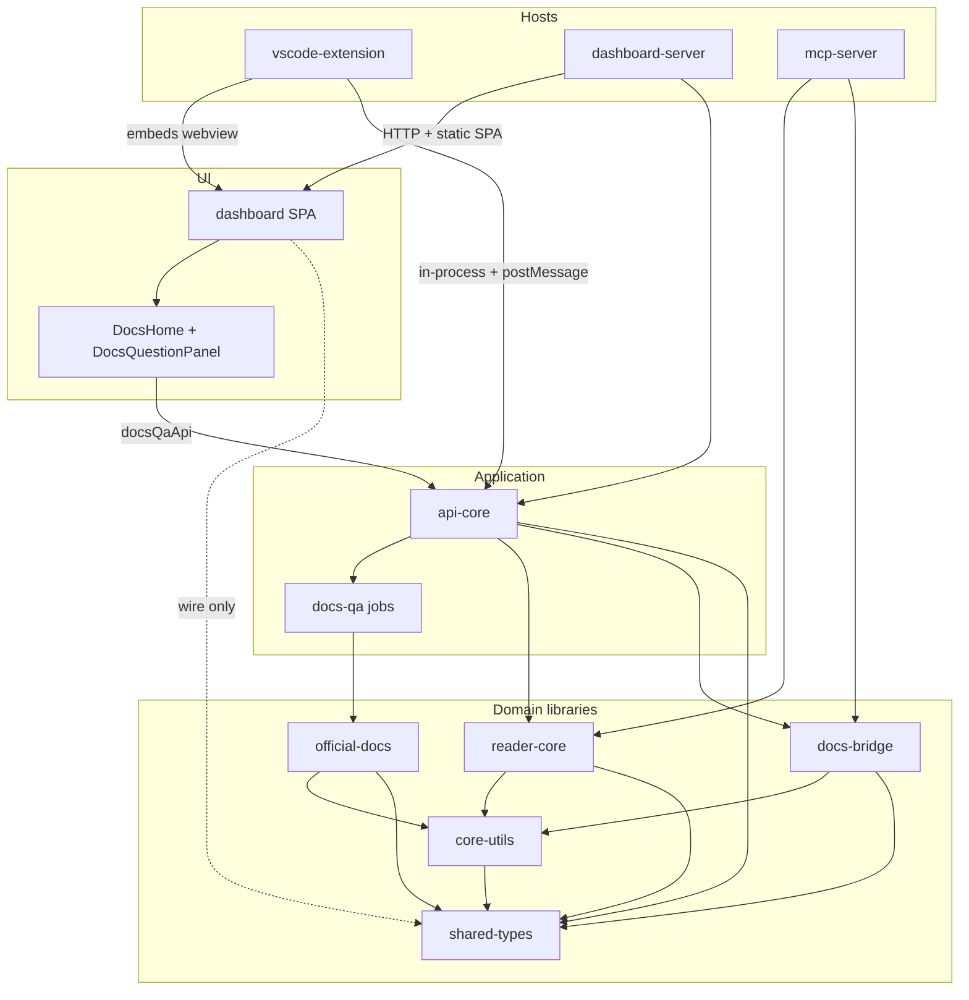
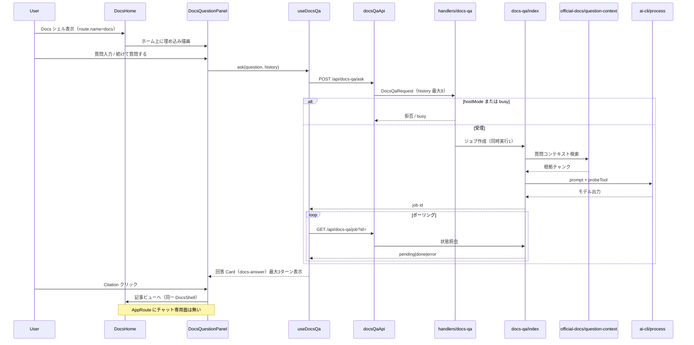

# Architecture — AIDLC Guide

> Reverse-engineering 合成（intent `260923-docs-ask-chat`）  
> Repo: `aidlc-guide` · Full rescan 2026-09-24 · Commit: `1702755bcfa54e25ffa99afcce25d834efad23d9`

## アーキテクチャ概要

AIDLC Guide は bun workspaces の **モジュラーモノリス** である。ワイヤ契約（`shared-types`）、FS 安全境界（`core-utils`）、ドメイン読取（`reader-core` / `docs-bridge` / `official-docs`）、トランスポート非依存アプリ層（`api-core`）、UI（`dashboard`）、ホスト（`vscode-extension` 第一、`dashboard-server` / `mcp-server` 副）に分離する。

支配的スタイルは **modular monolith + multi-host adapters**: 一つの `api-core` を VS Code postMessage、HTTP、（一部）MCP から露出する。クラウド依存はない（local-only）。

### レイヤ規則（観測）

```text
shared-types ← core-utils ← reader-core / docs-bridge / official-docs
                              ↑
                           api-core ← dashboard-server / vscode-extension / mcp-server
                              ↑
                    dashboard（shared-types のみ; reader-core を import しない）
```

- パス containment は `core-utils` の `guardPath` が単一 enforcement point。
- docs コンテンツローダは `api-core` / `official-docs` に置き、`reader-core` や `dashboard` には置かない。
- docs-qa ジョブはプロセス内 `Map`（再起動で消失; 最大 20・完了後 30 分）。

## コンポーネント関係



<!-- Text fallback: Hosts（vscode-extension / dashboard-server / mcp-server）が api-core または reader-core/docs-bridge の上に立つ。Dashboard の DocsHome+DocsQuestionPanel は docsQaApi 経由で api-core の docs-qa ジョブを呼び、ジョブは official-docs の質問コンテキストを使う。dashboard は shared-types のみに依存し reader-core を import しない。 -->

## Interaction Diagrams

ドキュメント質問がコンポーネント横断でどう実装されるか（拡張ホスト in-process 経路を基準）。

### TX-Docs-QA: 「ドキュメントについて質問する」



<!-- Text fallback: ユーザーは Docs ホームに埋め込まれた DocsQuestionPanel で質問する。useDocsQa が docsQaApi 経由で POST /api/docs-qa/ask を送り、api-core が hostMode/busy を検査したうえで in-memory ジョブを作り、official-docs の question-context で根拠を集め ai-cli を起動する。クライアントは GET /api/docs-qa/job で完了を待ち、回答を同一ページのカード列に積む。Citation は同一 DocsShell 内の記事ビューへ移る。チャット専用 AppRoute は存在しない。 -->

### TX-Docs-QA 周辺契約

| 境界 | 機構 | 失敗時 |
|------|------|--------|
| UI → api-core | REST（HTTP）または拡張 postMessage 相当のワイヤ | `hostMode` で ask/job/cancel/evidence 拒否; loopback/JSON/128KB |
| api-core → official-docs | ライブラリ呼び出し（質問コンテキスト） | 空コンテキストでもジョブは完了し得る（プロンプト側で処理） |
| api-core → 外部 CLI | `ai-cli/process`（probeTool） | ジョブ error; cancel 可 |
| ジョブ保持 | プロセス内 Map | 再起動で消失; MAX_JOBS=20 / RETAIN_MS=30m |

## 主要設計判断（観測）

| 判断 | 根拠 | 本 intent への含意 |
|------|------|-------------------|
| Q&A を Docs ホームに埋め込む | `routes.ts` に docs のみ; `DocsPage` が DocsHome+Panel | チャット画面化は主に dashboard ルーティング／レイアウト |
| 会話継続は `history` ワイヤで既に可能 | `useDocsQa` / `validation.ts` / `DocsQaRequest` | バックエンド契約変更は必須ではない |
| 引用と記事ビューが同一シェル状態 | `onCitation` / `returnToAnswer` | 画面分離時に状態引き継ぎ設計が必要 |
| ジョブは揮発メモリ | `docs-qa/index.ts` | 永続チャット履歴は現状スコープ外 |

## 改善の余地（スキャン根拠）

- チャット専用ルート／レイアウトの欠如（意図とのギャップ）。
- UI 履歴上限（完了3・回答6000文字）とサーバ `history` 上限（8）の不一致。
- docs-qa 専用カバレッジ床が未設定（関連テストはある）。
