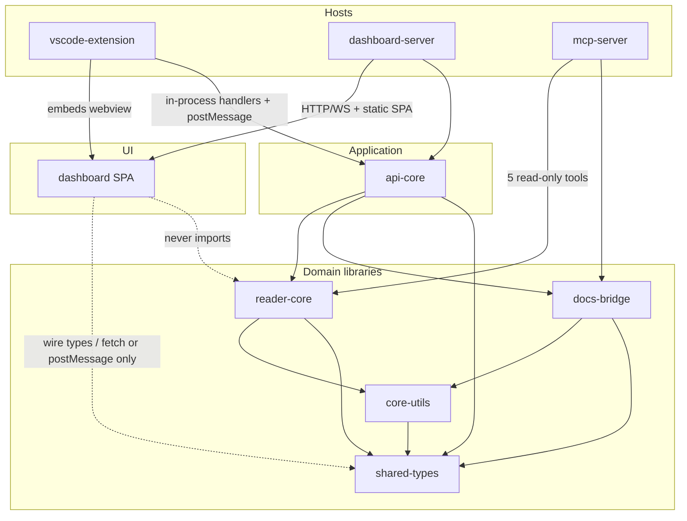
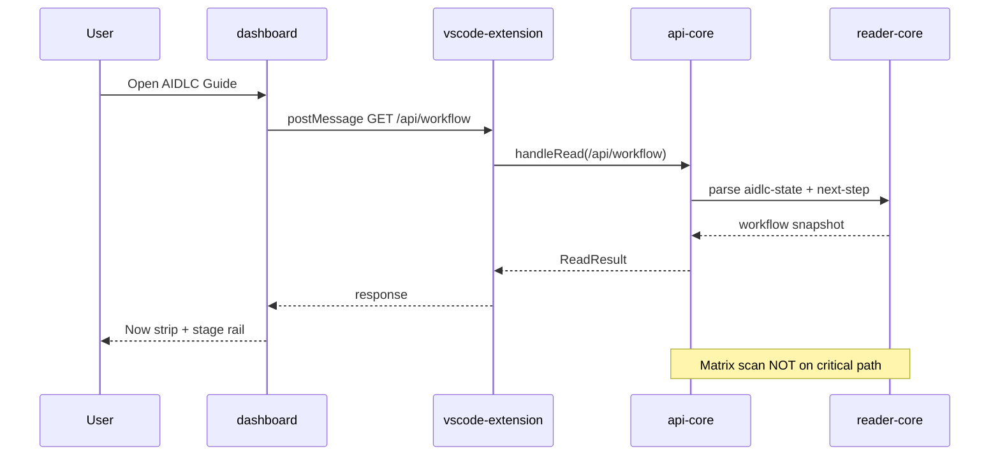
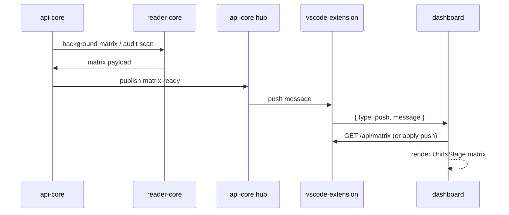
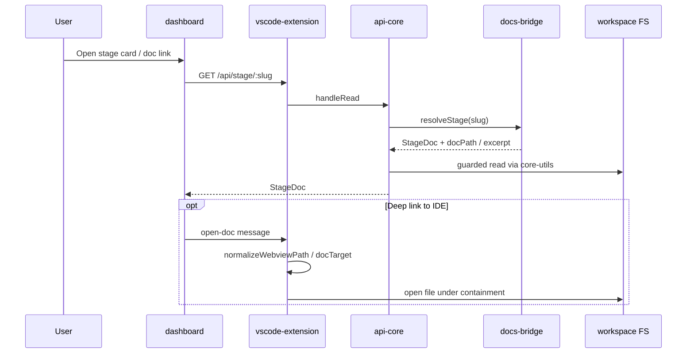
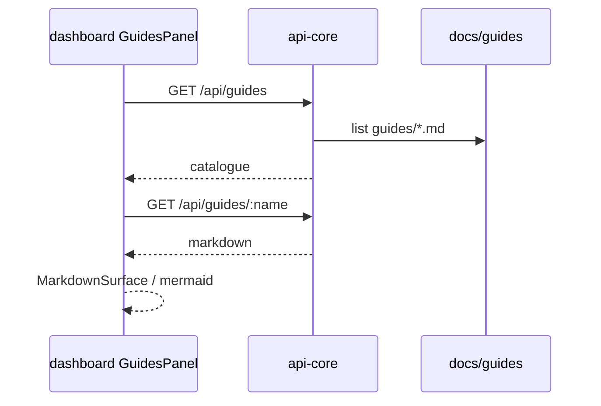
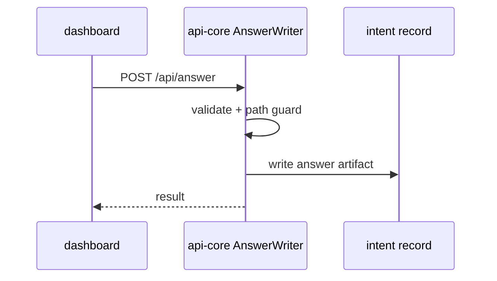
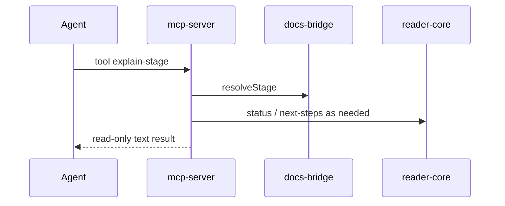

# Architecture — AIDLC Guide

> Reverse-engineering synthesis for intent `260730-docs-i18n`  
> Repo: `aidlc-guide` · Scan HEAD: `7148a19` · Date: 2026-07-31

## Architecture Analysis

### System Overview

AIDLC Guide is a **modular monorepo** (bun workspaces) that separates:

- **Wire contracts** (`shared-types`)
- **FS safety primitives** (`core-utils`)
- **Domain reads** (`reader-core` for intent records; `docs-bridge` for methodology maps)
- **Transport-agnostic application services** (`api-core`)
- **UI** (`dashboard` — wire only; never imports reader-core)
- **Hosts** (`vscode-extension` primary; `dashboard-server` / `mcp-server` secondary)

The dominant style is a **modular monolith with multi-host adapters**: one application core (`api-core`) exposed through VS Code postMessage, HTTP/WS, and (for a subset) MCP tools.

### Architectural Style

| Aspect | Observation |
|--------|-------------|
| Style | Modular monolith + host adapters |
| Deploy units | VSIX (extension + webview assets); optional Bun CLI (`aidlc-dashboard`); MCP stdio process |
| Consistency model | Read snapshots of workspace files; WS push for matrix/audit freshness |
| Cloud | None (local-only) |

Evidence: workspace dependency DAG in `packages/README.md`; dual transport in dashboard services; in-process `api-core` inside the extension host.

## Component Relationships



Text fallback: Hosts (vscode-extension, dashboard-server, mcp-server) sit above api-core or directly above reader-core/docs-bridge. Dashboard talks only over wire (HTTP/WS or VS Code postMessage) and depends on shared-types — not reader-core. api-core is the sole orchestration layer that joins reader-core and docs-bridge for the dashboard surfaces.

### Layering Rules (Enforced)

```text
shared-types ← core-utils ← reader-core ← api-core ← dashboard-server / vscode-extension / mcp-server
                    ↑            ↑            ↑
                docs-bridge ─────┘       dashboard (wire only)
```

- Path containment: single enforcement point `guardPath` in `core-utils`.
- Dashboard must not import reader-core (structural tests + Biome restricted imports).
- Write FS imports restricted; only designated answer-writer paths may write.

## Interaction Diagrams

Business transactions across components (extension-first path unless noted).

### TX-1: First paint — “Where am I?”



### TX-2: Matrix ready (background)



### TX-3: Open stage methodology doc



**Docs-i18n implication:** Today TX-3 resolves into `.claude/aidlc-common/...` (or product `docs/guides/`). After the feature, learner “full document” reading should go to the bundled en/ja site; bridge becomes navigation/excerpt aid with redirect (scope M6).

### TX-4: Product usage guide catalogue



Pattern reuse for official `docs/guide` + `docs/reference` catalogues (new routes or locale-scoped variants — not yet present).

### TX-5: Sole write — answer



Browser and extension hosts share this handler; dashboard GET helpers intentionally omit it from the read client surface in some paths.

### TX-6: MCP explain-stage (secondary host)



## Data Flow

| Data | Source of truth | Readers | Writers |
|------|-----------------|---------|---------|
| Intent state / audit / timings | `aidlc/spaces/.../intents/<record>/` | reader-core → api-core → UI/MCP | AI-DLC engine / hooks (outside Guide app); Guide only `POST /api/answer` |
| Stage/term/agent maps | `docs-bridge` JSON maps | api-core, mcp-server | Maintainers (commit) |
| Product guides | `docs/guides/*.md` | api-core | Maintainers |
| Official guide/reference | **Absent** (target of docs-i18n) | — | Future snapshot + ja PR flow |
| Wire DTOs | `shared-types` | All surfaces | Compile-time |

## Key Design Decisions (Observed)

1. **Extension-first, api-core in-process** — Webview never talks to FS; host mediates.
2. **Staged first paint** — `/api/workflow` light; matrix deferred + WS `matrix-ready`.
3. **docs-bridge as single map owner** — Slug/term → path/excerpt centralized; zero third-party runtime deps.
4. **Dashboard / reader-core firewall** — UI stays transport-portable and cannot bypass guards.
5. **No i18n framework yet** — Locale switching for official docs is greenfield on top of MarkdownSurface + Guides patterns.

## Improvement Opportunities (for docs-i18n)

| Opportunity | Architectural note |
|-------------|-------------------|
| Locale-scoped content root | Decide layout under VSIX vs workspace `docsRepoPath`; avoid colliding with `docs/guides` |
| Retarget bridge `docPath` or redirect | Keep maps for TOC/glossary aid; body of truth → bundled site |
| Package size NFR | Committed webview assets + dual-locale markdown need budget |
| Reuse GuidesPanel / lazy-markdown | Prefer extending catalogue + viewer over new stack |
| API surface | Add locale-aware routes distinct from `/api/guides` to prevent naming collision |
