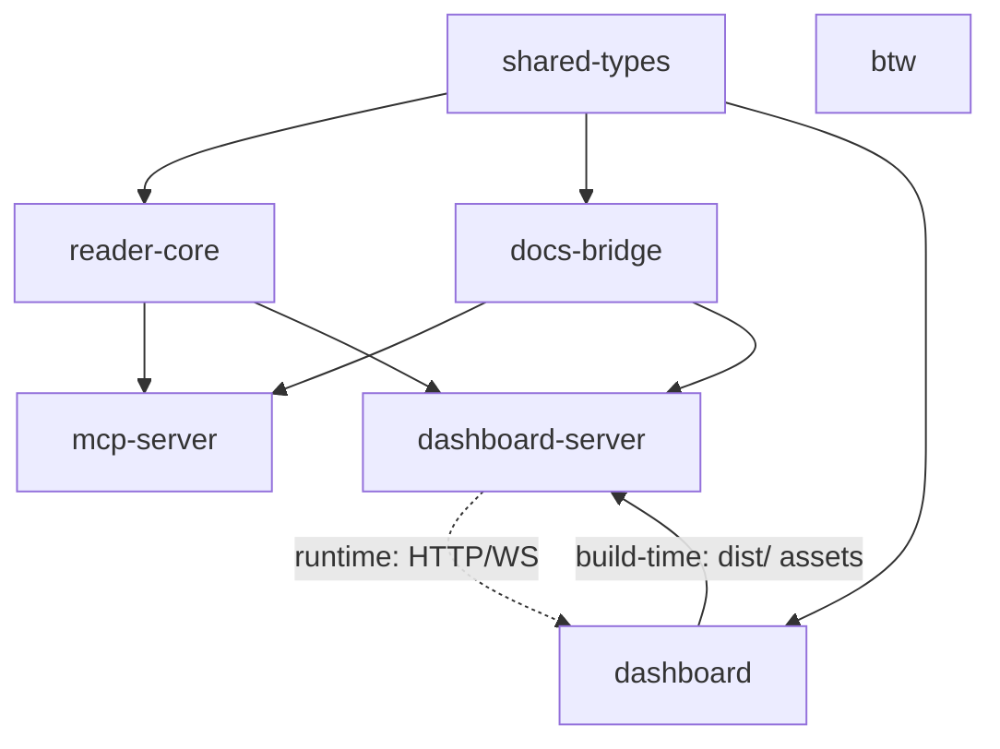

# Component Dependencies — AIDLC Guide

> ステージ: application-design (Inception 2.6) / 作成日: 2026-07-23
> 入力: components.md + services.md + team-practices.md（reader-core 一方向依存）

## 依存マトリクス（行が列に依存: ✓）

| ↓依存元 \ 依存先→ | shared-types | reader-core | docs-bridge | mcp-server | dashboard-server | dashboard | btw |
|-------------------|:---:|:---:|:---:|:---:|:---:|:---:|:---:|
| shared-types | — | | | | | | |
| reader-core | ✓ | — | | | | | |
| docs-bridge | ✓ | | — | | | | |
| mcp-server | ✓ | ✓ | ✓ | — | | | |
| dashboard-server | ✓ | ✓ | ✓ | | — | ✓(静的アセットのみ) | |
| dashboard | ✓ | | | | (HTTP/WS のみ) | — | |
| btw | | | | | | | — |

- **禁止（逆依存）**: reader-core → 上位層（React/MCP SDK/HTTP）。shared-types → 何か。docs-bridge → reader-core。dashboard → reader-core（型は shared-types、データは HTTP/WS）。
- dashboard-server → dashboard はビルド済み静的アセットの配信のみ（コード import なし）。**ビルド時契約**: `bun run dashboard` のルートスクリプトは (1) `packages/dashboard` を `vite build` → 成果物は `packages/dashboard/dist/` に出力、(2) `packages/dashboard-server` を起動し、静的ルートとして `packages/dashboard/dist/` を配信（パス解決は `import.meta.dir` 起点の相対、`path.sep` 決め打ち禁止 — NFR-4）。`dist/` 不在時は server が起動時エラーで「先に build を実行」を案内する（黙って空白ページにしない）。この build→serve の順序はルート package.json のスクリプト1本（`build:dashboard && start:server`）で強制する。
- btw は完全独立（Claude Code CLI のみに依存）。

## Mermaid（依存グラフ）



テキストfallback: shared-types → {reader-core, docs-bridge, dashboard}; {reader-core, docs-bridge} → {mcp-server, dashboard-server}; dashboard —(build時: dist/ 静的アセット提供)→ dashboard-server; dashboard-server —(実行時: HTTP/WS)→ dashboard; btw は独立。build-time エッジと runtime エッジは別物（前者はビルド順序依存、後者はデータ供給）。

## 通信パターン

| 経路 | パターン |
|------|---------|
| reader-core → 各消費者 | 同期ライブラリ呼出（ReadResult 返却）+ watch コールバック（イベント） |
| dashboard-server → ブラウザ | REST（pull・初期）+ WebSocket（push・差分、FR-7.2） |
| mcp-server → Claude Code | JSON-RPC（同期リクエスト/レスポンス） |
| FS → reader-core | chokidar イベント（非同期） |

## データフロー

```
aidlc/ ファイル群 ──(read/watch)──▶ reader-core ──▶ ┬─ mcp-server ──▶ Claude Code（本線/サイド）
                                                    └─ dashboard-server ──REST/WS──▶ dashboard（ドライバー/参加者）
docs リポジトリ ──(read)──▶ docs-bridge ──▶ mcp-server / dashboard-server
dashboard（AnswerEditor）──POST /api/answer──▶ dashboard-server AnswerWriter ──(atomic write)──▶ *-questions.md の [Answer]: 行のみ
```

## 共有リソース

| リソース | 共有者 | 競合対策 |
|---------|--------|---------|
| aidlc/ ワークスペース（FS） | mcp-server / dashboard-server（各自の reader-core 経由） | 全読み取り（競合なし）。唯一の書込は AnswerWriter の atomic write（tmp+rename） |
| docs リポジトリ（FS） | docs-bridge（経由で MCP/DS） | 読み取りのみ |
| slug→docs 対応表 | docs-bridge が単一所有 | 所有1・参照N（FR-5.1） |
| tb-lxp フィクスチャ | テストのみ | read-only・特定コミットにピン（team.md） |
