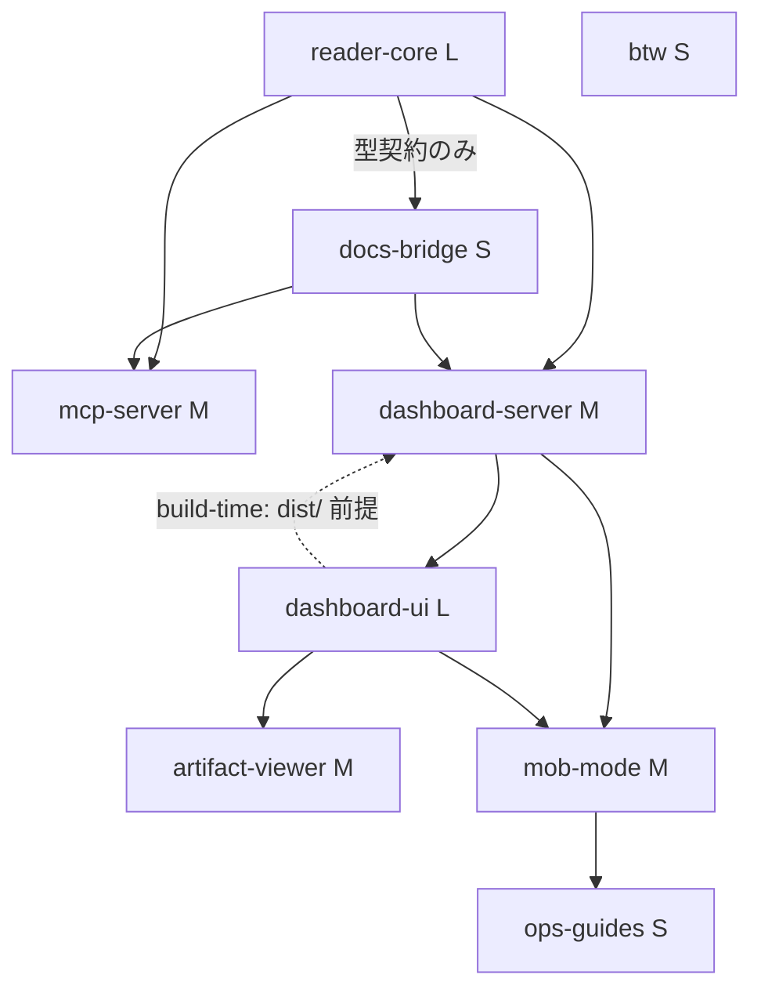

# Unit Dependency DAG — AIDLC Guide

> ステージ: units-generation (Inception 2.7) / 作成日: 2026-07-23
> 入力: unit-of-work.md + application-design/component-dependency.md（パッケージ依存を Unit 粒度に持ち上げ）+ components.md / component-methods.md / services.md / decisions.md + requirements.md + stories.md
> トポロジーのみ（実装順・クリティカルパス選定は 2.8）。DAG は cycle-free。

## 依存 DAG（機械可読・required）

```yaml
units:
  - name: reader-core
    kind: library
    depends_on: []
  - name: docs-bridge
    kind: library
    depends_on: [reader-core]
  - name: btw
    kind: service
    depends_on: []
  - name: mcp-server
    kind: service
    depends_on: [reader-core, docs-bridge]
  - name: dashboard-server
    kind: service
    depends_on: [reader-core, docs-bridge]
  - name: dashboard-ui
    kind: ui
    depends_on: [dashboard-server]
  - name: artifact-viewer
    kind: ui
    depends_on: [dashboard-ui]
  - name: mob-mode
    kind: service
    depends_on: [dashboard-server, dashboard-ui]
  - name: ops-guides
    kind: spec
    depends_on: [mob-mode]
```

## エッジ注記（component-dependency.md からの持ち上げ規則）

- **docs-bridge → reader-core**: component-dependency.md の docs-bridge → shared-types 依存を、Q2（shared-types を reader-core Unit に同梱）適用後の Unit 粒度に持ち上げた実エッジ。ただし依存の実体は**型契約（ReadResult 等）のみ**の狭いインターフェース — reader-core Unit の完成を待たずとも、型定義の凍結時点で docs-bridge の実装は着手可能。2.8 はこの狭さを economic-sequencing の材料にしてよい（トポロジー上のエッジは維持）。
- **dashboard-server ⇄ dashboard-ui の2種エッジ**: component-dependency.md はこの間に**性質の異なる2エッジ**を記録している — (a) **build-time**: dashboard-server の起動は dashboard-ui のビルド成果物 `packages/dashboard/dist/` を前提とする（不在時は起動エラー案内）; (b) **runtime**: dashboard-ui（ブラウザ側）は dashboard-server の REST/WS からデータを得る。上の `depends_on` yaml には **(b) runtime の設計依存のみ**を載せている。(a) を通常の `depends_on` として併記すると2ノード循環に見えてしまうため、build-time エッジは本注記と下の Mermaid 破線で明示する（yaml スキーマ外の運搬。2.8 は「dashboard-server を動かして検証するには dashboard-ui がビルド可能であること」を Bolt 順の制約として読むこと）。

## Mermaid（プロースミラー）



テキストfallback: reader-core → {mcp-server, dashboard-server, docs-bridge(型契約のみ)}; docs-bridge → {mcp-server, dashboard-server}; dashboard-server → dashboard-ui → artifact-viewer; dashboard-ui —(build-time: dist/ 前提・破線)→ dashboard-server; {dashboard-server, dashboard-ui} → mob-mode → ops-guides; btw は独立。

## 統合ポイント（Unit 間契約）

| 契約 | 提供 → 消費 | 形式 |
|------|-----------|------|
| ReadResult 型 + Reader API | reader-core → mcp-server / dashboard-server | ライブラリ呼出（component-methods.md） |
| StageDoc / TermDoc | docs-bridge → mcp-server / dashboard-server | ライブラリ呼出 |
| REST + WS 契約（/api/workflow, /api/matrix, matrix-ready, change） | dashboard-server → dashboard-ui / artifact-viewer / mob-mode | HTTP/WebSocket（component-methods.md の表が契約） |
| POST /api/answer（唯一の書込） | dashboard-server → artifact-viewer（AnswerEditor） | HTTP（403 セマンティクスは mob-mode が拡張） |
| --host 動作モード | dashboard-server → mob-mode | 起動フラグ + 参加者配信（ADR-04） |
| 警告文言・運用制約 | mob-mode → ops-guides | 文書参照（ADR-04 受け皿） |

## 並行開発の機会（依存の無い集合）

- **{reader-core, btw}** — 相互依存なし。同時着手可能。
- **docs-bridge** — reader-core Unit に型契約のみで依存（上のエッジ注記）。型定義の凍結後は reader-core 本体と並行可能（完全並行でなく「型契約後並行」）。
- **{mcp-server, dashboard-server}** — 両者とも {reader-core, docs-bridge} 完了後、相互には独立。
- **{artifact-viewer, mob-mode}** — 両者とも dashboard-ui 完了後、相互には独立（mob-mode は dashboard-server にも依存だが、その時点で満たされている）。
- btw は任意時点で並行可能。

複数の有効なトポロジカル順序が存在する。どの順で作るか（骨格・価値・リスクの経済判断）は delivery-planning が本 DAG を入力に決定する。
