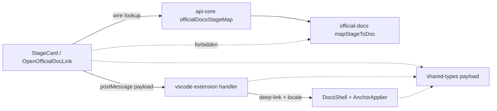

# Component Dependency — Docs i18n Bolt 3

> ステージ: application-design / 2026-08-02  
> 上流: [components.md](./components.md) · codekb [architecture.md](../../../codekb/aidlc-guide/architecture.md)

## Dependency graph (Bolt 3 delta)

## Allowed edges

| From | To | Why |
|------|-----|-----|
| api-core | official-docs | Existing domain ownership |
| dashboard | shared-types | Wire types only |
| vscode-extension | shared-types / api-core | Host adapters |
| dashboard | api-core（wire） | stage-map lookup |

## Forbidden edges

| From | To | Why | Enforcement |
|------|-----|-----|-------------|
| dashboard | official-docs | layering / Q1=A | **Already enforced:** `packages/dashboard/tests/dependency-direction.test.ts` lists `@aidlc-guide/official-docs` in `FORBIDDEN_IMPORTS` (with reader-core / docs-bridge). Failures turn `bun run check` red. |
| StageCard | bridge `doc.deepLink` as official map | Wrong map source | Construction / US-B3-05 behavioral spies + code review |

## Build order hint（non-normative）

> Not a units-generation DAG edge. Economic sequencing belongs to **Delivery Planning 2.8**. The list below is an informal construction hint only.

1. shared-types payload（if missing）  
2. official-docs map regression（already green）  
3. vscode-extension handler + locale preference  
4. dashboard OpenOfficialDocLink + deep-link locale field  
5. check matrix C1–C7 + demo-record

## Review note

**Reviewer:** aidlc-architecture-reviewer-agent · **Date:** 2026-08-02  
**Finding F2 (BLOCKER):** Forbidden edge `dashboard → official-docs` has no named enforcement mechanism. The existing `dashboard ✗ reader-core` ban is enforced via Biome restricted imports + structural tests (architecture.md). Add an "Enforcement" column to the Forbidden edges table: either reference the existing Biome rule that already covers `@aidlc-guide/official-docs`, or specify that Bolt 3 must add one. If a new structural test is required, add it to US-B3-06 check matrix as C8.
