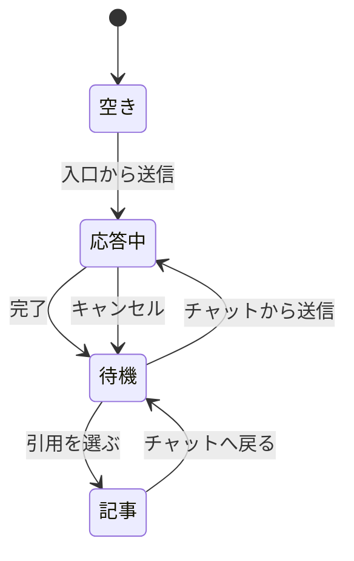
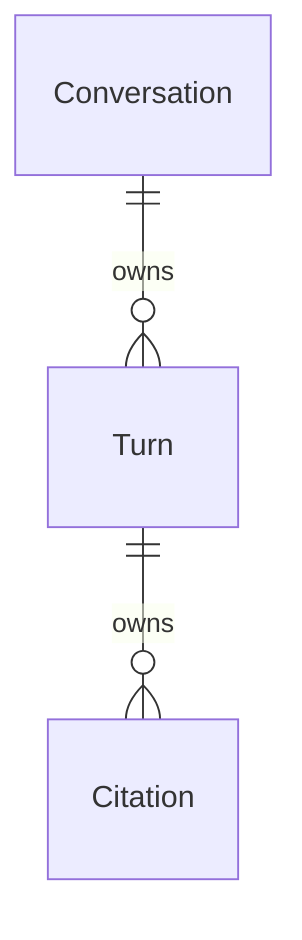

# 機能仕様

塊 `docs-ask-chat` の振る舞いである。データ形は `entities.md`、判断は `rules.md` が源である。ここは手順と状態の源である。

## ワークフロー

### 入口からチャットへ

1. 保存済みの会話が無いとき、ホームに入口だけを出す（BR1.1）。
2. 2000 字以内なら送り、チャットへ移る。ホームに回答は積まない（BR1.2）。
3. 2000 字を超えるなら送らない（BR1.3）。
4. ホストモードなら拒否し、チャットへ移らない（BR1.4）。

### チャットで続きを聞く

1. 完了したターンのあと、次を送れる（BR2.1）。
2. 送る内容の履歴は、完了ターンの直近 8 件。回答は切らない（BR2.2）。
3. 続きも 2000 字まで（BR2.3）。
4. 応答が終わるまで次は送れない。待ち行列は無い（BR2.4）。
5. キャンセルはいまの操作で止める（BR2.5）。
6. 進行中に送ってもジョブは切り替わらず、2 件目は拒否する（BR2.6、BR2.7）。
7. ホストモードでは送信、取得、キャンセル、根拠の取得を拒否する（BR2.8）。

### 閉じたあとも残る

1. 会話はホストのローカル保存へ書く。ワークスペースのファイルにもクラウドにも書かない（BR3.3）。
2. 次に開いたとき、チャットを開き、一覧のターンが残る。スクロール分も含む（BR3.1）。
3. 8 件を超えても古いターンは一覧から消えない（BR3.2）。渡す履歴だけが 8 件である（BR2.2）。

### 引用から戻る

1. 引用を選ぶと記事へ移る。分割表示はしない（BR4.1）。
2. 記事からチャットへ戻れる（BR4.2）。
3. 戻ったとき、会話と書きかけが残る（BR4.3）。

## 状態

会話のライフサイクルは次のとおり。

- 空き: ターンが無く、ホームが入口になる。
- 応答中: 質問が 1 件進んでいる。次は送れない。キャンセルできる。
- 待機: 完了ターンがあり、次を送れる。
- 記事: チャットの代わりに記事を見ている。戻ると待機に戻り、書きかけは残る。

## 関係

`entities.md` から導いた図である。源はそちらの YAML である。

## ルール要約

`rules.md` から導いた一覧である。源はそちらの YAML である。

| ID | 規則 |
| --- | --- |
| BR1.1 | ホームは入口だけ |
| BR1.2 | 送信でチャットへ移る |
| BR1.3 | 入口は 2000 字まで |
| BR1.4 | ホストモードは入口を拒否 |
| BR2.1 | 完了後に続きを送れる |
| BR2.2 | 渡す履歴は直近 8 件 |
| BR2.3 | 続きも 2000 字まで |
| BR2.4 | 応答中は送れない |
| BR2.5 | キャンセルで止める |
| BR2.6 | 進行中のジョブは切り替わらない |
| BR2.7 | 同時に 1 件 |
| BR2.8 | ホストモードはチャット操作を拒否 |
| BR3.1 | 閉じても一覧が残る |
| BR3.2 | 一覧は 8 件で切らない |
| BR3.3 | ホストのローカル保存 |
| BR4.1 | 引用は記事へ。分割しない |
| BR4.2 | チャットへ戻れる |
| BR4.3 | 会話と書きかけが残る |
