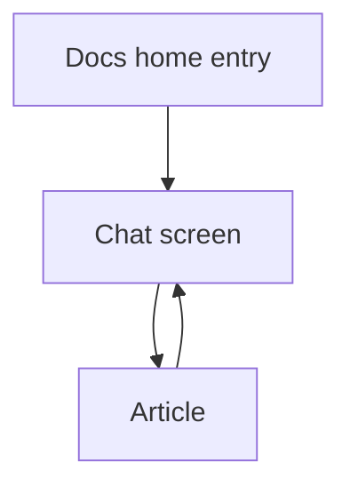

# 要件 — ドキュメント質問のチャット画面

## 意図

利用者が求めているのは、回答カードを並べる表示をやめることである。ドキュメントの AI に質問したらチャット画面へ移り、その画面で繰り返し質問できることである。初期依頼は次の一文である。

> ドキュメントのAIに質問機能について現在のような回答の表示ではなく質問をしたらチャット形式の画面に遷移してそこで繰り返し質問ができるようにしたいです。

繰り返し質問の仕組み自体は既にある。完了したターンを履歴として質問 API に送っている。足りないのは、そのやり取りをホームのカード列ではなく、遷移したチャット画面で続けることである。根拠は `business-overview.md`。

成功したとみなすのは、次の三つが同時に成り立つときである。ホームに回答カードが出ない。送信後にチャット画面へ移る。その画面で、前のやり取りを踏まえて次の質問ができる。

## 機能要件

### 入口

- **FR1** ドキュメントのホームは、質問を始める入口だけを持つ。
- **FR1.1** ホームに回答カードを出さない。
- **FR1.2** 入口から質問を送信すると、チャット画面へ遷移する。遷移前のホームに回答を積み上げない。

### チャット

- **FR2** チャット画面で、同じ会話の続きとして繰り返し質問できる。
- **FR2.1** 応答が完了するまで、次の質問は送信できない。
- **FR2.2** 進行中の応答は、いまと同じキャンセル操作で止められる。待ち行列は置かない。新しい質問で進行中の応答を自動的に切り替えない。

### 会話の残り方

- **FR3** アプリを閉じたあと、次に開いたとき、同じ会話が残っている。
- **FR3.1** 残るのは、画面に見えていたターン一式である。モデルへ渡す件数で表示を切り詰めない。
- **FR3.2** 引用から記事へ移り、チャットへ戻ったとき、会話と書きかけの文が残っている。

### 次の質問へ渡す履歴

- **FR4** 次の質問で画面とサーバが受け渡す履歴は、直近 8 件の完了ターンである。
- **FR4.1** 各回答に文字数の上限を付けない。画面側が回答を 6000 字で切って送ることはしない。
- **FR4.2** 画面に残る会話が 8 件を超えても、表示上の古いターンは消さない。渡す履歴だけを直近 8 件にする。

### 根拠の記事

- **FR5** 回答中の引用を選ぶと、記事の画面へ移る。
- **FR5.1** 記事からチャットへ戻れる。
- **FR5.2** 戻ったとき、FR3.2 のとおり会話と書きかけの文が残る。チャットを残したまま記事を隣に開く分割表示はしない。引用本文をチャット内だけに閉じることもしない。

### 入力

- **FR6** チャットの質問入力は 2000 字までである。
- **FR6.1** 2000 字を超える質問は、チャット画面から送信できない。

## 非機能要件

- **NFR1** チャット画面化の UI テストと契約テストは `bun run check` に含める。それらを欠いた変更は通さない。テストは、先に失敗するテストを書いてから実装する。
- **NFR2** docs-qa の分岐カバレッジは 70% 以上とする。既存の分岐 95% の下限は、その対象パスのまま残す。ワークスペース全体の行カバレッジ 80% も維持する。
- **NFR3** 会話の保存は、このマシンのローカルに閉じる。クラウドへ送って永続化しない。
- **NFR4** 同時に処理する質問は 1 件のままである。
- **NFR5** ホストモードでは、いまと同じく質問の送信・取得・キャンセル・根拠の取得を拒否する。

## 制約

- 出荷ランタイムは bun のみである。クラウド配備、アカウント管理、データベースの新設はしない。
- `dashboard` は `reader-core` を import しない。
- 質問の成否は `DocsQaResult<T>`（または同等の明示的な失敗表現）で表す。並行する別の結果型を増やさない。
- 質問の処理は、既存の ask / job / cancel / evidence の経路と、`api-core` のハンドラ分割、`ai-cli` の隔離、dashboard の `features/docs` 配置を踏襲する。
- 公式ドキュメントの locale は `en` / `ja`、API は `/api/official-docs/:locale/*` のままである。
- 同梱ドキュメントの読取は `guardPath` を通す。
- 配置は `team-practices.md` のローカル専用に従う。Walking Skeleton のセレモニーはしない。

## 前提

- 「同じ会話」は、このインストール上のドキュメント質問について一つの継続したスレッドである。記事ごと、locale ごとに別会話へ分ける指定はなかった。
- 保存の具体的な置き場（画面側の保存か、サーバ側のファイルか）は後の設計で決める。製品としての条件は FR3 の観測結果である。
- 回答モデルは、いまと同じくローカルの CLI である。クラウドの LLM は使わない。
- 質問文の 2000 字はチャット画面の入力上限である。サーバがより長い文を受けられることは、この画面の上限を上げる理由にしない。
- `intent-statement.md` と `scope-document.md` は、このワークフローでは作られていない。初期依頼の本文は project-description の description をそのまま使う。

## 対象外

- ホームに回答カード列を残すこと。
- 応答中に次の質問を待ち行列へ入れること。進行中の応答を新しい質問で自動的に打ち切ること。
- チャットを表示したまま記事を並べる分割表示。
- 引用の本文をチャットの中だけに閉じ、記事画面へ行かないこと。
- 質問文の上限を 4000 字へ広げること。
- 回答に新しい文字数上限を設けること。
- 会話を別のマシンやクラウドへ同期すること。

## 未決事項

機構の選択だけが残る。再起動後も会話が残ることを満たす保存の置き場は、後の設計で決める。成否は FR3 で判定する。

## 出典

- `business-overview.md` — 現状はホーム埋め込みのカード列であり、専用チャット画面へ遷移しない。
- `architecture.md` — 質問ジョブはプロセス内のメモリであり、再起動で消える。FR3 はこの性質を変える。
- `code-structure.md` — 画面は `DocsQuestionPanel`、契約は `docs-qa.ts`、検証の履歴上限はサーバ側 8 件。
- `team-practices.md` — テスト順、カバレッジ、必須テスト、ローカル専用。
- `intent-statement.md` と `scope-document.md` は成果物なし。

## 流れ

ホームの入口から質問を送るとチャット画面へ移る。引用を選ぶと記事へ移り、チャットへ戻る。戻ったとき会話と書きかけの文は残る。アプリを閉じても、次に開いたとき同じ会話が残る。

