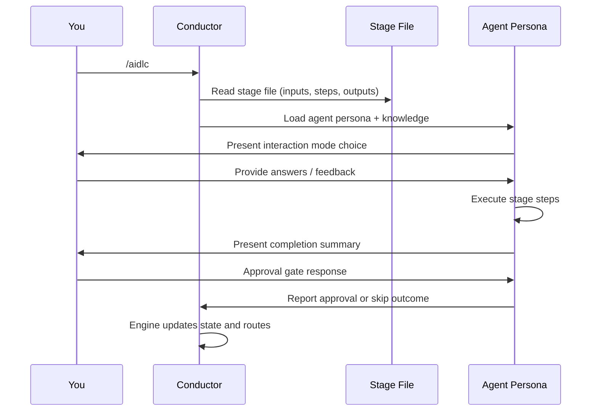
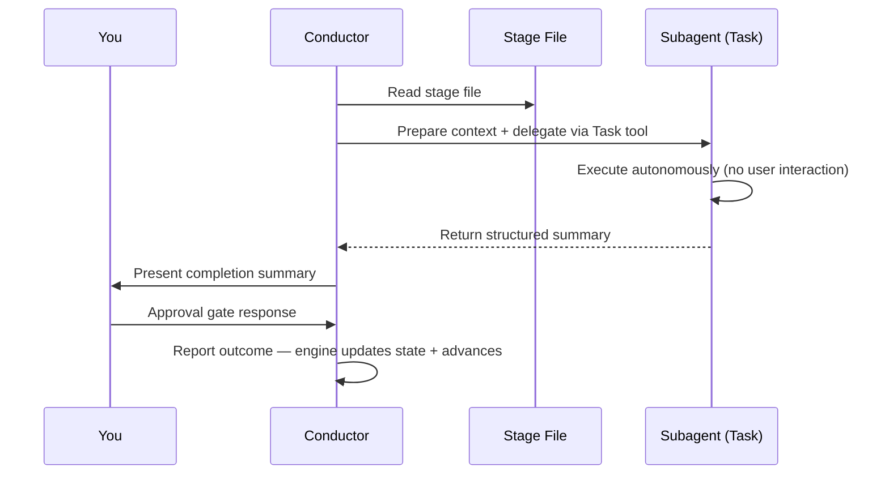

# Your First Workflow

This chapter walks through a complete AI-DLC workflow run, explaining what you see at each step and what decisions you make. The example uses a `feature`-scoped workflow to build a REST API. For a customer-oriented comparison of Classic, Express, Feature, and the other choices, see [Workflow Profiles](workflow-profiles.md).

> **Note**: The transcripts in this chapter show **Claude Code**. On Kiro CLI,
> Kiro IDE, Codex CLI, and opencode the workflow - stages, agents, gates,
> artifacts - is identical, but the Claude-only welcome banner and custom
> AI-DLC statusline do not appear. Use `/aidlc --status` on Kiro and opencode;
> Codex uses `$aidlc --status` and its built-in `update_plan` progress display.
> Your harness's chapter under
> [Running on other harnesses](harnesses/README.md) lists every difference.

---

## Starting the Workflow

```
/aidlc Build a REST API for inventory management
```

At session start, Claude Code renders the AI-DLC welcome message via the `companyAnnouncements` entry in `settings.json`. It explains how AI-DLC works, and shows the stage map and scope options. (`companyAnnouncements` is a Claude Code setting with no equivalent on the other harnesses - there, no banner appears and the workflow begins directly with the initialization below.)

```
# Welcome to AI-DLC

**AI-DLC** (AI-Driven Development Life Cycle) is an adaptive methodology that
structures AI-assisted software development into repeatable, traceable phases
while keeping you in control at every decision point.

## How It Works

- **You decide, AI executes.** Every material decision goes through an approval gate.
- **Adaptive scope.** Choose a scope or let AI auto-detect from your intent.
- **Traceable artifacts.** Every stage produces versioned documents in the intent's record dir.
- **11 domain experts.** Specialized agent personas guide each stage.
```

### Starting from an existing document

There is no mandatory location for an existing vision document, PRD, or brief.
For a direct text or Markdown read, name the file in your initial request, for
example `/aidlc Read ./vision.md and build what it describes`. Relative paths
resolve from the project root. When nothing is at that path, the workflow looks
for project files with that name: with one match it reads it and tells you which
file (at the latest when it asks you to approve the stage), with several it offers a numbered pick, and with none it asks for the
path. It finds only document files (Markdown, text, PDF, Word, and similar),
outside hidden folders such as `.docker` or `.aws` and outside any nested
repository. It never lists git-ignored files, symlinks, or files that look like
secrets (`.env`, `*.pem`, `*.key`, `id_*`, or a name with
"secret", "credential", "password", or "token" in it), and never reads outside
the project. When it cannot list every file, it chooses none and asks for the
path.

You can also paste document content directly into the request. Wrap it in
`<document>` and `</document>` so the workflow can tell your directions from
document data. Your directions can come before the block, after it, or both:

```text
/aidlc Build the product described below.
<document>
...vision document content...
</document>
Keep the first release read-only.
```

The delimited content is untrusted data, not instructions. Everything from the
first `<document>` to the last `</document>` is the document, so a
`</document>` inside your pasted text cannot turn the rest of it into
instructions. A `<document>` with no closing marker makes the rest of the
message the document, and a `</document>` with no opening marker makes
everything before it the document. The workflow says in one line how it split
your message. Multiline input is stored as one JSON string in committed
`<record>/project-description.json`, outside the line-oriented state file; its
`Project` field remains a safe single-line preview of your directions outside
the document, so Markdown lines resembling workflow fields cannot alter the
selected scope or lifecycle state. A message that is only a document, with no
words outside it, is taken as "Build what the pasted document describes.", and
the plan question that follows says so.

A PDF or Word file works the same way: name it, for example
`/aidlc Build what ./brief.pdf describes`. The workflow copies it into
`aidlc/spaces/<space>/knowledge/documents/`, adds it to the
[knowledge base](08-knowledge.md), tells you in one line where it copied it and
its document id (at the latest when it asks you to approve the stage), and
reads its text. You never run a command or type the id, and it never replaces a
file already in that folder. When the file is git-ignored (or git cannot
say), it asks first whether you want it copied anyway, because the copy would be committed. When no
text can be read (no extractor for that kind of file, or a scanned document),
it says why and asks you for a text or Markdown version. Text over 200,000
characters is not read directly; the workflow asks you for a supported file.
Document paths, filenames, and content are always treated as untrusted data,
never as instructions.

[Writing a Vision Document](writing-inputs/vision-document-guide.md) covers
what to put in one, and
[Writing a Technical Environment Document](writing-inputs/technical-environment-guide.md)
covers the stack and its rules, which go in your space's team knowledge
rather than the request.

---

## Initialization Phase (Automatic)

The three initialization stages run deterministically inside `aidlc-utility intent-create`, a single tool call that completes in well under a second. You do not interact with initialization; it auto-creates the first intent into the active space and bootstraps its record dir for the workflow.

### Stage 0.1: Workspace Scaffold

The framework creates the first intent and its record dir at `aidlc/spaces/<space>/intents/<YYMMDD>-<label>/` (the `<space>` is `default` unless you use a named space). It creates one folder per phase your scope actually runs, so the record shows the plan rather than every phase that exists. A `feature` scope runs all five; a `bugfix` scope skips Ideation but retains its deployment stages, so `ideation/` is absent while `operation/` appears:

```
Intent created, record dir at aidlc/spaces/default/intents/<YYMMDD>-<label>/
  initialization/
  inception/
  construction/
  operation/
  verification/
Space-level dirs ensured:
  aidlc/spaces/default/knowledge/    (team knowledge, empty; you add files)
```

Per-stage folders are not created up front. A stage's folder (for example
`inception/requirements-analysis/`) appears the first time that stage writes an
artifact, so the record only ever lists work that produced something.

### Stage 0.2: Workspace Detection

A deterministic rule-based scanner walks one level deep into the project plus known source directories (`src/`, `app/`, `lib/`, `pages/`, `components/`, `tests/`). It classifies greenfield vs brownfield based on source files, framework configs, and package manifests. When no top-level signal fires, it also descends one level into each arbitrarily-named subdirectory, so a project whose source lives in a container folder (e.g. `wordbook/`, `backend/`) is still detected as brownfield. AI-DLC's own files, such as the harness directory, `aidlc/`, and Cursor's root `install.ts`, never count as your code, so an empty folder stays greenfield.

Your word wins over the scan. Start with `/aidlc --project-type brownfield "<what to build>"` (or `greenfield`) to say which it is, or say it in plain words at any point ("this is existing code, the frontend is in ui-repo"). AI-DLC scans the folder again, records the type as yours, and for existing code runs Reverse Engineering, then returns to the stage you were on; finished stages stay finished, and the reply names any that were done before the code was known so you can redo one. If the work started as a new project in an empty folder and the folder gains code before Construction, AI-DLC asks you once which it is. The choice holds for that piece of work only; the next piece of work scans the folder again.

### Stage 0.3: State Initialization

The orchestrator writes the intent's `aidlc-state.md` (under its record dir) with the full stage plan based on your scope, depth, test strategy, and the scanner's classification. It also analyzes your input and confirms a scope:

```
─── Scope Detection ───────────────────────────────────────────────────────────
Detected scope: feature (Standard depth, Standard test strategy, all 33 stages)
▸ Approve scope? [Yes / Change scope / Change depth / Change test strategy]
> Yes
```

You can accept the detected scope, change to a different scope (e.g., `mvp`), or adjust the depth level or test strategy. See [Scopes, Depth, and Test Strategy](05-scopes-and-depth.md) for guidance.

---

## Ideation Phase (Interactive)

After Initialization, the workflow enters Ideation. Each stage from here on runs interactively with an approval gate.

### Stage 1.1: Intent Capture (aidlc-product-agent)

On Claude Code, the custom AI-DLC status line at the bottom of your terminal updates (Kiro and opencode use `/aidlc --status`; Codex uses `$aidlc --status` and its built-in `update_plan` progress display):

```
[AIDLC] IDEATION > Intent Capture [▓▓▓▓▓░░░░░] 4/7 -- product
```

This shows: current phase, stage display name, phase progress bar, phase progress ratio, and lead agent. The bar and the ratio share the same scope — both count `[x]` stages within the current phase, so the bar advances every time the ratio does. Remaining context (`ctx:N%`) is always shown on the right, color-coded as it drops. On Claude Code, `↑<in> ↓<out> $<usd>` also appears after the first usage fold and covers only the active workflow and current transcript/session, not earlier workspace activity. Set `AIDLC_DISABLE_USAGE_TRACKING=1` to turn usage tracking (and this segment) off.

> The `$<usd>` is a local estimate priced from public list prices, not a bill — when Amazon Bedrock is your recorded provider it may not match what you are actually charged. See [Troubleshooting](15-troubleshooting.md#statusline-shows-a-cost-segment-you-dont-want-or-usage-tracking-concerns) to price it at your own rates or hide it.

The aidlc-product-agent asks you to choose an interaction mode:

```
▸ Choose interaction mode:
  (1) Guide Me — agent asks structured questions
  (2) Edit File — write directly to the artifact
  (3) Chat — freeform discussion
```

- **Guide Me** walks you through questions one at a time
- **Edit File** opens the artifact for direct editing
- **Chat** lets you discuss freely; the agent extracts decisions

See [Interaction Modes](07-interaction-modes.md) for details on each mode. You can switch modes mid-stage. You choose once: later stages reuse your choice and say so in one line, and you change it by saying so.

### Approval Gate

After the agent completes its work, you see a completion summary and an approval gate:

```
# Intent Capture & Framing Complete

| Artifact | Contents |
|----------|----------|
| intent-statement.md | Problem statement, target users, success criteria |
| intent-capture-questions.md | 5 questions, all answered |

**Stage:** Intent Capture & Framing
**Review outcome:** One concern remains for your decision.
**Why now:** First review completed.

| ID | Severity | Where | Status |
|---|---|---|---|
| R-01 | Minor | intent-statement.md > Success Criteria | New |

> R-01 Finding: The adoption target has no deadline

> R-01 Required action: Add the date by which the adoption target should be reached

**Decision options:**
- **Approve** - continue with the open findings accepted.
- **Request Changes** - return to the listed artifacts so the required actions can be addressed.

**Review:** `<record>/ideation/intent-capture/` (the intent's record dir)

▸ How would you like to proceed?
  (1) Approve — Continue to Market Research with open findings accepted
  (2) Request Changes — Return to the listed artifacts
```

The engine owns the stable finding list. Later checks report only what changed,
while your decisions remain exactly as you made them. Choose **Approve** to
continue with every open finding accepted, or **Request Changes** to return to
the listed artifacts. When rejecting an open finding as inapplicable, give its
ID and reason. If a reviewer marks one fixed and you disagree, request changes
with that ID and explain why it is not fixed; the engine reopens it for the
next check. Ordinary revision feedback changes no finding decision. After a
backward jump, Keep and Modify retain this list and its decisions. Redo from
scratch starts a fresh list at `R-01`. Upgrading mid-workflow keeps earlier
decisions by ID. See [Interaction Modes](07-interaction-modes.md) for details
on the revision process.

After approval, a progress line appears:

```
Progress: 1/30 in-scope stages complete (4/33 overall) | 1/7 IDEATION. Next: Market Research
```

### Remaining Ideation Stages

The workflow continues through Market Research, Feasibility & Constraints, Scope Definition, Team Formation, Rough Mockups, and Approval & Handoff. Each follows the same pattern: agent works, you review, you approve.

Some stages are **conditional** — they may be skipped based on your scope. When a stage is skipped, the orchestrator shows why and advances automatically.

---

## Inception Phase

Inception elaborates requirements and designs the solution. Stage 2.1 (Reverse Engineering) is notable because it runs as a **pipeline** (a 2-link chain) — the conductor delegates to the aidlc-developer-agent for a code scan, then the aidlc-architect-agent for synthesis and the artifact writes. This stage runs only for **brownfield** projects (existing codebases).

```
─── Stage 2.1: Reverse Engineering (pipeline) ─────────────────────────────
Delegating to aidlc-developer-agent for code scan...
[Running in background — no interaction needed]
...
Developer scan complete. Delegating to aidlc-architect-agent for synthesis...
...
✓ 9 reverse engineering artifacts produced
```

Remaining Inception stages (Requirements Analysis through Delivery Planning) run inline with you.

---

## Construction Phase

For a new solo workflow that includes Unit decomposition and a source-producing
Construction stage, the default is **unit-major, serial execution with verified
Unit checkpoints**. One Unit goes through its applicable design stages and Code
Generation before the next begins. A [Bolt](glossary.md) remains the delivery
slice planned in 2.9; runtime order follows `unit-of-work-dependency.md` rather
than the grouping in `bolt-plan.md`.

During Delivery Planning, the conductor proposes a real project check, such as
`bun test`, `pytest`, or `make check`, and asks **Use this command to verify each
completed Unit?** with the actual command and **Approve** / **Request Changes**.
Your approval is recorded before the intent's `Construction Verification Command`
is set. That same command is reused at every Unit/batch checkpoint; changing it
requires another recorded human approval. If a greenfield project has no runnable
check yet, you may defer selection; the first checkpoint asks before running any
verification. The conductor never invents or auto-approves a command.

With skeleton-on, the first DAG Unit is the smallest working integrated slice.
It completes its design and code, including your Plan Approval and required
summary confirmations. The recorded, human-authorized project check then
demonstrates the slice end to end, and the approval question shows **Verified
with `<verification_command>` (exit 0)** before you approve the skeleton and
later Units start. Reviewing only the first design stage does not demonstrate a
working skeleton.

If no autonomy choice is already recorded, the workflow then asks:

```
How should I continue building the remaining work?
  ▸ Continue automatically
  ▸ Review each checkpoint
```

Skeleton-off offers this choice at Construction entry instead. Your answer is
recorded as `Construction Autonomy Mode` and respected on resume; explicit
on-demand requests can change it later. **Continue automatically** skips routine
completion questions, while Plan Approval, enabled summary confirmation,
verification command selection, and failures still require your attention.
Summary confirmation applies only when
`directive.ceremony.summary_confirmation === "on"`. **Review each checkpoint**
waits for your approval at each completed Unit.

Execution is a separate choice. Unit-major stays serial. If you explicitly choose
stage-major and swarm execution, eligible Code Generation Units may run in
parallel, with guided or automatic batch checkpoints. An inline Unit already
approved at its checkpoint is not rebuilt in a later swarm batch.
Before preparing that batch, explicitly commit the approved application source,
including the inline skeleton's source; the conductor does not commit it
implicitly. The tool checks the whole batch before creating children and names
the commit-and-retry step if the source is not yet reproducible.

Existing workflows without the checkpoint setting keep their legacy first-stage
review and stage-gate behavior. Design-only workflows and flows without Units
keep their existing stage approvals; team-owned Units keep their own gate rhythm.
Preserve any explicit iteration choice. After all applicable Unit work, Build and
Test and CI Pipeline run once across the solution.

---

## Operation Phase

Operation deploys and monitors the solution. All 7 stages are conditional — smaller scopes like `mvp` and `poc` may skip this entire phase.

After the final stage (4.7 Feedback & Optimization), the workflow is complete.

---

## How Execution Modes Work

Throughout the workflow, you encounter two execution modes:

### Inline Execution

Most stages run inline. The conductor loads the agent persona and executes stage steps directly in your conversation. You interact with the agent in real time.



<!-- Text fallback: You invoke /aidlc. The conductor reads the stage file and loads the agent persona with knowledge. The agent presents an interaction mode, you provide input, the agent executes steps and presents a completion summary. You respond at the approval gate, and the conductor reports the outcome so the engine advances state. -->

### Subagent Delegation

Four stages dispatch to background subagents — 2.1 Reverse Engineering (pipeline: developer scan, then architect synthesis-and-write), 2.2 Practices Discovery (subagent hub-and-spoke: lead draft, three mutually blind support reviews, human interview, lead integration), 2.4 User Stories (mob: collaborators contribute in parallel, and judgment-call disagreements may surface to you mid-stage), and 3.5 Code Generation (subagent). Practices Discovery deliberately brings you into the room between the spokes and final integration; the User Stories mob may also surface judgment calls mid-stage. Those support agents take part when collaborators are on (the `collaborators` setting, shipped on only for `enterprise`; `/aidlc --collaborators on` turns it on for one piece of work). With collaborators off, the scope line says `lead agent only` and each of these stages runs its lead alone: the developer both scans the code and writes the code knowledge base, Practices Discovery goes from the lead's draft straight to your interview, and User Stories has no mob round. Workspace detection (0.2) runs deterministically inside `aidlc-utility intent-create` rather than as a subagent.



<!-- Text fallback: The conductor reads the stage file, prepares context, and delegates via the Task tool. The subagent executes autonomously without user interaction and returns a structured summary. The conductor presents the summary to you, you respond at the approval gate, and the conductor reports the outcome so the engine advances state. -->

---

## Artifacts Produced

By the end of a `feature`-scoped workflow, the intent's record dir (`aidlc/spaces/<space>/intents/<YYMMDD>-<label>/`) contains:

```
aidlc/spaces/<space>/intents/<YYMMDD>-<label>/
├── aidlc-state.md          # Workflow state (all stages marked [x])
├── audit/                  # Full decision audit trail (per-clone shards, merged by timestamp)
├── ideation/               # Intent, market research, scope, mockups
├── inception/              # Requirements, stories, design, units
├── construction/           # Per-unit code + test artifacts
├── operation/              # Deployment, observability, incident plans
└── verification/           # Phase boundary verification reports
```

(Team knowledge lives one level up, at the space level in `aidlc/spaces/<space>/knowledge/` — a sibling of `intents/` — so it accumulates across every intent. Team-affirmed practices and learnings live alongside it in the active space's memory layer at `aidlc/spaces/<active-space>/memory/`, where they likewise persist across intents.)

---

## Status Line

Throughout the workflow on Claude Code, the custom AI-DLC status line shows your current position (Kiro and opencode use `/aidlc --status` and the progress line at each gate; Codex uses `$aidlc --status` and its built-in `update_plan` progress display):

```
[AIDLC] IDEATION > Intent Capture [▓▓▓▓▓░░░░░] 4/7 -- product
```

| Segment | Meaning |
|---------|---------|
| `IDEATION` | Current phase |
| `> Intent Capture` | Current stage display name |
| `[▓▓▓▓▓░░░░░]` | Phase progress bar (10 chars, same scope as the `n/m` ratio) |
| `4/7` | Stage progress within the phase |
| `-- product` | Lead agent for this stage |
| `ctx:N%` | Remaining context (always shown, color-coded as it drops) |
| `↑<in> ↓<out> $<usd>` | Token usage and priceable cost for the active workflow and current transcript/session (Claude Code only; omitted before usage is available; disabled by `AIDLC_DISABLE_USAGE_TRACKING=1`). `$` is a list-price estimate, not a bill |

---

## Next Steps

- [Spaces and Intents](03-spaces-and-intents.md) — how the workspace holds many runs, and how to start and switch between them
- [Phases and Stages](04-phases-and-stages.md) — detailed breakdown of all 5 phases and 33 stages
- [Interaction Modes](07-interaction-modes.md) — Guide Me, Edit File, and Chat explained
- [Session Management](11-session-management.md) — resuming, redoing, and jumping between stages
- [Glossary](glossary.md) — terminology reference
