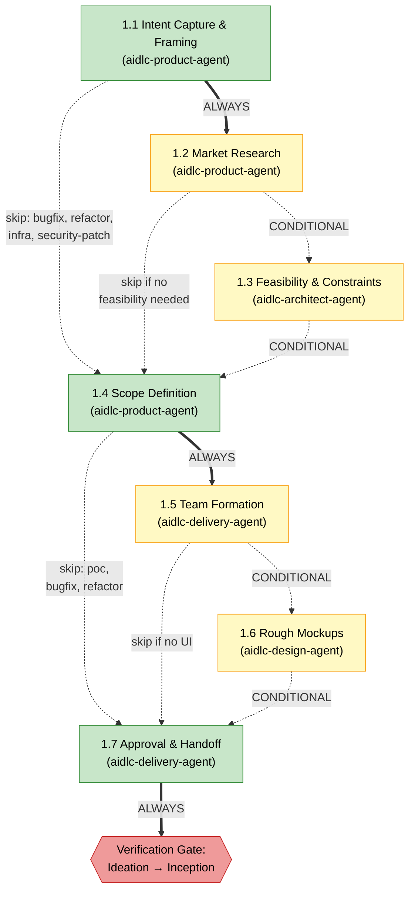
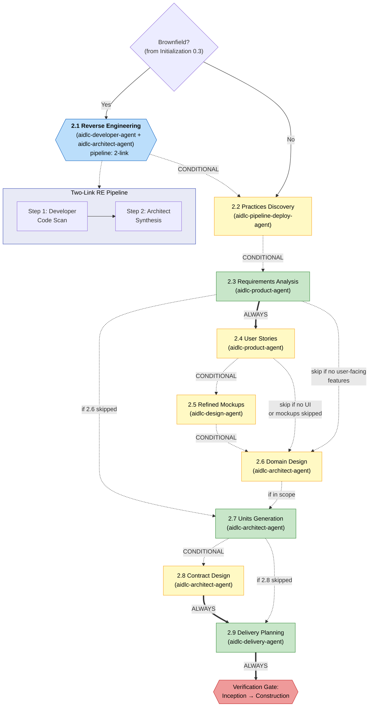
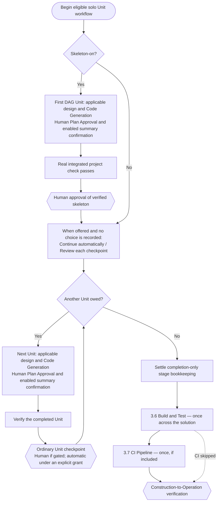
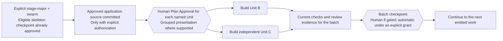
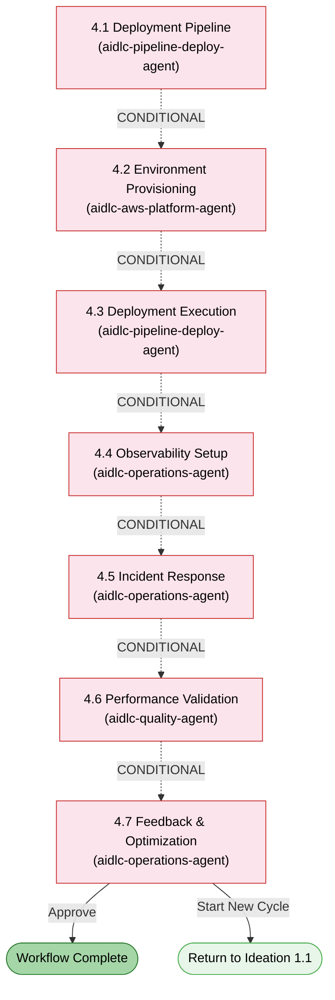

# Phases and Stages

The AI-DLC lifecycle is organized into 5 phases containing 33 stages. This chapter explains each phase, lists its stages, and shows how they connect.

> **Harness note.** The methodology — the phases, stages, agents, and gates this
> guide describes — is identical on every harness. Where a mechanic differs by
> harness (how a gate renders, how a subagent is dispatched, where config lives),
> the difference is called out and tabled in your harness's chapter:
> [Running on other harnesses](harnesses/README.md). Examples here use Claude Code
> unless noted.

---

## Lifecycle Overview

```mermaid
graph LR
    subgraph INITIALIZATION["INITIALIZATION (0.1-0.3)"]
        Z1["Workspace Scaffold"]
        Z4["State Init"]
        Z1 -.->|"3 stages"| Z4
    end

    subgraph IDEATION["IDEATION (1.1-1.7)"]
        I1["Intent Capture"]
        I7["Approval & Handoff"]
        I1 -.->|"7 stages"| I7
    end

    subgraph INCEPTION["INCEPTION (2.1-2.9)"]
        N1["Reverse Engineering"]
        N7["Delivery Planning"]
        N1 -.->|"9 stages"| N7
    end

    subgraph CONSTRUCTION["CONSTRUCTION (3.1-3.7)"]
        C1["Functional Design"]
        C7["CI Pipeline"]
        C1 -.->|"3.1–3.5 per Unit in the recorded order; 3.6–3.7 once after all Units"| C7
    end

    subgraph OPERATION["OPERATION (4.1-4.7)"]
        O1["Deployment Pipeline"]
        O7["Feedback & Optimization"]
        O1 -.->|"7 stages"| O7
    end

    Z4 -->|"auto-proceed"| I1
    I7 -->|"Verification Gate 1"| N1
    N7 -->|"Verification Gate 2"| C1
    C7 -->|"Verification Gate 3"| O1
    O7 -.->|"Feedback Loop"| I1

    style INITIALIZATION fill:#f3e5f5,stroke:#9c27b0,color:#000
    style IDEATION fill:#e8f5e9,stroke:#4caf50,color:#000
    style INCEPTION fill:#e3f2fd,stroke:#2196f3,color:#000
    style CONSTRUCTION fill:#fff3e0,stroke:#ff9800,color:#000
    style OPERATION fill:#fce4ec,stroke:#e91e63,color:#000
```

<!-- Text fallback: Linear flow: INITIALIZATION (0.1-0.3) auto-proceeds to IDEATION (1.1-1.7), which passes through Verification Gate 1 to INCEPTION (2.1-2.9), through Verification Gate 2 to CONSTRUCTION (3.1-3.7), through Verification Gate 3 to OPERATION (4.1-4.7). A feedback loop returns from 4.7 back to 1.1. -->

Phases execute sequentially. At each phase boundary (except Initialization → Ideation), a **verification gate** runs automated traceability checks to catch missing links, orphaned artifacts, or inconsistencies before downstream stages build on them.

---

## Phase 0: Initialization

**Purpose:** Bootstrap the workspace — scaffold the docs directory, detect the workspace, and initialize state. The welcome message is shown at session start via the `companyAnnouncements` entry in `settings.json` (not a stage).

Initialization stages run **automatically** without approval gates. All three execute inside a single deterministic tool call (`aidlc-utility intent-create`) that completes in well under a second.

| # | Stage | Lead | Key Artifacts | Condition |
|---|-------|------|---------------|-----------|
| 0.1 | Workspace Scaffold | orchestrator | first intent's record dir (`aidlc/spaces/<space>/intents/<YYMMDD>-<label>/`) | ALWAYS |
| 0.2 | Workspace Detection | orchestrator | `aidlc-state.md` (workspace state) | ALWAYS |
| 0.3 | State Initialization | orchestrator | `aidlc-state.md`, `audit/` shards | ALWAYS |

**Execution notes:**
- All three stages run inline inside `aidlc-utility intent-create` - no LLM subagent delegation, no per-stage prompt.
- Workspace detection is a rule-based scanner (file extensions, known config filenames, package manifests).
- No user interaction is needed during this phase.

---

## Phase 1: Ideation

**Purpose:** Validate the initiative — capture intent, assess feasibility, define scope, form the team, and secure approval to proceed.

<!-- Text fallback: 1.1 Intent Capture (ALWAYS) flows to 1.2 Market Research (CONDITIONAL) or directly to 1.4. 1.2 flows to 1.3 Feasibility (CONDITIONAL) or to 1.4. 1.3 flows to 1.4 Scope Definition (ALWAYS). 1.4 flows to 1.5 Team Formation (CONDITIONAL) or to 1.7. 1.5 flows to 1.6 Rough Mockups (CONDITIONAL, skip if no UI) or to 1.7. 1.6 flows to 1.7 Approval & Handoff (ALWAYS), then Verification Gate 1. -->

| # | Stage | Lead | Supporting | Key Artifacts | Condition |
|---|-------|------|-----------|---------------|-----------|
| 1.1 | Intent Capture & Framing | aidlc-product-agent | aidlc-architect-agent | Intent statement, stakeholder map | ALWAYS |
| 1.2 | Market Research | aidlc-product-agent | — | Competitive analysis, build-vs-buy | CONDITIONAL |
| 1.3 | Feasibility & Constraints | aidlc-architect-agent | aidlc-aws-platform-agent, aidlc-compliance-agent | Feasibility assessment, constraint register, RAID log | CONDITIONAL |
| 1.4 | Scope Definition | aidlc-product-agent | aidlc-delivery-agent | Scope definition, intent backlog | ALWAYS |
| 1.5 | Team Formation | aidlc-delivery-agent | — | Team assessment, mob composition plan | CONDITIONAL |
| 1.6 | Rough Mockups | aidlc-design-agent | aidlc-product-agent | Wireframes, user flows, concept deck | CONDITIONAL |
| 1.7 | Approval & Handoff | aidlc-delivery-agent | aidlc-product-agent | Initiative brief, decision log | ALWAYS |

**Stage colors:** Green = ALWAYS (runs whenever the selected scope includes it). Yellow = CONDITIONAL (may skip based on scope, project type, or plan). For the exact per-scope stage membership, see the [Stage-by-Scope Matrix](05-scopes-and-depth.md#stage-by-scope-matrix).

Intent Capture records the initial description, workflow-selected scope, and
used memory rules in its questions file. Claims in the intent statement and
stakeholder map carry inline source tags; both artifacts surface assumptions
and open questions. Retained assumptions require explicit confirmation before
the Product Lead reviewer and approval gate run.

---

## Phase 2: Inception

**Purpose:** Elaborate the requirements — analyze the codebase, elicit requirements, design architecture, decompose into units of work, and plan delivery.

<!-- Text fallback: Brownfield check (from stage 0.3). If yes, 2.1 Reverse Engineering runs as a two-link pipeline (developer code scan then architect synthesis-and-write). Then 2.2 Practices Discovery runs as a hub-and-spoke on every included scope (lead draft, mutually blind quality/developer/devsecops spokes, human interview, lead integration) and promotes affirmed work to active-space memory. Next are 2.3 Requirements Analysis (ALWAYS), optional 2.4 User Stories mob, optional 2.5 Refined Mockups, optional 2.6 Domain Design, 2.7 Units Generation (ALWAYS), optional 2.8 Contract Design, and 2.9 Delivery Planning (ALWAYS), followed by Verification Gate 2. -->

| # | Stage | Lead | Supporting | Key Artifacts | Condition |
|---|-------|------|-----------|---------------|-----------|
| 2.1 | Reverse Engineering | aidlc-developer-agent | aidlc-architect-agent | 9 RE artifacts | Brownfield projects |
| 2.2 | Practices Discovery | aidlc-pipeline-deploy-agent | aidlc-quality-agent, aidlc-developer-agent, aidlc-devsecops-agent | `team-practices.md`, `discovered-rules.md`, `evidence.md` (promoted to `aidlc/spaces/<active-space>/memory/team.md` / `project.md` on affirmation) | CONDITIONAL |
| 2.3 | Requirements Analysis | aidlc-product-agent | — | `requirements.md` | ALWAYS |
| 2.4 | User Stories | aidlc-product-agent | aidlc-design-agent, aidlc-developer-agent, aidlc-quality-agent | `stories.md`, `personas.md` | User-facing features |
| 2.5 | Refined Mockups | aidlc-design-agent | aidlc-product-agent | Hi-fi mockups, interaction spec | UI projects |
| 2.6 | Domain Design | aidlc-architect-agent | aidlc-aws-platform-agent, aidlc-design-agent | `components.md`, `decisions.md` (ADRs) | Per execution plan |
| 2.7 | Units Generation | aidlc-architect-agent | aidlc-delivery-agent | `unit-of-work.md`, `unit-of-work-dependency.md` (DAG), `unit-of-work-story-map.md` | ALWAYS |
| 2.8 | Contract Design | aidlc-architect-agent | aidlc-aws-platform-agent | `contract-summary.md` | CONDITIONAL |
| 2.9 | Delivery Planning | aidlc-delivery-agent | aidlc-architect-agent | `bolt-plan.md`, `team-allocation.md`, `risk-and-sequencing-rationale.md`, `external-dependency-map.md` | ALWAYS |

**Key behavior:** Stage 2.1 runs as a **pipeline** (2-link chain) — first an aidlc-developer-agent code scan, then an aidlc-architect-agent synthesis that writes the artifacts. Each return creates an ordered durable receipt, and multi-repo work requires one complete chain per repo before approval. It only executes for brownfield projects. Stage 2.2 runs as a **subagent hub-and-spoke** for greenfield and brownfield work: the lead drafts, quality/developer/devsecops inspect it independently, the human interview resolves gaps, and the lead integrates. Stage 2.4 runs as a **mob** — the lead drafts, and the design, developer, and quality agents contribute in parallel via contribution files.

---

## Phase 3: Construction

**Purpose:** Build the solution — design, implement, and test — in reviewable slices.

### Why Construction works the way it does

New solo workflows that include Unit decomposition and a source-producing
Construction stage default to **unit-major, serial execution with verified Unit
checkpoints**. Each Unit completes its applicable design stages and Code
Generation before the next. Runtime order follows `unit-of-work-dependency.md`;
`bolt-plan.md` records delivery grouping and rationale without replacing that DAG.

With skeleton-on, the first DAG Unit is the smallest working integrated slice.
Its code must run through a real end-to-end check, and you approve the verified
skeleton before later Units begin. This happens even if you explicitly choose
stage-major order. A first design-stage review alone is not a working skeleton.

The check is the intent's recorded, human-authorized `Construction Verification
Command`, reused for every Unit/batch checkpoint. Delivery Planning proposes it
from the project scan and records your exact **Approve** / **Request Changes**
reply in the invoking SessionStart session. Only **Approve** authorizes the
receipt before the command is set; an unrelated reply, **Request Changes**, or
a reply from another session does not. You may defer if no runnable check exists
yet; the first checkpoint then asks before
verification. A missing authorization or later command change always requires
the [recorded-command flow](12-cli-commands.md#construction-verification-command-record-human-authorization),
never a command chosen at verify time. The approval question shows **Verified
with `<verification_command>` (exit 0)**.
The verifier records a tool-owned `CHECKPOINT_VERIFICATION_RECORDED` receipt
alongside the proof file, and approval requires that receipt; a hand-written
proof file cannot verify a Unit.

Before asking you to **Approve** or **Request Changes** at a Unit/skeleton
checkpoint, the conductor opens the question with
`aidlc engine bolt checkpoint --action ask --unit "<unit>" --kind <unit|skeleton> --session "<session ID>"`.
Your exact reply in that session, to this checkpoint question, authorizes only
the matching action; an unrelated reply, another session's reply, or a reply to
a different question does not. Approval/rejection uses the same `--session` and
only the `--user-input` you actually chose. A changed checkpoint needs a new
question and answer. Automatic approval (`human_required: false`) needs no `ask`
and no `--user-input`; a human Request Changes always needs this flow.

The autonomy offer is **Continue automatically** / **Review each checkpoint**:
for eligible checkpoint workflows, skeleton-off offers it at Construction entry,
and skeleton-on offers it after the real skeleton checkpoint. An existing choice
is not repeated; on-demand grant/revoke requests remain available. Plan Approval,
enabled summary confirmation, verification command selection, and failures still
need human attention under either choice. Summary confirmation applies only when
`directive.ceremony.summary_confirmation === "on"`.

The new default does not convert existing workflows, design-only work, or flows
without Units. Their existing stage approvals remain. Team-owned Units keep their
own per-stage or unit-end gate rhythm. Preserve explicit iteration choices.

### Construction flow

This diagram shows the default path for an eligible solo workflow that produces
source. Other workflows keep their recorded execution and approval policy.

<!-- Text fallback: An eligible solo source-producing workflow completes and verifies the first integrated Unit with human skeleton approval when skeleton-on. When offered, choose Continue automatically or Review each checkpoint unless a choice already exists. Complete remaining Units serially with human Plan Approval and any enabled summary confirmation, verify each, and approve ordinary checkpoints according to the recorded policy. Completion-only stage gates are bookkeeping; Build and Test and optional CI Pipeline run once across the solution. -->

### Parallel Unit batches

Unit-major remains serial. To use swarm execution in an eligible checkpoint
workflow, explicitly choose stage-major and `Construction Execution: swarm`.
Execution and approval are separate choices: batch completion may be guided or
automatic. Dependency-ready Units may run together; an inline Unit already
approved at its checkpoint is not rebuilt in a later batch.
Before initial protected prepare, the approved parent application source must
be committed and reproducible. In particular, commit the approved inline
skeleton source before preparing parallel Units. This is an explicit action;
the tool never commits automatically and checks all Units before creating any
child. See [Swarm prepare](12-cli-commands.md#aidlc-engine-swarm-prepare-prepare-a-reproducible-batch).

For a human batch completion decision, the conductor first runs
`aidlc engine bolt swarm-checkpoint --action ask --batch <N> --units "<Units>" --session "<session ID>"`,
then presents **Approve** / **Request Changes** and waits for your exact reply to
that batch's question. The same session-bound consent rule applies: never use
another question's reply or invent `--user-input`, and use the same `--session`
for approval/rejection. Automatic batch approval needs no `ask` or `--user-input`.

<!-- Text fallback: After explicit stage-major/swarm selection and any required skeleton approval, ensure the approved application source is committed with explicit authorization, then obtain Plan Approval for the exact emitted Units. Build dependency-independent Units in parallel, collect current verification and review evidence, then resolve that batch's guided or automatic checkpoint before the next work. -->

Design stages can use an emitted per-Unit wave on a stage-major path. The
conductor follows the emitted Unit set rather than deriving parallelism from a
Bolt-plan grouping. `BOLT_STARTED` / `BOLT_COMPLETED` apply to the swarm/worktree
path; serial inline Unit work uses its lifecycle and checkpoint receipts.

### Halt-and-ask on failure

Failures always stop Construction, even in autonomous mode. The Build-and-Test loop-back's rung 4 also stops for the human; required Plan Approvals, summary confirmations, and verification command selection remain separate human decisions.

- If a solo Unit's Code Generation fails, Construction halts immediately and offers **retry** (re-run just that Unit), **skip** (mark it `[S]` and continue — dependents will likely also fail), or **abort**.
- If one Unit in a parallel batch fails while others succeed, the conductor waits for the whole batch to finish, preserves the successful Units' artifacts on disk, and presents the same retry / skip / abort choice for the failed Unit only.

### Stage reference

| # | Stage | Lead | Supporting | Key Artifacts | Runs |
|---|-------|------|-----------|---------------|------|
| 3.1 | Functional Design | aidlc-architect-agent | aidlc-developer-agent | `entities.md`, `rules.md`, `functional-spec.md` | Per Unit (CONDITIONAL by execution plan) |
| 3.2 | NFR Requirements | aidlc-architect-agent | aidlc-devsecops-agent, aidlc-compliance-agent, aidlc-quality-agent | Performance, security, scalability, reliability, observability NFRs | Per Unit (CONDITIONAL) |
| 3.3 | NFR Design | aidlc-architect-agent | aidlc-aws-platform-agent | NFR design specifications | Per Unit (CONDITIONAL) |
| 3.4 | Infrastructure Design | aidlc-aws-platform-agent | aidlc-devsecops-agent, aidlc-compliance-agent | Infrastructure specifications, IaC designs | Per Unit (CONDITIONAL) |
| 3.5 | Code Generation | aidlc-developer-agent | — | Application code + code docs | Per Unit (ALWAYS) |
| 3.6 | Build and Test | aidlc-quality-agent | aidlc-devsecops-agent | Test results, quality report | ALWAYS, once at end |
| 3.7 | CI Pipeline | aidlc-pipeline-deploy-agent | — | CI config, quality gates | CONDITIONAL, once at end |

**Key behaviors:**

- Eligible new source-producing solo Unit workflows default to unit-major and serial execution. Legacy, design-only, no-Unit, and team-owned workflows retain their existing paths.
- The real skeleton is the first complete integrated Unit, verified and human-approved before later Units; a legacy first-stage gate is only a stage review.
- Ordinary completion follows the recorded autonomy policy. `completion_only` stage directives settle existing approvals without repeating bodies, reviewers, or human completion questions.
- An autonomy answer does not choose swarm or change iteration order. Explicit stage-major/swarm selection supports guided or automatic batch checkpoints.
- Plan Approval remains mandatory for each Unit; grouping its presentation never removes individual approval receipts. Enabled summary confirmation, verification command selection, and failures still require the human.

---

## Phase 4: Operation

**Purpose:** Deploy and operate — set up deployment pipelines, provision environments, configure observability, and establish feedback loops.

<!-- Text fallback: All Operation stages are CONDITIONAL. 4.1 through 4.7 flow sequentially. Stage 4.7 can either complete the workflow or loop back to start a new Ideation cycle at 1.1. -->

| # | Stage | Lead | Supporting | Key Artifacts | Condition |
|---|-------|------|-----------|---------------|-----------|
| 4.1 | Deployment Pipeline | aidlc-pipeline-deploy-agent | — | CD config, deployment strategy, rollback runbook | CONDITIONAL |
| 4.2 | Environment Provisioning | aidlc-aws-platform-agent | aidlc-devsecops-agent, aidlc-compliance-agent | Environment inventory, validation report | CONDITIONAL |
| 4.3 | Deployment Execution | aidlc-pipeline-deploy-agent | aidlc-developer-agent | Deployment log, smoke tests, health checks | CONDITIONAL |
| 4.4 | Observability Setup | aidlc-operations-agent | — | Dashboards, alarms, SLO config | CONDITIONAL |
| 4.5 | Incident Response | aidlc-operations-agent | — | SSM runbooks, incident plan, escalation matrix | CONDITIONAL |
| 4.6 | Performance Validation | aidlc-quality-agent | — | Load test results, NFR validation matrix | CONDITIONAL |
| 4.7 | Feedback & Optimization | aidlc-operations-agent | aidlc-aws-platform-agent | SLO report, cost analysis, feedback loop doc | CONDITIONAL |

**Key behaviors:**
- All 7 stages are **conditional** — the entire phase may be skipped for `mvp` and `poc` scopes
- Stage 4.7 is the **terminal stage** — on approval, the workflow is complete
- The **feedback loop** from 4.7 back to 1.1 enables iterative development cycles

---

## Phase Transitions and Verification Gates

At each phase boundary (Ideation → Inception, Inception → Construction, Construction → Operation), the framework runs **phase boundary verification**. This automated check validates:

- All required artifacts from the completing phase exist
- Traceability links between artifacts are intact (e.g., every requirement maps to a story)
- No orphaned artifacts or missing references
- Consistency between related artifacts

If verification fails, the conductor reports the issues and asks whether to proceed or go back to fix them.

---

## Stage Execution Modes Reference

| Mode | Stages | User Interaction | Description |
|------|--------|-----------------|-------------|
| Inline (auto-proceed) | 0.1, 0.2, 0.3 | None | Run deterministically inside `aidlc-utility intent-create`, no approval gate |
| Inline | 29 stages | Full | Agent works in conversation, approval gate at end |
| Subagent | 2.2, 3.5 | Practices interview + final gate for 2.2; approval gate for 3.5 | Hub-and-spoke Practices Discovery; focused Code Generation |
| Pipeline (2-link) | 2.1 | Approval gate only | Developer scan, then architect synthesis-and-write |
| Mob | 2.4 | Mid-stage judgment questions + approval gate | Lead drafts; design/developer/quality collaborate in parallel via contribution files |

Across all 33 stages, the topology count is **29 inline / 2 subagent / 1 pipeline / 1 mob**.

---

## Next Steps

- [Scopes, Depth, and Test Strategy](05-scopes-and-depth.md) — how scopes control which stages execute, including the full [Stage-by-Scope Matrix](05-scopes-and-depth.md#stage-by-scope-matrix)
- [Agents](06-agents.md) — the 14-agent roster and its domain, review, and composition roles
- [Your First Workflow](02-your-first-workflow.md) — annotated walkthrough
- [Glossary](glossary.md) — terminology reference
