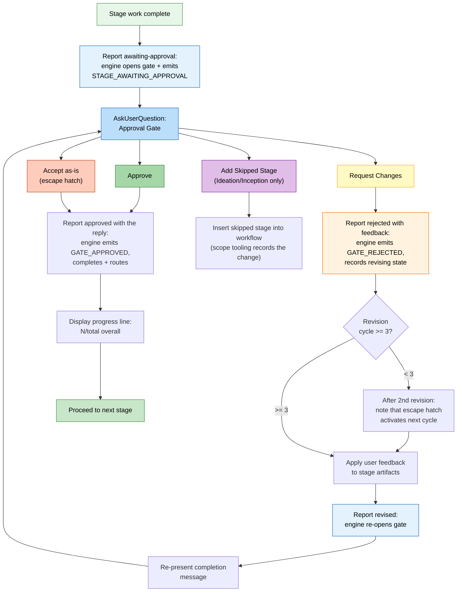

# Interaction Modes

AI-DLC provides three ways to interact with agents during stages, plus approval gates that keep you in control at every decision point.

> **Harness note.** Gates and questions render differently per harness. Claude
> Code uses its native question picker; Codex uses its picker when enabled.
> Kiro, opencode, and GitHub Copilot render numbered-prose options (Copilot's
> picker results do not fire the trusted human-presence event). The questions
> file remains the source of truth. The *semantics* — when a gate fires, what
> it asks, that you stay in control — are identical, since they live in the
> engine. See [Running on other harnesses](harnesses/README.md).

---

## Tri-Mode Question Flow

When a stage gathers your input, the agent presents three interaction modes. You choose the one that suits you; later stages reuse that choice (see [Asked Once, Then Reused](#asked-once-then-reused)).

```
▸ Choose interaction mode:
  (1) Guide Me — agent asks structured questions
  (2) Edit File — write directly to the artifact
  (3) Chat — freeform discussion
```

### Guide Me

The agent walks you through each question interactively using structured prompts. Best when you want the agent to lead the conversation and ensure nothing is missed.

- Agent presents questions one at a time (or in batches)
- You answer each question directly
- Answers are recorded in the stage's questions file for traceability

### Edit File

The agent creates (or opens) the questions file and you edit it directly. Best when you already know what you want and prefer to write it down rather than answer questions.

- The questions file appears in the intent's record dir with blank answer fields
- You fill in answers at your own pace
- The agent reads the completed file and proceeds

### Chat

Freeform conversation with the agent. Best for exploring ideas or when your requirements are not yet well-defined.

- You discuss freely with the agent
- The agent extracts decisions from the conversation
- Extracted decisions are written back to the questions file as the source of truth

### Switching Modes Mid-Stage

You can switch between modes at any point during a stage. All three modes converge on the questions file as the canonical record of decisions. Switching does not lose progress — answers already captured remain in the file.

### Asked Once, Then Reused

You choose the mode once per piece of work: the first stage with questions asks,
and later stages reuse your choice without asking again. Each of those stages
still tells you, in one line, which mode it is using:

```
Answering the way you chose earlier: Guide me. Say if you'd rather edit the file or chat.
```

To change it, just say so ("let me edit the file this time"). The agent switches
and later stages use your new choice. However you word your answer, the agent
records the mode you meant, so you are not asked again because of the wording.

---

## Approval Gates

Every stage (except the 3 Initialization stages) ends with an approval gate. This is your checkpoint to review the agent's work before the workflow advances.

### Standard Gate

The default approval gate presents two options:

```
▸ How would you like to proceed?
  (1) Approve — Continue to [next stage]
  (2) Request Changes — Provide revision feedback
```

`[next stage]` shows the actual next stage the workflow will run (for example "Continue to NFR Requirements"), or "Complete workflow" on the final stage; the engine computes it, so it is always correct rather than a guess.

- **Approve** reports the outcome; the engine marks the stage completed, updates
  `aidlc-state.md`, shows a progress line, and advances to the next stage
- **Request Changes** lets you provide specific feedback; the agent revises its work and re-presents the approval gate

Answer in your own words, the way you would answer a colleague. You drive: the
agent reads your reply and does what you said, at every question (this gate, the
summary confirmation, a verification command, a Construction checkpoint, Plan
Approval, and a recovery question). You never retype an option label or say the
same thing twice:

- `1`, `a` (where the options are lettered), `approved`, `looks good`, or
  `aprove` all approve.
- A change request is Request Changes, and your words are the feedback:
  `rename the handler`, `no, split the tests`.
- An approval with an instruction is both: `looks fine but rename the handler`
  approves, the agent renames it and says so in one line ("Renamed
  processOrder to handleOrder in 3 files"), and the work carries on.
- An approval that also asks to stop for now approves and parks the workflow:
  `Approve, but let's stop there for today`. `/aidlc --resume` picks it up later.
- A question gets an answer, and your next reply decides.
- Only a reply that is genuinely unclear (`hmm`, `not sure`) gets one short
  question back.

AI-DLC records gate, Plan Approval, checkpoint, verification-command, and
Construction setting changes with your words beside them (`Person Reply` in
the audit trail), as your harness passed them and trimmed. At a stage gate that
is every message since the gate was shown, up to 8: if a ninth arrives, or one
message is over 8000 characters, none of them is attached, and a change request
records the agent's `--reason` instead; at Plan Approval, your latest 8
replies, each cut to 8000 characters; at a checkpoint or verification-command
question, your replies joined in order, keeping the last 8000 characters; for a
Construction setting you asked to change, the message that asked. The summary confirmation records the
choice the agent read and, for a change request, what you asked to change. A
decision needs a reply from you after the question was shown: the agent cannot
answer for you.

When you ask for changes at a stage gate, the audit trail records, as the
revision feedback, the words your harness passed to the human-turn hook for
your chat, exactly as they arrived, and the agent is told to revise from those
words. If you picked Request Changes and then answered "What should change?",
your answer is the feedback. Replies to other questions in between, and a
question on its own, are not. When the agent's own summary of your request
differs, it is kept beside your words as the `Conductor Summary`. This needs a
harness that passes your typed prompt and chat session to the human-turn hook;
where it does not, the feedback is what the agent reports, as before. Like the
human turn itself, this records what the prompt seam received, not who typed
it.

The gate requires an observed human-interaction seam: typing a prompt or answering a native question picker records a human turn (a `HUMAN_TURN` event) in the audit ledger, and approve (and any clarifying-question answer) refuses unless one was recorded since the last gate resolution. This proves presence and ordering, not authorship of the later caller-supplied decision text; some harnesses expose no trusted prompt/widget content. A narrow defense-in-depth tripwire rejects recognized explicit conductor/model self-attribution, but unlabelled wording is not authenticated. On a harness whose picker does not record a human turn, type a short message once (for example "approve") so one is on record. (On a harness whose ledger has no human turn yet, the gate fails open and does not require this.)

The human-turn hook is activated only through the dispatcher's hook route;
it does not authenticate who launched the dispatcher. Hooks and tool calls run
as the same user, and no harness gives a hook an identity a same-user process
cannot copy. The runtime-integrity check refuses recognized tool-call routes
to the hook and its records as defense in depth. The harness's permission model
and your review of what the agent runs are the outer boundary.

Automation that submits prompts without a person present must set
`AIDLC_UNATTENDED=1` in the driving process. The declaration is opt-in because
only the driver knows whether a prompt is unattended; without it, prompt-submit
events retain interactive behavior. With it set, every harness withholds the
authority-bearing `HUMAN_TURN`, so approval and interview gates continue to
wait. When a person takes over, unset `AIDLC_UNATTENDED` and submit a fresh
response. Presence-related refusal messages name the flag when it is still set.

### Approval Gate Flow



<!-- Text fallback: Stage work completes, report awaiting-approval opens the gate (the engine records STAGE_AWAITING_APPROVAL), and AskUserQuestion presents the approval gate. Approve: report approved with the exact choice so the engine records GATE_APPROVED, completes, and routes; show progress; proceed. Request Changes: report rejected with the exact Request Changes choice and separate feedback (the engine records GATE_REJECTED), check revision count (if <3, note escape hatch coming, revise, report revised to re-open the gate, and re-present; if >=3, Accept-as-is becomes available). Accept as-is: report approved with that exact label. Add Skipped Stage (Ideation/Inception only): recompose the plan. The report calls own the gate's audit trail; no separate log entries are added for the gate prompt or choice. -->

---

## The 3-Strike Revision Escape Hatch

If you have requested changes 3 or more times on the same stage, a third option appears:

```
▸ This is revision cycle 4. How would you like to proceed?
  (1) Approve — Continue to [next stage]
  (2) Request Changes — Provide revision feedback
  (3) Accept as-is — Archive current version and move on
```

**Accept as-is** archives the current version of the stage artifacts and advances the workflow. This prevents infinite revision loops when perfect is the enemy of good.

### How It Activates

| Revision Cycle | What Happens |
|----------------|-------------|
| 1st | Standard 2-option gate |
| 2nd | Standard 2-option gate, plus a note: "After one more revision, an 'Accept as-is' option will become available." |
| 3rd and beyond | 3-option gate with Accept as-is |

The revision count resets when you move to the next stage.

---

## Add Skipped Stage Option

During **Ideation** and **Inception** phases, the approval gate may include a conditional option to add a previously skipped stage back into the workflow:

```
▸ How would you like to proceed?
  (1) Approve — Continue to Scope Definition
  (2) Request Changes — Provide revision feedback
  (3) Add Market Research — Include Market Research which was skipped
```

This option appears only when:
- The current stage is in Ideation or Inception
- A stage ahead was skipped during scope routing
- The skipped stage is relevant to the current context

Selecting this option inserts the skipped stage into the workflow plan. The workflow continues normally through the added stage.

---

## Skipping and Navigating Stages

Beyond the approval gate, you have additional navigation options:

| Command | Effect |
|---------|--------|
| `/aidlc --stage <name>` | Jump to a specific stage (intervening stages marked `[S]`) |
| `/aidlc --phase <name>` | Jump to the start of a phase |

See [Session Management](11-session-management.md) and [CLI Commands](12-cli-commands.md) for details.

---

## Editing Files Yourself

You can edit any artifact by hand. What happens next depends on where you are:

| When you edit | What you do | What you see |
|---|---|---|
| Answers to a stage's questions | Choose **I'll edit the file**, fill in the `[Answer]:` lines, then send **done** (or "ready") | The agent reads your answers and carries on from them; when summary confirmation is on, you confirm the summary first |
| A code plan waiting for approval | Choose **I'll edit the files**, change the plan or test instructions (or write your answer in `code-generation-questions.md`), then send **done** | Your edited plan is approved as you left it and the build starts. The agent cannot write those files while you edit. If your edit broke the plan's Testing Contract block, the agent repairs it and asks you once to build |
| An artifact already reviewed in the stage you are on, before its gate | Edit the file, then carry on | Under Guard Policy `relaxed` or `off` (most scopes), you hear one line saying the file changed, the edit is recorded once in the audit trail as `CHANGE_ACCEPTED`, and the run continues. Under `strict`, the old review no longer covers the edited file, so it is reviewed once more, as it is now, before the gate. That extra review happens once: if you edit the file again after it, the agent stops and tells you, and you choose **Request Changes** to start the review over |
| An artifact from a stage that is already finished | Edit the file, then carry on | Nothing re-runs by itself, and later stages read the file as you left it. See [After a stage is finished](#after-a-stage-is-finished) |
| Between sessions | Edit the files, then resume with `/aidlc` | The same rules apply the next time the file is checked |

When you are told a file changed and the run is continuing, that is the whole record: there is nothing to log by hand. See [Guard Policy](13-customization.md#guard-policy) for what `strict`, `relaxed`, and `off` do, and [Plan approval](13-customization.md#plan-approval) for the plan stop itself.

### After a stage is finished

An edit to a finished stage's files is not reviewed or approved again unless you ask for it:

- **What warns you.** When you edit one of the stage documents AIDLC tracks for a finished stage, the next step says once which finished stage is now behind and what to say to redo it; `/aidlc --status` lists the stages affected downstream. Moving, renaming or copying the project folder changes none of those documents, so it brings no warning (see the [Artifacts Reference](14-artifacts-reference.md) for when it still can). The warning is advice, not a stop. A stage finished without a validation record (for example, by an older AIDLC release) gets no warning, and `/aidlc --status` does not list it.
- **What does not.** Your application code is not tracked this way, so changing it after Code Generation raises no warning.
- **Getting it checked again.** Jump back with `/aidlc --stage <name>` to the earliest affected stage (Code Generation for application code). That reopens it and every later stage in your plan. The files stay, so each reopened stage that finds its earlier files asks you to **Keep** them, **Modify** them, or **Redo from scratch**. Keep skips regenerating the files, not the checks: any review or approval the stage needs still happens. Choose Modify or Redo where your change should be carried through. Code Generation's review covers only the application files listed in a Unit's source manifest, so a file you added or moved by hand is not reviewed until it is listed there. When you choose Modify, name the files you added or moved and the Unit they belong to. Work without Units (for example a bugfix or refactor scope) has no source manifest, so check hand edits to application code yourself before you approve. Construction checkpoints you set to run automatically stay automatic.

---

## Progress Tracking

After every approval, a progress line appears:

```
Progress: 6/30 in-scope stages complete (9/33 overall) | 6/7 IDEATION. Next: Approval & Handoff
```

This shows:
- Progress across the stages your plan runs after Initialization (the count you
  were shown when the work started), with every stage finished so far in
  parentheses
- Progress within the current phase
- The name of the next stage

On a shorter plan the numbers are smaller, for example:

```
Progress: 2/6 in-scope stages complete (5/33 overall) | 2/2 INCEPTION. Next: Code Generation
```

---

## Next Steps

- [Your First Workflow](02-your-first-workflow.md) — see interaction modes in context
- [State and Audit](10-state-and-audit.md) — how decisions are tracked
- [Session Management](11-session-management.md) — resume, redo, jump
- [Glossary](glossary.md) — terminology reference
