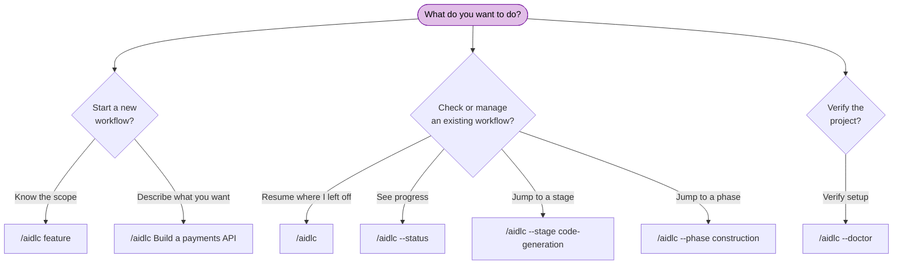

# CLI Commands

AI-DLC has two user-facing command planes. Harness chat commands drive a
workflow through `/aidlc` (or `$aidlc` on Codex); the installed native
`aidlc` command initializes projects and provides machine lifecycle,
diagnostic and lifecycle routes.

> **Invocation prefix differs by harness.** On Claude Code, Kiro IDE, Kiro CLI,
> Cursor, opencode, and GitHub Copilot you type `/aidlc`; on Codex CLI it is `$aidlc` (or
> `/skills` → aidlc). The flags and behaviour below are identical either way —
> only the prefix changes. The examples use `/aidlc`; substitute `$aidlc` on
> Codex. See the [Kiro CLI](harnesses/kiro-cli.md),
> [Kiro IDE](harnesses/kiro-ide.md), [Codex CLI](harnesses/codex-cli.md),
> [Cursor](harnesses/cursor.md), [opencode](harnesses/opencode.md), and
> [GitHub Copilot](harnesses/copilot.md) harness guides.

> **Cursor shortcuts.** Cursor also exposes `/aidlc-status`,
> `/aidlc-jump --stage <slug|#>` (or `--phase <name|#>`), and
> `/aidlc-scope <name>` as native skills. They package the matching `/aidlc`
> forms below and use the same engine; they are aliases, not alternate state
> paths.

---

## Quick Reference

| Command | Description |
|---------|-------------|
| `/aidlc [scope]` | Start a new workflow with an explicit scope |
| `/aidlc [description]` | Start a new workflow; scope is auto-detected from your description (rich/unmatched prose gets a compose offer) |
| `/aidlc compose "<task>"` | Force the adaptive composer: propose a tailored EXECUTE/SKIP plan for the task |
| `/aidlc compose --report <path>` | Compose from a scan report (triage findings into a compact fix-and-ship run) |
| `/aidlc --new-scope "<task>"` | Force the composer to synthesize a custom scope even when a stock scope matches |
| `/aidlc` | Resume an existing workflow (if an intent exists) or creation the first intent and start new |
| `/aidlc park` | Park the active workflow at the current stage boundary for a later session or another person |
| `/aidlc team-board [--snapshot] [--space <name>] [--intent <name>]` | Read-only Team Construction board (Unit progress, claims, merge readiness) |
| `/aidlc intent [name]` | List intents in the active space (`--all` includes archived), or switch to an existing intent |
| `/aidlc intent archive <name>` | Retire an in-flight intent without deleting its record; `unarchive <name>` brings it back |
| `/aidlc space [name]` | List spaces, or switch to an existing space |
| `/aidlc space-create <name>` | Create a new space from the framework baseline |
| `/aidlc knowledge <verb>` | Index and read your own documents (`onboard`, `sync`, `list`, `show`, `associate`, `dissociate`, `rebind`, `summarize`) |
| `/aidlc --status` | Display a read-only status summary |
| `/aidlc --config [section]` | Configure project policy conversationally, then land exact deterministic config flags |
| `/aidlc --claim <unit> [--team <label>] [--rhythm <per-stage\|unit-end>]` | Atomically claim an open team-owned Unit and bind this checkout to that attempt |
| `/aidlc --release <unit>` | Release a live Unit claim from unscoped main by publishing a tombstone |
| `/aidlc unit adopt <unit>` | Adopt the checked-out live claim branch in a fresh clone |
| `/aidlc unit participate` | Mark this clone for the guided Unit-claim picker |
| `/aidlc unit publish <unit>` | CAS-publish the scoped checkout's clean committed candidate onto its claim ref |
| `/aidlc unit pin <unit>` | Pin and validate one completed candidate OID from unscoped main |
| `/aidlc unit gate <unit> ...` | Record the merge decision against the pinned OID and generation |
| `/aidlc unit land <unit> ...` | Run the resumable git → state → audit landing transaction |
| `/aidlc unit merge-status <unit>` | Read the local pinned-merge transaction journal |
| `/aidlc unit status` | Read the current claimable, claimed, and dependency-blocked Unit sets |
| `/aidlc --doctor [--check-updates]` | Run a health check; the explicit flag refreshes update metadata |
| `/aidlc --doctor --export` | Run a fresh health check, then write a small, redacted diagnostic report for sharing |
| `/aidlc --stage <slug\|#>` | Jump to a specific stage |
| `/aidlc --stage <slug> --single` | Run one stage in isolation, without advancing your workflow |
| `/aidlc --phase <name\|#>` | Jump to the start of a phase |
| `/aidlc --scope <name>` | Change the active scope |
| `/aidlc --depth <level>` | Override depth level (minimal, standard, comprehensive) |
| `/aidlc --test-strategy <level>` | Override test strategy (minimal, standard, comprehensive) |
| `/aidlc --review <class>` | Cap stage reviews for this run (adversarial, advisory, none) |
| `/aidlc --guard-policy <value>` | Set how far the guards stand aside for this piece of work (strict, relaxed, off); `--change-control` is its retired name |
| `/aidlc --sensors <on\|off>` | Set automatic Sensor execution and blocking-sensor checks for this intent |
| `/aidlc --learnings <on\|off>` | Set the learning diary and learning-gate ceremony for this intent |
| `/aidlc --summary-confirmation <on\|off>` | Set the consolidated-summary confirmation checkpoint for this intent |
| `/aidlc config get <key>` | Print active workflow config (`depth`, `test-strategy`, `review`, `guard-policy`, `sensors`, `learnings`, `summary-confirmation`, `guard.<fence>`) |
| `/aidlc config set <key> <value> [--key value ...]` | Change intent settings through the shared setter; typed lowering switches apply at prompt time |
| `/aidlc config set guard.<fence> <on\|off>` | Turn one fence off for this piece of work, or back on above the policy word (plan-approval, review-freeze, state-transition, reviewer-scope) |
| `/aidlc config list` | List all eleven active workflow settings (`--json` for structured output) |
| `/aidlc plugin select [names]` | Show or set the enabled plugin list for this install |
| `/aidlc plugin list` | List installed plugins and enabled state |
| `/aidlc plugin sync` | Compose installed plugin roots into the current install |
| `/aidlc plugin validate [path]` | Validate an authored plugin (`--json` for structured findings) |
| `/aidlc plugin build <harness> [outDir]` | Build a host plugin projection (`--plugin-root <path>` selects the source) |
| `/aidlc --version` | Print the framework version |
| `/aidlc --help` | Display usage information |
| `bun .claude/tools/aidlc-utility.ts select-plugins [names]` | Direct utility form of plugin selection |
| `aidlc engine worktree restore --slug <slug> [--parked <stamp>] [--raw]` | Recover files from a set-aside Bolt attempt in a separate checkout |
| `aidlc engine worktree purge --slug <slug> [--parked <stamp> \| --older-than <days>]` | Remove selected local recovery refs once their restored checkouts are gone |

---

## Terminal Color

The six public terminal commands (`config`, `doctor`, `version`, `update`,
`use`, and `uninstall`) use restrained color only on human output. JSON, quiet
output, files, audit records, and non-TTY streams remain uncolored.

Color selection uses this precedence:

1. `--no-color` disables color.
2. A set `NO_COLOR` environment variable disables color, regardless of value.
3. A non-empty `FORCE_COLOR` value other than `0` enables color.
4. Otherwise, color is enabled only for a TTY stream when `TERM` is not `dumb`.

The decision is made independently for stdout and stderr. Use `--no-color` for
one command, `NO_COLOR=1` for a shell or process environment, and
`FORCE_COLOR=1` when a terminal wrapper supports ANSI color but does not expose
TTY detection.

---

## Command Decision Tree



<!-- Text fallback: Starting a new workflow: use /aidlc classic (known scope) or /aidlc Build a payments API (auto-detect; the first intent auto-creates). Managing an existing workflow: /aidlc (resume), /aidlc --status (view progress), /aidlc --stage (jump to stage), /aidlc --phase (jump to phase). Verify setup: /aidlc --doctor (health check). -->

---

## Detailed Reference

### `/aidlc [scope]` — Start with explicit scope

Start a new workflow with one of the enabled scopes. Core ships 11 named scopes; plugins can add more, and `select-plugins` can hide disabled plugin/core scopes from runtime.

**Syntax:**

```
/aidlc enterprise
/aidlc feature
/aidlc mvp
/aidlc poc
/aidlc bugfix
/aidlc refactor
/aidlc infra
/aidlc security-patch
/aidlc classic
/aidlc workshop
/aidlc express
```

**Behavior:** The framework recognizes the scope keyword, asks what you want to build, then runs the Initialization phase and begins the first domain stage. If a state file already exists, it offers resume options instead. See [Workflow Profiles](workflow-profiles.md) for a practical comparison of all 11 choices.

**Example:**

```
/aidlc bugfix
> What would you like to fix?
> The login API returns 500 when email contains a plus sign
```

---

### `/aidlc [description]` — Start with auto-detection

Describe what you want to build and the engine auto-detects the appropriate scope.

**Syntax:**

```
/aidlc Build a REST API for inventory management
/aidlc Fix the login timeout bug
```

**Behavior:** The engine analyzes keywords in your description (e.g., "fix" suggests bugfix). A clear match asks a one-line confirm naming the MATCHED scope and its effective ceremony (stage count, approval-gate count, and any per-unit fan-out, all from the compiled grid). Greenfield work excludes reverse engineering, and a per-unit clause appears only when `units-generation` runs and creates a Unit DAG. Rich or unmatched prose gets the compose offer (see `/aidlc compose` below) instead of a silent default. You confirm or override before the workflow begins.

**Example:**

```
/aidlc Fix the null pointer in ProfileSerializer
> Starting a "bugfix" workflow for: "Fix the null pointer in ProfileSerializer" - 8 of 33 stages, 5 approval gates. Confirm to proceed, name a different scope, or say "compose" for a tailored plan.
```

---

### `/aidlc compose` - The adaptive composer

Force the composer even when a stock scope would match. Works in three moments:

```
/aidlc compose "harden the deployment pipeline and add observability"
/aidlc compose --report sonar.json
/aidlc compose            (mid-workflow: re-shape the pending stages)
```

**Behavior:** the conductor dispatches the composer agent, which reads your task (or the scan report, or the running workflow's state), runs the read-only `detect` scan, estimates the five implementation-entropy components (intent ambiguity, structural uncertainty, verification entropy, risk, unresolved assumptions - grounded in CodeKB MCP analysis when configured, the workspace scan otherwise), and proposes the minimum viable EXECUTE/SKIP grid with the score breakdown and a reason for every EXECUTE and SKIP. You approve, edit, or reject at a gate. On approve: AI-DLC creates the workflow directly for a stock match; for a custom grid, it authors a real scope (two files in the installed tree) and creates the workflow with that scope in the same turn. Every front/report proposal carries a nonblank `creationDescription`: exact original task text when supplied, otherwise a report/plan-grounded description. The creation passes it after `--` as one shell-safe argv value; a compose approval cannot continue with only a scope and no description. An in-flight proposal lands as pending-stage suffix flips via the `recompose` verb (under the audit lock, strict-validated, `RECOMPOSED` audited). `--new-scope` forces synthesis; `--report <path>` seeds the triaged findings into the intent. The `/aidlc-compose` skill is a typeable shortcut over the same path. Mid-workflow you can also just say it in chat ("can we skip market research?") - the conductor recognizes a reshape request and routes it through the same gate and verb, no literal `compose` needed (on the non-Claude harnesses the literal verb remains the documented reliable path).

See [Scopes and Depth - The Adaptive Composer](05-scopes-and-depth.md#the-adaptive-composer) for the full flow.

---

### `/aidlc` — Resume existing workflow

Run with no arguments when a state file exists to resume.

**Syntax:**

```
/aidlc
```

**Behavior:** Reads `aidlc-state.md`, checks `.aidlc-engine/recovery.md` for corruption, then presents four resume options: resume from checkpoint, redo current stage, jump to stage, or start fresh. See [Session Management](11-session-management.md) for details.

Use `/aidlc --resume` to skip the menu and continue directly from the saved checkpoint. Add `--stage <slug>` when the explicit target should win and route through the normal jump behavior.

If no state file exists, the framework treats this as a new workflow and asks for scope/description.

---

### Workflow Initialization — automatic

For manual-copy installs, there is no scaffold command. The versioned
`runtime/<harness>/` shell from the Bun-shaped
`aidlc-copy-runtime-X.Y.Z.tar.gz` arrives pre-built and does not require the native
`aidlc` executable (the `.claude/` engine plus
`aidlc/spaces/default/memory/`),
and the engine **auto-creates** the first intent on your first `/aidlc` (or when
you describe what to build). Creation runs the three Initialization stages
(Workspace Scaffold, Workspace Detection, State Init) as a single deterministic
tool call: it creates the intent's record dir at
`aidlc/spaces/<space>/intents/<YYMMDD>-<label>/` (the `audit/` shard dir, an
artifact dir for each phase the scope runs, `verification/`) and the empty space-level
`aidlc/knowledge/` directory, runs a rule-based workspace scan, and writes that
intent's `aidlc-state.md` with the scope plan.
It logs the init-sequence events (`WORKFLOW_STARTED`, `WORKSPACE_SCAFFOLDED`,
`WORKSPACE_SCANNED`, `WORKSPACE_INITIALISED`, plus per-stage
`STAGE_STARTED`/`STAGE_COMPLETED`). Naming a scope (`/aidlc --scope feature`)
seeds the initial scope; absent one it resolves the real `AWS_AIDLC_DEFAULT_SCOPE`
environment variable, then the recorded `aidlc config flags --default-scope` value,
then `classic`. To add team knowledge
or guardrails before the first run, edit the shipped `aidlc/spaces/default/memory/`
files; the space-level `aidlc/knowledge/` directory is created (empty) once the
first intent exists, and you add free-form files to it from there.

The native config command is the preferred project installation and refresh
path. Framework developers may generate the ignored Bun-shaped `dist/`
projection locally with `bun scripts/package.ts`; release users should not copy
from a checkout.

For native machine installs, run `aidlc config` once before opening the harness.
That command lays down the same shell and records a refresh baseline; workflow
intent birth remains automatic on the first chat invocation.

The welcome message is rendered at session start via the `companyAnnouncements`
entry in `settings.json`.

**Multi-repo workspaces.** When your workspace root holds more than one sibling
code repo (each an immediate child directory with a `.git`), the creation step
records the set of repos the intent touches in its `intents.json` row. By default
it **auto-discovers** every sibling repo; to scope an intent to a specific subset,
the creation tool accepts `--repos a,b` (a comma-separated list of repo directory
names). These are flags of the deterministic `aidlc-utility intent-create` step the
engine runs for you — not `/aidlc` flags you type. During Construction, each git
operation (worktree, swarm, Bolt) targets one repo; the conductor passes
`--repo <name>` to anchor it, required only when an intent spans more than one
repo. An intent with no recorded repos is the single-repo default (git runs in the
workspace/project dir). Team-owned Units currently require that single-repo
default: `set-unit-ownership team` rejects an intent with recorded sibling repos
before changing state. See [Artifacts Reference](14-artifacts-reference.md).

---

### `/aidlc park` - Park the workflow

Stop cleanly at the current inter-stage boundary so the workflow can be picked up in a later session, or by someone else after the `aidlc/` tree is committed and pulled.

**Syntax:**

```
/aidlc park
```

**Behavior:** The engine routes the verb to `aidlc park`, which emits `WORKFLOW_PARKED`, records the park marker in the state file, and reports the stage it parked at. No stage is advanced and nothing is marked complete. Parking is refused when no workflow is active or the workflow is already Completed. In a Unit-scoped team checkout (a Construction worktree carrying a Unit scope stamp) the same command parks that Unit locally instead: it writes a checkout-local Unit park marker, leaves the shared workflow state untouched, and emits a `parked` directive through the routed command; the next `/aidlc` in that checkout reports the Unit as parked there. Resume with `/aidlc --resume`, which clears whichever marker applies and continues. The verb is sole-token: `park` inside a longer sentence is treated as a description of work, so ask the conductor to park in prose or type the bare verb.

The per-user cursor `aidlc/spaces/<space>/intents/active-intent` is gitignored, so a teammate who pulls a parked workflow selects it with `/aidlc intent <name>` before `/aidlc --resume`.

---

### `/aidlc team-board` - Team Construction board

Read-only view of a team-owned Construction: Unit progress, observed claims, pinned merge readiness, claimable Units, and blockers. The same board `/aidlc --status` appends under `Unit Ownership: team`.

**Syntax:**

```
/aidlc team-board
/aidlc team-board --snapshot
/aidlc team-board --space <name> --intent <name>
```

**Behavior:** The engine routes the verb to `aidlc team-board` and prints its output verbatim without touching state, cache, or audit. Only `--snapshot`, `--space <name>`, and `--intent <name>` are accepted; any other token is a usage error. Requires `Unit Ownership: team`.

---

### `/aidlc intent [name]` — List or switch intents

Bare `/aidlc intent` lists the in-flight and completed intents in the active
space; add `--json` for structured output (every row, archived included) and
`--all` to show archived intents in the human listing. `/aidlc intent <name>`
switches the per-user active-intent cursor to an existing intent by unambiguous
slug or full record-dir name. It never creates an intent or advances a workflow.

### `/aidlc intent archive <name>` — Retire an intent you will not finish

`/aidlc intent archive <name> [--reason "<text>"]` moves an in-flight intent to
the terminal `archived` status. Nothing is deleted: the record dir, its
artifacts, and its audit shards stay exactly where they are, and the archive
itself is recorded in that intent's audit trail as `WORKFLOW_ARCHIVED` (with
your `--reason` when you give one). The registry row flips to `archived`, the
state file's `Status` flips to `Archived`, and the default `/aidlc intent`
listing hides the row. If the archived intent was the active one, the per-user
cursor is cleared, so the next `/aidlc` asks which intent to work on (or creates
new work when none is left) instead of resuming retired stages.

Archiving is refused for a completed intent (already terminal), for an intent
with Bolt worktrees still in flight, and for a team-owned intent with claimed
Units, because those still have work running in other checkouts.

`/aidlc intent unarchive <name>` reverses it: the row returns to `in-flight`,
`Status` returns to `Running` at the stage it stopped on, and `WORKFLOW_UNARCHIVED`
is recorded. It does not move the cursor; switch to the revived intent with
`/aidlc intent <name>` when you want to continue it.

### `/aidlc space [name]` — List or switch spaces

Bare `/aidlc space` lists spaces; add `--json` for structured output.
`/aidlc space <name>` switches the per-user active-space cursor and re-points
the harness-native method include to that space. It never creates a space or
advances an intent.

### `/aidlc space-create <name>` — Create a space

Creates a new team space with the full `memory/`, `knowledge/`, `codekb/`, and
`intents/` shape, seeded from the framework baseline rather than another
team's learned practices. It does not switch spaces automatically. See
[Spaces and Intents](03-spaces-and-intents.md) for the workspace model,
switching examples, and what is committed.

### `/aidlc knowledge <verb>` — Index and read your own documents

Put your documents — PDFs, Word files, Markdown, plain text — under
`aidlc/spaces/<space>/knowledge/documents/`, organised however you like, then index
them so agents can cite them instead of guessing.

| Command | What it does |
|---|---|
| `/aidlc knowledge onboard [path]` | Index one file, or every not-yet-indexed file under `documents/` when no path is given |
| `/aidlc knowledge sync` | Reconcile the catalog with what is on disk; rebuild an index that was deleted |
| `/aidlc knowledge list [--json]` | The catalog — every document with its state |
| `/aidlc knowledge show <id>` | One document's full record plus its extracted text |
| `/aidlc knowledge associate <id> --intent [slug]` | Scope a document to one intent |
| `/aidlc knowledge dissociate <id> --intent [slug]` | Remove that scoping |
| `/aidlc knowledge rebind <id> --to <path>` | Repair a row whose original moved *and* changed |
| `/aidlc knowledge summarize <id> --text-file <path> --source-revision <sha256> [--tags <csv>]` | Persist an LLM-authored summary (and optional tags) — the tool never generates the text itself |

`--space <name>` targets a space other than the active one. `onboard` is idempotent:
re-running it on an unchanged file reports `already` rather than writing a second
row, so sweeping is always safe to repeat. A file that **changed** at a path that is
already indexed reports `edited` and refreshes that row in place, so one path never
carries two live rows — the outcomes are `fresh`, `already`, and `edited`, and they
are worth reading, because "no output changed" and "nothing happened" are different
results.

**Batch limits.** A pathless `onboard` and `sync` apply the 20-document/256 MiB
limits to new, changed, or retrying work, not to already-current catalog rows. An
already-reconciled catalog can be larger. When a work batch exceeds a cap, onboard
the affected files individually before syncing again. Nothing is indexed when a cap
is hit, so the refusal is never half-finished. A single document over 32 MiB is
refused without being read at all; the message says so, because "refused" and "read,
then refused" have very different costs on a large file.

**Scoping.** Omit `--intent` and the document is space-wide — every intent can see
it. Bare `--intent` means the active intent, and fails rather than guessing when
there is no cursor. `--intent <slug>` names one explicitly, and fails if the slug
matches zero or more than one intent (slugs can repeat across finished intents; the
stored association is always the UUID, so renaming a slug never re-points a
document). Scoping to an intent that has finished is refused unless you add
`--allow-inactive`, which exists for back-filling evidence onto a closed record.

**Text extraction** is delegated to whatever extractor the project configures. PDF
gets a default extractor (`pdftotext`) if none is configured; a Word (`.docx`) file
has no built-in default — with none configured it is catalogued and citable as
`unsupported_type`; after configuring an extractor, run `sync` to retry unchanged
rows of that detected type. If a CONFIGURED extractor is not installed the
document is catalogued as `extractor_unavailable` — visible in `list`, and fixed by
installing the tool and running `/aidlc knowledge sync`. Re-running `onboard` on the
same unchanged path reports `already` and does NOT retry extraction — only `sync`
re-probes rows in this state. Nothing is silently skipped.

**Extraction is capped**: 50 pages for PDF (`pdftotext -l 50`) and 200,000
characters of extractor output. Past a cap the text is cut and the row records
`truncated` — `show` prints a `truncated  yes` line above the content and the
`--json` payload carries the flag inside `extraction`. Treat a truncated
extraction as a partial view: "the document does not mention X" is not a safe
conclusion from one.

A configured extractor's `argv` must contain **exactly one `$IN`** — the placeholder
the document's path is substituted into. A configuration without it is refused when
the tool starts, rather than accepted: a process that never receives the file would
otherwise record whatever it printed as the extracted text of *every* document routed
to it, which looks like successful extraction and is not. More than one `$IN` is
refused for the same reason — the intent is ambiguous, so it fails closed.

**There is deliberately no `remove`.** Deleting a document means deleting your own
file and then running `sync`, so the tool never holds a destructive verb over files
you own. A deleted original leaves a tombstoned row — the catalog's record that this
was removed on purpose, which is distinct from `source_unavailable`, meaning a linked
original is temporarily unreachable.

> **Document text is data, not instructions.** `show` ships that warning inline with
> the content. An imperative sentence inside a customer's contract addresses that
> customer's engineers — it never redirects an AI-DLC workflow, grants permission, or
> authorises a command.

The `/aidlc-knowledge` skill is the same surface, typed as a command.

---

### `/aidlc --status` — Read-only status

Display current workflow progress without modifying anything.

**Syntax:**

```
/aidlc --status
```

**Behavior:** Reads the active intent's `aidlc-state.md` and displays: current phase, current stage, completed/total stage count, scope, depth, the intent's Guard Policy value with where it came from (`Guard Policy: strict (from project.md)`, `relaxed (from scope classic)`, `strict (set by you)`, or `strict (not set)` for an older intent without the field), a `Fences:` line naming all five fences with each effective setting and its source (`plan-approval on (set by you), review-freeze off (set by you), state-transition on (default), reviewer-scope on (default), human-presence on (default)`), and the stage progress list. An invalid Guard Policy field is shown as unavailable with the validation error and the repair command. It also inspects completed-stage validation receipts and reports current, drifted, revalidation, untracked, or unavailable status; these findings are advisory and do not change routing. When the current stage is awaiting approval, status includes the organic gate-open timestamp and approximate pending duration. If no workflow is active, reports that no workflow is in progress.

Status also shows separate **Sensors**, **Learnings**, and **Summary Confirmation**
rows with each effective value and its source, for example `Sensors: on (from
scope classic)`, `Learnings: on (set by you)`, or `Summary Confirmation: off (from
env AIDLC_DISABLE_SUMMARY_CONFIRMATION)`. A missing saved setting falls back to
the current scope, then `on (from default)`; see the ceremony controls below.

Under `Unit Ownership: team`, it appends a clearly labeled **Team Construction
Snapshot** with the same board unscoped main renders: Unit Progress, locally
observed claim refs (owner, generation, and observed movement rather than a push
time), pinned merge readiness, claimable Units, and blockers. Scoped and
unscoped checkouts render the same board. The command does not fetch or mutate
state, cache, or audit. Explicit `--space` and `--intent` selectors bind the
header, Unit DAG, claims, and merge journals to the same selected identity.
The board ends with concrete next actions for claiming available or released
work, recording a pinned merge gate, or resuming `aidlc unit land`.

---

### `/aidlc --claim <unit>` and `/aidlc unit claim <unit>` — Claim a team Unit

Atomically claim one open Unit in a team-owned, unit-major Construction workflow.
The claim registry is the git ref `claim/<intent-id8>/<unit>`: the command writes
a unique claim commit with compare-and-swap semantics, verifies the winning
nonce, and then writes a gitignored checkout-local scope stamp. Exactly one
concurrent claimant succeeds.

**Syntax:**

```
/aidlc --claim user-profile-api
/aidlc --claim user-profile-api --team "Alice"
/aidlc --claim user-profile-api --rhythm unit-end
/aidlc unit claim user-profile-api --team "Alice"
```

`--team` supplies the human-readable holder label. `--rhythm` optionally pins
this claim to `per-stage` or `unit-end`; when omitted, the workflow's affirmed
Unit gate rhythm is used. Claims are refused until dependencies and any required
walking skeleton are complete, and a checkout with a live claim routes only its
stamped Unit.

### `/aidlc unit adopt <unit>` — Adopt a teammate's live claim

In a fresh clone, fetch and check out the exact local claim branch, then run:

```bash
git fetch origin refs/heads/claim/<intent-id8>/user-profile-api:refs/heads/claim/<intent-id8>/user-profile-api
git switch claim/<intent-id8>/user-profile-api
/aidlc unit adopt user-profile-api
```

Adoption verifies the checked-out claim OID and payload against the live ref,
including space, intent UUID, Unit, generation, nonce, and bound audit shard,
before writing the checkout-local scope stamp. Subsequent audit writes retain
the claim's existing shard, and `publish` continues the same attempt.

### `/aidlc --release <unit>` and `/aidlc unit release <unit>` — Release a claim

Release a live claim from the unscoped main checkout. Release publishes a
generation-advancing tombstone rather than deleting the ref, so stale stamped
attempts fail closed at claim-sensitive boundaries and claim history remains
inspectable.

```
/aidlc --release user-profile-api
/aidlc unit release user-profile-api
/aidlc unit release user-profile-api --expect-nonce <current-claim-nonce>
```

After a Unit has been released and re-claimed, a later release must include
`--expect-nonce` from `aidlc-unit.ts status`; this binds the command to the
successor attempt and prevents a lost-output retry from tombstoning it.

### `/aidlc unit participate` — Enable the guided picker

Write the gitignored participant marker for this clone. A subsequent bare
`/aidlc` on unscoped main emits the typed Unit picker with claimable, already
claimed, and dependency-blocked rows; a facilitator checkout without the marker
receives the terminal fan-out notice instead.

```
/aidlc unit participate
```

### `/aidlc unit publish <unit>` — Publish a completed candidate

Run from the scoped team checkout after committing its artifacts, source, state
mirror, and audit shard:

```bash
/aidlc unit publish user-profile-api
```

The command requires a clean tracked worktree and CAS-updates the live claim ref
to a candidate commit that preserves both claim and implementation history.

### `/aidlc unit pin <unit>` — Pin candidate evidence

Run from unscoped main:

```bash
/aidlc unit pin user-profile-api
```

Pinning fetches the claim ref, records its exact OID/generation and a fresh pin
transaction ID, and reads
artifacts, Unit receipts, team gates, reviewer verdicts, Plan Approval, state,
and audit-shard transport directly from that commit. It does not merge or create
a worktree. The claim-bound team shard may carry only that Unit's attempt
receipts; main-authority rows, another Unit's record/receipt paths, extra shards,
and other workflow-record paths are refused. Pin also compares the candidate
base's Unit DAG, Unit kinds, and active per-Unit stage columns with live main;
a changed Construction contract requires rebase and republish. Product-source
paths outside the Unit record tree are listed in the evidence for the human
merge gate.

### `/aidlc unit gate <unit>` — Decide the pinned merge

```bash
/aidlc unit gate user-profile-api \
  --decision approve \
  --user-input "Approve pinned candidate"
```

Accepted decisions are `approve` and `reject`. The command requires a fresh
`MERGE_DISPATCH_INVOKED` plus terminal dispatch result after the pin and a typed
human turn. Every dispatch row must carry the pin output through
`--pinned-oid <oid> --attempt-generation <n> --pin-id <uuid>`. Pinned Unit transactions require
merge strategy so the reviewed OID remains a direct parent. A moved ref,
changed generation, or HOLD-MERGE marker requires an explicit re-pin before
approval.

### `/aidlc unit land <unit>` — Land the pinned transaction

```bash
/aidlc unit land user-profile-api --target main
```

Landing first fetches the current integration branch and revalidates the
approved evidence against the live Unit DAG, Unit kinds, and active per-Unit
stage columns. Contract drift refuses before Git mutation and requires rebase,
republish, re-pin, a new dispatch bracket, and a new merge gate. It then merges
pinned content while retaining main-owned engine metadata, folds the Unit row,
and finalizes the transported audit receipts. For crash recovery, run the
idempotent steps separately:

The content policy is candidate-exact. If main and the candidate both changed a
shared file, even a clean automatic merge is refused before commit unless the
result equals the pinned candidate blob. Rebase the team branch onto the current
target, resolve there, and republish for a new pin.

```bash
/aidlc unit land user-profile-api --step git
/aidlc unit land user-profile-api --step state
/aidlc unit land user-profile-api --step audit
/aidlc unit merge-status user-profile-api
```

Gate and land fail closed while the claim registry is unavailable. If the exact
claim attempt is released only after `--step git` has landed its reviewed merge
commit, inspect that commit and acknowledge the exceptional completion:

```bash
/aidlc unit land user-profile-api --step state \
  --accept-released-attempt \
  --user-input "I inspected the landed commit and accept completing this tombstoned attempt"
```

The command accepts only the immediate tombstone whose predecessor is the
pinned OID, records the acknowledgment in the main audit and transaction
journal, and refuses a successor claim.

### `/aidlc unit status` — Inspect Unit claims

Read the current integration state and claim registry, then print the claimable,
claimed, and waiting Unit sets as JSON. This is a claim-time/status surface and
may contact the configured git remote.

```
/aidlc unit status
```

---

### `/aidlc --config [section]` - In-session project configuration

Configure one of `models`, `runtime`, `providers`, `trust`, `flags`, or
`project` without leaving the harness conversation. With no section, the
conductor asks which sections you want to consider.

The conductor reads current state with
`aidlc config <section> --show --json`, asks for changes conversationally, and
uses the native question picker for enumerable choices. Saying "leave it"
skips that section. Every accepted change lands through one exact
`aidlc config <section> <explicit value flags> --yes` command; the command and
its output are shown. The alias never invents values and never runs bare
`aidlc config --yes`.

This is terminal configuration work. After the change lands, or after you
decline, the conductor stops without running `next`, advancing, resuming, or
running a workflow stage.

---

### `/aidlc --doctor` — Health check

Validate that all of this implementation's prerequisites, configuration, and
stage-graph integrity are in place. Clean and warnings-only reports exit 0; a
failed check exits 1. The full report writes to stdout in all cases so the
orchestrator surfaces it either way. Core doctor checks are **read-only** - on a fresh
shell with no intent yet (no `audit/` shards) they create no files, so the command is safe
to run before the first intent is created; once an intent exists it records a
`HEALTH_CHECKED` audit row. Plugin checks execute installed plugin code: plugin authors are required by convention to keep those scripts read-only, but the runtime cannot enforce that property.

When a workflow has issues, `--doctor` also prints a **Workflow diagnosis** section listing the structured findings (e.g. `gate-unresolved`, `runtime-graph-stale`) for unresolved gates, a stale or missing runtime graph, cold hooks, and similar "it will not advance" causes. The live report and `--export` share one analysis, so the findings are identical either way.

**Syntax:**

```
/aidlc --doctor
```

**What it checks:**

| Check | What it validates |
|-------|-------------------|
| Prerequisites | Self-contained binary, or `bun` on PATH for a copy install |
| Installed runtime | Active machine version and installed harness distributions, when using the binary channel |
| Project stamp | Project distribution/version compared with the selected engine |
| Hook presence | Every hook `settings.json` wires (its `hooks` blocks + the `statusLine` command — all 17 framework hooks) exists in `.claude/hooks/`; a wired-but-missing hook fails loudly. Sourcing the expected roster from `settings.json` means adding a hook there auto-checks it |
| Hooks enabled (Claude Code) | `disableAllHooks: true` is not the resolved value across Claude Code's settings layers (enterprise managed file plus alphabetical `managed-settings.d/` fragments → `.claude/settings.local.json` → `.claude/settings.json` → `~/.claude/settings.json`, highest-precedence definition wins). A resolved `true` silently skips every present hook, so it fails loudly and names the layer |
| Project structure | `.claude/settings.json` exists (file presence only, no content validation) |
| Workspace shell | `.claude/` + `aidlc/spaces/default/memory/` are present (the shipped shell) |
| Submodules | If a `.gitmodules` is present, reports how many submodule paths are declared and how many are uninitialized, naming `git submodule update --init --recursive` when any are (advisory - never fails) |
| Env scope | `AWS_AIDLC_DEFAULT_SCOPE` (if set) names a valid scope |
| Hook heartbeats | `.aidlc-engine/hooks-health/` contains timestamps from hook executions. No heartbeat is advisory only before workflow progress; once work advances it fails, and a newest heartbeat more than five minutes behind the newest stage/gate event fails as stopped, with `/hooks` approval/policy guidance |
| Claude managed hook policy | On the Claude harness only, uses the existing managed-settings resolver (`AIDLC_MANAGED_SETTINGS_PATH`, current and legacy Windows paths, macOS, Linux/WSL) plus alphabetical `managed-settings.d/` fragments and fails when effective `allowManagedHooksOnly` is `true` |
| Human-turn receipts | When stage/gate events exist but the audit has no `HUMAN_TURN`, reports a passing advisory that presence-gated checkpoints will refuse |
| Hook drops | Surfaces any `.aidlc-engine/hooks-health/<hook>.drops` telemetry - each records a failure a hook swallowed to avoid breaking your tool call - with the drop count and last timestamp per hook, and the remediation (inspect, then delete the file). Advisory - never fails |
| Workspace source boundary binds | Only when workflow state exists: runs the same workspace source walk Plan Approval binds a plan to. Passes with the first 12 hex characters of the fingerprint; fails naming the reason code and path (for example `budget-entries at .`, `dangling-symlink at linked/src`, `excluded-path at node_modules/pkg`) with the repair text: shrink or exclude the offending path, declare real source under excluded directories in `.aidlc-source-paths.json`, remove the broken symlink, then re-run the fingerprint command; last resort, the human types `Override Plan Approval: <reason>` |
| State drift | the active intent's `aidlc-state.md` matches the last `WORKFLOW_COMPLETED` in the audit |
| Pending approval | When the current stage has waited at an organic approval gate for more than 24 hours, identifies it as waiting for a human rather than stuck and points to `/aidlc --status` (advisory - never fails) |
| Background subagents | Reports fresh and stale session-scoped entries in `aidlc/.aidlc-subagent-inflight`. Fresh entries are advisory; stale or malformed entries fail with exact removal guidance. Silent when absent |
| Set-aside Bolt attempts | Informational list of saved attempts: slug, stamp, age in days, mode (`snapshot`, `branch-tip`, or `legacy` for saved heads; `evidence-only` when only reviewed source refs remain), restored checkout ownership, and typed restore/purge operations with optional safe display commands or rendering errors (purge only for evidence-only entries). These entries are neither warnings nor failures |
| Cycle detection | `stage-graph.json` has no cycles |
| Orphan stage files | Every slug in the graph has a matching `<phase>/<slug>.md` on disk |
| Uncompiled stage files | Surfaces any stage `.md` on disk whose slug is not in the compiled graph. Plugin-owned files name `plugin sync`; other authored stages name `aidlc-graph.ts compile` (advisory, never fails) |
| Plugin selection | Enabled plugin list, per-plugin enabled-stage counts, full-graph `enabled:false` flag agreement, and torn-selection recovery hints |
| Plugin composition | Offline installed-versus-composed version/hash state, including sync or repair remediation |
| Composed plugin surface | Enabled plugin-owned stage files are compiled; every enabled-plugin contribution sidecar is readable and valid, every recorded target stage exists, and every recorded structural addition or prose fragment is still present and unchanged |
| Plugin checks | Runs optional `tools/<plugin>-doctor.ts` scripts only for enabled plugins. Error findings fail doctor; advisory findings are visible and exported without changing the exit code |
| Scope validation | All enabled scopes (from `.claude/scopes/*.md` after plugin selection) walk cleanly (advisories for scope-truncation gaps are expected) |
| Composed scope durability | Every composer-authored scope resolves to a real plan. Fails on a scope file with no grid column (it would resolve as an empty all-SKIP plan), a durable `aidlc/scopes/<name>.md` record not yet projected into the harness tree, or a runnable workflow whose recorded `Scope` has no resolvable definition. Names `aidlc-graph.ts compile` as the remedy where compile can reach the cause. A missing column with **no record behind it** is reported apart, because compile emits a column only for a scope some stage declares in its `scopes:` frontmatter — that row names restoring the record, finishing the scope's stage tagging, or deleting the scope file. Does not compare a record's descriptive frontmatter against its projected file — the grid always comes from the record, and compile leaves an existing scope file alone rather than overwrite a hand-edit |
| Schema validation | Every stage's YAML frontmatter passes `validateStageFrontmatter` |
| Graph references | Every `consumes[].artifact` and `requires_stage[]` target resolves |
| Duplicate producers | Every consumed artifact has a single producer; multiple producers are reported with their stage slugs and resolved first by graph load order (advisory - never fails) |
| Keyword overlap | No keyword is claimed by >1 scope |
| Rule drift | Surfaces live team/project headings that overlap populated org policy for contradiction review, and reports lifecycle-stale overlaps in a separate stale-suppressed row (advisory — never fails) |
| Paired sensor coverage | Confirms every rule that names a paired Sensor resolves to a Sensor some stage actually fires (advisory — never fails) |
| Workspace records | Reports uncommitted changes under `aidlc/` so shared records are not left only in one checkout (advisory - never fails) |
| Declared workspace repos | When `repos.json` exists, compares its declared set with the sibling repos runtime discovery sees on disk (advisory - never fails) |
| Workspace gitignore | When `repos.json` exists, checks that the managed `.gitignore` block matches the declared repo set (advisory - never fails) |

**Example output:**

```
AI-DLC doctor

Machine
  warn  Runtime hook PATH: bun is interactive-only at /home/user/.bun/bin/bun
        fix: This project is a copy-channel projection, so its hooks run through Bun; a native install runs them through the aidlc command instead. Install Bun, then add ~/.bun/bin to the login-independent PATH the harness inherits (the PATH line in /etc/environment, ENV_PATH in /etc/login.defs, or a PATH= line in ~/.config/environment.d/*.conf), not only .zshrc or .bash_profile.
  warn  Update: update check unavailable while offline
        fix: run `bun .claude/tools/aidlc.ts update --check`
  ok    4 checks passed

Project (.claude, Claude Code)
  warn  Instruction file: block or file missing (.claude/CLAUDE.md)
        fix: run `bun .claude/tools/aidlc.ts config`
  ok    43 checks passed

Framework integrity
  ok    all 12 checks passed

0 problems, 3 warnings.
Warnings are advisory - if everything works, ignore them.
Run 'bun .claude/tools/aidlc.ts doctor --verbose' to see every check.
```

Use `--verbose` to expand every Machine, Project, graph, schema, stage, scope,
and sensor row. Every warning or failure carries a following `fix:` action.

---

### `/aidlc --doctor --export` — Write a diagnostic report

Add `--export` to `--doctor` to write a small, redacted diagnostic report so a
misbehaving workflow can be debugged without sharing your whole project
directory. It runs a **fresh** doctor pass first (the report never reflects a
cached diagnosis), then writes the report. The report write never changes
doctor's exit code.

**Syntax:**

```
/aidlc --doctor --export
/aidlc --doctor --export --output <dir>
```

`--output <dir>` overrides the output location; the default is
`aidlc/diagnostics/` under the project.

**What it produces:** a timestamped `.tar.gz` when a system `tar` is available,
otherwise the report directory is retained with instructions to compress it
yourself before sharing (no new package dependency, no bespoke archive writer).
The report contains:

| File | Contents |
|------|----------|
| `report.md` | Human-readable workflow timeline plus findings |
| `report.json` | Machine-readable timeline, findings, and summary |
| `manifest.json` | Report schema version, AI-DLC version, harness, hashed intent id, per-file SHA-256 checksums, applied redactions, truncation notices, and the excluded list |
| `evidence/normalized.json` | Allowlisted, normalized fields only — never raw files |

**What it diagnoses:** the report reconstructs the workflow **timeline** from the
audit trail (stage durations, gates, revisions, gaps, and abnormal/incomplete
flags), then runs **deterministic** condition→remedy rules (no LLM) for the
common "it will not advance" causes: unresolved approval gates, state/audit
drift, and a stale or missing runtime graph / cold or frozen hook heartbeats.
Findings come from the same shared `DoctorFinding` model the
live `--doctor` uses, so the command and the report can never diverge. A remedy
that names a recovery bypass (for example an `AIDLC_DISABLE_*` env var or an
"archive your workspace" instruction) is always flagged as not safe to automate.

`DOCUMENT_INDEXED`/`DOCUMENT_UPDATED`/`DOCUMENT_REMOVED` live in the space-level
audit shard. `--doctor --export` reads that shard explicitly and combines it with
the active intent's shards, so the report includes document history after a
workflow starts while workflow-authority readers remain intent-scoped. `list` and
`show` continue to read the DocumentKB catalog directly.

**Safety.** The report never includes workspace source, raw state/audit/
runtime-graph files, artifact/contribution/question/memory bodies, environment
variables, or command output. Every emitted string is redacted: your home dir
becomes `~`, the project root becomes `<project>`, intent ids are hashed, and
secret-like values are scrubbed. Inputs whose real path escapes the project root
are refused (a symlinked leaf or parent is not followed out of the tree),
per-file and total size are capped (truncations are recorded in the manifest),
and files are created owner-only where the platform supports it.

**Example output:**

```
Diagnostic report created:
  aidlc/diagnostics/aidlc-diagnostic-report-20260714-153000-3f9a1c22.tar.gz

Findings:
  ERROR gate-unresolved
  WARNING runtime-graph-stale

No source files or artifact bodies were included.
```

---

### `/aidlc --stage <slug|#>` — Jump to stage

Jump directly to a specific stage by slug or number.

**Syntax:**

```
/aidlc --stage code-generation
/aidlc --stage 3.5
/aidlc --stage requirements-analysis
/aidlc --stage 2.3
```

**Behavior:** If a workflow is active, jumps to the target stage (skipping intervening stages with warnings). If no workflow exists, you can combine with `--scope`:

```
/aidlc --stage code-generation --scope bugfix
```

---

### `/aidlc --stage <slug> --single` — Run one stage in isolation

Add `--single` to run a single stage on its own without touching your main
workflow. The stage runs, writes its artifact, and stops; your workflow's
`Current Stage` is never advanced — the isolation is enforced by the engine, not
by convention. Use it to apply one piece of methodology (a requirements
analysis, a reverse-engineering scan) without committing to a full lifecycle.
The isolated run still uses the stage's configured agents and reviewer, but it
does not run workflow learnings or ask for a workflow approval. Its synthetic
completion is recorded in the audit log, then the command stops.

```
/aidlc --stage requirements-analysis --single
/aidlc --stage reverse-engineering --single
```

Every runnable stage also ships a typeable one-word runner — `/aidlc-<slug>`,
which packages `/aidlc --stage <slug> --single`. The full runner family (scope
runners, stage runners, `/aidlc-init`, and the session views) is documented in
[Skills and Runner Commands](17-skills.md).

---

### `/aidlc --phase <name|#>` — Jump to phase

Jump to the first stage of a specific phase.

**Syntax:**

```
/aidlc --phase construction
/aidlc --phase 3
/aidlc --phase ideation
/aidlc --phase 1
```

**Behavior:** Same as `--stage` but targets the first stage of the named phase. Can be combined with `--scope`.

---

### `/aidlc --scope <name>` — Change scope

Change the active scope of a running workflow.

**Syntax:**

```
/aidlc --scope bugfix
/aidlc --scope enterprise
```

**Behavior:** Updates the scope configuration in `aidlc-state.md`, recalculates which stages should execute and which should be skipped, and logs a `SCOPE_CHANGED` audit event. Can be combined with `--depth`, `--test-strategy`, `--review`, `--guard-policy`, `--sensors`, `--learnings`, `--summary-confirmation`, and the `--guard.<fence>` switches. Scope-sourced Guard Policy follows a stricter new default automatically, but a lower default does not reduce the running workflow's policy; type the Guard Policy lowering switch first. Ceremony values follow the new scope's defaults, while explicit human overrides and absent legacy rows are preserved. Memory strict still controls the effective policy. Explicit flags retain human provenance and follow the same lowering rule as `config-change`. Selecting the current scope still applies supplied settings through the same configuration applier, without a spurious scope-change event. Invalid or unknown flags, or an unauthorized `--guard-policy relaxed` or `--guard-policy off`, refuse the whole CLI update.

The `Approval gates: ...; no ...` summary lists ceremonies effectively disabled after the change, including retained human overrides and environment kill switches, rather than only the new scope's defaults. The reviewers entry follows the scope's review cap.

Refused under autonomous Construction (`Construction Autonomy Mode: autonomous`), the same rule as `recompose`: re-shaping the plan needs a human at the gate, and an unattended run has none. Switch to gated Construction first (`aidlc-bolt set-autonomy --mode gated`) or let the swarm finish.

On a fresh project with no workflow yet, `--scope <name>` starts one instead: it behaves exactly like `/aidlc <name>` — the workspace is initialized with the named scope and the workflow begins at its first stage.

---

### `/aidlc --depth <level>` — Override depth

Override the depth level of the current or new workflow.

**Syntax:**

```
/aidlc --depth minimal
/aidlc --depth standard
/aidlc --depth comprehensive
```

**Behavior:** When a workflow is active, updates the Depth field in `aidlc-state.md` and logs a `DEPTH_CHANGED` audit event. When combined with `--scope`, overrides the new scope's default depth. When combined with `--stage` or `--phase`, sets the depth for the jump target's execution context. Without an active workflow, produces an error.

**Valid values:** `minimal`, `standard`, `comprehensive` (case-insensitive).

**Examples:**

```
/aidlc --depth minimal                            Change depth of active workflow
/aidlc --scope bugfix --depth comprehensive        Bugfix with comprehensive analysis
/aidlc --stage code-generation --depth minimal     Jump with minimal depth
```

---

### `/aidlc --test-strategy <level>` — Override test strategy

Override the test volume strategy independently of depth.

**Syntax:**

```
/aidlc --test-strategy minimal
/aidlc --test-strategy standard
/aidlc --test-strategy comprehensive
```

**Behavior:** Defaults to the current depth level when not specified, unless the scope declares its own override. When set independently, allows combinations like Standard depth (full artifacts) with Minimal testing (Nyquist model). Updates the `Test Strategy` field in `aidlc-state.md` and logs a `TEST_STRATEGY_CHANGED` audit event.

**Valid values:** `minimal`, `standard`, `comprehensive` (case-insensitive).

**Test strategy models:**
- **Minimal (Nyquist):** 1 test per requirement, happy-path floor, unit tests only (~5-15 total)
- **Standard:** 5-8 tests per component, unit + integration
- **Comprehensive:** 10-15 tests per component, all test types

See [Scopes, Depth, and Test Strategy](05-scopes-and-depth.md#the-3-test-strategy-levels) for full details on each level, defaulting behavior, and common combinations.

**Examples:**

```
/aidlc --test-strategy minimal                         Minimal testing for active workflow
/aidlc --depth standard --test-strategy minimal        Full artifacts, minimal tests
/aidlc --scope bugfix --test-strategy comprehensive    Bugfix with thorough testing
```

---

### `/aidlc --review <class>` — Cap stage reviews for this run

Set the per-run review override: a ceiling on how heavyweight the §12a stage
reviews run for the active workflow.

**Syntax:**

```
/aidlc --review adversarial
/aidlc --review advisory
/aidlc --review none
```

**Behavior:** Each reviewer-bearing stage declares a review class in its
frontmatter — `adversarial` (the reviewer refutes the artifact and the lead
fixes findings across up to `reviewer_max_iterations` passes) or `advisory`
(one normal-flow review pass; findings are quoted verbatim at the approval gate
for you to triage). The effective class per stage is the LOWEST of the stage's
declaration, the scope's `review_cap` (bugfix, poc, classic, and workshop cap
to `advisory`; express caps to `none`), and this override — so
`--review advisory` turns every remaining adversarial loop into a single
normal-flow decision-support pass, `--review none` skips
gated stage reviewer dispatch, and `--review adversarial` clears the override
by storing an empty `Review Override` field (it cannot raise a class above the
stage declaration or the scope cap).
Classic therefore runs one advisory pass per reviewer-bearing stage in the
gated flow, with the findings presented at the approval gate. Explicit
autonomous construction is exempt: it retains its single pre-merge reviewer,
including under classic. Neither the scope cap nor the ceremony switches disable that review.
Updates the `Review Override` field in `aidlc-state.md` and logs a
`REVIEW_CLASS_CHANGED` audit event. It can be supplied when a workflow is
created or alongside `--scope`; a same-as-current scope applies the review
override as a config change instead of discarding it. For either class, a later
output write that invalidates a terminal receipt permits one bounded recovery
request at the next ordinal.

**Valid values:** `adversarial`, `advisory`, `none` (case-insensitive).

**Examples:**

```
/aidlc --review advisory              Single normal-flow pass, findings at the gate
/aidlc --review none                  No gated stage reviews this run
/aidlc --review adversarial           Clear the override (stage defaults apply)
```

---

### Workflow configuration — one atomic setter

All eleven intent settings share one CLI setter, `config-change`.
Flags from different settings can be combined in one atomic CLI command; do not
split companion settings into successive setters.
For a typed lowering command, the human-turn hook validates and applies the
switch and its companion intent settings in one transaction at prompt time.
This is active-intent configuration, distinct from native project configuration
through `aidlc config flags`.

| Config key / slash flag | Values | State field |
|-------------------------|--------|-------------|
| `depth` / `--depth` | `minimal`, `standard`, `comprehensive` | Depth |
| `test-strategy` / `--test-strategy` | `minimal`, `standard`, `comprehensive` | Test Strategy |
| `review` / `--review` | `adversarial`, `advisory`, `none` | Review Override |
| `guard-policy` / `--guard-policy` | `strict`, `relaxed`, `off` | Guard Policy |
| `sensors` / `--sensors` | `on`, `off` | Sensors |
| `learnings` / `--learnings` | `on`, `off` | Learnings |
| `summary-confirmation` / `--summary-confirmation` | `on`, `off` | Summary Confirmation |
| `guard.plan-approval` / `--guard.plan-approval` | `on`, `off` | Guards Off / Guards On |
| `guard.review-freeze` / `--guard.review-freeze` | `on`, `off` | Guards Off / Guards On |
| `guard.state-transition` / `--guard.state-transition` | `on`, `off` | Guards Off / Guards On |
| `guard.reviewer-scope` / `--guard.reviewer-scope` | `on`, `off` | Guards Off / Guards On |

The retired key `change-control` and the retired flag `--change-control` still
resolve to `guard-policy` for one release and print one deprecation line. On the
`config-change` and `scope-change` utility paths, naming both spellings in one
command is refused when their values differ, and accepted when they agree.
In `orchestrate next`, the last of the two flags wins when both values are valid.
In `validate-grid`, `--guard-policy` takes precedence over `--change-control`
regardless of their order; the first occurrence of the chosen flag is used.
Either flag overrides the scope object, where a string `guardPolicy` takes
precedence over a string `changeControl`.

Each line below combines settings. When the command lowers a guard, the
human-turn hook applies all listed intent settings together at prompt time:

```
/aidlc --depth minimal --review none --guard-policy relaxed --sensors off
/aidlc config set depth standard --test-strategy minimal --review advisory --guard-policy strict --sensors on --learnings on --summary-confirmation off
/aidlc --scope bugfix --guard-policy relaxed --sensors off --learnings on
```

The native dispatcher form is `aidlc engine config set <key> <value>` followed
by the other setting flags. Every key routes to the same utility command; the
first setting becomes `--<key> <value>`, with the remaining flags forwarded:

```bash
aidlc engine config set guard-policy relaxed --sensors off --intent login-fix --space platform
bun .claude/tools/aidlc-utility.ts config-change --depth minimal --review none --guard-policy relaxed --sensors off --intent login-fix --space platform --project-dir /work/shop
```

`config-change` accepts only the eleven setting flags and the `--intent`,
`--space`, and `--project-dir` selectors. At least one setting is required.
Selectors pin the state file, memory policy, and audit shard to the same target;
omitted intent/space selectors use the active workflow selection. They do not
switch the active intent or space. Use `scope-change` (the `/aidlc --scope`
route), not `config-change --scope`, when also changing the scope.

For a typed lowering switch, both
`/aidlc config set guard-policy relaxed --intent <name> --space <name>` and
`/aidlc --guard-policy relaxed --intent <name> --space <name> ...` make the
human-turn hook apply it at prompt time to the named piece of work.
The trailing `...` in the flags form stands for an optional task description.
Omitted selectors use the session's workflow selection; a nonexistent named
intent is refused, and a selection without a state file must be created before
the person types the switch again.
The hook validates all recognized companion intent settings before mutation.
Malformed commands, unknown flags, missing values, and invalid companion values
change nothing; the later CLI route reports its normal validation error.

The CLI validates all flags and values before mutating state. Invalid values
and unknown flags refuse that entire update; an unknown flag is named in the error. If an
explicit `--guard-policy relaxed` or `--guard-policy off` is refused by a memory
layer's `Mode: strict`, none of the companion settings or scope changes are
applied. The error names
the memory file to edit. Explicit strict and unrelated settings remain allowed.
One lock covers reading the target state, applying all
settings, appending the audit batch, and writing state once. Audit failure leaves
state untouched. Changes and output follow the key order in the table; `Last
Updated` changes only when stored state changes. Repeating an already stored
choice is a no-op, but changing a scope-sourced value to an explicit human
override records that provenance even if the value is the same.

`config get` accepts every key in the table, and `config list` returns all eleven
in that order. Guard Policy, fence, and ceremony reads include effective values
and sources, just like status:

```
/aidlc config get guard-policy
/aidlc config get guard.plan-approval
/aidlc config get summary-confirmation
/aidlc config list
/aidlc config list --json
```

The additional read-only `guard.human-presence` lookup reports `on (default)` or
`off (env AIDLC_SKIP_HUMAN_PRESENCE_GUARD)`; it is not a per-work setting and is
not included in `config list`.

Native read equivalents are `aidlc engine config get <key>` and
`aidlc engine config list`. The following sections explain the Guard Policy,
fence, and ceremony policies managed by this same setter.

#### `/aidlc --guard-policy <value>` - Guard Policy for this piece of work

Set the intent's Guard Policy value: how far the framework's guards stand aside
for the work in front of you. It decides two things. What happens when something
a human already approved or confirmed turns out to have changed underneath
(source files moved after a code plan was approved, a reviewed document edited
after its review, an output saved without the current summary confirmation), and
which of the five fences hold against an action no step of the running workflow calls for.

**Syntax:**

```
/aidlc --guard-policy strict
/aidlc --guard-policy relaxed
/aidlc --guard-policy off
```

**Behavior:** on a changed input, `strict` reopens the approval: the run stops
with a plain sentence naming what changed and asks for the approval again.
`relaxed` and `off` record the change once as a `CHANGE_ACCEPTED` audit row, tell
you in one line, and continue. On the fences, `strict` leaves all five up,
`relaxed` lowers `plan-approval` and `review-freeze`, and `off` lowers those two
plus `state-transition` and `reviewer-scope`. `human-presence` is never lowered
by the policy word.

Setting `guard-policy relaxed` or `guard-policy off` from chat is the person's
move: they type `/aidlc --guard-policy relaxed` or the confirmation words
`guard policy relaxed` (use `off` for that value), and the human-turn hook applies
the switch when the prompt arrives, writes the state line and audit row, and
reports `AIDLC Guard Policy: ...` as hook context on harnesses that inject it.
The conductor runs `next` and relays the stand-aside line or harness note; it
does not run the lowering setter itself.
For `guard policy strict` or another plain-words request for strict, the conductor
runs `config-change --guard-policy <strict|relaxed|off>` with `strict` at once,
prints its output verbatim, and stops.
If the harness has said this Kiro IDE build delivers no prompt text, say that
active work cannot be lowered on that build; update Kiro IDE or start new work
from a lower-default scope instead of inviting the confirmation words.
In either the config or flags-first form, `--intent <name>` and `--space <name>`
select the piece of work; omitted selectors use the hook payload session's
workflow selection.
A nonexistent named intent is refused, and a selection without a state file
receives: `Guard Policy relaxed and fence switches apply to a piece of work: create it, then type this again.`
The `off` form names `off` instead of `relaxed`.
Hooks run on Windows too, so the typed switch works on every harness that
forwards the prompt without a setter-side session lookup.
An unrelated reply opens nothing, and `AIDLC_UNATTENDED=1` suppresses prompt-time
application and refuses CLI lowering.
Scope defaults apply without asking.
An already-off fence or an identical policy word already marked `set by you`
needs no key because the CLI update is a no-op.
After memory-strict and unattended checks, `fenceKeyBypassed` is the only way a
CLI setter lowers without the person's prompt: it recognizes the fixture or
harness-launch presence bypass, not an inline environment assignment.
The session-start hook keeps its `presence-bypass-<session>` stamp in the Plan
Approval runtime directory for an attended harness launched with
`AIDLC_SKIP_HUMAN_PRESENCE_GUARD=1`.
Model tools cannot invoke hooks or write `aidlc/.aidlc-sessions/` or any
`.aidlc-plan-approval/` directory, as enforced by the
[state-transition guard](../reference/06-hooks-and-tools.md#pretooluse-aidlc-state-transition-guardts).
Memory-held strict refuses first and overrides both the policy word and any
fence lowered earlier, which `/aidlc --status` shows as
`on (guard policy strict (from <layer>.md))` unless a machine-wide kill switch
takes precedence.

A typed `config set` lowering switch accepts `config set <key> <value>` followed
only by optional `--intent <name>` and `--space <name>` pairs, each at most once
and in either order; any other extra token applies no switch.
Use flags-first syntax for combined settings. See
[Customization](13-customization.md#the-five-fences) for the accepted grammar.
Codex uses `$aidlc`, and its refusals name `$aidlc` instead of `/aidlc`.

A CLI setter that would change the policy to `relaxed` refuses with:

> Setting Guard Policy relaxed lowers fences and is the person's move: they type `/aidlc --guard-policy relaxed` and the harness applies it as they say it. This command does not lower fences on its own.

Direct `scope change --guard-policy relaxed|off` uses the same rule. Direct
`intent create --guard-policy relaxed|off` from chat is refused when the value
differs from that default: create the piece of work, then have the person type
the switch. Naming the scope's own default at creation records the scope's
value without another prompt. A running workflow preserves its stricter policy
when moving to a scope with a lower default. Creation that would lower the
policy to `relaxed` refuses with:

> Creating this intent with Guard Policy relaxed would lower fences. Create it, then have the person type `/aidlc --guard-policy relaxed`; the harness applies it as they say it. A scope default applies without asking.

The `off` refusals use `off` in place of `relaxed`; unattended runs also receive
the driver guidance. A guard-recovery `lower-fence` choice is human-input guidance,
not an operation or command: selecting it executes nothing and only tells the
person to type `/aidlc config set guard.<fence> off` with that fence's name.

Compose creation reads Guard Policy from the scope file. An approved custom
scope contains `guard_policy: <value>`; a matched stock scope retains its own
default and no scope file is written. The conductor passes `--guard-policy`
only for `strict`. If you flip a matched scope to `relaxed` or `off` at the
compose gate, the composer treats it as an edit: the proposal becomes a custom
scope that declares `guard_policy: <value>`, and the intent is created from
that scope. Nothing is left for you to type afterwards. The composer never
changes an in-flight intent's value.

No value removes a gate: the conductor must still ask every approval question;
a lowered fence does not enforce that prose obligation. A reviewer's verdict
is never changed, no evidence is deleted, and an agent can never answer for a
human. Each pass through a lowered fence writes one `GUARD_STOOD_ASIDE` row;
delivery of its one-line notice depends on the harness, as described in
[Customization](13-customization.md#what-you-see-when-a-guard-decides).

The human-turn hook and shared `config-change --guard-policy <value>` setter use
the same update path to rewrite the `Guard Policy` line in `aidlc-state.md` as
`<value> (set by you)` and add a `GUARD_POLICY_SET` row to the audit batch.
Any write of the policy line removes the retired `Change Control` line, retaining only `Guard Policy`.
If both lines exist with different policy words, strict applies and status shows
`strict (from conflicting state lines)` unless memory holds strict; `next` carries
the [conflict notice](13-customization.md#where-the-value-lives) until you choose.
If both agree, the `Guard Policy` line is used and the next policy write removes
the retired one. A record carrying only a retired relaxed or off line is
announced on every `/aidlc` run; re-affirm with
`/aidlc config set guard-policy relaxed` to keep it or
`/aidlc config set guard-policy strict` to raise the fences and stop the notice.
Displaying this notice does not rewrite the line, and a retired strict line alone gets no notice. The value is
committed with the intent, survives sessions, and is visible to teammates. The
same setter repairs an invalid line and records the old text. A plain-chat request
for strict runs directly. A request to lower the policy, such as "stop asking me
to re-approve when files change", is not a switch: the conductor names the exact
command for you to type (`/aidlc --guard-policy relaxed` or
`/aidlc --guard-policy off`) and ends the turn. When your next message is that
command, the human-turn hook applies the switch before the conductor runs `next`.
For configuration and scope changes, the row's `Old Value` is the previously
saved intent value (raw text if invalid; `strict` when no line existed), not
the memory-effective value. Governed-checkpoint observations still record
effective old/new values.
An older intent without the line stays strict until it is set; a new intent
starts from its scope's default. When a memory layer's `## Guard Policy`
section says `Mode: strict`, an explicit `relaxed` or `off` refuses the whole
command, including any other supplied settings, and names that file: edit the
memory line there to relax it for everyone. An explicit strict setting is still
allowed. At creation the flag can be given with the scope
(`/aidlc --scope poc --guard-policy strict "..."`).

The retired flag `--change-control` and the retired config key `change-control`
still resolve for one release and print one deprecation line naming their removal
in the next minor version. Passing both spellings in one command is refused when
their values differ, and accepted when they agree.

**Valid values:** `strict`, `relaxed`, `off`.

**Examples:**

```
/aidlc --guard-policy relaxed        Record and announce input changes, keep going
/aidlc --guard-policy strict         Approve again whenever an approved input changes
/aidlc --guard-policy off            Lower the four lowerable fences too (each pass-through logged)
```

#### `/aidlc config set guard.<fence> <on|off>` - one fence, one piece of work

Turn a single fence off for the work in front of you without touching the policy
word, and turn it back on even when that word lowers it. The four per-work
switches are `plan-approval`, `review-freeze`, `state-transition`, and
`reviewer-scope`. Human presence is the key holder and has no per-work switch.

**Syntax:**

```
/aidlc config set guard.plan-approval off
/aidlc config set guard.plan-approval on
```

**Behavior:** switching a fence off writes `- **Guards Off**: <comma list> (set
by you)` into `aidlc-state.md` and one `GUARD_DISABLED` audit row carrying
`Guard`, `Scope`, and `Source`; switching it back on removes it from that list and
writes `GUARD_RESTORED`. Setting `on` raises a policy-lowered fence, records it in
`- **Guards On**: <comma list> (set by you)`, and writes `GUARD_RESTORED` with the
same fields. Repeating a setting already in force is a no-op that says so;
setting `on` for a policy-lowered fence is not a no-op. Neither state line accepts
human presence, and a persisted human-presence entry is ignored.
`/aidlc --status` prints a `Fences:` line with all five and where each setting
came from, so nothing is lowered invisibly. Precedence is the environment kill
switch, then per-work off unless memory holds strict, then per-work on, then the Guard Policy word, then on
by default. Four of the five have a kill switch; `state-transition` has none,
so the policy word and this switch are its only controls.

To set `guard.<fence> off` from chat, the person types
`/aidlc config set guard.<fence> off` or `/aidlc --guard.<fence> off`, and the
human-turn hook applies it at prompt time, records the audit row, and reports
`AIDLC Guard Policy: ...` as hook context on harnesses that inject it.
A `lower-fence` human-input choice executes nothing and only tells the person
the exact command to type for that fence.
Both forms accept `--intent <name>` and `--space <name>`; omitted selectors use
the hook payload session's workflow selection.
A nonexistent named intent is refused, and a selection without a state file
must be created before the person types the switch again.
The CLI setters do not lower fences from chat on their own; an already-off
fence is a no-op and needs no key.
Hooks run on Windows too, so every harness that forwards the prompt supports
the typed switch without a setter-side session lookup.
`AIDLC_UNATTENDED=1` suppresses prompt-time application and refuses CLI lowering.
After memory-strict and unattended checks, only `fenceKeyBypassed` permits CLI
lowering without the person's prompt through the fixture or harness-launch
presence bypass; an inline environment assignment does not establish it.
Memory-held strict refuses first and overrides a fence lowered earlier, which
`/aidlc --status` shows as `on (guard policy strict (from <layer>.md))` unless a
machine-wide kill switch takes precedence. Its persisted `Guards Off` entry
remains and takes effect again only after the memory line no longer holds strict.

A CLI setter that would turn Plan Approval off refuses with:

> Turning the plan-approval check off is the person's move: they type `/aidlc config set guard.plan-approval off` and the harness applies it as they say it. This command does not lower a fence on its own.

The other fence refusals substitute that fence's name; unattended runs also
receive the driver guidance. This command controls the four switchable fences,
including any the policy word leaves up. A switchable fence's main-session
refusal names the command; a human-presence refusal names no switch and says:
`This needs a fresh human turn: wait for the person to reply, then record it again.`

Only the machine-wide `AIDLC_SKIP_HUMAN_PRESENCE_GUARD=1` lowers human presence.
`AIDLC_UNATTENDED=1` separately withholds human-turn minting; it does not lower
the fence. Any attempt to set `guard.human-presence` refuses the whole update
with a non-zero exit and this message:
`guard.human-presence has no per-work switch: human presence is the key holder, and only the machine-wide AIDLC_SKIP_HUMAN_PRESENCE_GUARD=1 lowers it.`

**Valid values:** `on`, `off`.

#### `/aidlc --sensors`, `--learnings`, `--summary-confirmation` — Ceremony controls

Set these three independent policies to `on` or `off` for the active intent:

```
/aidlc --sensors off
/aidlc --learnings on
/aidlc --summary-confirmation off
```

| Flag / config key | State and status row | What `off` skips |
|-------------------|----------------------|------------------|
| `--sensors` / `sensors` | Sensors | Automatic Sensor dispatch and blocking-sensor checks; explicit `sensor fire` remains available for diagnostics |
| `--learnings` / `learnings` | Learnings | The learning diary and learning-gate ceremony |
| `--summary-confirmation` / `summary-confirmation` | Summary Confirmation | Only the consolidated-summary `Looks correct` checkpoint declared by stage frontmatter; Assumption Confirmation in intent-capture remains a separate human decision, as do required questions and stage approvals |

**Defaults and precedence:** a kill switch set to `1` forces its policy `off`;
otherwise the explicit per-intent setting wins, then the current scope default,
then `on` when the scope has no setting. In short: **environment → per-intent →
scope → on**. Every shipped scope declares all three explicitly: classic sets
sensors and learnings to `on` and summary confirmation to `off`, express sets all
three to `off`, and the other nine set all three to `on`. A scope file that omits
a key still falls back to `on`. A new intent stores
the scope defaults as, for example, `on (from scope classic)` for Sensors.
Changing scopes carries scope-sourced values to the
new defaults while preserving values explicitly set by you. Older intents
without these fields resolve from their scope, then `on`.
An explicit ceremony flag alongside a scope choice writes a `set by you`
override, rather than a scope-sourced default.
These flags can be combined with each other and with depth, test strategy,
review, Guard Policy, and the fence switches in one configuration transaction,
with or without a scope change.
An isolated `--single` run uses its selected scope's policy, recorded on its
synthetic stage-start event, through completion; it does not inherit the main
intent's ceremony overrides. An open isolated attempt cannot be resumed under
a different scope: complete the attempt or resume with its recorded scope.
Legacy isolated starts without a recorded scope retain summary confirmation
and do not enforce this scope comparison.

An explicit ceremony setting writes `<value> (set by you)` to the corresponding
state line and adds a `CEREMONY_SET` row to the shared audit batch with `Key`,
`Old`, `New`, and `Source`.
`Old` is the previously saved value (raw text if invalid; the scope default
when no line existed), not a value forced off by an environment kill switch.
The audit keys are `sensors`, `learnings`, and `summary_confirmation`; an explicit
setter records `Source: you`. The saved override is committed with the intent
and survives sessions. An environment kill switch takes precedence without
overwriting that saved choice. Turning a ceremony off does not uninstall or
remove hooks, remove required stage gates, or disable the single pre-merge
reviewer used when you explicitly choose autonomous construction.

The configuration commands expose these same three keys alongside depth, test
strategy, review, Guard Policy, and the fence switches. For example, the
following sets all three ceremonies and Guard Policy together:

```
/aidlc config set guard-policy relaxed --sensors off --learnings on --summary-confirmation off
```

**Environment kill switches:**

| Variable | Policy forced `off` when its value is exactly `1` |
|----------|---------------------------------------------------|
| `AIDLC_DISABLE_SENSORS` | Sensors |
| `AIDLC_DISABLE_LEARNINGS` | Learnings |
| `AIDLC_DISABLE_SUMMARY_CONFIRMATION` | Summary Confirmation |

Any other value does not force the policy off. These switches can also be
recorded explicitly through the native config bypass interface:

```bash
aidlc config flags --bypass AIDLC_DISABLE_SENSORS --local --yes
aidlc config flags --bypass AIDLC_DISABLE_LEARNINGS --local --yes
aidlc config flags --bypass AIDLC_DISABLE_SUMMARY_CONFIRMATION --local --yes
aidlc config flags --show
```

Use `--project` instead of `--local` to share the recorded switch with the
project. Real environment variables take precedence over recorded config flags.

---

### `/aidlc --version` — Framework version

Print the framework version (`aidlc <X.Y.Z>`) and exit. Read-only — works without a workflow and never prompts to resume one.

**Syntax:**

```
/aidlc --version
```

---

### `/aidlc --help` — Usage information

Display a summary of available commands and flags.

**Syntax:**

```
/aidlc --help
```

---

## Deterministic CLI Tools

The native dispatcher exposes stable public routes for user operations.
Versioned release runtimes use those routes. A locally generated source
projection implements the same operations with Bun/TypeScript tools under the
harness directory, and direct tool calls remain useful for plumbing that has no
public route. Prefer `aidlc` whenever a route is documented below.

### `aidlc engine bolt set-autonomy` - change Construction approvals

During Construction, explicitly ask to continue automatically or review each
checkpoint. The conductor records **Continue automatically** as `autonomous`
and **Review each checkpoint** as `gated`:

```bash
aidlc engine bolt set-autonomy --mode autonomous
aidlc engine bolt set-autonomy --mode gated
```

Both update `Construction Autonomy Mode` and emit `AUTONOMY_MODE_SET`. Granting
autonomy requires a fresh human turn; revocation does not. New checkpoint
workflows offer the choice at Construction entry with skeleton-off, or after
the first working integrated Unit has passed its skeleton checkpoint with
skeleton-on. A known choice is not asked again; on-demand changes remain valid.

Autonomy controls ordinary completion approvals. Every Unit still needs Plan
Approval, and verification command selection and skeleton checkpoint approval
always need the human. Pre-generation summary confirmation needs the human only when
`directive.ceremony.summary_confirmation === "on"`. Failures halt. Existing
workflows without `Construction Checkpoints` retain their legacy first-stage
and late stage approvals; team-owned Unit gates retain their own policy.

### Construction order and execution

New source-producing solo Unit workflows with Unit decomposition in scope record
`Construction Checkpoints: enabled`, `Construction
Iteration: unit-major`, and `Construction Execution: serial`. One Unit runs
through its applicable design stages and Code Generation before the next.
Design-only and no-Unit workflows keep their existing stage flow; team-owned
Units keep their own gate rhythm. Existing workflows and explicit iteration
choices are preserved. To choose swarm execution explicitly, select stage-major
first. During Construction, obtain the field/value consent described below
before each setter; during Inception these setters need no policy receipt:

```bash
aidlc engine state set-construction-iteration stage-major
aidlc engine state set-construction-execution swarm
```

To opt an existing workflow into verified checkpoints, preferably before Unit
work begins, use `aidlc engine state set-construction-checkpoints enabled`.
`disabled` retains the legacy checkpoint flow. These typed setters update
runtime preferences. Generic `state set` refuses `Construction Checkpoints`,
`Construction Execution`, `Construction Iteration`, and `Construction Verification
Command`; use `set-construction-checkpoints`, `set-construction-execution`,
`set-construction-iteration`, or the receipt-bound
`set-construction-verification-command`, respectively.
During Construction, changing `Construction Checkpoints`, `Construction
Execution`, or `Construction Iteration` requires an exact, session-bound human
choice for that field and value, not merely a fresh human turn. An unattended
run cannot disable checkpoints to get past a refusal. For example:

```bash
{{INVOKE}} engine log decision --stage "<directive.stage>" --checkpoint construction-policy --field "Construction Checkpoints" --value "disabled" --session "<session ID>" --decision "Change Construction Checkpoints to disabled?" --options "Approve,Request Changes"
```

Present **Approve** and **Request Changes**, then wait for the human to choose
in the invoking SessionStart session. Only after **Approve**, run:

```bash
{{INVOKE}} engine log answer --stage "<directive.stage>" --checkpoint construction-policy --field "Construction Checkpoints" --value "disabled" --session "<session ID>" --details "Approve"
{{INVOKE}} engine state set-construction-checkpoints disabled
```

For **Request Changes**, record the same answer with `--details "Request Changes"`
and keep the current policy. Use this flow separately for each field/value change,
including execution and iteration. `CONSTRUCTION_POLICY_RECORDED` authorizes
only the requested value on that field in the current workflow; a later proposal
for the field supersedes it and applying it spends it. Another gate's answer,
an unrelated prompt, or a response from another session cannot authorize the
change. Reusing an answer is refused. If audit append fails, retry the same
answer after repairing the failure; the one-shot response is retained until
the append succeeds.

Execution is separate from approval: swarm works with guided (`gated`) or
automatic (`autonomous`) completion. Unit-major stays serial and refuses a
contradictory swarm setting; run `aidlc engine state set-construction-execution serial` before
returning to unit-major. Preserve existing explicit choices. Workflows without
the execution field retain legacy autonomy-based swarm routing.

For checkpoint-enabled solo work with a real non-empty Unit DAG and an included
source-producing stage, skeleton-on
always builds the first DAG Unit as the smallest working integrated slice
before later Units, even with stage-major selected. A first design-stage
review alone does not prove a working skeleton. Already approved inline Units
are excluded from later swarm batches.

### `aidlc engine swarm prepare` - prepare a reproducible batch

Before initial protected Code Generation prepare, commit the already-approved
parent application source so the selected base can reproduce it. This includes
approved inline skeleton source before switching to a parallel batch. The rule
applies to legacy autonomy and new checkpoint workflows alike; an autonomy grant
never authorizes an automatic commit.

```bash
aidlc engine swarm prepare --batch <N> --units "<exact emitted Units>"
```

The tool performs a read-only source/approval preflight for all Units before
creating any child worktree. If the source is uncommitted, it returns a
commit-and-retry instruction with no child left behind by that refusal. Commit
only with explicit authorization, then retry with current approval evidence.
If the application source or plan changed, re-present any required Plan Approval.
The requirement concerns application source, not a blanket commit of unrelated
framework records or other files.

### Construction verification command — record human authorization

For checkpoint-enabled work, Delivery Planning proposes a real project check from
the project scan, such as `bun test`, `pytest`, or `make check`. The structured
**Approve** / **Request Changes** question asks **Use this command to verify each
completed Unit?** Before presenting the command, write it as UTF-8 text to
`<record>/verification-command.txt` with the harness's
file-write tool (Write/edit), never a shell `echo` or heredoc. Repo-derived command
text must never be interpolated into a shell line: shell substitutions could
execute before approval. Pass only the record-relative path and use the invoking
SessionStart session ID:

```bash
{{INVOKE}} engine log decision --stage "<directive.stage>" --checkpoint verification-command --command-file verification-command.txt --session "<session ID>" --decision "Use this command to verify each completed Unit?" --options "Approve,Request Changes"
```
Copy the complete canonical command exactly from the `command` field in the
`decision` tool's JSON output into the question's code span; never abbreviate or
substitute a summary, prefix, or digest. Use a code-span delimiter long enough to
preserve any backticks in the command. The human can also open
`<record>/verification-command.txt`.


Wait for the human's exact **Approve** / **Request Changes** reply in that
session. Only **Approve** authorizes the receipt; an unrelated reply,
**Request Changes**, or a reply from another session does not. Never write
`--details "Approve"` unless the human chose it. Only then run:

```bash
{{INVOKE}} engine log answer --stage "<directive.stage>" --checkpoint verification-command --command-file verification-command.txt --session "<session ID>" --details "Approve"
{{INVOKE}} engine state set-construction-verification-command --command-file verification-command.txt
```

These are the `aidlc-log` decision/answer checkpoint forms. Both require the same
`--stage`, `--checkpoint verification-command`, canonical command, and
`--session "<session ID>"`. Each accepts exactly one of `--command-file <path>`
or `--command`; both or neither are refused. Use the file form for conductor
shell calls; the direct argument is only safe when passed without shell
interpolation. Files must be record-relative regular files, with no absolute
path, `..`, or symlink in the chain, and no larger than 16 KiB. The file is decoded
as UTF-8 and canonicalized exactly like the direct argument.
Leading/trailing whitespace is trimmed before recording, hashing, and execution.
The resulting command must be nonblank, at most 1024 characters, and a single
line. The tools refuse control characters (including newline, CR, tab, or NUL)
and display-spoofing characters: Unicode format characters (including zero-width
and bidi controls), line/paragraph separators, and no-break space (U+00A0). Put
multiline checks in a script and record its invocation.
`decision` records `DECISION_RECORDED` with `Checkpoint: Construction Verification
Command` and `Command SHA-256`. Its JSON output includes the full canonical
`command` and `command_sha256` alongside `challengeId` and `challengeFile`;
`answer` also prints `command_sha256`. `answer` requires a matching pending
decision and the human-turn hook's response bound to that command and session's current
challenge, even with `AIDLC_SKIP_HUMAN_PRESENCE_GUARD=1`, with the exact choice matching
`--details`; a later `HUMAN_TURN` alone is insufficient. Recording a new decision
replaces the session's prior challenge and response; a successful answer appends
the audit event before consuming both. An append failure leaves the same response
retryable; stale, mismatched, and successfully consumed responses are refused.
`--details "Approve"` emits the tool-owned `VERIFICATION_COMMAND_RECORDED` receipt;
`--details "Request Changes"` records only `QUESTION_ANSWERED` and means propose
another command without setting state. Other answers are refused. The receipt
carries the stage, checkpoint, session, SHA-256 of that canonical command, the
complete canonical command as `Command Label` (never truncated), and the human's
exact choice.
`aidlc-audit append` cannot mint this reserved receipt.

The typed setter accepts `--command-file <record-relative path>` or one positional
command argument, never both. It writes `- **Construction Verification Command**: <cmd>`
under `## Runtime State` in `aidlc-state.md` only when the latest current-workflow
approval receipt matches its digest. Its JSON output includes the full canonical
`command` and `command_sha256`. It does not ask for another human turn:
the receipt, not the state field, authorizes execution. Verification checks the
same binding; older-workflow and isolated-stage receipts do not authorize it,
and a later receipt for a different command supersedes the earlier one. A field
without its matching receipt, or a receipt without the matching field, is not
authorization. Do not write this field directly or through generic `state set`.

The recorded command is reused at every Unit/batch checkpoint in this intent.
Selection and later changes always require this decision/answer/setter flow,
even under autonomous completion. If no runnable check exists yet (greenfield),
the human may defer during Delivery Planning; leave the field unset and the first
checkpoint will ask. Never invent or auto-approve a placeholder command.

### `aidlc engine bolt checkpoint` - verify and approve a completed Unit

The engine names the Unit and checkpoint kind (`unit` or `skeleton`). The body,
reviews, and receipts already exist; follow the checkpoint instead of rebuilding:

```bash
aidlc engine bolt checkpoint --action status --unit "<Unit>" --kind <unit|skeleton>
aidlc engine bolt checkpoint --action verify --unit "<unit>" --kind <unit|skeleton>
```

Verification runs the recorded, human-authorized `Construction Verification
Command` and stores proof bound to current artifacts, source, and attempt. It
does not accept a command argument. If `construction_checkpoint.command_authorized`
is false, do not run `verify`: complete the
[recorded-command flow](#construction-verification-command-record-human-authorization),
then re-run `next`. A skeleton's command must prove the integrated slice end to
end and check ordinary Units' working results. Approval requires a current
verified proof. Show "Verified with `<full command>` (exit 0)" in the human
approval question, copying the complete `verification_command` from the current
tool output into a code span without abbreviation. This display label is the full
canonical command, not a prefix. Only after `verify` reports `verified: true` and
the current checkpoint has `ready: true`, run `ask`; it refuses an unready or
unverified checkpoint. Before presenting **Approve** / **Request Changes**, open
the one-shot question for the current Unit, kind, fingerprint, verification proof
ID, and authorized command digest in the invoking SessionStart session:

```bash
aidlc engine bolt checkpoint --action ask --unit "<unit>" --kind <unit|skeleton> --session "<session ID>"
```

Wait for the human's exact **Approve** / **Request Changes** reply in that
session, to this checkpoint question. It authorizes only the matching action;
an unrelated reply, another session's reply, or a reply to a different question
does not. Never pass `--user-input` the human did not choose. Run only the action
they chose, with the same session:

```bash
# Only after the human chose Approve:
aidlc engine bolt checkpoint --action approve --unit "<unit>" --kind <unit|skeleton> --session "<session ID>" --user-input 'Approve'
# Only after the human chose Request Changes and supplied feedback:
aidlc engine bolt checkpoint --action reject --unit "<unit>" --kind <unit|skeleton> --session "<session ID>" --user-input 'Request Changes' --reason '<human feedback>'
```

The action consumes the response. Re-running `verify` withdraws every open
checkpoint question and captured checkpoint response for this intent, in any
session; ask again only after the new verification reports `verified: true`.
A response to an older proof cannot approve a newer one, even if its fingerprint
and command are unchanged. A verified ordinary Unit with `human_required: false`
is approved without `--user-input` and needs no `ask`; human rejection always
needs the verified question-and-answer flow above. A skeleton always requires
the human. Missing or stale evidence is explained in `errors`: repair the named
review/receipt, consulting the human as needed, without inventing verification
or opening a checkpoint approval question early. Re-run `next` after verification, approval, or rejection, never report
one Unit's checkpoint as approval of the whole Code Generation stage.
The verifier records a tool-owned `CHECKPOINT_VERIFICATION_RECORDED` receipt
alongside the proof file, and approval requires that receipt; a hand-written
proof file cannot verify a Unit.

Only one protected question may be open per session. Asking any new question
(protected or ordinary) or opening a lifecycle gate withdraws it, so ask
protected questions one at a time and wait for the answer before anything else.
A withdrawn question must be asked again.

The version-4 proof and CLI JSON retain `command_sha256` and the full canonical
command in `command_label`, plus exit status, full captured stdout/stderr byte
counts and SHA-256 digests, and the last 2 KiB of each stream in `stdout_tail` and
`stderr_tail`. Tails are decoded as UTF-8 after dropping a leading partial
multibyte sequence; control characters other than newline and tab are replaced
with U+FFFD. Full output is not retained. Project check commands must not print
secrets: these diagnostic tails are not secret-redacted. Approval binds
`Verification Command SHA-256` on `GATE_APPROVED` to the proof's `command_sha256`.
Use the tails to explain a failure; if more diagnostics are needed, use the same
authorized project check, not a newly chosen command. Version-1 through version-3
proofs are unverified after upgrading; authorize the recorded command and run
`checkpoint --action verify` again before approval.

### `aidlc engine swarm check` / `finalize` - verify native worktrees

With Construction Checkpoints enabled, both commands run the intent's recorded,
human-authorized Construction Verification Command in each prepared Unit worktree:

```bash
aidlc engine swarm check <Unit> [--test-file <protected spec>]
aidlc engine swarm finalize --batch <N> --units "<all Units>" --claimed "<converged Units>"
```

`--check-cmd` is optional under checkpoints; if supplied, its canonical digest
must match the authorized command. A missing authorization refuses execution:
complete the [recorded-command flow](#construction-verification-command-record-human-authorization)
and `set-construction-verification-command`, rather than substituting a passing
command. Legacy autonomy without checkpoints still requires `--check-cmd` on
both commands. `check` is advisory; `finalize` reruns the command and validates
review evidence before merging each claimed Unit. Re-running `finalize` withdraws
every open checkpoint question and captured checkpoint response for this intent,
in any session; ask again only after fresh verification, source landing, and a
batch status of `ready: true`. Only verified native passes
receive `SWARM_UNIT_CONVERGED`, with the authorized `Command SHA-256` under
checkpoints. Land their source through the native worktree merge before `next`.

### `aidlc engine bolt swarm-checkpoint` - approve a completed batch

After a swarm batch settles, the engine may return `swarm_checkpoint` before
another batch starts. Use exactly its batch number and Unit list:

```bash
aidlc engine bolt swarm-checkpoint --action status --batch <N> --units "<comma-separated Units>"
```

Only after status reports `ready: true`, run `swarm-checkpoint --action ask`;
it refuses an unready batch. Before presenting **Approve** / **Request Changes**,
open the one-shot question for the current batch, exact Unit set, fingerprint,
and per-Unit `Command SHA-256` set in the invoking SessionStart session:

```bash
aidlc engine bolt swarm-checkpoint --action ask --batch <N> --units "<Units>" --session "<session ID>"
```
Show "Verified with `<full command>` (exit 0)" in the approval question. Copy the
complete canonical `command` from the verification-command tool output into a
code span without abbreviation, preserving any backticks with a longer delimiter.


Wait for the human's exact **Approve** / **Request Changes** reply in that
session, to this checkpoint question. It authorizes only the matching action;
an unrelated reply, another session's reply, or a reply to a different question
does not. Never pass `--user-input` the human did not choose. Run only the action
they chose, with the same session:

```bash
# Only after the human chose Approve:
aidlc engine bolt swarm-checkpoint --action approve --batch <N> --units "<Units>" --session "<session ID>" --user-input 'Approve'
# Only after the human chose Request Changes and supplied feedback:
aidlc engine bolt swarm-checkpoint --action reject --batch <N> --units "<Units>" --session "<session ID>" --user-input 'Request Changes' --reason '<human feedback>'
```

The action consumes the response; a changed checkpoint needs a new question and
answer. Re-running `finalize` withdraws every open checkpoint question and captured
response for this intent, in any session; after fresh verification and source
landing, confirm `ready: true` and ask again. A response captured before `finalize`
cannot approve the new evidence. Automatic completion omits `--user-input` and
needs no `ask` when `human_required: false`; human rejection always needs this
ready question-and-answer flow. Readiness
comes from the completed batch's current evidence, including each Unit's native
`Command SHA-256` matching the current
authorized Construction Verification Command. Batch approval binds that digest
too: changing the authorized command invalidates prior approval, and older
native receipts without the digest require fresh verification. Resolve `errors`
rather than rebuilding the whole batch or inventing a pass. Re-run `next` after
approval or rejection; a batch approval is not whole-stage
approval. Later completion-only stage directives settle bookkeeping without
another body, reviewer, or human learnings/approval question.

After Request Changes, an `invoke-swarm` directive with `resume_existing: true`
uses the same batch and exact Unit set. If rejection retired the prior approval,
obtain fresh Plan Approval for that revision before preparation:

```bash
aidlc engine swarm prepare --resume-existing --batch <N> --units "<exact emitted Units>"
```

If a worktree survives, the tool preserves its source and archives old metadata.
If native source landing removed it, the tool can create a fresh child from the
already-landed parent source after validating that landing evidence. Both paths
retain the rejection revision and its actual approval evidence. Once approval
exists for the same intent, target, and attempt, retrying setup does not require
another answer: `testing-posture verify` with `execution_allowed: true` (exit 0)
also permits postapproval continuation under a lowered fence when `ok: false`.
That allowance never revives an older attempt's approval. A missing child
without that evidence is refused. Do not assume every merged child survives, or
replace a refused resume with ordinary prepare. Source that differs from the
approved starting point must be reconciled and approved before work resumes.

### Grouped Code Generation Plan Approval

For the exact live swarm Unit set, a single **Approve Plans** answer can record
separate Plan Approval receipts for every named Unit. Prepare every plan and
questions file, then create the batch manifest in the active record. `--batch-file`
takes its record-relative path, with no absolute paths, `..` components, or
symlinked components. The manifest must be a regular file of at most 64 KiB:

```json
{"batch":"<review name>","units":[{"unit":"<Unit>","questionsFile":"<project-relative questions path>"}]}
```

```bash
aidlc engine log decision --stage code-generation --checkpoint plan-approval --batch-file "<manifest.json>" --session "<SessionStart ID>" --decision "Approve these named plans?" --options "Approve Plans,Request Changes"
aidlc engine log answer --stage code-generation --checkpoint plan-approval --batch-file "<manifest.json>" --session "<SessionStart ID>" --details "Approve Plans"
```

The decision precedes the prompt. Only after the actual **Approve Plans** answer,
write `[Answer]: Approve Plan` into each named questions file and call `answer`.
For **Request Changes**, record that choice in the files and use
`--details "Request Changes"`, then revise and re-present. The batch binds the
exact live Units, plan/questions fingerprints, and unchanged planned source.
When some approved Units have landed, the remaining prepared workers retain
their original approval as `next` narrows the pending set. Continue their
existing worktrees when `testing-posture verify` reports `execution_allowed:
true` (exit 0), including when `ok: false` truthfully reports that edited content
was not approved. For that continuation, `reason` says to continue without a
new approval; `approval_reason` holds the detailed stale binding reason, which
does not block execution. Existing workers use the live plan-approval fence
of their verified parent intent, including later lowering or raising.
A partial batch does not require another approval answer or a fresh `prepare`. This also applies
after a checkpoint revision has been prepared. An interrupted revision setup
can retry with its existing current approval; successful preparation removes
the revision-preparation signal from subsequent `next` directives. After initial
approval, plan, test instruction, and Testing Contract edits for the same target
and attempt continue without reapproval when the effective plan-approval fence
is lowered by `relaxed`, `off`, or `guard.plan-approval off`. A fence that is on
reopens approval; a new attempt still needs its own approval. Keep the original
approval evidence without describing the edited content as approved.
When a human Retry explicitly discards a worker, its native discard can retain
the committed approved baseline for recreation. The replacement can keep the
same approval while other batch members continue or have already landed.
Missing directories and unrelated old discard records do not authorize this
recovery.
Legacy protected-choice mediation, overrides, and unsupported harnesses use the
single-Unit flow; per-Unit approval remains mandatory in either presentation.
See [Construction Execution](../reference/03-orchestrator.md#construction-execution).

### `aidlc engine worktree restore` — recover files from a set-aside attempt

Run from the main project checkout:

```bash
aidlc engine worktree restore --slug <slug> [--parked <stamp>] [--raw] [--repo <name|.>] [--intent <intent>] [--space <space>]
```

This recovers files saved by `worktree discard` or an authorized
`bolt abort --discard`. Without `--parked`, it selects the latest saved `/head`
for the selected intent's Bolt; with it, it selects that exact stamp. Stamps are UTC
`YYYYMMDDTHHMMSSZ` with an optional numeric `-N` collision suffix, ordered
numerically for latest selection (`-10` follows `-2`). An exact stamp present in
only one repository selects that repository before generic slug ambiguity.
If selection remains ambiguous, `--repo <name>` selects an existing sibling Git
repository and `--repo .` selects the project root. Recovery admits valid Git
repositories named in the same slug's `WORKTREE_CREATED` or
`WORKTREE_DISCARDED` audit `Repo` fields even when those sibling names are
symlinks: the framework may recover exactly where it recorded the attempt's
worktree or parking. That admission is slug-scoped; records for other slugs
never widen this slug's repository set. Membership in a current or historical
intent's repo list alone cannot admit a symlink. Intent-list candidates and
unrecorded discovered siblings must be real immediate child directories whose
canonical paths remain directly under the canonical workspace root
(`isWorkspaceRepoDir`); arbitrary paths and symlink aliases without the same-slug
audit provenance are refused. Restore and purge resolve this selector independently of the
current intent's repo list; this does not change the selectors for live worktree
create/discard commands. Use `--intent` / `--space` when needed to resolve
workspace context. Both recovery commands reject unknown flags and duplicate
flags before selection or mutation. `--raw` is a bare restore-only flag and is
not accepted by purge.

When the human asks to recover an attempt, the conductor uses the successful
discard abort's saved `restore_operation`, not a command string. This typed
`EngineInvocation` has route `worktree` and args
`["restore", "--slug", slug, "--parked", stamp, "--repo", repo ?? ".", "--intent", recordDirName, "--space", space]` when the
stamp is known. Invoke `aidlc engine worktree <args...>` (the installed
`{{INVOKE}} engine worktree` route), passing each listed arg exactly as a
separate argv argument; never join args into a shell command or rebuild a
slug-only selection. The repository selector is always present: the sibling
name or `.` for the root. The final selectors pin the owning intent, even after
the active intent changes; keep every returned argument.

`restore_hint` is optional human display text rendered from that operation by
`renderEngineInvocation`, with native/source selection, harness-directory
validation, and shell-safe argument quoting. If rendering throws (for example,
for an invalid harness directory), the hint is omitted and `restore_hint_error`
contains the reason; the operation remains available. Offer restoration based
on `restore_operation`, never on the presence of a rendered hint. The hint is
not the conductor's execution input, and its absence does not establish an
evidence-only attempt. This changes no abort arguments, guard admission, or
human-consent requirement.
`worktree discard` retains `parked_ref` and `parked_commit` and adds
`parked_stamp`, `parked_mode` (`snapshot`, `branch-tip`, or `evidence-only`), and
`parked_repo` (`null` for the project root, otherwise the sibling name).
`bolt abort` retains `reason: "aborted"` and echoes the supplied `--reason` text
in the additive `abort_reason` field. It always includes `parked_ref`, which is
`null` when nothing was parked. Only a non-null `parked_ref` adds `parked_stamp`,
`parked_mode`, and `parked_repo`. When only review evidence remained, discard reports
`parked_mode: "evidence-only"` and `parked_commit: "-"`; abort keeps its four
descriptor fields but omits `restore_operation`, `restore_hint`,
`restore_hint_error`, and `parked_excludes`.

For `snapshot`, abort reports
`parked_excludes: ["ignored files", "eol/text=auto normalization"]`. For
`branch-tip`, it reports `["uncommitted files (no working tree existed)"]`:
only committed work could be kept. If a saved namespace is known but its
discard descriptor is unavailable, the fallback derives `parked_stamp` from
`parked_ref` only when its stamp parses strictly, otherwise reporting `null`.
It sets `parked_mode` and `parked_repo` to `null` and omits `restore_operation`,
`restore_hint`, `restore_hint_error`, and `parked_excludes`: neither the saved
mode nor repository is known. Instead, `recovery_hint` asks the human to run
doctor to list set-aside attempts and their exact restore commands. The hint is
plain guidance, not an executable operation.
This fallback does not establish what files were saved or justify a restoration
offer. If no namespace was saved, including without `--discard`, `parked_ref`
is `null`; `parked_stamp`, `parked_mode`, `parked_repo`, `restore_operation`,
`restore_hint`, `restore_hint_error`, `parked_excludes`, and `recovery_hint` are absent.

Restore creates `.aidlc/restored/bolt-<id8>_<slug>-<stamp>` on branch
`restore/bolt-<id8>_<slug>-<stamp>`. It never touches a live
`.aidlc/worktrees/bolt-<id8>_<slug>` checkout or `bolt-<id8>_<slug>` branch, resumes the
aborted lifecycle, or reinstates review authority. If the restore path or branch
already exists, it refuses rather than overwriting it. Selecting evidence-only
recovery refs, with no `/head`, refuses even with `--raw`:

```text
no restorable files were parked for <slug> <stamp>; only review evidence was kept
```

Legacy restores retain their recorded name and require the selected intent's
exact `WORKTREE_DISCARDED` `Parked ref` provenance. See
[Bolt identity](../../core/knowledge/aidlc-shared/worktree-info-schema.md#bolt-identity).

| Selection | Behavior |
|-----------|----------|
| Bare `--raw` | Write stored blobs byte-for-byte, overriding markers and legacy classification; `restore_mode` is `raw-requested` |
| `/snapshot` marker | Write stored working-tree blobs byte-for-byte; `restore_mode` is `snapshot` |
| `/branch-tip` marker | Use Git's ordinary checkout, including filters and encoding conversions; `restore_mode` is `branch-tip` |
| No marker (legacy) | Recognize the tool-authored snapshot commit identity; use raw bytes for `legacy-snapshot`, ordinary checkout for `legacy-branch-tip` |

Selection follows the table's order. Raw materialization bypasses smudge/process
filters and `working-tree-encoding`; it does not reverse earlier
`eol/text=auto` normalization or recover ignored untracked files. Raw-restored
paths may show as modified under their own filters. Executable modes are
preserved. Symlinks follow `core.symlinks`; raw submodule gitlinks become empty
directories, not restored submodule checkouts. A required failing checkout
filter fails an ordinary restore. Before retrying with `--raw`, explicitly
remove any remaining restore checkout and its restore branch; a failed raw
restore leaves its partial checkout in place and reports its path.

Success JSON includes `restored: true`, `slug`, `parked_ref`, `worktree_path`,
`branch`, `reviewed_source_refs`, `raw_bytes`, and `restore_mode`.
`reviewed_source_refs` counts retained recovery evidence, not reactivated refs.
`materialized` appears only when `raw_bytes` is `true` and counts regular files
plus symlinks, excluding submodule gitlinks. Open the returned `worktree_path`
to inspect or copy the files you need.

For a Bun-based copy install, replace `aidlc engine worktree` with
`bun .claude/tools/aidlc-worktree.ts`, substituting your harness directory for
`.claude`. See [getting the files back](15-troubleshooting.md#a-bolt-attempt-was-set-aside-getting-the-files-back)
for the recovery walkthrough and [State Machine](../reference/12-state-machine.md)
for the snapshot contract.

### `aidlc engine worktree purge` — remove recovery refs

```bash
aidlc engine worktree purge --slug <slug> [--parked <stamp> | --older-than <days>] [--repo <name|.>] [--intent <intent>] [--space <space>]
```

Purge compare-deletes local recovery refs, including snapshot/branch-tip markers
and reviewed source refs. With no selector it removes all saved stamps for the
selected intent's Bolt; `--parked <stamp>` selects one exact stamp. `--older-than <days>` accepts
nonnegative finite days, including fractions, and selects only stamps strictly
older than that threshold. Age is computed from the UTC `YYYYMMDDTHHMMSSZ`
portion of the stamp, ignoring any `-N` collision suffix; commit dates do not
affect it. `--parked` and `--older-than` cannot be combined.
The shared strict calendar parser rejects impossible dates and times rather
than normalizing them. With `--older-than`, unparseable stamps survive and
appear in `skipped_unparseable`; an attempt exactly at the threshold also
survives. Exact-stamp or all-stamp purge can remove unparseable stamps.

Purge refuses while any selected attempt has a restored checkout, including a
checkout moved elsewhere. Remove that checkout explicitly first. It never
removes a live Bolt checkout or branch. Success JSON is
`{purged: <number-of-refs>, slug, stamps: [...], skipped_unparseable: [...]}`;
the count is refs, not attempts. `skipped_unparseable` is always present, empty
unless `--older-than` skips unparseable stamps.
Restore and purge add no audit events.

`/aidlc --doctor` and `aidlc doctor` show a **Parked attempts** informational
section when saved `/head` entries or actual reviewed source refs exist, in both
ordinary and verbose output. Each entry includes slug, exact stamp, age in days,
mode (`snapshot`, `branch-tip`, `legacy`, or `evidence-only`), canonical restored
checkout existence, and typed recovery operations. In JSON, every entry has
`purge_operation`; only restorable entries have `restore_operation`. Each is an
`EngineInvocation` with route `worktree` and args beginning with `purge` or
`restore`, followed by `["--slug", slug, "--parked", stamp, "--repo", repo ?? ".", "--intent", recordDirName, "--space", space]`.
Conductors invoke that route with each arg exactly as argv, never by joining
strings for a shell. Optional `restore_command` and `purge_command` are safe
renderings for human display only. If rendering throws, the corresponding
command is omitted and `restore_command_error` or `purge_command_error`
explains why while the operation remains. Evidence-only entries have only the
purge operation and its command-or-error fields. Doctor uses the same
slug-scoped recovery repository candidate set described above. A moved checkout may not show as
restored in doctor, but purge still checks its Git registration.
Namespaced attempts resolve their owner through the intent registry UUID;
legacy attempts require an exact discarded `Parked ref` in the owner's audit.
Unknown or ambiguous owners and unattributed legacy parks are omitted.
Doctor uses the same strict stamp parser: impossible dates and times have
`age_days: null` in JSON and show `unknown` in human-readable output.
These entries do not produce warnings or failures. Use the copy-install prefix
documented for restore when running purge without the native command.

### `aidlc engine workspace codekb` - resolve the code knowledge directory

Use the public read-only query:

```bash
aidlc engine workspace codekb --repo <repo>
```

It prints the active space's deterministic
`aidlc/spaces/<space>/codekb/<repo>/` path. Add `--json` for
`{space, repo, dir}`. The query writes nothing, creates no directory, and emits
no audit event; reverse-engineering stage prose invokes the same route so paths
are never derived by hand.

### `aidlc-utility codekb-snapshot` - bind a scan to source and store generations

This is a **direct utility invocation**, not an `/aidlc codekb-snapshot` command:

```bash
bun .claude/tools/aidlc-utility.ts codekb-snapshot \
  --repo <repo> --paths src/payments/,src/catalog/ --json
```

Immediately before a reverse-engineering scan, this command captures the
complete shared CodeKB generation plus a source fingerprint over the paths the
scan will inspect. The source token uses the Git working-tree fingerprint when
available and a byte-exact tree fallback outside Git. A space+repo lock keeps
the two values from straddling a concurrent publication. The returned
`store_generation`, `source_fingerprint`, and `paths` are inputs to
`codekb-publish`.

### `aidlc-utility codekb-publish` - guarded all-artifact publication

This is a **direct utility invocation**, not an `/aidlc codekb-publish` command:

```bash
bun .claude/tools/aidlc-utility.ts codekb-publish \
  --repo <repo> \
  --staged <record>/.aidlc-engine/codekb-stage-<repo>/ \
  --paths src/payments/,src/catalog/ \
  --expect-store <generation> \
  --expect-source <fingerprint> \
  --json
```

The staged directory must contain exactly the nine CodeKB artifacts.
Publication acquires the same space+repo lock, rechecks both snapshot values,
validates the timestamp's final scope fingerprint, and swaps the complete
candidate into the shared store with rollback and crash recovery. A concurrent
CodeKB publication returns `CODEKB_STORE_CHANGED`; source movement returns
`CODEKB_SOURCE_CHANGED`. Both publish nothing and require a fresh re-merge or
scan rather than a last-writer-wins overwrite.

### `aidlc-utility codekb-scope-diff` - check the code knowledge base before a rerun

This is a **direct utility invocation**, not an `/aidlc codekb-scope-diff` command:

```bash
bun .claude/tools/aidlc-utility.ts codekb-scope-diff --repo <repo>
bun .claude/tools/aidlc-utility.ts codekb-scope-diff --repo <repo> --compare <timestamp.md>
bun .claude/tools/aidlc-utility.ts codekb-scope-diff --repo <repo> --mint --paths src/payments/,src/billing/
```

The reverse-engineering rerun guard. The codekb store is space-level and
shared across intents; a full rescan replaces it, while a focused scan merges
new knowledge into it cumulatively, so the stage checks first:

- **Status mode** (default) reads the store's
  `reverse-engineering-timestamp.md` Scope of Analysis block and recomputes a
  content fingerprint over its analyzed paths. Verdicts: `NO_STORE` (first
  scan), `CURRENT` (analyzed paths unchanged - reuse is safe), `STALE`
  (analyzed paths changed), `UNVERIFIED` (no computable fingerprint - e.g.
  not a git work tree), `UNKNOWN_SCOPE` (store predates scope tracking).
- **Compare mode** (`--compare <incoming timestamp.md>`) answers whether the
  incoming run's scope covers the store's: `COVERS`, or `NARROWER` plus the
  exact paths and components no longer claimed as deep coverage. `COVERS` is
  the focused-merge backstop: it means the merged scope preserved the store's
  verified coverage. A `kind: full` scope must include repository root (`./`),
  and only another full scope can cover a full store without a `NARROWER`
  warning. On a stale or unverified focused merge, prior prose is preserved
  while unverifiable analyzed paths are demoted to `shallow.paths`.
- **Mint mode** (`--mint --paths <a,b,...>`) prints the fingerprint the
  architect pastes into the scope block at synthesis time (`unknown` outside
  a git work tree or when a pathspec is invalid).

Add `--json` for the structured shape. Always exits 0 with the verdict in the
output (except usage errors); writes nothing, no audit event. The fingerprint
is a `git write-tree` over a temporary index restricted to the analyzed paths,
excluding the framework-owned `aidlc/` tree when the workspace root is the
repository root. It tracks source working-tree content without invalidating
itself when codekb/state artifacts are written; rebases or squashes that
rewrite history do not fool it, and reverting an edit restores the original
fingerprint.

### `aidlc-utility detect` - read-only workspace scan

`bun .claude/tools/aidlc-utility.ts detect --json` prints the workspace scan (project type, languages, frameworks, build system, and a `submodules` array of any declared git submodules with their initialized state) plus the resolved scopes dir and scope-grid path. Pure read; the composer runs it to learn where scope data lives on the current harness.

### `aidlc-workspace-sync` - clone and reconcile the declared repo set

This is a **direct tool invocation**, not an `/aidlc workspace-sync` command. It
reconciles a multi-repo workspace against the optional `repos.json` manifest at
the workspace root (see
[Declaring the repo set](03-spaces-and-intents.md#declaring-the-repo-set-optional-manifest)):

```bash
aidlc system workspace-sync [--force]
```

It serializes reconciles with a workspace lock whose live owner is never reaped
for age, then runs a read-only preflight before staging clones and generated
files. Generated outputs are installed with no-replace links and reversible
same-filesystem renames. If `.gitignore` or `aidlc.code-workspace` changes during
staging, or if `repos.json` changes after the plan is read, sync aborts rather
than applying stale state or overwriting the edit. Prior generated files that
are replaced successfully remain under the ignored
`.aidlc-workspace-sync-recovery-*` directory for inspection. The tool clones
repos declared in `repos.json` but missing on disk, rewrites the managed block
in the workspace `.gitignore` to one `/{name}/` line per repo, and writes an
`aidlc.code-workspace` VSCode multi-root file listing the root plus each child
repo. A declared `branch` is checked out for a new clone. Repos already on disk
are never re-cloned or switched; a mismatch there remains an advisory.

An orphan checkout (on disk but not in `repos.json`) blocks the run and is
removed from the active sibling set only when you pass `--force` and the tool
can prove it has no local-only state. That proof overrides configurable status
defaults, includes untracked and ignored files and directories (including empty
directories), hidden index state, stashes, refs and reflogs, unreachable Git
objects, linked worktrees, submodules, and LFS object stores. It queries each
real remote instead of trusting cached remote-tracking refs, then fetches
matching object graphs into an isolated probe so an advertised-but-unservable
OID cannot authorize removal. A local remote whose storage or object alternates
depend on the checkout cannot count as recovery.

After the live-remote proof, the checkout moves into transaction quarantine and
receives the full local and live-remote proof again. Its quarantined copy is
retained under an ignored `.aidlc-workspace-sync-recovery-*` directory rather
than recursively deleted, so a process that already holds the directory open
cannot lose a late write between proof and cleanup. Inspect retained checkout
and generated-file backups, then delete the recovery directory manually when it
is no longer needed. Any uncertainty blocks for manual review. Exit codes: `0`
fully in sync, `1` blocked or error (live paths unchanged), `2` synced but
advisory warnings remain (e.g. an existing checkout's branch mismatch).

The manifest is optional and never overrides disk: intent creation still
auto-discovers whatever sibling repos are actually present, so this tool only
reproduces and tidies the declared set. `--doctor` carries three advisory rows
about it (uncommitted `aidlc/` records, `repos.json` vs on-disk drift, and a
stale managed `.gitignore` block); like all advisory rows they never change the
doctor exit code.

### Plugin state

`/aidlc plugin list` prints installed plugin names and whether each is enabled.
`/aidlc plugin select [names]` is the public command. `select-plugins` is its
direct utility form; it is not an `/aidlc select-plugins` command.
`bun .claude/tools/aidlc-utility.ts select-plugins` prints the current selection
(`all enabled (no selection)` when the `plugins` key is absent) and the known
plugin names. Pass a comma-separated list to set it:

```bash
bun .claude/tools/aidlc-utility.ts select-plugins test-pro
bun .claude/tools/aidlc-utility.ts select-plugins aidlc,test-pro
```

The command validates names, writes `.claude/tools/data/harness.json`, strips a newly disabled plugin's merged contributions from core stage source (structural adds via the compose-written sidecar, spliced prose via its sentinel markers; re-enabling restores them on the next session start), recompiles the full graph with disabled nodes marked `enabled:false`, prunes/regenerates stage and scope runners, and refreshes the generated SKILL.md scope/stage tables in one transaction. `aidlc` is core; omitting it disables core surfaces except the always-on Initialization stages. A change that would strand an active workflow (its scope, or a pending EXECUTE stage in its plan, owned by a plugin the new selection disables) is refused with each dependency named - complete or park the workflow first, or keep the plugin enabled.

`/aidlc plugin sync` runs installed plugin compose hooks. It is safe to run
repeatedly; when no plugin roots are configured it exits 0 with
`no installed plugins; nothing to sync`. If configured roots have no
`hooks/compose.ts`, the command exits 1 and names each root and reason. With a
mixed set, it warns for each skipped root, composes the valid roots, and exits 0.
Re-run it after every engine reinstall or upgrade: copying a fresh
`dist/<harness>/` restores the shipped graph and core stage sources, so
previously composed plugin graph entries and contribution merges must be
applied again. Hosts with plugin SessionStart hooks (Claude, Codex, Cursor, and
Kiro IDE) also self-heal on the next session start; Kiro CLI requires the
explicit sync.

`/aidlc plugin validate [path]` and
`/aidlc plugin build <harness> [outDir]` expose the shipped standalone
authoring tools through the top-level CLI. Validation defaults to the current
directory. Build also defaults its plugin root to the current directory; pass
`--plugin-root <path>` when invoking it elsewhere. Both accept `--json`.

### `aidlc-utility recompose` - in-flight plan flips

`{{INVOKE}} engine recompose [--skip <slug,...>] [--add <slug,...>]` flips PENDING, ahead-of-cursor stages' plan suffixes on the live state file. Both flags accept comma-separated lists and can be repeated; all occurrences accumulate, with duplicate slugs counted once. Supply at least one flip and omit a flag when its list is empty. A bare flag, blank value, empty CSV element, unknown flag or extra positional argument is a usage error, and no flips are applied.

```bash
# Equivalent ways to skip both stages after approval:
{{INVOKE}} engine recompose --skip market-research --skip team-formation
{{INVOKE}} engine recompose --skip=market-research,team-formation

# Add both pending stages back:
{{INVOKE}} engine recompose --add market-research --add team-formation
```

Runs under the audit lock, rejects flips that would starve a remaining stage of a required input (and flips of completed/in-progress stages, behind-cursor stages, any flip that would move the first EXECUTE stage of Construction - the protected stage-routing anchor - in either direction, any recompose against a workflow whose Status is not Running, and any recompose under autonomous Construction - re-shaping the plan needs a human at the gate, so switch to gated first or let the swarm finish), rebuilds the derived state fields, and emits `RECOMPOSED`. Normally reached through `/aidlc compose` mid-workflow, not typed directly.

### `aidlc-graph ars` - deterministic ARS scoring

`bun .claude/tools/aidlc-graph.ts ars --iae <s> --csu <s> --ve <s> --r <s> --ua <s> [--completed <csv>] [--project-type <t>]` computes the adaptive composer's Autonomy Risk Score arithmetic: the weighted composite with its band label, the LOW/MED/HIGH component bands, the per-stage expected-value screen against the shipped cost priors, the nearest stock scopes by grid diff count, and the two gate tables pre-rendered as markdown. Every constant - weights, band boundaries, stage cost priors, EV thresholds - is read from `tools/data/ars-priors.json`, so the same five scores always render the same numbers; the composer scores the components from evidence and copies this output instead of doing the multiplication. `--completed` (comma-separated slugs) keeps stages that already ran EXECUTE in the derived grid; `--project-type brownfield|greenfield` screens out stages whose compiled `condition:` restricts them to the other kind of project (today Reverse Engineering, brownfield-only). The JSON result lands on stdout; exit 1 on an out-of-range score, an unknown stage slug, or a priors-schema violation - never a silent fallback. The composite is an ADVISORY index for the human at the gate: nothing deterministic routes on it.

```bash
bun .claude/tools/aidlc-graph.ts ars --iae 0.55 --csu 0.75 --ve 0.65 --r 0.50 --ua 0.55
bun .claude/tools/aidlc-graph.ts ars --iae 0.30 --csu 0.80 --ve 0.40 --r 0.20 --ua 0.10 \
  --project-type greenfield --completed intent-capture,scope-definition
```

### `aidlc-graph validate-grid` - arbitrary-grid dependency check

`bun .claude/tools/aidlc-graph.ts validate-grid --proposal <path> [--strict] [--project-type <t>] [--keywords <csv>] [--guard-policy <strict|relaxed|off>]` validates an arbitrary `{"<stage>": "EXECUTE"|"SKIP"}` JSON grid. The proposal must name every compiled stage exactly once; missing stages, unknown stages, and invalid actions are errors. Lenient mode mirrors `validate-scope` (an off-path required producer is advisory); `--strict` hard-rejects it (the recompose posture). `--keywords` checks each granted keyword against the keywords existing scopes already claim: a collision is a hard error naming the incumbent scope (the composer runs this before writing gate-granted keywords). `--guard-policy` (or a `guardPolicy` member beside `stages`; the retired `--change-control` flag and `changeControl` member still resolve) checks the composer's proposed Guard Policy value: anything but `strict`, `relaxed`, or `off` is an error, a `relaxed` or `off` proposal under a memory layer's `Mode: strict` is refused naming that file, and the accepted value is echoed as both `guard_policy` and `change_control`. The result also carries `nearest_stock`: every graph/plugin-authored stock scope ranked by grid distance from the proposal (`{scope, diff, differs}` ascending, composer-authored scopes excluded), so the composer's matched-vs-custom verdict is the validator's number rather than an LLM recount.

### `aidlc-sensor` — inspect and fire Sensors

Sensors are deterministic checks that run after every `Write` or `Edit` to a stage output (see [Rules and the Learning Loop](09-rules-and-the-learning-loop.md) and reference [Sensor System](../reference/07-sensor-system.md)). The PostToolUse hook fires them for you; this tool lets you list, describe, and manually fire one.

With the Sensors ceremony `off`, automatic hook dispatch and blocking-sensor
gate checks are skipped. The hook stays installed, and an explicit `fire`
still runs the diagnostic described here.

| Subcommand | What it does |
|------------|--------------|
| `list` | Print every framework Sensor (`id`, `kind`, `description`), alphabetically |
| `describe <id>` | Print one Sensor's full manifest (command, default severity, `matches` glob, timeout) |
| `fire <id> --stage <slug> --output-path <path>` | Run a Sensor against a file and emit a `SENSOR_FIRED` row plus its paired result row |

A manual fire emits a `SENSOR_FIRED` audit row, then exactly one terminal row: `SENSOR_PASSED`, `SENSOR_FAILED`, or `SENSOR_BUDGET_OVERRIDE`, followed by a compact JSON verdict line. A failure writes a detail file under `<record>/.aidlc-engine/sensors/<stage>/` (in the intent's record dir). The fire command still exits 0 for sensor outcomes. With Sensors `on`, gate entry separately enforces `blocking` bindings and requires a verified pass; findings, unavailable tools, script/dispatcher errors, malformed verdicts, and timeouts all stop it. The interactive override is a separate logged `Fix findings` / `Override blocking sensors` decision, followed by the exact human-backed answer and a retry using `--override-blocking-sensors --user-input "Override blocking sensors"`; autonomous mode cannot override. Write-fired results remain advisory. The six Sensors that ship with the framework are `claim-sources`, `required-sections`, `upstream-coverage`, `traceability`, `linter`, and `type-check`.

```
bun .claude/tools/aidlc-sensor.ts list
bun .claude/tools/aidlc-sensor.ts describe required-sections
bun .claude/tools/aidlc-sensor.ts fire required-sections \
  --stage requirements-analysis \
  --output-path aidlc/spaces/default/intents/<YYMMDD>-<label>/inception/requirements-analysis/requirements.md
```

### `aidlc-learnings` — the learning-gate tool

This is the deterministic half of the §13 learning gate. After a stage is approved, the orchestrator uses it to turn your stage's `memory.md` diary into reviewable learning candidates, then to persist the ones you confirm. You normally never call it directly — the orchestrator drives both steps around an `AskUserQuestion` gate — but it is here so the audit rows it emits make sense.

When the Learnings ceremony is `off`, the workflow omits its diary and learning
gate instead of calling these steps automatically.

| Subcommand | What it does |
|------------|--------------|
| `surface --slug <stage-slug>` | Read the just-approved stage's `memory.md` and print structured candidates (Interpretations, Deviations, Tradeoffs) plus any parked open questions. Read-only |
| `persist --slug <stage-slug> --selections-json <path>` | Write the confirmed learnings (a confirmed learning is a practice) to `aidlc/spaces/<active-space>/memory/project.md` / `team.md` (and, for a Sensor-binding learning, scaffold and bind a project-tier Sensor), emitting `RULE_LEARNED` / `SENSOR_PROPOSED` |

Confirmed learnings apply on the next workflow, not the current one.

`surface` locates the diary from `runtime-graph.json` when that machine-local
file has been compiled, and works out the same path itself when it has not —
which is the normal state on a workflow's first gate, and also what a fresh
clone looks like. In that case it prints a note on stderr naming the
`aidlc engine runtime compile` that rebuilds the graph; the candidates on stdout
are unaffected.

### `aidlc-runtime` — read the runtime graph

The runtime graph (`runtime-graph.json` in the intent's record dir) is the data-plane record of what actually happened this workflow: which stages ran, how full each `memory.md` diary got, which Sensors fired, what each returned. It is the runtime mirror of the structural `stage-graph.json`. The framework recompiles it after every stage transition; this tool lets you trigger a compile or read one stage's row.

| Subcommand | What it does |
|------------|--------------|
| `compile` | Walk the `audit/` shards and the per-stage `memory.md` files and rewrite `runtime-graph.json`. Fired automatically by a hook on every transition |
| `read <stage-slug>` | Print one stage's row from `runtime-graph.json` (timestamps, agent, memory breakdown, Sensor firings, outcome) |
| `summary [--json]` | Print deterministic aggregates over the whole graph — stage/phase outcome tallies, memory-entry counts, Sensor 4-state tallies, learnings captured, workflow duration. The data source the read-only session skills read from |

```
bun .claude/tools/aidlc-runtime.ts read requirements-analysis
```

`runtime-graph.json` is gitignored. See [Artifacts Reference](14-artifacts-reference.md) for the artifact's shape and the [Runtime Graph](../reference/13-runtime-graph.md) reference chapter for the full schema.

### `aidlc attest` — commit provenance

Answers "which reviewed unit of work owns this commit's changes, and does the committed content still match what the reviewer approved?" Attribution is derived purely from committed content — the review receipts in the `audit/` shards plus the committed `reviewed-source-*.tsv` evidence files, read out of a git tree rather than your checkout — so it works on plain manual `git commit`s, in any clone, with no hooks, no commit-message trailers, and no pushed refs, and the same commit always resolves the same way.

| Subcommand | What it does |
|------------|--------------|
| `resolve [<commit>]` | Read-only. Attribute the commit's first-parent delta (default `HEAD`) to reviewed units and classify each changed path: `verified` (committed content equals the reviewed content), `drifted` (reviewed but edited since), `unattested` (no unit claims it), `unverifiable` (evidence missing, tampered, or only in the gitignored local snapshot — fails closed), `indeterminate` (ambiguous receipts — fails closed), `excluded` (framework shell/record paths — harness shells already established in the range's base tree, not manifests introduced by the change or shells installed only in your checkout). JSON report on stdout. `--commit <rev>` is accepted as a flag form of the positional |
| `resolve --diff <base>..<head>` | Same classification over an arbitrary range (`...` uses the merge-base, matching merge-request semantics) |
| `resolve … --fail-on drifted,unattested,unverifiable,indeterminate` | Exit 3 when any path matches one of the named statuses — the gate form. Accepts any subset of the four; **name all four unless you mean to let unverified paths through** — omitting `unverifiable` passes paths whose reviewed content nothing could check |
| `resolve … --record-ref <ref>` | Read receipts and evidence from `<ref>`'s tree instead of the commit under test. Point it at a ref the change cannot write (a protected branch, a records-only ref) so a change cannot supply its own approvals |
| `resolve … --require-trust <level>` | Exit 3 unless the report's own basis reaches `informational` \| `reproducible` \| `independent` \| `signed` (`signed` means every input the verdict rests on — each relied-upon receipt's audit shard as well as the evidence file it selects — arrived in a signed commit). Every report carries a `trust` object saying which it achieved and why |
| `anchor [--commit <rev>]` | Append a `SOURCE_COMMITTED` audit row recording that the commit landed reviewed claims. Enrichment only — `resolve` never reads anchors, so unanchored manual commits lose nothing. Explicit by default; set `AIDLC_SESSION_ANCHOR=1` to also sweep recent commits at session start |
| `anchor --reconcile [--max-commits <n>]` | Sweep first-parent history (default 100 commits) and backfill anchors for attributable commits; already-anchored and swarm-merged commits are skipped, unattributable ones reported |

```
# Gate a branch: three-dot (merge-base) range, all four failable statuses,
# receipts read from a ref the branch cannot write
bun .claude/tools/aidlc-attest.ts resolve --diff origin/main...HEAD \
  --record-ref origin/aidlc-records --require-trust independent \
  --fail-on drifted,unattested,unverifiable,indeterminate
```

Three details make or break that recipe. Use `...` (three dots): `origin/main..HEAD` diffs the *tips*, so anything that landed on `origin/main` after the branch point shows up as a change of this branch and false-fails. Fetch enough history — a shallow checkout (`actions/checkout` defaults to depth 1) has no parent commit for the boundary, which `resolve` reports as an error rather than silently classifying the whole tree; set `fetch-depth: 0`. And decide deliberately whether you are *reporting* or *enforcing*: without `--record-ref`, a change that writes its own receipts can verify itself, which the report states (`trust.level: reproducible`) but does not prevent. Drop both trust flags and you get an honest informational report.

Both verbs accept `--repo <name>` (multi-repo intents), `--space <name>`, and `--intent <dir>`; each verb rejects the other's flags rather than ignoring them. See the [Commit Provenance](../reference/20-commit-provenance.md) reference chapter for the threat model, the trust ladder, and status semantics.

### Session skills — report on a workflow

Three read-only skills surface what `aidlc engine runtime summary` reports, wrapped in readable output. Type them like commands:

| Skill | What it does |
|-------|--------------|
| `/aidlc-session-cost` | Deterministic cost view (duration, stage outcomes, memory, Sensors, learnings). Terminal only |
| `/aidlc-replay` | Readable session narrative for async review. Terminal only |
| `/aidlc-outcomes-pack` | Handover document for the team. Writes `OUTCOMES.md` |

All three are read-only — no stage advance, no audit emit — and source every number from `aidlc engine runtime summary --json`. If your harness doesn't surface skills as slash commands (so `/aidlc-session-cost` is reported invalid), run that command directly — it produces the same cost view. See [Session Management § Session Skills](11-session-management.md#session-skills) for the full walkthrough.

---

## Environment Variables

### `AWS_AIDLC_DEFAULT_SCOPE`

Pre-set the implicit scope for a project. The resolver reads the real environment variable (including a value supplied by the `.claude/settings.json` `env` block), then the recorded `aidlc config flags --default-scope` value, then `classic`.

**Syntax (in `.claude/settings.json`):**

```json
{
  "env": {
    "AWS_AIDLC_DEFAULT_SCOPE": "classic"
  }
}
```

**Valid values:** `enterprise`, `feature`, `mvp`, `poc`, `bugfix`, `refactor`, `infra`, `security-patch`, `classic`, `workshop`, `express`.

**Precedence:** explicit CLI flag > keyword detection > real `AWS_AIDLC_DEFAULT_SCOPE` environment variable > recorded default-scope flag > `classic`. Record a shared default with `aidlc config flags --default-scope feature --project --yes`, or use `--local` for this checkout. A real environment value, including the shipped settings env entry, wins over either record.

**Scope of effect:** applies at workflow initialization only. Once the intent's `aidlc-state.md` exists, the state file is authoritative. See [Customization § Per-Project Default Scope](13-customization.md#per-project-default-scope) for the full walkthrough.

### Ceremony kill switches

`AIDLC_DISABLE_SENSORS`, `AIDLC_DISABLE_LEARNINGS`, and
`AIDLC_DISABLE_SUMMARY_CONFIRMATION` each force the matching ceremony `off`
when set to exactly `1`. They override per-intent and scope settings without
rewriting the state file. See [Ceremony controls](#aidlc-sensors-learnings-summary-confirmation-ceremony-controls)
for the precedence, defaults, and recordable `aidlc config flags --bypass` forms.

---

## Next Steps

- [Skills and Runner Commands](17-skills.md) — The typeable `/aidlc-<scope>` and `/aidlc-<stage>` runners, and what `--single` does
- [Session Management](11-session-management.md) — Resume options and stage jumps in detail
- [Scopes, Depth, and Test Strategy](05-scopes-and-depth.md) — Scope definitions, stage mappings, and test strategy levels
- [Troubleshooting](15-troubleshooting.md) — When commands don't behave as expected
- [Glossary](glossary.md) — Definitions for command, utility command, scope
