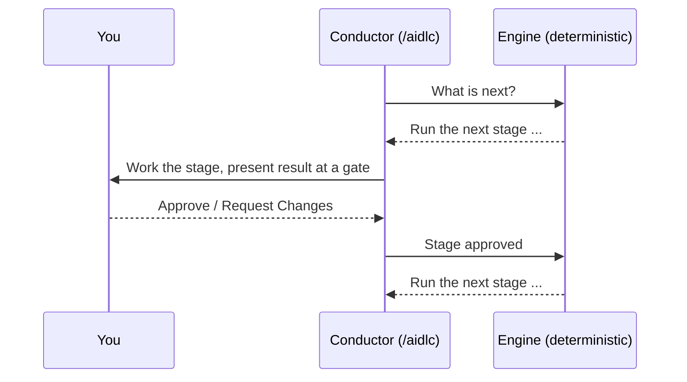

# Onboarding: A Guided First Week

New to AI-DLC v2? Teams tell us the same thing: the deterministic phase and
stage enforcement is powerful, but it is not obvious *why* the engine behaves
the way it does — and that makes the first few runs feel like fighting the tool
instead of using it.

This chapter is the hand-held path. It explains the one mental model that makes
everything else click, then walks you through a deliberate five-run progression
from a throwaway Express run to a full feature. Work through it in order. By the
end, the enforcement will feel like a seatbelt rather than a straitjacket.

> **Already installed and impatient?** Skip to
> [Run 1](#run-1-a-throwaway-express-run-15-minutes). Not installed yet? Do
> [Getting Started](01-getting-started.md) first, then come back here.

---

## The one idea that makes AI-DLC click

AI-DLC separates workflow routing from execution to keep requirements,
decisions, and implementation connected.

A **deterministic engine owns routing**, and a **conductor owns execution**:

- The **engine** (a plain, non-AI program) decides *what happens next*: which
  stage runs, which stages your scope skips, when a gate must block, when a
  phase boundary is verified. It is deterministic — same state in, same next
  move out. It does not improvise.
- The **conductor** (the `/aidlc` session) decides *how well the work is done*:
  it adopts the right agent persona, asks you good questions, and surfaces
  decisions. It never decides routing; it asks the engine for the next move,
  carries it out, reports the outcome, and asks again.



<!-- Text fallback: The conductor asks the engine what is next. The engine returns a specific stage. The conductor runs that stage with you and stops at an approval gate. You approve or request changes. The conductor reports the outcome to the engine, which returns the next move. The loop repeats. -->

**Why this matters to you as a newcomer:** almost every "why won't it just do
what I asked?" moment comes from expecting the conductor to freelance. It can't,
by design. If a stage seems stuck, it is because the engine is waiting for
something — usually your answer at a gate, or a missing input from an earlier
stage. Once you internalise "the engine routes, I unblock the gates," the
enforcement stops being mysterious.

Read [Introduction](00-introduction.md#how-the-orchestrator-works) later for the
full architecture. For now, that one paragraph is enough.

---

## Four rules of the road

These four facts explain the behaviour that surprises newcomers most. Keep them
in mind for your first week.

### 1. Stages run in order, and never before their inputs exist

The lifecycle is five phases — **Initialization → Ideation → Inception →
Construction → Operation** — and the stages within them run in a fixed order.
A stage never runs before its required inputs exist. Construction cannot write
code until the earlier stages included in your scope have produced their required
artifacts. This is the enforcement people feel first. It is not
bureaucracy: it is the engine refusing to build on inputs that do not exist yet.

If you want *less* ceremony, you don't bypass the engine: you choose a smaller
**scope**, which removes whole stages (sometimes whole phases) from the route up
front. See rule 3.

### 2. Approval gates block on purpose

After most stages, the workflow stops at an **approval gate** and waits for you
to **Approve** or **Request Changes**. It is genuinely blocked — it will not
advance on its own (except for the automatic initialization stages and, if you
opt in, ordinary Construction checkpoints).

A gate is your control point. The completion summary shows what was produced and
any open findings, each with a stable ID so a later re-check can tell you whether
the same concern was resolved, still open, or accepted as a risk. Approving with
open findings records them as accepted — that is fine and normal.

At a gate you choose what happens next: approve, request changes, switch
interaction mode, or jump to another stage. See [Interaction Modes](07-interaction-modes.md).
Work can also stop outside a gate, when a hook does not run or a check keeps
refusing the agent's commands. That is a fault, not something you did wrong:
see [When something looks stuck](#when-something-looks-stuck).

### 3. Scope controls how much runs — pick a small one first

A full `feature` runs all 33 stages. That is the right amount of ceremony for a
production feature and far too much for your first look. **Scope** (also called a
*workflow profile*) is how you dial the ceremony up or down:

| You want to... | Use | Stages |
|---|---|---|
| See the whole thing end to end, fast | `express` | 10 / 33 |
| Fix one known bug | `bugfix` | 9 / 33 |
| Test if an idea is even feasible | `poc` | 8 / 33 |
| Build a real production feature | `feature` | 33 / 33 |

Start small. A `poc` or `express` run teaches you the loop in minutes without
drowning you in gates. See [Workflow Profiles](workflow-profiles.md) for the full
set and [Scopes, Depth, and Test Strategy](05-scopes-and-depth.md) for how depth
and test strategy tune each one.

### 4. Everything is written down — the record dir is your memory

Every stage writes versioned markdown into the intent's **record dir**:

```text
aidlc/spaces/<space>/intents/<YYMMDD>-<label>/
```

Requirements, decisions, design, code summaries, and a full `audit/` trail all
live there. This is why AI-DLC does not lose the thread as your project grows,
and it is where you look when you want to know *why* something was built. You do
not need to understand the whole layout yet — just know that if you are ever
confused about what happened, the answer is on disk in that folder. See
[Spaces and Intents](03-spaces-and-intents.md) and
[Artifacts Reference](14-artifacts-reference.md).

---

## The guided progression

Do these five runs in order. Each one adds exactly one new idea. Use a scratch
project you do not mind throwing away for Runs 1–3.

> The examples below use Claude Code. Every other harness runs the identical
> workflow; only the welcome banner and status line differ. Your harness's
> chapter under [Running on other harnesses](harnesses/README.md) lists the
> differences, and [Your First Workflow](02-your-first-workflow.md) shows a fully
> annotated run.

### Run 1: A throwaway Express run (15 minutes)

**Goal:** feel the ask → stage → gate → next loop once, with the least ceremony.

```bash
mkdir /tmp/aidlc-hello && cd /tmp/aidlc-hello
aidlc config --harness claude   # use your harness
aidlc doctor
```

Open your harness and run the lightest profile:

```text
/aidlc express Build a CLI that converts between Celsius and Fahrenheit
```

Watch what happens:

1. **Initialization runs automatically.** Three stages complete in under a
   second with no gate. You did nothing — that is the lifecycle starting.
2. **The route is announced.** Because you named `express`, the workflow starts
   immediately and prints how many stages and approval gates it will run.
3. **You hit your first gate.** A stage produces something, shows a summary, and
   stops. This is rule 2. Read the summary, then **Approve**.
4. **The loop repeats** until the run completes.

**What to notice:** you never told it "now do requirements, now design." The
engine routed every step; you only answered gates. That is the whole model in
one run.

### Run 2: The same idea as a `poc` — see scope change the route

**Goal:** prove to yourself that scope, not skipping, controls ceremony.

In a fresh scratch folder (run `aidlc config --harness <your harness>` there
first, as in Run 1), run the same kind of request as a proof of concept:

```text
/aidlc poc Build a CLI that converts between Celsius and Fahrenheit
```

Compare it to Run 1. A different set of stages runs, because `poc` has a
different scope route. You changed *how much* happened by changing the profile —
you didn't skip anything by hand; the engine planned a different route. This is
rule 3 made concrete. Glance at
[the stage-by-scope matrix](05-scopes-and-depth.md#stage-by-scope-matrix) to see
exactly which stages each profile includes.

### Run 3: Request changes at a gate — feel your control point

**Goal:** learn that a gate is a two-way door, not just a rubber stamp.

Start a small `poc` run again (`poc` runs Intent Capture, which has a reviewer;
`express` disables reviewers). At the first stage gate, instead of approving, choose
**Request Changes** and give one concrete instruction (for example, "the success
criteria need a target date"). Watch the conductor return to that artifact,
revise it, and present the gate again.

**What to notice:** if the reviewer raised findings, their IDs stay stable across
the re-check, so you can see the same item move from open to resolved. Either way,
the conductor revises the artifact and re-presents the gate. This is how
you steer without editing files yourself. When you are done experimenting,
approve and let it finish. See [Interaction Modes](07-interaction-modes.md) for
the Guide Me / Edit File / Chat modes you can switch between mid-stage.

### Run 4: Inspect the record dir — find the "why" on disk

**Goal:** connect the workflow to the artifacts it leaves behind.

After Run 3 completes, open the intent's record dir:

```bash
ls aidlc/spaces/default/intents/
# open the newest <YYMMDD>-<label>/ folder
```

Read `aidlc-state.md` (run stages marked `[x]`, scope-excluded ones `[S]`) and skim
the artifacts under the phase folders your scope ran (for example `inception/`).
Open one `audit/` shard and see the decisions logged with timestamps.
This is rule 4: the record dir is the durable memory that keeps a growing project
coherent. See [State and Audit](10-state-and-audit.md) and
[Artifacts Reference](14-artifacts-reference.md).

### Run 5: A real `feature` on real code

**Goal:** put it together on work you actually care about.

In a real project, run:

```text
/aidlc feature <describe the feature you want>
```

This runs the full lifecycle. It will feel like a lot the first time — that is
the ceremony a production feature warrants. But now you know the shape: the
engine routes, phases run in order, gates are your control points, scope set the
size, and every decision lands in the record dir. Follow
[Your First Workflow](02-your-first-workflow.md) alongside this run for a
gate-by-gate narration, and lean on [Troubleshooting](15-troubleshooting.md) the
moment something looks stuck.

---

## When something looks stuck

Newcomers usually hit one of these. Most are the workflow working as
designed; the last row is a fault:

| Symptom | What is really happening | What to do |
|---|---|---|
| "It stopped and won't continue." | You are at an approval gate (rule 2). | Read the summary and answer **Approve** or **Request Changes**. |
| "It won't just write the code." | Construction needs inputs from earlier phases (rule 1). | Let the earlier stages run, or pick a smaller scope. |
| "This is way too many steps." | Your scope is larger than the task needs (rule 3). | Restart with `express`, `poc`, or `bugfix`. |
| "It asks too many questions." | Depth sets how many questions each stage asks; your scope picks a default. | Type `/aidlc --depth minimal` (about 2 to 4 questions per stage). |
| "Which stage am I on?" | The status line / progress line tells you. | On Claude Code read the status line; elsewhere run `/aidlc --status` (`$aidlc --status` on Codex). |
| "Where did that decision go?" | It is in the record dir (rule 4). | Open `aidlc/spaces/<space>/intents/<...>/` and its `audit/` shards. |
| "Every command the agent runs is refused", or the same step keeps repeating. | Something below the workflow failed: a hook is not running, or a check is refusing in error. | Stop the agent, run `aidlc doctor --export` in your own terminal, and follow the [recovery playbook](facilitator-guide.md#recovery-playbook). |

Run `aidlc doctor` from the project root for any setup, hook, provider, trust, or
stale-state problem — it names a remediation command. Then see
[Troubleshooting](15-troubleshooting.md).

---

## Onboarding checklist

- [ ] I can state the engine/conductor split in one sentence.
- [ ] I completed an `express` run and only answered gates.
- [ ] I ran the same idea at a different scope and saw the route change.
- [ ] I used **Request Changes** at a gate and watched the conductor revise and re-present.
- [ ] I found requirements, decisions, and an audit shard in a record dir.
- [ ] I ran a real `feature` end to end.

Once every box is ticked, the deterministic enforcement should read as
predictability, not friction — which is the point.

---

## Next Steps

- [Your First Workflow](02-your-first-workflow.md) — the fully annotated feature run
- [Workflow Profiles](workflow-profiles.md) — every scope and when to use it
- [Phases and Stages](04-phases-and-stages.md) — the full 5-phase, 33-stage map
- [Interaction Modes](07-interaction-modes.md) — Guide Me, Edit File, Chat, and gates
- [Spaces and Intents](03-spaces-and-intents.md) — how the workspace holds many runs
- [Glossary](glossary.md) — every term defined
