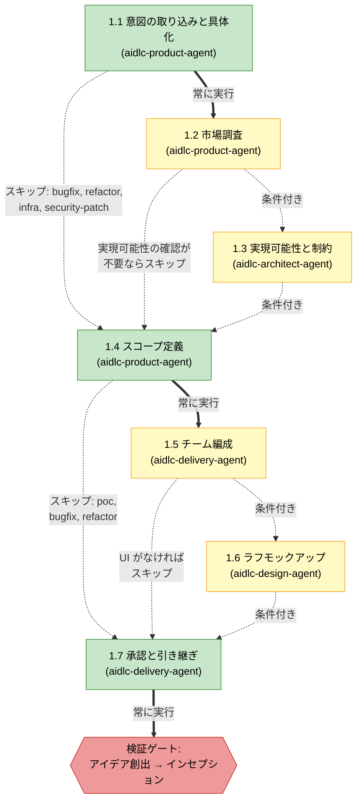
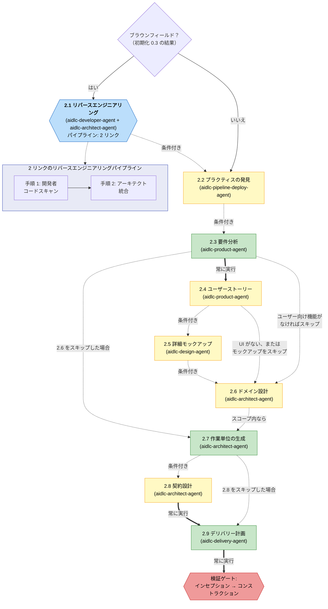
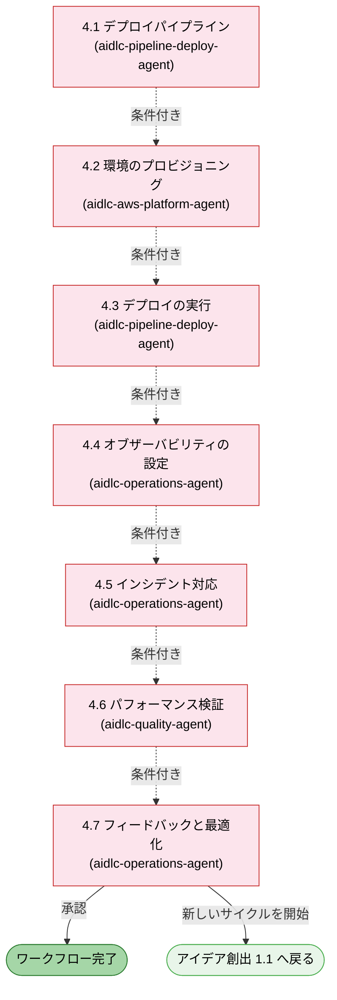

# フェーズとステージ

AI-DLC のライフサイクルは、33 のステージを含む 5 つのフェーズで構成されています。この章では各フェーズを説明し、そのステージを列挙し、どのように接続されているかを示します。

> **ハーネスに関する注記。** このガイドが説明する方法論、すなわちフェーズ、ステージ、エージェント、ゲートは、どのハーネスでも同一です。仕組みにハーネス差がある場合（ゲートがどう表示されるか、サブエージェントをどうディスパッチするか、設定がどこにあるか）は、その差異を明示し、対応するハーネスの章に表でまとめています: [他のハーネスでの実行](harnesses/README.md)。特記がない限り、ここでの例は Claude Code を使います。

---

## ライフサイクルの概要

```mermaid
graph LR
    subgraph INITIALIZATION["初期化 (0.1-0.3)"]
        Z1["ワークスペースの作成"]
        Z4["状態の初期化"]
        Z1 -.->|"3 ステージ"| Z4
    end

    subgraph IDEATION["アイデア創出 (1.1-1.7)"]
        I1["意図の取り込み"]
        I7["承認と引き継ぎ"]
        I1 -.->|"7 ステージ"| I7
    end

    subgraph INCEPTION["インセプション (2.1-2.9)"]
        N1["リバースエンジニアリング"]
        N7["デリバリー計画"]
        N1 -.->|"9 ステージ"| N7
    end

    subgraph CONSTRUCTION["コンストラクション (3.1-3.7)"]
        C1["機能設計"]
        C7["CI パイプライン"]
        C1 -.->|"3.1–3.5はUnitごと、3.6–3.7は全Unitの後に1回"| C7
    end

    subgraph OPERATION["運用 (4.1-4.7)"]
        O1["デプロイパイプライン"]
        O7["フィードバックと最適化"]
        O1 -.->|"7 ステージ"| O7
    end

    Z4 -->|"自動で次へ"| I1
    I7 -->|"検証ゲート 1"| N1
    N7 -->|"検証ゲート 2"| C1
    C7 -->|"検証ゲート 3"| O1
    O7 -.->|"フィードバックループ"| I1

    style INITIALIZATION fill:#f3e5f5,stroke:#9c27b0,color:#000
    style IDEATION fill:#e8f5e9,stroke:#4caf50,color:#000
    style INCEPTION fill:#e3f2fd,stroke:#2196f3,color:#000
    style CONSTRUCTION fill:#fff3e0,stroke:#ff9800,color:#000
    style OPERATION fill:#fce4ec,stroke:#e91e63,color:#000
```



<!-- Text fallback: 直線的な流れです。初期化（0.1-0.3）が自動でアイデア創出（1.1-1.7）へ進み、そこから検証ゲート 1 を通ってインセプション（2.1-2.9）へ、検証ゲート 2 を通ってコンストラクション（3.1-3.7）へ、検証ゲート 3 を通って運用（4.1-4.7）へ進みます。4.7 からは 1.1 へ戻るフィードバックループがあります。 -->

フェーズは順番に実行されます。各フェーズ境界では（初期化 → アイデア創出を除く）、**検証ゲート** が自動で走り、下流のステージがその上に積み上がる前に、欠けたつながり、孤立した成果物、不整合を検出します。

---

## フェーズ 0: 初期化 (Initialization)

**目的:** ワークスペースをブートストラップします。ドキュメントディレクトリの雛形を作り、ワークスペースを検出し、状態を初期化します。ウェルカムメッセージは `settings.json` の `companyAnnouncements` エントリによりセッション開始時に表示されます（ステージではありません）。

初期化のステージは **自動的に** 実行され、承認ゲートはありません。3 つとも 1 回の決定論的なツール呼び出し（`aidlc-utility intent-create`）の中で実行され、完了まで 1 秒もかかりません。

| # | ステージ | 主担当 | 主な成果物 | 条件 |
|---|-------|------|---------------|-----------|
| 0.1 | ワークスペースの作成 | オーケストレーター | 最初のインテントの記録ディレクトリ（`aidlc/spaces/<space>/intents/<YYMMDD>-<label>/`） | ALWAYS |
| 0.2 | ワークスペースの検出 | オーケストレーター | `aidlc-state.md`（ワークスペース状態） | ALWAYS |
| 0.3 | 状態の初期化 | オーケストレーター | `aidlc-state.md`、`audit/` シャード | ALWAYS |

**実行上の注意:**
- 3 つすべてのステージは `aidlc-utility intent-create` 内でインラインに実行されます。LLM サブエージェントへの委譲も、ステージごとのプロンプトもありません
- ワークスペース検出はルールベースのスキャナーです（ファイル拡張子、既知の設定ファイル名、パッケージマニフェスト）
- このフェーズでユーザー操作は不要です

---

## フェーズ 1: アイデア創出 (Ideation)

**目的:** 取り組みの妥当性を確認します。インテントを取り込み、実現可能性を評価し、スコープを定義し、チームを編成し、先へ進む承認を得ます。



<!-- Text fallback: 1.1 意図の取り込み（ALWAYS）から 1.2 市場調査（CONDITIONAL）へ進むか、直接 1.4 へ進みます。1.2 からは 1.3 実現可能性（CONDITIONAL）または 1.4 へ進みます。1.3 からは 1.4 スコープ定義（ALWAYS）へ進みます。1.4 からは 1.5 チーム編成（CONDITIONAL）または 1.7 へ進みます。1.5 からは 1.6 ラフモックアップ（CONDITIONAL、UI がなければスキップ）または 1.7 へ進みます。1.6 から 1.7 承認と引き継ぎ（ALWAYS）へ進み、その後に検証ゲート 1 があります。 -->

| # | ステージ | 主担当 | 支援 | 主な成果物 | 条件 |
|---|-------|------|-----------|---------------|-----------|
| 1.1 | 意図の取り込みと具体化 | aidlc-product-agent | aidlc-architect-agent | インテント文書、ステークホルダーマップ | ALWAYS |
| 1.2 | 市場調査 | aidlc-product-agent | — | 競合分析、構築か購入かの判断 | CONDITIONAL |
| 1.3 | 実現可能性と制約 | aidlc-architect-agent | aidlc-aws-platform-agent、aidlc-compliance-agent | 実現可能性評価、制約台帳、RAID ログ | CONDITIONAL |
| 1.4 | スコープ定義 | aidlc-product-agent | aidlc-delivery-agent | スコープ定義、インテントバックログ | ALWAYS |
| 1.5 | チーム編成 | aidlc-delivery-agent | — | チーム評価、モブ編成計画 | CONDITIONAL |
| 1.6 | ラフモックアップ | aidlc-design-agent | aidlc-product-agent | ワイヤーフレーム、ユーザーフロー、コンセプト資料 | CONDITIONAL |
| 1.7 | 承認と引き継ぎ | aidlc-delivery-agent | aidlc-product-agent | 取り組み概要書、意思決定ログ | ALWAYS |

**ステージの色:** 緑 = ALWAYS（選択したスコープに含まれていれば必ず実行）。黄 = CONDITIONAL（スコープ、プロジェクト種別、プランに応じてスキップされることがある）。スコープごとの正確なステージ構成は[ステージ×スコープ・マトリクス](05-scopes-and-depth.md#stage-by-scope-matrix)を参照してください。

意図の取り込み（Intent Capture）は、最初の説明、ワークフローが選択したスコープ、使用したメモリルールを質問ファイルに記録します。インテント文書とステークホルダーマップ内の主張にはインラインのソースタグが付き、どちらの成果物も前提と未解決の疑問点を明示します。保持された前提は、プロダクトリードのレビュアーと承認ゲートが実行される前に、明示的な確認を必要とします。

---

## フェーズ 2: インセプション (Inception)

**目的:** 要件を詳細化します。コードベースを分析し、要件を引き出し、アーキテクチャを設計し、作業単位に分解し、デリバリーを計画します。



<!-- Text fallback: ブラウンフィールド判定（ステージ 0.3 の結果）を行います。はいの場合、2.1 リバースエンジニアリングが 2 リンクのパイプライン（開発者によるコードスキャンの後にアーキテクトによる統合と書き出し）として実行されます。その後、2.2 プラクティスの発見が、含まれるすべてのスコープに対してハブアンドスポーク（主担当のドラフト、互いにブラインドな quality/developer/devsecops のスポーク、人間へのインタビュー、主担当による統合）として実行され、確認・確定された内容をアクティブスペースのメモリへ昇格させます。続いて 2.3 要件分析（ALWAYS）、必要に応じて 2.4 ユーザーストーリーのモブ、必要に応じて 2.5 詳細モックアップ、必要に応じて 2.6 ドメイン設計、2.7 作業単位の生成（ALWAYS）、必要に応じて 2.8 契約設計、2.9 デリバリー計画（ALWAYS）と続き、最後に検証ゲート 2 を通ります。 -->

| # | ステージ | 主担当 | 支援 | 主な成果物 | 条件 |
|---|-------|------|-----------|---------------|-----------|
| 2.1 | リバースエンジニアリング | aidlc-developer-agent | aidlc-architect-agent | 9 つのリバースエンジニアリング成果物 | ブラウンフィールドプロジェクト |
| 2.2 | プラクティスの発見 | aidlc-pipeline-deploy-agent | aidlc-quality-agent、aidlc-developer-agent、aidlc-devsecops-agent | `team-practices.md`、`discovered-rules.md`、`evidence.md`（承認・確定時に `aidlc/spaces/<active-space>/memory/team.md` / `project.md` へ昇格） | CONDITIONAL |
| 2.3 | 要件分析 | aidlc-product-agent | — | `requirements.md` | ALWAYS |
| 2.4 | ユーザーストーリー | aidlc-product-agent | aidlc-design-agent、aidlc-developer-agent、aidlc-quality-agent | `stories.md`、`personas.md` | ユーザー向け機能がある場合 |
| 2.5 | 詳細モックアップ | aidlc-design-agent | aidlc-product-agent | 高精細モックアップ、インタラクション仕様 | UI のあるプロジェクト |
| 2.6 | ドメイン設計 | aidlc-architect-agent | aidlc-aws-platform-agent、aidlc-design-agent | `components.md`、`decisions.md`（ADR） | 実行計画による |
| 2.7 | 作業単位の生成 | aidlc-architect-agent | aidlc-delivery-agent | `unit-of-work.md`、`unit-of-work-dependency.md`（DAG）、`unit-of-work-story-map.md` | ALWAYS |
| 2.8 | 契約設計 | aidlc-architect-agent | aidlc-aws-platform-agent | `contract-summary.md` | CONDITIONAL |
| 2.9 | デリバリー計画 | aidlc-delivery-agent | aidlc-architect-agent | `bolt-plan.md`、`team-allocation.md`、`risk-and-sequencing-rationale.md`、`external-dependency-map.md` | ALWAYS |

---

**主な動作:** 2.1はdeveloperのコード調査、architectの統合・成果物出力の2段階パイプラインです。各返却を順序付きの永続記録にし、複数repoでは各repoの完全な連鎖が承認に必要です。ブラウンフィールドだけで実行します。2.2は主担当の下書き、独立したquality/developer/devsecopsの検討、人への聞取り、主担当の統合です。2.4は主担当とdesign/developer/qualityのmobです。

## フェーズ 3: コンストラクション (Construction)

**目的:** 設計、実装、テストを、確認できる小さな単位で進めます。

### Unitを完成・検証してから次へ進む

新規のソロワークフローで、Unit分解とソースを生成するConstructionステージを含む場合、既定は **unit-major・直列実行・検証済みUnitチェックポイント** です。各Unitの適用対象の設計とコード生成を終えてから次へ進みます。実行順は `unit-of-work-dependency.md` が決めます。`bolt-plan.md` はデリバリーのまとまりと理由を記録し、このDAGを置き換えません。

skeleton-onでは、DAGの最初のUnitを最小の動作する統合実装にします。実際のエンドツーエンド検証を通し、人間が承認するまで後続Unitへ進みません。明示的にstage-majorを選んだ場合も同じです。最初の設計ステージのレビューだけでは、動作するスケルトンの証明にはなりません。

検証には、そのインテントに記録した、人間が許可した `Construction Verification Command` を全Unit／バッチで再利用します。Delivery Planningでプロジェクト調査に基づくコマンドを提案し、呼出元のSessionStartセッションで **Approve** または **Request Changes** の回答を記録します。許可になるのはApproveだけです。別の質問への回答、別セッションの回答、Request Changesは許可になりません。まだ実行できる検証がない場合は選択を延期できますが、最初のチェックポイントで許可を得る必要があります。許可の欠落やコマンド変更時には、[検証コマンドの記録手順](https://github.com/awslabs/aidlc-workflows/blob/2a883858f5483bce3b48f43b8f6d3ca2c042d6ae/docs/guide/12-cli-commands.md#construction-verification-command-record-human-authorization)を使います。

承認画面には `Verified with <verification_command> (exit 0)` が表示されます。検証ツールは証明ファイルとともに `CHECKPOINT_VERIFICATION_RECORDED` を記録します。手書きの証明ファイルだけではUnitを検証済みにできません。

### チェックポイントの人間の回答

コーディネーターは質問前に次を実行します。

```bash
aidlc engine bolt checkpoint --action ask --unit "<unit>" --kind <unit|skeleton> --session "<session ID>"
```

そのセッションの、その質問に対する **Approve** / **Request Changes** の実際の回答だけが対応する操作を許可します。承認・却下時にも同じ `--session` と実際に選ばれた `--user-input` を使います。チェックポイントが変わったら質問と回答を取り直します。`human_required: false` の自動承認ではaskとuser-inputは不要ですが、人間によるRequest Changesには常にこの手順が必要です。

自律実行の選択肢は **Continue automatically** / **Review each checkpoint** です。対象のワークフローでは、skeleton-offならConstruction開始時、skeleton-onなら実際のスケルトン承認後に提示します。記録済みなら繰り返しません。後から許可・取消もできます。どちらを選んでも、Plan Approval、有効な要約確認、検証コマンドの選択、失敗時の判断は人間に残ります。要約確認は `directive.ceremony.summary_confirmation === "on"` の場合だけ必要です。

既存のワークフロー、設計のみ、Unitのない作業は従来のステージ承認を維持します。チーム所有のUnitは独自のper-stage／unit-endのゲート設定を維持します。明示的に選んだ反復順も変更しません。

### Constructionの進み方

対象となるソロワークフローは、最初の統合Unitの実装・検証と人間のスケルトン承認（skeleton-onの場合）、自律実行方針の選択、残るUnitごとの実装・検証・チェックポイント、全体のBuild and Test、必要ならCI Pipeline、Operationへの境界検証の順に進みます。`completion_only` のステージ指示は完了記録を整えるもので、ステージ本文・レビュー・人間への完了承認を繰り返しません。

### 並列Unitバッチ

unit-majorは直列です。対象となるチェックポイントワークフローでswarmを使うには、stage-majorと `Construction Execution: swarm` を明示的に選びます。実行方式と承認方式は別で、バッチ承認は人間による確認にも自動にもできます。依存関係を満たすUnitを並列に実行し、すでにチェックポイントで承認したinline Unitは再実装しません。

最初の保護されたprepareの前に、承認済みの親アプリケーションソースをコミットし、再現できる状態にします。inlineスケルトンも対象です。ツールは自動でコミットせず、子worktreeを作る前に全Unitを検査します。[Swarm prepare](https://github.com/awslabs/aidlc-workflows/blob/2a883858f5483bce3b48f43b8f6d3ca2c042d6ae/docs/guide/12-cli-commands.md#aidlc-engine-swarm-prepare-prepare-a-reproducible-batch)を参照してください。

人間がバッチ完了を判断する場合、次を実行してからApprove / Request Changesを提示し、その質問への実際の回答を待ちます。

```bash
aidlc engine bolt swarm-checkpoint --action ask --batch <N> --units "<Units>" --session "<session ID>"
```

承認・却下には同じセッションを使い、別の質問への回答を流用しません。自動承認ではaskとuser-inputは不要です。各UnitのPlan Approvalは必須で、まとめて提示しても個別の承認記録は必要です。並列実行するUnitはエンジンの指示から取得し、Bolt計画のグループから推測しません。`BOLT_STARTED` / `BOLT_COMPLETED` はswarm／worktree経路のイベントで、直列inline作業はUnitのライフサイクルとチェックポイント記録を使います。

### 失敗時は停止して確認

自律実行中も失敗時は停止します。Build and Testのループバックの第4段階も人間に戻ります。コード生成が失敗した場合は **retry**（該当Unitだけ再実行）、**skip**（`[S]`として続行。依存Unitも失敗する可能性あり）、**abort** を選びます。並列バッチでは全Unitの終了を待ち、成功したUnitの成果物を保持して、失敗したUnitだけを対象に判断します。

### ステージ一覧

| # | ステージ | 主担当 | 主な成果物 | 実行単位 |
|---|---|---|---|---|
| 3.1 | 機能設計 | aidlc-architect-agent | `entities.md`、`rules.md`、`functional-spec.md` | Unitごと（計画による） |
| 3.2 | 非機能要件 | aidlc-architect-agent | 性能・安全性・拡張性・信頼性・可観測性の要件 | Unitごと（条件付き） |
| 3.3 | 非機能設計 | aidlc-architect-agent | 非機能設計仕様 | Unitごと（条件付き） |
| 3.4 | インフラ設計 | aidlc-aws-platform-agent | インフラ仕様・IaC設計 | Unitごと（条件付き） |
| 3.5 | コード生成 | aidlc-developer-agent | アプリケーションコード・コード文書 | Unitごと（常に） |
| 3.6 | ビルドとテスト | aidlc-quality-agent | テスト結果・品質報告 | 最後に全体で1回 |
| 3.7 | CIパイプライン | aidlc-pipeline-deploy-agent | CI設定・品質ゲート | 最後に全体で1回（条件付き） |

---

## フェーズ 4: 運用 (Operation)

**目的:** デプロイと運用を行います。デプロイパイプラインを整え、環境を用意し、オブザーバビリティを設定し、フィードバックループを確立します。



<!-- Text fallback: すべての運用ステージは CONDITIONAL です。4.1 から 4.7 へ順に進みます。ステージ 4.7 では、そのままワークフローを完了するか、新しいアイデア創出サイクルを 1.1 から始めるかを選べます。 -->

| # | ステージ | 主担当 | 支援 | 主な成果物 | 条件 |
|---|-------|------|-----------|---------------|-----------|
| 4.1 | デプロイパイプライン | aidlc-pipeline-deploy-agent | — | CD 設定、デプロイ戦略、ロールバック手順書 | CONDITIONAL |
| 4.2 | 環境のプロビジョニング | aidlc-aws-platform-agent | aidlc-devsecops-agent、aidlc-compliance-agent | 環境一覧、検証レポート | CONDITIONAL |
| 4.3 | デプロイの実行 | aidlc-pipeline-deploy-agent | aidlc-developer-agent | デプロイログ、スモークテスト、ヘルスチェック | CONDITIONAL |
| 4.4 | オブザーバビリティの設定 | aidlc-operations-agent | — | ダッシュボード、アラーム、SLO 設定 | CONDITIONAL |
| 4.5 | インシデント対応 | aidlc-operations-agent | — | SSM 手順書、インシデント対応計画、エスカレーションマトリクス | CONDITIONAL |
| 4.6 | パフォーマンス検証 | aidlc-quality-agent | — | 負荷テスト結果、NFR 検証マトリクス | CONDITIONAL |
| 4.7 | フィードバックと最適化 | aidlc-operations-agent | aidlc-aws-platform-agent | SLO レポート、コスト分析、フィードバックループ文書 | CONDITIONAL |

**主な動作:**
- 7 つすべてのステージは **条件付き** です。`mvp`、`poc` の各スコープでは、フェーズ全体がスキップされることがあります
- ステージ 4.7 は **終端ステージ** です。ここを承認するとワークフローは完了します
- 4.7 から 1.1 へ戻る **フィードバックループ** により、反復的な開発サイクルを回せます

---

## フェーズ遷移と検証ゲート

各フェーズ境界（アイデア創出 → インセプション、インセプション → コンストラクション、コンストラクション → 運用）で、フレームワークは **フェーズ境界検証** を実行します。この自動チェックは次を検証します。

- 完了したフェーズに必要な成果物がすべて存在すること
- 成果物間のトレーサビリティリンクが保たれていること（例: すべての要件がストーリーに対応していること）
- 孤立した成果物や欠落した参照がないこと
- 関連する成果物同士に一貫性があること

検証が失敗すると、コンダクターは問題点を報告し、このまま進むか、戻って直すかを尋ねます。

---

## ステージ実行モードのリファレンス

| モード | ステージ | ユーザー操作 | 説明 |
|------|--------|-----------------|-------------|
| インライン（自動続行） | 0.1、0.2、0.3 | なし | `aidlc-utility intent-create` の中で決定論的に実行、承認ゲートなし |
| インライン | 29 ステージ | あり | エージェントが会話の中で作業し、最後に承認ゲートを出す |
| サブエージェント | 2.2、3.5 | 2.2 はプラクティスのインタビュー + 最終ゲート、3.5 は承認ゲート | ハブアンドスポークのプラクティスの発見。単独集中のコード生成 |
| パイプライン（2 リンク） | 2.1 | 承認ゲートのみ | 開発者によるスキャンの後、アーキテクトによる統合と書き出し |
| モブ | 2.4 | ステージ途中の判断確認の質問 + 承認ゲート | 主担当がドラフトを作成し、design/developer/quality がコントリビューションファイルを介して並行で協働する |

全 33 ステージのトポロジー内訳は、**インライン 29 / サブエージェント 2 / パイプライン 1 / モブ 1** です。

---

## 次のステップ

- [スコープ、深度、テスト戦略](05-scopes-and-depth.md) — スコープがどのステージを実行するかをどう制御するか（完全な[ステージ×スコープ・マトリクス](05-scopes-and-depth.md#stage-by-scope-matrix)を含む）
- [エージェント](06-agents.md) — 11 のエージェントとその役割
- [最初のワークフロー](02-your-first-workflow.md) — 注釈付きウォークスルー
- [用語集](glossary.md) — 用語リファレンス
