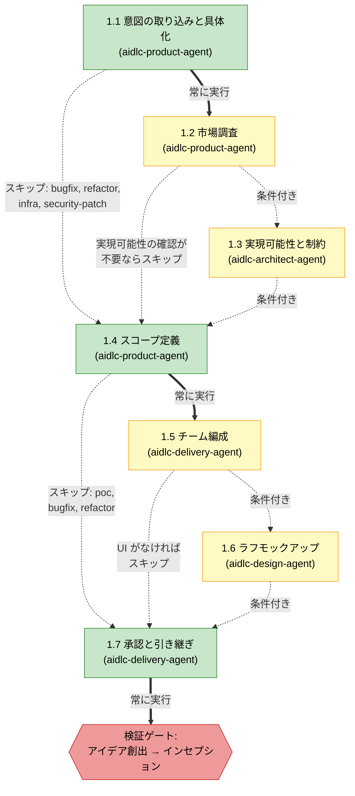
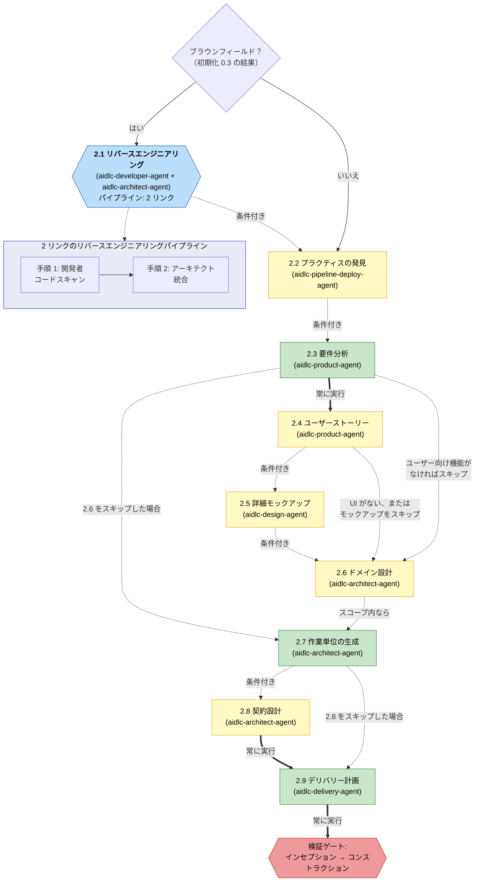
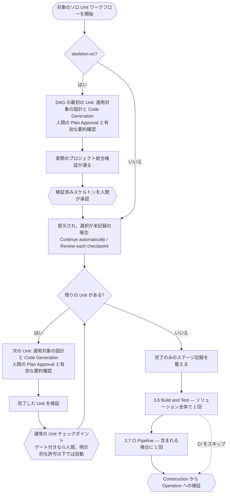
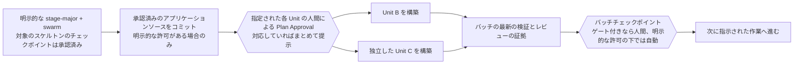
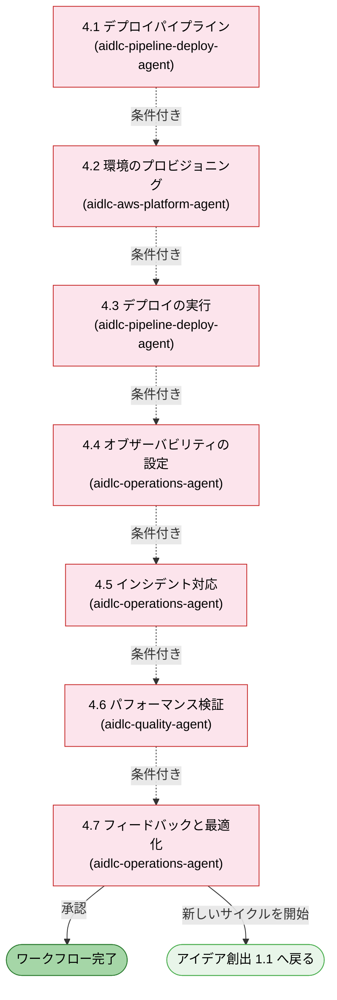

# フェーズとステージ

AI-DLC のライフサイクルは、33 のステージを含む 5 つのフェーズで構成されています。この章では各フェーズを説明し、そのステージを列挙し、どのように接続されているかを示します。

> **ハーネスに関する注記。** このガイドが説明する方法論、すなわちフェーズ、ステージ、エージェント、ゲートは、どのハーネスでも同一です。仕組みにハーネス差がある場合（ゲートがどう表示されるか、サブエージェントをどうディスパッチするか、設定がどこにあるか）は、その差異を明示し、対応するハーネスの章に表でまとめています: [他のハーネスでの実行](harnesses/README.md)。特記がない限り、ここでの例は Claude Code を使います。

---

## ライフサイクルの概要

```mermaid
graph LR
    subgraph INITIALIZATION["初期化 (0.1-0.3)"]
        Z1["ワークスペースの作成"]
        Z4["状態の初期化"]
        Z1 -.->|"3 ステージ"| Z4
    end

    subgraph IDEATION["アイデア創出 (1.1-1.7)"]
        I1["意図の取り込み"]
        I7["承認と引き継ぎ"]
        I1 -.->|"7 ステージ"| I7
    end

    subgraph INCEPTION["インセプション (2.1-2.9)"]
        N1["リバースエンジニアリング"]
        N7["デリバリー計画"]
        N1 -.->|"9 ステージ"| N7
    end

    subgraph CONSTRUCTION["コンストラクション (3.1-3.7)"]
        C1["機能設計"]
        C7["CI パイプライン"]
        C1 -.->|"3.1–3.5はUnitごと、3.6–3.7は全Unitの後に1回"| C7
    end

    subgraph OPERATION["運用 (4.1-4.7)"]
        O1["デプロイパイプライン"]
        O7["フィードバックと最適化"]
        O1 -.->|"7 ステージ"| O7
    end

    Z4 -->|"自動で次へ"| I1
    I7 -->|"検証ゲート 1"| N1
    N7 -->|"検証ゲート 2"| C1
    C7 -->|"検証ゲート 3"| O1
    O7 -.->|"フィードバックループ"| I1

    style INITIALIZATION fill:#f3e5f5,stroke:#9c27b0,color:#000
    style IDEATION fill:#e8f5e9,stroke:#4caf50,color:#000
    style INCEPTION fill:#e3f2fd,stroke:#2196f3,color:#000
    style CONSTRUCTION fill:#fff3e0,stroke:#ff9800,color:#000
    style OPERATION fill:#fce4ec,stroke:#e91e63,color:#000
```

<!-- Text fallback: 直線的な流れです。初期化（0.1-0.3）が自動でアイデア創出（1.1-1.7）へ進み、そこから検証ゲート 1 を通ってインセプション（2.1-2.9）へ、検証ゲート 2 を通ってコンストラクション（3.1-3.7）へ、検証ゲート 3 を通って運用（4.1-4.7）へ進みます。4.7 からは 1.1 へ戻るフィードバックループがあります。 -->

フェーズは順番に実行されます。各フェーズ境界では（初期化 → アイデア創出を除く）、**検証ゲート** が自動で走り、下流のステージがその上に積み上がる前に、欠けたつながり、孤立した成果物、不整合を検出します。

### 順に実行されるもの、並行して実行されるもの

**ステージは 1 つずつ、順番に実行されます。** ステージが完了すると、エンジンはライフサイクルの順で、スコープが実行し、まだ完了もスキップもしていない次のステージへ進みます（Construction は後述のとおり、Unit ごとにステージを繰り返します）。1 つのワークフローの中では、前のフェーズのステージが開いている間、後のフェーズは始まりません。

- それでも先へ進むにはジャンプします: `/aidlc --stage <name>` または `/aidlc --phase <name>`。飛ばしたステージはスキップ（`[S]`）として記録され、後から自動で実行されることはありません。前のステージへ戻るジャンプは、そのステージと計画上それ以降のすべてのステージを開き直します。ファイルは残り、開き直したステージは以前のファイルを見つけると、残すか、修正するか、最初からやり直すかを尋ねます。[ステージのスキップと移動](07-interaction-modes.md#ステージのスキップと移動)を参照してください。
- ワークフローを動かさずに 1 つのステージだけを実行するには、`/aidlc --stage <name> --single` を使います。そのステージの成果物を書き、ワークフローのゲートなしで止まります。ワークフローは元の位置のままです。

**Construction は Unit ごとにステージを繰り返します。** 進み方は 2 通りです。

- **Unit-major**（Unit があってソースを生成する、新規のソロ作業の既定）: 1 つの Unit が設計ステージと Code Generation を通り、次の Unit が最初の設計ステージからまた始めます。各 Unit は検証済みの Unit チェックポイントで承認し、最後の Unit の後に来るステージゲートは記録上の手続きとして扱われます。Unit チェックポイントのないワークフロー（古いものなど）では、代わりにそれらのステージ承認がまとめて 1 つの質問になります。1 回の Approve ですべてが承認され、変更依頼ではどれも承認されません。ある Unit のステージに対する変更（「beta の NFR 設計で、失敗した呼び出しをキュー経由で再試行する」など）は、あなたの言葉に基づいて、その Unit についてだけそのステージ以降をやり直します。ほかの Unit には何も聞かず、その 1 つの質問は一度だけ戻ってきます。[Construction がこう動く理由](#construction-がこう動く理由)を参照してください。
- **Stage-major**: すべての Unit が 1 つのステージを通ってから次のステージが始まり、そのステージのゲートは最後の Unit の後に一度だけ来ます。walking skeleton がオンの場合は、それでも最初の Unit が Code Generation を含むすべてのステージを通ってから、ほかの Unit が始まります。

**並行して実行できるもの**（ステージ内、または Construction の Unit 間）:

- **Construction の Unit。** `Construction Execution: swarm` を指定した stage-major の進み方では、依存が完了した Unit が 1 つのバッチでまとめて構築され、1 つのバッチチェックポイントを共有します。Unit-major は直列のままです。[並列Unitバッチ](#並列unitバッチ)を参照してください。
- **Unit ごとの設計パス。** stage-major の進み方では、設計ステージが互いに依存しない Unit の波（wave）をまとめて渡すことがあります。
- **チームモードでの人。** `Unit Ownership: team` では、各自が Unit を claim し、自分のチェックアウトでほかの人と同時に構築します。チェックアウトごとに現在位置を持つので、2 人が同時に別々の Construction ステージにいることもできます。その Unit の依存と、必要な walking skeleton が完了するまで、claim は拒否されます。
- **ステージ内のエージェント。** User Stories（2.4）はモブで、design、developer、quality の各エージェントが同時に貢献します。Practices Discovery（2.2）では、点検役が互いに独立してドラフトを見ます。ハーネスが並列にディスパッチできる場合、エージェントと設計の波は同時に動きます。できないハーネスでは、同じ指示で 1 つずつ順に動きます。[ステージ実行モードのリファレンス](#ステージ実行モードのリファレンス)を参照してください。

**必ず止まる場所と、設定で変わること。**

- スコープが実行するステージは、初期化を除いてすべて承認ゲートで終わります。どのステージを実行するかはスコープが決め、スコープがスキップしたステージにはゲートがありません。Construction では、上の進み方によって Unit ごとに承認するかステージごとに承認するかが決まります。チームモードでは、claim 時に選んだゲートのリズム（`per-stage` または `unit-end`）がレビューの区切りを決めます。[複数チームの Construction](workshop-mode.md) を参照してください。
- Construction で **Continue automatically** を選ぶと、通常の完了チェックポイントは省かれます。それでも Plan Approval（その作業で plan approval がオフでない限り）、有効な要約確認、検証コマンドの選択、スケルトンの承認、すべての失敗はあなたに届きます。
- 手続きの切り替えが取り除くのは、名前どおりのものだけです: センサー、学び（learnings）、要約確認、plan approval、コラボレーター（ステージが呼び込む支援エージェント）。[手続きの切り替え](13-customization.md#手続きの切り替え)を参照してください。Guard Policy はガードがどれだけ強く効くかを変えるもので、どのゲートが表示されるかは変えません。
- あなたに提示されたゲートを承認するには、あなたからの実際のメッセージが必要です。スコープ、作業ごとの設定、Guard Policy のどれもこれを緩めません。緩められるのは、マシン全体に設定するか `aidlc config flags --bypass` で記録した `AIDLC_SKIP_HUMAN_PRESENCE_GUARD=1` だけで、オフの間は AI-DLC がそのことを伝えます。自動で進めることを選んだチェックポイントは、あなたに尋ねずに記録されます。

**後のステージが前のステージにどう依存するか。** 各ステージは、読む成果物（`consumes`）と書く成果物（`produces`）を宣言します。エンジンはステージに必要なパスを渡します。必須の入力が欠けている場合、ステージにはそれが想定どおり（それを作るステージがスコープにない）なのか、本当の欠落（ジャンプでスキップしたステージなど）なのかが伝えられます。想定どおりの欠落なら、ステージはファイルをでっち上げず、存在するものから作業します。本当の欠落はあなたに提示されるので、そのファイルを作るステージを実行するか、自分でファイルを置いてください。各フェーズ境界の検証ゲートは、フェーズ間のつながりが保たれていることを確かめます。

---

## フェーズ 0: 初期化 (Initialization)

**目的:** ワークスペースをブートストラップします。ドキュメントディレクトリの雛形を作り、ワークスペースを検出し、状態を初期化します。ウェルカムメッセージは `settings.json` の `companyAnnouncements` エントリによりセッション開始時に表示されます（ステージではありません）。

初期化のステージは **自動的に** 実行され、承認ゲートはありません。3 つとも 1 回の決定論的なツール呼び出し（`aidlc-utility intent-create`）の中で実行され、完了まで 1 秒もかかりません。

| # | ステージ | 主担当 | 主な成果物 | 条件 |
|---|-------|------|---------------|-----------|
| 0.1 | ワークスペースの作成 | オーケストレーター | 最初のインテントの記録ディレクトリ（`aidlc/spaces/<space>/intents/<YYMMDD>-<label>/`） | ALWAYS |
| 0.2 | ワークスペースの検出 | オーケストレーター | `aidlc-state.md`（ワークスペース状態） | ALWAYS |
| 0.3 | 状態の初期化 | オーケストレーター | `aidlc-state.md`、`audit/` シャード | ALWAYS |

**実行上の注意:**
- 3 つすべてのステージは `aidlc-utility intent-create` 内でインラインに実行されます。LLM サブエージェントへの委譲も、ステージごとのプロンプトもありません
- ワークスペース検出はルールベースのスキャナーです（ファイル拡張子、既知の設定ファイル名、パッケージマニフェスト）
- このフェーズでユーザー操作は不要です

---

## フェーズ 1: アイデア創出 (Ideation)

**目的:** 取り組みの妥当性を確認します。インテントを取り込み、実現可能性を評価し、スコープを定義し、チームを編成し、先へ進む承認を得ます。

```mermaid
flowchart TD
    S11["1.1 意図の取り込みと具体化\n(aidlc-product-agent)"]
    S12["1.2 市場調査\n(aidlc-product-agent)"]
    S13["1.3 実現可能性と制約\n(aidlc-architect-agent)"]
    S14["1.4 スコープ定義\n(aidlc-product-agent)"]
    S15["1.5 チーム編成\n(aidlc-delivery-agent)"]
    S16["1.6 ラフモックアップ\n(aidlc-design-agent)"]
    S17["1.7 承認と引き継ぎ\n(aidlc-delivery-agent)"]
    VG1{{"検証ゲート:\nアイデア創出 → インセプション"}}

    S11 ==>|常に実行| S12
    S11 -.->|"スキップ: bugfix, refactor,\ninfra, security-patch"| S14
    S12 -.->|条件付き| S13
    S12 -.->|"実現可能性の確認が\n不要ならスキップ"| S14
    S13 -.->|条件付き| S14
    S14 ==>|常に実行| S15
    S14 -.->|"スキップ: poc,\nbugfix, refactor"| S17
    S15 -.->|条件付き| S16
    S15 -.->|"UI がなければ\nスキップ"| S17
    S16 -.->|条件付き| S17
    S17 ==>|常に実行| VG1

    style S11 fill:#c8e6c9,stroke:#388e3c,color:#000
    style S14 fill:#c8e6c9,stroke:#388e3c,color:#000
    style S17 fill:#c8e6c9,stroke:#388e3c,color:#000
    style S12 fill:#fff9c4,stroke:#f9a825,color:#000
    style S13 fill:#fff9c4,stroke:#f9a825,color:#000
    style S15 fill:#fff9c4,stroke:#f9a825,color:#000
    style S16 fill:#fff9c4,stroke:#f9a825,color:#000
    style VG1 fill:#ef9a9a,stroke:#c62828,color:#000
```

<!-- Text fallback: 1.1 意図の取り込み（ALWAYS）から 1.2 市場調査（CONDITIONAL）へ進むか、直接 1.4 へ進みます。1.2 からは 1.3 実現可能性（CONDITIONAL）または 1.4 へ進みます。1.3 からは 1.4 スコープ定義（ALWAYS）へ進みます。1.4 からは 1.5 チーム編成（CONDITIONAL）または 1.7 へ進みます。1.5 からは 1.6 ラフモックアップ（CONDITIONAL、UI がなければスキップ）または 1.7 へ進みます。1.6 から 1.7 承認と引き継ぎ（ALWAYS）へ進み、その後に検証ゲート 1 があります。 -->

| # | ステージ | 主担当 | 支援 | 主な成果物 | 条件 |
|---|-------|------|-----------|---------------|-----------|
| 1.1 | 意図の取り込みと具体化 | aidlc-product-agent | aidlc-architect-agent | インテント文書、ステークホルダーマップ | ALWAYS |
| 1.2 | 市場調査 | aidlc-product-agent | — | 競合分析、構築か購入かの判断 | CONDITIONAL |
| 1.3 | 実現可能性と制約 | aidlc-architect-agent | aidlc-aws-platform-agent、aidlc-compliance-agent | 実現可能性評価、制約台帳、RAID ログ | CONDITIONAL |
| 1.4 | スコープ定義 | aidlc-product-agent | aidlc-delivery-agent | スコープ定義、インテントバックログ | ALWAYS |
| 1.5 | チーム編成 | aidlc-delivery-agent | — | チーム評価、モブ編成計画 | CONDITIONAL |
| 1.6 | ラフモックアップ | aidlc-design-agent | aidlc-product-agent | ワイヤーフレーム、ユーザーフロー、コンセプト資料 | CONDITIONAL |
| 1.7 | 承認と引き継ぎ | aidlc-delivery-agent | aidlc-product-agent | 取り組み概要書、意思決定ログ | ALWAYS |

**ステージの色:** 緑 = ALWAYS（選択したスコープに含まれていれば必ず実行）。黄 = CONDITIONAL（スコープ、プロジェクト種別、プランに応じてスキップされることがある）。スコープごとの正確なステージ構成は[ステージ×スコープ・マトリクス](05-scopes-and-depth.md#stage-by-scope-matrix)を参照してください。

意図の取り込み（Intent Capture）は、最初の説明、ワークフローが選択したスコープ、使用したメモリルールを質問ファイルに記録します。インテント文書とステークホルダーマップ内の主張にはインラインのソースタグが付き、どちらの成果物も前提と未解決の疑問点を明示します。保持された前提は、プロダクトリードのレビュアーと承認ゲートが実行される前に、明示的な確認を必要とします。

---

## フェーズ 2: インセプション (Inception)

**目的:** 要件を詳細化します。コードベースを分析し、要件を引き出し、アーキテクチャを設計し、作業単位に分解し、デリバリーを計画します。

```mermaid
flowchart TD
    S21{{"`**2.1 リバースエンジニアリング**
    (aidlc-developer-agent + aidlc-architect-agent)
    パイプライン: 2 リンク`"}}
    S2P["2.2 プラクティスの発見\n(aidlc-pipeline-deploy-agent)"]
    S22["2.3 要件分析\n(aidlc-product-agent)"]
    S23["2.4 ユーザーストーリー\n(aidlc-product-agent)"]
    S24["2.5 詳細モックアップ\n(aidlc-design-agent)"]
    S25["2.6 ドメイン設計\n(aidlc-architect-agent)"]
    S26["2.7 作業単位の生成\n(aidlc-architect-agent)"]
    S2C["2.8 契約設計\n(aidlc-architect-agent)"]
    S27["2.9 デリバリー計画\n(aidlc-delivery-agent)"]
    VG2{{"検証ゲート:\nインセプション → コンストラクション"}}

    BF_CHECK{"ブラウンフィールド？\n（初期化 0.3 の結果）"}
    BF_CHECK -->|はい| S21
    BF_CHECK -->|いいえ| S2P
    S21 -.->|条件付き| S2P
    S2P -.->|条件付き| S22

    subgraph RE_DETAIL["2 リンクのリバースエンジニアリングパイプライン"]
        direction LR
        DEV_SCAN["手順 1: 開発者\nコードスキャン"]
        ARCH_SYNTH["手順 2: アーキテクト\n統合"]
        DEV_SCAN --> ARCH_SYNTH
    end

    S21 -.-> RE_DETAIL

    S22 ==>|常に実行| S23
    S22 -.->|"ユーザー向け機能が\nなければスキップ"| S25
    S23 -.->|条件付き| S24
    S23 -.->|"UI がない、または\nモックアップをスキップ"| S25
    S24 -.->|条件付き| S25
    S25 -.->|"スコープ内なら"| S26
    S22 -.->|"2.6 をスキップした場合"| S26
    S26 -.->|条件付き| S2C
    S26 -.->|"2.8 をスキップした場合"| S27
    S2C ==>|常に実行| S27
    S27 ==>|常に実行| VG2

    style S21 fill:#bbdefb,stroke:#1565c0,color:#000
    style S2P fill:#fff9c4,stroke:#f9a825,color:#000
    style S22 fill:#c8e6c9,stroke:#388e3c,color:#000
    style S26 fill:#c8e6c9,stroke:#388e3c,color:#000
    style S27 fill:#c8e6c9,stroke:#388e3c,color:#000
    style S23 fill:#fff9c4,stroke:#f9a825,color:#000
    style S24 fill:#fff9c4,stroke:#f9a825,color:#000
    style S25 fill:#fff9c4,stroke:#f9a825,color:#000
    style S2C fill:#fff9c4,stroke:#f9a825,color:#000
    style VG2 fill:#ef9a9a,stroke:#c62828,color:#000
    style RE_DETAIL fill:#e8eaf6,stroke:#3f51b5,color:#000
```

<!-- Text fallback: ブラウンフィールド判定（ステージ 0.3 の結果）を行います。はいの場合、2.1 リバースエンジニアリングが 2 リンクのパイプライン（開発者によるコードスキャンの後にアーキテクトによる統合と書き出し）として実行されます。その後、2.2 プラクティスの発見が、含まれるすべてのスコープに対してハブアンドスポーク（主担当のドラフト、互いにブラインドな quality/developer/devsecops のスポーク、人間へのインタビュー、主担当による統合）として実行され、確認・確定された内容をアクティブスペースのメモリへ昇格させます。続いて 2.3 要件分析（ALWAYS）、必要に応じて 2.4 ユーザーストーリーのモブ、必要に応じて 2.5 詳細モックアップ、必要に応じて 2.6 ドメイン設計、2.7 作業単位の生成（ALWAYS）、必要に応じて 2.8 契約設計、2.9 デリバリー計画（ALWAYS）と続き、最後に検証ゲート 2 を通ります。 -->

支援エージェントが参加するのは、コラボレーターがオンのとき（`collaborators` 設定。出荷時にオンなのは `enterprise` だけで、`/aidlc --collaborators on` で 1 つの作業に対してオンにできます）です。それ以外の場合、各ステージは主担当のエージェントだけで実行されます。

| # | ステージ | 主担当 | 支援 | 主な成果物 | 条件 |
|---|-------|------|-----------|---------------|-----------|
| 2.1 | リバースエンジニアリング | aidlc-developer-agent | aidlc-architect-agent | 9 つのリバースエンジニアリング成果物 | ブラウンフィールドプロジェクト |
| 2.2 | プラクティスの発見 | aidlc-pipeline-deploy-agent | aidlc-quality-agent、aidlc-developer-agent、aidlc-devsecops-agent | `team-practices.md`、`discovered-rules.md`、`evidence.md`（承認・確定時に `aidlc/spaces/<active-space>/memory/team.md` / `project.md` へ昇格） | CONDITIONAL |
| 2.3 | 要件分析 | aidlc-product-agent | — | `requirements.md` | ALWAYS |
| 2.4 | ユーザーストーリー | aidlc-product-agent | aidlc-design-agent、aidlc-developer-agent、aidlc-quality-agent | `stories.md`、`personas.md` | ユーザー向け機能がある場合 |
| 2.5 | 詳細モックアップ | aidlc-design-agent | aidlc-product-agent | 高精細モックアップ、インタラクション仕様 | UI のあるプロジェクト |
| 2.6 | ドメイン設計 | aidlc-architect-agent | aidlc-aws-platform-agent、aidlc-design-agent | `components.md`、`decisions.md`（ADR） | 実行計画による |
| 2.7 | 作業単位の生成 | aidlc-architect-agent | aidlc-delivery-agent | `unit-of-work.md`、`unit-of-work-dependency.md`（DAG）、`unit-of-work-story-map.md` | ALWAYS |
| 2.8 | 契約設計 | aidlc-architect-agent | aidlc-aws-platform-agent | `contract-summary.md` | CONDITIONAL |
| 2.9 | デリバリー計画 | aidlc-delivery-agent | aidlc-architect-agent | `bolt-plan.md`、`team-allocation.md`、`risk-and-sequencing-rationale.md`、`external-dependency-map.md` | ALWAYS |

**主な動作:** ステージ 2.1 は **パイプライン**（2 リンクの連鎖）として実行されます。まず aidlc-developer-agent がコードをスキャンし、続いて aidlc-architect-agent が統合して成果物を書き出します。各返却は順序付きの永続的な受領記録になり、複数リポジトリの作業では、承認の前にリポジトリごとに完全な連鎖が 1 つずつ必要です。ブラウンフィールドプロジェクトでだけ実行されます。ステージ 2.2 は、グリーンフィールドとブラウンフィールドの両方で **サブエージェントのハブアンドスポーク** として実行されます。主担当がドラフトを作り、quality/developer/devsecops がそれぞれ独立に点検し、人間へのインタビューで不足を解消し、主担当が統合します。ステージ 2.4 は **モブ** として実行されます。主担当がドラフトを作り、design、developer、quality の各エージェントがコントリビューションファイルを介して並行で貢献します。

---

## フェーズ 3: コンストラクション (Construction)

**目的:** 設計、実装、テストを、確認できる小さな単位で進めます。

### Construction がこう動く理由

新規のソロワークフローで、Unit分解とソースを生成するConstructionステージを含む場合、既定は **unit-major・直列実行・検証済みUnitチェックポイント** です。各Unitの適用対象の設計ステージとCode Generationを終えてから次へ進みます。実行順は `unit-of-work-dependency.md` に従います。`bolt-plan.md` はデリバリーのまとまりと理由を記録し、このDAGを置き換えません。

skeleton-onでは、DAGの最初のUnitを最小の動作する統合スライスにします。そのコードは実際のエンドツーエンド検証を通す必要があり、後続Unitが始まる前に、検証済みのスケルトンを人間が承認します。明示的にstage-majorの順を選んだ場合も同じです。最初の設計ステージのレビューだけでは、動作するスケルトンにはなりません。

検証には、そのインテントに記録した、人間が許可した `Construction Verification Command` を使い、全Unit／バッチのチェックポイントで再利用します。Delivery Planningがプロジェクト調査に基づいてコマンドを提案し、呼出元のSessionStartセッションでのあなたの **Approve** / **Request Changes** の回答を記録します。コマンドの設定前に受領記録を許可するのは **Approve** だけです。無関係な回答、**Request Changes**、別セッションからの回答は許可になりません。まだ実行できる検証がない場合は延期でき、その場合は最初のチェックポイントが検証の前に尋ねます。許可の欠落や後からのコマンド変更には、検証時に選んだコマンドではなく、必ず[記録済みコマンドの手順](12-cli-commands.md#construction-verification-command-record-human-authorization)を使います。承認の質問には **Verified with `<verification_command>` (exit 0)** と表示されます。
検証ツールは証明ファイルとともに、ツールが所有する `CHECKPOINT_VERIFICATION_RECORDED` の受領記録を残し、承認にはこの受領記録が必要です。手書きの証明ファイルではUnitを検証できません。証明ファイルがまったくないチェックアウト（新しいクローンや別のマシン）では、承認済みで証拠が変わっていないUnitについて、この受領記録が証明の代わりになるため、何も再実行されません。

Unit／スケルトンのチェックポイントで **Approve** か **Request Changes** を尋ねる前に、コンダクターは
`aidlc engine bolt checkpoint --action ask --unit "<unit>" --kind <unit|skeleton>`
で質問を開きます（自分のセッションは自分で見つけます）。そのセッションでの、このチェックポイントの質問に対するあなたの回答そのものが、対応する操作だけを許可します。無関係な回答、別セッションの回答、別の質問への回答は許可になりません。承認・却下には、あなたが実際に選んだ `--user-input` だけを使います。チェックポイントが変わったら、新しい質問と回答が必要です。自動承認（`human_required: false`）では `ask` も `--user-input` も不要ですが、人間による Request Changes には常にこの手順が必要です。

自律実行の選択肢は **Continue automatically** / **Review each checkpoint** です。対象となるチェックポイントワークフローでは、skeleton-offならConstruction開始時に、skeleton-onなら実際のスケルトンのチェックポイント後に提示されます。既存の選択は繰り返し尋ねず、必要に応じた許可・取消の依頼はいつでもできます。どちらを選んでも、Plan Approval、有効な要約確認、検証コマンドの選択、失敗時の判断には人間の対応が必要です。要約確認が適用されるのは `directive.ceremony.summary_confirmation === "on"` の場合だけです。

この新しい既定は、既存のワークフロー、設計のみの作業、Unitのない流れを変換しません。それらの既存のステージ承認は残ります。チーム所有のUnitは、独自のper-stage／unit-endのゲートのリズムを維持します。明示的に選んだ反復の選択は保たれます。

### Constructionの進み方

この図は、ソースを生成する対象のソロワークフローの既定の経路を示します。ほかのワークフローは、記録済みの実行方針と承認方針を維持します。

```mermaid
flowchart TD
    START(["対象のソロ Unit ワークフローを開始"])
    STANCE{"skeleton-on?"}
    FIRST["DAG の最初の Unit: 適用対象の設計と Code Generation<br/>人間の Plan Approval と有効な要約確認"]
    INTEGRATED["実際のプロジェクト統合検証が通る"]
    SKELETON{{"検証済みスケルトンを人間が承認"}}
    OFFER["提示され、選択が未記録の場合:<br/>Continue automatically / Review each checkpoint"]
    MORE{"残りの Unit がある?"}
    UNIT["次の Unit: 適用対象の設計と Code Generation<br/>人間の Plan Approval と有効な要約確認"]
    VERIFY["完了した Unit を検証"]
    CHECKPOINT{{"通常の Unit チェックポイント<br/>ゲート付きなら人間、明示的な許可の下では自動"}}
    BOOK["完了のみのステージ記録を整える"]
    S36["3.6 Build and Test — ソリューション全体で 1 回"]
    S37["3.7 CI Pipeline — 含まれる場合に 1 回"]
    VG3{{"Construction から Operation への検証"}}
    START --> STANCE
    STANCE -->|はい| FIRST --> INTEGRATED --> SKELETON --> OFFER
    STANCE -->|いいえ| OFFER
    OFFER --> MORE
    MORE -->|はい| UNIT --> VERIFY --> CHECKPOINT --> MORE
    MORE -->|いいえ| BOOK --> S36
    S36 --> S37 --> VG3
    S36 -.->|CI をスキップ| VG3
```

<!-- Text fallback: ソースを生成する対象のソロワークフローでは、skeleton-on の場合、最初の統合 Unit を完成・検証し、人間がスケルトンを承認します。提示された場合、選択がまだなければ Continue automatically か Review each checkpoint を選びます。残りの Unit は、人間の Plan Approval と有効な要約確認を経て直列に完成させ、それぞれを検証し、記録済みの方針に従って通常のチェックポイントを承認します。完了のみのステージゲートは記録上の手続きです。Build and Test と任意の CI Pipeline はソリューション全体で 1 回実行します。 -->

### 並列Unitバッチ

unit-majorは直列のままです。対象となるチェックポイントワークフローでswarm実行を使うには、stage-majorと `Construction Execution: swarm` を明示的に選びます。実行方式と承認方式は別の選択で、バッチ完了は人間による確認にも自動にもできます。依存関係が満たされたUnitは一緒に実行できます。すでにチェックポイントで承認されたinline Unitは、後のバッチで再構築されません。
最初の保護されたprepareの前に、承認済みの親アプリケーションソースをコミットし、再現できる状態にしておく必要があります。特に、並列Unitを準備する前に、承認済みのinlineスケルトンのソースをコミットしてください。これは明示的な操作です。ツールが自動でコミットすることはなく、子を作る前に全Unitを検査します。[Swarm prepare](12-cli-commands.md#aidlc-engine-swarm-prepare-prepare-a-reproducible-batch)を参照してください。

人間がバッチ完了を判断する場合、コンダクターはまず
`aidlc engine bolt swarm-checkpoint --action ask --batch <N> --units "<Units>"`
を実行し、続いて **Approve** / **Request Changes** を提示して、そのバッチの質問へのあなたの回答そのものを待ちます。同じセッション単位の同意のルールが適用されます。別の質問への回答を使ったり、`--user-input` をでっち上げたりしてはいけません。自動のバッチ承認では `ask` も `--user-input` も不要です。

```mermaid
flowchart LR
    READY["明示的な stage-major + swarm<br/>対象のスケルトンのチェックポイントは承認済み"]
    COMMIT["承認済みのアプリケーションソースをコミット<br/>明示的な許可がある場合のみ"]
    PLANS{{"指定された各 Unit の人間による Plan Approval<br/>対応していればまとめて提示"}}
    B["Unit B を構築"]
    C["独立した Unit C を構築"]
    EVIDENCE["バッチの最新の検証とレビューの証拠"]
    BATCH{{"バッチチェックポイント<br/>ゲート付きなら人間、明示的な許可の下では自動"}}
    NEXT["次に指示された作業へ進む"]
    READY --> COMMIT --> PLANS
    PLANS --> B --> EVIDENCE
    PLANS --> C --> EVIDENCE
    EVIDENCE --> BATCH --> NEXT
```

<!-- Text fallback: stage-major/swarm を明示的に選び、必要なスケルトン承認を済ませた後、承認済みのアプリケーションソースが明示的な許可のもとでコミットされていることを確認し、指示された Unit そのものについて Plan Approval を得ます。互いに依存しない Unit を並列に構築し、最新の検証とレビューの証拠を集め、次の作業の前にそのバッチの人間による、または自動のチェックポイントを解決します。 -->

設計ステージは、stage-majorの経路でエンジンが指示したUnitごとの波（wave）を使えます。コンダクターは、Bolt計画のグループから並列性を導くのではなく、指示されたUnitの集合に従います。`BOLT_STARTED` / `BOLT_COMPLETED` はswarm／worktree経路に適用され、直列のinline Unit作業はそのライフサイクルとチェックポイントの受領記録を使います。

### 失敗時は停止して確認

自律モードでも、失敗すると必ずConstructionは止まります。Build and Testのループバックの第4段階でも人間に戻ります。必須のPlan Approval、要約確認、検証コマンドの選択は、それぞれ別の人間の判断として残ります。

- ソロのUnitでCode Generationが失敗すると、Constructionはすぐに停止し、**retry**（そのUnitだけを再実行）、**skip**（`[S]` として続行。依存するUnitも失敗する可能性が高い）、**abort** を提示します。
- 並列バッチの一部のUnitが失敗し、ほかが成功した場合、コンダクターはバッチ全体の終了を待ち、成功したUnitの成果物をディスクに残したうえで、失敗したUnitについてだけ同じ retry / skip / abort の選択を提示します。

### ステージ一覧

| # | ステージ | 主担当 | 支援 | 主な成果物 | 実行単位 |
|---|-------|------|-----------|---------------|------|
| 3.1 | 機能設計 | aidlc-architect-agent | aidlc-developer-agent | `entities.md`、`rules.md`、`functional-spec.md` | Unitごと（実行計画によりCONDITIONAL） |
| 3.2 | 非機能要件 | aidlc-architect-agent | aidlc-devsecops-agent、aidlc-compliance-agent、aidlc-quality-agent | 性能・セキュリティ・拡張性・信頼性・可観測性の非機能要件 | Unitごと（CONDITIONAL） |
| 3.3 | 非機能設計 | aidlc-architect-agent | aidlc-aws-platform-agent | 非機能設計仕様 | Unitごと（CONDITIONAL） |
| 3.4 | インフラ設計 | aidlc-aws-platform-agent | aidlc-devsecops-agent、aidlc-compliance-agent | インフラ仕様、IaC設計 | Unitごと（CONDITIONAL） |
| 3.5 | コード生成 | aidlc-developer-agent | — | アプリケーションコード + コード文書 | Unitごと（ALWAYS） |
| 3.6 | ビルドとテスト | aidlc-quality-agent | aidlc-devsecops-agent | テスト結果、品質レポート | ALWAYS、最後に1回 |
| 3.7 | CIパイプライン | aidlc-pipeline-deploy-agent | — | CI設定、品質ゲート | CONDITIONAL、最後に1回 |

**主な動作:**

- ソースを生成する、対象となる新規のソロUnitワークフローは、unit-majorの直列実行が既定です。旧来のもの、設計のみ、Unitなし、チーム所有のワークフローは、既存の経路を維持します。
- 実際のスケルトンは最初の完成した統合Unitで、後続Unitより前に検証され、人間が承認します。旧来の最初のステージのゲートは、ステージのレビューにすぎません。
- 通常の完了は、記録済みの自律方針に従います。`completion_only` のステージ指示は、ステージ本文、レビュアー、人間への完了の質問を繰り返さずに、既存の承認を整えます。
- 自律方針の回答はswarmを選ぶものでも、反復順を変えるものでもありません。stage-major/swarmを明示的に選ぶと、人間による、または自動のバッチチェックポイントを使えます。
- Plan ApprovalはUnitごとに必須のままです。提示をまとめても、個別の承認の受領記録がなくなることはありません。有効な要約確認、検証コマンドの選択、失敗には、引き続き人間が必要です。

---

## フェーズ 4: 運用 (Operation)

**目的:** デプロイと運用を行います。デプロイパイプラインを整え、環境を用意し、オブザーバビリティを設定し、フィードバックループを確立します。

```mermaid
flowchart TD
    S41["4.1 デプロイパイプライン\n(aidlc-pipeline-deploy-agent)"]
    S42["4.2 環境のプロビジョニング\n(aidlc-aws-platform-agent)"]
    S43["4.3 デプロイの実行\n(aidlc-pipeline-deploy-agent)"]
    S44["4.4 オブザーバビリティの設定\n(aidlc-operations-agent)"]
    S45["4.5 インシデント対応\n(aidlc-operations-agent)"]
    S46["4.6 パフォーマンス検証\n(aidlc-quality-agent)"]
    S47["4.7 フィードバックと最適化\n(aidlc-operations-agent)"]

    S41 -.->|条件付き| S42
    S42 -.->|条件付き| S43
    S43 -.->|条件付き| S44
    S44 -.->|条件付き| S45
    S45 -.->|条件付き| S46
    S46 -.->|条件付き| S47

    S47 -->|"承認"| DONE(["ワークフロー完了"])
    S47 -->|"新しいサイクルを開始"| IDEATION(["アイデア創出 1.1 へ戻る"])

    style S41 fill:#fce4ec,stroke:#c62828,color:#000
    style S42 fill:#fce4ec,stroke:#c62828,color:#000
    style S43 fill:#fce4ec,stroke:#c62828,color:#000
    style S44 fill:#fce4ec,stroke:#c62828,color:#000
    style S45 fill:#fce4ec,stroke:#c62828,color:#000
    style S46 fill:#fce4ec,stroke:#c62828,color:#000
    style S47 fill:#fce4ec,stroke:#c62828,color:#000
    style DONE fill:#a5d6a7,stroke:#2e7d32,color:#000
    style IDEATION fill:#e8f5e9,stroke:#4caf50,color:#000
```

<!-- Text fallback: すべての運用ステージは CONDITIONAL です。4.1 から 4.7 へ順に進みます。ステージ 4.7 では、そのままワークフローを完了するか、新しいアイデア創出サイクルを 1.1 から始めるかを選べます。 -->

| # | ステージ | 主担当 | 支援 | 主な成果物 | 条件 |
|---|-------|------|-----------|---------------|-----------|
| 4.1 | デプロイパイプライン | aidlc-pipeline-deploy-agent | — | CD 設定、デプロイ戦略、ロールバック手順書 | CONDITIONAL |
| 4.2 | 環境のプロビジョニング | aidlc-aws-platform-agent | aidlc-devsecops-agent、aidlc-compliance-agent | 環境一覧、検証レポート | CONDITIONAL |
| 4.3 | デプロイの実行 | aidlc-pipeline-deploy-agent | aidlc-developer-agent | デプロイログ、スモークテスト、ヘルスチェック | CONDITIONAL |
| 4.4 | オブザーバビリティの設定 | aidlc-operations-agent | — | ダッシュボード、アラーム、SLO 設定 | CONDITIONAL |
| 4.5 | インシデント対応 | aidlc-operations-agent | — | SSM 手順書、インシデント対応計画、エスカレーションマトリクス | CONDITIONAL |
| 4.6 | パフォーマンス検証 | aidlc-quality-agent | — | 負荷テスト結果、NFR 検証マトリクス | CONDITIONAL |
| 4.7 | フィードバックと最適化 | aidlc-operations-agent | aidlc-aws-platform-agent | SLO レポート、コスト分析、フィードバックループ文書 | CONDITIONAL |

**主な動作:**
- 7 つすべてのステージは **条件付き** です。`mvp`、`poc` の各スコープでは、フェーズ全体がスキップされることがあります
- ステージ 4.7 は **終端ステージ** です。ここを承認するとワークフローは完了します
- 4.7 から 1.1 へ戻る **フィードバックループ** により、反復的な開発サイクルを回せます

---

## フェーズ遷移と検証ゲート

各フェーズ境界（アイデア創出 → インセプション、インセプション → コンストラクション、コンストラクション → 運用）で、フレームワークは **フェーズ境界検証** を実行します。この自動チェックは次を検証します。

- 完了したフェーズに必要な成果物がすべて存在すること
- 成果物間のトレーサビリティリンクが保たれていること（例: すべての要件がストーリーに対応していること）
- 孤立した成果物や欠落した参照がないこと
- 関連する成果物同士に一貫性があること

検証が失敗すると、コンダクターは問題点を報告し、このまま進むか、戻って直すかを尋ねます。

---

## ステージ実行モードのリファレンス

| モード | ステージ | ユーザー操作 | 説明 |
|------|--------|-----------------|-------------|
| インライン（自動続行） | 0.1、0.2、0.3 | なし | `aidlc-utility intent-create` の中で決定論的に実行、承認ゲートなし |
| インライン | 29 ステージ | あり | エージェントが会話の中で作業し、最後に承認ゲートを出す |
| サブエージェント | 2.2、3.5 | 2.2 はプラクティスのインタビュー + 最終ゲート、3.5 は承認ゲート | ハブアンドスポークのプラクティスの発見。単独集中のコード生成 |
| パイプライン（2 リンク） | 2.1 | 承認ゲートのみ | 開発者によるスキャンの後、アーキテクトによる統合と書き出し |
| モブ | 2.4 | ステージ途中の判断確認の質問 + 承認ゲート | 主担当がドラフトを作成し、design/developer/quality がコントリビューションファイルを介して並行で協働する |

全 33 ステージのトポロジー内訳は、**インライン 29 / サブエージェント 2 / パイプライン 1 / モブ 1** です。

---

## 次のステップ

- [スコープ、深度、テスト戦略](05-scopes-and-depth.md) — スコープがどのステージを実行するかをどう制御するか（完全な[ステージ×スコープ・マトリクス](05-scopes-and-depth.md#stage-by-scope-matrix)を含む）
- [エージェント](06-agents.md) — 14 体のエージェントの編成と、領域・レビュー・構成の各役割
- [最初のワークフロー](02-your-first-workflow.md) — 注釈付きウォークスルー
- [用語集](glossary.md) — 用語リファレンス
