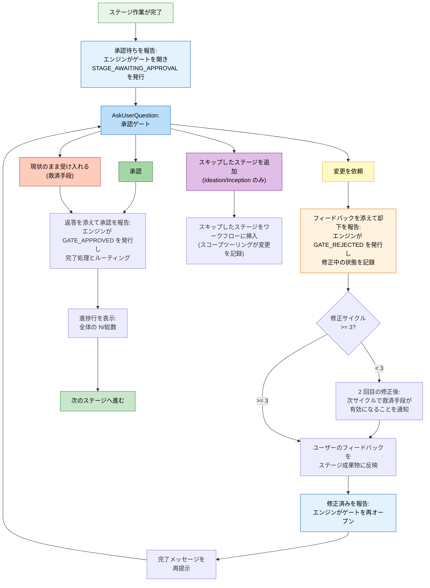

# 対話モード

AI-DLC は、ステージ中にエージェントとやり取りする 3 つの方法に加え、あらゆる意思決定ポイントであなたが主導権を保てるようにする承認ゲートを提供します。

> **ハーネスに関する注記:** ゲートと質問の表示方法はハーネスごとに異なります。Claude Code はネイティブの質問ピッカーを使用し、Codex は有効化されていれば自身のピッカーを使用します。Kiro、opencode、GitHub Copilot は番号付きの文章として選択肢を表示します（Copilot のピッカーの結果は、信頼できる人間存在イベントを発火しません）。いずれの場合も、質問ファイルが正本です。ゲートが発火するタイミング、尋ねる内容、ユーザーが主導権を保つという *意味論* はエンジンに実装されているため共通です。[他のハーネスでの実行](harnesses/README.md) を参照してください。

---

## 3 モードの質問フロー

ステージであなたの入力を集めるとき、エージェントは 3 つの対話モードを提示します。自分に合うものを選ぶと、後のステージはその選択を再利用します（[選ぶのは一度だけ](#選ぶのは一度だけ)を参照）。

```
▸ Choose interaction mode:
  (1) Guide Me — agent asks structured questions
  (2) Edit File — write directly to the artifact
  (3) Chat — freeform discussion
```

### ガイド付き（Guide Me）

エージェントが構造化された質問を使って、各項目を対話的に案内します。エージェントに会話を主導してもらい、取りこぼしがないようにしたいときに最適です。

- エージェントが質問を 1 つずつ、またはバッチで提示します
- あなたは各質問に直接答えます
- 回答は追跡可能性のために、そのステージの質問ファイルに記録されます

### ファイル編集（Edit File）

エージェントが質問ファイルを作成（または開き）、あなたがそれを直接編集します。すでに書きたい内容が明確で、質問に答えるより書き下ろしたいときに最適です。

- 質問ファイルが、空欄の回答フィールド付きでインテントの記録ディレクトリに現れます
- あなたは自分のペースで回答を埋めます
- エージェントは完成したファイルを読み取り、先へ進みます

### チャット（Chat）

エージェントと自由形式で会話します。アイデアを探索したいときや、要件がまだ十分に定まっていないときに最適です。

- あなたはエージェントと自由に話します
- エージェントは会話から意思決定を抽出します
- 抽出された意思決定は、正式な情報源として質問ファイルに書き戻されます

### ステージ途中でのモード切り替え

1 つのステージの途中でも、いつでもモードを切り替えられます。3 つのモードはすべて、意思決定の正式な記録として質問ファイルに収束します。切り替えても進捗は失われず、すでに取り込まれた回答はファイルに残ります。

### 選ぶのは一度だけ

モードを選ぶのは作業ごとに一度だけです。質問のある最初のステージが尋ね、後のステージは改めて尋ねずにその選択を再利用します。それらのステージも、どのモードを使っているかを 1 行で伝えます。

```
Answering the way you chose earlier: Guide me. Say if you'd rather edit the file or chat.
```

変えたいときは、そう伝えるだけです（「今回はファイルを編集させて」）。エージェントが切り替え、後のステージは新しい選択を使います。答えをどんな言い回しにしても、エージェントはあなたが意図したモードを記録するので、言い回しのせいで再び尋ねられることはありません。

---

## 承認ゲート

すべてのステージ（Initialization の 3 ステージを除く）は承認ゲートで終わります。これはワークフローが先に進む前に、エージェントの作業を確認するためのチェックポイントです。

### 標準ゲート

既定の承認ゲートでは、次の 2 つの選択肢が提示されます。

```
▸ How would you like to proceed?
  (1) Approve — Continue to [next stage]
  (2) Request Changes — Provide revision feedback
```

`[next stage]` には、ワークフローが次に実行する実際のステージ名が表示されます（たとえば「NFR 要件へ進む」（"Continue to NFR Requirements"））。最終ステージでは「ワークフローを完了」（"Complete workflow"）になります。これを計算するのはエンジンなので、推測ではなく常に正しい値です。

- **承認（Approve）** は結果を報告します。エンジンがステージを完了済みにし、`aidlc-state.md` を更新し、進捗行を表示して、次のステージへ進みます
- **変更を依頼（Request Changes）** では具体的なフィードバックを伝えられます。エージェントは作業を修正し、承認ゲートを再提示します

同僚に答えるように、自分の言葉で答えてください。主導するのはあなたです。どの質問（このゲート、サマリー確認、検証コマンド、Construction のチェックポイント、Plan Approval、復旧の質問）でも、エージェントはあなたの返答を読み、言ったとおりに動きます。選択肢のラベルを打ち直したり、同じことを二度言ったりする必要はありません。

- `1`、`a`（選択肢がアルファベットの場合）、`approved`、`looks good`、`aprove` はどれも承認です。
- 変更の依頼は Request Changes で、あなたの言葉がそのままフィードバックになります: `rename the handler`、`no, split the tests`。
- 指示付きの承認はその両方です。`looks fine but rename the handler` は承認になり、エージェントが名前を変えてそれを 1 行で伝え（"Renamed processOrder to handleOrder in 3 files"）、作業は続きます。
- いったん止めたいという依頼付きの承認は、承認したうえでワークフローを保留にします: `Approve, but let's stop there for today`。後で `/aidlc --resume` で再開します。
- 質問には答えが返り、次の返答で決まります。
- 本当に不明瞭な返答（`hmm`、`not sure`）にだけ、短い質問が 1 つ返ります。

AI-DLC は、ゲート、Plan Approval、チェックポイント、検証コマンド、Construction の設定変更を、あなたの言葉を添えて記録します（監査証跡の `Person Reply`）。言葉はハーネスが渡したものを前後の空白を除いて記録します。ステージのゲートでは、ゲートが表示されてからのすべてのメッセージを最大 8 件まで記録します。9 件目が届いた場合や、1 件でも 8000 文字を超えるメッセージがある場合は、どれも添付されず、変更依頼ではエージェントの `--reason` が代わりに記録されます。Plan Approval では最新の返答 8 件を、それぞれ 8000 文字までに切って記録します。チェックポイントや検証コマンドの質問では、返答を順につないだうえで末尾の 8000 文字を残します。あなたが変更を求めた Construction の設定では、その依頼のメッセージを記録します。サマリー確認では、エージェントが読み取った選択と、変更依頼の場合は変更を求めた内容を記録します。決定には、質問が表示された後のあなたからの返答が必要です。エージェントがあなたの代わりに答えることはできません。

ステージのゲートで変更を依頼すると、監査証跡には修正のフィードバックとして、ハーネスがあなたのチャットについて human-turn フックへ渡した言葉が、届いたとおりに記録され、エージェントはその言葉に基づいて修正するよう指示されます。Request Changes を選んでから「What should change?」に答えた場合は、その答えがフィードバックです。その間のほかの質問への返答や、質問だけのメッセージはフィードバックになりません。エージェント自身による依頼の要約が異なる場合は、`Conductor Summary` としてあなたの言葉の横に残されます。これには、入力したプロンプトとチャットのセッションを human-turn フックへ渡すハーネスが必要です。渡さないハーネスでは、従来どおりエージェントが報告したものがフィードバックになります。人間のターンそのものと同じく、これが記録するのはプロンプトの継ぎ目が受け取ったものであって、誰が入力したかではありません。

ゲートは、人間との対話の継ぎ目が観測されていることを必要とします。プロンプトを入力するか、ネイティブの質問ピッカーに答えると、監査台帳に人間のターン（`HUMAN_TURN` イベント）が記録されます。承認と（必要なら）確認質問への回答は、最後のゲート解決以降に人間のターンが記録されていない限り拒否されます。これが証明するのは在席と順序であって、後から呼び出し側が渡す決定テキストの作成者ではありません。ハーネスによっては、信頼できるプロンプト／ウィジェット内容を一切公開しないものもあります。狭い多層防御のトリップワイヤーが、コンダクターやモデルによる明示的な自己帰属として認識できるものを拒否しますが、ラベルのない文言は認証されません。ゲートのピッカーが人間のターンを記録しないハーネスでは、短いメッセージを 1 回入力してください（たとえば "approve"）。そうすれば記録されます。（そのハーネスの台帳にまだ人間のターンが一度もない場合、このゲートはフェイルオープンになり、これを要求しません。）

human-turnフックはdispatcherのhook経路だけで有効になりますが、起動者そのものを認証するわけではありません。同一ユーザーのhookとtool processに、偽装できない別の識別子はありません。runtime-integrityは認識したtool経路のhook呼出しと内部記録への書込みを拒否する多層防御です。外側の境界はハーネスの権限と、実行する操作の人間による確認です。

人の在席なしにプロンプトを送信する自動化は、駆動プロセスで `AIDLC_UNATTENDED=1` を設定しなければなりません。あるプロンプトが無人かどうかを知っているのは駆動側だけなので、この宣言はオプトインです。設定しない場合、プロンプト送信イベントは対話時の挙動を保ちます。設定すると、すべてのハーネスが権威を伴う `HUMAN_TURN` を発行しなくなるため、承認ゲートとインタビューゲートは待ち続けます。人が引き継ぐときは `AIDLC_UNATTENDED` を解除し、あらためて応答を送信してください。在席に関する拒否メッセージは、このフラグが設定されたままの場合にその名前を示します。

### 承認ゲートの流れ



<!-- テキスト代替: ステージ作業が完了すると、承認待ちの報告がゲートを開き（エンジンが STAGE_AWAITING_APPROVAL を記録）、AskUserQuestion が承認ゲートを提示します。承認の場合は、選択内容をそのまま添えて承認を報告し、エンジンが GATE_APPROVED を記録して完了処理とルーティングを行い、進捗を表示して次へ進みます。変更依頼の場合は、変更依頼の選択肢をそのままの表記で、フィードバックを別途添えて却下を報告し（エンジンが GATE_REJECTED を記録）、修正回数を確認します。3 回未満なら、まもなく救済手段が有効になることを知らせて修正し、修正済みを報告してゲートを再オープンし、再提示します。3 回以上なら「現状のまま受け入れる」が選択可能になります。現状のまま受け入れた場合は、そのラベルをそのままの表記で添えて承認を報告します。スキップしたステージを追加した場合（Ideation／Inception のみ）は、計画を再コンポーズします。ゲートの監査証跡は report 呼び出しが担うため、ゲートのプロンプトや選択に対する個別のログエントリは追加されません。 -->

---

## 3 回で有効になる修正ループの救済手段

同じステージで 3 回以上変更を依頼すると、3 つ目の選択肢が現れます。

```
▸ This is revision cycle 4. How would you like to proceed?
  (1) Approve — Continue to [next stage]
  (2) Request Changes — Provide revision feedback
  (3) Accept as-is — Archive current version and move on
```

**Accept as-is** は、その時点のステージ成果物をアーカイブし、ワークフローを先へ進めます。これにより、「より良い」が「十分に良い」の敵になるときに、終わりのない改訂ループに陥るのを防ぎます。

### どう有効になるか

| 改訂サイクル | 起こること |
|----------------|-------------|
| 初回 | 標準の 2 選択肢ゲート |
| 2 回目 | 標準の 2 選択肢ゲート + 「あと 1 回改訂すると `Accept as-is` オプションが利用可能になります」という注記 |
| 3 回目以降 | `Accept as-is` を含む 3 選択肢ゲート |

修正回数は次のステージへ進むとリセットされます。

---

## スキップしたステージを追加する選択肢

**Ideation** と **Inception** の各フェーズでは、承認ゲートに、以前スキップしたステージをワークフローに戻すための条件付きオプションが含まれる場合があります。

```
▸ How would you like to proceed?
  (1) Approve — Continue to Scope Definition
  (2) Request Changes — Provide revision feedback
  (3) Add Market Research — Include Market Research which was skipped
```

このオプションが現れるのは、次のすべてを満たすときだけです。
- 現在のステージが Ideation または Inception にある
- 先のステージがスコープによるルーティングの途中でスキップされていた
- スキップされたステージが現在の文脈に関連している

このオプションを選ぶと、スキップされていたステージがワークフロー計画に挿入されます。ワークフローは追加されたステージを含めて通常どおり進みます。

---

## ステージのスキップと移動

承認ゲート以外にも、追加の移動オプションがあります。

| コマンド | 効果 |
|---------|--------|
| `/aidlc --stage <name>` | 特定のステージへ移動する（間にあるステージは `[S]` として記録） |
| `/aidlc --phase <name>` | あるフェーズの先頭へ移動する |

[セッション管理](11-session-management.md) と [CLI コマンド](12-cli-commands.md) で詳細を確認してください。

---

## ファイルを自分で編集する

どの成果物も手で編集できます。その後どうなるかは、どこにいるかによります。

| 編集するとき | すること | 起こること |
|---|---|---|
| ステージの質問への回答 | **I'll edit the file** を選び、`[Answer]:` 行を埋めてから **done**（または "ready"）を送る | エージェントが回答を読み、それに基づいて進めます。サマリー確認がオンなら、先に要約を確認します |
| 承認待ちのコード計画 | **I'll edit the files** を選び、計画やテスト手順を変更して（または `code-generation-questions.md` に回答を書いて）から **done** を送る | 編集した計画が、あなたが残したとおりに承認され、構築が始まります。編集中、エージェントはそれらのファイルに書き込めません。編集で計画の Testing Contract ブロックが壊れた場合は、エージェントが修復し、構築してよいかを一度だけ尋ねます |
| 現在のステージですでにレビューされた成果物（ゲートの前） | ファイルを編集してから続ける | Guard Policy が `relaxed` または `off`（ほとんどのスコープ）なら、ファイルが変わったことを伝える 1 行が表示され、編集は監査証跡に `CHANGE_ACCEPTED` として一度記録され、実行は続きます。`strict` では、古いレビューは編集後のファイルをカバーしないため、ゲートの前に現在の状態でもう一度レビューされます。この追加のレビューは一度だけです。その後さらにファイルを編集すると、エージェントは止まってそれを伝えるので、**Request Changes** を選んでレビューをやり直します |
| すでに完了したステージの成果物 | ファイルを編集してから続ける | 自動で再実行されるものはなく、後のステージはあなたが残したとおりのファイルを読みます。[ステージの完了後](#ステージの完了後)を参照してください |
| セッションの合間 | ファイルを編集してから `/aidlc` で再開する | 次にファイルが確認されるときに同じルールが適用されます |

ファイルが変わったことを伝えられて実行が続いている場合、それで記録はすべてです。手で記録するものはありません。`strict`、`relaxed`、`off` が何をするかは [Guard Policy](13-customization.md#guard-policy) を、計画での停止そのものは [Plan approval](13-customization.md#計画承認plan-approval) を参照してください。

### ステージの完了後

完了したステージのファイルを編集しても、頼まない限り再レビューや再承認はされません。

- **警告されるもの。** 完了したステージについて AIDLC が追跡しているステージ文書を編集すると、次のステップで一度だけ、どの完了済みステージが古くなったかと、やり直すには何と言えばよいかが示されます。`/aidlc --status` は下流で影響を受けるステージを一覧します。プロジェクトフォルダの移動、名前の変更、コピーではそれらの文書は何も変わらないため、警告は出ません（それでも出る場合については[成果物リファレンス](14-artifacts-reference.md)を参照）。警告は助言であって、停止ではありません。検証記録なしで完了したステージ（以前の AIDLC リリースで完了したものなど）には警告が出ず、`/aidlc --status` にも一覧されません。
- **警告されないもの。** アプリケーションコードはこの方法では追跡されないため、Code Generation の後に変更しても警告は出ません。
- **もう一度確認してもらう。** `/aidlc --stage <name>` で、影響を受ける最も前のステージ（アプリケーションコードなら Code Generation）へ戻ります。そのステージと、計画上それ以降のすべてのステージが開き直されます。ファイルは残るので、開き直した各ステージは以前のファイルを見つけると、**Keep**、**Modify**、**Redo from scratch** のどれにするかを尋ねます。Keep で省かれるのはファイルの再生成であって、確認ではありません。ステージに必要なレビューや承認は引き続き行われます。変更を反映させたいところでは Modify か Redo を選んでください。Code Generation のレビューが対象にするのは Unit のソースマニフェストに載ったアプリケーションファイルだけなので、手で追加・移動したファイルは、そこに載るまでレビューされません。Modify を選ぶときは、追加・移動したファイルと、それが属する Unit を伝えてください。Unit のない作業（bugfix や refactor のスコープなど）にはソースマニフェストがないため、承認の前にアプリケーションコードの手での編集を自分で確認してください。自動で進むよう設定した Construction のチェックポイントは、自動のままです。

---

## 進捗追跡

承認のたびに、次のような進捗行が表示されます。

```
Progress: 6/30 in-scope stages complete (9/33 overall) | 6/7 IDEATION. Next: Approval & Handoff
```

ここには次が示されます。
- 計画が Initialization の後に実行するステージを通した進捗（作業の開始時に示された数）と、括弧内にこれまで完了したすべてのステージ
- 現在のフェーズ内での進捗
- 次のステージ名

計画が短ければ数字も小さくなります。たとえば次のとおりです。

```
Progress: 2/6 in-scope stages complete (5/33 overall) | 2/2 INCEPTION. Next: Code Generation
```

---

## 次のステップ

- [最初のワークフロー](02-your-first-workflow.md) — 対話モードが文脈の中でどう使われるかを見る
- [状態管理と監査証跡](10-state-and-audit.md) — 意思決定がどう追跡されるか
- [セッション管理](11-session-management.md) — resume、redo、jump
- [用語集](glossary.md) — 用語リファレンス
