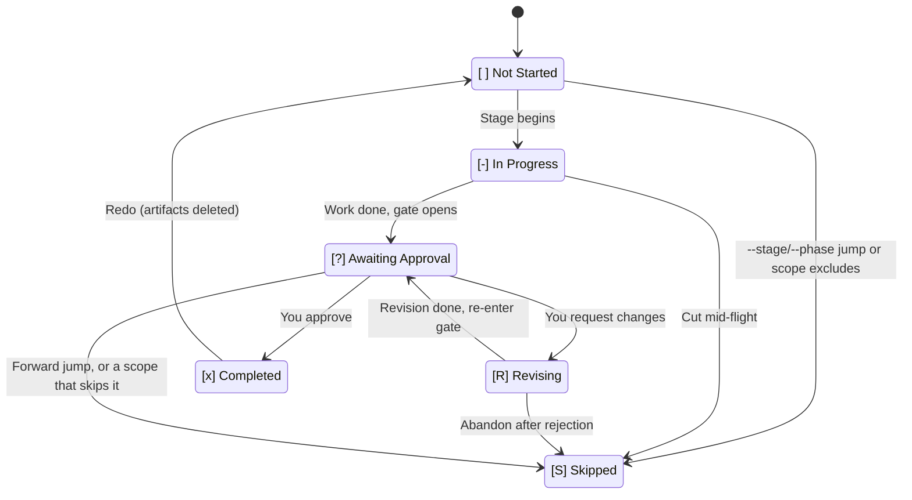
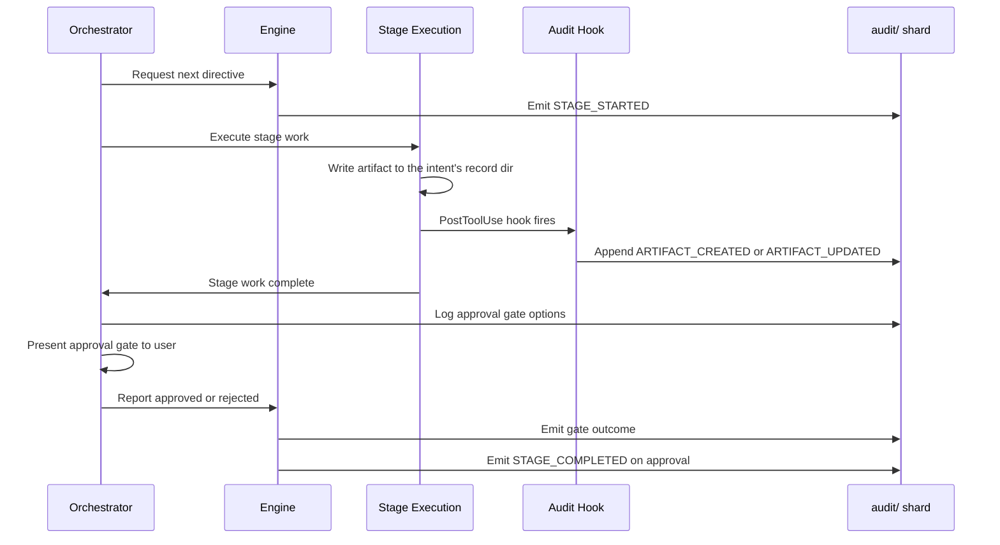

# 状態と監査

AI-DLC は永続ファイルを 2 つ持ち、インテントから本番まで辿れます。**状態ファイル**がワークフローの現在の位置、**監査証跡**が途中の判断・動作・イベントです。

---

## 状態ファイル（`aidlc-state.md`）

インテントごとに、`aidlc/spaces/<space>/intents/<YYMMDD>-<label>/aidlc-state.md`（インテントのレコードディレクトリの下）に 1 本あります。そのインテントの進捗の正本です。エンジンはセッション開始のたびにアクティブインテントの状態ファイルを読み、終わったこと、進行中、次を決めます。

確定した説明文そのものは隣の `project-description.json` に、JSON 文字列 1 本で残します。`aidlc-state.md` はその確定ソースを指し、安全な 1 行の `Project` プレビューだけを持ちます。複数行の入力が状態フィールドを増やさないためです。2.6.115 より前の記録でソース印がないものは、従来どおり `Project` 欄を説明として使います。印のある新しい記録でファイルがない・壊れているときは、黙って劣化せずソース検証に失敗します。Git が sidecar 末尾の改行を正規化しても、JSON 復号は元の説明を保ちます。

### 中身

| 節 | 役割 |
|---------|---------|
| **Project Information** | プロジェクト説明、種別（greenfield / brownfield）とそれを決めた主体（`Project Type Source`: `workspace scan` または `you`）、スコープ、開始日、現在のフェーズ、アクティブエージェント |
| **Scope Configuration** | 実行するステージ、スキップするステージ（理由付き）、深度、テスト戦略、インテントごとの設定: `Guard Policy`、`Guards Off`（この作業で下げたフェンス）、`Guards On`（ポリシーの値より上に強制的にオンにしたフェンス）、`Sensors`、`Learnings`、`Summary Confirmation`。フェンスの行は使ったときだけ現れ、作業ごとの切り替えがない human presence は含まない |
| **Workspace State** | プロジェクトルート、検出した言語、フレームワーク、ビルドシステム |
| **Execution Plan Summary** | ステージ総数、完了数、進行中のステージ |
| **Runtime State** | 改訂回数、Construction のチェックポイント、反復と実行方式の設定、受領記録に結び付いた Construction Verification Command、任意のユニット所有とユニットゲートのリズム |
| **Stage Progress** | ステージごとの完了チェックボックス |
| **Unit Progress** | Team モードのみ。導出されたユニットごとの Construction ステージとゲートセル。`next` が書き直す。正本ではない |
| **Current Status** | ライフサイクルフェーズ、現在 / 次のステージ、状態、最終更新時刻 |
| **Session Resume Point** | 最後に完了したステージ、次の動作、未処理の成果物 |

`Guard Policy` と旧名の `Change Control` が両方あり、ポリシーの値が異なる場合は strict が適用され、ステータスには `strict (from conflicting state lines)` と表示されます。メモリが保持する strict は引き続き優先します。両方が一致していれば `Guard Policy` の行を使います。ポリシーの行を書き込むと旧名の行は除去され、設定は 1 つになります。矛盾が解消されるまで、`next` は状態ファイルを変えずに、`<a>` と `<b>` を行の生の値に置き換えた次の通知を伝えます。

> This work has two settings for how closely AI-DLC checks changes, and they disagree, so AI-DLC checks everything for now. Do you want it to keep checking everything, carry on with a note when something you approved changes, or also skip some of its own checks? I'll ask again until you choose.

`Construction Verification Command` は、すべての Unit／バッチのチェックポイントで再利用するプロジェクトの検証を記録します。`state set-construction-verification-command` がこのフィールドを書く前に、現在のワークフローに合致する人間の承認の受領記録が必要です。フィールドだけで実行が許可されることはなく、汎用の `state set` はこれを拒否します。人間の **Approve** / **Request Changes** の回答は、呼出元の SessionStart セッションから来たものでなければなりません。受領記録を許可するのは **Approve** だけで、無関係な回答、**Request Changes**、別セッションからの回答は許可になりません。[記録済みコマンドの手順](12-cli-commands.md#construction-verification-command-record-human-authorization)を参照してください。

### 6 状態のチェックボックス

ステージ進捗は 6 状態のチェックボックスです。

| チェックボックス | 意味 |
|----------|---------|
| `[ ]` | 未着手 |
| `[-]` | 進行中 |
| `[?]` | 承認待ち（ゲート開放） |
| `[R]` | 改訂中（ゲートを差し戻し、ステージを直している） |
| `[x]` | 完了 |
| `[S]` | スキップ（スコープ外、`skip` で切った、`--stage` / `--phase` ジャンプで飛ばした） |

順調なら `[ ]` → `[-]` → `[?]` → `[x]` です。ゲートで差し戻すと改訂中は `[R]`、準備ができたら `[?]` に戻り、承認で `[x]`。`/aidlc --status` はチェックボックスを読み、誰が止めているかを出します。`[?]` なら「Awaiting your approval on \<stage\>」、`[R]` なら「Revising \<stage\> (revision N of 3)」。

状態機械の正本（遷移表、監査イベントの発行元）は [Developer Reference: State Machine](../reference/12-state-machine.md) です。

### 状態遷移

<!-- Text fallback: [ ] 未着手はステージ開始で [-] 進行中へ。[-] 進行中は作業が終わりゲートが開くと [?] 承認待ちへ。[?] 承認待ちは承認で [x] 完了、差し戻しで [R] 改訂中へ。[R] 改訂中は直し終わりで [?] 承認待ちに戻る。[ ] 未着手、[-] 進行中、[?] 承認待ち、[R] 改訂中は、ジャンプ・スコープ外やスコープの変更・放棄で [S] スキップへ。[x] 完了はやり直し（成果物削除）で [ ] 未着手に戻る。 -->

### 通常・改訂・スキップ・やり直し・ジャンプ

- **通常:** `[ ]` -> `[-]` -> `[?]` -> `[x]`（ステージ開始、作業完了、ゲート開放、承認）
- **改訂:** `[?]` -> `[R]` -> `[?]` -> `[x]`（差し戻し、ステージ改訂、ゲート再開放、承認）
- **スコープスキップ:** `[ ]` -> `[S]`（このワークフローのスコープ外。初期化時に印）
- **やり直し:** `[x]` または `[-]` -> `[ ]` -> `[-]`（やり直し要求。成果物を消し、ステージを再実行）
- **ジャンプ:** ステージ A が `[-]` のときステージ B へジャンプすると、間のステージは `[S]`

---

## 監査証跡（`audit/`）

監査証跡は、後のステージと復旧のために、アクティブなインテントの判断とイベントを記録します。書き込むのは AIDLC のツールとフックで、読み取りはどんな方法でもかまいません。書き込みのガードはガードレールであって、セキュリティ境界ではありません。書き込みを担うコマンドと読み取り専用の照会の契約は [Audit Trail Rules](../reference/04-stage-protocol.md#audit-trail-rules) を参照してください。

### 115 種のイベント分類

イベントは 25 カテゴリです。

| カテゴリ | 件数 | イベント |
|----------|------:|--------|
| **Workflow Lifecycle** | 6 | `WORKFLOW_STARTED`, `WORKFLOW_COMPLETED`, `WORKFLOW_PARKED`, `WORKFLOW_UNPARKED`, `WORKFLOW_ARCHIVED`, `WORKFLOW_UNARCHIVED` |
| **Phase Lifecycle** | 4 | `PHASE_STARTED`, `PHASE_COMPLETED`, `PHASE_VERIFIED`, `PHASE_SKIPPED` |
| **Stage Lifecycle** | 6 | `STAGE_STARTED`, `STAGE_AWAITING_APPROVAL`, `STAGE_REVISING`, `STAGE_COMPLETED`, `STAGE_SKIPPED`, `STAGE_JUMPED` |
| **Session** | 5 | `SESSION_STARTED`, `SESSION_RESUMED`, `SESSION_COMPACTED`, `SESSION_ENDED`, `HUMAN_TURN`（フック発行） |
| **Initialization** | 3 | `WORKSPACE_SCAFFOLDED`, `WORKSPACE_SCANNED`, `WORKSPACE_INITIALISED` |
| **Navigation** | 9 | `SCOPE_CHANGED`, `SCOPE_DETECTED`, `DEPTH_CHANGED`, `TEST_STRATEGY_CHANGED`, `REVIEW_CLASS_CHANGED`, `RECOMPOSED`, `WORKSPACE_RECLASSIFIED`, `SCOPE_SAVED`, `PLUGIN_SELECTION_CHANGED` |
| **Guard Policy** | 5 | `GUARD_POLICY_SET`、`CHANGE_CONTROL_SET`（旧記録）、`CHANGE_ACCEPTED`、`GUARD_RESTORED`、`GUARD_STOOD_ASIDE` |
| **Ceremony** | 1 | `CEREMONY_SET`。`config-change` と `scope-change` の共通適用処理が記録する。`Key` は `sensors` / `learnings` / `summary_confirmation` / `plan_approval` / `collaborators`、`Old` は直前の保存値、`New` は新値、`Source` は `you` または `scope <name>`。旧値が不正なら原文、未保存ならスコープの既定値を使い、環境変数適用後の値とは区別する。保存値か設定元の実際の変更ごとに1行記録し、変更なしでは記録しない |
| **Interaction** | 17 | `DECISION_RECORDED`, `GATE_APPROVED`, `GATE_REJECTED`, `QUESTION_ANSWERED`, `QUESTION_REPLIED`, `QUESTION_UNANSWERED`, `REQUEST_ROUTED`, `SUMMARY_CONFIRMATION_RECORDED`, `VERIFICATION_COMMAND_RECORDED`, `CONSTRUCTION_POLICY_RECORDED`, `CHECKPOINT_VERIFICATION_RECORDED`, `PLAN_APPROVAL_RECORDED`, `PLAN_APPROVAL_SKIPPED`, `PLAN_APPROVAL_OVERRIDDEN`, `REVIEW_REQUESTED`, `REVIEW_COMPLETED`, `PIPELINE_LINK_COMPLETED` |
| **Unit Configuration and Lifecycle** | 9 | `UNIT_OWNERSHIP_SET`, `UNIT_GATE_RHYTHM_SET`, `CONSTRUCTION_POLICY_SET`, `UNIT_STARTED`, `UNIT_PAUSED`, `UNIT_RESUMED`, `UNIT_COMPLETED`, `UNIT_SKIPPED`, `UNIT_MERGED` |
| **Artifact** | 3 | `ARTIFACT_CREATED`, `ARTIFACT_UPDATED`（write-audit-log フック）、`ARTIFACT_REUSED` |
| **Subagent** | 2 | `SUBAGENT_COMPLETED`（log-subagent フック）、`SUBAGENT_PROMPT_UNMATCHED`（Copilot アダプタ、助言） |
| **Reviewer Enforcement** | 2 | `REVIEWER_SCOPE_BLOCKED`（reviewer-scope フック）、`REVIEW_FREEZE_BLOCKED`（review-freeze フック） |
| **Plan Approval** | 2 | `PLAN_APPROVAL_BLOCKED`, `GUARD_DISABLED`（plan-approval-guard フック、またはこの作業でオフにしたフェンス） |
| **Documents** | 3 | `DOCUMENT_INDEXED`, `DOCUMENT_UPDATED`, `DOCUMENT_REMOVED` — インテント範囲でもスペース単位のシャード |
| **Utility** | 1 | `HEALTH_CHECKED` |
| **Error/Recovery** | 3 | `ERROR_LOGGED`, `RECOVERY_COMPLETED`, `COORDINATION_STOOD_ASIDE` |
| **Construction Bolt** | 4 | `BOLT_STARTED`, `BOLT_COMPLETED`, `BOLT_FAILED`, `AUTONOMY_MODE_SET` |
| **Worktree** | 7 | `WORKTREE_CREATED`, `WORKTREE_MERGED`, `WORKTREE_DISCARDED`, `STATE_FORKED`, `STATE_MERGED`, `AUDIT_FORKED`, `AUDIT_MERGED` |
| **Practices** | 4 | `PRACTICES_DISCOVERED`, `PRACTICES_AFFIRMED`, `PRACTICES_OVERRIDE`, `PRACTICES_SECTION_EMPTY` |
| **Merge Dispatch** | 3 | `MERGE_DISPATCH_INVOKED`, `MERGE_DISPATCH_RETURNED`, `MERGE_DISPATCH_FALLBACK` |
| **Sensors** | 5 | `SENSOR_FIRED`, `SENSOR_PASSED`, `SENSOR_FAILED`, `SENSOR_BUDGET_OVERRIDE`, `GUARDRAIL_LOADED` |
| **Learning Loop** | 3 | `MEMORY_EMPTY`, `RULE_LEARNED`, `SENSOR_PROPOSED` |
| **Swarm** | 7 | `SWARM_STARTED`, `SWARM_UNIT_CONVERGED`, `SWARM_SOURCE_MERGED`, `SWARM_UNIT_FAILED`, `SWARM_BATON_RETURNED`, `SWARM_COMPLETED`, `SWARM_DEGRADED` |
| **Commit Provenance** | 1 | `SOURCE_COMMITTED`。`aidlc attest anchor` または任意のセッション開始時走査が記録する補足情報。`resolve` は参照しない |

### 何をいつ記録するか

- **ステージの開始と完了**は毎回 `STAGE_STARTED` と `STAGE_COMPLETED`
- **インテントのレコードディレクトリへのファイル書き込み**（`audit/` シャード自身を除く）は write-audit-log フックが自動で残す
- **承認ゲートの判断**（承認、差し戻し、このまま進める）は毎回
- **質問への回答**は毎回
- **サブエージェント完了**は log-subagent フックが残す
- **エラーと復旧**は毎回

### 監査ログの読み方

イベントの時系列は `aidlc engine audit history` で、1 つのステージだけを見るなら `--stage <slug>` を付けて確認します。各イベントは時刻、種類、名前付きのフィールドを持ちます。結果は古い順です。`unordered: true` は、書き手をまたいで順序が分からない同時刻のエントリを示します。自由形式のメモは、見出しと本文を持つ `NOTE` エントリとして表示されます。`--event NOTE` はメモを選び、`--stage` はメモを除外します。

以前の質問と回答の組は `aidlc engine log answers --stage <slug>`（Unit なら `--unit <unit>` を追加）で確認します。未解決の質問と曖昧な回答は別に報告されるので、後続の質問で以前の文脈を示せます。どちらのコマンドもファイルを変更せず、ロックも取りません。

### 監査イベントの流れ

ステージが実行され成果物を出すとき、監査証跡はその一連を残します。

<!-- Text fallback: オーケストレータが次のディレクティブを求め、エンジンが STAGE_STARTED を出す。ステージ実行が成果物を書き、PostToolUse フックが ARTIFACT_CREATED または ARTIFACT_UPDATED を追記する。作業と承認ゲートのあと、オーケストレータが結果を報告する。エンジンがゲート結果を出し、承認なら STAGE_COMPLETED を出して状態と経路を更新する。 -->

---

### ソースに紐づくレビューレシート

Code Generation はアプリケーションソースをインテントの記録の外に書くので、完了時のユニットごとのレビューレシートは Markdown 成果物だけでは足りません。対象ユニットの厳格な `source-manifest.json` が、作成・変更・削除したソースパスを列挙し、`Unit Source Fingerprint` がその主張とマニフェスト本体を束ねます。完了時、エンジンは新しいユニットから順に検証します（後からレビューした主張が、意図した共有ファイルの取り込みを所有できる）。そのうえで、新鮮な主張の和集合をステージ開始時のソースベースラインと比較します。Guard Policy が strict の場合、カバーされていない変更か、古いユニットがあると、完了経路は 4 つとも止まり、そのユニットに対する期限付きの stale-receipt 復旧が 1 回だけ出ます。relaxed または off の場合、カバーされていない変更は残されます。完了時に `CHANGE_ACCEPTED` として一度記録され、ファイルが 1 行で示されます（"These files changed outside any unit's work in Code Generation: ... Kept them."）。このマシンにステージ開始時のベースラインがない場合は、1 行の表示とともに確認を省きます。

ワークスペース全体の `Source Fingerprint` は、通常、レビュー後の変更の外側の境界です。文書化されている「revert」復旧を実際に効かせる狭い調停が 1 つあります。主張のないベースライン変更（追加・変更・削除）を完全に戻したあと、完了を続けられるのは次が揃ったときだけです。ステージのベースラインが存在して妥当であること、対象ユニットすべてに新鮮な現行バインディングがあること、ベースラインから現在までの差分に未主張のパスがないこと。レビュー後の通常の編集、古いかレガシーなユニット証跡、残っている未主張パスは、これまでどおり拒否します。アップグレード前のフィールド無しレシートやベースラインは、文書どおりマイグレーション時は fail-open を残します。現行の証跡が欠けているか壊れているときは fail-closed です。`AIDLC_SKIP_SOURCE_FRESHNESS=1` は決定論的な緊急オフスイッチで、bypass 印の付いたレシートを消費するときも、もう一度立てる必要があります。

---

## 状態と監査の役割分担

状態ファイルと監査証跡は補い合います。

| 関心 | 状態ファイル | 監査証跡 |
|---------|-----------|-------------|
| **目的** | 現在の位置と進捗 | イベントの全履歴 |
| **読む側** | オーケストレータ（経路と再開） | 人と監査者（追跡） |
| **更新** | 状態が変わるたびに上書き | 追記専用（書き換えない） |
| **セッション再開** | 続き場所を決める正本 | 元のプロジェクト説明と判断の文脈 |
| **Git** | 版管理へコミット | コミットする（`audit/` 下のクローンごとのシャード。マージ衝突なし） |

オーケストレータは `aidlc-state.md` を永続カーソルに使います。チーム所有の Construction では、さらにユニットセル、レシート下限、ゲート、マージ行をアクティブインテントの監査シャードから導出します。ソロの経路は状態だけのカーソルのままです。監査証跡があれば、インテントから本番まで判断を辿れます。

状態ファイルが壊れたときは、`STAGE_STARTED` と `STAGE_COMPLETED` から組み立て直せます。直し方は [トラブルシュート](15-troubleshooting.md) です。

---

## 次に読む

- [セッション管理](11-session-management.md) — 再開に状態をどう使うか
- [成果物リファレンス](14-artifacts-reference.md) — インテントのレコードディレクトリに何が残るか
- [トラブルシュート](15-troubleshooting.md) — 状態壊れの修復
- [用語集](glossary.md) — 状態ファイル、監査証跡、チェックポイント、コンパクション
