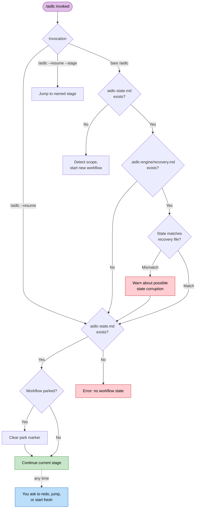

# セッション管理

ワークフローはハーネスのセッションをまたげます。進捗はすべてディスクに残るので、いつでも再開、やり直し、ジャンプ、新規開始ができます。

> **ハーネスについて。** セッション再開はどのハーネスでも動きます（状態はハーネスではなく、インテントのレコードディレクトリにあります）。セッションの *ライフサイクルイベント* は違います。Claude Code は `SESSION_STARTED/RESUMED/ENDED` と `SESSION_COMPACTED` を出します。Kiro CLI は `SESSION_STARTED` だけです。Kiro IDE は `SESSION_STARTED` を出し、プロンプトが以前のチャットに戻ったときに `SESSION_RESUMED` を出します。Codex は `SESSION_ENDED` を推測し、コンパクト元の `SessionStart` でミッションを入れ直します。[他ハーネスで動かす](harnesses/README.md) を参照してください。

---

## 再開の流れ

新しいセッションで引数なしの `/aidlc` を実行し、アクティブインテントの `aidlc-state.md` があるとき、AI-DLC は `/aidlc --resume` と同じように作業が止まったところから続け、どこから再開したかを伝えます。別のことをしたい場合は、そう伝えてください。いまのステージのやり直し、ステージへのジャンプ、新規開始ができます。



<!-- Text fallback: 状態があるときの素の /aidlc は復旧パンくずを確認し、/aidlc --resume と同じように続ける。やり直し、ジャンプ、新規開始はいつでも頼める。状態がないときはスコープ判定から始める。状態があるときの /aidlc --resume は、必要ならパーク印を消して直接続ける。状態がないときはエラー。/aidlc --resume --stage は指定ステージへジャンプする。 -->

コマンドからは `/aidlc park` でワークフローを保留できます。エンジンが保留コマンドを示し、コンダクターが停止位置を報告します。`/aidlc --resume` で戻ります。

### やり直し、ジャンプ、新規開始

引数なしの `/aidlc` は最後のチェックポイントから再開します。それ以外の操作は、いつでも自分の言葉で頼めます。

| 選択肢 | 動き | 残るもの | 失うもの |
|--------|-------------|-------------------|-------------|
| **最後のチェックポイントから再開** | 進行中、または次の未着手ステージから続ける。セッションにタスクツールがあれば、タスクサイドバーを状態ファイルから組み直す | 成果物、状態、監査証跡の全部 | 前セッションのメモリ上の会話文脈 |
| **いまのステージをやり直す** | いまのステージのチェックボックスを戻し（`aidlc-jump.ts execute --direction redo`）、最初から再実行する。Construction が 1 度に 1 つの Unit を実行していて、作業を終えた Unit がある場合は、代わりにアクティブな Unit のステップだけを最初からやり直す。その Unit が一時停止中、または要約確認やチェックポイント承認を待っている場合も同様。Code Generation では計画も含むため、新しい計画は承認のためにあなたへ戻る（plan approval が off の場合を除く） | ほかの成果物と状態（1 度に 1 Unit の場合は、ほかの Unit の完了済み作業も） | いまのステージの完了状態と途中作業（1 度に 1 Unit の場合は、その Unit のステップ） |
| **ステージへジャンプ** | 指定ステージへ飛ぶ（`next --stage <slug>`）。前へ飛んだ後、AI-DLC はスキップしたステージと戻り方を 1 行で伝える | 既存の成果物すべて | いまの位置と目標の間のステージは `[S]`（スキップ） |
| **新規開始** | 既存の横に新しいインテントを始める（スコープと説明の確認のあと `next --new-intent`） | 既存ワークフローの成果物、状態、監査証跡（その場に残る） | なし。前のインテントは再開できる |

`/aidlc --resume --stage <slug>` は明示ステージを目標にし、通常のジャンプ経路を取ります。

ディスパッチした編成作業は、ディスク上の証跡から再開します。Practices Discovery では、コンダクターがリード下書きと既存の寄与ファイルをすべて残し、足りない quality / developer / devsecops スポークだけをディスパッチし、人へのインタビューとリード統合へ進みます。完了したスポークは繰り返しません。

Code Generation は計画のチェックから再開します。developer エージェントは、`code-generation-plan.md` の各ステップを終えるたびにチェックを付けます。ビルドが途中で止まった場合（モデルやプロバイダーのエラー、エディターを閉じたなど）、同じ計画の次の実行は最初の未チェックのステップから再開し、「Picking up unit-2's code at step 5 of 9 (1-4 done).」のような 1 行が表示されます。チェックが 1 つもないのに最初のステップが挙げるファイルが書かれている場合は、代わりにその後から再開します（「(1-4 wrote their files)」）。developer は完了した各ステップが挙げるファイルを確認し、作るはずのファイルがない場合にだけそのステップをやり直します。やり直し、Request Changes、計画の再承認では、ステップを最初から始めます。新しいビルドが始まるときに計画のチェックはクリアされ、そのビルドもまた途中で止まった場合は、そのビルドで付けたチェックだけが数えられます。ビルド開始後に計画を編集した場合も最初から始めます。ビルド前に編集した計画は、ほかの計画と同じように再開します。

---

## 復旧パンくず

Claude Code が会話文脈をコンパクトする前に、`validate-state.ts` フックが隠し復旧ファイル `.aidlc-engine/recovery.md` を、アクティブインテントのレコードディレクトリに書きます。中身は次です。

- 最後に検証した時刻
- いまのステージ名（`aidlc-state.md` から抽出）
- 状態ファイルが妥当かどうか

次の `/aidlc` で、AI-DLC は `.aidlc-engine/recovery.md` と `aidlc-state.md` を比べます。「Current stage」が食い違っていれば、コンパクション由来の状態壊れの可能性を警告します。

---

## コンテキストのコンパクション

Claude Code はコンテキスト窓が埋まると、それまでの会話を自動で要約します。これが **コンパクション** です。この実装は、コンパクションをまたいでもワークフロー状態が残る防護を持ちます。

### 残るもの、消えるもの

| 残る | 消える |
|-----------|------|
| レコードディレクトリの成果物（ディスク上のファイル）全部 | メモリ上の会話文脈（それまでの議論） |
| `aidlc-state.md`（ステージ進捗、スコープ、プロジェクト情報） | まだファイルに書いていない途中作業 |
| `audit/` シャード（判断と動作の全履歴） | タスク ID（再開時に状態ファイルから組み直す） |
| `.aidlc-engine/recovery.md`（ステージのチェックポイント） | エージェントのペルソナ文脈（エージェントファイルから読み直す） |

### コンパクション後の復旧

1. `/aidlc` を実行します。AI-DLC が状態ファイルを読み、作業が止まったところから続けます
2. 復旧パンくずが食い違いを警告したら、いまのステージのやり直しを頼み、コンパクション中に進んでいたステージを再実行します。Construction が 1 度に 1 つの Unit を実行している場合、再開の文脈はアクティブな Unit がいるステップを示し（例: `Current Step: code-generation for unit beta`）、やり直しはその Unit のステップだけをやり直します。ほかの Unit の完了済み作業は承認されたままです
3. 警告が出なければ、ほかにすることはありません。作業は通常どおり続きます

長いセッションではコンパクションは普通です。状態ファイルとディスク上の成果物があるので、完了した作業は失われません。

---

## ワークフロー途中でのモデル変更

実行中のチャットの中で別のモデルに切り替えると、時間がかかり、トークンも多く使います。新しいモデルは、答える前に会話全体を読み直すからです。Claude のモデルでは、プロバイダー側の会話キャッシュは 1 つのモデルに属するため、何も引き継がれません。同じチャットで effort レベルを変えた場合も、通常はキャッシュが破棄されます。

AI-DLC は必要なものをすべてディスクに置いているので、新しいチャットで切り替えるほうが安上がりです。

1. ステージの区切りで止めます。ステージを承認し、同じ返答で停止を頼みます。例: `Approved. Stop here for today.` ワークフローは次のステージが始まる前に保留されます（[対話モード](07-interaction-modes.md) を参照）。`/aidlc park` でも、その場で保留できます。
2. 新しいチャットまたはセッションを開き、そこで新しいモデルと effort を選びます。Kiro IDE では、新しいチャットが Kiro の Default エージェントで始まるため、チャットパネルのエージェント選択で **aidlc** エージェントも選んでください（[Kiro IDE のチャットで AI-DLC を始める](harnesses/kiro-ide.md#start-ai-dlc-in-a-kiro-ide-chat) を参照）。
3. `/aidlc --resume` を実行します。新しいチャットは古い会話ではなく、ディスク上の保存済みの状態、成果物、監査証跡を読み、ワークフローが止まったところから続けます。

古いチャットで話したがファイルに書いていない内容は引き継がれません。そのため、ステージの終わりが最適なタイミングです。Codex CLI では `/aidlc` の代わりに `$aidlc` と入力します。どのモデルと effort を選ぶかは [モデルと effort の選び方](18-install-and-lifecycle.md#choosing-a-model-and-effort) を参照してください。

---

## ステージジャンプ

ユーティリティコマンドで、ワークフローを前にも後ろにも飛べます。

### 特定ステージへのジャンプ

```
/aidlc --stage code-generation
/aidlc --stage 3.5
```

前へ飛ぶとき、いまの位置と目標の間のステージは `[S]`（スキップ）になり、AI-DLC はスキップしたステージと戻れることを 1 行で伝えます。例: 「Moved to Code Generation; skipped User Stories. You can go back to Requirements Analysis any time.」 後続のステージは、スキップしたステージが書くはずだったファイルを前提にしている場合があります。

Construction が 1 度に 1 つの Unit を実行しているとき（unit-major。新しい作業の既定）、ジャンプは頼めばそのとおり進みます。アクティブな Unit がいるステップへのジャンプは、そのまま続けるだけです。アクティブな Unit がすでに終えたステップへ戻るジャンプ（例: unit beta が Code Generation にいるときの `/aidlc --stage nfr-design`）は、その Unit についてだけ、そのステップとそれ以降のステップを開き直します（開き直した各ステップは、以前のファイルを見つけると Keep、Modify、Redo を提示します）。アシスタントはそれを 1 行で伝えます。「Reopened NFR Design for unit beta. alpha keeps its finished work. Say 'for every unit' to redo it for alpha too.」 「for every unit」と言うか Unit を名指しすると、代わりにそれらの Unit について開き直します。ステージ承認が後の Unit ごとのステップへ進んだ後や、すべての Unit がビルドされた後でも同様です。Build and Test で「go back to Code Generation for Unit 2 only」と言うと、その Unit だけ Code Generation を開き直し、ほかの Unit は承認を保ったまま何も尋ねられず、その後に Build and Test が再実行されます。「go back to Code Generation」のようにステージ全体へ戻るジャンプは、すべての Unit についてそのステージと以降のステージをやり直し、それより前のステージは保ちます。beta がステップの途中にいるときに別の Unit を名指しすると、まず beta のステップを一時停止し、アシスタントは次のように伝えます。「Paused unit beta at Code Generation and reopened NFR Design for unit alpha. Say 'back to beta' to pick beta up again.」 何も失われません。alpha がステップをやり直し、その後 beta が止まったところから、または 'back to beta' と言えばそれより前に、再開します。名指しが適用できない場合（Unit ごとに行わないステップや、Construction のチェックポイントが off で、すでに全 Unit について承認済みのステップ）は、そのことをはっきり伝え、何も変えません。その場合に「for every unit」と言えば、すべての Unit について開き直します。ある Unit が作業を終えた後に先のステップへジャンプすると（例: unit beta が NFR Requirements にいるときの `/aidlc --stage code-generation`、「設計はやめてビルドして」）、beta だけが進みます。beta の Code Generation までのステップは beta についてスキップされ（ファイルは残ります）、ほかの Unit はすべて完了済みの作業と承認を保ち、まだ始まっていない Unit はそこに来たときに自分のステップを行います。`/aidlc --stage <skipped step> --unit beta` は、beta についてスキップしたものを開き直します。まだどの Unit も作業を終えていない場合、先へのジャンプはすべての Unit についてそれらのステップをスキップします。さらに先へ、例えば `/aidlc --phase operation` で Construction を早めに抜けると、Unit が終えていないステップはスキップされます（ファイルは残ります）。いずれの場合も、アシスタントは何をスキップしたかと、`/aidlc --stage <earliest skipped step>` で開き直せることを 1 行で伝えます。

後ろへ飛ぶとき、目標ステージと計画内のそれ以降のステージはすべて `[ ]`（未着手）に戻り、順に再び実行されます。AI-DLC は戻れることを 1 行で伝えます。例: 「Moved back to Requirements Analysis. You can return to Code Generation any time.」 ジャンプが戻すのは進捗の印であってファイルではありません。成果物はディスクに残り、開き直した各ステージは以前のファイルを見つけると、保持、修正、やり直しのどれにするかを尋ねます。

### フェーズ先頭へのジャンプ

```
/aidlc --phase construction
/aidlc --phase 3
```

指定フェーズの最初のステージへ飛びます。ステージへのジャンプと同じく、AI-DLC はスキップしたステージと戻り方を伝えます。

### ジャンプとスコープの併用

状態ファイルがないプロジェクトでは、`--stage` または `--phase` を `--scope` と組み合わせられます。

```
/aidlc --stage code-generation --scope bugfix
```

指定スコープで新しいワークフローを作り、目標ステージへ直接飛びます。

---

## セッションスキル

読み取り専用のスキルが 3 つ、いまのワークフローを変えずに報告します。コマンドと同じ打ち方で、`/` スキルピッカーに出ます。

| スキル | すること | 出力 |
|-------|--------------|--------|
| `/aidlc-session-cost` | 決定論的なコスト表示 — 所要時間、ステージ結果、メモリ件数、センサー発火、残した学び | 端末のみ |
| `/aidlc-replay` | その場にいなかった人向けの、読めるセッション物語 — 何をなぜ決めたか | 端末のみ |
| `/aidlc-outcomes-pack` | チームがワークフローを再実行せずシステムを引き継げる引き渡し文書 | `OUTCOMES.md` を書く |

**読み取り専用です。** どれもワークフローのステージポインタを進めず、監査イベントも出さないので、ステージの途中を含めいつでも安全です。`/aidlc-session-cost` と `/aidlc-replay` は端末に出して何も書きません。ファイルを書くのは `/aidlc-outcomes-pack` だけです（ワークスペースルートの `OUTCOMES.md`）。

**数字はすべてデータプレーンからです。** 各スキルは `aidlc engine runtime summary --json` — `runtime-graph.json` の実体化ビュー — から数値を読みます。見積もりも数え直しもしません。数字の周りの散文（物語、判断の理由）だけが、監査証跡と成果物から合成されます。トークン見積もりは意図的にありません。かつてのファイルサイズからトークンを推すヒューリスティックは当て推量だったので、外しています。

```
/aidlc-session-cost      # quick "where are we" snapshot, any time
/aidlc-replay            # narrate the session for async review
/aidlc-outcomes-pack     # at workflow close — write the handover doc
```

どれもコンパイル済みの `runtime-graph.json` が要ります。最初のステージが始まる前に実行すると、「no session data yet」と短く出して止まります。

**ハーネスがスラッシュコマンドを出さない場合。** `/aidlc-session-cost`、`/aidlc-replay`、`/aidlc-outcomes-pack` はスキルです。スキルを `/` ピッカーに出すハーネス（Claude Code、Kiro、Cursor など）でだけ、入力できるコマンドとして現れます。そうでないハーネスで `/aidlc-session-cost` と入力すると、無効なコマンドとして報告されます。それでもコスト表示は使えます。下にあるコマンドを直接実行してください。これはスキルが実行するものそのもので、すべての数字の出どころです。

```bash
aidlc engine runtime summary          # human-readable cost view
aidlc engine runtime summary --json   # machine-readable, same numbers
```

これは読み取り専用で、ワークフローのどの時点で実行しても安全です。スキルと同じく、コンパイル済みの `runtime-graph.json` が必要です。最初のステージ遷移より前では、「run a workflow first」という案内とともに非ゼロで終了します。

---

## 次のステップ

- [状態と監査](10-state-and-audit.md) — 状態ファイルの構造とチェックポイント表記
- [スキルとランナー](17-skills.md) — 読み取り専用のセッションビュー（`/aidlc-session-cost`、`/aidlc-replay`、`/aidlc-outcomes-pack`）とランナー一式
- [CLI コマンド](12-cli-commands.md) — `--stage`、`--phase`、そのほかのフラグ
- [トラブルシュート](15-troubleshooting.md) — コンパクション復旧と状態壊れ
- [用語集](glossary.md) — コンパクション、復旧パンくず、セッション
