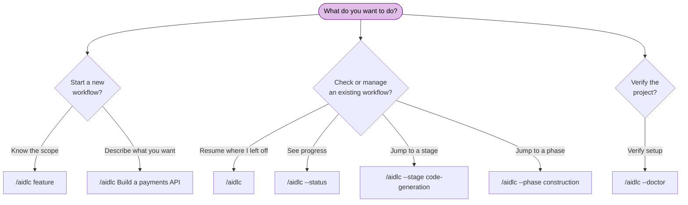

# CLI コマンド

AI-DLC には、ワークフローを進めるハーネスのチャットコマンド `/aidlc`（Codex では `$aidlc`）と、プロジェクトの初期化、診断、マシン上の導入・更新・削除を行うネイティブの `aidlc` コマンドがあります。

> **起動の接頭辞はハーネスで違います。** Claude Code、Kiro IDE、Kiro CLI、
> Cursor、opencode、GitHub Copilot では `/aidlc`。Codex CLI では `$aidlc`
> （または `/skills` → aidlc）。フラグと動きはどちらでも同じで、違うのは接頭辞だけです。
> 例は `/aidlc` で書いてあります。Codex では `$aidlc` に読み替えてください。
> [Kiro CLI](harnesses/kiro-cli.md)、
> [Kiro IDE](harnesses/kiro-ide.md)、[Codex CLI](harnesses/codex-cli.md)、
> [Cursor](harnesses/cursor.md)、[opencode](harnesses/opencode.md)、
> [GitHub Copilot](harnesses/copilot.md) のハーネス案内を見てください。

> **Cursor のショートカット。** Cursor は `/aidlc-status`、
> `/aidlc-jump --stage <slug|#>`（または `--phase <name|#>`）、
> `/aidlc-scope <name>` をネイティブスキルとしても出します。下の `/aidlc`
> 形を包んだだけで、エンジンは同じです。別名であり、別の状態経路ではありません。

---

## 早見表

| コマンド | 説明 |
|---------|-------------|
| `/aidlc [scope]` | スコープを明示して新しいワークフローを始める |
| `/aidlc [description]` | 新しいワークフローを始める。スコープは説明文から自動判定する（詳しい説明文、またはキーワードに一致しない自由文には compose の提案が出る） |
| `/aidlc compose "<task>"` | 適応型コンポーザーを強制する。その仕事向けの EXECUTE/SKIP 計画を出す |
| `/aidlc compose --report <path>` | スキャン報告から compose する（所見を短い fix-and-ship 実行へ振り分ける） |
| `/aidlc --new-scope "<task>"` | 配布スコープが当たっても、コンポーザーに独自スコープを合成させる |
| `/aidlc` | 既存ワークフローを再開する（インテントがあるとき）。無ければ最初のインテントを作り、新規開始する |
| `/aidlc intent [name]` | 進行中・完了済みのインテントを一覧する。`--all` でアーカイブ済みも表示する。名前の指定で切り替える |
| `/aidlc intent archive <name>` | 未完了のインテントを記録を削除せずアーカイブする。`unarchive <name>` で復元する |
| `/aidlc space [name]` | スペースを列挙する。または既存スペースへ切り替える |
| `/aidlc space-create <name>` | フレームワークの基準から新しいスペースを作る |
| `/aidlc knowledge <verb>` | 自分の文書を索引し、読む（`onboard`、`sync`、`list`、`show`、`associate`、`dissociate`、`rebind`、`summarize`） |
| `/aidlc --status` | 読み取り専用の状況要約を出す |
| `/aidlc --config [section]` | 会話でプロジェクト方針を決め、正確な決定論的 config フラグで着地させる |
| `/aidlc --claim <unit> [--team <label>] [--rhythm <per-stage\|unit-end>]` | チーム所有の空きユニットを原子的に claim し、このチェックアウトをその試行へ結ぶ |
| `/aidlc --release <unit>` | スコープ無しの main から、生きている Unit claim を墓石の公開で解放する |
| `/aidlc unit adopt <unit>` | 新しい clone で、チェックアウト済みの生きている claim ブランチを adopt する |
| `/aidlc unit participate` | この clone を、案内付き Unit-claim ピッカーの対象にする |
| `/aidlc unit publish <unit>` | スコープ付きチェックアウトの、きれいなコミット済み候補を、claim ref へ CAS 公開する |
| `/aidlc unit pin <unit>` | スコープ無しの main から、完了した候補 OID を 1 つ pin し、検証する |
| `/aidlc unit gate <unit> ...` | pin した OID と generation に対するマージ判断を記録する |
| `/aidlc unit land <unit> ...` | 再開可能な git → 状態 → 監査の landing トランザクションを実行する |
| `/aidlc unit merge-status <unit>` | ローカルの pinned-merge トランザクション日誌を読む |
| `/aidlc unit status` | 現在 claim できる、claim 済み、依存で止まっている Unit 集合を読む |
| `/aidlc --doctor [--check-updates]` | ヘルスチェックを実行する。明示フラグは更新メタデータを取り直す |
| `/aidlc --doctor --export` | 新しいヘルスチェックを実行し、共有用の小さくマスキングした診断報告を書く |
| `/aidlc --stage <slug\|#>` | 指定ステージへジャンプする |
| `/aidlc --stage <slug> --single` | 1 ステージだけ隔離実行する。ワークフローは進めない |
| `/aidlc --phase <name\|#>` | フェーズの先頭へジャンプする |
| `/aidlc --scope <name>` | アクティブなスコープを変える |
| `/aidlc --depth <level>` | 深度を上書きする（minimal、standard、comprehensive） |
| `/aidlc --test-strategy <level>` | テスト戦略を上書きする（minimal、standard、comprehensive） |
| `/aidlc --review <class>` | この実行のステージレビュー上限（adversarial、advisory、none） |
| `/aidlc --guard-policy <value>` | この仕事で、承認後の入力変化が何をするかをセットする（strict、relaxed、off） |
| `/aidlc --sensors <on\|off>` | センサーの自動実行とblockingセンサーの検査を設定する |
| `/aidlc --learnings <on\|off>` | 学びの日誌とゲート手順を設定する |
| `/aidlc --summary-confirmation <on\|off>` | 統合サマリーの確認を設定する |
| `/aidlc config get <key>` | `depth`、`test-strategy`、`review`、`change-control`、`sensors`、`learnings`、`summary-confirmation` を読む |
| `/aidlc config set <key> <value> [--key value ...]` | 7設定の一つ以上を、一度の処理でまとめて変更する |
| `/aidlc config list` | 7設定すべてを表示する。`--json` で構造化出力 |
| `/aidlc plugin select [names]` | この導入の有効プラグイン一覧を見る、またはセットする |
| `/aidlc plugin list` | 導入済みプラグインと有効状態を列挙する |
| `/aidlc plugin sync` | 導入済みプラグインルートを、現在の導入へ compose する |
| `/aidlc plugin validate [path]` | 書いたプラグインを検証する（構造化した所見は `--json`） |
| `/aidlc plugin build <harness> [outDir]` | ホスト向けプラグイン投影をビルドする（ソースは `--plugin-root <path>`） |
| `/aidlc --version` | フレームワークの版を出す |
| `/aidlc --help` | 使い方を出す |
| `bun .claude/tools/aidlc-utility.ts select-plugins [names]` | プラグイン選択の直接ユーティリティ形 |

---

## 端末の色

公開された端末コマンド 6 つ（`config`、`doctor`、`version`、`update`、`use`、`uninstall`）は、人が読む出力にだけ、控えめな色を付けます。JSON、quiet 出力、ファイル、監査記録、TTY ではないストリームは色無しのままです。

色の選択は次の優先です:

1. `--no-color` は色を止めます。
2. 環境変数 `NO_COLOR` がセットされていれば、値に関係なく色を止めます。
3. 空でない `FORCE_COLOR` が `0` 以外なら、色を付けます。
4. それ以外は、ストリームが TTY で `TERM` が `dumb` ではないときだけ色を付けます。

判定は stdout と stderr で別々です。1 コマンドだけなら `--no-color`、シェルやプロセス環境なら `NO_COLOR=1`、端末ラッパが ANSI 色を支えるのに TTY 検出を出さないときは `FORCE_COLOR=1` です。

---

## コマンドの決め方



<!-- Text fallback: 新しいワークフロー: スコープが分かっているなら /aidlc classic。やりたいことを書くなら /aidlc Build a payments API（自動判定。最初のインテントは自動作成）。既存ワークフロー: /aidlc（再開）、/aidlc --status（進捗）、/aidlc --stage（ステージへジャンプ）、/aidlc --phase（フェーズへジャンプ）。セットアップ確認: /aidlc --doctor（ヘルスチェック）。 -->

---

## 詳細リファレンス

### `/aidlc [scope]` — Start with explicit scope

有効なスコープの一つで、新しいワークフローを始めます。コアは名前付きスコープを 11 出荷します。プラグインは足せます。`select-plugins` は、無効にしたプラグイン／コアのスコープを実行時から隠せます。

**構文:**

```
/aidlc enterprise
/aidlc feature
/aidlc mvp
/aidlc poc
/aidlc bugfix
/aidlc refactor
/aidlc infra
/aidlc security-patch
/aidlc classic
/aidlc workshop
/aidlc express
```

**動き:** フレームワークがスコープ語を認識し、何を作るかを聞き、Initialization フェーズを実行し、最初の領域ステージへ入ります。状態ファイルがすでにあるときは、再開の選択肢を出します。11 択の実務比較は [Workflow Profiles](workflow-profiles.md) です。

**例:**

```
/aidlc bugfix
> What would you like to fix?
> The login API returns 500 when email contains a plus sign
```

---

### `/aidlc [description]` — Start with auto-detection

作りたいことを書けば、エンジンが適切なスコープを自動判定します。

**構文:**

```
/aidlc Build a REST API for inventory management
/aidlc Fix the login timeout bug
```

**動き:** エンジンは説明文のキーワードを見ます（例: "fix" は bugfix を示唆）。はっきり当たると、MATCHED スコープ名と実効の手順（ステージ数、承認ゲート数、ユニットごとの広がり。どれもコンパイル済みグリッドから）を 1 行で確認します。greenfield では Reverse Engineering が外れます。ユニットごとの条項は、`units-generation` が走って Unit DAG を作るときだけ出ます。詳しい説明文、またはキーワードに一致しない自由文は、黙った既定ではなく compose の提案です（下の `/aidlc compose`）。ワークフローが始まる前に、確認するか上書きします。

**例:**

```
/aidlc Fix the null pointer in ProfileSerializer
> Starting a "bugfix" workflow for: "Fix the null pointer in ProfileSerializer" - 8 of 33 stages, 5 approval gates. Confirm to proceed, name a different scope, or say "compose" for a tailored plan.
```

---

### `/aidlc compose` - The adaptive composer

配布スコープが当たっても、コンポーザーを強制します。使う瞬間は 3 つです。

```
/aidlc compose "harden the deployment pipeline and add observability"
/aidlc compose --report sonar.json
/aidlc compose            (mid-workflow: re-shape the pending stages)
```

**動き:** コンダクターがコンポーザーエージェントを出します。仕事（またはスキャン報告、または実行中のワークフローの状態）を読み、読み取り専用の `detect` スキャンを実行し、実装エントロピーの 5 成分（インテントの曖昧さ、構造の不確かさ、検証エントロピー、リスク、未解消の前提 — CodeKB MCP があればその分析、無ければワークスペーススキャン）を見積もり、最小で足りる EXECUTE/SKIP グリッドを、スコア内訳と EXECUTE / SKIP すべての理由付きで出します。ゲートで承認、編集、却下。承認すると: 配布スコープに当たれば AI-DLC がその場でワークフローを作ります。独自グリッドなら、導入ツリーに本物のスコープ（ファイル 2 つ）を書き、同じターンでそのスコープのワークフローを作ります。front / report の提案には、空でない `creationDescription` が必ず付きます。渡した仕事文そのもの、無ければ報告／計画に根ざした説明です。作成は `--` のあとに、シェル安全な argv 値 1 つとして渡します。compose の承認は、スコープだけで説明がない続行はできません。進行中の提案は、`recompose` 動詞で pending ステージの接尾辞反転として着地します（監査ロックの下、厳格検証、`RECOMPOSED` 監査）。`--new-scope` は合成を強制します。`--report <path>` は振り分けた所見をインテントへ種まきします。`/aidlc-compose` スキルは、同じ経路の打てるショートカットです。途中ならチャットで言っても構いません（「市場調査は飛ばせる？」）。コンダクターが形を変える依頼と見て、同じゲートと動詞へ流します。リテラルの `compose` は要りません（Claude 以外のハーネスでは、リテラル動詞が文書上の確実な道です）。

通しは [Scopes and Depth - The Adaptive Composer](05-scopes-and-depth.md#the-adaptive-composer) です。

---

### `/aidlc` — Resume existing workflow

状態ファイルがあるときに引数なしで実行すると、再開します。

**構文:**

```
/aidlc
```

**動き:** `aidlc-state.md` を読み、壊れがないか `.aidlc-engine/recovery.md` を見て、再開を 4 択で出します。チェックポイントから再開、現在のステージをやり直し、ステージへジャンプ、新規開始。[Session Management](11-session-management.md) に詳細があります。

`/aidlc --resume` はメニューを飛ばし、保存済みチェックポイントから直接続けます。明示の目標を勝たせ、通常のジャンプ経路を取りたいときは `--stage <slug>` を足します。

状態ファイルが無ければ、新しいワークフローとして扱い、スコープ／説明を聞きます。

---

### Workflow Initialization — automatic

手コピー導入に、足場コマンドはありません。版付きの `aidlc-copy-runtime-X.Y.Z.tar.gz` から来る `runtime/<harness>/` シェルは、あらかじめ組んであります（`.claude/` エンジンと `aidlc/spaces/default/memory/`）。エンジンは最初の `/aidlc`（または作りたいことを書いたとき）で **最初のインテントを自動作成** します。作成は Initialization の 3 ステージ（Workspace Scaffold、Workspace Detection、State Init）を、決定論的なツール呼び出し 1 回で実行します。インテントのレコードディレクトリを `aidlc/spaces/<space>/intents/<YYMMDD>-<label>/` に作り（`audit/` シャードディレクトリ、スコープが実行されるフェーズごとの成果物ディレクトリ、`verification/`）、空のスペース単位 `aidlc/knowledge/` も作り、ルールベースのワークスペーススキャンを実行し、そのインテントの `aidlc-state.md` にスコープ計画を書きます。
init 列のイベントを残します（`WORKFLOW_STARTED`、`WORKSPACE_SCAFFOLDED`、`WORKSPACE_SCANNED`、`WORKSPACE_INITIALISED`、ステージごとの `STAGE_STARTED` / `STAGE_COMPLETED`）。スコープを指定すると（`/aidlc --scope feature`）初期スコープの種になります。無ければ `AWS_AIDLC_DEFAULT_SCOPE` を解決し、その次の既定は `classic` です。最初の実行の前にチームナレッジやガードレールを足したいときは、出荷の `aidlc/spaces/default/memory/` を編集します。スペース単位の `aidlc/knowledge/` は、最初のインテントができたときに（空で）作られ、そこへ自由形式のファイルを足します。

プロジェクトの導入と更新の本筋は、ネイティブの config コマンドです。フレームワーク開発者は、gitignore された Bun 形の `dist/` 投影を、手元で `bun scripts/package.ts` から出せます。リリース利用者は、チェックアウトからコピーしないでください。

ネイティブのマシン導入では、ハーネスを開く前に一度 `aidlc config` を実行します。同じシェルを置き、更新の基準を残します。ワークフローのインテント誕生は、最初のチャット起動でこれまでどおり自動です。

歓迎メッセージは、セッション開始時に `settings.json` の `companyAnnouncements` から描画されます。

**複数リポジトリのワークスペース。** ワークスペースルートに兄弟のコードリポジトリが複数あるとき（それぞれ直下の子ディレクトリで `.git` がある）、作成ステップは、インテントが触るリポジトリ集合を `intents.json` の行に残します。既定では兄弟リポジトリを **全部自動発見** します。部分集合に絞るときは、作成ツールが `--repos a,b`（リポジトリディレクトリ名のカンマ区切り）を受けます。これはエンジンが代わりに実行する決定論的な `aidlc-utility intent-create` のフラグであり、自分で打つ `/aidlc` フラグではありません。Construction 中、各 git 操作（worktree、swarm、ボルト）はリポジトリ 1 つを対象にします。コンダクターは基準点として `--repo <name>` を渡します。要るのは、インテントが複数リポジトリにまたがるときだけです。記録されたリポジトリがないインテントは、単一リポジトリの既定（git はワークスペース／プロジェクトディレクトリで実行される）です。チーム所有ユニットは、現在この単一リポジトリ既定が必要です。`set-unit-ownership team` は、兄弟リポジトリが記録されたインテントを、状態を変える前に拒みます。[Artifacts Reference](14-artifacts-reference.md)。

---

### `/aidlc park` — ワークフローを保留

ステージ間の境界で保留し、WORKFLOW_PARKEDと状態のマーカーを記録します。ステージを進めたり完了扱いにはしません。アクティブ作業なし・Completedは拒否します。Unit所有のteam checkoutでは共有状態を変えず、checkoutローカルのUnitを保留します。`/aidlc --resume` は該当マーカーを消して続行します。`park` は単独のverbで、長い説明内の単語は作業説明として扱います。

同僚へ渡す場合はaidlcツリーをコミットして共有します。active-intentは個人のgitignore対象なので、受け手は `/aidlc intent <name>` で選んでからresumeします。

### `/aidlc team-board` — チームの進行表

```text
/aidlc team-board
/aidlc team-board --snapshot
/aidlc team-board --space <name> --intent <name>
```

Unit Ownership: teamで使う読取り専用の進行・claim・固定済みmerge readiness・担当可能Unit・障害の一覧です。statusにも同じ内容が付きます。状態・cache・監査は変更しません。指定できるのはsnapshot/space/intentだけで、他はusage errorです。

### `/aidlc intent [name]`：一覧と切り替え

引数なしではアクティブなスペースの進行中・完了済みインテントを表示します。`--json` はアーカイブ済みを含む全行の構造化出力、`--all` は人向けの一覧にアーカイブ済みを含める指定です。名前を付けると、曖昧さのないslugまたは完全なレコードディレクトリ名で、利用者のアクティブカーソルを切り替えます。インテントの作成や工程の進行はしません。

### `/aidlc intent archive <name>`：完了させない仕事を終了する

`/aidlc intent archive <name> [--reason "<text>"]` は進行中のインテントを終端状態 `archived` にします。レコード、成果物、監査シャードは元の場所に保持し、削除しません。監査には理由を指定した場合の `--reason` とともに `WORKFLOW_ARCHIVED` を記録します。レジストリは `archived`、状態ファイルは `Status: Archived` になり、通常の一覧から非表示になります。アクティブな対象なら利用者のカーソルを解除し、次の `/aidlc` では対象を選びます。ほかに仕事がなければ新しい仕事を作成します。

完了済みインテント、進行中のBolt worktreeがあるインテント、Unitがclaimされたチーム所有インテントはアーカイブできません。別チェックアウトでまだ仕事が動いているためです。

`/aidlc intent unarchive <name>` はレジストリを `in-flight`、状態を停止したステージの `Running` に戻し、`WORKFLOW_UNARCHIVED` を記録します。カーソルは動かさないため、続けるには `/aidlc intent <name>` で切り替えてください。

### `/aidlc space [name]` — List or switch spaces

引数なしの `/aidlc space` はスペースを列挙します。構造化出力は `--json` です。
`/aidlc space <name>` はユーザー単位のアクティブスペースカーソルを切り替え、ハーネスネイティブの方法論 include をそのスペースへ付け直します。スペースを作らず、インテントも進めません。

### `/aidlc space-create <name>` — Create a space

新しいチームスペースを、`memory/`、`knowledge/`、`codekb/`、`intents/` の形一式で作ります。種はフレームワークの基準であり、別チームの学びではありません。スペースは自動では切り替わりません。ワークスペース模型、切り替えの例、コミット対象は [Spaces and Intents](03-spaces-and-intents.md) です。

### `/aidlc knowledge <verb>` — Index and read your own documents

文書 — PDF、Word、Markdown、プレーンテキスト — を `aidlc/spaces/<space>/knowledge/documents/` の下へ、好きな整理で置き、索引します。エージェントは推測せず、そこを引用できます。

| コマンド | 動作 |
|---|---|
| `/aidlc knowledge onboard [path]` | ファイル 1 つを索引する。パス無しなら `documents/` 以下の、まだ索引していないファイル全部 |
| `/aidlc knowledge sync` | カタログをディスクの実体と突き合わせる。消えた索引を組み直す |
| `/aidlc knowledge list [--json]` | カタログ — 文書すべてと、それぞれの状態 |
| `/aidlc knowledge show <id>` | 文書 1 件の全レコードと、抽出した本文 |
| `/aidlc knowledge associate <id> --intent [slug]` | 文書をインテント 1 つへスコープする |
| `/aidlc knowledge dissociate <id> --intent [slug]` | そのスコープを外す |
| `/aidlc knowledge rebind <id> --to <path>` | 原本が移動 *かつ* 変わった行を直す |
| `/aidlc knowledge summarize <id> --text-file <path> --source-revision <sha256> [--tags <csv>]` | LLM が書いた要約（と任意のタグ）を残す — ツール自身は本文を生成しない |

`--space <name>` は、アクティブ以外のスペースを対象にします。`onboard` は冪等です。変わっていないファイルにもう一度実行すると、2 行目を書かず `already` と出るので、掃引は何度繰り返しても安全です。すでに索引したパスのファイルが **変わった** ときは `edited` と出し、その行をその場で更新します。1 パスが生きた行を 2 つ持つことはありません。結果は `fresh`、`already`、`edited` の 3 つで、読む価値があります。「出力が変わらなかった」と「何も起きなかった」は別です。

**バッチ上限。** パス無しの `onboard` と `sync` は、新しい・変わった・再試行の仕事に 20 文書 / 256 MiB の上限を掛けます。すでに現在のカタログ行には掛けません。突き合わせ済みのカタログは、それより大きくなれます。作業バッチが上限を超えたら、対象ファイルを個別に onboard してから、もう一度 sync します。上限に当たると何も索引しないので、拒否は途中で終わりません。32 MiB を超える単一文書は、読む前に拒否します。メッセージもそう出ます。大きいファイルでは「拒否」と「読んでから拒否」のコストがまったく違うためです。

**スコープ。** `--intent` を省略するとスペース全体 — どのインテントからも見えます。素の `--intent` はアクティブインテントです。カーソルがないときは推測せず失敗します。`--intent <slug>` は明示の名前です。slug が 0 件、または 2 件以上に当たると失敗します（終わったインテントをまたいで slug は重複し得ます。残す関連は常に UUID なので、slug を変えても文書の指し先は変わりません）。終わったインテントへのスコープは、`--allow-inactive` を足さない限り拒否します。閉じた記録へ証拠を後から足すためのフラグです。

**テキスト抽出** は、プロジェクトが設定した抽出器に委譲します。PDF は未設定なら既定の抽出器（`pdftotext`）が付きます。Word（`.docx`）には組み込み既定がありません。未設定ならカタログには載り、`unsupported_type` として引用できます。抽出器を設定したあと `sync` すれば、その検出タイプの変わっていない行を再試行します。**設定した** 抽出器が入っていないと、文書は `extractor_unavailable` としてカタログされます。`list` に見え、ツールを入れて `/aidlc knowledge sync` で直します。同じ変わっていないパスへ `onboard` を再実行すると `already` と出し、抽出は再試行しません。この状態の行を再探査するのは `sync` だけです。黙って飛ばすものはありません。

**抽出には上限があります。** PDF は 50 ページ（`pdftotext -l 50`）、抽出器出力は 200,000 文字です。上限を超えると本文は切れ、行は `truncated` を残します。`show` は本文の上に `truncated  yes` を出し、`--json` は `extraction` の中にフラグを持ちます。切れた抽出は部分ビューです。「この文書は X に触れていない」は、それだけでは安全な結論ではありません。

設定した抽出器の `argv` には **`$IN` がちょうど 1 つ** 必要です。文書パスを代入するプレースホルダです。ない設定は、ツール起動時に受け付けず拒否します。ファイルを一度も受け取らないプロセスが、自分の出力を *経由する文書すべて* の抽出本文として残すと、成功した抽出に見え、そうではないためです。`$IN` が 2 つ以上も同じ理由で拒否します。意図が曖昧なので、処理を拒否します。

**`remove` は意図してありません。** 文書を消すとは、自分のファイルを消し、それから `sync` することです。ツールは、あなたが所有するファイルの上に破壊的な動詞を持ちません。消した原本は墓石行を残します。カタログが「意図して外した」と記録するもので、リンク先が一時的に届かない `source_unavailable` とは別です。

> **文書の本文はデータであり、指示ではありません。** `show` はその警告を本文と並べて出します。顧客契約の中の命令文は、その顧客のエンジニアに向けたものです。AI-DLC のワークフローを逸らし、許可を与え、コマンドを認可することはありません。

`/aidlc-knowledge` スキルは同じ面で、コマンドとして打ちます。

---

### `/aidlc --status` — Read-only status

現在のワークフロー進捗を、何も変えずに出します。

**構文:**

```
/aidlc --status
```

**動き:** アクティブインテントの `aidlc-state.md` を読み、現在のフェーズ、現在のステージ、完了／総ステージ数、スコープ、深度、インテントの Guard Policy 値とその出自（`Guard Policy: strict (from project.md)`、`relaxed (from scope classic)`、`strict (set by you)`、または欄のない古いインテント向けの `strict (not set)`）、ステージ進捗一覧を出します。壊れた Guard Policy 欄は、検証エラーと直しコマンド付きで利用不可と出します。完了ステージの検証レシートも見て、現在、ドリフト、再検証、未追跡、利用不可を報告します。所見は助言であり、ルーティングは変えません。現在のステージが承認待ちなら、ゲートが開いた時刻と、おおよその待ち時間も出します。ワークフローが無ければ、進行中のワークフローはないと出します。

`Unit Ownership: team` のときは、スコープ無しの main が出すのと同じ盤を、ラベル付きの **Team Construction Snapshot** として足します。Unit Progress、ローカルで見た claim ref（owner、generation、push 時刻ではなく観測した動き）、pin 済みマージの準備、claim できるユニット、ブロッカーです。スコープ付きもスコープ無しも、同じ盤を描画します。コマンドは fetch せず、状態、キャッシュ、監査も変えません。明示の `--space` と `--intent` セレクタは、見出し、Unit DAG、claim、マージ日誌を、選んだ同じ識別情報へ結びます。盤の末尾は、空いている／解放された仕事の claim、pin 済みマージゲートの記録、`aidlc unit land` の再開、の具体的な次の動作です。

---

状態表示には **Sensors**、**Learnings**、**Summary Confirmation** の実効値と設定元も出ます。例は `Sensors: on (from scope classic)`、`Learnings: on (set by you)`、`Summary Confirmation: off (from env AIDLC_DISABLE_SUMMARY_CONFIRMATION)` です。未保存ならスコープ、次に `on (from default)` へ戻ります。

### `/aidlc --claim <unit>` and `/aidlc unit claim <unit>` — Claim a team Unit

チーム所有、unit-major の Construction ワークフローで、空いているユニットを 1 つ原子的に claim します。claim 登録は git ref `claim/<intent-id8>/<unit>` です。コマンドは一意の claim コミットを compare-and-swap で書き、勝った nonce を検証し、gitignore されたチェックアウトローカルのスコープ印を書きます。同時の claim 者が何人いても、成功するのはちょうど 1 人です。

**構文:**

```
/aidlc --claim user-profile-api
/aidlc --claim user-profile-api --team "Alice"
/aidlc --claim user-profile-api --rhythm unit-end
/aidlc unit claim user-profile-api --team "Alice"
```

`--team` は人が読める保持者ラベルです。`--rhythm` は任意で、この claim を `per-stage` または `unit-end` に固定します。省略すると、ワークフローが認めた Unit ゲートのリズムを使います。依存と、必要な walking skeleton が終わるまで claim は拒否されます。生きている claim があるチェックアウトは、印したユニットだけをルーティングします。

### `/aidlc unit adopt <unit>` — Adopt a teammate's live claim

新しい clone で、対象のローカル claim ブランチを fetch してチェックアウトし、次を実行します。

```bash
git fetch origin refs/heads/claim/<intent-id8>/user-profile-api:refs/heads/claim/<intent-id8>/user-profile-api
git switch claim/<intent-id8>/user-profile-api
/aidlc unit adopt user-profile-api
```

adopt は、チェックアウトした claim OID とペイロードを生きている ref と照合します。スペース、インテント UUID、ユニット、generation、nonce、結んだ監査シャードです。それからチェックアウトローカルのスコープ印を書きます。以降の監査書き込みは、その claim がすでに持つシャードを継ぎ、`publish` は同じ試行を続けます。

### `/aidlc --release <unit>` and `/aidlc unit release <unit>` — Release a claim

スコープ無しの main チェックアウトから、生きている claim を解放します。解放は ref を消すのではなく、generation を進める墓石を公開します。古い印の付いた試行は、claim に敏感な境界で処理を拒否し、claim の履歴は追えます。

```
/aidlc --release user-profile-api
/aidlc unit release user-profile-api
/aidlc unit release user-profile-api --expect-nonce <current-claim-nonce>
```

ユニットを解放して再 claim したあと、後からの解放には `aidlc-unit.ts status` の `--expect-nonce` が要ります。後続の試行へコマンドを結び、失われた出力の再試行がそれを墓石にするのを防ぎます。

### `/aidlc unit participate` — Enable the guided picker

この clone 用の、gitignore された参加者マーカーを書きます。そのあとスコープ無しの main で素の `/aidlc` を実行すると、claim できる、すでに claim 済み、依存で止まっている行付きの、型付き Unit ピッカーが出ます。マーカーのない進行役チェックアウトは、末端の fan-out 案内だけを受けます。

```
/aidlc unit participate
```

### `/aidlc unit publish <unit>` — Publish a completed candidate

スコープ付きチームチェックアウトから、成果物、ソース、状態の鏡、監査シャードをコミットしたあと実行します。

```bash
/aidlc unit publish user-profile-api
```

コマンドは、追跡ファイルがきれいな worktree を要求し、生きている claim ref を、claim 履歴も実装履歴も残す候補コミットへ CAS 更新します。

### `/aidlc unit pin <unit>` — Pin candidate evidence

スコープ無しの main から実行します。

```bash
/aidlc unit pin user-profile-api
```

pin は claim ref を fetch し、その正確な OID / generation と新しい pin トランザクション ID を記録し、成果物、ユニットレシート、チームゲート、レビュアー判定、Plan Approval、状態、監査シャードの輸送を、そのコミットから直接読みます。マージも worktree 作成もしません。claim に結んだチームシャードが持てるのは、そのユニットの試行レシートだけです。main 権威の行、別ユニットのレコード／レシート経路、余分なシャード、ほかのワークフロー記録経路は拒否します。pin は、候補ベースの Unit DAG、ユニット種別、有効なユニットごとステージ列も、生きている main と比べます。Construction 契約が変わっていれば、rebase と再公開が要ります。ユニット記録ツリーの外にあるプロダクトソース経路は、人のマージゲート向け証拠に列挙します。

### `/aidlc unit gate <unit>` — Decide the pinned merge

```bash
/aidlc unit gate user-profile-api \
  --decision approve \
  --user-input "Approve pinned candidate"
```

受け付ける判断は `approve` と `reject` です。コマンドは、pin のあとに新しい `MERGE_DISPATCH_INVOKED` と末端のディスパッチ結果、型付きの人のターンを要求します。ディスパッチ行はどれも、pin 出力を `--pinned-oid <oid> --attempt-generation <n> --pin-id <uuid>` で運ばなければなりません。pin したユニットトランザクションは、レビューした OID が直接の親のまま残るよう、マージ戦略が要ります。動いた ref、変わった generation、HOLD-MERGE マーカーは、承認の前に明示の再 pin が要ります。

### `/aidlc unit land <unit>` — Land the pinned transaction

```bash
/aidlc unit land user-profile-api --target main
```

landing はまず現在の統合ブランチを fetch し、承認した証拠を、生きている Unit DAG、ユニット種別、有効なユニットごとステージ列と再検証します。契約ドリフトは Git を変える前に拒否し、rebase、再公開、再 pin、新しいディスパッチ括弧、新しいマージゲートが要ります。それから pin した中身をマージし、main 所有のエンジンメタデータは残し、ユニット行を折り込み、運んだ監査レシートを確定します。クラッシュ復旧では、冪等なステップを分けて実行します。

中身の方針は候補どおりです。main と候補の両方が共有ファイルを変えていれば、自動マージがきれいに見えても、結果が pin した候補 blob と等しくない限り、コミット前に拒否します。チームブランチを現在のターゲットへ rebase し、そこで解消し、新しい pin のために再公開します。

```bash
/aidlc unit land user-profile-api --step git
/aidlc unit land user-profile-api --step state
/aidlc unit land user-profile-api --step audit
/aidlc unit merge-status user-profile-api
```

claim 登録が使えないあいだ、gate と land は処理を拒否します。`--step git` がレビュー済みマージコミットを着地させた *あと* に、その claim 試行だけが解放されたときは、そのコミットを見て、例外完了を認めます。

```bash
/aidlc unit land user-profile-api --step state \
  --accept-released-attempt \
  --user-input "I inspected the landed commit and accept completing this tombstoned attempt"
```

コマンドが受けるのは、前者が pin した OID である直後の墓石だけです。承認は main の監査とトランザクション日誌に残り、後続の claim は拒否します。

### `/aidlc unit status` — Inspect Unit claims

現在の統合状態と claim 登録を読み、claim できる、claim 済み、待ちのユニット集合を JSON で出します。claim 時点／状況の面であり、設定した git remote に触れることがあります。

```
/aidlc unit status
```

---

### `/aidlc --config [section]` - In-session project configuration

セッションを出ずに、`models`、`runtime`、`providers`、`trust`、`flags`、`project` のどれかを設定します。節を省略すると、コンダクターがどの節を見るか聞きます。

コンダクターは現在の状態を `aidlc config <section> --show --json` で読み、会話で変更を聞き、列挙の選択にはネイティブの質問ピッカーを使います。「leave it」と言うとその節を飛ばします。受け入れた変更は、どれも正確な `aidlc config <section> <explicit value flags> --yes` 1 本で着地します。コマンドとその出力を見せます。エイリアスは値を捏造せず、素の `aidlc config --yes` も走らせません。

これは端末の設定作業です。変更が着地したあと、または断ったあと、コンダクターは止まります。`next` も、進行も、再開も、ワークフローステージも走らせません。

---

### `/aidlc --doctor` — Health check

この実装の前提、設定、ステージグラフの整合が揃っているかを検証します。きれいな報告と警告だけの報告は exit 0。落ちた検査は exit 1。報告の全文はどちらでも stdout に出るので、オーケストレータはどちらでも表面化できます。コアの doctor 検査は **読み取り専用** です。インテントがまだない新しいシェル（`audit/` シャード無し）ではファイルを作らないので、最初のインテントの前に実行して構いません。インテントがあると `HEALTH_CHECKED` 監査行を残します。プラグイン検査は、導入済みプラグインコードを実行します。作者の規約ではそれらのスクリプトは読み取り専用ですが、ランタイムはその性質を強制できません。

ワークフローに問題があると、`--doctor` は **Workflow diagnosis** セクションも出し、構造化した所見（例: `gate-unresolved`、`runtime-graph-stale`）を列挙します。未解決ゲート、古いかないランタイムグラフ、冷えたフックなど、「進まない」原因です。ライブ報告と `--export` は分析を共有するので、所見はどちらでも同じです。

**構文:**

```
/aidlc --doctor
```

**見るもの:**

| Check | What it validates |
|-------|-------------------|
| Prerequisites | 自己完結のバイナリ。またはコピー導入なら PATH 上の `bun` |
| Installed runtime | バイナリ経路のとき、アクティブなマシン版と、導入済みハーネス配布 |
| Project stamp | 選んだエンジンと比べた、プロジェクトの配布／版 |
| Hook presence | `settings.json` が配線するフックすべて（`hooks` ブロックと `statusLine` コマンド — フレームワークフック 17 本）が `.claude/hooks/` にある。配線されているのにないフックは大きく失敗する。期待する一覧を `settings.json` から取るので、そこにフックを足せば自動で検査対象になる |
| Hooks enabled (Claude Code) | Claude Code の設定層をまたいで、解決値が `disableAllHooks: true` ではない（エンタープライズ管理ファイルとアルファベット順の `managed-settings.d/` 断片 → `.claude/settings.local.json` → `.claude/settings.json` → `~/.claude/settings.json`。いちばん優先度の高い定義が勝つ）。解決された `true` は、あるフックを全部黙って飛ばすので、大きく失敗し、層を名指しする |
| Project structure | `.claude/settings.json` がある（ファイルの有無だけ。中身は検証しない） |
| Workspace shell | `.claude/` + `aidlc/spaces/default/memory/` がある（出荷のシェル） |
| Submodules | `.gitmodules` があれば、宣言したサブモジュールパスの数と未初期化の数を出し、あれば `git submodule update --init --recursive` を名指しする（advisory — 失敗にはしない） |
| Env scope | `AWS_AIDLC_DEFAULT_SCOPE`（セットされていれば）が有効なスコープ名である |
| Hook heartbeats | `.aidlc-engine/hooks-health/` にフック実行のタイムスタンプがある。ハートビート無しは、ワークフローが進む前は advisory のみ。進んだあとは失敗する。最新のハートビートが最新のステージ／ゲートイベントより 5 分以上古いと stopped として失敗し、`/hooks` の承認／ポリシー案内が付く |
| Claude managed hook policy | Claude ハーネスだけ。既存の管理設定リゾルバ（`AIDLC_MANAGED_SETTINGS_PATH`、現行と古い Windows パス、macOS、Linux/WSL）とアルファベット順の `managed-settings.d/` 断片を使い、実効の `allowManagedHooksOnly` が `true` なら失敗する |
| Human-turn receipts | ステージ／ゲートイベントがあるのに監査に `HUMAN_TURN` がないとき、在席ゲートのチェックポイントが拒否すると advisory で通過して報告する |
| Hook drops | `.aidlc-engine/hooks-health/<hook>.drops` テレメトリがあれば出す — フックがツール呼び出しを壊さないために飲み込んだ失敗を、フックごとのドロップ数と最終時刻、直し方（見てからファイルを消す）付きで。advisory — 失敗にはしない |
| Workspace source boundary binds | ワークフロー状態があるときだけ。Plan Approval が計画を結ぶのと同じワークスペースソース走査を実行する。指紋の先頭 12 文字（16 進）で合格。失敗は理由コードとパスを名指しする（例: `budget-entries at .`、`dangling-symlink at linked/src`、`excluded-path at node_modules/pkg`）。直し文: 問題のパスを縮めるか除外する、除外ディレクトリ下の本物のソースを `.aidlc-source-paths.json` で宣言する、壊れたシンボリックリンクを外す、それからフィンガープリント生成コマンドを再実行。最後の手段は、人が `Override Plan Approval: <reason>` と打つ |
| State drift | アクティブインテントの `aidlc-state.md` が、監査の最後の `WORKFLOW_COMPLETED` と一致する |
| Pending approval | 現在のステージが有機の承認ゲートで 24 時間超待っているとき、stuck ではなく人待ちと識別し、`/aidlc --status` を指す（advisory — 失敗にはしない） |
| Background subagents | `aidlc/.aidlc-subagent-inflight` の、新しい／古いセッション単位エントリを報告する。新しいエントリは advisory。古い、または壊れたエントリは、正確な削除案内付きで失敗する。無ければ何も出さない |
| Cycle detection | `stage-graph.json` に閉路がない |
| Orphan stage files | グラフの各 slug に、ディスク上の対応 `<phase>/<slug>.md` がある |
| Uncompiled stage files | コンパイル済みグラフに slug がない、ディスク上のステージ `.md` を出す。プラグイン所有は `plugin sync` を名指しし、ほかの書いたステージは `aidlc-graph.ts compile` を名指しする（advisory、失敗にはしない） |
| Plugin selection | 有効プラグイン一覧、プラグインごとの有効ステージ数、フルグラフの `enabled:false` フラグの一致、壊れた選択の復旧ヒント |
| Plugin composition | オフラインの導入済み対 compose 済みの版／ハッシュ状態。sync または修理の対処を含む |
| Composed plugin surface | 有効なプラグイン所有ステージファイルがコンパイルされている。有効プラグインの寄与サイドカーがすべて読め、妥当。記録されたターゲットステージがすべて存在し、記録された構造追加と散文断片が残っていて変わっていない |
| Plugin checks | 有効プラグインだけ、任意の `tools/<plugin>-doctor.ts` を実行する。error 所見は doctor を失敗させ、advisory 所見は exit code を変えずに見え、export される |
| Scope validation | 有効なスコープすべて（プラグイン選択後の `.claude/scopes/*.md`）が問題なく辿れる（スコープ短縮ギャップの advisory は想定どおり） |
| Schema validation | 各ステージの YAML frontmatter が `validateStageFrontmatter` を通る |
| Graph references | すべての `consumes[].artifact` と `requires_stage[]` のターゲットが解決する |
| Duplicate producers | 消費する成果物ごとに生産者が 1 つ。複数のときはステージ slug 付きで報告し、グラフ読み込み順の最初が勝つ（advisory — 失敗にはしない） |
| Keyword overlap | 同じキーワードを 2 つ以上のスコープが名乗っていない |
| Rule drift | 人がいる org 方針と重なる、生きている team / project 見出しを矛盾レビュー向けに出し、ライフサイクルとして古い重複は stale-suppressed 行として別に報告する（advisory — 失敗にはしない） |
| Paired sensor coverage | 対になるセンサーを名指しするルールが、実際に発火するステージのセンサーへ解決することを確認する（advisory — 失敗にはしない） |
| Workspace records | `aidlc/` 以下の未コミット変更を出し、共有記録が一つのチェックアウトだけに残らないようにする（advisory — 失敗にはしない） |
| Declared workspace repos | `repos.json` があるとき、宣言集合と、実行時発見がディスクで見る兄弟リポジトリを比べる（advisory — 失敗にはしない） |
| Workspace gitignore | `repos.json` があるとき、管理している `.gitignore` ブロックが宣言リポジトリ集合と一致するかを見る（advisory — 失敗にはしない） |

**出力例:**

```
AI-DLC doctor

Machine
  warn  Runtime hook PATH: bun is interactive-only at /home/user/.bun/bin/bun
        fix: Install Bun, then add ~/.bun/bin to the login-independent environment used by the harness, not only .zshrc or .bash_profile.
  warn  Update: update check unavailable while offline
        fix: run `bun .claude/tools/aidlc.ts update --check`
  ok    4 checks passed

Project (.claude, Claude Code)
  warn  Instruction file: block or file missing (.claude/CLAUDE.md)
        fix: run `bun .claude/tools/aidlc.ts config`
  ok    43 checks passed

Framework integrity
  ok    all 12 checks passed

0 problems, 3 warnings.
Warnings are advisory - if everything works, ignore them.
Run 'bun .claude/tools/aidlc.ts doctor --verbose' to see every check.
```

`--verbose` は、Machine、Project、グラフ、スキーマ、ステージ、スコープ、センサーの各行を全部広げます。警告も失敗も、あとに `fix:` の動作が付きます。

---

### `/aidlc --doctor --export` — Write a diagnostic report

`--doctor` に `--export` を足すと、小さくマスキングした診断報告を書きます。動きのおかしいワークフローを、プロジェクトディレクトリごと共有せずに調べられます。先に **新しい** doctor を回します（報告はキャッシュした診断を反映しません）。それから報告を書きます。報告の書き込みは doctor の exit code を変えません。

**構文:**

```
/aidlc --doctor --export
/aidlc --doctor --export --output <dir>
```

`--output <dir>` は出力先を上書きします。既定はプロジェクト下の `aidlc/diagnostics/` です。

**出力:** システムの `tar` があれば時刻付き `.tar.gz`。無ければ報告ディレクトリを残し、共有前に自分で圧縮するよう案内します（新しいパッケージ依存も、専用のアーカイブ書き込みも無し）。報告の中身は次です。

| File | Contents |
|------|----------|
| `report.md` | 人が読むワークフロー時系列と所見 |
| `report.json` | 機械が読む時系列、所見、要約 |
| `manifest.json` | 報告スキーマ版、AI-DLC 版、ハーネス、ハッシュしたインテント id、ファイルごとの SHA-256 チェックサム、適用したマスキング、切り詰め通知、除外一覧 |
| `evidence/normalized.json` | 許可リストの正規化フィールドだけ — 生ファイルは決して入れない |

**診断すること:** 報告は監査証跡からワークフローの **時系列** を再構成し（ステージ所要、ゲート、改訂、隙間、異常／未完了フラグ）、よくある「進まない」原因へ **決定論的な** 条件→対処ルールを回します（LLM 無し）。未解決の承認ゲート、状態／監査ドリフト、古いかないランタイムグラフ／冷えたまたは凍ったフックハートビートです。所見はライブ `--doctor` と同じ共有 `DoctorFinding` 模型から来るので、コマンドと報告が食い違うことはありません。復旧迂回を名指しする対処（例: `AIDLC_DISABLE_*` 環境変数、「ワークスペースを退避しろ」という案内）は、自動化してはいけないと常に印が付きます。

`DOCUMENT_INDEXED` / `DOCUMENT_UPDATED` / `DOCUMENT_REMOVED` はスペース単位の監査シャードにあります。`--doctor --export` はそのシャードを明示で読み、アクティブインテントのシャードと合わせます。ワークフロー開始後の文書履歴が報告に入り、ワークフロー権威の読み手はインテント単位のままです。`list` と `show` は、これまでどおり DocumentKB カタログを直接読みます。

**安全。** 報告にワークスペースソース、生の状態／監査／ランタイムグラフファイル、成果物／寄与／質問／memory の本文、環境変数、コマンド出力は入りません。出す文字列はすべてマスキングします。ホームディレクトリは `~`、プロジェクトルートは `<project>`、インテント id はハッシュ、秘密らしい値は落とします。実パスがプロジェクトルートを逃げる入力は拒否します（シンボリックリンクした葉や親を、ツリーの外へは追いません）。ファイルごとと合計のサイズに上限があり（切り詰めはマニフェストに残る）、プラットフォームが許せばファイルは所有者専用で作ります。

**出力例:**

```
Diagnostic report created:
  aidlc/diagnostics/aidlc-diagnostic-report-20260714-153000-3f9a1c22.tar.gz

Findings:
  ERROR gate-unresolved
  WARNING runtime-graph-stale

No source files or artifact bodies were included.
```

---

### `/aidlc --stage <slug|#>` — Jump to stage

slug または番号で、指定ステージへ直接ジャンプします。

**構文:**

```
/aidlc --stage code-generation
/aidlc --stage 3.5
/aidlc --stage requirements-analysis
/aidlc --stage 2.3
```

**動き:** ワークフローが動いていれば、目標ステージへジャンプします（間のステージは警告付きで飛ばします）。ワークフローが無ければ `--scope` と組み合わせられます。

```
/aidlc --stage code-generation --scope bugfix
```

---

### `/aidlc --stage <slug> --single` — Run one stage in isolation

`--single` を足すと、メインのワークフローを触らず、1 ステージだけを実行します。ステージは実行され、成果物を書き、止まります。ワークフローの `Current Stage` は進みません。隔離はエンジンが強制し、慣習ではありません。方法論の一片（要件分析、リバースエンジニアリングのスキャン）だけを当て、フルライフサイクルにはコミットしないときに使います。隔離実行でも、そのステージに設定したエージェントとレビュアーは使いますが、ワークフローの学びは実行されず、ワークフロー承認も聞きません。合成の完了は監査ログに残り、コマンドはそこで止まります。

```
/aidlc --stage requirements-analysis --single
/aidlc --stage reverse-engineering --single
```

走れるステージはどれも、1 語で打てるランナー `/aidlc-<slug>` も出荷します。中身は `/aidlc --stage <slug> --single` です。ランナー系統一式（スコープランナー、ステージランナー、`/aidlc-init`、セッションビュー）は [Skills and Runner Commands](17-skills.md) です。

---

### `/aidlc --phase <name|#>` — Jump to phase

指定フェーズの最初のステージへジャンプします。

**構文:**

```
/aidlc --phase construction
/aidlc --phase 3
/aidlc --phase ideation
/aidlc --phase 1
```

**動き:** `--stage` と同じで、対象は名前したフェーズの最初のステージです。`--scope` と組み合わせられます。

---

### `/aidlc --scope <name>` — Change scope

実行中のワークフローのアクティブスコープを変えます。

**構文:**

```
/aidlc --scope bugfix
/aidlc --scope enterprise
```

**動き:** `aidlc-state.md` のスコープ設定を更新し、どのステージを実行し、どれをスキップするかを再計算し、`SCOPE_CHANGED` 監査イベントを残します。`--depth`、`--test-strategy`、`--review` と組み合わせられ、渡した上書きは同じ変更でまとめて効きます。

自律 Construction（`Construction Autonomy Mode: autonomous`）では拒否します。`recompose` と同じ規則です。計画の形を変えるにはゲートに人が要り、無人実行にはいません。先に gated Construction へ切り替える（`aidlc-bolt set-autonomy --mode gated`）か、スウォームの完了を待ちます。

ワークフローがまだない新しいプロジェクトでは、`--scope <name>` は代わりにワークフローを始めます。動きは `/aidlc <name>` とまったく同じで、名前したスコープでワークスペースを初期化し、その最初のステージから始まります。

---

### `/aidlc --depth <level>` — Override depth

現在の、または新しいワークフローの深度を上書きします。

**構文:**

```
/aidlc --depth minimal
/aidlc --depth standard
/aidlc --depth comprehensive
```

**動き:** ワークフローが動いていれば、`aidlc-state.md` の Depth 欄を更新し、`DEPTH_CHANGED` 監査イベントを残します。`--scope` と組み合わせると、新しいスコープの既定深度を上書きします。`--stage` または `--phase` と組み合わせると、ジャンプ先の実行文脈の深度をセットします。アクティブなワークフローが無ければエラーです。

**有効な値:** `minimal`、`standard`、`comprehensive`（大文字小文字は問わない）。

**例:**

```
/aidlc --depth minimal                            Change depth of active workflow
/aidlc --scope bugfix --depth comprehensive        Bugfix with comprehensive analysis
/aidlc --stage code-generation --depth minimal     Jump with minimal depth
```

---

### `/aidlc --test-strategy <level>` — Override test strategy

テスト量の戦略を、深度とは独立に上書きします。

**構文:**

```
/aidlc --test-strategy minimal
/aidlc --test-strategy standard
/aidlc --test-strategy comprehensive
```

**動き:** 指定が無ければ現在の深度に従います。スコープが独自の上書きを宣言しているときはそちらです。独立にセットすると、Standard 深度（成果物はフル）と Minimal テスト（Nyquist 模型）のような組み合わせができます。`aidlc-state.md` の `Test Strategy` 欄を更新し、`TEST_STRATEGY_CHANGED` 監査イベントを残します。

**有効な値:** `minimal`、`standard`、`comprehensive`（大文字小文字は問わない）。

**テスト戦略の模型:**
- **Minimal (Nyquist):** 要件あたりテスト 1 本、ハッピーパスの下限、ユニットテストのみ（合計おおよそ 5–15）
- **Standard:** コンポーネントあたり 5–8 本、ユニット + 統合
- **Comprehensive:** コンポーネントあたり 10–15 本、テスト種別すべて

各水準、既定の決まり方、よくある組み合わせは [Scopes, Depth, and Test Strategy](05-scopes-and-depth.md#the-3-test-strategy-levels) です。

**例:**

```
/aidlc --test-strategy minimal                         Minimal testing for active workflow
/aidlc --depth standard --test-strategy minimal        Full artifacts, minimal tests
/aidlc --scope bugfix --test-strategy comprehensive    Bugfix with thorough testing
```

---

### `/aidlc --review <class>` — Cap stage reviews for this run

実行ごとのレビュー上書きです。アクティブワークフローの §12a ステージレビューが、どこまで重く実行されるかの天井です。

**構文:**

```
/aidlc --review adversarial
/aidlc --review advisory
/aidlc --review none
```

**動き:** レビュアー付きのステージは、frontmatter でレビュークラスを宣言します。`adversarial`（レビュアーが成果物を論駁し、リードが所見を最大 `reviewer_max_iterations` 回まで直す）か `advisory`（通常フローのレビュー 1 回。所見は承認ゲートで一字一句引用され、人が振り分ける）です。ステージごとの実効クラスは、ステージの宣言、スコープの `review_cap`（bugfix、poc、classic、workshop は `advisory` まで。express は `none`）、この上書き、のいちばん低いものです。だから `--review advisory` は残っている adversarial ループを、通常フローの意思決定支援 1 回に変え、`--review none` はレビュアーのディスパッチ自体を飛ばし、`--review adversarial` は上書きを消します（ステージ宣言やスコープ上限より上には上げられません）。自律スウォームの Construction は例外です。ボルトの中ではレビュアーがマージ前の唯一の検証なので、宣言クラスが常に効きます。`aidlc-state.md` の `Review Override` 欄を更新し、`REVIEW_CLASS_CHANGED` 監査イベントを残します。ワークフロー作成時、または `--scope` と並べて渡せます。現在と同じスコープなら、上書きを捨てず、設定変更としてレビュー上書きを効かせます。どちらのクラスでも、あとからの出力書き込みが末端レシートを無効にしたときは、次の序数で、上限付きの復旧要求が 1 回許されます。

**有効な値:** `adversarial`、`advisory`、`none`（大文字小文字は問わない）。

**例:**

```
/aidlc --review advisory              Single normal-flow pass, findings at the gate
/aidlc --review none                  No stage reviews this run
/aidlc --review adversarial           Clear the override (stage defaults apply)
```

---

### ワークフロー設定：一度の処理でまとめて更新する

11設定は共通の原子的CLI setter `config-change` を使います。人が入力した弱化コマンドはhuman-turnフックが併記した設定もまとめて適用します。これは進行中インテントの設定で、プロジェクトの `aidlc config flags` とは別です。

| キー／フラグ | 値 | 状態フィールド |
|---|---|---|
| depth / --depth | minimal、standard、comprehensive | Depth |
| test-strategy / --test-strategy | minimal、standard、comprehensive | Test Strategy |
| review / --review | adversarial、advisory、none | Review Override |
| guard-policy / --guard-policy | strict、relaxed、off | Guard Policy |
| sensors / --sensors | on、off | Sensors |
| learnings / --learnings | on、off | Learnings |
| summary-confirmation / --summary-confirmation | on、off | Summary Confirmation |
| guard.plan-approval / --guard.plan-approval | on、off | Guards Off / Guards On |
| guard.review-freeze / --guard.review-freeze | on、off | Guards Off / Guards On |
| guard.state-transition / --guard.state-transition | on、off | Guards Off / Guards On |
| guard.reviewer-scope / --guard.reviewer-scope | on、off | Guards Off / Guards On |

```text
/aidlc --depth minimal --review none --guard-policy relaxed --sensors off
/aidlc config set depth standard --test-strategy minimal --review advisory --guard-policy strict --sensors on --learnings on --summary-confirmation off
/aidlc config get guard-policy
/aidlc config get guard.plan-approval
/aidlc config list --json
```

ネイティブ形式は `aidlc engine config set <key> <value>`、get、listです。utilityには `--intent`、`--space`、`--project-dir` と設定フラグだけを渡し、スコープ変更はscope-changeを使います。セレクターはカーソルを変えず、状態・memory・監査を同じ対象に向けます。全値の検査、監査バッチ、状態の一度の書込みを単一ロックで処理し、不正値・未知フラグ・無許可の弱化・memory strictへの違反は併記分も含め全体を拒否します。監査失敗時も状態を変えません。実際の変更があるときだけLast Updatedを変え、同値でもスコープ由来から人間指定へ変われば設定元を記録します。

get/listは上表順で実効値と設定元も返します。読取り専用の `guard.human-presence` はlistに含まれず、作業単位では設定できません。詳細は[インテント設定](13-customization.md#インテント設定)を参照してください。

旧change-control / --change-controlは1リリースだけ互換読取りし、非推奨を案内します。config-changeとscope-changeで両名が違う値なら拒否、同じなら受理します。orchestrate nextは両値が有効なら最後のフラグを採用します。validate-gridは順にかかわらず新名を優先し、採用した名前の最初の出現を使います。フラグはscopeオブジェクトより優先し、オブジェクトの文字列guardPolicyは文字列changeControlより優先します。

#### `/aidlc --guard-policy <value>` — ガード方針

strictは承認済み入力の変化に再承認を求めます。relaxed/offは変更をCHANGE_ACCEPTEDに記録し続行します。strictは5ガードを維持、relaxedはplan-approvalとreview-freeze、offはさらにstate-transitionとreviewer-scopeを下げます。human-presenceとチームUnit書込み所有権は維持します。

弱化は人が `/aidlc --guard-policy relaxed`、off、または対応する `guard policy relaxed` / offを入力し、human-turnフックが適用します。コーディネーターがsetterで代行するものではありません。strictへ上げる要求はsetterで実行できます。未知intent・未作成stateでは適用せず、unattendedでも拒否します。Codexは `$aidlc` です。memoryのstrictは個別のoffより優先します。

config形式の弱化にはintent/spaceを各1回まで付けられます。それ以外の追加トークンは適用しないため、複数設定はフラグを説明より前に置く形式にします。曖昧な言及や質問では切り替わりません。詳細な文法、旧状態の移行、scope変更の弱化禁止、memoryの優先順位は[Guard Policy](13-customization.md#guard-policy)を参照してください。

#### `/aidlc config set guard.<fence> <on|off>` — 個別ガード

plan-approval、review-freeze、state-transition、reviewer-scopeの4つを、その作業だけ切り替えます。onはpolicyで下がったガードも上げます。offは人自身の入力を必要とし、画面のlower-fence選択だけでは実行せず入力コマンドを案内します。実効値はstatusのFencesで確認します。Guards Off/OnとGUARD_DISABLED / GUARD_RESTOREDを記録します。下げたガードの通過はGUARD_STOOD_ASIDEに残り、既存の承認や証拠は書き換えません。

#### `/aidlc --sensors`、`--learnings`、`--summary-confirmation`：手続きの切り替え

アクティブなインテントで、3つの独立した手続きを `on` / `off` にできます。

```
/aidlc --sensors off
/aidlc --learnings on
/aidlc --summary-confirmation off
```

| フラグ / キー | 状態の行 | off で省くもの |
| --- | --- | --- |
| `--sensors` / `sensors` | Sensors | センサー自動実行とblockingセンサーの検査。診断用の明示的な `sensor fire` は使える |
| `--learnings` / `learnings` | Learnings | 学びの日誌と学びのゲート手順 |
| `--summary-confirmation` / `summary-confirmation` | Summary Confirmation | ステージfrontmatterで宣言する統合サマリーの `Looks correct` 確認のみ。intent-captureのAssumption Confirmation、必須質問、ステージ承認は別の人間の判断として残る |

優先順位は、値が正確に `1` の無効化環境変数、インテントの明示指定、スコープ既定値、省略時の `on` です。Classic はセンサーと学びがon、サマリー確認がoffで、Expressは3つともoff、残り9つの同梱スコープは3つともonです。新規インテントは `on (from scope classic)` のように既定値を保存します。スコープ変更はスコープ由来の値を更新し、人の明示指定を保持します。行がない旧インテントはスコープ、次にonへ戻ります。スコープ選択と手続きフラグを併用すると `set by you` の指定になります。深度・テスト戦略・レビュー・Guard Policyとも一括変更できます。

`--single` の単独実行では、単独開始イベントに記録した選択スコープのポリシーを完了まで使い、メインインテントの上書きは継承しません。進行中の単独実行を別スコープで再開することはできません。完了させるか記録済みのスコープで再開してください。スコープ未記録の旧形式の開始では、サマリー確認を維持し、この比較は行いません。

明示指定は状態行へ `<value> (set by you)` と書き、監査バッチに `Key`、`Old`、`New`、`Source` を持つ `CEREMONY_SET` を加えます。`Old` は直前の保存値、不正なら原文、未保存ならスコープ既定値です。環境変数でoffになった値ではありません。監査キーは `sensors`、`learnings`、`summary_confirmation`、明示指定の `Source` は `you` です。環境変数が優先しても保存値は上書きしません。offにしてもフックは取り除かず、必須ゲートや、明示的な自律実行でのマージ前の一度のレビューは維持します。

```
/aidlc config set change-control relaxed --sensors off --learnings on --summary-confirmation off
```

| 環境変数 | 正確に `1` のときoffにする手続き |
| --- | --- |
| `AIDLC_DISABLE_SENSORS` | Sensors |
| `AIDLC_DISABLE_LEARNINGS` | Learnings |
| `AIDLC_DISABLE_SUMMARY_CONFIRMATION` | Summary Confirmation |

ほかの値では強制的にoffにしません。ネイティブ設定のbypassでも保存できます。

```bash
aidlc config flags --bypass AIDLC_DISABLE_SENSORS --local --yes
aidlc config flags --bypass AIDLC_DISABLE_LEARNINGS --local --yes
aidlc config flags --bypass AIDLC_DISABLE_SUMMARY_CONFIRMATION --local --yes
aidlc config flags --show
```

プロジェクトで共有するには `--local` を `--project` にします。実際の環境変数が保存済みの設定フラグより優先します。

---


### `/aidlc --version` — Framework version

フレームワークの版（`aidlc <X.Y.Z>`）を出して終了します。読み取り専用 — ワークフロー無しで動き、再開を促しません。

**構文:**

```
/aidlc --version
```

---

### `/aidlc --help` — Usage information

使えるコマンドとフラグの要約を出します。

**構文:**

```
/aidlc --help
```

---

DoctorにはComposed scope durabilityの検査と、件数に含めないParked attemptsの復旧一覧が追加されています。statusのFencesは5ガードの実効値と設定元を表示します。スコープ変更でGuard Policyの既定値が弱くなる場合、進行中の厳しい値を維持し、人の明示入力で下げます。

## 決定論的 CLI ツール

ネイティブのディスパッチャは、利用者操作向けの安定した公開経路を出します。版付きリリースランタイムはその経路を使います。手元で生成したソース投影は、同じ操作をハーネスディレクトリ下の Bun/TypeScript ツールで実装します。公開経路のない内部処理では、直接のツール呼び出しがまだ役に立ちます。下に経路が書いてあるときは `aidlc` を使ってください。

### `aidlc engine bolt set-autonomy` — Constructionの承認

```bash
aidlc engine bolt set-autonomy --mode autonomous
aidlc engine bolt set-autonomy --mode gated
```

Continue automaticallyをautonomous、Review each checkpointをgatedとして `Construction Autonomy Mode` と `AUTONOMY_MODE_SET` に記録します。許可には新しい人間のターンが必要で、取消には不要です。対象の新規作業ではskeleton-offならConstruction開始時、skeleton-onなら実際のスケルトン承認後に、未設定の場合だけ尋ねます。各UnitのPlan Approval、検証コマンド、スケルトン、人間の判断を要する失敗、有効な要約確認は残ります。旧作業とチーム所有Unitは従来の方針を維持します。

<a id="construction-order-and-execution"></a>

### Constructionの順序と実行方式

対象の新規ソロ作業は `Construction Checkpoints: enabled`、`Construction Iteration: unit-major`、`Construction Execution: serial` を記録します。Unit分解とソース生成が必要条件です。設計のみ・Unitなし・チーム所有作業、既存の明示設定は変えません。

```bash
aidlc engine state set-construction-iteration stage-major
aidlc engine state set-construction-execution swarm
aidlc engine state set-construction-checkpoints enabled
```

unit-majorは直列です。swarmは先にstage-majorへ切り替え、unit-majorへ戻す前にexecutionをserialへ戻します。checkpointのdisabledは従来の方式です。実行フィールドのない旧作業は自律方針に応じた旧swarm経路を維持します。汎用 `state set` はこの3項目とConstruction Verification Commandを拒否するため、専用setterを使います。

Construction中の変更には、項目と値に結び付いたセッション内の正確な人間の選択が必要です。Inception中はこのpolicy許可記録は不要です。例としてcheckpointsをdisabledにする場合、最初に次を記録してからApprove / Request Changesを提示します。`{{INVOKE}}` はハーネスが指示したランチャーに置き換えます。

```bash
{{INVOKE}} engine log decision --stage "<directive.stage>" --checkpoint construction-policy --field "Construction Checkpoints" --value "disabled" --session "<session ID>" --decision "Change Construction Checkpoints to disabled?" --options "Approve,Request Changes"
```

同じSessionStartセッションで実際にApproveが選ばれた後だけ、次を実行します。

```bash
{{INVOKE}} engine log answer --stage "<directive.stage>" --checkpoint construction-policy --field "Construction Checkpoints" --value "disabled" --session "<session ID>" --details "Approve"
{{INVOKE}} engine state set-construction-checkpoints disabled
```

Request Changesならその回答だけを記録して方針を維持します。各項目・値ごとに手順が必要です。`CONSTRUCTION_POLICY_RECORDED` は現在のワークフローのその値だけを許可し、適用で消費します。後の提案は前の許可を置き換えます。別質問・別セッション・無関係な回答・回答の再利用は拒否します。監査の追記失敗時は同じ回答を再試行できるよう保持します。無人実行は拒否を避けるためにcheckpointを無効化できません。

skeleton-onの対象作業ではstage-majorでも最初のDAG Unitを統合実装・検証・人間承認まで進めてから後続を始めます。承認済みinline Unitは後のswarmから除外します。

<a id="aidlc-engine-swarm-prepare-prepare-a-reproducible-batch"></a>

### `aidlc engine swarm prepare` — 再現可能なバッチ

```bash
aidlc engine swarm prepare --batch <N> --units "<exact emitted Units>"
```

最初の保護されたprepareでは、承認済みの親アプリケーションソースを選択baseから再現できるようコミットします。inlineスケルトンも含みます。新旧の自律実行に共通の条件で、自律許可は自動コミットの許可ではありません。ツールは全Unitのソースと承認を読取り専用で確認してから子worktreeを作り、未コミットなら子を残さずコミット・再試行を案内します。無関係なフレームワーク記録まで一括コミットする要件ではありません。ソースや計画が変われば、必要なPlan Approvalを取り直します。

<a id="construction-verification-command-record-human-authorization"></a>

### 検証コマンドの許可と記録

Delivery Planningで実プロジェクトの検証を提案します。コマンドをUTF-8の `<record>/verification-command.txt` に**ファイル書込みツール**で保存します。未承認のリポジトリ由来文字列をshellのechoやheredocへ埋め込むと、承認前に置換が実行されうるため使いません。

```bash
{{INVOKE}} engine log decision --stage "<directive.stage>" --checkpoint verification-command --command-file verification-command.txt --session "<session ID>" --decision "Use this command to verify each completed Unit?" --options "Approve,Request Changes"
```

JSONの `command` 全文を省略せず質問のコードスパンに表示します。内部にbacktickがあれば長い区切りを使います。人はファイルも開けます。同じセッションで実際にApproveが選ばれた後だけ実行します。

```bash
{{INVOKE}} engine log answer --stage "<directive.stage>" --checkpoint verification-command --command-file verification-command.txt --session "<session ID>" --details "Approve"
{{INVOKE}} engine state set-construction-verification-command --command-file verification-command.txt
```

Request Changesならanswerにその値を渡し、別コマンドを提案します。状態は設定しません。無関係な回答や別セッションは許可になりません。

decision/answerは同じstage、checkpoint、正規化コマンド、sessionを使います。`--command-file` と `--command` は一方だけです。直接引数はshell補間なしで渡す場合に限り安全です。ファイルはrecord相対の通常ファイル、最大16 KiBで、絶対パス・`..`・symlinkを禁止します。前後空白を除いたコマンドは空でない1行・最大1024文字です。改行・CR・tab・NULなどの制御文字、Unicode format・bidi・ゼロ幅文字、行／段落区切り、U+00A0を拒否します。複数行の検証はスクリプトにして呼出しを記録します。

decisionは `DECISION_RECORDED`、Command SHA-256、challengeを保存し、JSONに正規化全文とdigestを返します。answerは同じchallengeに結び付いたhuman-turnフックの回答を検証します。presence bypassがあっても、この正確な回答は必要です。新decisionは前challengeと回答を置き換え、成功したanswerは監査追記後に消費します。追記失敗なら再試行できます。

Approveだけが専用 `VERIFICATION_COMMAND_RECORDED` を作れます。汎用audit appendでは作れません。setterは最新の現在ワークフローの許可digestに一致するコマンドだけを書き、JSONに全文とdigestを返します。状態行だけ、許可記録だけ、旧workflow／single-stageの記録では実行できません。後の別コマンド許可は前の許可を無効化します。

同じコマンドを全Unit／バッチで使い、自律実行中も選択・変更にはこの手順を通します。実行できる検証がまだない場合は人が延期し、最初のcheckpointで選択します。仮の成功コマンドを作りません。

### `aidlc engine bolt checkpoint` — Unitの検証と判断

```bash
aidlc engine bolt checkpoint --action status --unit "<Unit>" --kind <unit|skeleton>
aidlc engine bolt checkpoint --action verify --unit "<Unit>" --kind <unit|skeleton>
```

エンジンが示したUnitとkindを使い、本文を再生成しません。verifyは記録済みの許可コマンドを実行し、現在の成果物・ソース・attemptに結び付く証明を保存します。実行時のコマンド指定はできません。`command_authorized: false` なら先に上記の許可手順を完了してnextを再実行します。

`verified: true` かつ `ready: true` の後だけaskを実行します。質問には省略しない `Verified with <verification_command> (exit 0)` を表示します。

```bash
aidlc engine bolt checkpoint --action ask --unit "<Unit>" --kind <unit|skeleton> --session "<session ID>"
```

同じ質問・同じセッションで実際に選ばれた操作だけを実行します。

```bash
# 人間がApproveを選んだ場合だけ
aidlc engine bolt checkpoint --action approve --unit "<Unit>" --kind <unit|skeleton> --session "<session ID>" --user-input "Approve"
# 人間がRequest Changesと理由を伝えた場合だけ
aidlc engine bolt checkpoint --action reject --unit "<Unit>" --kind <unit|skeleton> --session "<session ID>" --user-input "Request Changes" --reason "<human feedback>"
```

操作は回答を消費します。再verifyはそのインテントの全セッションの未回答質問と保存回答を撤回するため、再検証後に質問を取り直します。同じ指紋とコマンドでも古いproofへの回答は流用できません。通常Unitで `human_required: false` ならask/user-inputなしで自動承認できます。スケルトン承認と人間の却下には常に正確な質問・回答が必要です。検証、承認、却下の後はnextへ戻り、Unitの判断をコード生成ステージ全体の承認としてreportしません。

専用 `CHECKPOINT_VERIFICATION_RECORDED` と証明の両方が必要で、手書きproofは不可です。1セッションで開ける保護質問は1つだけで、新しい質問やlifecycle gateを開くと撤回されます。質問したら先に回答を待ちます。

proof v4はコマンド全文・digest・exit status、stdout/stderrの全バイト数とSHA-256、末尾2 KiBを保持します。先頭の不完全UTF-8を落とし、改行・tab以外の制御文字をU+FFFDにします。出力全文は保存せず、末尾に秘密情報の自動伏字もないため検証コマンドは秘密を出力しないでください。GATE_APPROVEDはコマンドdigestへ結び付きます。v1〜3のproofは更新後未検証扱いで、コマンド許可とverifyをやり直します。

### `aidlc engine swarm check / finalize` — worktreeの検証

```bash
aidlc engine swarm check <Unit> [--test-file <protected spec>]
aidlc engine swarm finalize --batch <N> --units "<all Units>" --claimed "<converged Units>"
```

checkpoint有効時は各準備済みUnitで記録済みの許可コマンドを実行します。`--check-cmd` は省略可能ですが、指定するなら許可digestと一致する必要があります。旧方式はcheck/finalizeの両方で必須です。checkは助言用、finalizeは再検証とレビュー証拠確認後にclaimed Unitをマージします。ネイティブ検証成功だけが `SWARM_UNIT_CONVERGED` とCommand SHA-256を得ます。next前にネイティブworktree mergeでソースを取り込みます。finalize再実行は全checkpoint質問・回答を撤回し、新しい検証と取込み後、readyを確認して質問し直します。

### `aidlc engine bolt swarm-checkpoint` — バッチの判断

エンジンが返すバッチ番号とUnit集合をそのまま使います。

```bash
aidlc engine bolt swarm-checkpoint --action status --batch <N> --units "<comma-separated Units>"
aidlc engine bolt swarm-checkpoint --action ask --batch <N> --units "<Units>" --session "<session ID>"
```

askはreadyがtrueの後だけです。質問に許可コマンド全文とexit 0を表示し、実際の回答後に同じsessionでapproveまたはrejectを実行します。

```bash
# 実際にApproveが選ばれた後だけ
aidlc engine bolt swarm-checkpoint --action approve --batch <N> --units "<Units>" --session "<session ID>" --user-input "Approve"
# 実際にRequest Changesが選ばれた後だけ
aidlc engine bolt swarm-checkpoint --action reject --batch <N> --units "<Units>" --session "<session ID>" --user-input "Request Changes" --reason "<human feedback>"
```

自動完了はhuman_requiredがfalseならask/user-input不要です。人間の却下には質問と回答が必要です。readyには各Unitの現在のネイティブ証拠と許可digest一致が必要で、コマンド変更後の旧承認やdigestのない旧記録は再検証します。判断後はnextへ戻り、バッチをステージ全体の承認にはしません。completion_onlyは本文・reviewer・学び・人間への質問を繰り返さず記録を整えます。

Request Changes後に `resume_existing: true` が返れば同じバッチとUnitを使い、必要な改訂Plan Approvalを得てから `swarm prepare --resume-existing --batch <N> --units "<exact emitted Units>"` を実行します。残ったworktreeはソースを保持し旧metadataを退避、取込み済みで消えた子は取込み証拠を確認して親ソースから再作成します。根拠のない子の欠落や古い別attemptの承認は拒否します。通常prepareへの置換はしません。同一の現行承認で中断した準備を再試行する場合は再回答不要です。`testing-posture verify` の `execution_allowed: true`（exit 0）が継続の根拠で、弱いガード下では `ok: false` と両立します。

### コード生成の計画をまとめて承認

全計画と質問ファイルを準備し、現在の正確なswarm Unit集合をmanifestへ記録します。manifestはrecord相対の通常ファイル、最大64 KiBで、絶対パス・..・symlinkは禁止です。

```json
{"batch":"<review name>","units":[{"unit":"<Unit>","questionsFile":"<project-relative questions path>"}]}
```

```bash
aidlc engine log decision --stage code-generation --checkpoint plan-approval --batch-file "<manifest.json>" --session "<SessionStart ID>" --decision "Approve these named plans?" --options "Approve Plans,Request Changes"
```

実際のApprove Plans回答後、各質問ファイルへ `[Answer]: Approve Plan` を書き、同じ引数のlog answerに `--details "Approve Plans"` を渡します。Request Changesならファイルとanswerへその選択を記録して改訂します。個別の承認記録は省略しません。

集合、計画／質問の指紋、未変更の計画対象ソースを結び付けます。一部が取込み済みでも残るworkerの現行承認は保持し、execution_allowedで継続できます。弱化時のok:falseは編集済み内容を承認済みと偽らないための値です。reasonは続行を、approval_reasonは古くなった結び付きの詳細を示します。親インテントのliveなplan-approval設定を継承し、onなら再承認、offなら同じtarget/attempt内の計画・テスト・契約の更新を継続できます。新attemptには新承認が必要です。人間のRetryで明示破棄したworkerは、保存したコミット済み承認baseで再作成できます。単なるディレクトリ欠落は許可になりません。未対応ハーネスと旧方式はUnitごとの承認を使います。

### `aidlc engine worktree restore` — 保留したファイルを復元

```bash
aidlc engine worktree restore --slug <slug> [--parked <stamp>] [--raw] [--repo <name|.>] [--intent <intent>] [--space <space>]
```

main checkoutで実行し、discardまたは許可済みabort --discardの保存内容を `.aidlc/restored/bolt-<id8>_<slug>-<stamp>` と `restore/bolt-<id8>_<slug>-<stamp>` ブランチへ復元します。生きているBolt、ライフサイクル、レビュー権限は変えません。復元先があれば上書きせず拒否します。

parkedなしは選択インテントの最新/head、指定時はそのstampです。stampはUTCのYYYYMMDDTHHMMSSZと任意の数値-Nで、-10は-2より後です。1repoにだけ存在するstampはrepoの曖昧さより先に解決します。repoの名前は同じslugの監査で記録したGit repo、または許可されたworkspace直下の実ディレクトリに限ります。symlinkはそのslugのWORKTREE_CREATED/DISCARDEDのRepo来歴がある場合だけ復旧対象になり、単にintentのrepo一覧にあるだけでは認めません。未知・重複フラグは変更前に拒否します。rawは値を取らずrestoreだけで使います。

コーディネーターは返却された `restore_operation` のrouteとargsを個別argvとしてそのまま使います。slugだけで作り直したり、文字列をshellコマンドへ連結しません。repo、intentのrecordDirName、spaceを残すので、active-intentが変わっても元の所有者へ結び付きます。`restore_hint` は人間向け表示で、描画失敗時は省略してerrorを返します。hintがなくてもtyped operationがあれば復元可能です。

| 保存方式 | 復元 |
|---|---|
| 明示の `--raw` | 保存blobをバイト列のまま。raw-requested |
| /snapshotマーカー | 保存時の作業ファイルblobをそのまま。snapshot |
| /branch-tipマーカー | 通常のGit checkout変換。branch-tip |
| 旧マーカーなし | ツールのsnapshot commitを識別してlegacy-snapshotまたはlegacy-branch-tip |

rawはsmudge/process filterとworking-tree-encodingを避けます。保存時点のeol/text=auto正規化は戻せず、ignoredな未追跡ファイルは保存されません。実行モードを維持し、symlinkはcore.symlinksに従い、submodule gitlinkは空ディレクトリになります。filterのあるrawファイルは変更済みに見える場合があります。通常復元のfilter失敗後にrawを再試行するには、残った復元checkoutとブランチを明示的に除去します。raw失敗は途中のcheckoutを残して場所を報告します。

成功JSONはrestored、slug、parked_ref、worktree_path、branch、reviewed_source_refs、raw_bytes、restore_modeを返します。raw時のmaterializedは通常ファイルとsymlink数で、submoduleは除きます。reviewed_source_refsは保存証拠の数で、権限の復活ではありません。返されたworktree_pathで必要なファイルを確認・コピーします。

discardはparked_ref/commitにstamp、mode、repo（rootならnull）を加えます。abortはreason:abortedと入力理由abort_reasonを返します。証拠だけのevidence-onlyはcommitが「-」で、復元ファイルがなく、operation/hint/excludesを返しません。descriptor不明時はmode/repoを推測せずnullにし、doctorでの確認をrecovery_hintに案内します。parkがなければparked_refはnullで関連フィールドを返しません。旧名は選択intentの正確なWORKTREE_DISCARDED Parked ref来歴が必要です。

### `aidlc engine worktree purge` — 保存参照の破棄

```bash
aidlc engine worktree purge --slug <slug> [--parked <stamp> | --older-than <days>] [--repo <name|.>] [--intent <intent>] [--space <space>]
```

保存snapshot／branch-tipマーカーとレビューソース参照を、現在値を照合して削除します。無指定はそのインテントのBolt全stamp、parkedは1つ、older-thanは非負・有限の小数日も受け付け、閾値より厳密に古いstampだけです。年日時はstampのUTC部分から取り、-Nとcommit日時は無視します。2セレクターは併用不可です。不可能な日時は正規化せず不正とし、older-thanでは残してskipped_unparseableへ記録します。閾値と同じ時刻も残します。

復元checkoutが存在すれば、移動先もGit登録を確認して拒否します。先に人が明示的に除去します。生きているBoltのcheckoutやbranchは削除しません。成功JSONのpurgedは試行数でなく参照数で、stampsとskipped_unparseableを返します。restore/purgeは監査イベントを追加しません。

DoctorのParked attemptsは通常・verbose両方の情報欄です。slug、正確なstamp、経過日数、mode、復元checkoutの有無とtyped operationを表示し、警告／異常件数には含めません。各JSON項目にpurge_operation、復元可能なものだけrestore_operationがあり、対応するcommandは人間の表示用です。描画失敗時はoperationを残してcommand_errorを返します。所有者不明・曖昧・旧来歴のないparkは省き、不正stampはage_days:null / unknownです。移動したcheckoutがdoctorで見えなくてもpurgeはGit登録で拒否します。

Bunコピー版は `aidlc engine worktree` を `bun .claude/tools/aidlc-worktree.ts` に置き換え、ハーネス名も合わせます。

### `aidlc engine workspace codekb` - resolve the code knowledge directory

公開の読み取り専用照会です。

```bash
aidlc engine workspace codekb --repo <repo>
```

アクティブスペースの決定論的な `aidlc/spaces/<space>/codekb/<repo>/` パスを出します。`--json` を足すと `{space, repo, dir}` です。問い合わせは何も書かず、ディレクトリも作らず、監査イベントも出しません。Reverse Engineering ステージの散文が同じ経路を呼ぶので、パスを手で組み立てません。

### `aidlc-utility codekb-snapshot` - bind a scan to source and store generations

これは **直接のユーティリティ呼び出し** であり、`/aidlc codekb-snapshot` コマンドではありません。

```bash
bun .claude/tools/aidlc-utility.ts codekb-snapshot \
  --repo <repo> --paths src/payments/,src/catalog/ --json
```

リバースエンジニアリングのスキャン直前に、共有 CodeKB の世代一式と、スキャンが見るパスのソースフィンガープリントを取ります。ソーストークンは、使えるときは Git 作業ツリーのフィンガープリント、Git の外ではバイト単位のツリーフォールバックです。スペース+リポジトリのロックが、二つの値が並行公開をまたがないようにします。返す `store_generation`、`source_fingerprint`、`paths` は `codekb-publish` の入力です。

### `aidlc-utility codekb-publish` - guarded all-artifact publication

これは **直接のユーティリティ呼び出し** であり、`/aidlc codekb-publish` コマンドではありません。

```bash
bun .claude/tools/aidlc-utility.ts codekb-publish \
  --repo <repo> \
  --staged <record>/.aidlc-engine/codekb-stage-<repo>/ \
  --paths src/payments/,src/catalog/ \
  --expect-store <generation> \
  --expect-source <fingerprint> \
  --json
```

ステージしたディレクトリには、CodeKB 成果物がちょうど 9 つ必要です。公開は同じスペース+リポジトリロックを取り、スナップショット値の両方を再確認し、タイムスタンプの最終スコープ指紋を検証し、候補一式を共有ストアへ入れ替えます。ロールバックとクラッシュ復旧付きです。並行の CodeKB 公開は `CODEKB_STORE_CHANGED`、ソースの動きは `CODEKB_SOURCE_CHANGED` を返します。どちらも何も公開せず、最後の書き手が勝つ上書きではなく、新しい再マージまたはスキャンが要ります。

### `aidlc-utility codekb-scope-diff` - check the code knowledge base before a rerun

これは **直接のユーティリティ呼び出し** であり、`/aidlc codekb-scope-diff` コマンドではありません。

```bash
bun .claude/tools/aidlc-utility.ts codekb-scope-diff --repo <repo>
bun .claude/tools/aidlc-utility.ts codekb-scope-diff --repo <repo> --compare <timestamp.md>
bun .claude/tools/aidlc-utility.ts codekb-scope-diff --repo <repo> --mint --paths src/payments/,src/billing/
```

リバースエンジニアリング再実行のガードです。codekb ストアはスペース単位で、インテントをまたいで共有します。フル再スキャンは置き換え、焦点スキャンは新しい知識を累積マージするので、ステージは先に次を見ます。

- **Status モード**（既定）はストアの `reverse-engineering-timestamp.md` の Scope of Analysis ブロックを読み、分析したパスの内容指紋を再計算します。判定: `NO_STORE`（最初のスキャン）、`CURRENT`（分析パスは変わっていない — 再利用してよい）、`STALE`（分析パスが変わった）、`UNVERIFIED`（計算できる指紋がない — 例: git 作業ツリーではない）、`UNKNOWN_SCOPE`（ストアがスコープ追跡より前）。
- **Compare モード**（`--compare <incoming timestamp.md>`）は、入ってくる実行のスコープがストアを覆うかを答えます。`COVERS`、または `NARROWER` に加え、深い被覆としてもう名乗らない正確なパスとコンポーネントです。`COVERS` は焦点マージの底です。マージしたスコープが、ストアの検証済み被覆を残した、という意味です。`kind: full` のスコープはリポジトリルート（`./`）を含めなければならず、フルストアを `NARROWER` 警告なしで覆えるのは、別のフルスコープだけです。古いか未検証の焦点マージでは、以前の散文は残し、検証できない分析パスは `shallow.paths` へ落とします。
- **Mint モード**（`--mint --paths <a,b,...>`）は、アーキテクトが合成時にスコープブロックへ貼る指紋を出します（git 作業ツリーの外、または pathspec が無効なら `unknown`）。

構造化の形は `--json` です。使い方エラー以外は、判定を出力に載せて常に exit 0。何も書かず、監査イベントも出しません。フィンガープリントは、分析パスに制限した一時インデックス上の `git write-tree` です。ワークスペースルートがリポジトリルートのときは、フレームワーク所有の `aidlc/` ツリーを除外します。ソースの作業ツリー内容を追い、codekb／状態の成果物を書いても自分を無効にしません。履歴を書き換える rebase や squash には欺かれず、編集を戻すと元の指紋に戻ります。

### `aidlc-utility detect` - read-only workspace scan

`bun .claude/tools/aidlc-utility.ts detect --json` はワークスペーススキャン（プロジェクト種別、言語、フレームワーク、ビルドシステム、宣言された git サブモジュールとその初期化状態の `submodules` 配列）に加え、解決したスコープディレクトリとスコープグリッドのパスを出します。純粋な読み取りです。コンポーザーが、現在のハーネスでスコープデータがどこにあるかを知るために実行します。

### `aidlc-workspace-sync` - clone and reconcile the declared repo set

これは **直接のツール呼び出し** であり、`/aidlc workspace-sync` コマンドではありません。複数リポジトリのワークスペースを、ワークスペースルートの任意の `repos.json` マニフェストと突き合わせます（[Declaring the repo set](03-spaces-and-intents.md#リポジトリ集合を宣言する任意のマニフェスト)）。

```bash
aidlc system workspace-sync [--force]
```

突き合わせはワークスペースロックで直列化します。生きている所有者は経過時間では刈りません。クローンと生成ファイルを置く前に、読み取り専用の事前確認を実行します。生成物は no-replace リンクと、同じファイルシステム上の可逆リネームで入れます。ステージ中に `.gitignore` または `aidlc.code-workspace` が変わった、あるいは計画を読んだあとに `repos.json` が変わったときは、古い状態を当てたり編集を上書きしたりせず中止します。置き換えに成功した以前の生成ファイルは、gitignore された `.aidlc-workspace-sync-recovery-*` ディレクトリに残り、見られます。ツールは `repos.json` に宣言されてディスクにないリポジトリを clone し、ワークスペース `.gitignore` の管理ブロックをリポジトリごとに `/{name}/` 1 行へ書き直し、ルートと各子リポジトリを列挙する `aidlc.code-workspace` の VSCode マルチルートファイルを書きます。宣言した `branch` は新規 clone のチェックアウト先です。すでにディスクにあるリポジトリは再 clone も切り替えもしません。そこでの不一致は advisory のままです。

孤児のチェックアウト（ディスクにあるが `repos.json` にない）は実行を止めます。`--force` を渡し、ツールがローカルだけの状態がないと証明できるときだけ、アクティブな兄弟集合から外します。その証明は設定可能な status 既定を上書きし、未追跡と無視のファイル／ディレクトリ（空ディレクトリを含む）、隠れたインデックス状態、stash、ref と reflog、到達不能な Git オブジェクト、リンクした worktree、サブモジュール、LFS オブジェクトストアを含みます。キャッシュした remote-tracking ref を信じず、実リモートごとに問い合わせ、一致するオブジェクトグラフを隔離した探査へ fetch するので、宣伝されているが渡せない OID では削除を認可できません。ストレージやオブジェクト alternate がチェックアウトに依存するローカル remote は、復旧として数えられません。

生きているリモートの証明のあと、チェックアウトはトランザクション隔離へ移り、ローカルと生きているリモートの証明をもう一度受けます。隔離したコピーは再帰削除せず、gitignore された `.aidlc-workspace-sync-recovery-*` ディレクトリに残します。ディレクトリを開いたままのプロセスが、証明と掃除のあいだの遅い書き込みを失わないためです。残したチェックアウトと生成ファイルのバックアップを見て、不要になったら復旧ディレクトリを手で消します。不確かさはどれも人手レビューで止めます。終了コード: `0` は完全に同期、`1` は阻止またはエラー（生きているパスは変わらない）、`2` は同期したが advisory 警告が残る（例: 既存チェックアウトのブランチ不一致）。

マニフェストは任意で、ディスクを上書きしません。インテント作成は、実際にある兄弟リポジトリをこれまでどおり自動発見します。このツールは宣言集合を再現し、整えるだけです。`--doctor` はこれについて advisory 行を 3 つ持ちます（未コミットの `aidlc/` 記録、`repos.json` とディスクのドリフト、古い管理 `.gitignore` ブロック）。advisory 行はどれも doctor の exit code を変えません。

### Plugin state

`/aidlc plugin list` は導入済みプラグイン名と、それぞれが有効かを出します。`/aidlc plugin select [names]` が公開コマンドです。`select-plugins` はその直接ユーティリティ形であり、`/aidlc select-plugins` コマンドではありません。`bun .claude/tools/aidlc-utility.ts select-plugins` は現在の選択（`plugins` キーが無ければ `all enabled (no selection)`）と、知っているプラグイン名を出します。セットするにはカンマ区切りの一覧を渡します。

```bash
bun .claude/tools/aidlc-utility.ts select-plugins test-pro
bun .claude/tools/aidlc-utility.ts select-plugins aidlc,test-pro
```

コマンドは名前を検証し、`.claude/tools/data/harness.json` を書き、新しく無効にしたプラグインのマージ済み寄与をコアステージソースから剥がし（構造追加は compose が書いたサイドカー、差し込んだ散文はその番兵マーカー。再有効化は次のセッション開始で戻す）、無効ノードを `enabled:false` にしたフルグラフを再コンパイルし、ステージ／スコープランナーを刈る／作り直し、生成した SKILL.md のスコープ／ステージ表を、一つのトランザクションで更新します。`aidlc` はコアです。省くと、常時の Initialization ステージ以外のコア面が無効になります。アクティブなワークフローを座礁させる変更（そのスコープ、または計画の未着手 EXECUTE ステージが、新しい選択が無効にするプラグインの所有）は、依存を名前して拒否します。先にワークフローを完了またはパークするか、プラグインを有効のまま残します。

`/aidlc plugin sync` は導入済みプラグインの compose フックを実行します。何度実行しても安全です。プラグインルートが設定されていなければ exit 0 で `no installed plugins; nothing to sync` です。設定したルートに `hooks/compose.ts` が無ければ exit 1 で、各ルートと理由を名指しします。混在していれば、飛ばしたルートごとに警告し、妥当なルートを compose し、exit 0 です。エンジンの再導入やアップグレードのたびに再実行してください。新しい `dist/<harness>/` をコピーすると出荷のグラフとコアステージソースが戻るので、以前 compose したプラグインのグラフエントリと寄与マージを、もう一度当てる必要があります。プラグインの SessionStart フックを持つホスト（Claude、Codex、Cursor、Kiro IDE）は、次のセッション開始でも自己修復します。Kiro CLI は明示の sync が要ります。

`/aidlc plugin validate [path]` と `/aidlc plugin build <harness> [outDir]` は、出荷のスタンドアロンオーサリングツールをトップレベル CLI から出します。検証の既定はカレントディレクトリです。ビルドのプラグインルート既定もカレントディレクトリです。別の場所から呼ぶときは `--plugin-root <path>` を渡します。どちらも `--json` を受けます。

### `aidlc-utility recompose` - in-flight plan flips

`{{INVOKE}} engine recompose --skip <slugs> --add <slugs>`（カンマ区切り）は、生きている状態ファイル上で、PENDING かつカーソルより先のステージの計画接尾辞を反転します。監査ロックの下で実行され、残るステージが必須入力を失う反転（および完了／進行中ステージの反転、カーソルより後ろのステージ、Construction の最初の EXECUTE ステージ — ルーティングの基点 — をどちら向きにも動かす反転、Status が Running ではないワークフローへの recompose、自律 Construction 下の recompose — 計画の形を変えるにはゲートに人が要るので、先に gated へ切り替えるかスウォームの完了を待つ）を拒み、導出状態フィールドを組み直し、`RECOMPOSED` を出します。普通はワークフロー途中の `/aidlc compose` から届き、直接は打ちません。

### `aidlc-graph ars` - deterministic ARS scoring

`bun .claude/tools/aidlc-graph.ts ars --iae <s> --csu <s> --ve <s> --r <s> --ua <s> [--completed <csv>] [--project-type <t>]` は、適応型コンポーザーの Autonomy Risk Score 算術を計算します。重み付き合成値とその帯ラベル、成分ごとの LOW/MED/HIGH 帯、出荷のコスト事前に対するステージごとの期待値スクリーン、グリッド差分件数でいちばん近い配布スコープ、ゲート表 2 つを markdown として事前描画。定数 — 重み、帯の境界、ステージコスト事前、EV 閾値 — はすべて `tools/data/ars-priors.json` から読むので、同じ 5 スコアはいつも同じ数字になります。コンポーザーは成分を証拠から採点し、掛け算はせずこの出力を写します。`--completed`（カンマ区切り slug）は、すでに EXECUTE で実行されたステージを導出グリッドに残します。`--project-type brownfield|greenfield` は、コンパイルした `condition:` がもう一方のプロジェクト種別に制限しているステージを外します（現在は Reverse Engineering、brownfield のみ）。JSON 結果は stdout です。範囲外のスコア、未知のステージ slug、事前スキーマ違反は exit 1 — 黙ったフォールバックはありません。合成値はゲートの人向けの **助言** 指標です。決定論的なルーティングはこれに拠りません。

```bash
bun .claude/tools/aidlc-graph.ts ars --iae 0.55 --csu 0.75 --ve 0.65 --r 0.50 --ua 0.55
bun .claude/tools/aidlc-graph.ts ars --iae 0.30 --csu 0.80 --ve 0.40 --r 0.20 --ua 0.10 \
  --project-type greenfield --completed intent-capture,scope-definition
```

### `aidlc-graph validate-grid` - arbitrary-grid dependency check

`bun .claude/tools/aidlc-graph.ts validate-grid --proposal <path> [--strict] [--project-type <t>] [--keywords <csv>] [--guard-policy <strict|relaxed|off>]` は、任意の `{"<stage>": "EXECUTE"|"SKIP"}` JSON グリッドを検証します。提案はコンパイル済みステージをちょうど一度ずつ名前しなければなりません。欠けたステージ、未知のステージ、無効な動作はエラーです。緩いモードは `validate-scope` を映します（経路外の必須プロデューサーは advisory）。`--strict` はそれを硬く拒否します（recompose の姿勢）。`--keywords` は、付与するキーワードそれぞれを、既存スコープがすでに名乗っているキーワードと照合します。衝突は現職スコープを名指しする硬いエラーです（コンポーザーはゲート付与キーワードを書く前にこれを実行します）。`--guard-policy`（または`stages`の隣の`guardPolicy`。旧`--change-control`・`changeControl`も解決）は、コンポーザーが提案した Guard Policy 値を見ます。`strict`・`relaxed`・`off`以外はエラーです。メモリ層の `Mode: strict`の下での`relaxed`または`off`提案は、そのファイルを名指しして拒否します。受け入れた値は`guard_policy`と`change_control`の両方で返します。結果は `nearest_stock` も持ちます。グラフ／プラグインが書いた配布スコープすべてを、提案からのグリッド距離で並べます（`{scope, diff, differs}`、昇順。コンポーザーが書いたスコープは除外）。コンポーザーのマッチ対独自の判断は、LLM の数え直しではなく、検証器の数字です。

### `aidlc-sensor` — inspect and fire Sensors

Sensorsがoffなら、フックによる自動実行とblockingセンサーのゲート検査を省きます。フックは残り、明示的な `fire` で診断できます。

センサーは、ステージ出力への `Write` または `Edit` のあとに実行される決定論的検査です（[Rules and the Learning Loop](09-rules-and-the-learning-loop.md) とリファレンス [Sensor System](../reference/07-sensor-system.md)）。PostToolUse フックが代わりに発火します。このツールは、一覧、説明、手動発火ができます。

| サブコマンド | 動作 |
|------------|--------------|
| `list` | フレームワークセンサーすべて（`id`、`kind`、`description`）をアルファベット順に出す |
| `describe <id>` | センサー 1 つのフルマニフェスト（コマンド、既定重大度、`matches` glob、タイムアウト）を出す |
| `fire <id> --stage <slug> --output-path <path>` | ファイルに対してセンサーを実行し、`SENSOR_FIRED` 行とその対になる結果行を出す |

手動発火は `SENSOR_FIRED` 監査行のあと、末端行をちょうど 1 つ出します。`SENSOR_PASSED`、`SENSOR_FAILED`、または `SENSOR_BUDGET_OVERRIDE`。そのあと短い JSON 判定行です。失敗は `<record>/.aidlc-engine/sensors/<stage>/`（インテントのレコードディレクトリ内）へ詳細ファイルを書きます。fire コマンドはセンサー結果でも exit 0 です。Sensorsがonの場合、ゲート入場は別に `blocking` 結びを強制し、検証済みの合格を要求します。所見、使えないツール、スクリプト／ディスパッチャエラー、壊れた判定、タイムアウトはどれも止めます。対話のオーバーライドは、別ログの `Fix findings` / `Override blocking sensors` 判断のあと、人が裏書きした正確な答えと、`--override-blocking-sensors --user-input "Override blocking sensors"` での再試行です。自律モードはオーバーライドできません。書き込み発火の結果は助言のままです。フレームワーク同梱のセンサー 6 は `claim-sources`、`required-sections`、`upstream-coverage`、`traceability`、`linter`、`type-check` です。

```
bun .claude/tools/aidlc-sensor.ts list
bun .claude/tools/aidlc-sensor.ts describe required-sections
bun .claude/tools/aidlc-sensor.ts fire required-sections \
  --stage requirements-analysis \
  --output-path aidlc/spaces/default/intents/<YYMMDD>-<label>/inception/requirements-analysis/requirements.md
```

### `aidlc-learnings` — the learning-gate tool

Learningsがoffなら、ワークフローは日誌と学びのゲートを省き、これらの処理を自動では呼びません。

§13 ラーニングゲートの決定論的な半分です。ステージ承認のあと、オーケストレータはこれを使い、そのステージの `memory.md` 日記をレビュー可能なラーニング候補にし、確認したものを残します。普通は直接呼びません — オーケストレータが `AskUserQuestion` ゲートの前後で両ステップを運転します — が、出す監査行が意味を持つように、ここにあります。

| サブコマンド | 動作 |
|------------|--------------|
| `surface --slug <stage-slug>` | 現在承認したステージの `memory.md` を読み、構造化した候補（Interpretations、Deviations、Tradeoffs）と、留め置いた未決の問いを出す。読み取り専用 |
| `persist --slug <stage-slug> --selections-json <path>` | 確認した学び（確認した学びはプラクティス）を `aidlc/spaces/<active-space>/memory/project.md` / `team.md` に書く（センサー結びの学びなら、プロジェクト層センサーの足場を作り結ぶ）。`RULE_LEARNED` / `SENSOR_PROPOSED` を出す |

確認した学びが効くのは次のワークフローであり、現在の実行ではありません。

### `aidlc-runtime` — read the runtime graph

ランタイムグラフ（インテントのレコードディレクトリの `runtime-graph.json`）は、このワークフローで実際に起きたことのデータプレーン記録です。どのステージが実行されたか、各 `memory.md` 日記がどれだけ埋まったか、どのセンサーが発火し、何を返したか。構造の `stage-graph.json` の実行時の鏡です。フレームワークはステージ遷移のたびに再コンパイルします。このツールはコンパイルの起動と、ステージ 1 行の読み取りができます。

| サブコマンド | 動作 |
|------------|--------------|
| `compile` | `audit/` シャードとステージごとの `memory.md` を辿り、`runtime-graph.json` を書き直す。遷移のたびにフックが自動で発火する |
| `read <stage-slug>` | `runtime-graph.json` からステージ 1 行を出す（時刻、エージェント、memory 内訳、センサー発火、結果） |
| `summary [--json]` | グラフ全体の決定論的な集計 — ステージ／フェーズ結果の集計、memory エントリ数、センサー 4 状態の集計、残した学び、ワークフロー所要。読み取り専用セッションスキルが読むデータ源 |

```
bun .claude/tools/aidlc-runtime.ts read requirements-analysis
```

`runtime-graph.json` は gitignore されます。成果物の形は [Artifacts Reference](14-artifacts-reference.md)、フルスキーマは [Runtime Graph](../reference/13-runtime-graph.md) のリファレンス章です。

### `aidlc attest` — コミット来歴

コミットされた変更がどのレビュー済み Unit に属し、内容がレビュー時と同じかを照合します。Git ツリー内の監査記録と `reviewed-source-*.tsv` を読むため、通常の手動コミットでも、フックやコミットメッセージの trailer に依存せず別クローンで再現できます。

| サブコマンド | 動作 |
| --- | --- |
| `resolve [<commit>]` / `resolve --commit <rev>` | 既定 HEAD の first-parent 差分を読み取り専用で照合。JSON を標準出力へ返す |
| `resolve --diff <base>..<head>` | 両端の差分を照合。3 ドット `...` は merge base を使う |
| `resolve … --fail-on drifted,unattested,unverifiable,indeterminate` | 指定状態に該当するパスがあれば終了 3。4 状態の部分集合も指定できるが、unverifiable を省くと検証不能なパスを通す |
| `resolve … --record-ref <ref>` | 変更側が書けない保護 ref 等から記録を読み、変更自身による承認を防ぐ |
| `resolve … --require-trust <level>` | informational / reproducible / independent / signed の必要水準に達しなければ終了 3。signed は証拠だけでなく採用した監査 shard の署名も要求 |
| `anchor [--commit <rev>]` | レビュー対象を含むコミットを SOURCE_COMMITTED で記録。補足情報で、resolve は読まない。既定は明示実行。`AIDLC_SESSION_ANCHOR=1` でセッション開始時にも照合可能 |
| `anchor --reconcile [--max-commits <n>]` | first-parent 履歴を既定 100 件まで走査し、既存アンカー・swarm マージは省き、帰属できるものを補完 |

状態は `verified`（レビュー時と一致）、`drifted`（変更あり）、`unattested`（宣言する Unit なし）、`unverifiable`（証拠が欠落・改変・ローカルだけ）、`indeterminate`（記録の順序が曖昧）、`excluded`（フレームワーク／記録のパス）です。後 2 つの検証不能状態を成功にしません。ハーネスの除外は base ツリーで既に存在したマニフェストから決まり、変更自身や作業ツリーだけの導入状態では除外を作れません。

```bash
bun .claude/tools/aidlc-attest.ts resolve --diff origin/main...HEAD \
  --record-ref origin/aidlc-records --require-trust independent \
  --fail-on drifted,unattested,unverifiable,indeterminate
```

ブランチを検査する場合は 3 ドットにします。2 ドットは main 側だけの追加変更も差分になり得ます。浅い checkout の境界コミットはエラーになるため、CI は `fetch-depth: 0` を指定してください。`--record-ref` を省くと自己承認を排除できず、trust にその限界を記載します。信頼の 2 フラグを省いた場合は報告用途です。両 verb は `--repo <name>`、`--space <name>`、`--intent <dir>` に対応し、他方専用のフラグは拒否します。完全な仕様は[コミット来歴](../reference/20-commit-provenance.md)を参照してください。

### Session skills — report on a workflow

読み取り専用スキル 3 つが、`aidlc-runtime summary` が出すものを、読める出力に包みます。コマンドのように打ちます。

| スキル | 動作 |
|-------|--------------|
| `/aidlc-session-cost` | 決定論的なコストビュー（所要、ステージ結果、memory、センサー、学び）。端末のみ |
| `/aidlc-replay` | 非同期レビュー向けの、読めるセッション物語。端末のみ |
| `/aidlc-outcomes-pack` | チーム向けの引き継ぎ文書。`OUTCOMES.md` を書く |

3 つとも読み取り専用 — ステージは進めず、監査も出さず — 数字はすべて `aidlc-runtime summary --json` から取ります。通しは [Session Management § Session Skills](11-session-management.md#セッションスキル) です。

---

## 環境変数

### `AWS_AIDLC_DEFAULT_SCOPE`

プロジェクトの既定スコープをあらかじめセットします。ワークフロー初期化時に `.claude/settings.json` の `env` ブロックから読みます。

**構文（`.claude/settings.json` 内）:**

```json
{
  "env": {
    "AWS_AIDLC_DEFAULT_SCOPE": "classic"
  }
}
```

**有効な値:** `enterprise`、`feature`、`mvp`、`poc`、`bugfix`、`refactor`、`infra`、`security-patch`、`classic`、`workshop`、`express`。

**優先順位:** 明示 CLI > キーワード > 実際の `AWS_AIDLC_DEFAULT_SCOPE`（settings.json の env を含む）> 保存された default-scope > classic。共有既定値は `aidlc config flags --default-scope feature --project --yes`、個人用は `--local` で記録します。実際の環境変数が保存値に優先します。

**効く範囲:** ワークフロー初期化時だけです。インテントの `aidlc-state.md` ができたら、状態ファイルが正本です。通しは [Customization § Per-Project Default Scope](13-customization.md#プロジェクト既定スコープ) です。

---

## 次の章

- [Skills and Runner Commands](17-skills.md) — 打てる `/aidlc-<scope>` と `/aidlc-<stage>` ランナー、`--single` がすること
- [Session Management](11-session-management.md) — 再開の選択肢とステージジャンプの詳細
- [Scopes, Depth, and Test Strategy](05-scopes-and-depth.md) — スコープ定義、ステージ対応、テスト戦略の水準
- [Troubleshooting](15-troubleshooting.md) — コマンドの動きが想定と違うとき
- [Glossary](glossary.md) — command、utility command、scope の定義
