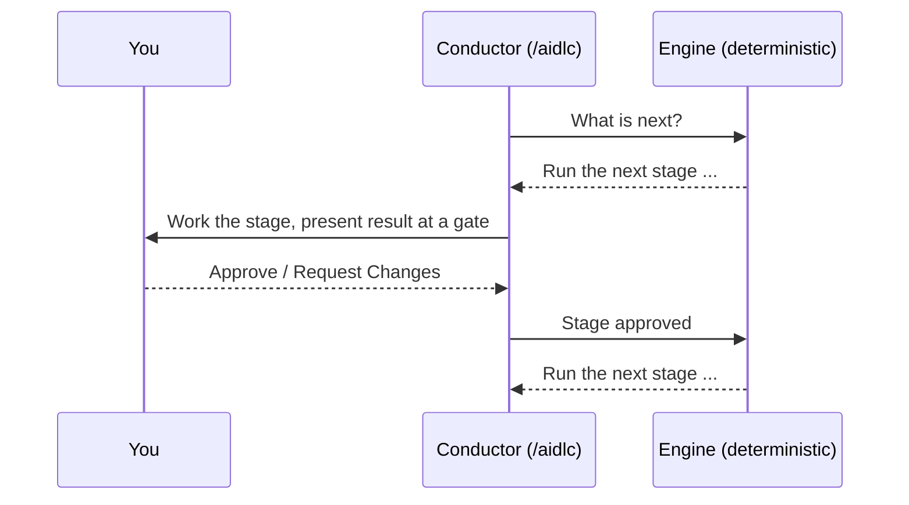

# オンボーディング: 案内付きの最初の 1 週間

AI-DLC v2 は初めてですか。チームが口をそろえて言うことがあります。決定論的なフェーズとステージの強制は強力だが、エンジンが *なぜ* そう振る舞うのかが分かりにくい。そのせいで最初の数回の実行は、ツールを使うというより、ツールと格闘しているように感じる、と。

この章は、手を引いて進む道筋です。ほかのすべてが腑に落ちる、ひとつの考え方を説明し、そのあと使い捨ての Express 実行から本格的な機能開発まで、意図して組んだ 5 回の実行を順に案内します。順番どおりに進めてください。終わるころには、強制が拘束衣ではなくシートベルトのように感じられるはずです。

> **もうインストール済みで、早く始めたいですか。** [Run 1](#run-1-使い捨ての-express-実行15-分) へ飛んでください。まだインストールしていないなら、先に [導入](01-getting-started.md) を済ませてから、ここへ戻ってきてください。

---

## AI-DLC が腑に落ちるひとつの考え方

AI-DLC は、要件、決定、実装をつないだままにするために、ワークフローのルーティングと実行を分けています。

**決定論的なエンジンがルーティングを持ち**、**コンダクターが実行を持ちます**:

- **エンジン**（AI ではない普通のプログラム）は、*次に何が起きるか* を決めます。どのステージを実行するか、スコープがどのステージを飛ばすか、いつゲートで止めなければならないか、いつフェーズの境界を検証するか。決定論的なので、同じ状態を入れれば、同じ次の一手が出てきます。即興はしません。
- **コンダクター**（`/aidlc` のセッション）は、*仕事をどれだけうまくやるか* を決めます。適切なエージェントのペルソナをまとい、よい質問をし、決定を表に出します。ルーティングを決めることはありません。エンジンに次の一手を尋ね、それを実行し、結果を報告して、また尋ねます。



<!-- Text fallback: コンダクターがエンジンに次は何かを尋ねる。エンジンは特定のステージを返す。コンダクターはあなたとそのステージを実行し、承認ゲートで止まる。あなたは承認するか、変更を求める。コンダクターは結果をエンジンに報告し、エンジンは次の一手を返す。このループを繰り返す。 -->

**初めての人にとってこれが大事な理由:** 「なぜ頼んだとおりにやってくれないのか」と感じる場面のほとんどは、コンダクターが自由に動くことを期待しているところから来ます。設計上、それはできません。ステージが止まっているように見えるなら、エンジンが何かを待っているからです。たいていはゲートでのあなたの答えか、前のステージから来るはずの入力の欠落です。「エンジンが道筋を決め、自分はゲートを開ける」と腹に落ちれば、強制は謎ではなくなります。

全体のアーキテクチャは、後で [はじめに](00-introduction.md#オーケストレータの動き) を読んでください。今はこの段落だけで十分です。

---

## 4 つの基本ルール

この 4 つの事実が、初めての人がいちばん驚く振る舞いを説明します。最初の 1 週間は、これを頭に置いておいてください。

### 1. ステージは順に実行され、入力がそろう前には実行されない

ライフサイクルは 5 つのフェーズ — **Initialization → Ideation → Inception → Construction → Operation** — で、その中のステージは決まった順に実行されます。ステージは、必要な入力がそろう前には決して実行されません。スコープに含まれる前のステージが必要な成果物を出すまで、Construction はコードを書けません。人が最初に感じる強制はこれです。お役所仕事ではありません。まだ存在しない入力の上に組み立てることを、エンジンが拒んでいるのです。

手続きを *減らしたい* ときは、エンジンを迂回するのではなく、小さい **スコープ** を選びます。スコープは、ステージ全体（ときにはフェーズ全体）を最初から経路から外します。ルール 3 を見てください。

### 2. 承認ゲートは意図して止める

ほとんどのステージのあと、ワークフローは **承認ゲート** で止まり、あなたが **Approve** か **Request Changes** を選ぶのを待ちます。本当に止まっていて、自分からは進みません（自動の初期化ステージと、オプトインした場合の通常の Construction のチェックポイントを除く）。

ゲートはあなたの制御点です。完了の要約には、何が作られたかと、未解決の指摘が表示されます。指摘にはそれぞれ安定した ID が付くので、後の再確認で、同じ懸念が解決したのか、まだ未解決なのか、リスクとして受け入れたのかが分かります。未解決の指摘を残したまま承認すると、それらは受け入れたものとして記録されます。それで構いませんし、普通のことです。

ゲートでは、次に何をするかを選べます。承認する、変更を求める、対話モードを切り替える、別のステージへジャンプする。[対話モード](07-interaction-modes.md) を参照してください。ゲートの外で仕事が止まることもあります。フックが動かないときや、検査がエージェントのコマンドを拒み続けるときです。それは障害であり、あなたが何か間違えたわけではありません。[止まって見えるとき](#止まって見えるとき) を見てください。

### 3. スコープが実行量を決める — まず小さいものを選ぶ

完全な `feature` は 33 ステージすべてを実行します。本番の機能にはちょうどよい手続きの量ですが、最初に見てみるには多すぎます。**スコープ**（*ワークフロープロファイル* とも呼びます）で、手続きの量を上げ下げします:

| したいこと | 使うもの | ステージ |
|---|---|---|
| 全体を端から端まで、手早く見る | `express` | 10 / 33 |
| 既知のバグを一つ直す | `bugfix` | 9 / 33 |
| アイデアがそもそも実現できるか試す | `poc` | 8 / 33 |
| 本番の機能を本格的に作る | `feature` | 33 / 33 |

小さく始めてください。`poc` や `express` の実行なら、ゲートに埋もれることなく、数分でループを学べます。全体は [ワークフロープロファイル](workflow-profiles.md) を、深度とテスト戦略が各スコープをどう調整するかは [スコープ・深度・テスト戦略](05-scopes-and-depth.md) を見てください。

### 4. すべてが書き残される — レコードディレクトリがあなたの記憶

各ステージは、版付きの Markdown をインテントの **レコードディレクトリ** に書きます:

```text
aidlc/spaces/<space>/intents/<YYMMDD>-<label>/
```

要件、決定、設計、コードの要約、そして完全な `audit/` 証跡が、すべてそこにあります。プロジェクトが大きくなっても AI-DLC が筋道を見失わないのはこのためで、何かが *なぜ* 作られたのかを知りたいときに見る場所でもあります。今はまだ構成全体を理解する必要はありません。何が起きたのか分からなくなったら、答えはそのフォルダのディスク上にある、とだけ覚えておいてください。[スペースとインテント](03-spaces-and-intents.md) と [成果物リファレンス](14-artifacts-reference.md) を参照してください。

---

## 案内付きの進め方

この 5 回の実行を順に行ってください。それぞれが新しい考え方をちょうど一つ足します。Run 1〜3 には、捨てても構わない使い捨てのプロジェクトを使ってください。

> 以下の例は Claude Code を使っています。他のどのハーネスもまったく同じワークフローを実行し、違うのはウェルカムバナーとステータスラインだけです。違いは [他ハーネスで動かす](harnesses/README.md) の下の各ハーネスの章に、完全に注釈を付けた実行は [最初のワークフロー](02-your-first-workflow.md) にあります。

### Run 1: 使い捨ての Express 実行（15 分）

**目的:** 依頼 → ステージ → ゲート → 次、というループを、いちばん少ない手続きで一度体感する。

```bash
mkdir /tmp/aidlc-hello && cd /tmp/aidlc-hello
aidlc config --harness claude   # use your harness
aidlc doctor
```

ハーネスを開き、いちばん軽いプロファイルを実行します:

```text
/aidlc express Build a CLI that converts between Celsius and Fahrenheit
```

何が起きるかを見てください:

1. **初期化は自動で進みます。** 3 つのステージが、ゲートなしで 1 秒もかからずに終わります。あなたは何もしていません。これがライフサイクルの始まりです。
2. **経路が告げられます。** `express` と指定したので、ワークフローはすぐに始まり、実行するステージと承認ゲートの数を表示します。
3. **最初のゲートに当たります。** ステージが何かを作り、要約を表示して止まります。これがルール 2 です。要約を読んで **Approve** してください。
4. 実行が終わるまで **ループが繰り返されます**。

**気づいてほしいこと:** あなたは一度も「次は要件、次は設計」とは言っていません。エンジンがすべてのステップの道筋を決め、あなたはゲートに答えただけです。一回の実行に、このモデルのすべてが入っています。

### Run 2: 同じアイデアを `poc` で — スコープが経路を変えるのを見る

**目的:** 手続きを決めるのは飛ばすことではなくスコープだと、自分で確かめる。

新しい使い捨てのフォルダで（Run 1 と同じように、先にそこで `aidlc config --harness <your harness>` を実行します）、同じ種類の依頼を概念実証として実行します:

```text
/aidlc poc Build a CLI that converts between Celsius and Fahrenheit
```

Run 1 と比べてください。`poc` は経路が違うので、別のステージの組が実行されます。あなたはプロファイルを変えることで、どれだけのことが起きるかを変えました。手で何かを飛ばしたわけではなく、エンジンが別の経路を計画したのです。これがルール 3 の具体例です。各プロファイルにどのステージが入るかは、[ステージとスコープの対応表](05-scopes-and-depth.md#stage-by-scope-matrix) でざっと確かめてください。

### Run 3: ゲートで変更を求める — 自分の制御点を体感する

**目的:** ゲートは承認の判子を押すだけの場ではなく、双方向の扉だと知る。

小さな `poc` の実行をもう一度始めます（`poc` は Intent Capture を実行し、そこにはレビュアーがいます。`express` はレビュアーを無効にします）。最初のステージのゲートで、承認する代わりに **Request Changes** を選び、具体的な指示を一つ出してください（たとえば「成功基準には目標日が必要」）。コンダクターがその成果物に戻って直し、もう一度ゲートを示すのを見てください。

**気づいてほしいこと:** レビュアーが指摘を出していた場合、その ID は再確認をまたいで変わらないので、同じ項目が未解決から解決済みへ動くのが見えます。どちらにしても、コンダクターは成果物を直し、ゲートを示し直します。これが、自分でファイルを編集せずに舵を取る方法です。試し終わったら、承認して最後まで進めてください。ステージの途中で切り替えられる Guide Me / Edit File / Chat のモードは [対話モード](07-interaction-modes.md) を見てください。

### Run 4: レコードディレクトリを見る — ディスク上で「なぜ」を見つける

**目的:** ワークフローと、それが残す成果物を結び付ける。

Run 3 が終わったら、インテントのレコードディレクトリを開きます:

```bash
ls aidlc/spaces/default/intents/
# open the newest <YYMMDD>-<label>/ folder
```

`aidlc-state.md` を読み（実行したステージは `[x]`、スコープで外したものは `[S]`）、スコープが実行したフェーズのフォルダ（たとえば `inception/`）の下の成果物にざっと目を通してください。`audit/` のシャードを一つ開き、決定がタイムスタンプ付きで記録されているのを見てください。これがルール 4 です。レコードディレクトリは、大きくなるプロジェクトの一貫性を保つ、長く残る記憶です。[状態と監査](10-state-and-audit.md) と [成果物リファレンス](14-artifacts-reference.md) を参照してください。

### Run 5: 実際のコードで本物の `feature`

**目的:** 本当に大事な仕事で、すべてを組み合わせる。

実際のプロジェクトで、次を実行します:

```text
/aidlc feature <describe the feature you want>
```

これはライフサイクル全体を実行します。初めてだと多く感じるでしょう。それが本番の機能にふさわしい手続きです。でも今は形が分かっています。エンジンが道筋を決め、フェーズは順に実行され、ゲートはあなたの制御点で、スコープが大きさを決め、すべての決定がレコードディレクトリに残ります。ゲートごとの説明として、この実行と並べて [最初のワークフロー](02-your-first-workflow.md) を追い、何かが止まって見えたらすぐに [トラブルシュート](15-troubleshooting.md) を頼ってください。

---

## 止まって見えるとき

初めての人は、たいていこのどれかに当たります。ほとんどは設計どおりにワークフローが動いているもので、最後の行だけが障害です:

| 症状 | 実際に起きていること | すること |
|---|---|---|
| 「止まって先へ進まない。」 | 承認ゲートにいます（ルール 2）。 | 要約を読み、**Approve** か **Request Changes** で答えます。 |
| 「コードをさっさと書いてくれない。」 | Construction には前のフェーズの入力が要ります（ルール 1）。 | 前のステージを実行させるか、小さいスコープを選びます。 |
| 「ステップが多すぎる。」 | スコープがタスクに必要な大きさより大きいです（ルール 3）。 | `express`、`poc`、`bugfix` でやり直します。 |
| 「質問が多すぎる。」 | 深度が各ステージの質問の数を決めます。スコープが既定を選びます。 | `/aidlc --depth minimal` と入力します（ステージごとに 2〜4 問ほど）。 |
| 「今どのステージにいるのか。」 | ステータスライン／進捗行が教えてくれます。 | Claude Code ではステータスラインを読みます。それ以外では `/aidlc --status`（Codex では `$aidlc --status`）を実行します。 |
| 「あの決定はどこへ行ったのか。」 | レコードディレクトリにあります（ルール 4）。 | `aidlc/spaces/<space>/intents/<...>/` とその `audit/` シャードを開きます。 |
| 「エージェントが実行するコマンドがすべて拒否される」、または同じステップが繰り返される。 | ワークフローより下の何かが失敗しています。フックが動いていないか、検査が誤って拒否しています。 | エージェントを止め、自分のターミナルで `aidlc doctor --export` を実行し、[復旧プレイブック](facilitator-guide.md#復旧プレイブック) に従います。 |

セットアップ、フック、プロバイダー、信頼、古い状態の問題には、プロジェクトのルートで `aidlc doctor` を実行してください。対処のコマンドを示します。そのあと [トラブルシュート](15-troubleshooting.md) を見てください。

---

## オンボーディングのチェックリスト

- [ ] エンジンとコンダクターの分担を一文で言える。
- [ ] `express` の実行を終え、ゲートに答えただけだった。
- [ ] 同じアイデアを別のスコープで実行し、経路が変わるのを見た。
- [ ] ゲートで **Request Changes** を使い、コンダクターが直して示し直すのを見た。
- [ ] レコードディレクトリで、要件、決定、監査シャードを見つけた。
- [ ] 本物の `feature` を端から端まで実行した。

すべてのボックスにチェックが入れば、決定論的な強制は摩擦ではなく予測可能性として読めるはずです。それこそが狙いです。

---

## 次のステップ

- [最初のワークフロー](02-your-first-workflow.md) — 完全に注釈を付けた機能開発の実行
- [ワークフロープロファイル](workflow-profiles.md) — すべてのスコープと、その使いどころ
- [フェーズとステージ](04-phases-and-stages.md) — 5 フェーズ、33 ステージの全体図
- [対話モード](07-interaction-modes.md) — Guide Me、Edit File、Chat とゲート
- [スペースとインテント](03-spaces-and-intents.md) — ワークスペースが多くの実行をどう保つか
- [用語集](glossary.md) — 用語の定義
