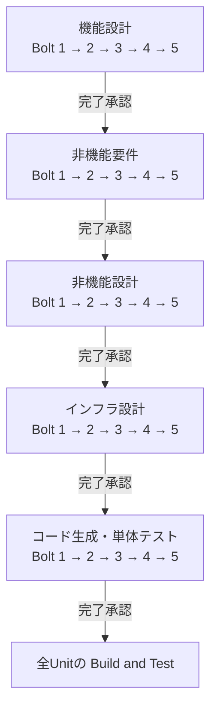
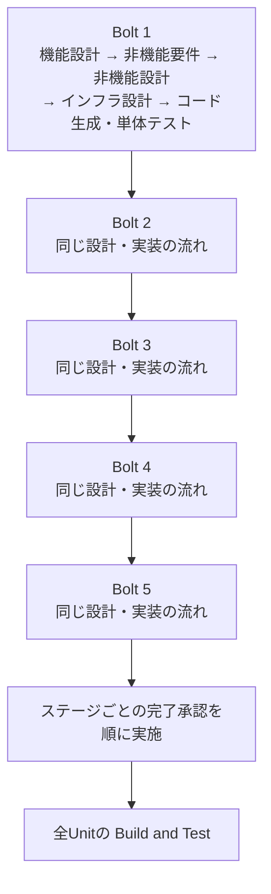

# 5 Boltのstage-majorとunit-major

[Tips一覧へ](./aidlc-workflows-tips.md)

対象: 2.8.1・2.10.0・2.11.0・solo。内容確認: 2026年10月9日。

stage-majorは同じ工程を各Unitで進め、unit-majorは1つのUnitの設計・実装を進めてから次へ移ります。承認位置はバージョンと設定により異なります。

## 図の前提

以下の図は **2.8.1・solo・通常の人による完了承認** の例です。1 Unit＝1 Bolt、全5工程を実施し、依存関係上もBolt 1から5の順で進められるものとします。途中の質問と各Unitのコード生成前の実装計画承認は、図では省略しています。

## stage-majorの例・2.8.1

同じステージを全5 Boltで実施し、ステージの完了承認を受けてから次のステージへ進みます。



図の読み方: 全Boltの機能設計 → 承認 → 全Boltの非機能要件 → 承認、という順序で実装まで進みます。Bolt 1の実装を始める時点で、Bolt 5までの設計が済んでいます。

## unit-majorの例・2.8.1

1つのBoltの設計と実装を進めてから、次のBoltへ移ります。ステージの完了承認は、全Unitの作業が揃った後に順に行います。



図の読み方: Bolt 1の設計・実装 → Bolt 2 → Bolt 3 → Bolt 4 → Bolt 5 → 各ステージの完了承認 → 全体のBuild and Testです。各Unitの実装計画承認は、最後まで延期されません。

## 2.10.0では何が違う？

| 条件                                           | 実行順序・承認の扱い                                 |
| ---------------------------------------------- | ---------------------------------------------------- |
| 2.8.1で反復順序が未設定                        | stage-majorが既定。unit-majorは明示的に選択する      |
| 2.10.0で新規のsolo、Unit分割とコード生成を含む | unit-major・serial・検証チェックポイント有効が既定   |
| 2.10.0でも既存intent、設計のみ、Unitなし、team | 記録済みの設定と、それぞれに適用される方式を維持する |

2.10.0の検証チェックポイントが有効なsoloでは、Unitの作業後に承認済みコマンドで検証し、設定に応じて完了を確認します。walking skeletonが有効なら、stage-majorでも最初のUnitを設計・実装・実際の統合動作確認・人の承認まで進めてから後続Unitへ移ります。上の2.8.1の図と同じ承認位置とは限りません。

現在の設定は、ネイティブCLIなら次で読めます。

```bash
aidlc engine state get "Construction Iteration"
```

コピー版なら、プロジェクト直下で実行します。

```bash
bun .claude/tools/aidlc-state.ts get "Construction Iteration"
```

2.8.1で項目が存在しない場合はstage-majorです。バージョンが違う場合は、反復順序だけでなく `Construction Checkpoints`・`Construction Execution` も確認します。unit-majorでは、状態の `Current Stage` より先のステージを実行することがあるため、エンジンの指示にある `stage` と `unit` を見ます。

## 2.11.0で変わった点

新規のsoloの既定（unit-major・serial・検証チェックポイント有効）は2.10.0と同じです。承認と途中の変更の扱いが次のように変わりました。

| 場面                                               | 2.11.0での扱い                                                                                         |
| -------------------------------------------------- | ------------------------------------------------------------------------------------------------------ |
| unit-majorでチェックポイントが無効                 | 最後のUnitの後に来るステージごとの完了承認を、1つの質問でまとめて尋ねる                                |
| 各Unitのコード生成前の実装計画承認                 | `express`・`poc` と、`/aidlc --plan-approval off` で止めた作業では尋ねない。ほかのスコープは従来どおり |
| 進め方の切り替え・チェックポイントの有効化・無効化 | チャットで頼むとその場で変わり、完了済みのUnitは残る                                                   |
| ジャンプ・1つのUnitの工程のRedo                    | 指定した範囲だけをやり直し、ほかのUnitの完了済みの作業は残る                                           |

まとめて尋ねる質問は、teamの所有方式や自律モード（`Construction Autonomy Mode: autonomous`）では使われません。途中の切り替えの詳しい手順は[進行中にunit-majorからstage-majorへ変更する](./aidlc-tip-switch-iteration.md)にあります。

## 根拠

[2.8.1の実行規約](https://github.com/awslabs/aidlc-workflows/blob/215afe1a61cb06e43002f5ace9ede10dfad80ed4/core/aidlc-common/protocols/stage-protocol-construction.md)、[2.10.0のConstruction実行](https://github.com/awslabs/aidlc-workflows/blob/2a883858f5483bce3b48f43b8f6d3ca2c042d6ae/docs/reference/04-stages/construction.md#construction-walk)、[2.11.0のリリース](https://github.com/awslabs/aidlc-workflows/releases/tag/v2.11.0)、[2.11.0の実行順序](https://github.com/awslabs/aidlc-workflows/blob/6a378b53c0a4fe0641ed7d8de8dfff94264d5b6a/docs/guide/12-cli-commands.md#construction-order-and-execution)、[2.11.0の計画承認](https://github.com/awslabs/aidlc-workflows/blob/6a378b53c0a4fe0641ed7d8de8dfff94264d5b6a/docs/guide/13-customization.md#plan-approval)。

## 関連記事

- [solo・Unit・Boltの関係](./aidlc-tip-solo-unit-bolt.md)
- [進行中にunit-majorからstage-majorへ変更する](./aidlc-tip-switch-iteration.md)
