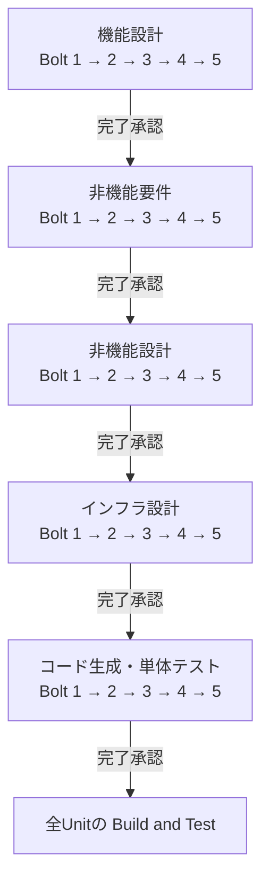
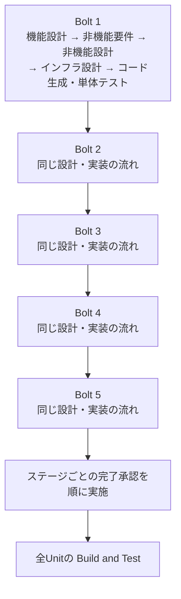

# aidlc-workflows Tips

Claude CodeでAI-DLCを進めるときの、ルールの読み込み、進行の調整、hooks、Boltについての実用メモです。AIDLC Guideが独自にまとめたガイドで、確認したバージョンは **2.8.1と2.10.0**、確認日は2026年9月29日です。

2.8.1で確認した操作を2.10.0にそのまま当てはめると、承認や実行順序が異なる場合があります。まずチャットの `/aidlc --version` と `/aidlc --status` で、対象プロジェクトのバージョンとアクティブなintentを確認してください。

## 調べたいことから探す

- [project.mdはいつ読み込まれる？](#projectmdはいつ読み込まれる)
- [ステージが完了せず進まない](#ステージが完了せず進まない)
- [composeで省略された非機能要件を含めたい](#composeで省略された非機能要件を含めたい)
- [Claude Codeのhooksを修復する](#claude-codeのhooksを修復する)
- [AIDLC_SKIP_HUMAN_PRESENCE_GUARDとは？](#aidlc_skip_human_presence_guardとは)
- [/clear後も環境変数は残る？](#clear後も環境変数は残る)
- [2.8.0から2.8.1へ更新する例](#280から281へ更新する例)
- [solo・Unit・Boltの関係](#solounitboltの関係)
- [5 Boltのstage-majorとunit-major](#5-boltのstage-majorとunit-major)
- [進行中にunit-majorからstage-majorへ変更する](#進行中にunit-majorからstage-majorへ変更する)

## project.mdはいつ読み込まれる？

Claude Codeでは、AI-DLCの `.claude/CLAUDE.md` が参照する `.claude/rules/aidlc.md` を通して、アクティブなspaceの `memory/project.md` などを会話のルールとして読み込みます。特定のステージだけで使うファイルではありません。

さらにAI-DLCエンジンは、ステージの実行指示に適用ルールを `rules_in_context` として含めます。ルールの組み合わせは `org → team → project → phase → stage` の順で、適用される内容を加えます。projectの記述で組織ルールを黙って上書きする方式ではありません。

既定の編集先は `aidlc/spaces/default/memory/project.md` です。別のspaceを使う場合は `aidlc/active-space` と参照先を確認してください。`.claude/` 内にルールの複製を作ると、本来の編集先と食い違います。

ルールの解決結果はグラフに保持されます。実行中に変更した場合は、その内容を再読込し、適用ルールを確認してから続けるようチャットで伝えてください。ファイル保存だけで現在の会話や実行中の指示が即座に差し替わったとは判断しません。

根拠: [2.10.0のルールと学習](https://github.com/awslabs/aidlc-workflows/blob/2a883858f5483bce3b48f43b8f6d3ca2c042d6ae/docs/guide/09-rules-and-the-learning-loop.md)、[Claude Codeのルール参照](https://github.com/awslabs/aidlc-workflows/blob/2a883858f5483bce3b48f43b8f6d3ca2c042d6ae/harness/claude/rules-aidlc.md)。

## ステージが完了せず進まない

まず、チャットで次を順に実行します。

```text
/aidlc --status
/aidlc --doctor
```

承認待ち、未回答の質問、成果物不足、レビュー未完了、hooksの不調では対処が違います。完了条件を満たしているなら、表示された承認質問に答えます。エラーがある場合はdoctorが示す原因を直し、`/aidlc --resume` で再開します。

実施しない工程を飛ばす判断をした場合は、移動先を明示できます。

```text
/aidlc --stage code-generation
```

これは「今の工程を正常完了にする」コマンドではありません。途中の工程がスキップされ、後続の入力や成果物に影響することがあります。エンジンが示す影響を確認し、必要な承認を行ってください。状態ファイルのチェックボックスを手で完了に書き換えると、監査記録や完了判定と食い違います。

根拠: [2.10.0のセッション管理](https://github.com/awslabs/aidlc-workflows/blob/2a883858f5483bce3b48f43b8f6d3ca2c042d6ae/docs/guide/11-session-management.md)、[トラブルシューティング](https://github.com/awslabs/aidlc-workflows/blob/2a883858f5483bce3b48f43b8f6d3ca2c042d6ae/docs/guide/15-troubleshooting.md)。

## composeで省略された非機能要件を含めたい

最初の計画を承認する前なら、ステージ選択の提案に対して「非機能要件 `nfr-requirements` をEXECUTEに含めて、計画を再提示してください」と伝えます。必要なら `nfr-design` も指定します。

進行中の2.10.0では、次のように再構成を依頼できます。

```text
/aidlc compose "非機能要件 nfr-requirements を実施対象に追加してください。非機能設計 nfr-design と後続工程への入力も確認して計画を再提示してください。"
```

進行中の再構成が変更できるのは、現在地より先の未着手の工程です。完了済み・実行中の工程と、Constructionで最初に実行する工程には制約があります。対象をすでに通過している場合は、戻る工程と既存成果物への影響を確認してから変更します。

`/aidlc-nfr-requirements` のような単独ステージの実行は、本線の計画への追加とは別です。本線に含めたい場合は、実行対象の変更として依頼してください。

根拠: [2.10.0のcomposeと進行中の再構成](https://github.com/awslabs/aidlc-workflows/blob/2a883858f5483bce3b48f43b8f6d3ca2c042d6ae/docs/guide/05-scopes-and-depth.md)、[単独ステージのコマンド](https://github.com/awslabs/aidlc-workflows/blob/2a883858f5483bce3b48f43b8f6d3ca2c042d6ae/docs/guide/12-cli-commands.md)。

## Claude Codeのhooksを修復する

「hooksを直す」は、イベントに登録された処理をClaude Codeが実行できる状態に戻すことです。ガードを無効にする操作とは分けて考えます。

| 確認する場所                                 | 見ること・対処                                                                                  |
| -------------------------------------------- | ----------------------------------------------------------------------------------------------- |
| `/hooks` と `/aidlc --doctor`                | hooksの登録、実行失敗、記録不足を確認する                                                       |
| `.claude/settings.json`                      | 使用バージョンのhooksが登録され、コマンドが存在するパスを参照しているか                         |
| `.claude/settings.local.json` とユーザー設定 | `disableAllHooks` などで無効になっていないか                                                    |
| Claude Codeを起動する環境                    | コピー版が使う `bun` を、hooksを起動するプロセスから見つけられるか                              |
| 組織のmanaged settings                       | `allowManagedHooksOnly: true` でプロジェクトのhooksが禁止されていないか。変更は管理者へ依頼する |

Windowsでは、今開いているPowerShellで `bun --version` が通っても、以前から起動しているVS CodeやClaude Codeに同じPATHが渡っているとは限りません。PATHや設定を修正したら、起動元のアプリも終了して起動し直し、再診断します。

配布ファイルの欠落や登録のずれは、そのプロジェクトの導入方式・バージョンに合う公式の設定処理で修復します。独自設定がある場合は差分を確認してください。拡張機能から更新する場合の診断と修復は、[更新時の問題を診断・修正する](./updating-workflows.md)にあります。

根拠: [2.10.0のhooksに関する診断](https://github.com/awslabs/aidlc-workflows/blob/2a883858f5483bce3b48f43b8f6d3ca2c042d6ae/docs/guide/15-troubleshooting.md)、[Claude Codeのhooks設定](https://code.claude.com/docs/en/hooks)。

## AIDLC_SKIP_HUMAN_PRESENCE_GUARDとは？

`AIDLC_SKIP_HUMAN_PRESENCE_GUARD=1` は、承認や回答が実際の人の発言に基づくことを検証するガードの一時回避です。hooksが発言の証跡を記録できない環境などで、人が付き添って復旧するための設定です。

hooksそのものを修復する設定でも、すべての承認を自動化する設定でもありません。別のガードや成果物の要件は残ります。2.10.0には起動セッションに結び付いた検証もあるため、AIがツール呼び出しの直前だけ環境変数を足せば、すべての拒否を回避できるわけではありません。

人が一時回避を選んだ場合の、ターミナル版Claude Codeの起動例です。

macOS / Linux / Git Bash:

```bash
AIDLC_SKIP_HUMAN_PRESENCE_GUARD=1 claude
```

PowerShell:

```powershell
$env:AIDLC_SKIP_HUMAN_PRESENCE_GUARD = "1"
claude
# Claude Code終了後に、このPowerShellの設定を解除する
Remove-Item Env:AIDLC_SKIP_HUMAN_PRESENCE_GUARD
```

修復後は設定を解除してClaude Codeを起動し直し、通常の検証へ戻します。常用設定としてチームに配布することは避けてください。

根拠: [2.10.0のガードと一時回避](https://github.com/awslabs/aidlc-workflows/blob/2a883858f5483bce3b48f43b8f6d3ca2c042d6ae/docs/guide/13-customization.md)、[人が付き添う復旧](https://github.com/awslabs/aidlc-workflows/blob/2a883858f5483bce3b48f43b8f6d3ca2c042d6ae/docs/guide/15-troubleshooting.md)。

## /clear後も環境変数は残る？

起動時に渡した環境変数は、同じClaude Codeプロセスで会話を `/clear` しても、解除したことにはなりません。保持範囲を決めるのは、会話の履歴ではなく、どこで設定したかです。

| 設定方法                                            | 保持される範囲                                                                       |
| --------------------------------------------------- | ------------------------------------------------------------------------------------ |
| `AIDLC_SKIP_HUMAN_PRESENCE_GUARD=1 claude`          | その起動のClaude Codeと継承先。別の起動には自動で引き継がれない                      |
| シェルの `export` やPowerShellの `$env:`            | そのシェルと、そこから後で起動するプロセス。解除するまで同じシェルでの再起動にも渡る |
| シェル設定・OSの環境変数・Claude Codeの設定ファイル | 保存先の設定を変更するまで、新しい起動にも適用され得る                               |
| 1回のツールコマンドにだけ付けた変数                 | そのコマンドと子プロセス。起動済みClaude Code本体の環境は変更しない                  |

無効に戻したいときは、Claude Codeを終了し、元の設定場所から変数を取り除いてから起動し直します。2.10.0では `/aidlc config get guard.human-presence` でガードの状態を確認できます。

参照: [Claude Codeのhooksと環境変数](https://code.claude.com/docs/en/hooks)、[2.10.0の設定確認](https://github.com/awslabs/aidlc-workflows/blob/2a883858f5483bce3b48f43b8f6d3ca2c042d6ae/docs/guide/13-customization.md)。

## 2.8.0から2.8.1へ更新する例

ここは **2.8.1を明示的に選ぶ場合の例** です。現在のAIDLC Guideが導入対象にしている版とは別なので、拡張機能の更新画面では表示される対象版を確認してください。

ネイティブCLIでは、マシンのAI-DLC本体を更新します。

```bash
aidlc update --version 2.8.1
```

プロジェクトが旧版に固定されている場合は、対象プロジェクトで固定先とClaude Code向けの設定を更新します。

```bash
aidlc config --pin 2.8.1
aidlc config --harness claude
aidlc doctor
```

本体の更新とプロジェクトの固定先の更新は別です。進行中・park中のワークフローなどを理由に設定処理が拒否された場合は、表示された条件を解消してから再実行します。状態ファイルを消して制約を回避しないでください。

ネイティブCLIを使わず配布物をコピーした構成では、同じコマンドでそのコピーまで更新されるとは限りません。導入方式を先に確認します。再起動後、チャットでも `/aidlc --version` と `/aidlc --doctor` を確認してください。

参照: [2.8.1のリリース](https://github.com/awslabs/aidlc-workflows/releases/tag/v2.8.1)、[拡張機能での更新と修復](./updating-workflows.md)。

## solo・Unit・Boltの関係

**soloは、1つのセッションが全Unitを担当する選択**です。実行順序や承認の自動化まで同時に決めるものではありません。

Unitは作業の単位、Boltはdelivery-planningで計画する提供単位です。Boltは1つ以上のUnitをまとめ、完了条件や担当などを持ちます。実際の実行順序は `unit-of-work-dependency.md` の依存関係と状態の設定から決まり、`bolt-plan.md` の区切りだけで5つの並列作業が始まるわけではありません。

1 Unit＝1 Boltなら、そのUnitに適用される機能設計、非機能要件、非機能設計、インフラ設計、コード生成・単体テストが、そのBoltの作業になります。スコープやUnitの種類により不要な工程は省かれます。全Unitの後に、共通のBuild and Test、実施対象ならCI Pipelineへ進みます。

| 確認する設定                                         | 決めること                                      |
| ---------------------------------------------------- | ----------------------------------------------- |
| `Unit Ownership`                                     | soloかteamか                                    |
| `Construction Iteration`                             | stage-majorかunit-majorか                       |
| `Construction Autonomy Mode`                         | 通常の完了承認を人に確認するか                  |
| `Construction Execution`・`Construction Checkpoints` | 2.10.0での直列・swarm実行と検証チェックポイント |

根拠: [2.10.0のConstruction実行](https://github.com/awslabs/aidlc-workflows/blob/2a883858f5483bce3b48f43b8f6d3ca2c042d6ae/docs/reference/04-stages/construction.md#construction-walk)。

## 5 Boltのstage-majorとunit-major

以下の図は **2.8.1・solo・通常の人による完了承認** の例です。1 Unit＝1 Bolt、全5工程を実施し、依存関係上もBolt 1から5の順で進められるものとします。途中の質問と各Unitのコード生成前の実装計画承認は、図では省略しています。

### stage-majorの例・2.8.1

同じステージを全5 Boltで実施し、ステージの完了承認を受けてから次のステージへ進みます。



図の読み方: 全Boltの機能設計 → 承認 → 全Boltの非機能要件 → 承認、という順序で実装まで進みます。Bolt 1の実装を始める時点で、Bolt 5までの設計が済んでいます。

### unit-majorの例・2.8.1

1つのBoltの設計と実装を進めてから、次のBoltへ移ります。ステージの完了承認は、全Unitの作業が揃った後に順に行います。



図の読み方: Bolt 1の設計・実装 → Bolt 2 → Bolt 3 → Bolt 4 → Bolt 5 → 各ステージの完了承認 → 全体のBuild and Testです。各Unitの実装計画承認は、最後まで延期されません。

### 2.10.0では何が違う？

| 条件                                           | 実行順序・承認の扱い                                 |
| ---------------------------------------------- | ---------------------------------------------------- |
| 2.8.1で反復順序が未設定                        | stage-majorが既定。unit-majorは明示的に選択する      |
| 2.10.0で新規のsolo、Unit分割とコード生成を含む | unit-major・serial・検証チェックポイント有効が既定   |
| 2.10.0でも既存intent、設計のみ、Unitなし、team | 記録済みの設定と、それぞれに適用される方式を維持する |

2.10.0の検証チェックポイントが有効なsoloでは、Unitの作業後に承認済みコマンドで検証し、設定に応じて完了を確認します。walking skeletonが有効なら、stage-majorでも最初のUnitを設計・実装・実際の統合動作確認・人の承認まで進めてから後続Unitへ移ります。上の2.8.1の図と同じ承認位置とは限りません。

現在の設定は、ネイティブCLIなら次で読めます。

```bash
aidlc engine state get "Construction Iteration"
```

コピー版なら、プロジェクト直下で実行します。

```bash
bun .claude/tools/aidlc-state.ts get "Construction Iteration"
```

2.8.1で項目が存在しない場合はstage-majorです。バージョンが違う場合は、反復順序だけでなく `Construction Checkpoints`・`Construction Execution` も確認します。unit-majorでは、状態の `Current Stage` より先のステージを実行することがあるため、エンジンの指示にある `stage` と `unit` を見ます。

根拠: [2.8.1の実行規約](https://github.com/awslabs/aidlc-workflows/blob/215afe1a61cb06e43002f5ace9ede10dfad80ed4/core/aidlc-common/protocols/stage-protocol-construction.md)、[2.10.0のConstruction実行](https://github.com/awslabs/aidlc-workflows/blob/2a883858f5483bce3b48f43b8f6d3ca2c042d6ae/docs/reference/04-stages/construction.md#construction-walk)。

## 進行中にunit-majorからstage-majorへ変更する

**2.8.1・soloでは変更できます。** 対象intentがアクティブであることを確認し、実行中の作業が止まっているタイミングで、ネイティブCLIなら次を実行します。

```bash
aidlc engine state set-construction-iteration stage-major
aidlc engine state get "Construction Iteration"
```

コピー版なら、同じ操作は次です。両方を実行する必要はありません。

```bash
bun .claude/tools/aidlc-state.ts set-construction-iteration stage-major
bun .claude/tools/aidlc-state.ts get "Construction Iteration"
```

その後、チャットで `/aidlc --resume` します。次のエンジン判定から順序が変わります。設定変更自体は既存の設計書・コードを削除しませんが、完了記録を有効とする基準が変わり、作業済みUnitの再確認・レビュー・完了処理が必要になる場合があります。すべてが無条件で引き継がれる移行コマンドではありません。

**2.10.0のConstruction中は、追加の承認手順が必要です。** チャットで「Construction Iterationをstage-majorへ変更したい」と依頼し、その項目・値に対する承認質問に答えます。エンジンは同じセッションでの明示的な選択を確認してから設定します。上のsetterだけを先に実行すると拒否される場合があります。Inception中はこのConstruction方針変更の証跡は不要です。

`Unit Ownership: team` では、unit-majorからの変更が拒否されます。teamでUnit作業を開始した後は所有方式の変更にも制限があるため、単にsoloへ書き換えて進めないでください。

根拠: [2.8.1の設定変更](https://github.com/awslabs/aidlc-workflows/blob/215afe1a61cb06e43002f5ace9ede10dfad80ed4/core/tools/aidlc-state.ts)、[2.8.1の完了記録の判定](https://github.com/awslabs/aidlc-workflows/blob/215afe1a61cb06e43002f5ace9ede10dfad80ed4/core/tools/aidlc-lib.ts)、[2.10.0の実行順序と変更時の承認](https://github.com/awslabs/aidlc-workflows/blob/2a883858f5483bce3b48f43b8f6d3ca2c042d6ae/docs/guide/12-cli-commands.md#construction-order-and-execution)。
