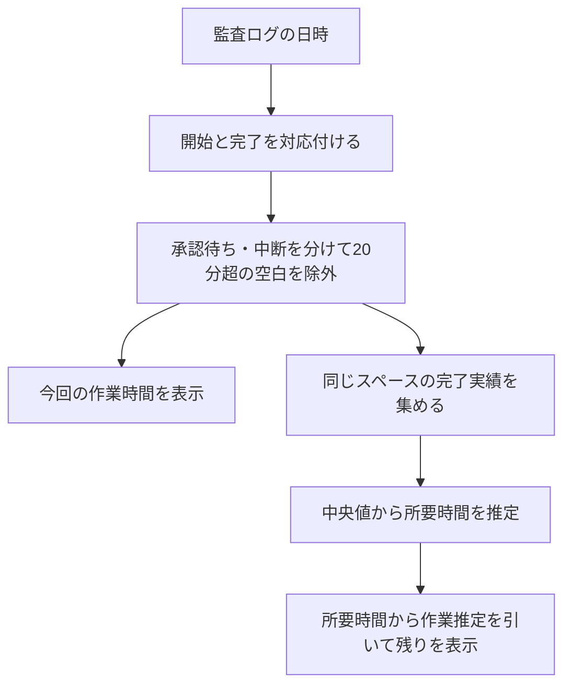
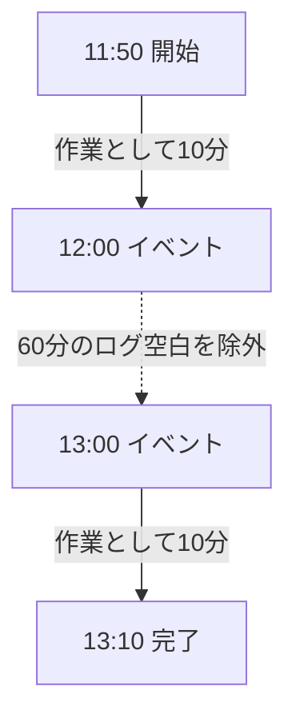
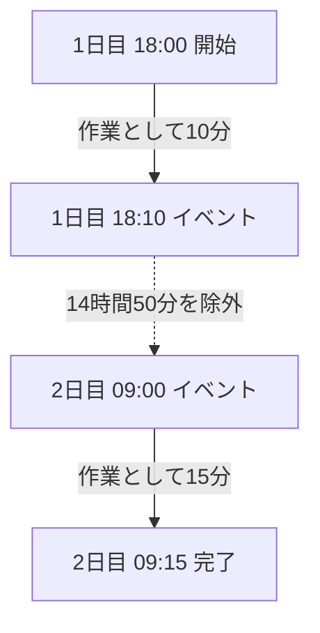
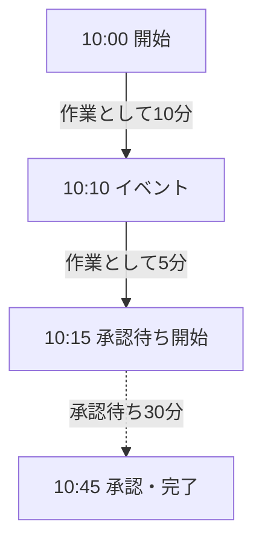

# ステージ時間の算出方法

> 対象: ステージ一覧の時間、経過、残りの意味を知りたい方
>
> 承認待ち・明示的な中断を分け、20分を超えるログ空白を除外して、作業時間を推定します。20分は初期の判定値です。休憩と無ログの処理を完全に区別できる値ではありません。

ステージ詳細の「時間の内訳」にある「算出方法を読む」から、このページを開けます。Dashboard の「ドキュメント」→「拡張機能」からも読めます。[画面の見方](./reading-workflow.md)も参照してください。

## 何の時間を表示しているか

ステージの時間は、AI-DLCが残した監査ログをもとに算出します。人の操作時間やAIの処理時間を直接計測した値ではありません。完了後の値も、イベントの間隔から推定した作業時間です。

| 表示                           | 現在の意味                                                     |
| ------------------------------ | -------------------------------------------------------------- |
| ステージ一覧の `15m 作業推定`  | 今回の実行が終了した後、観測済みの区間から算出した作業時間     |
| ステージ一覧の `≈15m 所要推定` | 過去実績から求めた、そのステージ全体の所要時間                 |
| `推定（参考値）`               | 実績の件数・出所・品質に制約がある推定                         |
| 「このステージの作業推定」     | 今回の実行について、観測済みの区間から算出した作業時間         |
| 「残り」                       | 推定所要時間から観測済みの作業推定を引いた値。0未満にはしない  |
| 「次の承認まで」               | 現在のステージから次の承認ゲートまでの、各ステージの残りの合計 |
| ワークフロー全体の「残り」     | 対象ステージの残りのうち、推定できた分の合計                   |

ステージ一覧は、実行中もステージ全体の所要時間を示します。残り時間は「残り」と書かれた欄で確認してください。推定を超えて作業が続く場合、残りが0になってもステージは完了していません。

時間が分からない場合、ステージ一覧の時間は空欄、作業推定・残り・内訳は `—` になります。既知のゼロは `0分`、正の1分未満は `1分未満` です。1分以上は分単位に四捨五入し、`15m` や `1h30m` で表示します。

## 参照するデータ

監査ログは、ワークスペース内の次の場所にあります。

```text
aidlc/spaces/<space>/intents/<record>/audit/*.md
```

開始・完了のイベントと、それらの間に記録されたイベントの日時を使います。同じ記録の `aidlc-state.md` で、完了・実行中・スキップ・再実行の状態を確認します。

今回の経過時間は、画面で選択している案件の記録から算出します。過去実績は同じアクティブスペースにある全案件から集めます。外部サービスや別リポジトリの実績は使いません。

## 算出ロジック



図の読み方: 開始と完了を対応付け、承認待ち・中断・長いログ空白を分けて今回の作業時間を算出します。同じ方式で計算した完了実績を集め、その中央値を次の所要時間の推定に使います。

例えば、単独のステージに次の記録がある場合です。

| 時刻  | イベント     | 前のイベントからの間隔 | 作業として数える時間 |
| ----- | ------------ | ---------------------- | -------------------- |
| 10:00 | 開始         | なし                   | なし                 |
| 10:03 | 成果物の更新 | 3分                    | 3分                  |
| 10:28 | 成果物の更新 | 25分                   | 0分。空白25分を除外  |
| 10:30 | 完了         | 2分                    | 2分                  |

開始から完了までは30分ですが、表示に使う作業推定は `3 + 0 + 2 = 5分` です。25分の空白は全区間を除外します。ちょうど20分の間隔は作業候補ですが、20分を超えると全区間を除外します。

実行中は最後の記録から現在までを作業時間に加えず、次の観測を待ちます。画面の更新だけで作業時間は増えません。開始・完了、成果物の更新、レビューなどの作業記録を使い、ヘルスチェックやセッション開始・終了だけでログ空白を埋めません。

同じ案件で複数ステージが開いている場合、同じ時間区間を複数ステージの作業に重複加算しないように割り当てます。ただし、ステージ名のないイベントでは、直近に開始した未完了ステージを使うなどの推定が必要です。並列AIの総処理時間を表すものではありません。

## 所要時間と残り時間の推定

完了した実行の作業時間を、次の順番で探します。現在実行中のものは所要時間の実績に使いません。

| 順番 | 使う実績                                         |
| ---- | ------------------------------------------------ |
| 1    | 同じステージの実績                               |
| 2    | 同じステージの実績がなければ、同じフェーズの実績 |
| 3    | それもなければ、同じスペース全体のステージ実績   |
| 4    | 実績がなければ、推定不可                         |

実績が10分・15分・60分なら、中央の15分を採用します。偶数件なら、中央2件の平均です。モデルの種類、タスクの規模、トークン数による補正は現在行っていません。

同じステージの採用実績が2件未満、別ステージの実績を使う、または採用実績・今回の記録に品質上の制約がある場合は「参考値」を付けます。長いログ空白を一部除外した実行も、この制約に含まれます。

実行中の推定所要時間が15分、作業推定が6分なら、残りは9分です。未分類の末尾は引きません。完了・スキップしたステージの残りは0です。再実行する場合は、過去の終了済み実行を今回の完了時間として扱いません。

全体の残りには推定できないステージの時間が含まれない場合があります。その場合は「推定できた工程のみ」と既知・不明の工程数を表示します。作業が見積りを超えて続く場合は「見積り超過」を表示します。休憩や承認の予定を予測しないため、「何時に終わるか」を表す値ではありません。

## 次の承認ゲートまで

「次の承認まで」は、次に人の承認を求められるまでの推定作業時間です。現在のステージから順に各ステージの「残り」を足し、完了時に承認を求めるステージで止めます。VS Code のステータスバーにも `次の承認まで ≈45m` の形で表示します。

| 表示         | 意味                                                                           |
| ------------ | ------------------------------------------------------------------------------ |
| `≈45m`       | 次の承認ゲートが開くまでの作業量。下にどのステージの承認かを表示               |
| `承認待ち`   | 承認ゲートがいま開いている                                                     |
| `なし`       | 完了まで承認ゲートがない。残りの作業があれば `完了まで ≈15m` を表示            |
| `見積り超過` | 足したのが現在のステージだけで、その推定を超えて作業が続いている               |
| `—`          | 推定できない。一部のステージだけ推定できないときは「推定できた工程のみ」を表示 |

### 承認ゲートの位置

aidlc-workflows は、初期化の3ステージを除く各ステージの完了時に承認を求めます。Construction では、`aidlc-state.md` の設定で承認の位置が変わります。この画面は同じ設定を読み、エンジンと同じ規則で位置を決めます。

| `aidlc-state.md` の設定                                  | Construction の承認の位置                                                                                                                                              |
| -------------------------------------------------------- | ---------------------------------------------------------------------------------------------------------------------------------------------------------------------- |
| 設定なし（既定）                                         | 各ステージの完了時                                                                                                                                                     |
| `Construction Autonomy Mode: autonomous`                 | 最初の Construction ステージだけ承認を求め、以降は承認なしで進む。unit-major の Unit 単位ステージは除く                                                                |
| `Construction Iteration: unit-major`                     | Unit ごとに Unit 単位のステージを進め、全 Unit が終わった後に各ステージの承認を順に求める                                                                              |
| `Construction Checkpoints: enabled`（unit-major のとき） | Unit ごとの作業の後に、その Unit の承認（チェックポイント）を求める。自律モードでは通常の Unit を自動で承認する。walking skeleton の Unit は自律モードでも人が承認する |
| `Unit Ownership: team`                                   | Unit ごと・ステージごとに承認を求める。`Unit Gate Rhythm: unit-end` なら Unit の最後にまとめて求める                                                                   |

Unit 単位のステージは functional-design、nfr-requirements、nfr-design、infrastructure-design、code-generation の5つです。unit-major とチェックポイントは、`units-generation` を実行する計画でだけ Unit ごとに進みます。

walking skeleton は最初の Unit です。`Skeleton Stance` が `on` または `scope-dependent` で、チェックポイントと自律モードを使う場合、この画面は監査ログを読みます。walking skeleton の承認（または Unit のチェックポイント承認）が記録されるまでは、最初の Unit のチェックポイントと、ほかの Construction ステージの承認を人が行うものとして扱います。

例えば、unit-major ではない自律モードで nfr-requirements を作業中の場合です。

| ステージ                 | 残り | 完了時の承認                         |
| ------------------------ | ---- | ------------------------------------ |
| nfr-requirements（現在） | 6分  | なし（自律モード）                   |
| nfr-design               | 8分  | なし                                 |
| code-generation          | 40分 | なし。コード生成の前に計画承認がある |
| build-and-test           | 15分 | なし                                 |
| deployment-pipeline      | 12分 | あり                                 |

次の承認は deployment-pipeline の承認で、それまでの作業は `6 + 8 + 40 + 15 + 12 = 81分` です。画面には `≈1h21m` と表示します。

### 次の承認ゲートの限界

- 時刻ではなく作業量です。承認待ち、休憩、ステージ内の質問への回答や要約の確認にかかる時間は予測しません。
- code-generation では、コード生成の前に Unit ごとの計画承認があります。この値は計画承認を区切りにしません。範囲に code-generation を含むときは、そのことを表示します。
- 推定は Unit 単位ではなくステージ単位です。Unit ごとの承認は、Unit が複数あるとこの値より早く来ます。
- 承認の位置は、状態ファイルの設定と、監査ログにある walking skeleton の承認記録から判断します。チェックポイントの検証結果は読みません。承認後に Unit のファイルが変わってエンジンが承認を無効にした場合も、承認済みとして扱います。
- `Skeleton Stance: scope-dependent` の場合、walking skeleton を使うかはスコープの設定で決まります。この画面はスコープの設定を読まないため、walking skeleton があるものとして扱います。使わないスコープでは、最初の Unit のチェックポイント承認が記録されるまで、実際より早い承認を表示します。
- 現在のステージより後ろに承認待ちのステージがある場合（ジャンプや手動の編集）、その前の作業を足したうえで、そのステージの承認として表示します。
- 差し戻し中のステージは、修正後にそのステージの承認を再び求めるものとして扱います。

## 休憩・持ち越しへの対応

20分を超えるログ空白で作業区間を分けます。昼休憩や翌日への持ち越しを含む長い空白を除外できますが、その空白が休憩だったと確認できるわけではありません。

先に、対象を対応付けられる承認待ちと明示的な中断を分けます。その残りで長い空白を判定します。以前の補正済み時間から承認待ちを引く計算は行いません。

### 昼休憩の例



図の読み方: 11:50〜12:00と13:00〜13:10を作業として数えます。間の60分は長いログ空白として除外します。

| 算出方法             | この例の時間                         |
| -------------------- | ------------------------------------ |
| 開始から完了まで     | 80分                                 |
| 以前の10分上限方式   | 30分                                 |
| 現在の20分区切り方式 | 作業の推定20分、除外したログ空白60分 |

60分の空白が昼休憩なら、この方式は実態に近づきます。その間にAIが処理していた場合は、処理時間を除いてしまいます。このため、除外した時間を「休憩時間」と断定しません。

### 翌日へ持ち越した例



図の読み方: 1日目の10分と2日目の15分を足して、作業の推定は25分です。間の14時間50分は除外します。開始からの経過は15時間15分です。以前の10分上限方式では30分でした。

日付変更だけでは区切りません。23:58から翌日00:03までの5分は作業候補です。昼12時や営業時間外も、一律に除外しません。

### 承認を待った例



図の読み方: 作業の推定15分と承認待ち30分に分けます。開始から完了までの45分も確認できます。以前の10分上限方式では、この例は25分として数えていました。

承認待ちには、人が成果物を確認している時間が含まれる場合があります。作業時間の推定から分けても、人が何もしていなかったという意味にはなりません。

明示的な中断は、ワークフローの中断と再開を対応付けられる記録がある場合に使います。すべての実行環境・中断方法で記録されるわけではありません。セッション終了だけを根拠に、翌朝までを休憩扱いすることはしません。

### 実行中の末尾は未確定として扱う

最後のイベントから現在までは「最終記録からの経過」として別に示します。次のイベントが届くと、その区間を作業候補または除外するログ空白に分類します。

例えば、10:00から10:05までに5分の作業候補があり、現在10:12なら、作業の推定5分と最終記録からの経過7分を示します。次のイベントが10:15なら10分を加算し、10:30なら25分をログ空白として除外します。画面を開いているだけでは作業時間を増やしません。

## 時間の内訳

次の項目を、ステージ詳細の「時間の内訳」で確認できます。

| 項目                 | 意味                                                                                             |
| -------------------- | ------------------------------------------------------------------------------------------------ |
| 作業時間の推定       | 観測済みの区間から、採用ルールで数えた作業時間                                                   |
| 開始からの経過       | 開始から終了まで（実行中は現在まで）の時間。待機・中断・ログ空白・最終記録後の未分類の時間も含む |
| 承認待ち             | 対象と開始・終了を対応付けられた待機区間                                                         |
| 明示的な中断         | 中断イベントで対象を確認できた区間                                                               |
| 除外したログ空白     | 長い空白として作業から除いた区間                                                                 |
| 未分類の時間         | 次の観測がなく、作業か空白かをまだ分類していない時間。他ステージに割り当てた作業は含めない       |
| 割り当てできない時間 | 他ステージの作業や記録不足により、そのステージの作業に割り当てられない区間                       |

同じステージの内訳では、中断と承認待ちが重なる区間を中断へ一度だけ数えます。複数ステージ間では、あるステージの承認待ち中に別ステージが作業することがあるため、各ステージの待機時間を単純に足して全体時間にはしません。

「最終記録からの経過」は参考表示です。この期間も「開始からの経過」に含みますが、作業時間の推定には加えません。待機・中断・他ステージへの割り当てがない部分は、内訳の「未分類の時間」に含みます。例えば作業5分の後に記録がない7分が続く場合、経過12分の内訳は作業5分と未分類7分です。一方、並行する別ステージの作業などがある場合は対応する内訳に振り分けるため、最終記録からの経過と未分類の時間は一致しないことがあります。参考表示の値を内訳にもう一度足す必要はありません。

詳細には、区切りを10分・20分・30分にした場合の比較値も表示します。これは設定による変動幅であり、実際の作業時間の上下限や、統計的な信頼区間ではありません。ここでの10分は「10分超を全区間除外する比較」で、以前の「最大10分を加算する方式」とは異なります。比較は読み取り専用で、使用中の20分設定は変わりません。

過去の実績も同じ方式で再計算します。詳細に、推定に採用した実績数と除外した件数を表示します。再計算に必要な記録が不足する実行や、長い空白の除外だけで0分になった実行は、短時間で完了した実績として所要時間の推定に使いません。

## 算出できることと限界

- 5分の小休憩と5分の無ログ作業は、日時だけでは区別できません。
- ログを出さず26分処理した場合、20分区切りではその26分を除外します。AIの処理時間を直接測った値ではありません。
- 記録が多いステージと少ないステージでは、推定の精度が異なります。
- Unitの実行世代とステージの開始を対応付けられない場合、そのUnitの記録を作業端点に使いません。Unit単位の工数は推定せず、確認できた区間だけを参考表示します。
- 時計のずれ、ログ欠落、複数端末や単独ステージ実行の混在は、時間の帰属を曖昧にする場合があります。
- 時計のずれやログ欠落で作業時間を確定できない場合は「不明」と扱います。完了した実行であっても、0分と決めつけません。対象の対応付けが不足する場合は、判明した部分の内訳を参考表示し、所要時間の実績から除外します。

[効果測定](./effectiveness.md)の「完了までの時間」は、休止や承認待ちを含むワークフロー全体の経過時間です。このページのステージ作業時間の推定とは別の指標です。
