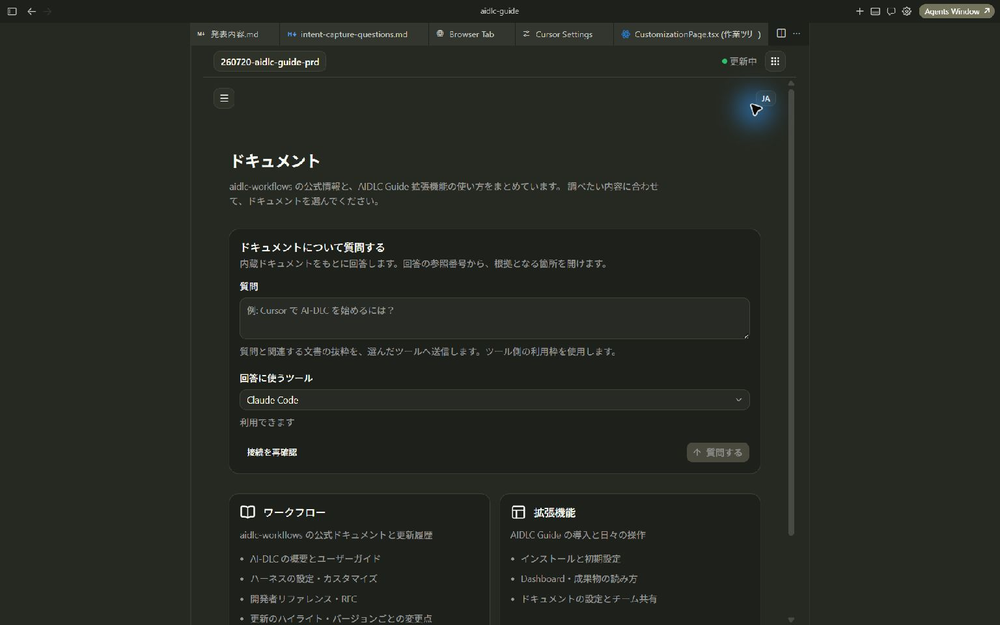
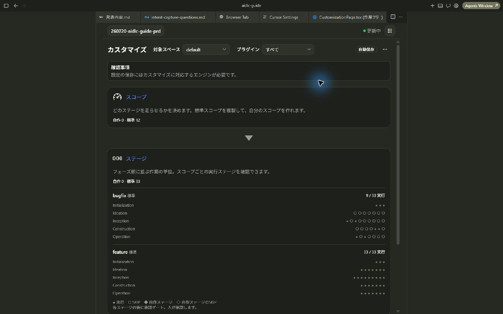
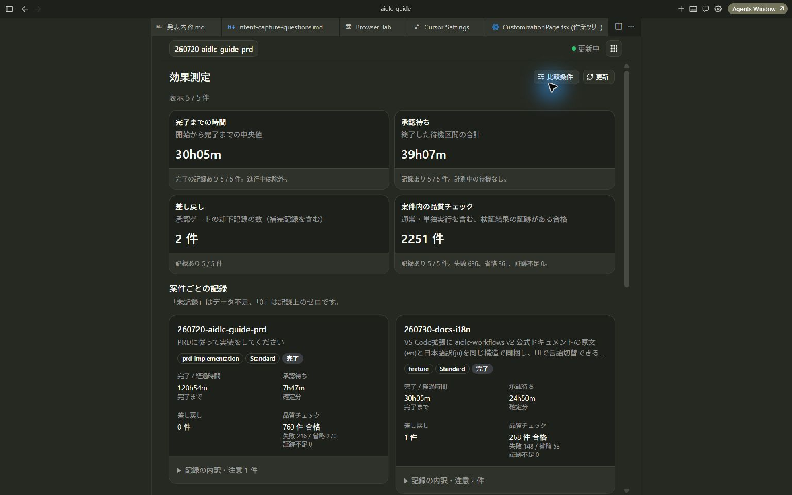
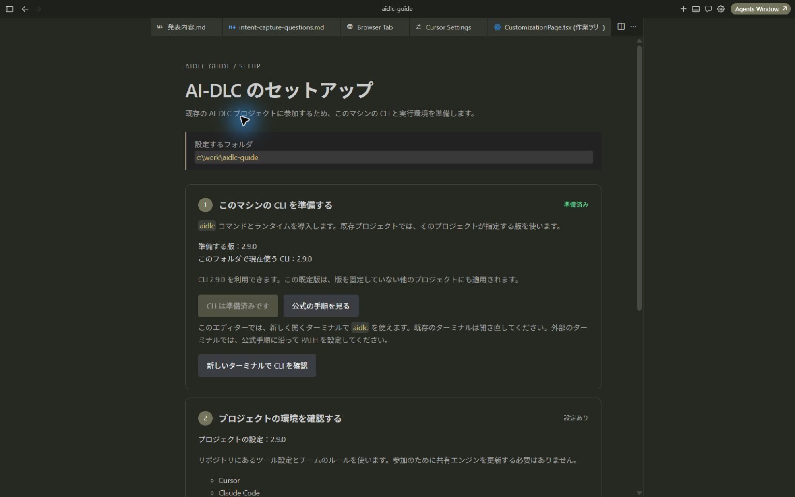

# AIDLC Guide：AIと進める開発の現在地・成果物・手順をエディターで確認する

掲載日：2026年9月18日

AIと開発を進めていると、「今はどの工程か」「何を確認して返答すればよいか」「設計書はどこにあるか」を調べるために、チャットやファイルを行き来することがあります。

**AIDLC Guideは、AI-DLCの進捗・成果物・手順をVS Code / Cursor内で確認できる拡張機能です。** 作業中の開発者にも、成果物を確認するレビュアーにも、プロジェクトの状況を共有する際にも利用できます。

AI-DLCは、要件整理・設計・実装・検証などの工程を、AIとの対話と人による確認・承認で進める開発の仕組みです。AIDLC Guideは、その実行記録を画面で読み、進め方を調べたり、チームの開発ルールを設定したりするための道具です。

> 掲載画像は、Cursor上でAIDLC Guideを実際に操作して撮影したものです。AIDLC Guide自身の開発記録を表示しています。画面の数値はこの案件の記録であり、導入効果の実績値ではありません。

## どんなときに役立つか

| こんなとき                                     | AIDLC Guideでできること                                            |
| ---------------------------------------------- | ------------------------------------------------------------------ |
| AI-DLCを使い始めたが、工程や用語に慣れていない | 現在の工程と、その目的・成果物・承認時の確認事項を読む             |
| AIが作った設計書や質問事項を確認したい         | 工程から成果物を開き、Markdownの本文を読む                         |
| AI-DLCの進め方を調べたい                       | 内蔵ドキュメントを読み、対応するAIツールで文書について質問する     |
| チームのルールや進め方をそろえたい             | 開発ルール・ナレッジ・工程・エージェントなどの設定を確認・編集する |
| 開発を振り返りたい                             | 案件ごとの経過時間・承認待ち・差し戻し・品質チェックを比較する     |

## 1. 現在地と工程の一覧を見る

**図1：案件を選び、現在地と各工程の状態を確認する。** この例では、選択した案件のステージが完了しています。

見る順番は次のとおりです。

1. 左上で、確認したい案件を選びます。AI-DLCでは一つの作業を「Intent」と呼びます。
2. 「現在のステージ」で現在地を確認します。詳細を開くと、フェーズ・完了数・時間などを読めます。
3. 「ステージ一覧」で工程ごとの状態を確認し、気になる工程を開きます。

`completed` は完了、`skipped` は実行対象から外れた工程を表します。ステージには役割の説明も表示されるので、英語のステージ名をすべて覚える必要はありません。

普段は、コマンドパレットの **`AIDLC Guide: Open`** またはステータスバーから開けます。右上のメニューから、ドキュメント・カスタマイズ・効果測定・設定に移動できます。

## 2. その工程で何を確認するかを知る

**図2：工程の目的と、人が確認する内容を同じ画面で読む。** 例は「何を・誰のために・なぜ作るか」を整理する工程です。

工程を開くと、目的・入力・出力・担当エージェント・ゲート要求を確認できます。「ゲート要求」は、次へ進む前に人が確認する内容です。この例では、成果物が本当に作りたいものを表しているかを確認します。

承認や差し戻しは、作業を進めているAI-DLCのセッションで行います。Guideで確認事項を把握してから、AIとの対話に戻る使い方ができます。

## 3. AIが作った成果物を読む

**図3：工程の出力から成果物を開き、本文を読む。** 見出しや表を整形した状態で確認できます。

成果物のプレビューでは、AIが整理した課題・要件・設計などを読み進められます。編集が必要な場合は「エディタで編集」からファイルを開けます。

例えば、レビュー時には次のように利用できます。

1. 対象の工程で、目的と承認時の確認事項を読む。
2. 出力にある成果物を開き、要件や設計の本文を確認する。
3. 修正点をまとめ、AI-DLCのセッションで伝える。

## 4. 進め方を調べる・ドキュメントに質問する

**図4：「ドキュメント」で進め方を調べる。** AI-DLCの手順と、AIDLC Guide自体の使い方を分けて探せます。

ドキュメント画面には、公式ドキュメント、日本語の案内、更新履歴、拡張機能の使い方をまとめています。文章を読むだけなら、AIへの質問は必要ありません。

質問機能では、例えば「CursorでAI-DLCを始めるには？」「承認ゲートでは何を確認する？」と尋ねられます。回答の参照番号から、根拠となる内蔵文書へ移動できます。

質問には、対応するClaude Code / Cursor / GitHub CopilotのCLIと、そのツールの認証・利用資格が必要です。質問文と関連文書の抜粋を選択したツールに渡し、そのツールの利用枠を使います。画面の閲覧・ローカル集計と、AIへの質問は利用条件が異なります。

## 5. チームに合わせて開発ルールや工程を調整する

**図5：「カスタマイズ」で設定の関係を確認する。** スコープは、どのステージを実行するかを決める設定です。

カスタマイズでは、開発ルール・ナレッジ・スコープ・ステージ・エージェント・品質チェック・プラグインを扱います。チームで共通に使うルールや、作業の種類に応じた工程を整える際に利用できます。

標準のスコープやステージは参照し、自作の設定を編集します。設定の保存には、Guideのカスタマイズ機能に対応するAI-DLCエンジンが必要です。画像の環境では、保存に対応するエンジンが必要という案内が表示されています。

対応環境では、フォームの編集内容を検証して自動保存します。利用前に対象スペースと保存条件を確認してください。画面を開いて設定を読むだけでも、チームの構成を理解する助けになります。

## 6. 記録をもとに開発を振り返る

**図6：「効果測定」で案件ごとの記録を比較する。** スコープや深さなどの条件をそろえ、振り返りの材料として利用します。

| 指標                 | 分かること                                     |
| -------------------- | ---------------------------------------------- |
| 完了までの時間       | 開始から完了までの経過時間                     |
| 承認待ち             | 承認の返答を待っていた時間                     |
| 差し戻し             | 承認ゲートの却下記録の数。補完された記録を含む |
| 案件内の品質チェック | 記録に残る検証の合格・失敗・省略など           |

「承認を待つ時間が長かった案件を振り返る」「条件が近い案件で差し戻しの発生状況を比較する」といった使い方ができます。

時間は人の実作業時間を直接測ったものではありません。「未記録」はゼロとは異なります。また、AI-DLCによる短縮率や費用削減額を自動で示す機能ではありません。導入効果を評価する場合は、導入前や不使用時のデータも含めて比較します。

## 使い始めるには

**図7：セットアップで、このマシンとプロジェクトの準備状況を確認する。** 画像は既存のAI-DLCプロジェクトに参加する場合の表示です。新規プロジェクトでは、利用するツールを選んで設定します。

1. 社内で案内された配布先、または[GitHub Releases](https://github.com/otomatty/aidlc-guide/releases)から、対象バージョンの `.vsix` を入手します。
2. VS Code / Cursorのコマンドパレットで **`Extensions: Install from VSIX…`** を実行し、ファイルを選びます。
3. 開発するフォルダを開き、**`AIDLC Guide: Setup`** を実行します。
4. 画面の案内に沿ってCLIの準備・プロジェクト設定・診断を確認し、「セットアップを完了」でダッシュボードへ進みます。既存プロジェクトでは、そのプロジェクトの設定とバージョンを利用します。
5. 作業がある場合は案件を選び、現在のステージと成果物を開いてみます。作業がまだない場合は、利用するAIツールのAI-DLCセッションで最初の作業を始めます。

VS Codeの対応下限は1.100です。Cursorでは、対応するVS Code互換環境が必要です。AI-DLCの実行環境や文書への質問に使うCLIは別途準備します。BunはMCP連携・サイド質問・カスタマイズの保存などで利用します。

## 最初に試す操作

まずは一つの案件で「現在地を見る → 工程の説明を読む → 成果物を開く」を試してください。AIとのチャットを読むだけでは把握しにくかった状況や、確認すべき内容を、この画面から探せるかを確かめられます。

## 詳しい使い方

- [リポジトリと導入の案内](https://github.com/otomatty/aidlc-guide)
- [Dashboardで現在地と成果物を読む](https://github.com/otomatty/aidlc-guide/blob/main/docs/guides/reading-workflow.md)
- [内蔵文書について質問する](https://github.com/otomatty/aidlc-guide/blob/main/docs/guides/asking-aidlc.md)
- [開発ルールと工程をカスタマイズする](https://github.com/otomatty/aidlc-guide/blob/main/docs/guides/customization.md)
- [効果測定の指標と読み方](https://github.com/otomatty/aidlc-guide/blob/main/docs/guides/effectiveness.md)

各ガイドは、拡張の「ドキュメント」からも参照できます。
