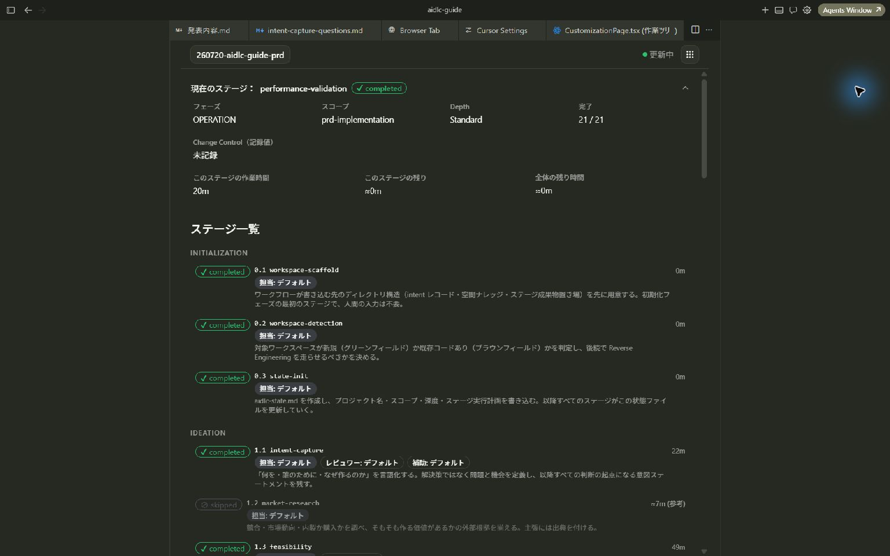
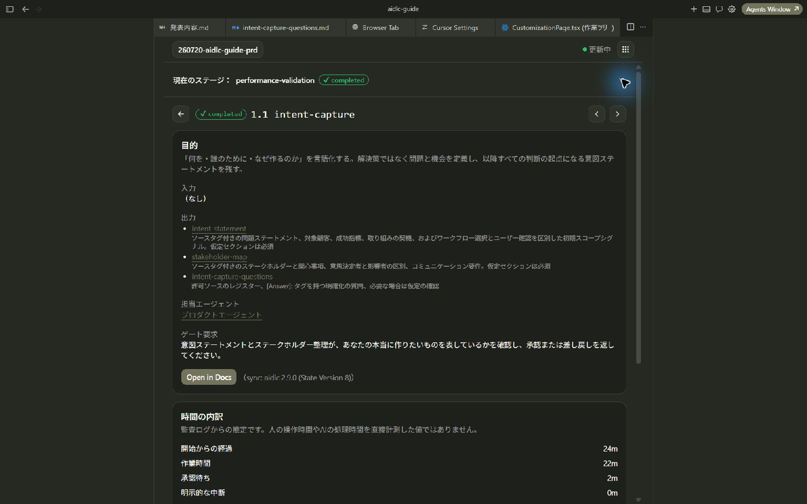
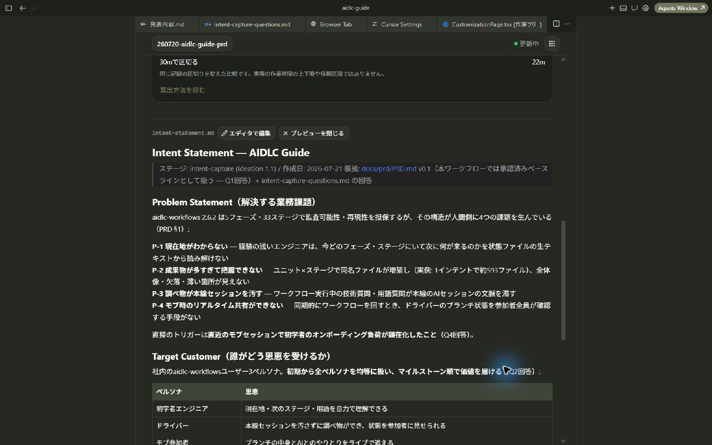

# スクリーンショットを使うオンボーディングの文案

この文書は、拡張の「はじめに」ページの文案と表示仕様です。ページは Dashboard 内に実装済みで、文案は `packages/dashboard/src/features/onboarding/content/welcome.ts` にあります。画像は現在の拡張を実際に撮影したもので、社内紹介資料と共用します。`images/` の同じファイル名で差し替えると、拡張の表示も変わります。

利用者向けの説明は[はじめに・更新情報・ヒント](../guides/onboarding.md)にあります。

## 実装で変えた点

- 「はじめに」は Dashboard の中のページです。Dashboard はフォルダを開き、セットアップを終えてから表示するため、「フォルダなし」と「環境の準備が必要」の状態はこのページには現れません。
- 主操作は、表示できる案件があれば「画面を順に案内してもらう」、作業がなければ「最初の作業を始める」、状態を読み取れなければ「ステージ一覧へ」です。ツアーは実際の画面の要素を順に示します。
- 状態を読み取れない場合は、IDE では「セットアップを確認する」も表示し、既存のセットアップ画面を開きます。
- 掲載日の代わりに、画像の撮影日をページ末尾に表示します。
- 「あとで読む」はステージ一覧に戻り、メニューから開けることを一度だけ案内します。
- 紹介の既読は利用者単位、セットアップの完了はフォルダ単位で管理します。

## 冒頭

### AIと進める開発の、現在地と次の一手がわかる。

AIDLC Guideでは、AI-DLCの進捗・成果物・進め方をエディター内で確認できます。AIとのチャットで開発を進めながら、ここで状況や確認事項を把握できます。

**主操作：プロジェクトの状態に応じたボタン**

ボタンの文言と遷移先は、[ページ末尾](#ページ末尾)の状態別表に従います。冒頭と末尾で同じ状態判定を使います。

補助操作：画面の見方を見る／あとで読む

「画面の見方を見る」は、このページ内の次の説明へ移動します。スクリーンショットは説明用の画像であることを明示し、画像内のボタンを操作できるようには見せません。

## 最初に伝える内容

### 今どこまで進んだか、ひと目で確認

左上で案件を選ぶと、現在のステージと工程ごとの状態を確認できます。現在のステージを開くと、フェーズや完了数などの詳細も表示します。

画像の下の補足：**完了した案件の表示例です。あなたのプロジェクトの状態ではありません。**

### 次に何を確認するかがわかる

工程を選ぶと、目的・成果物・承認時の確認事項を読めます。「ゲート要求」を確認してから成果物を読み、AI-DLCのセッションで承認や修正依頼を伝えます。

### AIが作った文書を、その場で読む

工程の出力から、設計書や質問事項などの本文を開けます。編集したい場合は「エディタで編集」からファイルへ移動できます。

## 必要になったら使う機能

初期表示では次の短い紹介を並べます。各項目を開いたときに、対応する画像と説明を表示する構成にします。

| 項目         | 紹介文                                                                                     | 表示する画像                  |
| ------------ | ------------------------------------------------------------------------------------------ | ----------------------------- |
| ドキュメント | 進め方や用語を調べられます。対応するAIツールで文書について質問することもできます。         | `images/03-documents.jpg`     |
| カスタマイズ | チームのルールや、実行する工程の構成を確認できます。設定の保存には対応エンジンが必要です。 | `images/04-customization.jpg` |
| 効果測定     | 案件ごとの時間・承認待ち・差し戻し・品質チェックを比較できます。                           | `images/05-effectiveness.jpg` |

## ページ末尾

### 自分のプロジェクトで開いてみましょう

まずは「現在地を見る → 工程の説明を読む → 成果物を開く」を試してください。

冒頭とページ末尾の主操作には、次の文言と遷移先を共通して使います。

| 検出した状態       | ボタンの文言                 | 遷移先                   |
| ------------------ | ---------------------------- | ------------------------ |
| フォルダなし       | プロジェクトのフォルダを開く | フォルダ選択             |
| 環境の準備が必要   | セットアップへ進む           | 既存のセットアップ画面   |
| 準備済み・作業なし | 最初の作業を始める           | 既存の開始案内           |
| 閲覧できる作業あり | ダッシュボードを開く         | その案件のダッシュボード |

セットアップの表示例には `images/06-setup.jpg` を使用できます。ボタンを押しただけでCLIの導入やプロジェクト設定を実行せず、既存のセットアップ画面で操作します。

## 画像の表示と初回導線

- 各画像のすぐ下に「見る場所」と「できること」を1〜2文で置きます。図番号だけで説明を離さないようにします。
- 画像は縦横比を保ち、クリックまたはキーボード操作で拡大できるようにします。文字を読めないサイズまで縮小しません。
- 画像には代替テキストを付け、説明は画像の中だけに入れません。狭い画面では画像と説明を縦に並べます。
- ページに掲載日を表示します。画像のテーマは撮影環境のものとして扱い、配色で状態を説明しません。
- 拡張を初めて開いたときに紹介を表示し、スキップを用意します。メニューの「はじめに」から再表示できるようにします。
- 紹介の既読は利用者単位、セットアップの完了はフォルダ単位で管理します。別フォルダや通常の更新で紹介を繰り返し開きません。

初回の説明に使う画像は、現在地・工程説明・成果物の3枚です。他の機能の説明はユーザーが開いたときに表示します。サンプル案件を操作する体験を追加する場合は、別途実装が必要です。
