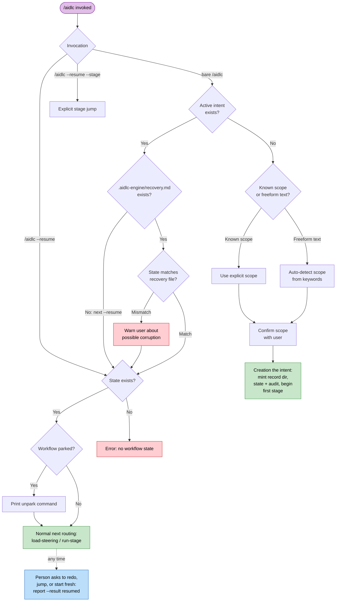
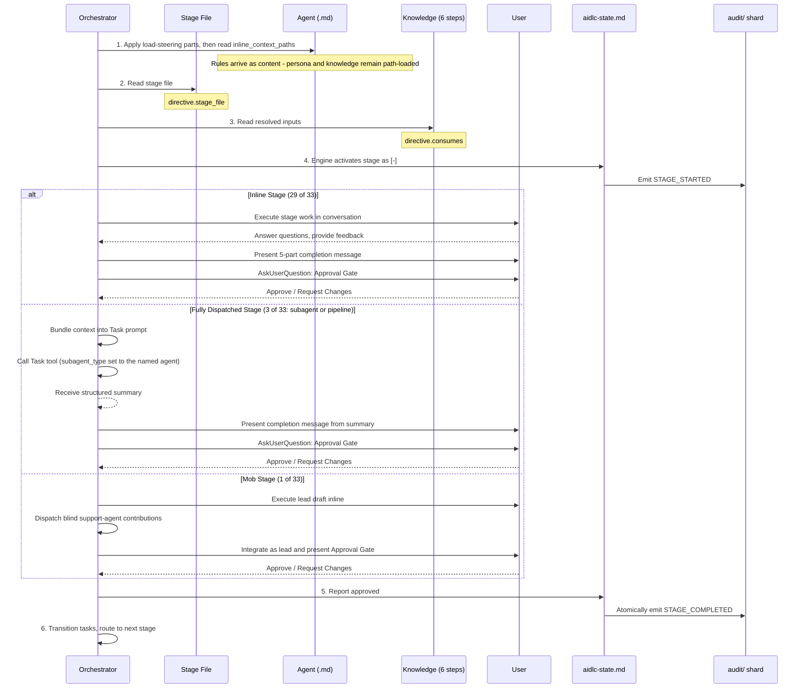
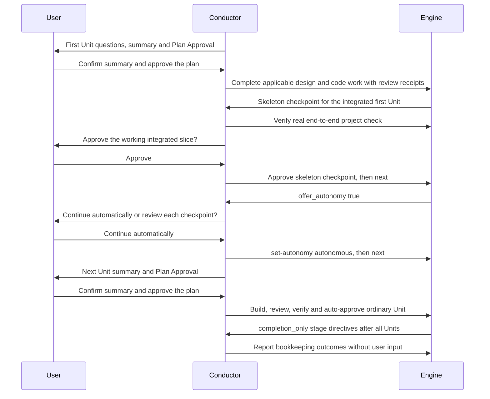
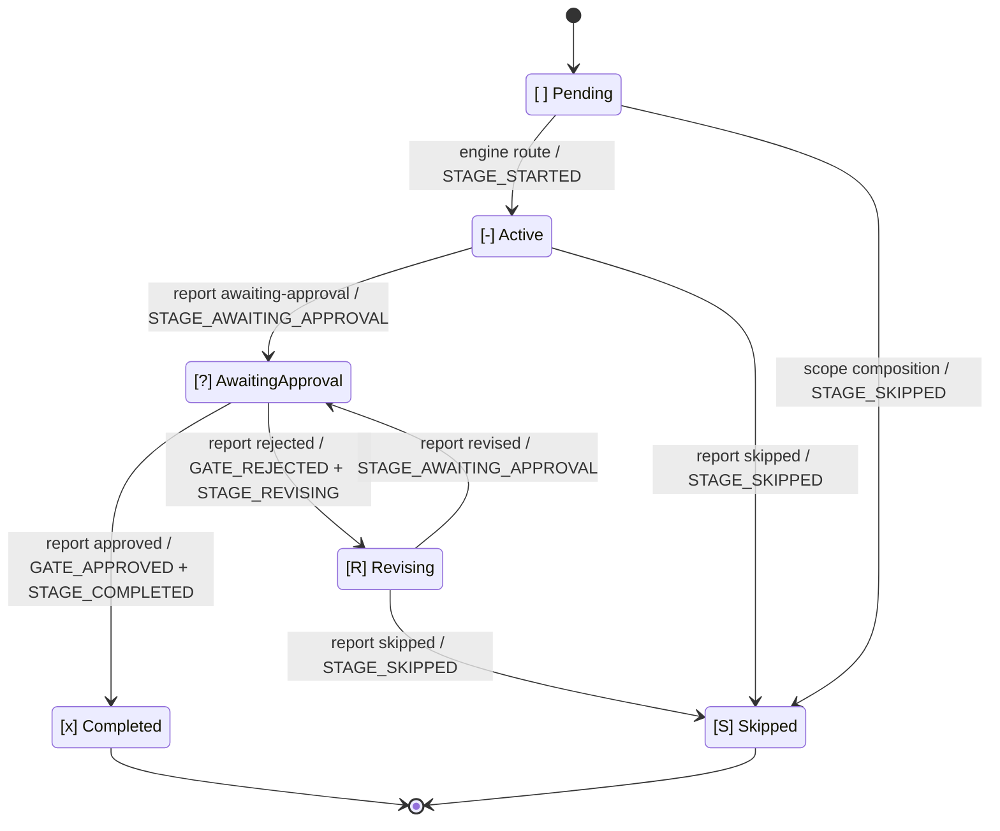

# Orchestrator

Orchestration is split across two pieces. A deterministic **engine** (`aidlc-orchestrate.ts`, with exactly six subcommands: `next`, `continue`, `report`, `park`, `team-board`, and `wait`; `continue` is internal steering transport and `team-board` is the read-only Team Construction query, and `wait` is the bounded read-only wait for dispatched work) owns every between-stage decision - scope determination, stage routing, jump resolution, resume and init guards, gate status, and workflow completion - and emits a typed **directive** on each `next`. The **conductor** (`.claude/skills/aidlc/SKILL.md`, invoked via `/aidlc`) is a thin forwarding loop that acts on each directive - running the named stage, asking the human a question, fanning out a swarm - and reports stage-work outcomes with `report`. Engine ask answers instead follow their typed `next`, `command`, `claim`, or `execute-remedy` route; only a re-entry request to redo, jump, or start fresh uses a non-stage report (`report --result resumed`). SKILL.md is not the control plane: the routing decisions live in the engine and the compiled data it reads (`tools/data/stage-graph.json`, `tools/data/scope-grid.json`), while SKILL.md owns execution quality inside the move the engine names.

This chapter documents the workflow behaviour from the conductor's side — entry points, session management, scope-to-stage mapping, the stage execution and advancement protocol, and the deliberate deviations. For the engine internals — the `next`/`report` contract, the typed directive union, the conductor persona, plural skills, scope shape, and the swarm referee — see [Engine and Skill System](17-skill-system.md). For user-facing command usage, see the [User Guide -- CLI Commands](../guide/12-cli-commands.md).

> **Ownership note.** Throughout this chapter, the behaviours described — argument resolution, scope detection, jump validation, resume branching — are computed by the **engine** on each `next` and delivered to the conductor as a directive. Where older prose said "the orchestrator does X," read it as "the engine decides X and emits a directive; the conductor carries it out." The decision logic is deterministic tool code, never SKILL.md prose.

> **Path convention.** Each intent's state, audit trail, and intent-scoped
> artifacts live under its **record dir** —
> `aidlc/spaces/<space>/intents/<YYMMDD>-<label>/`, written `<record>/` below.
> Reverse Engineering is the exception: its durable, per-repository outputs
> live at `aidlc/spaces/<active-space>/codekb/<repo>/`. The audit trail is a
> directory of per-clone shards under `<record>/audit/`, not a single file.

---

## Table of Contents

- [Entry Points](#entry-points)
- [Session Management](#session-management)
- [Scope-to-Stage Mapping](#scope-to-stage-mapping)
- [Stage Execution Engine](#stage-execution-engine)
- [Stage Advancement Protocol](#stage-advancement-protocol)
- [Task Tracking](#task-tracking)
- [Deliberate Deviations](#deliberate-deviations)
- [Error Handling](#error-handling)
- [Appendix A: Stage Graph Reference](#appendix-a-stage-graph-reference)
- [Appendix B: Hook Reference](#appendix-b-hook-reference)
- [Appendix C: Approval Gate Patterns](#appendix-c-approval-gate-patterns)

---

## Entry Points

The conductor passes `$ARGUMENTS` to the engine's first `next` verbatim — it never pre-parses them. The engine parses the flags and freeform text and resolves which of the invocation patterns below applies, emitting the matching directive. The patterns are engine-resolved inputs, not conductor-side branches.

### `/aidlc [scope]` -- Explicit Scope

When the argument matches one of the 11 known scopes (`enterprise`, `feature`, `mvp`, `poc`, `bugfix`, `refactor`, `infra`, `security-patch`, `classic`, `workshop`, `express`):

An explicitly named scope on a fresh workspace (no intent yet — no `aidlc-state.md` under `aidlc/spaces/*/intents/*/`) **creates the first intent**: the engine's `next` emits a run-then-continue `print` directive naming `aidlc-utility.ts intent-create --scope <scope>` (threading any `--depth` / `--test-strategy` / `--project-type` / `--review` flags onto the named command); the conductor runs it and re-runs `next` to land on the first stage. Both naming shapes — the bare positional (`/aidlc bugfix`) and the explicit flag (`/aidlc --scope bugfix`) — emit the identical creation print. A scope name followed by a colon (`/aidlc bugfix: Fix duplicate todos`) names it the same way, even when the agent passes the whole request as one quoted argument; one quoted argument that only opens with a scope word and no colon stays the description, so the conductor gives a plan the person named its own argument. Describing what to build (`/aidlc "build the auth service"`) also creates. A bare `/aidlc` with no explicitly named scope and no description does NOT creation (an env- or default-resolved scope is not a creation signal); it emits the no-state error directing the user to describe what to build or name a scope. When this chat holds something the person set for the piece of work they start next (a check off, a Guard Policy, a ceremony, or plan approval off, still within the hour: `switchKeptForNextWork`), nothing is wrong, so the step is a turn-ending `print` instead: its narration tells them what to build next, the line they were already told rides it, and no `error` means no engine-error relay repeating machinery at them.

1. Reads guardrails from `aidlc/spaces/<active-space>/memory/`.
2. Asks the user "What would you like to build?"
3. Determines stages to execute per the Scope-to-Stage Mapping.
4. Executes the Initialization phase (workspace-scaffold, workspace-detection, state-init) as a single deterministic `aidlc-utility intent-create` call. The welcome message is rendered at session start via `companyAnnouncements` in `settings.json`.
5. Creates stage-level tasks for all in-scope stages. The first stage is set to `in_progress`; the rest are `pending`. Stages not in scope get no task at all.
6. Begins the first post-initialization stage.

### `/aidlc [freeform]` -- AI Scope Detection

When the argument is freeform text (not a known scope keyword):

1. Reads guardrails from `aidlc/spaces/<active-space>/memory/`.
2. Analyzes the intent against keyword patterns:
   - "fix" / "bug" / "broken" / "bugfix" maps to `bugfix`
   - "refactor" / "clean up" / "simplify" maps to `refactor`
   - "infrastructure" / "deploy" / "infra" maps to `infra`
   - "security" / "CVE" / "vulnerability" / "patch" maps to `security-patch`
   - "proof of concept" / "prototype" / "poc" / "spike" maps to `poc`
   - "mvp" / "minimum viable" maps to `mvp`
   - "workshop" / "lab" / "training" maps to `workshop`
   - "express" / "lightweight" maps to `express`
   - The underlying no-keyword resolver defaults to `classic` in a stock install; the user-facing
     cold-start path offers composition first for no-match or rich prose
3. Disambiguation rule: descriptions longer than five words receive the compose offer unless an affirmative high-specificity keyword (`refactor`, `mvp`, `minimum viable`, `poc`, `proof of concept`, or `CVE`) or an affirmative fix request matches. A fix request is `fix` or `bugfix` opening the description, a sentence, or a list item (optionally after an opener such as "please", "can you", or "we need to"), or after a comma behind such an opener, or "fix it", "fix that", or "fix this" ending a sentence that asks someone ("could you ... fix that?"); a hyphenated compound such as "fix-up" or "auto-fix" never counts. A high-specificity match outranks a fix request. The exemption checks every keyword, including those after an earlier generic match in the same scope, and rejects occurrences with nearby preceding negation. Eligible scopes retain the alphabetical tie-break. See [scope auto-detection](../guide/05-scopes-and-depth.md#auto-detection-from-freeform-intent) for examples and limitations.
4. On a clear keyword match, emits a typed `scope-confirm` ask naming the effective ceremony from the compiled grid and workspace scan: the scope, a request preview, stage count, approval gates, and the choice to confirm, change scope, or compose a tailored plan. The directive carries `response_route: "next"` and `proposed_scope`, names the request only by id (a pasted `<document>` block stays in the question store as data and never enters an ask), and carries `confirm_command`, `compose_command`, and `scope_commands` (one complete, shell-quoted command per valid scope), plus `choices`: the two answers worded for the person (go ahead with the proposed plan, tailor a plan to this task), each with its command, so a host that shows options offers these. A depth, test strategy, or sensors, learnings, summary confirmation, or collaborators switch typed with the request rides all three, so the work is created as the preview showed; plan approval rides only as `on`, since only the person's own words turn it off. Its question echoes at most 240 characters of the request, ending in `...` when truncated; when the request carries a pasted document, the question echoes only the words outside the span from the first `<document>` to the last `</document>` and adds one line saying how it was split. Greenfield previews apply the same reverse-engineering skip as intent creation. A per-unit clause is appended only when the scope executes `units-generation` and its Construction stages fan out over the resulting Unit DAG.   The cost clause also names disabled effective policy, including creation flags and environment kill switches: classic defaults add `; no summary confirmation; lead agent only`, while opting summary confirmation in removes its part (an advisory review cap is not a disabled ceremony) and collaborators on removes `lead agent only`. Scopes with none disabled and collaborators on omit this clause.
5. On no match / rich prose, emits a typed `compose-offer` ask with `response_route: "next"`, `compose_command`, and `scope_commands`; each `scope_commands` row carries its plan's `stages` count for this project ("15 stages", the stages after Initialization), counted the same way as the question, so a host that lists the plans as choices shows the engine's number, never one of its own. The composer estimates the task's implementation entropy and proposes the minimum viable EXECUTE/SKIP grid, human-gated (see below). The offer's example scope list carries counts too (`bugfix = 6 stages, express = 7, classic = 15, feature = 30` on an existing codebase) so the magnitude difference is visible before choosing, and `bugfix` is named even when the description gave no word to match.
6. On confirmation, the conductor runs the ask's complete shell-safe `next` command instead of calling `report`. Scope and compose commands carry `--request <8hex id>`, never the request text. For a different scope, it runs the `scope_commands` entry whose `scope` matches the chosen plan; a name with no entry is not a valid scope. The engine resolves the id to the stored full description, which intent creation records as `Project` in `aidlc-state.md`.
7. If the user overrides the detected scope, uses the user's chosen scope instead.

The engine keeps a copy of each question's request as `{id, text, proposedScope, origin, askedAbout?, newWork?, composedFrom?, stateSha256?, settings?, approvedRequest?, createdAt}` (`settings`, on a routing question, holds `{newWork, existingWork}`: the `next` flag tokens carried by its new-work answers and by its answers about existing work, each token a flag name or a one-word value, a stage list joined by commas, checked on read; this includes the routing question asked about new work typed while a stage question is open, and an answer that arrives without its option's command, a reply naming the option or the plain `next --request <id>`, gets these settings from the question; `approvedRequest` is the id of the question whose answer the routing question stopped, such as a plan approval in a fresh clone: new work started from the routing question answers that request, so it starts once and words said at that question reach it, and every route carries on with that work once it exists. An approved plan's `--skip`/`--add` ride only its own plan's new-work answers.) (`newWork` marks a question asked for new work through `next --new-intent`, so its answer starts that work instead of asking which existing record was meant) in its own gitignored file under `aidlc/.aidlc-sessions/questions/`, written once and never rewritten, so concurrent sessions in one clone never share or invalidate each other's asks; asking again is a new question with a new id, and the earlier one stays answerable. The copies follow the same operating-system permissions as the rest of the workspace, where the request lands anyway once work starts, and are reached through no symlinked path. The copy is removed once its answer starts work; an unanswered question is kept unless `question-retention-days` (or `AIDLC_QUESTION_RETENTION_DAYS`) sets a retention period, and a question whose copy is gone errors with a describe-the-work-again message. Intent creation builds the whole record before listing it: the folder, audit, and project description first, then the workflow state, which names the question as `Question Id`, and last the `intents.json` row, which records it as `request`. A retry that finds a finished record its start never listed (a start stopped between the two) lists that record instead of building another. A folder without `aidlc-state.md` is invisible to every record scan, so a start cut off before its state lands lists nothing and trying again creates the work (under the next free folder name). A repeated answer never creates work twice: `intent create` and `next` find the row carrying that question id, continue work still in flight (`Already started <record>, continuing it.`), and for archived or completed work ask first (`You already started this as <record>, which is archived. Start it again as new work?`), starting it again from that record's stored description on the scope it last ran on (a scope change records the new scope on its `intents.json` row). Late answers: a new-work question's start or new-plan answer acts as answered even after other work became active, starting the new work alongside it; a `new-work-routing` question is bound to the space and records (by folder and uuid) it named, and its `continue_command` and `compose_command` act only on one of those, asking the routing question again, with the scope the human confirmed, when another is selected. On a legacy flat-layout (pre-workspace) project, a question-backed creation refuses before anything moves and keeps the question answerable; the refusal names the one-time `intent create --scope <scope>` that moves the flat workflow into its own intent, after which the same command creates the request. Conductors do not read or rewrite these runtime files and must not substitute the preview for the full request.

If existing intents have no selected cursor and at least one record is selectable, confirming a scope with pending work emits `new-work-routing` on every harness rather than dropping the request into a picker. `new_work_description` contains the request's directions once, `proposed_scope` preserves the confirmed scope, `available_intents` lists exact selectors, `response_route` is `next`, and `numbered_prose_question` provides the engine-authored numbered rendering. The routes travel as fields, never inside the human-facing question: `new_intent_command` (separate new work with the proposed scope), `scope_commands` (the same for each valid scope, for a human-corrected scope), `compose_command` (reshape), `select_commands` (one complete `next --pick` command per selector, which selects that record and carries on with it in the same turn, or, when settings were typed with the request, one `next --continue --request <id> --record <selector>` per selector, which selects that record and then continues it with them), and `reshape_commands` (one per selector, which selects it and then reshapes it), all carrying the same question id; asked about an active workflow instead, the ask carries `continue_command` in place of `available_intents` and `select_commands`. A setting typed with the request rides these commands, so it lands on the work the person picks: the new-work commands create the work with it, review level and a raised Guard Policy included (a lowered Guard Policy rides the answers about existing work, which apply it there; it is never tried as a flag on the new work: the human-turn hook keeps the person's own words typed with the request for it, and the creation's `narration` says where it landed, `Guard Policy <value> for the new work (set by you).` when those words were kept for it; a check typed off with the request, `--guard.<fence> off`, rides the same way and is never part of the description, and its line is `The review freeze check is off for the new work (set by you).`; the words hold across any further question the engine asks on the way, because a question saved while another is being answered records that request's own root as `composedFrom`, and the person hears the first line, `The review freeze check is off for the work you are asking for (set by you).`, with the routing question itself; creation hands the lines this chat is still owed to the work it creates (`carryPendingPersonLines`), because selecting the new record would otherwise leave them keyed to the work the chat has left), `continue_command` applies it to the active work, and a reshape applies it through `config set` before composing. The question also keeps the settings as `settings` in its stored copy, so a reply that only names an option replays them. With work active, a setting typed with a new description, or a plan word before one (`/aidlc bugfix Fix login`), is asked about this way instead of changing the active work and dropping the description. Continuation runs the chosen record's select command and follows its `print`; reshape runs the chosen record's `reshape_commands` entry, which selects that record and then reshapes it without stopping in between. A reply that only names one of this question's options (its label, its numbered line as rendered, or a bare `1`-`3`, under the same rules as below) answers it from any chat on this work and, for a question that stopped an approval, until that approved request has started work. Option 2 runs `new_intent_command` whatever happened to the listed records, since new work acts on none of them, so on the follow-up to a plan approved in a fresh clone it creates the approved plan. Options 1 and 3 keep the person's route while none is selected, and act only on the records the question listed that are still there with the same name and uuid (their progress never matters, so work moving on in another chat changes nothing): when the question listed one record, they run its select or reshape command; when it listed more, the engine returns an `intent-pick` ask that asks only which piece of work, each choice carrying that record's own select or reshape command. With none of the listed records left, or work selected since, options 1 and 3 run the question's own late answer (`--continue` or `compose --request <id>`), which acts on the listed work selected now or asks again about the work there is, with the request kept. Without pending work, the engine emits `intent-pick`: choose the `select_commands` entry whose `selector` matches the selected `available_intents` value and execute its `command` verbatim, never interpolate the selector into a command. That command (`next --pick <record>`) selects the record and carries on with it, so picking work up takes one answer. The question asks the person, naming the work when there is one piece ("Carry on with `<name>`, or not now?"), and the agent shows it and waits for their answer, so not now stays a choice.

A continuation phrase said on its own is not a request to route: `carry on`, `continue`, `keep going`, `go on` or `resume` (`CONTINUATION_PHRASES` in `aidlc-lib.ts`, the one list the engine reads), with or without `please` before or after it; case, spacing, a comma beside `please` and a closing `.` or `!` do not matter. While a workflow is active, or parked with the person back since the park, `next` with only that phrase returns what a bare `next` returns (never the re-entry reading below), once the open-question, code plan question and approval-gate readings below have had their turn; with work here but none selected, it returns the `intent-pick` ask. Anything more ("carry on with a login page") is routed as below, and with no work in progress the phrase is read as before.

Freeform prose passed to `next` while a workflow is active gets the same `new-work-routing` ask, with two exceptions. When the prose is only one of the open routing question's own options (its label, its numbered line as rendered, or a bare `1`-`3`), it is that option's own command: `continue_command`, `new_intent_command` or `compose_command`, run exactly as the ask supplied it, so the continue and reshape options still act only on the work the question named and ask again otherwise. The open routing question is the question stored most recently. Its separate-work option starts the new work whatever happened to the workflow since, and its continue and reshape options act on that workflow however far it has moved on (a revision, a finished stage, in this chat or another), asking again only when another workflow is selected or that one is gone; a bare number also needs no question logged after it and no turn of the person's besides this reply. Anything more than the option, such as the label followed by more words, is the person's own words and is asked about. When the current `[-]` stage has a question the person has not answered (the `DECISION_RECORDED` pairing the Stop hook reads, by the same rule as its carve-out, so not under autonomous Construction), the engine cannot tell an answer from new work, so it returns a `print` with a command for each reading: the question's answer command (`log answer`, or the Unit or batch checkpoint's own approve or reject command, naming that Unit or batch), or `next --request <id>`, which asks where the work belongs using the person's words kept as a question copy. The conductor reads which it is and asks the person when it cannot tell. The engine's own code plan question is read the same way, from any chat and before the stage question: while it waits, prose gets a `print` naming its `log answer --stage code-generation --checkpoint plan-approval` step (while the person edits the plan files, `next` once they say they are done) or `next --request <id>`; once every plan it asks about is answered, prose that is exactly one of its choices gets a `print` to run bare `next`, which carries out that choice, or, when it picks against the recorded answer, the `log answer` step that records the later choice (`Approve Plan`; `I'll edit the files`, which starts edit mode at once; or `Review the plan`, which brings the question back before anything is built), the edit only once the person has replied after the recorded answer. Prose while the current stage waits at its approval gate gets a `print` naming the gate's `report --result approved` and `report --result rejected` steps, or `next --request <id>`. Neither the question's audit text nor the reply rides the directive.

Prose typed with a `--scope` that differs from the workflow's gets the same `new-work-routing` ask, never a bare scope change that would drop the words. Its separate-work option comes first and starts the described work with that scope; its continue option, second, reads as changing the workflow to that scope, and its `continue_command` carries the `--scope`, so that answer changes the scope. A bare number or the option's label reads against that order, and only the continue answer carries the scope. A differing `--scope` with no words still changes scope at once, and one typed with stage changes (`--skip`, `--add`) keeps their path: the stages named change the open work's plan, with the scope.

Freeform words alone over active work (nothing `next` reads as a flag, scope, verb or noun, and no open question or approval gate they could answer) get a `print` naming the typed re-entry report (`report --result resumed --choice <redo|jump|fresh>`, for words such as "take me back to requirements analysis") or `next --request <id>` (also when the conductor cannot tell), which asks the `new-work-routing` question with the words kept, so a redo, jump, or start-fresh request typed with `/aidlc` itself is that request; words with a setting typed beside them are asked about with it.

In a solo unit-major walk, a Unit's work, its summary confirmation and its checkpoint (the learnings question and the checkpoint approval) run ahead of Current Stage and log their questions under the stage `next` directs (a checkpoint under the block's last stage). Prose then reads that stage's open question by the Stop hook's same rule, so an answer typed in a new chat, after the one that asked ended, reaches the question it answers instead of the new-work routing ask. Once a Unit's approval was asked, its checkpoint step no longer lists `learnings`, so a new chat that runs the step again goes straight to the approval question.

### `/aidlc compose` -- The Adaptive Composer

The compose surfaces (a leading `compose` verb, `--new-scope`, or `--report <path>`) make the engine emit a composer-dispatch `print` instead of a scope confirm. The conductor's instructions for this flow (the dispatch, the proposal gate, and what approval runs) live in `composer.md` beside the orchestrator `SKILL.md`, and the print names that file, so the agent reads it only when a plan is composed. The verb is deliberately NOT a workspace verb (workspace verbs are terminal utility commands the Kiro seam runs off-band; compose is workflow work the conductor dispatches). Two modes split on the state file:

1. **Front / report (no workflow yet):** the conductor dispatches `aidlc-composer-agent`, which runs the read-only `detect --json` scan, estimates the five implementation-entropy components (CodeKB MCP evidence when configured, the workspace scan otherwise), and returns a structured proposal (`mode matched|custom`, a required nonblank `creationDescription`, an `ars` block with the component scores and evidence method, `arsRationale`, the grid, the five `scopeSettings` (`sensors`, `learnings`, `summary_confirmation`, `plan_approval`, `review_cap`) with a one-line rationale, per-SKIP rationale, a `summary` copied verbatim from the validator, plus two pre-rendered markdown tables: ARS scores with bands, and per-stage decisions with reasoning) validated by `aidlc-graph.ts validate-grid`. Validation requires the exact compiled stage set and returns the grid's stage/gate/per-unit `summary` plus `nearest_stock`, checks the settings against the words the scope loader accepts (echoed as `scope_settings`, with `summary.off` naming what they switch off), and on the composer's final `--matched <stock-scope>` run rejects a grid that differs from that stock scope or a Guard Policy it cannot apply, echoing the `creation_settings` that apply the remaining settings to this piece of work; a final `--custom` run picks the stock scope the plan runs on (the nearest whose Guard Policy default is the proposal's or lower, any for `strict`, and never one with a walking skeleton or a test strategy other than the plan's depth, which the gate does not show; for a new project it prefers one meant for new work over a scope marked `existing_code: true` whenever one qualifies, so new work is not labelled a fix) and echoes it as `base_scope` with `plan_changes` and `creation_settings` against it, plus `creation_depth` when the proposal's required `depth` differs from that scope's. Every run without `--matched` also echoes `custom_start`, the `classic` scope's Guard Policy and settings, which a custom proposal starts from whichever stock scope it runs on. Neither route writes a scope file. Composer-authored scopes are excluded from the ranking, and missing or extra keys count as differences. The composer routes matched-vs-custom solely on the final proposal's `nearest_stock[0].diff <= 2`; the mechanical ARS screen distance is advisory. When it adopts a stock grid it revalidates that final grid, replaces the summary/distance, and rebuilds every affected decision-table row before returning. The conductor never re-derives the verdict. It renders the approve/edit/reject gate as a short offer: a plain recommendation and the validator's numbers in plain words ("Plan: poc, 8 stages, 5 approval questions", from its `shown` and `gates` counts: the stages after Initialization), with a Scope settings row the human can flip before approving. The composer's stage-decision table and its ARS score table (under "Scoring detail (advisory)") are shown verbatim when the person asks for them. An edit to a matched stock grid, or one that lowers its Guard Policy, converts the revised proposal to custom and repeats validation/table rendering, because matched approval creates the stock plan. On approve AI-DLC creates the workflow directly for a stock match; for a custom plan, it creates the workflow on `base_scope` with `intent create --skip <slugs> --add <slugs>` (and `--depth` from `creation_depth`, and `--plan-name` with the composer's `scopeName`), which writes the plan as the state file's EXECUTE/SKIP suffixes (the override channel recompose uses) and records `Plan: <name>`, the name the gate showed (`tailored plan` without one), never the scope it runs on; no scope file is written, so composing never grows the scope library. A custom gate also offers "Approve and save as scope": after creation the conductor runs `scope save --name <name>` (the utility's `scope-save` handler), which writes the running work's plan as the durable record `aidlc/scopes/<name>.md` and compiles its projection, so the scope survives an engine reinstall and resolves at once in this harness, and in another at its next `graph compile` (see [Where a saved scope is stored](../guide/05-scopes-and-depth.md#where-a-saved-scope-is-stored)). The same command saves the plan whenever the person asks later. The skeleton-gate anchor, `firstPlannedStageOfPhase("construction", scope, state)`, reads those suffixes, so a composed plan's first Construction stage is its Bolt-1 gate. Task-backed composition copies the original task into `creationDescription` verbatim; report-only and task-less composition derives it from the approved report/plan. Task-backed creation follows the dispatch's `--request <id>` command, preserving the stored request without shell interpolation. Report-only/task-less dispatches carry a `--request <id>` too, naming a `compose` entry that holds no text: creation passes that id and the approved description after the literal `--` delimiter as one POSIX-single-quoted argv value, and the engine saves the description as the front request this work answers, with `composedFrom` naming the entry, then removes the entry, so a plan-approval skip said at that gate reaches this work and no other; a later request replaces the entry, and the engine refuses it after that; never run scope-only creation.
2. **In-flight (workflow running):** the composer re-estimates the entropy components from what completed stages actually resolved and returns `mode: in-flight` with the current scope, the preserved full effective grid, and exact `changes.skip` / `changes.add` arrays for PENDING, ahead-of-cursor stages. It never adopts a nearby stock grid, changes scope/depth, or rewrites completed/in-progress/skipped actions; both stock-distance lists are advisory in this branch. Each flip's rationale names the completed-stage evidence that moved the score, and validation runs `--strict` so a starved flip is caught before the gate. The conductor writes the pending-proposal marker (`aidlc/.aidlc-compose-pending`) before the gate (the Stop hook honours it as a turn-stop signal) and deletes it on resolve; on approve it passes those exact arrays to `aidlc-utility.ts recompose [--skip <slug,...>] [--add <slug,...>]` (omitting empty lists; repeated flags accumulate), which flips the plan suffixes under the audit lock, strict-validates against new starvation, rebuilds the derived fields, and emits `RECOMPOSED`. When the approval also covers settings, the same command carries them as `--sensors`, `--learnings`, `--summary-confirmation`, or `--review` and applies them in the one state write. No scope registry file is written. The marker is bounded: the Stop hook honours it only while it is fresh (younger than 24h by its mtime), and an older orphan (a session that crashed between the write and the resolve) is ignored and best-effort deleted, so a stranded marker cannot silently disable forwarding-loop enforcement; `--doctor` also reports a present marker with its age (fresh = advisory pass, stale = fail). `recompose` refuses under autonomous Construction (it needs a human at the gate) - switch to gated first, or let the swarm finish. Detection is chat-first: the conductor's pre-forward judgment step (the same one that spots new-work) classifies an open-ended plain-chat reshape request ("what else can we cut?") and routes it as `next compose "<their words>"` rather than forwarding it verbatim (a verbatim forward would fall through to Branch 10 and run the current stage). When the person names the stages to skip or add in their own words (never text inside a pasted document), the conductor runs `next --skip` / `--add` instead, which recomposes at once with no gate and names the undo; the verb still rejects starved/frozen/behind-cursor/skeleton-gate flips (and any autonomous-Construction call) no matter who calls it.

### `/aidlc --status` -- Progress Check

Read-only command that inspects the current workflow without advancing it:

1. Reads the active intent's `aidlc-state.md` (under `aidlc/spaces/<space>/intents/<YYMMDD>-<label>/`).
2. Displays: current phase, current stage, completion percentage, pending decisions, and active agent.
3. If verification is needed, runs the phase boundary check per stage-protocol-governance.md section 13.
4. Does NOT advance the workflow -- strictly read-only.

### `/aidlc --stage <id>` / `/aidlc --phase <name>` -- Jump to Stage/Phase

Jumps directly to a specific stage or phase. Supports both forward and backward jumps. The engine resolves the target, validates scope membership, and computes the jump direction; it emits a run-then-continue `print` directive naming the `aidlc-jump.ts execute` tool. The conductor runs that tool and re-runs `next` — it does not resolve or validate the jump itself. The numbered steps below describe what the jump computation (engine + tool) performs.

**Forward jump** (target is ahead of current position):
1. Resolves target: `--stage` accepts a slug (`code-generation`) or display number (`3.5`). `--phase` accepts a name (`construction`) or number (`3`), resolves to the first in-scope stage of that phase.
2. Checks for existing state file. If none, auto-initializes (runs 3 Initialization stages).
3. Checks the target against the plan. A stage the plan skips is put back on the plan first (`recompose --add <slug> --reason "jump to <slug>"`, then `aidlc-jump.ts execute`), so the jump does what was asked; `recompose` still refuses a flip the plan cannot take and names what to do instead. A skipped stage behind or at the current stage is refused with the isolated-run alternative (`--stage <slug> --single`), because going back would run every stage after it again.
4. Marks intermediate in-scope stages as `[S]` (skipped via jump). Already-completed `[x]` stages are left unchanged. Under solo unit-major Construction, while Current Stage is a per-unit stage, an explicit jump still goes through. A target that is the step the walk is already on (a Unit's work, summary, or paused step) is routed like a plain `next`, so nothing is skipped (a parked workflow is first unparked, as with `--resume`). A target that is a per-unit stage the Unit in flight already finished is reopened, with every later per-unit stage, for that Unit only: the directive names `aidlc-jump.ts reopen --target <stage> --stages <stage,...> --units <unit>`, which writes the same Unit-scoped `GATE_REJECTED` a Unit checkpoint's Request Changes writes, so only that Unit redoes those stages (its Code Generation Plan Approval included) and every other Unit keeps its finished, approved work. Unit lifecycle receipts are floored per Unit under solo unit-major Construction, with checkpoints on or off, so the row reaches that Unit only. `next --stage <stage> --every-unit` reopens it for every Unit that reached it, including the Unit on that step, and `--unit <name>` for that Unit; a Unit that has not reached the stage gets a one-line answer and nothing runs, and either flag without `--stage`, or `--unit` without a name, is a plain error. The same holds when the stage gates have moved Current Stage on to a later per-unit stage, where the jump resolves backward, and, for a named Unit (`--unit`), once Current Stage has moved past the per-unit stages to a later Construction stage such as Build and Test: there the reopen also moves Current Stage back to the target, resetting the target and the stages after it as a backward jump does but with no `STAGE_JUMPED`, so only that Unit redoes them and Build and Test runs again after it. From there a jump back with no Unit named, or `--every-unit`, is the ordinary backward jump, whose `STAGE_JUMPED` starts a new attempt from the target on: every Unit redoes the target and the stages after it and keeps the ones before it. At the one late question (unit-major with Unit checkpoints off), a change the person asks for one listed stage adds `--change`: the reopen carries `--via change`, its rows keep the person's words as the change, `next` routes the reopened Units' steps before the open gate, and the agent makes the change from their words with no keep, change or redo question; then the same one question comes back. A Unit with an open step that is not reopened is paused first (`aidlc-state.ts unit pause --set-aside-for <reopened unit>`; for a step already paused the verb keeps its own reason and next action, so recorded words are never printed into the command), and a parked workflow is unparked first. The line says so: "Paused unit beta at Code Generation and reopened NFR Design for unit alpha. Say 'back to beta' to pick beta up again." The walk does not stop at a set-aside pause while the Unit it was set aside for has work; it then asks to pick the set-aside Unit up again, and `next --stage <its step> --unit <it>` picks it up earlier (pausing the Unit in flight the same way, then `unit resume`). A Unit in progress goes first in the walk. A `--unit` jump the walk cannot honor (stage-major Construction, a stage that is not per-unit, or, with checkpoints off, a stage already approved for every Unit) changes nothing: the print directive gives the agent one line for the person ("... Nothing changed. Say 'for every unit' to do that.") and, for the agent only, `next --stage <stage> --every-unit` to run if the person says "for every unit". There `--every-unit` means exactly the ordinary jump, so it runs it and the agent says in one line what it reopened. The state-transition guard treats `jump reopen` as a lifecycle mutation, so a delegated subagent cannot run it. A later per-unit stage, once any Unit has finished work, moves only the Unit in flight on: the directive names `aidlc-jump.ts execute --target <stage> --direction forward --units <unit> --stages <stage,...>`, which skips each named step for that Unit with the state tool's own one-Unit skip (`aidlc-state.ts skip <stage> --unit <unit>`, a `UNIT_SKIPPED` receipt) and reports exactly those steps as `stages_skipped`. It writes no `STAGE_JUMPED`, marks no checkbox another Unit still owes, and leaves Current Stage alone, so every other Unit keeps its finished, approved work. The steps are the ones the walk would stop that Unit at before the target. A parked workflow is unparked first, and the line names `/aidlc --stage <earliest skipped step> --unit <unit>` as the way back; a step skipped in the current attempt counts as reached, so that reopen works once the walk has moved past the Unit. Any other forward target is jumped as usual, and the print directive adds a sentence naming the steps Units have not finished that the jump skips (their files stay) and the steps Units finished from the target on that start over. Either way it tells the agent to say so in one line and that `/aidlc --stage <earliest skipped step>` reopens what was skipped.
5. Warns about missing upstream artifacts. It does not ask for confirmation: the person asked for the jump.
6. Creates stage-level tasks and begins execution from the target stage.

**Backward jump** (target is behind current position):
1. Same resolution and validation as forward jump.
2. Resets all downstream stages (after the target) to `[ ]` (not started). Artifacts on disk are preserved, not deleted.
3. When the target stage and subsequent stages re-execute, they detect existing artifacts and offer: Keep / Modify / Redo from scratch, unless the person already said which they want (for example, they asked to redo it).
4. Creates stage-level tasks and begins execution from the target stage.

Composable with `--scope` (to set/override scope), `--depth` (to override depth level), and `--test-strategy` (to override test volume).

### `/aidlc --scope <scope>` -- Set/Override Scope

Sets the workflow scope. When used alone (`/aidlc --scope bugfix`), behaves like `/aidlc bugfix`. When combined with `--stage` or `--phase`, provides the scope for jump operations. Can be combined with `--depth` and `--test-strategy` to override defaults.

### `/aidlc --depth <level>` -- Override Depth

Overrides the depth level (minimal, standard, comprehensive). When used alone, updates the active workflow's depth. When combined with `--scope`, overrides the new scope's default. Logs a `DEPTH_CHANGED` audit event for standalone changes.

### `/aidlc --test-strategy <level>` -- Override Test Strategy

Overrides the test volume strategy (minimal, standard, comprehensive) independently of depth. Defaults to the current depth when not specified. Allows combinations like `--depth standard --test-strategy minimal` for full artifacts with minimal testing. Logs a `TEST_STRATEGY_CHANGED` audit event for standalone changes.

### `/aidlc --project-type <type>` -- New Project or Existing Code

The person's word on whether the work is a new project (`greenfield`) or existing code (`brownfield`), which wins over the workspace scan. With no workflow, `next` threads it onto the creation command and the scope-confirm and compose answers, the composer dispatch tells the composer to score the plan with it in place of the scan's type, and the ceremony preview counts Reverse Engineering accordingly. With a workflow running, and before any other branch reads the request (a jump, a single run, compose, a setting), `next` emits a `print` naming `workspace reclassify --project-type <type>` (rescan, `Project Type Source: you`, repos found since creation, Reverse Engineering back on or off the plan, `WORKSPACE_RECLASSIFIED`) bound to the selected work's `--intent` and `--space`. The reclassify reply is a typed directive; the person's lines are kept for the chat and said with the next step the agent speaks from (see [Lines carried to the next spoken step](#lines-carried-to-the-next-spoken-step)). Said on its own, it always rescans and replies with a `done` that continues, so a bare `next` follows; typed with more, the print adds `--then-rerun`, the reply is a `print` naming the same `next` command, and that command runs again and, once the state holds that type as the person's, the rest of the request routes as usual, so nothing typed with it is dropped. On the happy path, `next` then names `aidlc-jump execute --target reverse-engineering --direction redo` when Reverse Engineering is on the plan, not started, behind the cursor, and no Construction stage has started; the redo leaves finished stages alone and the walk returns to the stage the person was on. When the scan set the work up as greenfield and the folder now scans brownfield before Construction, `next` returns a `project-type` ask (outside an open gate) whose two commands, bound to the work asked about, both record the type as the person's.

### Intent creation -- the Initialization phase

There is no separate scaffold command (the earlier `init` flag was retired; the workspace shell ships pre-built in the installed or versioned `runtime/<harness>/` projection). The three Initialization stages (workspace-scaffold, workspace-detection, state-init) run deterministically inside `aidlc-utility intent-create` — auto-invoked on the first `/aidlc` (or `/aidlc <description>`), or explicitly via the `/aidlc-init` packaging. Creation mints the intent's record dir at `aidlc/spaces/<space>/intents/<YYMMDD>-<label>/` with state initialised, scope routing applied, and the workflow positioned at the first post-Initialization stage:

1. Creates the record dir tree (idempotent -- skips existing directories/files): the `audit/` shard dir, one empty artifact directory per phase the scope runs (a phase with no EXECUTE stage under the active scope gets none, matching the `PHASE_SKIPPED` events in step 4), and the verification directory. Per-stage directories are not pre-created; a stage's directory appears when it first writes an artifact.
2. Creates the empty space-level `aidlc/knowledge/` directory (a sibling of the space's `intents/`). It is free-form with no fixed file set — creation seeds no per-agent subdirectories and no READMEs; the team adds files itself.
3. Scans the workspace and writes the intent's `aidlc-state.md` with the actual phase (e.g., `IDEATION` for `--scope feature`), the resolved scope, and the stage plan derived from the compiled scope grid (`scope-grid.json`, the transpose of each stage's `scopes:` frontmatter). The exact initial description is persisted as one JSON string in committed `project-description.json`; the state names that source and keeps a safe single-line `Project` preview.
4. Emits the full event sequence: `WORKFLOW_STARTED`, `WORKSPACE_SCAFFOLDED`, `WORKSPACE_SCANNED`, `WORKSPACE_INITIALISED`, `PHASE_STARTED` for the first executing phase, `STAGE_STARTED` + `STAGE_COMPLETED` for each Initialization stage, plus `PHASE_SKIPPED` events for any phases the scope skips.
5. Auto-creates only on a workspace with no unfinished intents (archived and finished intents do not count); with unfinished intents present and no active cursor, the engine prompts the user to pick one of them, each named with where it stands (`at <stage>`, or `in Construction` for work going Unit by Unit), rather than creating a duplicate; a bare `next` and `next --resume` ask the same instead of answering that no workflow exists. Finished intents are not listed or counted in that prompt; `/aidlc intent list` still shows them. A lone record found only because it is the only one (a fresh clone of a teammate's work) counts as not selected, so a bare `/aidlc` there also asks; a resumed session that carries its own UUID stamp is the exception, and continues that intent. There is no workflow re-birth flag; this is unrelated to project-level `aidlc config`.
6. When creation was reached via the auto-creation print, the conductor re-runs `next` and continues into the first post-Initialization stage; the explicit `/aidlc-init --scope <name>` packaging stops after Initialization so the user invokes `/aidlc` again to begin interactively. `/aidlc-init` with a description and no `--scope` creates nothing itself: it passes the description to `next --new-intent`, which, with no `--scope`, returns the same scope-confirm or compose offer as `/aidlc "<description>"` on a fresh workspace (and leaves any work in progress alone), carrying `--depth`, `--test-strategy`, and `--project-type` on the answer commands; once the user chooses, the flow continues as `/aidlc` does.

### Resume (State File Exists)

When the active intent's `aidlc-state.md` exists and a new harness session re-enters with bare `/aidlc`, the session-start context tells the conductor to carry on with the work, the same as `/aidlc --resume`: the first call is `next --resume`, with no resume menu. After the first line that says where the work picks up, the conductor says the recovery protocol's one SAY line, that the person can ask to redo, jump to a stage, or start fresh. When they do, the conductor reads which one they mean and reports it with `report --result resumed --choice <redo|jump|fresh>` (plus `--target <stage slug>` for a named stage); none of the person's words travel in that command, and the engine keeps the per-choice routing deterministic.

1. The session-start hook reads the state file and injects the persisted scope, phase, stage, status, agent, and next action.
2. It flags `.aidlc-engine/recovery.md` (in the intent's record dir) when present so the conductor can check for compaction-related state corruption.
3. On bare `/aidlc` re-entry, the conductor calls `next --resume` and continues.
4. When the person asks to redo, jump, or start fresh, the conductor reads which one they mean and reports it as a typed choice (`report --result resumed --choice ...`); the engine routes that choice, never the person's words, and returns the exact follow-up move.

Under solo unit-major Construction, Current Stage stays on the first per-unit stage while each Unit works through the later ones. The session-start context therefore names the active Unit's own stage (`Active Unit: <unit> on <stage>` and `Current Step: <stage> for unit <unit>`). Once any Unit has finished work, Redo names no jump, because a redo jump would throw away every Unit's finished work. It names `aidlc-jump.ts reopen --via redo` for that Unit's step instead, with no question, so only that Unit redoes it from a new attempt: the step the Unit is on or paused at (its build progress and Plan Approval do not carry over), the summary's step, or at a Unit checkpoint the last step the Unit did. The agent tells the person in one line what is redone; for Code Generation that is the plan too, which comes back to them for approval unless plan approval is off. A step the Unit has not started yet has nothing to reset, so Redo there tells the conductor to re-run `next` and do it. The reopen records Redo as the answer to that step's artifact re-use question, so the step's directive carries `artifact_reuse` and the conductor redoes it without asking Keep, Modify or Redo again. The other Units keep their finished work, reviews, Plan Approvals and checkpoint approvals.

Explicit `/aidlc --resume` takes the same route: the dispatcher calls `next --resume`, which falls through to the same continuation route as bare `next`. A parked workflow still emits the unpark instruction first; with no selected state, unfinished work in the space is put to the person to pick and only an empty space errors; and `/aidlc --resume --stage <slug>` takes the explicit jump route.

### When the hooks have never run

`next` checks one thing before it does any work, right after it resolves the conversation's workflow: on a harness whose `harness.json` declares `hookActivation.agentStep`, a conversation that has joined a workflow with a stage or gate event but no hook heartbeat in that record (`hookLiveness(...).neverFired`, read for the engine's own selection) gets one `print` directive and nothing else. Its message tells the agent not to run AI-DLC's hook scripts itself, not to offer to switch a check off, not to look for another cause, and, while it fixes this, not to take on other doctor problems or change anything outside the project's folder; then it gives the harness's own step: what the agent does itself (for example set `chat.useHooks` in `.vscode/settings.json` on Copilot, or `disableAllHooks` in `.claude/settings.local.json` on Claude Code) and the exact line it then shows the person. There is no stop for an unattended run (`AIDLC_UNATTENDED=1`), when the human-presence check is off (the environment variable or the recorded switch; Copilot's `notRunInWorkflow` notice still appears), for a conversation that has not joined, in a delegated worktree, or when a link on the way to the record's hooks-health directory keeps any heartbeat from being written. A `next` that does not move the workflow (`--status`, `--doctor`, `--help`, `--version`, configuration, the intent, space, plugin and knowledge commands, `park`, `team-board`, a claim or release) runs as asked. Where the step runs the engine again, it tells the agent to run the stopped command again exactly as it ran it, in fixed words (the command's own arguments never enter the message), so what that command carried goes on. A harness declares `agentStep` only when a hook on the agent's own shell command writes its heartbeat before the engine runs, even with its own check switched off; Kiro IDE and Cursor do not. Before any workflow exists, a harness that also declares `notRunYet` (its hooks beat on every message of the person's, the first one included: the human-turn hook writes a heartbeat outside any record then) stops the first `next` the same way when there is no heartbeat at all, so the person sees their step before any work. Where that step is a restart (opencode, Kiro CLI on the v3 engine, the Copilot CLI), the new chat never saw the request, so the stop keeps it: a `next` that carries a request (its words, or a scope, with only creation settings) is written to `aidlc/.aidlc-sessions/kept-request.json`, machine-local and gitignored, and the first bare `next` with no workflow selected routes that request once, drops the file, and its step's `narration` starts with "Carrying on with your earlier request." A request the person types instead drops the kept one. The file is read only as a regular file of at most 64 KB with no link on the way from the project folder, for a day, for the same space, and only when it still parses as a request.

---

## Session Management

### Session Resume Flow

Bare session re-entry on an active intent and explicit resume take the same route: the first call is `next --resume`, so a parked workflow is unparked and the work carries on, with no resume menu. The conductor says where the work picked up and that the person can ask to redo, jump to a stage, or start fresh instead; such a request goes to `report --result resumed --choice <redo|jump|fresh>`, which returns the exact follow-up move.



### State File Schema

The state file at `aidlc/spaces/<space>/intents/<YYMMDD>-<label>/aidlc-state.md` (the intent's record dir) is generated by the engine according to the contract at `.claude/knowledge/aidlc-shared/state-template.md`. Stage rows come from the compiled `tools/data/stage-graph.json` plus `scope-grid.json`, not from the template. It uses State Version 8 and contains:

| Section | Contents |
|---------|----------|
| Project Information | Project description, type (greenfield/brownfield), scope, start date, lifecycle phase, active agent, worktree path, Bolt refs, practices affirmed timestamp |
| Scope Configuration | Stages to execute, stages to skip (with reasons), depth level, test strategy, `Guard Policy` with its source, `Guards Off` (fences lowered for this piece of work), `Guards On` (fences forced on above the policy word), and the three ceremony lines. The fence lines appear only when used and never include human presence, which has no per-work switch. |
| Workspace State | Project root, detected languages, frameworks, build system |
| Execution Plan Summary | Total stages, completed count, in-progress stage |
| Runtime State | Revision count, Construction checkpoints, iteration and execution selection, receipt-bound Construction Verification Command, plus optional Unit ownership and Unit gate rhythm |
| Phase Progress | Per-phase status |
| Stage Progress | Per-stage checkboxes generated from the compiled graph, organized by phase (see below) |
| Unit Progress | Present only for team-owned unit-major Construction; a derived DAG/artifact/receipt/gate projection rewritten on every `next` |
| Current Status | Lifecycle phase, current/next stage, status, last updated timestamp |
| Session Resume Point | Last completed stage, next action, pending artifacts |

**Stage Progress** uses six-state checkboxes:
- `[ ]` not started
- `[-]` in progress
- `[?]` awaiting your approval (gate open)
- `[R]` revising (you rejected the gate, stage is being revised)
- `[x]` completed (approved by user)
- `[S]` skipped (scope-excluded at init, cut via `skip`, or bypassed via `--stage`/`--phase` jump)

The Construction phase section follows the recorded iteration and checkpoint
policy (see [Construction Execution](#construction-execution) below). Each
per-Unit stage has a checkbox per Unit from `unit-of-work-dependency.md`;
`bolt-plan.md` is planning content, not the checkbox source. Under exact
`Unit Ownership: team`, the separate Unit Progress table carries one row per
Unit and one cell per applicable per-Unit Construction stage plus its Unit gate;
the Stage Progress rows remain one row per stage and become derived from those
columns. `Construction Autonomy Mode: [unset|autonomous|gated]` is recorded
under **Current Status** — written by a ladder answer or an explicit on-demand
grant or revocation, and honoured on session resume.

During active team fan-out, unscoped main emits a turn-terminal `notice` whose
message is the deterministic Team Construction board: Unit Progress, locally
observed claim movement, merge readiness, claimable Units, and blockers. Stop
hooks probe the same branch without cache or state writes. `/aidlc --status`
invokes the same pure board query in snapshot mode.

### Recovery Breadcrumb

The recovery breadcrumb (`.aidlc-engine/recovery.md` in the intent's record dir) is written by the `validate-state.ts` PreCompact hook. It records a snapshot of the workflow's last known-good state before context compaction occurs.

On session resume, the orchestrator compares the breadcrumb's "Current stage" with the state file's "Current Stage". If they differ, it warns the user that compaction may have caused state corruption. This is important because PreCompact hooks are informational-only and cannot block compaction.

### Redo, Jump, or Start Fresh on Re-entry

Session re-entry, bare or with `--resume`, carries on (option 1) with no menu. The person can ask for one of the others in their own words; the conductor reads which one they mean and reports it via `report --result resumed --choice <resume|redo|jump|fresh>`, and the engine returns a per-choice directive naming the exact move. `--choice`, `--target`, and `--every-unit` are refused on any other report (and a re-entry request refuses `--single` and `--skeleton-stance`), `--target` on any choice but redo and jump, and `--unit` and `--every-unit` on any choice but redo and jump. A redo that names a stage redoes it when it is the current stage or the step the Unit is on, jumps back to it when it already ran (in a solo Unit-by-Unit walk with no Unit named, a per-unit step the Unit in flight already did is that jump back, which reopens the step for that Unit, the block's first stage included), and, for named Units or every Unit, reopens a per-unit step for them. A stage that has not run yet is refused in words for the person, what happened and what they can say instead; a stage that is not a per-unit step is judged by its own checkbox even when Units are named, so such a redo never becomes a jump ahead. Every move a re-entry request names (resume, redo, jump, or fresh) carries the person's stop: its print says to make the move and then run `park` in place of the `next` that would carry on, when the person also asked to stop there for now (`--park` says they did; without it the conductor reads their words for it). Without `--choice`, the report still accepts the old menu's exact answers (1-4 and their labels) through `--user-input`:

**1. Resume from last checkpoint** -- The default. Continues from the in-progress stage: `next --resume` reads `aidlc-state.md` to determine completed/in-progress/not-started stages.

**2. Redo current stage** -- With `--unit <unit>` or `--every-unit` for the Units the person named, the directive names `next --stage <the step the walk is on>` with that flag, which reopens that step for those Units. Otherwise the directive names `aidlc-jump.ts execute --target <current> --direction redo --scope <scope>`, which resets the current stage's checkbox; the next `next` re-runs it from scratch. Under solo unit-major Construction, once any Unit has finished work, Redo applies to the Unit the walk is on instead and the other Units keep their finished work: it names `aidlc-jump.ts reopen ... --via redo` for that Unit's step, whether the Unit is on it, paused at it, or at its summary or checkpoint stop (after `aidlc-state.ts unpark` in a parked workflow). On a step the Unit has not started it names only `aidlc-state.ts unpark` in a parked workflow (re-run `next` and do the step). See the unit-major paragraph under "Resume (State File Exists)" above.

**3. Jump to stage** -- With `--target <stage slug>` for the stage the person named, the directive names `next --stage <that slug>`, with `--unit <unit>` or `--every-unit` carried over when the person named a Unit or said every Unit (an unknown stage is refused with the stage list; `next --stage` resolves the direction and validates the target). Without a target, it tells the conductor to ask which stage, then report again with it.

**4. Start fresh** -- The directive tells the conductor to ask what the new work is if the person has not said, then run `next --new-intent` with their description as one single-quoted argument (the shell-safe form the engine's own commands use), which offers the scope for confirmation as a new description does; the existing workflow stays in place alongside the new intent.

### Session Resume Context Loading

| Phase / Stage Type | Context Loaded |
|---|---|
| INITIALIZATION (0.1-0.3) | Guardrails only (workspace not yet detected) |
| IDEATION (1.1-1.7) | `<record>/ideation/` artifacts completed so far + guardrails |
| INCEPTION -- RE stages | `aidlc/spaces/<active-space>/codekb/<repo>/` + ideation artifacts |
| INCEPTION -- Requirements stages | Per-repo `codekb/` artifacts (if performed) + requirements artifacts |
| INCEPTION -- Design stages | Requirements + user stories + domain design artifacts |
| INCEPTION -- Delivery Planning | All inception artifacts |
| CONSTRUCTION -- Code Generation | Design artifacts for the current unit + story design + acceptance criteria + prior code |
| CONSTRUCTION -- Build/Test | Code outputs for the current unit + test plans + build configuration |
| CONSTRUCTION -- CI/Infra | Infrastructure design + code generation outputs |
| OPERATION (4.1-4.7) | Construction outputs + operation artifacts; later stages (4.4+) also load deployment outputs from 4.1-4.3 |

---

## Scope-to-Stage Mapping

The scope determines which of the 33 stages execute and at what depth. Stages not in scope are skipped entirely -- no task is created, no approval gate is presented. All scopes begin with the Initialization phase (0.1-0.3).

### Complete Mapping

Authoritative data lives in the `.claude/scopes/aidlc-<name>.md` files plus each stage's `scopes:` frontmatter, compiled into `.claude/tools/data/scope-grid.json`. Run `aidlc engine gen scope-table` for the live compiled counts.

| Scope | Stages Included | EXECUTE / Total | Depth | Test Strategy |
|---|---|---|---|---|
| `enterprise` | All: 0.1-0.3, 1.1-1.7, 2.1-2.9, 3.1-3.7, 4.1-4.7 | 33 / 33 | Comprehensive | Comprehensive |
| `feature` | All: 0.1-0.3, 1.1-1.7, 2.1-2.9, 3.1-3.7, 4.1-4.7 | 33 / 33 | Standard | Standard |
| `mvp` | 0.1-0.3, 1.1, 1.3 (light), 1.4, 2.1 (if brownfield), 2.2, 2.3, 2.4, 2.5 (if UI), 2.6, 2.7, 2.8, 2.9, 3.1-3.7 | 23 / 33 | Standard | Standard |
| `poc` | 0.1-0.3, 1.1 (minimal), 2.1 (if brownfield), 2.3 (minimal), 3.5, 3.6 | 8 / 33 | Minimal | Minimal |
| `bugfix` | 0.1-0.3, 2.1 (always), 2.3 (minimal), 3.5, 3.6, 4.1, 4.3 | 9 / 33 | Minimal | Minimal |
| `refactor` | 0.1-0.3, 2.1 (always), 2.3 (minimal), 3.1 (refactoring plan), 3.5, 3.6, 4.1, 4.3 | 10 / 33 | Minimal | Minimal |
| `infra` | 0.1-0.3, 2.2, 2.3 (infra requirements), 3.2, 3.3, 3.4, 3.7, 4.1, 4.2, 4.3, 4.4 | 13 / 33 | Standard | Standard |
| `security-patch` | 0.1-0.3, 2.1 (find vulnerability context), 2.3 (minimal), 3.2, 3.5, 3.6, 4.1, 4.3 | 10 / 33 | Minimal | Minimal |
| `classic` | 0.1-0.3, 2.1-2.9, 3.1-3.6 (skips all Ideation, CI Pipeline, and Operation) | 18 / 33 | Standard | Standard |
| `workshop` | 0.1-0.3, 2.1-2.9, 3.1-3.7, 4.1-4.7 (skips all ideation 1.1-1.7) | 26 / 33 | Standard | Minimal |
| `express` | 0.1-0.3, 2.1 (if brownfield), 2.3, 3.5, 3.6, 4.1, 4.3, 4.4 | 10 / 33 | Minimal | Minimal |

### Detailed Scope Breakdown

- **enterprise** -- All 33 stages with comprehensive depth. Every stage executes with full artifact detail, deep analysis, and all optional stages included. Suitable for regulated enterprise features requiring complete traceability.
- **feature** -- The full lifecycle: all 33 stages with standard depth. Same stage set as enterprise but with moderate artifact detail. Available explicitly through `--scope feature` and `/aidlc-feature`, or as the project default via `AWS_AIDLC_DEFAULT_SCOPE=feature`.
- **mvp** -- Skips most of Ideation (keeps only Intent Capture, light Feasibility, and Scope Definition). Runs all of Inception and Construction. Operation stages optional.
- **poc** -- Minimal Ideation (only Intent Capture). Core Inception. Only Code Generation and Build and Test from Construction. No Operation.
- **bugfix** -- No Ideation. Reverse Engineering always included (to find the bug) plus minimal Requirements Analysis. Code Generation, Build and Test, Deployment Pipeline, and Deployment Execution complete the fix path.
- **refactor** -- No Ideation. Same Inception start as bugfix. Adds Functional Design (as refactoring plan), then uses the same build, test, and deployment tail.
- **infra** -- No Ideation. Infra-focused Requirements Analysis. NFR stages + Infrastructure Design + CI Pipeline from Construction. Deployment and Observability from Operation.
- **security-patch** -- No Ideation. Reverse Engineering to find vulnerability context plus minimal Requirements Analysis (the auditable statement of the vulnerability and its remediation criteria). NFR Requirements, Code Generation, Build and Test. Deployment Pipeline and Deployment Execution from Operation.
- **classic** -- The implicit default (when neither the user nor `AWS_AIDLC_DEFAULT_SCOPE` names a scope): v1-style ceremony through Inception and Construction, with one human approval per stage. Ideation is skipped and Operation remains a placeholder; stage-declared execution modes and support agents are unchanged. Only the three Initialization stages, Requirements Analysis, Units Generation, Delivery Planning, Code Generation, and Build and Test are ALWAYS; the remaining stages self-select. Standard depth and Standard test strategy preserve the production test floor. Walking-skeleton ceremony and summary confirmation are off. Sensors run and the learnings ritual runs. Reviews are advisory (one pass per stage, findings at the approval gate); explicit autonomy keeps the single pre-merge review. Per-intent `/aidlc --sensors on|off`, `--learnings on|off`, and `--summary-confirmation on|off` override the scope, while `AIDLC_DISABLE_SENSORS=1`, `AIDLC_DISABLE_LEARNINGS=1`, and `AIDLC_DISABLE_SUMMARY_CONFIRMATION=1` force their ceremony off. Approval gates, Plan Approval, human-turn authority, audit, and team write protection remain.
- **workshop** -- The compatible facilitated-session lifecycle: Inception, Construction, and Operation, with the established `workshop` / `lab` / `training` keywords, advisory stage reviews, and a Minimal test-strategy override.
- **express** -- The lightest requirements-to-deploy route: conditional Reverse Engineering, Requirements Analysis, one zero-Unit Code Generation iteration, Build and Test, and a conditional deploy/observability tail. It skips Units Generation, so Bolt, skeleton, ladder, per-Unit, and swarm paths are structurally unreachable. Code Generation artifact paths and validity receipts use the stage-level Construction directory. `review_cap: none` disables reviewers.

### Depth Levels

| Depth | Scopes | Characteristics |
|---|---|---|
| Minimal | poc, bugfix, refactor, security-patch, express | Minimal artifacts, brief analysis, optional stages skipped |
| Standard | feature, mvp, infra, classic, workshop | Full artifacts at moderate detail |
| Comprehensive | enterprise | Comprehensive artifacts with deep analysis, all stages execute |

---

## Stage Execution Engine

Every stage follows one of the four active execution patterns: inline, subagent, pipeline, or mob (29 / 2 / 1 / 1 in the shipped graph). The compiled stage graph (`tools/data/stage-graph.json`) carries each stage's mode; the engine reads it and delivers it on the `run-stage` directive as `directive.mode`. The Stage Graph table in SKILL.md is a human-readable mirror, not the dispatch source.

### Full Stage Lifecycle



### Steering continuation recovery

Every stored `steering_payload` on a `load-steering` or `run-stage` marker has a
`steering_payload_receipt`, the payload's MAC under the local key. A
`continue` receipt that matches no current part falls back to current routing,
on Copilot as on every other harness. Stateful workflows route from their state
file regardless of the marker's route hint. Stateless runs replay the stored scope,
stage, and single-run flag only when the stored receipt verifies. Edited route
fields, or a legacy marker without that receipt, supply no trusted route: with
no state file, the engine returns an error directive saying the receipt matched
no current part and the stored route could not be verified. Issue a fresh
`next --scope <scope> --stage <stage>`, adding `--single` if it was a single run.
See [Rule delivery and the continuation cursor](06-hooks-and-tools.md#rule-delivery-and-the-continuation-cursor).

### Lines carried to the next spoken step

Some person-facing lines arrive on a step the agent passes through without
speaking: the `print` that creates the work ("Setting up a poc workflow for
this ... The folder has no code yet, so I'm starting this as a new project
..."), and the `workspace reclassify` reply. The agent runs those and goes on,
then speaks only at a later step, so a line left there was lost. A request
typed with its scope never passed an ask, so its creation line also says how a
pasted document was split (the `document_split` line); one typed straight to
compose hears it with the composer's start line, before the plan is offered.
The stages that read the document do not say it again. A plan composed
for the piece of work is named "the plan you approved" in the creation line and
"the approved plan" in the first stage's line, which a teammate picking the work
up also hears, never by the scope it was built on. The engine
keeps such lines for the chat (`aidlc/.aidlc-sessions/<session>.person-lines`)
and puts them, in order and once, in front of the `narration` of the next
directive the agent speaks from: an `ask`, `present-gate`, `parked`, `error`
or a final `done`, or any other directive that carries its own `narration`.
A rules part (`load-steering`) never takes them; its `run-stage` does. They
belong to the person's current turn: a newer prompt on the work, or fifteen
minutes with no prompt hook, drops them, so a line never surfaces later or in
another chat. A line a tool gives inside a stage (`document-input`'s
`selection_note` and `onboard_note`) is said by the stage as soon as it gets
it, on a **SAY:** line in the stage file, next to the untrusted-path notice. Without a chat to keep them for, a line
stays on its own step.
A line that would push a step over its size limit waits for the next one.
Every skill says a `print`'s or a `run-stage`'s `narration` first (on a
`run-stage`, in the same message as the stage's context reads), so the lines
they carry are heard before the step's own work starts.
When the reclassify reply names a finished stage that ran before the code was
there, the chat counts that stage's out-of-date warning as heard on that work
(in the same file), and the `stage_validity` advisory with that warning is
left off its later steps.

### Inline Execution

Inline stages run directly in the orchestrator conversation. The user can interact with the stage in real time. Twenty-nine of 33 stages are inline; the other four are dispatched (practices-discovery and code-generation subagents, reverse-engineering pipeline, user-stories mob).

The 6-step process:

1. **Load the stage steering.** Follow the ordered `load-steering` sequence until `run-stage`; it delivers every substantive active-space rule as content. Then read every `inline_context_paths` entry. Persona and knowledge remain path-loaded; missing, unreadable, or invalid UTF-8 optional files are omitted from the roster and reported through specific or aggregated `context_warnings`.
2. **Read the stage file.** The conductor reads the exact `directive.stage_file`.
3. **Read resolved inputs.** The conductor reads the existing artifacts in `directive.consumes`, applying the stage's documented fallback for expected absent inputs.
4. **Load conditional protocol modules.** Read every file named by
   `directive.protocol_modules`, skipping a module already loaded earlier in the
   session. The field selects reviewer, ensemble, Construction, and swarm
   contracts; the SKILL's prose triggers are the compatibility fallback.
5. **Execute steps directly in conversation.** The orchestrator performs the stage work inline: asking questions, analyzing answers, producing artifacts, and interacting with the user.
6. **Follow stage-protocol.md for approval gates.** Every inline stage (except the 3 Initialization stages) ends with the 5-part completion message and an `AskUserQuestion` approval gate.
7. **Return control to the engine.** After approval, the conductor reports the outcome; the engine atomically updates state, logs completion, and routes to the next stage.

### Dispatched and Hybrid Execution

Three stages delegate their lead work to separate agent tasks. The mob keeps
its lead inline and dispatches only its support agents:

| Stage | Mode | Claude Code Subagent Type | Agent | Reason |
|-------|------|---------------------------|-------|--------|
| 2.1 Reverse Engineering | pipeline | `aidlc-developer-agent` then `aidlc-architect-agent` (2-link chain) | aidlc-developer-agent + aidlc-architect-agent | Deep code analysis produces large intermediate output; the final link writes the artifacts |
| 2.2 Practices Discovery | subagent | `aidlc-pipeline-deploy-agent`, then three parallel spokes, then the lead again | pipeline-deploy + quality + developer + devsecops | Hub-and-spoke discovery keeps evidence perspectives independent before the human interview and lead integration |
| 2.4 User Stories | mob | lead inline; `aidlc-design-agent` + `aidlc-developer-agent` + `aidlc-quality-agent` in parallel | 4 participants | The lead drafts; mutually blind collaborators write contribution files; the lead integrates before the gate |
| 3.5 Code Generation | subagent | `aidlc-developer-agent` | aidlc-developer-agent | Code writing benefits from clean context focused on unit specification |

With collaborators off (every shipped scope except `enterprise`), the directive's `support_agents` is empty and the first three rows run their lead alone: the developer is the pipeline's only link, and no spokes, mob round, or contribution files follow.

Workspace detection (0.2) used to be a subagent. It is now a deterministic rule-based scanner inside `aidlc-utility intent-create`; rules are documented in `aidlc-common/stages/initialization/workspace-detection.md`.

The 6-step process:

1. **Load delivered rules, read stage and inputs.** Apply every ordered
   `load-steering` part before `run-stage`. Use the exact directive paths for
   the stage file and artifacts.
2. **Load conductor-owned context.** A mob directive carries its lead's complete
   path roster in `inline_context_paths`; fully dispatched subagent/pipeline
   directives carry an empty roster.
3. **Prepare briefs: rules as content, artifacts as paths.** Paste the
   accumulated steering bundle verbatim; pass relevant artifact paths and task
   instructions. The named
   harness agent config loads persona and knowledge; do not copy either into
   the prompt.
4. **Apply the topology.** Use blind spokes for subagent supports, ordered links
   for pipeline, and blind support contributions plus the bounded objection
   round for mob. After each pipeline return, mint the current-attempt
   `PIPELINE_LINK_COMPLETED` receipt before dispatching the next link; resume
   from `directive.pipeline.completed`, and add `--single` on an isolated run.
5. **Collect durable output.** The lead owns `produces[]`; dispatched
   subagent/mob supports each write an identity-marked contribution file.
6. **Complete through the engine.** Verify artifacts/evidence and present the
   approval gate.

### Multi-Agent Coordination

Some stages involve multiple agents: a lead agent and one or more support agents. The coordination pattern follows `directive.mode` — the stage's communication topology — and is always orchestrator-mediated:

1. Execute the lead agent's work first, producing primary artifacts.
2. Bring in each support agent per the topology. On an `inline` stage the orchestrator reads every lead/support entry in `directive.inline_context_paths` and adopts those perspectives rather than dispatching them. On `mob`, it reads the lead-only roster and performs the lead work inline, while each support is a real dispatch. On `subagent` (hub-and-spoke) and `pipeline` (chain), the lead and supports are dispatched: mutually-blind spokes on subagent, ordered enrichment hops on pipeline, and parallel blind contributions plus a bounded objection round on mob (`stage-protocol-ensemble.md`). Every returned pipeline hop is recorded with `aidlc-log.ts link`; multi-repo chains include `--repo`, isolated runs include `--single`, and repo-scoped reuse rows suppress dispatch for reused stores.
3. Synthesize all agent outputs into the final stage artifacts — dispatched support agents write contribution files (Contribution + Positions, `stage-protocol-ensemble.md` §11) that the lead integrates; the lead alone edits the `produces[]` artifacts (pipeline links advance them directly); unresolved mob judgment calls surface to the human mid-stage, and maintained dissent is quoted verbatim at the gate.
4. Agents do NOT invoke each other -- only the orchestrator delegates. Authored core and Claude personas enforce this with `disallowedTools: Task`; harness projections use their native tool policy instead where needed. Kiro omits that unsupported Markdown key and excludes the `subagent` tool from delegate JSON/frontmatter allowlists.

Practices Discovery is the gate-ordering exception. Its hub-and-spoke work ends
at an **Approve** / **Request Changes** gate; after Approve, the conductor runs
`practices-promote`. Only that command may commit the affirmed timestamp and
`PRACTICES_AFFIRMED` audit receipt, and the receipt must be fresh for the
current stage attempt before the engine accepts `approved`. Missing, stale, or
failed promotion leaves the gate open and the stage incomplete.

### Two-Link Reverse Engineering Pipeline

Stage 2.1 is the shipped `mode: pipeline` example -- a two-link chain in which
each link advances the work product directly:

1. **Developer (link 1, the lead):** Scans the codebase, analyzes code structure, identifies components, maps dependencies, returns raw analysis.
2. **Architect (link 2, the final link):** Receives the developer's raw analysis and synthesizes it into the 9 codekb artifacts under `aidlc/spaces/<active-space>/codekb/<repo>/` -- the final link leaves the `produces[]` artifacts complete, per the pipeline contract.

Reverse Engineering checks each brownfield repository's shared codekb before
scanning. A verified-current store may be reused by human choice; stale,
unverified, legacy, or intent-mismatched coverage is rescanned. Multi-repo
intents resolve every repository decision before the stage reports or advances.
Each scanned repo has its own two-link receipt chain; artifacts without both
current-attempt receipts cannot enter or complete approval.

### Construction Execution <a id="construction-execution"></a>

New source-producing solo Unit workflows record `Construction Checkpoints:
enabled`, `Construction Iteration: unit-major`, and `Construction Execution:
serial`. Unit decomposition and an included source-producing per-unit stage are
required. With a real non-empty Unit DAG, the default walks one Unit through all
applicable per-unit stages, including Code Generation, before the next Unit.
Runtime order comes from `unit-of-work-dependency.md`; `bolt-plan.md` records
delivery intent rather than replacing the DAG. Preserve an explicit stage-major
choice. Legacy workflows without the checkpoint field retain the first-stage
review, and their late stage approvals come as one question (`approve_together`);
team-owned `unit_gate` uses its own policy.
Design-only, zero-Unit, and isolated runs do not gain a checkpoint ceremony.

When skeleton-on applies, the first DAG Unit must be planned as the smallest
working integrated slice. It completes its applicable per-unit stages before
later Units even under stage-major. The engine then emits a `run-stage` with
`construction_checkpoint`: `{kind, unit, stages, fingerprint, ready, verified,
approved, human_required, verification_command, command_authorized, errors,
proof_path}`, plus `rereview` (`{stage, reviewer, iteration, command}`) when only
the Unit's reviewed code or documents changed since their review under Guard
Policy `strict` (under `relaxed` and `off` the change is accepted and an approved
Unit stays approved), and `rechecked` (`{verdict, approved_before, changed}`)
when the current review is that re-check. A `rereview` with `unfinished`
(`no-verdict` or `not-ready`) names the request that finishes the Unit's own
review instead; after the person's "approve it as it is" (`verify
--over-unfinished-review`, Guard Policy `relaxed` or `off`), `review_not_finished`
(`{stages, question}`) carries the one approval question. A `rereview` with
`first` is the first request of a Unit review never asked for, under any Guard
Policy. `verification_command` is the full canonical recorded command,
never an abbreviated display label. A skeleton checkpoint requires an actual end-to-end project check,
current artifact/source/attempt-bound proof,
and a real human approval. An ordinary Unit checkpoint requires verification
and follows the recorded completion approval policy. A first design-stage review
is not evidence of a shipped skeleton.

The intent's `Construction Verification Command` is recorded during Delivery
Planning or, if the human defers because no runnable check exists, at the first
checkpoint. Before presenting the command, write it to
`<record>/verification-command.txt` with the harness's file-write tool
(Write/edit), never a shell `echo` or heredoc. Repo-derived command text must never
be interpolated into a shell line, where substitutions could execute before
approval. Both `log decision` and `log answer` take
`--checkpoint verification-command --command-file verification-command.txt` and
find the session they run in.
Copy the complete canonical command exactly from the `command` field in the
`decision` tool's JSON output into the verification-command question's code span;
never abbreviate it. Choose a delimiter that preserves any command backticks.
The human can also open `<record>/verification-command.txt`. The canonical
command is a nonblank single line of at most 1024 characters. Control characters
and display-spoofing characters (Unicode format characters, including zero-width
and bidi controls, line/paragraph separators, and no-break space U+00A0) are refused.
The human's **Approve** / **Request Changes** reply in that session binds
the answer to the canonical command digest. Only **Approve** authorizes the
receipt; an unrelated reply, **Request Changes**, or a reply from another session
does not. Never write `--details "Approve"` unless the human chose it; only then
run `state set-construction-verification-command --command-file verification-command.txt` to write the matching Runtime State
field. The latest current-workflow `VERIFICATION_COMMAND_RECORDED` receipt is the
authority, not the field alone. When `command_authorized: false`, route to that
question before any `verify`, even under autonomy, then re-run `next`. Every
Unit/batch checkpoint reuses the authorized command; changing it requires a new
receipt and typed setter, never generic `state set`. The approval question shows
"Verified with `<full command>` (exit 0)", using the complete canonical
`verification_command` from the tool output without abbreviation. Version-3 proofs
store the command's SHA-256 and full canonical command as the display label;
older proofs require re-verification.
The verifier records a tool-owned `CHECKPOINT_VERIFICATION_RECORDED` receipt
alongside the proof file, and approval requires that receipt; a hand-written
proof file cannot verify a Unit. On a checkout with no proof file at all (a
fresh clone, another machine), that receipt stands in for the proof of a Unit
already approved whose evidence is unchanged, so nothing runs again.

**Route metadata before generic gates.** The conductor handles `unit_gate`
through the team path, then `swarm_checkpoint` or `construction_checkpoint`
through their checkpoint commands before body/reviewer/settle handling. It never
regenerates a finished Unit because the directive says `run-stage`. Checkpoint
approval/rejection returns to `next`, not whole-stage report-approval. A
`rereview` is run at once, without a question, and the re-checked checkpoint is
one approval question with no learnings question. Other missing/stale
evidence is repaired through its owning review/receipt procedure, consulting the
human as needed; verification must never be invented. The
[checkpoint commands](../guide/12-cli-commands.md#aidlc-engine-bolt-checkpoint-verify-and-approve-a-completed-unit)
show the exact action forms.

Only after `verify` reports `verified: true` and the current checkpoint has
`ready: true`, open the human Unit/skeleton approval question with
`aidlc engine bolt checkpoint --action ask --unit "<unit>" --kind <unit|skeleton>`;
`ask` refuses an unready or unverified checkpoint. For a human batch question,
only after status reports `ready: true`, run
`aidlc engine bolt swarm-checkpoint --action ask --batch <N> --units "<Units>"`.
Then present **Approve** / **Request Changes** and wait. The human's exact reply
in that session, to this checkpoint question, authorizes the matching action;
an unrelated reply, another session's reply, or a reply to a different question
does not. These commands find their own session; never pass `--user-input`
the human did not choose. Consent is one-shot and bound to the
current checkpoint fingerprint, verification proof ID, and authorized command
digest (batch questions bind the fingerprint and per-Unit `Command SHA-256` set).
Re-running `verify` or swarm `finalize` withdraws every open checkpoint question
and captured checkpoint response for this intent, in any session. Re-verify,
confirm `verified: true` (batch: `ready: true` after source landing), and ask again;
an older response cannot approve the new evidence. Automatic approval
(`human_required: false`) needs no `ask` and no `--user-input`; human rejection
always needs this verified question-and-answer flow.

A normal `run-stage` may also carry `construction_policy` with `iteration`,
`execution`, `autonomy`, `offer_autonomy`, `human_completion_required`, and `completion_only`.
When `completion_only: true` and `human_completion_required: false`, Unit
approvals already cover the work: skip body, questions, reviewer, and learnings
prompt; report `awaiting-approval` then `approved` without `--user-input`, then
`next`. Otherwise run the emitted body and required reviews, and use
`human_completion_required` for its routine completion question. An unfinished
per-Unit iteration still writes its Unit receipt and calls `next`. Plan Approval
remains human-required under every completion policy; pre-generation summary
confirmation applies only when
`directive.ceremony.summary_confirmation === "on"`.

**Autonomy offer.** `offer_autonomy: true` offers **Continue automatically** /
**Review each checkpoint**, mapped by `bolt set-autonomy` to `autonomous` /
`gated`, then returns to `next`. Skeleton-off offers at Construction entry;
skeleton-on offers after the real skeleton checkpoint. A known choice is never
prompted again. Explicit on-demand requests remain valid during Construction;
escalation needs a fresh human turn. Autonomy waives ordinary completion questions,
not skeleton approval, Plan Approval, verification command selection, enabled
summary confirmation, or failure stops.

**Execution choice.** Eligible new source-producing solo Unit workflows select
serial execution independently of
autonomy. Explicit `Construction Execution: swarm` requires stage-major and
supports gated or autonomous batch completion. Unit-major stays serial and refuses
a contradictory swarm setting. Without the execution field, legacy workflows
retain their existing autonomy-based swarm route. An approved inline Unit is not
repeated in later swarm batches. Every emitted swarm Unit still needs initial
Plan Approval; when several Units' plans are ready together the engine asks one
question for all of them and records one approval per Unit. After approval,
plan, test instruction, and Testing Contract edits for the same target and
attempt follow the effective plan-approval fence: lowered permits continuation,
on asks again. Other code moving never asks again. The original human approval
evidence remains intact.

**Initial prepare requires committed approved source.** For protected Code
Generation in either legacy autonomy or new checkpoint workflows, the approved
parent application source must be committed and reproducible. Initial prepare
validates the entire Unit set read-only before creating a worktree. Uncommitted
approved source produces an actionable commit-and-retry refusal with no orphan
child. This makes committing the approved inline skeleton source an explicit
step before a later parallel batch; an autonomy grant does not authorize an
automatic commit. Current Plan Approval must still bind the source used.

After a swarm batch settles, `swarm_checkpoint` carries `{batch, units,
fingerprint, ready, approved, human_required, errors}`. It is handled before
`swarm_settled` and ordinary body logic. Guided completion presents **Approve** /
**Request Changes**; automatic completion omits `--user-input`. The checkpoint
must be ready, and approval returns to `next` before another batch. It never
completes the whole Code Generation stage on behalf of unbuilt batches.

After a batch Request Changes, the emitted `resume_existing: true` uses
`prepare --resume-existing`. If the rejection retired the prior approval, obtain
fresh Plan Approval for that revision. Once that actual approval exists, retries
for the same intent, target, and attempt retain it and may use lowered-fence
postapproval continuation. `execution_allowed: true` (exit 0) permits that
continuation even with `ok: false`; it does not restore approval from an older
attempt. A surviving child keeps its source while prior metadata is archived.
If native source landing removed the child, verified landing evidence permits a
fresh fork from the already-landed parent source, retaining the revision and
its actual approval evidence. A missing child without that evidence is refused. Do not assume
all post-merge children are preserved, or substitute initial prepare for a
rejected-batch resume.

The engine-driven per-unit loop for the design stages (3.1–3.4) and serial code-generation hands the conductor concrete Unit paths with `gate: false` while work remains. On an explicitly selected stage-major walk, the four inline design stages may also carry `directive.wave`: complete per-Unit entries for the first unsettled batch, derived from one cache-validated, self-healed DAG snapshot. Each entry identifies its Unit and kind, present/absent consumes, all produces, the kind-applicable required produce subset, Unit-local memory path, build state, completion-receipt state, and paired fingerprint-bound review state. The conductor never reads or reconstructs the DAG.

Wave builders inherit the parent directive's stage metadata, inline persona/knowledge roster, context warnings, accumulated steering content, and effective review class. They use only their entry's paths and do not enter the serial single-active-Unit lifecycle. Instead, after build and paired review settlement, `aidlc-state.ts unit complete --wave` verifies the live entry, copies its Unit diary into the parent diary with deterministic deduplication, and emits `UNIT_COMPLETED`. The engine keeps a batch active until every applicable Unit has artifacts, valid summary confirmation, terminal review evidence when required, memory fan-in, and a completion receipt; dependent batches and the single stage gate cannot overtake any of them. Code-generation remains excluded because it writes the shared workspace and carries a mandatory Plan Approval hard stop. Unit-major iteration remains serial. See `stage-protocol-construction.md` § "Per-unit batch waves" for the full contract.

Diary fan-in leaves an absent parent diary absent when the Unit has no entries. In particular, waves with the learnings ritual off create neither stage nor Unit diaries.

Failure handling is **halt-and-ask** and runs regardless of autonomy mode:

- Solo Code Generation failure: halt, emit `BOLT_FAILED` on the swarm/worktree path, present retry / skip / abort.
- Parallel batch partial failure: wait for all parallel Tasks to return, preserve successful Units' artifacts on disk, emit `BOLT_FAILED` with `Succeeded=[names]`, present the same choices scoped to the failed Unit. Retry re-runs only the failed Unit; the batch siblings stay `[x]`.

This example uses the source-producing solo Unit default (unit-major and serial),
skeleton-on, summary confirmation enabled
(`directive.ceremony.summary_confirmation === "on"`), and an explicit
automatic-completion choice after the skeleton:



<!-- Text fallback: With summary confirmation enabled, build the integrated first Unit through its applicable design and code stages, keeping human summary confirmation and Plan Approval. Verify and obtain human skeleton approval before offering the autonomy choice. Continue serially with each next Unit's human Plan Approval; automatic completion may approve verified ordinary Units. After all Unit approvals, completion-only stage directives are bookkeeping. -->

State and audit safety under parallel dispatch: `aidlc-audit.ts` uses mkdir-based locking so concurrent appends are safe. Lifecycle writes happen only after all required Task results return and the conductor reports one outcome; the engine serialises the internal state transition. No state-race risk.

---

## Stage Advancement Protocol

State transitions are engine-owned. The conductor reports outcomes through
`aidlc-orchestrate.ts`; the engine invokes its internal state transition to
update the state file, emit lifecycle audit rows, and route atomically. See
[State Machine](12-state-machine.md) for the canonical workflow / phase / stage
state diagrams and full audit-event taxonomy.

### Stage Lifecycle



The orchestration engine owns every transition above. The conductor reports outcomes and never writes checkbox states, calls state lifecycle verbs directly, or emits stage/gate/phase audit events via prose.

### When a stage completes (user approves via the gate)

1. **Run completion verification** - check artifacts exist on disk, guardrails respected. This is a correctness check, not a state transition. This is also enforced deterministically: `approve` refuses a gated stage whose declared `produces` artifacts are missing (unless `AIDLC_SKIP_ARTIFACT_GUARD=1`), so a stage cannot be marked complete without its outputs (#366). Per-unit Construction stages are verified by the swarm referee instead.

2. **Enter the gate**: `aidlc engine orchestrate report --stage <slug> --result awaiting-approval`. Before the state transaction opens, the engine fires each gate-bound sensor once per existing declared deliverable. A blocking binding requires a verified pass; findings, unavailable execution, malformed verdicts, and timeouts refuse the transition. To override interactively, first record and present the separate `Fix findings` / `Override blocking sensors` decision through `aidlc-log.ts`, wait for and record the exact human answer, then retry with `--override-blocking-sensors --user-input "Override blocking sensors"`. Autonomous runs cannot override. Otherwise the engine marks `[-]` → `[?]`, emits `STAGE_AWAITING_APPROVAL`, and makes `/aidlc --status` show "Awaiting your approval on \<stage\>".

3. **Present the approval gate** (AskUserQuestion).

4. **Record the user's response**:
   - **Approve** -> `aidlc engine orchestrate report --stage <slug> --result approved --user-input "Approve"`. Emits any missing gate row, then `GATE_APPROVED` + `STAGE_COMPLETED`, and advances. Refuses with a missing-produced-artifact error if the stage's `produces` outputs are absent.
   - **Request Changes** -> `aidlc engine orchestrate report --stage <slug> --result rejected --user-input "Request Changes"` (a reply that says what to change is its own feedback; otherwise add `--reason '<feedback>'`). The engine emits `GATE_REJECTED` + `STAGE_REVISING`, marks `[?]` → `[R]`, and increments Revision Count.
   - After re-running work for a `[R]` stage, call `aidlc engine orchestrate report --stage <slug> --result revised` to re-enter the gate (re-runs gate sensors, emits a fresh `STAGE_AWAITING_APPROVAL`, marks `[R]` → `[?]`). The approve-time unrecorded-revision backstop uses the same sensor enforcement before recovered re-entry; a blocking result leaves the durable state at `[R]`.

5. **Advance to the next stage**: the approval report in step 4 also advances. The engine derives the next in-scope stage from the state file's EXECUTE/SKIP suffix (set by `init`) plus the compiled scope grid (`scope-grid.json`). It marks `[x]` on completed, `[-]` on next, updates Current Stage / Lifecycle Phase / Active Agent / Next Stage / Last Completed Stage / Last Updated / Completed count, and emits `STAGE_STARTED` for the next stage. At a phase boundary it additionally emits `PHASE_COMPLETED` + `PHASE_VERIFIED` + `PHASE_STARTED` atomically.

   The tool is idempotent — replaying `advance <slug>` a second time returns `{replay: true}` without re-emitting events.

6. **If this was the last in-scope stage**: the same `report --stage <slug> --result approved --user-input "Approve"` call marks `[x]`, sets Status=Completed, and emits `PHASE_COMPLETED` + `PHASE_VERIFIED` + `WORKFLOW_COMPLETED`. Present a completion summary.

7. **Transition tasks**: mark the old task `completed`, set the new task `in_progress` with `activeForm: "Running <Next Stage> [slug]"`. The `[slug]` suffix triggers the PostToolUse hook that syncs statusline fields.

### Phase Boundary Verification

At phase transitions (init→ideation / inception / …, ideation→inception, inception→construction, construction→operation), `advance` emits PHASE_COMPLETED + PHASE_VERIFIED + PHASE_STARTED. The orchestrator is responsible for running the traceability check from `.claude/knowledge/aidlc-shared/verification.md` BEFORE calling `advance` — if verification fails, surface the issues to the user and do not advance.

---

## Task Tracking

The orchestrator uses Claude Code's TaskCreate/TaskUpdate/TaskList tools to maintain a visible progress sidebar throughout the workflow. Other harnesses map these steps onto their own plan or todo tool, as their skill says. In a session that offers neither, the agent skips the sidebar silently.

### Stage-Level Tasks

Tasks are created at the stage level -- one task per stage in scope. Tasks exist only in the Claude Code task sidebar (NOT stored in the state file). If task IDs are lost after context compaction, they are recovered via `TaskList` using subject-based lookup.

### Task Creation Timing

Tasks are created in phase batches:

- **INITIALIZATION**: All Initialization stage tasks (workspace-scaffold, workspace-detection, state-init) created before `aidlc-utility intent-create` runs. The tool completes all three stages in one call; tasks flip to completed after the tool returns.
- **IDEATION**: All Ideation stage tasks created before stage 1.1 begins.
- **INCEPTION**: All Inception stage tasks created before stage 2.1 begins.
- **CONSTRUCTION**: Tasks created from the compiled scope graph and the Unit DAG in `unit-of-work-dependency.md`. Per-unit stage tasks are created for each unit, plus cross-cutting tasks. `bolt-plan.md` is planning, not the task source.
- **OPERATION**: All Operation stage tasks created before stage 4.1 begins.

### Per-Unit Task Naming Conventions

| Phase | Pattern | Example |
|---|---|---|
| Initialization | `"Initialization - [Stage Name]"` | `"Initialization - Workspace Scaffold"` |
| Ideation | `"Ideation - [Stage Name]"` | `"Ideation - Intent Capture"` |
| Inception | `"Inception - [Stage Name]"` | `"Inception - Requirements Analysis"` |
| Construction (per Unit) | `"Construction — [Stage Name] (Unit: [unit-name])"` | `"Construction — Functional Design (Unit: notification-core)"` |
| Construction (per-Unit code gen) | `"Construction — Code Generation (Unit: [unit-name])"` | `"Construction — Code Generation (Unit: notification-email)"` |
| Construction (cross-Unit) | `"Construction — [Stage Name]"` | `"Construction — Build and Test"` |
| Operation | `"Operation - [Stage Name]"` | `"Operation - Observability Setup"` |

### Skipped Stage Handling

For stages marked SKIP in the execution plan, the orchestrator creates a task but immediately marks it completed with a skip description. This ensures the sidebar shows the full stage set with clear skip annotations.

### MANDATORY Status Line Updates

Before executing ANY stage, the orchestrator MUST:

1. Mark the previous stage task (if any) as `completed`.
2. Activate the current stage task as `in_progress` with `activeForm` set to `"Running [Stage Name]"`.

The task MUST be `in_progress` for the `activeForm` spinner to display. This update must happen BEFORE reading the stage file.

---

## Deliberate Deviations

The following intentional differences from the upstream `aidlc-workflows/` reference and the v2 framework spec are documented in SKILL.md and stage-protocol.md to prevent future "fix" attempts.

| # | Deviation | Reference | Implementation | Rationale |
|---|-----------|-----------|----------------|-----------|
| 1 | NFR artifact granularity | 2 files each | 6 NFR Requirements + 6 NFR Design files | Finer granularity improves traceability |
| 2 | Plan/question file co-location | Flat centralized pattern | Co-located with stage artifacts | Improves discoverability |
| 3 | Infrastructure Design consolidation | 2-3 files | 3 files: consolidated `infrastructure-specification.md` (deployment + services + shared) + dedicated `monitoring-design.md` + `cicd-pipeline.md` | Tabular infra spec; monitoring/CICD stay separate for Operation-stage consumers |
| 4 | Inline questions | All questions in files | `AskUserQuestion` for 1-3 simple options | Claude Code's structured UI |
| 5 | Architecture Decision Records | Not present | Rationale/Alternatives-Rejected captured in `components.md`, with the ADR log in `decisions.md` (Domain Design) | Architectural traceability |
| 6 | Welcome message | Longer Unicode-based | Shorter, ASCII-safe; rendered via `companyAnnouncements` in `settings.json` (not a stage) | Fixes reference's own ascii-diagram-standards violation |
| 7 | RE rerun guard | Uses cached artifacts | Verifies scope/fingerprint, then offers reuse or rescan | Prevents stale or silently narrower analysis |
| 8 | Session resume | File-based `[Answer]:` tag | Uses `AskUserQuestion` | More natural in Claude Code |
| 9 | Clarification questions | Separate files | Handled inline | Typically 1-2 targeted queries |
| 10 | Audit log writes | Hand-written single format | Tool-owned event taxonomy; free-form Error / Recovery / Change Request notes go through `aidlc engine audit append-raw`, and a PreToolUse guard refuses direct shard writes | Forgery-resistant trail, post-hoc analysis |
| 11 | Tri-mode question flow | File-based only | "Guide me" / "I'll edit the file" / "Chat" | Accommodates different preferences |
| 12 | Delivery Planning | Workflow Planning (stage selector) | Renamed; adds work breakdown analysis | More actionable Construction planning |
| 13 | State file naming | `state.md` | `aidlc-state.md` | Hooks hardcode path; changing breaks scripts |
| 14 | Minimal rules | Multiple rule files | Only guardrails (~35 lines) | Avoids context bloat in non-AI-DLC conversations |
| 15 | Scope-to-stage mapping location | In rules | File-authored: `.claude/scopes/aidlc-<name>.md` (identity) + per-stage `scopes:` frontmatter (membership), transposed at compile into `scope-grid.json` (the runtime source the engine reads) | Scope is a file-authored primitive; no `scope-mapping.json`, no SKILL.md-resident routing |
| 16 | Agent tool access | Scoped restrictions | Binary: full Bash or none | Claude Code doesn't support scoped tool restrictions |
| 17 | No nested delegation | Agents can delegate | Authored/Claude personas deny `Task`; other harnesses project the same boundary to native tool policy | Prevents cascading subagent chains |
| 18 | Flat agent location | `.claude/agents/aidlc/*.md` | `.claude/agents/*.md` | Matches Claude Code standard discovery |
| 19 | Agent memory | `memory: project` defined | Omitted | Not a supported Claude Code frontmatter field |
| 20 | Design-agent support additions | 1.6, 2.5 only | Added as support to 2.4, 2.6 | UX-informed development |

---

## Error Handling

### Subagent Failure Retry

When a Claude Code Task tool call fails:

1. **Retry once** with a reduced context prompt (summarize inception artifacts, pass only current unit's design artifacts).
2. **If retry also fails**, offer two options: "Run inline" (execute in orchestrator conversation) or "Skip and revisit" (mark incomplete and continue).
3. **Log the failure** using the Error format in the `audit/` shards.

### State Corruption Recovery

If `aidlc-state.md` exists but cannot be parsed:

1. Create a backup (`aidlc-state.md.bak`).
2. Scan the intent's record dir for artifact evidence to determine which stages actually completed.
3. Rebuild the state file from artifact evidence.
4. Inform the user: "State file was corrupted. Rebuilt from artifacts. Please verify."

If `.aidlc-engine/recovery.md` disagrees with `aidlc-state.md` on resume, warn the user of possible compaction-related corruption.

### Missing Artifact Recovery

If a stage references prior artifacts that do not exist:

1. Check which expected artifacts are missing.
2. Cross-reference with state (is the producing stage marked complete?).
3. If marked complete but artifacts missing, offer: re-run the stage or provide artifacts manually.
4. If not marked complete, run the stage normally.

### Contradictory Inputs Recovery

If user inputs from different stages contradict each other:

1. Flag the specific contradiction with quotes from both sources.
2. Do NOT resolve by choosing one interpretation.
3. Ask the user which input takes priority.
4. Update the overridden artifact and log the resolution.

### Error Severity Levels

| Severity | Action | Examples |
|---|---|---|
| **Critical** | Stop and ask user immediately | Corrupted state, missing critical artifacts, unrecoverable parse errors |
| **High** | Stop and ask user immediately | Contradictory inputs, incomplete answers, missing dependencies |
| **Medium** | Attempt resolution; ask user if unresolved | Vague responses, partial context, ambiguous requirements |
| **Low** | Handle silently and log | Formatting inconsistencies, minor naming mismatches |

---

## Appendix A: Stage Graph Reference

Complete reference of all 33 stages with execution metadata. The welcome message is rendered at session start via `companyAnnouncements` in `settings.json` — not a stage.

| # | Stage | Phase | Execution | Lead Agent | Support Agents | Mode |
|---|---|---|---|---|---|---|
| 0.1 | Workspace Scaffold | Initialization | ALWAYS | (orchestrator) | -- | inline |
| 0.2 | Workspace Detection | Initialization | ALWAYS | (orchestrator) | -- | inline |
| 0.3 | State Initialization | Initialization | ALWAYS | (orchestrator) | -- | inline |
| 1.1 | Intent Capture & Framing | Ideation | ALWAYS | aidlc-product-agent | aidlc-architect-agent | inline |
| 1.2 | Market Research | Ideation | CONDITIONAL | aidlc-product-agent | -- | inline |
| 1.3 | Feasibility & Constraints | Ideation | CONDITIONAL | aidlc-architect-agent | aidlc-aws-platform-agent, aidlc-compliance-agent | inline |
| 1.4 | Scope Definition | Ideation | ALWAYS | aidlc-product-agent | aidlc-delivery-agent | inline |
| 1.5 | Team Formation | Ideation | CONDITIONAL | aidlc-delivery-agent | -- | inline |
| 1.6 | Rough Mockups | Ideation | CONDITIONAL | aidlc-design-agent | aidlc-product-agent | inline |
| 1.7 | Approval & Handoff | Ideation | ALWAYS | aidlc-delivery-agent | aidlc-product-agent | inline |
| 2.1 | Reverse Engineering | Inception | CONDITIONAL | aidlc-developer-agent | aidlc-architect-agent | pipeline (aidlc-developer-agent → aidlc-architect-agent) |
| 2.2 | Practices Discovery | Inception | CONDITIONAL | aidlc-pipeline-deploy-agent | aidlc-quality-agent, aidlc-developer-agent, aidlc-devsecops-agent | subagent |
| 2.3 | Requirements Analysis | Inception | ALWAYS | aidlc-product-agent | -- | inline |
| 2.4 | User Stories | Inception | CONDITIONAL | aidlc-product-agent | aidlc-design-agent, aidlc-developer-agent, aidlc-quality-agent | mob |
| 2.5 | Refined Mockups | Inception | CONDITIONAL | aidlc-design-agent | aidlc-product-agent | inline |
| 2.6 | Domain Design | Inception | CONDITIONAL | aidlc-architect-agent | aidlc-aws-platform-agent, aidlc-design-agent | inline |
| 2.7 | Units Generation | Inception | ALWAYS | aidlc-architect-agent | aidlc-delivery-agent | inline |
| 2.8 | Contract Design | Inception | CONDITIONAL | aidlc-architect-agent | aidlc-aws-platform-agent | inline |
| 2.9 | Delivery Planning | Inception | ALWAYS | aidlc-delivery-agent | aidlc-architect-agent | inline |
| 3.1 | Functional Design | Construction | CONDITIONAL | aidlc-architect-agent | aidlc-developer-agent | inline |
| 3.2 | NFR Requirements | Construction | CONDITIONAL | aidlc-architect-agent | aidlc-devsecops-agent, aidlc-compliance-agent, aidlc-quality-agent | inline |
| 3.3 | NFR Design | Construction | CONDITIONAL | aidlc-architect-agent | aidlc-aws-platform-agent | inline |
| 3.4 | Infrastructure Design | Construction | CONDITIONAL | aidlc-aws-platform-agent | aidlc-devsecops-agent, aidlc-compliance-agent | inline |
| 3.5 | Code Generation | Construction | ALWAYS | aidlc-developer-agent | -- | subagent (aidlc-developer-agent) |
| 3.6 | Build and Test | Construction | ALWAYS | aidlc-quality-agent | aidlc-devsecops-agent | inline |
| 3.7 | CI Pipeline | Construction | CONDITIONAL | aidlc-pipeline-deploy-agent | -- | inline |
| 4.1 | Deployment Pipeline | Operation | CONDITIONAL | aidlc-pipeline-deploy-agent | -- | inline |
| 4.2 | Environment Provisioning | Operation | CONDITIONAL | aidlc-aws-platform-agent | aidlc-devsecops-agent, aidlc-compliance-agent | inline |
| 4.3 | Deployment Execution | Operation | CONDITIONAL | aidlc-pipeline-deploy-agent | aidlc-developer-agent | inline |
| 4.4 | Observability Setup | Operation | CONDITIONAL | aidlc-operations-agent | -- | inline |
| 4.5 | Incident Response | Operation | CONDITIONAL | aidlc-operations-agent | -- | inline |
| 4.6 | Performance Validation | Operation | CONDITIONAL | aidlc-quality-agent | -- | inline |
| 4.7 | Feedback & Optimization | Operation | CONDITIONAL | aidlc-operations-agent | aidlc-aws-platform-agent | inline |

**Execution key:**
- ALWAYS: Executes for all scopes that include this stage.
- CONDITIONAL: May be skipped based on scope, project type, or execution plan.

**Mode key:**
- `inline`: Runs in the orchestrator conversation. User can interact.
- `subagent (<agent-name>)`: On Claude Code, delegated via the Task tool with `subagent_type` set to the named agent (e.g., `aidlc-developer-agent`). The subagent inherits the full session toolset unless narrowed by an optional `tools:` allowlist; `disallowedTools: Task` blocks nested delegation. Other harnesses use their native dispatch and tool-policy surfaces; Kiro delegate allowlists omit `subagent`.

---

## Appendix B: Hook Reference

The framework hooks are registered project-wide in `settings.json` (the v0.6.0 hooks-move; they self-gate when no workflow is active). Three of them are detailed below. The rest, including `aidlc-run-sensors.ts`, `aidlc-sync-workflow-state.ts`, and `aidlc-rebuild-stage-graph.ts`, are covered in [Hooks and Tools](06-hooks-and-tools.md), which carries the authoritative hook list and full source-level documentation for all of them.

### PostToolUse: aidlc-write-audit-log.ts

- **Matcher**: `Write|Edit`
- **Trigger**: Every Write or Edit Claude Code tool call during the skill session.
- **Behavior**: Filters to the intent's record-dir paths only. Skips the `audit/` shards themselves (avoids recursion). Emits a canonical `ARTIFACT_CREATED` (Write to net-new path) or `ARTIFACT_UPDATED` (Edit, or Write overwriting existing) event via `appendAuditEntry`. Uses `mkdir`-based locking via `lib.ts`.
- **Exits silently** if the active intent's `audit/` shard does not exist.

### PreCompact: validate-state.ts

- **Matcher**: (empty -- matches all compaction events)
- **Trigger**: Before Claude Code performs context compaction.
- **Behavior**: Exits silently if no state file exists. Validates `aidlc-state.md` contains "Stage Progress" and "Current Status" sections. Writes `.aidlc-engine/recovery.md` breadcrumb.

### SubagentStop: log-subagent.ts

- **Matcher**: (empty -- matches all subagent completions)
- **Trigger**: When any subagent finishes execution.
- **Behavior**: Exits silently unless the active workflow state has `Status: Running`. Otherwise emits a canonical `SUBAGENT_COMPLETED` audit event via `appendAuditEntry` (replacing the earlier free-form `## Subagent Completed` markdown write). Fields: agent type, agent ID, and truncated message (first 200 characters). Uses `mkdir`-based locking via `lib.ts`.

These hooks are TypeScript sources routed through `aidlc`; they require neither
Bun nor `jq` at runtime.

---

### Human turns and protected question responses

The human-turn hook keeps that a person replied to the open question, and their
exact words; it never reads meaning into them. The conductor reads the reply and
records the choice the person made through the question's own command; the
engine requires a reply since the question was shown and carries the person's
words on the receipt (`Person Reply`). While the engine's Plan Approval
question is the active directive, `notePlanApprovalAskReply` keeps each message
on the open question from any chat on this piece of work, and the conductor's
`answer --checkpoint plan-approval` (`recordPlanApprovalAnswer`) takes the
fingerprint of the plan files as they are, writes the questions-file answer, the
receipt, and the `PLAN_APPROVAL_RECORDED` row. A request to look at the plan
again is the conductor's `answer --details "Review the plan"`
(`requestPlanApprovalReviewNow`). Otherwise the reply goes to the
legacy Kiro IDE path's `recordPlanApprovalHumanResponse`, or to
`recordProtectedHumanResponse` for the session's verification-command,
Construction-policy, or checkpoint-approval question. Minting either challenge
removes the other challenge and response; if conflicting files nevertheless
exist, the hook deletes both and records no
response. A protected response binds the session, the fresh challenge ID, and the
person's words, and a reply that is exactly one offered choice also records it
as their pick. Its consumer also requires the current canonical target digest.

When a picker supplies the rendered question, a single pick answers the
protected question when its exact text digest matches the minting command's
`--decision` text, or, however the conductor worded it, when the picker offers
only Approve and Request Changes (`(Recommended)` stripped) and the person
picked one of them. Several picks never answer it, even under the exact text;
a picker offering any other option, or a pick outside those two, answers some
other question. Without rendered text, the one-open-question rule is the
fallback. Every `log decision`, including an
ordinary question, withdraws protected consent for its explicit or
ancestry-resolved session before recording the decision; if the session cannot
be resolved, it withdraws every session's protected consent. Opening a lifecycle
gate through `report --result awaiting-approval` also withdraws every session's
protected consent. Ask protected questions one at a time and wait for the answer
before anything else; a withdrawn question must be asked again. These ordinary
decision and lifecycle-gate withdrawals do not change Plan Approval's separate
challenge/response lifecycle.

## Appendix C: Approval Gate Patterns

### Standard 2-Option Gate (Construction and Operation)

```
AskUserQuestion({
  questions: [{
    question: "[Stage Name] complete. How would you like to proceed?",
    header: "Approval",
    multiSelect: false,
    options: [
      { label: "Approve", description: "Continue to [next stage]" },
      { label: "Request Changes", description: "Provide revision feedback" }
    ]
  }]
})
```

`[next stage]` is rendered verbatim from the `next_stage` field (the display
name of the next in-scope stage) on the reply that opened the gate (`report
--result awaiting-approval` or `revised`, computed when the gate opens, so a
plan change made during the stage is in it), else the run-stage directive's
(computed at emit time), or `Complete workflow` when `next_stage` is null. The
conductor never infers the next stage. The same reply's `narration` says where
the stage's output is ("<Stage> is ready for your review: what it produced is
in <folder>/."), so the person has a pointer even when no summary comes before
the question.

### Conditional 3-Option Gate (Ideation and Inception only)

```
AskUserQuestion({
  questions: [{
    question: "[Stage Name] complete. How to proceed?",
    header: "Approval",
    multiSelect: false,
    options: [
      { label: "Approve", description: "Continue to [next stage]" },
      { label: "Request Changes", description: "Provide revision feedback" },
      { label: "Add [Skipped Stage]", description: "Include [stage] which was skipped" }
    ]
  }]
})
```

### Revision Loop Escape Hatch

After 3 "Request Changes" cycles on the same stage, a third option appears:

```
AskUserQuestion({
  questions: [{
    question: "[Stage Name] -- this is revision cycle [N]. How would you like to proceed?",
    options: [
      { label: "Approve" },
      { label: "Request Changes" },
      { label: "Accept as-is", description: "Archive current version and move on" }
    ]
  }]
})
```

The "Accept as-is" option logs the decision, marks the stage complete, and overrides the NO EMERGENT BEHAVIOR RULE for that specific stage.

After the 2nd revision cycle (before the escape hatch activates), the approval question includes a note: "After one more revision, an 'Accept as-is' option will become available."

### Final Stage Gate (4.7 Feedback & Optimization)

```
Options:
  - Approve (workflow complete)
  - Request Changes
  - Start New Ideation Cycle
```

### NO EMERGENT BEHAVIOR RULE

Construction and Operation stages MUST use standardized 2-option completion messages. The orchestrator must NOT create 3-option menus or other emergent navigation patterns for these phases. Only Ideation and Inception stages may conditionally include a 3rd option (to add a previously skipped stage). Two sanctioned exceptions exist: the revision loop escape hatch (3+ revision cycles) and the Build-and-Test failure loop-back in the construction protocol module (`aidlc-common/protocols/stage-protocol-construction.md`) with its impact-estimated halt-and-ask question.

The loop-back reopens Code Generation for the Unit(s) the diagnosis names
(`next --stage code-generation --unit <unit>`, which prints the `jump reopen`
that moves the work back); every other Unit keeps its finished work, reviews
and approvals. Only a cause that spans every Unit reopens it for all of them,
through the backward jump. The replay is settlement-aware. Artifact-only Code Generation
workflows (Construction checkpoints off, no lifecycle receipt yet) may return directly to the all-covered gate; sticky receipt-mode
workflows re-emit per-Unit directives and re-mint `unit start` / `unit
complete`. Both routes apply the planned fix and deterministic Artifact Re-use
decisions before the gate, then invoke the declared reviewer for every
reopened Unit to record fresh current-attempt `REVIEW_COMPLETED` receipts:
the reopen invalidates those Units' prior reviews and approval refuses without
replacements. Unit-major uses this serial per-Unit route and never invokes the
autonomous swarm. Each reopened Unit's repaired plan comes back for Plan
Approval before generation: a gated "Retry with fix" authorizes the loop-back,
not plan content the person has not seen.

---

## Cross-References

- [Architecture](01-architecture.md) -- 5-layer model, execution model
- [Stage Protocol](04-stage-protocol.md) -- behavioral contract for all stages
- [Agent System](05-agent-system.md) -- agent frontmatter, tool restrictions
- [Hooks and Tools](06-hooks-and-tools.md) -- hook system, audit event taxonomy
- [Knowledge System](10-knowledge-system.md) -- 6-step knowledge loading order
- [Diagrams](diagrams.md) -- all Mermaid diagrams consolidated

## Completed-stage validity advisory

Immediately before normal happy-path routing, `next` performs a read-only
validity inspection. Runtime artifact instances are resolved through the active
Bolt DAG, `produces_kinds`, and the shared canonical filename resolver, then
compared through compact stage-level structure/content fingerprints.

Direct mismatches project `stale`. Propagation follows artifact dependencies
observed in completed consumer receipts, so absent optional inputs do not cause
false invalidation. If any completed result is stale or needs revalidation, the
engine keeps the normal directive kind and attaches a machine-readable
`stage_validity` advisory. Its `warning` is the person's line in plain words
(which finished stage is behind and what to say to redo it, or that a check
could not run); the conductor says it the first time it appears in a
conversation and not again for the same warning, then continues routing.
When the only change is an edit to the stage's own documents, still there, the
line names them, says the work carries on with them, and asks whether to redo
the stage: "requirements.md changed after Requirements Analysis finished. I'm
carrying on with it as it is. Do you want me to redo Requirements Analysis with
your change instead?" The conductor says it as written, never guesses who made
the change, and reads the person's answer in their own words: a yes is their
redo request; anything else carries on.
Under Guard Policy `relaxed` or `off` an edit to a document that is still there
is not raised on `next`: the guard accepts it and says it once. A document that
is gone, a project-type change and a stage-graph change still are, and
`/aidlc --status` still lists every stage behind.
Inspection-unavailable stages remain a per-turn advisory because they need
attention. Receipt-less histories are not shown by `next` or by
`/aidlc --status`, so migration adds no warning.

The suggested recovery uses the existing explicit jump path:

```text
/aidlc --stage <earliest-affected-stage>
```

A successful re-completion writes a fresh receipt. Existing workflows and prior
Draft receipt formats remain fail-open until their stages complete again. Full
inspection runs on `next` and explicit `--status`, never on each statusline
render.
