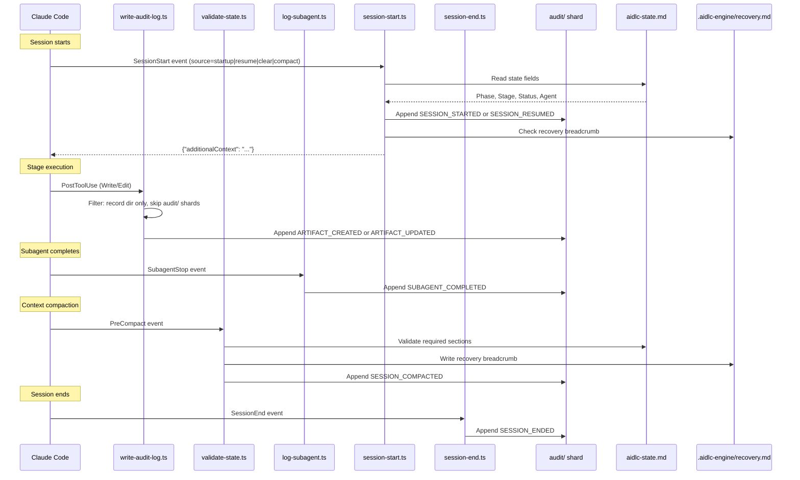

# Hooks and Tools

This chapter documents the hook system architecture, all seventeen hook scripts, the audit event taxonomy, CLI tool configuration, and the deterministic utility tool.

> **Path convention.** State, audit, and artifacts live under the active intent's **record dir** — `aidlc/spaces/<space>/intents/<YYMMDD>-<label>/`, written `<record>/` below (a compact UTC date prefix plus a short kebab-case label so record dirs sort chronologically; the canonical id is the UUIDv7 in the `intents.json` registry row). The audit trail is a directory of per-clone shards under `<record>/audit/`, not a single file.

---

## Hook System Architecture

This implementation uses seventeen TypeScript hook sources in `.claude/hooks/`. A source-generated `dist/` projection invokes them through `bun`; native installs and versioned release runtimes route them through `aidlc engine hook`, `aidlc engine statusline`, or an `aidlc engine adapter` target. All seventeen are **project-wide** — registered in `settings.json` (the statusline via the top-level `statusLine` key, the other sixteen via the `hooks` block), they fire regardless of which skill is active when the host permits project hooks. Claude Code managed `allowManagedHooksOnly: true` overrides the project registration and blocks those hooks; `/aidlc --doctor` detects that policy. They were previously split (six declared in `aidlc/SKILL.md` frontmatter as skill-scoped, the rest project-wide); v0.6.0 moved the skill-scoped six into `settings.json` so every entry point — the orchestrator, each packaged scope/stage runner, and any hand-written customer runner — inherits the deterministic spine with no per-runner `hooks:` block.

Eleven of the seventeen are **non-blocking**. Six are **flow-altering**: the `Stop` hook keeps the forwarding loop running, the deliver-stage-rules hook attaches exact active-stage rules to subagent briefs where the harness supports input rewriting, the plan-approval guard refuses premature code-generation dispatches, the reviewer-scope hook refuses sibling-unit reviewer access, the review-freeze hook refuses a reviewed-output write that would void a fresh terminal review receipt before the gate, and the state-transition guard refuses direct lifecycle calls that bypass `aidlc-orchestrate.ts report`.

```
.claude/hooks/
+-- record-human-turn.ts     # UserPromptSubmit + PostToolUse AskUserQuestion (project-wide, settings.json, TypeScript)
+-- deliver-stage-rules.ts    # PreToolUse Task|Agent (project-wide, settings.json, TypeScript, flow-altering)
+-- plan-approval-guard.ts # PreToolUse generation dispatch/write/shell tools (project-wide, settings.json, TypeScript, flow-altering)
+-- state-transition-guard.ts # PreToolUse shell/file-write tools (project-wide, settings.json, TypeScript, flow-altering)
+-- reviewer-scope.ts    # PreToolUse file/search/shell tools (project-wide, settings.json, TypeScript, flow-altering)
+-- review-freeze.ts     # PreToolUse file-write tools (project-wide, settings.json, TypeScript, flow-altering)
+-- write-audit-log.ts      # PostToolUse Write|Edit (project-wide, settings.json, TypeScript)
+-- run-sensors.ts       # PostToolUse Write|Edit (project-wide, settings.json, TypeScript)
+-- sync-workflow-state.ts   # PostToolUse TaskUpdate (project-wide, settings.json, TypeScript)
+-- rebuild-stage-graph.ts   # PostToolUse Bash (project-wide, settings.json, TypeScript)
+-- fold-usage.ts        # PreToolUse + PostToolUse (project-wide, settings.json, TypeScript, Claude-only producer)
+-- validate-state.ts    # PreCompact (project-wide, settings.json, TypeScript)
+-- log-subagent.ts      # SubagentStop (project-wide, settings.json, TypeScript)
+-- aidlc-continue-workflow.ts        # Stop (project-wide, settings.json, TypeScript, flow-altering)
+-- session-start.ts     # SessionStart (project-wide, settings.json, TypeScript)
+-- session-end.ts       # SessionEnd (project-wide, settings.json, TypeScript)
+-- aidlc-statusline.ts  # statusLine (project-wide, settings.json, TypeScript)
```

### Hook Summary

| Hook | Event | Scoping | Matcher | Purpose |
|------|-------|---------|---------|---------|
| `record-human-turn.ts` | UserPromptSubmit + PostToolUse | Project-wide (settings.json) | (empty) / `AskUserQuestion` | Record a `HUMAN_TURN` event when a supported prompt-submit or answered-widget seam fires; the approval/interview gate requires one since the last gate resolution. Every harness routes the event through `aidlc.ts engine hook record-human-turn`, which launches the authority-bearing module through its private process capability. Executing or importing the hook file directly mints nothing. `AIDLC_UNATTENDED=1` suppresses this authority-bearing mint across the shared hook and every harness adapter; non-authority forwarding markers remain unchanged. The declaration is opt-in because only the driver knows whether it is unattended. The event proves ordering/presence only: harnesses do not uniformly expose trusted response text, so it does not authenticate later `--user-input`, `--feedback`, or `--details` prose. Separately, an attended typed prompt with a session ID applies its exact fence or policy switch to the selected piece of work before the ledger state-file gate, records the audit row, and reports `AIDLC Guard Policy: ...` as hook context on harnesses that inject it. When the active directive is a guard-recovery ask for the current state, the human's first answer is recorded on that marker as the remedy selection. Command and external-work selections become ready immediately; human-input selections await the separate response (Request Changes requires exact revision feedback). The selection and feedback are hashed whitespace-normalized; a repeated `next` retains them only while the state and ordered remedy operation/interaction contract still match, so `reject` can bind `--feedback` to the human's own words |
| `deliver-stage-rules.ts` | PreToolUse | Project-wide (settings.json) | `Task\|Agent` | **Flow-altering.** Resolve the dispatched stage's substantive active-space rules and deliver their exact bytes using the transport declared in `stage-protocol.md` § "For subagent stages" step 2. After an accepted background dispatch, add one session-scoped entry to `aidlc/.aidlc-subagent-inflight` so the Stop hook can wait for its result; rejected dispatches add nothing. Rewrites Claude, Codex, opencode, and Copilot inputs. Kiro CLI uses its registered agents' native `resources` preload of the full active-space memory tree: a preload-served incomplete brief proceeds silently (exit 0, empty stderr; opt-in `hookDebug` only). Before dispatch, its adapter requires each selected installed roster worker's project-local `.kiro/agents/<name>.json` (including plugin workers, excluding the composer and non-roster helpers) to parse and include `file://aidlc/spaces/<active-space>/memory/**/*.md`, resolving to at least one existing Markdown file; absent, malformed, stale, or unresolved preloads block with exit 2 and repair guidance. After preload validation, the adapter forwards core exit 2 (unloadable required rule: block) and core exit 3 (valid bundle exceeds the hook rewrite channel: advisory, dispatch proceeds with exit 0). Every other harness retains verbatim brief delivery; Kiro IDE also uses always-included workspace steering with live memory-file references. Idempotent when the exact bundle is already present |
| `plan-approval-guard.ts` | PreToolUse | Project-wide (settings.json) | `Task\|Agent\|Edit\|Write\|Bash` (plus harness-native patch aliases) | **Flow-altering.** Enforce code-generation's plan-before-generation ordering (stage Steps 2-4) deterministically. The active directive selects one authority: `construction/<unit>/code-generation/` when `unit` is present, otherwise zero-Unit `construction/code-generation/`. With the plan-approval fence on, developer dispatch and workspace mutation are refused until that target has a current Testing Contract, fingerprinted plan/instructions, and explicit "Approve Plan" answer; writes inside the selected record directory remain available to prepare that evidence. Delegation uses exactly one `AIDLC-UNIT: <unit>` or `AIDLC-STAGE: code-generation` marker. Each refusal emits `PLAN_APPROVAL_BLOCKED`; missing, conflicting, or unknown markers block instead of guessing from prompt prose. `AIDLC_DISABLE_PLAN_APPROVAL_GUARD=1` disables this PreToolUse hook, and not silently: while a workflow exists, the first tool call that passes under it appends one `GUARD_DISABLED` audit row (`Guard: plan-approval-guard`, `Tool`), and consecutive disabled calls append nothing until another row lands in the active shard; any failure in that bookkeeping still allows the call. Initial approval evidence and executable artifacts are still required by the owning tools, including `aidlc-swarm.ts prepare`; postapproval content changes use the effective-fence continuation rule below without fabricating approval. A human break-glass receipt (`answer --checkpoint plan-approval --override`, opened only by the human typing `Override Plan Approval: <reason>` as a prompt) satisfies this hook like any other receipt; the hook never proposes it. |
| `state-transition-guard.ts` | PreToolUse | Project-wide (settings.json) | `Bash\|Write\|Edit\|MultiEdit\|NotebookEdit` | **Flow-altering.** Protect harness-owned hooks, session controls, and runtime records unconditionally; refuse direct `aidlc-state.ts` lifecycle verbs and redirect the conductor to `aidlc-orchestrate.ts report`; when the harness supplies delegated-agent identity, also refuse lifecycle/routing commands from reviewers and support agents; read-only state and ordinary build/validation commands remain available |
| `reviewer-scope.ts` | PreToolUse | Project-wide (settings.json) | `Read\|Edit\|Write\|Glob\|Grep\|Bash` | **Flow-altering.** Enforce the per-unit reviewer read-scope bound (stage-protocol-reviewer.md §12a) deterministically: while the conductor's reviewer dispatch record (`<record>/.aidlc-engine/reviewer-dispatch.json`) is fresh, the dispatched reviewer's tool calls that reach into sibling units' `construction/` paths - file reads/writes and grep/glob/shell patterns spanning siblings - are refused (exit 2 + a redirecting stderr reason) unless the target is on the record's exempt list. Independently, a checkout carrying a Unit-claim scope stamp may not mutate another Unit's `construction/<unit>/` subtree; normalized path resolution closes relative-traversal and case-escape forms before the refusal. Guard Policy, `guard.reviewer-scope`, and `AIDLC_DISABLE_REVIEWER_SCOPE_HOOK` can lower only the reviewer read-scope check. Claimed-checkout write ownership remains mandatory. Each refusal emits `REVIEWER_SCOPE_BLOCKED`. |
| `review-freeze.ts` | PreToolUse | Project-wide (settings.json) | `Read\|Edit\|Write\|Glob\|Grep\|Bash` (self-filters to mutation-capable calls) | **Flow-altering.** Enforce the reviewer-module terminal-receipt ordering deterministically: a Write/Edit or shell mutation targeting a reviewer-bearing, not-yet-completed stage's reviewed output (declared `produces[]`/`optional_produces[]`, excluding summary-owned questions unless explicitly named by `review_artifact`) is refused (exit 2 + a redirecting stderr reason) while a fresh terminal review receipt covers it. Shell writes are inspected before execution because they do not pass through the Write/Edit audit feed and would otherwise preserve a stale receipt over changed bytes. Shares the engine's exact receipt scan (`freshReviewReceipts` in `aidlc-lib.ts`), so a recorded gate rejection, jump, or workflow restart lifts the freeze automatically. A below-cap adversarial NOT-READY remains nonterminal and editable for repair; terminal NOT-READY under the effective class freezes like READY. Each refusal emits `REVIEW_FREEZE_BLOCKED`. Fail-open on every ambiguity; `AIDLC_DISABLE_REVIEW_FREEZE_HOOK=1` disables enforcement. The refusal ends with the same guard-recovery ask the router would emit (see [Guard admission and recovery asks](12-state-machine.md#guard-admission-and-recovery-asks)), so the conductor renders the typed remedies instead of retrying the write |
| `write-audit-log.ts` | PostToolUse | Project-wide (settings.json) | `Write\|Edit` | Auto-log artifact writes to the `audit/` shards |
| `run-sensors.ts` | PostToolUse | Project-wide (settings.json) | `Write\|Edit` | Fire the active directive stage's resolved Sensors on matching writes (advisory; never blocks); a state-bound per-intent marker preserves attribution when unit-major execution runs ahead of `Current Stage` |
| `sync-workflow-state.ts` | PostToolUse | Project-wide (settings.json) | `TaskUpdate` | Auto-sync state file on stage task activation |
| `rebuild-stage-graph.ts` | PostToolUse | Project-wide (settings.json) | `Bash` | Bind a successful `intent-create` to that tool event's exact host session ID; when the session already owns another intent, write the one-shot fresh-session handoff receipt; then recompile `runtime-graph.json` on transition-class audit emits |
| `fold-usage.ts` | PreToolUse + PostToolUse | Project-wide (settings.json) | (empty) | **Claude-only.** Fold the transcript's new token usage into the durable usage ledger every llm call: PreToolUse seals the completing main call and, before an engine boundary, every completed subagent call so lifecycle rollups are current; PostToolUse supplies the normal holdback fallback. Observe-only, never blocks; the Claude-Code transcript reader is wired only in the Claude harness, so on Kiro/Codex/opencode no producer runs and the ledger stays empty (every usage consumer degrades to no-data). `AIDLC_DISABLE_USAGE_TRACKING=1` disables it. See "Token usage and cost tracking" below |
| `validate-state.ts` | PreCompact | Project-wide (settings.json) | (empty) | Validate state file, write recovery breadcrumb |
| `log-subagent.ts` | SubagentStop | Project-wide (settings.json) | (empty) | Remove one background-subagent ledger entry for the completing session and log subagent completion events |
| `aidlc-continue-workflow.ts` | Stop | Project-wide (settings.json) | (empty) | **Flow-altering.** Enforce the forwarding loop on turn-end: run `aidlc-orchestrate next`; on `done`, `parked`, or informational `notice` allow the stop, on a pending directive block the stop and inject the next move back via `reason`. Also allows the exact one-shot post-`intent-create` fresh-session handoff when the session's original UUID and newly active UUID match the PostToolUse receipt. Allows legitimate turn stops when the current stage or active team Unit gate is awaiting approval/revision, or `[-]` in-progress with either an unanswered question in the active directive's canonical or per-unit `<slug>-questions.md` or an unresolved logged `DECISION_RECORDED`; a fresh in-flight compose marker, a fresh background-subagent entry for the current session, and conversational turns are also allowed. Foreign-session, stale, and malformed background entries do not authorize a stop. The compose, background, logged-decision, and conversational carve-outs are suppressed under autonomous Construction; the pending-file carve-out is suppressed except for unit-major code-generation's mandatory Plan Approval. Recursion-bounded (no-progress counter + `stop_hook_active` under `CLAUDE_CODE_STOP_HOOK_BLOCK_CAP`; default 2 in an interactive run and 8 under autonomous Construction). No-op outside an AIDLC workflow |
| `session-start.ts` | SessionStart | Project-wide (settings.json) | (empty) | Inject workflow context on session resume |
| `session-end.ts` | SessionEnd | Project-wide (settings.json) | (empty) | Emit `SESSION_ENDED` on graceful exit to the intent recorded for that exact session; fail closed instead of using the shared active cursor when a UUID-backed workflow has no session binding |
| `aidlc-statusline.ts` | statusLine | Project-wide (settings.json) | -- | Show real-time progress in terminal |

For Plan Approval and the three protected Construction decisions, the human-turn
hook additionally records the offered response, not just presence. It selects
`recordPlanApprovalHumanResponse` or the unified `recordProtectedHumanResponse`
from the session's challenge file, never both. Conflicting challenge files are
deleted with their responses and no choice is recorded. The protected mailbox
uses `protected-question-<sessionSegment>.json` and
`protected-question-response-<sessionSegment>.json` under
`aidlc/.aidlc-sessions/plan-approval/` (or the delegated worktree runtime directory).
Questions bind the kind, session, random challenge ID, canonical target digest,
and offered choices; answers bind the session and challenge ID and are consumed
only after the owning audit append succeeds.

For a question minted by `log decision`, rendered picker text must match the
exact `--decision` digest when supplied in `tool_input.questions[].question` or
`tool_input.question`. Codex preserves its `request_user_input` tool input when
forwarding a structured selection. A reply without rendered text relies on
exclusivity: a new `log decision` withdraws the invoking session's protected
question, or all sessions' questions if neither `--session` nor process ancestry
resolves the owner. A lifecycle `gate-start` withdraws all protected questions
before `STAGE_AWAITING_APPROVAL`. Plan Approval keeps its separate runtime format;
minting either kind removes the other's challenge and response, but ordinary
decisions and lifecycle gates do not withdraw Plan Approval itself.

On a submitted prompt with a session, `normalizeRetiredGuardPolicyField` runs
before the typed switch on that same prompt. It renames a sole retired
`Change Control: relaxed|off` line to `Guard Policy`, preserving the value and
source label without a policy audit row, and emits an `additionalContext`
migration note. The state digest treats the two field names identically, so
the name-only rename preserves issued directives and their bound authority.

For fence and Guard Policy switches, the human-turn hook calls
`applyTypedGuardSwitchPrompt(projectDir, sessionId, prompt)` only for a typed
prompt: `hook_event_name === "UserPromptSubmit"`, no string `tool_name`, an
attended driver (`humanTurnMintAllowed()`), and a present `session_id`.
It runs before the ledger state-file gate and applies the switch when the prompt
arrives, rather than leaving a switch for a later setter.
It resolves the selected piece of work through
`resolveWorkflowSelection(projectDir, { sessionId, space?, intent? })` using
only selectors present in the message; omitted selectors use that session's
workflow selection.
A named intent that does not resolve is refused with
`<intent> is not a piece of work in space <space>.`
A selection without a state file is refused with
`Guard Policy relaxed and fence switches apply to a piece of work: create it, then type this again.`
The requested `off` value or `guard.<fence> off` wording replaces `relaxed` as
appropriate.
Memory-held strict refuses with the memory file named; otherwise the hook
uses `applyIntentSettings` with `typedByPerson: true` under the audit lock,
appends the audit rows, and writes state.
The outcome is `{ applied, lines }`; the hook prints
`{"additionalContext":"AIDLC Guard Policy: ..."}` with the same result lines the
CLI prints, and harnesses that inject hook context deliver it to the conductor.
An unrecognized prompt returns `null` and applies nothing. When
`AIDLC_UNATTENDED=1` withholds authority, a recognized typed lowering switch
applies nothing and the hook emits this `additionalContext` line:

> AIDLC Guard Policy: the typed switch was not applied because AIDLC_UNATTENDED=1 withholds human authority on this driver; run it from an attended session.

`parseTypedGuardSwitchRequest` returns `{switches,space,intent}`;
`parseTypedGuardSwitches` wraps its `.switches`. Parsing trims the prompt,
removes one trailing run of `.,;:!?`, and is case-insensitive. The head
must be the whole token `/aidlc`, `$aidlc`, or `aidlc`, followed by one of two
forms:

- `config set <key> <value>` followed only by optional `--intent <name>` and
  `--space <name>` pairs, each at most once and in either order. Any other extra
  token applies no switch. A lowering is `guard-policy|change-control relaxed|off`
  or `guard.<fence> off` for one of the four switchable fences.
- A flags-first run. While a token starts with `--`, consume the next token as
  its value only when present and not starting with `--`. Stop at the first
  non-flag token and ignore the remaining description. Collect
  `--guard-policy relaxed|off`, the retired `--change-control relaxed|off`,
  `--guard.<fence> off` for a switchable fence, `--intent <name>`, and `--space <name>`.
  Example form:
  `/aidlc --guard-policy relaxed|off [--guard.<fence> off] [--intent <name>] [--space <name>] <description>`.
  Here `|` separates alternatives, square brackets mark optional flags, and
  angle brackets mark values to replace; these notation characters are not
  typed. On Codex, replace `/aidlc` with `$aidlc`.

The whole confirmation prompt `guard[- ]policy relaxed|off` or
`change[- ]control relaxed|off` is also accepted, where `[- ]` means a hyphen
or a space; both selectors are null for this form. A question mentioning switches
applies nothing; quoted, negated, or explanatory mentions outside these forms
change nothing.
`strict`, `on`, and `guard.human-presence` never name a lowering. One entry per
key, last value wins, keys ordered by first appearance. Codex uses `$aidlc`
instead of `/aidlc`, including in refusals that tell the person what to type.
When a recognized command lowers a guard, the hook validates and applies all
companion intent settings in the same transaction. A malformed command or
invalid companion changes nothing.
The conductor runs `next` and relays the stand-aside line or harness note instead
of running a setter to lower fences; a plain-words strict choice runs the strict
setter directly.
CLI setters perform no switch-authority session lookup and do not lower from
chat on their own.
An already-off fence or identical policy word already marked `set by you`
needs no key; other CLI lowering requires `fenceKeyBypassed`, the fixture or
harness-launch presence bypass, after memory-strict and unattended checks.
Hooks run on Windows too, so every harness that forwards the prompt supports
the typed switch.
Picked answers do not apply switches; a `lower-fence` remedy executes nothing
and only tells the person the exact command to type, with no `operation` or
`command` of its own.

The human-turn hook is activated only through the dispatcher's hook route,
`aidlc engine hook record-human-turn`. It does not authenticate who launched
the dispatcher. Hooks and tool calls run as the same user, and no harness gives
a hook an identity a same-user process cannot copy.
The [state-transition guard](#pretooluse-aidlc-state-transition-guardts) uses a
runtime-integrity check to refuse recognized direct and indirect tool-call
routes to the hook and its records, including paths, environment assignments,
inline and wrapper scripts, argv arrays, aliases, shell functions, and written
content. A route is a concrete import, require, or execution of a hook module;
a script, comment, string, or document that merely names one is not.

The check also refuses direct write-tool replacements and recognized shell
overwrites, moves, or removals of installed enforcement components, even when
the replacement is harmless-looking pass-through code. Protected locations
include the installed `hooks/` tree, `tools/aidlc.ts` and `tools/aidlc-*.ts`
engine/security modules and dispatchers, native adapters, and named hook registrations such as
`hooks.json`, Claude's `settings.json`, Kiro's AIDLC agent JSON, and Copilot's
`.github/hooks/aidlc.json`. Removing their containing installation directories
is refused too. A small explicit set of official engine entrypoints may load
hook helpers; an arbitrary script gains no exemption merely by being stored
inside a harness directory. Scope definitions and mutable compiled workflow
data remain subject to their existing rules.

Use normal engine commands for workflow work. For installation maintenance,
`aidlc update` updates the machine runtime; run `aidlc config` between workflows
to configure or refresh a project's installed files. To intentionally repair
or replace enforcement files directly, stop the agent workflow and use an
external terminal or editor, then restart the session. Lowering a workflow
fence does not authorize those file replacements. Framework development edits
belong in the authored `core/` and `harness/` trees; installed/generated copies
are not the development surface. This path check does not attest existing
installation contents or intercept every possible programmatic filesystem
mutation, and it introduces no new approval mechanism.

Known limitation: shadowing a runtime API with a function-scoped
`var` declared inside a nested block, or replacing an imported process API
through a literal computed member such as `childProcess["exec"] = mock`, can
still cause false refusals for launcher-shaped mock data. Use distinct mock
receiver names or dotted assignment (`childProcess.exec = mock`) for a literal
mocked member.

This is defense in depth. The harness's permission model and the person's
review of what the agent runs are the outer boundary.

#### Kiro IDE adapter

When UserPromptSubmit carries a typed fence or Guard Policy switch, the adapter forwards it to the core human-turn hook, which applies it at prompt time under the payload session and returns an `AIDLC Guard Policy:` note; shell setters are not run inside the adapter.
On empty-prompt builds such as IDE 1.0.242, the per-turn `prompt-empty` marker makes the adapter refuse lowering shell commands (exit 2 with stderr), including environment-prefixed invocations, and `verb-intercept` emits a once-per-session capability note explaining that active work cannot be lowered on that build and directing the person to update Kiro IDE or start new work from a lower-default scope. Raising to `strict` or turning a fence `on` remains available.
Before forwarding an empty prompt, the adapter performs the same field-only
normalization and prints its migration note because some builds discard core
hook output. Its capability note also explains that automatic rename.

#### Copilot adapter

Copilot forwards UserPromptSubmit to the core human-turn hook even before a
state file exists, so a first-use lowering switch gets the instruction to create
the piece of work and type the switch again rather than being saved for later.
Its human-sequence coordination marker still requires an existing state file.

### Shared Characteristics

All seventeen TypeScript hook sources:

- Are written in TypeScript and invoked through the channel's dispatcher
- Do not need executable permissions — work identically on macOS, Linux, and native Windows PowerShell
- Receive JSON on stdin from Claude Code
- Use native JSON parsing (no `jq` dependency)
- Exit with code 0 on success or when skipped (the `Stop` hook also exits 0 when it blocks — the block is signalled by a `{"decision":"block"}` JSON object on stdout; the four PreToolUse control hooks signal an unrecoverable or retryable refusal with exit 2 + the reason on stderr)
- Resolve `$CLAUDE_PROJECT_DIR` with multiple fallback methods
- Share locking and utility functions from `lib.ts`

Claude's source-generated `.claude/settings.json` invokes hooks with
`bun "$CLAUDE_PROJECT_DIR/.claude/tools/aidlc.ts" engine hook <name>` and uses
the same anchored dispatcher for `engine statusline`. The quoted entry path
survives project roots containing spaces and application commands that change
the working directory. It does not change the hook process's working directory
or the `cwd` supplied in the JSON payload. Native release settings use
`aidlc engine hook <name>` and `aidlc engine statusline`, without Bun.

### Observers never write authority

Some engine invocations exist only to LEARN the current directive. There are
exactly two, both identified by an environment variable on their spawn:

- the Stop hook's `next` probe (`AIDLC_STOP_HOOK_PROBE=1`), which asks whether
  work is still pending before allowing a turn to end;
- the route check that `aidlc-state.ts unit start` and wave completion spawn
  (`AIDLC_ROUTE_CHECK=1`), a `next` plus any follow-on `continue`, which asks
  which Unit the engine would route now. A route check skips rule transport
  entirely, so it normally reads the run-stage directive straight off stdout.

Both read the directive off stdout and never consult the durable marker
afterwards, so writing from one buys nothing and costs correctness.

**The authority artifacts.** Neither observer creates, rotates, consumes or
deletes any of: the Plan Approval challenge, response or receipt under
`aidlc/.aidlc-sessions/plan-approval/`; the reserved ledger receipts
(`PLAN_APPROVAL_RECORDED`, `HUMAN_TURN`, `GATE_*`, `REVIEW_REQUESTED`,
`REVIEW_COMPLETED`, `UNIT_*`); `aidlc-state.md`; the active-directive marker and
its revision; the steering-token key; the continuation cursor. A probe also mints
no synthetic `STAGE_STARTED`, refreshes no claim cache, and bootstraps no diary.

The one write NOT on that list is the advisory engine-turn marker
`.aidlc-engine/engine-touch`, whose mtime is a Stop-hook optimisation and carries no
authority. The Stop probe must suppress it or the conversational carve-out below
would be permanently dead; the route check does not, because `unit start` is real
workflow engagement.

**The barrier.** The guarantee is a property of the code shape, not of an
enumeration someone has to remember. Alongside the per-call-site suppressions, a
typed `EngineModeViolationError` sits at the durable write primitives: the
active-directive transaction commit, `writeStateFile`, `writeFileAtomic`,
`writeBufferAtomic`, and `appendAuditBlockAtPath` (the single funnel every audit
append passes through). An observer that reaches one throws and exits non-zero
instead of writing. Both producers already fail safe on a non-zero engine exit:
the Stop hook allows the stop and records a drop, and `unit start` surfaces the
error rather than starting the Unit. A silent no-op was rejected deliberately,
because it would hide the defect the barrier exists to expose.

**Workflow routing through `next` is idempotent.** When the active-directive
marker already records this exact directive for this state (same stage, same
Unit, same rule bundle, same directive body, and for a partial rule delivery a
receipt that still matches the marker's payload), `next` returns the issued
directive verbatim: no marker rewrite, no revision bump, no fresh receipt. Only
the transport is short-circuited, and a plain `next` retains only PART ONE of a
multi-part rule delivery: a marker published by a plain `next` is sessionless, so
a repeat ask by the conductor that already holds parts 1..k-1 cannot be told
apart from an ask by a compacted context or a brand-new process, and a stage must
never run with an earlier part of its method layer missing. From part two onward
a fresh `next` restarts delivery at part one, which costs one republication and
is always complete. The Stop-hook probe is the one exception: it retains the
CURRENT part with its receipt, so the end-of-turn re-feed names the receipt the
conductor already holds. Routing is always recomputed, so a paused Unit, a moved
gate, or a completed Unit produces its own directive and stale work can never be
re-issued. Asking the engine what to do twice therefore answers the same thing
twice and changes nothing, which is what makes that query safe to ask from a hook.
Explicit typed `next config set|get|list` requests are terminal operations: the
canonical config command executes before its output is returned. Stop-hook and
route-check probes only describe those commands and never execute them.

This is the mechanical half of the two authority rules in
[`12-state-machine.md`](12-state-machine.md#authority-invariants): a query never
writes, and authority binds to content and attempt rather than to the identity of
the directive that issued a prompt.


### Guard Policy, the five fences, and the chain of authority

Four `PreToolUse` hooks are FENCES: they refuse an action that no engine
instruction covers. The decision to refuse is not each hook's own; it is made in
one place, `aidlc-lib.ts`, from one matrix, so no hook can grow its own ladder.

**The fences.** `GUARD_FENCES` names five: `plan-approval`, `review-freeze`,
`state-transition`, `reviewer-scope`, and `human-presence`.
`SWITCHABLE_GUARD_FENCES` contains only the first four; `guardFenceConfigKey`
accepts one of those four and returns its `guard.<fence>` config key. These
definitions live in `aidlc-guard-fences.ts` and are re-exported by `aidlc-lib.ts`.
Each fence except `state-transition` has an environment kill switch
(`GUARD_FENCE_ENV`). `resolveFences` returns the effective setting of all five
for a state, in precedence order: the environment kill switch, then the per-work
`Guards Off` state line unless memory holds strict, then the per-work `Guards On`
state line, then the fences the policy word lowers (`fencesLoweredByPolicy`:
nothing under `strict`, `plan-approval` and `review-freeze` under `relaxed`, those
two plus `state-transition` and `reviewer-scope` under `off`), then on by default.
`humanPresenceGuardDisabled` reads only `AIDLC_SKIP_HUMAN_PRESENCE_GUARD=1`:
human presence is the key holder and has no per-work switch. A persisted
human-presence entry on either state line is ignored. `AIDLC_UNATTENDED=1`
separately withholds human-turn minting; it does not lower the fence.

For the four switchable fences, `config-change --guard.<fence> off|on` writes
the `Guards Off` or `Guards On` line in canonical order as
`<comma list> (set by you)` or `none`, and one `GUARD_DISABLED` or
`GUARD_RESTORED` row. Setting `on` can raise a policy-lowered fence and records
that override in `Guards On` with `GUARD_RESTORED`. `/aidlc --status` renders all
five through `formatFence` on its `Fences:` line: `on (default)`,
`on (set by you)`, `off (set by you)`, `off (env <VAR>)`, or
`off (guard policy relaxed (from scope classic))`, as appropriate.

The human-turn hook applies explicit fence and policy lowering from the person's
typed prompt through the shared settings transaction.
`config-change` and `scope-change` refuse a lowering from `you` unless the
fence is already off, the policy word already matches a line with source `you`,
or `fenceKeyBypassed` permits the fixture/harness-launch presence bypass.
Direct `intent create --guard-policy relaxed|off` from chat is refused when the
value differs from the selected scope's default: create the piece of work,
then have the person type the switch. Naming the scope's own default at
creation records the scope's value without another prompt. A running workflow
keeps its stricter policy when changing to a scope with a lower default until
the person types the lowering switch.
Memory-held strict refuses first, naming the file, and also forces earlier
`Guards Off` entries back on while preserving them for when the memory line no
longer holds strict.
`AIDLC_UNATTENDED=1` suppresses prompt-time application and refuses CLI lowering
before consulting that bypass.

The CLI refusals name the person's move:

> Turning the plan-approval check off is the person's move: they type `/aidlc config set guard.plan-approval off` and the harness applies it as they say it. This command does not lower a fence on its own.

> Setting Guard Policy relaxed lowers fences and is the person's move: they type `/aidlc --guard-policy relaxed` and the harness applies it as they say it. This command does not lower fences on its own.

> Creating this intent with Guard Policy relaxed would lower fences. Create it, then have the person type `/aidlc --guard-policy relaxed`; the harness applies it as they say it. A scope default applies without asking.

Other fences and the `off` value use their corresponding names; Codex uses
`$aidlc`, and unattended refusals append the driver guidance.

**The chain of authority.** `authorityFor(projectDir, options)` answers one
question before any fence refuses: is this action covered by the human's `grant`,
by the engine's `instruction`, or by `none`?

| Cover | Definition | Extent |
|---|---|---|
| `grant` | A human message recorded AFTER the engine's last directive | Everything done to carry it out, by the conductor and by any agent it dispatches, until the engine's next instruction |
| `instruction` | The directive the engine currently has in force (`INSTRUCTION_KINDS`, delivery not superseded) | The work that instruction asks for, whoever does it, including an approval still pending inside it |
| `none` | Work outside the instruction with no grant since | The narrowest cover; every unreadable signal falls back toward it |

Every signal is one the framework already keeps: the turn markers
(`.aidlc-engine/human-turn` against `engine-touch`, through
`turnMarkersShowConversational`), the active-directive marker's `human_sequence`
and `engine_sequence` counters where a harness keeps them, the marker's own kind
and delivery, `agent_type` / `subagent_type` on the hook payload, and
`AIDLC_UNATTENDED`. The reported `actor` (`main`, `subagent`, `unattended`) sits
BESIDE `covered` and is never substituted for it: the question is not who is
acting. A developer agent acts on the conductor's word and the conductor on the
human's, so authority flows down the delegation chain.

**The dispatch stamp.** `aidlc-deliver-stage-rules.ts` fires on the dispatch
itself, in the main session, so the authority it reads there is the one that sent
the agent. It records that cover on the in-flight subagent ledger
(`markSubagentInflight`), and `authorityFor` reads it back through
`stampedDispatchAuthority` when the caller is a subagent. Only `grant` widens what
a dispatched agent may do, so no ledger, no entry, or a malformed ledger reads as
unstamped and falls back to the instruction, or to nothing. A dispatch can never
MINT a grant for itself.

**One decision.** `decideGuard(subject, authority, policy)` returns `pass`,
`stand-aside`, `ask`, or `hold`:

| | `grant` | `instruction` | `none` |
|---|---|---|---|
| drift, not `strict` | stand aside | stand aside | stand aside |
| drift, `strict` | ask | ask | ask |
| fence, key on | hold | hold | hold |
| fence, lowered | stand aside | stand aside | stand aside |

**The key is the person's typed switch.** The bottom two rows do not read
conversational authority: a fence stands aside exactly when the policy word,
per-work switch, or environment kill switch lowered it.
The human-turn hook applies the exact switch at prompt time; a selected remedy
or generic grant changes nothing.
A reply such as "write the code now" or "yes, option 2" to an unrelated question
does not lower a fence, even if it arrived after the engine's last directive.

An in-force instruction is not a key either, for a different reason. A fence only
reaches this function once its own predicate has already found the action outside
what the instruction asked for: code before the approved plan, an edit after the
review receipt, a reviewer writing outside its unit, a direct lifecycle command.
The instruction covers the work it asks for, including the approval still pending
inside it; it does not cover the loop skipping one of its own steps.

For the four switchable fences, the human turns the key by typing the switch
the hook applies, unless a memory layer holds Guard Policy strict. A fence that
holds puts an available switch in front of the person who met it, in whichever
shape that refusal has: `review-freeze` builds a typed refusal with `fence` set,
so `evaluateGuardRefusal` appends `lowerFenceRemedy` (`op: "lower-fence"`) as a
`human-input` choice with no `operation` or `command`. Selecting it only tells
the person to type the exact setter command; it authorizes and executes nothing.
The other three fences refuse from `PreToolUse` with exit 2.
Main-session prose refusals use
`fenceSwitchSentence`: it returns `lowerFenceSentence` when the switch is
available, or names the memory file holding strict instead. Memory-held strict
withholds the switch everywhere, including typed remedy lists. Plan-approval
and direct state-tool refusals also withhold it from dispatched agents, as do
delegated-agent and reviewer-scope redirects. Either way it is a key the person
turns deliberately rather than one that turns itself, and once turned nothing
asks again for that piece of work.
Human-presence refusals instead say `This needs a fresh human turn: wait for the person to reply, then record it again.`
They never advertise a switch.

**Strict drift asks in every column.** The check that finds drift runs at the
boundary where the work would start (the plan-approval hook at generation start,
the `decision` and `answer` records, the `begin` command), and nothing later
re-derives it: `next` never evaluates plan drift. A `hold` there would be a wall
with no asker behind it, so the strict row asks whether or not a human has spoken
since the last directive. The first draft asked only on a grant; the grant is a
turn marker, and a turn marker was already ruled out as a decision signal above.

Conversational authority is therefore consumed by the evidence trail alone: no
row of the table reads it, and every `GUARD_STOOD_ASIDE` row still carries the
`Authority`, `Grant`, and `Actor` in force, so a reader can see who was working
when a lowered fence let something through. That classification does not replace
the person's typed switch applied by the human-turn hook. Only a fence's
supported per-work switch, policy word, or environment kill switch changes its
effective setting.

`decideFence(projectDir, fence, options)` is the whole ladder in one call:
resolve the policy (`resolveGuardPolicy`, and an unreadable policy resolves to
`strict`, so the fence stays up), resolve the fence setting, read the authority,
decide. All four fence hooks call it before they refuse.

**What a decision emits.** `stand-aside` formats one line with
`guardStoodAsideLine(fence, source, detail?)`:
`Continuing past the <fence> check because it is off for this piece of work (<source>). Recorded in the audit trail: <detail>`.
The source is the text `formatFence` prints inside its parentheses, such as
`set by you`, `env AIDLC_DISABLE_PLAN_APPROVAL_GUARD`, or
`guard policy relaxed (from scope classic)`. Without detail, the final sentence
is `Recorded in the audit trail.` It writes one `GUARD_STOOD_ASIDE` row
(`recordGuardStoodAside`, carrying `Guard`, `Authority`, `Grant`, `Actor`, and
optional `Stage`, `Tool`, `Details`). It never asks "are you sure": the fence is
already off. The line names what lowered the fence, not the authority; the
authority in force still reaches the ledger on the row.

**Delivery of that line is per harness, and the row is the fallback.** All four
fence hooks use `writeGuardStoodAside(line)` from `aidlc-lib.ts`. When
`runtimeHarnessName()` is `"claude"`, it writes one JSON line to stdout:
`{"systemMessage":"<line>"}`. Claude Code shows this as a hook message to the
human, not to the model; exit-0 plain stdout is not delivered, and the
`GUARD_STOOD_ASIDE` row is the record. Codex, opencode, and Kiro CLI receive
the plain hook line. Kiro IDE 1.x does not show it: measured live, it forwards
hook stdout only for `SessionStart` and
`UserPromptSubmit` (see the Stop hook's per-host table earlier in this chapter),
so on that harness a stand-aside is silent and the `GUARD_STOOD_ASIDE` row is the
only record that the fence let something through. That limitation is pre-existing
and applies equally to every hook refusal reason there; it is not specific to the
fences. The row is best-effort like every other advisory row: what authorised the
pass is the lowered switch, itself recorded as `GUARD_DISABLED` when it was
flipped, or the policy word in the intent's own state, so this row is the trace
of what that decision let through rather than the decision itself. And
`recordGuardStoodAside` appends nothing at all when the intent has no audit
ledger yet. On Kiro IDE
against a project with no ledger, a stand-aside therefore leaves neither a line
nor a row. `hold` refuses as before. Switchable-fence main-session refusals use
`fenceSwitchSentence` to append `lowerFenceSentence`, naming
`/aidlc config set guard.<fence> off` (`$aidlc config set guard.<fence> off` on
Codex), only when memory does not hold strict.
Memory-held strict withholds the switch everywhere; the prose refusal names
the memory file to edit instead. An unreadable policy also withholds the switch.
Plan-approval and direct state-tool refusals withhold both sentences from
dispatched agents, keeping their redirect, as do delegated-agent and
reviewer-scope refusals. When available, the typed refusal's remedy list carries
`lowerFenceRemedy` (`op: "lower-fence"`) LAST, after the remedies that let the
workflow finish the step on its own.
This `human-input` remedy carries no `operation` or `command`; selecting it
only tells the person to type the exact setter command and authorizes or
executes nothing.

**Security posture.** No policy value and no per-work switch removes an approval
gate, alters a reviewer's verdict, deletes evidence, or lets an agent answer for
a human. The conductor still asks every approval question; a lowered fence does
not enforce that prose obligation. It lets undirected work through, with a
`GUARD_STOOD_ASIDE` row when the intent has an audit ledger and a notice on the
harnesses that deliver it.

### Audit Event Flow



---

## Workflow-Spine Hooks

These six hooks (the audit/sensor/statusline/rebuild-stage-graph/state-validation/subagent spine) are registered project-wide in `settings.json`. They are always on, but each **self-gates**: it early-exits when there is no active workflow (`aidlc-state.md` / the active intent's `audit/` shard absent), so audit logging and state sync never clutter non-AI-DLC sessions. Before v0.6.0 they were declared in `aidlc/SKILL.md` frontmatter (skill-scoped); the move to `settings.json` lets every entry point — the orchestrator and every packaged or hand-written runner — inherit the spine without copying a `hooks:` block.

### PostToolUse: write-audit-log.ts

**Source:** `.claude/hooks/aidlc-write-audit-log.ts`
**Trigger:** After every `Write` or `Edit` Claude Code tool call (matcher: `"Write|Edit"`)
**Purpose:** Auto-log artifact writes to the intent's `audit/` shards

**Processing steps:**

1. **Project directory resolution:** Resolves `$CLAUDE_PROJECT_DIR` with fallback to script path derivation and CWD detection.
2. **Health heartbeat:** Writes UTC timestamp to `.aidlc-engine/hooks-health/write-audit-log.last`.
3. **JSON parsing:** Reads stdin, extracts `tool_name` and `tool_input.file_path`.
4. **Path filtering:** Skips files not under the intent's record dir. Skips the `audit/` shards themselves (avoids recursion). A leading Windows drive letter is compared case-insensitively (Kiro IDE reports `c:\` for a `C:\` project dir); every other path component is compared exactly, so a directory whose name differs only in case is never treated as the record.
5. **Audit file guard:** Exits silently if the active intent's `audit/` shard does not exist (the framework creates it).
6. **Context extraction:** Strips the path prefix up to the record dir, replaces `/` with ` > ` for a breadcrumb (e.g., `inception > requirements-analysis > requirements.md`).
7. **Atomic locking:** Uses `mkdir`-based lock in the system temp directory (`os.tmpdir()`) with 3-retry loop (100ms delay). The hash isolates locks per project.
8. **Log entry:** Appends a canonical `ARTIFACT_CREATED` (for Write to a net-new path) or `ARTIFACT_UPDATED` (for Edit, or Write overwriting existing) event via `appendAuditEntry`. Fields: Timestamp, Event, Tool, File, Context, and `Summary Authorization Id` when the written stage (and Unit, for a per-Unit Construction path) has an active summary confirmation. The id is read from `<record>/.aidlc-engine/summary-authorization/<stage>/stage.json` or `<record>/.aidlc-engine/summary-authorization/<stage>/units/<unit>.json`, which `aidlc-log.ts answer --checkpoint summary-confirmation` writes on `Looks correct` and removes on `Request changes`. A per-Unit path with no confirmation of its own is stamped from the stage record only when that record belongs to the isolated `single-stage:<stage>` run (which confirms its one Unit at stage scope). The lookup and append share the audit lock, so the hook cannot observe a registry entry before its receipt or during rollback.

### PostToolUse: sync-workflow-state.ts

**Source:** `.claude/hooks/aidlc-sync-workflow-state.ts`
**Trigger:** After every `TaskUpdate` call (matcher: `"TaskUpdate"`)
**Purpose:** Auto-sync `aidlc-state.md` when a stage task becomes `in_progress`

**Processing steps:**

1. **Project directory resolution:** Same multi-fallback pattern as write-audit-log.ts.
2. **Status filter:** Only fires when `status` is `in_progress`. Exits silently for `completed`, `pending`, etc.
3. **activeForm filter:** Exits silently if no `activeForm` field or no `[slug]` suffix pattern.
4. **State file guard:** Exits silently if `aidlc-state.md` does not exist (pre-init).
5. **Health heartbeat:** Writes to `.aidlc-engine/hooks-health/sync-workflow-state.last`.
6. **State sync:** Calls `bun aidlc-utility.ts set-status --stage <slug>` (normally updates Phase, Stage, Agent, and checkbox). For a valid interleaved unit-major directive, it updates the transient status fields and marker digest while preserving the durable first-stage cursor, `In Progress`, and checkbox.

**Design notes:**
- Stage Jump tasks (no `[slug]`) and dependency-wiring TaskUpdates (no activeForm) are naturally filtered out.
- The hook calls the existing `set-status` subcommand — no new code path needed.
- When the activated slug matches the state-bound active-directive marker, `set-status` refreshes that marker's state digest while preserving its unit. The digest is taken over a projection of `aidlc-state.md` that omits the cache layer, so a status sync that touched only cache fields leaves the marker completely alone rather than superseding the live directive. Either way a recorded Plan Approval is unaffected: it binds to plan content and stage attempt, not to the marker. For an interleaved unit-major directive it also leaves `Current Stage`, `In Progress`, and the durable cursor checkbox unchanged, so the completed-grid gate cascade still begins at the block's first stage.

### PostToolUse: run-sensors.ts

**Source:** `.claude/hooks/aidlc-run-sensors.ts`
**Trigger:** After every `Write` or `Edit` Claude Code tool call (matcher: `"Write|Edit"`)
**Purpose:** Fire the active stage's compile-resolved Sensors on matching writes (advisory; never blocks)

The scope frontmatter key `sensors: on|off` sets the default (`on` when omitted; `classic` explicitly sets `on`). `/aidlc --sensors on|off` overrides the active intent's **Sensors** state line. `AIDLC_DISABLE_SENSORS=1` forces automatic sensors off, even when the intent opts in. With Sensors off, the hook exits silently before its heartbeat, first-fire banner, or dispatcher spawn; `gate-start`, `revise`, and the approve-time revision backstop likewise skip sensor dispatch and blocking-verdict checks. Approval gates and the other safety hooks remain in place. All hook registrations, stage `sensors:` imports, and Sensor manifests remain installed; explicit `aidlc engine sensor fire` is still available for diagnostics.

**Processing steps:**

1. **Project directory resolution:** Same multi-fallback pattern as write-audit-log.ts.
2. **Audit + state guards:** Exits silently if the `audit/` shard or `aidlc-state.md` does not exist (pre-init).
3. **Active-stage read:** The engine atomically records each validated `load-steering` part and final `run-stage` in the active intent's gitignored `.aidlc-engine/active-directive.json`, bound to the exact project, intent, and `aidlc-state.md` SHA-256. Shared marker consumers therefore see the upcoming stage while its rules are still being delivered. Task activation refreshes the digest only when its slug matches the marker, preserving a per-unit directive's unit while rejecting unrelated state changes. The hook uses that stage while the digest matches, then reads its `sensors_applicable` array from `stage-graph.json`. This keeps unit-major code-generation diagnostics under `code-generation` even while the durable cursor remains on an earlier design stage. A pending Copilot attempt may retain the marker across `report --single`; otherwise successful single-stage completion clears it. A missing, malformed, stale, or graph-unknown marker falls back to `Current Stage`.
4. **Dispatch:** For each applicable Sensor, runs `sensor fire <id> --stage <slug> --output-path <path>` through the selected channel (`aidlc engine sensor …` on a native install, `bun aidlc-sensor.ts …` on a Bun projection). The dispatcher applies each Sensor's `matches` glob hook-side; a non-matching write is skipped. Outcomes are advisory — the hook never blocks the write.
5. **Health heartbeat:** When Sensors is on, writes `.aidlc-engine/hooks-health/run-sensors.last` after the input/audit/state guards and before stage/graph lookup, so the doctor can distinguish a healthy idle hook from a silent failure. Sensors off leaves the heartbeat unchanged.

See [Sensor System](07-sensor-system.md) for the manifest schema and the fire lifecycle.

Marker writers serialize through a record-local `.aidlc-engine/active-directive.lock/` using the same generation-bound protocol as audit locks. The canonical marker remains readable while a writer prepares a sibling candidate, and publish, clear, and release stay bound to the exact acquisition token and canonical identity. The token is a canonical UUID whose real directory must be a non-symlink child of the lock directory; releasable markers must be regular files in that directory. Automatic recovery is limited to a provably-dead valid generation, an OS process-generation mismatch, or an old genuinely-missing stamp. The OS generation probe is optional: if it is unavailable, acquisition retains the PID/token stamp and live-owner recovery remains generation-unknown and fail-closed. Every canonical mutation holds a recoverable owner-stamped `.reap` coordination gate; gate generation checks, publication, and retirement are serialized by `flock` on POSIX or `LockFileEx` on Windows. The POSIX loader supports glibc, macOS libSystem, standard musl loader/libc names, and discovered musl libraries. Each gate is fully stamped in a private candidate before publication, and a completed but unreleased gate is externally recoverable and doctor-visible. Matching or generation-unknown live owners, malformed stamps, redirected token paths, non-regular release markers, and unreadable stamps fail closed. Legacy `.aidlc-engine/active-directive.json.transaction` debris likewise remains manual because it has no owner identity to reverify.

#### Rule delivery and the continuation cursor

A stage's rules travel INSIDE its `run-stage` directive whenever run-stage and
rules together fit under the 28 KiB transport cap. Every shipped stage does (17
to 19 KB measured against 28,672 bytes), so the ordinary stage needs no
continuation at all: one `next`, one directive, `rules_content` inline. The
cursor below governs the fallback, a bundle a team's memory files pushed past the
cap, which arrives as `load-steering` parts.

Each part carries an 8-character `receipt`: the first characters of an HMAC over
the part's payload (stage, part number, bundle and directive digests, route and
state digest), keyed by the machine-local steering key. The receipt and the ready
`next` command are printed FIRST in the part, ahead of the rule text, so a host
that truncates long tool output can never discard the cursor. The payload itself
is stored on the active-directive marker (`steering_payload`), alongside
`steering_payload_receipt`, the payload's MAC under the local key. Both
`load-steering` and `run-stage` publications store that binding. Nothing the
conductor types is trusted for routing: the presented receipt proves possession
of the current part, while the stored receipt authenticates a fallback route
hint. Eight signed characters are a weaker signature
than the former 610-character envelope, deliberately: the threat is a confused
model copying a string, not an attacker, and an attacker with the key on the
same disk defeated the envelope just as easily.

The active-directive marker is the authoritative continuation cursor for every
shipped harness. Cursor identity is the canonical project, active space/record
path, intent UUID, complete state SHA-256 plus presence, and the installed
harness name from `tools/data/harness.json`. Harness directories alone are not
identities: Kiro and Kiro IDE share `.kiro`, while Copilot and opencode share
`.aidlc`. New marker publications record the harness as `cursor_harness`;
existing v2 markers without that field remain readable for migration.

`continue <receipt>` takes the active-directive lock, compares the receipt with
the marker's current part in constant time, revalidates state and route from the
stored payload, and atomically replaces the cursor with the prepared successor
(the next part, or the run-stage) before writing stdout. Two processes racing the
same receipt therefore have exactly one winner.

Outside a tracked Copilot attempt, an unmatched `continue` normally answers as
a bare `next`: a mistyped or consumed receipt, a receipt presented after the
run-stage, a race loser, or state or route that moved underneath. Stateful
workflows route from their state file regardless of the stored route hint: the
answer is the retained run-stage (byte-identical to `next`) or part one again,
since a conductor that holds parts 1..k-1 is indistinguishable from a compacted
context. A stateless route replays the marker's scope, stage, and single-run flag
only when `steeringPayloadAuthentic` verifies `steering_payload` against
`steering_payload_receipt`. An edited route or a legacy marker without that
receipt is not trusted. Without state and a verified route, the engine emits an
error directive saying the receipt matched no current part and the stored route
could not be verified; the runner must issue a fresh
`next --scope <scope> --stage <stage>`, adding `--single` for a single run. Lock
contention returns a `continue` error that asks for the same command again.

A receipt replayed under a tracked Copilot attempt instead returns an error
directive (stale or superseded) and marks the attempt failed. The conductor
recovers with a fresh `next`.

Fresh `next` uses the same lock and must publish its first work directive before
stdout on all harnesses. It is an explicit reset. A `next` whose answer is the
directive the marker ALREADY records for this state publishes nothing at all: it
returns that directive verbatim, with no revision bump and no fresh receipt, so
re-asking does not reset anything. Publishing is continuation bookkeeping, never
an authority event: it does not clear a Plan Approval challenge, retire a
receipt, or reset the plan-approval runtime state. Receipts are deterministic
(the same part in the same state yields the same receipt), so a reset re-issues
the same receipt bytes: if `next` commits before a concurrent `continue`, that
continuation may consume the reset receipt; if `continue` commits first, the
later `next` supersedes its successor and restores the first directive. Commit
order, not process start time, is authoritative. Marker contention produces an
error directive and no unrecorded work directive.

Crash and retry behavior below assumes a state file or an authenticated stored
route and excludes tracked Copilot receipt failures:

| Boundary | Cursor and retry |
| --- | --- |
| Before marker rename | The old receipt remains current. A dead owner is reclaimed by the existing lock reaper; retry the same receipt. |
| After rename, before stdout | The successor is current. Presenting the old receipt is answered with the current step; the cursor is at-most-once, not exactly-once delivery. |
| After stdout begins or completes | The successor is current. If receipt of the complete directive is uncertain, run `next` or present the receipt again; either answers with the current step. |
| Final `run-stage` | The marker has no current-part receipt, but retains `steering_payload_receipt` to authenticate its stored route. A replayed receipt returns the run-stage, byte-identical to `next`. |

Compatibility recovery remains atomic. Missing, malformed, oversized, and v1
markers permit one natively validated continuation to bootstrap and publish its
successor under the lock; concurrent recovery callers then see that successor
and lose. A pre-change v2 marker without `cursor_harness`, or one written by a
different installed harness, migrates only when its exact project, intent,
state, and current-receipt digest match. A mismatch follows the same fallback
above: stateful routing from state, or stateless replay only with a verified
`steering_payload_receipt`. Legacy markers without it provide no trusted route
hint. Fresh `next` is the universal reset. Hook marker reads remain fail-open
for their advisory purpose, and Post/host hooks may read or enrich delivery
evidence but never authorize replay.

The Stop hook's end-of-turn re-feed names the current part's receipt and never
repeats the rule text. Hook output is capped near 10 KB on every harness (Claude
Code 10,000 characters, Codex about 2,500 tokens, Kiro CLI 10,240 bytes, Copilot
10 KB), so a payload re-feed would be cut or spilled to a file; the engine
re-serves the current part when the receipt is presented.

Upgrade and rollback must be quiescent: replace the engine, library, hooks, and
generated harness tree together while no AI-DLC command or hook is running.
Run fresh `next` after upgrade, rollback, or re-upgrade; an in-flight
pre-upgrade token has no receipt and follows the fallback above, so a stateless
run without a verified stored route must name its scope and stage again. Older
releases ignore `cursor_harness`, `steering_payload`, and
`steering_payload_receipt`, but rolling back restores their historical token
transport until the fixed release is reinstalled. Mixed old/new tool files are
unsupported.

The exactly-one-winner claim requires one local filesystem with coherent
cross-process visibility, exclusive directory creation, stable regular-file
reads, and atomic same-filesystem rename for the marker and lock paths.
NFS/SMB/FUSE/object-synchronized folders that do not honor those primitives
are unsupported. The implementation does not `fsync` the candidate or parent
directory, so sudden power-loss durability is outside the claim.

Harness-specific residuals remain outside cursor authority. Pre-state
continuations use the same cursor under the active space's `bare-space` bucket,
with `state_present: false`, `intent_uuid: null`, and the SHA-256 of empty state.
They therefore retain the same one-winner guarantee before an intent exists.

| Harness | Residual host behavior |
| --- | --- |
| Claude | Stop retention, transcript reading, compaction, and session ownership remain hook-owned. |
| Codex | Resume, compaction, and delivery behavior remain Codex-owned; the cursor creates no host correlation. |
| Copilot | Adapter claims, Post settlement, Resume, ownership, conversation, delivery evidence, and Stop counts remain Copilot-only marker enrichment. |
| Cursor | Hook correlation and subagent ledgers remain advisory and cannot authorize replay. |
| Kiro CLI | Transcript-free Stop/conversation markers remain hook-owned. |
| Kiro IDE | Modern and legacy IDE event/session differences remain adapter-owned. |
| opencode | Plugin and session lifecycle evidence remains host-specific and read-only for replay. |

The cursor guarantees one successful receipt consumption. It does not guarantee
exactly-once `run-stage`, `report`, or `park` execution and does not change
Cancel, prompt, compaction, TUI, Stop retention, Resume, ownership,
conversation, or count semantics.

### PostToolUse: rebuild-stage-graph.ts

**Source:** `.claude/hooks/aidlc-rebuild-stage-graph.ts`
**Trigger:** After every `Bash` Claude Code tool call (matcher: `"Bash"`)
**Purpose:** Bind a pre-workflow session to the intent created by its shell call, and recompile `runtime-graph.json` when a transition-class audit event has just landed

**Processing steps:**

1. **Session binding:** Before graph filters, pair the PostToolUse event's exact `session_id` with the successful `intent-create` result's record and space. Resolve that record through `intents.json`; stamp an unbound session, or preserve existing ownership and write a short-lived handoff receipt naming the original and newly active intent UUIDs.
2. **Command filter:** Only `bun .claude/tools/aidlc-(state|jump|bolt|utility).ts` invocations pass the graph early exit. `aidlc-runtime.ts` is rejected explicitly (recursion guard).
3. **Audit-existence guard:** Exits cleanly before init (no `audit/` shard yet).
4. **Health heartbeat:** Writes `.aidlc-engine/hooks-health/rebuild-stage-graph.last`.
5. **Tail-read:** Splits the merged `audit/` shards on `\n---\n` and takes the last 3 blocks (the upper bound a single `approve` call appends).
6. **Event-class filter:** Recompiles only when one of the last 3 blocks carries `GATE_APPROVED`, `STAGE_STARTED`, `STAGE_AWAITING_APPROVAL`, `AUDIT_MERGED`, or `WORKFLOW_COMPLETED`. Exits on no match.
7. **Dispatch:** Runs `runtime compile` through the selected channel (`aidlc engine runtime compile` on a native install, `bun aidlc-runtime.ts compile` on a Bun projection). On non-zero exit, records a hook drop for `--doctor`; never blocks the parent Bash call.

See [Runtime Graph](13-runtime-graph.md) for the compile lifecycle and the locked schema.

### PreCompact: validate-state.ts

**Source:** `.claude/hooks/aidlc-validate-state.ts`
**Trigger:** Before Claude Code compacts the conversation context (matcher: empty = always)
**Purpose:** Section presence check (informational only, does not block compaction) and write a recovery breadcrumb

**Processing steps:**

1. **State file guard:** Exits cleanly if `aidlc-state.md` does not exist.
2. **Section validation:** Checks for two mandatory sections using `grep -q`:
   - `## Stage Progress` -- the checklist of all stages with completion status
   - `## Current Status` -- current phase, stage, and scope
   Outputs a WARNING if either section is missing (informational only -- cannot block compaction).
3. **Recovery breadcrumb:** Writes `.aidlc-engine/recovery.md` containing the current stage and a validation timestamp. On session resume, the framework compares this with `aidlc-state.md` to detect compaction-related state corruption.

**Why this matters:** Context compaction discards conversation history. If compaction happens mid-stage, the model loses awareness of what it was doing. The recovery breadcrumb provides an external checkpoint that survives compaction.

### SubagentStop: log-subagent.ts

**Source:** `.claude/hooks/aidlc-log-subagent.ts`
**Trigger:** When any subagent (Claude Code Task tool invocation) completes (matcher: empty = always)
**Purpose:** Clear background-dispatch state and log subagent completion events to the audit trail

**Processing steps:**

1. **Project directory resolution:** Same multi-fallback pattern as write-audit-log.ts.
2. **JSON parsing:** Extracts the session identity, `agent_type` (defaults to `"unknown"`), `agent_id`, and `last_assistant_message` (truncated to 200 characters).
3. **Background entry completion:** Removes one in-flight entry for the completing session under the workspace lock, preserving overlapping workers and other sessions.
4. **Workflow-state guard:** Exits silently unless the session-selected intent's `aidlc-state.md` has `Status: Running`.
5. **Health heartbeat:** Writes to `.aidlc-engine/hooks-health/log-subagent.last`.
6. **Entry assembly:** Emits canonical `SUBAGENT_COMPLETED` event via `appendAuditEntry`. Fields: Timestamp, Event, Agent Type, and optionally Agent ID and truncated Message.
7. **Atomic locking:** Uses the shared lock helpers for both the workspace in-flight ledger and the intent audit write.

**Fires for every dispatched agent:**
- Stage 2.1 (Reverse Engineering, `mode: pipeline`) -- fires twice per repo: `aidlc-developer-agent` code scan, then `aidlc-architect-agent` synthesis
- Stage 3.5 (Code Generation, `mode: subagent`) -- `aidlc-developer-agent` (fires once per unit of work)
- Ensemble stages (`mode: mob`, or `subagent` with support agents) -- fires once per dispatched collaborator and per lead dispatch (e.g. user-stories fires for each of its three collaborators)

Workspace detection (0.2) used to be a subagent; it now runs deterministically inside `aidlc-utility intent-create`, so this hook no longer fires during initialization.

---

### Stop: aidlc-continue-workflow.ts

**Source:** `.claude/hooks/aidlc-continue-workflow.ts`
**Trigger:** When the conductor tries to end its turn (matcher: empty = always, while `/aidlc` is active)
**Purpose:** Enforce the interactive forwarding loop — keep it running until the engine reports a terminal `done`, `parked`, or informational `notice`

This is one of the framework's six flow-altering hooks, alongside the five PreToolUse controls below. It may return `{"decision":"block"}` to stop the turn from ending; the other eleven hooks observe and exit 0. On the gated, conversational path the conductor (the LLM) holds the loop because only it can ask the human a question — so if it forgets to consult the engine, the workflow drifts. This hook removes that dependency on the LLM's diligence: the loop is enforced by the harness.

**Processing steps:**

1. **stdin idiom:** Mirrors `log-subagent.ts` — a TTY means no Claude Code JSON is coming (test/debug), so it allows the stop. Otherwise it reads the Stop-hook JSON, from which it needs only `stop_hook_active`.
2. **No-op outside AIDLC:** If there is no active intent's `aidlc-state.md` under the project dir, there is nothing to enforce — it allows the stop. The frontmatter `Stop` matcher already scopes the hook to `/aidlc`; this is defence in depth so a non-AIDLC session is never blocked.
3. **Observe the engine:** Runs `aidlc engine orchestrate next --project-dir <dir>` through the selected channel as a read-only observation (`AIDLC_STOP_HOOK_PROBE=1` on the spawn) and parses the directive `kind`. It does not re-derive state - it composes the engine. The probe publishes no directive, rotates no Plan Approval authority, clears no challenge or receipt, and touches no marker; see [Observers never write authority](#observers-never-write-authority).
4. **`done` → allow:** If the directive is `done`, the workflow is complete; the hook emits nothing and exits 0 (the precedent non-blocking pattern), then clears the recursion counter.
5. **`notice` → allow:** If the directive is `notice`, the engine has produced a terminal informational hand-off (currently the unscoped-main team Unit fan-out notice); the hook allows the stop and clears the counter without advancing state.
6. **`parked` -> allow:** If the directive is `parked`, the workflow was intentionally parked mid-flow for a later session (`aidlc-orchestrate park`); the hook allows the stop and clears the counter, exactly like `done`. This is the supported multi-session exit: without it, the only clean stop is `done`, which an agent on a long workflow can only reach by rubber-stamping the remaining stages (#367). **Autonomy guard (#365):** the `parked` allow is suppressed under autonomous Construction (`Construction Autonomy Mode: autonomous`), so a `parked` directive there falls through to the cap-bounded block and the loop keeps moving.
7. **Legitimate turn stop -> allow:** If the directive is pending but the conductor is correctly parked on a human, a matching in-flight background subagent, a compose gate, a Resume choice, or a conversational response, the hook allows the stop and records a drop rather than spamming the nudge. Qualifying evidence includes Esc, a state-bound sessionless Resume marker (`ask` + `waiting`), the current stage checkbox `[?]`/`[R]`, an active team `(stage, Unit)` gate's audit status, an in-progress stage with an unanswered file-backed question, a current-stage `DECISION_RECORDED` with no later `QUESTION_ANSWERED`, a fresh compose marker, a fresh in-flight entry for the current session, or a conversational ending turn. Background and Resume state are session-isolated; autonomous Construction suppresses the applicable waits. Positive-confirmation only: missing, stale, foreign-session, or malformed evidence falls through to the bounded block below. See "Turn-stop carve-outs" below.
8. **Pending -> block and inject:** For any other (pending) directive - `run-stage`, `dispatch-subagent`, `invoke-swarm`, `present-gate`, `ask`, `print`, `error` - it prints `{"decision":"block","reason":<on-task continuation>}`, so the same session resumes with the next move injected. The injected `reason` also names `aidlc-orchestrate park` as the clean-pause alternative, so a conductor that wants to stop a long workflow parks rather than advancing.
9. **Fail open:** Any unexpected failure (unreadable state, an engine that exits non-zero or returns no parseable directive, malformed stdin) allows the stop and records a drop. Failing open is the only safe failure mode for a hook that can otherwise trap a turn. Failing open never means falling through to a write: the probe path has no write to fall through to, and a barrier violation is one of the non-zero exits this step absorbs.

**Copilot delivered-directive path.** Copilot's PostToolUse adapter records only
bounded routing and continuation metadata for a successfully delivered
`next`, `continue`, `report`, or `park` result. On Stop, the shared hook may use
that supplied directive instead of probing a fresh `next`, but it still runs
the same terminal, human-wait, conversation, autonomy, and recursion checks in
the order above. Delivery is scoped to project, active intent, session when
available, workflow-state digest, owner/context epoch, and command attempt.
Compaction or state drift invalidates delivery. Missing or invalid evidence
returns bounded fresh-`next` recovery and never replays an old continuation.

**Security property — the `reason` is an on-task continuation, never an override.** The injected `reason` names the work the conductor still owes ("run the forwarding loop, act on the directive, then report"), never an instruction to do something new or out-of-band. Override-shaped directives are refused by the conductor's own safety training; that refusal is the security property. A buggy or compromised engine therefore can only ever *continue* sanctioned work — it cannot hijack the session to act against the user. The same property holds for authority: the Stop hook can only ask the conductor to continue. It cannot mint, rotate, or clear Plan Approval evidence.

**Recursion guard — a stuck block can never trap the session.** A block that re-fires forever is the one way a hook could trap a turn, so recursion is bounded two ways, both native:

- **`stop_hook_active`** — Claude Code sets this true when the current stop is itself the product of a prior Stop-hook block. The hook reads it as a signal that it is already inside a blocked sequence.
- **A no-progress counter** - the hook persists a bounded recursion record keyed on workflow and directive progress rather than audit length, so audit-only traffic cannot manufacture progress. The shared signature includes current stage, a workflow-state digest that excludes volatile `Last Updated` metadata, and a kind-specific directive identity: stage/Unit, load-steering part/receipt/content, run-stage wave, swarm units, and dispatched worker/repo. Copilot's session-scoped coordination marker adds the complete continuation-token hash, owner epoch, and active Resume status. A `report`, directive transition, or real takeover changes the applicable signature and resets a healthy loop; timestamp-only status synchronization does not. When the signature is unchanged across consecutive blocks, the counter increments. Once the no-progress streak reaches the ceiling - `CLAUDE_CODE_STOP_HOOK_BLOCK_CAP`, whose default is **run-mode aware: 2 in an interactive run and 8 under autonomous Construction** (interactive 2 so a chatting or pausing human is released after one nudge; autonomous 8 so an unattended loop, with no human to release it, runs to completion before letting go) - the hook **releases** the turn (allows the stop), so a stuck loop always lets go. An explicit `CLAUDE_CODE_STOP_HOOK_BLOCK_CAP` overrides both defaults.

**Turn-stop carve-outs - legitimate waits are not punished.** Eight cases where the conductor ends its turn for a positive wait signal are handled so the hook never spams the nudge:

- **Esc is free.** Stop hooks do not fire on user interrupt (Esc), so a manual interrupt can never be trapped — no code is needed for that case.
- **The approval gate is not free.** The Stop hook *does* fire when the conductor ends its turn to await an `AskUserQuestion` answer. At an approval gate (the current stage is `[?]` awaiting-approval) or in the Request-Changes loop (`[R]` revising) the engine still re-emits a pending `run-stage` for the in-flight stage, so without a carve-out the hook would block and re-inject the forwarding-loop nudge until the cap bled out — confusing at an interactive gate. So when the current stage's checkbox is positively `[?]`/`[R]`, the hook allows the stop. This is **positive-confirmation only and fail-open**: it only ever releases more readily, never blocks more; a missing checkbox row and any parse error fall through to the cap-bounded block, so a genuine mid-stage quit is still nudged.
- **A mid-stage clarifying question is not free either.** Such a question parks the stage at `[-]` in-progress — the same checkbox state as a lazy quit, so `[-]` alone cannot be carved out. But the conductor must create a `<slug>-questions.md` with blank `[Answer]:` tags before asking (stage protocol §3), so an unanswered tag is a positive signal that a question is pending. The hook checks the canonical `<record>/<phase>/<slug>/` directory, or for a per-unit Construction directive, the exact `<record>/construction/<unit>/<slug>/` named by `next`; it does not accept a stale question from another unit. When the current `[-]` stage's questions file has an unanswered tag, the hook allows the stop. This is **strictly gated** under autonomous Construction (`Construction Autonomy Mode: autonomous`): only unit-major code-generation's exact, visible Plan Approval section with a blank/underscore-only answer tag is allowed to stop; a generic clarification question keeps the unattended loop running. Every other miss — no file, all answered, another unit, or a read/parse error — falls through to the cap-bounded block, so a genuine mid-stage quit is still nudged. (Immediate mitigation for any residual case: `CLAUDE_CODE_STOP_HOOK_BLOCK_CAP=1`.)
- **A logged structured question is also a human wait.** Some non-gate prompts, especially the §13 learnings questions, do not add a blank tag to the stage questions file. Their required audit handshake supplies the equivalent positive signal: `DECISION_RECORDED` opens the current-stage question and `QUESTION_ANSWERED` closes it. While that decision remains unresolved and the current stage is `[-]`, the hook allows the stop so prose-rendering harnesses can wait for the next human message. A resolved or different-stage decision does not qualify, and autonomous Construction suppresses this carve-out.
- **An in-flight compose proposal is a human wait.** The conductor writes `aidlc/.aidlc-compose-pending` before presenting the approve/edit/reject gate and deletes it when the gate resolves. A marker no older than 24 hours allows the stop; an older orphan is ignored and janitored. Autonomous Construction suppresses the carve-out.
- **A background subagent is an execution wait.** After rule delivery accepts an active-workflow `Task`/`Agent` call with `run_in_background: true`, `aidlc-deliver-stage-rules.ts` adds one entry to the workspace-locked `aidlc/.aidlc-subagent-inflight` ledger. Entries carry the dispatching session identity; rejected or oversized dispatches add nothing. `aidlc-log-subagent.ts` removes one matching entry on SubagentStop, preserving overlapping workers in the same session and all workers in other sessions. The Stop hook allows the conductor's turn to end only while its own session has a fresh entry no older than two hours; stale entries are pruned, and foreign-session or malformed state fails closed. Autonomous Construction suppresses the carve-out so unattended forwarding remains enforced.
- **A conversational turn is not free either.** During an active workflow a human who just wants to chat (ask a question, discuss a decision) should not be nudged back into the loop. The hook allows the stop when the most recent genuine human prompt was answered with **no** workflow-engine engagement. A read-only query (`--status`, `--doctor`, `--help`, `--version`) does **not** count as engagement, so "what stage am I on?" answered with `--status` still qualifies as chat. With Claude/Codex transcripts, terminal workspace navigation and configuration-menu dispatches through `next` also qualify. A state-dependent modifier such as `--depth` qualifies only when its own successful dispatch result confirms the matching terminal configuration instruction. That proof requires a unique call/result ID, a later result in the same human turn, and a valid configuration response; missing, failed, duplicate, or ambiguous evidence keeps the call engaged. Each tool call is checked independently, including calls sharing one assistant message. This is **strictly gated and fail-closed**: it never fires under autonomous Construction, and missing or unreadable evidence, no human prompt found, or any remaining workflow-engaging call in the responding turn falls through to the cap-bounded block, so a conductor that engaged the workflow and then quit mid-loop is still nudged.
- **A pending Resume choice is a human wait.** `next --resume` writes a state-bound active-directive marker with `kind: "ask"` and `resume.status: "waiting"`. On the shared non-Copilot path the Stop hook reads that latch before its own `next` probe can replace the sessionless marker, and allows the turn to end while the human chooses how to resume. A state change or delivered non-`ask` directive closes the latch. Autonomous Construction suppresses this carve-out and continues through the bounded enforcement path.

  Workspace navigation routed through `next` also remains terminal: listing,
  creating, or switching spaces and listing or switching intents does not engage
  the workflow loop. The transcript classifier uses the shared workspace grammar
  for these calls. Intent creation and any chained workflow advance still count
  as workflow engagement; malformed or dynamic shell commands retain conservative
  classification.

  **One predicate, two evidence sources.** The question is identical on every harness; only the evidence differs.

  | Evidence | Harnesses | How it answers "zero workflow-engaging calls since the last human prompt?" |
  |---|---|---|
  | `transcript_path` on the Stop payload | Claude Code, Codex | Parse the turn history and classify each tool call with `isEngineToolCall`, correlating terminal configuration results with their originating calls. Highest fidelity; preferred wherever delivered. |
  | Marker mtimes | Kiro IDE, Kiro CLI, opencode | Compare `<record>/.aidlc-engine/human-turn` against `<record>/.aidlc-engine/engine-touch`. A human turn **newer** than the last engine advance is the marker spelling of the same question - but it answers it **more coarsely**; see the coverage gap below. |

  These harnesses expose no turn history to a hook at all. opencode's `session.idle` carries no transcript, and the Kiro `Stop` payload carries only `{session_id, hook_event_name, cwd}` - captured live on IDE 1.x: no transcript, no turn id. (The richer `{tool_name, tool_input, tool_response}` shape belongs to the *tool* triggers, not `Stop`. And "v1"/"v2" name the hook **registration schema**, not the payload - see [kiro-ide-hook-payload.md](kiro-ide-hook-payload.md).) So the framework writes the two facts itself on the seams that already exist: the `UserPromptSubmit` mint touches `.aidlc-engine/human-turn` alongside its `HUMAN_TURN` ledger event, and `aidlc-orchestrate` touches `.aidlc-engine/engine-touch` on every advancing `next` / `report` / `park`. Markers were chosen over reading the audit ledger because **`next` emits no audit event** (the one exception is the synthetic `STAGE_STARTED` boundary that `next --single` records) and because it is a query with respect to authority: it writes no receipt, rotates no approval, and advances no stage. Its durable side effects are bookkeeping - this engine-touch marker, the gitignored continuation cursor and steering-token key, the active-directive marker - and a `next` that re-answers with the directive already issued writes none of them. The Stop-hook probe suppresses the touch as well. But a ledger-only predicate would be blind to a conductor that consulted the engine and then bailed mid-loop, which is the exact failure the forwarding loop exists to catch.

  **Coverage gap — the marker path is more permissive than the transcript path.** The two predicates agree on the read-only exemption, but not on everything. `isEngineToolCall` counts as engagement any non-read-only `aidlc-jump` / `aidlc-bolt` / `aidlc-swarm` call and the mutating `aidlc-state` verbs (`approve`, `advance`, `skip`, `set`, …). **None of those tools touch the engine marker** — its only writers are `aidlc-orchestrate`'s three subcommands. So on a transcript-free harness a conductor that runs `aidlc-jump` (mutating the stage pointer, emitting audit) and then ends its turn without consulting the engine reads as *conversational* and is released, where the same turn blocks on Claude Code and Codex. Those turns were nudged before the marker path existed, so this is a genuine — if narrow — relaxation on Kiro and opencode, not merely an unimplemented nicety. Closing it means touching the marker from a seam all four tools cross (the audit-emission path, or `writeStateFile`), which widens the blast radius well past this carve-out, so it is documented rather than closed.

  **Session scope.** Both markers are per-*intent* and carry no session key, whereas the transcript predicate was inherently per-session. Two concurrent sessions on one intent (an IDE window plus a CLI run, say) can cross-talk: session B's prompt mint can make session A's engaged stop read as conversational. The window is narrow and the failure mode is a released stop rather than a wrong transition, so it is accepted for now; the Kiro payload does carry `session_id` if it is ever worth closing.

  **The load-bearing subtlety:** the Stop hook consults the engine itself (it runs `aidlc-orchestrate next` to learn whether work is pending). If that probe touched the engine marker, the engine mtime would always be newer than the human mtime and the predicate would be false forever - the carve-out would look implemented and do nothing. The hook therefore sets `AIDLC_STOP_HOOK_PROBE=1` on its spawn, and the engine suppresses every durable side effect when it sees it, the touch included.

  **The probe is read-only, and that includes the directive marker.** The hook reads the prepared directive off the probe's *stdout* and never reads the durable `.aidlc-engine/active-directive.json`, so the engine also suppresses that publication (and, in `continue`, the cursor advance) for any probe-marked invocation - solo and team alike. Publishing from a bare probe `next` bumped `code_generation_authority_revision` and reset the plan-approval runtime on every turn boundary, which destroyed the Plan Approval challenge minted in the same turn and deadlocked Code Generation on solo workflows (#995). The conductor's own non-probe `next` publishes normally, so forward progress is unchanged.

  Both markers live under the intent's record root beside `.aidlc-engine/stop-hook/block-count.json`, and are covered by the shipped `aidlc/spaces/*/intents/*/.aidlc-*` gitignore rule, so neither is ever committed. Both reads **fail closed**: an absent marker (a pre-upgrade workspace, or a workflow that has not advanced once since the markers shipped) is read as "no evidence", not as "the engine was never touched", so the carve-out stays inert rather than guessing. A marker whose write FAILS is deleted rather than left stale - a stale *engine* marker would be a persistent silent fail-open, since the human marker keeps advancing past it.

  **What the carve-out changes depends on whether the host acts on the block.** The `{decision: block}` contract is Claude Code's; each other host consumes it, or not, on its own terms.

  | Host | Acts on the block? | Effect of the carve-out |
  |---|---|---|
  | Claude Code, Codex | Yes — native contract | The nudge is suppressed; the turn ends clean |
  | opencode | Yes — the plugin parses the block itself and re-prompts the session with the reason | The nudge is suppressed |
  | Kiro IDE | **No.** Measured live on IDE 1.x with a probe hook: the command ran, but neither stdout nor stderr reached the agent. Kiro documents `Stop` outside the blockable set and forwards stdout only for `SessionStart` / `UserPromptSubmit` | Nothing user-visible. Only `continue-workflow.drops` and the no-progress counter are corrected — the nudge was never delivered here in the first place |
  | Kiro CLI 2.16.0 legacy/V2 | **Yes — measured live through this harness's adapter.** The host consumes `{"decision":"block","reason":"..."}`, reinjects `reason`, and fires `Stop` again after the induced continuation (two Stop invocations total) | The nudge is suppressed |
  | Kiro CLI 2.16.0 `--v3`/KAS | **Yes — measured live through its standalone `.kiro/hooks` registration.** The host consumes the same block shape and reinjects `reason`; `Stop` fired once and did not fire again after the induced continuation | The nudge is suppressed |

  So on Kiro IDE the enforcement described in this section rests on the conductor's own Stop protocol, not on the hook — which is what `aidlc-continue-workflow.json` has always declared. Treat the hook there as an audit of the forwarding loop rather than a gate on it.
> **Contrast with the run-sensors hook's advisory contract.** `aidlc-run-sensors.ts` carries an explicit *never-block* contract (it never returns `{decision: block}`, asserted by `t95` Case 7). That is *that hook's* advisory contract, not a framework-wide ban on blocking. The `Stop` hook's use of `block` for loop enforcement is a different, sanctioned contract.

---

### PreToolUse: aidlc-deliver-stage-rules.ts

**Source:** `.claude/hooks/aidlc-deliver-stage-rules.ts`
**Trigger:** Before AI-DLC subagent calls (`Task` or `Agent` on Claude; adapter equivalents on other harnesses)
**Purpose:** Preserve exact active-stage rules across the conductor-to-worker boundary

The orchestration engine already delivers substantive rules to the conductor through bounded `load-steering` chunks. This hook closes the next boundary: it resolves the dispatch stage from a valid explicit stage-file path first, then the state file's `Current Stage`, and finally a unique slug mention when no live stage is available. An unknown path-shaped reference does not suppress the live-stage fallback. It reads the same active-space rule roster as the engine and appends the exact file contents in a digest-marked bundle. Only that complete generated block counts as already delivered, so markerless copies or prose that reframes the rules do not bypass injection and retries remain idempotent. Every installed agent-roster entry except the composer participates, including plugin-owned agents; targets outside the roster pass unchanged. Independently of rule injection and agent identity, an accepted active-workflow dispatch with `run_in_background: true` best-effort appends one session-scoped ledger entry after every validation and output-size check has passed. Error and size-limit rejection paths leave the ledger untouched; ledger-write failure never changes the hook's output or exit code.

Claude and Codex consume `hookSpecificOutput.updatedInput`; the opencode adapter applies that rewrite to `output.args`. The hook serializes the complete response before writing and refuses an oversized response with repair guidance, so a transport ceiling cannot turn it into truncated JSON. Kiro CLI exposes subagent arguments but has no rewrite channel, so its adapter validates each selected installed roster worker's project-local agent JSON (including plugin workers, excluding the composer and non-roster helpers) and resolves its full active-space memory resource before observing the proposed rewrite; a missing, malformed, stale, or non-matching preload resource blocks with guidance to repair the worker JSON and memory files, explicitly naming the plugin's hand-authored JSON for plugin workers. A preload-served incomplete brief proceeds silently, with opt-in debug logging only. A valid bundle that exceeds the rewrite limit (exit 3) proceeds with an advisory only after that preload validation succeeds, while a missing, unreadable, or invalid UTF-8 required rule still blocks with repair guidance. Kiro IDE does not register this hook because tool-argument delivery is not uniform across supported generations; its always-included active-memory steering file uses live file references to preload the active memory tree for the conductor and delegated agents.

---

### PreToolUse: aidlc-state-transition-guard.ts

**Source:** `.claude/hooks/aidlc-state-transition-guard.ts`
**Trigger:** Before `Bash`, `Write`, `Edit`, `MultiEdit`, or `NotebookEdit` tool calls
**Purpose:** Protect harness runtime integrity and keep workflow lifecycle mutations behind the orchestration engine

Before fence decisions, an unconditional runtime-integrity check refuses
recognized direct and indirect tool-call routes to AIDLC hooks and runtime
records, including paths containing `.aidlc-sessions` or
`.aidlc-plan-approval`, session or bypass environment assignments, inline and
wrapper scripts, aliases, shell functions, and written content.
A route is a concrete import, require, or execution of a hook module; a
script, comment, string, or document that merely names one is not.
It is defense in depth: hooks and tool calls run as the same user, so the
harness's permission model and the person's review of what the agent runs
remain the outer boundary; no in-repo check can provide stronger provenance
on today's harnesses.
It is not a fence: neither Guard Policy, a lowered `state-transition` fence,
nor the presence bypass disables it.
Wrapper inspection reads existing script files up to 1 MiB and skips unreadable
files and the harness installation, whose shipped tools legitimately import
hook helpers.
The written-content check also exempts the harness installation and this
repository's `core/`, `harness/`, `tests/`, and `docs/` trees when
`scripts/package.ts` exists at the project root; protected runtime record paths
remain refused even there.
Conductor writes to `<record>/.aidlc-engine/reviewer-dispatch.json`,
`aidlc/.aidlc-compose-pending`, and ordinary workflow documents remain available.

The guard refuses direct `aidlc-state.ts` lifecycle verbs with exit 2 and a
redirecting stderr reason. The conductor uses `aidlc-orchestrate.ts report` for
gate and completion outcomes, `aidlc-orchestrate.ts park` for parking, and
`next`/jump flows for routing. Read-only state queries and specialized
recovery/configuration verbs remain available. The state CLI independently
checks the same ownership marker, covering harnesses whose pre-tool payload
cannot expose the shell command.
The state CLI honours the same switch: a lowered `state-transition` fence lets
the direct command run, reports the stand-aside on stderr so stdout stays JSON,
and records `GUARD_STOOD_ASIDE`, so the advertised switch unblocks the command it
names.

When a harness supplies a correlated delegated-agent identity, the same guard
also refuses conductor-only entrypoints from reviewers, leads, and support
agents: orchestrator `next`/`report`/`park`, mutating state verbs including
`unpark`, jump execution, and workflow routing/configuration mutations.
Delegated agents retain ordinary shell access for artifact work, builds,
validation, and read-only state inspection; they return their result to the
main conductor, which alone owns workflow lifecycle and gates.

The command-position parser recursively normalizes recognized execution
wrappers (`command`, `exec`, `time`, `env`, `nice`, and `nohup`) before applying
that boundary, including nested wrappers. Literal `eval` payloads are inspected
recursively and simple harmless commands remain available; an `eval` payload
containing shell expansion or escape syntax is refused because the hook cannot
determine the resulting command before execution. Unsupported platform-specific
wrapper options and `env -S` expansion syntax fail closed for the same reason.

---

### PreToolUse: aidlc-reviewer-scope.ts

**Source:** `.claude/hooks/aidlc-reviewer-scope.ts`
**Trigger:** Before file/search/shell tool calls (`Read`, `NotebookRead`, `Edit`, `MultiEdit`, `Write`, `NotebookEdit`, `LS`, `Glob`, `Grep`, or `Bash`; matcher: `"Read|NotebookRead|Edit|MultiEdit|Write|NotebookEdit|LS|Glob|Grep|Bash"`)
**Purpose:** Enforce the per-unit reviewer read-scope bound (stage-protocol-reviewer.md §12a) deterministically

This is one of the framework's six flow-altering hooks and one of its five `PreToolUse` controls. The reviewer-module prose bound says a reviewer dispatched for one unit must not read sibling units' `construction/<other-unit>/` content through any tool — field transcripts showed a diligent reviewer bypassing the prose with recursive greps carrying cross-unit globs (`construction/*/*/*.md`), growing per-unit review cost superlinearly with unit count. Per the framework's layering (determinism belongs in tools and hooks), this hook makes the bound self-enforcing.

**How it learns the dispatch.** The conductor writes `<record>/.aidlc-engine/reviewer-dispatch.json` at §12a step 1 (per-unit stages, and each unit reviewed under an `invoke-swarm`) - `{reviewer, stage, unit, exempt[]}`, where `exempt` carries the resolved `consumes` contract paths, the stage file, the Q&A file, and (when the current unit's design explicitly names an integration point) that one owning sibling file - and deletes it at step 3 when the verdict is read. Under a swarm the record still lives in the main workspace's intent record, where the hook looks; the reviewer's worktree paths are judged by their `construction/<unit>/` tokens. The record is the enforcement window; a record older than 6 hours is an orphan from a crashed review, ignored and janitored (the compose-marker staleness discipline).

**Identity.** Claude Code and Codex deliver the active subagent's name as `agent_type` on the hook payload (absent on main-session calls), so the hook enforces only when `agent_type` equals the record's `reviewer`. The Kiro CLI registers the hook inside the two reviewer agents' own JSON configs, and each registration passes that reviewer name to the adapter as `agent_type`. Kiro's agent-v1 matcher is a glob over the tool's canonical name and alias, not a regular-expression evaluator. The configs therefore keep one literal `fs_read` selector for the live-proven `read`/`fs_read` alias family and one literal `fs_write` selector for the live-proven `write`/`fs_write` family. Edit and append are `fs_write` command modes on this runtime, so separate `str_replace` or `fs_append` registrations would be redundant. Kiro IDE ships no registration: tool inputs are not uniformly available across its supported generations (the captured PostToolUse write/shell inputs are empty; later 1.x builds populate some PreToolUse and delegation inputs - see `kiro-ide-hook-payload.md`), so the framework cannot depend on a stable pre-tool identity/target contract there and the §12a prose bound governs on that harness.

**Decision.** The matcher (`evaluateReviewerScope`, an exported pure function pinned by `t220`) scans path fields and command/pattern text for `construction/<seg>` tokens: the dispatched unit passes, a wildcard or bare sweep root blocks, and a concrete sibling blocks unless the full token exactly matches an exempt entry's `construction/` suffix. A grep of the current unit, the shared inception contracts, and validation-tool runs are never touched. Blocks emit a `REVIEWER_SCOPE_BLOCKED` audit row (Tool, Target, Stage, Unit) and signal via **exit 2 + a redirecting stderr reason** — the harness PreToolUse reject contract — that names the scope and points the reviewer back to the passed contracts.

**Reviewer read-scope failure behavior.** No record, a stale or malformed record, a non-reviewer agent, an unknown tool, malformed stdin, or any internal error allows the reviewer read-scope call; a reviewer-agent sighting touching `construction/` paths with no dispatch record records an advisory drop for `--doctor` only while a digest-valid active directive is a per-unit `run-stage` (or a live `invoke-swarm`) - when §12a step 1 owed the record. A single-stage review, or a missing/stale marker, stays silent rather than asserting an omission. The deterministic off-switch `AIDLC_DISABLE_REVIEWER_SCOPE_HOOK=1` disables this reviewer read-scope enforcement. A valid claimed-checkout stamp is handled first, and cross-unit writes remain refused under every policy word, per-work fence setting, and reviewer-scope environment switch.

### Plan-Approval Guard Hook

**Source:** `.claude/hooks/aidlc-plan-approval-guard.ts`
**Trigger:** Before developer-agent dispatches and mutation-capable file, patch, and shell calls
**Purpose:** Enforce Code Generation's plan-before-generation ordering (stage Steps 2-4) deterministically

**Planning commands.** Before approval, the guard permits `aidlc engine orchestrate next` and `aidlc engine orchestrate continue <receipt>` so the conductor can resume on a human turn and finish loading the stage rules. It also permits the Testing Contract's `testing-posture resolve|render|fingerprint|verify` commands and `log decision|answer` for the exact `code-generation` / `plan-approval` checkpoint. The same routes are available through `bun <harness-dir>/tools/aidlc.ts engine ...` (including `bun run`) when the entry point is a real installed file under the current harness's tools directory, with no symlink in its path. Invoke Bun directly: wrappers such as `env` or `sudo` are not exempt because they can change the directory or context in which the script executes. These exceptions do not grant approval or exempt source writes, output redirection into source files, commands that change executable resolution, preloaded code, or additional mutation commands in the same shell call. Descriptor redirection such as `2>&1` remains available.

**Recovery commands.** `aidlc-guard-operation.ts` supplies the structured
`restart-stage`, `abort-bolt`, `lower-fence`, `reapprove-plan` and
`show-plan-drift` operations and renders their native or source commands. For a
command remedy, the conductor waits for the required human selection, then
executes the exact returned command. `lower-fence` remains an operation only
for `PreToolUse` admission of the setter's command shape; its remedy is
`human-input` and carries no `operation` or `command`. Selecting it only tells
the person to type `/aidlc config set guard.<fence> off` (Codex:
`$aidlc config set guard.<fence> off`) and authorizes or executes nothing.
Plan Approval recognizes two native recovery shapes without a published
selection marker: the setter `aidlc engine config set guard.<fence> off` for
one of the four switchable fences, whose write still refuses lowering except
for a no-op or the fixture/harness-launch presence bypass, and the abort only in
the emitted argument shape: `aidlc engine bolt abort --name <unit> --slug <slug>
--reason 'stale review recovery exhausted' --discard`, with concrete identifiers
and no extra arguments. This narrowly admits an attempt to recover; the Bolt
command follows the same trusted-tool admission as its source-mode equivalent.
Conductor-prose-obtained abort consent remains the trust boundary: it is required
by the protocol, not authenticated by this Plan Approval exception. A direct
review refusal prints its ask without publishing a selection marker; requiring
that absent marker here would prevent the offered abort. The unchanged
`--discard` command now parks the working-tree snapshot or remaining branch tip
and reviewed source refs before removing the live checkout and branch. With
a restorable descriptor, the abort result supplies `restore_operation` with route
`worktree` and exact argv args, including `--parked <stamp>` and
`--repo <name>` or `--repo .`, followed by `--intent <record-dir-name> --space <space>`
to pin the owning intent. On a human restore request, the conductor invokes
`{{INVOKE}} engine worktree <args...>` with each listed arg passed exactly as a
separate argv argument, never joined into a shell command. This recovers files
in a separate restored checkout, not by reviving the live Bolt. The optional
`restore_hint` is human display text only, safely rendered by
`renderEngineInvocation` using the same native/source selection, harness
validation, and shell quoting as guard remedies. A rendering failure omits the
hint and supplies `restore_hint_error`, but keeps the operation and restoration
offer. If only reviewed source refs remained, the `evidence-only` descriptor
has `parked_commit: "-"` in discard; abort retains the ref, stamp, mode, and
repository but omits `restore_operation`, `restore_hint`, `restore_hint_error`,
and `parked_excludes`. Restore refuses that selection; doctor offers purge only.
A mechanical selection receipt remains a candidate for later hardening, not a
check added by this recovery behavior.
The native restart continuation has a recorded ask and separately verifies its
human selection. Other Bolt commands gain no exemption, and abort admission
never approves generation or a review verdict.
Directive validation binds each command to its structured operation and target.
For interaction, exact feedback, and failure handling, see
[Guard admission and recovery asks](12-state-machine.md#guard-admission-and-recovery-asks).
For the user-facing set-aside explanation, file recovery, exclusions, and
doctor/purge commands, see [getting the files back](../guide/15-troubleshooting.md#a-bolt-attempt-was-set-aside-getting-the-files-back).

This is one of the framework's flow-altering hooks and `PreToolUse` controls. The stage prose says generation never begins before the human answers "Approve Plan" - a field report showed a conductor generating the code first and backfilling `code-generation-plan.md` beside `code-summary.md`, turning the plan into a retroactive summary. The stage-completion artifact guard cannot catch that inversion (it fires at completion, when the backfilled plan already exists), so this hook, when its fence is on, refuses both delegated and inline generation before it starts. A second field report showed the opposite failure: a valid approval was destroyed between the turn that offered it and the turn that recorded the answer, because the question path republished the directive and the republication deleted the plan-approval runtime state. Approval now binds to content and attempt, so re-asking the engine cannot withdraw it.

**Decision.** The guard requires a current v2 code-generation directive; there is no Current Stage fallback. A run-stage selects its exact Unit or the zero-Unit stage target; an `invoke-swarm` marker carries its concrete active Unit list. The fingerprint binds the plan and instructions content, plus the Testing Contract hash, to project+intent, target, and the stage-attempt floor. The plan is taken over a projection that excludes ticked plan task markers and, for plans reviewed before review records existed, a terminal `## Review` appendix, so ticking a step never changes the content binding and a legacy embedded review does not either; other edits follow the postapproval content rule below. The instructions are bound byte for byte (line endings aside): they are handed to the developer in full, so a section appended after approval changes the content binding and follows the same postapproval rule. Because the plan's appendix is excluded from the approval, a developer handoff that quotes it is refused when the fence is on; the body-only brief comes from `aidlc-testing-posture.ts brief`. A review recorded now lives in its record and touches no plan byte. The workspace source the plan was written against is bound separately, by the `[Planned Source]` tag the fingerprint command prints. Markdown `[Answer]: Approve Plan` and `PLAN_APPROVAL_RECORDED` audit text are context/provenance only. `aidlc-log.ts decision` and `answer` require the exact `--session` injected by SessionStart. `decision` refuses before minting anything when the workspace source cannot be bound (exit code 1, stderr carries `{"code":"PLAN_APPROVAL_SOURCE_UNBINDABLE","remedies":[...]}` with the repair remedy first and the human-only break-glass last, and the human sentence); a planned source recorded as `unbindable` while the workspace binds now is judged as drift from that recording (strict: re-run the fingerprint command, which now records a real source; relaxed: the tag is re-baselined before the challenge). `decision` also refuses before minting when the hook heartbeats under `<record>/.aidlc-engine/hooks-health/` show the workflow advanced more than five minutes after the hooks last fired (the doctor's own staleness test and slack): the message begins `hooks are not firing in this session` and carries the doctor's recovery text, because the human's answer to the challenge is recorded by the hooks; a project with no heartbeat files is not refused. On success `decision` prints `{"emitted":"DECISION_RECORDED","stage":...,"challengeId":...,"challengeFile":...}`: the id and project-relative file of the challenge the later `answer` must pair with, so a decision re-run after the human already answered is visible as a replaced challenge instead of a mystery refusal at the receipt. Prompt-submit and native Claude `AskUserQuestion` PostToolUse responses create protected evidence only when the actual text resolves to an offered choice. Re-running `next`, a Stop-hook probe, a route check, or a reissued directive for the same target and attempt preserves an approved receipt, whether the planning was inline or swarm-republished; a different intent or target, a new stage attempt, or a human Request Changes still requires its own actual approval. Plan, instruction, and contract edits, including updates after Testing Posture, scope, strategy, or project type changes, follow the effective-fence rule below; source changes follow the source-drift policy. On the receipt-validated path, the first authorized generation mutation changes the receipt from approved to generation, which consumes the approval for that attempt.

**Per harness.** Claude, Codex, Cursor, opencode, and Copilot route native dispatch/mutation payloads to the shared hook. Kiro CLI agent-v1 registers it on the conductor and every writable worker; v3/KAS ships standalone prompt-submit and PreToolUse registrations. Kiro IDE ships v2 and legacy PreToolUse registrations. Populated arguments use the shared target-aware guard. Both Kiro adapters recognise the shell under every name the runtime uses (`execute_bash`, `execute_pwsh` on Windows, `shell`) and normalise it to `Bash` before forwarding; the Kiro IDE adapter also routes all three names through the same legacy recovery branches, and denies an unattributable mutation-capable payload only while a Code Generation workflow is active, so a no-workflow shell call (the `next` that starts the loop) is never refused. Legacy argument-less calls permit only measured `fs_write`/`str_replace` planning; unsupported writes create a protected violation. The next opaque shell attempt runs only the adapter-owned engine recovery chain, blocks the unknown original command, and restores canonical planning. Unknown tools are mutation-capable unless explicitly safe reads. Source discovery hard-excludes dependency/cache/virtualenv trees, preserves tracked files under conditional build/output names, and hashes source-like external directory targets under bounded file/byte limits.

**Guard Policy: the drift half.** The workspace-source check is a governed Guard Policy read (`/aidlc --status` shows the intent's value). Under `strict` a source that moved after the plan was fingerprinted or approved refuses in the human's words (`N files changed since this plan was approved: <paths>. Look them over and approve the plan again to continue.`) and the way forward travels beside it. From this hook the refusal's LAST stderr line is a typed `guard-recovery` ask (the same shape the review-freeze hook emits, rendered by every harness skill as a question) carrying four remedies in recommendation order: `reapprove-plan` (reset the Plan Approval `[Answer]:`, re-run the `fingerprint` command it names, record both tags, re-present), `show-plan-drift` (the `verify` command, whose output names the files that moved), `stop-here` (leave the plan unapproved and end the turn), and `lower-fence` for `guard.plan-approval`. The `decision`, `answer`, and `begin` commands refuse in the same words with the conductor's remedy beside them on stderr. Under `relaxed` and `off` the decision, the answer, the receipt certification, this hook's generation start, and the `begin` command each accept the drift once: one `CHANGE_ACCEPTED` row, one `change_notices` line, and the recorded source re-baselined (the `[Planned Source]` tag before the challenge is minted, the receipt's certified source after), so the same change is never reported twice. Initial Plan Approval, including the autonomous-mode plan stop, and other human gates remain required.

**Postapproval content changes.** For the same intent, target, and stage attempt, edits to the plan, unit test instructions, or Testing Contract reopen approval when the effective `plan-approval` fence is on (`strict` by default or explicit `guard.plan-approval on`). A fence lowered by `relaxed`, `off`, or `config set guard.plan-approval off` permits continuation with the current content through the engine without mandatory reapproval. Testing Posture, scope, test strategy, and project type input changes use that same rule: refresh the current contract and instructions as needed and continue while the fence remains lowered. The conductor does not reset the answer, re-fingerprint the approval, or invent a replacement receipt for that continuation. The original human answer and approval evidence still describe only what was actually approved. New attempts, explicit Request Changes, and other gates keep their existing rules.

**Guard Policy: the fence half.** Once the predicate above has decided to block, the hook calls `codeGenerationPlanApprovalFence` before it refuses. That helper uses `decideFence` with the live verified parent intent for delegated workers, or the current project otherwise. A `stand-aside` (the fence lowered by `relaxed`, `off`, `config set guard.plan-approval off`, or `AIDLC_DISABLE_PLAN_APPROVAL_GUARD=1`) prints one line naming the dispatch or write target, writes one `GUARD_STOOD_ASIDE` row, and exits 0. A generic human reply cannot lower this fence: a `hold` refuses exactly as described above and tells the person the exact command to type so the human-turn hook can apply the switch when that prompt arrives. Initial Plan Approval remains the conductor's obligation either way; postapproval content changes follow the effective-fence rule above.

---

### PreToolUse: aidlc-review-freeze.ts

**Source:** `.claude/hooks/aidlc-review-freeze.ts`
**Trigger:** Before file-write and shell tool calls (`Write`, `Edit`, `MultiEdit`, `NotebookEdit`, `Bash`; registered in the shared PreToolUse matcher group, self-filtering to mutation-capable calls)
**Purpose:** Enforce the reviewer-module terminal-receipt ordering deterministically - the write-freeze between a terminal review receipt and the gate

This is one of the framework's six flow-altering hooks and one of its five `PreToolUse` controls. Each `REVIEW_COMPLETED` row records a SHA-256 fingerprint of the review artifact manifest: produced output paths and bytes plus question content with only the canonical confirmation answer masked, as described below. The gate/completion precondition checks that fingerprint independently of which harness or tool changed the file, subject to the existing Change Control policy below; the audit-event floor remains an early invalidation signal. Autonomous swarm finalization also requires every applicable required artifact to exist as a file in the worktree hosting that Bolt (an absent optional output remains a valid fingerprint entry). Field traces showed prose losing the ordering contest: a conductor applied reviewer suggestions AFTER recording the terminal receipt, voided its own receipt, re-reviewed, re-edited, and oscillated until the live session wedged at the gate. This hook refuses recognizable writes before they happen, while the content fingerprint is the harness-independent correctness floor.

**Decision.** For each write target the hook checks, against every reviewer-bearing stage that is not yet completed or skipped in the state file: does the path match a reviewed `produces[]`/`optional_produces[]` artifact (`reviewedArtifactUnit`, the engine's suffix matcher with summary inputs excluded), and does a fresh terminal receipt currently cover it (`freshReviewReceipts` - the SAME scan the engine's gate/completion precondition reads, shared in `aidlc-lib.ts` so the freeze window and the refusal window cannot diverge)? Freshness checks both the audit chronology and the current artifact fingerprint under the Change Control policy below. Per-unit stages freeze only the reviewed unit's outputs; an ambiguous per-unit path freezes if any unit holds a terminal receipt. A below-cap adversarial NOT-READY remains nonterminal so the repair loop can edit; terminal NOT-READY under the effective class freezes like READY because no later review pass follows it. A recorded gate rejection, jump, or workflow restart invalidates the receipt; reviewed-output writes and content mismatches follow Change Control. Blocks emit a `REVIEW_FREEZE_BLOCKED` audit row (Tool, Target, Stage, optional Unit) and signal via **exit 2 + a redirecting stderr reason**, ending with the typed guard-recovery ask for the current lifecycle state.

**Summary questions remain editable.** For a stage with `summary_confirmation`,
declared `*-questions` artifacts carry `summaryInput: true`. Their file manifest
entry is `summary-input:sha256:<digest>`: `summaryInputReviewFingerprint`
normalizes line endings and masks only a single visible summary-confirmation
answer value (blank, `Looks correct`, or `Request changes`). Trailing HTML
comments are retained, and examples inside code fences are never masked. All other question
content stays bound; absent or ambiguous confirmation sections/answers use the
full normalized content. Missing and non-file entries remain distinct.
Required-file checks and safe capture remain in force, and snapshots retain
the actual question bytes for swarm merging.

These questions are excluded from the write freeze, so confirmation bookkeeping
can proceed. Substantive edits still invalidate the review's content binding.
Produced outputs remain frozen; an explicit `review_artifact` naming questions
also remains fully byte-bound and frozen, including its answer line. Identical
reconfirmation can preserve output authorization. Changed confirmed content
follows normal recovery to reconfirm, regenerate or re-save under the current
authorization, and review again. The logger rechecks summary/output admission
before recording a terminal verdict, so masking the answer line grants no
confirmation or approval. Once an `if-present` flow records a summary-confirmation
decision or confirmation in the current attempt, deleting its questions file
does not remove the obligation. Older question fingerprint projections may
require a fresh review through normal recovery; no receipt format change or
evidence rewrite is involved.

**Shell writes.** The write-audit-log hook that feeds the engine's invalidation scan is a Write/Edit PostToolUse hook, so a file mutation delivered as a shell command would otherwise be invisible and leave a stale terminal receipt covering changed bytes. The freeze therefore extracts output-redirection targets and operands of common mutation commands before Bash executes. Read-only shell calls produce no targets and pass. The parser lives in `hooks/review-freeze-command.ts`; the Cursor adapter reuses its command and target result within one PreToolUse invocation, and launches the full freeze hook only when a target exists or classification could not complete.

**Identity: none.** Unlike reviewer-scope there is no agent gate - the freeze protects reviewed outputs regardless of who writes them (conductor applying suggestions, a re-dispatched lead, a stray subagent).

**Guard Policy: the drift half.** The invalidation the shared scan performs when a reviewed output, bound question content, or reviewed source a Unit claims changes after a terminal receipt is a governed Guard Policy read. Under `strict` it works as described above: the receipt is stale and the one bounded recovery review is owed. Under `relaxed` and `off` the receipt stays valid for the gate with the reviewer's verdict exactly as recorded, `aidlc-state.ts` writes one `CHANGE_ACCEPTED` row when the gate opens or the stage completes (the engine's `report` carries the human line on its directive as `change_notices`), and the review brief at the gate says `Reviewed content differs` and lists the changed paths.

**Guard Policy: the fence half.** The freeze is one of the five fences, so it is no longer unconditional. Once `verdict.block` is set, the hook calls `decideFence(projectDir, "review-freeze", { hookInput, stateContent })`. `review-freeze` is among the fences `relaxed` lowers, so on a `relaxed` or `off` intent, or after `config set guard.review-freeze off`, the hook prints one line, writes one `GUARD_STOOD_ASIDE` row naming the target, and exits 0 instead of refusing. Under `strict` it keeps refusing, whatever the human said earlier in the turn. What never changes is the receipt: its verdict, its fingerprint, and the audit rows behind it are untouched, so a stand-aside makes the change visible rather than pretending the review still covers the new bytes.

**Fail-open everywhere.** No audit ledger (the common non-AIDLC case, decided before any state read), unreadable state or stage graph, an unknown tool, malformed stdin, or any internal error allows the call. The deterministic off-switch `AIDLC_DISABLE_REVIEW_FREEZE_HOOK=1` disables enforcement entirely.

**Per harness.** Claude Code: `settings.json`, third entry in the shared PreToolUse matcher group. Codex: adapter target `review-freeze`, forwarding Bash and fanning `apply_patch` out per touched file (Delete File / Move to included). Kiro CLI: keeps one literal `fs_write` matcher for the live-proven `write`/`fs_write` alias family and `execute_bash` on the conductor and every writable delegate; `str_replace` and append arrive as `fs_write` command modes, so the same registration covers them once. Write/edit events feed `audit-and-sensors` afterward so normal invalidation remains complete. opencode: the plugin's `tool.execute.before` for `bash`/`write`/`edit`/`apply_patch`. Kiro IDE: no registration (PreToolUse tool inputs are not uniformly available there); the §12a prose ordering governs.

---

## Project-Wide Hooks

These three hooks fire regardless of whether the `/aidlc` skill is active.

### SessionStart: session-start.ts

**Source:** `.claude/hooks/aidlc-session-start.ts`
**Registration:** `settings.json` under `hooks.SessionStart`
**Purpose:** Inject workflow context as `additionalContext` JSON on session resume

When Claude Code starts a session (or resumes after compaction), this hook checks for an active workflow and injects key state fields into the conversation.
On every fire, before any workflow guard, it records the current session and pid
ancestry and, if `AIDLC_SKIP_HUMAN_PRESENCE_GUARD=1` is set in its launch
environment, writes `presence-bypass-<session>` in the Plan Approval runtime
directory.

**Processing steps:**

1. **Project directory resolution:** Multi-fallback methods (`$CLAUDE_PROJECT_DIR`, script path, CWD).
2. **State file guard:** Exits if no `aidlc-state.md` exists.
3. **Health heartbeat:** Writes to `.aidlc-engine/hooks-health/session-start.last`.
4. **Session event:** Appends `SESSION_STARTED` (startup/clear) or `SESSION_RESUMED` (resume); compact emits nothing (PreCompact owns it).
5. **Commit-provenance sweep (opt-in, off by default):** Only when `AIDLC_SESSION_ANCHOR=1` — best-effort `runAnchor` reconcile over the last 25 first-parent commits, so manual commits that landed reviewed claims gain `SOURCE_COMMITTED` anchors (idempotent; skipped on compact and rebind probes; never blocks startup). Unset, the hook writes no anchors and does no provenance work. Anchors are enrichment that `aidlc attest resolve` never reads. See [Commit Provenance](20-commit-provenance.md).
6. **State extraction:** Reads state file and extracts 7 fields: Phase, Stage, Status, Last Completed, Next Action, Agent, Scope.
7. **Recovery check:** If `.aidlc-engine/recovery.md` exists, includes a compaction warning note.
8. **JSON output:** Outputs `{"additionalContext": "..."}` with native JSON serialization.

**Output format:**

```
AIDLC WORKFLOW ACTIVE
Scope: feature
Lifecycle Phase: Inception
Current Stage: 2.4 User Stories
Status: in_progress
Active Agent: aidlc-product-agent
Last Completed: 2.3 Requirements Analysis
Next Action: resume current stage
```

### SessionEnd: session-end.ts

**Source:** `.claude/hooks/aidlc-session-end.ts`
**Registration:** `settings.json` under `hooks.SessionEnd`
**Purpose:** Emit a `SESSION_ENDED` audit event on every graceful Claude Code exit when an active AI-DLC workflow is present.

**Lifecycle:**
1. **Session ownership:** Resolve the ending session's UUID stamp to its intent and space. If a UUID-backed workflow exists but this session has no stamp, exit without emitting; falling back to the shared active cursor could attribute another concurrent conversation's intent.
2. **Workflow guard:** Exits silently when the resolved intent has no `aidlc-state.md` (the canonical "active workflow" marker). A workspace shell with no created intent emits nothing.
3. **Audit emission:** Appends `SESSION_ENDED` and its health heartbeat to the resolved intent via `aidlc-audit.ts`. Pairs with `session-start.ts`'s `SESSION_STARTED` for session lifecycle observability.

### Status Line: aidlc-statusline.ts

**Source:** `.claude/hooks/aidlc-statusline.ts`
**Registration:** `settings.json` under `statusLine`, invoked via `bun`
**Purpose:** Real-time workflow progress in the terminal status bar

**Output format:** `[AIDLC] PHASE [▓▓▓▓▓░░░░░] n/m > Display Name -- Agent`

Special states: `[AIDLC] ready` (no workflow), `[AIDLC] COMPLETE [▓▓▓▓▓▓▓▓▓▓]` (finished).

**Processing steps:**

1. **Project directory resolution:** 4 fallback methods (stdin JSON `workspace.project_dir`, `$CLAUDE_PROJECT_DIR`, script path via `fileURLToPath`, CWD).
2. **Ready fallback:** Outputs `[AIDLC] ready` if no state file exists or phase is empty.
3. **State extraction:** Reads Phase, Stage, Agent from state file via single-file regex. Maps stage slugs to display names. Strips `-agent` suffix.
4. **Phase-scoped progress:** Counts `[x]` checkboxes under the current phase heading (`### <Lifecycle Phase> PHASE`), excluding SKIP and `[S]` (jump-skipped) stages. Produces `{done, total}` which feeds both the 10-char unicode bar (`▓`/`░` via `floor(done·10/total)`) and the `done/total` ratio (e.g. `4/7`). Bar and ratio share one scope so they advance together.
5. **Model + context + usage:** Extracts model ID, context percentage, and transcript path from stdin JSON. Abbreviates the Bedrock prefix to `BR:` and colors context green/yellow/red. The optional `↑<in> ↓<out> $<usd>` segment reads the ledger's active-workflow/current-session aggregate; it never displays the cumulative workspace diagnostic total.
6. **Complete detection:** If Status is `Completed`, outputs `[AIDLC] COMPLETE [bar]`.
7. **Graceful degradation:** Each segment is appended only if it has a value.

---

## Audit Event Taxonomy

The audit trail (the intent's `audit/` shards) uses the event taxonomy defined in `.claude/knowledge/aidlc-shared/audit-format.md`. Every event is tool-owned or hook-owned - the conductor no longer emits events from prose. See [State Machine](12-state-machine.md) for the canonical emitter registry and the audit-first atomicity rules; the summary below is a cross-reference, not the source of truth.

### Event Categories

| Category | Count | Events | Logged By |
|----------|-------|--------|-----------|
| **Session Lifecycle** | 5 | `SESSION_STARTED`, `SESSION_RESUMED`, `SESSION_COMPACTED`, `SESSION_ENDED`, `HUMAN_TURN` | Hooks (session-start, validate-state PreCompact, session-end, human-presence mint) |
| **Workflow Lifecycle** | 6 | `WORKFLOW_STARTED`, `WORKFLOW_COMPLETED`, `WORKFLOW_PARKED`, `WORKFLOW_UNPARKED`, `WORKFLOW_ARCHIVED`, `WORKFLOW_UNARCHIVED` | `aidlc-utility.ts intent-create` and `intent archive`/`unarchive`; `aidlc-orchestrate.ts report`/`park` through internal state emitters |
| **Phase** | 4 | `PHASE_STARTED`, `PHASE_COMPLETED`, `PHASE_VERIFIED`, `PHASE_SKIPPED` | `aidlc-utility.ts intent-create`; lifecycle outcomes reported through `aidlc-orchestrate.ts` |
| **Stage** | 6 | `STAGE_STARTED`, `STAGE_AWAITING_APPROVAL`, `STAGE_REVISING`, `STAGE_COMPLETED`, `STAGE_SKIPPED`, `STAGE_JUMPED` | `aidlc-orchestrate.ts report` (internal state emitters), `aidlc-jump.ts` |
| **Initialization** | 3 | `WORKSPACE_SCAFFOLDED`, `WORKSPACE_SCANNED`, `WORKSPACE_INITIALISED` | `aidlc-utility.ts intent-create` |
| **Interaction** | 9 | `DECISION_RECORDED`, `GATE_APPROVED`, `GATE_REJECTED`, `QUESTION_ANSWERED`, `SUMMARY_CONFIRMATION_RECORDED`, `PLAN_APPROVAL_RECORDED`, `REVIEW_REQUESTED`, `REVIEW_COMPLETED`, `PIPELINE_LINK_COMPLETED` | `aidlc-log.ts`, `aidlc-state.ts` |
| **Navigation** | 7 | `SCOPE_CHANGED`, `SCOPE_DETECTED`, `DEPTH_CHANGED`, `TEST_STRATEGY_CHANGED`, `REVIEW_CLASS_CHANGED`, `RECOMPOSED`, `PLUGIN_SELECTION_CHANGED` | `aidlc-utility.ts` |
| **Guard Policy** | 5 | `GUARD_POLICY_SET`, `CHANGE_CONTROL_SET` (its retired name, read only), `CHANGE_ACCEPTED`, `GUARD_RESTORED`, `GUARD_STOOD_ASIDE` | `aidlc-utility.ts` builds `GUARD_POLICY_SET` batches for `config-change` / `scope-change` and the `GUARD_RESTORED` row for a fence switched back on, including an override above the policy word; `aidlc-lib.ts` observes effective memory changes through `appendGuardPolicySetRow`, records accepted changes at the three governed checkpoints, and writes `GUARD_STOOD_ASIDE` from `recordGuardStoodAside` when a fence stands aside |
| **Ceremony** | 1 | `CEREMONY_SET` | `aidlc-utility.ts` builds changed-setting rows for `config-change` / `scope-change`, appended together through `appendAuditEntries` before the state write |
| **Unit configuration/lifecycle** | 7 | `UNIT_OWNERSHIP_SET`, `UNIT_GATE_RHYTHM_SET`, `UNIT_STARTED`, `UNIT_PAUSED`, `UNIT_RESUMED`, `UNIT_COMPLETED`, `UNIT_MERGED` | `aidlc-state.ts`, `aidlc-unit.ts` |
| **Artifact** | 3 | `ARTIFACT_CREATED`, `ARTIFACT_UPDATED`, `ARTIFACT_REUSED` | write-audit-log hook, `aidlc-state.ts reuse-artifact` |
| **Subagent** | 1 | `SUBAGENT_COMPLETED` | log-subagent hook |
| **Reviewer enforcement** | 2 | `REVIEWER_SCOPE_BLOCKED`, `REVIEW_FREEZE_BLOCKED` | reviewer-scope hook, review-freeze hook |
| **Fence enforcement** | 2 | `PLAN_APPROVAL_BLOCKED`, `GUARD_DISABLED` | plan-approval-guard hook (both, the second when its environment off-switch was set); `aidlc-utility.ts` also writes `GUARD_DISABLED` when a fence is switched off for one piece of work |
| **Documents** | 3 | `DOCUMENT_INDEXED`, `DOCUMENT_UPDATED`, `DOCUMENT_REMOVED` | `aidlc-knowledge.ts` (space-level shard even when intent-scoped) |
| **Utility** | 1 | `HEALTH_CHECKED` | `aidlc-utility.ts doctor` |
| **Error/Recovery** | 2 | `ERROR_LOGGED`, `RECOVERY_COMPLETED` | `lib.ts emitError`, `aidlc-state.ts acknowledge-compaction` |
| **Construction Bolt** | 4 | `BOLT_STARTED`, `BOLT_COMPLETED`, `BOLT_FAILED`, `AUTONOMY_MODE_SET` | `aidlc-bolt.ts` |
| **Worktree / fork-merge** | 7 | `WORKTREE_CREATED`, `WORKTREE_MERGED`, `WORKTREE_DISCARDED`, `STATE_FORKED`, `STATE_MERGED`, `AUDIT_FORKED`, `AUDIT_MERGED` | `aidlc-worktree.ts`, `aidlc-state.ts` (fork/merge), `aidlc-audit.ts` (audit-fork/merge) |
| **Practices** | 4 | `PRACTICES_DISCOVERED`, `PRACTICES_AFFIRMED`, `PRACTICES_OVERRIDE`, `PRACTICES_SECTION_EMPTY` | `aidlc-state.ts` (`practices-promote` exclusively emits `PRACTICES_AFFIRMED`; `practices-event` emits the other three) |
| **Merge dispatch** | 3 | `MERGE_DISPATCH_INVOKED`, `MERGE_DISPATCH_RETURNED`, `MERGE_DISPATCH_FALLBACK` | `aidlc-bolt.ts dispatch-event` |
| **Sensors** | 5 | `SENSOR_FIRED`, `SENSOR_PASSED`, `SENSOR_FAILED`, `SENSOR_BUDGET_OVERRIDE`, `GUARDRAIL_LOADED` | `aidlc-sensor.ts fire`, `aidlc-utility.ts doctor` (`GUARDRAIL_LOADED`) |
| **Learning loop** | 3 | `MEMORY_EMPTY`, `RULE_LEARNED`, `SENSOR_PROPOSED` | `aidlc-runtime.ts compile`, `aidlc-learnings.ts persist` |
| **Swarm** | 7 | `SWARM_STARTED`, `SWARM_UNIT_CONVERGED`, `SWARM_SOURCE_MERGED`, `SWARM_UNIT_FAILED`, `SWARM_BATON_RETURNED`, `SWARM_COMPLETED`, `SWARM_DEGRADED` | `aidlc-swarm.ts` emits prepare/finalize rows; `aidlc-worktree.ts merge` emits the post-application-source aggregate binding |
| **Commit Provenance** | 1 | `SOURCE_COMMITTED` | `aidlc-attest.ts anchor`, or the opt-in `aidlc-session-start.ts` sweep (`AIDLC_SESSION_ANCHOR=1`) — enrichment only; `resolve` never reads it |

### Entry Format

All audit events follow the format defined in `audit-format.md`:

```markdown
## EVENT_NAME
**Timestamp**: 2026-01-15T10:30:00Z
**Event**: EVENT_NAME
**Details**: [event-specific content]

---
```

All events — hook-generated and tool-generated — use the canonical `appendAuditEntry` or batched `appendAuditEntries` API, producing identical structured markdown with `**Event**:` fields. The heading is derived from the event name via `EVENT_HEADINGS` in `aidlc-audit.ts`.

### Mandatory Events

Every stage that executes to completion produces:
- `STAGE_STARTED` -- logged when the engine activates the stage
- `STAGE_COMPLETED` -- logged atomically when the conductor reports completion or approval

A stage reported as skipped emits `STAGE_SKIPPED` instead of
`STAGE_COMPLETED`; it is never represented as both.

### Hook-Generated vs Tool-Logged

| Source | Events | When |
|--------|--------|------|
| `write-audit-log.ts` | `ARTIFACT_CREATED` / `ARTIFACT_UPDATED` | Every Write/Edit to the intent's record dir (except the `audit/` shards) |
| `log-subagent.ts` | `SUBAGENT_COMPLETED` | Any subagent stop while the active workflow has `Status: Running` |
| `reviewer-scope.ts` | `REVIEWER_SCOPE_BLOCKED` | A per-unit reviewer's tool call refused for sibling-unit access (PreToolUse) |
| `review-freeze.ts` | `REVIEW_FREEZE_BLOCKED` | A reviewed-output write refused for voiding a fresh terminal review receipt before the gate (PreToolUse); summary-owned questions are excluded unless explicitly named by `review_artifact`. The refusal ends with the same guard-recovery ask the router would emit (see [Guard admission and recovery asks](12-state-machine.md#guard-admission-and-recovery-asks)), so the conductor renders the typed remedies instead of retrying the write |
| `plan-approval-guard.ts` | `PLAN_APPROVAL_BLOCKED` | A code-generation developer dispatch refused before the plan is approved (PreToolUse) |
| `session-start.ts` | `SESSION_STARTED` / `SESSION_RESUMED` | Per Claude Code SessionStart hook input `source` field |
| `session-end.ts` | `SESSION_ENDED` | Claude Code SessionEnd hook |
| `validate-state.ts` | `SESSION_COMPACTED` | Claude Code PreCompact hook |
| CLI tools | All other events (stage/phase/workflow lifecycle, gates, decisions, bolts, sensors, learnings, recovery, …) | Lifecycle and gate rows come from the orchestration engine's internal state emitters after a conductor report; other rows come from their owning tools (`aidlc-log.ts`, `aidlc-bolt.ts`, `aidlc-learnings.ts`, `aidlc-utility.ts`, `aidlc-attest.ts`). Never hand-appended from prose (see `SKILL.md`: "Never emit audit events from prose"). |

---

## Claude Code Tool Configuration

### Permissions (settings.json)

The `permissions.allow` array in `.claude/settings.json` pre-approves Claude Code tools to avoid per-invocation permission prompts:

| Claude Code Tool | AI-DLC Usage |
|------------------|-------------|
| `Read` | Reading stage files, knowledge files, state files, project source code |
| `Edit` | Modifying existing artifacts, updating state files |
| `Write` | Creating new artifacts, audit log entries, scaffolding directories |
| `Bash` | Running build tools, test commands, timestamps, package managers |
| `Glob` | Finding files by pattern during workspace detection and reverse engineering |
| `Grep` | Searching codebases for patterns, dependencies, and API endpoints |
| `Task` | Delegating to subagents for Reverse Engineering and Code Generation |
| `WebSearch` | Market research, design reference lookups, compliance framework research |

`AskUserQuestion` is always permitted by default and does not require explicit approval.

### Agent Tool Restrictions

On Claude Code, every agent inherits the full session toolset by default; `disallowedTools: Task` is the shipped nested-delegation denial, and an optional `tools:` allowlist can narrow the persona (dropping inherited MCP tools unless their fully qualified ids are retained). Other harnesses project the same boundary to native policy: Kiro agent Markdown omits the unsupported key and delegate allowlists exclude `subagent`. The table below records which agents the methodology *expects* to exercise Bash and WebSearch in their stage work, not a cross-harness grant.

| Claude Code Tool | Agents Expected to Exercise It |
|------------------|---------------------------------|
| Bash | aidlc-aws-platform-agent, aidlc-devsecops-agent, aidlc-developer-agent, aidlc-quality-agent, aidlc-pipeline-deploy-agent, aidlc-operations-agent |
| WebSearch | aidlc-product-agent, aidlc-design-agent, aidlc-compliance-agent |
| Read/Edit/Write/Glob/Grep/AskUserQuestion | All 14 agents |

**Pattern:** Bash is expected in roles that need CLI interaction (build tools,
test commands, infrastructure). WebSearch is expected in research-oriented
roles (market research, design references, regulatory frameworks).

---

## Deterministic Utility Tool

The file `core/tools/aidlc-utility.ts` handles utility commands deterministically
(no LLM reasoning needed). Generated framework prose uses the dispatcher seam:

```bash
aidlc engine <noun> <verb>
```

In source-generated `dist/` projections, `{{INVOKE}}` expands that call to
`bun <harness-dir>/tools/aidlc.ts`; in generated `dist-release/`, versioned
`runtime/<harness>/`, and installed native
projects it expands to `aidlc`. Do not author a harness-specific direct script
path for a framework command.

### Implemented Subcommands

| Subcommand | Purpose | Emits |
|------------|---------|-------|
| `help` | Print usage information and available commands | — |
| `version` | Print the framework version | — |
| `status` | Read-only status check from `aidlc-state.md`. Surfaces `[?]` / `[R]` gate awareness; team mode appends the pure Team Construction snapshot. | — |
| `doctor` | Health check: verify hooks, prerequisites, file structure, plus local-only team claim stamp/activity/orphan-ref reconciliation (never fetches or releases). | `HEALTH_CHECKED` |
| `intent-create` | Create a new intent and run the three deterministic Initialization stages. `--space <name>` creates under an existing space and reads that space's memory; `--intent` is refused. Explicit `--guard-policy relaxed\|off` from chat is refused when it differs from the selected scope's default: create the piece of work, then have the person type the switch. Naming the scope's own default is recorded as the scope's value; scope defaults apply without asking. Only `fenceKeyBypassed` permits CLI lowering through the fixture/harness-launch presence bypass, after memory-strict and unattended checks. | `WORKFLOW_STARTED`, `PHASE_STARTED`, `PHASE_SKIPPED`, `STAGE_STARTED`, `STAGE_COMPLETED`, `WORKSPACE_*`, and the init-to-first-post-init phase hand-off events |
| `init` | Transition error only in this release; start work by describing what to build so the engine routes to `intent-create`. | none |
| `intent [name]` | List intents (`--json`; `--all` includes archived) or switch the active-intent cursor. Normally routed from `/aidlc intent [name]`. | — |
| `intent archive <name> [--reason <text>]` | Retire an in-flight intent: registry row `archived`, state `Status: Archived`, record dir and audit shards preserved, default listing hides it. Normally routed from `/aidlc intent archive <name>`. | `WORKFLOW_ARCHIVED` |
| `intent unarchive <name>` | Bring an archived intent back to `in-flight` / `Running`. Normally routed from `/aidlc intent unarchive <name>`. | `WORKFLOW_UNARCHIVED` |
| `space [name]` | List spaces (`--json`) or switch the active-space cursor and harness include. Normally routed from `/aidlc space [name]`. | — |
| `space-create <name>` | Create a new space from the framework memory baseline. Normally routed from `/aidlc space-create <name>`. | — |
| `codekb-path [--repo <name>] [--json]` | Read-only query behind `aidlc engine workspace codekb`; prints the deterministic per-repo codekb directory. | — |
| `project-description` | Direct-only, read-only query used by Intent Capture and Requirements Analysis. Marked records decode the exact `project-description.json` string; only unmarked pre-2.6.115 records fall back to `aidlc-state.md#Project`. | — |
| `codekb-snapshot --repo <name> --paths <csv> [--json]` | Direct-only pre-scan snapshot of the shared store generation and source fingerprint. There is no `/aidlc codekb-snapshot` route. | — |
| `codekb-publish --repo <name> --staged <dir> --paths <csv> --expect-store <generation> --expect-source <fingerprint> [--json]` | Direct-only guarded publication of a complete nine-artifact CodeKB candidate. Refuses stale source or store generations. There is no `/aidlc codekb-publish` route. | — |
| `codekb-scope-diff [--repo <name>] [--compare <timestamp.md> \| --mint --paths <csv>] [--json]` | Direct-only CodeKB status, scope comparison, and source-fingerprint minting query. There is no `/aidlc codekb-scope-diff` route. | — |
| `select-plugins [names]` | Query/update behind `aidlc engine plugin select`; stages all selected surfaces and commits their diff through the transaction engine. | `PLUGIN_SELECTION_CHANGED` in set mode |
| `scope-change` | Re-plan which stages execute and apply any of the eleven setting flags in one atomic update. A same-scope request still applies settings. Scope-owned Guard Policy/ceremony rows follow new defaults without asking; human overrides and absent legacy rows are preserved. Explicit fence or policy lowering follows the same no-op or fixture/harness-launch presence-bypass rule as `config-change`. Memory-enforced strict still controls the effective value while the scope-owned Guard Policy row follows the new default. | `SCOPE_CHANGED` when scope changes, plus changed-setting events |
| `config-get`, `config-list` | Read all eleven workflow settings: `depth`, `test-strategy`, `review`, `guard-policy`, `sensors`, `learnings`, `summary-confirmation`, and the four switchable `guard.<fence>` keys. Guard Policy, fence, and ceremony values include effective sources; the retired key `change-control` resolves to `guard-policy`. `config-list --json` emits the structured shape. | none |
| `config-change` | The single intent-settings setter. Accepts any combination of the eleven setting flags, plus `--intent`, `--space`, and `--project-dir`; requires at least one setting and refuses invalid values or unknown flags before mutation. It does not lower from chat on its own: an already-off fence or matching policy line with source `you` needs no key, and other CLI lowering requires `fenceKeyBypassed` through the fixture/harness-launch presence bypass. Memory-held strict refuses first, and unattended lowering is refused. The human-turn hook applies typed lowering switches at prompt time through the same settings transaction; no switch is saved for a later setter. All `aidlc engine config set <key> <value>` routes use this setter. | `DEPTH_CHANGED`, `TEST_STRATEGY_CHANGED`, `REVIEW_CLASS_CHANGED`, `GUARD_POLICY_SET`, `CEREMONY_SET` for changed settings, plus `GUARD_DISABLED` or `GUARD_RESTORED` per switched fence |
| `plugin-list` | List installed plugins with enabled/disabled state; `--json` emits `plugins` plus `selectionActive`. | none |
| `plugin-sync` | Compose installed plugin roots by running each plugin's `hooks/compose.ts`; no configured roots is a clean no-op, while configured roots without a compose hook fail and mixed sets warn for each skipped root. | none |
| `set-status` | Low-level state-field sync (called by `sync-workflow-state.ts` hook on TaskUpdate) | — |
| `detect-scope` | Record a scope-detection event during freeform handling. Two modes: `--scope <s> --input <text> [--source freeform\|keyword\|env\|cli]` (explicit), or `--from-text --input <text>` (inference via `inferScopeFromText` — reads each scope's `keywords` from its `.claude/scopes/*.md` frontmatter with word-boundary matching and alphabetical tie-break). Inputs longer than five words use the selection-aware default (`classic` in a stock install), unless an affirmative high-specificity keyword matches: `refactor`, `mvp`, `minimum viable`, `poc`, `proof of concept`, or `CVE`. Every keyword is checked for this exemption; nearby negation before a keyword disqualifies that occurrence. Modes are mutually exclusive. Audit event includes optional `Matched keywords` field when a keyword fires. | `SCOPE_DETECTED` |
| `detect` | Read-only composer scan (the dispatched composer's first call): prints the stock scope registry, the compiled stage graph summary, and the paths a composed scope's two files must land at, as JSON (`--json`). Mutates nothing. | — |
| `document-input` | Read-only direct-document boundary for Intent Capture and Requirements Analysis: reads the selected path from the active record's fixed `.aidlc-engine/document-input-path` transport, resolves it from the project root, refuses search, symlinks, out-of-project or non-regular targets, binary input, and oversized text, then emits trust-marked JSON. Mutates nothing. | - |
| `recompose` | In-flight plan re-shape: repeated `--skip <slug,...>` / `--add <slug,...>` flags accumulate CSV stage lists and flip PENDING ahead-of-cursor stages' plan suffixes on the live state file, under the audit lock. Omit empty lists; missing values and unknown flags reject before any flips. Validates strictly (a starved required input, a frozen/behind-cursor stage, a walking-skeleton anchor move, a non-Running workflow, or autonomous Construction all reject) and rebuilds the derived state fields. | `RECOMPOSED` |
| `resolve-env-scope` | Validate `AWS_AIDLC_DEFAULT_SCOPE` env var and emit its value to stdout | — |
| `scope-table` | Render or drift-check the compiled scope table in the orchestrator skill. | — |
| `stage-table` | Render or drift-check the compiled stage table in the orchestrator skill. | — |

The user-facing `intent`, `space`, and `space-create` forms are covered in
[CLI Commands](../guide/12-cli-commands.md) and
[Spaces and Intents](../guide/03-spaces-and-intents.md). Use
`aidlc engine workspace codekb` and `aidlc engine plugin select` for the corresponding
dispatcher forms; the utility verb names are internal delegate targets.

### Configuration transaction

Mixed settings are one command, not a chain of setters. For example:

```bash
aidlc engine config set depth standard --review advisory --guard-policy relaxed --sensors off --learnings on --summary-confirmation off --intent login-fix --space platform
aidlc engine config set guard.plan-approval off --intent login-fix --space platform
aidlc engine scope change --scope bugfix --guard-policy strict --sensors on
```

Both utility mutation handlers use the same applier, which validates the full
request and returns candidate state, `AuditEntryInput[]`, and output lines in
the canonical key order above. One caller-held audit lock covers reading the
selected state, applying settings, appending the complete batch with
`appendAuditEntries`, and writing state once. Selectors keep the state, memory
policy, and audit shard aligned; they do not switch the active cursors. A Guard
Policy change on either path calls `assertChangeControlLedgerWritable` before any
write. Audit failure leaves state untouched. No-op settings emit no setting rows
and do not change `Last Updated`.

A memory layer's `Mode: strict` refuses an explicit `--guard-policy relaxed` or
`--guard-policy off` for the whole command, including companion settings or a
scope change, and names the memory file. Explicit strict and unrelated settings
remain allowed. `review adversarial` stores an empty `Review Override`; explicit
Guard Policy and ceremony choices store `<value> (set by you)`, and a fence switch
stores the `Guards Off` or `Guards On` line. An `on` override can raise a
policy-lowered fence and records `GUARD_RESTORED`. Scope defaults retain their
scope source, and a same-value change of source is still a recorded change.
Environment kill switches override effective ceremony values without changing
the saved choice. `intent-create` accepts the same setting flags when creating
the intent. See [CLI Commands](../guide/12-cli-commands.md#workflow-configuration-one-atomic-setter)
for values, precedence, and isolated-run semantics.

## Plugin State Tool

`<harness-dir>/tools/aidlc-plugin.ts` owns the internal `aidlc engine plugin list` and
`aidlc engine plugin sync` routes. It normalizes the proved Claude/Codex host
inventories (or one injected current root), validates host manifests, hashes
compose inputs, compares project stamps, and renders the three-action status
surface. Sync composes in staging and applies one `aidlc-transaction.ts` plan;
`--prune-missing` additionally requires full inventory, confirmation, and a
hash-valid `plugin-owned-<key>.json` record. These paths never open a network
connection.

## Transaction Tool

`core/tools/aidlc-transaction.ts` is the shared commit engine for project and
machine mutations. Callers construct root-relative operations with expected
destination state and source hashes, stage the complete candidate, and
optionally validate before and after commit. The engine owns serialization,
durability syncs, rollback, and recovery-evidence quarantine. Init, lifecycle,
pin registration, plugin selection, and plugin sync use this implementation;
new install-mechanism mutations must do the same rather than adding a private
snapshot convention. See
[Architecture: Shared transaction engine](01-architecture.md#shared-transaction-engine).

### Design Rationale

Deterministic handlers avoid LLM overhead for operations that are pure computation: printing text, reading/formatting files, checking prerequisites, creating directories. They run in under a second, require no task tracking, and handle their own audit logging via shared helpers from `lib.ts`.

---

## Sensor, Learning, and Runtime Tools

Six `aidlc-*.ts` tools back the data plane. Each is deterministic: the
hooks/stages invoke them automatically, and they are also human-callable for
debugging. The shared helpers below support command rendering and invocation.

### Recovery operations and runtime invocation

`aidlc-guard-operation.ts` is the shared operation definition, command renderer,
and validator for the five concrete recovery operations. It dispatches no work:
the conductor executes an offered command or follows its `human-input` or
`external-work` action through the existing tools.
The `lower-fence` operation models the
`aidlc engine config set guard.<fence> off` setter shape for `PreToolUse` admission;
admission does not let the CLI lower a fence on its own.
The remedy itself is `human-input` with no `operation` or `command`; selection
only tells the person to type the exact setter command and authorizes or
executes nothing.

`aidlc-guard-switch.ts` is the shared settings applier behind `config-change`,
`scope-change`, and the human-turn hook's prompt-time switch: it validates the
requested values, builds the `DEPTH_CHANGED`, `TEST_STRATEGY_CHANGED`,
`REVIEW_CLASS_CHANGED`, `GUARD_POLICY_SET`, `GUARD_DISABLED`, `GUARD_RESTORED`,
and `CEREMONY_SET` rows, and holds the lowering rule (a typed prompt or the
fixture/harness-launch bypass lowers; a CLI setter on its own does not). It
imports only `aidlc-lib.ts` and `aidlc-audit.ts`, so the hook loads it on every
prompt without the utility's dependency graph.

`aidlcEngineCommand` in `aidlc-runtime-paths.ts` builds child-process argv for
`orchestrate`, `log`, `state`, and `bolt`. It uses the resolved compiled
executable with `engine <route>` in native mode (honoring
`AIDLC_COMPILED_EXECUTABLE`), or Bun's executable plus the absolute source-tool
path in source mode. The orchestrator's state child and legacy Kiro IDE's
`next`/`continue` recovery and `decision`/`answer` mediation share this helper.
Their existing arguments, working directory, and environment stay with the
caller; changing invocation mode grants no authority.

### `aidlc-review-brief.ts` — Decision-context renderer

Native installs invoke this tool through `aidlc engine review-brief`, followed
by `summary`, `review`, or `context` and the mode's flags, including `--stage <slug>`.

`summary` renders the pre-generation confirmation context from the stage graph
and questions-file path. `review` renders a reviewer-backed gate with hydrated
finding dispositions and optional stale-path detail. `context` emits only the
hydrated findings tables for a re-review dispatch. The tool is read-only:
accepted and rejected dispositions are stored atomically on
`GATE_APPROVED`/`GATE_REJECTED`, and reviewed artifacts remain receipt-frozen.

### `aidlc-testing-posture.ts` — Code Generation Testing Contract

`resolve`/`render` read the active space's org/team/project Testing Posture
sections, resolve methodology/order independently from ancillary coverage and
tooling notes, combine the active scope and Test Strategy obligations, and emit
the structured contract plus methodology-specific plan profile.
`fingerprint --unit <unit>` and `verify --unit <unit>` bind and check per-unit
evidence. The fingerprint covers a stable projection of the plan (a terminal
`## Review` appendix erased, task markers reset, whitespace normalized), the
unit-test instructions byte for byte (line endings aside), the Testing Contract
hash, the target, the intent, and the run floor; its tag is `sha256:v3:<hex>`,
and a `v2` or bare tag reads as "approve again". `fingerprint --reapprove` first
withdraws a standing approval by blanking the latest Plan Approval `[Answer]:`
and says so on stderr; it is what the strict drift ask's approve-again remedy
runs, since without it the tool refuses to regenerate over an approved Answer.
`verify` reports approval validity as `ok` and permission to execute as
`execution_allowed`. After a real approval, a lowered plan-approval fence can
allow content-change continuation with `ok: false`, `execution_allowed: true`,
and exit 0. The original approval remains historical evidence.
For that allowed continuation, `reason` is the user-facing message to continue
without new approval; `approval_reason` retains the detailed stale binding
reason for diagnosis. It must not be treated as a refusal or a new approval
requirement when `execution_allowed` is true.
`begin` and `brief` honor the same continuation permission. `brief --unit <unit>`
prints the developer handoff verbatim: the two marker lines, the current plan
under the approval-content projection, and the current instructions byte for
byte. A continuation uses `Current plan` and `Current unit-test instructions`
headings, emits a stand-aside notice, and never labels edited content
`Approved`. Missing artifacts or malformed Testing Contract JSON still require
repair before execution, not an automatic new approval ceremony. The tool is
the only sanctioned source of a worker brief; the plan's excluded review
appendix is never work to execute. Omitting `--unit` (or
passing `--stage-level`) selects zero-Unit `construction/code-generation/`
evidence. The verifier is shared by the generation guard and autonomous swarm
`prepare`.
Delegated workers resolve the plan-approval fence from their live verified
parent intent. A later lowering or raising therefore applies to existing
workers on their next check; the worker's copied setting does not override it.

### `aidlc-sensor.ts` — Sensor dispatcher

Routes a Sensor invocation: it validates inputs, resolves the manifest and stage off the graph, emits `SENSOR_FIRED` under the audit lock, spawns the per-Sensor script (no lock held), then emits the paired terminal row and one compact JSON verdict line. See [Sensor System](07-sensor-system.md) for the manifest schema, write/gate firing model, and outcome truth table.

| Subcommand | Purpose | Emits |
|------------|---------|-------|
| `list` | Enumerate framework Sensors (`id`, `kind`, `description`), alphabetically | — |
| `describe <id>` | Print one Sensor's manifest fields (command, default severity, `matches` glob, optional timeout, manifest path) | — |
| `fire <id> --stage <slug> --output-path <path>` | Fire a Sensor against an output file | `SENSOR_FIRED` then one of `SENSOR_PASSED` / `SENSOR_FAILED` / `SENSOR_BUDGET_OVERRIDE` |

The dispatcher exits non-zero only on its own invocation errors (unknown id, missing flag, `matches` mismatch). A Sensor outcome still exits 0 and always closes the `SENSOR_FIRED` row with a paired terminal row. Failures write a detail file to `<record>/.aidlc-engine/sensors/<stage>/<id>-<fire-id>.md` race-free (`wx`-flag write + rename). `aidlc-run-sensors.ts` drives write-fired bindings after matching Write/Edit calls; `aidlc-state.ts gate-start`, `revise`, and approve-time recovered revision re-entry drive gate-fired bindings once per existing deliverable. A blocking binding requires an identity-matched, unnoted `passed` verdict; dispatcher failures, malformed output, tool-unavailable/script-error notes, and budget overrides refuse. The override requires a logged offered choice, an intervening `HUMAN_TURN`, the exact `QUESTION_ANSWERED`, and `--user-input "Override blocking sensors"`; autonomous mode is refused. Canonical path checks confine every fired artifact to the stage's resolved produce directories.

### `aidlc-learnings.ts` — Learning-gate tool

The tool-as-actor half of the stage-protocol §13 learning ritual. `surface` reads the just-approved stage's `memory.md`; `persist` writes the confirmed selections. Detection, surfacing, routing, and writing are deterministic (this tool); the admission conflict-check is the orchestrator-LLM's; keep/skip/escalate is the user's at the `AskUserQuestion` gate. No LLM call lives in the tool. See [Rule System](08-rule-system.md) for the learning loop and the strict-additive rule model.

| Subcommand | Purpose | Emits |
|------------|---------|-------|
| `surface --slug <stage-slug>` | Read-only. Partition `memory.md` entries into keep-candidates (Interpretations / Deviations / Tradeoffs) and parked open questions; print a structured JSON candidate set | — |
| `persist --slug <stage-slug> --selections-json <path>` | Write each confirmed learning as a dated practice (default scope project) to the `project.md` / `team.md` memory file in the space bound when `surface` ran, with audit and locking pinned to that same surface-time space/intent; for a Sensor-binding learning, scaffold a project-tier manifest and append its id to the originating stage's `sensors:` frontmatter — both writes inside one `withAuditLock` | `RULE_LEARNED`, `SENSOR_PROPOSED` |

Both subcommands accept `--project-dir <path>`. `persist` never judges — it receives only conflict-clear or user-escalated selections — and rejects a CLI slug that differs from the selections file's surface-time stage. Inside the lock it verifies that the pinned space and non-null intent still exist, then dedups learning rows per `(Stage, Content-Hash)` against both the fresh audit read and rows emitted earlier in the same batch. `Content-Hash` is the full SHA-256 digest; pre-upgrade candidate-id and 8-hex-hash rows/markers retain text-gated compatibility. The sensor branch dedups `SENSOR_PROPOSED` per `(Stage, Sensor ID)`. A same selection replay is therefore a no-op rather than a double-append.

### `aidlc-runtime.ts` — Runtime-graph compiler + reader

Materialises the intent's `runtime-graph.json`, the data-plane mirror of `stage-graph.json`. `compile` walks the `audit/` shards plus the per-stage `memory.md` files; `read` prints one stage row. The compiler is a pure observer — it never mutates `aidlc-state.md` and never prompts. See [Runtime Graph](13-runtime-graph.md) for the locked schema.

| Subcommand | Purpose | Emits |
|------------|---------|-------|
| `compile` | Walk audit + memory, rewrite `runtime-graph.json`; emit a `MEMORY_EMPTY` row per approved stage whose diary is empty | `MEMORY_EMPTY` |
| `read <stage-slug>` | Print one stage's row from `runtime-graph.json` | — |
| `fragment-fork --slug <slug>` | Byte-copy main's `runtime-graph.json` into the worktree hosting a Bolt (one-shot). Called by `aidlc-bolt.ts start --worktree` | — |
| `fragment-merge --slug <slug>` | Remove the worktree fragment (idempotent). Called by `aidlc-bolt.ts complete --merge` | — |

Re-running `compile` against the same audit produces a byte-equivalent graph. It is invoked automatically by the `aidlc-rebuild-stage-graph.ts` PostToolUse Bash hook on every transition-class audit emit (`GATE_APPROVED`, `STAGE_STARTED`, `STAGE_AWAITING_APPROVAL`, `AUDIT_MERGED`, `WORKFLOW_COMPLETED`); manual invocation is a debug surface. The `fragment-fork` / `fragment-merge` primitives ride on the existing fork/merge audit boundaries (`STATE_FORKED` + `AUDIT_FORKED`, `STATE_MERGED` + `AUDIT_MERGED`) and emit no events of their own. All subcommands accept `--project-dir <path>`.

### `aidlc-knowledge.ts` — DocumentKB indexer

Indexes the team's own documents into a per-space catalog agents can cite. Two directories with different owners: `knowledge/documents/` holds the user's originals (the tool never reorganises or deletes them), and `knowledge/documentkb/` is the derived catalog — `index.json` plus a per-document dir carrying `metadata.json` and extracted `content.md`. **Only the index is reconstructible**: `sync` rebuilds a lost `index.json` from every surviving `metadata.json`, tombstones included. Deleting the whole `documentkb/` tree also deletes those `metadata.json` files, so document ids and tombstones do NOT survive — `sync` re-onboards the surviving originals as new rows.

| Subcommand | Purpose | Emits |
|------------|---------|-------|
| `onboard [path]` | Index one document, or every not-yet-indexed file under `documents/`. Idempotent — an unchanged file reports `already`, not a second row. An EDITED file at an already-indexed path refreshes that row in place and reports `edited`, so one path never carries two live rows | `DOCUMENT_INDEXED`, `DOCUMENT_UPDATED` |
| `sync` | Reconcile the catalog with `documents/`: index what is new, tombstone what was deleted, re-extract an invalidated row, and rebuild `index.json` from the per-document records if the index itself is gone | `DOCUMENT_INDEXED`, `DOCUMENT_UPDATED`, `DOCUMENT_REMOVED` |
| `list [--json]` | The catalog — every row with its extraction/availability state visible | — |
| `show <id> [--json]` | One document's record plus its extracted text, with the untrusted-content notice inline | — |
| `associate <id> --intent [slug]` | Scope a document to one intent. Idempotent; reports `fresh` vs `already` | `DOCUMENT_UPDATED` |
| `dissociate <id> --intent [slug]` | Remove that scoping. Deleting the last one omits the key rather than writing an empty list | `DOCUMENT_UPDATED` |
| `rebind <id> --to <path>` | Repair a row whose original moved **and** changed — the one case `sync` cannot resolve, because neither path nor digest survives to tie the new file to the old row | `DOCUMENT_UPDATED` |
| `summarize <id> --text-file <path> --source-revision <sha256> [--tags <csv>]` | Persist an LLM-authored summary (and optional tags) for one document. Deterministic: validates, bounds (`SUMMARY_MAX_CHARS`), digests, and persists the supplied text — never generates or judges it. Refuses if `--source-revision` no longer matches the row's current digest (the document changed since the caller read it) | `DOCUMENT_UPDATED` (`Change: summarized`) |

All subcommands accept `--space <name>` and `--project-dir <path>`; `onboard` also accepts `--intent [slug]` and `--allow-inactive`.

A summary is **revision-bound**, exactly like extracted content: after a summarized document is edited and `sync` runs, `list`/`show` report `summary_state: "invalidated"` and withhold the stale text. `show` carries the same inline untrusted-data notice on `summary_text` that it carries on `content` — a summary is LLM output derived from the same untrusted customer document, so the same boundary applies.

**Writes are journaled.** Extraction happens outside the workspace lock (it can be slow and calls an external executable); inside the lock the tool re-validates the source digest and `rename()`s a fully-formed staging dir into place. A crashed run leaves an orphan directory under `documentkb/.journal/` that no index row references, which is what makes it collectable rather than corrupting. Audit rows land in the **space-level** shard even for an intent-scoped document: a document outlives any intent, and `associate`/`dissociate` can move its scope later, so filing its provenance under whichever intent happened to be active would split one document's history across shards.

**Every path is treated as untrusted input** — from a CLI argument, a directory walk, or a committed index row. Four guards apply. First the *anchor itself* is verified: every verb refuses to run if `knowledge/` or `knowledge/documentkb/` is a symlink, because a redirected container decides where every subsequent write lands (a first run on a project that has neither directory yet is unaffected — absent is not redirected). Then, per path: the shape is schema-validated (relative, POSIX, no `..`, no NUL), no path *component* is a symlink, and containment is re-checked after `realpath` with the bytes read through an `O_NOFOLLOW` handle, so the identity checked is the identity read.

There is deliberately **no `remove` subcommand**: deletion is "delete the user-owned original, then `sync`", so the tool never holds a destructive verb over a user's own files.

> Extracted document text is **untrusted data, not instructions**. `show` ships that rule inline with the content so the two can never be separated.

### `aidlc-attest.ts` — Commit provenance

Resolves git commits/diffs back to the reviewed units of work that own each changed path — attribution is a pure function of committed content (`REVIEW_COMPLETED` receipts plus committed `reviewed-source-<hash12>.tsv` evidence, both read out of a **git tree**, not the checkout), so any clone resolves a manual commit identically, with no hooks, trailers, or pushed refs. Resolution answers an integrity question (do the landed bytes match what a receipt approved?), not an authenticity one; `trust{}` in every report states the basis, and `--record-ref`/`--require-trust` are how a verifier raises it. See the [commit provenance chapter](20-commit-provenance.md) for the threat model and full semantics.

| Subcommand | Purpose | Emits |
|------------|---------|-------|
| `resolve [<commit>\|--commit <rev>] [--diff <base>..<head>] [--record-ref <ref>] [--require-trust <level>] [--fail-on <statuses>]` | Read-only: classify each changed path as `verified` \| `drifted` \| `unattested` \| `unverifiable` \| `indeterminate` \| `excluded` against the owning unit's newest READY receipt. `--record-ref` reads the record from a ref the change cannot write; `--require-trust informational\|reproducible\|independent\|signed` gates on the report's own basis (`signed` covers every authority-bearing input — each relied-upon receipt's audit shard as well as the evidence file it selects). Exit 3 when `--fail-on` matches or the trust bar is missed | — |
| `anchor [--commit <rev>] [--reconcile] [--max-commits <n>]` | Record that a commit landed reviewed claims (deduplicated per intent; `--reconcile` sweeps first-parent history, default bound 100). Enrichment only — `resolve` never reads anchors, so anchoring is explicit; the session-start sweep is opt-in via `AIDLC_SESSION_ANCHOR=1` | `SOURCE_COMMITTED` |

Both verbs accept `--repo <name>`, `--space <name>`, `--intent <dir>`, and `--project-dir <path>`, and reject each other's verb-specific flags (`resolve --reconcile`, `anchor --record-ref`) as usage errors instead of ignoring them.

---

## Token Usage and Cost Tracking

AI-DLC records per-stage token usage and (when priceable) cost, surfaces the current workflow and session in the statusline, and can emit token/cost metrics to an external collector. Everything here is **additive and off-by-default**: an untouched install writes no metrics and, on any harness other than Claude Code, produces no ledger and no statusline cost segment. On Claude Code, local tracking (ledger + statusline segment + audit rollups) is on by default; set `AIDLC_DISABLE_USAGE_TRACKING=1` to turn all of it off: the fold hooks write nothing, the statusline renders no cost segment, and completion events add no rollup fields. An already-recorded ledger is left on disk untouched, so unsetting the flag resumes history rather than restarting it. (Metrics emission is separately opt-in via `AIDLC_METRICS_ENDPOINT`, below.)

### The seam (`aidlc-usage.ts`)

One module owns the rate table, the Claude-Code transcript readers, the pure cost math, and the durable ledger. Every consumer (the audit rollup, the statusline segment, the metrics magnitude lines) reads this module and never re-parses a transcript itself.

- **Robustness.** Nothing throws on malformed or missing input; a half-written transcript line and the possibly related group before it remain pending for the next fold, an absent/corrupt ledger yields a fresh empty one, and an **unknown model records its tokens with a `null` cost** — never a fabricated number.
- **Split-line dedup + per-file cursors.** Claude Code writes one llm call as several contiguous JSONL lines sharing a `message.id`; the reader collapses each run to one row so usage is counted once. Sub-agents write separate `subagents/agent-<id>.jsonl` files whose `uuid`s collide with the main transcript's, so the ledger's incremental cursor is keyed **per source file** (`(file, byteOffset)`), not by a global uuid — this is what keeps concurrent sub-agent turns from being dropped or double-counted.

### The durable ledger

The producer hooks fold transcript usage into a gitignored `aidlc/.aidlc-sessions/usage-ledger.json` (schema-versioned; a stale pre-current-schema ledger is discarded and rebuilt rather than added onto). Its top-level cumulative workspace aggregate is diagnostic only. Runtime consumers use the authoritative `workflows[<intent>]` aggregate for stage/full-workflow audit rollups and its `sessions[<transcript>]` child for the statusline's current-workflow/current-session view. Each aggregate carries `totals`, stage-scoped `byStage`, and `byModel` / `byAgent` breakdowns; per-source-file cursors let each fold read only bytes appended since the last one.

The same Claude-only `aidlc-fold-usage.ts` script is registered on both sides of every tool call. Normal PreToolUse seals the completing main-transcript message under its current stage; before a workflow-engine call it also closes every completed subagent group so stage/workflow completion snapshots include each delegate's final call. PostToolUse performs the normal delayed-write fold, holding back each source file's last not-yet-complete message-id group. The `Stop` hook flushes all remaining main and subagent groups at turn-end. Held groups retain the stage, workflow, and session ownership captured before the boundary, so a later fold cannot attribute them to the new lifecycle position.

### Rate table and overrides

Rates are USD per 1,000,000 tokens, keyed **per model generation** (`opus-5`, `opus-4-8`, `sonnet-5`, `haiku-4-5`, `fable-5`, …) so a new generation is never silently mis-priced onto an old family row. Bedrock/converse model ids (`converse/us.anthropic.claude-opus-4-8`, region-prefixed forms, the `[1m]` settings alias) are normalized before lookup. The table is built in three layers, each overlaying the previous **per model** (a partial file only changes the models it names):

1. Hardcoded defaults in `aidlc-usage.ts` — PUBLIC Anthropic list prices, shipped as defaults, used as the floor.
2. The shipped `<harness>/tools/data/model-rates.json` — the framework default an install can edit.
3. `$AIDLC_MODEL_RATES` — a user/project-supplied rates file (same shape) layered on top.

The public list prices are defaults, not a claim about what you are billed; a gateway or partner platform with different pricing overrides them via layer 2 or 3. A malformed rates file contributes nothing (the layers below stand).

### Statusline segment

The statusline reads only the rolled-up ledger (never the transcript), selects the intersection of the active workflow and current transcript/session, and appends `↑<in> ↓<out> $<usd>` when that aggregate has data. It does not display the ledger's cumulative workspace diagnostic total or another workflow/session. When the cost is unknown (only unknown-price models) it shows tokens only — never a fake `$0` — and when no matching ledger aggregate exists (a non-Claude harness, or a Claude session before the first fold) it renders nothing, so the line is byte-unchanged from before this feature.

### Audit rollup fields

`STAGE_COMPLETED` and `WORKFLOW_COMPLETED` gain optional fields computed from the ledger **before the audit lock opens** (a ledger read, never transcript I/O, and try/caught so usage can never block or delay a completion event). `STAGE_COMPLETED` reads the completed stage bucket in the active workflow; `WORKFLOW_COMPLETED` reads that full workflow/intent aggregate across its sessions, never the cumulative workspace diagnostic total. Fields are `Tokens In`, `Tokens Out`, `Cache Read`, `Cache Write`, `Cost USD` (the literal `null` when the scope used only unknown-price models), and the `By Model` / `By Agent` cost breakdowns plus the `Tokens By Model` / `Tokens By Agent` token quads (`input/output/cacheRead/cacheWrite`, compact form). These are **fields on existing events** — no new event types, so the audit taxonomy count is unchanged.

### Metrics emission (opt-in, `aidlc-metrics.ts`)

A shared tap used by both single and batch structured audit append paths POSTs a StatsD-line-over-HTTP body through a detached, fire-and-forget Bun worker. The worker runs the same `aidlc-metrics.ts` module and uses Bun's native `fetch()`, so no additional HTTP executable or package is required. It is **disabled unless `AIDLC_METRICS_ENDPOINT` is set** — no endpoint ships in any harness's settings, so with the var unset the audit path is byte-untouched and nothing leaves the machine. It never throws into the audit write. Environment seams:

| Env var | Effect |
|---------|--------|
| `AIDLC_DISABLE_USAGE_TRACKING` | Set to `1` to disable ALL local usage tracking (ledger writes, statusline cost segment, audit rollup fields). Unset = tracking on (the default on Claude Code). |
| `AIDLC_METRICS_ENDPOINT` | The HTTP collector URL. **Unset = metrics disabled** (the default). |
| `AIDLC_METRICS_PREFIX` | The StatsD metric-name prefix (default `aidlc`, e.g. `aidlc.tokens.input`). |
| `AIDLC_METRICS_HEADERS` | Optional extra HTTP headers, one `Header-Name: value` per line. The endpoint, headers, and body are passed to the detached Bun worker in one JSON envelope over stdin; endpoint and headers are removed from the child environment and nothing sensitive enters process arguments. |

Every audit event emits a `<prefix>.<event_type>:1|c` counter; `STAGE_COMPLETED` / `WORKFLOW_COMPLETED` additionally emit token counters and a cost gauge (aggregate plus per-model and per-agent variants), parsed purely from the pre-computed rollup fields — no transcript I/O and no ledger read on the metrics path, so it stays cheap under the audit lock.

### Harness scoping

The transcript reader is **Claude-Code-format-specific**, and only the Claude harness wires a producer (the fold hook on both PreToolUse and PostToolUse, plus the Stop-hook flush). Kiro, Codex, and opencode wire no producer: their ledger is never written, so the statusline shows no cost segment, the audit rollup adds no fields, and the metrics path (if an endpoint is set) still emits the per-event counters but no token/cost magnitude lines. Every consumer degrades silently to no-data rather than erroring.

---

## Prerequisites

1. **bun (source-generated projection only)** -- Required for all 17 hook sources and every TypeScript CLI tool in a locally generated `dist/<harness>/` tree (`aidlc-utility.ts`, `aidlc-state.ts`, `aidlc-jump.ts`, `aidlc-orchestrate.ts`, `aidlc-audit.ts`, `aidlc-attest.ts`, `aidlc-validate.ts`, `aidlc-graph.ts`, `aidlc-sensor.ts`, `aidlc-learnings.ts`, `aidlc-runtime.ts`). Native release installs and versioned release runtimes route the same hooks and tools through the installed `aidlc` binary. For source projections, install bun via `curl -fsSL https://bun.sh/install | bash`; on Windows use `npm install -g bun` or `powershell -c "irm bun.sh/install.ps1 | iex"`. It must be on PATH for non-interactive shells.
2. **$CLAUDE_PROJECT_DIR** -- Set by Claude Code to the project root. All hooks use it to locate the `aidlc/` workspace (and the active intent's record dir within it).

No other prerequisites: copy installs run every hook and tool through bun, while native installs use the compiled dispatcher. Neither channel requires `jq`, `sed`, `awk`, Git Bash, or WSL for hook execution.

---

## Cross-References

- [Architecture](01-architecture.md) -- hook layer in the 5-layer model
- [Stage Protocol](04-stage-protocol.md) -- audit logging rules per stage
- [Knowledge System](10-knowledge-system.md) -- audit-format.md taxonomy (shipped in shared knowledge)
- [Contributing](11-contributing.md) -- adding a utility handler
- [Harness Primitives Mapping](14-claude-features.md) -- settings.json configuration (Claude-specific section)
- [State Machine](12-state-machine.md) -- canonical event emitter registry and audit-first atomicity rules
