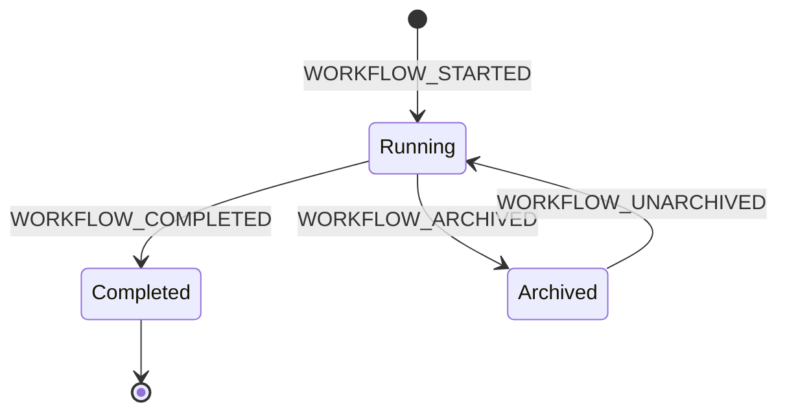
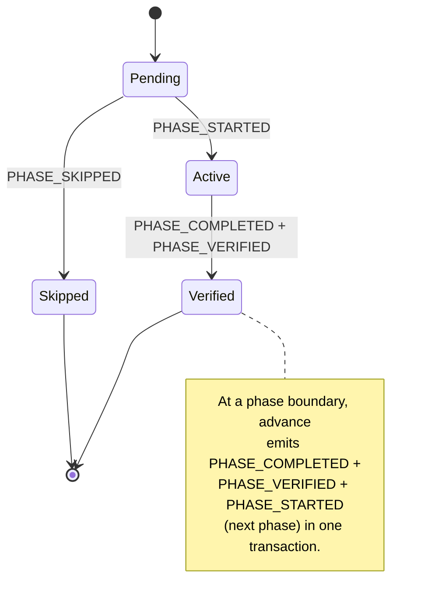
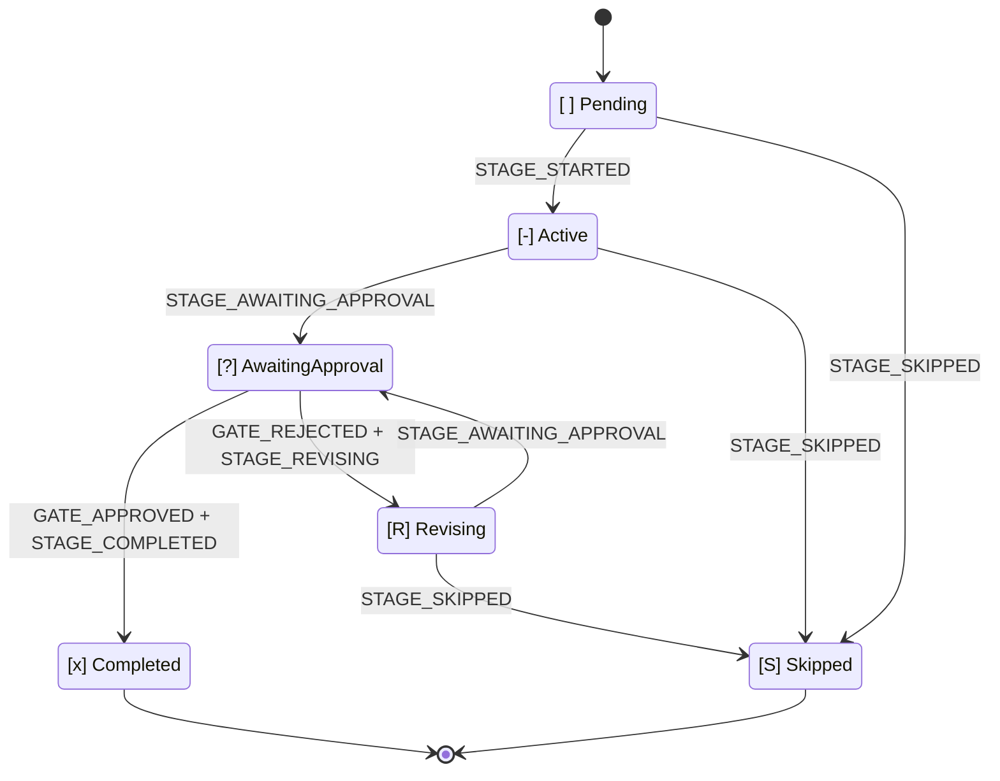

# State Machine

This chapter is the canonical reference for AI-DLC's state machines, the audit-event taxonomy, and the rule that connects them — **every state transition has a tool-owned emitter**. A transition is recorded by its owning mutation path, never duplicated by the conductor. Keeping this chapter's tables in sync with the code is enforced by the drift test at `tests/integration/t48-audit-event-emitters.test.ts`. If the doc and the code disagree, t48 fails.

Three nested state machines drive AI-DLC: **workflow**, **phase**, and **stage**. A fourth, independent stream records **session** events emitted by Claude Code hooks. These four streams share the intent's audit trail (the `audit/` shard dir under its record dir, `<record>/` = `aidlc/spaces/<active-space>/intents/<YYMMDD>-<label>/`) but are owned by different code paths, so it's easiest to read them as separate concerns and remember that their timelines interleave.

> **North-star invariant:** TypeScript owns deterministic bookkeeping; the LLM owns judgment. Every audit emission originates in a tool or hook, keeping LLM prose out of the emit path. If you're reading an MD file and see `aidlc-audit.ts append <EVENT>` as a prose instruction, that is a bug.
>
> **Authority binding:** a query never writes, and a guard never deletes evidence. Authority binds to content and attempt, never to issuance identity or event order. The ["Authority invariants" section](#authority-invariants) states both rules and names what they cover.
>
> **Audit-first atomicity:** tools emit their audit entries *before* mutating state. If audit emission fails, the tool throws before touching state — so `audit.md` and the state file never disagree. The ["Audit-first atomicity" section](#audit-first-atomicity) near the end of this chapter spells out the failure modes, plus the two exceptions: audit-of-intent (`WORKTREE_*`, `AUDIT_*`, `MERGE_DISPATCH_INVOKED`) and the audit-**last** DocumentKB catalog events, whose artifact is derived and rebuildable.

---

## Why three state machines

A workflow completes by passing through phases; a phase completes by passing through its in-scope stages; a stage completes when its approval gate closes. Each layer owns a distinct decision:

- **Workflow** — is the overall job running, or done?
- **Phase** — is this lifecycle phase in progress, verified, or skipped because the scope excluded it?
- **Stage** — is the stage being worked on, waiting on the user, being revised after rejection, or complete?

Flattening them into one state field conflates those decisions. Separating them means `/aidlc --status` can answer "what's blocking this workflow?" in one read: workflow `Running`, phase `Active`, stage `[?]` → "awaiting your approval on \<stage\>".

---

## Workflow machine



<!-- Text fallback: initial state transitions to Running on WORKFLOW_STARTED; Running transitions to Completed on WORKFLOW_COMPLETED; Running transitions to Archived on WORKFLOW_ARCHIVED; Archived transitions back to Running on WORKFLOW_UNARCHIVED; Completed is terminal. -->

**Status values:** `Running`, `Completed`, `Archived`.

A workflow starts when the first intent is created (`aidlc-utility intent-create`, auto-invoked on the first `/aidlc` or via `/aidlc-init`) and ends when the last in-scope stage's approval gate closes. There is no `Paused` status and no `Waiting for Approval` status — approval is a stage-level concern, pause has no UX.

A workflow's `Running` state persists across Claude Code sessions. You start a workflow on Monday, stop the session, resume on Tuesday — the workflow is still `Running`; the *session* ended and a new one started.

| Transition | Trigger | Emitter |
|---|---|---|
| `[*] -> Running` | `aidlc-utility intent-create` | `tools/aidlc-utility.ts` |
| `Running -> Completed` | Final stage outcome reported through `aidlc-orchestrate.ts report` | `tools/aidlc-state.ts` (internal emitter) |
| `Running -> Archived` | `aidlc-utility intent archive <name>` (human decision; refused for completed intents, live Bolt worktrees, and claimed team Units) | `tools/aidlc-utility.ts` |
| `Archived -> Running` | `aidlc-utility intent unarchive <name>` | `tools/aidlc-utility.ts` |

---

## Phase machine



<!-- Text fallback: initial state transitions to Pending; Pending transitions to Active on PHASE_STARTED; Pending transitions to Skipped on PHASE_SKIPPED; Active transitions to Verified on PHASE_COMPLETED + PHASE_VERIFIED. At a phase boundary, advance emits PHASE_COMPLETED + PHASE_VERIFIED + PHASE_STARTED (next phase) atomically, chaining Verified back to the next phase's Pending-to-Active transition. -->

**Status values:** `Pending`, `Active`, `Verified`, `Skipped`.

Phase state is tracked in the `## Phase Progress` section of `aidlc-state.md`. Intent creation seeds the section: `Initialization` lands `Verified` (creation completes every init stage before handing off), the first post-init stage's phase lands `Active`, and each later phase lands `Skipped` when the scope leaves it without EXECUTE stages (one `PHASE_SKIPPED` audit row each) or `Pending` otherwise. Phase completion fires both `PHASE_COMPLETED` and `PHASE_VERIFIED` at the phase boundary, then `PHASE_STARTED` for the next one, and the rows flip in the same state write. The section is display-only: routing reads `Lifecycle Phase` and the Stage Progress checkboxes, and `/aidlc --status` recomputes its phase block live.

| Transition | Trigger | Emitter |
|---|---|---|
| seed (`Verified`/`Active`/`Pending`/`Skipped`) | `aidlc-utility intent-create` | `tools/aidlc-utility.ts` |
| `Active -> Verified` | Stage completion/skip reported through `aidlc-orchestrate.ts` at a phase boundary; forward `aidlc-jump execute` | `tools/aidlc-state.ts` (internal emitter), `tools/aidlc-jump.ts` |
| `Pending -> Active` (boundary) | Engine routes after a reported outcome, or `aidlc-jump execute` | `tools/aidlc-state.ts` (internal emitter), `tools/aidlc-jump.ts` |
| `Pending -> Skipped` (jumped over) | forward `aidlc-jump execute` past a whole phase | `tools/aidlc-jump.ts` |
| `Verified/Active -> Pending` reset | backward `aidlc-jump execute` (reset phases with EXECUTE stages) | `tools/aidlc-jump.ts` |
| `Pending <-> Skipped` re-derivation | `aidlc-utility scope-change` / `recompose` (not-yet-reached rows only) | `tools/aidlc-utility.ts` |

At the init→post-init hand-off, `aidlc-utility intent-create` itself emits `PHASE_COMPLETED + PHASE_VERIFIED + PHASE_STARTED + STAGE_STARTED` after the final init stage so the audit trail captures the transition instead of going silent between creation and the first `advance`.

---

## Stage machine



<!-- Text fallback: [ ] Pending transitions to [-] Active on STAGE_STARTED. [-] Active transitions to [?] AwaitingApproval on STAGE_AWAITING_APPROVAL. [?] AwaitingApproval transitions to [x] Completed on GATE_APPROVED + STAGE_COMPLETED, or to [R] Revising on GATE_REJECTED + STAGE_REVISING. [R] Revising transitions back to [?] AwaitingApproval on STAGE_AWAITING_APPROVAL (re-entry). Any of Pending / Active / Revising can transition to [S] Skipped via STAGE_SKIPPED. -->

**Checkbox legend (in `aidlc-state.md`):**

| Checkbox | State | Meaning |
|---|---|---|
| `[ ]` | `Pending` | Not started |
| `[-]` | `Active` | In progress |
| `[?]` | `AwaitingApproval` | Stage work done, gate open — user is the blocker |
| `[R]` | `Revising` | User rejected the gate — stage is being revised before re-entry |
| `[x]` | `Completed` | Approved and done |
| `[S]` | `Skipped` | Excluded by scope, skipped via jump, or cut mid-flight |

`[?]` and `[R]` disambiguate two situations that would otherwise both look like `[-]`. On resume, `[R]` tells the conductor to present the prior artifact and feedback before re-entering the gate, instead of re-executing the stage from scratch.

At `[?]`, `orchestrate next` first runs the `present-approval-gate` guard
preflight. A refusal still wins. Otherwise it re-presents the current gate as
`run-stage` with `gate_only: true` and `gate: true`, not another execution of
the stage body or reviewer. The directive retains `reviewer`, `review_artifact`,
and `review_class` when they were present. `reviewer` and `review_artifact` name
whose existing review the Review brief reads. Present the brief from the
recorded review file and verdict; dispatch no reviewer and request no new
review. A later Review Override, including `none`, does not erase that brief:
gate re-entry uses the paired review completion from the current attempt and
the settings in effect for that review. Reviews from an earlier attempt do not
create a brief for a reviewless gate. This metadata grants no approval and
does not make edited content reviewed. Reviewer iteration settings and the
`reviewer` and `ensemble` protocol modules are absent; a Construction policy, when present, is marked
`completion_only`.
`gate_only` takes precedence over generic completion-only bookkeeping and does
not grant human approval. Team-owned gates retain `unit` and `unit_gate`;
autonomous swarm settlement retains `swarm_settled` and its completion policy.
The same gate-only shape survives rule-delivery `continue` calls. Repeating
`next` leaves the stage unchanged and follows the normal directive republication
rules.

| Transition | Trigger | Emitter |
|---|---|---|
| `Pending → Active` | Engine routes after the previous reported outcome | `tools/aidlc-state.ts` (internal emitter) |
| `Active → AwaitingApproval` | `aidlc-orchestrate.ts report --stage <slug> --result awaiting-approval`; reviewer-bearing stages require a fresh terminal receipt before gate opening | `tools/aidlc-state.ts` (internal emitter) |
| `AwaitingApproval → Completed` | `aidlc-orchestrate.ts report --stage <slug> --result approved --user-input "<exact choice>"` | `tools/aidlc-state.ts` (internal emitter) |
| `AwaitingApproval → Revising` | `aidlc-orchestrate.ts report --stage <slug> --result rejected --user-input <text>` | `tools/aidlc-state.ts` (internal emitter) |
| `Active → Revising` | The same rejected report when gate-open recovery is needed | `tools/aidlc-state.ts` (internal emitter) |
| `Revising → AwaitingApproval` | `aidlc-orchestrate.ts report --stage <slug> --result revised`; reviewer-bearing stages require a fresh post-rejection terminal receipt before gate re-entry | `tools/aidlc-state.ts` (internal emitter) |
| `{Active,Revising} → Skipped` | `aidlc-orchestrate.ts report --stage <slug> --result skipped --reason <text>` | `tools/aidlc-state.ts` (internal routed-skip emitter) |
| `Pending → Skipped` | Scope composition or `aidlc-jump execute` | `tools/aidlc-utility.ts`, `tools/aidlc-jump.ts` |

The `approved` report owns the full post-gate transition: it emits
`GATE_APPROVED + STAGE_COMPLETED`, then routes to the next in-scope stage,
emitting `STAGE_STARTED` plus any `PHASE_*` events at boundaries. On the final
in-scope stage it emits `PHASE_COMPLETED + PHASE_VERIFIED +
WORKFLOW_COMPLETED` and sets Status=Completed. The conductor does not call
state lifecycle verbs before or after reporting.

**Routed skip.** `report --result skipped` is accepted only on the main
workflow with an explicit nonblank `--stage` and `--reason`, when the named
stage is declared `execution: CONDITIONAL`, equals `Current Stage`, and is
Active or Revising. It runs before
artifact, per-unit, and ensemble-evidence guards because a justified skip owes
no completion evidence. The engine invokes the internal skip transition with
its routing marker: the transaction preserves `[S]`, emits exactly one
`STAGE_SKIPPED`, never emits `STAGE_COMPLETED`, and either starts the next
stage (including boundary events) or completes the workflow. If onward routing
fails, recovery leaves the skipped marker and cursor at the same stage so the
route can be retried without duplicating the skip event. `report --single
--result skipped` is rejected.

**Artifact guard (issue #366).** Every report outcome that marks a stage `[x]`
runs a deterministic artifact check before completing it, so a stage cannot be
marked complete without evidence of work on disk. A stage that declares
`produces[]` must have at least one of those artifacts present under the active
intent's record dir or its per-unit Construction directories. A codekb stage
is stricter: every registered repository directory must contain the full
declared `produces[]` set; single/unrecorded intents use the one resolved
codekb directory. `workspace_requires: true` also requires source-work evidence
outside `aidlc/` and the harness dir. A failure writes nothing. Optional outputs
do not participate. For `produces_kinds`, units whose kind prunes the required
set to zero owe no artifact; any applicable unit remains strict. Bypass with
`AIDLC_SKIP_ARTIFACT_GUARD=1`. The same switch also bypasses the review logger's
required-output existence check; without it, a stage-level review of a
per-Unit stage requires every authoritative Unit's applicable required outputs.
When no authored Unit DAG exists but the current attempt has merged Bolt rows,
the stage-level review fingerprint instead enumerates exactly those merged
Units. A Bolt merge is proven, not asserted: `aidlc-bolt complete --merge`
emits `BOLT_COMPLETED` before the state and audit merges run, so a slug-backed
(worktree) attempt counts as merged only once a matching later `AUDIT_MERGED`
receipt confirms the merge sequence landed on main; a name-only, non-worktree
Bolt's `BOLT_COMPLETED` remains terminal. A completion still awaiting merge
evidence stays on the open path, a slugless completion cannot close a
slug-backed attempt, and a later fragment-cleanup `BOLT_FAILED` cannot erase a
confirmed merge. `AUDIT_MERGED` itself carries no reviewer authority: a
same-second row in another audit shard never makes a review request, verdict,
or receipt ambiguous. An open Bolt remains on the ordinary stage-level fallback
path because
its Unit artifacts still live outside the main tree. Merging that Bolt changes
the fingerprint domain and intentionally invalidates an earlier stage-level
receipt until its exact pending ordinal is rebound with `--retry-pending`.
Per-Unit receipt filtering still recognizes both open and merged Units. A Unit
may belong to both sets when an older attempt merged while a newer attempt
remains open; merged membership drives gate demand and stage-level
fingerprinting, while the union drives receipt filtering.

**Reviewer gate guard (issue #551).** A reviewer-bearing stage cannot enter
`AwaitingApproval` through `gate-start` or `revise` until its configured
reviewer has a fresh terminal `REVIEW_COMPLETED` receipt. The same receipt
remains mandatory on all four completion paths. Re-reporting an already-open
gate re-runs these guards without writing a duplicate transition. A rejection
reported directly from `Active` moves to `Revising` without fabricating a
`STAGE_AWAITING_APPROVAL` row. Synthetic transition tests that deliberately
isolate another guard may set
`AIDLC_SKIP_REVIEWER_GATE_GUARD=1`; this bypass applies only to gate opening,
never to `approve`, `advance`, `finalize`, or `complete-workflow`. The adjacent
summary-confirmation test bypass is
`AIDLC_SKIP_SUMMARY_CONFIRMATION_GUARD=1`.

**Summary inputs and reviewed outputs.** When a stage declares
`summary_confirmation` (`required` or `if-present`), declared artifact names
ending in `-questions` are writable human inputs. A file's review manifest entry
is `summary-input:sha256:<digest>`, computed by `summaryInputReviewFingerprint`:
after normalizing line endings, it masks only the canonical summary-confirmation
`[Answer]:` value that is blank, `Looks correct`, or `Request changes`.
Trailing HTML comments are retained, and answer-looking text inside code
examples or comments is never masked.
There must be exactly one confirmation section and one matching answer line;
an absent or ambiguous match leaves the full normalized content bound. All
other question answers, summary prose, comments, and sections remain bound.
`missing` and `not-file` remain distinct manifest entries. Required-file
presence and safe capture checks still apply, and snapshots retain the actual
question bytes for swarm record merging.

The review-freeze hook permits these question writes so the human Q&A protocol
can proceed. Only confirmation bookkeeping preserves the review fingerprint;
substantive changes invalidate the review's content binding. Other produced
artifacts remain bound to their reviewed bytes and protected by the
terminal-receipt freeze. An explicit `review_artifact` naming a questions
artifact is the exception: that artifact remains fully byte-bound and frozen,
including its confirmation answer.

Reconfirming identical content in the same attempt preserves the summary
authorization and does not require rewriting already-authorized outputs.
A gate rejection alone also preserves that authorization and the outputs'
descent; review receipts still follow their own rejection boundary. A
`Request changes` answer at the summary checkpoint withdraws the active
summary authorization.
Changed confirmed content still requires the normal recovery sequence: obtain
the human's confirmation, regenerate or re-save outputs under that authorization,
and obtain the required fresh review. Use the offered lifecycle remedy to reopen
frozen outputs; editing a questions file does not authorize editing those outputs
or approve a plan. Existing Change Control rules continue to govern eligible
drift separately.

Terminal review recording rechecks current summary confirmation and output
admission, as review requests do. A matching fingerprint alone cannot certify
a review after the human withdrew confirmation or while outputs lack the
required authorization. For `if-present`, once a summary-confirmation decision
or confirmation has participated in the current attempt, deleting the questions
file does not remove that obligation: the missing-file check refuses.

This changes the review fingerprint projection, not the receipt format. Existing
receipts using an older question fingerprint projection may no longer match and
may require a fresh review through normal guard recovery. Stored evidence is not rewritten;
the migration grants no approval or extra review allowance.

**Ensemble evidence gate.** On a `mob` or `subagent`-with-supports stage, the
report path refuses `awaiting-approval`, `revised`, and `approved` while a
declared support agent's contribution file
(`<stage>/contributions/<agent-slug>.md`) is missing or lacks its
`**Collaborator:**` identity-marker first line — the deterministic proof the
ensemble actually convened. A settled autonomous swarm is exempt (its per-unit
convergence ledger is the evidence); `report --single` checks stage-level
evidence only. On `mode: pipeline`, the same report outcomes and every direct
completing transition require an ordered, current-attempt
`PIPELINE_LINK_COMPLETED` receipt for every lead/support link. Multi-repo
reverse engineering requires a complete chain per scanned repo; a current-attempt
repo-scoped `ARTIFACT_REUSED` row with `Decision=keep` exempts a reused repo.
Isolated rows carry `Workflow: single-stage:<slug>` and are accepted only while
the complete graph-declared Reverse Engineering artifact set remains valid and
the store remains `CURRENT`;
while `modify`/`redo` rows do not. A rejection, jump, or later stage start resets
the main-workflow evidence, and isolated `--single` link rows never satisfy it. Bypass with
`AIDLC_DISABLE_ENSEMBLE_EVIDENCE=1`, intended only for recovering a
legitimately-run stage whose contribution files or in-flight link receipts were
lost.

**Source freshness and per-unit attribution (#629/#646/#662).** On a
`workspace_requires` stage, every terminal review still carries the workspace-
global `Source Fingerprint`; the newest modern binding is normally the outer
post-review-mutation boundary on all four completion routes. Per-unit receipts
add `Unit Source Fingerprint`, which binds the raw bytes of the unit's strict
`source-manifest.json` and the current content of every exact/directory claim.
Receipts are evaluated newest-first, so a newer validated claimant may shield
an older receipt for an intentional shared path. An uncovered edit, deletion,
or new path in an exact/directory claim invalidates only the owning unit and
enters that unit's one bounded `stale-receipt` recovery.

`WORKFLOW_STARTED`, `STAGE_JUMPED`, and a `workspace_requires`
`STAGE_STARTED` record content-addressed source-listing baselines. After every
applicable unit has fresh modern evidence, completion compares baseline to the
current listing and refuses any changed application-source path outside the
fresh claims union. Unit-major Construction always uses the workflow/jump
boundary because source work can precede its late `STAGE_STARTED`. Equal-second
cross-shard rows that would decide a boundary or newest claimant fail closed
instead of trusting shard filename order.

A rejection resets review and run-floor accounting but never replaces that
completion baseline: otherwise any unclaimed path present at rejection would be
grandfathered into the next attempt. When the prior attempt has a validated
`SWARM_SOURCE_MERGED` chain, `GATE_REJECTED` carries only its final
`Prior Accepted Source Fingerprint`. The next attempt's first source merge must
start from that aggregate, while completion continues to compare against the
original stage-entry baseline.

There is one narrowly bounded reconciliation of the global boundary: if an
unclaimed baseline change — addition, modification, or deletion — is fully
reverted, completion may proceed only when the effective baseline snapshot is
present and valid, every applicable unit still has a fresh modern unit binding,
and the baseline-to-current delta contains zero unclaimed paths. This proves
that the transient unclaimed change is gone. Any ordinary post-review edit,
stale or legacy unit binding, missing evidence, or remaining unclaimed delta
still takes the normal global-first refusal path.

The fingerprint and canonical per-path listing come from one bounded filesystem
walk, independent of repository metadata and Git executable availability.
Ordinary and ignored application bytes, external source-symlink targets, and
workspace-roof files remain bound. Framework state, exact sensor caches, VCS
metadata, dependency/cache directories or symlinks, and unregistered
`build/`, `coverage/`, `dist/`, `logs/`, `target/`, and `tmp/` directories or
symlinks remain outside the source boundary.

Real source beneath a conditional generated-output directory, including binary
or extensionless source, can be declared in root `.aidlc-source-paths.json`:

```json
{"version":1,"paths":["dist/worker.js","build/source"]}
```

Registered paths are content-bound regardless of encoding and are included in
the canonical listing and autonomous swarm Source Commit. Absolute, traversing,
framework, sensor-cache, and dependency/cache paths are rejected. Missing
registered repositories contribute an explicit marker; unreadable, unstable,
over-budget, or malformed boundaries remain `unbindable` and fail closed.

Migration is deliberate: a pre-upgrade workflow with no baseline skips the
unclaimed check, and a fieldless per-unit receipt retains the #629 global
policy. A present but `unbindable`, missing, or corrupt modern baseline/unit
snapshot fails closed. `AIDLC_SKIP_SOURCE_FRESHNESS=1` bypasses both global and
per-unit checks; missing/invalid-manifest receipts explicitly record
`Unit Source Binding Bypass: true`, so the switch must be present again at
completion. In a modern Bolt, finalize also verifies the attested base-to-
worktree footprint is a subset of the reviewed manifest claims before the
settled-swarm stage-level exemption applies.

Swarm footprint verification and immutable Source Commit creation apply the
same boundary. Clean-filter raw-byte replacement is restricted to exact
filesystem-included regular paths, so excluded generated or framework files
cannot re-enter after shaping. New-submodule recovery shares one 30-second
cumulative deadline and a 32-proof cap across the entire `finalize` call, in
addition to the per-command, ref-count, refspec-size, recursion, and
materialized-checkout bounds. `AIDLC_SKIP_SOURCE_FRESHNESS=1` disables the
check; a bypassed finalize records `Source Freshness Bypass: true`, and merge
must repeat the same switch.

**Gate-revision backstop.** If the conductor revises an artifact at an open
gate without first reporting rejection, the `approved` report reconciles the
missing `GATE_REJECTED` + `STAGE_REVISING` pair before completion when audit
evidence proves a post-gate human turn followed by an artifact write. The
backfilled rows carry `Recovered: true`; reviewer writes before the human turn
do not count. Reviewer-bearing stages persist `[R]` after that recovered
rejection and require a fresh review plus the normal `revised` report before
the gate can reopen. Bypass with `AIDLC_SKIP_REVISION_BACKSTOP=1`.

**Archive (issue #980).** `aidlc-utility intent archive <name> [--reason <text>]` retires an in-flight intent the team will not finish. Under the workspace lock it emits `WORKFLOW_ARCHIVED` into that intent's own audit shard first, then flips the state file's `Status` to `Archived` and the `intents.json` row to `archived`; the record dir, its artifacts, and its audit shards are never moved or deleted. A subsequent `next` on that record (a stale per-user cursor or session binding) emits a terminal `done` naming `intent unarchive`, so retired stages never resume by accident; `park` refuses an archived workflow the same way it refuses a completed one. Archiving is refused for a completed intent (already terminal), an intent with Bolt worktrees still in flight, and a team-owned intent with claimed Units. `intent unarchive <name>` reverses the two field writes and emits `WORKFLOW_UNARCHIVED`. The default `intent` listing hides archived rows (`--all` shows them; `--json` always carries every row), the creation gate ignores them, and the lone-record fallback never resolves one implicitly.

**Park (issue #365/#367).** `aidlc-orchestrate park` writes a `Parked` / `Parked At Stage` runtime marker (via `aidlc-state.ts park`, which emits `WORKFLOW_PARKED`) without advancing any stage; a subsequent plain `next` re-emits a terminal `parked` directive and the Stop hook lets the turn end, so a long workflow can pause across sessions instead of rubber-stamping the remaining stages to reach `done`. `/aidlc --resume` clears the marker (`unpark` emits `WORKFLOW_UNPARKED`) before continuing. An unattended autonomous Construction run (`Construction Autonomy Mode: autonomous`) refuses to park: both the tool and the Stop hook's `parked` allow decline under autonomous mode, so the loop keeps moving with no human to resume it.

### Revision loop

```
report awaiting-approval  →  [?] AwaitingApproval
          ↘ report rejected  →  [R] Revising  (Revision Count += 1)
                   ↓ report revised
                   [?] AwaitingApproval
                   ↘ report approved  →  [x] Completed
```

`Revision Count` lives in the state file and increments on each rejected
report. The conductor uses this to detect the revision-loop escape hatch
(default is 3 cycles before offering to skip).

When a revision changes a reviewed output or bound question content on a stage whose directive
carries a reviewer, the conductor re-runs the `stage-protocol-reviewer.md` §12a step before
reporting `revised` (stage-protocol Part 0). The engine verifies the fresh
terminal receipt before accepting the `revised` report and re-opening the gate.

---

## Session stream (hook-owned, independent)

Session events are emitted by Claude Code hooks, not by AI-DLC tools. A session is a single Claude Code conversation; a workflow is a long-lived directory state. The relationship is many-to-many — one workflow can span multiple sessions, one session can touch multiple workflows — so the streams are independent by design.

| Event | Emitter | Trigger |
|---|---|---|
| `SESSION_STARTED` | `hooks/aidlc-session-start.ts` | `SessionStart` with `source=startup` or `clear` |
| `SESSION_RESUMED` | `hooks/aidlc-session-start.ts` | `SessionStart` with `source=resume` |
| `SESSION_COMPACTED` | `hooks/aidlc-validate-state.ts` | `PreCompact` — fires at compaction time so it's captured reliably |
| `SESSION_ENDED` | `hooks/aidlc-session-end.ts` | `SessionEnd` |

Session hooks check for the active intent's `aidlc-state.md` (under `aidlc/spaces/<space>/intents/<YYMMDD>-<label>/`) before emitting. If no such file exists (no active AI-DLC workflow in the cwd), the hook exits silently without writing to any audit log. Session events exist to annotate an active workflow's timeline — a session in a directory with no workflow has nothing to annotate.

### Compaction awareness

`aidlc-state.ts resume` scans the audit tail for the latest `SESSION_COMPACTED`. If no stage activity (`STAGE_STARTED`, `STAGE_COMPLETED`, `GATE_APPROVED`, `SESSION_RESUMED`, `RECOVERY_COMPLETED`) follows it, resume returns `compaction_pending: true` and the conductor surfaces a three-option prompt (continue / review / restart) before proceeding. `RECOVERY_COMPLETED` is emitted by `acknowledge-compaction` once the user picks an option, satisfying the activity gate so subsequent compactions detect a fresh boundary.

---

## Audit event taxonomy

**105 events**, grouped below into 20 categories (the canonical `audit-format.md` registry splits the same 105 into 25 - the grouping is presentational, the event set is the invariant). Each event's permitted tool or hook emitters are listed below. `GUARD_POLICY_SET` has distinct mutation and effective-memory-observation paths; neither duplicates the other's emission. Events pre-registered for an upcoming release have an Emitter cell reading `Reserved (v0.4.0 PR N)`, `Reserved (v0.5.0 PR N)`, or `Reserved (v0.6.0 PR N)`, and a retired event name that is still read but never written reads `Reserved (retired name)`; both are skipped by the drift test's forward check. The drift test `tests/integration/t48-audit-event-emitters.test.ts` enforces forward/reverse/tertiary/pairing/MD-MD consistency between this chapter's tables and the code.

### Workflow lifecycle

| Event | Emitter | Notes |
|---|---|---|
| `WORKFLOW_STARTED` | `tools/aidlc-utility.ts` | Mandatory first event on every intent creation |
| `WORKFLOW_COMPLETED` | `tools/aidlc-state.ts` |  |
| `WORKFLOW_PARKED` | `tools/aidlc-state.ts` | `park` - workflow parked mid-flow for a later session; no stage advanced |
| `WORKFLOW_UNPARKED` | `tools/aidlc-state.ts` | `unpark` - park marker cleared on explicit `--resume` re-entry |
| `WORKFLOW_ARCHIVED` | `tools/aidlc-utility.ts` | `intent archive <name>` - intent retired to `Archived` / `archived`; record and audit shards preserved; written to that intent's own shard |
| `WORKFLOW_UNARCHIVED` | `tools/aidlc-utility.ts` | `intent unarchive <name>` - archived intent returned to `Running` / `in-flight` |

### Phase lifecycle

| Event | Emitter | Notes |
|---|---|---|
| `PHASE_STARTED` | `tools/aidlc-utility.ts`, `tools/aidlc-state.ts`, `tools/aidlc-jump.ts` | First fire in init; subsequent fires at stage-tool phase boundaries |
| `PHASE_COMPLETED` | `tools/aidlc-utility.ts`, `tools/aidlc-state.ts`, `tools/aidlc-jump.ts` | Paired with `PHASE_VERIFIED` at every boundary |
| `PHASE_VERIFIED` | `tools/aidlc-utility.ts`, `tools/aidlc-state.ts`, `tools/aidlc-jump.ts` | Always paired with `PHASE_COMPLETED` |
| `PHASE_SKIPPED` | `tools/aidlc-utility.ts` | One per scope-excluded phase, emitted at intent creation |

### Stage lifecycle

| Event | Emitter | Notes |
|---|---|---|
| `STAGE_STARTED` | `tools/aidlc-state.ts`, `tools/aidlc-utility.ts`, `tools/aidlc-jump.ts`, `tools/aidlc-orchestrate.ts` | Internal route marks `[ ]` → `[-]`; isolated `next --single` rows carry `Workflow=single-stage:<slug>` and `Scope`, so completion uses that attempt's summary-confirmation policy rather than the main workflow's. Legacy isolated rows without Scope retain confirmation-on behavior. |
| `STAGE_AWAITING_APPROVAL` | `tools/aidlc-state.ts` | Internal emitter for `report --result awaiting-approval` / `revised`; recovered rows carry `Recovered=true`; an authorized blocking-sensor override records sensor ids, optional detail paths, and evaluation reasons |
| `STAGE_COMPLETED` | `tools/aidlc-state.ts`, `tools/aidlc-utility.ts` | Internal emitter for a completed/approved report; never paired with a skipped report |
| `STAGE_REVISING` | `tools/aidlc-state.ts` | Internal emitter paired with `GATE_REJECTED` after a rejected report |
| `STAGE_SKIPPED` | `tools/aidlc-state.ts`, `tools/aidlc-jump.ts` | Exactly one per `[S]` transition; the main-workflow report path routes onward atomically |
| `STAGE_JUMPED` | `tools/aidlc-jump.ts` | Records the destination slug on `--stage`/`--phase` jump. Backward jumps also bind the concrete changed upstream artifact paths and the downstream artifact/review paths invalidated by the reset. |

### Gate decisions

| Event | Emitter | Notes |
|---|---|---|
| `GATE_APPROVED` | `tools/aidlc-state.ts`, `tools/aidlc-unit.ts gate` | `--user-input` captures the exact choice. On reviewer-backed gates, the same atomic row stores content-addressed `Accepted risk` dispositions for every current open finding. Unit merge gates also bind Pinned OID, Attempt Generation, Strategy, and Target branch. |
| `GATE_REJECTED` | `tools/aidlc-state.ts`, `tools/aidlc-unit.ts gate` | `--feedback` captures the rejection reason. Explicit `--reject-finding <review-artifact>#R-NN=<reason>` values store content-addressed `Rejected: <reason>` dispositions; generic revision feedback does not reject a finding. Unit merge gates bind the same pinned transaction fields. |

Under `Unit Ownership: team`, these rows additionally carry `Unit`, `Gate
Scope`, and `Gate Stages`. Per-stage approval settles only that `(stage, Unit)`;
unit-end approval settles the Unit chain. A Unit-tagged rejection floors
lifecycle and review receipts only for that Unit (all Gate Stages for unit-end);
legacy Unit-less rows retain stage-global behavior.

### User interaction

| Event | Emitter | Notes |
|---|---|---|
| `DECISION_RECORDED` | `tools/aidlc-log.ts` | Fires before a non-gate `AskUserQuestion` so options are captured |
| `QUESTION_ANSWERED` | `tools/aidlc-log.ts` | Fires after a non-gate question response; approval choices are lifecycle events owned by `report` |
| `SUMMARY_CONFIRMATION_RECORDED` | `tools/aidlc-log.ts` | Human-backed consolidated-summary receipt; new rows carry `Hash Scope: confirmed-content-v1`, which preserves the canonical order of the preamble and all visible Q<n> and feedback sections, including follow-up questions after an assumption decision. Exactly one post-summary `Assumption Confirmation` section and its contents are excluded; a same-named pre-summary section remains hashed. Any other visible Markdown or raw-HTML heading after the summary fails closed. Stage-specific pre-summary headings remain valid. Unscoped receipts retain legacy whole-file verification and need reconfirmation after an allowed append. A `Looks correct` receipt also carries `Summary Authorization Id`, the authorization the confirmation minted (a digest of the attempt, stage, Unit, workflow, questions path, confirmed content, and choice); the same id becomes the scope's active authorization under `<record>/.aidlc-engine/summary-authorization/`, and a `Request changes` reply withdraws it. Reserved from public audit append. |
| `VERIFICATION_COMMAND_RECORDED` | `tools/aidlc-log.ts` | Human-approved project check command for the current intent workflow. Binds `Checkpoint: Construction Verification Command`, the canonical single-line command's `Command SHA-256`, the full canonical `Command Label` (at most 1024 control-free characters), and exact `User Input: Approve` to the matching pending decision's one-shot challenge and offered choice from the invoking `Session`. Unrelated human turns and cross-session responses cannot authorize it. The typed state setter and Unit verification require the latest receipt; changing the command requires a new receipt and re-verification. Reserved from public audit append and worktree audit merge. |
| `CONSTRUCTION_POLICY_RECORDED` | `tools/aidlc-log.ts` | Human-approved Construction policy change bound to the invoking `Session`, `Field` (Construction Checkpoints, Execution, or Iteration), `Value`, and exact `User Input: Approve`. The pending decision's one-shot challenge binds field and value; the hook records the offered choice. During Construction, the typed setter requires the latest unambiguous current-workflow receipt for that field, matching the new value; applying it spends the receipt. A later proposal supersedes it. Other gate answers and unrelated human turns are not consent. Outside Construction the setters retain their existing behavior. Reserved from public audit append and worktree audit merge. |
| `CHECKPOINT_VERIFICATION_RECORDED` | `tools/aidlc-construction-checkpoints.ts` | Emitted by `verifyConstructionCheckpoint` under the audit lock after the command's final proof is written. Carries `Unit`, `Kind`, last `Stage`, `Stages`, `Verification Id`, `Fingerprint`, `Command SHA-256`, `Exit Code`, `Verified`, `Run floor`, and claim-attempt fields. Verification requires the latest current-attempt receipt to match the proof id, evidence fingerprint, authorized command digest, and current run floor with `Verified: true`; hand-written proof JSON cannot authorize approval. Reserved from public audit append and worktree audit merge. |
| `PLAN_APPROVAL_RECORDED` | `tools/aidlc-log.ts` | Human-backed Code Generation plan receipt. The authority it records binds to intent, stage or Unit target, stage attempt (run floor), content fingerprint (the projected plan and instructions plus the Testing Contract hash), prompt (the questions file with answers blanked), and session response, never to the identity of the directive that presented the question nor to row order. The row also carries the directive epoch and the raw questions-file digest (`Questions SHA-256`) as provenance; both are recorded and never compared, so a note appended to the questions file after approval leaves the decision standing while a change to the prompt the human saw retires it. Protected runtime state is the authority; this row is provenance only. |
| `PLAN_APPROVAL_OVERRIDDEN` | `tools/aidlc-log.ts` | The human-only break-glass exit for Plan Approval. Fires only when the human typed `Override Plan Approval: <reason>` as a prompt (the human-turn hook records that typed text under the session; a picked option never does), the conductor ran `answer --checkpoint plan-approval --override "<reason>"` with the same reason, and the normal receipt path refused. Carries `Reason`, `Failed Checks` (what the normal path refused), `Session`, `Unit` or `stage-level`, and `Fingerprint`; the paired `PLAN_APPROVAL_RECORDED` row carries `Override: yes`. The receipt it accompanies binds to plan content and stage attempt only, so no later check compares its source. The break-glass response is single-use and the conductor never proposes or initiates it |
| `REVIEW_REQUESTED` | `tools/aidlc-log.ts` | Fires when the conductor dispatches the reviewer defined by `stage-protocol-reviewer.md` §12a. The stage's required `review_artifact` scalar names the Markdown output the review is about; plugin-added outputs and produces ordering cannot change it. A new `--unit` request must name a member of the authoritative DAG or a Unit proven by a matching open or merge-confirmed tool-owned Bolt attempt in the current no-DAG attempt; a completion still awaiting its `AUDIT_MERGED` merge evidence, like a historyless Unit, refuses. A single stable file-identity snapshot captures the declared artifacts and binds the reviewed output bytes (`Artifact Fingerprint`) and the request-time workspace source for `workspace_requires` stages; summary-owned questions use the `summary-input:sha256:<digest>` projection described above, masking only the canonical confirmation answer unless explicitly named by `review_artifact`; the row mints a `Request Id` that the completion row and the review record echo. The command's JSON returns `requestId` and `reviewFile`, the slot under `<record>/.aidlc-engine/reviews/` where the reviewer writes its review; the request opens that slot, removing a draft an earlier incomplete dispatch of the same iteration left. It also returns `recordVerdict`, the same command with `--verdict <READY|NOT-READY>` added, which is what records the terminal receipt. `--retry-pending` re-issues one unmatched request with the original binding and request id when the artifacts and source still match; a request recorded before request ids or source binding gains them through that one retry, marked `Upgrade: legacy-request`. Rows written under the retired appendix protocol also carry `Review Appendix Artifact`, `Review Appendix Offset`, `Review Appendix Prior Digest`, `Review Appendix Prior Length`, and `Review Challenge`; they stay readable and a completion of such a request echoes them unchanged. |
| `REVIEW_COMPLETED` | `tools/aidlc-log.ts` | Fires only after a matching positive-iteration request and a fresh check of current summary confirmation and output admission. One coherent artifact snapshot must reproduce the request's review fingerprint, including exact reviewed output bytes and the summary-input projection above: the reviewer writes no artifact, so `Request Fingerprint` and `Artifact Fingerprint` are the same identity. The review is read from the request's review file (or `--review-file`), validated with Bun's Markdown parser (one rendered Verdict matching `--verdict`, one Reviewer, one Iteration, no later Markdown or raw-HTML H1/H2; literal examples in fenced/inline code and HTML comments carry no authority, while list/blockquote/table containers cannot mint ownership), and written as the review record `<record>/.aidlc-engine/reviews/<stage>/stage/<attempt>/<iteration>.json` or `<record>/.aidlc-engine/reviews/<stage>/units/<unit>/<attempt>/<iteration>.json` in the same locked transaction; the row names it (`Review Record`) and pins its bytes (`Review Record Digest`), and echoes the `Request Id`. Request-time and completion source fingerprints use the same Git-independent bounded filesystem identity and must match. Deprecated for this release cycle: a verdict is still accepted from a terminal `## Review` section a reviewer appended to `review_artifact` after the request (the bytes before it are the requested bytes and the request saw no appendix); that validated section is copied into the review record. A retried incomplete review may record `NOT-READY` with an empty review record. A malformed row is ignored and does not consume its pending request. |
| `PIPELINE_LINK_COMPLETED` | `tools/aidlc-log.ts` | Fires after one declared pipeline link returns. Carries `Stage`, `Link`, and `Position k/N`; multi-repo chains also carry `Repo`, and isolated runs carry `Workflow=single-stage:<slug>`. The tool refuses undeclared, duplicate, or out-of-order links within that receipt scope. Main-workflow gate-start, approval, advance, finalize, and workflow completion ignore isolated rows and require every scanned-repo current-attempt link receipt. |

### Unit lifecycle (inline per-unit Construction stages)

| Event | Emitter | Notes |
|---|---|---|
| `UNIT_STARTED` | `tools/aidlc-state.ts` | `unit start` — requires the exact stage/Unit pair currently routed by the engine, a safe Unit identifier from the authoritative DAG (including safe legacy spellings), and no other open Unit |
| `UNIT_PAUSED` | `tools/aidlc-state.ts` | `unit pause` — requires `--reason` and `--next-action`; the engine routes the paused unit first and hard-stops until an explicit resume |
| `UNIT_RESUMED` | `tools/aidlc-state.ts` | `unit resume` — only the currently-paused unit can resume |
| `UNIT_COMPLETED` | `tools/aidlc-state.ts` | Serial `unit complete` verifies the active unit's required artifacts. Wave `unit complete --wave` instead verifies the engine still exposes that entry as build-complete/review-settled, copies any new Unit diary entries into the parent diary with deterministic markers (leaving an absent parent diary absent when there are no new entries), binds the receipt to the final artifact fingerprint, then commits without opening a single-active checkpoint. All lifecycle rows carry an exact boundary-event/timestamp/ordinal `Run floor` (or a fail-closed cross-shard ambiguity token); receipt mode stays enabled across attempts, so stale, changed, ambiguous, reopened, or not-yet-fanned-in Units block the gate until they complete again. |
| `UNIT_MERGED` | `tools/aidlc-state.ts` | Main landed the pinned candidate content, received the team's audit shard, and folded this Unit's derived row. Fields bind the row to Unit, owner, pinned candidate OID, merge commit OID, and attempt generation. |

Team-owned unit-major runs add a derived `## Unit Progress` table to state. The
engine rewrites it from these receipts, artifacts, reviews, Unit gate rows, and
`UNIT_MERGED` receipts on each `next`; it is not an authority and manual cells
are ignored. Once a pinned merge transaction or `UNIT_MERGED` receipt exists, a
`merged` column prevents the per-unit block from settling until every merge-bound
row has landed. Claims alone retain the increment-2 projection without this
column.

### Scope and configuration

| Event | Emitter | Notes |
|---|---|---|
| `SCOPE_DETECTED` | `tools/aidlc-utility.ts` | `detect-scope` subcommand; `Source` field records provenance (freeform / keyword / env / cli) |
| `SCOPE_CHANGED` | `tools/aidlc-utility.ts` | `scope-change` subcommand on active workflow |
| `PLUGIN_SELECTION_CHANGED` | `tools/aidlc-utility.ts` | `select-plugins` set-mode; fields: `Previous Selection`, `New Selection` |
| `DEPTH_CHANGED` | `tools/aidlc-guard-switch.ts` | `config set depth <value>` / `config-change --depth` |
| `TEST_STRATEGY_CHANGED` | `tools/aidlc-guard-switch.ts` | `config set test-strategy <value>` / `config-change --test-strategy` |
| `UNIT_OWNERSHIP_SET` | `tools/aidlc-state.ts` | `set-unit-ownership team|solo`; team requires unit-major |
| `UNIT_GATE_RHYTHM_SET` | `tools/aidlc-state.ts` | `set-unit-gate-rhythm per-stage|unit-end`; team mode only |
| `REVIEW_CLASS_CHANGED` | `tools/aidlc-guard-switch.ts`, `tools/aidlc-utility.ts` | `config set review <value>` / `config-change --review` / a combined `scope-change --review` set or cleared the per-run review override |
| `RECOMPOSED` | `tools/aidlc-utility.ts` | `recompose` subcommand - the adaptive composer's in-flight plan re-shape (pending-stage suffix flips under the audit lock) |
| `GUARD_POLICY_SET` | `tools/aidlc-guard-switch.ts`, `tools/aidlc-lib.ts` | The utility applier builds a row for `config-change --guard-policy <strict\|relaxed\|off>` or a changed scope-owned default in `scope-change`; lib's `appendGuardPolicySetRow` (through `governedGuardPolicy`) records an effective memory-layer change observed at a governed checkpoint. Fields: `Old Value`, `New Value`, `Source` (`you`, `scope <name>`, `<layer>.md`). Utility rows use the previously persisted intent value for `Old Value` (raw text if invalid; `strict` if absent), not the memory-effective value; checkpoint rows retain effective old/new values. |
| `CHANGE_CONTROL_SET` | `Reserved (retired name)` | The name `GUARD_POLICY_SET` replaced. Written by releases before the rename and still read as the same setting history; no shipped emitter writes it. Same fields: `Old Value`, `New Value`, `Source` |
| `CHANGE_ACCEPTED` | `tools/aidlc-lib.ts` | A governed checkpoint (plan-approval source drift, review-receipt content change, summary-confirmation authorization) accepted an input change under `relaxed` or `off` and continued. Fields: `Stage`, optional `Unit`, `Checkpoint`, `Changed`, `Recorded`, `Current`, `Details` (the one line the human hears). One row per distinct change; the same values never produce a second row |
| `GUARD_RESTORED` | `tools/aidlc-guard-switch.ts` | `config-change --guard.<fence> on` switched a fence back on for this piece of work after a per-work `off` or forced it on above a policy word that lowers it. Fields: `Guard` (the switchable fence), `Scope`, `Source` (`you`). The matching `off` writes `GUARD_DISABLED` |
| `CEREMONY_SET` | `tools/aidlc-guard-switch.ts` | The shared `config-change` / `scope-change` applier builds changed-setting rows, appended in the same audit batch as the other settings and any scope event. Fields: `Key` (`sensors`, `learnings`, `summary_confirmation`), `Old`, `New`, `Source` (`you` for an explicit set, `scope <name>` for an inherited default); `Old` is the previously saved value (raw text if invalid; scope default if absent), not the environment-effective value. `--intent` / `--space` pin the state and audit shard together. Public `append` / `append-batch` cannot forge the setting row. |

All seven intent settings share `config-change`: `depth`, `test-strategy`,
`review`, `guard-policy`, `sensors`, `learnings`, `summary-confirmation`, in
that order. Four per-fence keys, `guard.plan-approval`, `guard.review-freeze`,
`guard.state-transition`, and `guard.reviewer-scope`, use the same setter and
take `on` or `off`. The matching slash flags and every
`config set <key> <value>` route can combine settings in one transaction.
`config get` and `config list` expose all eleven keys; Guard Policy, fence, and
ceremony values include effective sources, and the retired key `change-control`
resolves to `guard-policy`. `config-change` accepts only those setting flags plus
`--intent`, `--space`, and `--project-dir`, requires at least one setting, and
refuses unknown flags by name. Validation precedes the complete mutation, so
invalid values cannot partially apply companion settings.
When a typed prompt includes a lowering switch, the human-turn hook uses the
same settings applier for every companion intent setting under one lock.
Human presence has no per-work switch: only the machine-wide
`AIDLC_SKIP_HUMAN_PRESENCE_GUARD=1` lowers it. A `guard.human-presence` setting
refuses the entire update rather than changing it or any companion setting.

Guard Policy (`strict`, `relaxed`, `off`) decides two things. First, the
consequence of an input change after a human approval or confirmation: `strict`
reopens the approval with the existing remedy, while `relaxed` and `off` record
the change and continue. Second, which authority fences stand aside for this
piece of work: `strict` lowers none, `relaxed` lowers `plan-approval` and
`review-freeze`, and `off` lowers those two plus `state-transition` and
`reviewer-scope`. Claimed-checkout Unit write ownership remains mandatory. No
value removes initial Plan Approval or other gates, alters a reviewer's verdict,
deletes evidence, lets an agent answer for a human, or lowers `human-presence`. A
governed checkpoint reads the setting only when it meets such a change.
After Plan Approval, plan, test instruction, and Testing Contract edits for the
same target and attempt continue without reapproval when the effective
`plan-approval` fence is lowered by `relaxed`, `off`, or an explicit per-work
off setting. An effective fence-on setting reopens approval. Continuation
preserves the original human approval evidence and does not certify the edits
as approved.
Configuration reads and writes, `intent-create`, and status also resolve the
relevant policy. An invalid memory `Mode:` is a validation error naming the file
and the three allowed values when read; a governed check that meets no input
change reads nothing.

An explicit `--guard-policy relaxed`, `--guard-policy off`, or
`--guard.<fence> off` under a memory layer's `Mode: strict` refuses the entire
command, including other setting flags and any scope change, and names the
memory file. Explicit strict, turning a fence `on`, and unrelated settings
remain allowed. Memory-held strict also forces any previously lowered fence
back on while that line stands, unless a machine-wide kill switch takes
precedence. The persisted `Guards Off` entry remains and takes effect again
only after the memory line no longer holds strict. Scope-owned Guard Policy
follows a stricter new scope default, while a lower default preserves the
stored value until the person types the lowering switch. Ceremony values still
follow the new scope under memory policy, which controls the effective Guard
Policy. Changed stored values or sources are audited with scope provenance;
explicit human overrides and absent legacy rows are preserved. Explicit Guard
Policy and ceremony flags store `<value> (set by you)`.
A same-value source change still counts as a change; `review adversarial`
clears `Review Override` to an empty string.

The human-turn hook applies a typed fence or Guard Policy switch when the
prompt arrives, before its ledger state-file gate, through
`applyTypedGuardSwitchPrompt(projectDir, sessionId, prompt)`.
The accepted lowering forms include `/aidlc --guard-policy relaxed|off`,
`guard policy relaxed|off`, and `/aidlc config set guard.<fence> off`.
Codex uses `$aidlc` instead of `/aidlc`, including in refusals.
Both config and flags-first forms accept companion intent settings plus
`--intent <name>` and `--space <name>`; omitted selectors use the hook payload
session's workflow selection. Each selector is permitted at most once.
A nonexistent named intent is refused; without a state file, create the piece
of work and type the switch again.
The hook checks memory-held strict, then uses the shared settings transaction
with `typedByPerson: true` to append audit rows and write state under the audit
lock, returning the result as `AIDLC Guard Policy: ...` hook context on harnesses
that inject it.
No switch is saved for later, and the CLI performs no switch-authority session
lookup; hooks run on Windows too, so every harness that forwards the prompt
supports this path.

After the memory-strict check, `config-change` and `scope-change` refuse any
explicit lowering from `you` unless it is a no-op or `fenceKeyBypassed` allows
the fixture or harness-launch presence bypass.
A fence already off for this work and a policy word already equal to the
current line with source `you` need no key.
Direct `intent create --guard-policy relaxed|off` from chat is refused: create
the piece of work, then have the person type the switch; scope defaults apply
without asking.
`AIDLC_UNATTENDED=1` suppresses prompt-time application and refuses CLI lowering
before the presence bypass can apply.
The session-start hook keeps its `presence-bypass-<session>` stamp in the Plan
Approval runtime directory for an attended harness launched with
`AIDLC_SKIP_HUMAN_PRESENCE_GUARD=1`; an inline environment assignment does not
establish the bypass.
A `lower-fence` remedy is `human-input`, with no `operation` or `command`:
selecting it only tells the person the exact command to type and executes nothing.
Model tools cannot invoke hooks or write `aidlc/.aidlc-sessions/` or any
`.aidlc-plan-approval/` directory, as enforced by the
[state-transition guard](06-hooks-and-tools.md#pretooluse-aidlc-state-transition-guardts).

The retired spellings resolve for one release and are never written: the scope
key `change_control`, the state field `Change Control` (`setGuardPolicyLine`
removes the retired line on every policy write, retaining only `Guard Policy`), the
memory heading `## Change Control`, the flag `--change-control`, and the config
key `change-control`. A caller that passes the retired flag or config key (or
`validate-grid --change-control`) gets one deprecation line on stderr per process
(`GUARD_POLICY_RENAME_NOTICE`, emitted by `noteGuardPolicyRename`) naming its
removal in the next
minor version. Naming both spellings with DIFFERENT values is refused, whether as
`--guard-policy` and `--change-control` in one command or as `guard_policy` and
`change_control` in one scope file; the same value under both names is accepted.

If a state file carries both `Guard Policy` and `Change Control` with different
policy words, `resolveGuardPolicy` returns `value: "strict"` and
`source: "conflicting state lines"`, with
`conflict: { guardPolicy: <raw>, changeControl: <raw> }` holding both raw values.
Status renders `strict (from conflicting state lines)`; memory-held strict still
wins as before. If both words agree, the `Guard Policy` line is used and the next
policy write removes the retired line. Until a conflict is resolved, `next`
includes this notice in `change_notices`, substituting the raw values for `<a>`
and `<b>` without changing the state file:

> Guard Policy: this piece of work carries both `Guard Policy: <a>` and the retired `Change Control: <b>`, so strict applies until you choose. Say 'guard policy strict', 'guard policy relaxed', or 'guard policy off' to keep one line; this notice repeats until you do.

Typing `guard policy relaxed|off` applies the choice through the human-turn
hook immediately; `guard policy strict` runs the strict setter through the
conductor, and either policy write removes the retired line and stops the notice.

Ceremony settings control sensors, learnings, and consolidated-summary confirmation independently. Every shipped scope declares all three explicitly: `classic` sets sensors and learnings to `on` and summary confirmation to `off`, `express` sets all three to `off`, and the other nine set all three to `on`. A scope file that omits a key still falls back to `on`. An explicit setting writes `on (set by you)` or `off (set by you)` to the selected intent. `summary_confirmation: off` skips only the consolidated-summary "Looks correct" checkpoint declared by stage frontmatter; intent-capture's separate Assumption Confirmation decision remains. Turning a ceremony off does not remove lifecycle hooks or the autonomous single pre-merge reviewer.

Ceremony precedence is environment kill switch (`1`) → valid per-intent field
→ scope default → `on`. A kill switch never rewrites the saved override. An
isolated `--single` attempt uses its selected scope's policy, recorded on its
synthetic stage-start event, rather than the main intent's ceremony overrides.
Its scope is fixed through completion; a different-scope resume is refused.
Legacy isolated starts without a recorded scope retain summary confirmation
and do not enforce that scope comparison.

### Artifacts

| Event | Emitter | Notes |
|---|---|---|
| `ARTIFACT_CREATED` | `hooks/aidlc-write-audit-log.ts` | Write to net-new path, distinguished from UPDATED via `mtimeMs == birthtimeMs` stat check. Carries `Summary Authorization Id` when the written stage and Unit have an active summary confirmation, so completion can ask whether the output descends from the current confirmation |
| `ARTIFACT_UPDATED` | `hooks/aidlc-write-audit-log.ts` | Edit tool or Write overwriting existing file. Same `Summary Authorization Id` stamp as `ARTIFACT_CREATED` |
| `ARTIFACT_REUSED` | `tools/aidlc-state.ts` | `reuse-artifact` subcommand — keep/modify/redo decisions; optional `Repo` scopes evidence to one registered repo, optional `--single` binds it to the open synthetic attempt, but only `keep` with a complete authoritative artifact set and still-`CURRENT` isolated Reverse Engineering store grants that pipeline exemption |

### Construction Bolts

| Event | Emitter | Notes |
|---|---|---|
| `BOLT_STARTED` | `tools/aidlc-bolt.ts` | Accepts CSV bolt names for parallel batches; a modern `--worktree` row propagates the immutable Base commit and content-addressed raw-aware Base Source Listing attested at worktree creation |
| `BOLT_COMPLETED` | `tools/aidlc-bolt.ts` | Paired with a prior `BOLT_STARTED` |
| `BOLT_FAILED` | `tools/aidlc-bolt.ts` (`fail` + `abort`) | `--succeeded-siblings` captures parallel-batch survivors; `abort` adds `Reason: aborted` field for sub-classification |
| `AUTONOMY_MODE_SET` | `tools/aidlc-bolt.ts` | Atomically updates `Construction Autonomy Mode` field; validates field exists first (audit-first) |

### Session

| Event | Emitter | Notes |
|---|---|---|
| `SESSION_STARTED` | `hooks/aidlc-session-start.ts` | `source=startup` or `clear` |
| `SESSION_RESUMED` | `hooks/aidlc-session-start.ts` | `source=resume` |
| `SESSION_COMPACTED` | `hooks/aidlc-validate-state.ts` | Emitted at PreCompact (not at next SessionStart) to avoid duplication |
| `SESSION_ENDED` | `hooks/aidlc-session-end.ts` | Includes `Reason` field from Claude Code |
| `HUMAN_TURN` | `hooks/aidlc-record-human-turn.ts` (+ per-harness prompt-submit adapters) | One per observed prompt-submit or answered-widget seam unless the driver declares `AIDLC_UNATTENDED=1`; the approval/interview gate requires one since the last gate resolution. This is presence/freshness evidence, not an authenticated transcript or proof that later caller-supplied decision text was authored by the human. |
| `SUBAGENT_COMPLETED` | `hooks/aidlc-log-subagent.ts` | Records subagent completion via SubagentStop hook |
| `REVIEWER_SCOPE_BLOCKED` | `hooks/aidlc-reviewer-scope.ts` | A per-unit reviewer's tool call refused for reaching into sibling units' `construction/` paths (the reviewer-module read-scope bound); one row per refusal |
| `REVIEW_FREEZE_BLOCKED` | `hooks/aidlc-review-freeze.ts` | A file-tool or shell reviewed-output write refused because it would invalidate a fresh terminal review receipt before the gate (READY or terminal NOT-READY under the effective class); summary-owned questions are excluded unless explicitly named by `review_artifact`; one row per refusal |
| `PLAN_APPROVAL_BLOCKED` | `hooks/aidlc-plan-approval-guard.ts` | A code-generation developer-agent dispatch or workspace mutation refused because the active unit or zero-Unit stage target lacked a current fingerprinted plan, test instructions, Testing Contract, explicit approval, or matching worker-brief marker; one row per refusal |
| `GUARD_DISABLED` | `hooks/aidlc-plan-approval-guard.ts`, `tools/aidlc-guard-switch.ts` | Either a tool call passed the Plan Approval guard because its deterministic off-switch environment variable was set while a workflow existed (hook rows carry `Guard` = `plan-approval-guard` and `Tool`; one row per streak, appended only when the newest row in the active shard is not already this event for the same guard), or `config-change --guard.<fence> off` lowered one fence for this piece of work (switch rows carry `Guard` = the fence, `Scope`, and `Source`) |
| `GUARD_STOOD_ASIDE` | `tools/aidlc-lib.ts` | A fence let an action through instead of refusing it, because the policy word, a per-run switch, or an environment kill switch had lowered it. The row is the evidence that stands in for the refusal, and the human hears one line beside it. The authority fields record who was working at the time; they are not what opened the fence. Carries `Guard` (the fence), `Authority` (`grant`, `instruction`, `none`), `Grant` (`turn-marker`, `marker-sequence`, `dispatch-stamp`, `none`), `Actor` (`main`, `subagent`, `unattended`), and optional `Stage`, `Tool`, `Details`. Written by `recordGuardStoodAside`, called by the fence hooks |

The human-turn hook is activated only through the dispatcher's hook route;
it does not authenticate who launched the dispatcher. Hooks and tool calls run
as the same user, and no harness gives a hook an identity a same-user process
cannot copy. The runtime-integrity check refuses recognized tool-call routes
to the hook and its records as defense in depth. The harness's permission model
and the person's review of what the agent runs are the outer boundary. See the
[hook reference](06-hooks-and-tools.md#hook-summary) for the recognized routes.

### Diagnostics and workspace

| Event | Emitter | Notes |
|---|---|---|
| `HEALTH_CHECKED` | `tools/aidlc-utility.ts` | `--doctor` run |
| `WORKSPACE_SCAFFOLDED` | `tools/aidlc-utility.ts` | Net-new directory tree created by init |
| `WORKSPACE_SCANNED` | `tools/aidlc-utility.ts` | Brownfield workspace detection complete |
| `WORKSPACE_INITIALISED` | `tools/aidlc-utility.ts` | State file materialized |

### Documents

The DocumentKB is space-level, so all three land in one space-level shard even for
an intent-scoped document — the intent UUID is a field on the event, not the shard
selector.

That shard is **`spaces/<space>/intents/audit/`**, not `spaces/<space>/audit/`. The
`intents/` segment is inherited from `intentsDir()`, which is where every shard in a
space lives; the space-level shard is a sibling of the per-intent record dirs rather
than a directory one level up. An earlier version of this line documented the
shorter path, which does not exist on disk — measured by onboarding a document and
finding the written shard.

Workflow-authority readers enumerate only the resolved intent's shards. Consumers
that need space-level provenance request it explicitly; `--doctor --export` does so
and reads the space shard before the resolved intent shards, keeping document events
visible without widening lifecycle authority beyond the intent ledger.

All three ship with `tools/aidlc-knowledge.ts` (DocumentKB S1). Emitting verbs per event are listed in each row below — `onboard`, `sync`, `associate`, `dissociate`, `rebind`, and `summarize` all emit.

| Event | Emitter | Notes |
|---|---|---|
| `DOCUMENT_INDEXED` | `tools/aidlc-knowledge.ts` | From `onboard` and from `sync`'s fresh-document branch: a customer document entered the DocumentKB for the first time **Audit-last** (see "Audit-last for derived catalogs"): emitted only after every catalog write succeeds. |
| `DOCUMENT_UPDATED` | `tools/aidlc-knowledge.ts` | From `associate`, `dissociate`, `rebind`, `summarize` (`Change: summarized`), `onboard`'s edited-row branch, and `sync`'s moved/changed/retried branches: a new revision, re-extraction, move, summary publication, or intent-association change. A normal no-op emits nothing. An idempotent retry may emit `Change: audit-repair` or the missing association delta when it detects that a prior audit-last call committed the catalog but failed before provenance; this records the already-committed state rather than a new user mutation. **Audit-last** (see "Audit-last for derived catalogs"): emitted only after every catalog write succeeds. |
| `DOCUMENT_REMOVED` | `tools/aidlc-knowledge.ts` | From `sync`: the original is gone, so the row is tombstoned and extracted content deleted. The `metadata.json` tombstone is kept, so a later index rebuild does not resurrect the row as absent **Audit-last** (see "Audit-last for derived catalogs"): emitted only after every catalog write succeeds. |

All three land in the **space-level** audit shard even when the document is scoped to
an intent: a document outlives any intent, and its scope can move later, so filing
its provenance under whichever intent happened to be active would split one
document's history across shards and make it unreconstructible.

### Error and recovery

| Event | Emitter | Trigger |
|---|---|---|
| `ERROR_LOGGED` | `tools/aidlc-lib.ts` (via `emitError` from every tool's `error()`) | Any tool CLI that calls `error(msg)` to exit non-zero; best-effort — no-op if no workflow in cwd, guarded against recursion |
| `RECOVERY_COMPLETED` | `tools/aidlc-state.ts` | `acknowledge-compaction --choice <continue|review|restart>` called by the conductor after the user answers the compaction-awareness AskUserQuestion |

### Worktree

Pre-registered for v0.4.0; the three `WORKTREE_*` rows ship with `aidlc-worktree.ts` (milestone 7); `STATE_*` lands in milestone 9 (state fork/merge); `AUDIT_*` lands in milestone 10 (audit fork/merge). t48 forward check skips rows whose Emitter cell still reads `Reserved`.

New `Worktree path` values use `.aidlc/worktrees/bolt-<id8>_<slug>` and
`Branch name` records `bolt-<id8>_<slug>` verbatim. `<id8>` is the intent registry
UUID suffix shared with Unit claims; `Bolt slug` remains unchanged. Retained
source refs use `refs/aidlc/reviewed-source/<id8>/<slug>/<commit>`. See
[Bolt identity](../../core/knowledge/aidlc-shared/worktree-info-schema.md#bolt-identity)
for naming, missing-UUID refusal, and provenance-gated legacy completion.

| Event | Emitter | Trigger |
|---|---|---|
| `WORKTREE_CREATED` | `tools/aidlc-worktree.ts` | Audit-first per-Bolt creation records the intent-scoped Worktree path and Branch name, immutable Base commit, `Base Source Listing`, and portable creating-repo selector (`Repo`, `-` for root); private worktree metadata also binds the canonical Git common-dir and adds `intentId8` and `branch` without changing version 1. Swarm prepare additionally stamps intent/Unit/batch/stage/floor provenance (subcommand: `create`) |
| `WORKTREE_MERGED` | `tools/aidlc-worktree.ts` | Bolt's worktree merged back to main on gate approval (subcommand: `merge`) |
| `WORKTREE_DISCARDED` | `tools/aidlc-worktree.ts` | Bolt's recoverable working-tree snapshot (or remaining branch tip) and reviewed source refs parked under `refs/aidlc/parked/<id8>/<slug>/<stamp>/` before audit emission; `Repo` records the same portable repository selector as creation (`-` for root), `Parked ref` records that namespace prefix and `Parked commit` the snapshot commit or branch tip (`-` when only reviewed refs remain). The live checkout and branch are then removed (subcommand: `discard`) |
| `STATE_FORKED` | `tools/aidlc-state.ts` | State file forked to worktree on Bolt start (subcommand: `fork`) |
| `STATE_MERGED` | `tools/aidlc-state.ts` | Worktree's state merged back to main on gate approval; alphabetical-slug tiebreak as defence-in-depth (subcommand: `merge`) |
| `AUDIT_FORKED` | `tools/aidlc-audit.ts` (`audit-fork`) | Audit log forked to worktree on Bolt start; audit-of-intent — emit precedes the byte-copy |
| `AUDIT_MERGED` | `tools/aidlc-audit.ts` (`audit-merge`) | Worktree's audit entries appended to main audit on gate approval; per-Bolt entry order preserved, cross-Bolt order reflects merge-completion order. Under the same lock, before any row lands, the review records named by the delta's `REVIEW_COMPLETED` rows are carried into the main intent record: only for a completion that descends from a `REVIEW_REQUESTED` row in the same delta, read without following symlinks, refused when hardlinked, oversize, or not hashing to the pinned digest, and never overwriting a record already present with different bytes. A merge that cannot carry a record refuses. |

Pre-upgrade legacy `bolt-<slug>` Bolts retain their old paths, branches, and ref
prefixes through merge, discard, and purge; new Bolts never use that shape.
`doctor` reports both. Legacy resolution requires exactly one causal-frontier
row among the selected intent's `WORKTREE_CREATED`, `WORKTREE_MERGED`, and
`WORKTREE_DISCARDED` rows for the slug. That row must name the legacy worktree
path, plus the legacy branch for a creation. Ordering uses timestamps and
same-shard append order, not shard filenames; an unreadable shard or ambiguous
frontier does not authorize legacy resolution.

A live legacy checkout also needs readable metadata: matching `intentRecord`
permits any of those frontier events, because merge/discard rows record intent,
not completed Git operations. Pre-P7 metadata without `intentRecord` requires an
open creation on the frontier; missing, unreadable, or foreign-intent metadata
never authorizes that checkout. With no legacy directory, any matching frontier
event permits cleanup-only resolution, but destructive verbs still verify Git
state. A cleanup-only swarm merge requires a creation row matching its resolved
path. Discard checks a remaining legacy branch tip against this intent's latest
discard's parked `/branch-tip` (falling back to `/head`), refusing a mismatch;
if the frontier is a creation, discard has not started and ordinary Git checks
apply.

When neither a legacy directory nor durable Git evidence remains, creation uses
the namespaced identity. Leftover branches or retained refs instead require
discard under their intent before creation. With no evidence for the selected
identity, discard refuses if another identity has a same-slug Bolt directory in
this checkout; only an absent same-slug directory permits `already-discarded`.
See [Bolt identity](../../core/knowledge/aidlc-shared/worktree-info-schema.md#bolt-identity)
for the exact refusals. Cleanup refuses to delete a Bolt branch or its
retained/parked refs if the branch is checked out outside its own Bolt directory.
Stderr names the owner path; the audit records
`(checked out in another worktree of this repository)`.
Only correctly shaped retained reviewed-source and parked-source refs are
eligible for cleanup; unrelated nested or malformed refs are never deleted.

Namespaced and legacy restore/purge both require the selected intent's own
`WORKTREE_DISCARDED` rows to record the exact `Parked ref` and stamp. An
unrecorded requested stamp refuses with
`parked attempt <stamp> is not recorded by intent <record>`; other unrecorded
parks are ignored.

### Practices

Pre-registered for v0.4.0; emitters land in milestone 8 (stage 2.2 practices-discovery) and milestone 13 (Construction orchestrator runtime).

| Event | Emitter | Trigger |
|---|---|---|
| `PRACTICES_DISCOVERED` | `tools/aidlc-state.ts` `practices-event --type discovered` | Greenfield or brownfield lead draft + three spokes + human interview + lead integration completed; drafts await affirmation |
| `PRACTICES_AFFIRMED` | `tools/aidlc-state.ts` `practices-promote` | Team approved practices; content promoted from the intent's `inception/practices-discovery/` to `aidlc/spaces/<active-space>/memory/team.md` and `project.md` |
| `PRACTICES_OVERRIDE` | `tools/aidlc-state.ts` `practices-promote` (write-failure path) and `tools/aidlc-state.ts` `practices-event --type override` (bolt-plan-marker-conflict path) | Either promotion failed and the stage remains awaiting approval, or the active-space walking-skeleton stance overrode the current Bolt's marker |
| `PRACTICES_SECTION_EMPTY` | `tools/aidlc-state.ts` `practices-event --type empty` | Conductor read a practices section that returned empty; advisory-only, falls back to org defaults |

### Merge dispatch

Pre-registered for v0.4.0 in milestone 1; emitters land in milestone 13 via the new `aidlc-bolt dispatch-event` subcommand. The conductor brackets each aidlc-pipeline-deploy-agent dispatch — pre-call INVOKED, post-call RETURNED on successful YAML parse, FALLBACK on timeout / malformed-YAML / low-confidence.

| Event | Emitter | Trigger |
|---|---|---|
| `MERGE_DISPATCH_INVOKED` | `tools/aidlc-bolt.ts` `dispatch-event --event MERGE_DISPATCH_INVOKED` | Conductor dispatched aidlc-pipeline-deploy-agent via Task to determine merge strategy from team practices prose |
| `MERGE_DISPATCH_RETURNED` | `tools/aidlc-bolt.ts` `dispatch-event --event MERGE_DISPATCH_RETURNED` | Agent returned parsed YAML with strategy, target branch, confidence, and notes |
| `MERGE_DISPATCH_FALLBACK` | `tools/aidlc-bolt.ts` `dispatch-event --event MERGE_DISPATCH_FALLBACK` | Agent timed out or returned malformed YAML; conductor fell back to org defaults — critical observability hook |

### Sensors

The sensor dispatcher emits the four `SENSOR_*` events and doctor emits the paired-coverage `GUARDRAIL_LOADED` row. Write-fired sensors dispatch from PostToolUse on matching paths. Gate-fired sensors dispatch once per existing declared deliverable before initial, revised, or approve-backstop recovered gate entry. A blocking binding proceeds only on a verified pass; findings, unavailable execution, malformed/mismatched verdicts, and budget overruns refuse. An override requires the logged offered choice, a human turn, the exact answer receipt, and matching `--user-input`; autonomous mode cannot override. Explicit and discovered artifact paths are canonically confined to the stage produce directories. Blocking declarations on write-fired sensors remain advisory in this release.

| Event | Emitter | Trigger |
|---|---|---|
| `SENSOR_FIRED` | `tools/aidlc-sensor.ts` `fire` | Dispatcher invoked a sensor against a stage output from a matching Write/Edit or gate-boundary dispatch |
| `SENSOR_PASSED` | `tools/aidlc-sensor.ts` `fire` | Sensor completed and reported no findings (also covers tool-unavailable and script-error fall-through; `Note` field discriminates) |
| `SENSOR_FAILED` | `tools/aidlc-sensor.ts` `fire` | Sensor completed and reported findings; detail file written at `<record>/.aidlc-engine/sensors/<stage-slug>/<sensor-id>-<fire-id>.md` (in the intent's record dir) |
| `SENSOR_BUDGET_OVERRIDE` | `tools/aidlc-sensor.ts` `fire` | Sensor exceeded its configured cap (registry / binding / depth-derived per the three-layer cap model) and was terminated or skipped |
| `GUARDRAIL_LOADED` | `tools/aidlc-utility.ts` | Guardrail loader resolved the scope-hierarchical guardrail set for the active workflow (org → project → phase → stage); doctor's paired-coverage check reads from this event |

### Learning loop

Pre-registered for v0.5.0 in milestone 4; `MEMORY_EMPTY` emitter lands in milestone 8 (`aidlc-runtime.ts compile`). The §13 Learnings Ritual writes a per-stage memory.md during execution; on stage approval, the runtime-graph compile reads memory.md and emits `MEMORY_EMPTY` for any stage with zero non-blank entries under the four standard headings. milestone 12's learning-gate tool (`aidlc-learnings.ts persist`) emits `RULE_LEARNED` when a kept learning lands as a dated practice entry in `aidlc/spaces/<active-space>/memory/{project,team}.md`, and `SENSOR_PROPOSED` when a learning installs a sensor binding (manifest + originating stage `sensors:` frontmatter). Doctor reads these rows for diary-discipline observability.

| Event | Emitter | Trigger |
|---|---|---|
| `MEMORY_EMPTY` | `tools/aidlc-runtime.ts` | Stage approval's runtime-graph compile found memory.md missing or with zero non-blank entries under §13's four headings |
| `RULE_LEARNED` | `tools/aidlc-learnings.ts` | The learning gate persisted a kept learning as a dated practice entry to `aidlc/spaces/<active-space>/memory/{project,team}.md` |
| `SENSOR_PROPOSED` | `tools/aidlc-learnings.ts` | The learning gate scaffolded a project-tier sensor manifest and bound it to the originating stage's `sensors:` frontmatter |

### Swarm

The swarm taxonomy has seven events. Six emit from the stateless referee `aidlc-swarm.ts`: `prepare` captures the exact stage-attempt token, stamps it into worktree creation metadata, and forks the batch; `finalize` requires that token to remain current, re-verifies every claimed Unit, snapshots its exact declared record artifacts plus bound source manifest, merges those records and AIDLC metadata, and emits convergence/failure, baton, and batch rows. `SWARM_SOURCE_MERGED` emits later from `aidlc-worktree.ts merge`, after the immutable reviewed application source lands in main. It correlates durable worktree provenance with the exact current Bolt, batch, stage, and run floor, then links the main checkout from the stage baseline, the prior attempt's accepted rejection fingerprint, or the previous current-attempt aggregate. Authority-path comparison canonicalizes filesystem aliases. Pre-binding fieldless convergence retains historical branch-merge behavior; modern convergence does not advance routing until its source-merge authority exists. The `check` subcommand remains advisory and emits nothing. The conductor handles `invoke-swarm` as an orthogonal directive kind beside the stage `mode` enum; it does not activate the reserved `agent-team` mode.

Swarm commands use the session's active workflow. Explicit `--intent`/`--space`
must name that workflow; a mismatch refuses before mutation or audit emission.
Post-finalize source merge recovers the creating repository from durable
authority, not the intent: it uses the selected workflow intent. See
[Bolt identity](../../core/knowledge/aidlc-shared/worktree-info-schema.md#bolt-identity)
for the selector refusal.

New `SWARM_STARTED` resume rows use `Resume execution fingerprints` for the
current executed content, which may not have been newly approved. Readers
also accept the legacy `Resume approvals` field; neither field supplies a new
human approval.

| Event | Emitter | Trigger |
|---|---|---|
| `SWARM_STARTED` | `tools/aidlc-swarm.ts` | Swarm referee `prepare` captured the exact attempt, the full attempt-bound Unit obligation set, and forked one batch of dependency-linked Units |
| `SWARM_UNIT_CONVERGED` | `tools/aidlc-swarm.ts` | A swarm Unit re-verified green and untampered, copied its exact declared record artifacts plus bound `source-manifest.json` into the main record, and merged its AIDLC metadata back. Unless the row explicitly carries `Source Freshness Bypass: true`, finalize also verified the configured post-Bolt reviewer receipt, current `Source Fingerprint` and `Unit Source Fingerprint`, and the attested raw-aware base-to-worktree footprint against reviewed manifest claims before recording the immutable `Source Commit`. A bypass row omits those freshness guarantees and requires `AIDLC_SKIP_SOURCE_FRESHNESS=1` again at source merge. |
| `SWARM_SOURCE_MERGED` | `tools/aidlc-worktree.ts` | The exact current-attempt immutable reviewed source landed in the creating repository and extended the aggregate source fingerprint chain. The row carries that immutable `Source Commit` plus the portable `Repo` selector; settled completion requires it to match the Unit's latest convergence, requires one row per converged Unit, and verifies the final main checkout. |
| `SWARM_UNIT_FAILED` | `tools/aidlc-swarm.ts` | A swarm Unit failed the `finalize` re-verify (not claimed, claimed-but-red, tampered, or missing its configured reviewer receipt) |
| `SWARM_BATON_RETURNED` | `tools/aidlc-swarm.ts` | A swarm Unit returned the baton to the conductor for orchestrator-mediated coordination |
| `SWARM_COMPLETED` | `tools/aidlc-swarm.ts` | All Units in the batch finished (converged or failed); batch closed |
| `SWARM_DEGRADED` | `tools/aidlc-swarm.ts` | `AIDLC_USE_SWARM=1` was requested but the Workflow tool was unavailable; the conductor ran the subagent floor |

### Commit provenance

One enrichment event. `aidlc attest anchor` records that a commit was observed to land reviewed source claims — one row per involved intent per (commit, repo), deduplicated on re-anchor and skipped when a `SWARM_SOURCE_MERGED` receipt already binds the same (commit, repo). `aidlc attest resolve` never reads these rows: attribution is a pure function of committed content, so an unanchored commit resolves identically. See the [commit provenance chapter](20-commit-provenance.md).

| Event | Emitter | Trigger |
|---|---|---|
| `SOURCE_COMMITTED` | `tools/aidlc-attest.ts` (runAnchor — the explicit `anchor` verb, or the opt-in session-start sweep under `AIDLC_SESSION_ANCHOR=1`) | A commit's changed paths were attributed to reviewed units by an `anchor` invocation (or by the opt-in session-start sweep) |

Every event in the taxonomy is either backed by a real emitter or marked `Reserved (v0.4.0 PR N)` / `Reserved (v0.5.0 PR N)` / `Reserved (v0.6.0 PR N)` for a pre-registered upcoming consumer. The drift test enforces both halves — the `Reserved` early-skip applies only while the cell literally contains "Reserved"; consumer PRs replace it with the real emitter file path in the same commit they ship the emit call.

---

## Audit-first atomicity

State-mutating commands emit their audit entries **before** mutating the state file — with two documented exceptions: the audit-of-intent group below (audit first, side-effect second, for outcomes that cannot be checked before emission) and the DocumentKB catalog events (audit **last** — see "Audit-last for derived catalogs"). Two consequences:

1. If audit emission fails (lock timeout, disk error, invalid event type), the tool throws before touching state. The state stays at its previous value; audit.md stays clean.
2. If state writing fails *after* audit emission, the audit has an "intent" entry but the state didn't move. The drift is visible and diagnosable; `--doctor` surfaces it.

`config-change` and both the different-scope and same-scope paths of
`scope-change` use one shared settings applier. Under one `withAuditLock`, the
caller reads the selected state, validates and computes the whole candidate,
appends its `AuditEntryInput[]` through `appendAuditEntries` in caller-held-lock
mode, and writes state once. When either path moves the Guard Policy value,
`assertChangeControlLedgerWritable` runs before any write; both keep the check
keyed on a `GUARD_POLICY_SET` row being in the batch. `GUARD_POLICY_SET`, `GUARD_DISABLED`
and `GUARD_RESTORED` fence-switch rows, and `CEREMONY_SET` rows are built by the
utility applier, not separate setter wrappers; lib's `appendGuardPolicySetRow`
remains the emitter for effective memory observations. Only real stored field/source changes produce setting
rows or update `Last Updated`; no-op commands do neither. As with other
audit-first mutations, a state-write failure after a successful batch leaves
visible audit/state drift, not a silently partial sequence of setting writes.

The case `test("65: approve is audit-first ...")` in `tests/unit/t17.test.ts` proves this for `approve`: chmod'ing audit.md to read-only forces an audit failure and asserts the state file stays at `[?]` (not `[x]`). The same invariant holds for `gate-start`, `reject`, `revise`, `skip`, `advance`, `complete-workflow`, `reuse-artifact`, `aidlc-bolt.ts set-autonomy`, and `aidlc-state.ts fork` / `aidlc-state.ts merge` (the v0.4.0 milestone 9 state fork/merge subcommands — see `tests/unit/t76.test.ts` for the equivalent chmod-the-lock-dir Part A and chmod-the-target-after-emit Part B proofs).

State fork/merge are deliberately NOT in the audit-of-intent exception below: re-reading and re-writing a state file is idempotent (unlike `git worktree add`, which leaves the worktree present after a kill-9 between emit and git), so the strict invariant applies cleanly. A failed state write after a successful audit emit becomes a phantom `STATE_FORKED` row that doctor (v0.4.0 milestone 15) reconciles against the worktree's record-dir `aidlc-state.md` existence.

### Audit-last for derived catalogs (`DOCUMENT_INDEXED`, `DOCUMENT_UPDATED`, `DOCUMENT_REMOVED`)

The DocumentKB events invert the ordering: `aidlc-knowledge.ts` collects them during a commit and emits them **only after** `index.json`, every `metadata.json`, and every `content.md` write has succeeded. This is the one place in the framework where audit follows state, and it is a deliberate consequence of the catalog being **derived**.

Workflow state is authoritative — nothing can rebuild `aidlc-state.md`, so an audit row recorded ahead of a failed write leaves a phantom entry that `--doctor` can reconcile against the state file, and that diagnosable drift is the better trade. The DocumentKB catalog is the opposite: it is reconstructible from disk, because `sync` rebuilds a lost `index.json` from the surviving per-document `metadata.json` records, tombstones included. So the two failure modes are not symmetric here:

- **Audit before state** (rejected): a `DOCUMENT_UPDATED` row asserting a revision the catalog never took. Every later reader of the ledger — `--doctor`, an export, an agent citing provenance — is misled by a change that did not happen, and no rebuild removes the false row.
- **Audit after state** (chosen): a committed catalog change with no ledger row. The catalog itself remains authoritative; an idempotent retry rewrites any missing derived metadata and emits a repair row that describes the already-committed source/digest/scope. The missing row is therefore recoverable without inventing a state transition that did not occur.

A missing entry understates what happened; a phantom entry asserts something untrue. For a derived artifact that can be rebuilt, understating is the safer failure. The same reasoning does not extend to any authoritative state file, which is why this exception is scoped to these three events and not generalised.

### Audit-of-intent semantics (`WORKTREE_*`, `AUDIT_*`, and merge-dispatch `MERGE_DISPATCH_INVOKED`)

Audit-of-intent semantics apply to side-effects whose outcome cannot be checked before emission — including disk operations (worktree creation / removal, audit byte-copy) and LLM Task dispatch (aidlc-pipeline-deploy-agent). The emitting tool writes the audit entry first, then performs the side-effect. If the side-effect fails after the emit, the tool calls `emitError` with the slug embedded in the message (`[slug=<slug>]`); the audit-fork / audit-merge handlers additionally tag failures with `[fork-emitted:<timestamp>]` so `--doctor` (v0.4.0 milestone 15) can distinguish "intent recorded, side-effect never landed" from earlier failure modes. For `MERGE_DISPATCH_INVOKED`, doctor reconciliation matches orphan INVOKED rows to a missing `MERGE_DISPATCH_RETURNED` or `MERGE_DISPATCH_FALLBACK` partner via slug + timestamp window (no correlation tag needed because the LLM Task call has no disk artifact to sequence against). `appendAuditEntry` records an `ERROR_LOGGED` entry on disk-side-effect failure; doctor reconciles audit drift at observation time.

| Event group | Emitter | Ordering and effects |
|---|---|---|
| `WORKTREE_CREATED`, `WORKTREE_MERGED` | `tools/aidlc-worktree.ts` | Audit emit, then `git worktree add` or `git merge` + cleanup |
| `WORKTREE_DISCARDED` | `tools/aidlc-worktree.ts` | Snapshot and park the head plus all reviewed source refs first; emit the audit row second; force-remove the live checkout, delete its branch, and compare-delete the original reviewed source refs last |
| `AUDIT_FORKED`, `AUDIT_MERGED` | `tools/aidlc-audit.ts` | Audit emit, then `mkdir -p` + `copyFileSync` of main audit or `appendFileSync` of worktree-audit delta to main audit |
| `MERGE_DISPATCH_INVOKED` | `tools/aidlc-bolt.ts` `dispatch-event` | Audit emit, then `Task(aidlc-pipeline-deploy-agent, ...)` LLM dispatch — the side-effect is the LLM call itself; success is observed via the matching `MERGE_DISPATCH_RETURNED` or `MERGE_DISPATCH_FALLBACK` post-call emit |

Discard sets aside tracked and untracked, non-ignored working-tree content with a
temporary Git index and `commit-tree`. Regular files with configured clean filters
or `working-tree-encoding` retain raw bytes, bypassing those transformations. A
regular file whose name is not valid UTF-8 and carries a `filter`, `text`, `eol`,
`ident`, or `working-tree-encoding` attribute (neither unspecified nor unset)
cannot be parked. Discard refuses before teardown, leaving the live attempt
intact, with this attribute-specific message:

```text
cannot park file with a non-UTF-8 name and a content-transforming attribute (<attr>=<value>): <name>; rename the file or unset its <attr> attribute
```

Such names without these attributes can be saved normally.
All parked copies must exist before
`WORKTREE_DISCARDED` can be emitted; if parking or audit emission fails, teardown
does not start. The row's `Parked ref` names
`refs/aidlc/parked/<id8>/<slug>/<UTC-YYYYMMDDTHHMMSSZ[-N]>`, whose `/head` points to
`Parked commit` and whose `/reviewed-source/<commit>` refs preserve the reviewed
source evidence. When only the branch remains, `/head` preserves its ordinary
committed blobs and a matching `/branch-tip` marker is created. Snapshot parks
have `/snapshot` pointing to the same commit as `/head` and also retain the
original branch OID at `/branch-tip` for cleanup-only retry checks.
Discard JSON retains `parked_ref` and `parked_commit` and adds `parked_stamp`
(the exact stamp), `parked_mode` (`snapshot`, `branch-tip`, or `evidence-only`),
and `parked_repo` (`null` for the project root, otherwise the sibling repository
name). When only reviewed source refs remain, the descriptor reports
`parked_mode: "evidence-only"`, `parked_commit: "-"`, and the retained ref,
stamp, and repository; there is no `/head` to restore.
`aidlc engine worktree restore --slug <slug> --parked <stamp> --repo <name|.> --intent <record-dir-name> --space <space>`
recovers a saved head in an isolated restored checkout; omit `--parked` to select
the latest saved head. Selecting an evidence-only attempt refuses, even with
`--raw`, with `no restorable files were parked for <slug> <stamp>; only review evidence was kept`.
For a saved head it checks the bare `--raw` flag first, then `/snapshot`, then
`/branch-tip`. Legacy parks have neither marker for either shape: an unmarked
head is a snapshot only if its commit author is exactly `AI-DLC`, its email is
`aidlc@localhost`, and its legacy subject starts with `aidlc: parked bolt-<slug> at `.
The identity check ignores Git replacement objects; all other unmarked heads
are branch tips. Snapshots and explicit `--raw` write parked blobs byte-exact
without smudge/process filters or working-tree-encoding conversions; regular-file
blobs stream directly to disk and only symlink targets are buffered. Branch tips
use Git's ordinary checkout, applying filters and encoding conversions; a
required failing filter fails the restore with Git's message.
JSON `restore_mode` reports `raw-requested`, `snapshot`, `branch-tip`,
`legacy-snapshot`, or `legacy-branch-tip`, respectively. `raw_bytes` is `true`
for byte-exact materialization and `false` for ordinary Git checkout;
`materialized` counts regular files and symlinks only in raw mode and is absent
for ordinary checkout. Raw-restored filtered paths may show as modified
under their own filter. Submodule gitlinks become empty directories;
submodule checkouts are not restored. Ignored untracked files are not backed up;
tracked files matching ignore patterns remain included. Git's eol/`text=auto`
normalization during parking is the other explicit exclusion: CRLF bytes
normalized at park time are not recoverable, even with `--raw`.

`aidlc engine worktree purge --slug <slug> [--parked <stamp> | --older-than <days>]`
explicitly removes matching parked refs, including `/head`, `/snapshot` or
`/branch-tip`, and reviewed source refs. Without a selector it removes all stamps
for the selected intent's Bolt; `--parked` selects one exact stamp. `--older-than` accepts
nonnegative finite days, including fractions, and selects only attempts strictly
older than the threshold. The age comes from the UTC `YYYYMMDDTHHMMSSZ` timestamp
in the stamp, independent of any `-N` collision suffix and of commit dates; an
attempt exactly at the threshold is retained. A strict shared calendar parser
rejects impossible dates and times instead of normalizing them. Age-filtered
purge preserves unparseable stamps and lists them in `skipped_unparseable`.
Success JSON always includes that array, empty unless `--older-than` skips
unparseable stamps; exact-stamp or all-stamp purge can remove them.
`--parked` and `--older-than` are mutually exclusive. Purge refuses while a
corresponding restored checkout exists
or is registered with Git, including moved checkouts. Restore and purge accept
`--repo <name>` for an existing sibling Git repository or `--repo .` for the
project root, independently of the current intent's repo list. An exact restore
stamp found in only one repository selects it before generic slug ambiguity.
Both `WORKTREE_CREATED` and `WORKTREE_DISCARDED` emit `Repo`: the recorded sibling
name, or `-` for the project root. A discard row preserves this provenance even
when its creation row is unavailable. Recovery admits valid Git repositories
named in the same slug's creation or discard audit `Repo` fields even when those
sibling names are symlinks: the framework may recover exactly where it recorded
the attempt's worktree or parking. That admission is slug-scoped; records for
other slugs never widen this slug's repository set. Membership in a current or
historical intent's repo list alone cannot admit a symlink. Intent-list
candidates and unrecorded discovered siblings must be real immediate child
directories whose canonical paths stay directly under the canonical workspace
root (`isWorkspaceRepoDir`); arbitrary paths and symlink aliases without the
same-slug audit provenance are refused. Both commands reject unknown
and duplicate flags before selection or mutation; `--raw` is a bare restore-only
flag. This does not change live create/discard selectors. Neither command adds
an audit event or repurposes the live Bolt path or branch.

Successful `bolt abort` JSON retains `reason: "aborted"` and echoes the supplied
`--reason` in the additive `abort_reason` field; its audit row still records
`Reason: aborted`. The result always includes `parked_ref`, which is `null` when
nothing was parked, including without `--discard`. Only a non-null `parked_ref`
adds the saved descriptor's `parked_stamp`, `parked_mode`, and `parked_repo`.
For a restorable attempt, `restore_operation` is an `EngineInvocation` with route
`worktree` and args `["restore", "--slug", slug, "--parked", stamp, "--repo", repo ?? ".", "--intent", recordDirName, "--space", space]`.
The repository selector is always present: the sibling name or `.` when
`parked_repo` is `null`. The appended `recordDirName` and `space` selectors bind
the operation to its owning intent, even after the active intent changes.
`restore_hint` is optional human display text rendered
from that operation by `renderEngineInvocation`, with the installed channel's
native/source prefix, harness validation, and shell-safe argument quoting.
If rendering throws, abort omits the hint and returns the reason in
`restore_hint_error`; the typed operation remains. A missing hint is not an
evidence-only classification.
Snapshot mode reports
`parked_excludes: ["ignored files", "eol/text=auto normalization"]`; branch-tip
mode reports `["uncommitted files (no working tree existed)"]` instead.
Evidence-only mode keeps all four descriptor fields but omits
`restore_operation`, `restore_hint`, `restore_hint_error`, and `parked_excludes`
because no working files could be saved.

If a saved namespace is known but its discard descriptor is missing, the
fallback retains `parked_ref` and derives `parked_stamp` from its namespace
only when the stamp parses strictly; otherwise `parked_stamp` is `null`.
It sets `parked_mode` and `parked_repo` to `null`: legacy output does not
establish either. It omits `restore_operation`, `restore_hint`,
`restore_hint_error`, and `parked_excludes`, rather than guessing a repository,
selecting a later attempt, or offering to restore evidence-only refs.
Instead, `recovery_hint` asks the human to run doctor to list set-aside attempts
and their exact restore commands. The hint is plain guidance, not an executable
operation. Unknown mode does not establish what files were saved, so the conductor
must not make that claim or offer restoration. If no namespace was saved,
`parked_ref` is `null`; `parked_stamp`, `parked_mode`, `parked_repo`,
`restore_operation`, `restore_hint`, `restore_hint_error`, `parked_excludes`,
and `recovery_hint` are absent.
Offer restoration only when `restore_operation` is present. When the human
asks for the attempt back, invoke its `worktree` route through
`{{INVOKE}} engine worktree <args...>`, passing each listed arg exactly as a
separate argv argument. Never join args into a shell command, execute the
display-only hint, or reconstruct a latest-attempt selection. A rendering error
does not withdraw the restoration offer.
This changes no abort arguments, command admission, or human-consent
requirement. Restoring files later never revives the aborted lifecycle or its
review authority.

Doctor lists saved `/head` entries and actual reviewed source refs
informationally, with slug, exact stamp, age in days, mode (`snapshot`,
`branch-tip`, `legacy`, or `evidence-only`), restored checkout ownership, and typed
recovery operations with exact `--parked <stamp>` and explicit `--repo <name>`
or `--repo .` args, followed by `--intent <record-dir-name> --space <space>`.
Every entry has `purge_operation`; only restorable entries
have `restore_operation`. Both use route `worktree` and exact argv args, never
a shell program. Optional `restore_command` and `purge_command` are safe human
display text. If rendering throws, the corresponding command is omitted and
`restore_command_error` or `purge_command_error` carries the reason while the
operation remains. Evidence-only entries have only the purge operation and its
command-or-error fields. These entries are neither warnings nor failures.
Doctor uses the same slug-scoped recovery repository candidate set described
above. A checkout counts as restored only when the owning repository's
Git worktree registration resolves to the canonical restore path and names the
exact `restore/bolt-<id8>_<slug>-<stamp>` branch (legacy:
`restore/bolt-<slug>-<stamp>`). `legacy` in this inventory leaves
commit-identity classification to restore. A moved checkout may not appear as
restored in the inventory, but purge still checks its Git registration.
Doctor and age-filtered purge use the same strict stamp parser; impossible
dates or times produce `age_days: null` in doctor's JSON and `unknown` in human
output rather than a normalized age.

Doctor inventories both namespaced and legacy attempts. Namespaced attempts
resolve their owning intent through the registry UUID suffix; legacy attempts
require the owner's exact `WORKTREE_DISCARDED` `Parked ref` provenance. Unknown
or ambiguous owners and unattributed legacy parks are omitted, never authorized
through the active intent. Each saved operation carries the owning intent's
record-directory name and space.

This is a deliberate departure from the strict audit-first invariant for stage transitions, motivated by the kill-9 / OS-crash window where neither the rollback emit nor `ERROR_LOGGED` can be guaranteed. The pattern is bounded to the events listed above. `STATE_FORKED` / `STATE_MERGED` (milestone 9) deliberately do NOT take this exception — see the previous section for the strict-first rationale (state writes are idempotent, so a failed write surfaces as recoverable drift instead of unrecoverable orphan state). `MERGE_DISPATCH_RETURNED` / `MERGE_DISPATCH_FALLBACK` are post-call emits (audit-of-result, not intent — strict-first) and don't take the exception. All other state-mutating commands stay strict-first per the section above.

`SWARM_SOURCE_MERGED` is post-result authority, not an audit-of-intent row. If the Git merge commit lands but this row cannot be appended, the tool preserves the worktree and returns `[merge-succeeded:<sha>]` with a non-retryable remedy. Rerunning would merge source twice and is forbidden; restart the stage attempt, or use `AIDLC_SKIP_SOURCE_FRESHNESS=1` only after explicit human approval. If the row did land and only later cleanup failed, rerunning the same `aidlc-worktree merge` detects that authority and performs cleanup only; it never reapplies source or emits a second authority row.

### Authority invariants

Two rules govern every artifact the engine reads as authorization: Plan Approval
challenges, responses and receipts, reviewer receipts, gate and Unit lifecycle
receipts, and the active-directive marker.

**A query never writes, and a guard never deletes evidence.** `next`, the Stop
hook's `next` probe, the `unit start` route check, `/aidlc --status`, `--doctor`
and `team-board` are queries. The two engine observers (the Stop probe and the
route check) write nothing at all, and a typed barrier at the durable write
primitives makes an observer that reaches one fail loudly rather than corrupt
authority. A guard's only move is to refuse: it does not clear a receipt, a
challenge, or a marker to express a refusal. Only an explicit human decision
(Request Changes) withdraws a recorded decision, and only the owning tool retires
one.

**Authority binds to content and attempt, never to issuance identity or event
order.** A receipt is valid when its target, its content fingerprint, and its
stage attempt match the live state. It does not matter which directive presented
the question, how many times that directive was re-issued, what revision the
marker was on, or which audit shard was written first. Two counter-examples this
chapter used to describe, both removed: rotating an authority epoch when a
directive was re-issued, so re-asking the engine what to do invalidated an
approval nobody had changed; and clearing the Plan Approval runtime directory
from a publication path, so a query destroyed the evidence it came to read.

A field the engine ignores when comparing state is a deliberate classification,
not an oversight: see the cache-layer projection the active directive binds to,
and the contributor question in
[`11-contributing.md`](11-contributing.md#authority-policy).

**Continuation route hints are authenticated.** Every `load-steering` or
`run-stage` marker that stores `steering_payload` also records
`steering_payload_receipt`, the payload's MAC under the local key. Outside a
tracked Copilot attempt, when `continue` matches no current part, a stateful
workflow routes from its state file as a fresh `next` would, regardless of the
stored hint. A stateless run replays the stored scope, stage, and single-run
flag only when that recorded receipt verifies. Edited route fields or a legacy
marker without the receipt supply no trusted route. With no state file and no
verified route, an error directive says the receipt matched no current part
and the stored route could not be verified, and asks for a fresh
`next --scope <scope> --stage <stage>` with `--single` if it was a single run.
Tracked Copilot attempts retain their stale-or-superseded receipt error path.

### Guard admission and recovery asks

A refusal handled by shared guard admission returns a typed contract: the code,
the blocked action, the invariant it protects, one sentence for the human, and
the remedies that are executable from the current lifecycle
state (`in-progress`, `awaiting-approval`, `revising`, `completed`, `pending`,
`skipped`; for a team Unit, the Unit's own gate status). Every remedy carries a
closed `op` from `GUARD_REMEDY_OPS` in `aidlc-lib.ts` (`present-approval-gate`,
`request-review`, `start-recovery-review`, `apply-repairs-then-request`,
`record-verdict`, `retry-pending`, `request-changes`, `finish-revision`, `redo-jump`,
`restore-or-jump`, `restart-stage`, `change-scope`, `restore-scope`,
`abort-bolt`, `repair-source-boundary`, `reconfirm-summary`,
`unset-unattended`, `lower-fence`). Routing decisions compare `op` and never the
remedy sentence; the directive contract refuses an unknown `op`. `lower-fence`
is the one remedy a refusal adds LAST, and only when the refusal is a fence
holding. It is a `human-input` choice carrying no `operation` or `command`.
Selecting it executes nothing and only tells the person to type
`/aidlc config set guard.<fence> off` (`$aidlc config set guard.<fence> off` on
Codex), so the way past a fence is printed beside the thing that stopped the
human instead of living on a reference page.

The human-turn hook applies the person's typed switch at prompt time to the
piece of work selected by the message or the hook payload session.
A picked `lower-fence` choice does not lower a fence or the policy word.
Memory-held strict refuses first, and unattended runs cannot lower through this
path.
CLI setters refuse lowering except for an already-set no-op or the
fixture/harness-launch presence bypass; no saved switch is consumed by a setter.

The runtime-integrity check refuses recognized direct and indirect tool-call
routes to hooks and their records, including paths, environment assignments,
inline and wrapper scripts, aliases, shell functions, and written content.
A route is a concrete import, require, or execution of a hook module; a
script, comment, string, or document that merely names one is not.
This is defense in depth: hooks and tool calls run as the same user, so the
harness's permission model and the person's review of what the agent runs
remain the outer boundary.
No in-repo check can provide stronger provenance on today's harnesses.

**Operations and interaction.** Emitted remedies carry `interaction`, an
`action` for presentation, `requiresHuman`, and `executableNow`. The conductor
offers only executable remedies, waits for the human's selection, and follows
the selected interaction:

| `interaction` | Contract after selection |
|---|---|
| `command` | Execute the exact returned `command`, rendered from its structured `operation`. These reset operations require human selection; selection is sufficient to attempt the command. |
| `human-input` | Present the action's follow-up and end the turn. Request Changes needs a separate answer to "What should change?"; a Scope remedy needs the human's concrete Scope. `lower-fence` only tells the person to type the exact setter command; selection authorizes and executes nothing. |
| `external-work` | Perform the described work through its existing protocol and tools. Selection needs no additional feedback turn, but it does not prove that the work succeeded or supply missing arguments. |

`aidlc-guard-operation.ts` defines five operations:
`{kind: "restart-stage", stage}`, `{kind: "abort-bolt", unit, slug}`,
`{kind: "lower-fence", fence}`, `{kind: "reapprove-plan", unit}` and
`{kind: "show-plan-drift", unit}` (`unit` is `null` for a stage-level plan).
The `lower-fence` operation remains for `PreToolUse` admission of the setter's
command shape; admission does not permit the CLI to lower a fence on its own,
and the `lower-fence` remedy carries neither that operation nor a command.

A stage restart first resolves its destination and returns the exact
`jump execute` continuation. During unapproved native Code Generation, that
continuation is admitted only for the current recovery ask's recorded human
selection. Its target and Scope must match the selected operation and current
state; its `redo` or `backward` direction is checked against the effective plan.
Forward moves, extra arguments, shell wrappers, and additional work do not
receive this exception. The reset produces no Plan Approval receipt.
On Copilot, claiming the selected `next --stage` command temporarily requires
rehydration. Its post-tool settlement preserves the consumed choice only for
the matching claim, unchanged state, and exact successful restart instruction.
The returned jump remains blocked until that delivery completes; unrelated
prints or changed state cannot inherit the choice.
Restart renders `aidlc engine orchestrate next --stage <stage>` in a native
install; abort renders `aidlc engine bolt abort --name <unit> --slug <slug>
--reason 'stale review recovery exhausted' --discard`. Source installs use
`bun <harness-dir>/tools/aidlc-orchestrate.ts` or
`bun <harness-dir>/tools/aidlc-bolt.ts` with the same arguments. These are
templates for documentation: emitted commands contain concrete targets and no
unresolved placeholders.

For `PreToolUse` admission, the `lower-fence` operation models the fence setter
as `aidlc engine config set guard.<fence> off` in a native install and
`bun <harness-dir>/tools/aidlc-utility.ts config-change --guard.<fence> off` in a
source install, because the native `config` route is a dispatcher translation
onto `aidlc-utility.ts`. These are setter shapes, not commands emitted by the
`lower-fence` remedy. Approve-again renders
`testing-posture fingerprint --reapprove` (withdrawing the approval the drift
invalidated so the first attempt succeeds) and show renders `testing-posture
verify`, both with `--unit <unit>` or `--stage-level`, identically in both install
modes apart from the prefix.

The conductor must obtain human consent before aborting a Bolt. This
conductor-prose-obtained consent remains the abort trust boundary. The Plan
Approval hook's exact abort and fence-switch exceptions preserve source/native
trusted-tool parity; they do not themselves authenticate consent. The fence
setter still refuses lowering except for a no-op or the fixture/harness-launch
presence bypass; only the person's typed prompt makes the human-turn hook
apply the switch. A mistaken abort with the unchanged `--discard` argv now parks
available files and review evidence rather than irretrievably deleting them.
With a restorable descriptor, the
returned `restore_operation` selects the exact saved slug, stamp, and repository,
then appends `--intent <record-dir-name> --space <space>` to bind recovery to the
owning intent in a separate checkout, not the aborted lifecycle or its review
authority. On a human restore request, invoke its `worktree` route through
`{{INVOKE}} engine worktree <args...>` with each listed arg exactly as argv,
never joined into a shell command. `restore_hint` is optional human display text
only; rendering failure omits it and supplies `restore_hint_error` without
removing the operation or restoration offer. Evidence-only attempts retain
their descriptor but omit the restore operation, hint, hint error, and
exclusions; doctor offers purge only. A mechanical selection receipt remains a candidate for later
hardening; recoverable discard does not change command admission.

Directive validation requires an exact rendering of the operation, including
all arguments, and checks its remedy and target: restart matches the ask's stage
and `restart-stage`, `redo-jump`, or `restore-or-jump`; abort matches the ask's
Unit and `abort-bolt`, with its concrete slug carried by the operation. Wrappers, added
flags, redirections, and trailing commands are not valid remedy commands.
The conductor must not reconstruct commands from prose or invent missing
arguments. Returned orchestrator directives follow the ordinary directive loop
in both native and source mode. The operation module defines and renders these
operations; the existing owning tools still enforce lifecycle admission and
evidence. Recognizing a recovery command never grants Plan Approval, records a
review verdict, or supplies human feedback.

**One predicate per guard, shared.** The chain of guards for a lifecycle action
is listed once (`admitStageAction` in `aidlc-state.ts`) and called by both the
enforcing handler and the router: `report` and `next` run it on the same state
snapshot before spawning the state tool, so the router and the tool cannot
disagree about a refusal. The attempt as a guard sees it (budget, the single
recovery slot, the pending review, and whether summary, review, and source
evidence still cover the current bytes) is built in one place,
`guardAttemptState`, from the shared attempt reducer.

Review requests and terminal verdicts share `admitReviewSummary` in
`aidlc-log.ts`. Both use the Unit's resolved gate and pending-request state
when constructing a refusal. Both resolve Change Control at a governed
checkpoint and record any relaxed acceptance once, returning its human notice;
an invalid policy value or failed acceptance write prevents the review action.
If a verdict fails after acceptance was recorded, its JSON error carries
`change_notices` and includes those lines in the error text. The human receives
the persisted acceptance notice on that failure; a later retry does not repeat it.
A revising stage or Unit can re-confirm a withdrawn summary through its normal
question flow. The recovery ask offers that interaction as well as a redo;
valid re-confirmation can finish an unchanged pending review without another
rejection or a new stage attempt.

**One rule for first occurrence, at both sites.** A refusal renders as a
guard-recovery `ask` the first time it happens. The router emits it as the
directive; an enforcing tool prints the human sentence and then the same ask as
the last line of its refusal, which the router parses back into the directive it
would have emitted itself. The `.aidlc-engine/guard-refusals/` record beside the other
gitignored runtime files counts repetitions of one guard state (stage, Unit,
lifecycle state, attempt fields, the latest session/workflow/jump/rejection
boundary, and the resource fingerprints); it carries no authority, and an
observer reads it without writing. A refusal with no executable remedy is still a
question: a terminal ask with an empty remedy list that names the situation, and
past the repetition cap the guard-state signature for escalation. This shared
guard-refusal path emits asks. An ordinary tool failure without that typed ask
must be surfaced with its actual error; it is not a recovery directive or a
successful operation. The refusal streak counts these guard states, not every
tool failure.

**The human's selection survives the re-ask.** An engine-published guard-recovery
ask is stored as an active-directive marker (`kind: "ask"`,
`ask_type: "guard-recovery"`); a hook/tool-printed ask alone does not publish one.
The marker carries `remedies`, the offered `op`, `action`, `operation` (when present),
and `interaction` entries in display order. The human-turn hook records the
selection with `delivery: consumed`, `selection_sha256`, and `selected_op`;
`selected_op` is null when the selection is unmatched or ambiguous. Command and
external-work selections become `guard_recovery_response.status: ready`
immediately, without a feedback hash. Human-input selections remain
`awaiting-feedback` until a separate human answer supplies `feedback_sha256`
and changes the status to `ready`. An unmatched selection authorizes no remedy.
For `lower-fence`, neither the selection nor later recorded feedback lowers
anything; the human-turn hook applies only the person's exact typed command,
including any validated companion intent settings.
A recorded command or external-work selection authorizes only until the next
human response; a later prompt before the returned command runs replaces it,
while an identical re-recorded response is idempotent. An unmatched answer
records no feedback and leaves no admissible restart; the next response is
resolved as a fresh selection.

A repeated `next` preserves that response only when the state, gate, and ordered
remedy `op`, `action`, structured `operation`, and `interaction` still match.
A changed target or interaction therefore cannot inherit the old selection.
The Stop hook releases the turn on the ask. `reject` is allowed only
after `selected_op` records `request-changes` and matching human feedback arrives:
`--feedback` must be that human's own words, compared whitespace-normalized. A
paraphrase is refused, and a selection alone is refused with "ask what should
change". Legacy consumed responses without `selected_op` are refused rather than
treated as authorization.

After upgrading from a runtime whose recovery marker stored only `op` and
`action`, an in-flight ask is reissued once to obtain the structured operation
and interaction. Repeat the selection and any requested feedback; an older
selection is not treated as authority for the new contract.

The ask names the blocked target, so it may carry a Unit; the reject
names the gate the report path allows, which is `--unit <name>` under Unit
Ownership: team and the stage alone under solo ownership (where `--unit` is
refused). The binding follows
that same rule: team compares stage and Unit, solo compares the stage. The
gate's "Request Changes" choice is matched tolerant of case, an option prefix,
quotes, and trailing punctuation, and one `(Recommended)` label decorator is
accepted inside or outside those quotes and punctuation. The Approve, Request
Changes, and Accept as-is labels each accept one trailing `(Recommended)`
decorator, case-insensitively; Approve and Accept as-is are otherwise matched
exactly apart from surrounding whitespace. The Plan Approval runtime challenge
removes that same decorator before matching its bound option labels.
The log tool's `answer --checkpoint plan-approval --details` still requires
`Approve Plan` or `Request Changes`.


### Forbidden patterns

Don't emit audit events from LLM prose. The following anti-patterns are the reason this refactor exists:

- `bun .claude/tools/aidlc-audit.ts append WORKFLOW_STARTED ...` as a step in SKILL.md — replaced by the tool emitting it internally
- `**Event**: STAGE_COMPLETED` markdown block written by a stage file — events only come from `appendAuditEntry` in a tool or hook
- Freeform `## Artifact Update` sections written by hooks — replaced by canonical `ARTIFACT_CREATED` / `ARTIFACT_UPDATED`

The public CLI enforces the sharpest slice of this mechanically: `append` / `append-batch` refuse the authority-bearing receipts the engine's guards read as authorization evidence (`STAGE_COMPLETED`, `HUMAN_TURN`, `GATE_APPROVED`, `GATE_REJECTED`, `QUESTION_ANSWERED`, `PLAN_APPROVAL_RECORDED`, `REVIEW_REQUESTED`, `REVIEW_COMPLETED`, `PIPELINE_LINK_COMPLETED`, `ARTIFACT_REUSED`, `SWARM_STARTED`, `SWARM_UNIT_CONVERGED`, `AUTONOMY_MODE_SET`, `UNIT_OWNERSHIP_SET`, `UNIT_GATE_RHYTHM_SET`, `UNIT_STARTED`, `UNIT_PAUSED`, `UNIT_RESUMED`, `UNIT_COMPLETED`, `UNIT_MERGED`, the three `DOCUMENT_*` provenance events, the commit-provenance anchor `SOURCE_COMMITTED`, and the setting provenance `CEREMONY_SET` — the `CLI_PROTECTED_EVENT_TYPES` set in `aidlc-audit.ts`), every field name must match a strict printable single-line label grammar (and `Event` remains reserved), values have line terminators escaped, and `append-raw` refuses taxonomy event lines or line-breaking headings. The structured renderer exclusively owns `Timestamp` and `Event`, so every block it writes contains exactly one of each; free-form `append-raw` blocks sit outside that guarantee (they carry the emitter's `**Timestamp**:` line, no `**Event**:` line, and a verbatim body). `Timestamp` remains accepted by generic `--field` parsing for compatibility, but a supplied value is intentionally ignored; park/unpark and other owning tools do not pass it. Historical shards are not rewritten: block-aware readers need no migration, while flat readers must split on `---` and use the first emitter-owned timestamp in each block or deduplicate older duplicate timestamp fields. Owning tools and hooks emit through the library import (`appendAuditEntry`), which the floor does not touch. Test fixtures that simulate owning emitters set `AIDLC_ALLOW_DIRECT_AUDIT_EVENTS=1`.

The drift test at `tests/integration/t48-audit-event-emitters.test.ts` catches drift between this chapter's tables and the code: every event in the tables must have a matching canonical emission in a declared emitter file, including rows built for `appendAuditEntries`, and every emission call site in the codebase must appear in the tables. The test also guards against deleted events being resurrected and against pairing invariants (e.g., `handleApprove` must emit both `GATE_APPROVED` and `STAGE_COMPLETED`).

---

## Same-commit rule

When you change state-machine behavior, update both the code and this chapter in the **same commit**. The rule catches itself via the drift test, but the cost of fixing drift after the fact (chasing down who owns which event across three files) is much higher than updating one table.

Specifically:
- Adding an event → add to `VALID_EVENT_TYPES` in `aidlc-audit.ts`, add the emitter, add to the appropriate table above.
- Deleting an event → remove from `VALID_EVENT_TYPES`, remove emitter, remove the row here, grep the codebase for any stale prose or tests.
- Renaming an emitter file → update the Emitter column in every table row that points at it.
- Adding an input to a fingerprint, an epoch, or a receipt identity → name the human-visible change that input detects, in the table row here and in the Authority Policy checklist in [`11-contributing.md`](11-contributing.md#authority-policy). An input no human action changes does not belong in an identity.

---

## Known limitations

- **Multi-project sessions.** Claude Code doesn't fire a hook on `cd` within a session, so if a user runs `/aidlc` in project A and then `cd`s to project B, the session hooks won't re-fire against B's audit.md. Session events may not perfectly reflect every workspace switch. This is a Claude Code limitation, not an AI-DLC design flaw.

---

## Related reference

- [Orchestrator](03-orchestrator.md) — how `/aidlc --status`, session check, and the resume path consume state-machine signals.
- [Stage Protocol](04-stage-protocol.md) — the stage-level behavioral contract, including the approval-gate UX that drives `[?]` / `[R]` transitions.
- [Hooks and Tools](06-hooks-and-tools.md) — hook lifecycle, CLI tool reference, and the audit-event catalog.
- [Testing](09-testing.md) — how the drift test works and when to run it.

## Stage result validity projection

A completed checkbox records execution history. It does not prove that the
result still matches the runtime artifact instances captured at completion.
Execution state and result validity are therefore separate concepts.

Each main-workflow `STAGE_COMPLETED` event may carry a schema-3 `Validation
Basis`. Runtime resolution remains concrete and instance-aware: the active Bolt
DAG expands per-unit artifacts, `produces_kinds` filters unit kinds, and the
artifact-vocabulary filename mapping resolves collision-safe names such as
`build-test-results` -> `test-results.md`.

The audit receipt remains compact because the current projection is stage-level,
not Unit-level. For each receipt-recorded canonical artifact it records the producer,
required flag, instance/present counts, a structure hash over resolved
path/unit/kind tuples, and a content hash over the corresponding file states.

Before normal `next` routing, the orchestrator recomputes each tracked basis.
A mismatch projects the completed stage as `stale`. Downstream propagation uses
artifact inputs actually recorded by completed consumers, not every possible
static optional `consumes` declaration. A missing optional input therefore
creates no edge; if it later appears, the consumer's own aggregate basis changes
and becomes stale.

The basis is captured when `STAGE_COMPLETED` is reported. It does not prove
which bytes the stage read while executing. "Observed dependency" means an
input recorded in the completion receipt; changes before capture become the
baseline, while later changes can be detected.

Schema-2 and earlier receipts remain untracked until normal re-completion.
Schema 2 cannot distinguish its former zero-instance resolution from the
stage-level zero-Unit resolution, so treating it as advisory avoids reporting
unchanged in-flight workflows as stale after an upgrade.

`requires_stage` is not treated as an invalidation edge because the current v2
schema uses it for both semantic dependency and ordering. An explicit edge kind
would be required before it can safely participate in validity propagation.

The projection remains read-only and advisory. `next` keeps its normal
directive kind and adds a machine-readable `stage_validity` field for stale,
revalidation, or unavailable results. Untracked-only histories appear in
`/aidlc --status` rather than every `next`.
The suggested recovery is `/aidlc --stage <earliest-affected-stage>`, but this
release does not enforce it. Schema-1, receipt-less, and capture-failed
histories remain untracked/fail-open until a normal re-completion writes schema
2. The scope is AI-DLC Markdown artifact validity;
source-code, Git-tree, CI, deployment, and external-system validity require
separate ownership and observation contracts.

Receipt lookup starts at the latest `WORKFLOW_STARTED` event in the selected
intent audit. Historical ledgers from releases that supported forced re-init
may contain a new boundary from a forced re-init in those releases; completions
before that boundary read as untracked and fail open until their stages
complete again.

Artifact resolution follows the approved workflow plan for per-Unit stages.
When Units Generation is skipped, including express and recomposed zero-Unit
plans, validity resolves one stage-level artifact instance under
`<record>/construction/<stage>/` and does not inspect a Bolt DAG or stale
per-Unit directories. When Units Generation executes, normal Bolt DAG expansion
and the legacy no-DAG directory fallback remain unchanged. Missing or ambiguous
plan state makes receipt capture or inspection unavailable with a non-blocking
warning rather than reporting false drift.
