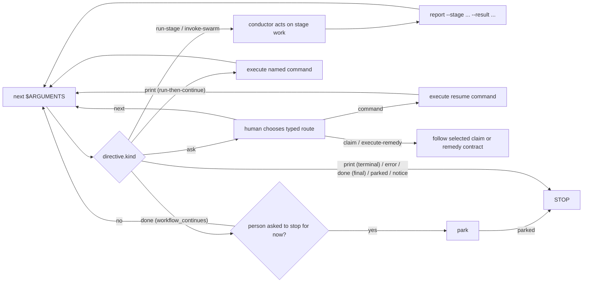

# The Orchestration Engine and Skill System

> Audience: Tier 2/3 (team adopter, framework contributor).

> **Path convention.** `<record>/` below = the active intent's record dir, `aidlc/spaces/<space>/intents/<YYMMDD>-<label>/`, where per-intent state and runtime files live.

This chapter is the canonical reference for the orchestration architecture that drives every `/aidlc` run: a deterministic **engine** (`aidlc-orchestrate.ts`) that answers "what's next?", a thin **conductor** (`skills/aidlc/SKILL.md`) that acts on the engine's answer, the **typed directive contract** that joins them, the **plural skill** set the runner generator emits, the **scope shape** that decides which stages run, and the **swarm** referee that converges parallel Construction work. It replaces the older prose-orchestrator model, where the `SKILL.md` body itself held all the routing logic. Cross-link to [Orchestrator](03-orchestrator.md) (the conductor's own chapter), [Runtime Graph](13-runtime-graph.md) (the execution-truth mirror the engine and swarm read), [State Machine](12-state-machine.md) (the transitions `report` commits), and [Hooks and Tools](06-hooks-and-tools.md) (the deterministic spine, including the Stop hook).

---

## 1. The engine and the conductor

The cutover splits one concern into two. The **engine** owns *between-stage routing* — scope resolution, the flag-precedence ladder, jump-direction computation, resume and init guards, stage sequencing, gate status, and workflow completion. The **conductor** owns *execution quality inside the move the engine named* — framing the persona, asking good questions, keeping the stage diary, the intra-stage Keep/Modify/Redo loop, and surfacing judgement to the human at gates.

The engine is authored at `core/tools/aidlc-orchestrate.ts` and ships into each harness as `<harness-dir>/tools/aidlc-orchestrate.ts` (e.g. `.claude/tools/`); it is a Bun CLI with exactly six subcommands: `next`, `continue`, `report`, `park`, `team-board`, and `wait`. `continue` is internal steering transport; `team-board` is the read-only Team Construction query; `wait` is the bounded read-only wait for dispatched work.

| Subcommand | Role | Mutates state? |
|------------|------|----------------|
| `next` | Read the workflow state (the active intent's `aidlc-state.md`, under `aidlc/spaces/<space>/intents/<YYMMDD>-<label>/`) and the compiled stage graph (`tools/data/stage-graph.json`), resolve scope and position, and emit **exactly one** typed directive (JSON) to stdout. | Workflow routing has no workflow-state mutation and no authority mutation: `next` never mints, rotates, or clears a Plan Approval receipt, challenge, or fingerprint. It is also idempotent - when the active-directive marker already records this exact directive for this state, it returns that directive verbatim and writes nothing, so re-asking never moves an approval. Rule delivery is the one exception: once a stage's rules have come in `load-steering` parts, re-asking from part two onward, or after the run-stage those parts led to, republishes part one, because the caller may be a new or compacted chat without the earlier parts (see `06-hooks-and-tools.md`). `next --single` records only its synthetic `STAGE_STARTED` audit boundary before emitting work; an ordinary team dispatcher read may refresh the gitignored local claim-observation cache and generation stamps, while Stop-hook and route-check probes write nothing at all beyond the advisory engine-turn marker, and a durable write from either fails loudly instead of proceeding. Request asks keep a question copy, not workflow authority. Without a selected cursor, existing selectable intents plus pending work produce `new-work-routing` on every harness; no pending work produces `intent-pick`, never a duplicate intent. Explicit `next config set`, `next config get`, and `next config list` requests are terminal operations: the canonical config command executes before its output is returned, so `set` may update intent settings. Stop and route-check probes only describe that command and never execute it. |
| `report` | Commit the transition after the conductor acted on a directive. A stage-aware dispatcher: `--stage <slug>` pins the acted directive so a recovered `Current Stage` cannot make the report target drift. It owns approval, rejection, revision, completion, and skip outcomes, dispatching internal state transitions atomically and opening a missing gate before approval when the explicitly reported stage is still `[-]`. | Yes. |
| `team-board` | Render the pure Team Construction board used by the terminal main dispatcher and `/aidlc --status`. Internal query surface; no fetch and no state/cache mutation. | No. |
| `wait` | Bounded, read-only wait for dispatched work: polls collaborator contribution files, the stage's required artifacts, or the reviewer's review file (`--for collaborators|artifacts|review`) and returns `status: settled|waiting` within the bound, so the conductor re-runs one pre-approved command instead of writing a shell loop. | No |
| `park` | Pause an active workflow at a clean inter-stage boundary. It writes the `Parked` marker that makes subsequent `next` calls emit a terminal `parked` directive until the person speaks again (a bare `/aidlc` after the park then carries on); `/aidlc --resume` clears the marker before routing resumes. | Yes. |

`report --result skipped` is a main-workflow lifecycle outcome, not a
single-run outcome. It requires an explicit nonblank `--stage`, a nonblank
`--reason`, the named stage to equal `Current Stage`, and the stage to be
active or revising. The engine records one `STAGE_SKIPPED`, preserves `[S]`,
and starts the next stage (or completes the workflow) without emitting
`STAGE_COMPLETED`. Under unit-major iteration, while the walk runs a
`(stage, unit)` beat, the skip names that beat's stage and `--unit` and
covers that unit only; the stage is marked `[S]` once no unit owes it (see
[State Machine](12-state-machine.md)). `report --single --result skipped` is rejected. Conductors
never invoke the corresponding `aidlc-state.ts` lifecycle verb directly.

`next --stage <slug> --single` first records `STAGE_STARTED` under
`single-stage:<slug>`, then emits a `run-stage` with `single: true`,
`gate: false`, and `next_stage: null`. That typed marker overrides normal gate
handling: the conductor runs the body, configured topology and reviewer, then
calls `report --single --stage <slug> --result completed` exactly once. Report
requires the open start boundary and records the matching `STAGE_COMPLETED`; it
does not fabricate both rows. The isolated path keeps no diary and does not run workflow learnings,
open an approval gate, call main-workflow `next`, or park. The returned `done`
terminates the isolated run.

The engine is deterministic code by design — routing is the determinism concern, so it lives in a tool, never in LLM prose (handing route string-building to an LLM would invert the tool/agent/human thesis). It **composes** the existing deterministic library: `loadGraph()` for the compiled graph, `nextInScopeStage()` / `firstInScopeStageOfPhase()` for sequencing, `validScopes()` for the scope-name set, and `getField` / `parseCheckboxes` for state reads. The non-happy-path branches (jump, intent creation, scope/config change, env-scope validation) compose the sibling CLI tools by shelling out and relaying their stderr verbatim, so user-facing error wording is never reconstructed. Explicit resume falls through to normal continuation after its parked/no-state guards. The only things the engine *adds* rather than composes are the decision rule mapping `(observed state + graph) → directive kind` and the artifact-path resolver that turns the graph node's vocabulary names into canonical record-dir paths (`aidlc/spaces/<space>/intents/<YYMMDD>-<label>/<phase>/<stage>/...`).

Every directive is validated against the frozen contract in `aidlc-directive.ts` before it is printed; a malformed directive exits non-zero rather than emitting a lie the conductor would act on.

---

## 2. The typed directive contract

`aidlc-directive.ts` defines a discriminated union over **eleven** directive kinds, keyed on the `kind` field. Each directive carries exactly the fields its kind needs, enforced by per-kind allowed-key sets (a field outside its kind's set is rejected as an unknown key). The engine **emits nine kinds today**; two are documented placeholders that keep the loop complete-shaped until later waves wire them.

| `kind` | Emitted today? | What the conductor does |
|--------|----------------|--------------------------|
| `print` | Yes | Do exactly what `directive.message` says: it is authoritative. Two shapes: **terminal** (names a read-only utility such as status/help/doctor/version to run, or carries the completed typed-config output; print the actual output verbatim, STOP) and **run-then-continue** (names a mutating tool such as a scope change, a jump `execute`, or `intent-create` for a fresh workspace or a confirmed `--new-intent` creation; run it, then return to step 1, so new work carries on in the same chat, whose narration offers a clean chat once). For workflow dispatches, the mutation lives in the named tool; explicit typed config requests execute their canonical config tool within `next`. A `print` from a refused `report` is the conductor's next step (the state tool marks those refusals `agent_guidance`): `question-open` means the person has not decided, so the conductor keeps the question open and never answers it for them; `person-decided` means their choice is on record, so the conductor records that choice. |
| `error` | Yes | STOP without recovering or retrying: the message is the user-facing error. On Claude Code and Codex the rebuild-stage-graph PostToolUse hook shows `directive.message` to the person byte for byte and gives the conductor a note saying so (see [Engine error relay](06-hooks-and-tools.md#engine-error-relay)). With that note the conductor adds no copy of its own; without it, the conductor prints the message verbatim. Everywhere else the conductor prints `directive.message` verbatim; opencode also shows it as a transient toast. |
| `done` | Yes | With `workflow_continues: true`, a `report` recorded a step and the workflow goes on (an approval, a skip, or a finished step that is not the last): run bare `next` at once, with no completion summary, or `park` when the person asked in that same reply to stop the workflow there for now. Otherwise the workflow (or single-stage run) is complete. Present the completion summary and STOP. |
| `parked` | Yes | The workflow was parked mid-flow at a clean inter-stage boundary (`directive.stage`) for a later session. Tell the user it is parked and how to resume (`/aidlc --resume`), then STOP. Emitted on a plain `next` while a `Parked` marker is set (written by `aidlc-orchestrate park`); no stage is advanced. A `report` answers `parked` after recording an approval whose reply also asked to stop the workflow there for now. The Stop hook treats `parked` as a terminal allow, so the conductor parks instead of rubber-stamping stages to reach `done` (#367). |
| `notice` | Yes | Print `directive.message` verbatim and STOP. This is a terminal informational hand-off, used on unscoped main while team-owned Units are claimed elsewhere; it does not advance or mutate the workflow. |
| `load-steering` | Yes | Rare, except on Copilot, whose smaller directive budget makes it the usual shape: the stage's rules did not fit beside its `run-stage`, so they arrive in parts. Apply `rules_content` in order, retain it as the active stage's rule bundle, adopt `conductor_persona` when the first part carries it (the workflow's first stage, when its run-stage would not fit with it), show `stage_validity` and `change_notices` from the run-stage rather than the part, and immediately invoke `aidlc-orchestrate continue <receipt>` with the 8-character `receipt` printed at the top of the part (or run the ready `next` command). A receipt the engine cannot match is answered with the current step. Do not report or narrate chunk progress. |
| `run-stage` | Yes | Every substantive active-space rule arrives as content: in `rules_content` on this directive when the bundle fits beside it (most stages on most harnesses), or through the preceding `load-steering` parts when it does not (most stages on Copilot). Apply `rules_content` first when present. With `rules_held` instead, the chat already holds that exact bundle (see 06-hooks-and-tools.md, Rule delivery): apply it without reading the files again. Treat `inline_context_paths` as a blocking load list, not delivered content: explicitly read every required entry and wait for its contents before reading the stage file/consumes, initializing the diary, running the body, dispatching mob supports, or writing artifacts. A mob loads its lead persona first, then every knowledge path after it. Show any `context_warnings` and continue with the readable persona/knowledge roster. On dispatched topologies, follow `stage-protocol.md` § "For subagent stages" step 2: Kiro CLI delivers rules through its registered agents' native `resources` preload of the full active-space memory tree; every other harness pastes the accumulated rule bundle verbatim into every brief. Every brief still carries `directive.ceremony`, `directive.protocol_modules`, and the diary discipline verbatim. An unloadable required rule blocks dispatch with repair guidance; a preload-served incomplete brief proceeds silently (see the [rule-delivery hook](06-hooks-and-tools.md)). Branch on optional `directive.single`, then optional `directive.wave`, then optional `directive.unit_gate`, before ordinary `directive.gate`. A Unit gate is gate-only work whose body/reviewer already settled and whose reports include `--unit`; a wave contains complete engine-resolved Unit entries and settles each through paired review evidence plus `unit complete --wave`. The directive also carries the resolved routing fields straight off the graph node. |
| `ask` | Yes | Every engine ask carries `ask_type` and `response_route`; render it through the harness's question surface and follow that typed contract. `scope-confirm` carries `proposed_scope`, `confirm_command`, `compose_command`, `scope_commands`, and `choices` (the offer's answers as the person sees them, each a `label` and its `command`: go ahead, then compose), which the conductor offers with their meaning, order, and commands unchanged, in the conversation's language; `compose-offer` carries `compose_command` and `scope_commands`. Both route through `next` using complete shell-safe invocations with `--request <8hex id>`, not request text; `scope_commands` holds one complete command per valid scope, so a different plan is chosen by name, never by editing shell text. `intent-pick` carries exact `available_intents` selectors and `select_commands: Array<{selector: string; command: string}>`: show the question and wait for the person's answer, even with one piece of work; then choose the entry by selector and execute its command verbatim, never interpolate a selector; it selects that record and carries on with it. `unit-paused` carries `stage`, `unit`, and `resume_command` with `response_route: "command"`; run it only when the human chooses to resume, then re-run `next`. `project-type` carries `existing_code_command` and `new_project_command` with `response_route: "command"`: the scan set the work up as a new project and the folder now holds code, so run the command for the person's answer, then re-run `next`; either records the type as theirs. `new-work-routing` carries `response_route: "next"`, `new_work_description`, `proposed_scope`, `numbered_prose_question`, and its routes as `new_intent_command`, `scope_commands` (a corrected scope), `compose_command`, and, when it asks about the active workflow, `continue_command`, or, with records to pick, per-record `select_commands` and `reshape_commands`; with `available_intents` it also carries per-record `select_commands`. Its continue / separate-work / reshape answer runs those commands and never goes through `report`, and the human-facing question text never contains them. `ask_type: "unit-claim"` carries `response_route: "claim"` plus claimable, claimed, and dependency-blocked Unit rows; choosing a Unit runs `/aidlc --claim <unit>` and stops on that command's result. Legacy Plan Approval recovery retains its explicit bare-`next` choice. `ask_type: "guard-recovery"` carries `response_route: "execute-remedy"`, the refusing stage and Unit, `reason_codes`, and `remedies`, each with a closed `op` and an `interaction`: when `agent_work` is true the remedies are the conductor's own work and it carries out the first that applies without asking; otherwise the conductor offers the remedies whose `executableNow` is true by `label` and `description` (a remedy's `action` instructs the conductor and is never shown), waits for the human selection, then follows the interaction contract below. An empty `remedies` list is terminal, rendered verbatim with no engine action until the human answers; past the repetition cap it also carries a `state_signature` (see [Guard admission and recovery asks](12-state-machine.md#guard-admission-and-recovery-asks)). Do not send an engine ask answer through a generic `report`; explicit remedy stage reports remain part of the remedy contract. A redo, jump, or start-fresh request on re-entry is the sole non-stage report round-trip, using `report --result resumed --choice <redo|jump|fresh>`. The engine defers the human turn to the conductor. |
| `invoke-swarm` | Yes | The engine granted an eligible Construction batch to the swarm. The conductor fans out the units in `directive.units` and runs the convergence loop, consulting the swarm referee (see §6). Emitted only for an eligible Construction batch under an `autonomous` grant. |
| `dispatch-subagent` | No (engine-future placeholder) | *Would* run the named stage via a `Task` call rather than inline. Not emitted today; do not implement speculatively. |
| `present-gate` | No (engine-future placeholder) | *Would* run the gate ritual as its own directive; today the gate decision is folded into `run-stage`'s `gate` field. |

**Guard-recovery interaction.** After the human selects an executable remedy:

- `command`: run the exact returned native or source `command`, rendered from
  its structured `operation`. Selection is sufficient to attempt it; the owning
  tool still enforces lifecycle and evidence. Process returned orchestrator
  directives through the ordinary loop.
- `human-input`: render the action's follow-up and end the turn. For Request
  Changes, a reply that already says what should change is the feedback, and
  when the person's last reply asked for changes and said what, the remedy is
  already chosen and the ask is not presented; otherwise ask "What should
  change?" and wait for a separate answer. Preserve that feedback unchanged as
  the report's `--reason`, separate from `--user-input "Request Changes"`.
  Obtain the human's concrete Scope when required.
- `external-work`: follow the `action` through its existing protocol and tools.
  Selection needs no additional feedback turn and does not prove completion.

Never invent a command, missing arguments, feedback, or a receipt. A tool
refusal ending with a typed guard-recovery ask follows this same contract.
Otherwise, surface the actual tool error and stop that recovery attempt;
an ordinary failure is not a recovery directive or success.

**Question transport.** Scope/compose asks name the request only by id (a pasted `<document>` block stays in the question store as data and never enters an ask); their `question` includes only a preview of at most 240 characters, ending in `...` when truncated, plus one line saying how a pasted document was split from the request. A `new-work-routing` ask carries them once in `new_work_description` and its route commands in dedicated fields. The engine keeps a copy of each question's request in its own gitignored file under `aidlc/.aidlc-sessions/questions/`, so concurrent sessions in one clone never share or invalidate each other's asks; asking again is a new question with a new id, and the earlier one stays answerable. Commands resolve `--request <8hex id>` from that store; the full request and proposed scope travel through composer dispatch and creation prints (a `new-work-routing` ask, including the second hop after `scope-confirm`, stores a question of its own). Intent creation lists the finished record last and records the question id on its `intents.json` row, then removes the copy; an unanswered copy is kept unless `question-retention-days` is set. A repeated answer carries on with the work it started, and asks before starting archived or completed work again. A start answer given after other work became active starts the new work alongside it; a routing ask's `continue_command` and `compose_command` act only on the workflow it named and ask again when another is selected. Copies follow the workspace's operating-system permissions. A question whose copy is gone errors with a describe-the-work-again message. Conductors execute the supplied commands without appending request text or editing the runtime files.

**The gate sentinel.** `run-stage`'s `gate` is a boolean for every deterministic case (`false` for the auto-proceeding bootstrap initialization stages, `true` for every other EXECUTE stage). One case is not deterministic: the first Construction Bolt's gate depends on the team's free-form `## Walking Skeleton` practices prose, which no parser can derive. The engine emits the string sentinel `GATE_UNRESOLVED` (`"unresolved"`) and defers the classification to the conductor's knowledge-work, which hands the stance back via `report --skeleton-stance <on|off|scope-dependent>`; the next `next` re-emits the same stage with a now-determined boolean gate.

**The conductor persona delivery.** The conductor's execution-quality charter lives once at `aidlc-common/conductor.md`. No skill references it by path. Instead the engine reads it and bakes its contents into the `conductor_persona` field of the **first `run-stage` directive of the workflow**, or, when that run-stage would not fit the host's limit with it, of the first `load-steering` part ahead of it. When the conductor receives that field, it adopts the persona for the whole run. This keeps every entry point — framework runner and hand-written alike — on one persona with no per-skill diligence.

---

## 3. The forwarding loop and the Stop hook

Before stage work, read the named `directive.protocol_modules`: `reviewer` → `stage-protocol-reviewer.md`, `ensemble` → `stage-protocol-ensemble.md`, `construction` → `stage-protocol-construction.md`, `swarm` → `stage-protocol-swarm.md`, and `learnings` → `stage-protocol-learnings.md`. Already-loaded modules need not be read again, but only the current directive's listed modules apply. The `learnings` module owns the diary and the §13 ritual; when absent, skip both and go directly from completion to the approval gate.

`directive.ceremony` resolves `sensors`, `learnings`, and `summary_confirmation` for this intent. Each defaults to its scope's setting (absent means `on`), with a per-intent override and an env kill switch above it. `/aidlc --sensors on|off`, `--learnings on|off`, and `--summary-confirmation on|off` set intent overrides. `summary_confirmation: off` generates directly from answers without the consolidated-summary checkpoint or receipt; required questions, Assumption Confirmation, Plan Approval, and approval gates stay. `sensors: off` leaves `sensors_applicable` empty and skips automatic checks and their correction/rerun instructions. All 17 hook registrations remain.

`skills/aidlc/SKILL.md` is the **conductor**: a thin forwarding loop that acts on the engine's directives. Its whole control structure is:

```
Loop:
  1. directive = `aidlc engine orchestrate next $ARGUMENTS`
  2. act on directive.kind
  3. After stage work, `aidlc engine orchestrate report --stage <directive.stage> --result <outcome> [--user-input '<text>']`. Ask answers follow next/command/claim/execute-remedy instead; only a redo, jump, or start-fresh request on re-entry uses non-stage `report --result resumed`.
  4. Repeat only when the directive calls for continuation; otherwise stop or wait for the human as it directs.
```

Terminal workspace navigation takes precedence over repeating the loop. For example, `/aidlc space default` switches spaces, prints the utility output, and ends the turn even when the destination has an unfinished intent. Selecting that intent does not request resuming it: the conductor waits for a new human workflow request before calling `next` or `report` or running a stage. Session-start guidance reinforces the same boundary.



Text description of the diagram: `next` (passed `$ARGUMENTS` verbatim) returns one directive. Stage work reports its outcome, then loops back to `next`. Every engine ask instead follows its declared `next`, `command`, `claim`, or `execute-remedy` route after the human answers. Guard remedies retain their explicit command/action semantics, including any named stage report; there is no generic ask-to-report fallback. A run-then-continue `print` executes its command and returns directly to `next`. A redo, jump, or start-fresh request on re-entry alone uses a non-stage `report --result resumed`. Terminal `print`, `error`, `parked`, and `notice` stop the loop, as does a `done` without `workflow_continues`; a `done` that carries it returns straight to `next`, or to `park` when the person asked in that same reply to stop the workflow there for now.

`$ARGUMENTS` passes through to the first `next` verbatim — the engine parses the flags (`--status`, `--stage`, `--scope`, `--depth`, freeform text), so the conductor never pre-parses or strips them. Workflow routing does not execute stage work: `report` commits the transition, so the next `next` reads fresh state. Explicit typed config requests finish their canonical config operation before returning a terminal response and do not advance the workflow. Request asks may keep a question copy without changing workflow state or approval authority.

On the interactive path the conductor holds the loop, because only it can ask the human a question. To keep the loop from resting on the LLM's good behaviour, the **Stop hook** (`hooks/aidlc-continue-workflow.ts`) enforces it deterministically. It is one of six flow-altering hooks; deliver-stage-rules, plan-approval, state-transition, reviewer-scope, and review-freeze are the five PreToolUse controls, while the remaining ten hooks are advisory. When the conductor tries to end its turn, the Stop hook runs `aidlc-orchestrate next`; if a directive is still pending, it blocks the stop with one plain `reason` line the person can read, "AI-DLC is carrying on with <stage>.", an **on-task continuation** and never an override-shaped instruction, which the conductor's safety training would refuse. The conductor's steps for that line (record a question it just asked, park when the person asked to stop, continue with the rules receipt it holds, finish a stage whose `run-stage` it holds and run the `report` built from that directive, or run `next`) are in the skill and in the session-start context. Probe `next` calls write nothing: no directive publication, no claim-observation refresh, no Plan Approval state. A `done`, `parked`, or informational `notice` directive allows the stop; `parked` is the supported mid-flow pause for a later session, while `notice` is a write-free team fan-out hand-off. Some pending cases are *not* blocked either: a **human-wait carve-out** allows the stop when the conductor is correctly parked on the human (or simply chatting) - the current stage is positively `[?]` awaiting-approval, `[R]` revising, `[-]` in-progress with either an unanswered `[Answer]:` tag in its canonical or exact active-unit `<slug>-questions.md` or a current-stage `DECISION_RECORDED` with no later `QUESTION_ANSWERED`, or the ending turn was conversational (the human's last prompt was answered with no workflow-engine engagement, read from the harness transcript; read-only queries and terminal workspace/configuration dispatches are excluded, with state-dependent configuration calls requiring a unique matching terminal result as described in the [hook reference](06-hooks-and-tools.md)). Logged decisions and conversational turns are suppressed under autonomous Construction; file-backed questions are also suppressed except that unit-major code-generation's exact mandatory Plan Approval question still releases the turn. The conversational case is inert on Kiro, which delivers no transcript, where the interactive cap is the release path instead. Blocking there would only spam the nudge (positive-confirmation only; the human-wait checks fail open and the conversational check fails closed; stateless cases and a genuine mid-stage quit still block). Two bounds keep a stuck loop from trapping the session: Claude Code's `stop_hook_active` signal, and a no-progress counter persisted under `<record>/.aidlc-engine/stop-hook/` (in the active intent's record dir). Once consecutive no-progress blocks reach the ceiling (`CLAUDE_CODE_STOP_HOOK_BLOCK_CAP`, whose default is run-mode aware: **2 in an interactive run and 8 under autonomous Construction**) the hook lets go; a workflow advance changes the position signature and resets the counter to 0, so a healthy loop is never throttled. With no active workflow, or on any unexpected error, the hook fails open - it never blocks a non-AIDLC session.

---

## 4. Plural skills, runners, and the shared spine

The orchestrator is one skill among many. Each harness ships a plural set under its installed skills directory (`<harness-dir>/skills/`, e.g. `.claude/skills/`): the base `aidlc` orchestrator, one **stage-runner** per runnable stage (core stages use `aidlc-<slug>`; plugin-owned stages use their bare plugin-prefixed slug), one **scope-runner** per `runner: true` scope (core scopes use `aidlc-<scope>`; plugin-owned scopes use their bare name), the read-only session skills (`aidlc-session-cost`, `aidlc-replay`, `aidlc-outcomes-pack`), and `aidlc-init`. All of the routing-and-execution knowledge lives once in the **shared spine** authored at `core/aidlc-common/` (shipped as `<harness-dir>/aidlc-common/`): the `conductor.md` persona, the `protocols/`, and the 33 stage files under `stages/{initialization,ideation,inception,construction,operation}/`.

The runner skills are generated, never hand-written, by `tools/aidlc-runner-gen.ts`:

- **Stage-runners** are opt-in sugar. Each core `/aidlc-<slug>` (or plugin-owned `/<plugin>-<slug>`) packages `/aidlc --stage <slug> --single` (which works without it) into a typeable command that runs one stage in isolation via the engine's `--single` mode and never advances the main workflow's `Current Stage`. `next --single` owns the synthetic start, the emitted `single: true` directive bypasses workflow learnings and approval gates, and `report --single` owns the matching completion before the runner stops on `done`. The slug list comes from `loadGraph()`, the one compiled source of truth, so a stage added to the graph flows into a runner with no edit here. The bootstrap initialization stages are excluded (they have no standalone `--single` meaning; `--single` refuses them), and the whole initialization phase ships as one `/aidlc-init` runner: with `--scope` it packages the engine's `intent-create` move, and with only a description it asks the engine for new work (`next --new-intent`), which shows the plan offer first.
- **Scope-runners** package an already-runnable command; the scope file holds the definition and opts into the default generated set with `runner: true`. Each is a short shell that drives `aidlc-orchestrate next --scope <scope>` to `done` with a fixed scope and no detection. The full scope set stays reachable via `/aidlc --scope <name>`; runners are typeable sugar over the high-traffic ones and any plugin scope that opts in.

Two drift guards keep the on-disk runner sets pinned to their sources: `aidlc-runner-gen.ts check` for stage-runners and `scopes --check` for scope-runners, both run in CI. Runners carry **no `hooks:` block** — the workflow-spine hooks live project-wide in `settings.json`, so the deterministic spine is inherited, not copied. And no runner loads `conductor.md` by hand: the engine delivers the persona on the first `next`.

---

## 5. Scope shape

Scope is a file-authored primitive, the same muscle memory as authoring a sensor or an agent. There is **no `scope-mapping.json`** — it has been removed from the shipped tree. Scope identity and stage membership are split across two file-authored surfaces, transposed into a compiled grid:

1. **Identity** is authored in one file per scope at `core/scopes/aidlc-<name>.md` and projected to `<harness-dir>/scopes/`: frontmatter (required `name` and `depth`, plus optional `keywords`, `description`, `testStrategy`, `skeleton`, `review_cap`, `guard_policy` (retired spelling `change_control`), `sensors`, `learnings`, `summary_confirmation`, `plan_approval`, `collaborators`, `runner`, `freeform_default`, and `existing_code`; the field table in `docs/harness-engineering/04-scopes.md` is the full list) plus prose describing the scope. The shipped set is `bugfix`, `classic`, `enterprise`, `express`, `feature`, `infra`, `mvp`, `poc`, `refactor`, `security-patch`, `workshop`.
2. **Membership** lives in each stage's `scopes:` frontmatter - the list of scopes for which that stage is EXECUTE. Classic includes Initialization plus Inception and Construction through Build and Test (18 of 33 stages); CI Pipeline and Operation stay outside its executable membership. Classic runs advisory reviews, sensors, and the learnings ritual, and disables summary confirmation and collaborators (each stage runs with its lead agent only); explicit autonomy keeps the single pre-merge review.

`aidlc engine graph compile` (the same compile path that produces `stage-graph.json`) transposes these into the grid at `tools/data/scope-grid.json` — a `scope → {stages: {slug: EXECUTE|SKIP}}` map that the engine reads for all scope-level routing. The engine's `validScopes()` derives its canonical scope-name set from that compiled grid.

The transpose covers only frontmatter-declared (stock) scopes. A scope saved from a composed plan has no stage declaring it, so compile folds its column back from its durable record at `aidlc/scopes/<name>.md` and projects the matching identity file into `<harness-dir>/scopes/` (see [Where a saved scope is stored](../guide/05-scopes-and-depth.md#where-a-saved-scope-is-stored)).

Adding a scope is purely additive: drop `.claude/scopes/aidlc-<name>.md`, tag the member stages' `scopes:` lists, recompile, and regenerate the human-readable summary table in `SKILL.md`. No dispatch-logic edit is required, and the drift guards prevent the on-disk set from diverging.

---

## 6. The swarm referee, the driver seam, and the Bolt-DAG

The **swarm** is how parallel Construction work converges under human-granted autonomy. It fires only inside a live `/aidlc` session, so the conductor (that session) owns the fan-out and the retry loop; `tools/aidlc-swarm.ts` is the deterministic **referee** the conductor consults while it owns the loop itself. This is the three-concerns split applied to convergence: the conductor owns fan-out and the retry decision (knowledge), the tool owns the convergence verdict + merge + audit (determinism), and the human grants autonomy and takes the baton back on the failure envelope (judgement).

The referee is **stateless** — no iteration counter, no persisted progress — with three subcommands:

| Subcommand | Role | Emits |
|------------|------|-------|
| `prepare --batch <n> --units <a,b,c> [--base <branch>] [--degraded-from <subagent\|ultracode>] [--resume-existing]` | Protected Code Generation, under legacy autonomy or new checkpoints, requires each Unit’s current Plan Approval or permitted postapproval continuation, plus committed, reproducible approved parent application source. For the same intent, target, and attempt, `testing-posture verify` with `execution_allowed: true` (exit 0) permits continuation under a lowered fence even when `ok: false` reports that the current content is not approved. Read-only preflight covers every Unit before any initial child is created; uncommitted source returns commit-and-retry without an orphan, and no commit is automatic. If rejection retired the prior approval, obtain fresh Plan Approval for that revision before `--resume-existing`; subsequent retries retain that actual approval evidence and may use permitted continuation. Preserve surviving child source and archive metadata, or recreate a removed child from already-landed parent source when native landing evidence permits it. No continuation revives an older attempt’s approval. | `SWARM_STARTED` (plus `SWARM_DEGRADED` when a loud downgrade is reported). |
| `check <unit> [--check-cmd <cmd>] [--test-file <path>]` | Single-unit verdict: run the intent's human-authorized Construction Verification Command (a supplied `--check-cmd` must match it; exit 0 = green, the authoritative signal — a worker's self-claim is never trusted) plus an anti-tamper compare of the protected file against its forked-git baseline. Prints `{converged, tampered, reason}`; exits 0 iff genuinely converged. | None (advisory; informs the conductor's retry decision). |
| `finalize --batch <n> --units <a,b,c> --claimed <a,b> [--check-cmd <cmd>] [--test-file <path>] [--reasons <unit>=<reason>,…]` | The authoritative gate: **re-run the check on every claimed unit** and, when the current stage declares a reviewer, require that unit's matching terminal receipt after its Bolt started. For a modern source-bearing worktree it also requires the current global `Source Fingerprint`, current `Unit Source Fingerprint` and manifest-byte binding, the attested raw-aware `Base Source Listing`, and containment of every base-to-worktree source change by the reviewed manifest claims. `AIDLC_SKIP_SOURCE_FRESHNESS=1` explicitly bypasses those source checks only; the convergence row records the bypass and source merge must repeat the switch. A claimed unit that is red, tampered, unreviewed, stale, or outside its reviewed footprint is refused before merge (the lying-conductor guard). With Guard Policy relaxed or off, a real review stands when the unit's code, Code Generation documents or file list changed after it, or files outside its planned ones changed: finalize lands the unit as it is now, records one `CHANGE_ACCEPTED` row (checkpoint `review-receipt`) and returns one line for the person, and the batch checkpoint reads that row instead of saying it again; under strict the unit is refused for a fresh review. Then genuine passes snapshot and land exact declared record artifacts plus the bound source manifest before merging AIDLC metadata under the serial HOLD-MERGE lock. The conductor must next run the correlated `aidlc-worktree merge`; it consumes the immutable `Source Commit`, emits `SWARM_SOURCE_MERGED`, and is cleanup-idempotent after that authority lands. Modern batch routing and settled approval require the complete aggregate chain. Exits 0 (record/metadata convergence) or 2 (failure envelope). | `SWARM_UNIT_CONVERGED` / `SWARM_UNIT_FAILED` / `SWARM_BATON_RETURNED` / `SWARM_COMPLETED`; later source merge emits `SWARM_SOURCE_MERGED`. |

Switching from an inline skeleton to swarm therefore includes an explicit,
authorized commit of the approved skeleton source before preparing the parallel
batch. A successful native merge may remove its child; `--resume-existing`
preserves the rejection revision, not an unconditional promise that the original
child directory exists. See the [prepare and resume commands](../guide/12-cli-commands.md#aidlc-engine-swarm-prepare-prepare-a-reproducible-batch).

These seven `SWARM_*` events are part of the 115-event audit taxonomy (see [State Machine](12-state-machine.md)). On an exit-2 envelope the conductor takes the baton back - failure always halts and re-engages the human regardless of autonomy mode.

**The driver seam.** `AIDLC_USE_SWARM=1` selects an inline Dynamic Workflow driver (the conductor authors a `Workflow` whose JS owns the per-unit pipeline and the iteration cap); unset selects the subagent floor (N parallel `Task` calls in one message, one per unit). If `=1` but the Workflow tool is unavailable, the conductor **loud-degrades** to the floor and passes `--degraded-from ultracode` so the referee emits `SWARM_DEGRADED`. The runaway backstop is not a cap inside the tool - it is the harness's Stop-hook ceiling, which is 8 blocks on this autonomous-Construction path (§3).

Every Code Generation worker receives the same approved contract as the normal
path: `AIDLC-UNIT`, `AIDLC-TESTING-CONTRACT`, the full plan, and the full unit
test instructions. Workers never re-resolve Testing Posture independently.

**The Bolt-DAG.** The batch the swarm fans out comes from the `bolt_dag` node of `runtime-graph.json` (see [Runtime Graph](13-runtime-graph.md)), parsed from units-generation's `unit-of-work-dependency.md` edge block. The node carries `units` (each with its `depends_on` list) and `batches` — topological levels where every unit's dependencies are satisfied by prior batches, so a batch's units can fan out in parallel. The node is present only once a valid edge block exists on disk; an absent, malformed, or cyclic block omits the node entirely (the gate-time required-sections sensor flags those upstream).

---

## Next Steps

- **The conductor's own chapter** — the forwarding loop, the gate ritual, and the learnings ritual in full. See [Orchestrator](03-orchestrator.md).
- **The execution-truth artefact the engine and swarm read** — `runtime-graph.json` and its `bolt_dag` node. See [Runtime Graph](13-runtime-graph.md).
- **The transitions `report` commits** - the workflow / phase / stage machines and the 115-event audit taxonomy. See [State Machine](12-state-machine.md).
- **The deterministic spine** — the Stop hook and the other framework hooks and tools. See [Hooks and Tools](06-hooks-and-tools.md).
- **Using the runners day to day** — the typeable `/aidlc-<stage>` and `/aidlc-<scope>` commands. See the User Guide's [Skills and Runner Commands](../guide/17-skills.md).
