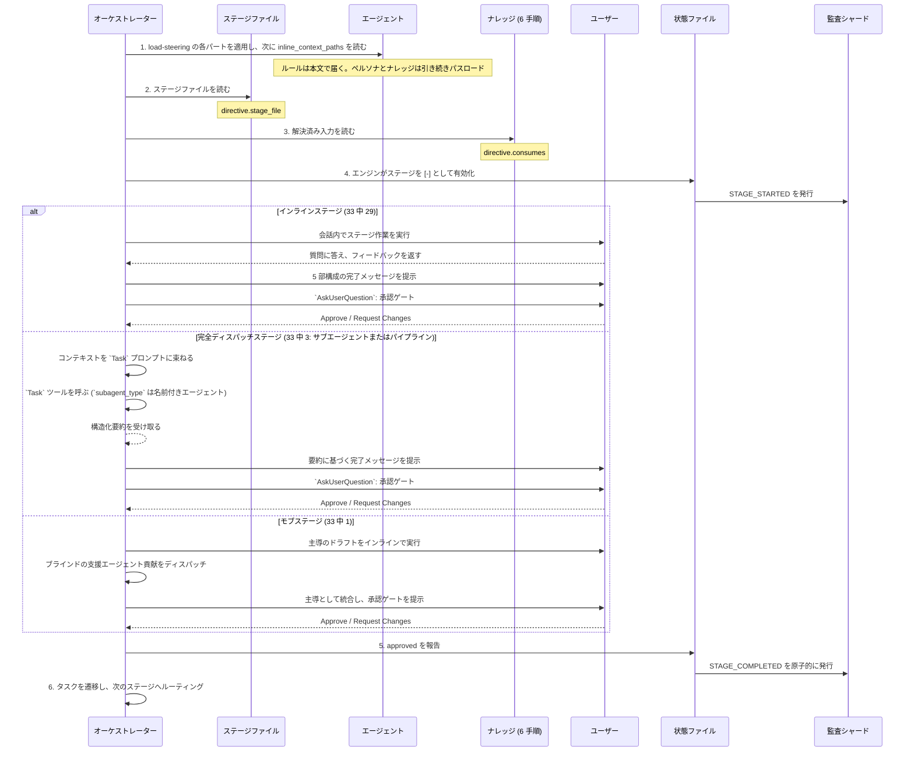
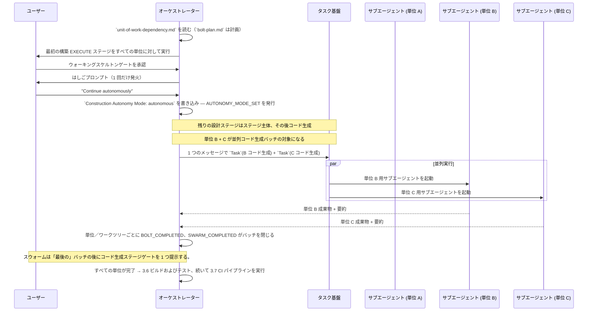
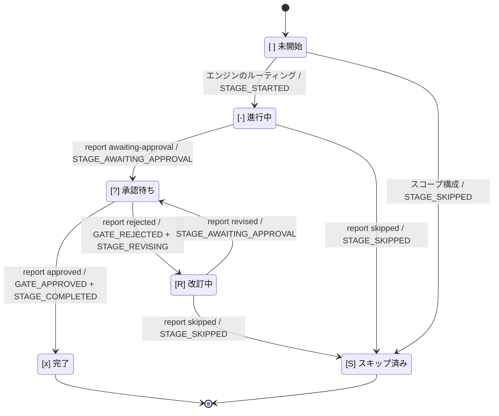

# オーケストレーター

オーケストレーションは 2 つの要素に分かれます。決定論的な **エンジン**（`aidlc-orchestrate.ts`、サブコマンドは `next` / `continue` / `report` / `park` のちょうど 4 つ。`continue` は内部のステアリング転送用）が、スコープ判定、ステージのルーティング、ジャンプ先の解決、再開および初期化のガード、ゲート状態、ワークフロー完了という、ステージ間のあらゆる判断を担い、各 `next` で型付きの **ディレクティブ**を出力します。**コンダクター**（`.claude/skills/aidlc/SKILL.md`、`/aidlc` 経由で起動）は、各ディレクティブに従って動く薄い転送ループです。指定されたステージを実行し、人間に質問し、スウォームをファンアウトして、結果を `report` で返します。`SKILL.md` は制御プレーンではありません。ルーティングの判断はエンジンと、それが読むコンパイル済みデータ（`tools/data/stage-graph.json`、`tools/data/scope-grid.json`）にあります。`SKILL.md` は、エンジンが指定した処理の内側での実行品質を担います。

この章では、ワークフローの振る舞いをコンダクター側から文書化します。対象は、エントリポイント、セッション管理、スコープからステージへの対応付け、ステージ実行と前進のプロトコル、意図的な逸脱点です。エンジンの内部、すなわち `next` / `report` 契約、型付きディレクティブ共用体、コンダクターのペルソナ、複数形スキル、スコープの形状、スウォーム審判については、[エンジンとスキルシステム](17-skill-system.md) を参照してください。利用者向けのコマンド使用法は、[ユーザーガイド -- CLI コマンド](../guide/12-cli-commands.md) を参照してください。

> **責務に関する注記。** この章で説明する振る舞い、たとえば引数解決、スコープ検出、ジャンプ検証、再開時の分岐は、すべて各 `next` ごとに **エンジン** が計算し、ディレクティブとしてコンダクターへ渡します。古い文で「オーケストレーターが X を行う」と書かれていた場合は、「エンジンが X を判断してディレクティブを出し、コンダクターがそれを実行する」と読み替えてください。判断ロジックは常に決定論的なツールコードであり、`SKILL.md` の文章ではありません。

> **パスの表記規則。** 各インテントの状態、監査証跡、インテント範囲の成果物は、その **記録ディレクトリ**、すなわち `aidlc/spaces/<space>/intents/<YYMMDD>-<label>/` 配下にあり、以下では `<record>/` と表記します。逆工学は例外で、その永続的なリポジトリ単位の出力は `aidlc/spaces/<active-space>/codekb/<repo>/` にあります。監査証跡は `<record>/audit/` 配下にあるクローンごとのシャードディレクトリであり、単一ファイルではありません。

---

## 目次

- [エントリポイント](#エントリポイント)
- [セッション管理](#セッション管理)
- [スコープからステージへの対応付け](#スコープからステージへの対応付け)
- [ステージ実行エンジン](#ステージ実行エンジン)
- [ステージ前進プロトコル](#ステージ前進プロトコル)
- [タスク追跡](#タスク追跡)
- [意図的な逸脱点](#意図的な逸脱点)
- [エラー処理](#エラー処理)
- [付録 A: ステージグラフリファレンス](#付録-a-ステージグラフリファレンス)
- [付録 B: フックリファレンス](#付録-b-フックリファレンス)
- [付録 C: 承認ゲートのパターン](#付録-c-承認ゲートのパターン)

---

## エントリポイント

コンダクターはエンジンの最初の `next` に `$ARGUMENTS` をそのまま渡します。事前解析は行いません。エンジンがフラグと自由記述テキストを解析し、以下のどの呼び出しパターンに当たるかを解決して、対応するディレクティブを出力します。これらのパターンはエンジン側で解決される入力であり、コンダクター側の分岐ではありません。

### `/aidlc [scope]` -- 明示スコープ

引数が既知の 11 のスコープ（`enterprise`, `feature`, `mvp`, `poc`, `bugfix`, `refactor`, `infra`, `security-patch`, `classic`, `workshop`, `express`）のいずれかに一致する場合:

新しいワークスペース（まだインテントがない、つまり `aidlc/spaces/*/intents/*/` 配下に `aidlc-state.md` がない状態）で明示的にスコープを指定すると、**最初のインテントが作成されます**。エンジンの `next` は、実行後に継続する `print` ディレクティブを出力し、`aidlc-utility.ts intent-create --scope <scope>` を指名します（`--depth` / `--test-strategy` / `--review` フラグがあれば、そのままそのコマンドへ渡します）。コンダクターはそれを実行し、最初のステージへ着地するために `next` を再実行します。裸の位置引数（`/aidlc bugfix`）でも明示フラグ（`/aidlc --scope bugfix`）でも、出力される作成用の表示は同一です。何を作るかを説明する形（`/aidlc "build the auth service"`）でも作成されます。スコープ名も説明もない裸の `/aidlc` は作成しません（環境変数や既定値で解決されたスコープは作成の合図ではありません）。代わりに、何を作るかを説明するかスコープを名指しするよう促す、状態未作成エラーを出します。

1. `aidlc/spaces/<active-space>/memory/` からガードレールを読み込みます。
2. ユーザーへ "What would you like to build?" と尋ねます。
3. スコープからステージへの対応付けに従って、実行すべきステージを決定します。
4. 初期化フェーズ（ワークスペーススキャフォールド、ワークスペース検出、状態初期化）を、決定論的な `aidlc-utility intent-create` 呼び出し 1 回として実行します。ウェルカムメッセージはセッション開始時に、`settings.json` の `companyAnnouncements` 経由で描画されます。
5. スコープ内のすべてのステージについて、ステージ単位のタスクを作成します。最初のステージは `in_progress`、残りは `pending` に設定されます。スコープ外のステージにはタスク自体が作られません。
6. 初期化後の最初のステージを開始します。

### `/aidlc [freeform]` -- AI スコープ検出

引数が自由記述テキスト（既知のスコープキーワードではない）である場合:

1. `aidlc/spaces/<active-space>/memory/` からガードレールを読み込みます。
2. キーワードパターンに照らしてインテントを分析します。
   - 修正・不具合・破損を示す語は `bugfix` に対応します
   - リファクタ・整理・単純化を示す語は `refactor` に対応します
   - インフラ・デプロイを示す語は `infra` に対応します
   - セキュリティ・脆弱性・パッチを示す語（および `CVE`）は `security-patch` に対応します
   - 概念実証・試作・スパイクを示す語は `poc` に対応します
   - 最小実用を示す語は `mvp` に対応します
   - ワークショップ・ラボ・研修を示す語は `workshop` に対応します
   - エクスプレス・軽量を示す語は `express` に対応します
   - 基盤となるキーワード無しリゾルバの既定は `feature` です。ユーザーに見えるコールドスタート経路では、一致なしや文章が豊富な場合、まずコンポジションを提案します
3. 曖昧性解消ルール: テキストがスコープキーワード **も** 長めのプロジェクト説明（5 語超） **も**含む場合、その一致は偶発的とみなし、静かな既定値ではなくコンポーズ提案を発火します。
4. 明確なキーワード一致があれば、コンパイル済みグリッドとワークスペース走査から実効的なセレモニー名を引いて、ユーザーへ次を確認します。`Starting a "[scope]" workflow for: "[text]" - [N] of [T] stages, [G] approval gates. Confirm to proceed, name a different scope, or say "compose" for a tailored plan.` グリーンフィールドのプレビューには、インテント作成と同じ逆工学スキップが適用されます。作業単位ごとの句が追記されるのは、そのスコープが `units-generation` を実行し、その構築ステージが得られた作業単位 DAG の上でファンアウトする場合だけです。
5. 一致なし / 文章が豊富な場合は、適応コンポーザーを提案します。コンポーザーエージェントが、そのタスクの実装エントロピーを見積もり、実行可能な最小の EXECUTE/SKIP グリッドを人間ゲート付きで提案します（下の `compose` 入口を参照）。提案に含まれるスコープ例一覧にも件数が付きます（`express = 10 of 33 stages, classic = 26, feature = all 33`）ので、選ぶ前に規模差が見えます。
6. 確認後は、明示スコープと同様に進みます。元の自由記述テキストは `aidlc-state.md` に `Initial Intent` として保存されます。
7. ユーザーが検出結果のスコープを上書きした場合は、ユーザーが選んだスコープを使います。

### `/aidlc compose` -- 適応コンポーザー

`compose` の入口（先頭の `compose` 動詞、`--new-scope`、または `--report <path>`）は、スコープ確認の代わりに、コンポーザーディスパッチ用の `print` をエンジンに出させます。この動詞は意図的にワークスペース動詞ではありません（ワークスペース動詞は Kiro 継ぎ目が帯域外で実行する端末ユーティリティコマンドであるのに対し、`compose` はコンダクターがディスパッチするワークフロー作業だからです）。2 つのモードが状態ファイルの有無で分岐します。

1. **前方 / 報告（まだワークフローなし）:** コンダクターは `aidlc-composer-agent` をディスパッチし、そのエージェントが読み取り専用の `detect --json` 走査を実行し、5 つの実装エントロピー構成要素を見積もり（CodeKB MCP が構成済みならその証拠を、なければワークスペース走査を使用）、構造化提案（`mode matched|custom`、必須で空でない `creationDescription`、構成要素スコアと証拠方式を含む `ars` ブロック、`arsRationale`、グリッド、各 SKIP の根拠、バリデータから逐語コピーされた `summary`、さらに事前描画済みの Markdown 表 2 つ、すなわちバンド付き ARS スコア表と理由付きステージ別判断表）を返します。これは `aidlc-graph.ts validate-grid` で検証されます。検証はコンパイル済みステージ集合との完全一致を要求し、グリッドのステージ / ゲート / 作業単位あたり件数を含む `summary` に加えて `nearest_stock` を返します（コンポーザー著述のスコープは除外され、キーの欠落・余剰はどちらも差分として数えられます）。コンポーザーは標準一致かカスタムかを、最終提案の `nearest_stock[0].diff <= 2` だけでルーティングします。機械的 ARS 選別の距離は助言扱いです。標準グリッドを採用する場合は、その最終グリッドを再検証し、要約と距離を差し替え、影響を受けた判断表の行をすべて再構築してから返します。コンダクターが判定を導き直すことはありません。コンダクターは承認 / 編集 / 却下のゲートを 3 つのブロックで表示します。まずバリデータの要約行（`N stages EXECUTE / M SKIP, G approval gates`）、次にコンポーザーのステージ判断表を逐語で、最後に「Scoring detail (advisory)」の見出しの下に ARS スコア表を逐語で出します。標準一致グリッドを編集した場合、修正後の提案はカスタムへ変換され、検証と表の描画がやり直されます（標準一致の承認ではスコープデータが書かれないためです）。承認時、標準一致では AI-DLC がそのまま直接ワークフローを作成し、カスタムグリッドではスコープデータ（`scopes/aidlc-<name>.md` と `scope-grid.json` エントリ、既定は `keywords: []`）として著述したうえで、その同じターンの中でそのスコープでワークフローを作成します。タスク文に基づくコンポーズでは、元のタスク文をそのまま `creationDescription` にコピーします。レポートのみ・タスク文なしのコンポーズでは、承認されたレポートや計画から導出します。作成時はその値をリテラルの `--` 区切りの後にシェルセーフな 1 つの argv 値として渡します。シェルのダブルクォートを経由することはなく、スコープのみのコマンドとして渡すこともありません。
2. **実行中（ワークフロー稼働中）:** コンポーザーは、完了済みステージが実際に解決した内容からエントロピー構成要素を再見積もりし、`mode: in-flight` として、現在のスコープ、保持された実効グリッド全体、およびカーソルより先にある PENDING ステージに対する厳密な `changes.skip` / `changes.add` 配列を返します。近傍の標準グリッドを採用したり、スコープや深さを変更したり、完了済み / 進行中 / スキップ済みのアクションを書き換えたりすることはありません。この分岐では標準距離の一覧は両方とも助言扱いです。各切り替えの根拠には、スコアを動かした完了済みステージの証拠が挙げられます。検証は `--strict` で実行されるため、飢餓を招く切り替えはゲートの前に捕捉されます。コンダクターはゲートの前に保留提案マーカー（`aidlc/.aidlc-compose-pending`）を書きます（`Stop` フックはこれをターン停止合図として尊重します）。解決後に削除します。承認されると、その厳密な配列をそのまま `aidlc-utility.ts recompose --skip <slugs> --add <slugs>` に渡し、これが監査ロック下で計画接尾辞を反転し、新しい飢餓に対して厳密検証し、導出フィールドを再構築して `RECOMPOSED` を発行します。スコープレジストリのファイルは書かれません。マーカーは有界です。`Stop` フックはそれが新しい間だけ（ファイル更新時刻基準で 24 時間未満）尊重し、古い孤児（書き込みと解決の間でセッションが落ちたもの）は無視したうえで最善努力で削除します。つまり取り残されたマーカーが転送ループ強制を黙って無効化することはありません。`--doctor` もマーカーの存在と経過時間を報告します（新しい = 助言的合格、古い = 失敗）。`recompose` は自律構築中は拒否されます（ゲートに人間が必要なためです）。先にゲート付きへ切り替えるか、スウォームが終わるのを待ってください。検出はチャット優先です。コンダクターの転送前判断ステップ（新規作業を見つけるのと同じもの）が、平文チャットの再構成要求を分類し、それをそのまま転送する代わりに `next compose "<their words>"` としてルーティングします（そのまま転送すると分岐 10 に落ちて現在ステージが実行されてしまいます）。要求が特定のステージを命令形で名指ししている場合、コンダクターはコンポーザーディスパッチを省いてゲートを自前で提示し、承認時に直接 `recompose` を実行しても構いません。これは、その動詞自体が飢餓 / 凍結 / カーソル後方 / スケルトンゲートの切り替え（および自律構築中のすべての呼び出し）を、誰が呼んだかに関係なく拒否するため安全です。人間ゲートとマーカー規律は、どちらの経路でも同一です。

### `/aidlc --status` -- 進捗確認

ワークフローを前進させずに、現在の状態を参照だけで調べる読み取り専用コマンドです。

1. アクティブインテントの `aidlc-state.md`（`aidlc/spaces/<space>/intents/<YYMMDD>-<label>/` 配下）を読みます。
2. 現在のフェーズ、現在のステージ、完了率、保留中の判断、アクティブエージェントを表示します。
3. 必要なら、`stage-protocol-governance.md` の第 13 節に従ってフェーズ境界検査を実行します。
4. ワークフローは **進めません**。厳密に読み取り専用です。

### `/aidlc --stage <id>` / `/aidlc --phase <name>` -- ステージ / フェーズへジャンプ

特定のステージまたはフェーズへ直接ジャンプします。前方ジャンプと後方ジャンプの両方をサポートします。エンジンが対象を解決し、スコープ所属を検証し、ジャンプ方向を計算します。そのうえで `aidlc-jump.ts execute` ツールを指名する、実行後継続の `print` ディレクティブを出します。コンダクターはそのツールを実行し、再び `next` を走らせます。ジャンプの解決や検証はコンダクター自身では行いません。以下の番号付き手順は、ジャンプ計算（エンジン + ツール）が実施する内容を説明します。

**前方ジャンプ**（対象が現在位置より先）:
1. 対象を解決します。`--stage` はスラッグ（`code-generation`）または表示番号（`3.5`）を受け付けます。`--phase` は名前（`construction`）または番号（`3`）を受け付け、そのフェーズ内で最初のスコープ内ステージへ解決されます。
2. 既存の状態ファイルの有無を確認します。なければ自動初期化します（3 つの初期化ステージを実行）。
3. 対象が現在 / 指定スコープ内にあることを検証します。
4. 間にあるスコープ内ステージを `[S]`（ジャンプによるスキップ）としてマークします。すでに完了済みの `[x]` ステージは変更しません。
5. 上流成果物の不足について警告し、確認を求めます。
6. ステージ単位のタスクを作成し、対象ステージから実行を開始します。

**後方ジャンプ**（対象が現在位置より後ろ）:
1. 前方ジャンプと同じ解決・検証を行います。
2. 下流ステージ（対象より後）をすべて `[ ]`（未開始）へリセットします。ディスク上の成果物は保持され、削除されません。
3. 対象ステージとその後続ステージが再実行されるとき、既存成果物を検出し、「保持 / 変更 / ゼロからやり直し」を提示します。
4. ステージ単位のタスクを作成し、対象ステージから実行を開始します。

`--scope`（スコープの設定 / 上書き）、`--depth`（深さレベルの上書き）、`--test-strategy`（テスト量の上書き）と組み合わせ可能です。

### `/aidlc --scope <scope>` -- スコープの設定 / 上書き

ワークフロースコープを設定します。単独で使う場合（`/aidlc --scope bugfix`）は `/aidlc bugfix` と同じです。`--stage` または `--phase` と組み合わせた場合は、ジャンプ操作に対するスコープを提供します。`--depth` および `--test-strategy` と組み合わせて既定値を上書きできます。

### `/aidlc --depth <level>` -- 深さの上書き

深さレベル（最小・標準・包括的）を上書きします。単独で使う場合は、アクティブワークフローの深さを更新します。`--scope` と組み合わせた場合は、新しいスコープの既定値を上書きします。単独変更では `DEPTH_CHANGED` 監査イベントを記録します。

### `/aidlc --test-strategy <level>` -- テスト戦略の上書き

深さとは独立してテスト量戦略（最小・標準・包括的）を上書きします。未指定時は現在の深さが既定です。`--depth standard --test-strategy minimal` のように、成果物は充実、テストは最小、といった組み合わせを可能にします。単独変更では `TEST_STRATEGY_CHANGED` 監査イベントを記録します。

### インテント作成 -- 初期化フェーズ

別個のスキャフォールドコマンドはありません（以前の `init` フラグは廃止され、ワークスペース殻は `dist/<harness>/` に事前構築済みで配布されます）。3 つの初期化ステージ（ワークスペーススキャフォールド、ワークスペース検出、状態初期化）は、`aidlc-utility intent-create` の中で決定論的に実行されます。これは最初の `/aidlc`（または `/aidlc <description>`）で自動起動されるか、`/aidlc-init` パッケージから明示的に起動されます。作成は、`aidlc/spaces/<space>/intents/<YYMMDD>-<label>/` にインテントの記録ディレクトリを発行し、状態を初期化し、スコープルーティングを適用し、ワークフローを初期化後の最初のステージへ配置します。

1. 記録ディレクトリツリーを作成します（冪等。既存ディレクトリ / ファイルはスキップ）。対象は `audit/` シャードディレクトリ、スコープが実行するフェーズごとに 1 つの空の成果物ディレクトリ（アクティブなスコープで EXECUTE ステージを持たないフェーズには作られません。手順 4 の `PHASE_SKIPPED` イベントと一致します）、検証ディレクトリです。ステージ単位のディレクトリは事前作成されず、そのステージが最初に成果物を書き込んだときに現れます。
2. 空のスペース級 `aidlc/knowledge/` ディレクトリを作成します（そのスペースの `intents/` の兄弟）。ここは固定ファイル集合を持たない自由形式であり、作成時にエージェントごとのサブディレクトリも README も種まきしません。チームが自分でファイルを追加します。
3. ワークスペースを走査し、実際のフェーズ（例: `--scope feature` なら `IDEATION`）、解決されたスコープ、コンパイル済みスコープグリッド（`scope-grid.json`、各ステージの `scopes:` フロントマターを転置したもの）から導かれたステージ計画を `aidlc-state.md` に書き込みます。
4. 完全なイベント列を発行します。`WORKFLOW_STARTED`, `WORKSPACE_SCAFFOLDED`, `WORKSPACE_SCANNED`, `WORKSPACE_INITIALISED`、最初に実行されるフェーズの `PHASE_STARTED`、各初期化ステージに対する `STAGE_STARTED` + `STAGE_COMPLETED`、そしてそのスコープでスキップされるフェーズに対する `PHASE_SKIPPED` を含みます。
5. 自動作成はインテントが 0 件のワークスペースでのみ行われます。インテントがすでに存在し、かつアクティブカーソルがない場合、エンジンは重複を作成する代わりに、どれを使うか選ばせます（`/aidlc intent <slug>`）。再初期化フラグはありません。
6. 自動作成の表示経由で作成に到達した場合、コンダクターは `next` を再実行して初期化後の最初のステージへ進みます。明示的な `/aidlc-init` パッケージは初期化の後で停止するため、対話を始めるにはユーザーが改めて `/aidlc` を呼ぶ必要があります。

### 再開（状態ファイルが存在する場合）

アクティブインテントの `aidlc-state.md` が存在し、新しいハーネスセッションが引数なしの `/aidlc` で再入すると、セッション開始コンテキストがコンダクターに、通常の 再開 / やり直し / 移動 / 新規開始 のメニューを提示するよう伝えます。コンダクターはその選択を `report --result resumed --user-input` でエンジンへ渡し、選択ごとのルーティングはエンジンが決定論的に行います。

1. セッション開始フックが状態ファイルを読み、保存されたスコープ、フェーズ、ステージ、状況、エージェント、次のアクションを注入します。
2. `.aidlc-recovery.md`（インテントの記録ディレクトリ内）が存在する場合はそれを示し、コンダクターが圧縮起因の状態破損を確認できるようにします。
3. 引数なしの `/aidlc` による再入では、コンダクターが 4 択のメニューを提示します。
4. エンジンが報告された選択をルーティングします。再開は通常の `next` を再実行し、やり直し・移動・新規開始はそれぞれ正確な後続の手を返します。

明示的な `/aidlc --resume` はこれとは異なります。ディスパッチャーが `next --resume` を呼び、メニューを飛ばして引数なしの `next` と同じ継続経路へ落ちます。停止中（park）のワークフローでは引き続き最初に解除の指示が出され、状態ファイルがなければエラーになり、`/aidlc --resume --stage <slug>` は明示的な移動経路をとります。

---

## セッション管理

### セッション再開フロー

引数なしのセッション再入と明示的な再開は、意図的に分岐します。引数なしの `/aidlc` では 4 択のメニューをコンダクターが担い、明示的な `--resume` は選択を最初から表明してエンジンの通常の継続ルーティングへ入ります。

```mermaid
flowchart TD
    START(["`/aidlc` が呼び出される"])
    MODE{"呼び出し方"}
    STATE_EXISTS{"アクティブ\nインテントが\n存在するか?"}
    RECOVERY_CHECK{"`.aidlc-recovery.md` が\n存在するか?"}
    CORRUPTION{"状態は回復ファイルと\n一致するか?"}
    WARN["破損の可能性について\nユーザーに警告"]
    RESUME_MENU["`AskUserQuestion`:\n再開の選択肢"]
    OPT_RESUME["前回の\nチェックポイントから再開"]
    OPT_REDO["現在のステージを\nやり直す"]
    OPT_JUMP["特定のステージへ\nジャンプする"]
    OPT_FRESH["新しく開始\n（既存をアーカイブ）"]
    RESUME_STATE{"状態ファイルが\n存在するか?"}
    PARKED{"ワークフローは\n停止中(park)か?"}
    UNPARK["停止解除コマンドを表示"]
    CONTINUE["通常の next ルーティング:\nload-steering / run-stage"]
    JUMP["明示的なステージ移動"]
    NO_STATE["エラー: ワークフロー状態がない"]
    SCOPE_DETECT{"既知のスコープか\n自由記述か?"}
    KNOWN_SCOPE["明示スコープを使う"]
    FREEFORM["キーワードから\nスコープを自動検出"]
    CONFIRM_SCOPE["スコープを\nユーザーに確認"]
    CREATE["インテントを作成:\n記録ディレクトリを発行し、\n状態 + 監査を作成して\n最初のステージを開始"]

    START --> MODE
    MODE -->|"引数なしの /aidlc"| STATE_EXISTS
    MODE -->|"/aidlc --resume"| RESUME_STATE
    MODE -->|"/aidlc --resume --stage"| JUMP

    STATE_EXISTS -->|はい| RECOVERY_CHECK
    STATE_EXISTS -->|いいえ| SCOPE_DETECT

    RECOVERY_CHECK -->|はい| CORRUPTION
    RECOVERY_CHECK -->|いいえ| RESUME_MENU
    CORRUPTION -->|不一致| WARN --> RESUME_MENU
    CORRUPTION -->|一致| RESUME_MENU

    RESUME_MENU --> OPT_RESUME
    RESUME_MENU --> OPT_REDO
    RESUME_MENU --> OPT_JUMP
    RESUME_MENU --> OPT_FRESH

    RESUME_STATE -->|いいえ| NO_STATE
    RESUME_STATE -->|はい| PARKED
    PARKED -->|はい| UNPARK --> CONTINUE
    PARKED -->|いいえ| CONTINUE

    OPT_FRESH -->|"アーカイブ + 確認"| CREATE

    SCOPE_DETECT -->|"既知のスコープ"| KNOWN_SCOPE --> CONFIRM_SCOPE
    SCOPE_DETECT -->|"自由記述"| FREEFORM --> CONFIRM_SCOPE
    CONFIRM_SCOPE --> CREATE

    style START fill:#e1bee7,stroke:#7b1fa2
    style RESUME_MENU fill:#bbdefb,stroke:#1565c0
    style CONTINUE fill:#c8e6c9,stroke:#388e3c
    style CREATE fill:#c8e6c9,stroke:#388e3c
    style WARN fill:#ffcdd2,stroke:#c62828
    style NO_STATE fill:#ffcdd2,stroke:#c62828
```

### 状態ファイルのスキーマ

`aidlc/spaces/<space>/intents/<YYMMDD>-<label>/aidlc-state.md`（インテントの記録ディレクトリ）にある状態ファイルは、`.claude/knowledge/aidlc-shared/state-template.md` の契約に従ってエンジンが生成します。ステージの行は、テンプレートからではなく、コンパイル済みの `tools/data/stage-graph.json` と `scope-grid.json` に由来します。状態版 8 を使用し、以下を含みます。

| セクション | 内容 |
|---------|----------|
| プロジェクト情報 | プロジェクト記述、種別（グリーンフィールド / ブラウンフィールド）、スコープ、開始日、ライフサイクルフェーズ、アクティブエージェント、ワークツリーパス、ボルト参照、プラクティス確認タイムスタンプ |
| スコープ設定 | 実行するステージ、スキップするステージ（理由付き）、深さレベル、テスト戦略 |
| ワークスペース状態 | プロジェクトルート、検出された言語、フレームワーク、ビルドシステム |
| 実行計画サマリー | 総ステージ数、完了数、進行中ステージ |
| ランタイム状態 | 現在ステージの改訂回数 |
| フェーズ進捗 | フェーズごとの状態 |
| ステージ進捗 | コンパイル済みグラフから生成される、フェーズごとに整理されたステージチェックボックス群（下記参照） |
| 現在状態 | ライフサイクルフェーズ、現在 / 次ステージ、ステータス、最終更新タイムスタンプ |
| セッション再開地点 | 直前に完了したステージ、次アクション、保留中の成果物 |

**ステージ進捗** は 6 状態のチェックボックスを使います。
- `[ ]` 未開始
- `[-]` 進行中
- `[?]` あなたの承認待ち（ゲート開放）
- `[R]` 改訂中（ゲートを却下され、ステージを改訂している）
- `[x]` 完了（ユーザー承認済み）
- `[S]` スキップ（初期化時のスコープ除外、`skip` によるカット、または `--stage` / `--phase` ジャンプによる迂回）

構築フェーズのセクションは特別です。[構築実行](#構築実行) で説明する通り、既定のウォークはステージ主体（stage-major）であるため、単位ごとの各構築ステージには、`unit-of-work-dependency.md` に由来する単位ごとにチェックボックスが 1 つずつ現れます。`bolt-plan.md` は計画のためのコンテンツであり、チェックボックスの源ではありません。さらに **現在状態** の下に `Construction Autonomy Mode: [unset|autonomous|gated]` が記録されます。これははしごプロンプト発火後に書き込まれ、セッション再開時にも尊重されます。

### 回復用ブレッドクラム

回復用ブレッドクラム（インテントの記録ディレクトリにある `.aidlc-recovery.md`）は、`validate-state.ts` の `PreCompact` フックによって書き込まれます。これはコンテキスト圧縮が発生する前の、ワークフローの最後の既知良好状態のスナップショットを記録します。

セッション再開時、オーケストレーターはブレッドクラムの「現在ステージ」と状態ファイルの「現在ステージ」を比較します。異なっていれば、圧縮によって状態破損が起きた可能性をユーザーへ警告します。これは、`PreCompact` フックが情報提供のみであり、圧縮自体を阻止できないため重要です。

### 再開の選択肢

引数なしの `/aidlc` によるセッション再入では、コンダクターが 4 つの選択肢を提示します。コンダクターは人間の回答を `report --result resumed --user-input "<answer>"` で報告し、エンジンが選択を照合して、実行すべき正確な移動を指名する選択肢ごとのディレクティブを返します（認識できない回答は、受理可能な選択肢を示すエラーになります）。明示的な `/aidlc --resume` はこのメニューを飛ばし、選択肢 1 を直接実行します。

**1. 最後のチェックポイントから再開** -- 進行中ステージから継続します。`next` を再実行すると、それが `aidlc-state.md` を読み、完了 / 進行中 / 未開始のステージを判定します。

**2. 現在ステージをやり直す** -- ディレクティブは `aidlc-jump.ts execute --target <current> --direction redo --scope <scope>` を指名します。これが現在ステージのチェックボックスをリセットし、次の `next` がそのステージを最初から再実行します。

**3. ステージへジャンプ** -- ディレクティブはコンダクターに対象を尋ねるよう指示し、その後 `next --stage <slug>` を経由してルーティングします（方向の解決と対象の検証はエンジンが行います）。

**4. 新規開始** -- ディレクティブは第 2 インテントフローを経由します。スコープと説明を確認したうえで `next --new-intent --scope <scope> "<description>"` を実行します。既存のワークフローは、新しいインテントと並んでそのまま残ります。

### セッション再開時のコンテキスト読み込み

| フェーズ / ステージ種別 | 読み込むコンテキスト |
|---|---|
| 初期化 (0.1-0.3) | ガードレールのみ（ワークスペースはまだ検出されていない） |
| アイデア化 (1.1-1.7) | ここまでに完了した `<record>/ideation/` 成果物 + ガードレール |
| 構想化 -- 逆工学ステージ | `aidlc/spaces/<active-space>/codekb/<repo>/` + アイデア化成果物 |
| 構想化 -- 要件ステージ | リポジトリ単位の `codekb/` 成果物（実施されていれば） + 要件成果物 |
| 構想化 -- 設計ステージ | 要件 + ユーザーストーリー + ドメイン設計成果物 |
| 構想化 -- デリバリー計画 | すべての構想化成果物 |
| 構築 -- コード生成 | 現在単位の設計成果物 + ストーリー設計 + 受入基準 + 先行コード |
| 構築 -- ビルド / テスト | その単位のコード出力 + テスト計画 + ビルド構成 |
| 構築 -- CI / インフラ | インフラ設計 + コード生成出力 |
| 運用 (4.1-4.7) | 構築出力 + 運用成果物。後半ステージ（4.4+）では 4.1-4.3 のデプロイ出力も読み込む |

---

## スコープからステージへの対応付け

スコープは、33 個のステージのうちどれを、どの深さで実行するかを決めます。スコープ外のステージは完全にスキップされます。タスクは作成されず、承認ゲートも提示されません。すべてのスコープは初期化フェーズ（0.1-0.3）から始まります。

### 完全な対応表

権威データは `.claude/scopes/aidlc-<name>.md` ファイル群と各ステージの `scopes:` フロントマターにあり、これが `.claude/tools/data/scope-grid.json` にコンパイルされます。ライブのコンパイル済み件数を見るには `bun .claude/tools/aidlc-utility.ts scope-table` を実行してください。

| スコープ | 含まれるステージ | EXECUTE / 合計 | 深さ | テスト戦略 |
|---|---|---|---|---|
| `enterprise` | 全部: 0.1-0.3, 1.1-1.7, 2.1-2.9, 3.1-3.7, 4.1-4.7 | 33 / 33 | 包括的 | 包括的 |
| `feature` | 全部: 0.1-0.3, 1.1-1.7, 2.1-2.9, 3.1-3.7, 4.1-4.7 | 33 / 33 | 標準 | 標準 |
| `mvp` | 0.1-0.3, 1.1, 1.3（簡易）, 1.4, 2.1（ブラウンフィールドの場合）, 2.2, 2.3, 2.4, 2.5（UI がある場合）, 2.6, 2.7, 2.8, 2.9, 3.1-3.7 | 23 / 33 | 標準 | 標準 |
| `poc` | 0.1-0.3, 1.1（最小）, 2.1（ブラウンフィールドの場合）, 2.3（最小）, 3.5, 3.6 | 8 / 33 | 最小 | 最小 |
| `bugfix` | 0.1-0.3, 2.1（常に）, 2.3（最小）, 3.5, 3.6, 4.1, 4.3 | 9 / 33 | 最小 | 最小 |
| `refactor` | 0.1-0.3, 2.1（常に）, 2.3（最小）, 3.1（リファクタリング計画）, 3.5, 3.6, 4.1, 4.3 | 10 / 33 | 最小 | 最小 |
| `infra` | 0.1-0.3, 2.2, 2.3（インフラ要件）, 3.2, 3.3, 3.4, 3.7, 4.1, 4.2, 4.3, 4.4 | 13 / 33 | 標準 | 標準 |
| `security-patch` | 0.1-0.3, 2.1（脆弱性文脈を見つける）, 2.3（最小）, 3.2, 3.5, 3.6, 4.1, 4.3 | 10 / 33 | 最小 | 最小 |
| `classic` | 0.1-0.3, 2.1-2.9, 3.1-3.7, 4.1-4.7（アイデア化 1.1-1.7 はすべてスキップ） | 26 / 33 | 標準 | 標準 |
| `workshop` | 0.1-0.3, 2.1-2.9, 3.1-3.7, 4.1-4.7（アイデア化 1.1-1.7 はすべてスキップ） | 26 / 33 | 標準 | 最小 |
| `express` | 0.1-0.3, 2.1（ブラウンフィールドの場合）, 2.3, 3.5, 3.6, 4.1, 4.3, 4.4 | 10 / 33 | 最小 | 最小 |

### スコープ別の詳細

- **`enterprise`** -- 包括的な深さで全 33 ステージ。すべてのステージを、完全な成果物詳細、深い分析、すべての任意ステージを含めて実行します。完全な追跡可能性が必要な規制環境の企業向け機能に適しています。
- **`feature`** -- 完全なライフサイクル: 標準の深さで全 33 ステージ。`enterprise` と同じステージ集合ですが、成果物詳細は中程度です。`--scope feature` や `/aidlc-feature` で明示的に利用できるほか、`AWS_AIDLC_DEFAULT_SCOPE=feature` によるプロジェクト既定としても利用できます。
- **`mvp`** -- アイデア化の大半をスキップします（残すのは意図捕捉、軽い実現可能性、スコープ定義のみ）。構想化と構築はすべて実行します。運用ステージは任意です。
- **`poc`** -- 最小限のアイデア化（意図捕捉のみ）。中核的な構想化。構築ではコード生成とビルドおよびテストのみ。運用はありません。
- **`bugfix`** -- アイデア化はなし。不具合を見つけるため逆工学を常に含め、要件分析は最小です。コード生成、ビルドおよびテスト、デプロイパイプライン、デプロイ実行が修正の経路を完成させます。
- **`refactor`** -- アイデア化はなし。構想化の開始部分は `bugfix` と同じです。機能設計（リファクタリング計画として）を追加し、その後は同じビルド・テスト・デプロイの末尾を使います。
- **`infra`** -- アイデア化はなし。インフラに特化した要件分析。構築では NFR ステージ + インフラ設計 + CI パイプライン。運用ではデプロイと可観測性を実行します。
- **`security-patch`** -- アイデア化はなし。脆弱性の文脈を見つける逆工学と、脆弱性および是正基準を監査可能な形で述べる最小の要件分析を行います。NFR 要件、コード生成、ビルドおよびテスト、さらに運用ではデプロイパイプラインとデプロイ実行を実行します。
- **`classic`** -- 暗黙の既定（ユーザーも `AWS_AIDLC_DEFAULT_SCOPE` もスコープを指名しない場合）: v1 スタイルのライフサイクルで、アイデア化はなく、構想化・構築・運用の全ステージがグリッドに含まれます。ALWAYS なのは初期化、要件分析、作業単位生成、デリバリー計画、コード生成、ビルドおよびテストだけで、残りのステージは自己選択します。標準の深さと標準のテスト戦略により、本番のテスト水準を維持します。
- **`workshop`** -- 互換性のある進行役付きセッションのライフサイクル: `classic` と同じステージグリッドに、確立された `workshop` / `lab` / `training` キーワードと、最小テスト戦略の上書きを組み合わせたものです。
- **`express`** -- 要件からデプロイまでの最軽量ルート: 条件付きの逆工学、要件分析、ゼロユニットのコード生成イテレーション 1 回、ビルドおよびテスト、そして条件付きのデプロイ / 可観測性の末尾から成ります。作業単位生成をスキップするため、Bolt、スケルトン、ラダー、ユニット単位、スウォームの各経路は構造的に到達不能です。コード生成の成果物パスと有効性受領記録は、ステージレベルの構築ディレクトリを使います。`review_cap: none` によりレビュアーは無効化されます。

### 深さレベル

| 深さ | 対象スコープ | 特性 |
|---|---|---|
| 最小 | `poc`, `bugfix`, `refactor`, `security-patch`, `express` | 最小限の成果物、簡潔な分析、任意ステージをスキップ |
| 標準 | `feature`, `mvp`, `infra`, `classic`, `workshop` | 中程度の詳細で十分な成果物 |
| 包括的 | `enterprise` | 深い分析を伴う包括的成果物、全ステージ実行 |

---

## ステージ実行エンジン

すべてのステージは、インライン、サブエージェント、パイプライン、モブという 4 つの有効な実行パターンのいずれかに従います（出荷済みグラフでは 29 / 2 / 1 / 1）。コンパイル済みステージグラフ（`tools/data/stage-graph.json`）が各ステージのモードを保持しており、エンジンはそれを読み、`run-stage` ディレクティブの `directive.mode` として渡します。`SKILL.md` にあるステージグラフ表は人間向けの鏡像であり、ディスパッチ源ではありません。

### 完全なステージライフサイクル



### インライン実行

インラインステージはオーケストレーター会話内で直接実行されます。ユーザーはリアルタイムでステージとやり取りできます。33 ステージ中 29 がインラインです。残る 4 つはディスパッチされます（プラクティス発見とコード生成のサブエージェント、逆工学のパイプライン、ユーザーストーリーのモブ）。

6 段階の流れ:

1. **ステージステアリングを読み込む。** `run-stage` まで順序付きの `load-steering` シーケンスに従います。これはアクティブスペースの実質的なルールをすべて本文として配信します。次に `inline_context_paths` の全エントリを読みます。ペルソナとナレッジは引き続きパスロードです。欠落・読取不能・不正 UTF-8 の任意ファイルは一覧から省かれ、個別または集約された `context_warnings` で報告されます。
2. **ステージファイルを読む。** コンダクターは、指定された `directive.stage_file` を正確に読みます。
3. **解決済み入力を読む。** コンダクターは `directive.consumes` にある既存成果物を読み、期待されるが存在しない入力には、そのステージが文書化しているフォールバックを適用します。
4. **条件付きプロトコルモジュールを読み込む。** `directive.protocol_modules` に指名されたすべてのファイルを読みます。ただし、セッション内で既に読み込んだモジュールは省きます。このフィールドがレビュアー、アンサンブル、構築、スウォームの各契約を選択します。SKILL 本文の文章上のトリガーは互換性のためのフォールバックです。
5. **会話内で手順を直接実行する。** オーケストレーターはステージ作業をインラインに実施します。質問し、回答を分析し、成果物を作り、ユーザーと対話します。
6. **承認ゲートでは `stage-protocol.md` に従う。** すべてのインラインステージ（3 つの初期化ステージを除く）は、5 部構成の完了メッセージと `AskUserQuestion` 承認ゲートで終わります。
7. **エンジンへ制御を戻す。** 承認後、コンダクターが結果を報告すると、エンジンが原子的に状態を更新し、完了を記録し、次のステージへルーティングします。

### ディスパッチ実行とハイブリッド実行

3 つのステージは、主導作業を別個のエージェントタスクへ委譲します。モブは主導をインラインに保ち、支援エージェントだけをディスパッチします。

| ステージ | モード | Claude Code のサブエージェント種別 | エージェント | 理由 |
|-------|------|---------------------------|-------|--------|
| 2.1 逆工学 | pipeline | `aidlc-developer-agent` の後に `aidlc-architect-agent`（2 リンクの連鎖） | `aidlc-developer-agent` + `aidlc-architect-agent` | 深いコード分析は中間出力が大きくなる。最終リンクが成果物を書き出す |
| 2.2 プラクティス発見 | subagent | `aidlc-pipeline-deploy-agent`、続いて 3 つの並列スポーク、最後に再び主導 | パイプラインデプロイ + 品質 + 開発者 + 開発セキュリティ運用 | ハブアンドスポーク型の発見により、人間インタビューと主導の統合の前に、証拠の視点を互いに独立させておける |
| 2.4 ユーザーストーリー | mob | 主導はインライン。`aidlc-design-agent` + `aidlc-developer-agent` + `aidlc-quality-agent` を並列で | 4 参加者 | 主導がドラフトし、互いにブラインドの協力者が貢献ファイルを書き、主導がゲート前に統合する |
| 3.5 コード生成 | subagent | `aidlc-developer-agent` | `aidlc-developer-agent` | コード記述は単位仕様に集中した清潔なコンテキストの恩恵が大きい |

ワークスペース検出（0.2）は以前はサブエージェントでした。現在は `aidlc-utility intent-create` 内の決定論的な規則ベース走査器です。規則は `aidlc-common/stages/initialization/workspace-detection.md` に文書化されています。

6 段階の流れ:

1. **配信済みルールを読み込み、ステージと入力を読む。** `run-stage` の前に、順序付きの `load-steering` の各パートをすべて適用します。ステージファイルと成果物にはディレクティブのパスを正確に使います。
2. **コンダクター所有のコンテキストを読み込む。** モブのディレクティブは `inline_context_paths` に主導の完全なパス一覧を載せます。完全ディスパッチのサブエージェント / パイプラインのディレクティブでは、この一覧は空です。
3. **ブリーフを準備する: ルールは本文、成果物はパス。** 蓄積されたステアリングバンドルをそのまま貼り付け、関連成果物のパスとタスク指示を渡します。ペルソナとナレッジは指名されたハーネスのエージェント設定が読み込むので、どちらもプロンプトへ複製してはいけません。
4. **トポロジーを適用する。** サブエージェントの支援にはブラインドのスポーク、パイプラインには順序付きリンク、モブにはブラインドの支援貢献と有界の異議ラウンドを使います。パイプラインの各返却の後は、次のリンクをディスパッチする前に現在の試行に対する `PIPELINE_LINK_COMPLETED` レシートを作成します。再開は `directive.pipeline.completed` から行い、単独実行では `--single` を付けます。
5. **永続出力を収集する。** `produces[]` は主導が所有します。ディスパッチされたサブエージェント / モブの支援は、それぞれ身元を明記した貢献ファイルを書きます。
6. **エンジン経由で完了する。** 成果物 / 証拠を検証し、承認ゲートを提示します。

### 複数エージェントの調整

一部のステージには複数エージェントが関与します。主導エージェントと、1 つ以上の支援エージェントです。調整パターンは、ステージの通信トポロジーである `directive.mode` に従い、常にオーケストレーターを介して行われます。

1. まず主導エージェントの作業を実行し、主要成果物を生成します。
2. トポロジーに従って各支援エージェントを呼び込みます。`inline` ステージでは、オーケストレーターは `directive.inline_context_paths` の主導 / 支援エントリをすべて読み、それらをディスパッチする代わりに、その視点を自ら引き受けます。`mob` では、主導のみの一覧を読んで主導作業をインラインで行い、各支援は実際のディスパッチになります。`subagent`（ハブアンドスポーク）と `pipeline`（連鎖）では、主導と支援がディスパッチされます。subagent では互いにブラインドのスポーク、pipeline では順序付きの強化ホップ、mob では並列のブラインド貢献と有界の異議ラウンドです（`stage-protocol-ensemble.md`）。返却されたパイプラインのホップはすべて `aidlc-log.ts link` で記録されます。複数リポジトリの連鎖では `--repo` を、単独実行では `--single` を付け、リポジトリ単位の再利用行は再利用されたストアに対するディスパッチを抑止します。
3. すべてのエージェント出力を総合し、最終的なステージ成果物にまとめます。ディスパッチされた支援エージェントは貢献ファイル（Contribution + Positions、`stage-protocol-ensemble.md` 第 11 節）を書き、主導がそれを統合します。`produces[]` 成果物を編集するのは主導だけです（パイプラインのリンクはそれを直接前進させます）。モブで未解決の判断事項はステージ途中で人間へ提示され、維持された異論はゲートで逐語引用されます。
4. エージェント同士が互いを呼び出すことは **ありません**。委譲するのはオーケストレーターだけです。著述されたコアと Claude のペルソナはこれを `disallowedTools: Task` で強制し、必要な場合はハーネスの投影がそれぞれのネイティブなツールポリシーで代替します。Kiro はこの未対応の Markdown キーを省略し、委譲先の JSON／フロントマターの許可リストから `subagent` ツールを除外します。

プラクティス発見はゲート順序の例外です。そのハブアンドスポーク作業は **Approve** / **Request Changes** ゲートで終わり、Approve 後にコンダクターが `practices-promote` を実行します。確認タイムスタンプと `PRACTICES_AFFIRMED` 監査領収書をコミットできるのはこのコマンドだけであり、エンジンが `approved` を受理する前に、この領収書が現在のステージ試行に対して新しいものである必要があります。昇格が欠落・陳腐化・失敗した場合、ゲートは開いたままとなり、ステージは未完了のままです。

### 2 リンクの逆工学パイプライン

ステージ 2.1 は出荷済みの `mode: pipeline` の例です。各リンクが作業成果物を直接前進させる、2 リンクの連鎖です。

1. **開発者（リンク 1、主導）:** コードベースを走査し、コード構造を分析し、コンポーネントを特定し、依存関係をマッピングし、生の分析結果を返します。
2. **アーキテクト（リンク 2、最終リンク）:** 開発者の生分析を受け取り、`aidlc/spaces/<active-space>/codekb/<repo>/` 配下の 9 つの codekb 成果物へ統合します。パイプライン契約に従い、最終リンクが `produces[]` 成果物を完成させます。

逆工学は、スキャンの前に各ブラウンフィールドリポジトリの共有 codekb を検査します。検証済みで最新のストアは人間の選択で再利用できます。stale・未検証・レガシー・意図と不一致のカバレッジは再スキャンされます。マルチリポジトリの意図では、ステージが報告・前進する前にすべてのリポジトリの判断が解決されます。

### 構築実行

構築（ステージ 3.1–3.7）は、引き続き標準のステージ単位のエンジンループを使い、その内側で単位ごとのウォークを回します。**既定のウォークはステージ主体（stage-major）** です。スコープ内の 1 つの構築ステージをすべての単位に対して実行してから次のステージへ進み、コード生成が最後になります。実行時のバッチは `<record>/inception/units-generation/unit-of-work-dependency.md` から計算されます。`<record>/inception/delivery-planning/bolt-plan.md` は承認済みの 2.9 の計画成果物（並び、複数単位のグルーピング、DoD、確信度仮説、オーナーシップ）であり、エンジンが単位のグルーピングやウォーク順のためにこれを読むことはありません。

出荷済みのステージごとの構造:

1. エンジンは、未決着の単位ごとに 1 つの `run-stage`（`directive.unit`、`gate: false`）を出力するか、対象となる設計ステージバッチに対して `directive.wave` を出力します。
2. そのステージの最後の単位が決着した後、エンジンは `gate: true` でステージを再出力します。ステージレベルの承認は 1 回です。
3. `code-generation.md` 内にある単位ごとの完了ゲートは **抑制** されます。手順 3 のプラン承認は必須のハードストップのままです。自律スウォームの下では、コード生成のステージゲートは **最後** の DAG バッチが収束した後にのみ提示されます。

**ウォーキングスケルトンゲート** は、スコープ内で最初の構築 EXECUTE ステージです（`isSkeletonGateStage`）。そのゲートが承認された直後、オーケストレーターは **はしごプロンプト** をワークフローごとに 1 回だけ発火し、`aidlc-state.md` に `Construction Autonomy Mode: autonomous|gated` を記録し、`AUTONOMY_MODE_SET` を発行します。既定のウォークでは、`autonomous` は残りの構築 *ステージ* ゲートをスキップします（停止して尋ねる処理、ビルドおよびテストのループバックのラング 4、そしてスウォーム決着の `gate: true` 再入場は例外で、この再入場は自律下ではコンダクターが自動承認します）。オプトインの `Construction Iteration: unit-major` はスウォームを抑制し、ステージごとのゲートの連なりを **維持** します。

並列実行可能な単位（依存前提を満たし、互いに依存がないもの）は **バッチ** を形成します。オーケストレーターは、ステージ 3.5 コード生成をバッチに対して、**1 つのアシスタントメッセージ内で N 個の `Task` 呼び出し** を発行してディスパッチすることがあります。スウォーム経路では `BOLT_STARTED` / `BOLT_COMPLETED` が単位／ワークツリーごとに発火し、`SWARM_COMPLETED` がバッチを閉じます。既定のゲート付き実行では、これらの `BOLT_*` 行は一切記録されません。

設計ステージ（3.1〜3.4）と非自律のコード生成に対するエンジン駆動のユニット単位ループは、作業が残っている間、具体的なユニットパスを `gate: false` とともにコンダクターへ渡します。既定のステージ主体ウォークでは、4 つのインライン設計ステージがさらに `directive.wave` を運ぶことがあります。これは、キャッシュ検証済みで自己修復された 1 つの DAG スナップショットから導出された、最初の未決着バッチのユニット単位エントリ一式です。各エントリは、ユニットとその種別、存在する / 存在しない `consumes`、すべての `produces`、種別に応じた必須 produce の部分集合、ユニットローカルのメモリパス、ビルド状態、完了受領記録の状態、フィンガープリントに束縛された対レビュー状態を示します。コンダクターが DAG を読んだり再構成したりすることはありません。

ウェーブのビルダーは、親ディレクティブのステージメタデータ、インラインのペルソナ／ナレッジのロスター、コンテキスト警告、蓄積されたステアリング内容、実効レビュークラスを継承します。ビルダーは自分のエントリのパスだけを使い、直列の単一アクティブユニットのライフサイクルには入りません。代わりに、ビルドと対レビューの決着後に `aidlc-state.ts unit complete --wave` がライブエントリを検証し、そのユニット日誌を決定論的な重複排除とともに親日誌へ複写し、`UNIT_COMPLETED` を発行します。エンジンは、該当するすべてのユニットが成果物・有効な要約確認・必要な場合の終端レビュー証跡・メモリの集約・完了受領記録を備えるまでバッチをアクティブに保ちます。依存する後続バッチも単一のステージゲートも、それらを追い越すことはできません。コード生成は共有ワークスペースへ書き込み、かつプラン承認という必須のハードストップを持つため、対象外のままです。ユニット主体（unit-major）のイテレーションも直列のままです。完全な契約は `stage-protocol-construction.md` の「ユニット単位バッチウェーブ」（Per-unit batch waves）節を参照してください。

失敗処理は **停止して尋ねる** であり、自律モードに関係なく実行されます。

- 単独のコード生成失敗: 停止し、スウォーム／ワークツリー経路では `BOLT_FAILED` を発行し、再試行 / スキップ / 中止を提示します。
- 並列バッチの部分失敗: すべての並列 `Task` が戻るまで待ち、成功した単位の成果物はディスクに保持したまま、`Succeeded=[names]` を伴う `BOLT_FAILED` を発行し、失敗した単位に範囲を絞った同じ選択肢を提示します。再試行では失敗した単位だけを再実行し、そのバッチの兄弟は `[x]` のままです。



<!-- Text fallback: The orchestrator reads unit-of-work-dependency.md. It runs the first Construction EXECUTE stage for every Unit, the user approves that walking-skeleton gate, and the ladder prompt fires once. User picks "Continue autonomously". Remaining stages run stage-major. For Units B and C (eligible in parallel at Code Generation), the orchestrator issues both Task calls in a single message. Each Unit/worktree may emit BOLT_COMPLETED; SWARM_COMPLETED closes the batch. The swarm presents one Code Generation stage gate after the final DAG batch. Then 3.6 and 3.7 run once. -->

並列ディスパッチ下での状態と監査の安全性: `aidlc-audit.ts` はディレクトリ作成ベースのロックを使うので、並行追記でも安全です。ライフサイクル書き込みは、必要なすべての `Task` の結果が返り、コンダクターが 1 つの結果を報告した後にのみ行われ、内部の状態遷移はエンジンが直列化します。したがって状態競合のリスクはありません。

---

## ステージ前進プロトコル

状態遷移はエンジンが所有します。コンダクターは `aidlc-orchestrate.ts` を通じて結果を報告し、エンジンが内部の状態遷移を呼び出して、状態ファイルの更新、ライフサイクル監査行の発行、ルーティングを原子的に行います。ワークフロー / フェーズ / ステージの状態図と完全な監査イベント分類体系については、[状態機械](12-state-machine.md) を参照してください。

### ステージライフサイクル



上のすべての遷移はオーケストレーションエンジンが所有します。コンダクターは結果を報告するだけで、チェックボックス状態を直接書いたり、状態ライフサイクル動詞を直接呼んだり、ステージ / ゲート / フェーズ監査イベントを文章で発行したりすることはありません。

### ステージが完了したとき（ユーザーがゲートで承認したとき）

1. **完了検証を実行する** - 成果物がディスク上に存在し、ガードレールが守られているか確認します。これは正しさ検査であり、状態遷移ではありません。さらに決定論的にも強制されています。`approve` は、ゲート付きステージが宣言した `produces` 成果物を欠いている場合（`AIDLC_SKIP_ARTIFACT_GUARD=1` でない限り）拒否するため、出力なしでステージを完了にすることはできません（#366）。単位ごとの構築ステージは代わりにスウォーム審判が検証します。

2. **ゲートに入る**: `bun .claude/tools/aidlc-orchestrate.ts report --stage <slug> --result awaiting-approval`。状態トランザクションが開く前に、エンジンはゲートに束縛された各センサーを、既存の宣言済み成果物ごとに 1 回ずつ発火させます。ブロッキングの束縛は検証済みの合格を要求します。指摘（findings）、実行不能、不正な判定、タイムアウトは遷移を拒否します。対話的に上書きするには、まず `aidlc-log.ts` を通じて別個の `Fix findings` / `Override blocking sensors` の判断を記録・提示し、人間の正確な回答を待って記録してから、`--override-blocking-sensors --user-input "Override blocking sensors"` で再試行します。自律実行は上書きできません。それ以外の場合、エンジンが `[-]` → `[?]` にし、`STAGE_AWAITING_APPROVAL` を発行し、`/aidlc --status` に対象ステージの承認待ちを表示させます。

3. **承認ゲートを提示する**（`AskUserQuestion`）。

4. **ユーザーの応答を記録する**:
   - **Approve** -> `bun .claude/tools/aidlc-orchestrate.ts report --stage <slug> --result approved --user-input "<exact choice>"`。不足しているゲート行を発行し、その後 `GATE_APPROVED` + `STAGE_COMPLETED` を発行して前進します。ステージの `produces` 出力が存在しない場合は欠落生成成果物エラーで拒否します。
   - **Request Changes** → `bun .claude/tools/aidlc-orchestrate.ts report --stage <slug> --result rejected --user-input "<text>"`。エンジンが `GATE_REJECTED` + `STAGE_REVISING` を発行し、`[?]` → `[R]` にし、改訂回数を増やします。
   - `[R]` ステージの作業をやり直した後は、`bun .claude/tools/aidlc-orchestrate.ts report --stage <slug> --result revised` を呼んでゲートに再入場します（ゲートセンサーを再実行し、新しい `STAGE_AWAITING_APPROVAL` を発行し、`[R]` → `[?]` にします）。承認時の未記録改訂バックストップも、回復された再入場の前に同じセンサー強制を使います。ブロッキングの結果が出た場合、永続状態は `[R]` のままです。

5. **次のステージへ前進する**: 手順 4 の承認報告が前進も行います。エンジンは、状態ファイルの EXECUTE/SKIP 接尾辞（`init` が設定）と、コンパイル済みスコープグリッド（`scope-grid.json`）から次のスコープ内ステージを導出します。完了したステージに `[x]`、次のステージに `[-]` を付け、現在ステージ / ライフサイクルフェーズ / アクティブエージェント / 次ステージ / 最終完了ステージ / 最終更新 / 完了数を更新し、次ステージの `STAGE_STARTED` を発行します。フェーズ境界ではさらに `PHASE_COMPLETED` + `PHASE_VERIFIED` + `PHASE_STARTED` を原子的に発行します。

   このツールは冪等です。`advance <slug>` を 2 回再生すると、イベントを再発行せず `{replay: true}` を返します。

6. **これが最後のスコープ内ステージだった場合**: 同じ `report --stage <slug> --result approved --user-input "<exact choice>"` 呼び出しが `[x]` を付け、状態=完了を設定し、`PHASE_COMPLETED` + `PHASE_VERIFIED` + `WORKFLOW_COMPLETED` を発行します。完了要約を提示します。

7. **タスクを遷移する**: 古いタスクを `completed` にし、新しいタスクを `in_progress`、`activeForm: "Running <Next Stage> [slug]"` で設定します。この `[slug]` 接尾辞は、ステータスラインフィールドを同期する `PostToolUse` フックを発火させます。

### フェーズ境界検証

フェーズ遷移（初期化→アイデア化 / 構想化 / …、アイデア化→構想化、構想化→構築、構築→運用）では、`advance` が `PHASE_COMPLETED` + `PHASE_VERIFIED` + `PHASE_STARTED` を発行します。`advance` を呼ぶ **前に**、`.claude/knowledge/aidlc-shared/verification.md` の追跡可能性検査を実行するのはオーケストレーターの責務です。検証が失敗した場合は、問題をユーザーへ提示し、前進してはいけません。

---

## タスク追跡

オーケストレーターは、Claude Code のタスク作成 / `TaskUpdate` / `TaskList` ツールを使って、ワークフロー全体を通して見える進捗サイドバーを維持します。

### ステージ単位のタスク

タスクはステージ単位で作成されます。スコープ内のステージごとに 1 タスクです。タスクは Claude Code のタスクサイドバーにのみ存在し（状態ファイルには保存されません）、コンテキスト圧縮後にタスク ID を失った場合は、件名ベースの検索によって `TaskList` から復旧します。

### タスク作成のタイミング

タスクはフェーズバッチごとに作成されます。

- **初期化**: すべての初期化ステージタスク（ワークスペーススキャフォールド、ワークスペース検出、状態初期化）を、`aidlc-utility intent-create` 実行前に作成します。このツールは 3 ステージを 1 回の呼び出しで完了させるため、タスクはツールが戻った後で完了へ切り替わります。
- **アイデア化**: すべてのアイデア化ステージタスクを、ステージ 1.1 開始前に作成します。
- **構想化**: すべての構想化ステージタスクを、ステージ 2.1 開始前に作成します。
- **構築**: コンパイル済みスコープグラフと、`unit-of-work-dependency.md` の単位 DAG からタスクを作成します。各単位ごとの単位別ステージタスクと、横断タスクを作成します。`bolt-plan.md` は計画であり、タスクの源ではありません。
- **運用**: すべての運用ステージタスクを、ステージ 4.1 開始前に作成します。

### 単位ごとのタスク命名規則

| フェーズ | パターン | 例 |
|---|---|---|
| 初期化 | `"Initialization - [Stage Name]"` | `"Initialization - Workspace Scaffold"` |
| アイデア化 | `"Ideation - [Stage Name]"` | `"Ideation - Intent Capture"` |
| 構想化 | `"Inception - [Stage Name]"` | `"Inception - Requirements Analysis"` |
| 構築（単位ごと） | `"Construction — [Stage Name] (Unit: [unit-name])"` | `"Construction — Functional Design (Unit: notification-core)"` |
| 構築（単位ごとのコード生成） | `"Construction — Code Generation (Unit: [unit-name])"` | `"Construction — Code Generation (Unit: notification-email)"` |
| 構築（単位横断） | `"Construction — [Stage Name]"` | `"Construction — Build and Test"` |
| 運用 | `"Operation - [Stage Name]"` | `"Operation - Observability Setup"` |

### スキップ済みステージの扱い

実行計画で SKIP とマークされたステージについて、オーケストレーターはタスクを作成しますが、即座にスキップの説明付きで完了にします。これにより、サイドバーには完全なステージ集合が表示され、どこがスキップされたかが明確になります。

### 必須のステータスライン更新

どのステージを実行する前でも、オーケストレーターは必ず次を行わなければなりません。

1. 前のステージタスク（存在すれば）を `completed` にする。
2. 現在のステージタスクを `in_progress` にし、`activeForm` を `"Running [Stage Name]"` に設定する。

`activeForm` のスピナーを表示するには、タスクが `in_progress` でなければなりません。この更新は、ステージファイルを読む **前に** 行う必要があります。

---

## 意図的な逸脱点

上流の `aidlc-workflows/` リファレンスおよび第 2 版フレームワーク仕様との差異で、意図的なものを以下に示します。将来それを「修正」しようとする試みを防ぐため、`SKILL.md` と `stage-protocol.md` に記録されています。

| # | 逸脱 | リファレンス | 実装 | 根拠 |
|---|-----------|-----------|----------------|-----------|
| 1 | NFR 成果物の粒度 | 各 2 ファイル | 6 つの NFR 要件 + 6 つの NFR 設計ファイル | より細かい粒度が追跡可能性を高める |
| 2 | 計画 / 質問ファイルの同居 | 平坦な集中パターン | ステージ成果物と同居 | 発見しやすさの向上 |
| 3 | インフラ設計の統合 | 2–3 ファイル | 3 ファイル: 統合された `infrastructure-specification.md`（デプロイ + サービス + 共有）+ 専用の `monitoring-design.md` と `cicd-pipeline.md` | 表形式のインフラ仕様。監視 / CI/CD はオペレーションステージの利用者のために分離を維持 |
| 4 | インライン質問 | すべての質問をファイルに | 1–3 個の単純な選択肢には `AskUserQuestion` | Claude Code の構造化 UI |
| 5 | アーキテクチャ決定記録 | なし | 根拠と却下した代替案は `components.md` に記録し、ADR ログは `decisions.md`（ドメイン設計）に置く | アーキテクチャ上の追跡可能性 |
| 6 | ウェルカムメッセージ | より長いユニコードベース | より短く ASCII 安全。`settings.json` の `companyAnnouncements` 経由で描画（ステージではない） | リファレンス自身の図版 ASCII 標準違反を修正 |
| 7 | 逆工学の再実行ガード | キャッシュ成果物を使用 | スコープ／フィンガープリントを検証し、再利用か再スキャンを提示 | stale や暗黙に狭い分析を防止 |
| 8 | セッション再開 | ファイルベースの `[Answer]:` タグ | `AskUserQuestion` を使用 | Claude Code でより自然 |
| 9 | 明確化の質問 | 別ファイル | インラインで処理 | 通常は 1–2 個の的を絞った問い合わせで足りる |
| 10 | 監査ログ形式 | 単一形式 | 追加 3 種: エラー、回復、変更要求 | 事後分析 |
| 11 | 三モード質問フロー | ファイルベースのみ | "Guide me" / "I'll edit the file" / "Chat" | 異なる嗜好に対応 |
| 12 | デリバリー計画 | ワークフロー計画（ステージ選択器） | 改名し、作業分解分析を追加 | 構築計画をより実践的に |
| 13 | 状態ファイル命名 | `state.md` | `aidlc-state.md` | フックがパスをハードコードしており、変えるとスクリプトが壊れる |
| 14 | 最小ルール | 複数ルールファイル | ガードレールのみ（約 35 行） | AI-DLC 以外の会話でコンテキスト肥大を避ける |
| 15 | スコープ→ステージ対応の場所 | ルール内 | ファイル著述: `.claude/scopes/aidlc-<name>.md`（身元）+ ステージごとの `scopes:` フロントマター（所属）。コンパイル時に転置して `scope-grid.json`（エンジンが読む実行時源）へ | スコープはファイル著述プリミティブ。`scope-mapping.json` も `SKILL.md` 常駐ルーティングも不要 |
| 16 | エージェントのツールアクセス | 範囲付き制限 | 二値: 完全な `Bash` かなし | Claude Code は範囲付きツール制限をサポートしない |
| 17 | 入れ子委譲なし | エージェントが委譲できる | 全エージェントに `disallowedTools: Task` | 連鎖するサブエージェント列を防ぐ |
| 18 | フラットなエージェント配置 | `.claude/agents/aidlc/*.md` | `.claude/agents/*.md` | Claude Code の標準発見に合わせる |
| 19 | エージェントメモリ | `memory: project` を定義 | 省略 | Claude Code のフロントマターで未サポート |
| 20 | 設計エージェント支援の追加 | 1.6, 2.5 のみ | 2.4, 2.6 にも支援として追加 | UX に根ざした開発 |

---

## エラー処理

### サブエージェント失敗時の再試行

Claude Code の `Task` ツール呼び出しが失敗したとき:

1. **1 回だけ再試行** します。コンテキストを減らしたプロンプトを使います（構想化成果物を要約化し、現在単位の設計成果物だけを渡す）。
2. **再試行でも失敗した場合** は、2 つの選択肢を提示します。「インラインで実行」（オーケストレーター会話内で実行）または「スキップして後で見直す」（未完了のまま継続）。
3. **失敗を記録する** ため、`audit/` シャードにエラー形式を使って記録します。

### 状態破損からの回復

`aidlc-state.md` は存在するが解析できない場合:

1. バックアップ（`aidlc-state.md.bak`）を作成します。
2. インテントの記録ディレクトリを走査し、どのステージが実際に完了しているかを成果物証拠から判定します。
3. 成果物証拠から状態ファイルを再構築します。
4. ユーザーへ通知します: 「状態ファイルが破損していました。成果物から再構築しました。内容を確認してください。」

再開時に `.aidlc-recovery.md` が `aidlc-state.md` と一致しない場合は、圧縮に起因する破損の可能性を警告します。

### 欠落成果物からの回復

あるステージが先行成果物を参照しているのに、実際には存在しない場合:

1. どの期待成果物が欠けているかを確認します。
2. 状態と照合します（その生成ステージは完了になっているか?）。
3. 完了扱いなのに成果物が欠けていれば、ステージを再実行するか、成果物を手動提供するかを提示します。
4. 完了でなければ、そのまま通常どおりステージを実行します。

### 矛盾する入力からの回復

異なるステージ由来のユーザー入力が互いに矛盾する場合:

1. 具体的な矛盾箇所を、両ソースからの引用を添えて示します。
2. 一方の解釈を勝手に選んで解決しては **いけません**。
3. どちらを優先するかをユーザーに尋ねます。
4. 上書きされた成果物を更新し、その解決を記録します。

### エラー重大度レベル

| 重大度 | 行動 | 例 |
|---|---|---|
| **重大** | 直ちに停止し、ユーザーへ問い合わせる | 破損した状態、欠落した重要成果物、回復不能な解析エラー |
| **高** | 直ちに停止し、ユーザーへ問い合わせる | 矛盾する入力、不完全な回答、欠落した依存関係 |
| **中** | 解決を試み、未解決ならユーザーへ問い合わせる | 曖昧な応答、部分的コンテキスト、曖昧な要件 |
| **低** | 黙って処理し、記録のみ残す | 書式の不整合、軽微な命名不一致 |

---

## 付録 A: ステージグラフリファレンス

実行メタデータを含む 33 ステージ全体の完全なリファレンスです。ウェルカムメッセージはセッション開始時に `settings.json` の `companyAnnouncements` 経由で描画されるもので、ステージではありません。

| # | ステージ | フェーズ | 実行 | 主導エージェント | 支援エージェント | モード |
|---|---|---|---|---|---|---|
| 0.1 | ワークスペーススキャフォールド | 初期化 | 常時 | （オーケストレーター） | -- | インライン |
| 0.2 | ワークスペース検出 | 初期化 | 常時 | （オーケストレーター） | -- | インライン |
| 0.3 | 状態初期化 | 初期化 | 常時 | （オーケストレーター） | -- | インライン |
| 1.1 | 意図捕捉と枠組み | アイデア化 | 常時 | プロダクト | `aidlc-architect-agent` | インライン |
| 1.2 | 市場調査 | アイデア化 | 条件付き | プロダクト | -- | インライン |
| 1.3 | 実現可能性と制約 | アイデア化 | 条件付き | `aidlc-architect-agent` | `aidlc-aws-platform-agent`, `aidlc-compliance-agent` | インライン |
| 1.4 | スコープ定義 | アイデア化 | 常時 | プロダクト | デリバリー | インライン |
| 1.5 | チーム編成 | アイデア化 | 条件付き | デリバリー | -- | インライン |
| 1.6 | 粗いモックアップ | アイデア化 | 条件付き | 設計 | プロダクト | インライン |
| 1.7 | 承認と引き渡し | アイデア化 | 常時 | デリバリー | プロダクト | インライン |
| 2.1 | 逆工学 | 構想化 | 条件付き | `aidlc-developer-agent` | `aidlc-architect-agent` | パイプライン（`aidlc-developer-agent` → `aidlc-architect-agent`） |
| 2.2 | プラクティス発見 | 構想化 | 条件付き | パイプラインデプロイ | 品質, `aidlc-developer-agent`, 開発セキュリティ運用 | サブエージェント |
| 2.3 | 要件分析 | 構想化 | 常時 | プロダクト | -- | インライン |
| 2.4 | ユーザーストーリー | 構想化 | 条件付き | プロダクト | 設計, `aidlc-developer-agent`, 品質 | モブ |
| 2.5 | 洗練モックアップ | 構想化 | 条件付き | 設計 | プロダクト | インライン |
| 2.6 | ドメイン設計 | 構想化 | 条件付き | `aidlc-architect-agent` | `aidlc-aws-platform-agent`, 設計 | インライン |
| 2.7 | 単位生成 | 構想化 | 常時 | `aidlc-architect-agent` | デリバリー | インライン |
| 2.8 | 契約設計 | 構想化 | 条件付き | `aidlc-architect-agent` | `aidlc-aws-platform-agent` | インライン |
| 2.9 | デリバリー計画 | 構想化 | 常時 | デリバリー | `aidlc-architect-agent` | インライン |
| 3.1 | 機能設計 | 構築 | 条件付き | `aidlc-architect-agent` | `aidlc-developer-agent` | インライン |
| 3.2 | NFR 要件 | 構築 | 条件付き | `aidlc-architect-agent` | 開発セキュリティ運用, `aidlc-compliance-agent`, 品質 | インライン |
| 3.3 | NFR 設計 | 構築 | 条件付き | `aidlc-architect-agent` | `aidlc-aws-platform-agent` | インライン |
| 3.4 | インフラ設計 | 構築 | 条件付き | `aidlc-aws-platform-agent` | 開発セキュリティ運用, `aidlc-compliance-agent` | インライン |
| 3.5 | コード生成 | 構築 | 常時 | `aidlc-developer-agent` | -- | サブエージェント（`aidlc-developer-agent`） |
| 3.6 | ビルドおよびテスト | 構築 | 常時 | 品質 | 開発セキュリティ運用 | インライン |
| 3.7 | CI パイプライン | 構築 | 条件付き | パイプラインデプロイ | -- | インライン |
| 4.1 | デプロイパイプライン | 運用 | 条件付き | パイプラインデプロイ | -- | インライン |
| 4.2 | 環境プロビジョニング | 運用 | 条件付き | `aidlc-aws-platform-agent` | 開発セキュリティ運用, `aidlc-compliance-agent` | インライン |
| 4.3 | デプロイ実行 | 運用 | 条件付き | パイプラインデプロイ | `aidlc-developer-agent` | インライン |
| 4.4 | 可観測性セットアップ | 運用 | 条件付き | 運用 | -- | インライン |
| 4.5 | インシデント対応 | 運用 | 条件付き | 運用 | -- | インライン |
| 4.6 | 性能検証 | 運用 | 条件付き | 品質 | -- | インライン |
| 4.7 | フィードバックと最適化 | 運用 | 条件付き | 運用 | `aidlc-aws-platform-agent` | インライン |

**実行の凡例:**
- 常時: このステージを含むすべてのスコープで実行されます。
- 条件付き: スコープ、プロジェクト種別、実行計画によってスキップされることがあります。

**モードの凡例:**
- `inline`: オーケストレーター会話内で実行されます。ユーザーが対話できます。
- `subagent (<agent-name>)`: Claude Code の `Task` ツール経由で委譲され、`subagent_type` にはそのエージェント名（例: `aidlc-developer-agent`）を設定します。サブエージェントは、エージェントフロントマターの任意の `tools:` 許可リストで絞られない限り完全なセッションツール一式を継承します。出荷済みの制限は `disallowedTools: Task` だけです。

---

## 付録 B: フックリファレンス

フレームワークフックは `settings.json` にプロジェクト全体で登録されます（0.6.0 でのフック移動。ワークフローがアクティブでないときは自己ゲートします）。そのうち 3 つを以下で詳述します。残り、たとえば `aidlc-run-sensors.ts`, `aidlc-sync-workflow-state.ts`, `aidlc-rebuild-stage-graph.ts` などは [フックとツール](06-hooks-and-tools.md) で扱っています。そちらが権威的なフック一覧と、全フックの完全なソース水準の文書を持ちます。

### `PostToolUse`: `aidlc-write-audit-log.ts`

- **マッチャー**: `Write|Edit`
- **発火条件**: スキルセッション中の、Claude Code によるすべての `Write` または `Edit` ツール呼び出し。
- **振る舞い**: インテントの記録ディレクトリパスにのみ絞り込みます。`audit/` シャード自身はスキップします（再帰回避）。`appendAuditEntry` 経由で、正準の `ARTIFACT_CREATED`（新規パスへの `Write`）または `ARTIFACT_UPDATED`（`Edit`、または既存パスへの上書き `Write`）イベントを発行します。`lib.ts` 経由のディレクトリ作成ベースのロックを使います。
- アクティブインテントの `audit/` シャードが存在しない場合は、黙って終了します。

### `PreCompact`: `validate-state.ts`

- **マッチャー**: （空 -- すべての圧縮イベントに一致）
- **発火条件**: Claude Code がコンテキスト圧縮を実行する前。
- **振る舞い**: 状態ファイルがなければ黙って終了します。`aidlc-state.md` に「ステージ進捗」と「現在状態」節が含まれることを検証し、`.aidlc-recovery.md` ブレッドクラムを書き込みます。

### サブエージェント停止: `log-subagent.ts`

- **マッチャー**: （空 -- すべてのサブエージェント完了に一致）
- **発火条件**: いずれかのサブエージェントが実行を終了したとき。
- **振る舞い**: `appendAuditEntry` 経由で、正準の `SUBAGENT_COMPLETED` 監査イベントを発行します（以前の自由形式の 「サブエージェント完了」見出し Markdown 書き込みを置き換えます）。フィールドはエージェント種別、エージェント ID、切り詰めメッセージ（先頭 200 文字）です。`lib.ts` 経由のディレクトリ作成ベースのロックを使います。

これらのフックは TypeScript で書かれており、`bun` で実行されます。`jq` は不要です。

---

## 付録 C: 承認ゲートのパターン

### 標準 2 選択肢ゲート（構築と運用）

```
AskUserQuestion({
  questions: [{
    question: "[Stage Name] complete. How would you like to proceed?",
    header: "Approval",
    multiSelect: false,
    options: [
      { label: "Approve", description: "Continue to [next stage]" },
      { label: "Request Changes", description: "Provide revision feedback" }
    ]
  }]
})
```

`[next stage]` は、`run-stage` ディレクティブの `next_stage`
フィールド（エンジンが発行時に計算した、次のスコープ内ステージの表示名）を
逐語で描画したものです。`next_stage` が空の場合は "Complete workflow" になります。
コンダクターが次ステージを推測することはありません。

### 条件付き 3 選択肢ゲート（アイデア化と構想化のみ）

```
AskUserQuestion({
  questions: [{
    question: "[Stage Name] complete. How to proceed?",
    header: "Approval",
    multiSelect: false,
    options: [
      { label: "Approve", description: "Continue to [next stage]" },
      { label: "Request Changes", description: "Provide revision feedback" },
      { label: "Add [Skipped Stage]", description: "Include [stage] which was skipped" }
    ]
  }]
})
```

### 改訂ループの脱出ハッチ

同じステージで "Request Changes" が 3 周期続いた後、3 番目の選択肢が現れます。

```
AskUserQuestion({
  questions: [{
    question: "[Stage Name] -- this is revision cycle [N]. How would you like to proceed?",
    options: [
      { label: "Approve" },
      { label: "Request Changes" },
      { label: "Accept as-is", description: "Archive current version and move on" }
    ]
  }]
})
```

"Accept as-is" 選択肢は、その判断を記録し、ステージを完了にし、その特定ステージに限って「創発的振る舞い禁止規則」を上書きします。

2 回目の改訂周期の後（脱出ハッチが有効になる前）には、承認質問に次の注記が含まれます: After one more revision, an 'Accept as-is' option will become available.

### 最終ステージゲート（4.7 フィードバックと最適化）

```
Options:
  - Approve (workflow complete)
  - Request Changes
  - Start New Ideation Cycle
```

### 創発的振る舞い禁止規則

構築と運用のステージは、標準化された 2 選択肢の完了メッセージを **必ず**使わなければなりません。オーケストレーターが、これらのフェーズに対して 3 選択肢メニューやその他の創発的な導線パターンを作ってはいけません。条件付きで 3 番目の選択肢（以前スキップしたステージを追加するため）を含めてよいのはアイデア化と構想化のステージだけです。公認の例外は 2 つあります。改訂ループ脱出ハッチ（3 回以上の改訂周期）と、構築プロトコルモジュール（`aidlc-common/protocols/stage-protocol-construction.md`）にあるビルドおよびテスト失敗時のループバック（影響見積もり付きの halt-and-ask 質問を伴う）です。

ループバック再実行は決着状態を認識します。成果物のみのコード生成ワークフローは全カバー済みゲートへ直接戻ることができます。粘着的な受領記録モードのワークフローは、ユニット単位のディレクティブを再発行し、`unit start` / `unit complete` を打ち直します。どちらの経路も、計画された修正と決定論的な成果物再利用（Artifact Re-use）の判断をゲートの前に適用し、その後、該当するすべてのユニットに対して宣言済みレビュアーを呼び出して、現在の試行に対する新しい `REVIEW_COMPLETED` 受領記録を残します。ジャンプは過去のすべてのレビューを無効化し、置き換えがなければ承認は拒否されます。ユニット主体（unit-major）はこの直列のユニット単位経路を使い、自律スウォームを決して呼び出しません。再実行は既に承認済みの計画を修復するものであるため、そのプラン承認の回答は有効なまま維持されます。ゲート付きの「Retry with fix」が、修正されたアプローチの再承認にあたります。

---

## 相互参照

- [アーキテクチャ](01-architecture.md) -- 5 層モデル、実行モデル
- [ステージプロトコル](04-stage-protocol.md) -- 全ステージに共通する振る舞い契約
- [エージェントシステム](05-agent-system.md) -- エージェントフロントマター、ツール制限
- [フックとツール](06-hooks-and-tools.md) -- フックシステム、監査イベント分類体系
- [ナレッジシステム](10-knowledge-system.md) -- 6 手順のナレッジ読み込み順
- [図版集](diagrams.md) -- すべての Mermaid 図を集約

## 完了済みステージの有効性に関する助言

通常の正常系ルーティングの直前に、`next` は読み取り専用の有効性検査を行います。ランタイムの
成果物インスタンスを、アクティブな Bolt DAG、`produces_kinds`、共有の正準ファイル名リゾルバを
通じて解決し、コンパクトなステージレベルの構造／内容フィンガープリントで比較します。

直接の不一致は `stale` として投影されます。伝播は、完了した消費側の受領記録に観測された
成果物依存関係に従うため、存在しない任意入力が誤った無効化を引き起こすことはありません。
完了済みの結果に stale または再検証が必要なものがあれば、エンジンは通常のディレクティブ種別を
保ったまま、機械可読な `stage_validity` の助言を添えます。コンダクターはその警告を提示し、
その後ルーティングを続けます。検査不能なステージは注意を要するため、ターンごとの助言として
残ります。受領記録のない履歴は `/aidlc --status` でのみ追跡外として報告されるため、移行が
毎回の `next` に警告を増やすことはありません。

推奨される復旧は、既存の明示的な移動経路を使います。

```text
/aidlc --stage <最も早い影響ステージ>
```

再完了が成功すると新しい受領記録が書かれます。既存のワークフローや以前のドラフト受領記録形式
は、該当ステージが再び完了するまでフェイルオープンのままです。完全な検査は `next` と明示的な
`--status` で実行され、ステータスラインの描画ごとに実行されることはありません。
