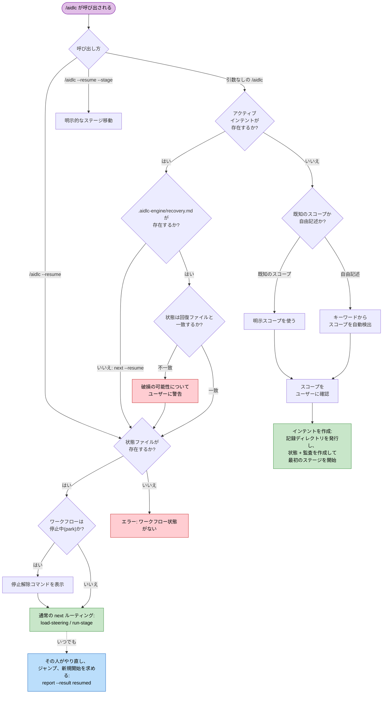
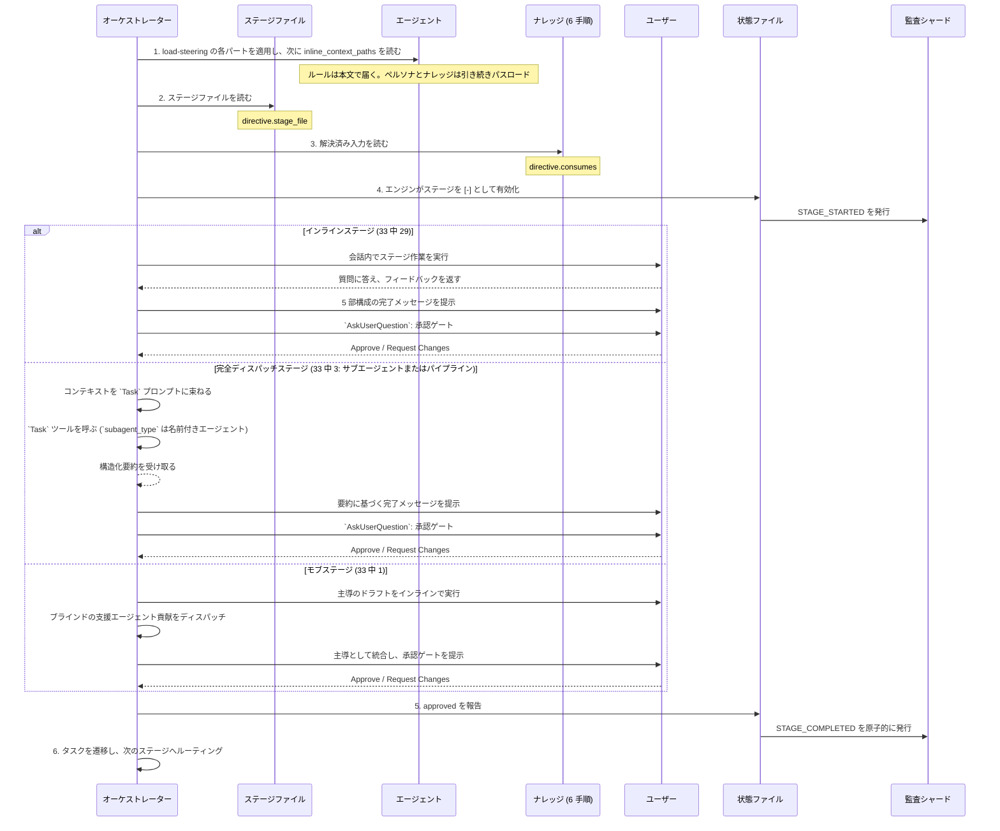
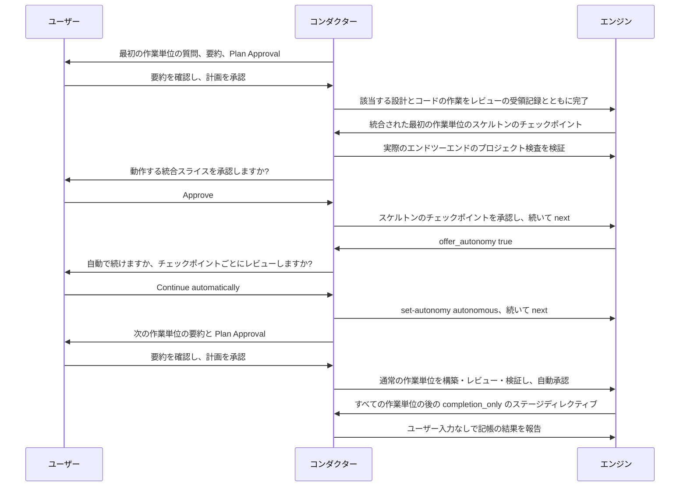
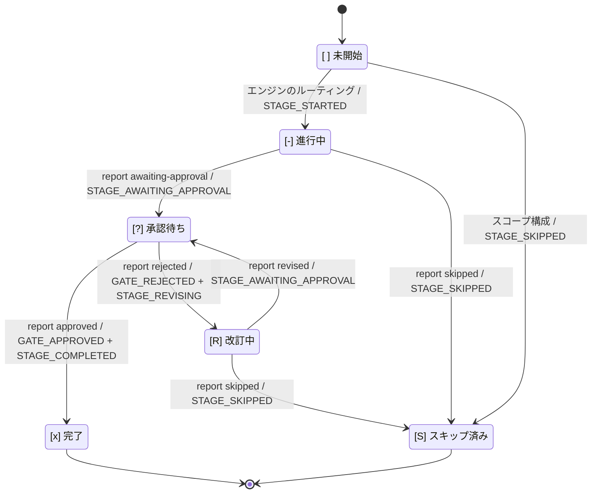

# オーケストレーター

オーケストレーションは 2 つの要素に分かれます。決定論的な **エンジン**（`aidlc-orchestrate.ts`、サブコマンドは `next` / `continue` / `report` / `park` / `team-board` / `wait` のちょうど 6 つ。`continue` は内部のステアリング転送用で、`team-board` は Team Construction の読み取り専用クエリ、`wait` は委任した作業を時間を区切って読み取り専用で待つ処理）が、スコープ判定、ステージのルーティング、ジャンプ先の解決、再開および初期化のガード、ゲート状態、ワークフロー完了という、ステージ間のあらゆる判断を担い、各 `next` で型付きの **ディレクティブ**を出力します。**コンダクター**（`.claude/skills/aidlc/SKILL.md`、`/aidlc` 経由で起動）は、各ディレクティブに従って動く薄い転送ループです。指定されたステージを実行し、人間に質問し、スウォームをファンアウトして、ステージ作業の結果を `report` で返します。エンジンの質問への回答は代わりに、型付きの `next`、`command`、`claim`、`execute-remedy` のいずれかの経路に従います。ステージ以外の報告（`report --result resumed`）を使うのは、再入時のやり直し・ジャンプ・新規開始の依頼だけです。`SKILL.md` は制御プレーンではありません。ルーティングの判断はエンジンと、それが読むコンパイル済みデータ（`tools/data/stage-graph.json`、`tools/data/scope-grid.json`）にあります。`SKILL.md` は、エンジンが指定した処理の内側での実行品質を担います。

この章では、ワークフローの振る舞いをコンダクター側から文書化します。対象は、エントリポイント、セッション管理、スコープからステージへの対応付け、ステージ実行と前進のプロトコル、意図的な逸脱点です。エンジンの内部、すなわち `next` / `report` 契約、型付きディレクティブ共用体、コンダクターのペルソナ、複数形スキル、スコープの形状、スウォーム審判については、[エンジンとスキルシステム](17-skill-system.md) を参照してください。利用者向けのコマンド使用法は、[ユーザーガイド -- CLI コマンド](../guide/12-cli-commands.md) を参照してください。

> **責務に関する注記。** この章で説明する振る舞い、たとえば引数解決、スコープ検出、ジャンプ検証、再開時の分岐は、すべて各 `next` ごとに **エンジン** が計算し、ディレクティブとしてコンダクターへ渡します。古い文で「オーケストレーターが X を行う」と書かれていた場合は、「エンジンが X を判断してディレクティブを出し、コンダクターがそれを実行する」と読み替えてください。判断ロジックは常に決定論的なツールコードであり、`SKILL.md` の文章ではありません。

> **パスの表記規則。** 各インテントの状態、監査証跡、インテント範囲の成果物は、その **記録ディレクトリ**、すなわち `aidlc/spaces/<space>/intents/<YYMMDD>-<label>/` 配下にあり、以下では `<record>/` と表記します。逆工学は例外で、その永続的なリポジトリ単位の出力は `aidlc/spaces/<active-space>/codekb/<repo>/` にあります。監査証跡は `<record>/audit/` 配下にあるクローンごとのシャードディレクトリであり、単一ファイルではありません。

---

## 目次

- [エントリポイント](#エントリポイント)
- [セッション管理](#セッション管理)
- [スコープからステージへの対応付け](#スコープからステージへの対応付け)
- [ステージ実行エンジン](#ステージ実行エンジン)
- [ステージ前進プロトコル](#ステージ前進プロトコル)
- [タスク追跡](#タスク追跡)
- [意図的な逸脱点](#意図的な逸脱点)
- [エラー処理](#エラー処理)
- [付録 A: ステージグラフリファレンス](#付録-a-ステージグラフリファレンス)
- [付録 B: フックリファレンス](#付録-b-フックリファレンス)
- [付録 C: 承認ゲートのパターン](#付録-c-承認ゲートのパターン)

---

## エントリポイント

コンダクターはエンジンの最初の `next` に `$ARGUMENTS` をそのまま渡します。事前解析は行いません。エンジンがフラグと自由記述テキストを解析し、以下のどの呼び出しパターンに当たるかを解決して、対応するディレクティブを出力します。これらのパターンはエンジン側で解決される入力であり、コンダクター側の分岐ではありません。

### `/aidlc [scope]` -- 明示スコープ

引数が既知の 11 のスコープ（`enterprise`, `feature`, `mvp`, `poc`, `bugfix`, `refactor`, `infra`, `security-patch`, `classic`, `workshop`, `express`）のいずれかに一致する場合:

新しいワークスペース（まだインテントがない、つまり `aidlc/spaces/*/intents/*/` 配下に `aidlc-state.md` がない状態）で明示的にスコープを指定すると、**最初のインテントが作成されます**。エンジンの `next` は、実行後に継続する `print` ディレクティブを出力し、`aidlc-utility.ts intent-create --scope <scope>` を指名します（`--depth` / `--test-strategy` / `--project-type` / `--review` フラグがあれば、そのままそのコマンドへ渡します）。コンダクターはそれを実行し、最初のステージへ着地するために `next` を再実行します。裸の位置引数（`/aidlc bugfix`）でも明示フラグ（`/aidlc --scope bugfix`）でも、出力される作成用の表示は同一です。スコープ名の後にコロンを続けた形（`/aidlc bugfix: Fix duplicate todos`）も、エージェントが依頼全体を 1 つの引用符付き引数として渡した場合も含めて、同じように名指しになります。スコープの語で始まるだけでコロンのない 1 つの引用符付き引数は説明のままなので、コンダクターはその人が名指しした計画を独立した引数として渡します。何を作るかを説明する形（`/aidlc "build the auth service"`）でも作成されます。スコープ名も説明もない裸の `/aidlc` は作成しません（環境変数や既定値で解決されたスコープは作成の合図ではありません）。代わりに、何を作るかを説明するかスコープを名指しするよう促す、状態未作成エラーを出します。このチャットに、その人が次に始める作業のために設定したもの（検査のオフ、Guard Policy、儀式、計画の承認のオフで、まだ 1 時間以内のもの: `switchKeptForNextWork`）が残っている場合は、何も問題がないので、その手順は手番を終える `print` になります。その語りが次に何を作るかを伝え、すでに伝えた行もそれに乗り、`error` ではないので、エンジンエラーの中継が仕組みの説明を繰り返すこともありません。

1. `aidlc/spaces/<active-space>/memory/` からガードレールを読み込みます。
2. ユーザーへ "What would you like to build?" と尋ねます。
3. スコープからステージへの対応付けに従って、実行すべきステージを決定します。
4. 初期化フェーズ（ワークスペーススキャフォールド、ワークスペース検出、状態初期化）を、決定論的な `aidlc-utility intent-create` 呼び出し 1 回として実行します。ウェルカムメッセージはセッション開始時に、`settings.json` の `companyAnnouncements` 経由で描画されます。
5. スコープ内のすべてのステージについて、ステージ単位のタスクを作成します。最初のステージは `in_progress`、残りは `pending` に設定されます。スコープ外のステージにはタスク自体が作られません。
6. 初期化後の最初のステージを開始します。

### `/aidlc [freeform]` -- AI スコープ検出

引数が自由記述テキスト（既知のスコープキーワードではない）である場合:

1. `aidlc/spaces/<active-space>/memory/` からガードレールを読み込みます。
2. キーワードパターンに照らしてインテントを分析します。
   - 修正・不具合・破損を示す語（および `bugfix`）は `bugfix` に対応します
   - リファクタ・整理・単純化を示す語は `refactor` に対応します
   - インフラ・デプロイを示す語は `infra` に対応します
   - セキュリティ・脆弱性・パッチを示す語（および `CVE`）は `security-patch` に対応します
   - 概念実証・試作・スパイクを示す語は `poc` に対応します
   - 最小実用を示す語は `mvp` に対応します
   - ワークショップ・ラボ・研修を示す語は `workshop` に対応します
   - エクスプレス・軽量を示す語は `express` に対応します
   - 基盤となるキーワードなしリゾルバーは、標準インストールでは `classic` を既定にします。ユーザー向けの初回開始経路では、一致がない場合や説明が長い場合、まずコンポーズを提案します
3. 曖昧性解消ルール: 5 単語を超える説明にはコンポーズを提案します。ただし、高特異度キーワード（`refactor`、`mvp`、`minimum viable`、`poc`、`proof of concept`、`CVE`）または修正の依頼に否定されていない一致があれば例外です。修正の依頼とは、説明、文、箇条書きの項目の冒頭（「please」「can you」「we need to」のような前置きの後でもよい）や、そうした前置きの後のカンマの後に来る `fix` または `bugfix`、あるいは誰かに頼む文（「could you ... fix that?」）の末尾の「fix it」「fix that」「fix this」です。「fix-up」や「auto-fix」のようなハイフンでつないだ複合語は数えません。高特異度の一致は修正の依頼より優先されます。同じスコープの一般的なキーワードが先に一致していても、例外の判定はすべてのキーワードを確認します。直前の近い位置に否定表現がある一致は除外します。候補スコープが複数あれば、引き続きアルファベット順で決めます。例と制約は[スコープの自動検出](../guide/05-scopes-and-depth.md#auto-detection-from-freeform-intent)を参照してください。
4. 明確なキーワード一致があれば、コンパイル済みグリッドとワークスペース走査から実効的なセレモニーを引いて、型付きの `scope-confirm` の質問を出力します。スコープ、依頼のプレビュー、ステージ数、承認ゲート、そして確認・スコープ変更・合わせた計画のコンポーズの選択肢です。ディレクティブは `response_route: "next"` と `proposed_scope` を運び、依頼を ID でしか名指ししません（貼り付けられた `<document>` ブロックはデータとして質問ストアに留まり、質問に入ることは決してありません）。さらに `confirm_command`、`compose_command`、`scope_commands`（有効なスコープごとに完全でシェル引用済みのコマンドを 1 つ）と、`choices` を運びます。`choices` はその人向けに言葉を整えた 2 つの回答（提案された計画で進める、このタスクに合わせた計画を作る）で、それぞれにコマンドが付いているため、選択肢を表示するホストはこれらを提示します。依頼と一緒に入力された深さ、テスト戦略、あるいはセンサー、学習、要約確認、協働者のスイッチは 3 つすべてに乗るので、作業はプレビューのとおりに作られます。計画の承認が乗るのは `on` のときだけです。それをオフにできるのはその人自身の言葉だけだからです。質問が依頼を引き写すのは最大 240 文字で、切り詰めた場合は `...` で終わります。依頼が貼り付けられた文書を含む場合、質問は最初の `<document>` から最後の `</document>` までの範囲の外にある言葉だけを引き写し、どう分けたかを伝える 1 行を足します。グリーンフィールドのプレビューには、インテント作成と同じ逆工学スキップが適用されます。作業単位ごとの句が追記されるのは、そのスコープが `units-generation` を実行し、その構築ステージが得られた作業単位 DAG の上でファンアウトする場合だけです。コストの句は、作成フラグや環境の停止スイッチを含め、無効になっている実効ポリシーも名指しします。classic の既定では `; no summary confirmation; lead agent only` が付き、要約確認をオンにするとその部分が消え（advisory のレビュー上限は無効化された儀式ではありません）、協働者をオンにすると `lead agent only` が消えます。何も無効化されておらず協働者がオンのスコープでは、この句は省かれます。
5. 一致なし / 文章が豊富な場合は、`response_route: "next"`、`compose_command`、`scope_commands` を持つ型付きの `compose-offer` の質問を出力します。`scope_commands` の各行は、このプロジェクトでのその計画の `stages` 数（「15 stages」。初期化の後のステージ）を、質問と同じ数え方で運ぶため、計画を選択肢として並べるホストは、自前の数ではなくエンジンの数を表示します。コンポーザーは、そのタスクの実装エントロピーを見積もり、実行可能な最小の EXECUTE/SKIP グリッドを人間ゲート付きで提案します（下記参照）。提案に含まれるスコープ例一覧にも件数が付きます（既存のコードベースでは `bugfix = 6 stages, express = 7, classic = 15, feature = 30`）ので、選ぶ前に規模差が見えます。また、説明に一致する語がなくても `bugfix` は名指しされます。
6. 確認後、コンダクターは `report` を呼ぶ代わりに、質問が持つ完全でシェル安全な `next` コマンドを実行します。スコープとコンポーズのコマンドは依頼の本文ではなく `--request <8hex id>` を運びます。別のスコープにする場合は、選んだ計画と `scope` が一致する `scope_commands` のエントリを実行します。エントリのない名前は有効なスコープではありません。エンジンは ID を保存済みの完全な説明へ解決し、インテント作成がそれを `aidlc-state.md` の `Project` として記録します。
7. ユーザーが検出結果のスコープを上書きした場合は、ユーザーが選んだスコープを使います。

エンジンは各質問の依頼のコピーを `{id, text, proposedScope, origin, askedAbout?, newWork?, composedFrom?, stateSha256?, settings?, approvedRequest?, createdAt}` として保持します（ルーティングの質問の `settings` は `{newWork, existingWork}` を保持します。新しい作業の回答と既存の作業についての回答が運ぶ `next` のフラグトークンで、各トークンはフラグ名か 1 語の値、カンマでつないだステージの一覧で、読み取り時に検査されます。これには、ステージの質問が開いている間に入力された新しい作業について尋ねるルーティングの質問も含まれます。選択肢のコマンドを伴わずに届いた回答、つまり選択肢を名指しする返信や素の `next --request <id>` は、これらの設定を質問から得ます。`approvedRequest` は、新しいクローンでの計画の承認のように、ルーティングの質問がその回答を止めた質問の ID です。ルーティングの質問から始めた新しい作業はその依頼に答えるため、作業は一度だけ始まり、その質問で言った言葉もそこに届きます。そしてその作業が存在すれば、どの経路もその作業を続けます。承認済みの計画の `--skip`/`--add` は、その計画自身の新しい作業の回答にだけ乗ります。）（`newWork` は `next --new-intent` を通じて新しい作業のために尋ねた質問を示し、その回答は、どの既存の記録のことかを尋ねる代わりに、その作業を始めます。）コピーは `aidlc/.aidlc-sessions/questions/` 配下の gitignore 対象の専用ファイルに一度だけ書かれ、書き直されることはありません。そのため 1 つのクローンの並行セッションが互いの質問を共有したり無効にしたりすることは決してありません。もう一度尋ねると新しい ID の新しい質問になり、以前の質問も引き続き回答できます。コピーはワークスペースのほかの部分と同じ OS の権限に従い（作業が始まれば依頼はいずれにせよそこに置かれます）、シンボリックリンクを含むパスを通じて読まれることはありません。コピーはその回答が作業を始めた時点で削除されます。未回答の質問は、`question-retention-days`（または `AIDLC_QUESTION_RETENTION_DAYS`）が保持期間を設定しない限り残り、コピーが失われた質問は、作業をもう一度説明するよう求めるメッセージでエラーになります。インテント作成は、記録を一覧に載せる前に記録全体を作ります。まずフォルダー、監査、プロジェクトの説明、次にワークフローの状態（質問を `Question Id` として名指しする）、最後に `intents.json` の行（それを `request` として記録する）です。開始が一覧に載せなかった完成済みの記録（2 つの間で止まった開始）を見つけた再試行は、別の記録を作らずにその記録を一覧に載せます。`aidlc-state.md` の無いフォルダーはどの記録の走査からも見えないため、状態が書かれる前に途切れた開始は何も一覧に載せず、もう一度試すと（次の空いているフォルダー名で）作業が作られます。同じ回答を繰り返しても作業が二度作られることはありません。`intent create` と `next` はその質問 ID を持つ行を見つけ、まだ進行中の作業は続け（`Already started <record>, continuing it.`）、アーカイブ済みや完了済みの作業についてはまず尋ね（`You already started this as <record>, which is archived. Start it again as new work?`）、その記録に保存された説明から、最後に実行したスコープで改めて始めます（スコープの変更は新しいスコープをその `intents.json` の行に記録します）。遅れた回答: 新しい作業の質問の開始や新しい計画の回答は、別の作業がアクティブになった後でも回答として働き、新しい作業をそれと並べて始めます。`new-work-routing` の質問は、それが名指ししたスペースと記録（フォルダーと uuid による）に結び付いており、その `continue_command` と `compose_command` はそのいずれかにだけ作用し、別のものが選択されている場合は、人間が確認したスコープでルーティングの質問を改めて尋ねます。従来のフラットなレイアウト（ワークスペース以前）のプロジェクトでは、質問に基づく作成は何かを動かす前に拒否し、質問は回答できる状態のまま残ります。拒否は、フラットなワークフローを独自のインテントへ移す一度きりの `intent create --scope <scope>` を名指しし、その後は同じコマンドで依頼が作成されます。コンダクターはこれらのランタイムファイルを読んだり書き直したりせず、完全な依頼の代わりにプレビューを使ってはなりません。

既存のインテントに選択済みのカーソルがなく、選択可能な記録が少なくとも 1 つある場合、保留中の作業があるスコープを確認すると、依頼を選択肢一覧に落とす代わりに、どのハーネスでも `new-work-routing` を出力します。`new_work_description` は依頼の指示を一度だけ含み、`proposed_scope` は確認済みのスコープを保ち、`available_intents` は正確なセレクターを列挙し、`response_route` は `next` で、`numbered_prose_question` はエンジンが書いた番号付きの描画を提供します。経路は人間向けの質問の中ではなく、フィールドとして運ばれます。`new_intent_command`（提案スコープでの別の新しい作業）、`scope_commands`（人間が修正したスコープのための、有効なスコープごとの同様のコマンド）、`compose_command`（再構成）、`select_commands`（セレクターごとに完全な `next --pick` コマンドを 1 つ。その記録を選択して同じ手番で続ける。依頼と一緒に設定が入力された場合は、セレクターごとに `next --continue --request <id> --record <selector>` を 1 つ。その記録を選択してから、それらの設定で続ける）、`reshape_commands`（セレクターごとに 1 つ。それを選択してから再構成する）で、どれも同じ質問 ID を運びます。代わりにアクティブなワークフローについて尋ねる場合、質問は `available_intents` と `select_commands` の代わりに `continue_command` を運びます。依頼と一緒に入力された設定はこれらのコマンドに乗るため、その人が選んだ作業に適用されます。新しい作業のコマンドは、レビューのレベルや引き上げた Guard Policy も含め、それを伴って作業を作ります（引き下げた Guard Policy は既存の作業についての回答に乗り、そこで適用されます。新しい作業のフラグとして試されることは決してありません。human-turn フックは依頼と一緒に入力されたその人自身の言葉をそのために保持し、作成の `narration` が、その言葉が保持された場合はどこに適用されたかを `Guard Policy <value> for the new work (set by you).` と伝えます。依頼と一緒にオフと入力された検査、`--guard.<fence> off` も同じように乗り、説明の一部になることは決してなく、その行は `The review freeze check is off for the new work (set by you).` です。その言葉は、途中でエンジンがさらに尋ねる質問をまたいでも保たれます。別の質問に答えている間に保存された質問は、その依頼自身の根を `composedFrom` として記録し、その人はルーティングの質問そのものと一緒に最初の行 `The review freeze check is off for the work you are asking for (set by you).` を聞くからです。作成は、このチャットにまだ伝えるべき行を、作成する作業へ引き渡します（`carryPendingPersonLines`）。新しい記録を選択すると、それらの行はチャットが離れた作業に結び付いたままになってしまうからです）。`continue_command` はそれをアクティブな作業に適用し、再構成は、コンポーズの前に `config set` でそれを適用します。質問はその設定を保存済みのコピーにも `settings` として保持するため、選択肢を名指しするだけの返信もそれを再生します。作業がアクティブなとき、新しい説明と一緒に入力された設定や、説明の前の計画の語（`/aidlc bugfix Fix login`）は、アクティブな作業を変えて説明を落とす代わりに、このように尋ねられます。継続は選んだ記録の select コマンドを実行してその `print` に従い、再構成は選んだ記録の `reshape_commands` のエントリを実行します。これはその記録を選択してから、途中で止まらずに再構成します。この質問の選択肢の 1 つを名指しするだけの返信（そのラベル、描画されたとおりの番号付きの行、または下記と同じ規則による素の `1`-`3`）は、この作業のどのチャットからでも、そして承認を止めた質問については、その承認済みの依頼が作業を始めるまで、それに回答します。選択肢 2 は、一覧の記録に何が起きても `new_intent_command` を実行します。新しい作業はそのどれにも作用しないからです。そのため、新しいクローンで承認された計画に続く質問では、承認済みの計画を作成します。選択肢 1 と 3 は、何も選択されていない間はその人の経路を保ち、質問が列挙した記録のうち、同じ名前と uuid でまだ残っているものにだけ作用します（その進み具合は関係ないので、別のチャットで作業が進んでも何も変わりません）。質問が 1 つの記録を列挙していた場合は、その select または reshape のコマンドを実行します。複数を列挙していた場合、エンジンはどの作業かだけを尋ねる `intent-pick` の質問を返し、各選択肢はその記録自身の select または reshape のコマンドを運びます。一覧の記録が 1 つも残っていない場合や、その後に作業が選択された場合、選択肢 1 と 3 は質問自身の遅れた回答（`--continue` または `compose --request <id>`）を実行します。これは、今選択されている一覧の作業に作用するか、依頼を保ったまま、そこにある作業について改めて尋ねます。保留中の作業がない場合、エンジンは `intent-pick` を出力します。選択した `available_intents` の値と `selector` が一致する `select_commands` のエントリを選び、その `command` をそのまま実行します。セレクターをコマンドに埋め込むことは決してしません。そのコマンド（`next --pick <record>`）は記録を選択して続けるので、作業を再開するのに必要な回答は 1 つです。質問はその人に尋ね、作業が 1 つならそれを名指しし（「Carry on with `<name>`, or not now?」）、エージェントはそれを表示してその人の回答を待つため、「今はしない」も選択肢のまま残ります。

単独で言われた継続の言い回しは、ルーティングの依頼ではありません。`carry on`、`continue`、`keep going`、`go on`、`resume`（`aidlc-lib.ts` の `CONTINUATION_PHRASES`。エンジンが読む唯一の一覧）で、前後に `please` が付いていてもかまいません。大文字小文字、空白、`please` の横のカンマ、末尾の `.` や `!` は関係ありません。ワークフローがアクティブなとき、またはパーク後にその人が戻ってきてパークされているとき、その言い回しだけの `next` は、下記の開いている質問、コード計画の質問、承認ゲートの読み取りの順番が済んだ後、素の `next` が返すものを返します（下記の再入の読み取りには決してなりません）。作業はあるが何も選択されていない場合は `intent-pick` の質問を返します。それ以上のもの（「carry on with a login page」）は下記のとおりルーティングされ、進行中の作業がない場合、その言い回しは従来どおりに読まれます。

ワークフローがアクティブな間に `next` へ渡された自由形式の文章も、同じ `new-work-routing` の質問になります。例外は 2 つです。文章が開いているルーティングの質問自身の選択肢の 1 つだけ（そのラベル、描画されたとおりの番号付きの行、または素の `1`-`3`）である場合、それはその選択肢自身のコマンドです。`continue_command`、`new_intent_command`、`compose_command` を質問が渡したとおりに実行するため、継続と再構成の選択肢は引き続き質問が名指しした作業にだけ作用し、そうでなければ改めて尋ねます。開いているルーティングの質問とは、最も新しく保存された質問です。その別作業の選択肢は、その後ワークフローに何が起きても新しい作業を始め、継続と再構成の選択肢は、そのワークフローがどこまで進んでいても（改訂、完了したステージ、このチャットでも別のチャットでも）それに作用し、別のワークフローが選択されているか、そのワークフローがなくなった場合だけ改めて尋ねます。素の番号の場合はさらに、その後に記録された質問がなく、この返信のほかにその人の手番がないことも必要です。選択肢以上のもの、たとえばラベルの後にさらに言葉が続くものは、その人自身の言葉なので尋ねられます。現在の `[-]` ステージにその人がまだ回答していない質問がある場合（停止フックが読む `DECISION_RECORDED` の対で、その例外と同じ規則によるため、自律 Construction 中は除きます）、エンジンは回答と新しい作業を区別できないため、それぞれの読み方に対応するコマンドを持つ `print` を返します。質問の回答コマンド（`log answer`、またはその Unit やバッチを名指しする、Unit／バッチのチェックポイント自身の approve や reject のコマンド）か、`next --request <id>` です。後者は質問のコピーとして保持したその人の言葉を使って、作業がどこに属するかを尋ねます。コンダクターはどちらかを読み取り、判断できない場合はその人に尋ねます。エンジン自身のコード計画の質問も同じように、どのチャットからでも、ステージの質問より先に読み取られます。それが待っている間、文章には `log answer --stage code-generation --checkpoint plan-approval` の手順（その人が計画ファイルを編集している間は、完了したと言ったときの `next`）または `next --request <id>` を名指しする `print` が返ります。それが尋ねるすべての計画に回答が付いた後は、その選択肢のちょうど 1 つである文章には、その選択を実行する素の `next` を実行する `print` が返ります。記録済みの回答と異なる選択をする場合は、後の選択を記録する `log answer` の手順が返ります（`Approve Plan`、すぐに編集モードを始める `I'll edit the files`、または何かが構築される前に質問を戻す `Review the plan`。編集は、記録済みの回答の後にその人が返信した場合だけです）。現在のステージが承認ゲートで待っている間の文章には、ゲートの `report --result approved` と `report --result rejected` の手順、または `next --request <id>` を名指しする `print` が返ります。質問の監査テキストも返信も、ディレクティブには乗りません。

ワークフローと異なる `--scope` と一緒に入力された文章も、言葉を落としてしまう素のスコープ変更ではなく、同じ `new-work-routing` の質問になります。その別作業の選択肢が最初に来て、説明された作業をそのスコープで始めます。2 番目の継続の選択肢は、ワークフローをそのスコープへ変えることとして読まれ、その `continue_command` は `--scope` を運ぶため、その回答でスコープが変わります。素の番号や選択肢のラベルはその順序に照らして読まれ、スコープを運ぶのは継続の回答だけです。言葉のない異なる `--scope` は引き続き直ちにスコープを変え、ステージの変更（`--skip`、`--add`）と一緒に入力されたものはその経路を保ちます。名指ししたステージが、スコープとともに開いている作業の計画を変えます。

アクティブな作業の上で自由形式の言葉だけ（`next` がフラグ、スコープ、動詞、名詞として読むものが何もなく、それが答えうる開いた質問も承認ゲートもない）の場合は、型付きの再入の報告（「take me back to requirements analysis」のような言葉に対する `report --result resumed --choice <redo|jump|fresh>`）、または `next --request <id>`（コンダクターが判断できない場合も）を名指しする `print` が返ります。後者は言葉を保持したまま `new-work-routing` の質問を尋ねます。そのため、`/aidlc` 自体と一緒に入力されたやり直し・ジャンプ・新規開始の依頼はその依頼になります。設定が横に入力された言葉は、その設定と一緒に尋ねられます。

ソロの unit-major のウォークでは、ある Unit の作業、その要約確認、そのチェックポイント（学習の質問とチェックポイントの承認）は Current Stage より先に進み、その質問を `next` が指示するステージの下に記録します（チェックポイントはブロックの最後のステージの下）。そのため文章は、停止フックと同じ規則でそのステージの開いた質問を読みます。尋ねたチャットが終わった後に新しいチャットで入力された回答も、新しい作業のルーティングの質問ではなく、それが答える質問に届きます。ある Unit の承認を尋ねた後は、そのチェックポイントの手順はもう `learnings` を列挙しないため、その手順を再実行する新しいチャットは承認の質問へ直行します。

### `/aidlc compose` -- 適応コンポーザー

`compose` の入口（先頭の `compose` 動詞、`--new-scope`、または `--report <path>`）は、スコープ確認の代わりに、コンポーザーディスパッチ用の `print` をエンジンに出させます。この流れについてのコンダクターへの指示（ディスパッチ、提案のゲート、承認で何が実行されるか）は、オーケストレーターの `SKILL.md` の横にある `composer.md` にあり、print がそのファイルを名指しするので、エージェントがそれを読むのは計画をコンポーズするときだけです。この動詞は意図的にワークスペース動詞ではありません（ワークスペース動詞は Kiro 継ぎ目が帯域外で実行する端末ユーティリティコマンドであるのに対し、`compose` はコンダクターがディスパッチするワークフロー作業だからです）。2 つのモードが状態ファイルの有無で分岐します。

1. **前方 / 報告（まだワークフローなし）:** コンダクターは `aidlc-composer-agent` をディスパッチし、そのエージェントが読み取り専用の `detect --json` 走査を実行し、5 つの実装エントロピー構成要素を見積もり（CodeKB MCP が構成済みならその証拠を、なければワークスペース走査を使用）、構造化提案（`mode matched|custom`、必須で空でない `creationDescription`、構成要素スコアと証拠方式を含む `ars` ブロック、`arsRationale`、グリッド、1 行の根拠付きの 5 つの `scopeSettings`（`sensors`、`learnings`、`summary_confirmation`、`plan_approval`、`review_cap`）、各 SKIP の根拠、バリデータから逐語コピーされた `summary`、さらに事前描画済みの Markdown 表 2 つ、すなわちバンド付き ARS スコア表と理由付きステージ別判断表）を返します。これは `aidlc-graph.ts validate-grid` で検証されます。検証はコンパイル済みステージ集合との完全一致を要求し、グリッドのステージ / ゲート / 作業単位あたり件数を含む `summary` に加えて `nearest_stock` を返します。設定はスコープローダーが受け付ける語と照合し（`scope_settings` として返し、`summary.off` がそれによってオフになるものを名指しします）、コンポーザーの最終的な `--matched <stock-scope>` の実行では、その標準スコープと異なるグリッドや、適用できない Guard Policy を拒否し、残りの設定をこの作業に適用する `creation_settings` を返します。最終的な `--custom` の実行は、計画を走らせる標準スコープ（Guard Policy の既定が提案のもの以下である最も近いもの。`strict` ならどれでもよく、ゲートが表示しないウォーキングスケルトンや、計画の深さと異なるテスト戦略を持つものは決して選びません。新しいプロジェクトでは、条件を満たすものがあれば、新しい作業向けのものを `existing_code: true` と印の付いたスコープより優先するため、新しい作業が修正と呼ばれることはありません）を選び、それを `base_scope` として、それに対する `plan_changes` と `creation_settings` とともに返し、提案の必須の `depth` がそのスコープのものと異なる場合は `creation_depth` も返します。`--matched` を伴わないすべての実行は `custom_start` も返します。これは `classic` スコープの Guard Policy と設定で、カスタムの提案は、どの標準スコープで走る場合もそこから始まります。どちらの経路もスコープファイルを書きません。コンポーザー著述のスコープは順位付けから除外され、キーの欠落・余剰はどちらも差分として数えられます。コンポーザーは標準一致かカスタムかを、最終提案の `nearest_stock[0].diff <= 2` だけでルーティングします。機械的 ARS 選別の距離は助言扱いです。標準グリッドを採用する場合は、その最終グリッドを再検証し、要約と距離を差し替え、影響を受けた判断表の行をすべて再構築してから返します。コンダクターが判定を導き直すことはありません。コンダクターは承認 / 編集 / 却下のゲートを短い提案として表示します。平易な推奨と、バリデータの数を平易な言葉にしたもの（「Plan: poc, 8 stages, 5 approval questions」。その `shown` と `gates` の数から。初期化の後のステージ）に、承認前に人間が切り替えられる Scope settings の行を添えます。コンポーザーのステージ判断表と ARS スコア表（「Scoring detail (advisory)」の下）は、その人が求めたときに逐語で表示します。標準一致グリッドを編集した場合や、その Guard Policy を引き下げる編集をした場合、修正後の提案はカスタムへ変換され、検証と表の描画がやり直されます。標準一致の承認では標準の計画が作られるためです。承認時、標準一致では AI-DLC がそのまま直接ワークフローを作成します。カスタムの計画では、`base_scope` の上で `intent create --skip <slugs> --add <slugs>`（および `creation_depth` からの `--depth`、コンポーザーの `scopeName` を伴う `--plan-name`）でワークフローを作成します。これは計画を状態ファイルの EXECUTE/SKIP 接尾辞（recompose が使う上書き経路）として書き、ゲートが表示した名前である `Plan: <name>`（無ければ `tailored plan`）を記録します。走らせるスコープ名を記録することは決してありません。スコープファイルは書かれないため、コンポーズでスコープのライブラリが増えることはありません。カスタムのゲートは「Approve and save as scope」も提示します。作成後、コンダクターは `scope save --name <name>`（ユーティリティの `scope-save` ハンドラ）を実行します。これは実行中の作業の計画を永続的な記録 `aidlc/scopes/<name>.md` として書き、その投影をコンパイルするため、そのスコープはエンジンの再インストール後も残り、このハーネスでは直ちに、別のハーネスでは次の `graph compile` で解決されます（[保存したスコープの置き場所](../guide/05-scopes-and-depth.md#保存したスコープの置き場所) を参照）。同じコマンドで、その人が後から求めたときにいつでも計画を保存できます。スケルトンゲートの基準点 `firstPlannedStageOfPhase("construction", scope, state)` はそれらの接尾辞を読むため、コンポーズした計画の最初の構築ステージがその Bolt-1 ゲートになります。タスク文に基づくコンポーズでは、元のタスク文をそのまま `creationDescription` にコピーします。レポートのみ・タスク文なしのコンポーズでは、承認されたレポートや計画から導出します。タスク文に基づく作成は、ディスパッチの `--request <id>` コマンドに従い、保存済みの依頼をシェルの埋め込みなしに保ちます。レポートのみ・タスク文なしのディスパッチも `--request <id>` を運び、本文を持たない `compose` のエントリを名指しします。作成はその ID と、リテラルの `--` 区切りの後に承認済みの説明を 1 つの POSIX 一重引用符付き argv 値として渡し、エンジンはその説明を、この作業が答える前方の依頼として、エントリを名指しする `composedFrom` とともに保存し、そのうえでエントリを削除します。そのため、そのゲートで言われた計画の承認のスキップはこの作業にだけ届きます。後の依頼はエントリを置き換え、その後エンジンはそれを拒否します。スコープだけの作成は決して実行しません。
2. **実行中（ワークフロー稼働中）:** コンポーザーは、完了済みステージが実際に解決した内容からエントロピー構成要素を再見積もりし、`mode: in-flight` として、現在のスコープ、保持された実効グリッド全体、およびカーソルより先にある PENDING ステージに対する厳密な `changes.skip` / `changes.add` 配列を返します。近傍の標準グリッドを採用したり、スコープや深さを変更したり、完了済み / 進行中 / スキップ済みのアクションを書き換えたりすることはありません。この分岐では標準距離の一覧は両方とも助言扱いです。各切り替えの根拠には、スコアを動かした完了済みステージの証拠が挙げられます。検証は `--strict` で実行されるため、飢餓を招く切り替えはゲートの前に捕捉されます。コンダクターはゲートの前に保留提案マーカー（`aidlc/.aidlc-compose-pending`）を書きます（`Stop` フックはこれをターン停止合図として尊重します）。解決後に削除します。承認されると、その厳密な配列をそのまま `aidlc-utility.ts recompose [--skip <slug,...>] [--add <slug,...>]` に渡し（空の一覧は省略し、繰り返したフラグは累積します）、これが監査ロック下で計画接尾辞を反転し、新しい飢餓に対して厳密検証し、導出フィールドを再構築して `RECOMPOSED` を発行します。承認が設定も対象にしている場合は、同じコマンドがそれらを `--sensors`、`--learnings`、`--summary-confirmation`、`--review` として運び、1 回の状態書き込みで適用します。スコープレジストリのファイルは書かれません。マーカーは有界です。`Stop` フックはそれが新しい間だけ（ファイル更新時刻基準で 24 時間未満）尊重し、古い孤児（書き込みと解決の間でセッションが落ちたもの）は無視したうえで最善努力で削除します。つまり取り残されたマーカーが転送ループ強制を黙って無効化することはありません。`--doctor` もマーカーの存在と経過時間を報告します（新しい = 助言的合格、古い = 失敗）。`recompose` は自律構築中は拒否されます（ゲートに人間が必要なためです）。先にゲート付きへ切り替えるか、スウォームが終わるのを待ってください。検出はチャット優先です。コンダクターの転送前判断ステップ（新規作業を見つけるのと同じもの）が、自由な平文チャットの再構成要求（「what else can we cut?」）を分類し、それをそのまま転送する代わりに `next compose "<their words>"` としてルーティングします（そのまま転送すると分岐 10 に落ちて現在ステージが実行されてしまいます）。その人が自分の言葉でスキップや追加するステージを名指しした場合（貼り付けられた文書内の文章は決して該当しません）、コンダクターは代わりに `next --skip` / `--add` を実行します。これはゲートなしで直ちに再構成し、元に戻す方法を名指しします。その動詞は引き続き、誰が呼んだかに関係なく、飢餓 / 凍結 / カーソル後方 / スケルトンゲートの切り替え（および自律構築中のすべての呼び出し）を拒否します。

### `/aidlc --status` -- 進捗確認

ワークフローを前進させずに、現在の状態を参照だけで調べる読み取り専用コマンドです。

1. アクティブインテントの `aidlc-state.md`（`aidlc/spaces/<space>/intents/<YYMMDD>-<label>/` 配下）を読みます。
2. 現在のフェーズ、現在のステージ、完了率、保留中の判断、アクティブエージェントを表示します。
3. 必要なら、`stage-protocol-governance.md` の第 13 節に従ってフェーズ境界検査を実行します。
4. ワークフローは **進めません**。厳密に読み取り専用です。

### `/aidlc --stage <id>` / `/aidlc --phase <name>` -- ステージ / フェーズへジャンプ

特定のステージまたはフェーズへ直接ジャンプします。前方ジャンプと後方ジャンプの両方をサポートします。エンジンが対象を解決し、スコープ所属を検証し、ジャンプ方向を計算します。そのうえで `aidlc-jump.ts execute` ツールを指名する、実行後継続の `print` ディレクティブを出します。コンダクターはそのツールを実行し、再び `next` を走らせます。ジャンプの解決や検証はコンダクター自身では行いません。以下の番号付き手順は、ジャンプ計算（エンジン + ツール）が実施する内容を説明します。

**前方ジャンプ**（対象が現在位置より先）:
1. 対象を解決します。`--stage` はスラッグ（`code-generation`）または表示番号（`3.5`）を受け付けます。`--phase` は名前（`construction`）または番号（`3`）を受け付け、そのフェーズ内で最初のスコープ内ステージへ解決されます。
2. 既存の状態ファイルの有無を確認します。なければ自動初期化します（3 つの初期化ステージを実行）。
3. 対象を計画と照合します。計画がスキップするステージは、まず計画に戻されます（`recompose --add <slug> --reason "jump to <slug>"`、続いて `aidlc-jump.ts execute`）。そのためジャンプは求められたとおりに動きます。`recompose` は引き続き、計画が受け入れられない切り替えを拒否し、代わりにすべきことを名指しします。現在のステージ以前にあるスキップ済みのステージは、分離実行の代替（`--stage <slug> --single`）を示して拒否されます。戻ると、その後のすべてのステージを再実行することになるからです。
4. 間にあるスコープ内ステージを `[S]`（ジャンプによるスキップ）としてマークします。すでに完了済みの `[x]` ステージは変更しません。ソロの unit-major の構築では、Current Stage が作業単位ごとのステージである間も、明示的なジャンプは通ります。ウォークがすでに乗っている手順（ある Unit の作業、要約、または一時停止した手順）を対象にすると、素の `next` と同じようにルーティングされるため、何もスキップされません（パークされたワークフローは、`--resume` と同様にまずパークが解除されます）。進行中の Unit がすでに終えた作業単位ごとのステージを対象にすると、そのステージと以後のすべての作業単位ごとのステージが、その Unit についてだけ開き直されます。ディレクティブは `aidlc-jump.ts reopen --target <stage> --stages <stage,...> --units <unit>` を名指しし、これは Unit のチェックポイントの Request Changes が書くのと同じ Unit 単位の `GATE_REJECTED` を書くため、その Unit だけがそれらのステージ（コード生成の Plan Approval を含む）をやり直し、ほかの Unit はすべて終えた承認済みの作業を保ちます。ソロの unit-major の構築では、チェックポイントのオン・オフにかかわらず、Unit のライフサイクル受領記録は Unit ごとに下限が設けられるため、その行はその Unit にだけ届きます。`next --stage <stage> --every-unit` は、その手順にいる Unit を含め、そこに到達したすべての Unit についてそれを開き直し、`--unit <name>` はその Unit について開き直します。そのステージに到達していない Unit には 1 行の回答が返り、何も実行されません。`--stage` を伴わないどちらかのフラグや、名前を伴わない `--unit` は単純なエラーです。ステージのゲートが Current Stage を後の作業単位ごとのステージへ進めていて、ジャンプが後方に解決される場合も同じです。また名指しした Unit（`--unit`）については、Current Stage が作業単位ごとのステージを過ぎて Build and Test のような後の構築ステージへ進んだ後も同じです。そこでは開き直しが Current Stage も対象へ戻し、後方ジャンプと同様に対象とその後のステージをリセットしますが `STAGE_JUMPED` は伴わないので、その Unit だけがそれらをやり直し、その後で Build and Test がもう一度走ります。そこから Unit を名指しせずに、または `--every-unit` で戻るジャンプは通常の後方ジャンプで、その `STAGE_JUMPED` が対象以降の新しい試行を始めます。すべての Unit が対象とその後のステージをやり直し、それより前のものは保ちます。1 つの遅い質問（Unit のチェックポイントがオフの unit-major）で、その人が一覧の 1 つのステージについて変更を求めると `--change` が付きます。開き直しは `--via change` を運び、その行はその人の言葉を変更として保持し、`next` は開き直した Unit の手順を開いているゲートより先にルーティングし、エージェントは保持・変更・やり直しを尋ねずにその人の言葉から変更を行います。その後、同じ 1 つの質問が戻ってきます。開き直されない、開いた手順を持つ Unit はまず一時停止され（`aidlc-state.ts unit pause --set-aside-for <reopened unit>`。すでに一時停止している手順については、動詞が自分の理由と次のアクションを保つため、記録された言葉がコマンドに出力されることは決してありません）、パークされたワークフローはまずパークが解除されます。その旨は 1 行で伝えます。「Paused unit beta at Code Generation and reopened NFR Design for unit alpha. Say 'back to beta' to pick beta up again.」ウォークは、脇に置いた理由となった Unit に作業がある間は、脇に置いた一時停止で止まりません。その後、脇に置いた Unit を再び取り上げるか尋ね、`next --stage <its step> --unit <it>` はそれをより早く取り上げます（進行中の Unit を同じように一時停止し、続いて `unit resume`）。進行中の Unit がウォークで先に来ます。ウォークが従えない `--unit` のジャンプ（stage-major の構築、作業単位ごとではないステージ、またはチェックポイントがオフで、すべての Unit についてすでに承認済みのステージ）は何も変えません。print ディレクティブは、その人向けの 1 行（「... Nothing changed. Say 'for every unit' to do that.」）と、エージェント向けにだけ、その人が「for every unit」と言った場合に実行する `next --stage <stage> --every-unit` を渡します。そこでの `--every-unit` は通常のジャンプそのものを意味するので、それを実行し、エージェントは何を開き直したかを 1 行で伝えます。状態遷移ガードは `jump reopen` をライフサイクルの変更として扱うため、委任されたサブエージェントはそれを実行できません。後の作業単位ごとのステージは、いずれかの Unit が作業を終えた後は、進行中の Unit だけを先へ進めます。ディレクティブは `aidlc-jump.ts execute --target <stage> --direction forward --units <unit> --stages <stage,...>` を名指しし、これは名指しした各手順を、状態ツール自身の 1 Unit のスキップ（`aidlc-state.ts skip <stage> --unit <unit>`、`UNIT_SKIPPED` の受領記録）でその Unit についてスキップし、まさにそれらの手順を `stages_skipped` として報告します。`STAGE_JUMPED` を書かず、ほかの Unit がまだ負っているチェックボックスに印を付けず、Current Stage をそのままにするため、ほかの Unit はすべて終えた承認済みの作業を保ちます。その手順は、対象の前にウォークがその Unit を止めるはずだったものです。パークされたワークフローはまずパークが解除され、その行は戻る方法として `/aidlc --stage <earliest skipped step> --unit <unit>` を名指しします。現在の試行でスキップした手順は到達済みとして数えるので、ウォークがその Unit を通り過ぎた後でもその開き直しは働きます。それ以外の前方の対象は通常どおりジャンプされ、print ディレクティブは、ジャンプがスキップする、Unit がまだ終えていない手順（そのファイルは残ります）と、対象以降で Unit が終えた、やり直しになる手順を名指しする文を足します。いずれの場合も、エージェントにそれを 1 行で伝えるよう、そして `/aidlc --stage <earliest skipped step>` でスキップしたものを開き直せることを伝えるよう指示します。
5. 上流成果物の不足について警告します。確認は求めません。ジャンプを求めたのはその人だからです。
6. ステージ単位のタスクを作成し、対象ステージから実行を開始します。

**後方ジャンプ**（対象が現在位置より後ろ）:
1. 前方ジャンプと同じ解決・検証を行います。
2. 下流ステージ（対象より後）をすべて `[ ]`（未開始）へリセットします。ディスク上の成果物は保持され、削除されません。
3. 対象ステージとその後続ステージが再実行されるとき、既存成果物を検出し、「保持 / 変更 / ゼロからやり直し」を提示します。ただし、その人がすでにどれを望むかを言っている場合（たとえば、やり直しを求めた場合）は提示しません。
4. ステージ単位のタスクを作成し、対象ステージから実行を開始します。

`--scope`（スコープの設定 / 上書き）、`--depth`（深さレベルの上書き）、`--test-strategy`（テスト量の上書き）と組み合わせ可能です。

### `/aidlc --scope <scope>` -- スコープの設定 / 上書き

ワークフロースコープを設定します。単独で使う場合（`/aidlc --scope bugfix`）は `/aidlc bugfix` と同じです。`--stage` または `--phase` と組み合わせた場合は、ジャンプ操作に対するスコープを提供します。`--depth` および `--test-strategy` と組み合わせて既定値を上書きできます。

### `/aidlc --depth <level>` -- 深さの上書き

深さレベル（最小・標準・包括的）を上書きします。単独で使う場合は、アクティブワークフローの深さを更新します。`--scope` と組み合わせた場合は、新しいスコープの既定値を上書きします。単独変更では `DEPTH_CHANGED` 監査イベントを記録します。

### `/aidlc --test-strategy <level>` -- テスト戦略の上書き

深さとは独立してテスト量戦略（最小・標準・包括的）を上書きします。未指定時は現在の深さが既定です。`--depth standard --test-strategy minimal` のように、成果物は充実、テストは最小、といった組み合わせを可能にします。単独変更では `TEST_STRATEGY_CHANGED` 監査イベントを記録します。

### `/aidlc --project-type <type>` -- 新規プロジェクトか既存コードか

その作業が新規プロジェクト（`greenfield`）か既存コード（`brownfield`）かについてのその人の言葉で、ワークスペースの走査より優先されます。ワークフローがない場合、`next` はそれを作成コマンドと、スコープ確認およびコンポーズの回答へ渡し、コンポーザーのディスパッチは、走査の種別の代わりにそれを使って計画を採点するようコンポーザーに伝え、セレモニーのプレビューはそれに応じて逆工学を数えます。ワークフローが実行中の場合は、ほかのどの分岐が依頼を読むよりも前に（ジャンプ、単独実行、コンポーズ、設定）、`next` が、選択中の作業の `--intent` と `--space` に結び付いた `workspace reclassify --project-type <type>`（再走査、`Project Type Source: you`、作成後に見つかったリポジトリ、計画への逆工学の戻し・外し、`WORKSPACE_RECLASSIFIED`）を名指しする `print` を出力します。reclassify の返答は型付きのディレクティブで、その人向けの行はチャットのために保持され、エージェントが話す次の手順と一緒に伝えられます（[次に話す手順へ持ち越す行](#次に話す手順へ持ち越す行) を参照）。それだけで言われた場合は常に再走査し、続行する `done` で返答するので、素の `next` が続きます。ほかの内容と一緒に入力された場合、print は `--then-rerun` を付け、返答は同じ `next` コマンドを名指しする `print` になり、そのコマンドがもう一度実行されます。状態がその種別をその人のものとして保持した時点で、依頼の残りは通常どおりルーティングされるため、一緒に入力されたものが落ちることはありません。正常系では、逆工学が計画にあり、未開始で、カーソルより後ろにあり、構築ステージがまだ始まっていない場合、`next` は続いて `aidlc-jump execute --target reverse-engineering --direction redo` を名指しします。このやり直しは完了したステージをそのままにし、ウォークはその人がいたステージへ戻ります。走査が作業をグリーンフィールドとして設定したのに、構築の前にフォルダーがブラウンフィールドとして走査される場合、`next` は（開いたゲートの外で）`project-type` の質問を返します。その 2 つのコマンドは尋ねた作業に結び付いており、どちらも種別をその人のものとして記録します。

### インテント作成 -- 初期化フェーズ

別個のスキャフォールドコマンドはありません（以前の `init` フラグは廃止され、ワークスペースのひな形は、インストール済み、またはバージョン付きの `runtime/<harness>/` 配布ツリーに含まれます）。3 つの初期化ステージ（ワークスペーススキャフォールド、ワークスペース検出、状態初期化）は、`aidlc-utility intent-create` の中で決定論的に実行されます。これは最初の `/aidlc`（または `/aidlc <description>`）で自動起動されるか、`/aidlc-init` パッケージから明示的に起動されます。作成は、`aidlc/spaces/<space>/intents/<YYMMDD>-<label>/` にインテントの記録ディレクトリを発行し、状態を初期化し、スコープルーティングを適用し、ワークフローを初期化後の最初のステージへ配置します。

1. 記録ディレクトリツリーを作成します（冪等。既存ディレクトリ / ファイルはスキップ）。対象は `audit/` シャードディレクトリ、スコープが実行するフェーズごとに 1 つの空の成果物ディレクトリ（アクティブなスコープで EXECUTE ステージを持たないフェーズには作られません。手順 4 の `PHASE_SKIPPED` イベントと一致します）、検証ディレクトリです。ステージ単位のディレクトリは事前作成されず、そのステージが最初に成果物を書き込んだときに現れます。
2. 空のスペース級 `aidlc/knowledge/` ディレクトリを作成します（そのスペースの `intents/` の兄弟）。ここは固定ファイル集合を持たない自由形式であり、作成時にエージェントごとのサブディレクトリも README も種まきしません。チームが自分でファイルを追加します。
3. ワークスペースを走査し、実際のフェーズ（例: `--scope feature` なら `IDEATION`）、解決されたスコープ、コンパイル済みスコープグリッド（`scope-grid.json`、各ステージの `scopes:` フロントマターを転置したもの）から導かれたステージ計画を `aidlc-state.md` に書き込みます。初期の説明文そのものは、コミットされる `project-description.json` に 1 個の JSON 文字列として永続化します。状態ファイルはそのソースを指し示し、安全な 1 行の `Project` プレビューだけを保持します。
4. 完全なイベント列を発行します。`WORKFLOW_STARTED`, `WORKSPACE_SCAFFOLDED`, `WORKSPACE_SCANNED`, `WORKSPACE_INITIALISED`、最初に実行されるフェーズの `PHASE_STARTED`、各初期化ステージに対する `STAGE_STARTED` + `STAGE_COMPLETED`、そしてそのスコープでスキップされるフェーズに対する `PHASE_SKIPPED` を含みます。
5. 自動作成は未完了のインテントがないワークスペースでのみ行われます（アーカイブ済みと完了済みのインテントは数えません）。未完了のインテントが存在し、かつアクティブカーソルがない場合、エンジンは重複を作成する代わりに、そのどれかを選ばせます。それぞれ、どこまで進んでいるか（`at <stage>`、または Unit ごとに進む作業なら `in Construction`）を添えて名指しします。素の `next` と `next --resume` も、ワークフローが存在しないと答える代わりに同じことを尋ねます。完了済みのインテントはその選択肢に列挙も計数もされません。`/aidlc intent list` は引き続きそれらも表示します。唯一の記録であるために見つかった単独の記録（チームメイトの作業の新しいクローン）は未選択として数えるため、そこでの素の `/aidlc` も尋ねます。独自の UUID スタンプを持つ再開したセッションは例外で、そのインテントを続けます。ワークフローを再生成するフラグはありません。これはプロジェクト単位の `aidlc config` とは別の機能です。
6. 自動作成の表示経由で作成に到達した場合、コンダクターは `next` を再実行して初期化後の最初のステージへ進みます。明示的な `/aidlc-init --scope <name>` パッケージは初期化の後で停止するため、対話を始めるにはユーザーが改めて `/aidlc` を呼ぶ必要があります。説明があり `--scope` のない `/aidlc-init` は、自分では何も作成しません。説明を `next --new-intent` に渡し、これは `--scope` がなければ、新しいワークスペースでの `/aidlc "<description>"` と同じスコープ確認またはコンポーズの提案を返し（進行中の作業には手を付けません）、回答のコマンドに `--depth`、`--test-strategy`、`--project-type` を運びます。ユーザーが選ぶと、流れは `/aidlc` と同じように続きます。

### 再開（状態ファイルが存在する場合）

アクティブインテントの `aidlc-state.md` が存在し、新しいハーネスセッションが引数なしの `/aidlc` で再入すると、セッション開始コンテキストがコンダクターに、`/aidlc --resume` と同じく作業を続けるよう伝えます。最初の呼び出しは `next --resume` で、再開メニューはありません。作業がどこから再開するかを伝える最初の行の後、コンダクターは復旧プロトコルの SAY 行を 1 つ伝えます。その人はやり直し、ステージへのジャンプ、新規開始を求められる、というものです。その人がそれを求めると、コンダクターはどれのことかを読み取り、`report --result resumed --choice <redo|jump|fresh>`（名指ししたステージには `--target <stage slug>` を加えて）で報告します。そのコマンドにその人の言葉は一切乗らず、選択ごとのルーティングはエンジンが決定論的に行います。

1. セッション開始フックが状態ファイルを読み、保存されたスコープ、フェーズ、ステージ、状況、エージェント、次のアクションを注入します。
2. `.aidlc-engine/recovery.md`（インテントの記録ディレクトリ内）が存在する場合はそれを示し、コンダクターが圧縮起因の状態破損を確認できるようにします。
3. 引数なしの `/aidlc` による再入では、コンダクターが `next --resume` を呼んで続けます。
4. その人がやり直し、ジャンプ、新規開始を求めると、コンダクターはどれのことかを読み取り、型付きの選択（`report --result resumed --choice ...`）として報告します。エンジンはその人の言葉ではなくその選択をルーティングし、正確な後続の手を返します。

ソロの unit-major の構築では、各 Unit が後のステージを進む間、Current Stage は最初の作業単位ごとのステージに留まります。そのためセッション開始コンテキストは、アクティブな Unit 自身のステージ（`Active Unit: <unit> on <stage>` と `Current Step: <stage> for unit <unit>`）を名指しします。いずれかの Unit が作業を終えた後は、やり直しはジャンプを名指ししません。やり直しのジャンプは、すべての Unit の終えた作業を捨ててしまうからです。代わりに、質問なしに、その Unit の手順について `aidlc-jump.ts reopen --via redo` を名指しするので、その Unit だけが新しい試行からそれをやり直します。対象は、その Unit が乗っている、または一時停止している手順（そのビルドの進捗と Plan Approval は引き継がれません）、要約の手順、あるいは Unit のチェックポイントでは Unit が最後に行った手順です。エージェントは何をやり直すかを 1 行でその人に伝えます。コード生成では計画も含まれ、計画の承認がオフでない限り、計画は承認のためにその人へ戻ります。Unit がまだ始めていない手順にはリセットするものがないので、そこでのやり直しはコンダクターに `next` を再実行してそれを行うよう伝えます。開き直しは、その手順の成果物再利用の質問への回答としてやり直しを記録するため、その手順のディレクティブは `artifact_reuse` を運び、コンダクターは保持・変更・やり直しを改めて尋ねずにそれをやり直します。ほかの Unit は、終えた作業、レビュー、Plan Approval、チェックポイントの承認を保ちます。

明示的な `/aidlc --resume` も同じ経路をとります。ディスパッチャーが `next --resume` を呼び、引数なしの `next` と同じ継続経路へ落ちます。停止中（park）のワークフローでは引き続き最初に解除の指示が出され、選択済みの状態がない場合は、スペース内の未完了の作業をその人に選ばせ、空のスペースでだけエラーになります。`/aidlc --resume --stage <slug>` は明示的な移動経路をとります。

### フックが一度も動いていないとき

`next` は、何かの作業をする前、会話のワークフローを解決した直後に 1 つのことを確認します。`harness.json` が `hookActivation.agentStep` を宣言しているハーネスで、ステージやゲートのイベントを持つワークフローに参加したのに、その記録にフックのハートビートがない会話（エンジン自身の選択について読んだ `hookLiveness(...).neverFired`）には、`print` ディレクティブが 1 つだけ返り、ほかには何も返りません。そのメッセージはエージェントに、AI-DLC のフックスクリプトを自分で実行しないこと、検査をオフにすることを提案しないこと、ほかの原因を探さないこと、そしてこれを直す間はほかの doctor の問題に取りかかったりプロジェクトのフォルダーの外を変更したりしないことを伝えます。そのうえで、ハーネス自身の手順を示します。エージェント自身が行うこと（たとえば Copilot では `.vscode/settings.json` で `chat.useHooks` を設定する、Claude Code では `.claude/settings.local.json` の `disableAllHooks`）と、その後でその人に見せる正確な行です。無人実行（`AIDLC_UNATTENDED=1`）、human-presence の検査がオフのとき（環境変数または記録されたスイッチ。Copilot の `notRunInWorkflow` の通知は引き続き表示されます）、参加していない会話、委任されたワークツリー、または記録の hooks-health ディレクトリへの経路上のリンクがハートビートの書き込みを妨げる場合には、停止はありません。ワークフローを動かさない `next`（`--status`、`--doctor`、`--help`、`--version`、設定、インテント・スペース・プラグイン・ナレッジのコマンド、`park`、`team-board`、クレームや解放）は求められたとおりに実行されます。手順がエンジンを再び実行する場合は、止まったコマンドを、実行したとおりにそのまま再実行するよう、決まった言葉でエージェントに伝えます（コマンド自身の引数がメッセージに入ることはありません）。そのため、そのコマンドが運んでいたものは引き継がれます。ハーネスが `agentStep` を宣言するのは、エージェント自身のシェルコマンドに対するフックが、自分の検査がオフであっても、エンジンが実行される前にハートビートを書く場合だけです。Kiro IDE と Cursor は宣言しません。ワークフローがまだ存在しない段階では、`notRunYet` も宣言するハーネス（そのフックはその人のすべてのメッセージで、最初のメッセージも含めて鼓動します。そのとき human-turn フックは記録の外にハートビートを書きます）は、ハートビートがまったくない場合に最初の `next` を同じように止めるため、その人は作業の前に自分の手順を目にします。その手順が再起動である場合（opencode、v3 エンジン上の Kiro CLI、Copilot CLI）、新しいチャットは依頼を見ていないので、停止がそれを保持します。依頼を運ぶ `next`（その言葉、またはスコープと作成時の設定だけ）は、マシンローカルで gitignore 対象の `aidlc/.aidlc-sessions/kept-request.json` に書かれ、ワークフローが選択されていない最初の素の `next` がその依頼を一度だけルーティングし、ファイルを削除し、その手順の `narration` は「Carrying on with your earlier request.」で始まります。代わりにその人が依頼を入力すると、保持していたものは削除されます。ファイルが読まれるのは、プロジェクトのフォルダーからの経路上にリンクがない最大 64 KB の通常ファイルで、1 日以内、同じスペースについて、依頼としてまだ解析できる場合だけです。

---

## セッション管理

### セッション再開フロー

アクティブなインテントでの引数なしのセッション再入と明示的な再開は、同じ経路をとります。最初の呼び出しは `next --resume` なので、パークされたワークフローはパークが解除されて作業が続き、再開メニューはありません。コンダクターは作業がどこから再開したかと、その人が代わりにやり直し、ステージへのジャンプ、新規開始を求められることを伝えます。そうした依頼は `report --result resumed --choice <redo|jump|fresh>` へ渡り、これが正確な後続の手を返します。


```mermaid
flowchart TD
    START(["/aidlc が呼び出される"])
    MODE{"呼び出し方"}
    STATE_EXISTS{"アクティブ\nインテントが\n存在するか?"}
    RECOVERY_CHECK{".aidlc-engine/recovery.md が\n存在するか?"}
    CORRUPTION{"状態は回復ファイルと\n一致するか?"}
    WARN["破損の可能性について\nユーザーに警告"]
    RESUME_STATE{"状態ファイルが\n存在するか?"}
    PARKED{"ワークフローは\n停止中(park)か?"}
    UNPARK["停止解除コマンドを表示"]
    CONTINUE["通常の next ルーティング:\nload-steering / run-stage"]
    OTHER["その人がやり直し、\nジャンプ、新規開始を求める:\nreport --result resumed"]
    JUMP["明示的なステージ移動"]
    NO_STATE["エラー: ワークフロー状態がない"]
    SCOPE_DETECT{"既知のスコープか\n自由記述か?"}
    KNOWN_SCOPE["明示スコープを使う"]
    FREEFORM["キーワードから\nスコープを自動検出"]
    CONFIRM_SCOPE["スコープを\nユーザーに確認"]
    CREATE["インテントを作成:\n記録ディレクトリを発行し、\n状態 + 監査を作成して\n最初のステージを開始"]

    START --> MODE
    MODE -->|"引数なしの /aidlc"| STATE_EXISTS
    MODE -->|"/aidlc --resume"| RESUME_STATE
    MODE -->|"/aidlc --resume --stage"| JUMP

    STATE_EXISTS -->|はい| RECOVERY_CHECK
    STATE_EXISTS -->|いいえ| SCOPE_DETECT

    RECOVERY_CHECK -->|"はい"| CORRUPTION
    RECOVERY_CHECK -->|"いいえ: next --resume"| RESUME_STATE
    CORRUPTION -->|不一致| WARN --> RESUME_STATE
    CORRUPTION -->|一致| RESUME_STATE

    RESUME_STATE -->|いいえ| NO_STATE
    RESUME_STATE -->|はい| PARKED
    PARKED -->|はい| UNPARK --> CONTINUE
    PARKED -->|いいえ| CONTINUE
    CONTINUE -.->|"いつでも"| OTHER

    SCOPE_DETECT -->|"既知のスコープ"| KNOWN_SCOPE --> CONFIRM_SCOPE
    SCOPE_DETECT -->|"自由記述"| FREEFORM --> CONFIRM_SCOPE
    CONFIRM_SCOPE --> CREATE

    style START fill:#e1bee7,stroke:#7b1fa2,color:#000
    style OTHER fill:#bbdefb,stroke:#1565c0,color:#000
    style CONTINUE fill:#c8e6c9,stroke:#388e3c,color:#000
    style CREATE fill:#c8e6c9,stroke:#388e3c,color:#000
    style WARN fill:#ffcdd2,stroke:#c62828,color:#000
    style NO_STATE fill:#ffcdd2,stroke:#c62828,color:#000
```

### 状態ファイルのスキーマ

`aidlc/spaces/<space>/intents/<YYMMDD>-<label>/aidlc-state.md`（インテントの記録ディレクトリ）にある状態ファイルは、`.claude/knowledge/aidlc-shared/state-template.md` の契約に従ってエンジンが生成します。ステージの行は、テンプレートからではなく、コンパイル済みの `tools/data/stage-graph.json` と `scope-grid.json` に由来します。状態版 8 を使用し、以下を含みます。

| セクション | 内容 |
|---------|----------|
| プロジェクト情報 | プロジェクト記述、種別（グリーンフィールド / ブラウンフィールド）、スコープ、開始日、ライフサイクルフェーズ、アクティブエージェント、ワークツリーパス、ボルト参照、プラクティス確認タイムスタンプ |
| スコープ設定 | 実行するステージ、スキップするステージ（理由付き）、深さレベル、テスト戦略、出所付きの `Guard Policy`、`Guards Off`（この作業で引き下げたフェンス）、`Guards On`（ポリシーの語を超えて強制的にオンにしたフェンス）、3 つの儀式の行。フェンスの行は使われたときだけ現れ、作業ごとのスイッチを持たない human presence は決して含みません。 |
| ワークスペース状態 | プロジェクトルート、検出された言語、フレームワーク、ビルドシステム |
| 実行計画サマリー | 総ステージ数、完了数、進行中ステージ |
| ランタイム状態 | 改訂回数、Construction のチェックポイント、イテレーションと実行方式の選択、受領記録に結び付いた Construction Verification Command、さらに任意で Unit のオーナーシップと Unit のゲートリズム |
| フェーズ進捗 | フェーズごとの状態 |
| ステージ進捗 | コンパイル済みグラフから生成される、フェーズごとに整理されたステージチェックボックス群（下記参照） |
| ユニット進捗 | チーム所有の unit-major Construction のときだけ存在。`next` のたびに書き直される、DAG / 成果物 / レシート / ゲートの導出ビュー |
| 現在状態 | ライフサイクルフェーズ、現在 / 次ステージ、ステータス、最終更新タイムスタンプ |
| セッション再開地点 | 直前に完了したステージ、次アクション、保留中の成果物 |

**ステージ進捗** は 6 状態のチェックボックスを使います。
- `[ ]` 未開始
- `[-]` 進行中
- `[?]` あなたの承認待ち（ゲート開放）
- `[R]` 改訂中（ゲートを却下され、ステージを改訂している）
- `[x]` 完了（ユーザー承認済み）
- `[S]` スキップ（初期化時のスコープ除外、`skip` によるカット、または `--stage` / `--phase` ジャンプによる迂回）

構築フェーズのセクションは、記録されたイテレーションとチェックポイントの方針に従います（[構築実行](#構築実行) を参照）。単位ごとの各構築ステージには、`unit-of-work-dependency.md` に由来する単位ごとにチェックボックスが 1 つずつ現れます。`bolt-plan.md` は計画のためのコンテンツであり、チェックボックスの源ではありません。`Unit Ownership: team` がちょうど設定されている場合、独立した「ユニット進捗」表が Unit ごとに 1 行を持ち、適用される単位ごとの各構築ステージとその Unit ゲートに対して 1 セルずつを持ちます。ステージ進捗の行は引き続きステージごとに 1 行のままで、その内容はこれらの列から導出されます。さらに **現在状態** の下に `Construction Autonomy Mode: [unset|autonomous|gated]` が記録されます。これははしごプロンプト発火後に書き込まれ、セッション再開時にも尊重されます。

チームのファンアウトが動いている間、スコープの付いていないメインは、手番を終端させる `notice` を出力します。そのメッセージは決定論的な Team Construction ボード、すなわちユニット進捗、ローカルに観測したクレームの動き、マージ準備状況、クレーム可能な Unit、ブロッカーです。停止フックは同じ分岐を、キャッシュにも状態にも書き込まずにプローブします。`/aidlc --status` は同じ純粋なボードクエリをスナップショットモードで呼び出します。

### 回復用ブレッドクラム

回復用ブレッドクラム（インテントの記録ディレクトリにある `.aidlc-engine/recovery.md`）は、`validate-state.ts` の `PreCompact` フックによって書き込まれます。これはコンテキスト圧縮が発生する前の、ワークフローの最後の既知良好状態のスナップショットを記録します。

セッション再開時、オーケストレーターはブレッドクラムの「現在ステージ」と状態ファイルの「現在ステージ」を比較します。異なっていれば、圧縮によって状態破損が起きた可能性をユーザーへ警告します。これは、`PreCompact` フックが情報提供のみであり、圧縮自体を阻止できないため重要です。

### 再入時のやり直し・ジャンプ・新規開始

セッションの再入は、引数なしでも `--resume` 付きでも、メニューなしで続行します（選択肢 1）。その人は自分の言葉でほかの選択肢を求められます。コンダクターはどれのことかを読み取り、`report --result resumed --choice <resume|redo|jump|fresh>` で報告し、エンジンは正確な移動を名指しする選択肢ごとのディレクティブを返します。`--choice`、`--target`、`--every-unit` はほかのどの報告でも拒否され（再入の依頼は `--single` と `--skeleton-stance` も拒否します）、`--target` は redo と jump 以外の選択では、`--unit` と `--every-unit` は redo と jump 以外の選択では拒否されます。ステージを名指ししたやり直しは、それが現在のステージか Unit が乗っている手順なら、そのステージをやり直します。すでに実行済みなら、そこへ戻るジャンプになります（Unit を名指ししないソロの Unit ごとのウォークでは、進行中の Unit がすでに行った作業単位ごとの手順がそのジャンプであり、ブロックの最初のステージも含めて、その Unit についてその手順を開き直します）。名指しした Unit やすべての Unit については、作業単位ごとの手順をそれらについて開き直します。まだ実行されていないステージは、何が起きたか、代わりに何と言えばよいかをその人向けの言葉で伝えて拒否されます。作業単位ごとの手順ではないステージは、Unit が名指しされていても自身のチェックボックスで判断されるため、そうしたやり直しが前方へのジャンプになることは決してありません。再入の依頼が名指しするすべての移動（resume、redo、jump、fresh）は、その人の停止の意思を運びます。その人がそこでいったん止めることも求めた場合、その print は、移動を行い、続行する `next` の代わりに `park` を実行するよう伝えます（`--park` はその人がそう求めたことを示し、それがなければコンダクターがその人の言葉から読み取ります）。`--choice` がない場合も、報告は引き続き旧メニューの正確な回答（1〜4 とそのラベル）を `--user-input` で受け付けます。

**1. 最後のチェックポイントから再開** -- 既定です。進行中ステージから継続します。`next --resume` が `aidlc-state.md` を読み、完了 / 進行中 / 未開始のステージを判定します。

**2. 現在ステージをやり直す** -- その人が名指しした Unit について `--unit <unit>` または `--every-unit` がある場合、ディレクティブはそのフラグを付けた `next --stage <the step the walk is on>` を名指しし、これがそれらの Unit についてその手順を開き直します。それ以外の場合、ディレクティブは `aidlc-jump.ts execute --target <current> --direction redo --scope <scope>` を名指しします。これが現在ステージのチェックボックスをリセットし、次の `next` がそのステージを最初から再実行します。ソロの unit-major の構築では、いずれかの Unit が作業を終えた後は、やり直しは代わりにウォークが乗っている Unit に適用され、ほかの Unit は終えた作業を保ちます。その Unit が手順に乗っている、そこで一時停止している、あるいはその要約やチェックポイントで止まっているかにかかわらず、その Unit の手順について `aidlc-jump.ts reopen ... --via redo` を名指しします（パークされたワークフローでは `aidlc-state.ts unpark` の後）。Unit がまだ始めていない手順では、パークされたワークフローで `aidlc-state.ts unpark` だけを名指しします（`next` を再実行してその手順を行います）。上の「再開（状態ファイルが存在する場合）」の unit-major の段落を参照してください。

**3. ステージへジャンプ** -- その人が名指ししたステージについて `--target <stage slug>` がある場合、ディレクティブは `next --stage <that slug>` を名指しし、その人が Unit を名指ししたか、すべての Unit と言った場合は `--unit <unit>` または `--every-unit` を引き継ぎます（未知のステージはステージ一覧を示して拒否されます。`next --stage` が方向を解決し、対象を検証します）。対象がない場合は、どのステージかを尋ねてから、それを付けて改めて報告するようコンダクターに伝えます。

**4. 新規開始** -- ディレクティブは、その人がまだ言っていなければ新しい作業が何かを尋ね、そのうえでその説明を 1 つの一重引用符付き引数（エンジン自身のコマンドが使うシェル安全な形）として `next --new-intent` を実行するようコンダクターに伝えます。これは新しい説明と同じようにスコープの確認を提示します。既存のワークフローは、新しいインテントと並んでそのまま残ります。

### セッション再開時のコンテキスト読み込み

| フェーズ / ステージ種別 | 読み込むコンテキスト |
|---|---|
| 初期化 (0.1-0.3) | ガードレールのみ（ワークスペースはまだ検出されていない） |
| アイデア化 (1.1-1.7) | ここまでに完了した `<record>/ideation/` 成果物 + ガードレール |
| 構想化 -- 逆工学ステージ | `aidlc/spaces/<active-space>/codekb/<repo>/` + アイデア化成果物 |
| 構想化 -- 要件ステージ | リポジトリ単位の `codekb/` 成果物（実施されていれば） + 要件成果物 |
| 構想化 -- 設計ステージ | 要件 + ユーザーストーリー + ドメイン設計成果物 |
| 構想化 -- デリバリー計画 | すべての構想化成果物 |
| 構築 -- コード生成 | 現在単位の設計成果物 + ストーリー設計 + 受入基準 + 先行コード |
| 構築 -- ビルド / テスト | その単位のコード出力 + テスト計画 + ビルド構成 |
| 構築 -- CI / インフラ | インフラ設計 + コード生成出力 |
| 運用 (4.1-4.7) | 構築出力 + 運用成果物。後半ステージ（4.4+）では 4.1-4.3 のデプロイ出力も読み込む |

---

## スコープからステージへの対応付け

スコープは、33 個のステージのうちどれを、どの深さで実行するかを決めます。スコープ外のステージは完全にスキップされます。タスクは作成されず、承認ゲートも提示されません。すべてのスコープは初期化フェーズ（0.1-0.3）から始まります。

### 完全な対応表

権威データは `.claude/scopes/aidlc-<name>.md` ファイル群と各ステージの `scopes:` フロントマターにあり、これが `.claude/tools/data/scope-grid.json` にコンパイルされます。ライブのコンパイル済み件数を見るには `aidlc engine gen scope-table` を実行してください。

| スコープ | 含まれるステージ | EXECUTE / 合計 | 深さ | テスト戦略 |
|---|---|---|---|---|
| `enterprise` | 全部: 0.1-0.3, 1.1-1.7, 2.1-2.9, 3.1-3.7, 4.1-4.7 | 33 / 33 | 包括的 | 包括的 |
| `feature` | 全部: 0.1-0.3, 1.1-1.7, 2.1-2.9, 3.1-3.7, 4.1-4.7 | 33 / 33 | 標準 | 標準 |
| `mvp` | 0.1-0.3, 1.1, 1.3（簡易）, 1.4, 2.1（ブラウンフィールドの場合）, 2.2, 2.3, 2.4, 2.5（UI がある場合）, 2.6, 2.7, 2.8, 2.9, 3.1-3.7 | 23 / 33 | 標準 | 標準 |
| `poc` | 0.1-0.3, 1.1（最小）, 2.1（ブラウンフィールドの場合）, 2.3（最小）, 3.5, 3.6 | 8 / 33 | 最小 | 最小 |
| `bugfix` | 0.1-0.3, 2.1（常に）, 2.3（最小）, 3.5, 3.6, 4.1, 4.3 | 9 / 33 | 最小 | 最小 |
| `refactor` | 0.1-0.3, 2.1（常に）, 2.3（最小）, 3.1（リファクタリング計画）, 3.5, 3.6, 4.1, 4.3 | 10 / 33 | 最小 | 最小 |
| `infra` | 0.1-0.3, 2.2, 2.3（インフラ要件）, 3.2, 3.3, 3.4, 3.7, 4.1, 4.2, 4.3, 4.4 | 13 / 33 | 標準 | 標準 |
| `security-patch` | 0.1-0.3, 2.1（脆弱性文脈を見つける）, 2.3（最小）, 3.2, 3.5, 3.6, 4.1, 4.3 | 10 / 33 | 最小 | 最小 |
| `classic` | 0.1-0.3, 2.1-2.9, 3.1-3.6（Ideation・CI Pipeline・Operation をスキップ） | 18 / 33 | 標準 | 標準 |
| `workshop` | 0.1-0.3, 2.1-2.9, 3.1-3.7, 4.1-4.7（アイデア化 1.1-1.7 はすべてスキップ） | 26 / 33 | 標準 | 最小 |
| `express` | 0.1-0.3, 2.1（ブラウンフィールドの場合）, 2.3, 3.5, 3.6, 4.1, 4.3, 4.4 | 10 / 33 | 最小 | 最小 |

### スコープ別の詳細

- **`enterprise`** -- 包括的な深さで全 33 ステージ。すべてのステージを、完全な成果物詳細、深い分析、すべての任意ステージを含めて実行します。完全な追跡可能性が必要な規制環境の企業向け機能に適しています。
- **`feature`** -- 完全なライフサイクル: 標準の深さで全 33 ステージ。`enterprise` と同じステージ集合ですが、成果物詳細は中程度です。`--scope feature` や `/aidlc-feature` で明示的に利用できるほか、`AWS_AIDLC_DEFAULT_SCOPE=feature` によるプロジェクト既定としても利用できます。
- **`mvp`** -- アイデア化の大半をスキップします（残すのは意図捕捉、軽い実現可能性、スコープ定義のみ）。構想化と構築はすべて実行します。運用ステージは任意です。
- **`poc`** -- 最小限のアイデア化（意図捕捉のみ）。中核的な構想化。構築ではコード生成とビルドおよびテストのみ。運用はありません。
- **`bugfix`** -- アイデア化はなし。不具合を見つけるため逆工学を常に含め、要件分析は最小です。コード生成、ビルドおよびテスト、デプロイパイプライン、デプロイ実行が修正の経路を完成させます。
- **`refactor`** -- アイデア化はなし。構想化の開始部分は `bugfix` と同じです。機能設計（リファクタリング計画として）を追加し、その後は同じビルド・テスト・デプロイの末尾を使います。
- **`infra`** -- アイデア化はなし。インフラに特化した要件分析。構築では NFR ステージ + インフラ設計 + CI パイプライン。運用ではデプロイと可観測性を実行します。
- **`security-patch`** -- アイデア化はなし。脆弱性の文脈を見つける逆工学と、脆弱性および是正基準を監査可能な形で述べる最小の要件分析を行います。NFR 要件、コード生成、ビルドおよびテスト、さらに運用ではデプロイパイプラインとデプロイ実行を実行します。
- **`classic`** — 暗黙の既定。新規の実行対象は Initialization・Inception・Build and Test までの Construction の 18 ステージです。Ideation・CI Pipeline・Operation は実行しません。3 つの Initialization、Requirements Analysis、Units Generation、Delivery Planning、Code Generation、Build and Test は ALWAYS、他は条件に応じて選びます。深さとテストは Standard。Skeleton と Summary Confirmation は off、Sensors と Learnings は on、レビューは advisory 1 回です。明示的な自律実行のマージ前レビュー、各ステージの人間の承認、Plan Approval、監査・書き込み保護は維持します。各手続きはインテント指定で変更でき、対応する AIDLC_DISABLE_* が正確に 1 なら強制 off です。
- **`workshop`** — Inception・Construction・Operation を含む 26 ステージの共同演習向けスコープ。workshop / lab / training キーワードを維持し、レビューは advisory、テスト戦略は Minimal です。
- **`express`** -- 要件からデプロイまでの最軽量ルート: 条件付きの逆工学、要件分析、ゼロユニットのコード生成イテレーション 1 回、ビルドおよびテスト、そして条件付きのデプロイ / 可観測性の末尾から成ります。作業単位生成をスキップするため、Bolt、スケルトン、ラダー、ユニット単位、スウォームの各経路は構造的に到達不能です。コード生成の成果物パスと有効性受領記録は、ステージレベルの構築ディレクトリを使います。`review_cap: none` によりレビュアーは無効化されます。

### 深さレベル

| 深さ | 対象スコープ | 特性 |
|---|---|---|
| 最小 | `poc`, `bugfix`, `refactor`, `security-patch`, `express` | 最小限の成果物、簡潔な分析、任意ステージをスキップ |
| 標準 | `feature`, `mvp`, `infra`, `classic`, `workshop` | 中程度の詳細で十分な成果物 |
| 包括的 | `enterprise` | 深い分析を伴う包括的成果物、全ステージ実行 |

---

## ステージ実行エンジン

すべてのステージは、インライン、サブエージェント、パイプライン、モブという 4 つの有効な実行パターンのいずれかに従います（出荷済みグラフでは 29 / 2 / 1 / 1）。コンパイル済みステージグラフ（`tools/data/stage-graph.json`）が各ステージのモードを保持しており、エンジンはそれを読み、`run-stage` ディレクティブの `directive.mode` として渡します。`SKILL.md` にあるステージグラフ表は人間向けの鏡像であり、ディスパッチ源ではありません。

### 完全なステージライフサイクル


```mermaid
sequenceDiagram
    participant O as オーケストレーター
    participant SF as ステージファイル
    participant A as エージェント
    participant K as ナレッジ (6 手順)
    participant U as ユーザー
    participant S as 状態ファイル
    participant AU as 監査シャード

    O->>A: 1. load-steering の各パートを適用し、次に inline_context_paths を読む
    Note over A: ルールは本文で届く。ペルソナとナレッジは引き続きパスロード

    O->>SF: 2. ステージファイルを読む
    Note over SF: directive.stage_file

    O->>K: 3. 解決済み入力を読む
    Note over K: directive.consumes

    O->>S: 4. エンジンがステージを [-] として有効化
    S->>AU: STAGE_STARTED を発行

    alt インラインステージ (33 中 29)
        O->>U: 会話内でステージ作業を実行
        U-->>O: 質問に答え、フィードバックを返す
        O->>U: 5 部構成の完了メッセージを提示
        O->>U: `AskUserQuestion`: 承認ゲート
        U-->>O: Approve / Request Changes
    else 完全ディスパッチステージ (33 中 3: サブエージェントまたはパイプライン)
        O->>O: コンテキストを `Task` プロンプトに束ねる
        O->>O: `Task` ツールを呼ぶ (`subagent_type` は名前付きエージェント)
        O-->>O: 構造化要約を受け取る
        O->>U: 要約に基づく完了メッセージを提示
        O->>U: `AskUserQuestion`: 承認ゲート
        U-->>O: Approve / Request Changes
    else モブステージ (33 中 1)
        O->>U: 主導のドラフトをインラインで実行
        O->>O: ブラインドの支援エージェント貢献をディスパッチ
        O->>U: 主導として統合し、承認ゲートを提示
        U-->>O: Approve / Request Changes
    end

    O->>S: 5. approved を報告
    S->>AU: STAGE_COMPLETED を原子的に発行
    O->>O: 6. タスクを遷移し、次のステージへルーティング
```

### ステアリングの継続の回復

`load-steering` または `run-stage` のマーカーに保存されたすべての `steering_payload` は、ローカルの鍵によるペイロードの MAC である `steering_payload_receipt` を持ちます。現在のどの分割にも一致しない `continue` の receipt は、Copilot でもほかのすべてのハーネスと同様に、現在のルーティングへフォールバックします。状態を持つワークフローは、マーカーのルートのヒントにかかわらず、その状態ファイルからルーティングします。状態を持たない実行は、保存された receipt が検証できた場合だけ、保存されたスコープ、ステージ、単独実行のフラグを再生します。編集されたルートのフィールドや、その receipt を持たない旧来のマーカーは、信頼できるルートを提供しません。状態ファイルがない場合、エンジンは、receipt が現在のどの分割にも一致せず、保存されたルートを検証できなかったと伝えるエラーディレクティブを返します。新たに `next --scope <scope> --stage <stage>` を発行し、単独実行だった場合は `--single` を加えます。[ルール配信と継続カーソル](06-hooks-and-tools.md#ルールの配信と継続カーソル) を参照してください。

### 次に話す手順へ持ち越す行

その人向けの行の中には、エージェントが話さずに通過する手順に届くものがあります。作業を作成する `print`（「Setting up a poc workflow for this ... The folder has no code yet, so I'm starting this as a new project ...」）や、`workspace reclassify` の返答です。エージェントはそれらを実行して先へ進み、話すのは後の手順だけなので、そこに残った行は失われていました。スコープと一緒に入力された依頼は質問を経ていないため、その作成の行は、貼り付けられた文書がどう分けられたか（`document_split` の行）も伝えます。直接コンポーズへ入力された依頼は、計画が提示される前に、コンポーザーの開始の行と一緒にそれを聞きます。文書を読むステージがそれを繰り返すことはありません。その作業のためにコンポーズした計画は、作成の行では「the plan you approved」、最初のステージの行では「the approved plan」と呼ばれ、作業を引き継ぐチームメイトもそれを聞きます。それが作られた元のスコープ名で呼ばれることは決してありません。エンジンはそうした行をチャットのために保持し（`aidlc/.aidlc-sessions/<session>.person-lines`）、エージェントが話す次のディレクティブ（`ask`、`present-gate`、`parked`、`error`、最終の `done`、または独自の `narration` を持つほかのディレクティブ）の `narration` の前に、順番どおり一度だけ置きます。ルールの分割（`load-steering`）がそれを受け取ることは決してなく、その `run-stage` が受け取ります。それらはその人の現在の手番に属します。その作業への新しいプロンプトや、プロンプトのフックがないまま 15 分が経つとそれらは捨てられるため、行が後になってや別のチャットで現れることは決してありません。ステージ内でツールが渡す行（`document-input` の `selection_note` と `onboard_note`）は、ステージがそれを受け取った時点で、ステージファイルの **SAY:** 行で、信頼できないパスの通知の横で伝えます。保持するチャットがない場合、行はそれ自身の手順に留まります。
手順をサイズの上限を超えさせてしまう行は、次の手順まで待ちます。どのスキルも `print` や `run-stage` の `narration` を最初に伝える（`run-stage` ではステージのコンテキストの読み込みと同じメッセージで）ため、それらが運ぶ行は、その手順自身の作業が始まる前に聞かれます。reclassify の返答が、コードがそこに存在する前に実行された完了済みのステージを名指しする場合、チャットはそのステージの古くなった旨の警告をその作業について聞いたものとして数え（同じファイルに）、その警告を伴う `stage_validity` の助言は以後の手順から省かれます。

### インライン実行

インラインステージはオーケストレーター会話内で直接実行されます。ユーザーはリアルタイムでステージとやり取りできます。33 ステージ中 29 がインラインです。残る 4 つはディスパッチされます（プラクティス発見とコード生成のサブエージェント、逆工学のパイプライン、ユーザーストーリーのモブ）。

6 段階の流れ:

1. **ステージステアリングを読み込む。** `run-stage` まで順序付きの `load-steering` シーケンスに従います。これはアクティブスペースの実質的なルールをすべて本文として配信します。次に `inline_context_paths` の全エントリを読みます。ペルソナとナレッジは引き続きパスロードです。欠落・読取不能・不正 UTF-8 の任意ファイルは一覧から省かれ、個別または集約された `context_warnings` で報告されます。
2. **ステージファイルを読む。** コンダクターは、指定された `directive.stage_file` を正確に読みます。
3. **解決済み入力を読む。** コンダクターは `directive.consumes` にある既存成果物を読み、期待されるが存在しない入力には、そのステージが文書化しているフォールバックを適用します。
4. **条件付きプロトコルモジュールを読み込む。** `directive.protocol_modules` に指名されたすべてのファイルを読みます。ただし、セッション内で既に読み込んだモジュールは省きます。このフィールドがレビュアー、アンサンブル、構築、スウォームの各契約を選択します。SKILL 本文の文章上のトリガーは互換性のためのフォールバックです。
5. **会話内で手順を直接実行する。** オーケストレーターはステージ作業をインラインに実施します。質問し、回答を分析し、成果物を作り、ユーザーと対話します。
6. **承認ゲートでは `stage-protocol.md` に従う。** すべてのインラインステージ（3 つの初期化ステージを除く）は、5 部構成の完了メッセージと `AskUserQuestion` 承認ゲートで終わります。
7. **エンジンへ制御を戻す。** 承認後、コンダクターが結果を報告すると、エンジンが原子的に状態を更新し、完了を記録し、次のステージへルーティングします。

### ディスパッチ実行とハイブリッド実行

3 つのステージは、主導作業を別個のエージェントタスクへ委譲します。モブは主導をインラインに保ち、支援エージェントだけをディスパッチします。

| ステージ | モード | Claude Code のサブエージェント種別 | エージェント | 理由 |
|-------|------|---------------------------|-------|--------|
| 2.1 逆工学 | pipeline | `aidlc-developer-agent` の後に `aidlc-architect-agent`（2 リンクの連鎖） | `aidlc-developer-agent` + `aidlc-architect-agent` | 深いコード分析は中間出力が大きくなる。最終リンクが成果物を書き出す |
| 2.2 プラクティス発見 | subagent | `aidlc-pipeline-deploy-agent`、続いて 3 つの並列スポーク、最後に再び主導 | パイプラインデプロイ + 品質 + 開発者 + 開発セキュリティ運用 | ハブアンドスポーク型の発見により、人間インタビューと主導の統合の前に、証拠の視点を互いに独立させておける |
| 2.4 ユーザーストーリー | mob | 主導はインライン。`aidlc-design-agent` + `aidlc-developer-agent` + `aidlc-quality-agent` を並列で | 4 参加者 | 主導がドラフトし、互いにブラインドの協力者が貢献ファイルを書き、主導がゲート前に統合する |
| 3.5 コード生成 | subagent | `aidlc-developer-agent` | `aidlc-developer-agent` | コード記述は単位仕様に集中した清潔なコンテキストの恩恵が大きい |

協働者がオフの場合（`enterprise` を除くすべての配布スコープ）、ディレクティブの `support_agents` は空で、最初の 3 行は主導だけで実行されます。開発者がパイプラインの唯一のリンクとなり、スポーク、モブのラウンド、貢献ファイルはいずれも続きません。

ワークスペース検出（0.2）は以前はサブエージェントでした。現在は `aidlc-utility intent-create` 内の決定論的な規則ベース走査器です。規則は `aidlc-common/stages/initialization/workspace-detection.md` に文書化されています。

6 段階の流れ:

1. **配信済みルールを読み込み、ステージと入力を読む。** `run-stage` の前に、順序付きの `load-steering` の各パートをすべて適用します。ステージファイルと成果物にはディレクティブのパスを正確に使います。
2. **コンダクター所有のコンテキストを読み込む。** モブのディレクティブは `inline_context_paths` に主導の完全なパス一覧を載せます。完全ディスパッチのサブエージェント / パイプラインのディレクティブでは、この一覧は空です。
3. **ブリーフを準備する: ルールは本文、成果物はパス。** 蓄積されたステアリングバンドルをそのまま貼り付け、関連成果物のパスとタスク指示を渡します。ペルソナとナレッジは指名されたハーネスのエージェント設定が読み込むので、どちらもプロンプトへ複製してはいけません。
4. **トポロジーを適用する。** サブエージェントの支援にはブラインドのスポーク、パイプラインには順序付きリンク、モブにはブラインドの支援貢献と有界の異議ラウンドを使います。パイプラインの各返却の後は、次のリンクをディスパッチする前に現在の試行に対する `PIPELINE_LINK_COMPLETED` レシートを作成します。再開は `directive.pipeline.completed` から行い、単独実行では `--single` を付けます。
5. **永続出力を収集する。** `produces[]` は主導が所有します。ディスパッチされたサブエージェント / モブの支援は、それぞれ身元を明記した貢献ファイルを書きます。
6. **エンジン経由で完了する。** 成果物 / 証拠を検証し、承認ゲートを提示します。

### 複数エージェントの調整

一部のステージには複数エージェントが関与します。主導エージェントと、1 つ以上の支援エージェントです。調整パターンは、ステージの通信トポロジーである `directive.mode` に従い、常にオーケストレーターを介して行われます。

1. まず主導エージェントの作業を実行し、主要成果物を生成します。
2. トポロジーに従って各支援エージェントを呼び込みます。`inline` ステージでは、オーケストレーターは `directive.inline_context_paths` の主導 / 支援エントリをすべて読み、それらをディスパッチする代わりに、その視点を自ら引き受けます。`mob` では、主導のみの一覧を読んで主導作業をインラインで行い、各支援は実際のディスパッチになります。`subagent`（ハブアンドスポーク）と `pipeline`（連鎖）では、主導と支援がディスパッチされます。subagent では互いにブラインドのスポーク、pipeline では順序付きの強化ホップ、mob では並列のブラインド貢献と有界の異議ラウンドです（`stage-protocol-ensemble.md`）。返却されたパイプラインのホップはすべて `aidlc-log.ts link` で記録されます。複数リポジトリの連鎖では `--repo` を、単独実行では `--single` を付け、リポジトリ単位の再利用行は再利用されたストアに対するディスパッチを抑止します。
3. すべてのエージェント出力を総合し、最終的なステージ成果物にまとめます。ディスパッチされた支援エージェントは貢献ファイル（Contribution + Positions、`stage-protocol-ensemble.md` 第 11 節）を書き、主導がそれを統合します。`produces[]` 成果物を編集するのは主導だけです（パイプラインのリンクはそれを直接前進させます）。モブで未解決の判断事項はステージ途中で人間へ提示され、維持された異論はゲートで逐語引用されます。
4. エージェント同士が互いを呼び出すことは **ありません**。委譲するのはオーケストレーターだけです。著述されたコアと Claude のペルソナはこれを `disallowedTools: Task` で強制し、必要な場合はハーネスの投影がそれぞれのネイティブなツールポリシーで代替します。Kiro はこの未対応の Markdown キーを省略し、委譲先の JSON／フロントマターの許可リストから `subagent` ツールを除外します。

プラクティス発見はゲート順序の例外です。そのハブアンドスポーク作業は **Approve** / **Request Changes** ゲートで終わり、Approve 後にコンダクターが `practices-promote` を実行します。確認タイムスタンプと `PRACTICES_AFFIRMED` 監査領収書をコミットできるのはこのコマンドだけであり、エンジンが `approved` を受理する前に、この領収書が現在のステージ試行に対して新しいものである必要があります。昇格が欠落・陳腐化・失敗した場合、ゲートは開いたままとなり、ステージは未完了のままです。

### 2 リンクの逆工学パイプライン

ステージ 2.1 は出荷済みの `mode: pipeline` の例です。各リンクが作業成果物を直接前進させる、2 リンクの連鎖です。

1. **開発者（リンク 1、主導）:** コードベースを走査し、コード構造を分析し、コンポーネントを特定し、依存関係をマッピングし、生の分析結果を返します。
2. **アーキテクト（リンク 2、最終リンク）:** 開発者の生分析を受け取り、`aidlc/spaces/<active-space>/codekb/<repo>/` 配下の 9 つの codekb 成果物へ統合します。パイプライン契約に従い、最終リンクが `produces[]` 成果物を完成させます。

逆工学は、スキャンの前に各ブラウンフィールドリポジトリの共有 codekb を検査します。検証済みで最新のストアは人間の選択で再利用できます。stale・未検証・レガシー・意図と不一致のカバレッジは再スキャンされます。マルチリポジトリの意図では、ステージが報告・前進する前にすべてのリポジトリの判断が解決されます。走査した各リポジトリは独自の 2 リンクの受領記録の連鎖を持ち、現在の試行の受領記録が両方そろっていない成果物は、承認に入ることも承認を完了することもできません。

### 構築実行

ソースを生成する新しいソロの作業単位のワークフローは、`Construction Checkpoints: enabled`、`Construction Iteration: unit-major`、`Construction Execution: serial` を記録します。作業単位の分解と、ソースを生成する作業単位ごとのステージが含まれていることが必要です。実際に空でない作業単位 DAG がある場合、既定では、1 つの作業単位をコード生成を含む該当する作業単位ごとのステージすべてに通してから、次の作業単位へ進みます。実行時の順序は `unit-of-work-dependency.md` から来ます。`bolt-plan.md` はデリバリーの意図を記録するもので、DAG を置き換えるものではありません。明示的なステージ主体（stage-major）の選択は保持します。チェックポイントのフィールドを持たない旧来のワークフローは、最初のステージのレビューを保ち、その遅れて発火するステージ承認は 1 つの質問（`approve_together`）になります。チーム所有の `unit_gate` は独自の方針を使います。
設計のみ、作業単位ゼロ、分離実行は、チェックポイントの儀式を得ません。

skeleton-on が適用される場合、最初の DAG の作業単位は、動作する最小の統合スライスとして計画しなければなりません。stage-major の下でも、後続の作業単位より前に、該当する作業単位ごとのステージを完了します。その後エンジンは、`construction_checkpoint`: `{kind, unit, stages, fingerprint, ready, verified, approved, human_required, verification_command, command_authorized, errors, proof_path}` を持つ `run-stage` を出力します。さらに、Guard Policy が `strict` のもとで、レビュー後に変わったのがその作業単位のレビュー済みのコードや文書だけの場合は `rereview`（`{stage, reviewer, iteration, command}`）を（`relaxed` と `off` では変更は受け入れられ、承認済みの作業単位は承認済みのままです）、現在のレビューがその再確認である場合は `rechecked`（`{verdict, approved_before, changed}`）を加えます。`unfinished`（`no-verdict` または `not-ready`）を持つ `rereview` は、代わりにその作業単位自身のレビューを終えるリクエストを名指しします。その人の「approve it as it is」（`verify --over-unfinished-review`、Guard Policy が `relaxed` または `off`）の後は、`review_not_finished`（`{stages, question}`）が 1 つの承認の質問を運びます。`first` を持つ `rereview` は、どの Guard Policy でも、一度も求められていない作業単位のレビューの最初のリクエストです。`verification_command` は記録済みの正規化された完全なコマンドであり、省略した表示ラベルでは決してありません。スケルトンのチェックポイントには、実際のエンドツーエンドのプロジェクト検査、現在の成果物／ソース／試行に結び付いた証明、人間による実際の承認が必要です。通常の作業単位のチェックポイントには検証が必要で、記録された完了承認の方針に従います。最初の設計ステージのレビューは、出荷されたスケルトンの証拠ではありません。

インテントの `Construction Verification Command` は、デリバリー計画の間に、または実行できる検査がないために人間が延期した場合は最初のチェックポイントで記録されます。コマンドを提示する前に、ハーネスのファイル書き込みツール（Write/edit）で `<record>/verification-command.txt` へ書き込みます。シェルの `echo` や heredoc は決して使いません。リポジトリ由来のコマンド文字列をシェルの行へ埋め込んではなりません。承認前に置換が実行されうるためです。`log decision` と `log answer` はどちらも `--checkpoint verification-command --command-file verification-command.txt` を取り、実行中のセッションを自分で見つけます。
`decision` ツールの JSON 出力の `command` フィールドから、正規化された完全なコマンドをそのまま検証コマンドの質問のコードスパンへ写します。決して省略しません。コマンド内のバッククォートを保てる区切りを選びます。人間は `<record>/verification-command.txt` を開くこともできます。正規化されたコマンドは、空白でない 1 行・最大 1024 文字です。制御文字と表示を偽装する文字（ゼロ幅文字や双方向制御を含む Unicode の書式文字、行／段落区切り、ノーブレークスペース U+00A0）は拒否されます。
そのセッションでの人間の **Approve** / **Request Changes** の返答が、回答を正規化されたコマンドのダイジェストに結び付けます。受領記録を許可するのは **Approve** だけです。無関係な返答、**Request Changes**、別のセッションからの返答は許可になりません。人間が選んでいない限り `--details "Approve"` を書いてはならず、選んだ場合にだけ `state set-construction-verification-command --command-file verification-command.txt` を実行して、対応する Runtime State フィールドを書きます。権威はフィールドだけではなく、現在のワークフローの最新の `VERIFICATION_COMMAND_RECORDED` 受領記録です。`command_authorized: false` の場合は、自律の下でも、どの `verify` よりも前にその質問へルーティングし、その後 `next` を再実行します。すべての作業単位／バッチのチェックポイントが許可されたコマンドを再利用します。変更には新しい受領記録と型付きのセッターが必要で、汎用の `state set` は決して使いません。承認の質問には「Verified with `<full command>` (exit 0)」を表示し、ツール出力の正規化された完全な `verification_command` を省略せずに使います。バージョン 3 の証明は、コマンドの SHA-256 と、表示ラベルとしての正規化された完全なコマンドを保存します。それより古い証明は再検証が必要です。
検証ツールは、証明ファイルとともにツール所有の `CHECKPOINT_VERIFICATION_RECORDED` 受領記録を記録し、承認にはその受領記録が必要です。手書きの証明ファイルで作業単位を検証済みにすることはできません。証明ファイルがまったく無いチェックアウト（新しいクローンや別のマシン）では、すでに承認済みで証跡が変わっていない作業単位について、その受領記録が証明の代わりになるため、何も再実行されません。

**汎用のゲートより先にメタデータをルーティングする。** コンダクターは `unit_gate` をチームの経路で扱い、続いて `swarm_checkpoint` または `construction_checkpoint` を、本体／レビュアー／決着の処理より前に、それぞれのチェックポイントのコマンドで扱います。ディレクティブが `run-stage` と言っているからといって、完了した作業単位を再生成することは決してありません。チェックポイントの承認／却下は、ステージ全体の承認の報告ではなく `next` へ戻ります。`rereview` は質問なしに直ちに実行し、再確認したチェックポイントは、学習の質問を伴わない 1 つの承認の質問になります。そのほかの欠落した、または古くなった証跡は、必要に応じて人間に相談しながら、それを所有するレビュー／受領記録の手順で修復します。検証をでっち上げることは決してしてはなりません。正確な操作の形は [チェックポイントのコマンド](../guide/12-cli-commands.md#aidlc-engine-bolt-checkpoint--unitの検証と判断) に示されています。

`verify` が `verified: true` を報告し、現在のチェックポイントが `ready: true` になった後でだけ、`aidlc engine bolt checkpoint --action ask --unit "<unit>" --kind <unit|skeleton>` で人間の作業単位／スケルトンの承認の質問を開きます。`ask` は準備できていない、または未検証のチェックポイントを拒否します。人間に尋ねるバッチの質問では、status が `ready: true` を報告した後でだけ `aidlc engine bolt swarm-checkpoint --action ask --batch <N> --units "<Units>"` を実行します。
そのうえで **Approve** / **Request Changes** を提示して待ちます。そのセッションでの、このチェックポイントの質問に対する人間の正確な返答が、対応する操作を許可します。無関係な返答、別のセッションの返答、別の質問への返答は許可になりません。これらのコマンドは自分のセッションを見つけます。人間が選んでいない `--user-input` は決して渡しません。同意は 1 回限りで、現在のチェックポイントのフィンガープリント、検証証明の ID、許可されたコマンドのダイジェストに結び付きます（バッチの質問はフィンガープリントと作業単位ごとの `Command SHA-256` の集合に結び付きます）。
`verify` やスウォームの `finalize` を再実行すると、このインテントの開いているチェックポイントの質問と、取り込まれたチェックポイントの返答が、どのセッションのものでもすべて撤回されます。再検証し、`verified: true`（バッチではソースの着地後に `ready: true`）を確認してから、もう一度尋ねます。古い返答で新しい証跡を承認することはできません。自動承認（`human_required: false`）には `ask` も `--user-input` も不要です。人間による却下には、常にこの検証済みの質問と回答の手順が必要です。

通常の `run-stage` は、`iteration`、`execution`、`autonomy`、`offer_autonomy`、`human_completion_required`、`completion_only` を持つ `construction_policy` も運ぶことがあります。`completion_only: true` かつ `human_completion_required: false` の場合、作業単位の承認がすでに作業を覆っています。本体、質問、レビュアー、学習のプロンプトを飛ばし、`--user-input` なしで `awaiting-approval`、続いて `approved` を報告し、その後 `next` を呼びます。それ以外の場合は、出力された本体と必要なレビューを実行し、定例の完了の質問には `human_completion_required` を使います。終わっていない作業単位ごとの反復は、引き続きその作業単位の受領記録を書いて `next` を呼びます。Plan Approval はどの完了方針の下でも人間を必要とします。生成前の要約確認が適用されるのは `directive.ceremony.summary_confirmation === "on"` の場合だけです。

**自律の提示。** `offer_autonomy: true` は **Continue automatically** / **Review each checkpoint** を提示し、`bolt set-autonomy` がそれぞれ `autonomous` / `gated` に対応付けてから、`next` へ戻ります。skeleton-off では構築の開始時に、skeleton-on では実際のスケルトンのチェックポイントの後に提示します。既知の選択を改めて尋ねることは決してありません。明示的なオンデマンドの依頼は構築の間も有効で、引き上げには新しい人間の手番が必要です。自律が省くのは通常の完了の質問であり、スケルトンの承認、Plan Approval、検証コマンドの選択、有効な要約確認、失敗時の停止は省きません。

**実行方式の選択。** 対象となる、ソースを生成する新しいソロの作業単位のワークフローは、自律とは独立に直列実行を選びます。明示的な `Construction Execution: swarm` には stage-major が必要で、ゲート付きと自律のどちらのバッチ完了もサポートします。unit-major は直列のままで、矛盾するスウォームの設定を拒否します。実行方式のフィールドがない旧来のワークフローは、既存の自律に基づくスウォームの経路を保ちます。承認済みのインラインの作業単位が、後のスウォームのバッチで繰り返されることはありません。出力されるスウォームの作業単位はどれも引き続き最初の Plan Approval が必要です。複数の作業単位の計画が同時に準備できた場合、エンジンはそのすべてについて 1 つの質問をし、作業単位ごとに 1 つの承認を記録します。承認後、同じ対象と試行に対する計画、テスト指示、Testing Contract の編集は、実効的な plan-approval のフェンスに従います。下げられていれば継続が許可され、オンなら改めて尋ねます。それ以外のコードが動いても改めて尋ねることはありません。人間の元の承認の証跡はそのまま残ります。

**最初の prepare にはコミット済みの承認済みソースが必要です。** 旧来の自律でも新しいチェックポイントのワークフローでも、保護されたコード生成では、承認済みの親アプリケーションのソースがコミット済みで再現可能でなければなりません。最初の prepare は、ワークツリーを作る前に作業単位の集合全体を読み取り専用で検証します。未コミットの承認済みソースは、孤児の子を残さずに、行動可能なコミットと再試行の拒否になります。これにより、承認済みのインラインのスケルトンのソースのコミットが、後の並列バッチの前の明示的な手順になります。自律の付与は自動コミットを許可しません。現在の Plan Approval は引き続き、使われるソースに結び付いていなければなりません。

スウォームのバッチが決着した後、`swarm_checkpoint` は `{batch, units, fingerprint, ready, approved, human_required, errors}` を運びます。これは `swarm_settled` と通常の本体のロジックより前に扱われます。ガイド付きの完了は **Approve** / **Request Changes** を提示し、自動の完了は `--user-input` を省きます。チェックポイントは準備ができていなければならず、承認は次のバッチの前に `next` へ戻ります。まだ構築されていないバッチに代わって、コード生成ステージ全体を完了させることは決してありません。

バッチの Request Changes の後、出力された `resume_existing: true` は `prepare --resume-existing` を使います。却下によって以前の承認が退役した場合は、その改訂について新しい Plan Approval を得ます。その実際の承認が存在すれば、同じインテント、対象、試行の再試行はそれを保ち、下げられたフェンスでの承認後の継続を使えます。`execution_allowed: true`（exit 0）は `ok: false` でもその継続を許可しますが、古い試行の承認を復元するものではありません。残っている子は、以前のメタデータがアーカイブされる間もソースを保ちます。
ネイティブなソースの着地で子が取り除かれた場合、検証済みの着地の証跡があれば、すでに着地した親のソースから新たにフォークでき、改訂とその実際の承認の証跡を保ちます。その証跡のない子の欠落は拒否されます。マージ後のすべての子が保存されていると想定したり、却下されたバッチの再開を最初の prepare で置き換えたりしてはなりません。

設計ステージ（3.1〜3.4）と直列のコード生成に対するエンジン駆動のユニット単位ループは、作業が残っている間、具体的なユニットパスを `gate: false` とともにコンダクターへ渡します。明示的に選んだステージ主体のウォークでは、4 つのインライン設計ステージがさらに `directive.wave` を運ぶことがあります。これは、キャッシュ検証済みで自己修復された 1 つの DAG スナップショットから導出された、最初の未決着バッチのユニット単位エントリ一式です。各エントリは、ユニットとその種別、存在する / 存在しない `consumes`、すべての `produces`、種別に応じた必須 produce の部分集合、ユニットローカルのメモリパス、ビルド状態、完了受領記録の状態、フィンガープリントに束縛された対レビュー状態を示します。コンダクターが DAG を読んだり再構成したりすることはありません。

ウェーブのビルダーは、親ディレクティブのステージメタデータ、インラインのペルソナ／ナレッジのロスター、コンテキスト警告、蓄積されたステアリング内容、実効レビュークラスを継承します。ビルダーは自分のエントリのパスだけを使い、直列の単一アクティブユニットのライフサイクルには入りません。代わりに、ビルドと対レビューの決着後に `aidlc-state.ts unit complete --wave` がライブエントリを検証し、そのユニット日誌を決定論的な重複排除とともに親日誌へ複写し、`UNIT_COMPLETED` を発行します。エンジンは、該当するすべてのユニットが成果物・有効な要約確認・必要な場合の終端レビュー証跡・メモリの集約・完了受領記録を備えるまでバッチをアクティブに保ちます。依存する後続バッチも単一のステージゲートも、それらを追い越すことはできません。コード生成は共有ワークスペースへ書き込み、かつプラン承認という必須のハードストップを持つため、対象外のままです。ユニット主体（unit-major）のイテレーションも直列のままです。完全な契約は `stage-protocol-construction.md` の「ユニット単位バッチウェーブ」（Per-unit batch waves）節を参照してください。

Unit に新しい日誌のエントリがなければ、存在しない親日誌を作成しません。Learnings が off のウェーブは、ステージと Unit のどちらの日誌も作成しません。

失敗処理は **停止して尋ねる** であり、自律モードに関係なく実行されます。

- 単独のコード生成失敗: 停止し、スウォーム／ワークツリー経路では `BOLT_FAILED` を発行し、再試行 / スキップ / 中止を提示します。
- 並列バッチの部分失敗: すべての並列 `Task` が戻るまで待ち、成功した単位の成果物はディスクに保持したまま、`Succeeded=[names]` を伴う `BOLT_FAILED` を発行し、失敗した単位に範囲を絞った同じ選択肢を提示します。再試行では失敗した単位だけを再実行し、そのバッチの兄弟は `[x]` のままです。

この例は、ソースを生成するソロの作業単位の既定（unit-major と直列）、skeleton-on、要約確認の有効化（`directive.ceremony.summary_confirmation === "on"`）、スケルトンの後の明示的な自動完了の選択を前提にしています。


```mermaid
sequenceDiagram
    participant U as ユーザー
    participant C as コンダクター
    participant E as エンジン
    C->>U: 最初の作業単位の質問、要約、Plan Approval
    U->>C: 要約を確認し、計画を承認
    C->>E: 該当する設計とコードの作業をレビューの受領記録とともに完了
    E->>C: 統合された最初の作業単位のスケルトンのチェックポイント
    C->>E: 実際のエンドツーエンドのプロジェクト検査を検証
    C->>U: 動作する統合スライスを承認しますか?
    U->>C: Approve
    C->>E: スケルトンのチェックポイントを承認し、続いて next
    E->>C: offer_autonomy true
    C->>U: 自動で続けますか、チェックポイントごとにレビューしますか?
    U->>C: Continue automatically
    C->>E: set-autonomy autonomous、続いて next
    C->>U: 次の作業単位の要約と Plan Approval
    U->>C: 要約を確認し、計画を承認
    C->>E: 通常の作業単位を構築・レビュー・検証し、自動承認
    E->>C: すべての作業単位の後の completion_only のステージディレクティブ
    C->>E: ユーザー入力なしで記帳の結果を報告
```

<!-- テキスト代替: 要約確認を有効にした状態で、統合された最初の作業単位を該当する設計とコードのステージに通し、人間の要約確認と Plan Approval を保つ。自律の選択を提示する前に、検証して人間のスケルトン承認を得る。次の各作業単位の人間の Plan Approval を経て直列に続け、自動完了は検証済みの通常の作業単位を承認できる。すべての作業単位の承認の後、completion-only のステージディレクティブは記帳である。 -->

並列ディスパッチ下での状態と監査の安全性: `aidlc-audit.ts` はディレクトリ作成ベースのロックを使うので、並行追記でも安全です。ライフサイクル書き込みは、必要なすべての `Task` の結果が返り、コンダクターが 1 つの結果を報告した後にのみ行われ、内部の状態遷移はエンジンが直列化します。したがって状態競合のリスクはありません。

---

## ステージ前進プロトコル

状態遷移はエンジンが所有します。コンダクターは `aidlc-orchestrate.ts` を通じて結果を報告し、エンジンが内部の状態遷移を呼び出して、状態ファイルの更新、ライフサイクル監査行の発行、ルーティングを原子的に行います。ワークフロー / フェーズ / ステージの状態図と完全な監査イベント分類体系については、[状態機械](12-state-machine.md) を参照してください。

### ステージライフサイクル


```mermaid
stateDiagram-v2
    [*] --> P1
    state "[ ] 未開始" as P1
    state "[-] 進行中" as P2
    state "[?] 承認待ち" as P3
    state "[R] 改訂中" as P4
    state "[x] 完了" as P5
    state "[S] スキップ済み" as P6

    P1 --> P2 : エンジンのルーティング / STAGE_STARTED
    P2 --> P3 : report awaiting-approval / STAGE_AWAITING_APPROVAL
    P3 --> P5 : report approved / GATE_APPROVED + STAGE_COMPLETED
    P3 --> P4 : report rejected / GATE_REJECTED + STAGE_REVISING
    P4 --> P3 : report revised / STAGE_AWAITING_APPROVAL
    P1 --> P6 : スコープ構成 / STAGE_SKIPPED
    P2 --> P6 : report skipped / STAGE_SKIPPED
    P4 --> P6 : report skipped / STAGE_SKIPPED
    P5 --> [*]
    P6 --> [*]
```

上のすべての遷移はオーケストレーションエンジンが所有します。コンダクターは結果を報告するだけで、チェックボックス状態を直接書いたり、状態ライフサイクル動詞を直接呼んだり、ステージ / ゲート / フェーズ監査イベントを文章で発行したりすることはありません。

### ステージが完了したとき（ユーザーがゲートで承認したとき）

1. **完了検証を実行する** - 成果物がディスク上に存在し、ガードレールが守られているか確認します。これは正しさ検査であり、状態遷移ではありません。さらに決定論的にも強制されています。`approve` は、ゲート付きステージが宣言した `produces` 成果物を欠いている場合（`AIDLC_SKIP_ARTIFACT_GUARD=1` でない限り）拒否するため、出力なしでステージを完了にすることはできません（#366）。単位ごとの構築ステージは代わりにスウォーム審判が検証します。

2. **ゲートに入る**: `aidlc engine orchestrate report --stage <slug> --result awaiting-approval`。状態トランザクションが開く前に、エンジンはゲートに束縛された各センサーを、既存の宣言済み成果物ごとに 1 回ずつ発火させます。ブロッキングの束縛は検証済みの合格を要求します。指摘（findings）、実行不能、不正な判定、タイムアウトは遷移を拒否します。対話的に上書きするには、まず `aidlc-log.ts` を通じて別個の `Fix findings` / `Override blocking sensors` の判断を記録・提示し、人間の正確な回答を待って記録してから、`--override-blocking-sensors --user-input "Override blocking sensors"` で再試行します。自律実行は上書きできません。それ以外の場合、エンジンが `[-]` → `[?]` にし、`STAGE_AWAITING_APPROVAL` を発行し、`/aidlc --status` に対象ステージの承認待ちを表示させます。

3. **承認ゲートを提示する**（`AskUserQuestion`）。

4. **ユーザーの応答を記録する**:
   - **Approve** -> `aidlc engine orchestrate report --stage <slug> --result approved --user-input "Approve"`。不足しているゲート行を発行し、その後 `GATE_APPROVED` + `STAGE_COMPLETED` を発行して前進します。ステージの `produces` 出力が存在しない場合は欠落生成成果物エラーで拒否します。
   - **Request Changes** -> `aidlc engine orchestrate report --stage <slug> --result rejected --user-input "Request Changes"`（何を変えるかを述べた返信はそれ自体がフィードバックです。そうでなければ `--reason '<feedback>'` を加えます）。エンジンが `GATE_REJECTED` + `STAGE_REVISING` を発行し、`[?]` → `[R]` にし、改訂回数を増やします。
   - `[R]` ステージの作業をやり直した後は、`aidlc engine orchestrate report --stage <slug> --result revised` を呼んでゲートに再入場します（ゲートセンサーを再実行し、新しい `STAGE_AWAITING_APPROVAL` を発行し、`[R]` → `[?]` にします）。承認時の未記録改訂バックストップも、回復された再入場の前に同じセンサー強制を使います。ブロッキングの結果が出た場合、永続状態は `[R]` のままです。

5. **次のステージへ前進する**: 手順 4 の承認報告が前進も行います。エンジンは、状態ファイルの EXECUTE/SKIP 接尾辞（`init` が設定）と、コンパイル済みスコープグリッド（`scope-grid.json`）から次のスコープ内ステージを導出します。完了したステージに `[x]`、次のステージに `[-]` を付け、現在ステージ / ライフサイクルフェーズ / アクティブエージェント / 次ステージ / 最終完了ステージ / 最終更新 / 完了数を更新し、次ステージの `STAGE_STARTED` を発行します。フェーズ境界ではさらに `PHASE_COMPLETED` + `PHASE_VERIFIED` + `PHASE_STARTED` を原子的に発行します。

   このツールは冪等です。`advance <slug>` を 2 回再生すると、イベントを再発行せず `{replay: true}` を返します。

6. **これが最後のスコープ内ステージだった場合**: 同じ `report --stage <slug> --result approved --user-input "Approve"` 呼び出しが `[x]` を付け、状態=完了を設定し、`PHASE_COMPLETED` + `PHASE_VERIFIED` + `WORKFLOW_COMPLETED` を発行します。完了要約を提示します。

7. **タスクを遷移する**: 古いタスクを `completed` にし、新しいタスクを `in_progress`、`activeForm: "Running <Next Stage> [slug]"` で設定します。この `[slug]` 接尾辞は、ステータスラインフィールドを同期する `PostToolUse` フックを発火させます。

### フェーズ境界検証

フェーズ遷移（初期化→アイデア化 / 構想化 / …、アイデア化→構想化、構想化→構築、構築→運用）では、`advance` が `PHASE_COMPLETED` + `PHASE_VERIFIED` + `PHASE_STARTED` を発行します。`advance` を呼ぶ **前に**、`.claude/knowledge/aidlc-shared/verification.md` の追跡可能性検査を実行するのはオーケストレーターの責務です。検証が失敗した場合は、問題をユーザーへ提示し、前進してはいけません。

---

## タスク追跡

オーケストレーターは、Claude Code のタスク作成 / `TaskUpdate` / `TaskList` ツールを使って、ワークフロー全体を通して見える進捗サイドバーを維持します。ほかのハーネスは、そのスキルが述べるとおり、これらの手順を独自の plan や todo のツールに対応付けます。どちらも提供しないセッションでは、エージェントは何も言わずにサイドバーを飛ばします。

### ステージ単位のタスク

タスクはステージ単位で作成されます。スコープ内のステージごとに 1 タスクです。タスクは Claude Code のタスクサイドバーにのみ存在し（状態ファイルには保存されません）、コンテキスト圧縮後にタスク ID を失った場合は、件名ベースの検索によって `TaskList` から復旧します。

### タスク作成のタイミング

タスクはフェーズバッチごとに作成されます。

- **初期化**: すべての初期化ステージタスク（ワークスペーススキャフォールド、ワークスペース検出、状態初期化）を、`aidlc-utility intent-create` 実行前に作成します。このツールは 3 ステージを 1 回の呼び出しで完了させるため、タスクはツールが戻った後で完了へ切り替わります。
- **アイデア化**: すべてのアイデア化ステージタスクを、ステージ 1.1 開始前に作成します。
- **構想化**: すべての構想化ステージタスクを、ステージ 2.1 開始前に作成します。
- **構築**: コンパイル済みスコープグラフと、`unit-of-work-dependency.md` の単位 DAG からタスクを作成します。各単位ごとの単位別ステージタスクと、横断タスクを作成します。`bolt-plan.md` は計画であり、タスクの源ではありません。
- **運用**: すべての運用ステージタスクを、ステージ 4.1 開始前に作成します。

### 単位ごとのタスク命名規則

| フェーズ | パターン | 例 |
|---|---|---|
| 初期化 | `"Initialization - [Stage Name]"` | `"Initialization - Workspace Scaffold"` |
| アイデア化 | `"Ideation - [Stage Name]"` | `"Ideation - Intent Capture"` |
| 構想化 | `"Inception - [Stage Name]"` | `"Inception - Requirements Analysis"` |
| 構築（単位ごと） | `"Construction — [Stage Name] (Unit: [unit-name])"` | `"Construction — Functional Design (Unit: notification-core)"` |
| 構築（単位ごとのコード生成） | `"Construction — Code Generation (Unit: [unit-name])"` | `"Construction — Code Generation (Unit: notification-email)"` |
| 構築（単位横断） | `"Construction — [Stage Name]"` | `"Construction — Build and Test"` |
| 運用 | `"Operation - [Stage Name]"` | `"Operation - Observability Setup"` |

### スキップ済みステージの扱い

実行計画で SKIP とマークされたステージについて、オーケストレーターはタスクを作成しますが、即座にスキップの説明付きで完了にします。これにより、サイドバーには完全なステージ集合が表示され、どこがスキップされたかが明確になります。

### 必須のステータスライン更新

どのステージを実行する前でも、オーケストレーターは必ず次を行わなければなりません。

1. 前のステージタスク（存在すれば）を `completed` にする。
2. 現在のステージタスクを `in_progress` にし、`activeForm` を `"Running [Stage Name]"` に設定する。

`activeForm` のスピナーを表示するには、タスクが `in_progress` でなければなりません。この更新は、ステージファイルを読む **前に** 行う必要があります。

---

## 意図的な逸脱点

上流の `aidlc-workflows/` リファレンスおよび第 2 版フレームワーク仕様との差異で、意図的なものを以下に示します。将来それを「修正」しようとする試みを防ぐため、`SKILL.md` と `stage-protocol.md` に記録されています。

| # | 逸脱 | リファレンス | 実装 | 根拠 |
|---|-----------|-----------|----------------|-----------|
| 1 | NFR 成果物の粒度 | 各 2 ファイル | 6 つの NFR 要件 + 6 つの NFR 設計ファイル | より細かい粒度が追跡可能性を高める |
| 2 | 計画 / 質問ファイルの同居 | 平坦な集中パターン | ステージ成果物と同居 | 発見しやすさの向上 |
| 3 | インフラ設計の統合 | 2–3 ファイル | 3 ファイル: 統合された `infrastructure-specification.md`（デプロイ + サービス + 共有）+ 専用の `monitoring-design.md` と `cicd-pipeline.md` | 表形式のインフラ仕様。監視 / CI/CD はオペレーションステージの利用者のために分離を維持 |
| 4 | インライン質問 | すべての質問をファイルに | 1–3 個の単純な選択肢には `AskUserQuestion` | Claude Code の構造化 UI |
| 5 | アーキテクチャ決定記録 | なし | 根拠と却下した代替案は `components.md` に記録し、ADR ログは `decisions.md`（ドメイン設計）に置く | アーキテクチャ上の追跡可能性 |
| 6 | ウェルカムメッセージ | より長いユニコードベース | より短く ASCII 安全。`settings.json` の `companyAnnouncements` 経由で描画（ステージではない） | リファレンス自身の図版 ASCII 標準違反を修正 |
| 7 | 逆工学の再実行ガード | キャッシュ成果物を使用 | スコープ／フィンガープリントを検証し、再利用か再スキャンを提示 | stale や暗黙に狭い分析を防止 |
| 8 | セッション再開 | ファイルベースの `[Answer]:` タグ | `AskUserQuestion` を使用 | Claude Code でより自然 |
| 9 | 明確化の質問 | 別ファイル | インラインで処理 | 通常は 1–2 個の的を絞った問い合わせで足りる |
| 10 | 監査ログの書き込み | 手書きの単一形式 | ツール所有のイベント分類体系。自由形式のエラー / 回復 / 変更要求のメモは `aidlc engine audit append-raw` を通り、PreToolUse のガードがシャードへの直接書き込みを拒否する | 偽造に強い証跡、事後分析 |
| 11 | 三モード質問フロー | ファイルベースのみ | "Guide me" / "I'll edit the file" / "Chat" | 異なる嗜好に対応 |
| 12 | デリバリー計画 | ワークフロー計画（ステージ選択器） | 改名し、作業分解分析を追加 | 構築計画をより実践的に |
| 13 | 状態ファイル命名 | `state.md` | `aidlc-state.md` | フックがパスをハードコードしており、変えるとスクリプトが壊れる |
| 14 | 最小ルール | 複数ルールファイル | ガードレールのみ（約 35 行） | AI-DLC 以外の会話でコンテキスト肥大を避ける |
| 15 | スコープ→ステージ対応の場所 | ルール内 | ファイル著述: `.claude/scopes/aidlc-<name>.md`（身元）+ ステージごとの `scopes:` フロントマター（所属）。コンパイル時に転置して `scope-grid.json`（エンジンが読む実行時源）へ | スコープはファイル著述プリミティブ。`scope-mapping.json` も `SKILL.md` 常駐ルーティングも不要 |
| 16 | エージェントのツールアクセス | 範囲付き制限 | 二値: 完全な `Bash` かなし | Claude Code は範囲付きツール制限をサポートしない |
| 17 | 入れ子委譲なし | エージェントが委譲できる | 全エージェントに `disallowedTools: Task` | 連鎖するサブエージェント列を防ぐ |
| 18 | フラットなエージェント配置 | `.claude/agents/aidlc/*.md` | `.claude/agents/*.md` | Claude Code の標準発見に合わせる |
| 19 | エージェントメモリ | `memory: project` を定義 | 省略 | Claude Code のフロントマターで未サポート |
| 20 | 設計エージェント支援の追加 | 1.6, 2.5 のみ | 2.4, 2.6 にも支援として追加 | UX に根ざした開発 |

---

## エラー処理

### サブエージェント失敗時の再試行

Claude Code の `Task` ツール呼び出しが失敗したとき:

1. **1 回だけ再試行** します。コンテキストを減らしたプロンプトを使います（構想化成果物を要約化し、現在単位の設計成果物だけを渡す）。
2. **再試行でも失敗した場合** は、2 つの選択肢を提示します。「インラインで実行」（オーケストレーター会話内で実行）または「スキップして後で見直す」（未完了のまま継続）。
3. **失敗を記録する** ため、`audit/` シャードにエラー形式を使って記録します。

### 状態破損からの回復

`aidlc-state.md` は存在するが解析できない場合:

1. バックアップ（`aidlc-state.md.bak`）を作成します。
2. インテントの記録ディレクトリを走査し、どのステージが実際に完了しているかを成果物証拠から判定します。
3. 成果物証拠から状態ファイルを再構築します。
4. ユーザーへ通知します: 「状態ファイルが破損していました。成果物から再構築しました。内容を確認してください。」

再開時に `.aidlc-engine/recovery.md` が `aidlc-state.md` と一致しない場合は、圧縮に起因する破損の可能性を警告します。

### 欠落成果物からの回復

あるステージが先行成果物を参照しているのに、実際には存在しない場合:

1. どの期待成果物が欠けているかを確認します。
2. 状態と照合します（その生成ステージは完了になっているか?）。
3. 完了扱いなのに成果物が欠けていれば、ステージを再実行するか、成果物を手動提供するかを提示します。
4. 完了でなければ、そのまま通常どおりステージを実行します。

### 矛盾する入力からの回復

異なるステージ由来のユーザー入力が互いに矛盾する場合:

1. 具体的な矛盾箇所を、両ソースからの引用を添えて示します。
2. 一方の解釈を勝手に選んで解決しては **いけません**。
3. どちらを優先するかをユーザーに尋ねます。
4. 上書きされた成果物を更新し、その解決を記録します。

### エラー重大度レベル

| 重大度 | 行動 | 例 |
|---|---|---|
| **重大** | 直ちに停止し、ユーザーへ問い合わせる | 破損した状態、欠落した重要成果物、回復不能な解析エラー |
| **高** | 直ちに停止し、ユーザーへ問い合わせる | 矛盾する入力、不完全な回答、欠落した依存関係 |
| **中** | 解決を試み、未解決ならユーザーへ問い合わせる | 曖昧な応答、部分的コンテキスト、曖昧な要件 |
| **低** | 黙って処理し、記録のみ残す | 書式の不整合、軽微な命名不一致 |

---

## 付録 A: ステージグラフリファレンス

実行メタデータを含む 33 ステージ全体の完全なリファレンスです。ウェルカムメッセージはセッション開始時に `settings.json` の `companyAnnouncements` 経由で描画されるもので、ステージではありません。

| # | ステージ | フェーズ | 実行 | 主導エージェント | 支援エージェント | モード |
|---|---|---|---|---|---|---|
| 0.1 | ワークスペーススキャフォールド | 初期化 | 常時 | （オーケストレーター） | -- | インライン |
| 0.2 | ワークスペース検出 | 初期化 | 常時 | （オーケストレーター） | -- | インライン |
| 0.3 | 状態初期化 | 初期化 | 常時 | （オーケストレーター） | -- | インライン |
| 1.1 | 意図捕捉と枠組み | アイデア化 | 常時 | プロダクト | `aidlc-architect-agent` | インライン |
| 1.2 | 市場調査 | アイデア化 | 条件付き | プロダクト | -- | インライン |
| 1.3 | 実現可能性と制約 | アイデア化 | 条件付き | `aidlc-architect-agent` | `aidlc-aws-platform-agent`, `aidlc-compliance-agent` | インライン |
| 1.4 | スコープ定義 | アイデア化 | 常時 | プロダクト | デリバリー | インライン |
| 1.5 | チーム編成 | アイデア化 | 条件付き | デリバリー | -- | インライン |
| 1.6 | 粗いモックアップ | アイデア化 | 条件付き | 設計 | プロダクト | インライン |
| 1.7 | 承認と引き渡し | アイデア化 | 常時 | デリバリー | プロダクト | インライン |
| 2.1 | 逆工学 | 構想化 | 条件付き | `aidlc-developer-agent` | `aidlc-architect-agent` | パイプライン（`aidlc-developer-agent` → `aidlc-architect-agent`） |
| 2.2 | プラクティス発見 | 構想化 | 条件付き | パイプラインデプロイ | 品質, `aidlc-developer-agent`, 開発セキュリティ運用 | サブエージェント |
| 2.3 | 要件分析 | 構想化 | 常時 | プロダクト | -- | インライン |
| 2.4 | ユーザーストーリー | 構想化 | 条件付き | プロダクト | 設計, `aidlc-developer-agent`, 品質 | モブ |
| 2.5 | 洗練モックアップ | 構想化 | 条件付き | 設計 | プロダクト | インライン |
| 2.6 | ドメイン設計 | 構想化 | 条件付き | `aidlc-architect-agent` | `aidlc-aws-platform-agent`, 設計 | インライン |
| 2.7 | 単位生成 | 構想化 | 常時 | `aidlc-architect-agent` | デリバリー | インライン |
| 2.8 | 契約設計 | 構想化 | 条件付き | `aidlc-architect-agent` | `aidlc-aws-platform-agent` | インライン |
| 2.9 | デリバリー計画 | 構想化 | 常時 | デリバリー | `aidlc-architect-agent` | インライン |
| 3.1 | 機能設計 | 構築 | 条件付き | `aidlc-architect-agent` | `aidlc-developer-agent` | インライン |
| 3.2 | NFR 要件 | 構築 | 条件付き | `aidlc-architect-agent` | 開発セキュリティ運用, `aidlc-compliance-agent`, 品質 | インライン |
| 3.3 | NFR 設計 | 構築 | 条件付き | `aidlc-architect-agent` | `aidlc-aws-platform-agent` | インライン |
| 3.4 | インフラ設計 | 構築 | 条件付き | `aidlc-aws-platform-agent` | 開発セキュリティ運用, `aidlc-compliance-agent` | インライン |
| 3.5 | コード生成 | 構築 | 常時 | `aidlc-developer-agent` | -- | サブエージェント（`aidlc-developer-agent`） |
| 3.6 | ビルドおよびテスト | 構築 | 常時 | 品質 | 開発セキュリティ運用 | インライン |
| 3.7 | CI パイプライン | 構築 | 条件付き | パイプラインデプロイ | -- | インライン |
| 4.1 | デプロイパイプライン | 運用 | 条件付き | パイプラインデプロイ | -- | インライン |
| 4.2 | 環境プロビジョニング | 運用 | 条件付き | `aidlc-aws-platform-agent` | 開発セキュリティ運用, `aidlc-compliance-agent` | インライン |
| 4.3 | デプロイ実行 | 運用 | 条件付き | パイプラインデプロイ | `aidlc-developer-agent` | インライン |
| 4.4 | 可観測性セットアップ | 運用 | 条件付き | 運用 | -- | インライン |
| 4.5 | インシデント対応 | 運用 | 条件付き | 運用 | -- | インライン |
| 4.6 | 性能検証 | 運用 | 条件付き | 品質 | -- | インライン |
| 4.7 | フィードバックと最適化 | 運用 | 条件付き | 運用 | `aidlc-aws-platform-agent` | インライン |

**実行の凡例:**
- 常時: このステージを含むすべてのスコープで実行されます。
- 条件付き: スコープ、プロジェクト種別、実行計画によってスキップされることがあります。

**モードの凡例:**
- `inline`: オーケストレーター会話内で実行されます。ユーザーが対話できます。
- `subagent (<agent-name>)`: Claude Code の `Task` ツール経由で委譲され、`subagent_type` にはそのエージェント名（例: `aidlc-developer-agent`）を設定します。サブエージェントは、エージェントフロントマターの任意の `tools:` 許可リストで絞られない限り完全なセッションツール一式を継承します。出荷済みの制限は `disallowedTools: Task` だけです。

---

## 付録 B: フックリファレンス

フレームワークフックは `settings.json` にプロジェクト全体で登録されます（0.6.0 でのフック移動。ワークフローがアクティブでないときは自己ゲートします）。そのうち 3 つを以下で詳述します。残り、たとえば `aidlc-run-sensors.ts`, `aidlc-sync-workflow-state.ts`, `aidlc-rebuild-stage-graph.ts` などは [フックとツール](06-hooks-and-tools.md) で扱っています。そちらが権威的なフック一覧と、全フックの完全なソース水準の文書を持ちます。

### `PostToolUse`: `aidlc-write-audit-log.ts`

- **マッチャー**: `Write|Edit`
- **発火条件**: スキルセッション中の、Claude Code によるすべての `Write` または `Edit` ツール呼び出し。
- **振る舞い**: インテントの記録ディレクトリパスにのみ絞り込みます。`audit/` シャード自身はスキップします（再帰回避）。`appendAuditEntry` 経由で、正準の `ARTIFACT_CREATED`（新規パスへの `Write`）または `ARTIFACT_UPDATED`（`Edit`、または既存パスへの上書き `Write`）イベントを発行します。`lib.ts` 経由のディレクトリ作成ベースのロックを使います。
- アクティブインテントの `audit/` シャードが存在しない場合は、黙って終了します。

### `PreCompact`: `validate-state.ts`

- **マッチャー**: （空 -- すべての圧縮イベントに一致）
- **発火条件**: Claude Code がコンテキスト圧縮を実行する前。
- **振る舞い**: 状態ファイルがなければ黙って終了します。`aidlc-state.md` に「ステージ進捗」と「現在状態」節が含まれることを検証し、`.aidlc-engine/recovery.md` ブレッドクラムを書き込みます。

### サブエージェント停止: `log-subagent.ts`

- **マッチャー**: （空 -- すべてのサブエージェント完了に一致）
- **発火条件**: いずれかのサブエージェントが実行を終了したとき。
- **振る舞い**: アクティブなワークフロー状態が `Status: Running` でなければ、出力せず終了します。それ以外は `appendAuditEntry` 経由で正準の `SUBAGENT_COMPLETED` 監査イベントを発行します（以前の自由形式の `## Subagent Completed` Markdown 書き込みを置き換えます）。フィールドはエージェント種別、エージェント ID、切り詰めメッセージ（先頭 200 文字）です。`lib.ts` 経由の `mkdir` ベースのロックを使います。

これらのフックは TypeScript ソースですが、`aidlc` 経由で実行されるため、実行時に Bun も `jq` も必要としません。

---

### 人間の手番と保護された質問への返答

human-turn フックは、その人が開いている質問に返信したことと、その正確な言葉を保持します。そこに意味を読み込むことは決してありません。コンダクターが返信を読み、その人が選んだ選択を質問自身のコマンドで記録します。エンジンは質問が表示されてから返信があったことを要求し、その人の言葉を受領記録（`Person Reply`）に載せます。エンジンの Plan Approval の質問がアクティブなディレクティブである間、`notePlanApprovalAskReply` は、この作業のどのチャットからでも、開いている質問への各メッセージを保持し、コンダクターの `answer --checkpoint plan-approval`（`recordPlanApprovalAnswer`）が、その時点の計画ファイルのフィンガープリントを取り、質問ファイルの回答、受領記録、`PLAN_APPROVAL_RECORDED` の行を書きます。計画をもう一度見たいという依頼は、コンダクターの `answer --details "Review the plan"`（`requestPlanApprovalReviewNow`）です。それ以外の場合、返信は旧来の Kiro IDE の経路の `recordPlanApprovalHumanResponse` へ、またはセッションの検証コマンド、Construction の方針、チェックポイントの承認の質問については `recordProtectedHumanResponse` へ渡ります。どちらかのチャレンジを発行すると、もう一方のチャレンジと返答が削除されます。それでも矛盾するファイルが存在する場合、フックは両方を削除し、返答を記録しません。保護された返答はセッション、新しいチャレンジ ID、その人の言葉に結び付き、提示した選択肢のちょうど 1 つである返信は、それをその人の選択としても記録します。その消費側は、現在の正規の対象のダイジェストも要求します。

ピッカーが描画された質問を提供する場合、1 つの選択は、その正確な文章のダイジェストが発行コマンドの `--decision` の文章と一致するとき、またはコンダクターがどう言い表したかにかかわらず、ピッカーが Approve と Request Changes だけを提示し（`(Recommended)` は取り除く）、その人がそのどちらかを選んだときに、保護された質問に回答します。複数の選択は、正確な文章の下でも決して回答になりません。ほかの選択肢を提示するピッカーや、その 2 つ以外の選択は、別の質問に回答しています。描画された文章がない場合は、開いている質問が 1 つという規則がフォールバックです。通常の質問を含むすべての `log decision` は、決定を記録する前に、明示されたセッション、または祖先から解決したセッションの保護された同意を撤回します。セッションを解決できない場合は、すべてのセッションの保護された同意を撤回します。`report --result awaiting-approval` でライフサイクルのゲートを開くことも、すべてのセッションの保護された同意を撤回します。保護された質問は 1 つずつ尋ね、ほかのことをする前に回答を待ちます。撤回された質問は改めて尋ねなければなりません。こうした通常の決定とライフサイクルのゲートによる撤回は、Plan Approval の別個のチャレンジ／返答のライフサイクルを変えません。

## 付録 C: 承認ゲートのパターン

### 標準 2 選択肢ゲート（構築と運用）

```
AskUserQuestion({
  questions: [{
    question: "[Stage Name] complete. How would you like to proceed?",
    header: "Approval",
    multiSelect: false,
    options: [
      { label: "Approve", description: "Continue to [next stage]" },
      { label: "Request Changes", description: "Provide revision feedback" }
    ]
  }]
})
```

`[next stage]` は、ゲートを開いた返答（`report --result awaiting-approval` または `revised`。ゲートを開くときに計算するので、ステージ中の計画変更が入ります）の `next_stage` フィールド（次のスコープ内ステージの表示名）を逐語で描画したものです。それがなければ `run-stage` ディレクティブのもの（発行時に計算）、`next_stage` が空の場合は "Complete workflow" になります。コンダクターが次ステージを推測することはありません。同じ返答の `narration` がステージの出力の場所を伝える（「<Stage> is ready for your review: what it produced is in <folder>/.」）ため、質問の前に要約がなくても、その人には手がかりがあります。

### 条件付き 3 選択肢ゲート（アイデア化と構想化のみ）

```
AskUserQuestion({
  questions: [{
    question: "[Stage Name] complete. How to proceed?",
    header: "Approval",
    multiSelect: false,
    options: [
      { label: "Approve", description: "Continue to [next stage]" },
      { label: "Request Changes", description: "Provide revision feedback" },
      { label: "Add [Skipped Stage]", description: "Include [stage] which was skipped" }
    ]
  }]
})
```

### 改訂ループの脱出ハッチ

同じステージで "Request Changes" が 3 周期続いた後、3 番目の選択肢が現れます。

```
AskUserQuestion({
  questions: [{
    question: "[Stage Name] -- this is revision cycle [N]. How would you like to proceed?",
    options: [
      { label: "Approve" },
      { label: "Request Changes" },
      { label: "Accept as-is", description: "Archive current version and move on" }
    ]
  }]
})
```

"Accept as-is" 選択肢は、その判断を記録し、ステージを完了にし、その特定ステージに限って「創発的振る舞い禁止規則」を上書きします。

2 回目の改訂周期の後（脱出ハッチが有効になる前）には、承認質問に次の注記が含まれます: After one more revision, an 'Accept as-is' option will become available.

### 最終ステージゲート（4.7 フィードバックと最適化）

```
Options:
  - Approve (workflow complete)
  - Request Changes
  - Start New Ideation Cycle
```

### 創発的振る舞い禁止規則

構築と運用のステージは、標準化された 2 選択肢の完了メッセージを **必ず**使わなければなりません。オーケストレーターが、これらのフェーズに対して 3 選択肢メニューやその他の創発的な導線パターンを作ってはいけません。条件付きで 3 番目の選択肢（以前スキップしたステージを追加するため）を含めてよいのはアイデア化と構想化のステージだけです。公認の例外は 2 つあります。改訂ループ脱出ハッチ（3 回以上の改訂周期）と、構築プロトコルモジュール（`aidlc-common/protocols/stage-protocol-construction.md`）にあるビルドおよびテスト失敗時のループバック（影響見積もり付きの halt-and-ask 質問を伴う）です。

ループバックは、診断が名指しするユニットについてコード生成を開き直します（`next --stage code-generation --unit <unit>`。作業を戻す `jump reopen` を出力します）。ほかのユニットはすべて、終えた作業、レビュー、承認を保ちます。すべてのユニットについて開き直すのは、原因がすべてのユニットにまたがる場合だけで、そのときは後方ジャンプを通ります。再実行は決着状態を認識します。成果物のみのコード生成ワークフロー（Construction のチェックポイントがオフで、ライフサイクル受領記録がまだないもの）は全カバー済みゲートへ直接戻ることができます。粘着的な受領記録モードのワークフローは、ユニット単位のディレクティブを再発行し、`unit start` / `unit complete` を打ち直します。どちらの経路も、計画された修正と決定論的な成果物再利用（Artifact Re-use）の判断をゲートの前に適用し、その後、開き直したすべてのユニットに対して宣言済みレビュアーを呼び出して、現在の試行に対する新しい `REVIEW_COMPLETED` 受領記録を残します。開き直しはそれらのユニットの過去のレビューを無効化し、置き換えがなければ承認は拒否されます。ユニット主体（unit-major）はこの直列のユニット単位経路を使い、自律スウォームを決して呼び出しません。開き直した各ユニットの修復された計画は、生成の前に Plan Approval のために戻ってきます。ゲート付きの「Retry with fix」が許可するのはループバックであり、その人がまだ見ていない計画の内容ではありません。

---

## 相互参照

- [アーキテクチャ](01-architecture.md) -- 5 層モデル、実行モデル
- [ステージプロトコル](04-stage-protocol.md) -- 全ステージに共通する振る舞い契約
- [エージェントシステム](05-agent-system.md) -- エージェントフロントマター、ツール制限
- [フックとツール](06-hooks-and-tools.md) -- フックシステム、監査イベント分類体系
- [ナレッジシステム](10-knowledge-system.md) -- 6 手順のナレッジ読み込み順
- [図版集](diagrams.md) -- すべての Mermaid 図を集約

## 完了済みステージの有効性に関する助言

通常の正常系ルーティングの直前に、`next` は読み取り専用の有効性検査を行います。ランタイムの
成果物インスタンスを、アクティブな Bolt DAG、`produces_kinds`、共有の正準ファイル名リゾルバを
通じて解決し、コンパクトなステージレベルの構造／内容フィンガープリントで比較します。

直接の不一致は `stale` として投影されます。伝播は、完了した消費側の受領記録に観測された
成果物依存関係に従うため、存在しない任意入力が誤った無効化を引き起こすことはありません。
完了済みの結果に stale または再検証が必要なものがあれば、エンジンは通常のディレクティブ種別を
保ったまま、機械可読な `stage_validity` の助言を添えます。その `warning` はその人向けの平易な言葉の行です（どの完了済みステージが遅れていて、やり直すには何と言えばよいか、または検査を実行できなかったこと）。コンダクターは、会話の中でそれが初めて現れたときに伝え、同じ警告については二度と伝えず、その後ルーティングを続けます。
変更が、まだ存在するステージ自身の文書の編集だけである場合、その行はそれらを名指しし、作業はそれらのまま続くと伝え、ステージをやり直すかを尋ねます。「requirements.md changed after Requirements Analysis finished. I'm carrying on with it as it is. Do you want me to redo Requirements Analysis with your change instead?」コンダクターは書かれたとおりに伝え、誰が変更したかを推測することは決してせず、その人の回答をその人自身の言葉で読み取ります。肯定ならそれがやり直しの依頼で、それ以外なら続行します。
Guard Policy が `relaxed` または `off` の場合、まだ存在する文書の編集は `next` で取り上げられません。ガードがそれを受け入れ、一度だけ伝えます。消えた文書、プロジェクト種別の変更、ステージグラフの変更は引き続き取り上げられ、`/aidlc --status` は引き続き遅れているすべてのステージを列挙します。
検査不能なステージは注意を要するため、ターンごとの助言として残ります。受領記録のない履歴は `next` でも `/aidlc --status` でも表示されないため、移行によって警告が増えることはありません。

推奨される復旧は、既存の明示的な移動経路を使います。

```text
/aidlc --stage <最も早い影響ステージ>
```

再完了が成功すると新しい受領記録が書かれます。既存のワークフローや以前のドラフト受領記録形式
は、該当ステージが再び完了するまでフェイルオープンのままです。完全な検査は `next` と明示的な
`--status` で実行され、ステータスラインの描画ごとに実行されることはありません。
