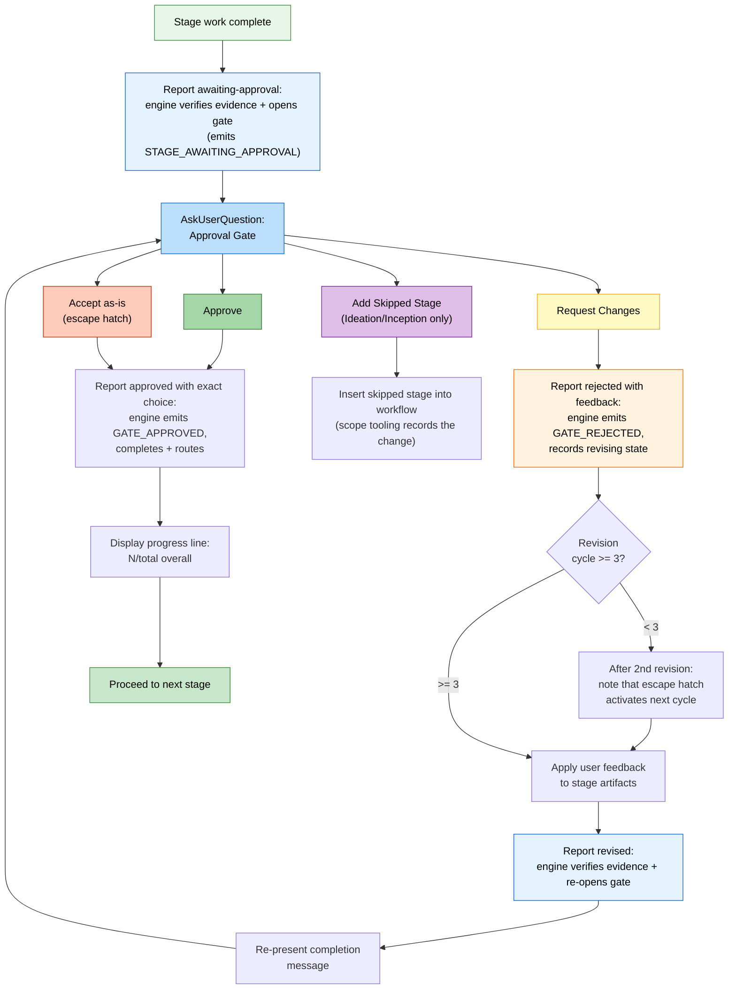

# ステージプロトコル

`core/aidlc-common/protocols/` 以下の、機械向けプロトコル群を人が読める形に組み直したものです。規則・条件・振る舞いはすべて残し、開発者が追える順に並べています。節番号は静的プロトコル、または名前付きの条件モジュールに対応します。

> ステージファイルの*形式*（YAML frontmatter、本文の慣例）は [Stage Definition](15-stage-definition.md) です。この章は実行時の振る舞いです。

> **パスの慣例。** インテントに紐づく成果物、状態、監査証跡は、アクティブインテントの **レコードディレクトリ** —
> `aidlc/spaces/<space>/intents/<YYMMDD>-<label>/` に置きます。以下では `<record>/` と書きます。
> Reverse Engineering の出力だけは、スペース単位・リポジトリごとの保存先
> `aidlc/spaces/<active-space>/codekb/<repo>/` です。監査証跡は単一ファイルではなく、
> `<record>/audit/<host>-<clone>.md` のクローンごとのシャードです（読む側がグロブし、時刻順にマージします）。

---

## プロトコルファイルの構造

ステージプロトコルは 8 ファイルに分かれ、コンダクターがワークフローの文脈に応じて条件付きで読みます。

| ファイル | 中身 | 読むタイミング |
|------|----------|-------------|
| `stage-protocol.md` | コアプロトコル: 承認ゲート、完了メッセージ、質問フロー、状態追跡、エージェントペルソナの読み込み、深度の指針、用語、内容検証、条件付き §13 モジュールへの参照 | すべてのステージ（必須） |
| `stage-protocol-learnings.md` | §13 の日誌、候補提示、人間への学びの質問、採用検査と保存 | `directive.protocol_modules` に `learnings` がある場合だけ |
| `stage-protocol-recovery.md` | エラー復旧 + 変更の扱い | セッション再開時、またはステージ途中で変更イベントを検出したとき |
| `stage-protocol-governance.md` | フェーズ境界検証（§13） | フェーズ境界（1.7->2.1、2.9->3.1、3.7->4.1） |
| `stage-protocol-reviewer.md` | レビュアーのディスパッチ、レシート、読み取り範囲、終端の順序、NOT-READY ループ | ディレクティブが実効レビュアーを指名しているとき |
| `stage-protocol-ensemble.md` | 編成トポロジ、サブエージェントの戻り、寄与ファイル、異議の仕分け | サブエージェント、パイプライン、モブ、またはサポートエージェントのステージ |
| `stage-protocol-construction.md` | 計画上のボルト主体セレモニー（実行しない将来状態のラベル）、出荷済みのユニットごとのウォーク、Build-and-Test のループバック、レシート、ウェーブ | セッション最初の Construction ディレクティブと、すべての invoke-swarm |
| `stage-protocol-swarm.md` | ハーネス固有の自律ファンアウト、収束、finalize、レビュアー境界 | すべての invoke-swarm |

### 条件付き読み込み（SKILL.md の Routing から）

コンダクターの Routing 節が読み込み規則を定義します。

- **`stage-protocol.md`**: すべてのステージで読む — コアのゲート、質問形式、状態追跡、完了メッセージ。
- **`stage-protocol-recovery.md`**: セッション再開時、またはステージ途中で変更イベントを検出したときに読む。通常の前進ステージでは、エラー復旧と変更の扱いをコンテキストから外すためです。
- **`stage-protocol-governance.md`**: フェーズ境界（1.7->2.1、2.9->3.1、3.7->4.1）で読み、フェーズ境界検証のトレーサビリティ検査を走らせます。ガバナンスのコストを、必要な地点にだけ載せます。
- **`stage-protocol-reviewer.md`**: `protocol_modules` に `reviewer` があるとき、またはディレクティブがレビュアーを運ぶときに読む。
- **`stage-protocol-ensemble.md`**: `protocol_modules` に `ensemble` があるときに読む。フォールバックのきっかけは、ディスパッチされたトポロジかサポートエージェントです。
- **`stage-protocol-construction.md`**: セッション最初の Construction ディレクティブと、すべての invoke-swarm で読む。
- **`stage-protocol-swarm.md`**: invoke-swarm で読む。

ステージ本文を走らせる前に、コンダクターは `directive.protocol_modules` が指名するモジュールをすべて読み、セッションですでに読んだものは飛ばします。

通常の実行ではコアプロトコルだけを読み、reviewer・ensemble・Construction・swarm・recovery・governance・learnings は必要なときだけ読みます。日誌と学びの手続きは `stage-protocol-learnings.md` の §13 にあり、`directive.protocol_modules` に `learnings` がなければ実施しません。以前のターンで読んだモジュールも、現在のディレクティブの手続き設定には優先しません。

---

## 概要

ステージプロトコルは、AI-DLC ワークフローのすべてのステージがどう実行するかを縛る、必須の振る舞い契約です。5 フェーズ（Initialization、Ideation、Inception、Construction、Operation）にまたがる 33 ステージは、例外なくこのプロトコルに従います。コンダクター（`SKILL.md`）はステージ実行をエージェントペルソナに渡します。プロトコルはフェーズにもエージェントにも依存せず、どのステージの領域作業にも被さる構造規則を定義します。

プロトコルが覆うのは、承認ゲート、完了メッセージ、質問フロー、状態追跡、エージェントペルソナの読み込み、条件付きのレビュアー / 編成 / Construction / スウォームの振る舞い、エラー復旧、変更の扱い、深度の指針、内容検証、§13 学習の手順、フェーズ境界検証です。

### 見落としやすいコンプライアンスチェックリスト

すべてのステージの前後で、よく抜ける次の手順を確認します。

状態遷移と監査の発行は、手書きの監査ブロックではなくツールの仕事です。コンダクターは前方の進捗を `aidlc engine orchestrate report --stage <slug>` で報告します。エンジンは状態ツールに委譲し、状態を原子的に更新し、対になる監査イベントを新しい時刻付きで出します。

| # | 確認 |
|---|-------|
| 1 | 承認ゲートでは `aidlc engine orchestrate report --stage <slug> --result awaiting-approval` を呼ぶ。`ceremony.sensors` が `on` の場合、ゲート連動のセンサーは、既存の成果物ごとに一度、トランザクションの前に走る。blocking の結びは、検証済みの通過が要る。オーバーライドするなら、別の `Fix findings` / `Override blocking sensors` 決定をログして見せ、人が裏打ちした正確な答えを待ち、`--override-blocking-sensors --user-input "Override blocking sensors"` で再試行する。裸のフラグと自律モードは拒否される。エンジンは状態を `[-]` から `[?]` AwaitingApproval へ回し、`STAGE_AWAITING_APPROVAL` を原子的に出すので、プロンプトが開いているあいだステータスはゲート待ちを示す。（`STAGE_STARTED` / `[-]` への遷移は、ステージがアクティブになったときに出ている。） |
| 2 | ゲート以外の質問では、`AskUserQuestion` を呼ぶ前に `aidlc engine log decision` で選択肢をログする（`audit/` シャードへの手書きではない）。正確な応答は `aidlc engine log answer` でログする。 |
| 3 | 承認ゲートの応答のあと、承認なら `aidlc engine orchestrate report --stage <slug> --result approved --user-input "<exact choice>"`、差し戻しなら `aidlc engine orchestrate report --stage <slug> --result rejected --user-input "Request Changes" --reason "<feedback>"` を呼ぶ。ゲートに log ツールの `decision` や `answer` 動詞は使わない。直しのあと、再提示の前に `--result revised` を報告する。 |
| 4 | 利用者の入力は要約しない — 選択肢のラベルをそのまま、所有するログまたは report ツールへ渡す。自動化ステージでは `N/A -- [reason]` |
| 5 | やり取りにつき監査エントリは 1 つ — ログ / 状態ツールが単一イベント発行を強制する。複数イベントを 1 呼び出しにまとめない |
| 6 | ステージ末尾では、ゲート付きなら `aidlc-orchestrate.ts report --stage <slug> --result approved --user-input "<exact choice>"`、Initialization なら `report --stage <slug> --result completed` を呼ぶ。エンジンは `[?]` / `[-]` を `[x]` へ回し、ゲート付きなら `GATE_APPROVED` を出し、状態ツール経由で `STAGE_COMPLETED` を原子的に出す |
| 7 | 作業開始前に、前ステージのタスクを `completed`、いまのステージのタスクを `in_progress` にし、`activeForm` を付ける（状態の同期は `sync-workflow-state` フックが担う） |
| 8 | イベント種別は `knowledge/aidlc-shared/audit-format.md` のものだけ — 状態とログのツールが強制する。`audit/` シャードへ直接書かない |
| 9 | ライフサイクルイベントを手書きせず、`aidlc-state.ts` にライフサイクル動詞も呼ばない。結果は `aidlc-orchestrate.ts` 経由で報告する。エンジン内部の状態呼び出しが、原子的な監査行を出す |

---

## 承認ゲート

Initialization の 3 ステージ以外は、進む前に明示の利用者承認が要ります。承認は `AskUserQuestion` と構造化した UI 選択肢です。

ゲートは `aidlc-state.md` の `[?]` AwaitingApproval チェックボックスに対応し、差し戻しはステージを `[R]` Revising へ遷移します。ステージ状態図全体と、正本の `GATE_APPROVED` / `GATE_REJECTED` / `STAGE_AWAITING_APPROVAL` 発行元は [State Machine](12-state-machine.md) です。

*(プロトコル §1)*

### 標準の 2 選択肢ゲート

既定のゲートはちょうど 2 つです — **Approve**（完了にして進む）か **Request Changes**（利用者がフィードバックを渡し、ステージが再実行し、ゲートを出し直す）:

```
AskUserQuestion({
  questions: [{
    question: "[Stage Name] complete. How would you like to proceed?",
    header: "Approval",
    multiSelect: false,
    options: [
      { label: "Approve", description: "Continue to [next stage]" },
      { label: "Request Changes", description: "Provide revision feedback" }
    ]
  }]
})
```

`[next stage]` は、run-stage ディレクティブの `next_stage` フィールドをそのまま描きます（スコープ内の次ステージの表示名。エンジンが発行時に計算する）。`next_stage` が null なら `Complete workflow` です。コンダクターは次ステージを推測しません。

いま出しているどれにも合わない返信なら、コンダクターは受け取った返信を短く引用し、提示した選択肢に合わないと伝え、同じ手番で有効な選択肢をすべて出し直します。その返信ではライフサイクル遷移を報告せず、決定も記録せず、ゲートの手番も消費しません。

**創発禁止ルール:** Construction と Operation のステージ（フェーズ 3–4）は、常にこの 2 選択肢形式です。追加の導線選択肢を出してはいけません。公認の例外は 2 つだけです。下の改訂の逃げ道と、construction プロトコルモジュール（`aidlc-common/protocols/stage-protocol-construction.md`、「Build-and-Test failure loop-back」— 有界な 3.6 から 3.5 の修理ループと、影響を見積もった halt-and-ask 質問）です。

ループバックの再入場は決定論的に 2 通りです。Code Generation がライフサイクルレシートを一度も使っていなければ、残した成果物ですべてのユニットを落ち着かせ、エンジンは全カバーの `gate: true` 高速経路を出せます。ライフサイクル行が一つでもあればレシートモードは粘ります。ジャンプは古い決着レシートを無効にし、エンジンはユニットごとの仕事を出し直すので、`unit start` / `unit complete` が再び刻まれます。どちらの経路も、計画した直しと決定論的な Modify/Keep をゲートの前に適用し、該当するすべてのユニットに新しい `REVIEW_COMPLETED` を出さなければなりません。`STAGE_JUMPED` が以前のレビューをすべて無効にし、完了の前提が古いカバレッジを拒否するからです。unit-major ではリプレイはこの直列ウォークのまま、スウォームしません。

ジャンプは新しいステージ試行を開始するため、修復後の計画には Plan Approval を再実行します。修正コードを生成する前に `[Answer]:` を空にし、fingerprint を再生成して、新しい decision / human-turn / answer の確認記録をそろえてください。計画の差分は Loop-Back Log に記録します。ゲートの「Retry with fix」が承認するのはジャンプであり、計画の内容は別途承認が必要です。

### 条件付きの 3 つ目

Ideation と Inception のステージ（フェーズ 1–2）は、以前飛ばしたステージを戻せるときだけ、3 つ目を足せます。

```
{ label: "Add [Skipped Stage]", description: "Include [stage] which was skipped" }
```

フェーズ 1–2 で 3 つ目が出るのはこの場合だけです。ラベルは飛ばしたステージを具体的に指す必要があります。

### 改訂の逃げ道

同じステージで「Request Changes」が 3 回回ったあと、4 回目以降の承認ゲートは 3 つ目を足します。

```
{ label: "Accept as-is", description: "Archive current version and move on" }
```

質問文は回数を含めます:
`"[Stage Name] -- this is revision cycle [N]. How would you like to proceed?"`

**「Accept as-is」を選んだとき:** `audit/` シャードにログし（「User accepted stage output as-is after [N] revision cycles」）、完了にして進みます。Construction ステージで創発禁止ルールを上書きするのは、この閾値に達したときだけです。

**発動前の予告:** 2 回目のあと、「あと 1 回改訂すると、『Accept as-is』が選べます」を含めます。

### 承認ゲートの流れ



---

## 完了メッセージ

すべてのステージは、この 5 部構成で終わります。順は固定。すべて必須です。

*(プロトコル §2)*

### 第 0 部: 監査ログ

ゲートの監査証跡は report の所有です。
1. ゲートを出す前に、`report --result awaiting-approval` が開いたゲートを記録する（`STAGE_AWAITING_APPROVAL`）
2. 応答のあと、`report --result approved|rejected --user-input "<exact choice>"` が利用者の選択を記録する（`GATE_APPROVED` / `GATE_REJECTED`）。ゲートのプロンプトや選択のための別ログエントリは足さない

### 第 1 部: 告知

```markdown
# [emoji] [Stage Name] Complete
```

絵文字は各ステージファイルが定義します。常にレベル 1 見出しです。

### 第 2 部: 要約

何を出したかの、構造化した箇条書き要約です。
- 事実と中身に絞る — ワークフローの指示（「確認してください」）は書かない
- 主要な成果物のインライン要約表（5–10 行）を含める:
  ```
  | Artifact | Contents |
  |----------|----------|
  | requirements.md | 6 FR groups (18 sub-requirements), 4 NFRs |
  | requirements-analysis-questions.md | 5 questions, all answered |
  ```
- **セッション最初の完了** では次を含める:
  `**Project depth**: [Minimal/Standard/Comprehensive] -- depth adapts artifact detail. You can request different depth at any approval gate.`

### 第 3 部: レビュー + 承認

```markdown
**Review:** `<record>/[path to artifacts]`
```

そのあと `AskUserQuestion` の承認ゲートです（承認ゲートの節を参照）。

### 第 4 部: 進捗の更新

利用者が承認したあと、進む前に出します。

```
Progress: [N]/[total] overall | [phase-N]/[phase-total] [Phase] stages complete. Next: [Next Stage Name]
```

数えるのはいまのフェーズのステージだけです。分子には完了とスキップを含めます。
例: `Progress: 13/33 overall | 3/7 IDEATION stages complete. Next: Approval & Handoff`

---

## 質問フロー

ステージが質問で利用者の入力を取るとき、プロトコルは三モードのやり取り、バッチ規則、必須の答え分析、曖昧さ検出を定義します。

*(プロトコル §3)*

### 三モード

**ステップ 1: 質問ファイルを作る。** 適切な `<record>/` ディレクトリに、`[Answer]:` タグ形式と選択肢 A–E で置きます。通常の質問はどれも末尾が `X. Other (please specify)` です。専用の Consolidated Summary Confirmation だけ例外で、**Looks correct / Request changes** は文字無しです。すべての `[Answer]:` タグは空で始まります。複数選択の質問は本文に "(select all that apply)" を足し、答えの形式は `[Answer]: A, B, E` です。

**ステップ 2: モード選択を出す:**

```
AskUserQuestion({
  questions: [{
    question: "I've created [N] questions at `[file path]`. How would you like to answer them?",
    header: "Questions",
    multiSelect: false,
    options: [
      { label: "Guide me", description: "Walk through each question interactively here" },
      { label: "I'll edit the file", description: "I'll fill in the answers in the file directly" },
      { label: "Chat", description: "Discuss freely -- I'll extract decisions from our conversation" }
    ]
  }]
})
```

モード選択は `audit/` シャードへログします。ステージ途中でもモードは切り替えられます。

#### Guide Me（対話モード）

- `AskUserQuestion` でバッチ提示する（1 呼び出しあたり質問は最大 4、質問あたり選択肢は最大 4）
- 選択肢が 5 以上の質問は、複数呼び出しに分ける（各 4 選択肢）。利用者はすべての選択肢を見る。ファイル側は全選択肢を残す。
- 組み込みの "Other" は議論を起こす。最初のバッチの前に伝える: 「どの質問でも 'Other' を選ぶと、答える前に話せます。」
- 各バッチのあと、すぐに答えを質問ファイルへ書く
- 各バッチを新しい ISO 時刻でログする
- `directive.ceremony.summary_confirmation === "on"` の場合だけ、まとめた答えの要約を出し、そのあと構造化した **Looks correct** / **Request changes** 確認の前に `aidlc-review-brief.ts summary --stage <slug> --questions-file <path>` を印字する。決定論的なブリーフはステージ、質問ファイル、生成した成果物、いま決める理由、両選択肢の正確な効果を名指しする。確認を裸の散文で聞かない。出す前に、ステージの質問ファイルへ専用の **Consolidated Summary Confirmation** エントリを追記またはリセットし、両選択肢と空の `[Answer]:` を付ける。プロンプトは `aidlc-log.ts decision --checkpoint summary-confirmation --questions-file <path>` で記録し、人で止まり、正確な選択を書き、対になる `aidlc-log.ts answer` で記録する。レシートは人の手番を、正確な質問ファイルダイジェストへ結ぶ。**Request changes** では **「What should change?」** を聞き、どの答えも直す前にもう一度止まる。フィードバックと直しのあと、確認を空に戻してから出し直す。それ以外の返信は提示した選択肢に合わないと認め、同じ手番で有効な 2 つを出し直し、タグもレシートも書かない。

#### Edit File（自分で書くモード）

- 利用者に伝える: 「`[file path]` を編集してください。終わったら **done** か **ready** を送ってください。続けます。」
- 完了合図を待つ。合図までファイルは読まず、先へも進まない。
- `ceremony.summary_confirmation` が `on` の場合だけ、Guide Me と同じ要約と確認記録を使う。自分で編集した場合も、有効な確認は省略しない。

#### Chat（自由形式モード）

- 開いた会話。出てきた決定を取り出す
- 終了合図: 「進めてよければ **done** と言ってください。要約します。」
- 取り出した答えを、値、時刻、`**Mode:** chat` 付きでファイルへ書く
- `ceremony.summary_confirmation` が `on` の場合だけ、決定の要約を出し、進む前に同じ **Looks correct / Request changes** の構造化確認を残して使う
- 向くのは、探るステージ、ブレインストーミング、議論が要る質問

`ceremony.summary_confirmation: off` では、3 モードとも回答から直接生成し、統合要約の質問・確認欄・受領記録を作りません。必須質問、Assumption Confirmation、Plan Approval、ステージ承認は維持します。

**ステップ 4: 完了を検証する。** ファイルを読み、すべての `[Answer]:` タグが埋まっていることを確認する。空があれば、未回答を `AskUserQuestion` で出す。一部だけの答えでは進まない。正本はファイルです。

### バッチ規則

| 制約 | 上限 |
|-----------|-------|
| `AskUserQuestion` 1 呼び出しあたりの質問 | 最大 4 |
| 1 呼び出しあたり、質問ごとの選択肢 | 最大 4 |
| 選択肢が 5 以上の質問 | 複数呼び出しに分ける |

### 答えの分析

答えを集めたあと、すべての応答を分析する（必須）:
- **曖昧な答え**: "mix of"、"not sure"、"depends"、"probably"
- 答え同士の **矛盾**
- 次のステップに要る **欠けた詳細**

曖昧さが一つでもあれば、フォローアップ質問を作り、進む前に解消する。**迷ったら聞く。**

### 曖昧さの検出

**無効 / 欠けた答えの扱い:**

| 条件 | 動作 |
|-----------|--------|
| 空、またはアンダースコアだけの `[Answer]:` | 未回答を列挙し、埋めるよう求める |
| 選択肢（A–E、X）に合わず、明確な自由文でもない | はっきりさせるよう求める |
| 曖昧（"maybe B"、"either A or C"） | 一つに決めるよう求める |

**矛盾の検出** — 答え一式を突き合わせる:

| 種類 | 例 |
|------|---------|
| スコープの食い違い | 「シンプルに」と、エンタープライズ級の機能要求 |
| リスクの食い違い | 「セキュリティは気にしなくてよい」と、機微データの扱い |
| 技術の衝突 | オフラインファーストとリアルタイム協働 |
| 期限対スコープ | MVP の期限とフル機能のスコープ |

検出したら、矛盾する答えを並べ、衝突を説明し、狙いを絞ったフォローアップをする。解消するまで進まない。

**過信の防止:**
- 既定は聞くこと。仮定で進まない。曖昧さがあるまま進めない。
- フォローアップが要る赤旗: 開いた質問への単語一つの答え。「whatever you think」 / 「up to you」。矛盾する合図。質問をかわす。以前定義した品質目標（例: テストカバレッジの閾値）を満たさず、緩める・下げる・無効にする
- 利用者が AI に委ねたとき: 「設計があなたの優先度を映すようにしたいです。[具体的な点] を教えてもらえますか？」

### 計画と質問ファイルの場所

ファイルはステージ成果物と同居し、中央には置きません。例:
`<record>/inception/user-stories/user-stories-questions.md`。あるステージの入力、質問、出力は同じディレクトリにあります。

---

## 状態追跡

状態は複数層で持ちます。状態ファイルのステージチェックボックス、サイドバーのタスク状態、監査エントリの ISO 時刻、構造化した監査ログエントリです。

*(プロトコル §4)*

### チェックボックス状態

| チェックボックス | 意味 |
|----------|---------|
| `[ ]` | 未着手 |
| `[-]` | 進行中（実行中、まだ承認されていない） |
| `[?]` | 人の承認待ち |
| `[R]` | 差し戻し後の改訂中 |
| `[x]` | 完了（利用者が承認した） |
| `[S]` | 根拠付きのいまのステージ報告、または導線によるスキップ |

**強制:** これらの状態を付けるのはエンジンです。ステージ散文とコンダクターは付けません。ゲートと終端の結果は `aidlc engine orchestrate` 経由で報告します。

**`[S]` の振る舞い:**
- `report --stage <current> --result skipped --reason "<reason>"`、スコープ合成、または Stage/Phase Jump が付ける
- ステータスラインの進捗数から除外する（総数にも完了にも数えない）
- エンジンが先へルーティングするあいだ残る。`STAGE_COMPLETED` と対にはならない
- 再開時はタスク追跡上は完了扱い（タスクを作り、すぐ completed にする）
- 報告したスキップは、明示のいまのステージと空でない理由が要る。単一ステージ実行は拒否する

### タスク状態の遷移

どのステージを始める前も、サイドバーのタスクを遷移します。

1. 前ステージのタスク `in_progress` -> `completed` にする
2. いまのステージのタスク -> `in_progress` にし、`activeForm: "Running [Stage Name]"` を付ける

規則: スピナーを出すにはタスクが `in_progress` であること。ステージファイルを読む前に更新する。33 ステージすべてに適用。タスク ID を失ったら（コンパクション）、`TaskList` で件名から探す。スキップしたステージは:
`TaskUpdate({ taskId: [ID], status: "completed", description: "[original] -- Skipped: [reason]" })`

### 計画レベルのチェックボックス強制

二層の追跡は同期したままにします。
- **計画レベル**: 個々の作業項目（各ユーザーストーリー、各コンポーネント）
- **状態レベル**: `aidlc-state.md` のステージ完了

ステップが終わったらチェックを付ける。チェックが付いていたら、ステップは終わっていること。各ステップ完了の直後に更新する。

### 時刻

形式: ISO 8601 UTC、`date -u +"%Y-%m-%dT%H:%M:%SZ"`。Bash で実行する。日付だけは不可。監査エントリごとに Bash 呼び出しは 1 回 — 時刻を使い回さない。

### 監査ログの形式

`<record>/audit/`（クローンごとのシャード）の規則: 常に追記（上書きしない）。"User Input" 欄は完全で未改変。プロンプトは出す前にログ。応答は受け取ったあとにログ。無ければ `# AI-DLC Audit Log` 見出しで作る。壊れていたらバックアップ。Edit が失敗したら一度再試行（フックが Read と Edit のあいだに直すことがある）。

#### 標準の会話イベント

```markdown
## [Stage Name]
**Timestamp**: [YYYY-MM-DDTHH:MM:SSZ]
**User Input**: "[Complete raw input -- never summarize]"
**AI Response**: "[Action taken]"
**Context**: [Stage, decision made]
---
```

#### エラーログ

```markdown
## Error: [Brief Description]
**Timestamp**: [ISO timestamp]
**Severity**: [Critical/High/Medium/Low]
**Type**: [Parse error/Missing artifact/State corruption/Validation failure]
**Description**: [What went wrong]
**Cause**: [Root cause or best assessment]
**Resolution**: [Action taken]
**Impact**: [Artifacts affected, stages delayed, data lost]
---
```

#### 復旧ログ

```markdown
## Recovery: [Brief Description]
**Timestamp**: [ISO timestamp]
**Issue**: [What triggered recovery]
**Recovery Steps**: [Numbered list of actions]
**Outcome**: [Successful/Partial/Failed -- current state after recovery]
**Artifacts Affected**: [Files created, restored, or rebuilt]
---
```

#### 変更依頼ログ

```markdown
## Change Request: [Brief Description]
**Timestamp**: [ISO timestamp]
**Request**: [User's exact change request -- complete raw input]
**Current State**: [Which stage, what exists, what would change]
**Impact Assessment**: [Stages affected, artifacts to regenerate, scope change]
**User Confirmation**: [User's approval response]
**Action Taken**: [What was done]
**Artifacts Affected**: [Files changed]
---
```

#### 質問のやり取りログ

```markdown
## Questions: [Stage Name] -- [Mode choice / Batch N of M]
**Timestamp**: [ISO timestamp]
**User Input**: "[Exact user selection -- option labels as displayed]"
**AI Response**: "[Wrote answer to file / Presented next batch / Proceeded to analysis]"
**Context**: [Stage name, file path, question numbers covered]
---
```

### 会話イベントのログチェックリスト

`PostToolUse` フックはファイル書き込みを自動ログします。会話イベントは手でログします（いちばん抜けやすい手順です）。

**各承認ゲートで:** (1) `AskUserQuestion` の前 — `awaiting-approval` を報告。(2) 応答のあと — 正確な利用者入力付きで `approved` または `rejected` を報告。report 所有のライフサイクルイベントがゲートの完全な監査記録です。`aidlc-log.ts decision` も `aidlc-log.ts answer` も呼ばない。

**ゲート以外の各質問のやり取りで:** 答えを受け取ったあと — `aidlc-log.ts answer` で Q&A 要約を追記する。

---

## エージェントペルソナの読み込み

各ステージはリードと任意のサポートエージェントを指定します。ペルソナは 6 段階のナレッジ順で載り、広い文脈からステージ固有の成果物へ絞ります。

*(静的プロトコル: `stage-protocol.md`、§5)*

### 6 段階のナレッジ読み込み順

読み込み順全体は [Knowledge System](10-knowledge-system.md) です。

ステップ 1–3 はフレームワーク同梱です。ステップ 4–5 は利用者が管理します。ステップ 6 はワークフロー位置ごとに動的です。

### インラインステージとインラインモブのリード

1. `run-stage` の前に、順序付き `load-steering` 列を適用する。実質あるアクティブスペースルールをすべて中身として届け、ステージごとに再走する。
2. `inline_context_paths` のエントリをすべて読む: `inline` ではリード + サポート、`mob` ではリードだけ（モブサポートはディスパッチするから）。ペルソナとナレッジはパス読み込みのまま。`context_warnings` があればそのまま見せ、読める名簿で続ける。エージェント名だけでは載った文脈にならない。
3. 実行中に、載った視点をすべて適用する。`inline` のサポートエージェント視点、`mob` のリード視点を省かない。

### サブエージェントステージ

1. 指名したハーネスエージェントをディスパッチする。設定がペルソナとナレッジを載せる（レビュアーのチェックリストはビルド時にレビュアーエージェント本文へ吸収される）。
2. 蓄積した `load-steering` ルール束をブリーフへそのまま貼る。コピーしたペルソナやナレッジ散文ではなく、関係する先行成果物のパスと作業指示を渡す。
3. ステージメタデータが指名するエージェントを選ぶ。

### 複数エージェントステージ（編成トポロジ）

*(条件モジュール: `stage-protocol-ensemble.md`、§5)*

コンダクターがサポートエージェントを入れる*仕方*は `directive.mode` に従います — ステージの通信トポロジです。`inline` ステージではサポートエージェントはコンダクターが自分の文脈に載せるペルソナです（声であり、ディスパッチではない）。`subagent`（ハブ＆スポーク）、`pipeline`（チェーン）、`mob`（有界ラウンドのメッシュ）では、各サポートエージェントは本当に独立ディスパッチされた協力者です。各自が自分の仕事を書きます。subagent/mob では各協力者が寄与ファイル（Contribution + Positions、§11）を書き、リードが統合する — `produces[]` 成果物を編集するのはリードだけです。寄与ファイルはエンジンが検査する完了証拠です。pipeline ではチェーンのリンクが成果物を直接進め、最後のリンクが揃えます。誰が何を見るかはトポロジごとに違います — スポークは互いに見えず、チェーンのリンクは上流の仕事を全部見、モブの異議者は確認か維持のラウンドを 1 回持ち、判断が要る異議はステージ途中で人に出ます — どのトポロジでも委譲するのはコンダクターです。エージェントはサブエージェントを出しません。契約全体は `stage-protocol-ensemble.md` です。

例: Feasibility は `aidlc-architect-agent`（リード）+ `aidlc-aws-platform-agent` + `aidlc-compliance-agent` で、すべてインラインです。モブの見本は `user-stories` です。`aidlc-product-agent` がペルソナとストーリーを下書きし、design、developer、quality の協力者が互いに見えないままその下書きに寄与し、リードがゲート前に統合し、`aidlc-product-lead-agent` がレビューします。ハブ＆スポークの見本は `practices-discovery` です。pipeline-deploy リードの下書き、互いに見えない quality、developer、devsecops の寄与、人へのインタビュー、リードの統合。ゲートは **Approve** / **Request Changes** です。Approve のあと、`practices-promote` は確認した時刻と、いまのステージ試行からの `PRACTICES_AFFIRMED` 監査レシートの両方をコミットしてから、コンダクターがステージ承認を報告します。

### 領域エージェント 11

14 エージェント名簿は、領域エージェント 11、レビュー専用 2、適応型ワークフローのコンポーザーです。ステージ作業をリードしサポートする領域エージェントは次です。

aidlc-product-agent、aidlc-design-agent、aidlc-delivery-agent、aidlc-architect-agent、
aidlc-aws-platform-agent、aidlc-compliance-agent、aidlc-devsecops-agent、aidlc-developer-agent、
aidlc-quality-agent、aidlc-pipeline-deploy-agent、aidlc-operations-agent。

レビュー専用の 2 体は、ステージ frontmatter がレビュアーを指名したときに独立検査を走らせます。[レビュアーの起動](#レビューアーの呼び出し) を見てください。コンポーザーは適応型ステージ計画を提案し形を変えます。領域ステージ作業のリードではありません。全体は [Agent Reference](agents/README.md) です。

---

## エラー復旧

*(プロトコル §6)*

### 再開の文脈

セッション開始時に `aidlc-state.md` があれば、コンダクターはそれを読み、完了ステージ（`[x]`）、いま / 次のステージ、成果物の有無を決め、最後の未完了ステージから再開するかを出します。

### フェーズごとの再開文脈読み込み

| フェーズ / ステージ群 | 読む文脈 |
|-------------------|----------------|
| **Initialization (0.1-0.3)** | ワークスペースのファイルシステム。`aidlc-state.md` |
| **Ideation (1.1-1.7)** | `<record>/ideation/` の成果物。ガードレール |
| **Inception -- RE** | リポジトリごとの RE 成果物 `aidlc/spaces/<active-space>/codekb/<repo>/`。Ideation のスコープ / 実現可能性 |
| **Inception -- Practices Discovery** | リード下書きと既存の寄与ファイルを残す。欠けた quality / developer / devsecops スポークだけディスパッチし、人へのインタビューとリード統合を続ける |
| **Inception -- Requirements** | リポジトリごとの `codekb/` 成果物（走っていたら）。requirements-analysis 文書 |
| **Inception -- Design** | 要件。ユーザーストーリー。domain-design 文書 |
| **Inception -- Delivery Planning** | Inception 成果物すべて。部分的なら delivery-planning |
| **Construction -- Code Gen** | いまのユニットの設計成果物、ストーリー設計、受け入れ条件、先行コード |
| **Construction -- Build/Test** | いまのユニットのコード、テスト計画、受け入れ条件、ビルド設定 |
| **Construction -- CI/Infra** | インフラ設計。コード生成の出力 |
| **Operation (4.1-4.7)** | Construction の出力。これまでの Operation 成果物。4.4 以降は 4.1–4.3 のデプロイ出力 |

### 再実行の振る舞い

ステージの再実行が要るとき（承認後に変更を求められた）:
1. ステージファイルを読み直す
2. 先行成果物を文脈として載せる
3. もう一度実行し、以前の成果物を上書きする
4. 新しい完了メッセージを出す

### コンパクション復旧

`PreCompact` フックはコンパクション前に `aidlc-state.md` の構造を検証します（情報のみ。止められない）。最後に検証した状態（ステージ、時刻）を `.aidlc-engine/recovery.md` パンくずへ書きます。再開時、コンダクターはパンくずと状態ファイルを比べ、コンパクション由来の壊れを検出します。

### 壊れた状態ファイルの復旧

`aidlc-state.md` はあるがパースできないとき:
1. `aidlc-state.md.bak` へバックアップする
2. `<record>/` を走査し、実際の完了を成果物から決める:
   - RE 分析ファイル -> RE ステージ完了
   - 要件文書 -> 要件完了
   - 設計文書 -> 設計完了
   - ストーリー設計に合うコード -> コード生成完了
3. 成果物の証拠から状態を組み直す
4. 「Current Status」を、証拠が無い最初のステージにする
5. 利用者に伝える: 「State file was corrupted. Rebuilt from artifacts. Please verify.」

### 欠けた成果物の復旧

ステージがディスクに無い成果物を参照しているとき:
1. 欠けた成果物を列挙する
2. 作るステージが完了印かを見る
3. 完了なのに無い: 利用者に伝え、再実行か手渡しを出す
4. 未完了: ステージを通常どおり走らせる

### 矛盾する入力の復旧

別ステージからの利用者入力が食い違うとき:
1. 両方からの引用付きで、具体的な矛盾を旗する
2. 一方の解釈を選んで解消しない
3. どちらが勝つか聞く
4. 上書きした成果物を更新する
5. 解消を `audit/` シャードにログする

### 重大度

| 重大度 | 説明 | 例 | 動作 |
|----------|-------------|----------|--------|
| **Critical** | 続けられない | 壊れた状態、欠けた重大成果物、復旧不能なパースエラー | 止め、すぐに利用者へ聞く |
| **High** | 出力が間違っているかもしれない | 矛盾する入力、未完了の答え、欠けた依存 | 止め、すぐに利用者へ聞く |
| **Medium** | 品質が落ちる | 曖昧な応答、部分的な文脈、曖昧な要件 | 解消を試み、だめなら利用者へ聞く |
| **Low** | 見た目 | 書式、命名、スタイル | 黙って扱い、`audit/` シャードにログする |

---

## 変更の扱い

ワークフロー途中の変更は 5 類で、扱いが違います。

*(プロトコル §7)*

### 軽微な変更

いまのステージだけに効く。成果物に変更を適用し、完了メッセージを出し直す。ロールバックは要らない。

### 大きな変更

先行ステージに効く:
1. 影響する先行ステージを特定する
2. `AskUserQuestion` で影響分析を出す
3. 承認されたら、影響するステージを順に再実行する
4. オーケストレータのディレクティブと報告で入り直し、完了する。ライフサイクルのチェックボックスは直接いじらない

### スコープ変更

新しい要件、またはスコープ単位の修正:
1. `audit/` シャードに残す
2. Requirements Analysis (2.3) または Delivery Planning (2.9) へ戻る
3. そこから計画し直す
4. 変更がステージ選択に効くなら（例: `poc` -> `feature`）、スコープ / 再合成コマンドを使い、エンジンが計画を原子的に更新する

### ユニット変更

| 変更 | 手順 |
|--------|-----------|
| **追加** | 計画に足し、ストーリー設計を作り、ビルド順に入れる。完了したユニットは再実行しない。 |
| **削除** | スキップ印を付け、成果物を退避する。依存を見る — 下流への影響を旗する。 |
| **分割** | 元を退避し、2 エントリを作り、ストーリーを分け、それぞれストーリー設計を走らせる。 |

### アーキテクチャ変更

アプリケーションアーキテクチャに効く（DB の切り替え、デプロイモデル、大きな統合）:
1. 範囲を特定する: 影響する設計成果物、ストーリー設計、生成コード
2. 影響分析一式を出す
3. 承認されたら App Design ステージへ戻り、そこから再実行する
4. 影響するユニットの下流成果物をすべて再生成する
5. 影響しないユニットは残す

### 変更前の退避

大きな変更で成果物を上書きする前に:
1. 必要なら `<record>/archive/` を作る
2. 影響する成果物を `<record>/archive/[ISO-date]-[stage-name]/` へコピーする
3. 進む。以前の仕事は消えない。

---

## 深度の指針

必要な詳しさだけを作る — 多すぎず、少なすぎず。深度はスコープと問題の複雑さに合わせます。

*(プロトコル §8)*

### スコープから深度・テスト戦略への既定

| スコープ | 既定深度 | テスト戦略 | 典型ステージ数 | 注記 |
|-------|--------------|---------------|---------------:|-------|
| enterprise | Comprehensive | Comprehensive | 33 | 全ステージ |
| feature | Standard | Standard | 33 | 全ステージ |
| mvp | Standard | Standard | 23 | Operation をすべて飛ばす |
| poc | Minimal | Minimal | ~8 | Initialization + Ideation + 中核の Inception |
| bugfix | Minimal | Minimal | 9 | 狙い撃ち |
| refactor | Minimal | Minimal | 10 | 狙い撃ち |
| infra | Standard | Standard | ~13 | インフラ中心 |
| security-patch | Minimal | Minimal | ~10 | セキュリティ中心 |
| classic | Standard | Standard | 18 | Ideation 無しの既定 v1 型ライフサイクル |
| workshop | Standard | Minimal | 26 | 教えるテスト床付きの進行ライフサイクル |
| express | Minimal | Minimal | 10 | 要件から条件付きデプロイ。レビュアー無効 |

深度もテスト戦略も、どの承認ゲートでも上書きできます。

### 深度 3 段

**Minimal**（poc、bugfix、refactor、security-patch、express）— 最小の成果物、短い分析、任意ステージを飛ばす:
- Requirements: 5–10 項目、短い説明、最小の NFR
- App Design: コンポーネント図 1 枚、基本データモデル、ADR 無し
- Functional Design: 短いビジネスルール、単純なエンティティ、`frontend-components.md` を飛ばす

**Standard**（feature、mvp、infra、classic、workshop）— 中程度の詳しさで成果物一式:
- Requirements: 15–30、受け入れ条件付き、中程度の NFR
- App Design: 相互作用付きコンポーネント図、関係、ADR 2–3
- Functional Design: 詳しいビジネスロジック、包括的な規則、エンティティのライフサイクル

**Comprehensive**（enterprise）— 深い分析。全ステージが走る:
- Requirements: 30 以上、詳しい条件、全カテゴリの包括的 NFR
- App Design: 多層図、詳しいデータフロー、統合シーケンス、代替付き ADR 5 以上
- Functional Design: 決定木、状態機械、並行性、エラー復旧、ユニット横断パターン

---

## 用語集

*(プロトコル §9)*

| 用語 | 定義 |
|------|-----------|
| **AI-DLC** | AI-Driven Development Life Cycle — このシステムが実装する方法論 |
| **Phase** | 最上位のまとまり: Initialization、Ideation、Inception、Construction、Operation |
| **Stage** | フェーズ内の discrete な一歩（例: Intent Capture、Code Generation） |
| **Scope** | どのステージをどの深度で走らせるかを決める（enterprise、feature、mvp、poc、bugfix、refactor、infra、security-patch、classic、workshop、express） |
| **Depth** | 成果物の詳しさ: Minimal、Standard、Comprehensive |
| **Unit of Work** | 独立して実装できる機能の塊。Construction の反復単位。ステージ 3.1–3.7 を 1 通し |
| **Service** | デプロイできるプロセスまたはコンテナ（API サーバ、ワーカー、フロントエンドアプリ） |
| **Module** | サービス内のコードレベルの組織境界（パッケージ、名前空間） |
| **Component** | モジュール内の論理ブロック（クラス、関数群、UI コンポーネント） |
| **Planning** | Markdown 成果物を出すステージ（分析、質問、設計） |
| **Generation** | 実行コードを出すステージ（Code Generation、Build and Test） |
| **Artifact** | `<record>/` の版管理された Markdown。決定、設計、分析を残す |
| **Guardrail** | アクティブスペースのメモリ層（`aidlc/spaces/<active-space>/memory/`）に置く、学んだ振る舞い規則 |
| **Approval Gate** | 利用者が承認するか直しを求める、構造化したプロンプト |
| **Inline Stage** | オーケストレータの会話で直接進めるステージ |
| **Subagent Stage** | 実行を Claude Code の Task ツール呼び出しへ委譲するステージ |
| **Lead Agent** | ステージの仕事を担う主ペルソナ |

---

## 内容検証

*(プロトコル §10)*

### Mermaid 規則

Mermaid 図を書く前に:
1. 構文を検証する（括弧の釣り合い、妥当なノード / 辺、エスケープしていない特殊文字が無い）
2. 参照するノードがすべて宣言されていること
3. テキストフォールバックを含める: `<!-- Text fallback: [description] -->`

### 作成前チェックリスト

成果物を作る前に:
- 参照する実体がすべて先行成果物にある
- 既存成果物と名前が衝突しない
- ファイルパスがステージ慣例に合う

### ASCII 図の標準

基本 ASCII だけ: `+` `-` `|` `^` `v` `<` `>` `/` `\` と英数字と空白。禁止: Unicode の箱線（U+2500–U+257F）。文字幅規則: 箱の中の各行は文字数が同じ。

参照パターン:
```
+------------------+       +---------------------------+
| Component Name   |       | Outer                     |
+------------------+       |  +-----+  +-----+        |
                           |  | A   |  | B   |        |
[Source] -----> [Target]   |  +-----+  +-----+        |
[Source] <----> [Target]   +---------------------------+
```

### 文字のエスケープ

| 文字 | 規則 |
|-----------|------|
| パイプ（`\|`） | 表セル内ではエスケープする |
| 山括弧 | HTML タグでないときはエスケープする |
| コードフェンス | 言語識別子付きの三重バッククォート |
| Mermaid ラベル | 特殊文字は引用符で包む |

---

## サブエージェントの戻り要約

サブエージェントが完了したら、文脈が落ちないよう、構造化した要約をコンダクターへ返します。

*(条件モジュール: `stage-protocol-ensemble.md`、§11)*

### 必須形式

```markdown
## Subagent Summary: [Stage Name]
### Produced
- [file path]: [brief description]
### Key Decisions
- [Decision]: [rationale]
### Issues / Concerns
- [Problems, edge cases, risks] or "None"
### Next Steps
- [What orchestrator should do next]
```

**コンダクターの規則:** 進む前に要約を読む。空でない Issues/Concerns は利用者へ出す。期待よりファイルが少なければ、完了印の前に調べる。

### コンテキスト予算

| 規則 | 詳細 |
|------|--------|
| いまのユニットだけ | いまのユニットの設計成果物だけ渡す |
| Inception は要約 | Inception 成果物ごとに 1–2 行の要約とパス。サブエージェントは必要なら Read する |
| 常に含める | 具体的な作業指示と、関係する状態 / 成果物パス。ハーネスエージェント設定がペルソナとナレッジを載せる |
| 大きなナレッジ集合 | 特に関係するファイルパスを名指しする。ペルソナやナレッジ散文をプロンプトへ貼らない |

### 失敗復旧

1. 縮小した文脈（Inception を要約、いまのユニットだけ）で **一度再試行**
2. 再試行も失敗したら、利用者へ出す: 「Run inline」（オーケストレータで実行）か「Skip and revisit」（未完了印で続ける）
3. 失敗を Error ログ形式で `audit/` シャードに残す

---

## レビューアーの呼び出し

`run-stage` ディレクティブに null でない `reviewer` フィールドがある場合、コンダクターは、ステージ本文に従って成果物を生成した後、§13 の学習の儀式と承認ゲートの前に、指定されたレビュアーを別のサブエージェントとして呼び出します。実行順序は、質問 → 成果物 → レビュアー（宣言されている場合）→ 学習 → ゲートです。

*条件付きモジュール: `stage-protocol-reviewer.md`、セクション 12a*

ディレクティブの `review_class` フィールドがレビュー契約を決めます。エンジンは、ステージの宣言クラス、アクティブなスコープの `review_cap`、実行単位の `--review` 上書きのうち、最も低い値を採用します。実効値が `none` の場合はレビュアーブロックを省略し、そのステージはレビューなしで実行します。

1. **呼び出し。** 初回、NOT-READY 後の再呼び出し、パート 0 のゲート却下に伴う改訂後の再レビューを含め、毎回ディスパッチ前にレビューリクエストを記録します。ロガーは宣言された全成果物を 1 つの安定したファイル同一性のスナップショットとして読み、リクエストをその正確なバイト列に結び付けます。対象に応じてワークスペースと Unit のソースフィンガープリントも記録し、`Request Id` を発行します。返却 JSON の `requestId` と `reviewFile` は、そのリクエストの識別子と、レビューを書き込むファイルのプロジェクト相対パスです。ファイルは intent 記録の `.aidlc-engine/reviews/` 配下にあり、リクエスト時に書き込み先を用意します。同じ反復の未完了ディスパッチが残した下書きは削除します。
   ディレクティブの `review_artifact` は、レビュー対象となる必須の Markdown 出力を指定します。レビュー記録はこの成果物をキーとし、ゲートに名前を表示し、指摘事項のセレクターにも使用します。出力順やプラグインの追加では変わらず、レビュー中に誰もこの成果物へ書き込みません。
   再ディスパッチ時は、先に `aidlc-review-brief.ts context --stage <slug>` を実行し、該当する場合は `--unit` も指定します。復元された指摘事項を前回レビューのコンテキストとして保持し、`directive.reviewer` のエージェントに委譲します。レビュアーが書き込む唯一のファイルとして `reviewFile` を渡してください。対応する判定がない間はゲートと完了をブロックします。レビュアーにはステージ定義のパス、Q&A ファイル、生成した成果物のパス、フロントマターの検証ツールを渡します。独立して判断できるよう、作成担当者の `memory.md` や計画は渡しません。再試行は元の成果物・ソースの結び付けとリクエスト ID を再利用し、現在のバイト列を新しい基準にはしません。古くなった受領記録からの復旧中もレビューフリーズを維持します。レビューは成果物とは別のファイルに書くため、成果物への書き込みを一時許可する必要はありません。
2. **レビュー。** `adversarial` のレビュアーは成果物への反証を試み、機械的に検証できる証拠がある場合は、それを根拠に指摘します。READY は既定値ではなく、反証を試みた結果として到達する判定です。`advisory` も同じ証拠の原則を守りますが、通常フローでは意思決定を支援する 1 回のレビューを行い、人間のゲートに向けて指摘事項を重大度順に並べます。その後の修復ループはありません。
   どちらの場合も、定義、Q&A、成果物を読み、指定された検証ツールを実行し、`reviewFile` にレビューを 1 ファイルだけ書きます。内容には一致する Verdict、Reviewer、Iteration の各行が 1 つずつ、指摘事項の表が含まれ、2 つ目の H2 セクションは含めません。レビュー対象の成果物を含め、ほかのファイルには書き込めません。リクエストはディスパッチ前の成果物のバイト列とワークスペースソースに結び付き、再試行でどちらも基準を取り直せません。完了時も 1 つの安定したファイル同一性のスナップショットを使用します。
   レビュアーのターン予算は `maxTurns: 60` です。ペルソナのフロントマターに一度だけ定義し、対応機能があるハーネスではネイティブに強制します。Claude Code はこのキーをそのまま読み、上限でサブエージェントを途中停止します。最終メッセージ用のターンはありません。opencode のパッケージャーはエージェント単位の `steps: 60` に変換し、ランナーは最後にテキストのみの 1 ターンを許可します。要約は返せますが、ツールでレビューを書き込むことはできません。Codex TOML ペルソナ、Cursor、Copilot、Kiro CLI/IDE にはエージェント単位の上限キーがないため、予算はペルソナ本文で指示します。各ペルソナの `## Turn Budget` は、どのハーネスでも途中停止に備えた進め方を定めます。
3. **判定と意思決定ブリーフ。** コンダクターは同じ `aidlc-log.ts review` コマンドに `--verdict` を付けて判定を記録します。ロガーはリクエストの `reviewFile` または `--review-file <path>` を読み、内容を検証します。ディスパッチ対象の成果物のバイト列とリクエスト時のソース同一性が変わっていないことを確認し、レビュー記録を `<record>/.aidlc-engine/reviews/<stage>/stage/<attempt>/<iteration>.json` または `<record>/.aidlc-engine/reviews/<stage>/units/<unit>/<attempt>/<iteration>.json` に保存します。判定、指摘事項、レビュアー、リクエスト ID、成果物とソースのフィンガープリント、レビュー本文を含みます。この保存と、記録のパス・ダイジェストを持つ `REVIEW_COMPLETED` 行の追記は、同じロック付きトランザクション内で行います。この記録を書けるのは当該コマンドだけです。後から編集すると行のダイジェストと一致しなくなり、レビューとして扱われません。
   `advisory` ではどちらの判定も通常フローの終端となり、learnings モジュールがある場合だけ学びの手続きを実施し、ゲートへ進みます。ゲート前に `aidlc-review-brief.ts review --stage <slug> --why <first|revision|stale>` を実行すると、対象ステージ、平易な言葉での結果、レビュー対象の成果物、記録から復元した指摘事項、判断の効果、上流・下流で無効になる具体的なパスを表示します。`reviewer_max_iterations` は 1 としてエンジンが強制します。Unit 単位ステージの最終ゲートでは、その 1 回の承認が対象とする全 Unit を表示します。Unit による絞り込みは、レビュアーへ渡すコンテキストに限ります。
   `adversarial` では READY なら learnings モジュールがある場合だけ学びの手続きを経て、ゲートへ進みます。NOT-READY で `reviewer_max_iterations` の予算が残る場合は、主担当が指摘事項を修正し、レビュアーが再確認します。既定の上限は 2 です。予算を使い切った場合は、未解決の指摘事項を添えてゲートへ進みます。
   判定が有効になるのは、レビューファイルを、正規の識別フィールドが一致する単一のレビューとして解析できた場合だけです。ファイルの欠落、正規の判定行の欠落、判定の重複は INCOMPLETE の試行です。上限到達やクラッシュで書けなかった場合も同じです。リクエスト時に空の書き込み先を用意するため、古い下書きが代用されることはありません。コンダクターは、同じ未完了リクエストを `--retry-pending` で 1 回だけ再試行します。この再試行は反復を消費しません。advisory の通常予算は 1 回なので、中断を数えるとレビューしないまま予算を失うためです。2 回目も未完了なら、レビュー ファイルなしで終端の `--verdict NOT-READY` を記録します。ブリーフは代替の指摘事項として `review did not complete within its turn budget` を表示します。判定の欠落を黙認したり、それによって停止し続けたりせず、具体的な指摘事項付きでゲートに到達します。`adversarial` で予算が残る場合、この再呼び出しでは主担当をスキップします。成果物がまだレビューされておらず、作成担当者が修正できる指摘もないためです。
   レビューリクエストは、統合回答の確認が済み、検証可能な必須出力文書がすべて存在し、Unit の正本となる集合が解決できる Unit 単位ステージでは、その集合に含まれる Unit だけを指定している場合に受け付けます。集合を解決できないこと自体では拒否しません。その場合も指定した Unit の出力は必須ですが、ステージ単位のリクエストでは検証不能な全 Unit 出力の列挙を省略します。Unit 集合を解決できる場合のステージ単位リクエストは全 Unit を対象とするため、それぞれに適用される必須出力がすべて必要です。
   その後にレビューパスが続かない受領記録は終端です。後続の出力文書への書き込みは、レビューが現在の文書を対象としていないことを意味します。修正は反復ループ内で行い、終端受領記録の後には行いません。判定に付随する提案は適用せず、ゲートで人間に引用します。最終レビュー後に文書を変更する必要がある場合、ステージがアクティブまたは承認待ちなら Request Changes を記録できます。`[R]` は `/aidlc --stage <slug>` から再開し、`[x]` はレビュー済みソースへの復元または前のステージへのジャンプによるやり直しが必要です。

レビュー記録の導入前は、`review_artifact` 末尾の `## Review` セクションにレビューを保存していました。この形式も読み取り可能です。そのスコープにレビュー記録がない場合、ゲートのブリーフと再ディスパッチのコンテキストは旧セクションを表示し、Plan Approval の計画の投影からも除外します。旧形式を追記するレビュアーは、このリリースサイクルに限って互換性のために受け付けますが、非推奨です。ロガーはそのセクションがリクエストより後に書かれたと証明できる場合だけ判定として受け付け、検証済みセクションをレビュー記録へコピーします。埋め込み形式の入力受付は次のマイナーリリースで削除します。このプロトコルは新しい埋め込みセクションを書かず、古いセクションは効力のない本文として残ります。

人間の指摘事項に対する判断は、終端レビュー済みの成果物を書き換えません。`GATE_APPROVED` は、現在の New または Unresolved の各指摘事項に `Accepted risk` を原子的に記録します。Request Changes の報告が `Rejected: <reason>` を記録するのは、明示した `--reject-finding <review-artifact>#R-NN=<exact human reason>` だけです。一般的な改訂フィードバックでは指摘事項は未解決のままです。レンダラーは内容で識別したこれらの監査記録を、後のゲートと再レビュー時のコンテキストに反映します。

反復予算はエンジンが強制します。`aidlc-log.ts review` は、そのステージの実効予算を超える `--iteration` を拒否するため、コンダクターが数え間違えてもレビューを無制限に繰り返せません。例外は、後の `produces[]` 書き込みで終端受領記録が無効になった場合です。証拠が古くなってから最初のリクエストは、通常の adversarial 予算が残っていても、次の序数で明示する 1 回限りの復旧リクエストになります。復旧時はどちらの判定も終端です。再び無効になった場合は、追加リクエストではなく人間によるリセットが必要です。自律 Unit は `finalize` 前に停止し、人間の決定後にだけ Bolt 試行を再開します。レビュアーの判断が最終決定を妨げることはなく、人間がゲートで最終決定します。`reviewer` がないステージではレビューを実行しません。[ステージ定義](15-stage-definition.md) の `reviewer` / `reviewer_max_iterations` / `review_class` を参照してください。

レビュアーのディスパッチが失敗・タイムアウトした場合、リクエスト後かつ判定前にセッションが終了した場合、レビュー ファイルや単一の正規の判定がなく未完了で戻った場合は、再ディスパッチの前に同じリクエストコマンドを `--retry-pending` で再実行します。各リクエストにつき 1 回までで、2 回目も未完了なら終端の NOT-READY 受領記録を記録します。ロガーは同じ未完了リクエストだけを復旧対象とし、`Retry: pending-request` を記録します。追加の反復は消費しません。完了済みリクエストは再試行できません。古くなった受領記録からの復旧は、次の序数を持つ別のリクエストです。

---

## 学習の手順

人がエージェントの振る舞いを直したとき、その訂正は次のワークフロー向けの残るルール（ガードレール）になり得ます。v0.5.0 では、別のガードレール発行フローではなく、ツールが主体の学習の手順で扱います。

*(条件付きモジュール `stage-protocol-learnings.md` の §13。基礎プロトコルは読み込みの参照だけを保持。)*

`directive.protocol_modules` に `learnings` がある場合だけ、完了メッセージと承認ゲートの間に実施します。Bootstrap は日誌だけ、独立した `single: true` は日誌も手続きも持ちません。Unit ごとの `gate: false` は最終ステージゲートまで延期します。ただしチーム所有の unit-major は、発行された各 Unit ゲートで行います。ゲート改訂では再実施しません。モジュールがなければ日誌作成・候補提示・学びの質問を省き、直接承認ゲートへ進みます。有効時の手順は次のとおりです。

1. **日記**: エージェントは作業しながら、ステージごとの `memory.md`（Interpretations / Deviations / Tradeoffs / Open questions）を維持する。
2. **提示**: `aidlc-learnings.ts surface --slug <slug>` が日記を読み、構造化した候補を出す — LLM は再パースも分類もしない。
3. **確認**: コンダクターが候補を描き、利用者が残すものを選び、自由文の追加では行き先を導く見出しを選ぶ。常にある「Anything to add?」チャネルは少なくとも `Nothing to add` と `Add a note` を描く。選択肢 1 つの構造化質問は Claude Code と Codex では無効。
4. **入場検査**: 残した学びはそれぞれ `org.md` の対応節と突き合わせる。矛盾は直し / 飛ばし / エスカレーションへ出す。
5. **残す**: `aidlc-learnings.ts persist` が確認した学びをプラクティスとして `aidlc/spaces/<active-space>/memory/{project,team}.md` へ書く（センサー結びの学びなら、マニフェスト + ステージの `sensors:` import を 1 つのロック付きトランザクションで入れる）。`RULE_LEARNED` / `SENSOR_PROPOSED` を出す。

学びが効くのは**次の**ワークフローのコンパイルであり、いま走っている実行ではありません。ツールが主体のプロトコル全体は `stage-protocol-learnings.md` §13、書いたルールが流れ込む厳格加算の解決は [Rule System](08-rule-system.md) です。

---

## フェーズ境界検証

各フェーズ遷移で、トレーサビリティ検証が、完了フェーズの出力が次フェーズに足り、一貫していることを見ます。

*(`stage-protocol-governance.md` §13 — 学習の手順とは別。学習の手順は `stage-protocol-learnings.md` §13)*

### きっかけ

- 各フェーズの最終ステージが承認されたあと
- 次フェーズの最初のステージが始まる前
- 要求に応じて `/aidlc --status`

### 手順

1. `.claude/knowledge/aidlc-shared/verification.md` から方法論を読む
2. フェーズ固有のトレーサビリティ検査を走らせる
3. 結果を `<record>/verification/[phase-boundary]-verification.md` へ書く
4. 失敗したら: 進む前に問題（欠けたリンク、孤立した成果物、不整合）を出す
5. `PHASE_VERIFIED` を `audit/` シャードへログする

### フェーズごとの検査

| 境界 | 検証すること |
|----------|---------|
| **Ideation -> Inception** | インテントが取れ、スコープが決まり、実現可能性が確認され、イニシアチブが承認されている |
| **Inception -> Construction** | すべての要件が設計へ辿れ、ユニットが定義され、デリバリ計画が承認されている |
| **Construction -> Operation** | すべてのユニットがビルド / テスト済み、CI パイプラインが設定され、インフラが設計されている |

### トレーサビリティ行列

検証は辿れる鎖を見ます。
```
Intent -> Scope -> Requirements -> Designs -> Units -> Code -> Tests -> Deployment
```

各境界で、左の成果物には右の対応する成果物が要ります。欠けたリンク、孤立、不整合は利用者レビュー向けに旗します。

---

## 相互参照

- [Architecture](01-architecture.md) -- 5 層モデル、設計判断
- [Orchestrator](03-orchestrator.md) -- SKILL.md の深掘り
- [Stages](04-stages/) -- フェーズごとのステージ文書
- [Agent System](05-agent-system.md) -- エージェント構造、frontmatter
- [Hooks and Tools](06-hooks-and-tools.md) -- フックシステム、監査イベント
- [Knowledge System](10-knowledge-system.md) -- 読み込み順、テンプレート
- [Diagrams](diagrams.md) -- 図を一箇所に集めたもの
