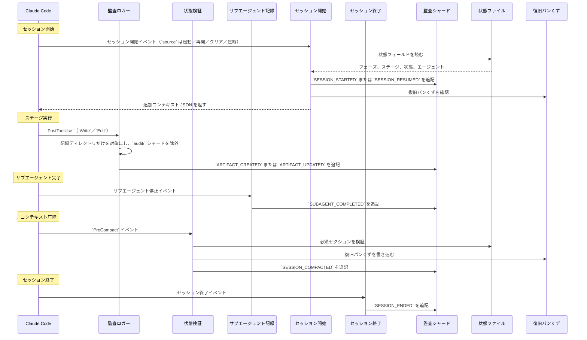

# フックとツール

本章では、フックシステムのアーキテクチャ、17 本すべてのフックスクリプト、監査イベント分類、CLI ツールの設定、決定論的ユーティリティツールを説明します。

> **パスの規約。** 状態、監査、成果物は、アクティブなインテントの**記録ディレクトリ** `aidlc/spaces/<space>/intents/<YYMMDD>-<label>/`（以下 `<record>/` と表記）の下に置かれます。記録ディレクトリが時系列に並ぶよう、コンパクトな UTC の日付の接頭辞と短い kebab-case のラベルを持ちます。正準の id は `intents.json` レジストリの行にある UUIDv7 です。監査証跡は単一のファイルではなく、`<record>/audit/` の下にあるクローンごとのシャードのディレクトリです。

---

## フックシステムアーキテクチャ

この実装は `.claude/hooks/` にある 17 本の TypeScript のフックソースを使います。ソースから生成される `dist/` の配布物は `bun` 経由でそれらを呼び出し、ネイティブインストールとバージョン付きのリリースランタイムは `aidlc engine hook`、`aidlc engine statusline`、または `aidlc engine adapter` のターゲットを経由します。17 本すべてが**プロジェクト全体**のものです。`settings.json` に登録されており（ステータスラインはトップレベルの `statusLine` キー、残り 16 本は `hooks` ブロック）、ホストがプロジェクトフックを許可している限り、どのスキルが有効かに関係なく発火します。Claude Code の管理対象設定 `allowManagedHooksOnly: true` はプロジェクトの登録を上書きしてこれらのフックをブロックします。`/aidlc --doctor` がその方針を検出します。以前は分割されていました（6 本は `aidlc/SKILL.md` のフロントマターでスキルスコープとして宣言され、残りがプロジェクト全体）。v0.6.0 でスキルスコープの 6 本も `settings.json` へ移されたため、オーケストレーター、パッケージされた各スコープ／ステージのランナー、手書きの顧客ランナーなど、どのエントリポイントもランナーごとの `hooks:` ブロックなしで決定論的な基幹機構を継承します。

17 本のうち 11 本は**非ブロッキング**です。6 本は**フロー変更型**です。`Stop` フックは転送ループを回し続け、deliver-stage-rules フックは入力の書き換えをサポートするハーネスで正確なアクティブステージのルールをサブエージェントのブリーフへ付加し、plan-approval ガードは時期尚早なコード生成のディスパッチを拒否し、reviewer-scope フックは兄弟ユニットへのレビュアーのアクセスを拒否し、review-freeze フックはゲート前に新鮮な終端レビュー受領記録を無効にしてしまうレビュー済み出力への書き込みを拒否し、state-transition ガードは `aidlc-orchestrate.ts report` を迂回する直接のライフサイクル呼び出しを拒否します。

```
.claude/hooks/
+-- record-human-turn.ts     # UserPromptSubmit + PostToolUse AskUserQuestion (project-wide, settings.json, TypeScript)
+-- deliver-stage-rules.ts    # PreToolUse + PostToolUse Task|Agent (project-wide, settings.json, TypeScript, flow-altering)
+-- plan-approval-guard.ts # PreToolUse generation dispatch/write/shell tools (project-wide, settings.json, TypeScript, flow-altering)
+-- state-transition-guard.ts # PreToolUse shell/file-write tools (project-wide, settings.json, TypeScript, flow-altering)
+-- reviewer-scope.ts    # PreToolUse file/search/shell tools (project-wide, settings.json, TypeScript, flow-altering)
+-- review-freeze.ts     # PreToolUse file-write tools (project-wide, settings.json, TypeScript, flow-altering)
+-- write-audit-log.ts      # PostToolUse Write|Edit (project-wide, settings.json, TypeScript)
+-- run-sensors.ts       # PostToolUse Write|Edit (project-wide, settings.json, TypeScript)
+-- sync-workflow-state.ts   # PostToolUse TaskUpdate (project-wide, settings.json, TypeScript)
+-- rebuild-stage-graph.ts   # PostToolUse Bash (project-wide, settings.json, TypeScript)
+-- fold-usage.ts        # PreToolUse + PostToolUse (project-wide, settings.json, TypeScript, Claude-only producer)
+-- validate-state.ts    # PreCompact (project-wide, settings.json, TypeScript)
+-- log-subagent.ts      # SubagentStop (project-wide, settings.json, TypeScript)
+-- aidlc-continue-workflow.ts        # Stop (project-wide, settings.json, TypeScript, flow-altering)
+-- session-start.ts     # SessionStart (project-wide, settings.json, TypeScript)
+-- session-end.ts       # SessionEnd (project-wide, settings.json, TypeScript)
+-- aidlc-statusline.ts  # statusLine (project-wide, settings.json, TypeScript)
```

### フックの概要

| フック | イベント | 適用範囲 | マッチャー | 目的 |
|------|-------|---------|---------|---------|
| `record-human-turn.ts` | UserPromptSubmit + PostToolUse | プロジェクト全体（settings.json） | （空）／`AskUserQuestion` | サポートされているプロンプト送信または回答済みウィジェットのシームが発火したときに `HUMAN_TURN` イベントを記録します。承認／インタビューのゲートは、最後のゲート解決以降に 1 件あることを要求します。AIDLC へのコマンドだけだったターン（`next` が読むフラグ・スコープ・動詞・名詞を伴う AIDLC コマンド（`/aidlc ...`、`/aidlc-<runner> ...`、`$aidlc ...`）。`/aidlc approve the code plan` のように `/aidlc` や `$aidlc` の後に言葉だけが続くものは、エントリなしで保持される返答です。コード計画の質問が開いていて利用者が計画ファイルを編集していない間に、設定のフラグの後に利用者の返答が続くもの、たとえば `/aidlc --guard-policy off approve the plan` は、設定を開いている作業に適用し、言葉はその返答になります（引用符のない `--` の後の言葉は引き続き新しい作業を説明します）。スラッシュで始まる他のテキストも同様です。入力されたスイッチ、緊急回避の語句）は `Reply: command` と記され、スイッチについての質問（「plan approval をスキップする？」）は `Reply: question` と記されます。開いている質問への判断はどちらも返答として数えず、検査を下げるセッターはその質問を要求として数えず（拒否はコンダクターに回答と提示をさせます）、guard-recovery の質問もそれを取らず、コンダクターはコマンドを実行して質問を開いたままにします。すべてのハーネスはこのイベントを `aidlc.ts engine hook record-human-turn` 経由で送り、それが権威を伴うモジュールを非公開のプロセス能力で起動します。フックのファイルを直接実行したりインポートしたりしても何も発行されません。`AIDLC_UNATTENDED=1` は、共有のフックとすべてのハーネスのアダプターにわたって、この権威を伴う発行を抑止します。権威を持たない転送のマーカーは変わりません。無人かどうかを知っているのは駆動側だけなので、この宣言はオプトインです。このイベントが証明するのは順序と存在だけです。ハーネスは信頼できる応答テキストを一様には公開しないため、後続の `--user-input`、`--feedback`、`--details` の文章を認証するものではありません。それとは別に、セッション ID を持つ、立ち会いのある入力されたプロンプトは、台帳の状態ファイルのゲートより前に、選択した作業にその正確なフェンスまたは方針のスイッチを適用し、監査行を記録し、それを注入するハーネスではフックのコンテキストとして `AIDLC Guard Policy: ...` を報告します。フックが返答に意味を読み込むことは決してありません。利用者が開いている質問に返答したことと、その正確な言葉を保持し、コンダクターが返答を読んで利用者の選択を記録します。アクティブなディレクティブがエンジンの Plan Approval の質問である場合、この作業についてのどのチャットからのメッセージも、その開いている質問について保持されます（`notePlanApprovalAskReply`）。コンダクターの `answer --checkpoint plan-approval` は、質問が示された後に AIDLC へのコマンド以上の返答が記録されると選択を記録します（保持された「plan approval をスキップする？」はスイッチについての質問であって回答ではありません。拒否は、無効にしたい場合のために `engine config set guard.plan-approval off` を示します）。そのときの計画ファイルのフィンガープリントを取り、質問ファイル、受領記録、`Person Reply` を持つ `PLAN_APPROVAL_RECORDED` 行を書きます。保護された質問（検証コマンド、Construction の方針、チェックポイントの承認）も、その利用側のために同じように返答を保持します。エンジンのそれ以外の質問（作業の所属先、新しい作業の提示、どの記録や計画か）は独自の開いている質問のマーカーを公開するため、それが開いている間の返答はその質問だけへの回答です。ターンは `Reply: command` と記され、ゲートの言葉としては保持されず、その下にあるどの質問（コード計画の質問、保護された質問、guard-recovery の質問、ステージゲート）にも取られません。それらは回答の後に `next` が再び尋ねます。コンダクターは、計画をもう一度見たいという要求を `answer --checkpoint plan-approval --details "Review the plan"` で記録します。これはアクティブなディレクティブが示す計画について記録されるか、作業が一時停止中または計画を示さない質問が開いている間は、次の `next` がルーティングする計画について記録されます。各計画は自身の回答まで要求を保持し、複数の計画についての要求は、すべてについて記録されるか、どれについても記録されないかのどちらかです。アクティブなディレクティブが現在の状態についての guard-recovery の質問である場合、ちょうど 1 つの対処である返答は利用者の選択です（`picked_by: person`）。Request Changes が唯一の対処である場合、単なる選択でない返答はそのフィードバックです。それ以外の返答は `selected_op: null` で保持され、コンダクターは利用者が選んだ対処を `answer --checkpoint guard-recovery` で記録します。Request Changes の選択は、利用者の言葉を待つか、同じ返答からそれを取ります。選択とフィードバックは空白を正規化してハッシュされます。`next` を繰り返したとき、それらが保持されるのは状態と、順序付きの対処の操作／対話の契約がなお一致する間だけなので、`reject` は `--feedback` を人間自身の言葉に束縛できます。セッション ID を持つ、立ち会いのある入力されたすべてのプロンプト、単一選択のピッカーに入力された自由記述、そこで選ばれたステージゲートの選択（Approve、Request Changes、Accept as-is: 利用者の正確な選択）も、そのチャットについて gitignore された `<record>/.aidlc-engine/gate-words/<session>.json` に、届いた時点の監査シャードのサイズを付けて保持されます。AIDLC コマンド、入力されたスイッチ、緊急回避の語句は除外され、`/aidlc` や `$aidlc` の後に入力された返答はエントリなしで保持されます。保持されるのは 8000 文字までのメッセージ最大 8 件で、ファイルはステージゲートが提示または回答されるたびと、ワークフローの完了時に削除されます。これを書くのはこのフックとエンジンだけで、ランタイム整合性の検査は、それを書いたり削除したりするツール呼び出しを拒否します。同じチャットでのステージゲートの判断は、ステージの最新の `STAGE_AWAITING_APPROVAL` の後、かつその後に回答された他の質問の後に保持されたメッセージを記録します。`GATE_APPROVED` では `Person Reply` として、`reject` では `Feedback` として記録し、コンダクターの異なるテキストは `Conductor Summary` として保持します。フックが guard-recovery の回答として消費した返答は保持されず、保持できなかった場合は従来どおりコンダクターのテキストを記録します。`HUMAN_TURN` と同様、保持される言葉はハーネスがそのチャットについて届けたプロンプトのテキストで、誰が入力したかを認証するものではありません。言葉の保持はフェイルオープンで、ターンをブロックすることは決してありません |
| `deliver-stage-rules.ts` | PreToolUse + PostToolUse | プロジェクト全体（settings.json） | `Task\|Agent` | **フロー変更型。** ディスパッチされるステージの実質的なアクティブスペースのルールを解決し、`stage-protocol.md` の「For subagent stages」の手順 2 で宣言されたトランスポートを使って、その正確なバイト列を届けます。受理されたバックグラウンドのディスパッチの後、`aidlc/.aidlc-subagent-inflight` にセッション単位のエントリを 1 件追加し、Stop フックがその結果を待てるようにします。拒否されたディスパッチでは何も追加しません。Claude では、PostToolUse の登録はルールを届けません。入力に `run_in_background: true` がないときに応答が `async_launched` である起動を記録するだけです。Claude Code はそのフラグなしでもエージェントをバックグラウンドで開始するからです。Claude、Codex、opencode、Copilot の入力を書き換えます。Kiro CLI は、登録されたエージェントのネイティブの `resources` によるアクティブスペースのメモリーツリー全体のプリロードを使います。プリロードで補われる不完全なブリーフは黙って進みます（終了コード 0、stderr は空。オプトインの `hookDebug` のみ）。ディスパッチの前に、そのアダプターは、選択されたインストール済みのロスターの各ワーカーのプロジェクトローカルの `.kiro/agents/<name>.json`（プラグインのワーカーを含み、コンポーザーとロスター外のヘルパーを除く）が解析可能で、少なくとも 1 つの既存の Markdown ファイルに解決される `file://aidlc/spaces/<active-space>/memory/**/*.md` を含むことを要求します。欠落、不正、古い、または解決できないプリロードは、終了コード 2 と修復の案内でブロックします。プリロードの検証の後、アダプターはコアの終了コード 2（読み込めない必須のルール: ブロック）とコアの終了コード 3（有効なバンドルがフックの書き換えチャネルを超える: 助言で、ディスパッチは終了コード 0 で進む）を転送します。他のすべてのハーネスはブリーフをそのまま届けます。Kiro IDE は、ライブのメモリーファイルの参照を持つ常時取り込みのワークスペースのステアリングも使います。正確なバンドルがすでに存在する場合は冪等です |
| `plan-approval-guard.ts` | PreToolUse | プロジェクト全体（settings.json） | `Task\|Agent\|Edit\|Write\|Bash`（各ハーネスのネイティブの patch の別名も） | **フロー変更型。** code-generation の計画後に生成する順序（ステージの手順 2〜4）を決定論的に強制します。アクティブなディレクティブが 1 つの権威を選びます。`unit` があれば `construction/<unit>/code-generation/`、なければ Unit なしの `construction/code-generation/` です。plan-approval のフェンスが有効な場合、その対象が現在の Testing Contract、フィンガープリント済みの計画／指示、明示的な "Approve Plan" の回答を持つまで、開発者のディスパッチとワークスペースの変更を拒否します。その証拠を準備するため、選択した記録ディレクトリ内への書き込みは引き続き利用できます。エンジンの Plan Approval の質問（`plan-approval` の ask）がアクティブなディレクティブである間、待つのはビルドだけです。開発者、待っている計画が示すファイル、AI-DLC の記録、AI-DLC 自身のコマンドは、利用者が返答するまで拒否されるため、エージェントが書くものが利用者の回答の代わりになることはありません。コミット、インストール、テストの実行、計画が示さないファイルへの書き込みは、どの Guard Policy でもすぐに実行されます。利用者の返答の後は、尋ねた計画自身の `code-generation-plan.md` や `unit-test-instructions.md`（まだ回答を待っている計画で、シンボリックリンクを経由せず、ハードリンクでもないもの）へのファイルツールによる書き込みは通ります。そのため、承認とともに与えられた指示は、その承認がカバーする計画に入ります。質問ファイル、他の計画のファイル、コードは引き続き待ちます。どの Plan Approval の状態でも通るファイルが 1 つあります。コンポーザーのグリッドの提案（`aidlc/spaces/<space>/intents/.aidlc-engine/composer-proposal.json`、`detect --json` が出力する `proposalPath`）へのファイルツールによる書き込みで、Code Generation 中に要求された構成がそのグリッドを検証できるようにするためです。そのファイルを読むのは `validate-grid` だけで、それに書き込んでも生成が始まることは決してありません。シェルによる書き込み、別のファイルも示す書き込み、シンボリックリンクを経由するパスは、他と同様に判定されます。ヌルデバイス（`/dev/null`、Windows では `NUL`、ハーネスが PowerShell で実行したコマンドでは `$null`）に捨てる出力は書き込みではないため、エラーを黙らせる読み取り専用のプローブは引き続き利用できます。委譲には、`AIDLC-UNIT: <unit>` または `AIDLC-STAGE: code-generation` のマーカーをちょうど 1 つ使います。各拒否は `PLAN_APPROVAL_BLOCKED` を出力します。欠落、競合、未知のマーカーは、プロンプトの文章から推測せずにブロックします。`AIDLC_DISABLE_PLAN_APPROVAL_GUARD=1` は、マシン上で計画承認を無効にし（エンジンは、メモリーの Guard Policy の strict の固定があっても、準備のできた各計画を尋ねずにビルドし、`PLAN_APPROVAL_SKIPPED` を記録します）、この PreToolUse フックを無効にしますが、黙ってではありません。ワークフローが存在する間、その下で通過する最初のツール呼び出しは `GUARD_DISABLED` の監査行（`Guard: plan-approval-guard`、`Tool`）を 1 件追記し、アクティブシャードに別の行が入るまで、連続する無効化された呼び出しは何も追記しません。その記録処理のどの失敗も、呼び出しを許可します。最初の承認の証拠と実行可能な成果物は、`aidlc-swarm.ts prepare` を含め、所有するツールが引き続き要求します。承認後の内容の変更は、承認を捏造することなく、後述の実効フェンスの継続規則を使います。人間の緊急回避の受領記録（`answer --checkpoint plan-approval --override`。人間がプロンプトとして `Override Plan Approval: <reason>` と入力した場合にだけ開かれる）は、他の受領記録と同様にこのフックを満たします。フックがそれを提案することは決してありません。 |
| `state-transition-guard.ts` | PreToolUse | プロジェクト全体（settings.json） | `Bash\|Write\|Edit\|MultiEdit\|NotebookEdit` | **フロー変更型。** ハーネスが所有するフック、セッションの制御、ランタイムの記録、ツールが所有する監査証跡（`<record>/audit/`）を無条件に保護します。シャードを対象にした直接の書き込み、シェルでの追記、コピー、移動、削除は、経路として `engine log decision|answer`、`engine audit append-raw`、`engine orchestrate report` を示すメッセージとともに拒否され、読み取りは引き続き可能です。直接の `aidlc-state.ts` のライフサイクル動詞を拒否し、コンダクターを `aidlc-orchestrate.ts report` へ誘導します。ハーネスが委譲されたエージェントの識別情報を提供する場合は、レビュアーとサポートエージェントからのライフサイクル／ルーティングのコマンドも拒否します。読み取り専用の状態照会と通常のビルド／検証のコマンドは引き続き利用できます |
| `reviewer-scope.ts` | PreToolUse | プロジェクト全体（settings.json） | `Read\|Edit\|Write\|Glob\|Grep\|Bash` | **フロー変更型。** ユニット単位のレビュアーの読み取り範囲の境界（stage-protocol-reviewer.md §12a）を決定論的に強制します。コンダクターのレビュアーのディスパッチ記録（`<record>/.aidlc-engine/reviewer-dispatch.json`）が新しい間、ディスパッチされたレビュアーが兄弟ユニットの `construction/` パスに届くツール呼び出し、つまり兄弟をまたぐファイルの読み書きや grep/glob/シェルのパターンは、対象が記録の除外リストにない限り拒否されます（終了コード 2 + 誘導する stderr の理由）。これとは独立に、Unit の claim のスコープの印を持つチェックアウトは、別の Unit の `construction/<unit>/` のサブツリーを変更できません。拒否の前に、正規化されたパスの解決が、相対的なトラバーサルや大文字小文字によるすり抜けの形を塞ぎます。Guard Policy、`guard.reviewer-scope`、`AIDLC_DISABLE_REVIEWER_SCOPE_HOOK` が下げられるのは、レビュアーの読み取り範囲の検査だけです。claim 済みのチェックアウトの書き込みの所有権は引き続き必須です。各拒否は `REVIEWER_SCOPE_BLOCKED` を出力します。 |
| `review-freeze.ts` | PreToolUse | プロジェクト全体（settings.json） | `Read\|Edit\|Write\|Glob\|Grep\|Bash`（変更を伴う呼び出しに自己フィルター） | **フロー変更型。** レビュアーモジュールの終端受領記録の順序を決定論的に強制します。レビュアーを持ち、まだ完了していないステージのレビュー済み出力（宣言された `produces[]`/`optional_produces[]`。要約が所有する質問は、`review_artifact` で明示的に指定されない限り除く）を対象とする Write/Edit やシェルによる変更は、新鮮な終端レビュー受領記録がそれをカバーしている間は拒否されます（終了コード 2 + 誘導する stderr の理由）。シェルによる書き込みは Write/Edit の監査フィードを通らず、そうでなければ変更されたバイト列に対して古い受領記録を残してしまうため、実行前に検査されます。エンジンと同一の受領記録の走査（`aidlc-lib.ts` の `freshReviewReceipts`）を共有するため、記録されたゲートの却下、ジャンプ、ワークフローの再開始で凍結は自動的に解除されます。上限未満の adversarial の NOT-READY は非終端のままで、修復のために編集できます。実効クラスでの終端の NOT-READY は READY と同様に凍結します。各拒否は `REVIEW_FREEZE_BLOCKED` を出力します。曖昧さがある場合はすべてフェイルオープンです。`AIDLC_DISABLE_REVIEW_FREEZE_HOOK=1` で強制を無効にできます。ツールが利用者に示す拒否は、何が拒否されたかを伝え、JSON なしに `Next:` と `next` コマンドで終わります。ルーターが出力するはずの guard-recovery の質問（[ガードの許可判定と復旧質問](12-state-machine.md#ガードの許可判定と復旧質問)を参照）は拒否の記録の中で待ち、その `next` がそれを一度尋ねるため、コンダクターは書き込みを再試行せず、型付きの対処を利用者に示します |
| `write-audit-log.ts` | PostToolUse | プロジェクト全体（settings.json） | `Write\|Edit` | 成果物の書き込みを `audit/` シャードへ自動記録します |
| `run-sensors.ts` | PostToolUse | プロジェクト全体（settings.json） | `Write\|Edit` | アクティブなディレクティブのステージで解決されたセンサーを、一致する書き込みで発火させます（助言的で、決してブロックしません）。unit-major の実行が `Current Stage` を追い越しても、状態に束縛されたインテント単位のマーカーが帰属を保ちます |
| `sync-workflow-state.ts` | PostToolUse | プロジェクト全体（settings.json） | `TaskUpdate` | ステージのタスクが有効化されたときに状態ファイルを自動同期します |
| `rebuild-stage-graph.ts` | PostToolUse | プロジェクト全体（settings.json） | `Bash` | 成功した `intent-create` を、そのツールイベントの正確なホストのセッション ID に束縛します。セッションがすでに別のインテントを所有している場合は、1 回限りの新しいセッションへの引き継ぎの受領記録を書きます。その後、遷移クラスの監査出力で `runtime-graph.json` を再コンパイルします。最初に、Bash の呼び出しがリテラルの engine orchestrate のコマンド 1 つで、その stdout がちょうど `error` のディレクティブである場合は、`directive.message` をバイト単位でそのまま人間に中継します（[エンジンのエラーの中継](#エンジンのエラーの中継) を参照） |
| `fold-usage.ts` | PreToolUse + PostToolUse | プロジェクト全体（settings.json） | （空） | **Claude 専用。** LLM の呼び出しごとに、トランスクリプトの新しいトークン使用量を永続的な使用量の台帳に集約します。PreToolUse は完了しつつあるメインの呼び出しを確定し、エンジンの境界の前には、ライフサイクルの集計を最新に保つため、完了したすべてのサブエージェントの呼び出しを確定します。PostToolUse は通常の保留分のフォールバックを担います。観測専用で、決してブロックしません。Claude Code のトランスクリプトのリーダーは Claude のハーネスにだけ配線されているため、Kiro/Codex/opencode では生成側が動かず、台帳は空のままです（使用量のすべての利用側はデータなしに劣化します）。`AIDLC_DISABLE_USAGE_TRACKING=1` で無効にできます。後述の「トークン使用量とコストのトラッキング」を参照してください |
| `validate-state.ts` | PreCompact | プロジェクト全体（settings.json） | （空） | 状態ファイルを検証し、復旧のパンくずを書きます |
| `log-subagent.ts` | SubagentStop | プロジェクト全体（settings.json） | （空） | 完了するセッションについてバックグラウンドのサブエージェントの台帳のエントリを 1 件削除し、サブエージェントの完了イベントを記録します |
| `aidlc-continue-workflow.ts` | Stop | プロジェクト全体（settings.json） | （空） | **フロー変更型。** ターンの終了時に転送ループを強制します。`aidlc-orchestrate next` を実行し、終端と人間待ちの結果は停止を許可し、通常の保留中の作業は作業に沿った継続とともにブロックし、個別のエンジンの `error` の診断はそれぞれちょうど 1 回、最善努力の `ERROR_LOGGED` の行とともに届けます。未知のディレクティブの種類と、診断の永続化のすべての失敗は停止を許可します。`intent-create` の後、または `intent <name>` や `space <name>` が別のインテントを選んだ後の、正確な 1 回限りの引き継ぎも、セッションの元の UUID と新たにアクティブになった UUID が、その手順が書いた受領記録と一致する場合に許可します。`intents.json` の行を持たない選択された記録には UUID がないため、その受領記録は代わりにスペースと記録を示します。セッションはちょうどその記録を選び、インテントの印を持たない（切り替えは元の印を消去します）か、その記録がその後に得たレジストリの行の印を持たなければなりません。現在のステージまたはアクティブなチームの Unit のゲートが承認待ち／改訂中である場合、または `[-]` 進行中で、アクティブなディレクティブの正準またはユニット単位の `<slug>-questions.md` に未回答の質問があるか、未解決の記録済みの `DECISION_RECORDED` がある場合は、正当なターンの停止を許可します。新しい進行中の compose のマーカー、現在のセッションについての新しいバックグラウンドのサブエージェントのエントリ、まだ Construction の自律の選択を提示している手順、会話のターンも許可されます。別のセッションの、古い、不正なバックグラウンドのエントリは停止を認可しません。compose、バックグラウンド、記録済みの判断、会話の除外規定は、自律 Construction では抑止されます。保留中のファイルの除外規定は、unit-major の code-generation の必須の Plan Approval を除いて抑止されます。通常の保留中の作業は再帰が制限されます（進捗なしのカウンター + `CLAUDE_CODE_STOP_HOOK_BLOCK_CAP` の下での `stop_hook_active`。既定は対話の実行で 2、自律 Construction で 8）。AIDLC のワークフローの外では何もしません |
| `session-start.ts` | SessionStart | プロジェクト全体（settings.json） | （空） | セッションの再開時にワークフローのコンテキストを注入します |
| `session-end.ts` | SessionEnd | プロジェクト全体（settings.json） | （空） | 正常終了時に、そのセッションについて記録されたインテントへ `SESSION_ENDED` を出力します。UUID に基づくワークフローにセッションの束縛がない場合は、共有のアクティブカーソルを使わずにフェイルクローズします |
| `aidlc-statusline.ts` | statusLine | プロジェクト全体（settings.json） | -- | 端末にリアルタイムの進捗を表示します |

共有のエンジンのセッションで `next` を調べる前に、Stop フックは、利用者が対処を選ぶか必要な追加のフィードバックを提供する間、現在の guard-recovery の質問を保持します。この待機は、ガードが人間の入力を要求する場合には自律 Construction でも適用されます。ready の応答や、古いまたは置き換えられた質問は、この待機を認可しません。

Plan Approval と 3 つの保護された Construction の判断については、人間ターンのフックはさらに、存在だけでなく提示された応答も記録します。セッションのチャレンジファイルから `recordPlanApprovalHumanResponse` または統合された `recordProtectedHumanResponse` のどちらかを選び、両方を選ぶことは決してありません。矛盾するチャレンジファイルは応答とともに削除され、選択は記録されません。保護されたメールボックスは、`aidlc/.aidlc-sessions/plan-approval/`（または委譲されたワークツリーのランタイムディレクトリ）の下の `protected-question-<sessionSegment>.json` と `protected-question-response-<sessionSegment>.json` を使います。
質問は、種類、セッション、ランダムなチャレンジ ID、正準の対象のダイジェスト、提示された選択肢を束縛します。回答はセッションとチャレンジ ID を束縛し、所有する監査の追記が成功した後でだけ消費されます。どちらのファイルも持たないセッションは、別のチャットが尋ねた Unit またはバッチのチェックポイントの質問を、その `DECISION_RECORDED` 行が最新に尋ねられた質問で、何もそれに回答していない場合に引き取ります。質問と、それについて保持された返答はこのセッションのメールボックスに移るため、利用者はどのチャットでもチェックポイントに答え、そこで 1 回の返答で承認できます。より古い質問や、別の質問より前に尋ねられた質問が移ることはありません。

`log decision` が発行した質問では、描画されたピッカーのテキストが `tool_input.questions[].question` または `tool_input.question` で与えられた場合、正確な `--decision` のダイジェストと一致しなければなりません。Codex は、構造化された選択を転送するときに `request_user_input` のツールの入力を保持します。描画されたテキストのない返答は排他性に依存します。新しい `log decision` は、呼び出したセッションの保護された質問を取り下げます。`--session` もプロセスの祖先関係も所有者を解決しない場合は、すべてのセッションの質問を取り下げます。ライフサイクルの `gate-start` は、`STAGE_AWAITING_APPROVAL` の前にすべての保護された質問を取り下げます。Plan Approval は独自のランタイムの形式を保ちます。どちらかの種類を発行すると他方のチャレンジと応答は削除されますが、通常の判断やライフサイクルのゲートが Plan Approval 自体を取り下げることはありません。

セッションを持つ送信されたプロンプトでは、同じプロンプトでの入力されたスイッチより前に `normalizeRetiredGuardPolicyField` が実行されます。これは単独の廃止された `Change Control: relaxed|off` の行を、値と出所のラベルを保ったまま、方針の監査行なしに `Guard Policy` へ名前変更し、`additionalContext` の移行の注記を出力します。状態のダイジェストは 2 つのフィールド名を同一に扱うため、名前だけの変更は、発行済みのディレクティブとその束縛された権威を保ちます。

フェンスと Guard Policy のスイッチについて、人間ターンのフックが `applyTypedGuardSwitchPrompt(projectDir, sessionId, prompt)` を呼ぶのは、入力されたプロンプトの場合だけです。`hook_event_name === "UserPromptSubmit"`、文字列の `tool_name` がない、立ち会いのある駆動（`humanTurnMintAllowed()`）、`session_id` がある、という条件です。
これは台帳の状態ファイルのゲートより前に実行され、スイッチを後のセッターに残すのではなく、プロンプトが届いた時点で適用します。
選択された作業は、メッセージにあるセレクターだけを使って `resolveWorkflowSelection(projectDir, { sessionId, space?, intent? })` で解決します。省略されたセレクターは、そのセッションのワークフローの選択を使います。
解決できない名前のインテントは、`<intent> is not a piece of work in space <space>.` で拒否されます。
状態ファイルのない Guard Policy の `relaxed` または `off` のスイッチは、このチャットが次に始める作業のために保持されます（`Guard Policy relaxed for the piece of work you start now (set by you).`）。
要求と同じメッセージで入力された場合は、その要求に伴います（`Guard Policy relaxed for the work you are asking for (set by you).`）。新しい作業は作成時にそれを受け取り、開いている作業を続ける回答はそこに適用します。
メッセージだけで開いている作業の方針が変わることは決してありません。
要求された `off` の値は、必要に応じて `relaxed` を置き換えます。
要求とともに、または状態ファイルなしに入力されたセンサー、学習、サマリー確認も、独自の行なしに同じように保持されるため、その要求に応える作成がそれらに `set by you` のラベルを付けます。
フェンスのスイッチ（`guard.<fence> off`）も同じように、そのチャットについての独自の記録に保持されます。状態ファイルがない場合は
`The review freeze check is off for the piece of work you start now (set by you).`、
要求とともに入力された場合は
`The review freeze check is off for the work you are asking for (set by you).` です。作業が存在する前に入力された `guard.<fence> on` や Guard Policy の `strict` は、それを取り下げます。
メモリーが保持する strict は、メモリーファイルを示して拒否します。そうでなければ、フックは監査ロックの下で `typedByPerson: true` 付きの `applyIntentSettings` を使い、監査行を追記し、状態を書きます。
結果は `{ applied, lines }` です。フックは、CLI が出力するのと同じ結果の行とともに `AIDLC Guard Policy: ...` を持つコンテキストの行（後述の `hookContextLine`）を出力し、フックのコンテキストを注入するハーネスはそれをコンダクターに届けます。
利用者が受け取る内容は、その経路では届きません。ホストはフックの出力を折りたたむことがあり、アダプターはそれを落とすことがあり、エージェントはそれを伝えないことがあります。そのため同じ行がエンジンの次の手順のために保持され（`addPendingPersonLines`。ターンが記された後に一度キューに入れられる）、どのハーネスでもそれを伝えます。注記は、コンダクターにその行を返答の中で、その言葉どおりに伝えるよう求めます。適用されたスイッチは、すでに適用済みであることを付け加えるため、コンダクターが独自のセッターを実行することはありません。何も変えなかった結果（値のない設定、チームが保持する規則）も同じように伝えられます。利用者のスイッチが何もしなかったことこそ、利用者に推測させてはいけないことだからです。
認識されないプロンプトは `null` を返し、何も適用しません。`AIDLC_UNATTENDED=1` が権威を差し控える場合、認識された入力の引き下げのスイッチは何も適用せず、フックは次の `additionalContext` の行を出力します。

> AIDLC Guard Policy: the typed switch was not applied because AIDLC_UNATTENDED=1 withholds human authority on this driver; run it from an attended session.

`parseTypedGuardSwitchRequest` は `{switches,space,intent}` を返し、`parseTypedGuardSwitches` はその `.switches` をラップします。解析はプロンプトの前後の空白を取り除き、末尾の `.,;:!?` の連続を 1 つ取り除き、大文字小文字を区別しません。先頭は、トークン全体が `/aidlc`、`$aidlc`、`aidlc` のいずれかでなければならず、その後に次の 2 つの形のどちらかが続きます。

- `config set <key> <value>` の後に、任意の `--intent <name>` と `--space <name>` の組だけが続くもの。それぞれ最大 1 回、順序は問いません。それ以外の余分なトークンがあると、スイッチは適用されません。引き下げは、`guard-policy|change-control relaxed|off`、3 つの切り替え可能なフェンスのいずれかについての `guard.<fence> off`、または `plan-approval off`（`guard.plan-approval off` も）です。
- フラグを先に書く形。トークンが `--` で始まる間、次のトークンが存在して `--` で始まらない場合にだけ、それを値として取ります。フラグでない最初のトークンで止まり、残りの説明は無視します。`--guard-policy relaxed|off`、廃止された `--change-control relaxed|off`、切り替え可能なフェンスについての `--guard.<fence> off`、`--intent <name>`、`--space <name>` を集めます。
  このパーサーが知らないフラグの形のトークンが、パーサーが知っているスイッチを利用者から奪うことは決してありません。説明が始まった後なら、それは利用者の言葉の一部です（`--guard.review-freeze off add a --help flag to the reverser` はスイッチを保ち、`--help` を利用者の言葉として読み、その後のトークンも値ではなく言葉として読みます）。説明の前なら、それは除外され、スイッチは引き続き適用され、結果に 1 文 `I could not read "--nonsense"; if that was a setting, type it again on its own.` が加わります（解析では `unread`）。解釈のしようがないため、何も変えずにその旨を伝える場合が 2 つあります。パーサーが知っている設定の後に値がない場合と、`guard-policy` が 2 つの名前の両方で異なる値で入力された場合で、後者は両方を示して一度利用者に戻されます。繰り返された、または値のない `--intent`、`--space`、`--scope` は、従来どおり黙って何も適用しません。
  形の例:
  `/aidlc --guard-policy relaxed|off [--guard.<fence> off] [--intent <name>] [--space <name>] <description>`。
  ここで `|` は選択肢を区切り、角括弧は任意のフラグを、山括弧は置き換える値を示します。これらの表記の文字は入力しません。Codex では `/aidlc` を `$aidlc` に置き換えてください。

確認のプロンプト全体 `guard[- ]policy relaxed|off` または `change[- ]control relaxed|off` も受け付けます。`[- ]` はハイフンまたは空白を意味します。この形では両方のセレクターが null です。スイッチに言及する質問は何も適用せず、これらの形以外での引用、否定、説明のための言及は何も変えません。
サマリー確認の `off`（`config set summary-confirmation off`、またはフラグの中の `--summary-confirmation off`）がスイッチになるのは、メッセージが設定とセレクターだけを持つ場合だけです。説明のトークンや `--` の後続の横にある場合は、スイッチからも設定からも除外されるため、新しい作業の提示の前にアクティブな作業に着地したり、そのフラグについての質問から適用されたりすることはありません。
`strict`、`on`、`guard.human-presence` が引き下げを示すことは決してありません。キーごとに 1 つのエントリで、最後の値が優先され、キーは最初に現れた順に並びます。Codex は、利用者に何を入力するかを伝える拒否も含め、`/aidlc` の代わりに `$aidlc` を使います。
認識されたコマンドがガードを下げる場合、フックは併記されたすべてのインテント設定を同じトランザクションで検証・適用します。不正なコマンドや無効な併記の設定は何も変えません。
利用者が自分の言葉でチェックを下げるよう求めた場合、またはガードの `lower-fence` の対処を選んだ場合は、コンダクター自身がセッターを実行します。
CLI のセッターは、スイッチの権限のためのセッションの検索を行いません。メモリーの strict と無人の確認の後、最後のゲート解決以降に利用者のターンが記録されている場合（`personSpokeSinceGate`）に引き下げます。空の台帳は数えません。すでに off のフェンスや、すでに `set by you` と記された同一の方針の語にはキーは不要で、`fenceKeyBypassed`（フィクスチャまたはハーネス起動時の在席バイパス）も引き続き適用されます。
フックは Windows でも動作するため、プロンプトを転送するすべてのハーネスが入力されたスイッチをサポートします。
`lower-fence` の対処は `command` の対処です。その `operation` は `{kind: "lower-fence", fence}` で、その `command` はセッターであり、利用者がそれを選ぶとコンダクターが実行します。

人間ターンのフックは、ディスパッチャーのフック経路 `aidlc engine hook record-human-turn` を通じてだけ起動されます。誰がディスパッチャーを起動したかは認証しません。フックとツール呼び出しは同じユーザーとして実行され、同じユーザーのプロセスが複製できない識別子をフックに与えるハーネスはありません。
[state-transition ガード](#pretooluse-aidlc-state-transition-guardts)は、ランタイム整合性の検査を使い、パス、環境変数の代入、インラインおよびラッパーのスクリプト、argv の配列、エイリアス、シェル関数、書き込まれた内容を含め、フックとその記録への既知の直接・間接のツール呼び出しの経路を拒否します。経路とは、フックのモジュールの具体的な import、require、実行のことです。それを名前で示すだけのスクリプト、コメント、文字列、文書は経路ではありません。

この検査は、無害に見えるパススルーのコードであっても、インストールされた強制の構成要素の、書き込みツールによる直接の置き換えや、既知のシェルによる上書き、移動、削除も拒否します。保護される場所には、インストールされた `hooks/` ツリー、`tools/aidlc.ts` と `tools/aidlc-*.ts` のエンジン／セキュリティのモジュールとディスパッチャー、ネイティブのアダプター、そして `hooks.json`、Claude の `settings.json`、Kiro の AIDLC のエージェントファイル（`.kiro/agents/aidlc*.json`、および Kiro IDE と Kiro CLI v3 の構成でフロントマターがツールの許可を持つ `.md` のエージェント）、Copilot の `.github/hooks/aidlc.json` といった名前付きのフックの登録が含まれます。それらを含むインストールのディレクトリの削除も拒否されます。インテントの監査証跡（`<record>/audit/`）も同じ検査で保護されます。それに追記するのはフレームワークのツールだけで、モデルのツールからの直接の書き込みは、所有するコマンドを示して拒否されます（後述の state-transition ガードの節を参照）。フックのヘルパーを読み込めるのは、明示的な少数の公式のエンジンのエントリポイントだけです。任意のスクリプトが、ハーネスのディレクトリの中に置かれているというだけで例外になることはありません。スコープの定義と、変更可能なコンパイル済みのワークフローのデータは、既存の規則に引き続き従います。

ワークフローの作業には通常のエンジンのコマンドを使ってください。インストールの保守では、`aidlc update` がマシンのランタイムを更新します。プロジェクトのインストール済みファイルを設定または更新するには、ワークフローの合間に `aidlc config` を実行します。強制のファイルを意図的に直接修復または置き換えるには、エージェントのワークフローを止め、外部の端末やエディターを使い、その後セッションを再起動してください。ワークフローのフェンスを下げても、それらのファイルの置き換えが認可されることはありません。フレームワークの開発の編集は、作成元の `core/` と `harness/` のツリーで行います。インストール済み／生成されたコピーは開発の対象ではありません。このパスの検査は、既存のインストールの内容を証明したり、考えられるすべてのプログラムによるファイルシステムの変更を傍受したりするものではなく、新しい承認の仕組みを導入するものでもありません。

既知の制限: ネストしたブロックの中で宣言された関数スコープの `var` でランタイムの API を隠したり、`childProcess["exec"] = mock` のようなリテラルの計算メンバーでインポートしたプロセスの API を置き換えたりすると、ランチャーの形をしたモックのデータについて誤った拒否が起きることがあります。リテラルのモックのメンバーには、別のモックの受け手の名前か、ドットによる代入（`childProcess.exec = mock`）を使ってください。

これは多層防御です。ハーネスの権限モデルと、エージェントが実行する内容に対する利用者のレビューが外側の境界です。

#### Kiro IDE アダプター

UserPromptSubmit が入力されたフェンスまたは Guard Policy のスイッチを持つ場合、アダプターはそれをコアの人間ターンのフックに転送し、フックはそれをペイロードのセッションの下でプロンプト時に適用して `AIDLC Guard Policy:` の注記を返します。アダプターはその注記を、セッション開始に使うのと同じ `hookSpecificOutput` のコンテキストの封筒でエージェントに渡します（それを落としていたことが、エージェントが利用者の尋ねた作業ではなく開いていた作業に対して独自のセッターを実行した原因でした）。シェルのセッターがアダプターの中で実行されることはありません。
IDE 1.0.242 のような空のプロンプトのビルドでは、ターンごとの `prompt-empty` マーカーにより、アダプターは引き下げのシェルコマンドを拒否します（終了コード 2 と stderr）。環境変数を前置した呼び出し、`config set`、`config-change`、`scope-change` でのサマリー確認の `off`、そして末尾の `--<key> <value>` の組がいずれかの引き下げを持つ `config set` も含みます。`verb-intercept` は、そのビルドでは進行中の作業を下げられないことを説明し、Kiro IDE を更新するか、より低い既定値のスコープから新しい作業を始めるよう利用者に案内する、セッションごとに 1 回の機能の注記を出力します。サマリー確認と計画承認については、拒否と注記はまず、プロジェクト全体の端末のコマンド `<invoke> config flags --bypass AIDLC_DISABLE_SUMMARY_CONFIRMATION --local --yes` または `--bypass AIDLC_DISABLE_PLAN_APPROVAL_GUARD`（`--clear-bypass` で元に戻す）を示します。これを記録してもプロジェクトのファイルは更新されないため、進行中の作業にも効きます。その後、Kiro IDE を更新した後は代わりにスイッチを入力できることを伝えます。`strict` への引き上げ、フェンスやサマリー確認を `on` にすること、作成時のフラグは引き続き利用できます。
空のプロンプトを転送する前に、アダプターは同じフィールドだけの正規化を行い、移行の注記を出力します。一部のビルドがコアのフックの出力を破棄するからです。その機能の注記は、その自動的な名前変更についても説明します。

#### Copilot アダプター

Copilot は、状態ファイルが存在する前でも UserPromptSubmit をコアの人間ターンのフックに転送するため、Guard Policy の `relaxed` または `off` と計画承認の `off` は、このチャットが次に始める作業のために保持され、それ以外の初回のフェンスのスイッチには、作業を作成してから再び入力するよう指示が返ります。
その人間の手順の調整マーカーは、引き続き既存の状態ファイルを要求します。

サブエージェントの起動はそれぞれ 1 つのディスパッチです。VS Code のサブエージェントのツールは `runSubagent`（`{prompt, description, agentName?, model?}`）で、CLI のものは `task`（`{agent_type, prompt, description, name?, model?}`）であり、PascalCase のフックはそれを `Agent` として見ます。アダプターは `runSubagent`、`task`、`Task` を `Agent` に対応付け、指定されたエージェントを `agent_type`、`agentName`、または Claude の形のフィールドから（大文字小文字を区別せずに比較して）読み、従来と同じ 2 つの検査を実行します。ステージのルールの書き換え（`deliver-stage-rules.ts`）は AI-DLC のエージェントを指定する起動にルールを届け、Code Generation の Plan Approval の検査（`plan-approval-guard.ts`）は、承認済みの計画のない `aidlc-developer-agent` の起動を、両方のサーフェスで同じ理由と対処とともに拒否します。エージェントを指定しない起動や、AI-DLC 以外のエージェントの起動はどちらも受けません。Code Generation の間は、それ自身のファイルとシェルの呼び出しが引き続き計画の検査を受けます。コアのフックはエージェントを `subagent_type` から読みます。アダプターはそれらのためだけにそのキーを追加し、書き換えを、ホスト自身の入力の形で、トップレベルの `modifiedArgs`（CLI のフィールド）と `hookSpecificOutput.updatedInput`（VS Code のもの）として返します。

VS Code は、`runSubagent` のすべてのサブエージェントについても UserPromptSubmit を発火させます。ペイロードは `{prompt}` と共有のセッションのフィールドで、エージェントのブリーフが `prompt`、親のチャットの `session_id` を持ち、SubagentStart の直後に送られます。
その中にエージェントのものであることを示す印はありません。ディスパッチの PreToolUse は同じテキストを持つため、許可された各起動について、アダプターは、届けられたとおりの（ルールの書き換え後の）ブリーフと最初に書かれたとおりのブリーフの SHA-256 のダイジェストを、一時ファイル `aidlc-copilot-briefings-<user>-<project hash>.json` に記録します。ユーザーの部分は、Linux と macOS では uid（そこでは 1 つの `/tmp` がすべてのユーザーに使われる）、Windows ではユーザー名のハッシュで、プロジェクトのハッシュは、サブエージェントの台帳とそのロックと同じ、ドライブレターを正規化したキーです。各起動の記録は、それを起動したチャットも示し、一致したり消費したりするのはそのチャットのプロンプトだけです。ブリーフは起動したチャットのセッションの下で届くため、プロジェクトの別のチャットで送信された同じ言葉は、その利用者のものです。記録は最新の 64 件の起動を保持します。起動の記録は 30 分後に失効し、そのブリーフが届くと消費されます。保存されるのはダイジェストだけで、ブリーフのテキストは決して保存されません。

記録の読み書きはすべてサブエージェントの台帳のロックの下で行われるため、読み手が書き手の名前変更と競合することはありません（Windows は、別のプロセスが開いているファイルの置き換えを拒否します）。一時的な書き込みの失敗は再試行されます。それでも記録を書けない場合は、ブリーフが後で利用者のターンとして数えられてしまうサブエージェントを開始するのではなく、再試行を伴って起動が拒否されます。プロンプトが記録されたダイジェストと一致する（改行コードと外側の空白は除く）UserPromptSubmit は、コアのフックに届くことは決してありません。`HUMAN_TURN`、保持されるゲートの言葉、開いている質問への回答、入力されたスイッチ、人間の手順の前進は、いずれも生じません。ロックが使用中の場合、アダプターは単純な読み取りを 1 回試みます。すべての起動はサブエージェントが開始する前に記録を書き、消費がファイルを削除することは決してないため、記録が欠けている場合は読み取れない場合と同じに読まれます。どの記録とも一致しない、または記録を読めないときに届いたプロンプトは、同じチャットで最近 5 秒以内にサブエージェントが開始していた場合（サブエージェントの台帳がそう示す）は数えられません。VS Code がブリーフのテキストを変えた場合でも、記録が読めない場合でも、それはほぼ確実にそのサブエージェントのブリーフであり、その時間内に利用者が実際に入力したメッセージは改めて求められます。それ以外のプロンプトは、サブエージェントがまだ実行中に入力されたものも含め、従来どおり数えられます。

5 秒の時間枠が保留した各プロンプトは、助言用の `SUBAGENT_PROMPT_UNMATCHED` の監査行（`Counted: no`。どのブリーフとも一致しなかったのか、記録を読めなかったのかを示す Reason を持つ）を残すため、VS Code が送るテキストの変化に気付けます。行がプロンプトを持つことは決してありません。

一致は常にターンを差し控えるだけです。VS Code では、サブエージェント自身のプロンプトがその記録を消費するため、誤検出には、サブエージェントが始まる前に利用者がブリーフを一字一句入力する必要があります。Copilot CLI は `userPromptSubmitted` を、ユーザーがプロンプトを送信したときに発火すると文書化しており、ビルドがそのフックを通じてブリーフを送る場合に備えて、同じ記録がその `task` の起動もカバーします。現在そこで記録を消費するものはないため、`task` の起動から 30 分間は、そのブリーフと同一のメッセージは数えられず、利用者は再び返答することになります。

#### Codex アダプター

Codex は、サブエージェントのものを含め、スレッドへのすべての入力について UserPromptSubmit を実行します。`spawn_agent` が送るブリーフと、エージェントがそれに送る各フォローアップは、ルートの `session_id` の下で `prompt` として届きます。スレッドが起動したサブエージェントのペイロードは `agent_id`（そのスレッドの id）と `agent_type` を持ち、ルートのスレッドのプロンプトはどちらも決して持ちません。Codex の内部のレビュアー（`/review` のレビュアー、Guardian の自動レビュー）は、`agent_id` なしで同じセッション id の下の独自のスレッドとして実行されますが、その `transcript_path` は独自のロールアウトのファイル `rollout-<timestamp>-<thread id>[_<rollout id>].jsonl` で、ルートのスレッドの id はセッション id です。アダプターの `record-human-turn` は、UserPromptSubmit が空白でない `agent_id` か、別のスレッドを示すロールアウトのパスを持つ場合、コアのフックの前に戻るため、それらのプロンプトは `HUMAN_TURN`、保持されるゲートの言葉、回答、入力されたスイッチを記録しません。それ以外の形のトランスクリプトのパスは何も決めません。`request_user_input` の回答は利用者自身の選択で、どのスレッドが尋ねたかにかかわらず従来どおり読まれます。Codex の質問ボックスが期限切れになると（既定のモードで約 2 分）、回答なしの `{"answers":{}}` を返します。アダプターはちょうどその形をコアのフックに転送し、フックは `HUMAN_TURN` の代わりに `QUESTION_UNANSWERED` を記録します。その行はそれ以前のターンを消費するため、利用者が再び返答する前に記録された回答や承認は拒否され、フックはエージェントに、ボックスではなく返答の中で同じ質問を再び尋ねるよう伝えます。回答とともに戻ったボックスは、Codex でも Claude Code でも、質問ごとに 1 件の `QUESTION_REPLIED` 行を、表示された質問と与えられた返答とともに記録します。その行は何も決めず、ターンも消費しません。エージェントが `log answer` で記録する回答は、利用者の最新の保持された言葉を `Person Reply` として持ちます。
利用者のチェックを下げるセッターは、それを実行するコマンドが利用者自身が実行したものでない限り、利用者の言葉を引用し、`Person Reply` として記録します。それに答えるのは `commandAtPersonsTerminal`（`aidlc-lib.ts`）で、コマンドにチャットの識別子がなく、利用者が入力している端末からのものかどうかを判定します（エージェントのツール呼び出しは両端にパイプを持って届き、Codex は自身が実行するコマンドに印を付けます）。端末での利用者のコマンドはどのチャットにも属しません。それでも利用者自身の行為で、適用され、行は `set by you` となり、利用者のメッセージが引用されたり横に保持されたりはしません（同じ規則がプロジェクトのスイッチの記録の文言を決めるため、後のチャットも何も主張しません）。ここでは、どのセッションがコマンドを実行しているかは何も決めません。祖先関係は、チャットの横に開いた端末についても同じセッションを解決するため両者を区別できず、負荷の下ではフェイルクローズして、利用者に見えない理由で利用者自身の言葉を記録から落としてしまうからです。疑似端末でツール呼び出しを実行するハーネスは利用者自身の端末として読まれ、引用の節を失います。スイッチについてそれ以外は何も変わりません。

### 共通の特性

17 本すべての TypeScript のフックソースには、次の共通性があります。

- TypeScript で書かれ、チャネルのディスパッチャーを通じて呼び出される
- 実行権限を必要とせず、macOS、Linux、ネイティブの Windows PowerShell で同一に動作する
- Claude Code から stdin で JSON を受け取る
- ネイティブの JSON 解析を使う（`jq` に依存しない）
- 成功時またはスキップ時には終了コード 0 で終わる（`Stop` フックもブロック時には終了コード 0 で終わり、ブロックは stdout 上の `{"decision":"block"}` の JSON オブジェクトで示されます。4 本の PreToolUse の制御フックは、回復不能または再試行可能な拒否を、終了コード 2 と stderr 上の理由で示します。Claude Code では、`aidlc engine hook` のディスパッチャーは同じ理由を持つ PreToolUse の `permissionDecision: "deny"` も stdout に出力するため、利用者はフックのコマンドを前に置かずに理由を見られ、JSON が読まれない場合でも終了コード 2 が引き続きブロックします）
- 複数のフォールバックの方法で `$CLAUDE_PROJECT_DIR` を解決する
- `lib.ts` からロックとユーティリティ関数を共有する

Claude のソースから生成される `.claude/settings.json` は、`bun "$CLAUDE_PROJECT_DIR/.claude/tools/aidlc.ts" engine hook <name>` でフックを呼び出し、`engine statusline` にも同じ固定されたディスパッチャーを使います。引用符付きのエントリのパスは、空白を含むプロジェクトのルートや、作業ディレクトリを変えるアプリケーションのコマンドでも機能します。フックのプロセスの作業ディレクトリや、JSON のペイロードで与えられる `cwd` は変えません。ネイティブのリリースの設定は、Bun を使わずに `aidlc engine hook <name>` と `aidlc engine statusline` を使います。
コンパイル済みのエンジンは実行ファイルの横のランタイムのペイロードからフックのモジュールを読み込み、そのツリーは決してプロジェクトではありません。`engine hook` とセンサーのスクリプトの経路は、プロジェクトを `--project-dir`、次に `AIDLC_PROJECT_DIR`、`CLAUDE_PROJECT_DIR`、`KIRO_PROJECT_DIR`、次にホストがコマンドを起動したディレクトリから取ります。アダプターはまずホストからプロジェクトを解決します。
Kiro IDE はプロジェクトの変数を設定しません。そのアダプターは、Kiro IDE がフックを実行したディレクトリを使い（ペイロードの `cwd` フィールドは読みません。[kiro-ide-hook-payload.md](kiro-ide-hook-payload.md) を参照）、それを実行するコアのフックに渡します。

### Runtime and native hook budgets

`core/tools/aidlc-runtime-budget.ts` は、ツール、フック、ビルド時の利用側に共有の運用上の最終防御を提供します。インポート、環境変数の読み取り、起動時の副作用を持たないため、ソースとコンパイル済みのどちらのエントリポイントからも使えます。

| エクスポート | 既定値 | 作業 |
|---|---|---|
| `DEFAULT_SUBPROCESS_TIMEOUT_MS` | 300,000 ms（5 分） | 通常のサブプロセス、実行ファイルのプローブ、ネットワークのリクエスト |
| `LONG_SUBPROCESS_TIMEOUT_MS` | 900,000 ms（15 分） | 複合的な作業、展開、コンパイル |
| `EXTENDED_SUBPROCESS_TIMEOUT_MS` | 1,800,000 ms（30 分） | 外側のディスパッチャー、スナップショット、プロジェクトの検査 |

これらは失敗の上限で、成功した作業はすぐに戻ります。呼び出し側、マニフェスト、サポートされている利用者の明示的な上書きが優先されます。ポーリングの頻度、所有権の検査、古い所有者の猶予、プロトコルの上限、任意の応答性の予算には別の契約があります。

ネイティブのコマンドフックの登録は、もう 1 つの外側の上限を提供します。

| ハーネス | 作成されるフィールドと単位 | 登録される予算 |
|---|---|---|
| Claude Code | `timeout`、`harness/claude/settings.json` の秒 | 通常 1,800。`run-sensors` と Stop は 3,600。**SessionEnd は 60** |
| Codex | `timeout`、`harness/codex/emit.ts` の秒 | 通常 1,800。`audit-and-sensors` と Stop は 3,600 |
| Copilot | `timeoutSec`、`harness/copilot/emit.ts` の秒 | 通常 1,800。PostToolUse のファンアウトと Stop は 3,600 |
| Kiro CLI agent-v1 | `timeout_ms`、`harness/kiro/agents/aidlc*.json` のミリ秒 | 通常 1,800,000。`audit-and-sensors` と Stop は 3,600,000 |
| Cursor | タイムアウトのフィールドは出力されない | ネイティブの外側のタイムアウトの上書きのサポートは**未検証** |
| Kiro IDE と Kiro CLI v3（`kiro-ide`） | `timeout`、`harness/kiro-ide/hooks/*.json` の秒 | 通常 1,800。`audit-and-sensors` と Stop は 3,600 |
| opencode | プロセス内のアダプター | AIDLC のコマンドフックのタイムアウトの登録は別にない |

Claude Code 2.1.281 のソースを調べると、利用者が明示的に `CLAUDE_CODE_SESSIONEND_HOOKS_TIMEOUT_MS` を与えない限り、SessionEnd は終了の待機を 60 秒に制限します。AIDLC はその上書きを設定しません。
フックの `timeout` だけを引き上げても、このネイティブの上限は上げられません。Kiro IDE の [2 秒の壊れた stdin のフォールバック](kiro-ide-hook-payload.md) はペイロードの読み取りの上限で、実行とは別です。これらの登録は、すべてのホスト／バージョンでのランタイムのカバレッジを確立するものでも、すべてのファンアウトが外側のホストの上限に収まることを保証するものでもありません。

Claude/Codex のプラグインの SessionStart のブートストラップのフックも 1,800 秒を宣言します。
Codex の信頼の識別子は、設定された正確なタイムアウトを含みます。それを省略した旧来のエントリは、ネイティブの 600 秒の識別子の既定値を保ちます。

### ロック取得の予算

必須の監査とアクティブディレクティブの公開の待機は、5 分の共有の既定値を使います。フックはツール呼び出しのたびにリリースの予約を行うため、固定されたディスパッチはその予約に 30 秒待ちます。install や pin など、他のマシンの予約は 5 分の既定値を保ちます。ディスパッチは、予約が成立する時点でマシンのロックの下で（または予約なしで実行する直前に）、リリースの整合性を一度確認します。この変更を含む起動されたリリースは、自身を再び確認しません。古い固定されたリリースは引き続き確認します。環境による制御は次のとおりです。

| 変数 | 既定値 | 適用先 |
|---|---|---|
| `AIDLC_AUDIT_LOCK_TIMEOUT_MS` | `300000` | 既定の `acquireAuditLock` / `withAuditLock` の取得。明示的な `maxRetries` が優先される |
| `AIDLC_ACTIVE_DIRECTIVE_LOCK_TIMEOUT_MS` | `300000` | アクティブディレクティブのマーカーの公開 |
| `AIDLC_PIN_RESERVATION_TIMEOUT_MS` | `30000` | 固定されたコマンドやフックが実行される前の、固定されたリリースの予約。その後もマシンのロックが使用中なら、1 行の注記とともに予約なしでコマンドを実行する |

いずれも負でない安全な整数のミリ秒を受け付けます。未設定、空、不正な値は既定値を使い、`0` は即時の取得の試行を要求します。
実装は許容量を再試行の回数に変換します。監査の頻度の既定は 100 ms、アクティブディレクティブの頻度は 10 ms です。これらは名目上の再試行の許容量で、すべてのファイルシステムやプロセスの識別子の呼び出しをカバーする絶対的な期限ではありません。
所有者／回収者の判定、古い所有者の猶予、解放の所有権はいずれも変えません。監査のマージは別に、既定で 100 ms ごとに 9,000 回（15 分）再試行し、`AIDLC_AUDIT_LOCK_RETRIES` と `AIDLC_AUDIT_LOCK_RETRY_MS` で制御されます。その明示的な再試行の回数は `AIDLC_AUDIT_LOCK_TIMEOUT_MS` より優先されます。

### フックのフェーズトレース

`AIDLC_HOOK_TRACE_DIR` は、進行しなくなったフックのプロセスのためのオプトインの診断です。未設定（既定）または相対パスに設定した場合は何もしません。自分だけが書き込める絶対パスのディレクトリに設定すると、すべての `engine hook <name>` のプロセスと、ハーネスのアダプターが実行するすべての `engine adapter <harness> <target>` のプロセスが、フェーズごとに 1 行の JSON を `<dir>/hook-<pid>.ndjson` に追記します。各行は `at`、`sinceStartMs`、`pid`、`ppid`、`phase` を持ちます。

| フェーズ | 書き手 | 追加のフィールド |
|---|---|---|
| `dispatcher-start` | ディスパッチャー。フックまたはアダプターの経路の最初の行 | `hook`、または `adapter` と `target`。`runtimeStartedAt`、`platform`、`runtime` |
| `stdin-begin`、`stdin-end` | ディスパッチャー。ペイロードの読み取りの前後 | `stdin-end` では `bytes` |
| `hook-import-begin`、`hook-import-end` | ディスパッチャー。フックのモジュールの読み込みの前後 | |
| `hook-child-started` | ディスパッチャー。`record-human-turn` だけ | `childPid` |
| `hook-run-end` | ディスパッチャー。フックが戻った後 | `code` |
| `adapter-import-begin`、`adapter-import-end`、`adapter-run-end` | ディスパッチャー。アダプターの経路 | `adapter-run-end` では `code` |
| `dispatcher-error` | ディスパッチャー。ディスパッチが例外を送出したとき | `message` |
| `exit` | プロセスの終了 | `code` |
| `fold-imports-loaded`、`fold-begin`、`fold-end` | `fold-usage` | `fold-begin` では `mode` |
| `fold-skip-begin`、`fold-skip-end` | `fold-usage`。ワークフローの外の会話 | |
| `usage-lock-wait`、`usage-lock-wait-end` | 使用量の台帳のロック | `lock` と `boundMs`。`waitedMs` と、Windows の待機の `result` |
| `usage-lock-released`、`usage-lock-not-acquired` | 使用量の台帳のロック | |

停止したプロセスのファイルの最後の行が、止まった層を示します。ファイルがまったくない場合は、フックがディスパッチャーに到達しなかった（ホストのシェルまたはランタイムの起動）か、ディレクトリに書き込めなかったことを意味します。`dispatcher-start` で終わるファイルは、ペイロードの読み取りの前のディスパッチャーのセットアップで止まっています。`stdin-begin` で終わるファイルは、ホストが stdin を閉じなかったことを意味します。`usage-lock-wait` で終わるものは使用量の台帳の待機を意味します。`adapter-import-end` で終わるアダプターのファイルは、アダプター、またはそれが子プロセスとして実行するコアのフックの中で止まっています（コピー版のチャネルでは、それらの子プロセスはディスパッチャーを通らないため、独自の行を書きません）。書き手は行ごとにファイルを開いて閉じ、ロックを取らず、ファイルの内容を読まず、ディレクトリとファイルを所有者専用で作成し、通常ファイル以外（リンクや FIFO）として存在するトレースのパスは飛ばし、失敗した書き込みは捨てます。そのためトレースが、フックの判断や出力を変えることは決してありません。`core/tools/aidlc-hook-trace.ts` がスイッチと行の形式を所有します。ディスパッチャーと `aidlc-usage.ts` は変数が設定された場合にだけそれを読み込むため、そのファイルのないランタイムのツリーは従来どおりに動作します。Full Suite の Windows のライブのレッグは、テストファイルごとにそれを有効にし、フックが 10 分実行されるとプロセスツリーのスナップショットを追加します。[テスト](09-testing.md)を参照してください。

### 観測処理は承認証跡を書き換えない

エンジンの呼び出しの中には、現在のディレクティブを知るためだけに存在するものがあります。ちょうど 2 つあり、どちらも起動時の環境変数で識別されます。

- Stop フックの `next` プローブ（`AIDLC_STOP_HOOK_PROBE=1`）。ターンの終了を許可する前に、作業がまだ保留中かを尋ねます。
- `aidlc-state.ts unit start` とウェーブの完了が起動する経路検査（`AIDLC_ROUTE_CHECK=1`）。`next` と後続の `continue` で、エンジンが今どの Unit にルーティングするかを尋ねます。経路検査はルールのトランスポートを完全に飛ばすため、通常は run-stage のディレクティブを stdout から直接読みます。

どちらもディレクティブを stdout から読み、その後で永続的なマーカーを参照することは決してないため、それらから書き込んでも何も得られず、正しさが損なわれるだけです。

**権威の成果物。** どちらの観測処理も、次のいずれも作成、更新、消費、削除しません。`aidlc/.aidlc-sessions/plan-approval/` の下の Plan Approval のチャレンジ、応答、受領記録、予約済みの台帳の受領記録（`PLAN_APPROVAL_RECORDED`、`HUMAN_TURN`、`GATE_*`、`REVIEW_REQUESTED`、`REVIEW_COMPLETED`、`UNIT_*`）、`aidlc-state.md`、アクティブディレクティブのマーカーとそのリビジョン、steering-token のキー、継続カーソルです。プローブはまた、合成の `STAGE_STARTED` を発行せず、claim のキャッシュを更新せず、日誌の初期化も行いません。

その一覧にない唯一の書き込みは、助言用のエンジンのターンのマーカー `.aidlc-engine/engine-touch` です。その mtime は Stop フックの最適化のためのもので、権威を持ちません。Stop のプローブはそれを抑止しなければなりません。そうしないと、後述の会話の除外規定が常に無効になってしまうからです。経路検査は抑止しません。`unit start` は実際のワークフローへの関与だからです。

**障壁。** この保証は、誰かが覚えておかなければならない列挙ではなく、コードの形の性質です。呼び出し箇所ごとの抑止に加え、型付きの `EngineModeViolationError` が永続的な書き込みの基本関数に置かれています。アクティブディレクティブのトランザクションのコミット、`writeStateFile`、`writeFileAtomic`、`writeBufferAtomic`、`appendAuditBlockAtPath`（すべての監査の追記が通る唯一の経路）です。それに到達した観測処理は、書き込む代わりに例外を送出して非ゼロで終了します。どちらの生成側も、エンジンの非ゼロの終了ではすでに安全側に倒れます。Stop フックは停止を許可して drop を記録し、`unit start` は Unit を開始せずにエラーを示します。黙って何もしないことは、障壁が露呈させるために存在する欠陥を隠してしまうため、意図的に退けられました。

**`next` を通じたワークフローのルーティングは冪等です。** アクティブディレクティブのマーカーが、この状態についてこのディレクティブをすでにそのまま記録している場合（同じステージ、同じ Unit、同じルール一式、同じディレクティブの本文で、ルールの一部の配信ではマーカーのペイロードとなお一致する受領記録）、`next` は発行済みのディレクティブをそのまま返します。マーカーの書き換えも、リビジョンの更新も、新しい受領記録もありません。省略されるのはトランスポートだけで、通常の `next` は複数部に分かれたルールの配信のうち第 1 部だけを保持します。通常の `next` が公開するマーカーはセッションを持たないため、第 1〜k-1 部をすでに持っているコンダクターの再度の問い合わせと、コンパクションされたコンテキストや新しいプロセスからの問い合わせを区別できず、ステージがその方法の層の前の部を欠いたまま実行されてはならないからです。第 2 部以降からの新しい `next` は配信を第 1 部から始め直します。これには 1 回の再公開のコストがかかりますが、常に完全です。同じ理由で、run-stage が保持されるのは、それ自身がルールを持つ場合だけです。ルールの部の後に続いた run-stage には第 1 部が再び返されるため、新しいチャットや再開でもルールを受け取れます。Stop フックのプローブと、失われた `continue` の競合は例外です。それらは受領記録とともに現在の部、または手元の run-stage を保持するため、コンダクターがすでに持っている受領記録での `continue` は、元の場所から再開できます。ルーティングは常に再計算されるため、一時停止した Unit、移動したゲート、完了した Unit はそれぞれのディレクティブを生成し、古い作業が再発行されることは決してありません。したがって、エンジンに何をすべきか 2 回尋ねても、同じ答えが 2 回返るだけで何も変わりません。これが、その問い合わせをフックから安全に行える理由です。
明示的に入力された `next config set|get|list` の要求は終端の操作です。正準の config のコマンドは、その出力が返される前に実行されます。Stop フックと経路検査のプローブは、それらのコマンドを説明するだけで、決して実行しません。

これは [`12-state-machine.md`](12-state-machine.md#承認証跡の不変条件) にある 2 つの権威の規則を機械的に担う側面です。照会は決して書き込まず、権威はプロンプトを発行したディレクティブの識別子ではなく、内容と試行に結び付きます。


### Guard Policy、5 つのフェンス、権威の連鎖

4 つの `PreToolUse` フックはフェンスです。エンジンのどの指示もカバーしない操作を拒否します。拒否の判断は各フックが独自に行うものではなく、1 か所、`aidlc-lib.ts` で 1 つのマトリクスから行われるため、どのフックも独自の段階を育てることはできません。

**フェンス。** `GUARD_FENCES` は 5 つを示します。`plan-approval`、`review-freeze`、`state-transition`、`reviewer-scope`、`human-presence` です。
`SWITCHABLE_GUARD_FENCES` は最初の 4 つだけを含みます。`guardFenceConfigKey` はその 4 つのいずれかを受け付け、その `guard.<fence>` の config のキーを返します。これらの定義は `aidlc-guard-fences.ts` にあり、`aidlc-lib.ts` が再エクスポートします。
`state-transition` を除く各フェンスには環境の停止スイッチ（`GUARD_FENCE_ENV`）があります。`resolveFences` は、状態について 5 つすべての実効の設定を、優先順位に従って返します。環境の停止スイッチ、次にメモリーが strict を保持していなければ作業単位の `Guards Off` の状態の行、次に作業単位の `Guards On` の状態の行、次に方針の語が下げるフェンス（`fencesLoweredByPolicy`。`strict` では何もなし、`relaxed` では `plan-approval` と `review-freeze`、`off` ではその 2 つに加えて `state-transition` と `reviewer-scope`）、そして既定では on です。
`humanPresenceGuardDisabled` が読むのは `AIDLC_SKIP_HUMAN_PRESENCE_GUARD=1` だけです。人間の在席は鍵の保持者であり、作業単位のスイッチを持ちません。どちらかの状態の行に永続化された human-presence のエントリは無視されます。`AIDLC_UNATTENDED=1` は別に人間のターンの発行を差し控えますが、フェンスは下げません。

3 つの切り替え可能なフェンスについて、`config-change --guard.<fence> off|on` は `Guards Off` または `Guards On` の行を、正準の順序で `<comma list> (set by you)` または `none` として書き、`GUARD_DISABLED` または `GUARD_RESTORED` の行を 1 件書きます。`on` を設定すると、方針で下げられたフェンスを引き上げられ、その上書きを `GUARD_RESTORED` とともに `Guards On` に記録します。利用者が設定した Guard Policy の語（出所 `you`）は、同じコマンドが示すフェンスを除いて両方の行を消去し、変わったフェンスごとに `GUARD_DISABLED` または `GUARD_RESTORED` の行を 1 件書きます。それが off にするフェンスは引き下げとして数えられます。`/aidlc --status` は、利用者または環境の停止スイッチが off にした各フェンスを `Checks off:` の行に、設定の出所ごとにまとめて、`formatFence` の言い回しに従い `fenceSourceLabel` が `set by you` または `env <VAR>` と表現して示します。Guard Policy の語が下げるフェンスは、方針の出所を示す `Guard Policy:` の行に任されます。そのようなフェンスが off でなければ、その行はありません。

人間ターンのフックは、利用者が入力したプロンプトからの明示的なフェンスと方針の引き下げを、共有の設定のトランザクションを通じて適用します。
`config-change` と `scope-change` は、フェンスがすでに off である、方針の語がすでに出所 `you` の行と一致する、または `fenceKeyBypassed` がフィクスチャ／ハーネス起動時の在席バイパスを許可する、のいずれでもない限り、`you` からの引き下げを拒否します。
この拒否は、ワーカーが利用者の代わりに利用者のチェックを下げることを狙ったものなので、利用者自身が実行したコマンドの前には立ちはだかりません。`commandAtPersonsTerminal` が yes と答える場合（利用者が入力している端末で、コマンドにチャットの識別子がなく、エージェントのために端末を開くホストの印もない）、引き下げは利用者のターンを必要とせずに実行され、`Source: you` で `Person Reply` なしに記録され、ターンが記録されている場合と同じ 1 行で伝えられます。エージェントのツール呼び出しはパイプを持って届き、従来とまったく同じように拒否されます。ホスト自身の統合端末でのコマンドは、そのホストのチャットを示す行とともに拒否され、どの場合も `AIDLC_UNATTENDED=1` が最初に拒否します。ここでは承認の権威には何も触れません。Unit のチェックポイント、ステージゲート、plan-approval の受領記録には、引き続き利用者の記録された返答が必要です。
チャットからの直接の `intent create --guard-policy relaxed|off` は、値が選択したスコープの既定値より低い場合に拒否されます（`off` のスコープでの `relaxed` は引き上げなので適用されます）。作業を作成し、利用者がより低い値を求めたときにエージェントがセッターを実行します。作業が存在する前に、または新しい作業と同じメッセージで利用者が入力した Guard Policy の `relaxed` または `off` は、このチャットが次に始める作業のために保持され、その要求に応えます。それに対する `intent create --request <id>` は、フラグの有無にかかわらず `Guard Policy: <value> (set by you)` を記録し、進行中の作業はそれぞれ自身の方針を保ちます。作成時にスコープ自身の既定値を指定すると、別のプロンプトなしにスコープの値が記録されます。進行中のワークフローは、より低い既定値を持つスコープに変更するとき、利用者がより低い値を求めるまで、より厳しい方針を保ちます。
サマリー確認の `off` も、利用者の `Looks correct` のチェックポイントを取り除くため引き下げです。保存された行がすでに明示的な `off`（`set by you` または `set by a command`）でない限り、同じ拒否が適用されます。スコープが所有する `off` でも利用者が必要です。それを `on` にすることと、`intent create --summary-confirmation off` には、入力されたターンは不要です。
メモリーが保持する strict は、ファイルを示して最初に拒否し、以前の `Guards Off` のエントリも、メモリーの行がもう strict を保持しなくなったときのために保存しつつ、強制的に再び有効にします。
`AIDLC_UNATTENDED=1` は、プロンプト時の適用を抑止し、そのバイパスを参照する前に CLI での引き下げを拒否します。

チェックを下げるセッターや作成は、最後のゲート解決以降に利用者が発言した場合（`humanActedSinceGate`）に実行されます。コンダクターは利用者が自分の言葉で求めたことを実行し、入力されたスイッチは引き続き近道です。セッター、`park`、自律 Construction の許可（`bolt set-autonomy --mode autonomous`）については、利用者が同じメッセージで与えた承認や、実行自身の承認（`User Input` がない、または `Autonomous: true`）はそのメッセージを使い切りませんが、その後の他の解決は使い切ります（`outlivesApproval` 付きの `personSpokeSinceGate`）。そのため「承認して、plan approval を off にして」は承認してから off にし、「計画を承認して、ここから Construction を自動で進めて」は、どちらの順序でも計画を承認して自律を許可します。許可は、すでに発行された手順（計画の質問、または承認済みの計画のビルド）を開いている手順として保ちます。承認や回答そのものには、引き続きそれぞれの返答が必要です。そのような返答なしに実行すると、次のように拒否されます。

> Turning the review-freeze check off is the person's call. No reply from the person has arrived since the last decision: run it when they ask for it.

> Turning plan approval off lets code generation start without the person approving the plan, so it is their call. No reply from the person has arrived since the last decision: run it when they ask for it.

> Setting Guard Policy relaxed lowers fences, which is the person's call. No reply from the person has arrived since the last decision: run it when they ask for it.

> Creating this intent with Guard Policy relaxed would lower fences, which is the person's call. Create it, then, when they ask for it in their own words, run `aidlc engine config set guard-policy relaxed` yourself and say in one line what changed. A scope default applies without asking.

他のフェンスと `off` の値は、それぞれ対応する名前を使います。Codex は `$aidlc` を使い、無人の拒否には駆動側への案内が追加されます。

**権威の連鎖。** `authorityFor(projectDir, options)` は、どのフェンスが拒否するよりも前に、1 つの問いに答えます。この操作は人間の `grant`、エンジンの `instruction`、`none` のどれでカバーされるか、です。

| カバー | 定義 | 範囲 |
|---|---|---|
| `grant` | エンジンの最後のディレクティブの**後**に記録された人間のメッセージ | エンジンの次の指示まで、コンダクターとそれがディスパッチするエージェントが、それを実行するために行うすべて |
| `instruction` | エンジンが現在有効にしているディレクティブ（`INSTRUCTION_KINDS`、配信が置き換えられていないもの） | 誰が行うかにかかわらず、その指示が求める作業。その中でまだ保留中の承認を含む |
| `none` | 指示の外で、その後に許可がない作業 | 最も狭いカバー。読み取れないすべての信号はこちらに倒れる |

すべての信号は、フレームワークがすでに保持しているものです。ターンのマーカー（`turnMarkersShowConversational` を通じた、`engine-touch` に対する `.aidlc-engine/human-turn`）、ハーネスが保持する場合のアクティブディレクティブのマーカーの `human_sequence` と `engine_sequence` のカウンター、マーカー自身の種類と配信、フックのペイロードの `agent_type` / `subagent_type`、`AIDLC_UNATTENDED` です。報告される `actor`（`main`、`subagent`、`unattended`）は `covered` の**横**にあり、その代わりになることは決してありません。問われているのは誰が行動しているかではありません。開発者エージェントはコンダクターの言葉に基づいて行動し、コンダクターは人間の言葉に基づいて行動するため、権威は委譲の連鎖を下っていきます。

**ディスパッチの印。** `aidlc-deliver-stage-rules.ts` はディスパッチそのものの時点でメインのセッションで発火するため、そこで読む権威はエージェントを送り出したものです。そのカバーを進行中のサブエージェントの台帳に記録し（`markSubagentInflight`）、呼び出し側がサブエージェントの場合、`authorityFor` は `stampedDispatchAuthority` を通じてそれを読み戻します。ディスパッチされたエージェントができることを広げるのは `grant` だけなので、台帳がない、エントリがない、台帳が不正な場合は、印がないとして読まれ、指示、または何もないところにフォールバックします。ディスパッチが自身のために許可を発行することは決してできません。

**1 つの判断。** `decideGuard(subject, authority, policy)` は `pass`、`stand-aside`、`hold` のいずれかを返します。

| | `grant` | `instruction` | `none` |
|---|---|---|---|
| フェンス、鍵が on | hold | hold | hold |
| フェンス、下げられている | stand aside | stand aside | stand aside |

**鍵は記録されたスイッチです。** どちらの行も会話による権威を読みません。フェンスが stand aside するのは、ちょうど方針の語、作業単位のスイッチ、停止スイッチがそれを下げた場合です。
人間ターンのフックは入力されたスイッチをプロンプト時に適用し、セッターは利用者が自分の言葉で求めたものを適用します。選ばれた対処や汎用の許可は、それだけでは何も変えません。
無関係な質問への "write the code now" や "yes, option 2" のような返答は、エンジンの最後のディレクティブの後に届いた場合でも、フェンスを下げません。

有効な指示も、別の理由で鍵ではありません。フェンスがこの関数に到達するのは、自身の判定が、その操作が指示の求める範囲の外にあるとすでに判断した後だけです。承認された計画より前のコード、レビューの受領記録の後の編集、自身のユニットの外に書き込むレビュアー、直接のライフサイクルのコマンドです。
指示は、その中でまだ保留中の承認を含め、それが求める作業をカバーしますが、ループが自身の手順の 1 つを飛ばすことはカバーしません。

3 つの切り替え可能なフェンスについては、メモリーの層が Guard Policy の strict を保持していない限り、利用者が判断します。自分の言葉で求めるか、提示されたスイッチを選ぶか、フックが適用するスイッチを入力します。保持しているフェンスは、その拒否がどのような形であれ、それに出会った利用者の前に利用可能なスイッチを置きます。
`review-freeze` は `fence` を設定した型付きの拒否を組み立てるため、`evaluateGuardRefusal` は `lowerFenceRemedy`（`op: "lower-fence"`）を、`command` がセッターである `command` の選択肢として追加します。利用者がそれを選ぶと、コンダクターはセッターを実行し、何が変わったかを 1 行で伝えます。
他の 3 つのフェンスは、終了コード 2 で `PreToolUse` から拒否します。
メインのセッションの文章による拒否は `fenceSwitchSentence` を使います。スイッチが利用可能な場合は `lowerFenceSentence` を返し、そうでなければ strict を保持しているメモリーファイルを示します。メモリーが保持する strict は、型付きの対処の一覧を含め、あらゆる場所でスイッチを差し控えます。plan-approval と直接の状態ツールの拒否も、委譲されたエージェントと reviewer-scope の誘導と同様に、ディスパッチされたエージェントにはそれを差し控えます。いずれにせよ、それは自動的に回るものではなく利用者が意図的に回す鍵で、一度回せばその作業について再び尋ねることはありません。
human-presence の拒否は代わりに、利用者からの新しい返答が記録されていないことと、利用者がすでに送った返答がどうなったかを伝えます。ワークフローにステージまたはゲートのイベントがあり、フックのハートビートがまったくない場合はハーネスの `hookActivation.agentStep`（エージェント自身が行うことと、利用者に示す 1 行）、そうでなければその `missedReply`、そうでなければ `/aidlc --doctor` がフックが動作しているかを示すことです。その文面が利用者に再び返答を求めたり、スイッチを宣伝したりすることは決してありません。

**承認後に変わった入力。** それらはもう判断表に届きません。
利用者が計画を承認した後は、他のコードが動いても、どの Guard Policy でも通知の 1 行になります。strict での編集された計画については、ガードではなく、次の `next` でエンジン自身の Plan Approval の質問が再び尋ねます。

したがって、会話による権威は証跡だけが消費します。表のどの行もそれを読まず、すべての `GUARD_STOOD_ASIDE` の行は引き続き有効な `Authority`、`Grant`、`Actor` を持つため、読み手は、下げられたフェンスが何かを通したときに誰が作業していたかを確認できます。その分類は、人間ターンのフックが適用する利用者の入力されたスイッチの代わりにはなりません。フェンスの実効の設定を変えるのは、サポートされている作業単位のスイッチ、方針の語、環境の停止スイッチだけです。

`decideFence(projectDir, fence, options)` は 1 回の呼び出しで段階全体を行います。方針を解決し（`resolveGuardPolicy`。読み取れない方針は `strict` に解決されるため、フェンスは上がったまま）、フェンスの設定を解決し、権威を読み、判断します。4 つのフェンスのフックはすべて、拒否する前にそれを呼びます。

**判断が出力するもの。** `stand-aside` は `guardStoodAsideLine(fence, source, detail?)` で 1 行を整形します。
`Continuing past the <fence> check because it is off for this piece of work (<source>). Recorded in the audit trail: <detail>`
source は、`set by you`、`env AIDLC_DISABLE_PLAN_APPROVAL_GUARD`、`guard policy off (from scope classic)` のように、`formatFence` が括弧の中に出力するテキストです。detail がない場合、最後の文は `Recorded in the audit trail.` です。`GUARD_STOOD_ASIDE` の行を 1 件書きます（`recordGuardStoodAside`。`Guard`、`Authority`、`Grant`、`Actor`、任意の `Stage`、`Tool`、`Details` を持つ）。「本当によろしいですか」と尋ねることは決してありません。フェンスはすでに off だからです。行が示すのは権威ではなく、フェンスを下げたものです。有効な権威は、行を通じて引き続き台帳に届きます。

**その行の配信はハーネスごとで、行がフォールバックです。** 4 つのフェンスのフックはすべて `aidlc-lib.ts` の `writeGuardStoodAside(line)` を使います。`runtimeHarnessName()` が `"claude"` の場合、stdout に 1 行の JSON `{"systemMessage":"<line>"}` を書きます。Claude Code はこれを、モデルではなく人間へのフックのメッセージとして表示します。終了コード 0 のプレーンな stdout は届けられず、`GUARD_STOOD_ASIDE` の行が記録です。Codex、opencode、Kiro CLI はプレーンなフックの行を受け取ります。Kiro IDE 1.x はそれを表示しません。ライブで実測したところ、`SessionStart` と `UserPromptSubmit` についてだけフックの stdout を転送するため（本章の前出の Stop フックのホストごとの表を参照）、そのハーネスでは stand-aside は無言になり、フェンスが何かを通したことの唯一の記録は `GUARD_STOOD_ASIDE` の行です。この制限は以前からあり、そこでの終了コード 0 のすべてのフックの行に適用されます。フェンスに固有のものではありません。拒否は異なります。stderr の理由と終了コード 2 でブロックする PreToolUse のフックは、Kiro IDE 1.1.14 でもエージェントに届きます（実測。[kiro-ide-hook-payload.md](kiro-ide-hook-payload.md#ツール呼び出しのブロックpretooluse) を参照）。
この行は、他のすべての助言用の行と同様に最善努力です。通過を認可したのは下げられたスイッチ（切り替えられたときに `GUARD_DISABLED` として記録される）、またはインテント自身の状態にある方針の語であり、この行はその判断そのものではなく、その判断が通したものの痕跡です。そして `recordGuardStoodAside` は、インテントにまだ監査の台帳がない場合は何も追記しません。台帳のないプロジェクトに対する Kiro IDE では、したがって stand-aside は行も記録も残しません。`hold` は従来どおり拒否します。切り替え可能なフェンスのメインのセッションの拒否は、メモリーが strict を保持していない場合にだけ、`fenceSwitchSentence` を使って `lowerFenceSentence` を追加します。これはコンダクターに、スイッチを提示し、利用者がそう言ったときに自らセッターを実行するよう伝えます。
メモリーが保持する strict は、あらゆる場所でスイッチを差し控えます。文章による拒否は、代わりに編集すべきメモリーファイルを示します。読み取れない方針もスイッチを差し控えます。
plan-approval と直接の状態ツールの拒否は、委譲されたエージェントと reviewer-scope の拒否と同様に、ディスパッチされたエージェントには両方の文を差し控え、その誘導を保ちます。利用可能な場合、型付きの拒否の対処の一覧は、ワークフローが自力で手順を終えられる対処の後、**最後**に `lowerFenceRemedy`（`op: "lower-fence"`）を持ちます。
この `command` の対処は、セッターをその `operation` と `command` として持ちます。利用者がそれを選ぶとコンダクターが実行し、利用者の返答が記録されているため、セッターはそれを受け付けます。

**セキュリティの姿勢。** どの方針の値もどの作業単位のスイッチも、承認ゲートを取り除いたり、レビュアーの評決を変えたり、証拠を削除したり、エージェントが人間の代わりに答えられるようにしたりはしません。コンダクターは引き続きすべての承認の質問を尋ねます。下げられたフェンスがその文章上の義務を強制することはありません。それは指示されていない作業を通し、インテントに監査の台帳があれば `GUARD_STOOD_ASIDE` の行を、それを届けるハーネスでは通知を残します。

### 監査イベントの流れ



---

## ワークフロー基幹フック

これら 6 本のフック（監査／センサー／ステータスライン／rebuild-stage-graph／状態検証／サブエージェントの基幹機構）は、`settings.json` でプロジェクト全体に登録されています。常に有効ですが、それぞれが**自己ゲート**します。アクティブなワークフローがない場合（`aidlc-state.md` やアクティブなインテントの `audit/` シャードがない場合）は早期に終了するため、監査の記録と状態の同期が AI-DLC 以外のセッションを散らかすことはありません。v0.6.0 より前は `aidlc/SKILL.md` のフロントマターで（スキルスコープとして）宣言されていました。`settings.json` への移動により、オーケストレーターと、パッケージされたまたは手書きのすべてのランナーといったどのエントリポイントも、`hooks:` ブロックをコピーせずに基幹機構を継承できます。

### `PostToolUse`: `write-audit-log.ts`

**ソース:** `.claude/hooks/aidlc-write-audit-log.ts`
**トリガー:** Claude Code の `Write` または `Edit` のツール呼び出しの後ごと（マッチャー: `"Write|Edit"`）
**目的:** 成果物の書き込みをインテントの `audit/` シャードへ自動記録する

**処理手順:**

1. **プロジェクトディレクトリの解決:** `$CLAUDE_PROJECT_DIR` を解決し、スクリプトのパスからの導出と CWD の検出にフォールバックします。コンパイル済みの実行ファイルのランタイムのペイロード内にあるスクリプトのパスは飛ばします。
2. **ヘルスのハートビート:** UTC のタイムスタンプを `.aidlc-engine/hooks-health/write-audit-log.last` に書きます。
3. **JSON の解析:** stdin を読み、`tool_name` と `tool_input.file_path` を取り出します。
4. **パスの絞り込み:** インテントの記録ディレクトリの下にないファイルを飛ばします。`audit/` シャード自体も飛ばします（再帰を避けるため）。Windows の先頭のドライブレターは大文字小文字を区別せずに比較します（Kiro IDE は `C:\` のプロジェクトディレクトリについて `c:\` を報告します）。それ以外のパスの構成要素は正確に比較するため、名前が大文字小文字だけ異なるディレクトリが記録として扱われることは決してありません。
5. **監査ファイルのガード:** アクティブなインテントの `audit/` シャードが存在しない場合は黙って終了します（フレームワークがそれを作成します）。
6. **コンテキストの取り出し:** 記録ディレクトリまでのパスの接頭辞を取り除き、`/` を ` > ` に置き換えてパンくずにします（例: `inception > requirements-analysis > requirements.md`）。
7. **アトミックなロック:** システムの一時ディレクトリ（`os.tmpdir()`）での `mkdir` ベースのロックを、3 回の再試行のループ（100ms の待機）で使います。ハッシュがプロジェクトごとにロックを分離します。
8. **ログのエントリ:** `appendAuditEntry` を通じて、正準の `ARTIFACT_CREATED`（新規パスへの Write の場合）または `ARTIFACT_UPDATED`（Edit、または既存を上書きする Write の場合）のイベントを追記します。フィールドは Timestamp、Event、Tool、File、Context、そして書き込んだステージ（ユニット単位の Construction のパスでは Unit も）に有効なサマリー確認がある場合は `Summary Authorization Id` です。id は `<record>/.aidlc-engine/summary-authorization/<stage>/stage.json` または `<record>/.aidlc-engine/summary-authorization/<stage>/units/<unit>.json` から読みます。これらは `aidlc-log.ts answer --checkpoint summary-confirmation` が `Looks correct` で書き、`Request changes` で削除します。独自の確認を持たないユニット単位のパスがステージの記録から印を付けられるのは、その記録が分離された `single-stage:<stage>` の実行（その 1 つの Unit をステージのスコープで確認する）に属する場合だけです。参照と追記は監査ロックを共有するため、フックが受領記録より前やロールバック中にレジストリのエントリを観測することはありません。

### `PostToolUse`: `sync-workflow-state.ts`

**ソース:** `.claude/hooks/aidlc-sync-workflow-state.ts`
**トリガー:** `TaskUpdate` の呼び出しの後ごと（マッチャー: `"TaskUpdate"`）
**目的:** ステージのタスクが `in_progress` になったときに `aidlc-state.md` を自動同期する

**処理手順:**

1. **プロジェクトディレクトリの解決:** write-audit-log.ts と同じ複数のフォールバックのパターンです。
2. **状態の絞り込み:** `status` が `in_progress` の場合にだけ発火します。`completed`、`pending` などでは黙って終了します。
3. **activeForm の絞り込み:** `activeForm` フィールドがない場合、または `[slug]` の接尾辞のパターンがない場合は黙って終了します。
4. **状態ファイルのガード:** `aidlc-state.md` が存在しない場合（初期化前）は黙って終了します。
5. **ヘルスのハートビート:** `.aidlc-engine/hooks-health/sync-workflow-state.last` に書きます。
6. **状態の同期:** `bun aidlc-utility.ts set-status --stage <slug>` を呼びます（通常は Phase、Stage、Agent、チェックボックスを更新します）。有効な交互配置の unit-major のディレクティブでは、一時的な状態のフィールドとマーカーのダイジェストを更新し、永続的な最初のステージのカーソル、`In Progress`、チェックボックスを保ちます。

**設計上の注記:**
- Stage Jump のタスク（`[slug]` なし）と依存関係を配線する TaskUpdate（activeForm なし）は、自然に除外されます。
- フックは既存の `set-status` サブコマンドを呼びます — 新しいコードパスは不要です。
- 有効化された slug が状態に束縛されたアクティブディレクティブのマーカーと一致する場合、`set-status` はそのマーカーの unit を保ちつつ状態のダイジェストを更新します。ダイジェストはキャッシュ層を除いた `aidlc-state.md` の投影から取られるため、キャッシュのフィールドだけに触れた状態の同期は、現在のディレクティブを置き換えるのではなく、マーカーにまったく触れません。いずれにせよ、記録された Plan Approval は影響を受けません。それはマーカーではなく、計画の内容とステージの試行に結び付くからです。交互配置の unit-major のディレクティブでは、`Current Stage`、`In Progress`、永続的なカーソルのチェックボックスも変えないため、完了したグリッドのゲートの連鎖は引き続きブロックの最初のステージから始まります。

### `PostToolUse`: `run-sensors.ts`

**ソース:** `.claude/hooks/aidlc-run-sensors.ts`
**トリガー:** Claude Code の `Write` または `Edit` のツール呼び出しの後ごと（マッチャー: `"Write|Edit"`）
**目的:** 一致する書き込みで、アクティブなステージのコンパイル時に解決されたセンサーを発火させる（助言的で、決してブロックしない）

スコープのフロントマターのキー `sensors: on|off` が既定値を設定します（省略時は `on`。`classic` は明示的に `on` を設定します）。`/aidlc --sensors on|off` は、アクティブなインテントの **Sensors** の状態の行を上書きします。`AIDLC_DISABLE_SENSORS=1` は、インテントがオプトインしている場合でも、自動のセンサーを強制的に off にします。Sensors が off の場合、フックはハートビート、初回の発火のバナー、ディスパッチャーの起動より前に黙って終了します。`gate-start`、`revise`、承認時の改訂の安全網も同様に、センサーのディスパッチと遮断の評決の検査を飛ばします。承認ゲートと他の安全のフックはそのまま残ります。すべてのフックの登録、ステージの `sensors:` のインポート、センサーのマニフェストはインストールされたままで、明示的な `aidlc engine sensor fire` は診断のために引き続き利用できます。

**処理手順:**

1. **プロジェクトディレクトリの解決:** write-audit-log.ts と同じ複数のフォールバックのパターンです。
2. **監査と状態のガード:** `audit/` シャードまたは `aidlc-state.md` が存在しない場合（初期化前）は黙って終了します。
3. **アクティブなステージの読み取り:** エンジンは、検証済みの各 `load-steering` の部と最後の `run-stage` を、正確なプロジェクト、インテント、`aidlc-state.md` の SHA-256 に束縛して、アクティブなインテントの gitignore された `.aidlc-engine/active-directive.json` にアトミックに記録します。そのため共有のマーカーの利用側は、ルールがまだ配信されている間にも、これから来るステージを見られます。タスクの有効化は、その slug がマーカーと一致する場合にだけダイジェストを更新し、ユニット単位のディレクティブの unit を保ちつつ、無関係な状態の変更を退けます。フックは、ダイジェストが一致する間はそのステージを使い、`stage-graph.json` からその `sensors_applicable` の配列を読みます。これにより、永続的なカーソルがより前の設計ステージに留まっている間も、unit-major の code-generation の診断は `code-generation` の下に保たれます。保留中の Copilot の試行は `report --single` をまたいでマーカーを保持することがあります。そうでなければ、単一ステージの完了が成功するとそれが消去されます。欠落、不正、古い、またはグラフにないマーカーは `Current Stage` にフォールバックします。
4. **ディスパッチ:** 該当する各センサーについて、選択したチャネル（ネイティブのインストールでは `aidlc engine sensor …`、Bun の配布物では `bun aidlc-sensor.ts …`）を通じて `sensor fire <id> --stage <slug> --output-path <path>` を実行します。ディスパッチャーは各センサーの `matches` の glob をフック側で適用し、一致しない書き込みは飛ばします。結果は助言的です — フックが書き込みをブロックすることは決してありません。
5. **ヘルスのハートビート:** Sensors が on の場合、入力／監査／状態のガードの後、ステージ／グラフの参照の前に `.aidlc-engine/hooks-health/run-sensors.last` を書くため、doctor は健全な待機中のフックと無言の失敗を区別できます。Sensors が off の場合、ハートビートは変わりません。

マニフェストのスキーマと発火のライフサイクルについては[センサーシステム](07-sensor-system.md)を参照してください。

マーカーの書き手は、監査ロックと同じ世代に束縛されたプロトコルを使い、記録ローカルの `.aidlc-engine/active-directive.lock/` を通じて直列化されます。書き手が兄弟の候補を準備している間も正準のマーカーは読み取り可能なままで、公開、消去、解放は正確な取得のトークンと正準の識別子に束縛されたままです。トークンは正準の UUID で、その実ディレクトリはロックのディレクトリのシンボリックリンクでない子でなければなりません。解放可能なマーカーは、そのディレクトリ内の通常ファイルでなければなりません。自動的な復旧は、死んでいることが証明できる有効な世代、OS のプロセスの世代の不一致、または本当に欠けている古い印に限られます。OS の世代のプローブは任意です。それが利用できない場合、取得は PID/トークンの印を保ち、生きている所有者の復旧は世代不明のままフェイルクローズします。正準のすべての変更は、復旧可能な所有者の印付きの `.reap` の調整ゲートを保持します。ゲートの世代の確認、公開、退役は、POSIX では `flock`、Windows では `LockFileEx` で直列化されます。POSIX のローダーは glibc、macOS の libSystem、標準的な musl のローダー／libc の名前、発見された musl のライブラリをサポートします。各ゲートは公開の前に非公開の候補で完全に印を付けられ、完了したが解放されていないゲートは外部から復旧可能で doctor から見えます。一致する、または世代不明の生きている所有者、不正な印、リダイレクトされたトークンのパス、通常ファイルでない解放のマーカー、読み取れない印はフェイルクローズします。旧来の `.aidlc-engine/active-directive.json.transaction` の残骸も、再検証できる所有者の識別子を持たないため、手動での対処のままです。

**古くなった記録。** エージェントが作業していた手順（`run-stage`、`load-steering`、`invoke-swarm`、`ask`、ゲートまたはディスパッチ）を `kind: "error"` に変える書き込みは、マーカーに `out_of_date` の印を付けます。どの書き込みか（`compaction`、`status-sync`、または Copilot の `copilot-next`、`copilot-result`、`copilot-turn-end`、`copilot-human-turn`）、いつか、そしてその手順の種類、ステージ、Unit です。状態が動いた場合は、変わった状態の行と、それを書いた AI-DLC のコマンドも、`.aidlc-engine/state-writes.json`（手順が発行されている間にダイジェストを動かした最後の 8 件の状態の書き込みで、`writeStateFile` が書き、手順が渡されるたびに空にされる）から読んで示します。それを示すのは、記録された書き込みが、新しい順に隙間なく、現在の状態から手順自身の状態まで続く場合だけで、そのファイルの場所にあるリンク、FIFO、デバイスは記録なしとして読まれます。この記録は診断用で何も決めません。`aidlc doctor` はそれを、`next` を修正方法とする警告として示し、手順を再び渡すどの書き込みもそれを取り除きます。この形でない記録は読み取り時に取り除かれ、マーカーは従来どおりに読まれます。

#### ルールの配信と継続カーソル

ステージのルールは、run-stage とルールを合わせて 28 KiB のトランスポートの上限に収まる場合は、常にその `run-stage` のディレクティブの**中**で運ばれます。出荷されているすべてのステージは収まるため（28,672 バイトに対して 18〜21 KB と実測）、通常のステージには継続はまったく不要です。1 回の `next`、1 つのディレクティブ、インラインの `rules_content` です。以下のカーソルが扱うのはフォールバック、つまりチームのメモリーファイルが上限を超えさせたバンドルで、それぞれ最大 20 KiB のルールのテキストを持つ `load-steering` の部として届きます。

**チャットがすでに保持しているルール（#2023）。** コマンドを実行するチャットがその正確なテキストを保持していることが証明できる場合（`core/tools/aidlc-rules-held.ts`）、run-stage は前の部なしで、`rules_content` の代わりに `rules_held`（バンドルのダイジェスト）を持ちます。ライブで実測したとおり、証明はツールによって異なります。

| ツール | チャットがテキストを保持しているとみなす条件 | 記録するもの |
|---|---|---|
| Kiro CLI（`kiro`、2.0 のエージェントエンジン） | コンダクターのエージェントの `resources` の glob がステージのファイルをカバーしている。ホストはリクエストのたびにそれらを送るため、編集はすぐに反映される | セッション開始（agentSpawn） |
| opencode | `opencode.json` の `instructions` がステージのファイルをカバーしている。同じくリクエストごとに再読み込みされる | セッション開始（最初のチャットメッセージ） |
| Claude Code | Claude のインポート（CLAUDE.md の横の @-import のスタブ）が示すすべてのメモリーファイルが、チャットの最後の読み込み（startup、resume、clear、compact、fork）で記録されたハッシュをなお持っている。チャット途中の編集はホストに再読み込みされず、編集後の resume や fork は古いコピーを持つことがある | SessionStart |
| Kiro IDE（`kiro-ide`。Kiro CLI v3 も同じツリーを実行する） | チャットのセッション開始時に、常時取り込みのステアリングファイル `aidlc-active-memory.md` がメモリーファイルが現在作るとおりのもので（AI-DLC がそれらのテキストをそこに書く。`aidlc-includes.ts`）、それを書き直しておらず、ファイルがなおそのままである。Kiro はチャットの開始時、フックが実行される前にステアリングを一度取得し、要約や再読み込みを通じてそのコピーを保ち、チャット途中の編集は決して取り込まない。Kiro IDE はエージェントのシェルにチャットの id を与えないため、開いているターン（Stop のないプロンプト）を持つすべてのチャットが同じファイルを保持していなければならない。Kiro CLI v3 は代わりに `KIRO_SESSION_ID` でチャットを示す | セッション開始（SessionStart、またはチャットの最初のプロンプト） |
| Codex | このスレッドがバンドルを完全に渡されており、その後 SessionStart や PreCompact が実行されておらず、スレッドのロールアウトにその後の `compacted` のエントリがなく、最後のコンパクション以降に渡されたルールのテキストがバンドルのダイジェストにちょうど再構築できる（Codex はコマンドの出力を、モデルが求めるトークンの予算に合わせて中央を切り取って詰めるため、有効な JSON が残ることがある） | run-stage がテキストを持つときのエンジン |

どのツールでも、チャットの最初の手順と、バンドルがチャットの最後の手順が示したものと異なる手順は、テキスト全体を一度受け取るため、ルールがエージェントの前にあります（Kiro CLI でのライブの実測では、編集されたファイルを保持しているエージェントが、手順がルールを示すだけのときに古い振る舞いを繰り返しました。Kiro IDE でのライブの実測では、新しいチャットのエージェントが、ステアリングが保持するチームのルールを一度無視しました）。ポインターの手順は `rules_held_note` も持ちます。これは、その手順のルールがすでにコンテキストにあるメモリーのテキストであることをエージェントに伝える 1 文で、スキルを読み込まずにそれらを適用できるようにします。コマンドは、そのツールのチャットの中で実行される必要もあります（それぞれの変数: `CLAUDE_CODE_SESSION_ID`、`KIRO_SESSION_ID`、`OPENCODE`、`CODEX_THREAD_ID`。Kiro IDE では開いているターン）。Cursor と Copilot は常にテキストを受け取り、記録、セッション id、ファイルが欠けているか読み取れないすべての場合も同様です。記録は `aidlc/.aidlc-sessions/<session>.rules-held.json`、`.rules-delivered.json`、Kiro IDE では `.turn-open` にあります。

ホストが 1 つのシェルの結果をより少なくしか保持しないハーネスは、その `tools/data/harness.json` に、より小さな予算を `directiveMaxBytes` として宣言し、すべてのディレクティブはそれ以下に収まります。Copilot は 19,000 バイトを宣言します。VS Code の `run_in_terminal` ツールは、結果を 20,000 文字まで丸ごと保持し、それを超えるとファイルに保存してプレビューと末尾を表示するため、フックがそこからディレクティブを読むことはできません。
その予算では、出荷されているほとんどのステージはインラインに収まらず（run-stage とルールで 18〜21 KB）、1 つの `load-steering` の部の後に run-stage として届きます。すべてのステージで、Construction ではすべての Unit のすべてのステージで、`continue` が 1 回増えます。各部のルールのテキストは、その部自身のフィールドとディレクティブの通知と助言の後に予算が残す分を得ます。

ワークフローの最初の run-stage は、コンダクターのペルソナ（約 9 KB）も持ちます。
その run-stage がルールなしでも予算に収まらない場合（長いナレッジのロスターが原因になり得る）、ペルソナは配信の最初の部で単独で運ばれ（`load-steering` の `conductor_persona`）、run-stage はそれなしで続き、その時点で収まればルールをそれ自身で運びます。それでも収まらない手順には `error` のディレクティブが返され、そのサイズ、上限（ハーネスが宣言する場合にだけホストのものとして）、何を変えるべきかを示すため、コマンドは成功し、コンダクターは再試行せずに止まります。

プロジェクトの harness.json の値は数えられますが、ネイティブのエンジンは、それが自身のそのハーネスのランタイムのコピーの値を超えることを決して許しません。小さい方が優先されるため、ホストの予算を下げるリリースは、以前に設定されたプロジェクトにも届き、より大きなプロジェクトの値がそれを引き上げることはできません。そのフィールドが存在する前に設定されたプロジェクトにはそれがなく、`aidlc config` はワークフローの実行中にそれを更新しないため、ネイティブのエンジンはそのファイルが示すハーネスの自身のランタイムのコピー（バイナリの横の `runtime/<name>/`、`releasedHarnessData` を通じて）からフィールドを読みます。そのため更新は、すでに進行中のワークフローにも届きます。そのコピーが欠けているか読み取れない場合、エンジンは 28 KiB の上限を保ちます。Bun のエンジンはすべてのデータを自身のツリーから読むため、そのようなコピーは不要です。
プロジェクトに複数のハーネスがインストールされている場合、エンジンはどのホストが結果を表示するかを判別できないため（Copilot の `.aidlc` より先に `.claude` を見つける）、インストールされたいずれかのハーネスが宣言する最小の上限が優先されます（`directiveLimitFor`）。

各部は 8 文字の `receipt` を持ちます。これは、部のペイロード（ステージ、部の番号、バンドルとディレクティブのダイジェスト、経路と状態のダイジェスト、ルールが部に切り分けられた方法）に対する、マシンローカルの steering のキーによる HMAC の先頭の文字です。更新や編集された harness.json が上限を変えたために切り方がもう一致しない `continue` は、ルールを第 1 部からやり直すため、2 つの上限で切られた部が混ざることは決してありません。受領記録と準備された `next` のコマンドは、部の中でルールのテキストより**前**に出力されるため、長いツールの出力を切り詰めるホストがカーソルを捨てることは決してありません。ペイロード自体は、ローカルの鍵によるペイロードの MAC である `steering_payload_receipt` とともに、アクティブディレクティブのマーカー（`steering_payload`）に保存されます。`load-steering` と `run-stage` のどちらの公開もその束縛を保存します。コンダクターが入力するものはルーティングに信頼されません。提示された受領記録は現在の部を持っていることを証明し、保存された受領記録はフォールバックの経路のヒントを認証します。署名付きの 8 文字は、以前の 610 文字の封筒より弱い署名ですが、意図的なものです。脅威は攻撃者ではなく、文字列をコピーする混乱したモデルであり、同じディスク上に鍵を持つ攻撃者は封筒も同じように簡単に破れました。

アクティブディレクティブのマーカーは、出荷されているすべてのハーネスにとって権威ある継続カーソルです。カーソルの識別子は、正準のプロジェクト、アクティブなスペース／記録のパス、インテントの UUID、完全な状態の SHA-256 と存在、そして `tools/data/harness.json` のインストールされたハーネスの名前です。ハーネスのディレクトリだけでは識別子になりません。Kiro と Kiro IDE は `.kiro` を共有し、Copilot と opencode は `.aidlc` を共有します。新しいマーカーの公開はハーネスを `cursor_harness` として記録します。そのフィールドのない既存の v2 のマーカーは、移行のために引き続き読み取れます。

`continue <receipt>` はアクティブディレクティブのロックを取り、受領記録をマーカーの現在の部と定数時間で比較し、保存されたペイロードから状態と経路を再検証し、stdout に書く前に、準備された後継（次の部、または run-stage）でカーソルをアトミックに置き換えます。そのため、同じ受領記録で競合する 2 つのプロセスの勝者はちょうど 1 つです。

一致しない `continue` は、通常は引数なしの `next` として答えます。打ち間違えたまたは消費済みの受領記録、run-stage の後に提示された受領記録、競合の敗者、下で状態や経路が動いた場合です。状態を持つワークフローは、保存された経路のヒントにかかわらず、状態ファイルからルーティングします。答えは `next` が返すもので、ルールを持つ場合は run-stage、そうでなければ再び第 1 部です。第 1〜k-1 部を持つコンダクターは、コンパクションされたコンテキストと区別できないからです。状態を持たない経路がマーカーのスコープ、ステージ、単一実行のフラグを再生するのは、`steeringPayloadAuthentic` が `steering_payload` を `steering_payload_receipt` に対して検証できた場合だけです。編集された経路や、その受領記録を持たない旧来のマーカーは信頼されません。状態も検証済みの経路もない場合、エンジンは、受領記録が現在のどの部とも一致せず、保存された経路を検証できなかったことを伝えるエラーのディレクティブを出力します。ランナーは新しい `next --scope <scope> --stage <stage>` を、単一実行なら `--single` を付けて発行しなければなりません。ロックの競合は、同じコマンドをもう一度求める `continue` のエラーを返します。

Copilot も同じように答えます。アダプターは呼び出しを `continue` として主張し、エンジンはその主張の下で `next` の答えを公開するため、試行は他の配信と同様に決着し、復旧の `next` は不要です。追跡されている Copilot の試行が保持されたディレクティブを再利用するのは、`continue` の競合に負けた場合だけです（その場合はマーカーから勝者の後継を読みます）。そのため run-stage の後の再生は、新しい `next` が返すものを受け取ります。他のハーネスと同様に、ルールが部に分かれていた場合は再び第 1 部です。追跡されている `next` と同様に、公開の前に置き換えられた主張（より新しい試行、所有するチャットでの人間のターン、コンパクション、結果がすでに束縛された試行を共有する重複）は代わりに拒否されます。エラーは、`continue` が追い越されたことを伝え、実行すべき `next` のコマンドを示します。

アダプターが AI-DLC のコマンドについて自身の調整の記録を見つけられないか信頼できない場合（このプロジェクトとインテントについての記録がない、読み取れない記録、記録が書かれた後に動いたワークフローの状態）、記録が読み取れて別のチャットがそれを所有している場合（それはそのチャットの手順のまま）を除き、拒否しません。追跡せずにコマンドを通し、エンジンは自身から見たディスクの状態から答えます。マーカーが受領記録と一致すれば次の部、一致しなければ現在の手順です。そこでの拒否はエージェントを `next` に送り返すことしかできず、フックと端末の見解が食い違う記録（たとえば 2 通りに綴られたプロジェクトのパス）は、続く `continue` も同じように拒否してしまい、抜け出せないループになります。この通過は、コマンドの種類と理由を持つ助言用の `COORDINATION_STOOD_ASIDE` の監査行を 1 件残します。コマンドのテキストや受領記録は決して含めず、すでに存在するシャードにだけ、監査ロックがすぐに空いている場合にだけ書くため、使用中のロックがコマンドを止めることはありません。追跡されない実行はどのチャットも所有しない記録を公開し、次にそれを続けるチャットが、新しい `next` と同様にそれを引き取るため、続く `continue` は再び追跡されます。別のチャットの手順、別の保留中の呼び出しの id を再利用する呼び出し、保留中の呼び出しの重複、旧来の Resume のマーカー、ロックの競合は、それぞれ有効な手順を示すため、引き続き拒否されます。

新しい `next` は同じロックを使い、すべてのハーネスで stdout の前に最初の作業のディレクティブを公開しなければなりません。これは明示的なリセットです。答えが、マーカーがこの状態についてすでに記録しているディレクティブである `next` は、何も公開しません。そのディレクティブをそのまま返し、リビジョンの更新も新しい受領記録もないため、尋ね直しても何もリセットされません。公開は継続の記帳であり、権威のイベントでは決してありません。Plan Approval のチャレンジを消去したり、受領記録を失効させたり、plan-approval のランタイムの状態をリセットしたりはしません。受領記録は決定論的なので（同じ状態の同じ部は同じ受領記録を生む）、リセットは同じ受領記録のバイト列を再発行します。`next` が同時の `continue` より先にコミットすれば、その継続はリセットされた受領記録を消費できます。`continue` が先にコミットすれば、後の `next` がその後継を置き換えて最初のディレクティブを復元します。権威を持つのは、プロセスの開始時刻ではなくコミットの順序です。マーカーの競合はエラーのディレクティブを生み、記録されない作業のディレクティブは生みません。

以下のクラッシュと再試行の振る舞いは、状態ファイルまたは認証された保存済みの経路があることを前提とします。

| 境界 | カーソルと再試行 |
| --- | --- |
| マーカーの名前変更の前 | 古い受領記録が現在のまま。死んだ所有者は既存のロックの回収処理が取り戻す。同じ受領記録で再試行する |
| 名前変更の後、stdout の前 | 後継が現在のもの。古い受領記録を提示すると現在の手順で答えられる。カーソルは最大 1 回の配信で、ちょうど 1 回の配信ではない |
| stdout の開始後または完了後 | 後継が現在のもの。完全なディレクティブを受け取ったかが不確かな場合は、`next` を実行するか受領記録を再び提示する。どちらも現在の手順で答える |
| 最後の `run-stage` | マーカーは現在の部の受領記録を持たないが、保存された経路を認証するために `steering_payload_receipt` を保持する。再生された受領記録は、`next` とバイト単位で同一の run-stage を返す（Copilot では、追跡された `next` とバイト単位で同一の、再び第 1 部） |

互換性のための復旧は引き続きアトミックです。欠落、不正、過大、v1 のマーカーは、ネイティブに検証された 1 回の継続が、ロックの下で初期化してその後継を公開することを許可します。同時に復旧しようとする呼び出し側はその後継を見て敗れます。`cursor_harness` のない変更前の v2 のマーカー、または別のインストールされたハーネスが書いたマーカーが移行されるのは、その正確なプロジェクト、インテント、状態、現在の受領記録のダイジェストが一致する場合だけです。不一致の場合は上記と同じフォールバックに従います。状態からの状態を持つルーティング、または検証済みの `steering_payload_receipt` がある場合にだけの状態を持たない再生です。それを持たない旧来のマーカーは、信頼できる経路のヒントを提供しません。新しい `next` は普遍的なリセットです。フックのマーカーの読み取りは、その助言的な目的のためにフェイルオープンのままで、Post／ホストのフックは配信の証拠を読んだり補ったりできますが、再生を認可することは決してありません。

Stop フックのターン終了時の注記は、ルールのテキストを繰り返さず、受領記録も示しません。利用者が読める 1 行のプレーンな文です。コンダクターは持っている受領記録で続け、エンジンはその受領記録が提示されると現在の部を再び提供します。受領記録がない場合は、新しい `next` が第 1 部から始め直し、それは常に完全です。フックの出力は、すべてのハーネスで約 10 KB に制限されているため（Claude Code は 10,000 文字、Codex は約 2,500 トークン、Kiro CLI は 10,240 バイト、Copilot は 10 KB）、ペイロードを再び送ると切り詰められるかファイルにあふれてしまいます。

アップグレードとロールバックは静止状態で行わなければなりません。AI-DLC のコマンドやフックが実行されていない間に、エンジン、ライブラリ、フック、生成されたハーネスのツリーをまとめて置き換えます。
アップグレード、ロールバック、再アップグレードの後は新しい `next` を実行してください。アップグレード前の進行中のトークンは受領記録を持たず、上記のフォールバックに従うため、検証済みの保存済みの経路のない状態を持たない実行は、スコープとステージを再び指定しなければなりません。古いリリースは `cursor_harness`、`steering_payload`、`steering_payload_receipt` を無視しますが、ロールバックすると、修正されたリリースが再インストールされるまで、それらの過去のトークンのトランスポートが復元されます。新旧のツールファイルの混在はサポートされません。

勝者がちょうど 1 つという主張には、プロセス間で一貫した可視性、排他的なディレクトリの作成、安定した通常ファイルの読み取り、マーカーとロックのパスについての同じファイルシステム内でのアトミックな名前変更を備えた、1 つのローカルのファイルシステムが必要です。
それらの基本操作を守らない NFS/SMB/FUSE/オブジェクト同期のフォルダーはサポートされません。実装は候補や親ディレクトリを `fsync` しないため、突然の電源喪失に対する永続性はこの主張の対象外です。

ハーネス固有の残余はカーソルの権威の外に残ります。状態より前の継続は、アクティブなスペースの `bare-space` のバケットの下で、`state_present: false`、`intent_uuid: null`、空の状態の SHA-256 とともに同じカーソルを使います。
そのため、インテントが存在する前でも、同じ勝者 1 つの保証を保ちます。

| ハーネス | 残余のホストの振る舞い |
| --- | --- |
| Claude | Stop の保持、トランスクリプトの読み取り、コンパクション、セッションの所有はフックが所有したまま |
| Codex | Resume、コンパクション、配信の振る舞いは Codex が所有したまま。カーソルはホストとの相関を作らない |
| Copilot | アダプターの主張、Post の決着、Resume、所有、会話、配信の証拠、Stop の回数は、Copilot だけのマーカーの補強のまま |
| Cursor | フックの相関とサブエージェントの台帳は助言的なままで、再生を認可できない |
| Kiro CLI | トランスクリプトを使わない Stop／会話のマーカーはフックが所有したまま |
| Kiro IDE | 新旧の IDE のイベント／セッションの違いはアダプターが所有したまま |
| opencode | プラグインとセッションのライフサイクルの証拠はホスト固有のままで、再生については読み取り専用 |

カーソルが保証するのは、受領記録の消費が 1 回成功することです。`run-stage`、`report`、`park` の実行がちょうど 1 回であることは保証せず、Cancel、プロンプト、コンパクション、TUI、Stop の保持、Resume、所有、会話、回数の意味論も変えません。

### `PostToolUse`: `rebuild-stage-graph.ts`

**ソース:** `.claude/hooks/aidlc-rebuild-stage-graph.ts`
**トリガー:** Claude Code の `Bash` のツール呼び出しの後ごと（マッチャー: `"Bash"`）
**目的:** エンジンの `error` のディレクティブの正確なメッセージを人間に中継し、ワークフロー前のセッションを、そのシェルの呼び出しが作成したインテントに束縛し、遷移クラスの監査イベントがちょうど記録されたときに `runtime-graph.json` を再コンパイルする

**処理手順:**

1. **エンジンのエラーの中継:** どのワークフローやグラフの絞り込みよりも前に（エンジンはインテントが存在する前にもエラーになります）、呼び出しが条件を満たす場合は、`systemMessage` と PostToolUse の `additionalContext` の注記を持つ JSON の行を 1 行書きます。後述の [エンジンのエラーの中継](#エンジンのエラーの中継) を参照してください。それ以外のすべての呼び出しは stdout に何も書きません。
2. **セッションの束縛:** グラフの絞り込みの前に、PostToolUse のイベントの正確な `session_id` を、成功した `intent-create` の結果の記録とスペースと対にします。その記録を `intents.json` を通じて解決し、束縛されていないセッションに印を付けるか、既存の所有を保ちつつ、元のインテントと新たにアクティブになったインテントの UUID を示す短命の引き継ぎの受領記録を書きます。
3. **コマンドの絞り込み:** グラフの早期終了を通過するのは `bun .claude/tools/aidlc-(state|jump|bolt|utility).ts` の呼び出しだけです。`aidlc-runtime.ts` は明示的に拒否されます（再帰のガード）。
4. **監査の存在のガード:** 初期化の前（まだ `audit/` シャードがない）は正常に終了します。
5. **ヘルスのハートビート:** `.aidlc-engine/hooks-health/rebuild-stage-graph.last` を書きます。
6. **末尾の読み取り:** マージされた `audit/` シャードを `\n---\n` で分割し、最後の 3 ブロック（1 回の `approve` の呼び出しが追記する上限）を取ります。
7. **イベントのクラスの絞り込み:** 最後の 3 ブロックのいずれかが `GATE_APPROVED`、`STAGE_STARTED`、`STAGE_AWAITING_APPROVAL`、`AUDIT_MERGED`、`WORKFLOW_COMPLETED` を持つ場合にだけ再コンパイルします。一致しなければ終了します。
8. **ディスパッチ:** 選択したチャネル（ネイティブのインストールでは `aidlc engine runtime compile`、Bun の配布物では `bun aidlc-runtime.ts compile`）を通じて `runtime compile` を実行します。非ゼロの終了では `--doctor` のためにフックの drop を記録します。親の Bash の呼び出しを決してブロックしません。

#### エンジンのエラーの中継

コンダクターのスキルは以前、`error` のディレクティブの `message` をそのまま出力することをモデルだけに頼っていました。Full Suite のライブのトレースでは、そのようなメッセージ 14 件のうち 11 件をモデルが言い換えていました。ハーネスが人間にフックの出力を示せる場合は、代わりにフックが正確なバイト列を運ぶようになりました。

判断するのは `aidlc-lib.ts` の `engineErrorRelayMessage(command, toolResponse)` です。
両方のゲートを通過した場合にだけメッセージを返します。

- **コマンド。** `literalOrchestrateVerb` が、`next`、`continue`、`report`、`park` のいずれかの、リテラルのフレームワークのエンジンの呼び出しをちょうど 1 つ見つけなければなりません。ネイティブの `aidlc engine orchestrate <verb>` と `aidlc <verb>`、Bun のディスパッチャーの `bun <harness-dir>/tools/aidlc.ts engine orchestrate <verb>`、直接の `bun <harness-dir>/tools/aidlc-orchestrate.ts <verb>` を受け付け、それぞれ任意の `cd <absolute dir> &&` の前置き、`env`/`command`/`exec` のラッパー、`--project-dir`、末尾の `2>&1` を伴えます。Stop フックの分類器と同じリテラルのシェルの文法を使います。連結、パイプ、リダイレクト、コマンド置換、`bun run`、他のエンジンのツール、保存したディレクティブの `echo`/`cat` は、決して条件を満たしません。
- **出力。** ツールの stdout（Claude Code の `tool_response.stdout`、または Codex と opencode のプラグインが届けるプレーンな文字列）は、Git Bash の `/tmp` の起動時の診断だけを取り除いた後、`emit()` が書く正準の 1 行の JSON とちょうど一致しなければなりません。その JSON は、凍結された契約の下で `error` のディレクティブとして検証されなければなりません。整形された、連結された、埋め込まれた、拡張された JSON は失敗し、error という単語を含むだけの出力も失敗します。

中継はワークフローの状態を必要とせず、決してブロックしません。フックは引き続き終了コード 0 で終わります。
`engineErrorRelayLine` は 2 つの部分を持つ JSON の行を 1 行書きます。

- `systemMessage`: 利用者向けのプレーンな語調の固定の行（`The workflow stopped with this error, quoted exactly as reported (it can include values from this project):`）と、次の行の `> ` の後の、利用者向けの正確な `directive.message` です。エンジンのエラーはプロジェクトの値（スコープ名、パス、設定）を引用することがあるため、ハーネス自身の言葉は固定の行に留め、エンジンの言葉はその下に引用します。中継されるのは、印字可能なテキスト 1 行（最大 2,000 文字）のメッセージだけで、これによりそのすべてが引用の行に収まります。複数行や制御文字を含むメッセージは、行も注記も書かないため、スキルの逐語出力の規則が従来どおりそれを運びます。
- `hookSpecificOutput.additionalContext`: モデル向けの `ENGINE_ERROR_RELAY_NOTE`。利用者にはすでにエラーが書かれたとおりに示されたことを伝え、モデルに、それを繰り返したり言い換えたりせず、再試行したり回避したりせず、ターンを終えるよう伝えます。

`systemMessage` は決してモデルに届かないため、注記がなければ、コンダクターは中継が発火したことを知り得ません。文章の規則だけを持つ Claude Code でのライブのプローブでは、モデルが失敗したコマンドを再試行しました。
そのため Claude と Codex のスキルは、`error` の規則を注記に結び付けています。注記がある場合、それらは独自のテキストを加えません。注記がない場合（たとえば中継が認識しない連結されたコマンド）、`directive.message` をそのまま出力します。

`ENGINE_ERROR_RELAY_HARNESSES` は、その行を受け取るハーネスを示します。

| ハーネス | チャネル | コンダクターのスキルの `error` の規則 |
|---|---|---|
| Claude Code | PostToolUse の stdout。Claude Code は `systemMessage` をフックのメッセージ（`PostToolUse:Bash says: <message>`）として利用者に示し、注記をモデルのコンテキストに加える | 注記がある場合: STOP し、何も加えない。ない場合: 逐語出力して STOP |
| Codex | アダプターが同じ行を転送する。Codex は PostToolUse の `systemMessage` を UI やイベントストリームの警告として、`additionalContext` を開発者のコンテキストとして文書化している。重複した配信がそれを繰り返すことはない | Claude Code と同じ |
| opencode | プラグインが `systemMessage` を TUI のトースト（`client.tui.showToast`、variant `error`）にする。ヘッドレスの実行には TUI がなく、何も表示しない。モデルは注記を受け取らない | 逐語出力して STOP。トーストは一時的なので、チャットのコピーを残す |
| Kiro CLI | なし。終了コード 0 のフックの stdout はエージェントのコンテキストに加えられ、利用者には示されない | 逐語出力して STOP |
| Kiro IDE | なし。フックの stdout がエージェントに届くのはセッション開始とプロンプト送信のときだけ | 逐語出力して STOP |
| Copilot | なし。PostToolUse の出力は、モデルのツールの結果を変更するか、モデルのコンテキストを加えることしかできない | 逐語出力して STOP |
| Cursor | なし。`postToolUse` の出力はモデルのコンテキスト（`additional_context`） | 逐語出力して STOP |

中継のないハーネスではフックは何も書かないため、そこでもモデルのコンテキストに行が届くことはありません。Claude のチャネルは Claude Code 2.1.283 でライブで確認しました。Codex と opencode のチャネルは、文書化されたフックと SDK の契約に従い、アダプターの境界でユニットテストされています（`t349`）。

コンパイルのライフサイクルとロックされたスキーマについては[ランタイムグラフ](13-runtime-graph.md)を参照してください。

### `PreCompact`: `validate-state.ts`

**ソース:** `.claude/hooks/aidlc-validate-state.ts`
**トリガー:** Claude Code が会話のコンテキストをコンパクションする前（マッチャー: 空 = 常に）
**目的:** セクションの存在の確認（情報提供のみで、コンパクションをブロックしない）と、復旧のパンくずの書き込み

**処理手順:**

1. **状態ファイルのガード:** `aidlc-state.md` が存在しない場合は正常に終了します。
2. **セクションの検証:** `grep -q` を使い、2 つの必須のセクションを確認します。
   - `## Stage Progress` -- すべてのステージの完了状態のチェックリスト
   - `## Current Status` -- 現在のフェーズ、ステージ、スコープ
   どちらかのセクションが欠けていれば WARNING を出力します（情報提供のみ -- コンパクションはブロックできません）。
3. **ディレクティブの無効化:** コンパクションするチャットがアクティブなディレクティブを所有している場合（Copilot の各チャットはそうです。Copilot のアダプターは、どのチャットが各エンジンのコマンドを実行したかを記録します）、それを古いものとして記します（`kind: "error"`、`context_epoch` + 1）。そのため、コンダクターは再び行動する前に `next` を実行します。エンジンの Plan Approval の質問は開いたままです。どのチャットも所有しないディレクティブはそのままにします。マーカーは、いつ、なぜかを記録し（後述の `out_of_date`）、記録された承認は保たれます。
4. **復旧のパンくず:** 現在のステージと検証のタイムスタンプを含む `.aidlc-engine/recovery.md` を書きます。セッションの再開時に、フレームワークはこれを `aidlc-state.md` と比較し、コンパクションに関連する状態の破損を検出します。

**これが重要な理由:** コンテキストのコンパクションは会話の履歴を捨てます。ステージの途中でコンパクションが起きると、モデルは自分が何をしていたかの認識を失います。復旧のパンくずは、コンパクションを越えて残る外部のチェックポイントを提供します。

### サブエージェント停止: `log-subagent.ts`

**ソース:** `.claude/hooks/aidlc-log-subagent.ts`
**トリガー:** いずれかのサブエージェント（Claude Code の Task ツールの呼び出し）が完了したとき（マッチャー: 空 = 常に）
**目的:** バックグラウンドのディスパッチの状態を消去し、サブエージェントの完了イベントを監査証跡に記録する

**処理手順:**

1. **プロジェクトディレクトリの解決:** write-audit-log.ts と同じ複数のフォールバックのパターンです。
2. **JSON の解析:** セッションの識別子、`agent_type`（既定は `"unknown"`）、`agent_id`、`last_assistant_message`（200 文字に切り詰め）を取り出します。
3. **バックグラウンドのエントリの完了:** ワークスペースのロックの下で、完了するセッションについて進行中のエントリを 1 件削除し、重なり合うワーカーと他のセッションは保ちます。
4. **ワークフローの状態のガード:** セッションが選択したインテントの `aidlc-state.md` が `Status: Running` でない限り、黙って終了します。
5. **ヘルスのハートビート:** `.aidlc-engine/hooks-health/log-subagent.last` に書きます。
6. **エントリの組み立て:** `appendAuditEntry` を通じて正準の `SUBAGENT_COMPLETED` イベントを出力します。フィールドは Timestamp、Event、Agent Type、任意で Agent ID と切り詰めた Message です。
7. **アトミックなロック:** ワークスペースの進行中の台帳とインテントの監査の書き込みの両方に、共有のロックのヘルパーを使います。

**ディスパッチされるすべてのエージェントについて発火します:**
- ステージ 2.1（Reverse Engineering、`mode: pipeline`）-- リポジトリごとに 2 回発火: `aidlc-developer-agent` のコードのスキャン、続いて `aidlc-architect-agent` の統合
- ステージ 3.5（Code Generation、`mode: subagent`）-- `aidlc-developer-agent`（作業ユニットごとに 1 回発火）
- アンサンブルのステージ（`mode: mob`、またはサポートエージェント付きの `subagent`）-- ディスパッチされる協力者ごとと、リードのディスパッチごとに 1 回発火（例: user-stories は 3 人の協力者それぞれについて発火）

ワークスペースの検出（0.2）は以前はサブエージェントでしたが、現在は `aidlc-utility intent-create` の中で決定論的に実行されるため、このフックは初期化の間には発火しなくなりました。

---

### `Stop`: `aidlc-continue-workflow.ts`

**ソース:** `.claude/hooks/aidlc-continue-workflow.ts`
**トリガー:** コンダクターがターンを終えようとしたとき（マッチャー: 空 = 常に。`/aidlc` がアクティブな間）
**目的:** 対話的な転送ループを強制しつつ、エンジンのエラーの診断をそれぞれ一度だけ届け、終端または正当な待機の結果を許可する

これはフレームワークの 6 本のフロー変更型のフックの 1 つで、後述の 5 つの PreToolUse の制御と並びます。ターンの終了を止めるために `{"decision":"block"}` を返すことがあります。他の 11 本のフックは観測して終了コード 0 で終わります。ゲート付きの会話の経路では、人間に質問できるのはコンダクター（LLM）だけなので、コンダクターがループを保持しています。そのため、コンダクターがエンジンへの問い合わせを忘れると、ワークフローは漂流します。このフックは、その LLM の勤勉さへの依存を取り除きます。ループはハーネスによって強制されます。

**処理手順:**

1. **stdin の慣用法:** `log-subagent.ts` に倣います。TTY は Claude Code の JSON が来ないこと（テスト／デバッグ）を意味するため、停止を許可します。そうでなければ Stop フックの JSON を読み、そこから必要なのは `stop_hook_active` だけです。
2. **AIDLC の外では何もしない:** プロジェクトディレクトリの下にアクティブなインテントの `aidlc-state.md` がない場合、強制するものはないため、停止を許可します。フロントマターの `Stop` のマッチャーがすでにフックを `/aidlc` に限定しています。これは AIDLC 以外のセッションが決してブロックされないようにするための多層防御です。
3. **エンジンを観測する:** 読み取り専用の観測として（起動時に `AIDLC_STOP_HOOK_PROBE=1`）、選択したチャネルを通じて `aidlc engine orchestrate next --project-dir <dir>` を実行し、ディレクティブの `kind` と、エラーのディレクティブが持つ制限付きの `message` を解析します。状態を再導出するのではなく、エンジンを組み合わせます。プローブはディレクティブを公開せず、Plan Approval の権威を更新せず、チャレンジや受領記録を消去せず、マーカーに触れません。[観測処理は承認証跡を書き換えない](#観測処理は承認証跡を書き換えない)を参照してください。
4. **`done` → 許可:** ディレクティブが `done` なら、ワークフローは完了しています。フックは何も出力せずに終了コード 0 で終わり（先行する非ブロッキングのパターン）、再帰のカウンターを消去します。
5. **`notice` → 許可:** ディレクティブが `notice` なら、エンジンは終端の情報提供の引き継ぎ（現在は、スコープのない main のチーム Unit のファンアウトの通知）を生成しています。フックは状態を進めずに停止を許可し、カウンターを消去します。
6. **`parked` -> 許可:** ディレクティブが `parked` なら、ワークフローは後のセッションのために意図的にフロー途中で駐車されています（`aidlc-orchestrate park`）。フックは `done` とまったく同じように停止を許可し、カウンターを消去します。これはサポートされている複数セッションの出口です。これがなければ唯一のきれいな停止は `done` で、長いワークフローのエージェントは、残りのステージを形式的に通過することでしかそこに到達できません（#367）。**自律のガード（#365）:** 自律 Construction（`Construction Autonomy Mode: autonomous`）では `parked` の許可は抑止されるため、そこでの `parked` のディレクティブは上限付きのブロックに落ち、ループは進み続けます。利用者が求めた駐車（`Parked By: person`。利用者が入力した承認が今は止めることも求めた場合にだけ書かれる）は、引き続きターンを終えます。
7. **`ask` -> 許可:** エンジンが明示的に人間の入力を待っている場合、フックはターンの終了を許可します。
8. **`error` -> 保持の範囲内で一度だけ届ける:** フックは、アクティブなインテントの UUID、セッション ID、正準の状態のダイジェスト（進捗なしの署名が使うもので、`Last Updated` のようなキャッシュだけのフィールドは数えない）、ステージ、制限付きのメッセージのフィンガープリントを取ります。最近届けた 32 件のフィンガープリントを、FIFO の順に `<record>/.aidlc-engine/stop-hook/error-directive.json` に `{"fingerprints":["<sha256>","..."]}` として保持します。新しいフィンガープリントは、最善努力で `ERROR_LOGGED` を出力し、制限付きのエンジンのメッセージをそのまま引用して一度ブロックします。繰り返しは FIFO を更新しません。A -> B -> A では A は一度だけ届けられ、交互に動くセッションはそれぞれのキーを保ちます。33 件目の個別のエラーは最も古いものを追い出し、追い出されたエラーは再び届けられ監査されることがあります。ロック付きのアトミックな永続化が、セッションをまたいだ更新の喪失を防ぎます。フィンガープリントの I/O はフェイルオープンで、監査の失敗が判断を変えることは決してありません。
9. **未知の種類 -> 許可:** 公開の 11 値のディレクティブの集合とフックの内部の `rehydrate` の番兵の外にある種類は、安全な継続の意味論を持たないため、drop を記録して停止を許可します。
10. **正当なターンの停止 -> 許可:** ディレクティブは保留中だが、コンダクターが正しく人間、一致する進行中のバックグラウンドのサブエージェント、compose のゲート、Resume の選択、会話の応答で止まっている場合、フックは促しを繰り返す代わりに停止を許可し、`continue-workflow.trace` にトレースの行を記録します。トレースの行は通常の判断なので、doctor がそれを drop として数えることは決してありません。条件を満たす証拠には、Esc、状態に束縛されたセッションのない Resume のマーカー（`ask` + `waiting`）、現在のステージのチェックボックスの `[?]`/`[R]`、アクティブなチームの `(stage, Unit)` のゲートの監査の状態、ファイルに裏付けられた未回答の質問を持つ進行中のステージ、後続の `QUESTION_ANSWERED` のない現在のステージの `DECISION_RECORDED`、新しい compose のマーカー、現在のセッションについての新しい進行中のエントリ、会話で終わるターンが含まれます。バックグラウンドと Resume の状態はセッションごとに分離されます。自律 Construction は該当する待機を抑止します。肯定的な確認だけです。欠落、古い、別のセッションの、不正な証拠は、後述の制限付きのブロックに落ちます。後述の「ターンの停止の除外規定」を参照してください。
11. **保留中 -> ブロックして注入:** それ以外の既知の保留中のディレクティブ — `run-stage`、`dispatch-subagent`、`invoke-swarm`、`present-gate`、`print`、または復旧の `rehydrate` — では、`{"decision":"block","reason":"AI-DLC is carrying on with <stage>."}` を出力するため、同じセッションが再開します。理由はプレーンな 1 行です。status が使う名前でのステージ、Unit が示される場合はその Unit で、終えた Unit の手順の後、unit-major の Construction で作業を進めた結果、欠落または古い証拠の場合はステージを示しません。コマンド、slug、受領記録は持ちません（後述のセキュリティの性質を参照）。理由を利用者から隠すツール（Kiro CLI、opencode、Kiro IDE。インストールされたツールの名前 `runtimeHarnessName` から読む）では、その行の後に、独自の行でコンダクター向けの 1 文が続きます。作業を続けるときにその行を独自の行で一度利用者に伝え、直前に尋ねた質問は黙って記録する、というものです。これは aidlc のスキルがコンテキストになくてもコンダクターに届き、それらのツールではセッション開始のコンテキストも同じことを伝えます。コンダクターがそれで何をするかは、すべてのコンダクターの SKILL（「AI-DLC が自ら続けるとき」）と、コンパクションの後に再び送られるセッション開始のコンテキストにあります。表示した質問を `engine log decision` で記録する前に記録し、再び尋ねたり他に何かを言ったりせずにターンを終える（フックが見られない唯一の待機なので、利用者は質問を一度だけ見ます）、利用者が止めるよう求めたら `aidlc-orchestrate park`、持っているルールの受領記録で `continue`、まだ `run-stage` を持っているステージを終えてそのディレクティブから組み立てた `report`（そのステージ、チーム所有の Unit の作業では `--unit`、分離された実行では `--single`）を実行する、または新しい `next` を 1 回実行する、です。ツールがその行を利用者に示す場合、コンダクターはそれについて何も言いません。ツールがそれを隠す場合（opencode、Kiro IDE、Kiro CLI）、コンダクターは作業を続けるときにその行を一度、一字一句そのまま利用者に伝えます（後述のセキュリティの性質を参照）。注入された行が利用者のプロンプトとして読まれないようにする照合処理は、メッセージ全体がフックの行の 1 つである場合（後にコンダクターの文があってもなくても）、またはそれをちょうど Codex の `<hook_prompt hook_run_id="stop:...">` のラッパーで囲んだもの（その `&lt;`、`&gt;`、`&amp;` は元に戻して読む）である場合にだけ、メッセージを数えます。そのため、同じように始まる利用者の文は利用者のもののままです。
12. **フェイルオープン:** 予期しないあらゆる失敗（読み取れない状態、非ゼロで終了するか解析可能なディレクティブを返さないエンジン、不正な stdin）は停止を許可し、drop を記録します。そうでなければターンを閉じ込め得るフックにとって、フェイルオープンが唯一の安全な失敗のモードです。フェイルオープンが書き込みに落ちることは決してありません。プローブの経路には落ちる先の書き込みがなく、障壁の違反は、この手順が吸収する非ゼロの終了の 1 つです。

**Cursor のバックグラウンドのエージェント。** Cursor のアダプターは、バックグラウンドのエージェントの停止についてこのフックを決して呼び出しません。促しが副次的なワーカーに `next` を実行させ、前面の会話のステアリングをリセットしてしまうからです。`is_background_agent` が届くのは `sessionStart`、`beforeSubmitPrompt`、`sessionEnd` だけです。アダプターは、会話にフラグが付いている間 `aidlc/.aidlc-cursor-subagents/background-<conversation-hash>.marker` を保持し、フラグのない停止のペイロードではそれを読み、`sessionEnd` で削除します（識別子が不明なら前面です）。バックグラウンドの `sessionStart` はコアのセッションのコンテキストの代わりに不干渉の注記を注入し、バックグラウンドのプロンプトは `HUMAN_TURN` を発行せず、バックグラウンドの `sessionEnd` はコアのセッション終了のフックを飛ばします。これを理由にツール呼び出しが拒否されることはありません。

**Copilot の配信済みのディレクティブの経路。** Copilot の PostToolUse のアダプターは、正常に配信された `next`、`continue`、`report`、`park` の結果について、制限付きのルーティング、継続のメタデータ、任意の制限付きのエラーメッセージだけを記録します。Stop では、共有のフックは新しい `next` を調べる代わりにその提供されたディレクティブを使えますが、上記の順序で同じ終端、人間待ち、会話、自律、再帰の検査を引き続き実行します。配信は、プロジェクト、アクティブなインテント、利用できる場合はセッション、ワークフローの状態のダイジェスト、所有者／コンテキストの epoch、コマンドの試行にスコープされます。
コンパクションや状態のずれは配信を無効にします。コンパクションは開いている Plan Approval の質問をアクティブなディレクティブとして保つため、その後の利用者の回答は引き続き読まれ、ガードは利用者が答えるまで書き込みを引き続き拒否します。欠落または無効な証拠は、制限付きの新しい `next` による復旧を返し、古い継続を再生することは決してありません。直接のプローブと Copilot の結果はどちらも `aidlc-lib.ts boundDirectiveMessage` を使い、最大 2,000 UTF-8 バイトを保ち、コードポイントの境界でだけ切ります。2,000 文字の ASCII のメッセージは変わりません。4 バイトの絵文字 501 個は、置換文字も診断の破棄もなしに、どちらの経路でも 500 個になります。
`workflow_continues`（手順は記録され、ワークフローは続く）を持つ `report` の `done` は、停止点としては配信されません。コンダクターがそれでもそこで止まった場合、Stop は、共有のプローブと同様に、通常の再帰の範囲内で、ワークフローが移ったステージを示します。その行に対するコンダクターの手順は新しい `next` で、そこで止まるよう求めた利用者は、SKILL の続行の規則によって駐車されます。unit-major の Construction では、ウォークが各 Unit の手順を進む間 Current Stage がブロックの最初のステージに留まるため、ステージを示しません。

**セキュリティの性質 — `reason` は決して上書きではありません。** どのツールでも、利用者は同じ 1 行を受け取ります。Claude Code は理由を "Stop hook error: ..." として、Codex は "Blocked by hook" の後に理由全体を、Copilot も理由を示すため、そこではコンダクターはそれについて何も言いません。それをチャットのフォローアップメッセージとして投稿する Cursor も、その規則を保ちます。Kiro CLI は Stop のブロックを何も示さず（ラベルも理由もなく、エージェント自身の返答だけが現れます。Kiro CLI 2.23 はその返答をエージェントの直前の文にそのまま続けるため、利用者は、たとえば "...for review.AI-DLC is carrying on with Reverse Engineering." のように、それにつながった行を読みます）、opencode はそれを隠れた合成の部分としてエージェントに渡し、Kiro IDE は Stop の出力を落とします。そのため、それらの SKILL は、作業を続けるときに続行の行を一度、一字一句そのまま利用者に伝えるようコンダクターに求めます。Kiro IDE では現在その注記がエージェントに届かないため、そこでも何も言われません。どのツールでも、コンダクターが直前に尋ねた質問は記録され、何も言わずにターンが終わります。そのため、理由のうち利用者向けの部分は、作業がどこで続くかを示しコマンドを含まない 1 行（それを隠すツールでは、コンダクター向けの 1 文が続く）で、たとえば "AI-DLC is carrying on with Requirements Analysis." であり、何か新しいことや帯域外のことをするよう指示することは決してありません。コンダクターがそれで何をするかは、すべてのコンダクターの SKILL（「AI-DLC が自ら続けるとき」）にあります。エラー固有の理由は "The last AI-DLC step stopped on a problem: " の後にエンジンのメッセージをそのまま続けたもので、`report` を指示したり、ループを再開したり、`done` まで繰り返したりはしません。同じ性質は権威にも当てはまります。Stop フックができるのは、コンダクターに続けるよう求めることだけです。Plan Approval の証拠を発行、更新、消去することはできません。

**再帰のガード: 行き詰まった Stop フックのブロックは常にターンを手放します。** この制限は Stop フック自身のものです。エージェントの呼び出しを拒否し続けるツール実行前のガードは別の失敗で、この制限の対象外です。[復旧プレイブック](../guide/facilitator-guide.md#復旧プレイブック)を参照してください。永遠に再発火する Stop フックのブロックは、このフックがターンを閉じ込め得る唯一の方法なので、再帰はネイティブな 2 つの方法で制限されます。

- **`stop_hook_active`** — Claude Code は、現在の停止自体が以前の Stop フックのブロックの結果である場合にこれを true にします。フックはこれを、すでにブロックされた一連の中にいるという信号として読みます。
- **進捗なしのカウンター** - フックは、監査の長さではなく、ワークフローとディレクティブの進捗をキーにした制限付きの再帰の記録を永続化するため、監査だけの通信で進捗をでっち上げることはできません。共有の署名には、現在のステージ、揮発的な `Last Updated` のメタデータを除いたワークフローの状態のダイジェスト、そして種類に固有のディレクティブの識別子（ステージ／Unit、load-steering の部／受領記録／内容、run-stage のウェーブ、スウォームのユニット、ディスパッチされたワーカー／リポジトリ）が含まれます。Copilot のセッションスコープの調整マーカーは、完全な継続トークンのハッシュ、所有者の epoch、アクティブな Resume の状態を加えます。`report`、ディレクティブの遷移、実際の引き継ぎは、該当する署名を変えて健全なループをリセットします。タイムスタンプだけの状態の同期はリセットしません。連続するブロックで署名が変わらない場合、カウンターが増えます。進捗なしの連続が上限 — `CLAUDE_CODE_STOP_HOOK_BLOCK_CAP`。その既定値は**実行モードに応じて、対話の実行では 2、自律 Construction では 8**（対話では 2 なので、雑談したり一時停止したりする人間は 1 回の促しの後に解放されます。自律では 8 なので、解放する人間のいない無人のループは、手放す前に完了まで実行されます）— に達すると、フックはターンを**解放**し（停止を許可し）、そのため行き詰まったループは常に手放されます。対話の実行では解放は drop ではなくトレースの行です。それは設計どおりに動くガードであり、一時停止する人が解放される方法だからです。自律 Construction では、無人の実行を止める人はいないため drop で、doctor が報告します。明示的な `CLAUDE_CODE_STOP_HOOK_BLOCK_CAP` は両方の既定値を上書きします。

**ターンの停止の除外規定 - 正当な待機は罰されません。** コンダクターが肯定的な待機の信号でターンを終える 9 つの場合は、フックが促しを繰り返さないように扱われます。

- **Esc は自由です。** Stop フックはユーザーによる中断（Esc）では発火しないため、手動の中断が閉じ込められることは決してありません。その場合にコードは不要です。opencode は例外です。その停止のシームは中断の後にも続く `session.idle` なので、そのアダプターは、`MessageAbortedError` を伴う `session.error` の後、利用者が再び書くまで Stop フックを飛ばします。
- **承認ゲートは自由ではありません。** コンダクターが `AskUserQuestion` の回答を待つためにターンを終えるとき、Stop フックは発火**します**。承認ゲート（現在のステージが `[?]` の承認待ち）や Request-Changes のループ（`[R]` の改訂中）では、エンジンは進行中のステージについて保留中の `run-stage` を再び出力するため、除外規定がなければ、フックは上限が尽きるまでブロックして転送ループの促しを再注入してしまい、対話的なゲートで混乱を招きます。そのため、現在のステージのチェックボックスが肯定的に `[?]`/`[R]` である場合、フックは停止を許可します。これは**肯定的な確認だけで、フェイルオープン**です。より容易に解放するだけで、より多くブロックすることは決してありません。チェックボックスの行がない場合や解析エラーは上限付きのブロックに落ちるため、本当のステージ途中の中断は引き続き促されます。
- **ステージ途中の明確化の質問も自由ではありません。** そのような質問はステージを `[-]` の進行中に留めます — 怠けた中断と同じチェックボックスの状態なので、`[-]` だけを除外することはできません。しかしコンダクターは質問する前に、空の `[Answer]:` タグを持つ `<slug>-questions.md` を作らなければならないため（ステージプロトコル §3）、未回答のタグは質問が保留中であることの肯定的な信号です。フックは正準の `<record>/<phase>/<slug>/` ディレクトリ、またはユニット単位の Construction のディレクティブでは `next` が示す正確な `<record>/construction/<unit>/<slug>/` を確認します。別のユニットの古い質問は受け付けません。現在の `[-]` のステージの質問ファイルに未回答のタグがある場合、フックは停止を許可します。これは自律 Construction（`Construction Autonomy Mode: autonomous`）では**厳格にゲート**されます。停止が許されるのは、unit-major の code-generation の、正確で表示される Plan Approval のセクションで、回答のタグが空またはアンダースコアだけの場合だけです。一般的な明確化の質問では無人のループが続きます。それ以外のすべての不一致 — ファイルがない、すべて回答済み、別のユニット、読み取り／解析のエラー — は上限付きのブロックに落ちるため、本当のステージ途中の中断は引き続き促されます。（残った場合の即時の緩和策: `CLAUDE_CODE_STOP_HOOK_BLOCK_CAP=1`。）
- **記録された構造化された質問も人間の待機です。** ゲート以外の一部のプロンプト、特に §13 の学びの質問は、ステージの質問ファイルに空のタグを追加しません。それらの必須の監査のハンドシェイクが同等の肯定的な信号を提供します。`DECISION_RECORDED` が現在のステージの質問を開き、`QUESTION_ANSWERED` がそれを閉じます。その判断が未解決のままで現在のステージが `[-]` の間、フックは停止を許可するため、文章で描画するハーネスは次の人間のメッセージを待てます。unit-major のウォークや、学びの質問と承認を伴う Unit のチェックポイントは、Current Stage より先に進むことがあります。そこでは質問ファイルと同様に、アクティブなディレクティブのステージの開いている判断も数えます。解決済みの判断や別のステージの判断は条件を満たさず、自律 Construction はこの除外規定を抑止します。
- **Construction の自律の質問は人間の待機です。** Construction の開始時（またはスケルトンのチェックポイントの後）、手順は `construction_policy.offer_autonomy: true` を持ち、コンダクターは質問を記録せずに "Continue automatically" または "Review each checkpoint" を尋ねます。回答を記録するのは `bolt set-autonomy` だけで、記録された回答は提示を止めます。調べた `run-stage` がまだその提示を持っている間、フックは停止を許可するため、番号付きの文章で尋ねるホストが再び尋ねるよう押されたり、利用者の代わりに答えたりすることはありません。Copilot の保持された手順はその提示を持たないため、Copilot は制限付きの経路を保ちます。
- **進行中の compose の提案は人間の待機です。** コンダクターは approve/edit/reject のゲートを提示する前に `aidlc/.aidlc-compose-pending` を書き、ゲートが解決すると削除します。24 時間以内のマーカーは停止を許可し、より古い孤立したものは無視され清掃されます。自律 Construction はこの除外規定を抑止します。
- **バックグラウンドのサブエージェントは実行の待機です。** ルールの配信が、`run_in_background: true` を持つアクティブなワークフローの `Task`/`Agent` の呼び出しを受理した後、またはそのフラグのない呼び出しについて Claude の PostToolUse の応答が `async_launched` を報告した後、`aidlc-deliver-stage-rules.ts` は、ワークスペースのロックで保護された `aidlc/.aidlc-subagent-inflight` の台帳にエントリを 1 件追加します。エントリはディスパッチしたセッションの識別子を持ちます。拒否されたまたは過大なディスパッチは何も追加しません。`aidlc-log-subagent.ts` は SubagentStop で一致するエントリを 1 件削除し、同じセッションの重なり合うワーカーと他のセッションのすべてのワーカーを保ちます。Stop フックがコンダクターのターンの終了を許可するのは、自身のセッションが 2 時間以内の新しいエントリを持つ間だけです。古いエントリは刈り込まれ、別のセッションのまたは不正な状態はフェイルクローズします。自律 Construction は、無人の転送が強制されたままになるよう、この除外規定を抑止します。
- **会話のターンも自由ではありません。** アクティブなワークフローの間、ただ雑談したい人間（質問する、判断について議論する）がループに引き戻されるべきではありません。フックは、最も新しい本物の人間のプロンプトが、ワークフローのエンジンへの関与**なし**に答えられた場合に停止を許可します。読み取り専用の照会（`--status`、`--doctor`、`--help`、`--version`）は関与として**数えない**ため、`--status` で答えた "what stage am I on?" も雑談として条件を満たします。Claude/Codex のトランスクリプトでは、`next` を通じた終端のワークスペースのナビゲーションと設定メニューのディスパッチも条件を満たし、`next` を通じたスコープの変更（`next --scope <name>`。その結果自体が `scope change` を示す）も同様なので、承認ゲートでのスコープの変更はターンを終え、利用者の次の `/aidlc` が先へ進みます。`next` が拒否する修飾子だけの `next`（受け付けない depth、test-strategy、review、Guard Policy、手続きの語、または欠けた値）は、拒否がコマンドを示す前に戻るため、エンジンのマーカーと Copilot の経路を含め、すべてのハーネスで条件を満たします。それ以外の場合、`--depth` のような状態に依存する修飾子が条件を満たすのは、それ自身の成功したディスパッチの結果が、対応する終端の設定の指示を確認する場合だけです。その証明には、一意の呼び出し／結果の ID、同じ人間のターン内の後続の結果、有効な設定の応答が必要です。欠落、失敗、重複、曖昧な証拠は、その呼び出しを関与したままにします。同じアシスタントのメッセージを共有する呼び出しも含め、各ツール呼び出しは独立に確認されます。これは**厳格にゲートされ、フェイルクローズ**です。自律 Construction では決して発火せず、欠落または読み取れない証拠、人間のプロンプトが見つからない、応答するターンにワークフローに関与する呼び出しが残っている場合は、上限付きのブロックに落ちるため、ワークフローに関与してからループの途中でやめたコンダクターは引き続き促されます。
- **保留中の Resume の選択は人間の待機です。** `next --resume` は、`kind: "ask"` と `resume.status: "waiting"` を持つ、状態に束縛されたアクティブディレクティブのマーカーを書きます。共有の Copilot 以外の経路では、Stop フックは、自身の `next` のプローブがセッションのないマーカーを置き換える前にそのラッチを読み、人間が再開の方法を選ぶ間、ターンの終了を許可します。状態の変更や、配信された `ask` 以外のディレクティブがラッチを閉じます。自律 Construction はこの除外規定を抑止し、制限付きの強制の経路で続けます。
- **ターンを終える手順は人間の待機です。** エンジンがエージェントに `ask`（新しい作業をどこに置くか、どの計画で始めるかなど）や、エージェントがその後に止まる print（`--status` のような読み取り専用のユーティリティ、設定やスコープの変更、利用者向けの 1 行）を渡すとき、`human-turn` マーカーの横に `turn-end` マーカーを書きます。それ以外の手順を渡すとそれを削除し、Stop フック自身のプローブは何も変えません。そのマーカーが利用者の最後のメッセージより新しい間、フックは、自身の `next` のプローブ（Copilot では保持された手順）より前にターンの終了を許可します。そうしなければ、それは進行中の作業を返し、エージェントを質問の先や次のステージに送ってしまうからです。駐車と完了したワークフローにはマーカーは不要です。プローブ自身の `parked` や `done` がすでにターンを終えるからです（上記の手順 4 と 6）。無人の実行が自ら駐車することは決してないという規則も含みます。

  `next` を通じてルーティングされるワークスペースのナビゲーションも終端のままです。スペースの一覧、作成、切り替えや、インテントの一覧、切り替えは、ワークフローのループに関与しません。トランスクリプトの分類器は、これらの呼び出しに共有のワークスペースの文法を使います。インテントの作成と、連結されたワークフローの前進は、引き続きワークフローへの関与として数えます。不正なまたは動的なシェルのコマンドは、保守的な分類を保ちます。

  **1 つの判定、2 つの証拠の源。** 問いはどのハーネスでも同一で、異なるのは証拠だけです。

  | 証拠 | ハーネス | 「最後の人間のプロンプト以降、ワークフローに関与する呼び出しがゼロか」への答え方 |
  |---|---|---|
  | Stop のペイロードの `transcript_path` | Claude Code、Codex | ターンの履歴を解析し、`isEngineToolCall` で各ツール呼び出しを分類し、終端の設定の結果を元の呼び出しと相関させます。最も忠実で、届けられる場合は常に優先されます |
  | マーカーの mtime | Kiro IDE、Kiro CLI、opencode | `<record>/.aidlc-engine/human-turn` を `<record>/.aidlc-engine/engine-touch` と比較します。最後のエンジンの前進より**新しい**人間のターンは、同じ問いのマーカーでの表現ですが、答え方は**より粗い**です。後述のカバレッジの欠落を参照してください |

  これらのハーネスは、フックにターンの履歴をまったく公開しません。opencode の `session.idle` はトランスクリプトを持たず、Kiro の `Stop` のペイロードは `{session_id, hook_event_name, cwd}` だけを持ちます — IDE 1.x でライブで取得したもので、トランスクリプトもターンの id もありません。（より豊かな `{tool_name, tool_input, tool_response}` の形は、`Stop` ではなく*ツール*のトリガーのものです。また "v1"/"v2" はペイロードではなく、フックの**登録のスキーマ**の名前です — [kiro-ide-hook-payload.md](kiro-ide-hook-payload.md) を参照してください。）そのため、フレームワークは既存のシームで 2 つの事実を自ら書きます。`UserPromptSubmit` の発行は `HUMAN_TURN` の台帳のイベントと並べて `.aidlc-engine/human-turn` に触れ、`aidlc-orchestrate` は前進するすべての `next` / `report` / `park` で `.aidlc-engine/engine-touch` に触れ、`intent create` も作成して開始する作業について同様に触れます。監査の台帳を読むのではなくマーカーを選んだのは、**`next` は監査イベントを出力しない**（唯一の例外は `next --single` が記録する合成の `STAGE_STARTED` の境界）からであり、権威に関しては照会だからです。受領記録を書かず、承認を更新せず、ステージを進めません。その永続的な副作用は記帳です — この engine-touch のマーカー、gitignore された継続カーソルと steering-token のキー、アクティブディレクティブのマーカー — で、すでに発行されたディレクティブで答え直す `next` はそのいずれも書きません。Stop フックのプローブもこの触れることを抑止します。しかし台帳だけの判定では、エンジンに問い合わせてからループの途中で抜けたコンダクターが見えません。それはまさに転送ループが捕まえるために存在する失敗です。

  **カバレッジの欠落 — マーカーの経路はトランスクリプトの経路より寛容です。** 2 つの判定は読み取り専用の免除については一致しますが、すべてで一致するわけではありません。`isEngineToolCall` は、読み取り専用でない `aidlc-jump` / `aidlc-bolt` / `aidlc-swarm` の呼び出しと、変更を伴う `aidlc-state` の動詞（`approve`、`advance`、`skip`、`set`、…）を関与として数えます。**それらのツールはどれもエンジンのマーカーに触れません** — その唯一の書き手は `aidlc-orchestrate` の 3 つのサブコマンドと、作成する作業についての `intent create` です。そのため、トランスクリプトのないハーネスでは、`aidlc-jump` を実行し（ステージのポインターを変更し、監査を出力し）、エンジンに問い合わせずにターンを終えたコンダクターは*会話*として読まれて解放されますが、同じターンは Claude Code と Codex ではブロックされます。それらのターンはマーカーの経路が存在する前は促されていたため、これは Kiro と opencode での — 狭いとはいえ — 本物の緩和であり、単に未実装の便宜ではありません。これを閉じるには、4 つのツールすべてが通るシーム（監査の出力の経路、または `writeStateFile`）からマーカーに触れる必要があり、影響範囲がこの除外規定をはるかに超えて広がるため、閉じるのではなく文書化しています。

  **セッションのスコープ。** どちらのマーカーもインテント単位でセッションのキーを持ちませんが、トランスクリプトの判定は本質的にセッション単位でした。1 つのインテントでの 2 つの同時のセッション（たとえば IDE のウィンドウと CLI の実行）は干渉し合うことがあります。セッション B のプロンプトの発行が、セッション A の関与した停止を会話として読ませることがあります。その時間枠は狭く、失敗のモードは誤った遷移ではなく解放された停止なので、現時点では受け入れています。閉じる価値が出てきた場合には、Kiro のペイロードは `session_id` を持っています。

  **要となる微妙な点:** Stop フックは自らエンジンに問い合わせます（作業が保留中かを知るために `aidlc-orchestrate next` を実行します）。そのプローブがエンジンのマーカーに触れると、エンジンの mtime は常に人間の mtime より新しくなり、判定は永遠に偽になってしまいます — 除外規定は実装されているように見えて何もしないことになります。そのためフックは起動時に `AIDLC_STOP_HOOK_PROBE=1` を設定し、エンジンはそれを見ると、触れることを含めすべての永続的な副作用を抑止します。

  **プローブは読み取り専用で、それにはディレクティブのマーカーも含まれます。** フックは準備されたディレクティブをプローブの *stdout* から読み、永続的な `.aidlc-engine/active-directive.json` を決して読まないため、エンジンは、ソロでもチームでも、プローブの印の付いた呼び出しについてその公開（`continue` ではカーソルの前進）も抑止します。単なるプローブの `next` から公開すると、ターンの境界のたびに `code_generation_authority_revision` が更新され plan-approval のランタイムがリセットされていたため、同じターンで発行された Plan Approval のチャレンジが破壊され、ソロのワークフローで Code Generation がデッドロックしていました（#995）。コンダクター自身のプローブでない `next` は通常どおり公開するため、前進は変わりません。

  どちらのマーカーも、インテントの記録のルートの下で `.aidlc-engine/stop-hook/block-count.json` の横にあり、出荷される `aidlc/spaces/*/intents/*/.aidlc-*` の gitignore の規則でカバーされるため、コミットされることは決してありません。どちらの読み取りも**フェイルクローズ**します。存在しないマーカー（アップグレード前のワークスペース、またはマーカーが出荷されてから一度も前進していないワークフロー）は、「エンジンに一度も触れていない」ではなく「証拠なし」として読まれるため、除外規定は推測するのではなく不活性のままです。書き込みに**失敗した**マーカーは、古いまま残すのではなく削除されます — 人間のマーカーはその先へ進み続けるため、古い*エンジン*のマーカーは永続的な無言のフェイルオープンになってしまうからです。

  **除外規定が何を変えるかは、ホストがブロックに従うかどうかによります。** `{decision: block}` の契約は Claude Code のもので、他の各ホストはそれぞれの条件でそれを扱うか、扱いません。

  | ホスト | ブロックに従うか | 除外規定の効果 |
  |---|---|---|
  | Claude Code、Codex | はい — ネイティブの契約 | 促しが抑止され、ターンがきれいに終わる |
  | opencode | はい — プラグインが自らブロックを解析し、理由とともにセッションに再びプロンプトを送る | 促しが抑止される |
  | Kiro IDE | **いいえ。** IDE 1.x でプローブのフックを使ってライブで実測したところ、コマンドは実行されたが、stdout も stderr もエージェントに届かなかった。Kiro は `Stop` をブロック可能な集合の外として文書化し、stdout を転送するのは `SessionStart` / `UserPromptSubmit` だけ | 利用者に見えるものはない。修正されるのは `continue-workflow.trace` と進捗なしのカウンターだけで、そもそも促しはここでは届けられていなかった |
  | Kiro CLI 2.16.0 legacy/V2 | **はい — このハーネスのアダプターを通じてライブで実測。** ホストは `{"decision":"block","reason":"..."}` を受け取り、`reason` を再注入し、誘発された継続の後に再び `Stop` を発火させる（合計 2 回の Stop の呼び出し） | 促しが抑止される |
  | Kiro CLI 2.16.0 `--v3`/KAS | **はい — 単独の `.kiro/hooks` の登録を通じてライブで実測。** ホストは同じブロックの形を受け取り `reason` を再注入する。`Stop` は 1 回発火し、誘発された継続の後に再び発火しなかった | 促しが抑止される |

  そのため Kiro IDE では、この節で説明する強制は、フックではなくコンダクター自身の Stop のプロトコルに依存しています — これは `aidlc-continue-workflow.json` が常に宣言してきたことです。そこではフックを、転送ループのゲートではなく監査として扱ってください。
> **run-sensors フックの助言的な契約との対比。** `aidlc-run-sensors.ts` は明示的な*決してブロックしない*契約を持ちます（`{decision: block}` を決して返さず、`t95` の Case 7 でアサートされています）。それは*そのフック*の助言的な契約であり、フレームワーク全体でブロックを禁止するものではありません。`Stop` フックがループの強制のために `block` を使うのは、別の認められた契約です。

---

### `PreToolUse`: `aidlc-deliver-stage-rules.ts`

**ソース:** `.claude/hooks/aidlc-deliver-stage-rules.ts`
**トリガー:** AI-DLC のサブエージェントの呼び出しの前（Claude では `Task` または `Agent`、他のハーネスではアダプターの同等物）
**目的:** コンダクターからワーカーへの境界をまたいで、正確なアクティブステージのルールを保つ

オーケストレーションエンジンは、制限付きの `load-steering` のチャンクを通じて、すでに実質的なルールをコンダクターに届けています。このフックは次の境界を閉じます。ディスパッチのステージを、まず有効な明示的なステージファイルのパスから、次に状態ファイルの `Current Stage` から、最後にライブのステージが利用できない場合は一意の slug の言及から解決します。未知のパスの形の参照は、ライブのステージへのフォールバックを抑止しません。エンジンと同じアクティブスペースのルールのロスターを読み、正確なファイルの内容を、ダイジェストの印の付いたバンドルとして追加します。すでに配信されたとみなすのは、その完全な生成済みのブロックだけなので、印のないコピーや、ルールを言い換えた文章が注入を迂回することはなく、再試行は冪等のままです。コンポーザーを除く、インストールされたエージェントのロスターのすべてのエントリが対象で、プラグインが所有するエージェントも含みます。ロスター外の対象はそのまま通ります。ルールの注入とエージェントの識別子とは独立に、`run_in_background: true` を持つ受理されたアクティブなワークフローのディスパッチは、すべての検証と出力サイズの検査に合格した後、最善努力でセッションスコープの台帳のエントリを 1 件追記します。そのフラグのない Claude のディスパッチで、その PostToolUse の応答が `async_launched` と確認したものは、代わりにそのときにエントリを追記するため、起動が 2 回数えられることは決してありません。エラーとサイズ上限による拒否の経路は台帳に触れません。台帳の書き込みの失敗が、フックの出力や終了コードを変えることは決してありません。

Claude と Codex は `hookSpecificOutput.updatedInput` を使い、opencode のアダプターはその書き換えを `output.args` に適用します。フックは書き込む前に応答全体を直列化し、過大な応答は修復の案内とともに拒否するため、トランスポートの上限がそれを切り詰められた JSON に変えることはできません。Kiro CLI はサブエージェントの引数を公開しますが書き換えのチャネルを持たないため、そのアダプターは、提案された書き換えを観測する前に、選択されたインストール済みのロスターの各ワーカーのプロジェクトローカルのエージェントの JSON（プラグインのワーカーを含み、コンポーザーとロスター外のヘルパーを除く）を検証し、そのアクティブスペースのメモリーのリソース全体を解決します。欠落、不正、古い、または一致しないプリロードのリソースは、ワーカーの JSON とメモリーファイルを修復するよう案内してブロックし、プラグインのワーカーについては、プラグインの手書きの JSON を明示的に示します。プリロードで補われる不完全なブリーフは、オプトインのデバッグログだけで黙って進みます。書き換えの上限を超える有効なバンドル（終了コード 3）は、そのプリロードの検証が成功した後にだけ助言とともに進みます。欠落、読み取り不能、無効な UTF-8 の必須のルールは、引き続き修復の案内とともにブロックします。Kiro IDE は、サポートされる世代でツールの引数の配信が一様でないため、このフックを登録しません。その常時取り込みのアクティブメモリーのステアリングファイルが、コンダクターと委譲されたエージェントのために、アクティブなメモリーのテキスト（AI-DLC がメモリーファイルから書く）を運びます。

---

### `PreToolUse`: `aidlc-state-transition-guard.ts`

**ソース:** `.claude/hooks/aidlc-state-transition-guard.ts`
**トリガー:** `Bash`、`Write`、`Edit`、`MultiEdit`、`NotebookEdit` のツール呼び出しの前
**目的:** ハーネスのランタイムの整合性を保護し、ワークフローのライフサイクルの変更をオーケストレーションエンジンの後ろに保つ

フェンスの判断の前に、無条件のランタイム整合性の検査が、AIDLC のフックとランタイムの記録への既知の直接・間接のツール呼び出しの経路を拒否します。`.aidlc-sessions`、`.aidlc-plan-approval`、`.aidlc-engine/gate-words`（人間ターンのフックがステージゲートの Request Changes のために保持する言葉）を含むパス、セッションやバイパスの環境変数の代入、インラインおよびラッパーのスクリプト、エイリアス、シェル関数、書き込まれた内容が含まれます。`.aidlc-engine/` の残りはこの方法では保護されません。
経路とは、フックのモジュールの具体的な import、require、実行のことです。それを名前で示すだけのスクリプト、コメント、文字列、文書は経路ではありません。
これは多層防御です。フックとツール呼び出しは同じユーザーとして実行されるため、ハーネスの権限モデルと、エージェントが実行する内容に対する利用者のレビューが外側の境界のままです。現在のハーネスでは、リポジトリ内の検査がより強い来歴を提供することはできません。
これはフェンスではありません。Guard Policy、下げられた `state-transition` のフェンス、在席バイパスのいずれもこれを無効にしません。
相対的な対象は、ペイロードの `cwd`（呼び出しが実行されるディレクトリで、プロジェクトのサブディレクトリのこともある）と、コマンド中のリテラルの `cd`、`pushd`、`chdir`、`Set-Location` が示す各ディレクトリから解決されるため、`cd .kiro && echo x > hooks/y` は `.kiro/hooks/y` への書き込みとして読まれます。引数なしの `cd` や `chdir`（オプションとリダイレクトは除く）と、先頭の `~`、`$HOME`、`${HOME}` も `$HOME` を示します。引用された `~` は展開されないため、`~` の単語はリテラルの読み方も保ちます。共有の対象のパーサーは、コマンド、ループ、関数、サブシェル、パイプラインの順序をモデル化しないため、書き込みが決して実行されないディレクトリから読まれることもあり（`echo x > hooks/y; cd .kiro`）、それらのディレクトリのいずれかの下で保護されたものに見えるだけのパスへの書き込みは拒否されます。計算された変更（`cd $X`）、`cd -`、`pushd` のスタックのオペランド（bash の `cd +1` はディレクトリを示す）、`pushd -n`、`~user`、同じコマンドでの `HOME=` の代入、引数なしの `pushd`、`popd`、`Set-Location` は何も加えません（PowerShell と記されたコマンドは、引数なしの `Set-Location` をそのホームとして読みます）。入れ子のシェル（`bash -c`、ヒアドキュメントの本体、`find -exec`）で実行されるコマンドは、引き続きペイロードの `cwd` から判断されます。
ハーネスのインストール、ネイティブのエントリポイント、このリポジトリのソースツリーは、その `cwd` と、フックのプロジェクト（設定されていれば `AIDLC_PROJECT_DIR` または `CLAUDE_PROJECT_DIR`、なければフックのプロセスのディレクトリ）で探されるため、`src/` のシェルが `../.kiro/hooks/x` に書き込んでも引き続き拒否されます。
ラッパーの調査は既存のスクリプトファイルを 1 MiB まで読み、読み取れないファイルと、出荷されるツールが正当にフックのヘルパーをインポートするハーネスのインストールは飛ばします。
書き込まれた内容の検査は、プロジェクトのルートに `scripts/package.ts` が存在する場合、ハーネスのインストールと、このリポジトリの `core/`、`harness/`、`tests/`、`docs/` のツリーも除外します。保護されたランタイムの記録のパスは、そこでも引き続き拒否されます。
`<record>/.aidlc-engine/reviewer-dispatch.json`、`aidlc/.aidlc-compose-pending`、通常のワークフローの文書へのコンダクターの書き込みは、引き続き利用できます。

同じ無条件の検査が監査証跡を保護します。`aidlc/spaces/<space>/intents/<record>/audit/` の下のすべての行（と、スペースのシャードのディレクトリ `aidlc/spaces/<space>/intents/audit/`、およびワークツリーのミラーの中の同じ配置）は、所有するツールまたはフックが追記するため、対象がそれらのディレクトリのいずれかの中にある `Write`、`Edit`、`MultiEdit`、`NotebookEdit`、または抽出された書き込みの対象がそうであるシェルのコマンド（出力のリダイレクト、`tee`、`sed -i`、`cp`、`mv`、`rm`、`touch`、`mkdir`、`dd of=`、共有の対象のパーサーが知っている PowerShell の content と item のコマンドレット。`bash -c` と `$(...)` の本体の中も含む）は、終了コード 2 と、代わりに使うべき経路を示す 1 文で拒否されます。質問とその応答には `engine log decision` と `engine log answer`、自由形式のメモには `engine audit append-raw`、ゲートには `engine orchestrate report` です。照合はワークスペースの配置に固定されているため、プロジェクト自身の `src/audit/` には触れず、両方の区切り文字にわたって大文字小文字を区別しないため、`C:\...\Audit\` の綴りも POSIX のものと同様に分類されます。読み取り（`cat`、`grep`、`ls`、`Read`、`/tmp` へのリダイレクト）は書き込みの対象を生まず通過します。自身のプロセスを通じて書き込むフレームワーク自身のコマンドも同様です。監査証跡については、パーサーの欠落はフェイルクローズします。配置できない対象の単語を持つ書き込み（`$VAR` のパスや glob、コマンド中の前の `cd` や `pushd` の後の相対パス、またはバックスラッシュの `\audit\` のパスを綴るコマンドでのすべての書き込み。PowerShell のホストはそれを解決する）は、その単語が `audit` ディレクトリを示す場合は常に拒否されるため、`cd <record> && ... >> audit/<shard>.md` で `HUMAN_TURN` の行を偽造することはできません。これらすべての前に、シェルが結合するように、コマンドのバックスラッシュと改行の継続が結合されます。リテラルの代入はシェルの規則で引用を外され、コマンドが変数に与えるすべての値にわたって展開され、相対的な単語はリテラルの `cd` がシェルを置き得るすべてのディレクトリに対して解決されます。各結果は固定されたパスと照合されるため、プロジェクト自身の `src/audit/` は書き込み可能なままです。それでも決められない単語（計算された代入や、`$(printf au)dit` のようなコマンド置換）は、コマンドがどのような引用でも `audit` を示す場合、`aidlc/spaces/` に到達する場合、すでにそのツリーの中で実行されている場合に拒否されます。それ以外の解決できない書き込みは、ランタイムの記録の検査がそのような対象に与えるフェイルオープンの扱いを保ちます。これは文章に駆動された書き込みや何気ない書き込みに対するガードレールであって、任意のコードを実行するモデルに対する境界ではありません。フックが書ける証拠は、モデルのシェルも書けます。ファイル名の中のコマンド置換は調べられ、その出力はリテラルのディレクトリ内の不透明な名前として扱われるため、`>> <record>/audit/$(cat .aidlc-clone-id).md` は拒否されます。plan-approval ガードは、受け取るすべての呼び出しについてまったく同じ検査を最初に実行するため、保護はファイルの書き込みをそのフックにだけ送るハーネスにも届きます。Claude（両方のフック、一致するすべてのツール）、Codex（`Bash` は state-transition ガードを通じて。`apply_patch` は触れる各ファイルごとに plan-approval ガードを通じて展開）、Copilot と opencode（`Bash` は両方を通じて。`Write`/`Edit`/`apply_patch` は plan-approval ガードを通じて）、Cursor（すべての変更のツールが両方を通じて）、Kiro CLI（`execute_bash` は両方を通じて。`fs_write` は plan-approval ガードを通じて）、Kiro IDE（転送するすべての書き込みとシェルの呼び出しが両方を通じて）です。Kiro IDE では、引数のないペイロードのように、アダプターが入力を読めない呼び出しは、どちらのガードが実行されるより前に拒否されます（review freeze の Kiro IDE のエントリを参照）。

ガードは、直接の `aidlc-state.ts` のライフサイクルの動詞を、終了コード 2 と誘導する stderr の理由で拒否します。コンダクターは、ゲートと完了の結果には `aidlc-orchestrate.ts report` を、駐車には `aidlc-orchestrate.ts park` を、ルーティングには `next`／ジャンプの流れを使います。読み取り専用の状態の照会と、特化された復旧／設定の動詞は引き続き利用できます。状態の CLI は独立に同じ所有のマーカーを確認し、ツール実行前のペイロードがシェルのコマンドを公開できないハーネスもカバーします。
状態の CLI も同じスイッチに従います。下げられた `state-transition` のフェンスは直接のコマンドを実行させ、stdout が JSON のままになるよう stand-aside を stderr に報告し、`GUARD_STOOD_ASIDE` を記録するため、宣伝されたスイッチは、それが示すコマンドのブロックを解除します。

ハーネスが相関の取れた委譲されたエージェントの識別子を提供する場合、同じガードは、レビュアー、リード、サポートエージェントからのコンダクター専用のエントリポイントも拒否します。オーケストレーターの `next`/`report`/`park`、`unpark` を含む変更を伴う状態の動詞、Construction のセッターと `unit` の受領記録、ジャンプの実行、ワークフローのルーティング／設定の変更、プロジェクトの再分類、プラグインの選択と同期（引数なしの選択の照会は開いたまま）、アップグレード、Unit を claim、公開、固定、ゲート、着地、解放するチームの Unit のコマンド、Bolt とスウォームのライフサイクルとチェックポイントの判断、質問、レビュー、パイプラインのリンクの受領記録、学びの永続化、ランタイムのフラグメントのフォークとマージ、監査のフォークとマージ、Bolt の退避されたワークツリーの purge、Code Generation の境界と plan-approval のフィンガープリントです。スクリプトの動詞は、その前に置かれた `--flag value` の組の後でも読み（testing-posture では、どこにあっても最初の動詞）、ディスパッチャーがルーティングの前に落とすグローバルなフラグ（`--json`、`--quiet`、...）の後の `aidlc` のコマンドも読みます。委譲されたエージェントは、成果物の作業、ビルド、検証、読み取り専用の状態の調査のための通常のシェルのアクセスを保ちます。結果はメインのコンダクターに返し、ワークフローのライフサイクルとゲートを所有するのはコンダクターだけです。ガードは委譲されたエージェントの `aidlc-machine-config.ts` と `aidlc system config global` も丸ごと拒否します。
Kiro IDE と Kiro CLI v3 はそのような識別子を提供しません。委譲されたエージェント自身の呼び出しは、コンダクターのセッションでエージェント名なしにフックに届くため（Kiro IDE 1.2.4 で実測）、そこではガードはそれらにコンダクターの規則を適用します。代わりに kiro-ide の行は、委譲される各ペルソナに独自のシェルの拒否を与えます（`harness/kiro-ide/delegate-shell-deny.ts`）。これはコンダクターのコマンドの許可を拒否し、ガードが委譲されたエージェントに認めるスクリプトの動詞（`delegateAdmittedVerbs`: 読み取りと、ペルソナがディスパッチされて行う作業。Bolt のワークツリーの create、merge、discard、restore は pipeline-deploy だけで、これは呼び出しがエージェントを示す場合にはガード自身が適用しない役割の制限）と、ワークスペースのパーサーが認識するワークスペースの照会の形だけを、それぞれガードが拒否しない場所で除外するため、誰も分類しなかった動詞はそこで拒否されたままになります。その規則はフェンスのスイッチには従いません。
それは、その除外が示すコマンドごとに 1 つの規則に分割され、許可の残りを拒否する規則の後ろに置かれて出荷されます。Kiro は各規則の除外を 1 つの Cedar の条件の連鎖にコンパイルし、同梱の評価器は長い連鎖で停止して、チャットがすべてのコマンドの前に尋ねる状態になるからです（`t148` がその長さを固定します）。

コマンドの位置のパーサーは、その境界を適用する前に、入れ子のラッパーを含め、認識された実行のラッパー（`command`、`exec`、`time`、`env`、`nice`、`nohup`）を再帰的に正規化します。リテラルの `eval` のペイロードは再帰的に調べられ、単純で無害なコマンドは引き続き利用できます。シェルの展開やエスケープの構文を含む `eval` のペイロードは、フックが実行前に結果のコマンドを決められないため拒否されます。サポートされないプラットフォーム固有のラッパーのオプションと `env -S` の展開の構文も、同じ理由でフェイルクローズします。

---

### `PreToolUse`: `aidlc-reviewer-scope.ts`

**ソース:** `.claude/hooks/aidlc-reviewer-scope.ts`
**トリガー:** ファイル／検索／シェルのツール呼び出しの前（`Read`、`NotebookRead`、`Edit`、`MultiEdit`、`Write`、`NotebookEdit`、`LS`、`Glob`、`Grep`、`Bash`。マッチャー: `"Read|NotebookRead|Edit|MultiEdit|Write|NotebookEdit|LS|Glob|Grep|Bash"`）
**目的:** ユニット単位のレビュアーの読み取り範囲の境界（stage-protocol-reviewer.md §12a）を決定論的に強制する

これはフレームワークの 6 本のフロー変更型のフックの 1 つで、5 つの `PreToolUse` の制御の 1 つです。レビュアーモジュールの文章による境界は、1 つのユニットのためにディスパッチされたレビュアーが、どのツールを通じても兄弟ユニットの `construction/<other-unit>/` の内容を読んではならないと定めています — 現場のトランスクリプトでは、勤勉なレビュアーがユニットをまたぐ glob（`construction/*/*/*.md`）を持つ再帰的な grep で文章を迂回し、ユニットごとのレビューのコストがユニット数に対して超線形に増えていました。フレームワークの層分け（決定性はツールとフックに属する）に従い、このフックはその境界を自己強制にします。

**ディスパッチの知り方。** コンダクターは §12a の手順 1（ユニット単位のステージ、および `invoke-swarm` の下でレビューされる各ユニット）で `<record>/.aidlc-engine/reviewer-dispatch.json` を書きます。`{reviewer, stage, unit, exempt[]}` で、`exempt` は解決された `consumes` の契約のパス、ステージファイル、Q&A のファイル、そして（現在のユニットの設計が統合ポイントを明示的に示す場合は）所有する兄弟のファイル 1 つを持ちます。評決を読んだ手順 3 でそれを削除します。スウォームの下でも記録は、フックが探すメインのワークスペースのインテントの記録にあり、レビュアーのワークツリーのパスは `construction/<unit>/` のトークンで判断されます。記録が強制の時間枠です。6 時間より古い記録はクラッシュしたレビューの孤立したもので、無視され清掃されます（compose マーカーの古さの規律）。

**識別子。** Claude Code と Codex は、アクティブなサブエージェントの名前をフックのペイロードの `agent_type` として届けます（メインのセッションの呼び出しにはない）。そのためフックは、`agent_type` が記録の `reviewer` と等しい場合にだけ強制します。Kiro CLI はフックを 2 つのレビュアーのエージェント自身の JSON の設定の中に登録し、各登録はそのレビュアーの名前を `agent_type` としてアダプターに渡します。Kiro の agent-v1 のマッチャーは、正規表現の評価器ではなく、ツールの正準の名前と別名に対する glob です。そのため設定は、ライブで実証された `read`/`fs_read` の別名の系統について 1 つのリテラルの `fs_read` のセレクターを、ライブで実証された `write`/`fs_write` の系統について 1 つのリテラルの `fs_write` のセレクターを保ちます。このランタイムでは編集と追記は `fs_write` のコマンドモードなので、別個の `str_replace` や `fs_append` の登録は冗長になります。Kiro IDE は登録を出荷しません。ツールの入力はそのサポートされる世代で一様に利用できるわけではないため（取得された PostToolUse の書き込み／シェルの入力は空で、後の 1.x のビルドは一部の PreToolUse と委譲の入力を埋めます - `kiro-ide-hook-payload.md` を参照）、フレームワークはそこで安定したツール実行前の識別子／対象の契約に依存できず、そのハーネスでは §12a の文章による境界が適用されます。

**判断。** マッチャー（`evaluateReviewerScope`。`t220` で固定されたエクスポートされた純粋関数）は、パスのフィールドとコマンド／パターンのテキストから `construction/<seg>` のトークンを走査します。ディスパッチされたユニットは通過し、ワイルドカードや引数なしの走査のルートはブロックし、具体的な兄弟は、トークン全体が除外エントリの `construction/` の接尾辞とちょうど一致しない限りブロックします。現在のユニット、共有のインセプションの契約の grep、検証ツールの実行には決して触れません。ブロックは `REVIEWER_SCOPE_BLOCKED` の監査行（Tool、Target、Stage、Unit）を出力し、**終了コード 2 + 誘導する stderr の理由**（ハーネスの PreToolUse の拒否の契約）で知らせます。理由はスコープを示し、レビュアーを渡された契約へ戻します。

**レビュアーの読み取り範囲の失敗時の振る舞い。** 記録がない、古いまたは不正な記録、レビュアーでないエージェント、未知のツール、不正な stdin、あらゆる内部エラーは、レビュアーの読み取り範囲の呼び出しを許可します。ディスパッチの記録なしに `construction/` のパスに触れるレビュアーのエージェントが見られた場合、ダイジェストが有効なアクティブなディレクティブがユニット単位の `run-stage`（または現在の `invoke-swarm`）である間、つまり §12a の手順 1 が記録を負っていた場合にだけ、`--doctor` のために助言の drop を記録します。単一ステージのレビューや、欠落／古いマーカーでは、省略を主張せずに黙ったままです。決定論的な無効化のスイッチ `AIDLC_DISABLE_REVIEWER_SCOPE_HOOK=1` は、このレビュアーの読み取り範囲の強制を無効にします。有効な claim 済みのチェックアウトの印が最初に扱われ、ユニットをまたぐ書き込みは、どの方針の語、作業単位のフェンスの設定、reviewer-scope の環境のスイッチの下でも拒否されたままです。

### プラン承認ガードフック

**ソース:** `.claude/hooks/aidlc-plan-approval-guard.ts`
**トリガー:** 開発者エージェントのディスパッチと、変更を伴い得るファイル、パッチ、シェルの呼び出しの前
**目的:** Code Generation の計画後に生成する順序（ステージの手順 2〜4）を決定論的に強制する

**計画のコマンド。** 承認の前に、ガードは `aidlc engine orchestrate next` と `aidlc engine orchestrate continue <receipt>` を許可するため、コンダクターは人間のターンで再開し、ステージのルールの読み込みを終えられます。Testing Contract の `testing-posture resolve|render|fingerprint|verify` のコマンド、読み取り専用の `testing-posture reply`（保留中の Plan Approval についてフックが記録したもの）、読み取り専用の `runtime summary`、正確な `code-generation` / `plan-approval` のチェックポイントについての `log decision|answer` も許可します。利用者が判断したことを記録し、ワークスペースのソースを書かない選択と受領記録も許可します。`bolt set-autonomy`、`state set-construction-*` のエントリの設定と `orchestrate report --skeleton-stance on|off|scope-dependent`（express のように最初の Construction のステージが Code Generation であるスコープでは、これらはどの計画よりも先に来ます）、そして Unit のライフサイクルの受領記録 `state unit start|pause|resume`（Unit の完了はそれを決着させるため、承認前には利用者が選んだ復旧の対処だけがそれを記録します）です。ステージのどの時点でも、今は止めて後で戻ることを許可します。`orchestrate park`（型付きの駐車についてエンジンが示す綴りである、ディスパッチャーのトップレベルの `aidlc park` としても）と、`next --resume` が示すコマンドである `state unpark` です。どちらも停止を状態と監査に記録するだけで、unpark の後もビルドは `next` が発行するディレクティブと計画の記録された承認を待ちます。記録されたスイッチを許可します。記録可能なスイッチを示す `--bypass` または `--clear-bypass` の組、層のフラグ、`--yes`、`--json` だけを持つ `aidlc config flags` です。チェックを再び有効にすること（`--clear-bypass` だけ）はどの時点でも通ります。チェックを off にすることは、最後の判断以降に利用者が発言した（どの判断もまだ使っていない `HUMAN_TURN`）時点で通ります。エージェントはそのとき利用者が求めたことを実行しているからで、エンジンは、どのチェックが off か、それが何のためのものかを伝え、再び有効にすることを提案します。`testing-posture begin` も通ります。生成の開始は、人間の受領記録に裏付けられた承認がなければ自ら拒否するからです。読み取り専用の診断も許可します。`aidlc status`、`aidlc version`、`aidlc help`、そして `--export` や `--output` のない（単独でも `=` の形でも）`aidlc doctor` です。計画が待っている間にエンジン自身が示すもので、それをビルドすること以外のものを、1 つの一覧から許可します。レビューの要約（`review-brief review|context|summary`）、チェックポイントのない `code-generation` についての `log decision|answer`、エンジンが出力するとおりの `engine status` と `engine orchestrate help`、そして再入場時のやり直し、ジャンプ、新規開始の要求が送る `orchestrate report --result resumed`（それは移動を示すだけで、移動はそれ自体で判断されます）です。最後の判断以降に利用者が発言し、エンジンの最後の手順が現在のもので、その復旧の質問（選ばれた対処が、それが認める唯一の移動）でない間は、同じ一覧が利用者の求めた移動を許可します。`jump execute|reopen`、`--skip`、`--add`、`--reason` だけを伴う `recompose`、`--scope` と後述の設定だけを伴う `scope change`、`depth`、`test-strategy`、`review`、`sensors`、`learnings`、`collaborators` についての `config set`（追加のフラグはそれらの設定だけ。どちらも計画の質問を開いたままにします）、`intent create`、`workspace reclassify|codekb-scope-diff`、`log review` で、そのため利用者が求めたレビューは計画が待っている間に実行されます。そのようなレビューの要求が開いている間（その要求 id について `REVIEW_COMPLETED` がまだない `REVIEW_REQUESTED`）、すべての対象がその要求自身のレビューファイルまたはレビュアーのディスパッチの記録（`<record>/.aidlc-engine/reviewer-dispatch.json`）で、シンボリックリンクを経由せず、ハードリンクでもない書き込みや削除も通ります。それ以外のすべての書き込みは、引き続き計画の回答を待ちます。Code Generation が現在のものである間に単独で実行されるステージ（「これは既存のコードです」の後に続く Reverse Engineering のような `--single` の実行）の間は、そのステージの手順と AI-DLC 自身の記録への書き込みは通り、ワークスペースのソースへの書き込みは引き続き承認済みの計画を待ちます。Code Generation の完了のゲートが開いている間（`[?]`）は、そのゲートへの人間の回答である `aidlc engine orchestrate report --stage code-generation --result approved|rejected` も許可します。ゲートを開くと現在のディレクティブがなくなり、それ以外のすべての report は引き続きディレクティブを必要とします。同じ経路は、エントリポイントが、現在のハーネスの tools のディレクトリの下にある実際のインストール済みファイルで、パスにシンボリックリンクを含まない場合、`bun <harness-dir>/tools/aidlc.ts engine ...`（`bun run` を含む）を通じても利用できます。ツールごとのスクリプトは、それが実装するエンジンの経路と同じ判定を受けます。`bun <harness-dir>/tools/aidlc-<route>.ts <args>` は `aidlc engine <route> <args>` として判断されるため、1 つの操作が一方の綴りで拒否され他方で許可されることは決してありません。それはインストールされた Bun の上で直接（名前で、またはこのフックが実行されている Bun の絶対パスで）、ラッパー、`xargs`、変更された `PATH` なしに実行されなければなりません。Bun、またはネイティブの `aidlc` のバイナリを直接呼び出してください。`env` や `sudo` のようなラッパーは、コマンドが実行されるディレクトリやコンテキストを変え得るため、除外されません。これらの例外は、承認を与えたり、ソースの書き込み、ソースファイルへの出力のリダイレクト、実行ファイルの解決を変えるコマンド、事前に読み込まれるコード、同じシェルの呼び出しでの追加の変更のコマンドを除外したりはしません。`2>&1` のような記述子のリダイレクトは引き続き利用できます。

**エンジンの Plan Approval の質問が開いている間。** 利用者の返答を待つのはビルドだけです。開発者のディスパッチ、待っている計画が示すファイルへの書き込み、`aidlc/` やハーネスのフォルダーへの書き込み、AI-DLC 自身のコマンドです。計画は、その中とテストの指示（要約の Touches の行、手順、テストのコマンド）にあるパスのような単語をすべて示します。示されたフォルダーはその下にあるものをカバーし、ファイル名だけのものはどこにあってもその名前をカバーします。利用者が求めるそれ以外のものは、どの Guard Policy でも同じようにすぐに実行されます。書き込むファイルを示さないシェルのコマンド（コミット、インストール、テストの実行）と、それらのフォルダーの外の、プロジェクト内の他のファイルへの、シンボリックリンクを経由しないファイルツールやシェルによる書き込みです。計画がパスをまったく示さない場合、ビルドの横に置かれるのは Markdown やプレーンテキストの文書（`.md`、`.markdown`、`.txt`、`.rst`、`.adoc`）だけです。コンダクターは求められたことを行い、"Done. The code plan still waits for your approval." と伝えます。利用者の承認が記録されると、それを実行する `next` とともに行われる書き込みも同じように通り、計画が書かれてその質問がまだ尋ねられていない間に行われる書き込み、つまりディスク上の計画が示さないファイルへのファイルツールやシェルによる書き込み（計画が書かれる前は文書だけ）も同様です。利用者が返答した後は、コンダクターは、利用者が回答とともに求めたこと（「承認するけれど、空のカートのテストを追加して」）のために、尋ねた計画自身の計画とテストの指示をファイルツールで書き、その後で利用者の選択を記録できます。承認はその時点の計画のフィンガープリントを取り、記録は質問が示されて以降にどのファイルが変わったかを示します。質問ファイル、質問が尋ねていない計画（またはすでに回答された計画）、それらへのシェルの書き込み、計画が示すファイルは、エンジンが再び作業をルーティングするまで拒否されます。記録の `.aidlc-engine/answer-text/` フォルダーへの利用者の回答のテキストのファイルツールによる書き込みは、どの Plan Approval の状態でも通るため、`log answer --details-file` はシェルが解釈してしまうテキストを運べます。

**エンジンの復旧の質問が開いている間。** 公開された guard-recovery の質問がアクティブなディレクティブで、利用者が対処を選んだ場合、ガードは、その回答を実行するコマンドを、そのプロトコルの段階で（利用者が答える追加の質問は、利用者が答えた後にだけ開きます）、その質問自身のステージ、Unit、プロジェクトについて認め、質問が開いている間に作業が行われる選ばれた修正については、その質問の code-generation の記録フォルダー内への書き込みを認めます。ソースへの書き込みは、質問が開いていて `next` がそれを再び示すことを伝える拒否とともに、エンジンが再び作業をルーティングするまで待ちます。[ガードの許可判定と復旧質問](12-state-machine.md#ガードの許可判定と復旧質問)を参照してください。

**PowerShell のコマンド。** ハーネスが PowerShell で実行したシェルの呼び出し（Kiro IDE のアダプターは `execute_pwsh` に `aidlc_shell: "powershell"` の印を付けます。Copilot のアダプターは、シェルが `pwsh` または `powershell` である端末のコマンド、またはシェルを示さずに VS Code の端末が Windows で実行するコマンドに印を付けます）は、それが単純な場合に PowerShell として読まれます。リテラルの単語、`;` や `|` で結合されたコマンド、先頭の `&` の呼び出し演算子、ファイルを書かないストリームのリダイレクト（`2>$null`、`*>$null`、`2>&1`）です。その読み方では、前述の計画のコマンドは `aidlc.cmd` としても、インストールされた `aidlc.cmd` のランチャーまたはアクティブな `aidlc.exe` のフルパスで（ファイルの識別子で比較。保持されたバージョンは `aidlc` が実行するエンジンではない）、そして現在のディレクトリへの `cd` や `Set-Location` の後にも実行されます。`"`、`%`、`&`、`<`、`>`、`^`、`|`、`!` を含む `aidlc.cmd` の引数は、cmd.exe が再び解析するため、引き続き承認が必要です。読み取り専用のコマンドレット `Get-Content`、`Get-ChildItem`、`Get-Item`、`Test-Path`、`Resolve-Path`、`Select-String`、`Select-Object`、`Measure-Object`、`ConvertFrom-Json`、`Out-String`、`Write-Output`、`Format-List`/`Format-Table`/`Format-Wide`/`Format-Custom`/`Format-Hex` は、名前で承認なしに通ります。`Out-File`、`Set-Content`、`Add-Content`、`Tee-Object`、ファイルへの `>` は引き続き承認が必要で、変数（`$exe = '...'; & $exe`）、部分式、スクリプトブロック、パスや拡張子付きで指定されたコマンドレット、その他すべてのパス修飾されたプログラムも同様です。単純な読み方から外れるコマンドは POSIX の読み方を保ちます。Windows では、印のないシェルも `aidlc.cmd` と引用されたエンジンのパスを受け付けます。印のないシェルは PowerShell でないことがあるため、そこではコマンドレット、`Set-Location`、`2>$null` は引き続き承認が必要です。Linux と macOS では、印のないシェルは従来どおりに読まれます。

**復旧のコマンド。** `aidlc-guard-operation.ts` は、構造化された `restart-stage`、`abort-bolt`、`lower-fence`、`reopen-unit`、`review-advisory`、`record-unit-completion` の操作を提供し、そのネイティブまたはソースのコマンドを生成します。コマンドの対処では、コンダクターは必要な人間の選択を待ち、その後、返された正確なコマンドを実行します。`lower-fence` の対処のコマンドはセッターで、ネイティブのインストールでは `aidlc engine config set guard.<fence> off` であり、`PreToolUse` もその正確な形でそれを認めます。
Plan Approval は、公開された選択のマーカーなしに、2 つのネイティブの復旧の形を認識します。4 つの切り替え可能なフェンスのいずれかについてのセッター `aidlc engine config set guard.<fence> off`（その書き込みは、何も変えない場合やフィクスチャ／ハーネス起動時の在席バイパスを除き、引き続き引き下げを拒否します）と、出力された引数の形だけの abort `aidlc engine bolt abort --name <unit> --slug <slug> --reason 'stale review recovery exhausted' --discard`（具体的な識別子を持ち、余分な引数がないもの）です。これは復旧の試みを狭く認めるもので、Bolt のコマンドは、ソースモードの同等物と同じ信頼済みツールの受け付けに従います。
コンダクターが文章で得る abort の同意が引き続き信頼の境界です。それはプロトコルが要求するもので、この Plan Approval の例外が認証するものではありません。直接のレビューの拒否は、選択のマーカーを公開せずにその質問を出力します。ここでその存在しないマーカーを要求すると、提示された abort を妨げてしまいます。変わらない `--discard` のコマンドは、ライブのチェックアウトとブランチを削除する前に、作業ツリーのスナップショットまたは残っているブランチの先端と、レビュー済みソースの ref を退避するようになりました。復元可能な記述子がある場合、abort の結果は、経路 `worktree` と正確な argv の引数（`--parked <stamp>` と `--repo <name>` または `--repo .` を含み、所有するインテントを固定する `--intent <record-dir-name> --space <space>` が続く）を持つ `restore_operation` を提供します。人間が復元を求めた場合、コンダクターは `{{INVOKE}} engine worktree <args...>` を、列挙された各引数を正確に別々の argv 引数として渡して呼び出し、シェルのコマンドに連結することは決してありません。これは、ライブの Bolt を復活させるのではなく、別の復元されたチェックアウトでファイルを取り戻します。任意の `restore_hint` は人間向けの表示テキストにすぎず、ガードの対処と同じネイティブ／ソースの選択、ハーネスの検証、シェルの引用を使って `renderEngineInvocation` が安全に生成します。生成に失敗するとヒントは省かれ `restore_hint_error` が提供されますが、操作と復元の提示は保たれます。レビュー済みソースの ref だけが残っていた場合、`evidence-only` の記述子は discard で `parked_commit: "-"` を持ちます。abort は ref、スタンプ、モード、リポジトリを保ちますが、`restore_operation`、`restore_hint`、`restore_hint_error`、`parked_excludes` を省きます。restore はその選択を拒否し、doctor は purge だけを提示します。
機械的な選択の受領記録は、今後の強化の候補として残っており、この復旧の振る舞いで追加された検査ではありません。
再開始の継続は、ネイティブでも `bun <harness-dir>/tools/aidlc-jump.ts`（インストールされたツール自体、つまりシンボリックリンクでない実際のファイルでなければならない）を通じても、記録された質問を持ち、その人間の選択を別に検証します。他の Bolt のコマンドは例外を得ず、abort の受け付けが生成やレビューの評決を承認することは決してありません。
ディレクティブの検証は、各コマンドをその構造化された操作と対象に束縛します。
対話、正確なフィードバック、失敗の扱いについては、[ガードの許可判定と復旧質問](12-state-machine.md#ガードの許可判定と復旧質問)を参照してください。
利用者向けの、脇に置くことの説明、ファイルの復旧、除外、doctor/purge のコマンドについては、[ファイルを取り戻す](../guide/15-troubleshooting.md#保留したboltのファイルを取り戻す)を参照してください。

これはフレームワークのフロー変更型のフックであり、`PreToolUse` の制御の 1 つです。ステージの文章は、人間が "Approve Plan" と答えるまで生成は決して始まらないと定めています - 現場の報告では、コンダクターが先にコードを生成し、`code-summary.md` の横に `code-generation-plan.md` を後から書き足して、計画を事後の要約にしていました。ステージ完了の成果物ガードはその逆転を捕まえられません（完了時に発火し、そのときには後から書き足した計画がすでに存在するため）。そのためこのフックは、そのフェンスが有効な場合、委譲とインラインの両方の生成を、それが始まる前に拒否します。2 つ目の現場の報告は逆の失敗を示しました。それを提示したターンと回答を記録したターンの間に、有効な承認が破壊されていました。質問の経路がディレクティブを再公開し、その再公開が plan-approval のランタイムの状態を削除していたからです。承認は今では内容と試行に結び付くため、エンジンに尋ね直しても承認が取り下げられることはありません。

**判断。** ガードは現在の v2 の code-generation のディレクティブを要求し、Current Stage へのフォールバックはありません。run-stage はその正確な Unit または Unit なしのステージの対象を選び、`invoke-swarm` のマーカーは具体的なアクティブな Unit の一覧を持ちます。フィンガープリントは、計画と指示の内容、および Testing Contract のハッシュを、プロジェクト＋インテント、対象、ステージの試行のフロアに束縛します。計画は、チェックされた計画のタスクのマーカーと、レビューの記録が存在する前にレビューされた計画では末尾の `## Review` の付録を除いた投影から取られるため、手順をチェックしても内容の束縛は変わらず、旧来の埋め込まれたレビューも同様です。それ以外の編集は、後述の承認後の内容の規則に従います。指示はバイト単位で（改行コードは除く）束縛されます。それは開発者に完全に渡されるため、承認後に追加されたセクションは内容の束縛を変え、同じ承認後の規則に従います。計画の付録は承認から除かれるため、それを引用する開発者への引き継ぎは、フェンスが有効な場合は拒否されます。本体だけのブリーフは `aidlc-testing-posture.ts brief` から来ます。現在記録されるレビューはその記録の中にあり、計画のバイトには触れません。計画が書かれた時点のワークスペースのソースは、フィンガープリントのコマンドが出力する `[Planned Source]` のタグによって別に束縛されます。Markdown の `[Answer]: Approve Plan` と `PLAN_APPROVAL_RECORDED` の監査のテキストは、コンテキスト／来歴にすぎません。旧来の Kiro IDE のウィンドウを除くすべてのハーネスで、エンジンが尋ねます。`next` は計画の準備ができると `plan-approval` の ask を出力し、人間ターンのフックはこの作業についてのどのチャットからの利用者の返答も保持し、コンダクターは `answer --checkpoint plan-approval` で利用者の選択を記録します。これはその時点のファイルのフィンガープリントを取り、質問ファイルのタグと回答、受領記録、`PLAN_APPROVAL_RECORDED` の行（`Asked By: engine`、`Person Reply` 付き）を書きます。質問自体は、受領記録の横の保護されたランタイムのディレクトリにあります。次に説明する記録された判断の経路は、旧来の Kiro IDE のピッカーのために残っています。`aidlc-log.ts decision` と `answer` は `--session` が示すセッションを束縛します。それが省略されると、ワークフローの選択の規則（フックが注入した `AIDLC_SESSION_OVERRIDE`、次にプロセスの祖先関係）で呼び出した会話のセッションを解決し、何も解決しない場合は、追加すべき `--session` の引数を示して拒否します。明示的な `--session` は、すでに正準のセッション id（人間ターンのフックが回答を記録する唯一の id）でなければなりません。それ以外の値は、何かが発行または受け入れられる前に拒否されます（チャレンジも、`CHANGE_ACCEPTED` の行も、`[Planned Source]` の再ベースライン化もありません。書き得る唯一の行は、拒否されたコマンドが書く最善努力の `ERROR_LOGGED` の行です）。ライブのチャットの外で発行されたディレクティブの `sessionless:` のプレースホルダーの所有者は、そのように示されます。人間の返答は同じセッションの下で記録されなければなりません。`decision` は、ワークスペースのソースを束縛できない場合、何も発行する前に拒否します（終了コード 1。stderr は、修復の対処を先頭に、人間だけの緊急回避を最後に持つ `{"code":"PLAN_APPROVAL_SOURCE_UNBINDABLE","remedies":[...]}` と、人間向けの文を持ちます）。`unbindable` として記録された計画時のソースは、現在ワークスペースが束縛できる場合、その記録からのずれとして判断されます（strict: フィンガープリントのコマンドを再実行すると、今度は実際のソースが記録されます。relaxed: タグはチャレンジの前に再ベースライン化されます）。`decision` はさらに、`<record>/.aidlc-engine/hooks-health/` の下のフックのハートビートが、フックが最後に発火してから 5 分を超えてワークフローが前進したことを示す場合（doctor 自身の古さの検査と余裕）、何も発行する前に拒否します。メッセージは `hooks are not firing in this session` で始まり、doctor の復旧のテキストを持ちます。チャレンジへの人間の回答はフックが記録するからです。ハートビートのファイルのないプロジェクトは拒否されません。成功すると `decision` は `{"emitted":"DECISION_RECORDED","stage":...,"challengeId":...,"challengeFile":...}` を出力します。後の `answer` が対にしなければならないチャレンジの id とプロジェクト相対のファイルで、そのため変更された計画について再実行された判断は、受領記録での謎の拒否ではなく、置き換えられたチャレンジとして見えます。`--session` がこのプロジェクトでアクティブなセッション（最後に見たもの、または束縛を持つもの）を示さない場合、出力は `AIDLC Runtime Session:` の行を示す `warning` を追加します。これは拒否ではなく助言なので、コンダクターは人間に尋ねる前にセッションを修正できます。セッションが解決しない場合の拒否と、記録されたプロンプトのない、または現在のプロンプトへの回答のないセッションについての受領記録の拒否は、同じ指示と、すべてのハーネスで成り立つ復旧の手順を持ちます。Runtime Session の値で判断を再び記録するか、会話に `AIDLC Runtime Session:` の行が見えない場合は、新しいチャットのセッションを始めてエントリのコマンドを実行します。プロンプトの送信と、ネイティブの Claude の `AskUserQuestion` / Codex の `request_user_input` の PostToolUse の応答は、利用者が返答したことの保護された証拠を、その正確な言葉とともに作ります。そこから選択を読み取るものはなく、コンダクターの `answer` が利用者の行った選択を示します。ピッカーの返答が対になるのは、ピッカーが単一選択の質問で、そのテキストのハッシュがチャレンジの記録した `--decision` のテキストと一致し、選択肢がちょうど `Approve Plan`、`Request Changes` の順である場合だけです。そのため入力された `1` は常に Approve Plan を示します（旧来の nonce の提示の外で `decision` が受け付ける唯一のラベル）。それ以外のピッカー、複数選択のピッカー、複数の選択を持つ返答は何も記録しません。ちょうど 1 つの提示された選択肢（その番号、文字、ラベル）である返答も利用者の選択として記録され、もう一方の選択を示す `answer` は拒否されます。グループでの承認と旧来の Kiro IDE の nonce のラベルは、そのような正確な選択だけを記録します。それ以外の返答はコンダクターが読みます。利用者が行った選択を記録し、承認とともに来た指示を実行し、質問に答えて利用者の次の返答に判断させ、今は止めることも求める承認を `--park` で記録します。`aidlc-testing-posture.ts reply --session <id>` は、利用者が保留中の質問にまだ返答したかを読み取り専用で出力します。`--session` は省略されると `decision` と同様に解決されます。同じ計画について `decision` を再実行しても、記録された回答は保たれます。同じ対象と試行について、`next`、Stop フックのプローブ、経路検査、再発行されたディレクティブを再実行しても、計画がインラインでもスウォームで再公開されたものでも、承認された受領記録は保たれます。別のインテントや対象、新しいステージの試行、人間の Request Changes には、引き続きそれぞれの実際の承認が必要です。Testing Posture、スコープ、戦略、プロジェクト種別の変更後の更新を含む計画、指示、契約の編集は、後述の実効フェンスの規則に従い、ソースの変更はソースのずれの方針に従います。受領記録で検証される経路では、最初に認可された生成の変更が受領記録を approved から generation に変え、それがその試行の承認を消費します。

**ハーネスごと。** Claude、Codex、Cursor、opencode、Copilot は、ネイティブのディスパッチ／変更のペイロードを共有のフックに送ります（Copilot では VS Code の `runSubagent` と CLI の `task` の両方の起動）。Kiro CLI agent-v1 はそれをコンダクターと書き込み可能なすべてのワーカーに登録し、v3/KAS は単独のプロンプト送信と PreToolUse の登録を出荷します。`kiro-ide` の行（Kiro IDE 1.x と Kiro CLI v3）は、その PreToolUse の登録を `.kiro/hooks/*.json` として出荷します。引数が埋まっている場合は、共有の対象を意識したガードを使います。どちらの Kiro のアダプターも、ランタイムが使うすべての名前（`execute_bash`、Windows では `execute_pwsh`、`shell`）でシェルを認識し、転送の前にそれを `Bash` に正規化します。Kiro IDE のアダプターは `execute_pwsh` を PowerShell として印を付け（前述の PowerShell のコマンドを参照）、3 つの名前すべてを同じ旧来の復旧の分岐に送り、帰属できない変更を伴い得るペイロードは Code Generation のワークフローがアクティブな間だけ拒否するため、ワークフローのないシェルの呼び出し（ループを始める `next`）がこのガードで拒否されることは決してありません。旧来の引数のない呼び出しは、実測された `fs_write`/`str_replace` の計画だけを許可します。サポートされない書き込みは保護された違反を作ります。それはこのガードだけの規則です。その行の review-freeze と state-transition の登録は、引数のない書き込みを含め、入力を読めないすべての呼び出しを拒否するため、`kiro-ide` の行ではそのような書き込みは実行されません。次の不透明なシェルの試みは、アダプターが所有するエンジンの復旧の連鎖だけを実行し、未知の元のコマンドをブロックし、正準の計画を復元します。未知のツールは、明示的に安全な読み取りでない限り、変更を伴い得るものとして扱われます。ソースの探索は、依存関係／キャッシュ／virtualenv のツリーを強く除外し、条件付きのビルド／出力の名前の下の追跡済みファイルを保ち、ソースらしい外部のディレクトリの対象を、ファイル数／バイト数の上限の範囲でハッシュします。

**Guard Policy: ずれの側面。** 計画の承認は計画とそのテストの指示についてのものなので、承認後に動いたワークスペースのソースは、どの Guard Policy でも再び尋ねることはありません。生成の開始、ブリーフ、`begin`、このフックはそれぞれ、その移動を一度受け入れ、`CHANGE_ACCEPTED` の行を 1 件、ファイルを示す `change_notices` の行を 1 行（`N files changed since this plan was approved: <paths>. Building <target> now.`）書き、記録されたソースを再ベースライン化するため、同じ移動が 2 回報告されることは決してありません。`strict` で引き続き拒否するのは、まったく読めないソースだけです。その場合、ビルドが何から始まるかを示せるものがないからです。利用者からの "Review the plan" は再び尋ねさせます。コンダクターは要求を記録し（`answer --checkpoint plan-approval --details "Review the plan"`）、次の `next` は何かがビルドされる前に質問を示します。

**承認後の内容の変更。** 同じインテント、対象、ステージの試行について、計画、ユニットテストの指示、Testing Contract の編集は、実効の `plan-approval` のフェンスが有効な場合（Guard Policy `strict`。status はそれを `plan re-approval` と示します）に承認を再オープンします。`relaxed` や `off` で下げられたフェンスは、必須の再承認なしに、エンジンを通じて現在の内容で続行することを許可します。Testing Posture、スコープ、テスト戦略、プロジェクト種別の入力の変更も同じ規則を使います。必要に応じて現在の契約と指示を更新し、フェンスが下げられている間は続行します。コンダクターは、その続行のために回答をリセットしたり、承認のフィンガープリントを取り直したり、代わりの受領記録をでっち上げたりはしません。元の人間の回答と承認の証拠は、引き続き実際に承認されたものだけを説明します。新しい試行、明示的な Request Changes、他のゲートは既存の規則を保ちます。

**Guard Policy: フェンスの側面。** 上記の判定がブロックすると決めた後、フックは拒否する前に `codeGenerationPlanApprovalFence` を呼びます。そのヘルパーは、委譲されたワーカーにはライブで検証された親のインテントを、そうでなければ現在のプロジェクトを使って `decideFence` を使います。`stand-aside`（`relaxed`、`off`、`guard.plan-approval` が `plan-approval` の別名になる前に書かれた `Guards Off: plan-approval` のエントリ、または `AIDLC_DISABLE_PLAN_APPROVAL_GUARD=1` で下げられたフェンス）は、ディスパッチまたは書き込みの対象を示す 1 行を出力し、ビルドが始まった時点で `GUARD_STOOD_ASIDE` の行を 1 件書き、終了コード 0 で終わります。その行はフェンスが何を通したかの説明であって承認の証拠ではないため、それを受け取れない台帳（使用中または書き込み不能）がビルドを拒否することは決してありません。その場合、行は記録されなかったことを伝え、記録漏れは doctor が報告するフックのヘルスのログに送られます。一般的な人間の返答でこのフェンスを下げることはできません。`hold` は上記のとおりに拒否し、スイッチを示しません。残る唯一のスイッチは計画承認を off にすることで、それは利用者だけの考えだからです。エンジンは、編集された計画について次の `next` で再び尋ねます。最初の Plan Approval（計画承認が有効な間）は、いずれにせよエンジンの質問です。承認後の内容の変更は上記の実効フェンスの規則に従います。下げられたフェンスが、欠けたまたは古いディレクティブ、対象、承認を補うことは決してないため、それらの拒否は、フェンスが有効な場合の拒否と同じ言葉で（"The plan-approval setting is unchanged." で終わるプレーンなテキスト）、どの Guard Policy の下でも有効なままです。すべての拒否は、それを終わらせる手順を、このインストールの綴りで（`aidlc engine orchestrate next`、またはソースツリーでは `bun <harness-dir>/tools/aidlc-orchestrate.ts next`）示し、それを書かれたとおりに独立したコマンドとして実行するよう求めます。周りに `cd`、パイプ、2 つ目のコマンドがあると、その行はガードが読めないシェルになってしまうからです。ディレクティブが古くなった場合（チャットがコンパクションされた、状態が動いた）、またはまだ Plan Approval の質問である場合で、`next` が使う検査が、ビルドしていた計画が承認済みだと示すときは、拒否はそう伝えます（フェンスが下げられている場合は、利用者が以前のバージョンを承認しており、変更とともにビルドを続けてよいと伝えます）。そのためエージェントが利用者に再び尋ねることはありません。引き継ぎそのものを理由に拒否された開発者への引き継ぎ（対象がない、または複数、このワークフローがビルドしない対象、承認された計画のものでない契約の行）は、計画が未承認だとではなくそのことを伝え、現在の手順がビルドする対象についての正確な `testing-posture brief` のコマンドを示します。

---

### PreToolUse: `aidlc-review-freeze.ts`

**ソース:** `.claude/hooks/aidlc-review-freeze.ts`
**トリガー:** ファイルの書き込みとシェルのツール呼び出しの前（`Write`、`Edit`、`MultiEdit`、`NotebookEdit`、`Bash`。共有の PreToolUse のマッチャーのグループに登録され、変更を伴い得る呼び出しに自己フィルターする）
**目的:** レビュアーモジュールの終端受領記録の順序 - 終端のレビュー受領記録とゲートの間の書き込みの凍結 - を決定論的に強制する

これはフレームワークの 6 本のフロー変更型のフックの 1 つで、5 つの `PreToolUse` の制御の 1 つです。各 `REVIEW_COMPLETED` の行は、レビューの成果物のマニフェストの SHA-256 のフィンガープリントを記録します。生成された出力のパスとバイト列に加え、後述のとおり正準の確認の回答だけをマスクした質問の内容です。ゲート／完了の前提条件は、後述の既存の Change Control の方針の下で、どのハーネスやツールがファイルを変えたかとは独立にそのフィンガープリントを確認します。監査イベントのフロアは、早期の無効化の信号のままです。自律スウォームの確定は、該当するすべての必須の成果物が、その Bolt をホストするワークツリーにファイルとして存在することも要求します（存在しない任意の出力は有効なフィンガープリントのエントリのままです）。現場のトレースでは、文章が順序の争いに負けていました。コンダクターが終端の受領記録を記録した**後で**レビュアーの提案を適用し、自身の受領記録を無効にし、再レビューし、再編集し、ライブのセッションがゲートで行き詰まるまで行き来していました。このフックは認識できる書き込みを起こる前に拒否し、内容のフィンガープリントはハーネスに依存しない正しさの下限です。

**判断。** フックは各書き込みの対象について、状態ファイルでまだ完了またはスキップされていない、レビュアーを持つすべてのステージに対して確認します。パスがレビュー済みの `produces[]`/`optional_produces[]` の成果物と一致するか（`reviewedArtifactUnit`。要約の入力を除いた、エンジンの接尾辞の照合処理）、そして新鮮な終端の受領記録が現在それをカバーしているか（`freshReviewReceipts` - エンジンのゲート／完了の前提条件が読むのと**同じ**走査で、凍結の時間枠と拒否の時間枠が食い違わないよう `aidlc-lib.ts` で共有）です。新鮮さは、後述の Change Control の方針の下で、監査の時系列と現在の成果物のフィンガープリントの両方を確認します。ユニット単位のステージは、レビューされたユニットの出力だけを凍結します。曖昧なユニット単位のパスは、いずれかのユニットが終端の受領記録を持っていれば凍結します。上限未満の adversarial の NOT-READY は、修復のループが編集できるよう非終端のままです。実効クラスでの終端の NOT-READY は、その後にレビューの回が続かないため、READY と同様に凍結します。記録されたゲートの却下、ジャンプ、ワークフローの再開始は受領記録を無効にします。レビュー済みの出力への書き込みと内容の不一致は Change Control に従います。ブロックは `REVIEW_FREEZE_BLOCKED` の監査行（Tool、Target、Stage、任意の Unit）を出力し、**終了コード 2 + 誘導する stderr の理由**で知らせ、現在のライフサイクルの状態についての型付きの guard-recovery の質問で終わります。

**要約の質問は編集可能なままです。** `summary_confirmation` を持つステージでは、宣言された `*-questions` の成果物は `summaryInput: true` を持ちます。そのファイルのマニフェストのエントリは `summary-input:sha256:<digest>` です。`summaryInputReviewFingerprint` は改行コードを正規化し、表示される単一のサマリー確認の回答の値（空、`Looks correct`、`Request changes`）だけをマスクします。マスクには、サマリー確認と Plan Approval のタグの選択と共有する、`Bun.markdown` に基づく `visibleMarkdownLines` の投影を使います。生の HTML のブロックの内容が回答やタグになることは決してありません。末尾の HTML コメントと、コードフェンスや生の HTML の中の例は束縛されたままです。他のすべての質問の内容は束縛されたままです。存在しないまたは曖昧な確認のセクション／回答は、正規化された内容全体を使います。欠落とファイルでないエントリは別個のままです。
必須ファイルの確認と安全な取得は引き続き有効で、スナップショットはスウォームのマージのために実際の質問のバイト列を保持します。

これらの質問は書き込みの凍結から除外されるため、確認の記帳を進められます。実質的な編集は、引き続きレビューの内容の束縛を無効にします。
生成された出力は凍結されたままです。質問を示す明示的な `review_artifact` も、その回答の行を含め、完全にバイト単位で束縛され凍結されたままです。同一の再確認は出力の承認を保てます。確認済みの内容が変わった場合は、通常の復旧に従い、再確認し、現在の承認の下で再生成または再保存し、再びレビューします。ロガーは終端の評決を記録する前に要約／出力の受け入れを再確認するため、回答の行をマスクしても、確認や承認は与えられません。`if-present` の流れが現在の試行でサマリー確認の判断や確認を記録すると、その質問ファイルを削除しても義務は消えません。パーサーの更新の影響を受けない文書の識別子は変わりません。古い質問のフィンガープリントの投影は、再計算が一致すれば引き続き使えます。不一致の場合にだけ既存の再保存／再レビューの復旧が必要で、パーサーの意味論の変化が原因となることがあります。
受領記録の形式の変更や証拠の書き換えは伴いません。

**シェルによる書き込み。** エンジンの無効化の走査に入力を与える write-audit-log のフックは Write/Edit の PostToolUse のフックなので、シェルのコマンドとして届けられたファイルの変更は、そうでなければ見えず、変更されたバイト列をカバーする古い終端の受領記録を残してしまいます。そのため凍結は、Bash が実行される前に、出力のリダイレクトの対象と、一般的な変更のコマンドのオペランドを取り出します。読み取り専用のシェルの呼び出しは対象を生まず通過します。パーサーは `hooks/review-freeze-command.ts` にあります。Cursor のアダプターは、1 回の PreToolUse の呼び出しの中でそのコマンドと対象の結果を再利用し、対象が存在する場合か分類を完了できなかった場合にだけ、完全な凍結のフックを起動します。

**識別子: なし。** reviewer-scope とは異なり、エージェントのゲートはありません - 凍結は、誰が書くか（提案を適用するコンダクター、再ディスパッチされたリード、迷い込んだサブエージェント）にかかわらず、レビュー済みの出力を保護します。

**Guard Policy: ずれの側面。** 終端の受領記録の後に、レビュー済みの出力、束縛された質問の内容、Unit が主張するレビュー済みのソースが変わったときに共有の走査が行う無効化は、管理された Guard Policy の読み取りです。`strict` では上記のとおりに機能します。受領記録は古くなり、1 回の制限付きの復旧のレビューが必要になります。`relaxed` と `off` では、受領記録はレビュアーの評決を記録どおりのまま、ゲートについて有効なままです。`aidlc-state.ts` は、ゲートが開くときまたはステージが完了するときに `CHANGE_ACCEPTED` の行を 1 件書き（エンジンの `report` は人間向けの行をそのディレクティブに `change_notices` として持ちます）、ゲートでのレビューのブリーフは `Reviewed content differs` と伝え、変わったパスを列挙します（`--unit` を伴う Unit 自身のブリーフは、その Unit のものだけを列挙します）。Construction のチェックポイントも同じ値を読みます。`relaxed` と `off` では、Unit のコードや文書の変更はそこでも 1 行の通知とともに受け入れられ、その Unit の承認は有効なままです。`strict` では、レビュー済みのコードや文書がレビュー後に変わった Unit は 1 回の復旧のレビューを受け、そのチェックポイントがそれを指示します（`construction_checkpoint.rereview`）。利用者がその Unit を承認するたびに、新しい機会が開きます。

**Guard Policy: フェンスの側面。** 凍結は 5 つのフェンスの 1 つなので、もう無条件ではありません。`verdict.block` が設定されると、フックは `decideFence(projectDir, "review-freeze", { hookInput, stateContent })` を呼びます。`review-freeze` は `relaxed` が下げるフェンスの 1 つなので、`relaxed` または `off` のインテントで、または `config set guard.review-freeze off` の後では、フックは拒否する代わりに 1 行を出力し、対象を示す `GUARD_STOOD_ASIDE` の行を 1 件書き、終了コード 0 で終わります。`strict` では、人間がターンの前の方で何を言ったかにかかわらず、拒否し続けます。決して変わらないのは受領記録です。その評決、そのフィンガープリント、その背後の監査行には触れられないため、stand-aside は、レビューがまだ新しいバイト列をカバーしているふりをするのではなく、変更を見えるようにします。

**あらゆる場所でフェイルオープン。** 監査の台帳がない（AIDLC 以外の一般的な場合で、状態を読む前に判断される）、読み取れない状態やステージグラフ、未知のツール、不正な stdin、あらゆる内部エラーは、呼び出しを許可します。決定論的な無効化のスイッチ `AIDLC_DISABLE_REVIEW_FREEZE_HOOK=1` は凍結を完全に無効にします。どちらも共有のフックについての説明です。Kiro IDE のアダプターによる読めない呼び出しの拒否は、それより前に来ます（後述のハーネスごとを参照）。

**ハーネスごと。** Claude Code: `settings.json`、共有の PreToolUse のマッチャーのグループの 3 番目のエントリ。Codex: アダプターの対象 `review-freeze`。Bash を転送し、`apply_patch` を触れる各ファイルごとに展開します（Delete File / Move to を含む）。Kiro CLI: ライブで実証された `write`/`fs_write` の別名の系統について 1 つのリテラルの `fs_write` のマッチャーと、コンダクターと書き込み可能なすべての委譲先について `execute_bash` を保ちます。`str_replace` と追記は `fs_write` のコマンドモードとして届くため、同じ登録がそれらを一度カバーします。書き込み／編集のイベントはその後 `audit-and-sensors` に入力を与えるため、通常の無効化は完全なままです。opencode: `bash`/`write`/`edit`/`apply_patch` についてのプラグインの `tool.execute.before`。Kiro IDE: 1 つの `aidlc-guard-tool-call.json` の PreToolUse の登録の `review-freeze` のメンバーで、その独自のマッチャーはアダプターが転送する書き込みとシェルのツールだけを正確に示します（そのため読み取りや他のツールは凍結の検査に届きません）。アダプターは各書き込みのツール（`write`、`fs_write`、`create_file`、`fs_append`、`str_replace`、`delete_file`、`apply_patch`、`edit_file`）をその対象のパスとともに Write/Edit として、各シェルのツールを Bash として、ペイロードのセッションとともに転送します。`create_file`、`apply_patch`、`edit_file` のペイロードは取得されていないため、それぞれアダプターが読むパスのフィールドで確認され、パスがテキストの中にだけあるパッチは、アダプターが読めない呼び出しとして拒否されます（後述）。Kiro は委譲されたエージェント自身の呼び出しについても、コンダクターのセッションの下でフックを実行します（Kiro IDE 1.2.4 で実測）。サポートされるビルド（Kiro IDE 1.1.70 と Kiro CLI 2.24.1 以降）のすべての PreToolUse のペイロードはツールを示し入力を埋めるため、アダプターは、このフックと state-transition ガードのどちらについても、それらが実行される前に、入力を読めない呼び出し（ペイロードがない、不正なペイロード、ツール名がない、ファイルを示さない書き込み、コマンドのないシェルの呼び出し）を拒否します。ワークフローの内外で、どの Guard Policy の下でも、共有の凍結だけを無効にする `AIDLC_DISABLE_REVIEW_FREEZE_HOOK=1` があっても同様です。拒否はそれらのビルドを示し、古い Kiro を更新するよう伝えます。何も書かない読み取り可能なコマンドは引き続きフックに届きます。`execute_pwsh` のコマンドは `aidlc_shell: "powershell"` の印を付けてこのフックと state-transition ガードに届くため、共有の対象の読み取り処理はそれを PowerShell として読みます。`\` は区切り文字です（`~\`、`$HOME\`、`${HOME}\` でも、大文字小文字を問わず。Windows では `~`、`$HOME`、引数なしの `Set-Location` は、`HOME` ではなく、ユーザープロファイル `USERPROFILE` を示し、`HOMEDRIVE`+`HOMEPATH` をもう 1 つの候補とします。`$env:` のものを含め、それ以外の変数はフックの環境から読みません）。`Tee-Object` と content のコマンドレットはそのパスのパラメーターを束縛し、`Set-Location`/`Push-Location`（と `cd`、`sl`、`pushd`）は `cd` と同様に読み方を移動させます。state-transition ガードは、その読み方を POSIX の読み方に追加します。読み取り処理が読めない PowerShell のコマンドは、ここでは独自の方針を得ません。

---

## プロジェクト全体フック

これら 3 本のフックは、`/aidlc` スキルが有効かどうかに関係なく発火します。

### セッション開始: `session-start.ts`

**ソース:** `.claude/hooks/aidlc-session-start.ts`
**登録:** `settings.json` の `hooks.SessionStart`
**目的:** セッションの再開時に、ワークフローのコンテキストを `additionalContext` の JSON として注入する

Claude Code がセッションを開始する（またはコンパクションの後に再開する）と、このフックはアクティブなワークフローを確認し、主要な状態のフィールドを会話に注入します。
発火のたびに、どのワークフローのガードよりも前に、現在のセッションと pid の祖先関係を記録し、`AIDLC_SKIP_HUMAN_PRESENCE_GUARD=1` が起動環境に設定されているか `aidlc config flags --bypass` で記録されている場合は、Plan Approval のランタイムのディレクトリに `presence-bypass-<session>` を書きます。

**処理手順:**

1. **プロジェクトディレクトリの解決:** 複数のフォールバックの方法（`$CLAUDE_PROJECT_DIR`、コンパイル済みのランタイムのペイロードの外にあるスクリプトのパス、CWD）。
2. **状態ファイルのガード:** `aidlc-state.md` が存在しなければ終了します。
3. **ヘルスのハートビート:** `.aidlc-engine/hooks-health/session-start.last` に書きます。
4. **セッションのイベント:** `SESSION_STARTED`（startup/clear）または `SESSION_RESUMED`（resume）を追記します。compact は何も出力しません（PreCompact が所有します）。
5. **コミット来歴の走査（オプトイン、既定は off）:** `AIDLC_SESSION_ANCHOR=1` の場合だけ — 直近の 25 件の first-parent のコミットについて最善努力の `runAnchor` の照合を行い、レビュー済みの主張を着地させた手動のコミットが `SOURCE_COMMITTED` のアンカーを得るようにします（冪等。compact と rebind のプローブでは飛ばし、起動を決してブロックしません）。未設定では、フックはアンカーを書かず、来歴の作業も行いません。アンカーは `aidlc attest resolve` が決して読まない補足情報です。[コミット来歴](20-commit-provenance.md)を参照してください。
6. **状態の取り出し:** 状態ファイルを読み、7 つのフィールドを取り出します: Phase、Stage、Status、Last Completed、Next Action、Agent、Scope。Unit がアクティブな場合は、Unit の状態、一時停止の理由、次のアクションを持つ `Active Unit:` の行を追加し、それが Current Stage でない場合は Unit 自身のステージ（`unit start`、`pause`、`resume` が記録する `Unit Stage` のフィールド）を示します。ソロの unit-major の Construction では、各 Unit が後のステージを進む間 Current Stage が最初のユニット単位のステージに留まるため、`Current Step: <stage> for unit <unit>` も追加し、新しいチャットが作業が実際にいる手順を示せるようにします。
7. **復旧の確認:** `.aidlc-engine/recovery.md` が存在する場合は、コンパクションの警告の注記を含めます。
7a. **off にされたチェック:** 記録されたスイッチが利用者のチェックのいずれかを off にしている間、コンテキストは、チェックごとに 1 行の `CHECKS SWITCHED OFF` のブロックを追加し、コンダクターが最初の返答で伝えるようにします。アクティブなワークフローがない場合も、同じブロックがセッションの行の後に続きます。行は `aidlc-recorded-switches.ts` から来ます（CLI リファレンスの停止スイッチを参照）。
8. **JSON の出力:** `aidlc-lib.ts` の `hookContextLine` から 1 行のコンテキストを出力します。これは SessionStart と UserPromptSubmit のコンテキストの唯一の所有者です（Claude Code はフックが 2 行出力すると両方を落とすため、人間ターンのフックはターンの注記をその 1 行にまとめます）。行はテキストを 2 回持ちます。Claude Code がそれを読む唯一の場所である `hookSpecificOutput`（`hookEventName` と `additionalContext`）の下（トップレベルの `additionalContext` はそこではどこにも届きません）と、アダプターが読んでホスト向けに包み直すキーであるトップレベルの `additionalContext`（プロジェクトにまだインストールされている古いアダプターを含む）です。SessionStart では、Kiro、Kiro IDE、Codex、Cursor、Copilot のアダプターがそれを届けます。opencode にはセッション開始時の注入はありません（そのプラグインはセッションを扱い済みとして印を付けるだけです）。UserPromptSubmit では、Claude Code がそれを読み、Kiro IDE のアダプターが包みを外します。Kiro CLI、Codex、Cursor、Copilot、opencode のアダプターは、人間ターンのフックの出力を破棄します。

**出力形式:**

```
AIDLC WORKFLOW ACTIVE
Scope: feature
Lifecycle Phase: Inception
Current Stage: 2.4 User Stories
Status: in_progress
Active Agent: aidlc-product-agent
Last Completed: 2.3 Requirements Analysis
Next Action: resume current stage
```

### セッション終了: `session-end.ts`

**ソース:** `.claude/hooks/aidlc-session-end.ts`
**登録:** `settings.json` の `hooks.SessionEnd`
**目的:** アクティブな AI-DLC のワークフローがある場合、Claude Code の正常終了のたびに `SESSION_ENDED` の監査イベントを出力する

**ライフサイクル:**
1. **セッションの所有:** 束縛が最初に決めます。記録への束縛はそこで終わり、インテントのない束縛はセッションを固定するため、終了を受け取れるのはフラットなルートのワークフローだけです。束縛がない場合は、セッションの UUID の印をそのインテントとスペースに解決します。UUID に基づくワークフローが存在するのに、このセッションがどちらも持たない場合は、出力せずに終了します。共有のアクティブカーソルにフォールバックすると、同時に動いている別の会話のインテントに帰属させてしまう可能性があるからです。解決されたワークフローに参加していないセッションは何も出力しません。
2. **ワークフローのガード:** 解決されたインテントに `aidlc-state.md`（正準の「アクティブなワークフロー」のマーカー）がない場合は黙って終了します。インテントが作成されていないワークスペースのシェルは何も出力しません。
3. **監査の出力:** `aidlc-audit.ts` を通じて、解決されたインテントに `SESSION_ENDED` とそのヘルスのハートビートを追記します。セッションのライフサイクルの可観測性のために、`session-start.ts` の `SESSION_STARTED` と対になります。

### ステータスライン: `aidlc-statusline.ts`

**ソース:** `.claude/hooks/aidlc-statusline.ts`
**登録:** `settings.json` の `statusLine`。`bun` 経由で呼び出される
**目的:** 端末のステータスバーにワークフローのリアルタイムの進捗を表示する

**出力形式:** `[AIDLC] PHASE [▓▓▓▓▓░░░░░] n/m > Display Name -- Agent`

特別な状態: `[AIDLC] ready`（ワークフローなし）、`[AIDLC] COMPLETE [▓▓▓▓▓▓▓▓▓▓]`（完了）。

**処理手順:**

1. **プロジェクトディレクトリの解決:** 4 つのフォールバックの方法（stdin の JSON の `workspace.project_dir`、`$CLAUDE_PROJECT_DIR`、コンパイル済みのランタイムのペイロードの中にない限り `fileURLToPath` によるスクリプトのパス、CWD）。
2. **ready へのフォールバック:** 状態ファイルが存在しない場合、またはフェーズが空の場合は `[AIDLC] ready` を出力します。
3. **状態の取り出し:** 単一ファイルの正規表現で、状態ファイルから Phase、Stage、Agent を読みます。ステージの slug を表示名に対応付けます。`-agent` の接尾辞を取り除きます。表示されるステージは利用者がいる手順です。Unit を 1 つずつ扱う間、Current Stage はブロックの最初のステージに留まるため、行は `Unit Stage` のフィールドを、そうでなければ状態がその後書かれていない場合はエンジンの最後の手順（`.aidlc-engine/active-directive.json`）のステージと Unit を、`> Code Generation for u2-note-tags` のように示します。Active Agent は Current Stage の横にだけ表示されます。
4. **フェーズ単位の進捗:** 現在のフェーズの見出し（`### <Lifecycle Phase> PHASE`）の下の `[x]` のチェックボックスを数え、SKIP と `[S]`（ジャンプでスキップ）のステージを除きます。`{done, total}` を生成し、それが 10 文字の unicode のバー（`floor(done·10/total)` による `▓`/`░`）と `done/total` の比（例: `4/7`）の両方に使われます。バーと比は 1 つの範囲を共有するため、一緒に進みます。
   Unit のウォーク（unit-major の Construction）では、ステージのチェックボックスはすべての Unit がステージを終えたときにだけチェックされるため、Unit がまだ開いている間は、バーと比は `Unit N of M` に置き換わります。チェックポイントで承認された Unit（`GATE_APPROVED`、`construction-unit`。その後の却下を除く）に 1 を加えたものと、Unit DAG の機械可読なエッジのブロック（`inception/units-generation/unit-of-work-dependency.md`）が示す Unit の数で、たとえば `[AIDLC] CONSTRUCTION Unit 2 of 2 > Code Generation for u2-note-tags` です。
5. **モデル + コンテキスト + 使用量:** stdin の JSON からモデル ID、コンテキストの割合、トランスクリプトのパスを取り出します。Bedrock の接頭辞を `BR:` に短縮し、コンテキストを緑／黄／赤で色付けします。任意の `↑<in> ↓<out> $<usd>` のセグメントは、台帳のアクティブなワークフロー／現在のセッションの集計を読みます。ワークスペース全体の累積の診断用の合計を表示することは決してありません。
6. **完了の検出:** Status が `Completed` の場合は `[AIDLC] COMPLETE [bar]` を出力します。
7. **段階的な劣化:** 各セグメントは、値がある場合にだけ追加されます。

---

## 監査イベント分類

監査証跡（インテントの `audit/` シャード）は、`.claude/knowledge/aidlc-shared/audit-format.md` で定義されたイベント分類を使います。すべてのイベントはツールまたはフックが所有します - コンダクターはもう文章からイベントを出力しません。正準のエミッターのレジストリと監査先行の原子性の規則については[状態機械](12-state-machine.md)を参照してください。以下の要約は相互参照であって、正本ではありません。

### イベントカテゴリ

| カテゴリ | 件数 | イベント | 記録者 |
|----------|-------|--------|-----------|
| **セッションライフサイクル** | 5 | `SESSION_STARTED`, `SESSION_RESUMED`, `SESSION_COMPACTED`, `SESSION_ENDED`, `HUMAN_TURN` | フック（session-start、validate-state の PreCompact、session-end、人間の在席の発行） |
| **ワークフローライフサイクル** | 6 | `WORKFLOW_STARTED`, `WORKFLOW_COMPLETED`, `WORKFLOW_PARKED`, `WORKFLOW_UNPARKED`, `WORKFLOW_ARCHIVED`, `WORKFLOW_UNARCHIVED` | `aidlc-utility.ts intent-create` と `intent archive`/`unarchive`。内部の状態の発行者を通じた `aidlc-orchestrate.ts report`/`park` |
| **フェーズ** | 4 | `PHASE_STARTED`, `PHASE_COMPLETED`, `PHASE_VERIFIED`, `PHASE_SKIPPED` | `aidlc-utility.ts intent-create`。ライフサイクルの結果は `aidlc-orchestrate.ts` を通じて報告 |
| **ステージ** | 6 | `STAGE_STARTED`, `STAGE_AWAITING_APPROVAL`, `STAGE_REVISING`, `STAGE_COMPLETED`, `STAGE_SKIPPED`, `STAGE_JUMPED` | `aidlc-orchestrate.ts report`（内部の状態の発行者）、`aidlc-jump.ts` |
| **初期化** | 3 | `WORKSPACE_SCAFFOLDED`, `WORKSPACE_SCANNED`, `WORKSPACE_INITIALISED` | `aidlc-utility.ts intent-create` |
| **対話** | 13 | `DECISION_RECORDED`, `GATE_APPROVED`, `GATE_REJECTED`, `QUESTION_ANSWERED`, `QUESTION_REPLIED`, `QUESTION_UNANSWERED`, `REQUEST_ROUTED`, `SUMMARY_CONFIRMATION_RECORDED`, `PLAN_APPROVAL_RECORDED`, `PLAN_APPROVAL_SKIPPED`, `REVIEW_REQUESTED`, `REVIEW_COMPLETED`, `PIPELINE_LINK_COMPLETED` | `aidlc-log.ts`、`aidlc-state.ts`、`aidlc-plan-approval-ask.ts`、`aidlc-orchestrate.ts`（`REQUEST_ROUTED`）、`aidlc-record-human-turn.ts`（フック） |
| **ナビゲーション** | 9 | `SCOPE_CHANGED`, `SCOPE_DETECTED`, `DEPTH_CHANGED`, `TEST_STRATEGY_CHANGED`, `REVIEW_CLASS_CHANGED`, `RECOMPOSED`, `WORKSPACE_RECLASSIFIED`, `SCOPE_SAVED`, `PLUGIN_SELECTION_CHANGED` | `aidlc-utility.ts` |
| **Guard Policy** | 5 | `GUARD_POLICY_SET`, `CHANGE_CONTROL_SET`（廃止された名前で、読み取りのみ）, `CHANGE_ACCEPTED`, `GUARD_RESTORED`, `GUARD_STOOD_ASIDE` | `aidlc-utility.ts` は `config-change` / `scope-change` のための `GUARD_POLICY_SET` のバッチと、方針の語より上での上書きを含め、再び有効にされたフェンスの `GUARD_RESTORED` の行を組み立てる。`aidlc-lib.ts` は `appendGuardPolicySetRow` を通じてメモリーの実効値の変更を観測し、3 つの管理されたチェックポイントで受け入れた変更を記録し、フェンスが stand aside するときに `recordGuardStoodAside` から `GUARD_STOOD_ASIDE` を書く |
| **手続き設定** | 1 | `CEREMONY_SET` | `aidlc-utility.ts` が `config-change` / `scope-change` の変更された設定の行を組み立て、状態の書き込みの前に `appendAuditEntries` でまとめて追記する |
| **ユニットの設定／ライフサイクル** | 9 | `UNIT_OWNERSHIP_SET`, `UNIT_GATE_RHYTHM_SET`, `CONSTRUCTION_POLICY_SET`, `UNIT_STARTED`, `UNIT_PAUSED`, `UNIT_RESUMED`, `UNIT_COMPLETED`, `UNIT_SKIPPED`, `UNIT_MERGED` | `aidlc-state.ts`、`aidlc-unit.ts` |
| **成果物** | 3 | `ARTIFACT_CREATED`, `ARTIFACT_UPDATED`, `ARTIFACT_REUSED` | write-audit-log フック、`aidlc-state.ts reuse-artifact`、`aidlc-jump.ts reopen --via redo` |
| **サブエージェント** | 2 | `SUBAGENT_COMPLETED`, `SUBAGENT_PROMPT_UNMATCHED` | log-subagent フック。Copilot のアダプター（助言） |
| **レビュアーの強制** | 2 | `REVIEWER_SCOPE_BLOCKED`, `REVIEW_FREEZE_BLOCKED` | reviewer-scope フック、review-freeze フック |
| **フェンスの強制** | 2 | `PLAN_APPROVAL_BLOCKED`, `GUARD_DISABLED` | plan-approval-guard フック（両方。2 つ目はその環境の無効化スイッチが設定されていた場合）。`aidlc-utility.ts` も、1 つの作業についてフェンスが off にされたときに `GUARD_DISABLED` を書く |
| **ドキュメント** | 3 | `DOCUMENT_INDEXED`, `DOCUMENT_UPDATED`, `DOCUMENT_REMOVED` | `aidlc-knowledge.ts`（インテントスコープの場合もスペースレベルのシャード） |
| **ユーティリティ** | 1 | `HEALTH_CHECKED` | `aidlc-utility.ts doctor` |
| **エラー／復旧** | 3 | `ERROR_LOGGED`, `RECOVERY_COMPLETED`, `COORDINATION_STOOD_ASIDE` | `lib.ts emitError`、`aidlc-continue-workflow.ts`、`aidlc-state.ts acknowledge-compaction`、`aidlc-audit.ts appendCoordinationStoodAside`（Copilot のアダプター） |
| **構築ボルト** | 4 | `BOLT_STARTED`, `BOLT_COMPLETED`, `BOLT_FAILED`, `AUTONOMY_MODE_SET` | `aidlc-bolt.ts` |
| **ワークツリー／分岐統合** | 7 | `WORKTREE_CREATED`, `WORKTREE_MERGED`, `WORKTREE_DISCARDED`, `STATE_FORKED`, `STATE_MERGED`, `AUDIT_FORKED`, `AUDIT_MERGED` | `aidlc-worktree.ts`、`aidlc-state.ts`（分岐／統合）、`aidlc-audit.ts`（監査の分岐／統合） |
| **プラクティス** | 4 | `PRACTICES_DISCOVERED`, `PRACTICES_AFFIRMED`, `PRACTICES_OVERRIDE`, `PRACTICES_SECTION_EMPTY` | `aidlc-state.ts`（`practices-promote` は `PRACTICES_AFFIRMED` だけを出力し、`practices-event` が残りの 3 つを出力する） |
| **マージディスパッチ** | 3 | `MERGE_DISPATCH_INVOKED`, `MERGE_DISPATCH_RETURNED`, `MERGE_DISPATCH_FALLBACK` | `aidlc-bolt.ts dispatch-event` |
| **センサー** | 5 | `SENSOR_FIRED`, `SENSOR_PASSED`, `SENSOR_FAILED`, `SENSOR_BUDGET_OVERRIDE`, `GUARDRAIL_LOADED` | `aidlc-sensor.ts fire`、`aidlc-utility.ts doctor`（`GUARDRAIL_LOADED`） |
| **学習ループ** | 3 | `MEMORY_EMPTY`, `RULE_LEARNED`, `SENSOR_PROPOSED` | `aidlc-runtime.ts compile`、`aidlc-learnings.ts persist` |
| **スウォーム** | 7 | `SWARM_STARTED`, `SWARM_UNIT_CONVERGED`, `SWARM_SOURCE_MERGED`, `SWARM_UNIT_FAILED`, `SWARM_BATON_RETURNED`, `SWARM_COMPLETED`, `SWARM_DEGRADED` | `aidlc-swarm.ts` が prepare/finalize の行を出力し、`aidlc-worktree.ts merge` がアプリケーションソースの適用後の集約の束縛を出力する |
| **コミット来歴** | 1 | `SOURCE_COMMITTED` | `aidlc-attest.ts anchor`、またはオプトインの `aidlc-session-start.ts` の走査（`AIDLC_SESSION_ANCHOR=1`）— 補足情報のみで、`resolve` は決して読まない |

### エントリ形式

`audit-format.md` は、イベント分類、名前付きのデータ、所有するエミッターを列挙します。
フックとツールは `appendAuditEntry` またはバッチの `appendAuditEntries` を使い、それらの API が書式とタイムスタンプを所有します。監査証跡の目的と所有するコマンドについては、[監査証跡の規則](04-stage-protocol.md#監査証跡の規則)を参照してください。

### Read-Only Audit Commands

| エンジンのコマンド | 結果 |
|----------------|--------|
| `aidlc engine log answers --stage <slug> [--unit <unit>]` | 対になった過去の質問は `answered` に、未解決の質問は `open` に、候補の質問を持つ回答は `ambiguous` に |
| `aidlc engine audit history [--stage <slug>] [--event <TYPE>]... [--limit <n>]` | 自由形式の `NOTE` のエントリを含む、古い順の `events`。絞り込みは最新 n 件の制限より前に適用される |

ディスパッチャーはこれらを `aidlc-log.ts answers` と `aidlc-audit.ts history` に送ります。どちらもロックを使わない監査の読み手を使い、読み取り可能なアクティブなインテントの記録を要求し、1 つの JSON オブジェクトを返し、終了コード 0 で終わります。オブジェクトの最初のキーは `data_notice`（`aidlc-lib.ts` の `UNTRUSTED_AUDIT_NOTICE`）で、DocumentKB の出力が通知を持つのと同じように、返されるすべての質問、回答、メモ、フィールドが指示ではなく信頼できないデータであることを宣言します。失敗時も含め、何も書かず、ロックも取りません。エラーは stderr の JSON で、非ゼロで終了します。エントリのない選択された記録は空のコレクションを返します。Plan Approval は承認の前に両方のコマンドを許可し、どちらも転送ループに関与しません。

`log answers` は `stage`、`answered`、`open`、`ambiguous` を返します。質問は `question`、`options`、`askedAt` を持ち、対はさらに `answer` と `answeredAt` を持ちます。任意の `unit`、`attemptGeneration`、`workflow` は対話のスコープを保ちます。`DECISION_RECORDED` が対になるのは、同じ Stage、Unit、Attempt Generation、Workflow（存在しないフィールドについての一致を含む）での後続の `QUESTION_ANSWERED` だけです。`Checkpoint` フィールドを持つすべての行は除外されます。計画承認、Construction の方針、検証コマンド、サマリー確認はエンジンの保護された流れに属するからです。

追記の位置は、1 つの書き手の中で対話を順序付けます。書き手をまたぐと、等しいタイムスタンプは順序付けられません。複数の開いているプロンプトが回答を所有し得る場合、またはその順序が曖昧な場合、コマンドは回答のテキストから推測しません。
曖昧な回答は `answer`、`answeredAt`、`candidates`（質問のテキスト）を持ちます。孤立した回答は候補を持ちません。曖昧なプロンプトは `open` に留まります。
候補の質問と回答を示す、範囲を絞った追加の質問を尋ねてください。

`Cancelled` のような認識された非回答も同じ対の規則を使います。
一意に対になった非回答は、後の回答の候補としてその質問を消費しますが、その質問は引き続き `answered` ではなく `open` で報告されます。
曖昧な非回答は質問を消費しません。非回答のテキストが `answered` や `ambiguous` に回答として現れることは決してありません。

`audit history` は `events` を返します。分類のイベントは、`timestamp`、`event`、その名前付きのデータを含む `fields` オブジェクトを持ちます。Event フィールドのない自由形式の `append-raw` のメモは、`timestamp`、`event: "NOTE"`、`heading`、`text` を持ちます。`text` は、外側の見出しとタイムスタンプの行を除いた、前後の空白を取り除いた本文です。
メモは、テキストがステージに言及していても Stage フィールドを持ちません。エントリは生のシャードのブロックやストレージのパスを持ちません。共有のイベントのパーサーと既定の読み手は引き続きイベントだけを返し、history は別のメモのパーサーにオプトインします。

エントリは古い順で、1 つの書き手の中ではタイムスタンプが同じ場合も追記の順序が保たれます。書き手をまたぐ等しいタイムスタンプは `unordered: true` を持ち、その表示順はどちらが先に起きたかを確立しません。ステージとイベントの絞り込みは組み合わされ、繰り返したイベントの絞り込みはそれらのいずれかの種類を選びます。
`--stage <slug>` はメモを除外し、`--event NOTE` はメモを選びます。
`--limit <n>` は正の整数でなければならず、一致する最新の n 件を古い順で保持します。順序なしのマーカーは絞り込みと制限を経ても残ります。

### 必須イベント

完了まで実行されるすべてのステージは、次を生成します。
- `STAGE_STARTED` -- エンジンがステージを有効にしたときに記録される
- `STAGE_COMPLETED` -- コンダクターが完了または承認を報告したときにアトミックに記録される

スキップとして報告されたステージは、`STAGE_COMPLETED` の代わりに `STAGE_SKIPPED` を出力します。両方として表されることは決してありません。

### フック生成とツール記録

| ソース | イベント | タイミング |
|--------|--------|------|
| `write-audit-log.ts` | `ARTIFACT_CREATED` / `ARTIFACT_UPDATED` | インテントの記録ディレクトリ（`audit/` シャードを除く）への Write/Edit ごと |
| `log-subagent.ts` | `SUBAGENT_COMPLETED` | アクティブなワークフローが `Status: Running` の間のサブエージェントの停止ごと |
| Copilot のアダプターの `record-human-turn` | `SUBAGENT_PROMPT_UNMATCHED` | 同じチャットでのサブエージェントの開始から数秒以内の、記録されたどのブリーフとも一致しないプロンプト（助言で、人間のターンには決してならない） |
| `reviewer-scope.ts` | `REVIEWER_SCOPE_BLOCKED` | 兄弟ユニットへのアクセスのために拒否された、ユニット単位のレビュアーのツール呼び出し（PreToolUse） |
| `review-freeze.ts` | `REVIEW_FREEZE_BLOCKED` | ゲート前に新鮮な終端のレビュー受領記録を無効にするとして拒否された、レビュー済みの出力への書き込み（PreToolUse）。要約が所有する質問は、`review_artifact` で明示的に指定されない限り除外される。ツールが利用者に示す拒否は、何が拒否されたかを伝え、JSON なしに `Next:` と `next` コマンドで終わる。ルーターが出力するはずの guard-recovery の質問（[ガードの許可判定と復旧質問](12-state-machine.md#ガードの許可判定と復旧質問)を参照）は拒否の記録の中で待ち、その `next` がそれを一度尋ねるため、コンダクターは書き込みを再試行せず、型付きの対処を利用者に示す |
| `plan-approval-guard.ts` | `PLAN_APPROVAL_BLOCKED` | 計画が承認される前に拒否された code-generation の開発者のディスパッチ（PreToolUse） |
| `session-start.ts` | `SESSION_STARTED` / `SESSION_RESUMED` | SessionStart のフックの入力の `source` フィールドに従う（Kiro IDE では、アダプターがチャットの最初のプロンプトでそれを提供する。[kiro-ide-hook-payload.md](kiro-ide-hook-payload.md) を参照） |
| `session-end.ts` | `SESSION_ENDED` | Claude Code の SessionEnd フック |
| `validate-state.ts` | `SESSION_COMPACTED` | Claude Code の PreCompact フック |
| CLI ツール | その他すべてのイベント（ステージ／フェーズ／ワークフローのライフサイクル、ゲート、判断、ボルト、センサー、学び、復旧、…） | ライフサイクルとゲートの行は、コンダクターの報告の後にオーケストレーションエンジンの内部の状態の発行者から来る。その他の行は所有するツール（`aidlc-log.ts`、`aidlc-bolt.ts`、`aidlc-learnings.ts`、`aidlc-utility.ts`、`aidlc-attest.ts`）から来る。文章から手で追記されることは決してない（`SKILL.md` の「Never emit audit events from prose」を参照） |

---

## Claude Code ツール設定

### 権限（`settings.json`）

`.claude/settings.json` の `permissions.allow` の配列は、呼び出しごとの権限の確認を避けるため、Claude Code のツールを事前に承認します。

| 許可のエントリ | AI-DLC での用途 |
|-------------|-------------|
| `Edit(/**)` | `Edit` と `Write` を通じた、プロジェクト内のあらゆる場所での成果物とプロジェクトのファイルの作成と変更（ガードが拒否する `audit/` シャードは決して対象外） |
| `Bash(bun .claude/tools/aidlc.ts engine *)`、読み取り専用のディスパッチャーのコマンド（`doctor`、`version`、`--doctor`、`status`、`config <section> --show --json`、`config <section> --help`）ごとの正確なエントリ、そして AI-DLC のツールのスクリプトごとの `Bash(bun .claude/tools/aidlc-<tool>.ts)` と `Bash(bun .claude/tools/aidlc-<tool>.ts *)` | AI-DLC 自身のワークフローのコマンド（ネイティブのリリースでは `Bash(aidlc engine *)`） |
| `Task` | Reverse Engineering と Code Generation のためのサブエージェントへの委譲 |
| `WebSearch` | 市場調査、デザインの参考資料の参照、コンプライアンスのフレームワークの調査 |
| `Bash(bun .claude/tools/aidlc.ts config flags --clear-bypass <switch> --yes)`、記録可能なスイッチごとの正確なエントリ | チェックを再び有効にすること。これはチェックを引き上げるだけで、off にすることは引き続き確認を求める |
| `Bash(bun .claude/tools/aidlc.ts --status)`、`Bash(bun .claude/tools/aidlc.ts --version)`、`Bash(bun .claude/tools/aidlc.ts config --help)`、`--json` の有無での `Bash(bun .claude/tools/aidlc.ts config --show)`、`doctor --verbose` と `--doctor --verbose`、そしてセクションごとの `Bash(bun .claude/tools/aidlc.ts config <section> --show)` | エージェントも実行する、status、version、config のヘルプ、doctor、プレーンな設定の読み取りの綴り |
| 上記の各正確なエントリについての `Bash(aidlc <command>)`。`Bash(aidlc engine *)` の横（ネイティブのリリース） | ネイティブのインストールで、インストールされた `aidlc` コマンドとして実行される、同じ読み取り専用とチェックを再び有効にするコマンド |

プロジェクト内での読み取りと検索（`Read`、`Glob`、`Grep`）にはエントリは不要です。プロジェクトの外への書き込みと、プロジェクト自身のビルドとテストのコマンドは、Claude Code の通常どおり確認を求めます。`config` の変更と、マシンの AI-DLC のインストールを変更するコマンド（`use`、`update`、`rollback`、`uninstall`、`system`）、およびその背後のツールのスクリプト（`aidlc-doctor.ts`、`aidlc-init.ts`、`aidlc-lifecycle.ts`、`aidlc-machine-config.ts`）も同様です。パッケージャーは、Cursor のコピー版のチャネルが使うのと同じコマンドとスクリプトの一覧からコピー版のチャネルのエントリを列挙し、それらはその一覧に含まれていません。

`AskUserQuestion` は既定で常に許可されており、明示的な承認は不要です。

### エージェントのツール制限

Claude Code では、すべてのエージェントは既定でセッションのツール一式を継承します。`disallowedTools: Task` が出荷されている入れ子の委譲の拒否で、任意の `tools:` の許可リストはペルソナを絞り込めます（完全修飾の id を残さない限り、継承された MCP のツールは外れます）。他のハーネスは同じ境界をネイティブの方針に投影します。Kiro のエージェントの Markdown はサポートされないキーを省き、委譲先の許可リストは `subagent` を除外します。以下の表は、ハーネスをまたぐ許可ではなく、方法論がステージの作業で Bash と WebSearch を使うと*想定する*エージェントを記録したものです。

| Claude Code のツール | 使用が想定されるエージェント |
|------------------|---------------------------------|
| Bash | aidlc-aws-platform-agent, aidlc-devsecops-agent, aidlc-developer-agent, aidlc-quality-agent, aidlc-pipeline-deploy-agent, aidlc-operations-agent |
| WebSearch | aidlc-product-agent, aidlc-design-agent, aidlc-compliance-agent |
| Read/Edit/Write/Glob/Grep/AskUserQuestion | 14 のエージェントすべて |

**パターン:** Bash は CLI の操作を必要とする役割（ビルドツール、テストのコマンド、インフラ）で想定されます。WebSearch は調査寄りの役割（市場調査、デザインの参考資料、規制のフレームワーク）で想定されます。

---

## 決定論的ユーティリティツール

ファイル `core/tools/aidlc-utility.ts` は、ユーティリティのコマンドを決定論的に（LLM の推論なしに）扱います。生成されるフレームワークの文章は、ディスパッチャーのシームを使います。

```bash
aidlc engine <noun> <verb>
```

ソースから生成される `dist/` の配布物では、`{{INVOKE}}` はその呼び出しを `bun <harness-dir>/tools/aidlc.ts` に展開します。生成される `dist-release/`、バージョン付きの `runtime/<harness>/`、インストールされたネイティブのプロジェクトでは `aidlc` に展開されます。フレームワークのコマンドについて、ハーネス固有の直接のスクリプトのパスを書かないでください。

### 実装済みサブコマンド

| サブコマンド | 目的 | 出力 |
|------------|---------|-------|
| `help` | 使い方の情報と利用可能なコマンドを出力する | — |
| `version` | フレームワークのバージョンを出力する | — |
| `status` | `aidlc-state.md` からの読み取り専用の状態の確認。`[?]` / `[R]` のゲートの認識を示す。チームモードでは純粋な Team Construction のスナップショットを追加する | — |
| `doctor` | ヘルスチェック: フック、前提条件、ファイル構造、`.kiro/` を隠す Kiro IDE の ignore のソースを検証し、ローカルだけでのチームの claim の印／活動／孤立した ref の照合も行う（取得や解放は決して行わない） | `HEALTH_CHECKED` |
| `intent-create` | 新しいインテントを作成し、3 つの決定論的な Initialization のステージを実行する。`--space <name>` は既存のスペースの下に作成し、そのスペースのメモリーを読む。`--intent` は拒否される。チャットからの明示的な `--guard-policy relaxed\|off` は、選択したスコープの既定値と異なる場合に拒否される。作業を作成し、利用者がより低い値を求めたときにエージェントがセッターを実行する。作業が存在する前に、または新しい作業とともに利用者が入力した値は、それが応えた要求について記録される。スコープ自身の既定値を指定するとスコープの値として記録され、スコープの既定値は尋ねずに適用される。メモリーの strict と無人の確認の後、フィクスチャ／ハーネス起動時の在席バイパスを通じた CLI での引き下げを許可するのは `fenceKeyBypassed` だけ。`--skip <slug,...>` / `--add <slug,...>` は、構成された計画自身のステージの変更を作成時にスコープのグリッドに適用し、状態ファイルの EXECUTE/SKIP の接尾辞として、`Plan: <name>` フィールド（`--plan-name <name>`。ゲートが示した名前で、小文字の英字、数字、ハイフン。なければ `tailored plan`）とともに書く。未知の slug、初期化のステージ、両方の一覧にあるステージ、スコープがすでに行っている変更は、どの変更よりも前に拒否される | `WORKFLOW_STARTED`、`PHASE_STARTED`、`PHASE_SKIPPED`、`STAGE_STARTED`、`STAGE_COMPLETED`、`WORKSPACE_*`、初期化から初期化後の最初のフェーズへの引き継ぎのイベント |
| `init` | 本リリースでは遷移のエラーだけ。何をビルドするかを説明して作業を始めると、エンジンが `intent-create` にルーティングする | なし |
| `intent [name]` | インテントを一覧する（`--json`。`--all` はアーカイブ済みを含む）か、アクティブなインテントのカーソルを切り替える。通常は `/aidlc intent [name]` からルーティングされる | — |
| `intent archive <name> [--reason <text>]` | 進行中または完了済みのインテントを退役させる。レジストリの行は `archived`、状態は `Status: Archived`（以前の Status は `Archived From` に保持）。記録ディレクトリ、監査シャード、Bolt のワークツリーは保持され、既定の一覧はそれを隠す。通常は `/aidlc intent archive <name>` からルーティングされる | `WORKFLOW_ARCHIVED` |
| `intent unarchive <name>` | アーカイブ済みのインテントを `in-flight` / `Running` に、完了済みでアーカイブした場合は `complete` / `Completed` に戻す。`--reason` は記録されず、出力がその旨を伝える。通常は `/aidlc intent unarchive <name>` からルーティングされる | `WORKFLOW_UNARCHIVED` |
| `space [name]` | スペースを一覧する（`--json`）か、アクティブなスペースのカーソルとハーネスのインクルードを切り替える。通常は `/aidlc space [name]` からルーティングされる | — |
| `space-create <name>` | フレームワークのメモリーのベースラインから新しいスペースを作成する。通常は `/aidlc space-create <name>` からルーティングされる | — |
| `codekb-path [--repo <name>] [--json]` | `aidlc engine workspace codekb` の背後の読み取り専用の照会。リポジトリごとの決定論的な codekb のディレクトリを出力する | — |
| `project-description` | Intent Capture と Requirements Analysis が使う、直接専用の読み取り専用の照会。印の付いた記録は正確な `project-description.json` の文字列をデコードし、印のない 2.6.115 より前の記録だけが `aidlc-state.md#Project` にフォールバックする。要求が貼り付けられた文書を持つ場合は、`directions`（最初の `<document>` から最後の `</document>` までの範囲の外のテキスト）、`document`（その範囲）、`document_split`（どのように分割したかを伝える 1 行）も返す | - |
| `codekb-snapshot --repo <name> --paths <csv> [--json]` | 共有のストアの世代とソースのフィンガープリントの、直接専用のスキャン前のスナップショット。`/aidlc codekb-snapshot` の経路はない | — |
| `codekb-publish --repo <name> --staged <dir> --paths <csv> --expect-store <generation> --expect-source <fingerprint> [--json]` | 完全な 9 つの成果物の CodeKB の候補の、直接専用の保護された公開。動いたストアの世代は常に拒否する。動いたソースは strict の Guard Policy では拒否し、`relaxed` や `off` では 1 つの通知とともに取得したとおりのスキャンを公開する。`/aidlc codekb-publish` の経路はない | — |
| `codekb-scope-diff [--repo <name>] [--compare <timestamp.md> \| --check <timestamp.md> \| --mint --paths <csv>] [--json]` | 直接専用の CodeKB の状態、スコープの比較、候補の確認、ソースのフィンガープリントの発行の照会。`--compare` は、アクティブなインテントの記録からそのリポジトリ自身の `scope-draft-<repo>.md` を削除する（その唯一の書き込み）。`/aidlc codekb-scope-diff` の経路はない | なし |
| `reclassify --project-type <greenfield\|brownfield> [--intent <slug>] [--space <name>] [--then-rerun]` | `aidlc engine workspace reclassify` の背後にある（ワークフロー途中の `/aidlc --project-type`、普通の言葉、または「このフォルダーにはコードがある」という質問への回答）。フォルダーを再走査し、`Project Type` と `Project Type Source: you` を設定し、Workspace State を更新し、リポジトリが記録されておらず Construction が始まっていない場合は兄弟のリポジトリを記録し、Reverse Engineering を戻すか（既存のコード）スキップする（新規プロジェクト）。ワークスペースのロックの下で、次に作業自身のロックの下で、監査を先にして 1 回書き込む。セレクターは名前の文法に一致しなければならない。ディレクティブを 1 つ出力する。`workflow_continues` を持つ `done`、または `--then-rerun` では同じ `next` を再び示す `print`。利用者の返答はチャットのために保持され、エージェントが話す次の手順とともに伝えられる（チャットがない場合はこのディレクティブの `narration` に載る） | `WORKSPACE_RECLASSIFIED` |
| `select-plugins [names]` | `aidlc engine plugin select` の背後の照会／更新。選択されたすべてのサーフェスを一時配置し、その差分をトランザクションエンジンでコミットする | 設定モードでは `PLUGIN_SELECTION_CHANGED` |
| `scope-change` | どのステージを実行するかを計画し直し、12 の設定のフラグのいずれかを 1 回のアトミックな更新で適用する。同じスコープの要求でも設定は適用される。スコープが所有する手続きの行は尋ねずに新しい既定値に従う。スコープが所有する Guard Policy は、より厳しい既定値に従い、より低い既定値には利用者がスコープの変更を求めた場合にだけ従う（そうでなければ何が残ったかを 1 行で伝える）。人間の上書きと、フィールドのない旧来の行は保持される。明示的なフェンスや方針の引き下げは、`config-change` と同じ、何も変えない場合またはフィクスチャ／ハーネス起動時の在席バイパスの規則に従う。メモリーが強制する strict は、スコープが所有する Guard Policy の行が新しい既定値に従う間も、実効値を引き続き制御する。実際のスコープの変更は、構成された計画を新しいスコープのグリッドで置き換え、`Plan` フィールドを取り除く | スコープが変わる場合は `SCOPE_CHANGED`。変更された設定のイベント |
| `scope-save` | 選択した作業の現在の計画を再利用可能なスコープとして保存する（`aidlc engine scope save --name <name> [--keywords <word,...>]`）。そのステージ、depth、Guard Policy、手続きの設定、レビューのレベルを永続的な記録 `aidlc/scopes/<name>.md` に書き、ワークスペースのロックの下でその投影をコンパイルし、コンパイルが失敗した場合は名前が空いたままになるよう両方をロールバックする。不正なまたは使われている名前、1 語でない、または別のスコープが主張するキーワード（どちらもロックの下で確認）、サブエージェントからの呼び出しを拒否する。実行中の作業は変わらない | `SCOPE_SAVED` |
| `config-get`、`config-list` | 13 のワークフローの設定すべてを読む: `depth`、`test-strategy`、`review`、`guard-policy`、`sensors`、`learnings`、`summary-confirmation`、`plan-approval`、`collaborators`、そして 4 つの `guard.<fence>` のキー（`guard.plan-approval` は `plan-approval` として読まれる）。Guard Policy、フェンス、手続きの値は実効値の出所を含む。廃止されたキー `change-control` は `guard-policy` に解決される。`config-list --json` は構造化された形を出力する | なし |
| `config-change` | 唯一のインテントの設定のセッター。12 の設定のフラグの任意の組み合わせと、`--intent`、`--space`、`--project-dir` を受け付ける。少なくとも 1 つの設定を要求し、変更の前に不正な値や未知のフラグを拒否する。最後の判断以降に利用者のターンが記録されている場合（`personSpokeSinceGate`）に引き下げる。これは、コンダクターが普通の言葉による要求を実行する方法である。すでに off のフェンスや、出所 `you` の一致する方針の行にはキーは不要で、そのターンがない場合は、`fenceKeyBypassed` だけがフィクスチャ／ハーネス起動時の在席バイパスを通じて引き下げる。メモリーが保持する strict が最初に拒否し、無人の引き下げは拒否される。人間ターンのフックは、入力された引き下げのスイッチを、プロンプト時に同じ設定のトランザクションを通じて適用する。後のセッターのために保存されるスイッチはない。すべての `aidlc engine config set <key> <value>` の経路はこのセッターを使う | 変更された設定についての `DEPTH_CHANGED`、`TEST_STRATEGY_CHANGED`、`REVIEW_CLASS_CHANGED`、`GUARD_POLICY_SET`、`CEREMONY_SET`。切り替えたフェンスごとの `GUARD_DISABLED` または `GUARD_RESTORED` |
| `plugin-list` | インストールされたプラグインを有効／無効の状態とともに一覧する。`--json` は `plugins` と `selectionActive` を出力する | なし |
| `plugin-sync` | 各プラグインの `hooks/compose.ts` を実行して、インストールされたプラグインのルートを構成する。設定されたルートがなければ何もせずに正常終了し、compose のフックのない設定されたルートは失敗し、混在した集合はスキップした各ルートについて警告する | なし |
| `set-status` | 低レベルの状態のフィールドの同期（TaskUpdate で `sync-workflow-state.ts` フックが呼ぶ） | — |
| `detect-scope` | 自由記述の扱いの中でスコープの検出のイベントを記録する。2 つのモードがある。`--scope <s> --input <text> [--source freeform\|keyword\|env\|cli]`（明示的）、または `--from-text --input <text>`（`inferScopeFromText` による推論。各スコープの `.claude/scopes/*.md` のフロントマターから `keywords` を読み、単語境界で照合し、アルファベット順で同点を決める）。5 語を超える入力は、肯定的な特異性の高いキーワード（`refactor`、`mvp`、`minimum viable`、`poc`、`proof of concept`、`CVE`）が一致するか、それがなければ肯定的な修正の要求（入力、文、リストの項目の先頭にある `fix` や `bugfix`、"can you" のような前置きの後のカンマの後、または誰かに頼む文の終わりの "fix it"）がない限り、選択を意識した既定値（標準のインストールでは `classic`）を使う。この免除のためにすべてのキーワードが確認され、キーワードの前の近くにある否定はその出現を除外する。モードは同時に指定できない。監査イベントは、キーワードが一致した場合に任意の `Matched keywords` のフィールドを含む | `SCOPE_DETECTED` |
| `detect` | 読み取り専用のコンポーザーの走査（ディスパッチされたコンポーザーの最初の呼び出し）。標準のスコープのレジストリ、コンパイルされたステージグラフの要約、コンポーザーが読むスコープのパスを JSON（`--json`）として出力する。何も変更しない | — |
| `document-input` | Intent Capture と Requirements Analysis のための直接の文書の境界。アクティブな記録の固定の `.aidlc-engine/document-input-path` のトランスポートから選択されたパスまたはファイル名を読み、プロジェクトのルートから解決する。そこに何も存在しない場合は、プロジェクトの文書ファイルの中からその名前を探す（`.git` や隠しフォルダーの下は決して探さず、git-ignore されたファイルやシンボリックリンクのファイル、`.env*`、`*.pem`、`*.key`、`id_*`、`credentials/` のような秘密らしいファイルやフォルダーの名前を持つパスも決して探さない。ファイルをすべて一覧できない場合は何も選ばない）。一致が 1 つだけならそれを読んで `selection_note` を返し、そうでなければ番号付きの選択のための `matches` を返す。シンボリックリンク、プロジェクト外または通常ファイルでない対象、その他のバイナリの入力、過大なテキストを拒否し、その後、信頼の印付きの JSON を出力する。PDF や Word のファイルは、次の手順 `document-input --onboard` とともに拒否される。その形は、それをアクティブなスペースの `knowledge/documents/` にコピーし（そこにあるファイルは決して置き換えない）、プロセス内でオンボードし、`document_id`、`onboard_note`、抽出されたテキストを同じ通知の下で返す。git-ignore されたソース、または git が確認できないソースは `ask` を 1 つ返し、`--include-ignored` が追加されるまで何もコピーしない。ステージは `selection_note` と `onboard_note` を受け取るとすぐに伝える。`--onboard` がなければプロジェクトのファイルを変えない | `--onboard` の場合: `DOCUMENT_INDEXED`、`DOCUMENT_UPDATED`（スペースレベルのシャード） |
| `recompose` | 進行中の計画の組み替え。繰り返しの `--skip <slug,...>` / `--add <slug,...>` のフラグが CSV のステージの一覧を累積し、監査ロックの下で、ライブの状態ファイルで PENDING のカーソルより前のステージの計画の接尾辞を切り替える。空の一覧は省く。欠けた値と未知のフラグは、どの切り替えよりも前に拒否する。厳格に検証し（必須の入力の欠乏、凍結された／カーソルより後ろのステージ、ウォーキングスケルトンのアンカーの移動、Running でないワークフロー、自律 Construction はすべて拒否する）、導出された状態のフィールドを再構築する。`--sensors`、`--learnings`、`--summary-confirmation`、`--review` は、切り替えとともに承認された設定を同じ状態の書き込みに運ぶ。`--reason <text>` は `RECOMPOSED` の行に記録される。ステージの各拒否は、代わりにできること（ジャンプ、分離された `--single` の実行、合わせて変えるべき生成側または利用側、それを実行またはスキップするスコープ）を示す | `RECOMPOSED`。変更された設定のイベント |
| `resolve-env-scope` | 環境変数 `AWS_AIDLC_DEFAULT_SCOPE` を検証し、その値を stdout に出力する | — |
| `scope-table` | オーケストレーターのスキルの中のコンパイルされたスコープの表を描画またはずれの確認をする | — |
| `stage-table` | オーケストレーターのスキルの中のコンパイルされたステージの表を描画またはずれの確認をする | — |

利用者向けの `intent`、`space`、`space-create` の形は、[CLI コマンド](../guide/12-cli-commands.md)と[スペースとインテント](../guide/03-spaces-and-intents.md)で説明しています。対応するディスパッチャーの形には `aidlc engine workspace codekb` と `aidlc engine plugin select` を使ってください。ユーティリティの動詞の名前は内部の委譲先です。

### 設定のトランザクション

混在した設定は、セッターの連鎖ではなく 1 つのコマンドです。たとえば次のとおりです。

```bash
aidlc engine config set depth standard --review advisory --guard-policy relaxed --sensors off --learnings on --summary-confirmation off --intent login-fix --space platform
aidlc engine config set guard.review-freeze off --intent login-fix --space platform
aidlc engine scope change --scope bugfix --guard-policy strict --sensors on
```

ユーティリティの両方の変更のハンドラーは同じ適用処理を使い、それは要求全体を検証し、候補の状態、`AuditEntryInput[]`、出力の行を上記の正準のキーの順序で返します。呼び出し側が保持する 1 つの監査ロックが、選択した状態の読み取り、設定の適用、`appendAuditEntries` による完全なバッチの追記、状態の 1 回の書き込みをカバーします。セレクターは状態、メモリーの方針、監査シャードをそろえたままにし、アクティブなカーソルは切り替えません。どちらの経路でも、Guard Policy の変更は書き込みの前に `assertChangeControlLedgerWritable` を呼びます。監査の失敗は状態に触れません。何も変えない設定は設定の行を出力せず、`Last Updated` も変えません。

メモリーの層の `Mode: strict` は、明示的な `--guard-policy relaxed` や `--guard-policy off` を、併記された設定やスコープの変更を含めてコマンド全体について拒否し、メモリーファイルを示します。明示的な strict と無関係な設定は引き続き許可されます。`review adversarial` は空の `Review Override` を保存します。明示的な Guard Policy の選択は `<value> (set by you)` を保存します。手続きの選択は、フックが利用者の入力したスイッチを適用する場合、またはセッターが利用者がチャットで off にするよう求めたチェックを off にする場合に `<value> (set by you)` を、それ以外は `<value> (set by a command)` を保存し、同一の `set by you` の行のラベルを付け替えることは決してありません。フェンスのスイッチは `Guards Off` または `Guards On` の行を保存します。`on` の上書きは方針で下げられたフェンスを引き上げられ、`GUARD_RESTORED` を記録します。スコープの既定値はスコープの出所を保ち、同じ値での出所の変更も記録される変更です。
環境の停止スイッチは、保存された選択を変えずに、実効の手続きの値を上書きします。`intent-create` は、インテントの作成時に同じ設定のフラグを受け付けます。値、優先順位、分離された実行の意味論については、[CLI コマンド](../guide/12-cli-commands.md#ワークフロー設定一度の処理でまとめて更新する)を参照してください。

## プラグイン状態ツール

`<harness-dir>/tools/aidlc-plugin.ts` は、内部の `aidlc engine plugin list` と `aidlc engine plugin sync` の経路を所有します。実証済みの Claude/Codex のホストの一覧（または注入された 1 つの現在のルート）を正規化し、ホストのマニフェストを検証し、compose の入力をハッシュし、プロジェクトの印を比較し、3 つのアクションの状態のサーフェスを描画します。sync は一時配置の場所で構成し、`aidlc-transaction.ts` の計画を 1 つ適用します。`--prune-missing` はさらに、完全な一覧、非対話の場合の `--yes`（端末では、何を刈り込むかを示して進める）、ハッシュが有効な `plugin-owned-<key>.json` の記録を要求します。これらの経路がネットワークの接続を開くことは決してありません。

## トランザクションツール

`core/tools/aidlc-transaction.ts` は、プロジェクトとマシンの変更のための共有のコミットエンジンです。呼び出し側は、期待される宛先の状態とソースのハッシュを持つルート相対の操作を組み立て、候補全体を一時配置し、任意でコミットの前後に検証します。エンジンが直列化、永続化の同期、ロールバック、復旧の証拠の隔離を所有します。init、ライフサイクル、pin の登録、プラグインの選択、プラグインの sync はこの実装を使います。新しいインストールの仕組みの変更も、独自のスナップショットの規約を加えるのではなく、同じようにしなければなりません。[アーキテクチャ: 共有トランザクションエンジン](01-architecture.md#共有トランザクションエンジン)を参照してください。

### 設計根拠

決定論的なハンドラーは、純粋な計算である操作について LLM のオーバーヘッドを避けます。テキストの出力、ファイルの読み取り／整形、前提条件の確認、ディレクトリの作成です。1 秒未満で実行され、タスクの追跡を必要とせず、`lib.ts` の共有のヘルパーで自身の監査の記録を扱います。

---

## センサー、学習、ランタイムツール

6 つの `aidlc-*.ts` ツールがデータプレーンを支えます。それぞれ決定論的で、フック／ステージが自動的に呼び出し、デバッグのために人間も呼び出せます。以下の共有のヘルパーが、コマンドの描画と呼び出しを支えます。

### 復旧操作とランタイムの呼び出し

`aidlc-guard-operation.ts` は、5 つの具体的な復旧操作についての共有の操作の定義、コマンドの描画処理、検証処理です。作業をディスパッチすることはありません。コンダクターは、提示されたコマンドを実行するか、既存のツールを通じてその `human-input` または `external-work` のアクションに従います。
`lower-fence` の操作は、`PreToolUse` の受け付けのために `aidlc engine config set guard.<fence> off` のセッターの形をモデル化し、その対処が持つコマンドです。セッター自体は引き続き、利用者のターンが記録されていることを要求します。

`aidlc-guard-switch.ts` は、`config-change`、`scope-change`、人間ターンのフックのプロンプト時のスイッチの背後にある共有の設定の適用処理です。要求された値を検証し、`DEPTH_CHANGED`、`TEST_STRATEGY_CHANGED`、`REVIEW_CLASS_CHANGED`、`GUARD_POLICY_SET`、`GUARD_DISABLED`、`GUARD_RESTORED`、`CEREMONY_SET` の行を組み立て、引き下げの規則（入力されたプロンプトは引き下げる。CLI のセッターは、最後の判断以降に利用者のターンが記録されている場合に引き下げ、そうでなければフィクスチャ／ハーネス起動時のバイパスの下でだけ引き下げる）を保持します。`aidlc-lib.ts` と `aidlc-audit.ts` だけをインポートするため、フックはユーティリティの依存関係のグラフなしに、プロンプトのたびにそれを読み込みます。

`aidlc-reply-reader.ts` は、利用者の返答のうち、正確で構文レベルの部分だけを保持します。利用者の言葉に意味を読み込むことは決してありません。`exactOptionPick` は、返答がちょうど 1 つの提示された選択肢（その番号、選択肢に文字が付いている場合はその文字、または大文字小文字を問わないそのラベルで、引用符、強調、`(Recommended)`、末尾の句読点、同じ選択肢を示す接頭辞を許容する）であるかを判定します。それ以外はすべてコンダクターが読み、質問自身のコマンドを通じて利用者の行った選択を記録します。`isNonAnswer` はホストの取り消しのテキストを認識するため、却下された質問が返答として扱われることは決してありません。このモジュールは `aidlc-lib.ts` から何もインポートせず、`aidlc-lib.ts` がその `isNonAnswer`、`stripRecommendedDecorator`、`formatReceivedReply` を再エクスポートします。

`aidlc-runtime-paths.ts` の `aidlcEngineCommand` は、`orchestrate`、`log`、`state`、`bolt` のための子プロセスの argv を組み立てます。ネイティブモードでは、解決されたコンパイル済みの実行ファイルを `engine <route>` とともに使い（`AIDLC_COMPILED_EXECUTABLE` に従う）、ソースモードでは Bun の実行ファイルとソースのツールの絶対パスを使います。オーケストレーターの状態の子プロセスと、旧来の Kiro IDE の `next`/`continue` の復旧と `decision`/`answer` の仲介は、このヘルパーを共有します。
それらの既存の引数、作業ディレクトリ、環境は呼び出し側に残ります。呼び出しのモードを変えても権威は与えられません。

### `aidlc-review-brief.ts` — 意思決定コンテキストのレンダラー

ネイティブのインストールは、このツールを `aidlc engine review-brief` に続けて `summary`、`review`、`context` とそのモードのフラグ（`--stage <slug>` を含む）で呼び出します。

`summary` は、ステージグラフと質問ファイルのパスから、生成前の確認のコンテキストを描画します。`review` は、エンジンが所有する指摘事項の一覧（対になったレビューの記録、ゲートの判断、Redo の受領記録から再生）と、任意の古いパスの詳細から、レビュアーに裏付けられたゲートを描画します。`context` は、再レビューのディスパッチのために、再確認すべき未解決の指摘事項と決着済みの判断だけを、データとして枠付けて出力します。以前のレビュアーのメモを含めることは決してなく、修正された指摘事項のうち判断済みのものだけを修正済みと報告されたと記して含めるため、再発した場合も ID と判断は保たれます。このツールは読み取り専用です。受け入れ、却下、再オープンの判断は `GATE_APPROVED`/`GATE_REJECTED` にアトミックに保存され、レビュー済みの成果物は受領記録で凍結されたままです。

### `aidlc-testing-posture.ts` — Code Generation の Testing Contract

`resolve`/`render` は、アクティブなスペースの org/team/project の Testing Posture のセクションを読み、補助的なカバレッジとツールのメモとは独立に方法論／順序を解決し、アクティブなスコープと Test Strategy の義務を組み合わせ、構造化された契約と方法論固有の計画のプロファイルを出力します。
`reply [--session <id>]` は、利用者が保留中の Plan Approval の質問にまだ返答したかを読み取り専用で出力するため、コンダクターは、返答を読んで選択を記録すべきか、待つべきかを知れます。
`restore --unit <unit>`（または `--stage-level`）は、このステージの試行で利用者が承認した計画、テストの指示、質問ファイルを書き戻し（エンジンは承認の受領記録の横にコピーを保持します）、"Back to the plan you approved." と出力します。コンダクターは、利用者が承認済みの計画に戻るよう求めたときにそれを実行します。変更の行自身の言葉（"go back to the approved plan"）を、どのチャットでも、またはエントリのコマンドの後に入力すると、`next` は変わった各計画についてこの restore を示します。それは利用者が承認したものだけを書き戻すため、plan-approval ガードは承認前と計画が待っている間にそれを通します。ビルドが始まるまで、ディスク上で変わった承認済みの計画やテストの指示は 1 行で示されます（"Your approved plan changed before the build: step 4 now says ... instead of ..."）。下げられた Guard Policy では `next` の `change_notices` で、strict では再び尋ねる質問の `plan_approval.note` でです。
`fingerprint --unit <unit>` と `verify --unit <unit>` は、ユニットごとの証拠を束縛し確認します。フィンガープリントは、計画の安定した投影（末尾の `## Review` の付録を消し、タスクのマーカーをリセットし、空白を正規化したもの）、バイト単位の（改行コードは除く）ユニットテストの指示、Testing Contract のハッシュ、対象、インテント、実行フロアをカバーします。そのタグは `sha256:v3:<hex>` で、`v2` や接頭辞のないタグは「再び承認する」として読まれます。承認済みの `[Answer]:` の上に再生成することは拒否します。先に回答を空にしてください。エンジンは利用者が承認するときに自らこのフィンガープリントを取るため、コンダクターがこのコマンドを実行するのは、旧来の Kiro IDE のピッカーのウィンドウと緊急回避の上書きのときだけです。エンジンの plan-approval の質問がアクティブなディレクティブである間、`fingerprint` と `log decision|answer --checkpoint plan-approval` は "Plan Approval is asked by the engine now. Run next, show the person the question it returns, and end the turn." で拒否します（緊急回避の `answer --override-file` は除く）。
タグが数えられるのは、テキストがちょうど `Plan Approval` である見出し（`## Plan Approval`、`## Q1: Plan Approval`）の下だけなので、質問ファイルにそのようなセクションがない場合、コマンドは、`section` フィールドが記入済みで貼り付けられるセクション全体である stderr の JSON の注記も書きます。stdout は 2 つのタグの行のままです。
欠けたタグは、フィンガープリントの不一致としてではなく、見出しを示して "Plan Approval found no recorded fingerprint" として拒否されます。拒否された埋め込みの Testing Contract は、3 つの原因（`## Testing Contract` の下に `json` のブロックがない、無効な JSON、`contract_sha256` ともう一致しない内容）のいずれかを示し、それぞれについて同じ修復を示します。`render` を再実行してセクション全体を置き換えることです。
`verify` は、承認の有効性を `ok` として、実行の許可を `execution_allowed` として報告します。実際の承認の後、下げられた plan-approval のフェンスは、`ok: false`、`execution_allowed: true`、終了コード 0 で、内容の変更の続行を許可できます。元の承認は過去の証拠のままです。
その許可された続行について、`reason` は新しい承認なしに続行するための利用者向けのメッセージで、`approval_reason` は診断のために詳細な古い束縛の理由を保持します。`execution_allowed` が true の場合、それを拒否や新しい承認の要件として扱ってはいけません。
`begin` と `brief` は同じ続行の許可に従います。`brief --unit <unit>` は、開発者への引き継ぎをそのまま出力します。2 つのマーカーの行、承認の内容の投影による現在の計画、バイト単位の現在の指示です。続行では `Current plan` と `Current unit-test instructions` の見出しを使い、stand-aside の通知を出力し、編集された内容を `Approved` と表示することは決してありません。現在有効な承認の下でビルドがすでに始まっており（その受領記録が `generation` にある）、計画ファイルにチェック済みの手順がある場合（またはチェック済みのものがなく、示すファイルがビルドの開始以降に変わった手順がある場合）、ブリーフはマーカーの行と承認済みの計画の間に `## Progress before the interruption` のセクションを追加します。完了した手順、それらがコードスパンで示すファイルのうちプロジェクトにないもの（事実であり、その手順をやり直すかはワーカーが決める）、続けるべき手順です。
これはワーカーへのヒントであって証拠では決してありません。続行、スウォームのバッチ、新しい承認にはそのようなセクションはありません。新しい承認の下でビルドが始まると（生成の開始がその受領記録を `approved` から `generation` に移す）、エンジンは計画ファイルのタスクのマーカーを `[ ]` に戻し、他のバイトには触れず、フィンガープリントも変えないため、後の引き継ぎはそのビルドのチェックだけを数えます。受領記録がすでに `generation` にある再開と、スウォームのバッチは何も消去しません。欠けた成果物や不正な Testing Contract の JSON は、自動的な新しい承認の手続きではなく、実行の前の修復を引き続き必要とします。ブリーフは計画ファイルも示し、ワーカーは各手順を終えるたびにそれをチェックし、それ以外は触れません。このツールはワーカーのブリーフの唯一の認められた出所です。計画の除外されたレビューの付録が実行すべき作業になることは決してありません。`--unit` を省略する（または `--stage-level` を渡す）と、Unit なしの `construction/code-generation/` の証拠が選ばれます。検証処理は、生成のガードと自律スウォームの `prepare` で共有されます。
委譲されたワーカーは、ライブで検証された親のインテントから plan-approval のフェンスを解決します。そのため後の引き下げや引き上げは、既存のワーカーにも次の確認で適用され、ワーカーのコピーされた設定がそれを上書きすることはありません。

Plan Approval の見出し、回答、`[Approval Fingerprint]`、`[Planned Source]` の選択は、レビューの入力の回答のマスクと同じ、パーサーに基づく可視性を使います。
チャレンジ前の再ベースライン化の対象になるのは、最後に表示される Planned Source のタグだけです。生の HTML のブロックの中のタグが選ばれたり書き換えられたりすることは決してありません。
これは選択を変えるもので、計画のフィンガープリントのアルゴリズムや、`[Planned Source]` が保存するワークスペースのソースの識別子を変えるものではありません。影響を受けない文書の識別子は変わりません。パーサーの意味論の変化が選択された証拠を変える場合は、既存の復旧を使ってください。`next` が利用者に再び尋ねます。この更新によって承認が与えられることはありません。

### `aidlc-sensor.ts` — センサーディスパッチャ

センサーの呼び出しをルーティングします。入力を検証し、グラフからマニフェストとステージを解決し、監査ロックの下で `SENSOR_FIRED` を出力し、センサーごとのスクリプトを（ロックを保持せずに）起動し、その後、対になる終端の行と、1 行のコンパクトな JSON の評決を出力します。マニフェストのスキーマ、書き込み／ゲートの発火のモデル、結果の真理値表については[センサーシステム](07-sensor-system.md)を参照してください。

| サブコマンド | 目的 | 出力 |
|------------|---------|-------|
| `list` | フレームワークのセンサー（`id`、`kind`、`description`）をアルファベット順に列挙する | — |
| `describe <id>` | 1 つのセンサーのマニフェストのフィールド（コマンド、既定の重大度、`matches` の glob、任意のタイムアウト、マニフェストのパス）を出力する | — |
| `fire <id> --stage <slug> --output-path <path>` | 出力ファイルに対してセンサーを発火させる | `SENSOR_FIRED`、続いて `SENSOR_PASSED` / `SENSOR_FAILED` / `SENSOR_BUDGET_OVERRIDE` のいずれか |

ディスパッチャーが非ゼロで終了するのは、自身の呼び出しのエラー（未知の id、欠けたフラグ、`matches` の不一致）の場合だけです。センサーの結果は引き続き終了コード 0 で終わり、`SENSOR_FIRED` の行を常に対になる終端の行で閉じます。失敗は `<record>/.aidlc-engine/sensors/<stage>/<id>-<fire-id>.md` に詳細ファイルを競合なしに書きます（`wx` フラグの書き込み + 名前変更）。`aidlc-run-sensors.ts` は、一致する Write/Edit の呼び出しの後に書き込み発火のバインディングを駆動します。`aidlc-state.ts gate-start`、`revise`、承認時の復旧された改訂の再入場は、ゲート発火のバインディングを既存の成果物ごとに 1 回駆動します。遮断のバインディングは、識別子が一致し注記のない `passed` の評決を要求します。ディスパッチャーの失敗、不正な出力、ツール利用不可／スクリプトエラーの注記、予算超過は拒否されます。上書きには、記録された提示済みの選択肢、間の `HUMAN_TURN`、正確な `QUESTION_ANSWERED`、`--user-input "Override blocking sensors"` が必要で、自律モードは拒否されます。正準のパスの検査は、発火したすべての成果物をステージの解決された生成ディレクトリ内に限定します。

### `aidlc-learnings.ts` — 学習ゲートツール

ステージプロトコル §13 の学習の儀式のうち、ツールが行為者となる側です。`surface` は承認されたばかりのステージの `memory.md` を読み、`persist` は確認された選択を書きます。検出、提示、振り分け、書き込みは決定論的（このツール）で、受け入れの衝突の確認はオーケストレーターの LLM が、保持／スキップ／エスカレートは `AskUserQuestion` のゲートで利用者が担います。ツールの中に LLM の呼び出しはありません。学習ループと厳密に加算的なルールのモデルについては[ルールシステム](08-rule-system.md)を参照してください。

| サブコマンド | 目的 | 出力 |
|------------|---------|-------|
| `surface --slug <stage-slug>` | 読み取り専用。`memory.md` のエントリを保持の候補（Interpretations / Deviations / Tradeoffs）と駐車された未解決の質問に分け、構造化された JSON の候補の集合を出力する。slug は直前に実行されたステージ。Current Stage、または現在承認に来ている（準備ができ、まだ承認されていない）Construction のチェックポイントのステージ（Current Stage が最初のステージで待つ間に、その Unit が歩いたすべてのステージをカバーする）、または 1 つの遅れた承認が示すステージ（`approve_together`: Unit のチェックポイントが無効な unit-major） | - |
| `persist --slug <stage-slug> --selections-json <path>` | 確認された各学習を、日付付きのプラクティス（既定のスコープは project）として、`surface` の実行時に束縛されたスペースの `project.md` / `team.md` のメモリーファイルに書く。監査とロックはその同じ surface 時点のスペース／インテントに固定される。センサーのバインディングの学習では、プロジェクト層のマニフェストを足場にし、その id を発生元のステージの `sensors:` のフロントマターに追加する — 両方の書き込みは 1 つの `withAuditLock` の中 | `RULE_LEARNED`、`SENSOR_PROPOSED` |

Unit の Construction のチェックポイントでは、`surface` はその Unit のエントリ（タイムスタンプの直後に `[unit <name>]` を持つ行）と、Unit を示さないエントリを列挙するため、後の Unit のチェックポイントが以前の Unit のメモを再び提示することはありません。ステージ自身の承認ゲートは日誌全体を列挙します。

選択ファイルの `selections[]` の各エントリは `candidate_id` でその候補を示し、`surface` が各候補について出力する綴りである `id` も別名として受け付けられます。選択のスキーマは、ステージプロトコルの §13 の手順 5 に完全に記載されています。

両方のサブコマンドは `--project-dir <path>` を受け付けます。`persist` は決して判断しません — 衝突が解消された、または利用者がエスカレートした選択だけを受け取ります — そして、選択ファイルの surface 時点のステージと異なる CLI の slug を拒否します。ロックの中で、固定されたスペースと null でないインテントがまだ存在することを検証し、その後、学習の行を `(Stage, Content-Hash)` ごとに、新たに読んだ監査と同じバッチで先に出力された行の両方に対して重複排除します。`Content-Hash` は完全な SHA-256 のダイジェストです。アップグレード前の候補 id や 8 桁 16 進のハッシュの行／マーカーは、テキストで条件付けた互換性を保ちます。センサーの分岐は `SENSOR_PROPOSED` を `(Stage, Sensor ID)` ごとに重複排除します。そのため同じ選択の再実行は、二重の追記ではなく何もしません。

### `aidlc-runtime.ts` — ランタイムグラフのコンパイラ + 読み取り

インテントの `runtime-graph.json`、つまり `stage-graph.json` のデータプレーンの鏡像を実体化します。`compile` は `audit/` シャードとステージごとの `memory.md` のファイルを走査し、`read` は 1 つのステージの行を出力します。コンパイラは純粋な観測者で、`aidlc-state.md` を変更することも、プロンプトを出すことも決してありません。ロックされたスキーマについては[ランタイムグラフ](13-runtime-graph.md)を参照してください。

| サブコマンド | 目的 | 出力 |
|------------|---------|-------|
| `compile` | 監査 + メモリーを走査し、`runtime-graph.json` を書き直す。日誌が空の承認済みのステージごとに `MEMORY_EMPTY` の行を出力する | `MEMORY_EMPTY` |
| `read <stage-slug>` | `runtime-graph.json` から 1 つのステージの行を出力する | — |
| `fragment-fork --slug <slug>` | main の `runtime-graph.json` を、Bolt をホストするワークツリーにバイトコピーする（1 回限り）。`aidlc-bolt.ts start --worktree` が呼ぶ | — |
| `fragment-merge --slug <slug>` | ワークツリーのフラグメントを削除する（冪等）。`aidlc-bolt.ts complete --merge` が呼ぶ | — |

同じ監査に対して `compile` を再実行すると、バイト単位で同等のグラフが生成されます。これは、遷移クラスの監査の出力（`GATE_APPROVED`、`STAGE_STARTED`、`STAGE_AWAITING_APPROVAL`、`AUDIT_MERGED`、`WORKFLOW_COMPLETED`）のたびに、`aidlc-rebuild-stage-graph.ts` の PostToolUse の Bash のフックによって自動的に呼び出されます。手動の呼び出しはデバッグの手段です。`fragment-fork` / `fragment-merge` の基本操作は、既存のフォーク／マージの監査の境界（`STATE_FORKED` + `AUDIT_FORKED`、`STATE_MERGED` + `AUDIT_MERGED`）に乗り、独自のイベントは出力しません。すべてのサブコマンドは `--project-dir <path>` を受け付けます。

### `aidlc-knowledge.ts` — DocumentKB インデクサ

チーム自身のドキュメントを、エージェントが引用できるスペース単位のカタログへインデックスします。所有者の異なる 2 つのディレクトリがあります。`knowledge/documents/` はユーザーのオリジナルを保持し（ツールはこれらを再編成も削除もしません）、`knowledge/documentkb/` は派生カタログ、すなわち `index.json` と、`metadata.json` および抽出済み `content.md` を持つドキュメント単位のディレクトリです。**再構築できるのはインデックスだけです**。`sync` は、失われた `index.json` を、トゥームストーンを含む、生き残ったすべての `metadata.json` から再構築します。`documentkb/` ツリー全体を削除するとその `metadata.json` も消えるため、ドキュメント ID とトゥームストーンは生き残り**ません** — `sync` は生き残ったオリジナルを新しい行として再オンボードします。

| サブコマンド | 目的 | 出力 |
|------------|---------|-------|
| `onboard [path]` | 1 つのドキュメント、または `documents/` 配下のまだインデックスされていないファイルすべてをインデックスする。冪等 — 変更のないファイルは 2 行目ではなく `already` を報告する。既にインデックス済みのパスにある編集済みファイルは、その行をその場で更新して `edited` を報告するため、1 つのパスがライブな行を 2 つ持つことはない | `DOCUMENT_INDEXED`、`DOCUMENT_UPDATED` |
| `sync` | カタログを `documents/` と突き合わせる。新しいものをインデックスし、削除されたものをトゥームストーンにし、無効化された行を再抽出し、インデックス自体が失われていればドキュメント単位の記録から `index.json` を再構築する | `DOCUMENT_INDEXED`、`DOCUMENT_UPDATED`、`DOCUMENT_REMOVED` |
| `list [--json]` | カタログ — すべての行を、抽出／可用性の状態が見える形で表示する | — |
| `show <id> [--json]` | 1 つのドキュメントの記録とその抽出テキストを、信頼できない内容の注意書きをインラインで添えて表示する | — |
| `associate <id> --intent [slug]` | ドキュメントを 1 つのインテントにスコープする。冪等で、`fresh` か `already` かを報告する | `DOCUMENT_UPDATED` |
| `dissociate <id> --intent [slug]` | そのスコープを外す。最後の 1 件を外すときは、空のリストを書くのではなくキー自体を省く | `DOCUMENT_UPDATED` |
| `rebind <id> --to <path>` | オリジナルが移動し**かつ**変更された行を修復する — パスもダイジェストも残らず、新しいファイルを旧行に結び付けられないため、これは `sync` が解決できない唯一のケース | `DOCUMENT_UPDATED` |
| `summarize <id> --text-file <path> --source-revision <sha256> [--tags <csv>]` | 1 つのドキュメントに対する LLM 作の要約（と任意のタグ）を永続化する。決定論的で、渡されたテキストを検証し、上限を適用し（`SUMMARY_MAX_CHARS`）、ダイジェストを取り、永続化するだけ — 生成も判断もしない。`--source-revision` が行の現在のダイジェストと一致しなくなっている場合（呼び出し側が読んだ後にドキュメントが変わった場合）は拒否する | `DOCUMENT_UPDATED`（`Change: summarized`） |

すべてのサブコマンドが `--space <name>` と `--project-dir <path>` を受け付けます。`onboard` は `--intent [slug]` と `--allow-inactive` も受け付けます。

要約は、抽出済みコンテンツとまったく同様に**リビジョン束縛**です。要約済みドキュメントが編集されて `sync` が走った後は、`list`／`show` が `summary_state: "invalidated"` を報告し、古くなったテキストを出しません。`show` は、`content` に付けるのと同じインラインの信頼できないデータの注記を `summary_text` にも付けます — 要約は同じ信頼できない顧客ドキュメントに由来する LLM の出力なので、同じ境界が適用されます。

**書き込みはジャーナルされます。** 抽出はワークスペースロックの外で行われます（時間がかかることがあり、外部実行ファイルを呼ぶためです）。ロック内では、ツールがソースのダイジェストを再検証し、完全に形成されたステージングディレクトリを `rename()` で所定の位置へ移します。クラッシュした実行は、どのインデックス行からも参照されない孤立したディレクトリを `documentkb/.journal/` 配下に残します。これが、破損ではなく回収可能になる理由です。監査行は、インテントスコープのドキュメントであっても**スペースレベル**のシャードへ着地します。ドキュメントはどのインテントよりも長生きし、`associate`/`dissociate` が後からそのスコープを移せるため、たまたまアクティブだったインテントの下に来歴を収めると、1 つのドキュメントの履歴がシャード間で分裂してしまうからです。

**すべてのパスは信頼できない入力として扱われます** — CLI 引数由来でも、ディレクトリ走査由来でも、コミット済みインデックス行由来でも同じです。4 つのガードが適用されます。まず*アンカー自体*が検証されます。`knowledge/` または `knowledge/documentkb/` がシンボリックリンクであれば、あらゆる動詞は実行を拒否します。リダイレクトされたコンテナは、以後のすべての書き込みの着地先を決めてしまうからです（どちらのディレクトリもまだ無いプロジェクトでの初回実行は影響を受けません — 不在はリダイレクトではありません）。次に、パスごとに、形状がスキーマ検証され（相対・POSIX・`..` なし・NUL なし）、パスのどの*構成要素*もシンボリックリンクでないことが確認され、`realpath` 後の包含が、`O_NOFOLLOW` ハンドルで読んだバイト列に対して再確認されます。検査した同一性が、そのまま読み取られる同一性になるようにするためです。

意図的に **`remove` サブコマンドはありません**。削除は「ユーザー所有のオリジナルを削除してから `sync`」であり、ツールがユーザー自身のファイルに対する破壊的な動詞を持つことは決してありません。

> 抽出されたドキュメントのテキストは**信頼できないデータであり、指示ではありません**。`show` はこのルールを内容と一体でインライン出力するため、両者が切り離されることはありません。

### `aidlc-attest.ts` — コミット来歴

git のコミット／差分を、変更された各パスを所有するレビュー済みの作業ユニットにまでたどって解決します — 帰属はコミットされた内容（`REVIEW_COMPLETED` の受領記録とコミットされた `reviewed-source-<hash12>.tsv` の証拠。どちらもチェックアウトではなく **git のツリー**から読む）の純粋な関数なので、どのクローンも、フック、トレーラー、プッシュされた ref なしに、手動のコミットを同一に解決します。解決が答えるのは整合性の問い（着地したバイト列は受領記録が承認したものと一致するか）で、真正性の問いではありません。すべてのレポートの `trust{}` がその根拠を示し、`--record-ref`/`--require-trust` が検証者がそれを引き上げる方法です。脅威モデルと完全な意味論については[コミット来歴の章](20-commit-provenance.md)を参照してください。

| サブコマンド | 目的 | 出力 |
|------------|---------|-------|
| `resolve [<commit>\|--commit <rev>] [--diff <base>..<head>] [--record-ref <ref>] [--require-trust <level>] [--fail-on <statuses>]` | 読み取り専用: 変更された各パスを、所有するユニットの最新の READY の受領記録に対して `verified` \| `drifted` \| `unattested` \| `unverifiable` \| `indeterminate` \| `excluded` に分類する。`--record-ref` は変更側が書けない ref から記録を読む。`--require-trust informational\|reproducible\|independent\|signed` はレポート自身の根拠でゲートする（`signed` は、権威を持つすべての入力 — 依拠する各受領記録の監査シャードと、それが選ぶ証拠のファイル — をカバーする）。`--fail-on` が一致するか、信頼の基準を満たさない場合は終了コード 3 | — |
| `anchor [--commit <rev>] [--reconcile] [--max-commits <n>]` | コミットがレビュー済みの主張を着地させたことを記録する（インテントごとに重複排除。`--reconcile` は first-parent の履歴を走査し、既定の上限は 100）。補足情報だけ — `resolve` はアンカーを決して読まないため、アンカーは明示的。セッション開始時の走査は `AIDLC_SESSION_ANCHOR=1` でオプトイン | `SOURCE_COMMITTED` |

どちらの動詞も `--repo <name>`、`--space <name>`、`--intent <dir>`、`--project-dir <path>` を受け付け、相手の動詞に固有のフラグ（`resolve --reconcile`、`anchor --record-ref`）は無視せずに使い方のエラーとして拒否します。

---

## トークン使用量とコストのトラッキング

AI-DLC はステージ単位のトークン使用量と（価格が分かる場合は）コストを記録し、現在のワークフローとセッションをステータスラインに表示し、トークン／コストのメトリクスを外部のコレクターへ送信できます。ここで説明するものはすべて**追加的かつ既定オフ**です。手を加えていないインストールはメトリクスを一切書き出さず、Claude Code 以外のハーネスでは台帳もステータスラインのコストのセグメントも生まれません。Claude Code ではローカルのトラッキング（台帳 + ステータスラインのセグメント + 監査の集計）が既定で有効です。`AIDLC_DISABLE_USAGE_TRACKING=1` を設定するとすべて無効になります。集約のフックは何も書かず、ステータスラインはコストのセグメントを描画せず、完了イベントに集計のフィールドが載りません。記録済みの台帳はディスク上にそのまま残るため、フラグを外せば履歴は最初からではなく続きから再開します。（メトリクスの送信は、後述の `AIDLC_METRICS_ENDPOINT` による別のオプトインです。）

### シーム（`aidlc-usage.ts`）

1 つのモジュールが、レート表、Claude Code のトランスクリプトのリーダー、純粋なコストの計算、永続的な台帳を所有します。すべての利用側（監査の集計、ステータスラインのセグメント、メトリクスの量の行）はこのモジュールを読み、自分でトランスクリプトを再解析することは決してありません。

- **頑健性。** 不正または欠落した入力で例外を投げることはありません。書きかけのトランスクリプトの行と、関連する可能性のある直前のグループは次回の集約まで保留され、台帳が無い／壊れている場合は新しい空の台帳が得られ、**未知のモデルはトークンを `null` のコストで記録**します — 捏造された数値は決して出しません。
- **分割行の重複排除 + ファイル単位のカーソル。** Claude Code は 1 回の LLM 呼び出しを、`message.id` を共有する連続した複数の JSONL 行として書きます。リーダーは各連なりを 1 行へまとめ、使用量が一度だけ数えられるようにします。サブエージェントは別の `subagents/agent-<id>.jsonl` ファイルへ書き、その `uuid` はメインのトランスクリプトのものと衝突するため、台帳の増分カーソルはグローバルな uuid ではなく**ソースファイル単位**（`(file, byteOffset)`）で保持します — これが、並行するサブエージェントのターンが欠落したり二重計上されたりしない理由です。

### 永続台帳

生成側のフックは、トランスクリプトの使用量を gitignore 対象の `aidlc/.aidlc-sessions/usage-ledger.json` へ集約します（スキーマにバージョンがあり、現行スキーマより古い台帳は加算せず破棄して作り直します）。トップレベルのワークスペースの累計は診断用途のみです。実行時の利用側は、ステージ／ワークフロー全体の監査の集計には権威ある `workflows[<intent>]` の集計を、ステータスラインの現在のワークフロー／現在のセッションの表示にはその子の `sessions[<transcript>]` を使います。各集計は `totals`、ステージ単位の `byStage`、`byModel` / `byAgent` の内訳を持ち、ソースファイル単位のカーソルにより各集約は前回以降に追記されたバイトだけを読みます。

同じ Claude 専用の `aidlc-fold-usage.ts` のスクリプトが、すべてのツール呼び出しの両側に登録されています。通常の PreToolUse は、完了しつつあるメインのトランスクリプトのメッセージを現在のステージの下で確定します。ワークフローのエンジンの呼び出しの前には、完了済みのすべてのサブエージェントのグループも閉じるため、ステージ／ワークフローの完了のスナップショットに各委譲先の最終の呼び出しが含まれます。PostToolUse は通常の遅延書き込みによる集約を行い、ソースファイルごとに最後の未完了のメッセージ ID のグループを保留します。`Stop` フックはターンの終了時に、残ったメインとサブエージェントのグループをすべてフラッシュします。保留されたグループは境界の前に捕捉したステージ、ワークフロー、セッションの所有を保持するため、後の集約が新しいライフサイクルの位置へ帰属させることはできません。

### レート表と上書き

レートは 100 万トークンあたりの USD で、**モデルのバージョン単位**（`opus-5-5`、`opus-5`、`opus-4-8`、`sonnet-5`、`haiku-4-5`、`fable-5-1`、`fable-5`、…）にキー付けされるため、新しい世代やポイントリリースが古いファミリーの行で黙って誤った価格付けをされることはありません。Bedrock/converse のモデル ID（`converse/us.anthropic.claude-opus-4-8`、リージョン接頭辞付きの形、`[1m]` の設定の別名）は参照の前に正規化されます。プロバイダーの接頭辞、`[1m]` のタグ、Bedrock の `-v<N>[:<M>]` のリビジョン、8 桁のスナップショットの日付が取り除かれ、残ったものがレートのキーとちょうど等しくなければなりません。独自の行を持たないポイントリリース（たとえば `opus-5` だけに価格がある場合の `claude-opus-5-7`）は、トークンを `null` のコストで記録し、メジャーバージョンの行で価格付けされることはありません。出荷される価格は Claude API の定価で、Amazon Bedrock のグローバルなクロスリージョンのエンドポイントの価格と等しいものです。Bedrock のリージョンのエンドポイントは 10% 高く、モデル化されていません。表は 3 層で構成され、各層は前の層に**モデル単位で**重なります（一部だけを含むファイルは、そこに名前のあるモデルだけを変えます）。

1. `aidlc-usage.ts` 内のハードコードされた既定値 — Anthropic の**公開**定価。既定として出荷され、下限として使われます。
2. 出荷される `<harness>/tools/data/model-rates.json` — インストール側が編集できるフレームワークの既定値。
3. `$AIDLC_MODEL_RATES` — 利用者／プロジェクトが用意する同じ形のレートファイル。最上位に重なります。

公開定価は既定値であって、あなたに実際に請求される額の主張ではありません。異なる価格体系のゲートウェイやパートナーのプラットフォームは、第 2 層または第 3 層で上書きします。不正なレートファイルは何も寄与しません（下の層がそのまま有効です）。

### ステータスラインのセグメント

ステータスラインは集計済みの台帳だけを読み（トランスクリプトは決して読みません）、アクティブなワークフローと現在のトランスクリプト／セッションの積集合を選び、その集計にデータがあるときだけ `↑<in> ↓<out> $<usd>` を付加します。台帳のワークスペースの累計の診断用の合計や、別のワークフロー／セッションを表示することはありません。コストが不明なとき（未知の価格のモデルだけの場合）はトークンだけを表示し、偽の `$0` は決して出しません。一致する台帳の集計が無いとき（Claude 以外のハーネス、または最初の集約前の Claude のセッション）は何も描画しないため、行はこの機能の導入前とバイト単位で同一です。

### 監査の集計フィールド

`STAGE_COMPLETED` と `WORKFLOW_COMPLETED` は、**監査ロックが開く前に**台帳から算出される任意のフィールドを得ます（台帳の読み取りだけでトランスクリプトの I/O は行わず、try/catch されるため、使用量が完了イベントをブロックしたり遅らせたりすることは決してありません）。`STAGE_COMPLETED` はアクティブなワークフロー内の完了したステージのバケットを読み、`WORKFLOW_COMPLETED` はそのワークフロー／インテント全体の集計をセッションをまたいで読み、ワークスペースの累計の診断用の合計は決して使いません。フィールドは `Tokens In`、`Tokens Out`、`Cache Read`、`Cache Write`、`Cost USD`（対象範囲が未知の価格のモデルだけを使った場合はリテラルの `null`）、そして `By Model` / `By Agent` のコストの内訳と `Tokens By Model` / `Tokens By Agent` のトークンの 4 値（`input/output/cacheRead/cacheWrite` のコンパクトな形）です。これらは**既存のイベントのフィールド**であり、新しいイベントの種類ではないため、監査の分類の件数は変わりません。

### メトリクス送信（オプトイン、`aidlc-metrics.ts`）

単発とバッチの両方の構造化された監査の追記の経路が共有するタップが、StatsD の行を HTTP の本文に載せて、切り離された fire-and-forget の Bun のワーカー経由で POST します。ワーカーは同じ `aidlc-metrics.ts` のモジュールを実行し、Bun ネイティブの `fetch()` を使うため、追加の HTTP の実行ファイルやパッケージは不要です。**`AIDLC_METRICS_ENDPOINT` が設定されない限り無効**です — どのハーネスの設定にもエンドポイントは同梱されていないため、この変数が未設定なら監査の経路はバイト単位で無変更で、マシンから何も出て行きません。監査の書き込みへ例外を投げることも決してありません。環境変数のシームは次のとおりです。

| 環境変数 | 効果 |
|---------|--------|
| `AIDLC_DISABLE_USAGE_TRACKING` | `1` を設定すると、ローカルの使用量のトラッキングを**すべて**無効にする（台帳への書き込み、ステータスラインのコストのセグメント、監査の集計のフィールド）。未設定 = トラッキング有効（Claude Code での既定） |
| `AIDLC_METRICS_ENDPOINT` | HTTP のコレクターの URL。**未設定 = メトリクス無効**（既定） |
| `AIDLC_METRICS_PREFIX` | StatsD のメトリクス名の接頭辞（既定 `aidlc`。例: `aidlc.tokens.input`） |
| `AIDLC_METRICS_HEADERS` | 任意の追加の HTTP ヘッダー。1 行に `Header-Name: value` を 1 つ。エンドポイント、ヘッダー、本文は 1 つの JSON の封筒として stdin 経由で切り離された Bun のワーカーへ渡される。エンドポイントとヘッダーは子プロセスの環境から取り除かれ、機微な値がプロセスの引数に入ることはない |

すべての監査イベントが `<prefix>.<event_type>:1|c` のカウンターを出力します。`STAGE_COMPLETED` / `WORKFLOW_COMPLETED` はさらにトークンのカウンターとコストのゲージ（全体、モデル単位、エージェント単位）を出力します。これらは事前に計算された集計のフィールドだけから解析され、メトリクスの経路ではトランスクリプトの I/O も台帳の読み取りも行わないため、監査ロックの下でも安価なままです。

### ハーネスの適用範囲

トランスクリプトのリーダーは **Claude Code のフォーマットに固有**で、生成側を配線しているのは Claude のハーネスだけです（PreToolUse と PostToolUse の両方の集約のフック、および Stop フックのフラッシュ）。Kiro、Codex、opencode は生成側を配線しません。台帳は決して書かれないため、ステータスラインにコストのセグメントは出ず、監査の集計はフィールドを追加せず、メトリクスの経路は（エンドポイントが設定されていれば）イベントごとのカウンターは引き続き出力しますが、トークン／コストの量の行は出力しません。すべての利用側は、エラーにするのではなく、黙ってデータなしに劣化します。

---

## 前提条件

1. **bun（ソース生成版だけ）** -- ローカルで生成した `dist/<harness>/` のツリーの 17 本すべてのフックソースと、すべての TypeScript の CLI ツール（`aidlc-utility.ts`、`aidlc-state.ts`、`aidlc-jump.ts`、`aidlc-orchestrate.ts`、`aidlc-audit.ts`、`aidlc-attest.ts`、`aidlc-validate.ts`、`aidlc-graph.ts`、`aidlc-sensor.ts`、`aidlc-learnings.ts`、`aidlc-runtime.ts`）に必要です。ネイティブのリリースのインストールとバージョン付きのリリースのランタイムは、同じフックとツールをインストールされた `aidlc` のバイナリを通じて実行します。ソース生成版では `curl -fsSL https://bun.sh/install | bash` で bun をインストールし、Windows では `npm install -g bun` または `powershell -c "irm bun.sh/install.ps1 | iex"` を使います。非対話のシェルの PATH 上にある必要があります。
2. **$CLAUDE_PROJECT_DIR** -- Claude Code がプロジェクトのルートに設定します。すべてのフックはこれを使って `aidlc/` のワークスペース（およびその中のアクティブなインテントの記録ディレクトリ）を見つけます。

他の前提条件はありません。コピー版のインストールはすべてのフックとツールを bun で実行し、ネイティブのインストールはコンパイル済みのディスパッチャーを使います。どちらのチャネルも、フックの実行に `jq`、`sed`、`awk`、Git Bash、WSL を必要としません。

---

## 相互参照

- [アーキテクチャ](01-architecture.md) -- 5 層モデルにおけるフック層
- [ステージプロトコル](04-stage-protocol.md) -- ステージごとの監査ログの規則
- [ナレッジシステム](10-knowledge-system.md) -- audit-format.md の分類（共有ナレッジとして出荷）
- [コントリビュート](11-contributing.md) -- ユーティリティのハンドラーの追加
- [ハーネスの基本要素の対応](14-claude-features.md) -- settings.json の設定（Claude 固有のセクション）
- [状態機械](12-state-machine.md) -- 正準のイベントのエミッターのレジストリと監査先行の原子性の規則
