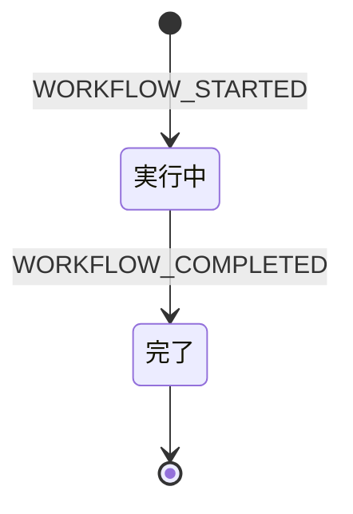
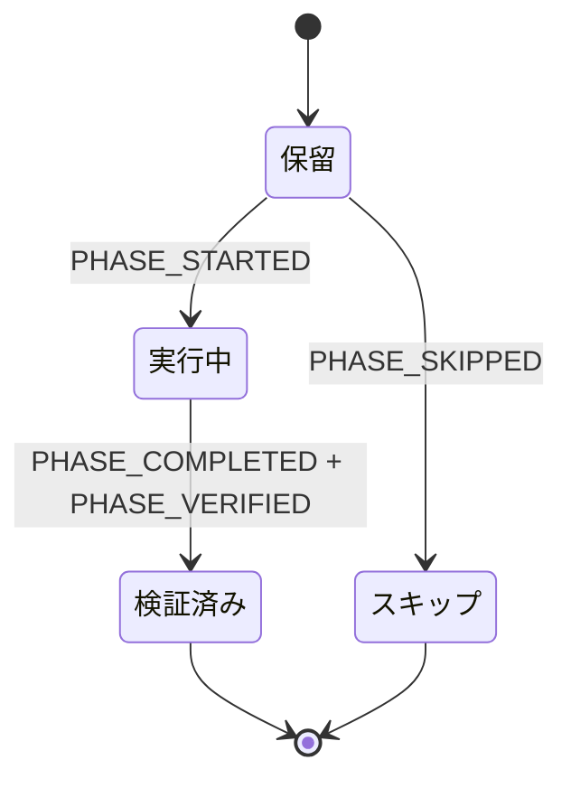
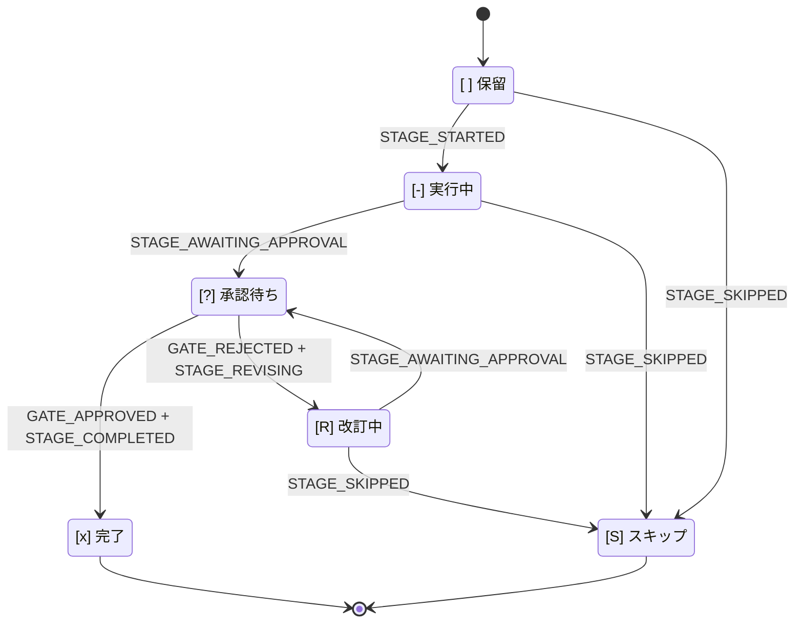

# 状態機械

本章は、AI-DLC の状態機械、監査イベント分類、それらを結ぶ規則
――**各状態遷移にはツールが所有するエミッターがちょうど 1 つある**――の正規
リファレンスです。本章の表とコードの同期は、乖離テスト
`tests/integration/t48-audit-event-emitters.test.ts` により強制されます。文書と
コードが一致しなければ、`tests/integration/t48-audit-event-emitters.test.ts` は失敗します。

AI-DLC は、入れ子になった **ワークフロー**、**フェーズ**、**ステージ** の 3 つの状態機械で
動作します。4 つ目の独立したストリームは、Claude Code フックが出力する
**セッション**イベントを記録します。これら 4 ストリームはインテントの監査証跡
（レコードディレクトリの `audit/` シャードディレクトリ。
`<record>/` = `aidlc/spaces/<active-space>/intents/<YYMMDD>-<label>/`）を共有しますが、
別々のコードパスが所有します。別の関心事として読み、タイムラインが交差することを
覚えておくのが最も理解しやすい方法です。

> **北極星となる不変条件：** 決定的な記録処理は TypeScript、判断は LLM が担当します。
> すべての監査出力はツールまたはフックから始まるため、LLM の文章が出力経路に入りません。
> MD ファイルに `aidlc-audit.ts append <EVENT>` を文章上の指示として見つけた場合は、
> それはバグです。
>
> **監査先行の原子性：** ツールは状態を変更する*前に*監査エントリを出力します。
> 監査出力に失敗すれば、ツールは状態に触れる前に例外を送出します。そのため
> `audit.md` と状態ファイルが不一致になることはありません。失敗モードと、
> 2 つの例外――意図監査（`WORKTREE_*`、`AUDIT_*`、`MERGE_DISPATCH_INVOKED`）と、
> 成果物が派生的で再構築可能な、監査**最後**（audit-last）の DocumentKB カタログ
> イベント――については、本章末尾近くの
> [「監査先行の原子性」節](#監査先行の原子性) を参照してください。

---

## 状態機械が 3 つある理由

ワークフローはフェーズを通過して完了し、フェーズは対象範囲に含まれるステージを
通過して完了し、ステージは承認ゲートが閉じると完了します。各層は異なる判断を
所有します。

- **ワークフロー** — ジョブ全体は実行中か、完了したか。
- **フェーズ** — このライフサイクルフェーズは進行中か、検証済みか、対象範囲外のため
  スキップされたか。
- **ステージ** — ステージを作業中か、ユーザーを待っているか、却下後に改訂中か、完了したか。

これらを 1 つの状態フィールドに平坦化すると、その判断が混同されます。分けておけば、
`/aidlc --status` は一度の読み取りで「このワークフローを阻害しているものは何か」に
答えられます。ワークフロー `Running`、フェーズ `Active`、ステージ `[?]` は
「対象ステージの承認待ち」を意味します。

---

## ワークフロー状態機械



<!-- テキスト代替: 初期状態は WORKFLOW_STARTED で実行中に遷移し、実行中は WORKFLOW_COMPLETED で完了に遷移する。完了は終端状態。 -->

**状態値：** `Running`、`Completed`。

ワークフローは最初のインテントが生成されたとき（最初の `/aidlc` で自動実行されるか、
`/aidlc-init` による `aidlc-utility intent-create`）に始まり、対象範囲に含まれる最後の
ステージの承認ゲートが閉じると終わります。`Paused` や `Waiting for Approval` 状態は
ありません。承認はステージレベルの関心事であり、停止に UX はありません。

ワークフローの `Running` 状態は Claude Code セッションをまたいで維持されます。月曜日に
開始してセッションを終了し、火曜日に再開しても、ワークフローは `Running` のままです。
終了して新たに始まったのは *セッション* です。

| 遷移 | トリガー | エミッター |
|---|---|---|
| `[*] → Running` | `aidlc-utility intent-create` | `tools/aidlc-utility.ts` |
| `Running → Completed` | 最終ステージの結果を `aidlc-orchestrate.ts report` で報告 | `tools/aidlc-state.ts`（内部エミッター） |

---

## フェーズ状態機械



フェーズ境界では、進行コマンドが `PHASE_COMPLETED` + `PHASE_VERIFIED` +
`PHASE_STARTED`（次のフェーズ）を 1 トランザクションで出力します。

<!-- テキスト代替: 初期状態は保留に遷移する。保留は PHASE_STARTED で実行中、PHASE_SKIPPED でスキップに遷移する。実行中は PHASE_COMPLETED + PHASE_VERIFIED で検証済みに遷移する。フェーズ境界では advance が PHASE_COMPLETED + PHASE_VERIFIED + PHASE_STARTED（次フェーズ）を原子的に出力し、検証済みから次フェーズの保留から実行中への遷移へ接続する。 -->

**状態値：** `Pending`、`Active`、`Verified`、`Skipped`。

フェーズ状態は `aidlc-state.md` の `## Phase Progress` 節で追跡します。インテント生成時に
この節を初期設定します。`Initialization` は `Verified` になり（生成処理は引き継ぎ前に
すべての初期化ステージを完了させるため）、初期化直後の最初のステージが属するフェーズは
`Active` に、それ以降の各フェーズは、対象範囲が EXECUTE ステージを残さない場合は
`Skipped`（フェーズごとに `PHASE_SKIPPED` 監査行を 1 件出力）、それ以外は `Pending` に
なります。フェーズの完了時には境界で `PHASE_COMPLETED` と `PHASE_VERIFIED` の両方を
出力し、次のフェーズの `PHASE_STARTED` を出力します。行の書き換えは同じ状態書き込みの
中で行われます。この節は表示専用です。ルーティングは `Lifecycle Phase` と
Stage Progress のチェックボックスを読み、`/aidlc --status` はフェーズブロックを
その場で再計算します。

| 遷移 | トリガー | エミッター |
|---|---|---|
| 初期設定（`Verified`/`Active`/`Pending`/`Skipped`） | `aidlc-utility intent-create` | `tools/aidlc-utility.ts` |
| `Active -> Verified` | フェーズ境界で `aidlc-orchestrate.ts` を通じて報告されたステージの完了/スキップ。前方への `aidlc-jump execute` | `tools/aidlc-state.ts`（内部エミッター）、`tools/aidlc-jump.ts` |
| `Pending -> Active`（境界） | 報告された結果の後にエンジンがルーティング、または `aidlc-jump execute` | `tools/aidlc-state.ts`（内部エミッター）、`tools/aidlc-jump.ts` |
| `Pending -> Skipped`（飛び越え） | フェーズ全体を飛び越える前方への `aidlc-jump execute` | `tools/aidlc-jump.ts` |
| `Verified/Active -> Pending` リセット | 後方への `aidlc-jump execute`（EXECUTE ステージを持つフェーズをリセット） | `tools/aidlc-jump.ts` |
| `Pending <-> Skipped` 再導出 | `aidlc-utility scope-change` / `recompose`（未到達の行のみ） | `tools/aidlc-utility.ts` |

初期化後への引き継ぎ時には、最終初期化ステージの後で
`aidlc-utility intent-create` 自体が
`PHASE_COMPLETED + PHASE_VERIFIED + PHASE_STARTED + STAGE_STARTED` を出力します。
これにより、生成から最初の `advance` まで監査証跡が途切れず、遷移を記録できます。

---

## ステージ状態機械



<!-- テキスト代替: [ ] 保留は STAGE_STARTED で [-] 実行中に遷移する。[-] 実行中は STAGE_AWAITING_APPROVAL で [?] 承認待ちに遷移する。[?] 承認待ちは GATE_APPROVED + STAGE_COMPLETED で [x] 完了、GATE_REJECTED + STAGE_REVISING で [R] 改訂中に遷移する。[R] 改訂中は STAGE_AWAITING_APPROVAL（再入場）で [?] 承認待ちに戻る。保留 / 実行中 / 改訂中はいずれも STAGE_SKIPPED により [S] スキップに遷移できる。 -->

**チェックボックスの凡例（`aidlc-state.md` 内）：**

| チェックボックス | 状態 | 意味 |
|---|---|---|
| `[ ]` | `Pending` | 未開始 |
| `[-]` | `Active` | 進行中 |
| `[?]` | `AwaitingApproval` | ステージ作業は完了、ゲートは開いたまま — ユーザーが阻害要因 |
| `[R]` | `Revising` | ユーザーがゲートを却下 — 再入場前にステージを改訂中 |
| `[x]` | `Completed` | 承認済みで完了 |
| `[S]` | `Skipped` | 対象範囲外、ジャンプによるスキップ、または途中で打ち切り |

`[?]` と `[R]` は、そうでなければどちらも `[-]` に見える 2 つの状況を区別します。
再開時、`[R]` はステージを最初から再実行するのでなく、ゲートへ再入場する前に以前の
アーティファクトとフィードバックを提示するようコンダクターに指示します。

| 遷移 | トリガー | エミッター |
|---|---|---|
| `Pending → Active` | 直前の報告された結果の後にエンジンがルーティング | `tools/aidlc-state.ts`（内部エミッター） |
| `Active → AwaitingApproval` | `aidlc-orchestrate.ts report --stage <slug> --result awaiting-approval`。レビュアーを持つステージは、ゲートを開く前に新鮮な終端受領記録を要求する | `tools/aidlc-state.ts`（内部エミッター） |
| `AwaitingApproval → Completed` | `aidlc-orchestrate.ts report --stage <slug> --result approved --user-input "<exact choice>"` | `tools/aidlc-state.ts`（内部エミッター） |
| `AwaitingApproval → Revising` | `aidlc-orchestrate.ts report --stage <slug> --result rejected --user-input <text>` | `tools/aidlc-state.ts`（内部エミッター） |
| `Active → Revising` | ゲートオープンの復旧が必要な場合の同じ rejected レポート | `tools/aidlc-state.ts`（内部エミッター） |
| `Revising → AwaitingApproval` | `aidlc-orchestrate.ts report --stage <slug> --result revised`。レビュアーを持つステージは、ゲートへ再入する前に却下後の新鮮な終端受領記録を要求する | `tools/aidlc-state.ts`（内部エミッター） |
| `{Active,Revising} → Skipped` | `aidlc-orchestrate.ts report --stage <slug> --result skipped --reason <text>` | `tools/aidlc-state.ts`（内部のルーティング付きスキップエミッター） |
| `Pending → Skipped` | スコープ構成または `aidlc-jump execute` | `tools/aidlc-utility.ts`、`tools/aidlc-jump.ts` |

`approved` レポートは、ゲート後の遷移全体を所有します。`GATE_APPROVED + STAGE_COMPLETED`
を出力した後、次の対象内ステージへルーティングし、`STAGE_STARTED` と境界での
`PHASE_*` イベントを出力します。最後の対象内ステージでは
`PHASE_COMPLETED + PHASE_VERIFIED + WORKFLOW_COMPLETED` を出力してステータスを
`Completed` にします。コンダクターは報告の前後で状態ライフサイクルの動詞を呼びません。

**ルーティング付きスキップ。** `report --result skipped` は、明示的で空白でない
`--stage` と `--reason` を伴うメインワークフローでのみ、指名されたステージが
`execution: CONDITIONAL` と宣言され、`Current Stage` と一致し、Active または
Revising である場合に受け付けられます。正当な理由のあるスキップは完了証拠を
負わないため、アーティファクト、ユニット単位、アンサンブル証拠の各ガードの前に
実行されます。エンジンはそのルーティングマーカー付きで内部スキップ遷移を呼び出し
ます。トランザクションは `[S]` を保持し、ちょうど 1 件の `STAGE_SKIPPED` を出力し、
決して `STAGE_COMPLETED` を出力せず、次のステージを開始する（境界イベントを含む）
か、ワークフローを完了します。先へのルーティングが失敗した場合、復旧はスキップ
マーカーとカーソルを同じステージに残すため、スキップイベントを重複させずにルートを
再試行できます。`report --single --result skipped` は拒否されます。

**アーティファクトガード（課題 #366）。** ステージを `[x]` にするすべてのレポート
結果は、完了前に決定的なアーティファクト検査を行うため、ディスク上の作業証跡
なしにステージを完了にすることはできません。`produces[]` を宣言するステージでは、
それらのアーティファクトの少なくとも 1 つが、アクティブなインテントのレコード
ディレクトリまたはそのユニット単位の構築ディレクトリの下に存在する必要があります。
codekb ステージはより厳格です。登録されたすべてのリポジトリディレクトリが、宣言された
`produces[]` の完全な集合を含まなければなりません。単一リポジトリまたは未記録の
インテントでは、解決された 1 つの codekb ディレクトリを使います。
`workspace_requires: true` はさらに、`aidlc/` とハーネスディレクトリの外にある
ソース作業の証跡を必要とします。検査に失敗した場合は何も書き込みません。
オプションの出力は関与しません。`produces_kinds` については、種別により必須セット
がゼロに絞り込まれるユニットはアーティファクトを負いません。該当するユニットは
同じく厳格です。`AIDLC_SKIP_ARTIFACT_GUARD=1` でバイパスできます。同じスイッチは
レビューロガーの必須出力存在検査もバイパスします。これがない場合、ユニット単位
ステージのステージレベルレビューは、権威あるすべてのユニットの該当する必須出力を
要求します。

**レビュアーゲートガード（課題 #551）。** レビュアーを持つステージは、設定された
レビュアーが新鮮な終端 `REVIEW_COMPLETED` 受領記録を持つまで、`gate-start` や
`revise` を通じて `AwaitingApproval` へ入れません。同じ受領記録は完了系の 4 経路
すべてで引き続き必須です。すでに開いているゲートを再報告した場合は、重複した遷移を
書かずにこれらのガードを再実行します。`Active` から直接報告された却下は、
`STAGE_AWAITING_APPROVAL` の行を捏造せずに `Revising` へ移ります。別のガードを
意図的に切り離す合成的な遷移テストでは
`AIDLC_SKIP_REVIEWER_GATE_GUARD=1` を設定できます。このバイパスはゲートを開く
場面にのみ適用され、`approve`、`advance`、`finalize`、`complete-workflow` には
決して適用されません。隣接するサマリー確認のテスト用バイパスは
`AIDLC_SKIP_SUMMARY_CONFIRMATION_GUARD=1` です。

**アンサンブル証拠ゲート。** `mob` またはサポート付き `subagent` ステージでは、
宣言されたサポートエージェントの貢献ファイル
（`<stage>/contributions/<agent-slug>.md`）が欠落しているか、先頭行の
`**Collaborator:**` アイデンティティマーカーを欠いている間、レポート経路は
`awaiting-approval`、`revised`、`approved` を拒否します — これはアンサンブルが
実際に招集されたことの決定的な証明です。決着済みの自律スウォームは免除されます
（そのユニット単位の収束台帳が証拠です）。`report --single` はステージレベルの
証拠のみを検査します。`mode: pipeline` では、同じレポート結果と、完了させるすべての
直接遷移が、主導／支援の各リンクについて順序付きで現在の試行に属する
`PIPELINE_LINK_COMPLETED` 受領記録を要求します。複数リポジトリのリバース
エンジニアリングでは、スキャンした各リポジトリについて完全なチェーンが必要です。
現在の試行に属し `Decision=keep` を持つリポジトリスコープの `ARTIFACT_REUSED` 行は
再利用されたリポジトリを免除しますが、`modify` / `redo` の行は免除しません。
却下、移動、後続ステージの開始はメインワークフローの証跡をリセットし、単独実行
（`--single`）のリンク行がこれを満たすことはありません。
`AIDLC_DISABLE_ENSEMBLE_EVIDENCE=1` でバイパスできますが、貢献ファイルや進行中の
リンク受領記録が失われた、正当に実行済みのステージの復旧のみを意図しています。

**ソース鮮度とユニット単位の帰属（#629/#646/#662）。** `workspace_requires` の
ステージでは、各終端のレビューが引き続きワークスペース全体の `Source Fingerprint`
を持ちます。最も新しい現行方式の束縛は、通常、完了系の 4 経路すべてにおける
レビュー後変更の外側の境界です。ユニット単位の受領記録は `Unit Source Fingerprint`
を追加します。これは、そのユニットの厳格な `source-manifest.json` の生バイト列と、
すべての exact / directory 主張の現在の内容を束縛します。受領記録は新しい順に
評価されるため、意図的に共有されたパスについては、より新しい検証済みの主張者が
より古い受領記録を保護することがあります。exact / directory 主張の中の未カバーの
編集、削除、新規パスは、所有ユニットだけを無効化し、そのユニットの 1 回だけの
有界な `stale-receipt` 復旧へ入ります。

`WORKFLOW_STARTED`、`STAGE_JUMPED`、および `workspace_requires` の
`STAGE_STARTED` は、内容アドレスのソース一覧ベースラインを記録します。該当する
すべてのユニットが新鮮な現行方式の証跡を持った後、完了はベースラインを現在の
一覧と比較し、新鮮な主張の和集合の外で変更されたアプリケーションソースのパスを
すべて拒否します。ユニット主体の Construction は常にワークフロー／ジャンプの
境界を使います。ソース作業は、遅れて出力される `STAGE_STARTED` に先行し得る
からです。境界や最新の主張者を決めることになる同秒のシャード横断の行は、
シャードのファイル名順を信用せずフェイルクローズします。

却下はレビューと実行フロアの記録をリセットしますが、この完了ベースラインを
置き換えることは決してありません。さもなければ、却下時点に存在した未主張の
パスが次の試行へ既得権として引き継がれてしまいます。前回の試行が検証済みの
`SWARM_SOURCE_MERGED` チェーンを持つ場合、`GATE_REJECTED` はその最終の
`Prior Accepted Source Fingerprint` だけを持ちます。次の試行の最初のソース
マージはその集約から始めなければならず、完了は引き続き元のステージ入場時
ベースラインと比較します。

グローバル境界には、狭く限定された整合が 1 つだけあります。未主張のベースライン
変更（追加、変更、削除）が完全に元へ戻された場合、有効なベースラインスナップ
ショットが存在して妥当であり、該当するすべてのユニットがなお新鮮な現行方式の
ユニット束縛を持ち、ベースラインから現在までの差分に未主張のパスがゼロである
ときにのみ、完了は先へ進めます。これは、一時的な未主張の変更が消えたことを
証明します。通常のレビュー後の編集、古いまたは旧来のユニット束縛、証跡の欠落、
残存する未主張の差分は、いずれも通常のグローバル優先の拒否経路を取ります。

AIDLC のレコード／シェルだけをパスに持つ、変更のない Git なしのグリーン
フィールドは、正準の空ソース状態に束縛されます。Git の初期化前に現れた
フレームワーク外のパスは束縛不能のままで、フェイルクローズします。

移行は意図的です。ベースラインを持たないアップグレード前のワークフローは
未主張の検査を飛ばし、フィールドを持たないユニット単位の受領記録は #629 の
グローバル方針を保ちます。存在するが `unbindable`、欠落、または破損した現行方式の
ベースライン／ユニットスナップショットはフェイルクローズします。
`AIDLC_SKIP_SOURCE_FRESHNESS=1` はグローバルとユニット単位の両方の検査を
バイパスします。マニフェストが欠落または不正な受領記録は明示的に
`Unit Source Binding Bypass: true` を記録するため、完了時にも同じスイッチが
再び必要です。現行方式の Bolt では、確定はさらに、決着済みスウォームのステージ
レベル免除が適用される前に、証明済みのベースからワークツリーへのフットプリントが
レビュー済みマニフェストの主張の部分集合であることを検証します。
`AIDLC_SKIP_SOURCE_FRESHNESS=1` でこの検査を無効化できます。スウォームの
確定は、レビュー済みの `Source Commit` を不変の値として記録します。バイパスされた
確定は `Source Freshness Bypass: true` を記録し、マージ時にも同じスイッチを繰り返す
必要があります。

**ゲート改訂の安全網。** コンダクターが開いたゲートで、先に却下を報告せずに
アーティファクトを改訂した場合、監査証拠がゲート後の人間の手番とそれに続く
アーティファクト書き込みを証明するとき、`approved` レポートは完了前に不足して
いる `GATE_REJECTED` + `STAGE_REVISING` の対を整合させます。補完された行は
`Recovered: true` を持ちます。人間の手番より前のレビュアーの書き込みは数えません。
レビュアーを持つステージは、その復旧された却下の後も `[R]` を保持し、ゲートを再び
開くには新鮮なレビューと通常の `revised` レポートを必要とします。
`AIDLC_SKIP_REVISION_BACKSTOP=1` でバイパスできます。

**駐車（課題 #365/#367）。** `aidlc-orchestrate park` は、ステージを進めずに
`Parked` / `Parked At Stage` 実行時マーカーを書き込みます
（`WORKFLOW_PARKED` を出力する `aidlc-state.ts park` 経由）。続く通常の `next` は
終端の `parked` ディレクティブを再出力し、停止フックがターンの終了を許可します。これに
より、長いワークフローは残りのステージを形式的に通過して `done` にするのでなく、
セッションをまたいで停止できます。`/aidlc --resume` は継続前にマーカーを消去します
（`unpark` は `WORKFLOW_UNPARKED` を出力）。人間の監督がない自律構築の実行
（`Construction Autonomy Mode: autonomous`）では `park` を拒否します。ツールと停止
フックの `parked` はともに自律モードで拒否できるため、人間の再開がなくてもループは
進行し続けます。

### 改訂ループ

```
report awaiting-approval  →  [?] AwaitingApproval
          ↘ report rejected  →  [R] Revising  (Revision Count += 1)
                   ↓ report revised
                   [?] AwaitingApproval
                   ↘ report approved  →  [x] Completed
```

`Revision Count` は状態ファイルにあり、rejected レポートごとに増加します。
コンダクターはこれを使い、改訂ループの脱出口を検出します（既定では 3 サイクル後に
スキップを提案）。

ディレクティブがレビュアーを持つステージで、改訂が `produces[]` アーティファクトを
変更した場合、コンダクターは `revised` を報告する前に `stage-protocol-reviewer.md` §12a の
ステップを再実行します（stage-protocol Part 0）。エンジンは `revised` レポートを受理して
ゲートを再び開く前に、新鮮な終端受領記録を検証します。

---

## セッションストリーム（フック所有、独立）

セッションイベントは AI-DLC ツールではなく Claude Code フックが出力します。セッションは
1 つの Claude Code 会話であり、ワークフローは長期的に維持されるディレクトリ状態です。
1 つのワークフローが複数のセッションにまたがり、1 つのセッションが複数のワークフローに
触れられる多対多の関係なので、ストリームは設計上独立しています。

| イベント | エミッター | トリガー |
|---|---|---|
| `SESSION_STARTED` | `hooks/aidlc-session-start.ts` | `source=startup` または `clear` の `SessionStart` |
| `SESSION_RESUMED` | `hooks/aidlc-session-start.ts` | `source=resume` の `SessionStart` |
| `SESSION_COMPACTED` | `hooks/aidlc-validate-state.ts` | `PreCompact` — コンパクション時点で発火し、確実に記録する |
| `SESSION_ENDED` | `hooks/aidlc-session-end.ts` | `SessionEnd` |

セッションフックは出力前に、アクティブなインテントの `aidlc-state.md`
（`aidlc/spaces/<space>/intents/<YYMMDD>-<label>/` 以下）を確認します。このファイルが
存在しない場合（カレント作業ディレクトリにアクティブな AI-DLC ワークフローがない場合）、フックは監査ログに
何も書かず静かに終了します。セッションイベントはアクティブなワークフローのタイムラインを
注釈するためのものであり、ワークフローのないディレクトリのセッションには注釈対象が
ありません。

### コンパクションの認識

`aidlc-state.ts resume` は監査末尾を走査して最新の `SESSION_COMPACTED` を探します。その後に
ステージ活動（`STAGE_STARTED`、`STAGE_COMPLETED`、`GATE_APPROVED`、`SESSION_RESUMED`、
`RECOVERY_COMPLETED`）がなければ、`aidlc-state.ts resume` は `compaction_pending: true` を返し、
コンダクターは継続前に 3 つの選択肢（継続 / 確認 / 再開）を提示します。ユーザーが
選択肢を選ぶと `acknowledge-compaction` が `RECOVERY_COMPLETED` を出力します。これにより
活動ゲートが満たされ、以後のコンパクションは新しい境界を検出できます。

---

## 監査イベント分類

以下では **87 イベント**を 19 カテゴリに分類します（正規レジストリ
`audit-format.md` では同じ 87 イベントを 22 カテゴリに分けます。分類は表現上のもので、
イベント集合が不変条件です）。今後のリリース向けに事前登録されたイベントを除き、
各イベントにはツールまたはフックのエミッターがちょうど 1 つあります。エミッター欄が
`Reserved (v0.4.0 PR N)`、`Reserved (v0.5.0 PR N)`、`Reserved (v0.6.0 PR N)` の
イベントは、消費側 PR がエミッターを提供するまで乖離テストの順方向検査から除外されます。
乖離テスト `tests/integration/t48-audit-event-emitters.test.ts` は、本章の表とコードの
順方向・逆方向・第三・対・MD 間の整合性を強制します。

### ワークフローのライフサイクル

| イベント | エミッター | 注記 |
|---|---|---|
| `WORKFLOW_STARTED` | `tools/aidlc-utility.ts` | インテント生成ごとに必須の最初のイベント |
| `WORKFLOW_COMPLETED` | `tools/aidlc-state.ts` |  |
| `WORKFLOW_PARKED` | `tools/aidlc-state.ts` | `park` — 後のセッションのためフロー途中でワークフローを停止。ステージは進めない |
| `WORKFLOW_UNPARKED` | `tools/aidlc-state.ts` | `unpark` — 明示的な `--resume` 再入場時に駐車マーカーを消去 |

### フェーズのライフサイクル

| イベント | エミッター | 注記 |
|---|---|---|
| `PHASE_STARTED` | `tools/aidlc-utility.ts`, `tools/aidlc-state.ts`, `tools/aidlc-jump.ts` | `init` で最初に出力し、以後はステージツールのフェーズ境界で出力 |
| `PHASE_COMPLETED` | `tools/aidlc-utility.ts`, `tools/aidlc-state.ts`, `tools/aidlc-jump.ts` | 各境界で `PHASE_VERIFIED` と対になる |
| `PHASE_VERIFIED` | `tools/aidlc-utility.ts`, `tools/aidlc-state.ts`, `tools/aidlc-jump.ts` | 常に `PHASE_COMPLETED` と対になる |
| `PHASE_SKIPPED` | `tools/aidlc-utility.ts` | スコープ外フェーズごとに 1 件、インテント生成時に出力 |

### ステージのライフサイクル

| イベント | エミッター | 注記 |
|---|---|---|
| `STAGE_STARTED` | `tools/aidlc-state.ts`, `tools/aidlc-utility.ts`, `tools/aidlc-jump.ts` | 内部ルーティングが `[ ]` → `[-]` を記録 |
| `STAGE_AWAITING_APPROVAL` | `tools/aidlc-state.ts` | `report --result awaiting-approval` / `revised` の内部エミッター。復旧行には `Recovered=true` が付く。認可された遮断センサーの上書きは、センサー id、任意の詳細パス、評価理由を記録する |
| `STAGE_COMPLETED` | `tools/aidlc-state.ts`, `tools/aidlc-utility.ts` | completed/approved レポートの内部エミッター。skipped レポートとは決して対にならない |
| `STAGE_REVISING` | `tools/aidlc-state.ts` | rejected レポートの後に `GATE_REJECTED` と対になる内部エミッター |
| `STAGE_SKIPPED` | `tools/aidlc-state.ts`, `tools/aidlc-jump.ts` | `[S]` 遷移ごとにちょうど 1 件。メインワークフローのレポート経路は原子的に先へルーティングする |
| `STAGE_JUMPED` | `tools/aidlc-jump.ts` | `--stage`/`--phase` ジャンプの到達先 `slug` を記録 |

### ゲートの決定

| イベント | エミッター | 注記 |
|---|---|---|
| `GATE_APPROVED` | `tools/aidlc-state.ts` | `--user-input` で選択内容をそのまま記録 |
| `GATE_REJECTED` | `tools/aidlc-state.ts` | `--feedback` で却下理由を記録 |

### ユーザー操作

| イベント | エミッター | 注記 |
|---|---|---|
| `DECISION_RECORDED` | `tools/aidlc-log.ts` | 選択肢を記録するため、ゲート以外の `AskUserQuestion` の前に出力 |
| `QUESTION_ANSWERED` | `tools/aidlc-log.ts` | ゲート以外の質問への応答後に出力。承認の選択は `report` が所有するライフサイクルイベント |
| `SUMMARY_CONFIRMATION_RECORDED` | `tools/aidlc-log.ts` | 人間の裏付けを持つ統合サマリーの受領記録。新しい行は `Hash Scope: confirmed-content-v1` を持ち、これは前文と、想定の決定後のフォローアップ質問を含む、可視のすべての Q<n> 節およびフィードバック節の正準順序を保持する。サマリー後のちょうど 1 つの `Assumption Confirmation` 節とその内容は除外され、同名のサマリー前の節はハッシュ対象のままとなる。サマリー後のその他の可視の Markdown または生 HTML の見出しはフェイルクローズする。ステージ固有のサマリー前見出しは有効なまま。スコープなしの受領記録は旧来のファイル全体検証を保ち、許可された追記の後には再確認が必要となる。公開監査 append からは予約されている |
| `REVIEW_REQUESTED` | `tools/aidlc-log.ts` | コンダクターが `stage-protocol-reviewer.md` §12a で定義されるレビュアーをディスパッチしたときに出力し、レビューへ送った成果物のフィンガープリントを記録する。未対応のリクエストが 1 件ある間、2 件目の通常リクエストは拒否される。新規の `--unit` リクエストは権威ある DAG のメンバーを指名しなければならない。DAG を持たない旧来のスウォームでは、対応する未クローズのツール所有 Bolt 試行を通じて正確なユニットを証明してもよい。`--retry-pending` は、新規リクエストのユニットメンバーシップ受理を再適用せずに、受理済みの未対応の序数をそのまま再ディスパッチする |
| `REVIEW_COMPLETED` | `tools/aidlc-log.ts` | 対応する正のイテレーションの `REVIEW_REQUESTED` があり、そのリクエスト時のフィンガープリントが評決時のフィンガープリントと現在の宣言済み出力パスおよびバイト列の双方になお等しいときにのみ出力する。レビュー中に書き込みがあった場合、評決を記録する前に再ディスパッチが必要となる。`READY` は即座に終端。助言的（advisory）な `NOT-READY` は通常フローのパス後に終端。敵対的（adversarial）な `NOT-READY` は `reviewer_max_iterations` に到達して初めて終端となる（それ以前の行は修復／再試行の進捗をウェーブへ露出する）。後続の宣言済み出力またはソースへの書き込みで無効化された終端受領記録は、次の序数で 1 回だけの明確な回復リクエストを得る。回復のどちらの評決も終端であり、2 度目の無効化には人間によるリセットが必要となる。`workspace_requires` のステージは `Source Fingerprint`（git ネイティブのソースハッシュ、または `unbindable`）も記録する。現行方式の `unbindable` な受領記録はフェイルクローズし、フィールドを持たない #629 以前の行は移行時の挙動を保つ。ユニット単位の `workspace_requires` 受領記録は加えて `source-manifest.json` を要求し、`Unit Source Fingerprint`、または明示的なソース束縛バイパスを記録する。ゲートを開く遷移（`gate-start` と `revise`）および完了系のすべての状態遷移（`approve`、`advance`、`finalize`、`complete-workflow`）は、現在のワークフロー試行の対応する終端受領記録を要求する。ユニット単位のステージは該当ユニットごとに 1 件を要求し、DAG を持たないステージレベルのフォールバックを満たせるのはユニットなしの受領記録だけである。自律スウォームの確定は加えて、各設定済みユニットの Bolt 開始後の対になった終端受領記録、現在の成果物とソースの束縛、そして該当する必須成果物のすべてがその Bolt をホストするワークツリー内にファイルとして存在することを要求する（存在しない任意出力は有効なフィンガープリントエントリのまま）。 |
| `PIPELINE_LINK_COMPLETED` | `tools/aidlc-log.ts` | 宣言されたパイプラインリンクが 1 つ返却された後に出力する。`Stage`、`Link`、`Position k/N` を持ち、複数リポジトリのチェーンでは `Repo` も、単独実行では `Workflow=single-stage:<slug>` も持つ。ツールはその受領記録スコープ内で、宣言外・重複・順序違いのリンクを拒否する。メインワークフローのゲート開始、承認、前進、確定、ワークフロー完了は単独実行の行を無視し、スキャンした各リポジトリについて現在の試行のリンク受領記録をすべて要求する |

### ユニットのライフサイクル（インラインのユニット単位 Construction ステージ）

| イベント | エミッター | 注記 |
|---|---|---|
| `UNIT_STARTED` | `tools/aidlc-state.ts` | `unit start` — エンジンが現在ルーティングしているステージ／ユニットの厳密な組、権威ある DAG 由来の安全なユニット識別子（安全なレガシー表記を含む）、そして他に開いているユニットが無いことを要求する |
| `UNIT_PAUSED` | `tools/aidlc-state.ts` | `unit pause` — `--reason` と `--next-action` が必須。エンジンは一時停止中のユニットを最優先でルーティングし、明示的な再開までハードストップする |
| `UNIT_RESUMED` | `tools/aidlc-state.ts` | `unit resume` — 現在一時停止中のユニットだけが再開できる |
| `UNIT_COMPLETED` | `tools/aidlc-state.ts` | 直列の `unit complete` は、アクティブなユニットの必須成果物を検証する。ウェーブの `unit complete --wave` は代わりに、エンジンがそのエントリをなおビルド完了／レビュー決着済みとして露出しているかを検証し、新しいユニット日誌のエントリを決定論的なマーカー付きで親日誌へ複写し、受領記録を最終的な成果物フィンガープリントへ束縛したうえで、単一アクティブのチェックポイントを開かずに確定する。すべてのライフサイクル行は、厳密な境界イベント／タイムスタンプ／序数からなる `Run floor`（またはフェイルクローズのシャード横断曖昧性トークン）を伴う。受領記録モードは試行をまたいで有効なままなので、古い・変更された・曖昧な・再オープンされた・親日誌へ未集約のユニットは、再度完了するまでゲートをブロックする |

### スコープと構成

| イベント | エミッター | 注記 |
|---|---|---|
| `SCOPE_DETECTED` | `tools/aidlc-utility.ts` | `detect-scope` サブコマンド。`Source` フィールドに出所（自由記述 / キーワード / 環境変数 / コマンドライン）を記録 |
| `SCOPE_CHANGED` | `tools/aidlc-utility.ts` | アクティブなワークフローの `scope-change` サブコマンド |
| `PLUGIN_SELECTION_CHANGED` | `tools/aidlc-utility.ts` | `select-plugins` の設定モード。フィールド: `Previous Selection`、`New Selection` |
| `DEPTH_CHANGED` | `tools/aidlc-utility.ts` | `config-change --depth` |
| `TEST_STRATEGY_CHANGED` | `tools/aidlc-utility.ts` | `config-change --test-strategy` |
| `REVIEW_CLASS_CHANGED` | `tools/aidlc-utility.ts` | `config set review <value>` / `config-change --review` / `scope-change --review` の組み合わせが実行単位のレビュー上書きを設定または解除したとき |
| `RECOMPOSED` | `tools/aidlc-utility.ts` | `recompose` サブコマンド — 適応型コンポーザーが進行中の計画を再形成（監査ロック下で保留ステージ接尾辞を切り替え） |

### アーティファクト

| イベント | エミッター | 注記 |
|---|---|---|
| `ARTIFACT_CREATED` | `hooks/aidlc-write-audit-log.ts` | 新規パスへの書き込み — `mtimeMs == birthtimeMs` の統計検査で `ARTIFACT_UPDATED` と区別 |
| `ARTIFACT_UPDATED` | `hooks/aidlc-write-audit-log.ts` | 既存ファイルを上書きする `Edit` ツールまたは `Write` |
| `ARTIFACT_REUSED` | `tools/aidlc-state.ts` | `reuse-artifact` サブコマンド — 保持 / 変更 / やり直しの決定。任意の `Repo` は証跡を登録済みの 1 リポジトリにスコープするが、現在の試行に対するパイプラインの免除を与えるのは `keep` のみ |

### 構築ボルト

| イベント | エミッター | 注記 |
|---|---|---|
| `BOLT_STARTED` | `tools/aidlc-bolt.ts` | 並列バッチ用に CSV のボルト名を受け付ける。現行方式の `--worktree` 行は、ワークツリー作成時に証明された不変の Base コミットと内容アドレスの raw 対応 Base Source Listing を伝播する |
| `BOLT_COMPLETED` | `tools/aidlc-bolt.ts` | 先行する `BOLT_STARTED` と対になる |
| `BOLT_FAILED` | `tools/aidlc-bolt.ts`（`fail` + `abort`） | `--succeeded-siblings` が並列バッチの生存者を記録。`abort` は下位分類用に `Reason: aborted` フィールドを追加 |
| `AUTONOMY_MODE_SET` | `tools/aidlc-bolt.ts` | `Construction Autonomy Mode` フィールドを原子的に更新。先にフィールド存在を検証（監査先行） |

### セッション

| イベント | エミッター | 注記 |
|---|---|---|
| `SESSION_STARTED` | `hooks/aidlc-session-start.ts` | `source=startup` または `clear` |
| `SESSION_RESUMED` | `hooks/aidlc-session-start.ts` | `source=resume` |
| `SESSION_COMPACTED` | `hooks/aidlc-validate-state.ts` | 重複を避けるため `PreCompact` で出力（次の `SessionStart` ではない） |
| `SESSION_ENDED` | `hooks/aidlc-session-end.ts` | Claude Code からの `Reason` フィールドを含む |
| `HUMAN_TURN` | `hooks/aidlc-record-human-turn.ts`（＋ハーネスごとのプロンプト送信アダプター） | 観測されたプロンプト送信または回答済みウィジェットのシームごとに 1 件。承認 / インタビューゲートは、直前のゲート解決以降に 1 件を要求する。これは存在と鮮度の証跡であり、認証されたトランスクリプトでも、後から呼び出し側が供給した決定テキストを人間が書いたことの証明でもない |
| `SUBAGENT_COMPLETED` | `hooks/aidlc-log-subagent.ts` | サブエージェント停止フック経由でサブエージェント完了を記録 |
| `REVIEWER_SCOPE_BLOCKED` | `hooks/aidlc-reviewer-scope.ts` | ユニット単位レビュアーのツール呼び出しが、兄弟ユニットの `construction/` パスへ到達したため拒否された（レビュアーモジュールの読み取り範囲境界）。拒否ごとに 1 行 |
| `REVIEW_FREEZE_BLOCKED` | `hooks/aidlc-review-freeze.ts` | ファイルツールまたはシェルによる `produces[]` への書き込みが、ゲート前に新鮮な終端レビュー受領記録（READY、または実効レビュークラスにおける終端 NOT-READY）を無効化するとして拒否された。拒否ごとに 1 行 |
| `PLAN_APPROVAL_BLOCKED` | `hooks/aidlc-plan-approval-guard.ts` | コード生成の開発者エージェントディスパッチが、対象ユニットに、フィンガープリント済みの最新のプラン、テスト指示、Testing Contract、明示的な承認、または一致するワーカーブリーフのマーカーが欠けているとして拒否された。拒否ごとに 1 行 |

### 診断とワークスペース

| イベント | エミッター | 注記 |
|---|---|---|
| `HEALTH_CHECKED` | `tools/aidlc-utility.ts` | `--doctor` の実行 |
| `WORKSPACE_SCAFFOLDED` | `tools/aidlc-utility.ts` | `init` が新規ディレクトリツリーを作成 |
| `WORKSPACE_SCANNED` | `tools/aidlc-utility.ts` | ブラウンフィールドのワークスペース検出が完了 |
| `WORKSPACE_INITIALISED` | `tools/aidlc-utility.ts` | 状態ファイルが実体化 |

### ドキュメント

DocumentKB はスペースレベルなので、インテントスコープのドキュメントであっても
3 イベントすべてが 1 つのスペースレベルのシャードに着地します。インテント UUID は
イベント上のフィールドであり、シャードの選択子ではありません。

そのシャードは **`spaces/<space>/intents/audit/`** であって、`spaces/<space>/audit/`
ではありません。`intents/` セグメントは、スペース内のすべてのシャードが置かれる
`intentsDir()` から継承されます。スペースレベルのシャードは、1 階層上のディレクトリ
ではなく、インテント単位のレコードディレクトリの兄弟です。この行の以前の版は
短い方のパスを記載していましたが、それはディスク上に存在しません――ドキュメントを
オンボードして、実際に書かれたシャードを確認することで実測済みです。

ワークフロー権限の読み手は、解決されたインテントのシャードだけを列挙します。
スペースレベルの来歴が必要な消費側は明示的にそれを要求します。`--doctor --export`
はそうしており、解決されたインテントのシャードより先にスペースシャードを読むため、
ライフサイクル権限をインテント台帳の外へ広げることなくドキュメントイベントを
可視に保ちます。

3 イベントはすべて `tools/aidlc-knowledge.ts`（DocumentKB S1）とともに出荷されます。
イベントごとの発行動詞は下の各行に記載しています――`onboard`、`sync`、`associate`、
`dissociate`、`rebind`、`summarize` のすべてが発行します。

| イベント | エミッター | 注記 |
|---|---|---|
| `DOCUMENT_INDEXED` | `tools/aidlc-knowledge.ts` | `onboard` と、`sync` の新規ドキュメント分岐から。顧客ドキュメントが初めて DocumentKB に入った。**監査最後（audit-last）**（「派生カタログの監査最後」を参照）: すべてのカタログ書き込みが成功した後にのみ出力される。 |
| `DOCUMENT_UPDATED` | `tools/aidlc-knowledge.ts` | `associate`、`dissociate`、`rebind`、`summarize`（`Change: summarized`）、`onboard` の編集済み行分岐、および `sync` の移動／変更／再試行分岐から。新しいリビジョン、再抽出、移動、サマリーの公開、またはインテント関連付けの変更。通常の no-op は何も出力しない。冪等な再試行は、先行の audit-last 呼び出しがカタログをコミットしたが来歴の前に失敗したと検出した場合、`Change: audit-repair` または欠けている関連付けの差分を出力することがある。これは新しいユーザー変更ではなく、既にコミット済みの状態を記録するものである。**監査最後（audit-last）**（「派生カタログの監査最後」を参照）: すべてのカタログ書き込みが成功した後にのみ出力される。 |
| `DOCUMENT_REMOVED` | `tools/aidlc-knowledge.ts` | `sync` から。オリジナルが消えたため、行はトゥームストーン化され抽出済み内容は削除される。`metadata.json` のトゥームストーンは保持されるため、後のインデックス再構築が不在の行を復活させることはない。**監査最後（audit-last）**（「派生カタログの監査最後」を参照）: すべてのカタログ書き込みが成功した後にのみ出力される。 |

3 イベントはすべて、ドキュメントがインテントにスコープされている場合でも
**スペースレベル**の監査シャードに着地します。ドキュメントはどのインテントよりも
長生きし、そのスコープは後から移動できるため、たまたまアクティブだったインテントの
下に来歴を収めると、1 つのドキュメントの履歴がシャード間で分裂し、再構築不能に
なってしまうからです。

### エラーと復旧

| イベント | エミッター | トリガー |
|---|---|---|
| `ERROR_LOGGED` | `tools/aidlc-lib.ts`（各ツールの `error()` からの `emitError` 経由） | 非ゼロ終了のために `error(msg)` を呼ぶ任意のツール CLI。最善努力 — カレント作業ディレクトリにワークフローがなければ何もしない。再帰を防止 |
| `RECOVERY_COMPLETED` | `tools/aidlc-state.ts` | ユーザーがコンパクション認識の `AskUserQuestion` に答えた後、コンダクターが呼ぶ `acknowledge-compaction --choice <continue\|review\|restart>` |

### ワークツリー

バージョン 0.4.0 向けに事前登録。3 つの `WORKTREE_*` 行は `aidlc-worktree.ts`（マイルストーン 7）と
ともに出荷。`STATE_*` はマイルストーン 9（状態のフォーク / マージ）、`AUDIT_*` は
マイルストーン 10（監査のフォーク / マージ）で入ります。
`tests/integration/t48-audit-event-emitters.test.ts` の順方向検査は、エミッター欄がなお
`Reserved` の行をスキップします。

| イベント | エミッター | トリガー |
|---|---|---|
| `WORKTREE_CREATED` | `tools/aidlc-worktree.ts` | 監査先行のボルト単位の作成が、不変の Base コミット、`Base Source Listing`、可搬な作成元リポジトリ選択子（`Repo`、ルートは `-`）を記録する。プライベートなワークツリーメタデータは正準の Git common-dir も束縛する。スウォームの prepare は加えてインテント／ユニット／バッチ／ステージ／フロアの来歴をスタンプする（サブコマンド: `create`） |
| `WORKTREE_MERGED` | `tools/aidlc-worktree.ts` | ゲート承認時にボルトのワークツリーを `main` へマージ（サブコマンド: `merge`） |
| `WORKTREE_DISCARDED` | `tools/aidlc-worktree.ts` | 中止したボルトのワークツリーを明示的に削除（サブコマンド: `discard`） |
| `STATE_FORKED` | `tools/aidlc-state.ts` | ボルト開始時に状態ファイルをワークツリーへフォーク（サブコマンド: `fork`） |
| `STATE_MERGED` | `tools/aidlc-state.ts` | ゲート承認時にワークツリーの状態を `main` へマージ。防御のためのアルファベット順 `slug` タイブレーク（サブコマンド: `merge`） |
| `AUDIT_FORKED` | `tools/aidlc-audit.ts`（`audit-fork`） | ボルト開始時に監査ログをワークツリーへフォーク。意図の監査 — バイトコピーの前に出力 |
| `AUDIT_MERGED` | `tools/aidlc-audit.ts`（`audit-merge`） | ゲート承認時にワークツリーの監査エントリを `main` 監査へ追記。ボルト内の順序は保持し、ボルト間の順序はマージ完了順を反映 |

### プラクティス

バージョン 0.4.0 向けに事前登録。エミッターはマイルストーン 8（ステージ 2.2 のプラクティス発見）と
マイルストーン 13（構築オーケストレーター実行時）で入ります。

| イベント | エミッター | トリガー |
|---|---|---|
| `PRACTICES_DISCOVERED` | `tools/aidlc-state.ts` `practices-event --type discovered` | グリーンフィールドまたはブラウンフィールドのリード草稿＋3 つのスポーク＋人間へのインタビュー＋リードの統合が完了。草稿は確認待ち |
| `PRACTICES_AFFIRMED` | `tools/aidlc-state.ts` `practices-promote` | チームがプラクティスを承認。内容をインテントの `inception/practices-discovery/` から `aidlc/spaces/<active-space>/memory/team.md` と `project.md` へ昇格 |
| `PRACTICES_OVERRIDE` | `tools/aidlc-state.ts` `practices-promote`（書き込み失敗経路）と `tools/aidlc-state.ts` `practices-event --type override`（ボルト計画マーカー衝突経路） | いずれか: 昇格が失敗しステージは承認待ちのまま。またはアクティブスペースのウォーキングスケルトン方針が現在のボルトのマーカーを上書き |
| `PRACTICES_SECTION_EMPTY` | `tools/aidlc-state.ts` `practices-event --type empty` | コンダクターが空のプラクティス節を読んだ。助言のみで、組織既定へフォールバック |

### マージディスパッチ

バージョン 0.4.0 のマイルストーン 1 で事前登録。エミッターはマイルストーン 13 で新しい
`aidlc-bolt dispatch-event` サブコマンド経由で入ります。コンダクターは各
`aidlc-pipeline-deploy-agent/` ディスパッチを括ります — 呼び出し前は INVOKED、
YAML 解析成功後の呼び出し後は RETURNED、タイムアウト / 不正 YAML / 低信頼度では
FALLBACK。

| イベント | エミッター | トリガー |
|---|---|---|
| `MERGE_DISPATCH_INVOKED` | `tools/aidlc-bolt.ts` `dispatch-event --event MERGE_DISPATCH_INVOKED` | コンダクターがチームプラクティス文面からマージ戦略を決めるため、`Task` 経由で `aidlc-pipeline-deploy-agent/` をディスパッチ |
| `MERGE_DISPATCH_RETURNED` | `tools/aidlc-bolt.ts` `dispatch-event --event MERGE_DISPATCH_RETURNED` | エージェントが戦略、対象ブランチ、信頼度、注記付きの解析済み YAML を返却 |
| `MERGE_DISPATCH_FALLBACK` | `tools/aidlc-bolt.ts` `dispatch-event --event MERGE_DISPATCH_FALLBACK` | エージェントがタイムアウトまたは不正 YAML を返却。コンダクターは組織既定へフォールバック — 重要な可観測性フック |

### センサー

センサーディスパッチャーが 4 つの `SENSOR_*` イベントを出力し、`doctor` が対カバレッジの
`GUARDRAIL_LOADED` 行を出力します。書き込み発火のセンサーは、一致するパスに対する
ツール使用後（PostToolUse）からディスパッチされます。ゲート発火のセンサーは、初回、
改訂後、または承認時安全網の復旧によるゲート入場の前に、既存の宣言済み成果物ごとに
1 回ディスパッチされます。遮断バインディングは検証済みの合格でのみ先へ進みます。
指摘、実行不能、不正または不一致の評決、予算超過は拒否となります。上書きには、
記録された提示済み選択肢、人間の手番、正確な回答受領記録、一致する `--user-input`
が必要です。自律モードでは上書きできません。明示的および発見された成果物パスは、
ステージの生成ディレクトリ内へ正準的に制限されます。書き込み発火のセンサーの遮断
宣言は、本リリースでは助言のままです。

| イベント | エミッター | トリガー |
|---|---|---|
| `SENSOR_FIRED` | `tools/aidlc-sensor.ts` `fire` | ディスパッチャーが、一致する Write/Edit またはゲート境界のディスパッチから、ステージ出力に対してセンサーを起動 |
| `SENSOR_PASSED` | `tools/aidlc-sensor.ts` `fire` | センサーが完了し、指摘なしと報告（ツール利用不可とスクリプトエラーのフォールスルーも含む。`Note` フィールドで識別） |
| `SENSOR_FAILED` | `tools/aidlc-sensor.ts` `fire` | センサーが完了し、指摘ありと報告。詳細ファイルを `<record>/.aidlc-sensors/<stage-slug>/<sensor-id>-<fire-id>.md`（インテントのレコードディレクトリ内）へ書き込み |
| `SENSOR_BUDGET_OVERRIDE` | `tools/aidlc-sensor.ts` `fire` | センサーが設定上限（レジストリ / バインディング / 深度由来の 3 層上限モデル）を超え、終了またはスキップされた |
| `GUARDRAIL_LOADED` | `tools/aidlc-utility.ts` | ガードレールローダーがアクティブなワークフロー向けのスコープ階層ガードレール集合を解決（組織 → プロジェクト → フェーズ → ステージ）。`doctor` の対カバレッジ検査がこのイベントを読む |

### 学習ループ

バージョン 0.5.0 のマイルストーン 4 で事前登録。`MEMORY_EMPTY` のエミッターはマイルストーン 8
（`aidlc-runtime.ts compile`）で入ります。§13 の学習儀式は実行中にステージ単位の
`memory.md` を書きます。ステージ承認時、ランタイムグラフのコンパイルが `memory.md` を
読み、標準の 4 見出しの下に空白以外のエントリがゼロのステージへ `MEMORY_EMPTY` を
出力します。マイルストーン 12 の学習ゲートツール（`aidlc-learnings.ts persist`）は、
保持した学習が `aidlc/spaces/<active-space>/memory/{project,team}.md` の日付付きプラクティス
エントリとして着地すると `RULE_LEARNED` を、学習がセンサーバインディング
（マニフェスト＋発生元ステージの `sensors:` フロントマター）を導入すると
`SENSOR_PROPOSED` を出力します。`doctor` は日誌規律の可観測性のためにこれらの行を読みます。

| イベント | エミッター | トリガー |
|---|---|---|
| `MEMORY_EMPTY` | `tools/aidlc-runtime.ts` | ステージ承認時のランタイムグラフコンパイルが、`memory.md` 欠落、または §13 の 4 見出し下に空白以外のエントリがゼロであることを検出 |
| `RULE_LEARNED` | `tools/aidlc-learnings.ts` | 学習ゲートが保持した学習を `aidlc/spaces/<active-space>/memory/{project,team}.md` の日付付きプラクティスエントリとして永続化 |
| `SENSOR_PROPOSED` | `tools/aidlc-learnings.ts` | 学習ゲートがプロジェクト層のセンサーマニフェストを足場にし、発生元ステージの `sensors:` フロントマターへバインド |

### スウォーム

スウォーム分類は 7 イベントを持ちます。6 つは、状態を持たない審判 `aidlc-swarm.ts` から
出力されます。`prepare` は厳密なステージ試行トークンを捕捉し、それをワークツリー作成
メタデータへスタンプしてバッチをフォークします。`finalize` はそのトークンが現在のままで
あることを要求し、主張されたすべてのユニットを再検証して、収束／失敗、バトン、バッチの
各行を出力します。`SWARM_SOURCE_MERGED` は後から `aidlc-worktree.ts merge` により、
不変のレビュー済みアプリケーションソースが `main` に着地した後に出力されます。これは
永続的なワークツリー来歴を、厳密な現在の Bolt、バッチ、ステージ、実行フロアと相関させ、
その後 `main` のチェックアウトを、ステージベースライン、前回試行の受理済み却下
フィンガープリント、または直前の現在試行の集約から連結します。選択子なしのマージは
作成元インテントをワークツリー記録から復元します。明示的な不一致は必要な
`--space`/`--intent` の復旧を名指しし、権威パスの比較はファイルシステムのエイリアスを
正準化します。束縛以前のフィールドを持たない収束は過去のブランチマージ挙動を保ちます。
現行方式の不完全な権威はフェイルクローズします。`check` サブコマンドは引き続き助言のみで
何も出力しません。コンダクターは `invoke-swarm` をステージの `mode` 列挙とは直交する
ディレクティブ種別として扱います。予約済みの `agent-team` モードは起動しません。

| イベント | エミッター | トリガー |
|---|---|---|
| `SWARM_STARTED` | `tools/aidlc-swarm.ts` | スウォーム審判の `prepare` が、厳密な試行と、試行に束縛された完全なユニット義務集合を捕捉し、依存関係で結ばれたユニットのバッチを 1 つフォーク |
| `SWARM_UNIT_CONVERGED` | `tools/aidlc-swarm.ts` | スウォームユニットが再検証で緑・改ざんなしとなり、AIDLC のメタデータをマージバックした。行が明示的に `Source Freshness Bypass: true` を持つ場合を除き、`finalize` は不変の `Source Commit` を記録する前に、設定された Bolt 後レビュアー受領記録、現在の `Source Fingerprint` と `Unit Source Fingerprint`、および証明済みの raw 対応のベースからワークツリーへのフットプリントをレビュー済みマニフェストの主張と照合して検証している。バイパスの行はこれらの鮮度保証を持たず、ソースマージ時にも改めて `AIDLC_SKIP_SOURCE_FRESHNESS=1` を必要とする |
| `SWARM_SOURCE_MERGED` | `tools/aidlc-worktree.ts` | 厳密な現在試行の不変のレビュー済みソースが作成元リポジトリに着地し、集約ソースフィンガープリントのチェーンを延長した。行はその不変の `Source Commit` と可搬な `Repo` 選択子を持つ。決着済みの完了は、それがユニットの最新の収束と一致することと、収束ユニットごとに 1 行あることを要求し、最終的な `main` チェックアウトを検証する |
| `SWARM_UNIT_FAILED` | `tools/aidlc-swarm.ts` | スウォームユニットが `finalize` 再検証に失敗（未主張、主張したが不合格、改ざん、または設定されたレビュアー受領記録の欠落） |
| `SWARM_BATON_RETURNED` | `tools/aidlc-swarm.ts` | スウォームユニットがオーケストレーター仲介の調整のため、コンダクターへバトンを返却 |
| `SWARM_COMPLETED` | `tools/aidlc-swarm.ts` | バッチ内の全ユニットが終了（収束または失敗）。バッチ閉鎖 |
| `SWARM_DEGRADED` | `tools/aidlc-swarm.ts` | `AIDLC_USE_SWARM=1` が要求されたが `Workflow` ツールが利用不可。コンダクターがサブエージェント下限で実行 |

分類内の各イベントは、実エミッターに裏付けられるか、事前登録の今後の消費側向けに
`Reserved (v0.4.0 PR N)` / `Reserved (v0.5.0 PR N)` / `Reserved (v0.6.0 PR N)` と
印付けられます。乖離テストは両側を強制します — `Reserved` の早期スキップは、セルが文字どおり
`Reserved` を含む間だけ適用され、消費側 PR は出力呼び出しを出荷するのと同じコミットで、
実エミッターのファイルパスへ置き換えます。

---

## 監査先行の原子性

状態を変更するコマンドは、状態ファイルを変更する**前に**監査エントリを出力します。
ただし文書化された例外が 2 つあります。下記の意図監査グループ（出力前に結果を
検査できない副作用のための、監査が先・副作用が後）と、DocumentKB カタログイベント
（監査が**最後**――「派生カタログの監査最後」を参照）です。結果は 2 つです。

1. 監査出力が失敗した場合（ロックタイムアウト、ディスクエラー、不正なイベント型）、
   ツールは状態に触れる前に例外を送出します。状態は直前の値のまま、`audit.md` もきれいなままです。
2. 監査出力の*後*に状態書き込みが失敗した場合、監査には「意図」のエントリがあるのに状態は
   動いていません。乖離は可視で診断可能であり、`--doctor` が表面化します。

`tests/unit/t17.test.ts` のケース `test("65: approve is audit-first ...")` が `approve` について
これを証明します。`audit.md` を読み取り専用に権限変更すると監査失敗を強制し、状態ファイルが
`[?]` のまま（`[x]` にならない）ことを断言します。同じ不変条件は `gate-start`、`reject`、
`revise`、`skip`、`advance`、`complete-workflow`、`reuse-artifact`、
`aidlc-bolt.ts set-autonomy`、および `aidlc-state.ts fork` / `aidlc-state.ts merge`
（バージョン 0.4.0 マイルストーン 9 の状態フォーク / マージサブコマンド — 同等のロックディレクトリへの
権限変更によるパート A と、出力後の対象への権限変更によるパート B の証明は
`tests/unit/t76.test.ts` を参照）にも当てはまります。

状態のフォーク / マージは、意図的に下記の意図監査の例外に入れません。状態ファイルの再読込と
再書き込みは冪等です（出力と Git の間で強制終了するとワークツリーが残る
`git worktree add` とは異なり）、厳密な不変条件をきれいに適用できます。成功した監査出力の後の
状態書き込み失敗は、幽霊の `STATE_FORKED` 行になり、`doctor`（バージョン 0.4.0 マイルストーン 15）が
ワークツリーのレコードディレクトリの `aidlc-state.md` 存在と突合します。

### 派生カタログの監査最後（`DOCUMENT_INDEXED`、`DOCUMENT_UPDATED`、`DOCUMENT_REMOVED`）

DocumentKB のイベントは順序を反転させます。`aidlc-knowledge.ts` はコミット中に
それらを収集し、`index.json`、すべての `metadata.json`、すべての `content.md` の
書き込みが成功した**後にのみ**出力します。これはフレームワークの中で監査が状態に
後続する唯一の場所であり、カタログが**派生的**であることの意図的な帰結です。

ワークフロー状態は権威です。`aidlc-state.md` を再構築できるものは何もないため、
失敗した書き込みに先行して記録された監査行は、`--doctor` が状態ファイルと突合できる
幽霊エントリを残しますが、その診断可能な乖離の方がよいトレードです。DocumentKB
カタログはその逆です。ディスクから再構築可能です。`sync` は、トゥームストーンを含む、
生き残ったドキュメント単位の `metadata.json` 記録から失われた `index.json` を
再構築するからです。したがって、ここでは 2 つの失敗モードは対称ではありません。

- **状態より先に監査**（却下）: カタログが決して取り込まなかったリビジョンを主張する
  `DOCUMENT_UPDATED` 行。台帳の以後のすべての読み手――`--doctor`、エクスポート、
  来歴を引用するエージェント――が、起きていない変更に惑わされ、どんな再構築でも
  この偽の行は消えません。
- **状態の後に監査**（採用）: 台帳行のないコミット済みカタログ変更。カタログ自体が
  権威のままです。冪等な再試行が欠けている派生メタデータを書き直し、既にコミット
  済みのソース／ダイジェスト／スコープを記述する修復行を出力します。したがって
  欠けている行は、起きていない状態遷移を捏造することなく回復できます。

欠けているエントリは起きたことを控えめに伝え、幽霊エントリは真実でないことを
主張します。再構築できる派生成果物にとっては、控えめである方が安全な失敗です。
同じ推論はいかなる権威的状態ファイルにも及びません。この例外がこの 3 イベントに
限定され、一般化されないのはそのためです。

### 意図監査の意味論（`WORKTREE_*`、`AUDIT_*`、およびマージディスパッチの `MERGE_DISPATCH_INVOKED`）

意図監査の意味論は、出力前に結果を検査できない副作用に適用します — ディスク操作
（ワークツリー作成 / 削除、監査のバイトコピー）と LLM の `Task` ディスパッチ
（`aidlc-pipeline-deploy-agent/`）を含みます。出力側ツールは先に監査エントリを書き、その後に
副作用を実行します。出力後に副作用が失敗すると、ツールはメッセージに `slug` を埋め込んだ
`emitError` を呼びます（`[slug=<slug>]`）。監査フォーク / 監査マージのハンドラーはさらに
失敗を `[fork-emitted:<timestamp>]` でタグ付けし、`--doctor`（バージョン 0.4.0 マイルストーン 15）が
「意図は記録されたが副作用は着地しなかった」と以前の失敗モードを区別できるようにします。
`MERGE_DISPATCH_INVOKED` では、`doctor` の突合が孤立した INVOKED 行を、欠落した
`MERGE_DISPATCH_RETURNED` または `MERGE_DISPATCH_FALLBACK` の対へ、`slug` + タイムスタンプ窓で
対応付けます（LLM の `Task` 呼び出しには順序付けできるディスク成果物がないため、相関タグは不要）。
`appendAuditEntry` はディスク副作用の失敗時に `ERROR_LOGGED` エントリを記録し、`doctor` は観察時に
監査乖離を突合します。

| イベント群 | エミッター | 出力に続く副作用 |
|---|---|---|
| `WORKTREE_CREATED`、`WORKTREE_MERGED`、`WORKTREE_DISCARDED` | `tools/aidlc-worktree.ts` | `git worktree add`、`git merge` + クリーンアップ、`git worktree remove` + ブランチ削除 |
| `AUDIT_FORKED`、`AUDIT_MERGED` | `tools/aidlc-audit.ts` | `main` 監査の `mkdir -p` + `copyFileSync`。ワークツリー監査差分の `main` 監査への `appendFileSync` |
| `MERGE_DISPATCH_INVOKED` | `tools/aidlc-bolt.ts` `dispatch-event` | `Task(aidlc-pipeline-deploy-agent, ...)` の LLM ディスパッチ — 副作用は LLM 呼び出し自体。成功は対応する `MERGE_DISPATCH_RETURNED` または `MERGE_DISPATCH_FALLBACK` の呼び出し後出力で観測 |

これはステージ遷移の厳密な監査先行不変条件からの意図的な逸脱であり、ロールバック出力も
`ERROR_LOGGED` も保証できない強制終了 / OS クラッシュ窓が動機です。パターンは上記イベントに
限定されます。`STATE_FORKED` / `STATE_MERGED`（マイルストーン 9）はこの例外を意図的に取りません —
厳密先行の根拠は前節を参照（状態書き込みは冪等なので、書き込み失敗は回復不能な孤立状態ではなく
回復可能な乖離として表面化します）。`MERGE_DISPATCH_RETURNED` / `MERGE_DISPATCH_FALLBACK` は
呼び出し後の出力（結果の監査であり意図ではない — 厳密先行）であり、例外を取りません。その他の
状態変更コマンドは上記のとおり厳密先行のままです。

`SWARM_SOURCE_MERGED` は結果の後の権威であり、意図の監査行ではありません。Git の
マージコミットが着地したのにこの行を追記できない場合、ツールはワークツリーを保存し、
再試行不可の対処とともに `[merge-succeeded:<sha>]` を返します。再実行はソースを二重に
マージすることになるため禁止です。ステージ試行を再開するか、明示的な人間の承認の
後にのみ `AIDLC_SKIP_SOURCE_FRESHNESS=1` を使ってください。

### 禁止パターン

LLM の文章から監査イベントを出力してはいけません。次の反パターンが、この再構成の理由です。

- `SKILL.md` の手順としての `bun .claude/tools/aidlc-audit.ts append WORKFLOW_STARTED ...` —
  ツールが内部で出力する形に置換
- ステージファイルが書く `**Event**: STAGE_COMPLETED` の Markdown ブロック —
  イベントはツールまたはフック内の `appendAuditEntry` からのみ来る
- フックが書く自由形式の `## Artifact Update` 節 —
  正規の `ARTIFACT_CREATED` / `ARTIFACT_UPDATED` に置換

公開 CLI はこの原則のうち最も鋭い一片を機械的に強制します。`append` / `append-batch` は、エンジンのガードが認可の証跡として読む権限付き受領記録（`STAGE_COMPLETED`、`HUMAN_TURN`、`GATE_APPROVED`、`GATE_REJECTED`、`QUESTION_ANSWERED`、`REVIEW_REQUESTED`、`REVIEW_COMPLETED`、`PIPELINE_LINK_COMPLETED`、`ARTIFACT_REUSED`、`SWARM_STARTED`、`SWARM_UNIT_CONVERGED`、`SWARM_SOURCE_MERGED`、`AUTONOMY_MODE_SET`、および 4 つの `UNIT_*` ライフサイクル受領記録 — `aidlc-audit.ts` の `CLI_PROTECTED_EVENT_TYPES` 集合）を拒否します。すべてのフィールド名は印字可能な単一行ラベルの厳格な文法に一致する必要があり（`Event` は引き続き予約）、値の行終端はエスケープされ、`append-raw` は分類体系のイベント行や行を分断する見出しを拒否します。構造化レンダラーが `Timestamp` と `Event` を排他的に所有するため、レンダラーが書くすべてのブロックにはそれぞれがちょうど 1 つ含まれます。自由形式の `append-raw` ブロックはこの保証の外にあります（エミッターの `**Timestamp**:` 行を持ち、`**Event**:` 行は持たず、本文は逐語のままです）。`Timestamp` は互換性のため汎用の `--field` 解析で引き続き受け付けられますが、供給された値は意図的に無視されます。park / unpark やその他の所有側ツールはこれを渡しません。過去のシャードは書き直されません。ブロック対応の読み手に移行は不要ですが、フラットな読み手は `---` で分割して各ブロックの最初のエミッター所有タイムスタンプを使うか、古い重複タイムスタンプフィールドを重複排除する必要があります。所有側のツールとフックはライブラリのインポート（`appendAuditEntry`）経由で出力し、この下限は触れません。所有エミッターを模倣するテストフィクスチャは `AIDLC_ALLOW_DIRECT_AUDIT_EVENTS=1` を設定します。


`tests/integration/t48-audit-event-emitters.test.ts` の乖離テストは、本章の表とコードの
乖離を検出します。表の各イベントは、宣言されたエミッターファイル内の一致する
`appendAuditEntry(..., "EVENT", ...)` 呼び出しを持たねばならず、コードベース内のすべての
出力呼び出し箇所が表に現れねばなりません。テストは削除済みイベントの復活や、対の不変条件
（例: `handleApprove` が `GATE_APPROVED` と `STAGE_COMPLETED` の両方を出力すること）も守ります。

---

## 同一コミット規則

状態機械の振る舞いを変えるときは、コードと本章を**同じコミット**で更新します。規則は乖離
テストで自己検出しますが、事後に乖離を直すコスト（3 ファイルにまたがるイベントの所有者を
追うこと）は、表を 1 つ更新するよりはるかに高いです。

具体的には次のとおりです。

- イベント追加 → `aidlc-audit.ts` の `VALID_EVENT_TYPES` に追加し、エミッターを追加し、
  上記の適切な表に追加する。
- イベント削除 → `VALID_EVENT_TYPES` から削除し、エミッターを削除し、ここから行を削除し、
  コードベースを検索して古い文章やテストを取り除く。
- エミッターファイルの名前変更 → それを指すすべての表の行でエミッター列を更新する。

---

## 既知の制限

- **複数プロジェクトのセッション。** Claude Code はセッション内の `cd` でフックを発火しない
  ため、ユーザーがプロジェクト A で `/aidlc` を実行してからプロジェクト B へ `cd` しても、
  セッションフックは B の `audit.md` に対して再発火しません。セッションイベントは、すべての
  ワークスペース切替を完全には反映しない場合があります。これは Claude Code の制限であり、
  AI-DLC の設計欠陥ではありません。

---

## 関連リファレンス

- [オーケストレーター](03-orchestrator.md) — `/aidlc --status`、セッション確認、再開経路が
  状態機械の信号をどう消費するか。
- [ステージプロトコル](04-stage-protocol.md) — `[?]` / `[R]` 遷移を駆動する承認ゲート UX を含む、
  ステージレベルの振る舞い契約。
- [フックとツール](06-hooks-and-tools.md) — フックのライフサイクル、CLI ツールリファレンス、
  監査イベント一覧。
- [テスト](09-testing.md) — 乖離テストの仕組みと実行タイミング。

## ステージ結果の有効性の投影

完了したチェックボックスが記録しているのは実行の履歴です。その結果が、完了時に捉えた
ランタイム成果物のインスタンスとなお一致していることを証明するものではありません。
したがって、実行状態と結果の有効性は別の概念です。

メインワークフローの各 `STAGE_COMPLETED` イベントは、スキーマ 3 の `Validation Basis`
を持つことがあります。ランタイムでの解決は具体的でインスタンスを意識したままです。
アクティブな Bolt DAG がユニット単位の成果物を展開し、`produces_kinds` がユニット種別を
絞り込み、成果物語彙のファイル名対応が `build-test-results` -> `test-results.md` のような
衝突しない名前を解決します。

現在の投影がユニット単位ではなくステージ単位であるため、監査の受領記録はコンパクトな
ままです。受領記録に記録される正準成果物ごとに、生成元、必須フラグ、インスタンス数と
存在数、解決されたパス／ユニット／種別の組に対する構造ハッシュ、そして対応するファイル
状態に対する内容ハッシュを記録します。

通常の `next` のルーティングの前に、オーケストレーターは追跡中の各基準を再計算します。
不一致があれば、その完了済みステージを `stale` として投影します。下流への伝播は、
静的な任意の `consumes` 宣言すべてではなく、完了した消費側が実際に記録した成果物入力を
使います。したがって、存在しない任意入力はエッジを作りません。後からそれが現れた場合は、
消費側自身の集約基準が変わり、`stale` になります。

基準は `STAGE_COMPLETED` が報告された時点で捉えられます。ステージが実行中にどのバイト列を
読んだかを証明するものではありません。「観測された依存関係」とは、完了の受領記録に
記録された入力を意味します。捉える前の変更はベースラインになり、それ以降の変更は検出
できます。

スキーマ 2 以前の受領記録は、通常の再完了までは追跡外のままです。スキーマ 2 は、
かつてのゼロインスタンス解決とステージレベルのゼロユニット解決を区別できないため、
助言として扱うことで、アップグレード後に変更のない進行中ワークフローを stale と
報告することを避けます。

`requires_stage` は無効化のエッジとして扱いません。現在の v2 スキーマでは、意味的な
依存関係と順序付けの両方にこれを使っているためです。有効性の伝播に安全に参加させるには、
明示的なエッジ種別が必要になります。

この投影は読み取り専用で助言的なままです。`next` は通常のディレクティブ種別を保ったまま、
stale、revalidation、unavailable の結果に対して機械可読な `stage_validity` フィールドを
追加します。追跡外だけの履歴は、毎回の `next` ではなく `/aidlc --status` に現れます。
推奨される復旧は `/aidlc --stage <最も早い影響ステージ>` ですが、本リリースではこれを
強制しません。スキーマ 1、受領記録なし、捕捉失敗の履歴は、通常の再完了がスキーマ 2 を
書くまで追跡外／フェイルオープンのままです。対象範囲は AI-DLC の Markdown 成果物の
有効性です。ソースコード、Git ツリー、CI、デプロイ、外部システムの有効性には、別の所有と
観測の契約が必要です。

受領記録の探索は、選択したインテントの監査における最新の `WORKFLOW_STARTED` イベントから
始まります。強制的な再初期化に対応していたリリースの履歴台帳には、そのリリースでの強制
再初期化による新しい境界が含まれることがあります。その境界より前の完了は追跡外として
読まれ、該当ステージが再び完了するまでフェイルオープンになります。

成果物の解決は、ユニット単位ステージについては承認済みのワークフロー計画に従います。
express や再構成されたゼロユニット計画を含め、ユニット生成（Units Generation）が
スキップされた場合、有効性は `<record>/construction/<stage>/` 以下にステージレベルの
成果物インスタンスを 1 件解決し、Bolt DAG や古いユニット単位ディレクトリを検査
しません。ユニット生成が実行された場合、通常の Bolt DAG 展開と、DAG を持たない
旧来のディレクトリフォールバックは変わりません。計画状態の欠落または曖昧さは、
誤検出のドリフトを報告するのではなく、非遮断の警告とともに受領記録の捕捉または
検査を利用不能にします。
