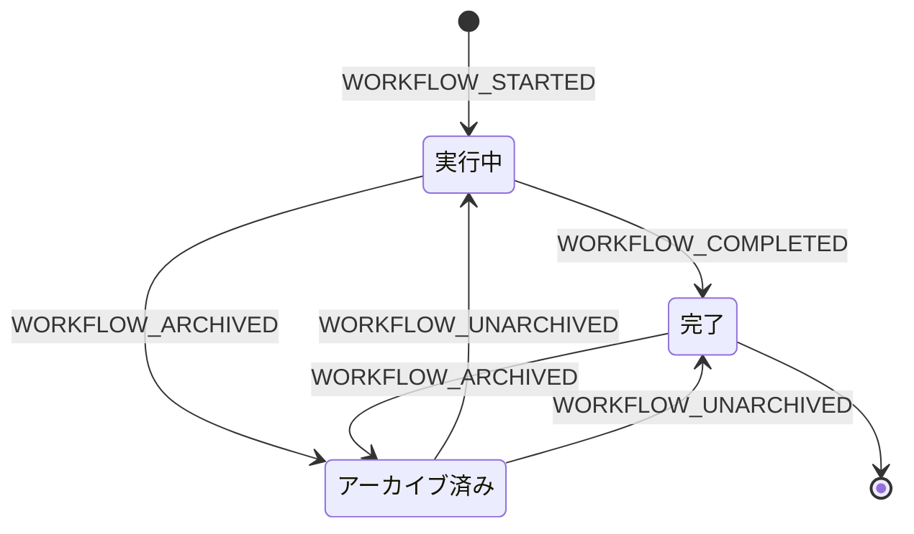
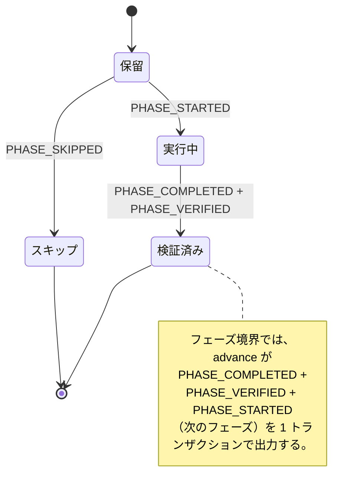
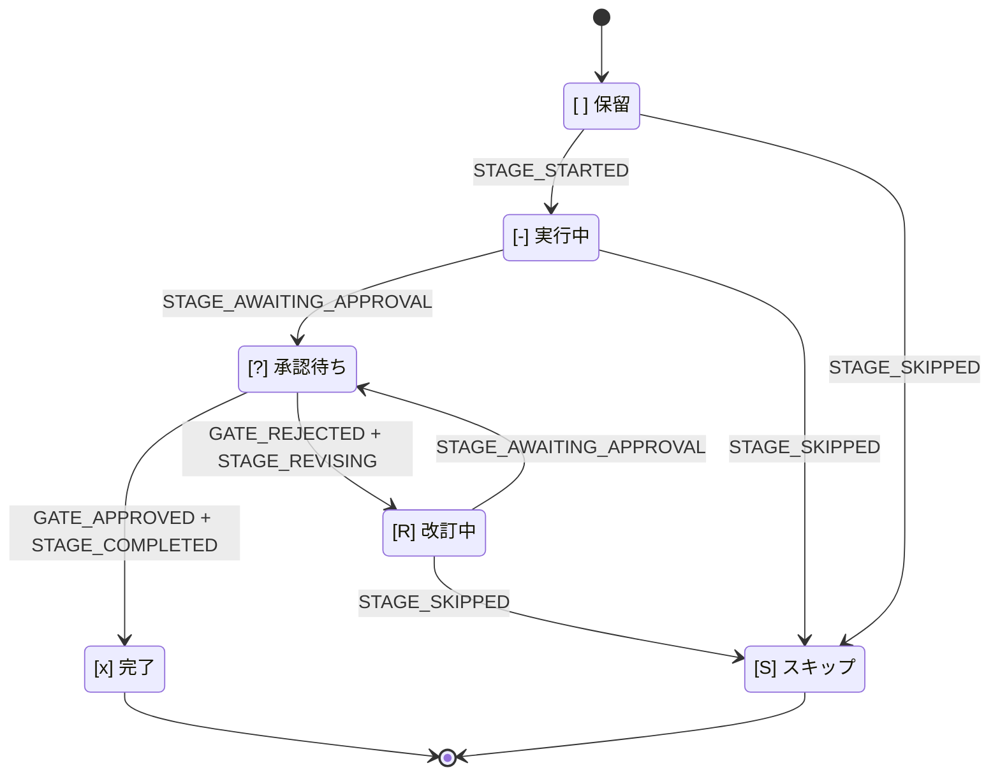

# 状態機械

本章は、AI-DLC の状態機械、監査イベント分類、それらを結ぶ規則
――**各状態遷移にはツールが所有するエミッターがある**――の正規リファレンスです。遷移はそれを所有する変更経路が記録し、コンダクターが重複して記録することはありません。本章の表とコードの同期は、乖離テスト
`tests/integration/t48-audit-event-emitters.test.ts` により強制されます。文書と
コードが一致しなければ、t48 は失敗します。

AI-DLC は、入れ子になった **ワークフロー**、**フェーズ**、**ステージ** の 3 つの状態機械で
動作します。4 つ目の独立したストリームは、Claude Code フックが出力する
**セッション**イベントを記録します。これら 4 ストリームはインテントの監査証跡
（レコードディレクトリの `audit/` シャードディレクトリ。
`<record>/` = `aidlc/spaces/<active-space>/intents/<YYMMDD>-<label>/`）を共有しますが、
別々のコードパスが所有します。別の関心事として読み、タイムラインが交差することを
覚えておくのが最も理解しやすい方法です。

> **基本の不変条件：** 決定的な記録処理は TypeScript、判断は LLM が担当します。
> すべての監査出力はツールまたはフックから始まるため、LLM の文章が出力経路に入りません。
> MD ファイルに `aidlc-audit.ts append <EVENT>` を文章上の指示として見つけた場合は、
> それはバグです。
>
> **承認証跡の結び付け：** 照会は書き込まず、ガードは証拠を削除しません。承認の効力は内容と試行に結び付き、発行時の識別子やイベント順には依存しません。両方の規則と対象は[「承認証跡の不変条件」節](#承認証跡の不変条件)で説明します。
>
> **監査先行の原子性：** ツールは状態を変更する*前に*監査エントリを出力します。
> 監査出力に失敗すれば、ツールは状態に触れる前に例外を送出します。そのため
> `audit.md` と状態ファイルが不一致になることはありません。失敗モードと、
> 2 つの例外――意図監査（`WORKTREE_*`、`AUDIT_*`、`MERGE_DISPATCH_INVOKED`）と、
> 成果物が派生的で再構築可能な、監査**最後**（audit-last）の DocumentKB カタログ
> イベント――については、本章末尾近くの
> [「監査先行の原子性」節](#監査先行の原子性) を参照してください。

---

## 状態機械が 3 つある理由

ワークフローはフェーズを通過して完了し、フェーズは対象範囲に含まれるステージを
通過して完了し、ステージは承認ゲートが閉じると完了します。各層は異なる判断を
所有します。

- **ワークフロー** — ジョブ全体は実行中か、完了したか。
- **フェーズ** — このライフサイクルフェーズは進行中か、検証済みか、対象範囲外のため
  スキップされたか。
- **ステージ** — ステージを作業中か、ユーザーを待っているか、却下後に改訂中か、完了したか。

これらを 1 つの状態フィールドに平坦化すると、その判断が混同されます。分けておけば、
`/aidlc --status` は一度の読み取りで「このワークフローを阻害しているものは何か」に
答えられます。ワークフロー `Running`、フェーズ `Active`、ステージ `[?]` は
「\<stage\> の承認待ち」を意味します。

---

## ワークフロー状態機械


```mermaid
stateDiagram-v2
    [*] --> 実行中 : WORKFLOW_STARTED
    実行中 --> 完了 : WORKFLOW_COMPLETED
    実行中 --> アーカイブ済み : WORKFLOW_ARCHIVED
    アーカイブ済み --> 実行中 : WORKFLOW_UNARCHIVED
    完了 --> アーカイブ済み : WORKFLOW_ARCHIVED
    アーカイブ済み --> 完了 : WORKFLOW_UNARCHIVED
    完了 --> [*]
```

<!-- テキスト代替: 初期状態は WORKFLOW_STARTED で実行中に遷移し、実行中は WORKFLOW_COMPLETED で完了に遷移する。実行中または完了は WORKFLOW_ARCHIVED でアーカイブ済みに遷移する。アーカイブ済みは WORKFLOW_UNARCHIVED で元の状態（実行中または完了）に戻る。それ以外では完了は終端状態。 -->

**状態値：** `Running`、`Completed`、`Archived`。

ワークフローは最初のインテントが生成されたとき（最初の `/aidlc` で自動実行されるか、
`/aidlc-init` による `aidlc-utility intent-create`）に始まり、対象範囲に含まれる最後の
ステージの承認ゲートが閉じると終わります。`Paused` や `Waiting for Approval` 状態は
ありません。承認はステージレベルの関心事であり、停止に UX はありません。

ワークフローの `Running` 状態は Claude Code セッションをまたいで維持されます。月曜日に
開始してセッションを終了し、火曜日に再開しても、ワークフローは `Running` のままです。
終了して新たに始まったのは *セッション* です。

| 遷移 | トリガー | エミッター |
|---|---|---|
| `[*] -> Running` | `aidlc-utility intent-create` | `tools/aidlc-utility.ts` |
| `Running -> Completed` | 最終ステージの結果を `aidlc-orchestrate.ts report` で報告 | `tools/aidlc-state.ts`（内部エミッター） |
| `Running -> Archived`、`Completed -> Archived` | `aidlc-utility intent archive <name>`（人間の判断。拒否されるのは claim 済みのチーム Unit がある場合だけ） | `tools/aidlc-utility.ts` |
| `Archived -> Running`、`Archived -> Completed` | `aidlc-utility intent unarchive <name>`（`Archived From` に記録された状態へ戻る） | `tools/aidlc-utility.ts` |

---

## フェーズ状態機械


```mermaid
stateDiagram-v2
    [*] --> 保留
    保留 --> 実行中 : PHASE_STARTED
    保留 --> スキップ : PHASE_SKIPPED
    実行中 --> 検証済み : PHASE_COMPLETED + PHASE_VERIFIED
    検証済み --> [*]
    スキップ --> [*]
    note right of 検証済み
        フェーズ境界では、advance が
        PHASE_COMPLETED +
        PHASE_VERIFIED + PHASE_STARTED
        （次のフェーズ）を 1 トランザクションで出力する。
    end note
```

<!-- テキスト代替: 初期状態は保留に遷移する。保留は PHASE_STARTED で実行中、PHASE_SKIPPED でスキップに遷移する。実行中は PHASE_COMPLETED + PHASE_VERIFIED で検証済みに遷移する。フェーズ境界では advance が PHASE_COMPLETED + PHASE_VERIFIED + PHASE_STARTED（次フェーズ）を原子的に出力し、検証済みから次フェーズの保留から実行中への遷移へ接続する。 -->

**状態値：** `Pending`、`Active`、`Verified`、`Skipped`。

フェーズ状態は `aidlc-state.md` の `## Phase Progress` 節で追跡します。インテント生成時に
この節を初期設定します。`Initialization` は `Verified` になり（生成処理は引き継ぎ前に
すべての初期化ステージを完了させるため）、初期化直後の最初のステージが属するフェーズは
`Active` に、それ以降の各フェーズは、対象範囲が EXECUTE ステージを残さない場合は
`Skipped`（フェーズごとに `PHASE_SKIPPED` 監査行を 1 件出力）、それ以外は `Pending` に
なります。フェーズの完了時には境界で `PHASE_COMPLETED` と `PHASE_VERIFIED` の両方を
出力し、次のフェーズの `PHASE_STARTED` を出力します。行の書き換えは同じ状態書き込みの
中で行われます。この節は表示専用です。ルーティングは `Lifecycle Phase` と
Stage Progress のチェックボックスを読み、`/aidlc --status` はフェーズブロックを
その場で再計算します。

| 遷移 | トリガー | エミッター |
|---|---|---|
| 初期設定（`Verified`/`Active`/`Pending`/`Skipped`） | `aidlc-utility intent-create` | `tools/aidlc-utility.ts` |
| `Active -> Verified` | フェーズ境界で `aidlc-orchestrate.ts` を通じて報告されたステージの完了/スキップ。前方への `aidlc-jump execute` | `tools/aidlc-state.ts`（内部エミッター）、`tools/aidlc-jump.ts` |
| `Pending -> Active`（境界） | 報告された結果の後にエンジンがルーティング、または `aidlc-jump execute` | `tools/aidlc-state.ts`（内部エミッター）、`tools/aidlc-jump.ts` |
| `Pending -> Skipped`（飛び越え） | フェーズ全体を飛び越える前方への `aidlc-jump execute` | `tools/aidlc-jump.ts` |
| `Verified/Active -> Pending` リセット | 後方への `aidlc-jump execute`（EXECUTE ステージを持つフェーズをリセット） | `tools/aidlc-jump.ts` |
| `Pending <-> Skipped` 再導出 | `aidlc-utility scope-change` / `recompose`（未到達の行のみ） | `tools/aidlc-utility.ts` |

初期化後への引き継ぎ時には、最終初期化ステージの後で
`aidlc-utility intent-create` 自体が
`PHASE_COMPLETED + PHASE_VERIFIED + PHASE_STARTED + STAGE_STARTED` を出力します。
これにより、生成から最初の `advance` まで監査証跡が途切れず、遷移を記録できます。

---

## ステージ状態機械


```mermaid
stateDiagram-v2
    state "[ ] 保留" as 保留
    state "[-] 実行中" as 実行中
    state "[?] 承認待ち" as 承認待ち
    state "[R] 改訂中" as 改訂中
    state "[x] 完了" as 完了
    state "[S] スキップ" as スキップ

    [*] --> 保留
    保留 --> 実行中 : STAGE_STARTED
    実行中 --> 承認待ち : STAGE_AWAITING_APPROVAL
    承認待ち --> 完了 : GATE_APPROVED + STAGE_COMPLETED
    承認待ち --> 改訂中 : GATE_REJECTED + STAGE_REVISING
    改訂中 --> 承認待ち : STAGE_AWAITING_APPROVAL
    保留 --> スキップ : STAGE_SKIPPED
    実行中 --> スキップ : STAGE_SKIPPED
    改訂中 --> スキップ : STAGE_SKIPPED
    完了 --> [*]
    スキップ --> [*]
```

<!-- テキスト代替: [ ] 保留は STAGE_STARTED で [-] 実行中に遷移する。[-] 実行中は STAGE_AWAITING_APPROVAL で [?] 承認待ちに遷移する。[?] 承認待ちは GATE_APPROVED + STAGE_COMPLETED で [x] 完了、GATE_REJECTED + STAGE_REVISING で [R] 改訂中に遷移する。[R] 改訂中は STAGE_AWAITING_APPROVAL（再入場）で [?] 承認待ちに戻る。保留 / 実行中 / 改訂中はいずれも STAGE_SKIPPED により [S] スキップに遷移できる。 -->

**チェックボックスの凡例（`aidlc-state.md` 内）：**

| チェックボックス | 状態 | 意味 |
|---|---|---|
| `[ ]` | `Pending` | 未開始 |
| `[-]` | `Active` | 進行中 |
| `[?]` | `AwaitingApproval` | ステージ作業は完了、ゲートは開いたまま — ユーザーが阻害要因 |
| `[R]` | `Revising` | ユーザーがゲートを却下 — 再入場前にステージを改訂中 |
| `[x]` | `Completed` | 承認済みで完了 |
| `[S]` | `Skipped` | 対象範囲外、ジャンプによるスキップ、または途中で打ち切り |

`[?]` と `[R]` は、そうでなければどちらも `[-]` に見える 2 つの状況を区別します。
再開時、`[R]` はステージを最初から再実行するのでなく、ゲートへ再入場する前に以前の
アーティファクトとフィードバックを提示するようコンダクターに指示します。

`[?]` では、`orchestrate next` はまず `present-approval-gate` ガードの事前検査を実行します。拒否された場合はそれが優先します。そうでなければ、ステージ本体やレビュアーをもう一度実行するのではなく、現在のゲートを `gate_only: true` と `gate: true` を持つ `run-stage` として再提示します。ディレクティブは、`reviewer`、`review_artifact`、`review_class` があればそれらを保持します。`reviewer` と `review_artifact` は、Review 要約がどの既存レビューを読むかを示します。記録済みのレビューファイルと評決から要約を提示し、レビュアーをディスパッチしたり新しいレビューを要求したりはしません。後の Review Override は、`none` を含め、その要約を消しません。ゲートへの再入場では、現在の試行で対になったレビュー完了と、そのレビュー時点で有効だった設定を使います。以前の試行のレビューが、レビューのないゲートに要約を作ることはありません。このメタデータは承認を与えず、編集された内容をレビュー済みにもしません。レビュアーの反復設定と `reviewer` / `ensemble` のプロトコルモジュールは含まれず、Construction の方針がある場合は `completion_only` と記されます。
`gate_only` は汎用の完了のみの記帳より優先し、人間の承認を与えるものではありません。チーム所有のゲートは `unit` と `unit_gate` を保持し、自律スウォームの決着は `swarm_settled` とその完了方針を保持します。同じゲートのみの形は、ルール配信の `continue` 呼び出しでも維持されます。`next` を繰り返してもステージは変わらず、通常のディレクティブ再発行の規則に従います。

ユニット単位ステージのグリッドがカバーされ、そのステージが適用されるすべての Unit が現在の試行で `UNIT_COMPLETED` 受領記録を持つ場合、最後の Unit でのゲートの拍は `build_settled: true` を持ちます。そこでは計画もビルドも行わないため、Code Generation はそれを Plan Approval に通さず、それらの Unit のビルド元になった計画について再び尋ねることもありません。このフラグはルール配信の `continue` 呼び出しにも引き継がれます。それらの受領記録がないままカバーされたグリッド（成果物だけに対する Build-and-Test のループバック）には付けません。その拍ではまだ修正を適用できるからです。

unit-major で Unit チェックポイントが無効（フィールドが無効または存在しない）の場合、グリッド全体がカバーされた時点でまだ必要なユニット単位ステージの承認は、1 つの質問にまとめられます。最初にカバーされたゲートは `approve_together` を持ちます。これは `directive.stage` 以降の保留中のブロックステージ（グラフ順）、Unit、および両方を示すエンジンの質問です。設定されるのは、ソロ作業で、最初の保留中のブロックステージにあり、残りのステージが 2 つ以上ある場合だけです。チェックポイントが有効な場合、stage-major、チーム所有、自律のゲートはそれぞれ独自の流れを保ちます。そのゲートを開くと、一覧が `STAGE_AWAITING_APPROVAL` に `Approves Together` として記録され、返答の `next_stage` は一覧の最後のステージの次のステージになります。続いて `report --result approved` は、一覧の各ステージを順に承認します。最初の `GATE_APPROVED` は `Approves Together` を持ち、後続の各行は `Approved Together With: <first stage>` と同じ `User Input` および利用者の言葉を持ちます。各ステージは引き続き自身の成果物・要約・レビュアー・センサーの検査を通過します。最初に拒否したステージで実行は止まり、それより前のステージは承認済みになります。そのステージの後の承認は、それを一覧に含めた承認以降に返答・却下・回答が記録されていない間は、新しい人間のターンを必要としません。却下は何も承認しません。その質問の時点で利用者が一覧の 1 ステージについて求めた変更は `next --stage <stage> --unit <unit> --change`（または `--every-unit`）です。出力は `aidlc-jump.ts reopen ... --via change` を示し、その Unit スコープの `GATE_REJECTED` は `Reopen: change`、`User Input: Request Changes`、および質問以降の利用者の言葉を `Feedback` として持ちます。ゲートが開いている間、`next` は再オープンした Unit の手順を先にルーティングし、その後で同じ 1 つの質問を、learnings モジュールなしで再び示します。改訂中のステージが learnings モジュールを再び列挙することはなく、そのステージでの `report --result awaiting-approval` は `report --result revised` を示します。

| 遷移 | トリガー | エミッター |
|---|---|---|
| `Pending → Active` | 直前の報告された結果の後にエンジンがルーティング | `tools/aidlc-state.ts`（内部エミッター） |
| `Active → AwaitingApproval` | `aidlc-orchestrate.ts report --stage <slug> --result awaiting-approval`。レビュアーを持つステージは、ゲートを開く前に新鮮な終端受領記録を要求する | `tools/aidlc-state.ts`（内部エミッター） |
| `AwaitingApproval → Completed` | `aidlc-orchestrate.ts report --stage <slug> --result approved --user-input "Approve"` | `tools/aidlc-state.ts`（内部エミッター） |
| `AwaitingApproval → Revising` | `aidlc-orchestrate.ts report --stage <slug> --result rejected --user-input <text>` | `tools/aidlc-state.ts`（内部エミッター） |
| `Active → Revising` | ゲートオープンの復旧が必要な場合の同じ rejected レポート | `tools/aidlc-state.ts`（内部エミッター） |
| `Revising → AwaitingApproval` | `aidlc-orchestrate.ts report --stage <slug> --result revised`。レビュアーを持つステージは、ゲートへ再入する前に却下後の新鮮な終端受領記録を要求する | `tools/aidlc-state.ts`（内部エミッター） |
| `{Active,Revising} → Skipped` | `aidlc-orchestrate.ts report --stage <slug> --result skipped --reason <text>` | `tools/aidlc-state.ts`（内部のルーティング付きスキップエミッター） |
| `AwaitingApproval -> Skipped`（計画行が SKIP） | 同じ skipped レポート。ステージの計画行が現在 SKIP の場合だけ（リバースエンジニアリングがゲートで待っている間に、利用者が新規プロジェクトだと述べた場合）。ゲートは承認ではなくスキップとして閉じる | `tools/aidlc-state.ts`（内部のルーティング付きスキップエミッター） |
| `Pending → Skipped` | スコープ構成または `aidlc-jump execute` | `tools/aidlc-utility.ts`、`tools/aidlc-jump.ts` |
| `{Pending,Active,Revising} -> Skipped`（unit-major のウォーク） | `aidlc-orchestrate.ts report --stage <directive.stage> --unit <directive.unit> --result skipped --reason <text>`、または進行中のユニットを先へ進める前方ジャンプ（`aidlc-jump.ts execute --units <unit> --stages <steps>`）。そのステージを負うユニットがなくなった時点（各ユニットがスキップ済みか種別上空集合） | `tools/aidlc-state.ts`（内部の `skip --unit` エミッター。ユニットごとに `UNIT_SKIPPED` を 1 件） |

`approved` レポートは、ゲート後の遷移全体を所有します。`GATE_APPROVED + STAGE_COMPLETED`
を出力した後、次の対象内ステージへルーティングし、`STAGE_STARTED` と境界での
`PHASE_*` イベントを出力します。最後の対象内ステージでは
`PHASE_COMPLETED + PHASE_VERIFIED + WORKFLOW_COMPLETED` を出力してステータスを
`Completed` にします。コンダクターは報告の前後で状態ライフサイクルの動詞を呼びません。

**ルーティング付きスキップ。** `report --result skipped` は、明示的で空白でない
`--stage` と `--reason` を伴うメインワークフローでのみ、指名されたステージが
`execution: CONDITIONAL` と宣言され、`Current Stage` と一致し、Active または
Revising である場合、あるいは計画行が現在 SKIP である AwaitingApproval（利用者自身の判断で意味を失ったゲート）である場合に受け付けられます。正当な理由のあるスキップは完了証拠を
負わないため、アーティファクト、ユニット単位、アンサンブル証拠の各ガードの前に
実行されます。エンジンはそのルーティングマーカー付きで内部スキップ遷移を呼び出し
ます。トランザクションは `[S]` を保持し、ちょうど 1 件の `STAGE_SKIPPED` を出力し、
決して `STAGE_COMPLETED` を出力せず、次のステージを開始する（境界イベントを含む）
か、ワークフローを完了します。先へのルーティングが失敗した場合、復旧はスキップ
マーカーとカーソルを同じステージに残すため、スキップイベントを重複させずにルートを
再試行できます。`report --single --result skipped` は拒否されます。

`Construction Iteration: unit-major`（ソロの Unit 所有）では、ウォークが `(stage, unit)` の拍を 1 つずつ指示する間、`Current Stage` は最初のユニット単位ブロックステージに留まり、ステージの条件はそのユニットについて判断されます。ウォークが拍の上にある間、スキップは同じ CONDITIONAL と理由の規則の下で、その拍のステージとユニットを指名しなければならず（`--unit` が必須）、そのユニットだけを対象にします。内部の `skip --unit` 遷移は、ユニットの `Run floor` に `UNIT_SKIPPED` 受領記録を 1 件出力します。そのため、そのユニットはこの試行でそのステージに対して何も負わず（出力、レビュー、要約、その Construction チェックポイントのいずれも、種別上空集合のユニットと同様）、ウォークは先へ進み、他のすべてのユニットは引き続きそのステージを受けます。ユニットが作業を終えた後は、ユニット単位の手順の中での前方ジャンプも、進行中のユニットだけを同じように先へ進めます。`aidlc-jump.ts execute --units` は、ウォークがターゲットより前でそのユニットを止めるはずの各手順について、この遷移を実行します。ステージ承認の後ろで再オープンされた手順も対象で、そのチェックボックスと Current Stage はそのままです。あるユニットがステージを実施し、他のユニットがスキップした場合、ステージは通常のゲートを通じて完了します。ゲートは作業を行った最後のユニットで提示され、スキップした各ユニットとその理由が 1 行ずつ示されます。そのステージを負うユニットが 1 つもなくなったときにだけ `[S]` になります。後続のブロックステージならその場で条件付きの `STAGE_SKIPPED` を 1 件出力し、Current Stage なら上記のルーティング付きスキップを通じます。Construction チェックポイントがある場合、Unit チェックポイントはそのようなステージを `Stages` に保持するため、最後のスキップより前に与えられた承認も引き続き一致します。ただし、その `GATE_APPROVED` / `GATE_REJECTED` 行は `Gate Stages` からそのステージを除くため、チェックポイントでの Request Changes が、すべてのユニットで `[S]` のステージを再オープンすることはありません。そのステージのファイルをすでに書いたユニットはスキップできません。unit-major では、いずれかのユニットがそのステージのファイルを持った時点で、拍の外での Current Stage のスキップは拒否されます。ただし計画がもうそのステージを実行しない場合（利用者がスコープを変更した場合）は例外で、そのスキップは通り、ユニットのファイルはそのまま残ります。それ以外のスキップは、拒否の中でスキップできる手順（とユニット）を示し、従ってもどのユニットの書き込み済みの作業も失われない場合にだけスキップのコマンドを提示します。そうでなければ、ワークフローのエントリーコマンドで続けるよう伝えます。

**アーティファクトガード（課題 #366）。** ステージを `[x]` にするすべてのレポート
結果は、完了前に決定的なアーティファクト検査を行うため、ディスク上の作業証跡
なしにステージを完了にすることはできません。`produces[]` を宣言するステージでは、
それらのアーティファクトの少なくとも 1 つが、アクティブなインテントのレコード
ディレクトリまたはそのユニット単位の構築ディレクトリの下に存在する必要があります。
codekb ステージはより厳格です。登録されたすべてのリポジトリディレクトリが、宣言された
`produces[]` の完全な集合を含まなければなりません。単一リポジトリまたは未記録の
インテントでは、解決された 1 つの codekb ディレクトリを使います。
`workspace_requires: true` はさらに、`aidlc/` とハーネスディレクトリの外にある
ソース作業の証跡を必要とします。検査に失敗した場合は何も書き込みません。
オプションの出力は関与しません。`produces_kinds` については、種別により必須セット
がゼロに絞り込まれるユニットはアーティファクトを負いません。該当するユニットは
同じく厳格です。`AIDLC_SKIP_ARTIFACT_GUARD=1` でバイパスできます。同じスイッチは
レビューロガーの必須出力存在検査もバイパスします。これがない場合、ユニット単位
ステージのステージレベルレビューは、権威あるすべてのユニットの該当する必須出力を
要求します。
作成された Unit DAG が存在せず、現在の試行にマージ済みの Bolt 行がある場合、
ステージレベルのレビューフィンガープリントは代わりに、それらマージ済みの Unit を
ちょうど列挙します。Bolt のマージは主張ではなく証明されます。`aidlc-bolt complete
--merge` は状態マージと監査マージが走る前に `BOLT_COMPLETED` を出力するため、
slug を伴う（ワークツリーの）試行がマージ済みと数えられるのは、対応する後続の
`AUDIT_MERGED` 受領記録が、マージ手順がメインへ着地したことを確認した後だけです。
名前だけでワークツリーを伴わない Bolt の `BOLT_COMPLETED` は、そのまま終端です。
マージ証跡をまだ待っている完了は未クローズの経路に留まり、slug の無い完了が
slug を伴う試行を閉じることはできず、後続のフラグメントクリーンアップによる
`BOLT_FAILED` が確認済みのマージを消すこともできません。`AUDIT_MERGED` 自体に
レビュアーの権威はありません。別の監査シャードにある同一秒の行が、レビュー
リクエスト・評決・受領記録を曖昧にすることは決してありません。未クローズの Bolt は、
そのユニット成果物がなおメインツリーの外にあるため、通常のステージレベル
フォールバック経路に留まります。その Bolt をマージするとフィンガープリントの
定義域が変わり、その正確な保留序数が `--retry-pending` で再束縛されるまで、
以前のステージレベル受領記録は意図的に無効化されます。ユニット単位の受領記録の
絞り込みは、引き続き未クローズとマージ済みの双方の Unit を認識します。古い試行が
マージされ、新しい試行が未クローズのままのとき、1 つの Unit が両方の集合に属する
ことがあります。ゲートの要求とステージレベルのフィンガープリントを駆動するのは
マージ済みの所属で、受領記録の絞り込みを駆動するのは両者の和集合です。

**レビュアーゲートガード（課題 #551）。** レビュアーを持つステージは、設定された
レビュアーが新鮮な終端 `REVIEW_COMPLETED` 受領記録を持つまで、`gate-start` や
`revise` を通じて `AwaitingApproval` へ入れません。同じ受領記録は完了系の 4 経路
すべてで引き続き必須ですが、例外が 1 つあります。利用者自身の承認（質問以降の返答とともに報告されたもの）は、現在の試行で要求されてまだ評決のないレビューを越えて通り、その `GATE_APPROVED` は `Review: not finished` を持ちます。その承認のためにレポートが補完するゲート（`gate-start --recovered --person-approves`）も、そのような返答の後でだけ同じように開きます。一度も要求されていないレビュー、進行中の復旧レビュー、検証できなかった結果、評決後に内容が変わったレビュー、メモリーで Guard Policy を strict に固定しているプロジェクトでは、レビューは引き続き必須です。すでに開いているゲートを再報告した場合は、重複した遷移を
書かずにこれらのガードを再実行します。`Active` から直接報告された却下は、
`STAGE_AWAITING_APPROVAL` の行を捏造せずに `Revising` へ移ります。別のガードを
意図的に切り離す合成的な遷移テストでは
`AIDLC_SKIP_REVIEWER_GATE_GUARD=1` を設定できます。このバイパスはゲートを開く
場面にのみ適用され、`approve`、`advance`、`finalize`、`complete-workflow` には
決して適用されません。隣接するサマリー確認のテスト用バイパスは
`AIDLC_SKIP_SUMMARY_CONFIRMATION_GUARD=1` です。

**要約の入力とレビュー済みの出力。** ステージが `summary_confirmation`（`required` または `if-present`）を宣言している場合、`-questions` で終わる宣言済みの成果物名は、書き込み可能な人間の入力です。ファイルのレビューマニフェストのエントリは `summary-input:sha256:<digest>` で、`summaryInputReviewFingerprint` が計算します。改行コードを正規化した後、空、`Looks correct`、`Request changes` のいずれかである正準の要約確認 `[Answer]:` の値だけをマスクします。末尾の HTML コメントは保持されます。回答のマスクには、要約確認と Plan Approval のタグ選択と共有する、パーサーに基づく `visibleMarkdownLines` 投影を使います。コード例、コメント、生の HTML ブロックの中にある回答らしいテキストがマスクされることはなく、生の HTML の内容が制御タグを提供することもありません。
確認セクションと、それに一致する回答行はちょうど 1 つずつでなければなりません。一致が存在しないか曖昧な場合は、正規化された内容全体が束縛されたままになります。他のすべての質問の回答、要約の文章、コメント、セクションは束縛されたままです。`missing` と `not-file` は別個のマニフェストエントリのままです。必須ファイルの存在と安全な取得の検査は引き続き適用され、スナップショットはスウォームの記録マージのために実際の質問のバイト列を保持します。

レビュー凍結フックは、人間の Q&A プロトコルが進められるよう、これらの質問への書き込みを許可します。レビューのフィンガープリントを保つのは確認の記帳だけで、実質的な変更はレビューの内容の束縛を無効にします。他の生成された成果物は、レビュー済みのバイト列に束縛されたまま、終端受領記録による凍結で保護されます。質問の成果物を指す明示的な `review_artifact` は例外で、その成果物は確認の回答も含めて完全にバイト単位で束縛され、凍結されます。

同じ試行で同一の内容を再確認しても、要約の承認は保たれ、すでに承認された出力を書き直す必要はありません。
ゲートの却下だけでも、その承認と出力の由来は保たれます。レビューの受領記録は引き続き独自の却下境界に従います。要約のチェックポイントでの `Request changes` の回答は、有効な要約の承認を取り消します。
確認済みの内容が変わった場合は、引き続き通常の復旧手順が必要です。人間の確認を得て、その承認の下で出力を再生成または再保存し、必要な新しいレビューを得ます。凍結された出力を再オープンするには、提示されたライフサイクルの対処を使います。質問ファイルを編集しても、それらの出力の編集が認可されたり計画が承認されたりはしません。既存の Change Control の規則は、対象となるドリフトを引き続き別に管理します。

終端レビューの記録は、レビューの要求と同様に、現在の要約確認と出力の受け入れを再検査します。人間が確認を取り消した後や、出力に必要な承認がない間は、フィンガープリントが一致するだけではレビューを証明できません。`if-present` では、要約確認の判断または確認が現在の試行に関与した後は、質問ファイルを削除してもその義務は消えず、欠落ファイルの検査が拒否します。

`Bun.markdown` の CommonMark/GFM パーサーが変えるのは可視性であり、生の内容のダイジェストのアルゴリズムやレビュー受領記録の形式ではありません。影響を受けない文書の識別子は変わりません。古いレビュー受領記録は、再計算が一致する限り引き続き使えます。フィンガープリントが異なる場合にだけ既存の再保存／再レビューの復旧が必要で、パーサーの意味論の変化が原因となることがあります。保存済みの証拠は書き換えられず、この移行が承認や追加のレビュー枠を与えることはありません。

**アンサンブル証拠ゲート。** `mob` またはサポート付き `subagent` ステージでは、
宣言されたサポートエージェントの貢献ファイル
（`<stage>/contributions/<agent-slug>.md`）が欠落しているか、先頭行の
`**Collaborator:**` アイデンティティマーカーを欠いている間、レポート経路は
`awaiting-approval`、`revised`、`approved` を拒否します — これはアンサンブルが
実際に招集されたことの決定的な証明です。決着済みの自律スウォームは免除されます
（そのユニット単位の収束台帳が証拠です）。`report --single` はステージレベルの
証拠のみを検査します。`mode: pipeline` では、同じレポート結果と、完了させるすべての
直接遷移が、主導／支援の各リンクについて順序付きで現在の試行に属する
`PIPELINE_LINK_COMPLETED` 受領記録を要求します。複数リポジトリのリバース
エンジニアリングでは、スキャンした各リポジトリについて完全なチェーンが必要です。
現在の試行に属し `Decision=keep` を持つリポジトリスコープの `ARTIFACT_REUSED` 行は
再利用されたリポジトリを免除します。
分離実行の行は `Workflow: single-stage:<slug>` を運び、グラフが宣言する
リバースエンジニアリング成果物一式がすべて有効で、かつストアが `CURRENT` のままで
ある間だけ受け付けられます。
一方、`modify` / `redo` の行は免除しません。却下、ジャンプ、後続ステージの開始はメインワークフローの証跡をリセットし、分離された `--single` のリンク行がこれを満たすことはありません。
`AIDLC_DISABLE_ENSEMBLE_EVIDENCE=1` でバイパスできますが、貢献ファイルや進行中の
リンク受領記録が失われた、正当に実行済みのステージの復旧のみを意図しています。

**ソース鮮度とユニット単位の帰属（#629/#646/#662）。** `workspace_requires` の
ステージでは、各終端のレビューが引き続きワークスペース全体の `Source Fingerprint`
を持ちます。最も新しい現行方式の束縛は、通常、完了系の 4 経路すべてにおける
レビュー後変更の外側の境界です。ユニット単位の受領記録は `Unit Source Fingerprint`
を追加します。これは、そのユニットの厳格な `source-manifest.json` の生バイト列と、
すべての exact / directory 主張の現在の内容を束縛します。受領記録は新しい順に
評価されるため、意図的に共有されたパスについては、より新しい検証済みの主張者が
より古い受領記録を保護することがあります。exact / directory 主張の中の未カバーの
編集、削除、新規パスは、所有ユニットだけを無効化し、そのユニットの 1 回だけの
有界な `stale-receipt` 復旧へ入ります。Construction チェックポイントも同じ受領記録を読みます。Unit のレビュー以降に動いた主張済みのパスがすべて、その試行のより新しいレビューが自身の主張するパスについて記録したバイト列とちょうど一致する場合（`unitSourceAttributed`）、チェックポイントはその Unit のレビュー済みソースを束縛します。そのため、別の Unit 自身のレビュー済みビルドがあっても承認済みのチェックポイントは承認済みのままで、それ以外の変更があれば改めて尋ねます。どのレビューも記録していないそのような変更は、どの Guard Policy でもその Unit を `unitSourceMoved` にします。チェックポイントが有効な場合、ロガーはその Unit にそのための 1 回の `stale-receipt` 復旧を与え、`strict` ではチェックポイントがその要求を `rereview` として持つため、利用者に一度尋ねる前にコードが再検査されます（レビュー後に編集された文書も同じように再検査されます）。`relaxed` と `off` では、チェックポイントは受領記録の走査と同様に `guardPolicyAcceptsChanges` を通じてこれを読み、動いたパスや編集されたレビュー済み文書は受け入れられた変更になります。チェックポイントはその Unit のレビュー済みのソースと文書を束縛し、承認または準備完了の状態を保ち、何が変わったかを 1 件の `CHANGE_ACCEPTED` 行に示します。これを書くのは、変更を記録する最初の後続手順です。そのステージのレビュー要求または完了、あるいはその Unit のチェックポイントの `verify` で、`verify` はその行を `change_notices` として返します。Unit に束縛された受領記録では、走査はその Unit 自身のパスだけを示し、ワークスペース全体の `Reviewed source` 行は省きます。ワークスペース全体は別の Unit 自身のビルドでも動くからです。再検査の後に利用者がチェックポイントを承認すると、新しい再検査の機会が開きます（`unitRecheckReopened`。その Unit の進捗は復旧を再び未使用と報告します）。そのため、後の編集はすべて再検査され、一度だけ尋ねられます。
レビューが無効な場合も同じです。Unit の `GATE_APPROVED` 行は `Approved Evidence`（各ステージの成果物とソースのフィンガープリント、および最大 50 件の主張済みパスとそのエントリ）を記録し、`relaxed` と `off` では、どのレビューも再検査しないステージはそれらの値をチェックポイントのフィンガープリントに保つため、承認は有効なままです。その 1 件の `CHANGE_ACCEPTED` 行（Checkpoint `construction-unit`）は、次のチェックポイントの `verify` または Construction ステージ自身の検査が書き、保持されている一覧が承認済みのソースフィンガープリントをなお再現する場合は、変更されたパスを示します。承認の質問の `DECISION_RECORDED` 行は同じ値を `Asked Evidence` として記録するため、質問の後から利用者が答えるまでの間に行われた変更があっても、利用者に示した内容は保たれます。`relaxed` と `off` では、利用者の `approve` がそれを記録し、1 件の `CHANGE_ACCEPTED` 行を書き、`change_notices` でその旨を伝えます。`strict` の場合、または `Approved Evidence` が存在する前に記録された承認の場合は、その Unit について改めて尋ねます。Unit の承認後のスコープ変更も、どの Guard Policy でも承認を保ちます。新しい計画のステージ一覧、レビュー上限、ウォーキングスケルトンはチェックポイントの識別子を変えるため、その Unit の最新のチェックポイント行がその `GATE_APPROVED` で、その後に `SCOPE_CHANGED` 行が続き、その Unit についてジャンプや Unit の開始・一時停止・スキップ・却下が続かず、計画がその Unit に対してなお実行する各ステージが `Approved Evidence` に記録された成果物・ソース・実行フロアを保持している間、Unit は承認済みのままです。同じ規則は、変更前に尋ねたチェックポイントの質問のフィンガープリント（その `DECISION_RECORDED` 行の `Asked Evidence`）も、同じ種類のチェックポイントについて保ちます。その検証と開いている質問はなお一致するため、利用者の 1 回の回答で承認が記録されます。

`WORKFLOW_STARTED`、`STAGE_JUMPED`、および `workspace_requires` の
`STAGE_STARTED` は、内容アドレスのソース一覧ベースラインを記録します。該当する
すべてのユニットが新鮮な現行方式の証跡を持った後、完了はベースラインを現在の
一覧と比較します。Guard Policy が strict の場合は、新鮮な主張の和集合の外で変更されたアプリケーションソースのパスをすべて拒否します。relaxed または off の場合は、それらのパスを一度だけ `CHANGE_ACCEPTED`（チェックポイント `review-receipt`）として記録し、1 行で利用者に示します。ユニット主体の Construction は常にワークフロー／ジャンプの
境界を使います。ソース作業は、遅れて出力される `STAGE_STARTED` に先行し得る
からです。境界や最新の主張者を決めることになる同秒のシャード横断の行は、
シャードのファイル名順を信用せずフェイルクローズします。

却下はレビューと実行フロアの記録をリセットしますが、この完了ベースラインを
置き換えることは決してありません。さもなければ、却下時点に存在した未主張の
パスが次の試行へ既得権として引き継がれてしまいます。前回の試行が検証済みの
`SWARM_SOURCE_MERGED` チェーンを持つ場合、`GATE_REJECTED` はその最終の
`Prior Accepted Source Fingerprint` だけを持ちます。次の試行の最初のソース
マージはその集約から始めなければならず、完了は引き続き元のステージ入場時
ベースラインと比較します。

グローバル境界には、狭く限定された整合が 1 つだけあります。未主張のベースライン
変更（追加、変更、削除）が完全に元へ戻された場合、有効なベースラインスナップ
ショットが存在して妥当であり、該当するすべてのユニットがなお新鮮な現行方式の
ユニット束縛を持ち、ベースラインから現在までの差分に未主張のパスがゼロである
ときにのみ、完了は先へ進めます。これは、一時的な未主張の変更が消えたことを
証明します。通常のレビュー後の編集、古いまたは旧来のユニット束縛、証跡の欠落、
残存する未主張の差分は、いずれも通常のグローバル優先の拒否経路を取ります。

フィンガープリントと正準のパス別リストは、リポジトリのメタデータや Git 実行
ファイルの有無とは無関係に、有界なファイルシステム走査 1 回から得られます。
通常および ignore 済みのアプリケーションバイト、外部ソースへのシンボリック
リンクの対象、ワークスペース屋根のファイルは、そこにある AI-DLC 自身の `aidlc.settings.json` と `aidlc.settings.local.json` を除き、いずれも束縛されたままです。
フレームワークの状態、正確なセンサーキャッシュ、VCS メタデータ、依存／キャッシュの
ディレクトリやシンボリックリンク、未登録の `build/`、`coverage/`、`dist/`、
`logs/`、`target/`、`tmp/` のディレクトリやシンボリックリンク、および `.csproj`、`.fsproj`、`.vbproj` ファイルの隣にある未登録の `bin/`、`obj/`、`out/` のディレクトリやシンボリックリンク（.NET のビルド出力）は、ソース境界の
外に留まります。それ以外の場所ではこの 3 つの名前は束縛されたままです。Node や Rails の `bin/` スクリプトやヘキサゴナルの `adapter/out/` パッケージは本物のソースだからです。.NET の出力が境界の外に出る前に記録された証拠は、ソースまたはそれらの出力が変わるまで引き続き一致します。

条件付きの生成物出力ディレクトリの下にある本物のソースは、バイナリや拡張子なしの
ソースを含め、ルートの `.aidlc-source-paths.json` で宣言できます。

```json
{"version":1,"paths":["dist/worker.js","build/source"]}
```

登録されたパスはエンコーディングにかかわらず内容で束縛され、正準リストと自律
スウォームの Source Commit に含まれます。絶対パス、トラバースするパス、
フレームワーク、センサーキャッシュ、依存／キャッシュのパスは拒否されます。
登録済みリポジトリが欠落している場合は明示的なマーカーを寄与し、読み取り不能・
不安定・予算超過・不正な境界は `unbindable` のままで、Guard Policy が strict ならフェイルクローズします。relaxed または off では、現在束縛または読み取りできないソース、このマシンにない Unit のレビュー済みソースのスナップショットや書き込み済みレビュー、レビュー後にパスを主張した Unit マニフェストは、記録済みの評決を保ちます。レビューは有効とみなされ、利用者は 1 行の通知を受け、変更は一度だけ `CHANGE_ACCEPTED` として記録されます。

移行は意図的です。ベースラインを持たないアップグレード前のワークフローは
未主張の検査を飛ばし、フィールドを持たないユニット単位の受領記録は #629 の
グローバル方針を保ちます。存在するが `unbindable`、欠落、または破損した現行方式の
ベースライン／ユニットスナップショットは、strict ではフェイルクローズします。relaxed または off では、欠落または破損したステージ入場時ベースラインは 1 行の通知とともに未主張の検査を飛ばし、欠落したユニットスナップショットはそのユニットの評決を保ちます。
`AIDLC_SKIP_SOURCE_FRESHNESS=1` はグローバルとユニット単位の両方の検査を
バイパスします。マニフェストが欠落または不正な受領記録は明示的に
`Unit Source Binding Bypass: true` を記録するため、完了時にも同じスイッチが
再び必要です。現行方式の Bolt では、確定はさらに、決着済みスウォームのステージ
レベル免除が適用される前に、証明済みのベースからワークツリーへのフットプリントが
レビュー済みマニフェストの主張の部分集合であることを検証します。Guard Policy が relaxed または off の場合、レビュー後に変更された Unit のマニフェストと、Unit がマニフェストの外で変更したファイルはレビューを保ちます。確定はそれぞれを一度だけ `CHANGE_ACCEPTED` として記録し、その行を Unit の `change_notices` で返します。スウォームの prepare も同様に、単一エージェントのビルドと同じく、Plan Approval 後に動いた親のソースを保ちます（生成の開始がそれを記録し、伝えます）。

スウォームのフットプリント検証と不変の Source Commit 作成にも、同じ境界が
適用されます。clean フィルタによる生バイトの置換は、ファイルシステムに含まれる
正確な通常ファイルのパスに限定されるため、除外された生成物やフレームワークの
ファイルが整形後に再流入することはありません。Bolt ワークツリーでは、Source Commit はベースコミットの `aidlc.settings.json` と `aidlc.settings.local.json` を保つため、レビュー後にそこで変更またはコミットされた設定が、レビューを経ずに着地することはありません。マージはそのようなファイルを注記で 1 つずつ示し（JSON では `notices`）、設定は利用者自身のチェックアウトで記録するよう伝えます。新規サブモジュールの復旧は、
`finalize` 呼び出し全体で 30 分の累積デッドラインと 32 プルーフの上限を共有し、各復旧コマンドは 15 分と残りの累積時間で制限されます。これらの上限は、ref 数・refspec サイズ・再帰・実体化チェックアウトの各上限とともに適用されます。
`AIDLC_SKIP_SOURCE_FRESHNESS=1` でこの検査を無効化できます。バイパスされた
確定は `Source Freshness Bypass: true` を記録し、マージ時にも同じスイッチを繰り返す
必要があります。

**ゲート改訂の安全網。** コンダクターが開いたゲートで、先に却下を報告せずに
アーティファクトを改訂した場合、監査証拠がゲート後の人間の手番の後、かつ利用者の後続の承認の手番より前のアーティファクト書き込みを証明するとき、`approved` レポートは完了前に不足して
いる `GATE_REJECTED` + `STAGE_REVISING` の対を整合させます。補完された行は
`Recovered: true` を持ちます。人間の手番より前のレビュアーの書き込みは数えず、承認の手番の後の書き込みは承認を実行するものなので改訂ではありません。
レビュアーを持つステージは、その復旧された却下の後も `[R]` を保持し、ゲートを再び
開くには新鮮なレビューと通常の `revised` レポートを必要とします。
`AIDLC_SKIP_REVISION_BACKSTOP=1` でバイパスできます。

**アーカイブ（課題 #980）。** `aidlc-utility intent archive <name> [--reason <text>]` は、チームが完了させない進行中のインテントを退役させるか、完了済みのインテントを既定の一覧から隠します。ワークスペースロックの下で、まずそのインテント自身の監査シャードに `WORKFLOW_ARCHIVED` を出力し、続いて状態ファイルの `Status` を `Archived` に（置き換えた Status は `Archived From` に保持）、`intents.json` の行を `archived` に切り替えます。レコードディレクトリ、その成果物、監査シャード、Bolt ワークツリーが移動・削除されることはありません。そのレコードに対する後続の `next`（古い利用者別カーソルやセッションの束縛）は `intent unarchive` を示す終端の `done` を出力するため、退役したステージが誤って再開されることはありません。`park` は、完了済みのワークフローと同様に、アーカイブ済みのワークフローを拒否します。アーカイブが拒否されるのは、claim 済みの Unit を持つチーム所有のインテントだけです。Bolt ワークツリーを持つインテントはアーカイブされ、出力にそれらが示されます。その `Bolt Refs` は状態ファイルに残り、Bolt の start、complete、merge は unarchive まで拒否され、doctor は引き続きそれらを有効なフォークとして数えます。`intent unarchive <name>` はフィールドの書き込みを元に戻し、`Archived From` が `Completed` なら `Completed` / `complete` に、それ以外は `Running` / `in-flight` に戻して、`WORKFLOW_UNARCHIVED` を出力します。これに渡した `--reason` は記録されず、出力がその旨を伝えます。既定の `intent` 一覧はアーカイブ済みの行を隠し（`--all` で表示、`--json` は常に全行を含む）、作成ゲートはそれらを無視し、単一レコードへのフォールバックがそれを暗黙に解決することはありません。

**駐車（課題 #365/#367）。** `aidlc-orchestrate park` は、ステージを進めずに
`Parked` / `Parked At Stage` 実行時マーカーを書き込みます
（`WORKFLOW_PARKED` を出力する `aidlc-state.ts park` 経由）。続く通常の `next` は
終端の `parked` ディレクティブを再出力し、停止フックがターンの終了を許可します。これに
より、長いワークフローは残りのステージを形式的に通過して `done` にするのでなく、
セッションをまたいで停止できます。駐車中の作業に対して利用者が入力した変更（別のスコープ、`--skip` や `--add`、設定、`compose`）は、作業を駐車したまま行われ、利用者が読む 1 行は、まだ一時停止中であり `/aidlc --resume` で再開できることを伝えます。`/aidlc --resume` は継続前にマーカーを消去します
（`unpark` は `WORKFLOW_UNPARKED` を出力）。人間の監督がない自律構築の実行
（`Construction Autonomy Mode: autonomous`）では `park` を拒否します。ツールと停止
フックの `parked` はともに自律モードで拒否できるため、人間の再開がなくてもループは
進行し続けます。唯一の例外は、利用者が求めた停止です。最後の判断以降に利用者の返答が記録されている場合、`park`（および `--park` 付きで報告された承認）は利用者が立ち会った駐車として扱われ（`aidlc-state.ts` の `parkWorkflow`）、`Parked By: person` を記録します。停止フックは自律モードでもこれを尊重し、`unpark` がこれを消去します。利用者のメッセージの後に実行自身が行う承認はこれを使い切りませんが、それ以外の判断は使い切ります。フックが返答を取りこぼし得るホスト（その `hookActivation` がそれを示す）では、立ち会いのあるセッションの駐車は、返答が記録されていなくても利用者によるものとして記録され、その結果にはその旨の注記が付きます。`AIDLC_UNATTENDED=1` は常に拒否します。

利用者が戻ってきた駐車は、そのまま継続します。駐車後に利用者が発言した場合（最新の `WORKFLOW_PARKED` の後の `HUMAN_TURN`）、同じチャットでの引数なしの `/aidlc` のような引数なしの `next` は、`parked` を再出力する代わりに unpark を示して継続し、`next` に渡した言葉は進行中の作業に対するものとして読まれます。駐車前の返答で停止したエージェント自身のループと、停止フックの検査は引き続き `parked` を受け取ります。

### 改訂ループ

```
report awaiting-approval  →  [?] AwaitingApproval
          ↘ report rejected  →  [R] Revising  (Revision Count += 1)
                   ↓ report revised
                   [?] AwaitingApproval
                   ↘ report approved  →  [x] Completed
```

`Revision Count` は状態ファイルにあり、rejected レポートごとに増加します。
コンダクターはこれを使い、改訂ループの脱出口を検出します（既定では 3 サイクル後に
スキップを提案）。

ディレクティブがレビュアーを持つステージで、改訂がレビュー済みの出力または束縛された質問の内容を変更した場合、コンダクターは `revised` を報告する前に `stage-protocol-reviewer.md` §12a の
ステップを再実行します（stage-protocol Part 0）。エンジンは `revised` レポートを受理して
ゲートを再び開く前に、新鮮な終端受領記録を検証します。

---

## セッションストリーム（フック所有、独立）

セッションイベントは AI-DLC ツールではなく Claude Code フックが出力します。セッションは
1 つの Claude Code 会話であり、ワークフローは長期的に維持されるディレクトリ状態です。
1 つのワークフローが複数のセッションにまたがり、1 つのセッションが複数のワークフローに
触れられる多対多の関係なので、ストリームは設計上独立しています。

| イベント | エミッター | トリガー |
|---|---|---|
| `SESSION_STARTED` | `hooks/aidlc-session-start.ts` | `source=startup` または `clear` の `SessionStart` |
| `SESSION_RESUMED` | `hooks/aidlc-session-start.ts` | `source=resume` の `SessionStart` |
| `SESSION_COMPACTED` | `hooks/aidlc-validate-state.ts` | `PreCompact` — コンパクション時点で発火し、確実に記録する |
| `SESSION_ENDED` | `hooks/aidlc-session-end.ts` | `SessionEnd` |

Kiro IDE 1.1.14 は新しいチャットで `SessionStart` フックを実行しないため、そのアダプターはチャットのプロンプトから同じセッション開始フックを実行します。チャットの最初のプロンプトでは `source=startup`、以前のチャットに戻るプロンプトでは `source=resume` です。
[kiro-ide-hook-payload.md](kiro-ide-hook-payload.md) を参照してください。

セッションフックは出力前に、アクティブなインテントの `aidlc-state.md`
（`aidlc/spaces/<space>/intents/<YYMMDD>-<label>/` 以下）を確認します。このファイルが
存在しない場合（カレント作業ディレクトリにアクティブな AI-DLC ワークフローがない場合）、フックは監査ログに
何も書かず静かに終了します。セッションイベントはアクティブなワークフローのタイムラインを
注釈するためのものであり、ワークフローのないディレクトリのセッションには注釈対象が
ありません。

### コンパクションの認識

`aidlc-state.ts resume` は監査末尾を走査して最新の `SESSION_COMPACTED` を探します。その後に
ステージ活動（`STAGE_STARTED`、`STAGE_COMPLETED`、`GATE_APPROVED`、`SESSION_RESUMED`、
`RECOVERY_COMPLETED`）がなければ、resume は `compaction_pending: true` を返し、
コンダクターは継続前に 3 つの選択肢（継続 / 確認 / 再開）を提示します。ユーザーが
選択肢を選ぶと `acknowledge-compaction` が `RECOVERY_COMPLETED` を出力します。これにより
活動ゲートが満たされ、以後のコンパクションは新しい境界を検出できます。

---

## 監査イベント分類

以下は **115 イベント**を 20 カテゴリに分けたものです（正規の `audit-format.md` レジストリは同じ 115 イベントを 25 カテゴリに分けます。分類は表示上の違いで、イベント集合が不変条件です）。各イベントの許可されたツール／フックのエミッターを以下に示します。`GUARD_POLICY_SET` には変更の経路と、メモリーの実効値を観測する経路が別々にあり、どちらも他方の出力を重複させません。次のリリースのために事前登録されたイベントのエミッター欄は `Reserved (v0.4.0 PR N)`、`Reserved (v0.5.0 PR N)`、`Reserved (v0.6.0 PR N)` で、まだ読まれるが書かれることのない廃止済みのイベント名は `Reserved (retired name)` です。どちらも乖離テストの順方向検査からは除外されます。乖離テスト `tests/integration/t48-audit-event-emitters.test.ts` は、本章の表とコードの間の順方向／逆方向／三次／対応付け／MD-MD の整合性を強制します。

### ワークフローのライフサイクル

| イベント | エミッター | 注記 |
|---|---|---|
| `WORKFLOW_STARTED` | `tools/aidlc-utility.ts` | インテント生成ごとに必須の最初のイベント |
| `WORKFLOW_COMPLETED` | `tools/aidlc-state.ts` |  |
| `WORKFLOW_PARKED` | `tools/aidlc-state.ts` | `park` — 後のセッションのためフロー途中でワークフローを停止。ステージは進めない |
| `WORKFLOW_UNPARKED` | `tools/aidlc-state.ts` | `unpark` — 明示的な `--resume` 再入場時に駐車マーカーを消去 |
| `WORKFLOW_ARCHIVED` | `tools/aidlc-utility.ts` | `intent archive <name>` — 進行中または完了済みのインテントを `Archived` / `archived` として退役させる。記録と監査シャードは保持し、そのインテント自身のシャードに書き込む |
| `WORKFLOW_UNARCHIVED` | `tools/aidlc-utility.ts` | `intent unarchive <name>` — アーカイブ済みのインテントを `Running` / `in-flight` に、完了済みでアーカイブした場合は `Completed` / `complete` に戻す |

### フェーズのライフサイクル

| イベント | エミッター | 注記 |
|---|---|---|
| `PHASE_STARTED` | `tools/aidlc-utility.ts`, `tools/aidlc-state.ts`, `tools/aidlc-jump.ts` | `init` で最初に出力し、以後はステージツールのフェーズ境界で出力 |
| `PHASE_COMPLETED` | `tools/aidlc-utility.ts`, `tools/aidlc-state.ts`, `tools/aidlc-jump.ts` | 各境界で `PHASE_VERIFIED` と対になる |
| `PHASE_VERIFIED` | `tools/aidlc-utility.ts`, `tools/aidlc-state.ts`, `tools/aidlc-jump.ts` | 常に `PHASE_COMPLETED` と対になる |
| `PHASE_SKIPPED` | `tools/aidlc-utility.ts` | スコープ外フェーズごとに 1 件、インテント生成時に出力 |

### ステージのライフサイクル

| イベント | エミッター | 注記 |
|---|---|---|
| `STAGE_STARTED` | `tools/aidlc-state.ts`, `tools/aidlc-utility.ts`, `tools/aidlc-jump.ts`, `tools/aidlc-orchestrate.ts` | 内部ルーティングが `[ ]` → `[-]` を記録。分離された `next --single` の行は `Workflow=single-stage:<slug>` と `Scope` を持つため、完了時はメインワークフローではなくその試行の要約確認ポリシーを使う。Scope のない旧来の分離行は確認 on の挙動を保つ |
| `STAGE_AWAITING_APPROVAL` | `tools/aidlc-state.ts` | `report --result awaiting-approval` / `revised` の内部エミッター。復旧行には `Recovered=true` が付く。認可された遮断センサーの上書きは、センサー id、任意の詳細パス、評価理由を記録する |
| `STAGE_COMPLETED` | `tools/aidlc-state.ts`, `tools/aidlc-utility.ts` | completed/approved レポートの内部エミッター。skipped レポートとは決して対にならない |
| `STAGE_REVISING` | `tools/aidlc-state.ts` | rejected レポートの後に `GATE_REJECTED` と対になる内部エミッター |
| `STAGE_SKIPPED` | `tools/aidlc-state.ts`, `tools/aidlc-jump.ts`, `tools/aidlc-utility.ts` | `[S]` 遷移ごとにちょうど 1 件。メインワークフローのレポート経路は原子的に先へルーティングする。開始前の現在のステージや承認待ちのステージをスキップするスコープ変更は、`Skip Kind: scope-change` とともに `[S]` を書く。次の `next` は、現在のステージについては `report --result skipped` を通じて先へルーティングし、2 件目の行は追加しない |
| `STAGE_JUMPED` | `tools/aidlc-jump.ts` | `--stage`/`--phase` ジャンプの到達先 slug を記録。後方ジャンプは、変更された上流成果物の具体的なパスと、リセットによって無効化される下流の成果物／レビューのパスも束縛する。`Target` と、ステージグラフでそれより後のすべてのステージ（リセットするステージ）について、新しい試行（実行フロア、レビューと要約の試行、Unit チェックポイントの承認、ソースのベースライン）を始める。`Target` より前のステージは試行を保つため、Code Generation へ戻るジャンプでも各 Unit の Functional Design は保たれる（`stageJumpReaches`）。グラフが知る `Target` を持たない行は、すべてのステージに及ぶ |

### ゲートの決定

| イベント | エミッター | 注記 |
|---|---|---|
| `GATE_APPROVED` | `tools/aidlc-state.ts`, `tools/aidlc-unit.ts gate` | `User Input` は、利用者の返答が示す選択を記録する。レビュアー裏付けのゲートでは、同じアトミックな行が、エンジン所有の一覧にあるすべての未解決の指摘事項について `Accepted risk` を保存する。バージョン 1 の各処理判断は既存の成果物、ID、フィンガープリント、状態のフィールドを保ち、判断時の重大度と、レビュー済みレコードのパス／ダイジェストを任意で追加して、判断を対になるレビューに結び付ける。Unit のマージゲートは Pinned OID、Attempt Generation、Strategy、Target branch も束縛する |
| `GATE_REJECTED` | `tools/aidlc-state.ts`, `tools/aidlc-unit.ts gate` | ステージゲートでは、`Feedback` は、ステージの最新の `STAGE_AWAITING_APPROVAL` の後、かつその後に回答された他の質問の後に、人間ターンのフックが却下したチャットについて記録した言葉を保持する。各メッセージを原文のまま順に保持し、選択だけのメッセージ（`Request Changes`、`2`）や取り消しは除き、質問だけのものも決して含めない。Request Changes の選択だけの後に質問以外の内容が続く場合は、最新の選択より後のメッセージだけを数える。`HUMAN_TURN` と同様、これはハーネスがそのチャットについてフックに渡したプロンプトのテキストであり、誰が入力したかを認証するものではない。コンダクターの `--feedback`/`--reason` が別の内容を述べている場合は `Conductor Summary` に保持され、`STAGE_REVISING` は同じ `Feedback` を持つ。記録された言葉がない場合（プロンプトのテキストやセッションを渡さないハーネス、ガード復旧の質問、自律 Construction、一度も提示されていないゲート）は、`--feedback` が従来どおり却下理由をそのまま記録する。明示的な `--reject-finding <review-artifact>#R-NN=<reason>` の値は、未解決の指摘事項について `Rejected: <reason>` を保存する。明示的な `--reopen-finding <review-artifact>#R-NN=<reason>` の値は `Resolved (reviewer)` の指摘事項だけを再オープンし、1 つの ID を両方のフラグに含めることはできない。バージョン 1 の処理判断の追加分は、可能な場合は判断時の重大度とレビュー済みレコードを記録する。一般的な改訂フィードバックは指摘事項の判断を変えない。処理判断を持たないゲート行は指摘事項を変えない。Unit のマージゲートは同じピン留めトランザクションのフィールドを束縛する。`aidlc-jump.ts reopen` が書く行は `Reopen` を持つ。`jump`、再入場時の Redo の場合の `redo`（利用者がゲートで変更を求めたのではなく、その Unit の手順のやり直しを求めた場合）、または最後の 1 つの質問で利用者が求めた変更の場合の `change`（`--via change`。Feedback は利用者の言葉、User Input は Request Changes）のいずれか |

`Unit Ownership: team` の下では、これらの行はさらに `Unit`、`Gate Scope`、`Gate Stages` を運びます。per-stage の承認はその `(stage, Unit)` だけを決着させ、unit-end の承認は Unit のチェーンを決着させます。Unit タグ付きの却下は、その Unit についてのみライフサイクルとレビューの受領記録に下限を設けます（unit-end ではすべての Gate Stages）。Unit を持たない旧来の行は、ステージ全体に効く従来の挙動を保ちます。

### ユーザー操作

| イベント | エミッター | 注記 |
|---|---|---|
| `DECISION_RECORDED` | `tools/aidlc-log.ts` | 選択肢を記録するため、ゲート以外の `AskUserQuestion` の前に出力 |
| `QUESTION_ANSWERED` | `tools/aidlc-log.ts` | ゲート以外の質問への応答後に出力。承認の選択は `report` が所有するライフサイクルイベント |
| `QUESTION_REPLIED` | `hooks/aidlc-record-human-turn.ts` | ハーネスの質問ボックス（Claude Code の `AskUserQuestion`、Codex の `request_user_input`）が利用者の回答とともに戻った。質問ごとに 1 行で、表示された質問と与えられた返答を記録する。何も決定せずターンも消費しないため、`QUESTION_ANSWERED` が記録されない場合でも回答は記録に残る。書き込むのはこのフックだけで、公開の `append` CLI はこれを拒否し、ワークツリーの監査マージが複写することもない |
| `QUESTION_UNANSWERED` | `hooks/aidlc-record-human-turn.ts`（Codex アダプター） | ハーネスの質問ボックスが回答なしで戻った（Codex のボックスは約 2 分で期限切れになる）。人間のターンを記録せず、それ以前のターンを消費するため、利用者が再び返答するまで回答も承認も記録されない。エージェントは質問を再度行う。書き込むのはこのフックだけで、公開の `append` CLI はこれを拒否し、ワークツリーの監査マージが複写することもない |
| `REQUEST_ROUTED` | `tools/aidlc-orchestrate.ts` | 利用者が、ルーティングの質問が尋ねた言葉を、別の新しい作業または計画の組み替えに送った（`Request` がその質問を示す）。その言葉は、進行中の作業が開いているどの質問にも答えない。チェックポイント、検証コマンド、コード計画の質問はそれを一切保持せず、ゲートもそれを自身の言葉として保持しない。それらの質問への判断には、この行の後の返答が必要。それらを通じて行われた要求（新しい作業の作成）は有効なまま。要求ごとに 1 回書かれる |
| `SUMMARY_CONFIRMATION_RECORDED` | `tools/aidlc-log.ts` | 人間の応答に裏付けられた統合サマリーの確認記録。新しい行は `Hash Scope: confirmed-content-v2` を持つ（スコープと旧来の移行は後述）。`Looks correct` の記録は `Summary Authorization Id` も持つ。これは確認が発行した承認（試行、ステージ、Unit、ワークフロー、質問パス、確認内容、選択肢のダイジェスト）で、同じ id が `<record>/.aidlc-engine/summary-authorization/` の下でそのスコープの有効な承認になり、`Request changes` の返答がそれを取り消す。何を変えるかを述べた返答による `Request changes` の記録は、利用者の言葉である `Feedback` も持つ。公開 audit append からは発行できない |
| `VERIFICATION_COMMAND_RECORDED` | `tools/aidlc-log.ts` | 現在のインテントワークフローについて人間が承認したプロジェクト検査コマンド。`Checkpoint: Construction Verification Command`、正準の 1 行コマンドの `Command SHA-256`、完全な正準の `Command Label`（制御文字を含まない最大 1024 文字）、そして正確な `User Input: Approve` を、呼び出した `Session` からの、一致する保留中の判断の 1 回限りのチャレンジと提示された選択肢に束縛する。無関係な人間のターンや別セッションからの応答では承認できない。型付きの状態セッターと Unit の検証は最新の受領記録を要求し、コマンドの変更には新しい受領記録と再検証が必要。公開 audit append とワークツリーの監査マージからは除外される |
| `CONSTRUCTION_POLICY_RECORDED` | `tools/aidlc-log.ts` | Construction の方針の質問での利用者の選択（その質問を尋ねたワークフローから）。呼び出した `Session`、`Field`（Construction Checkpoints、Execution、Iteration）、`Value`、正確な `User Input: Approve` に束縛される。コンダクターはもうこの質問を尋ねない（利用者が求めたときに型付きのセッターが動作する。`CONSTRUCTION_POLICY_SET` を参照）。現在の受領記録は引き続きその 1 つの値を承認し、適用するとその受領記録は消費される。公開 audit append とワークツリーの監査マージからは除外される |
| `CHECKPOINT_VERIFICATION_RECORDED` | `tools/aidlc-construction-checkpoints.ts` | コマンドの最終的な証明が書かれた後、監査ロックの下で `verifyConstructionCheckpoint` が出力する。`Unit`、`Kind`、最後の `Stage`、`Stages`、`Verification Id`、`Fingerprint`、`Command SHA-256`、`Exit Code`、`Verified`、`Run floor`、claim 試行のフィールドを持つ。検証では、現在の試行の最新の受領記録が、証明 id、証拠のフィンガープリント、承認されたコマンドのダイジェスト、現在の実行フロアと一致し、`Verified: true` であることを要求する。手書きの証明 JSON で承認することはできない。証明ファイルがまったくないチェックアウトでは、証拠が変わっていない承認済みの Unit について、受領記録が証明の代わりになる。公開 audit append とワークツリーの監査マージからは除外される |
| `PLAN_APPROVAL_RECORDED` | `tools/aidlc-log.ts` | 人間の応答に裏付けられた Code Generation の計画承認記録。記録される承認の効力はインテント、ステージまたは Unit、ステージ試行（run floor）、内容のフィンガープリント（投影した計画・指示と Testing Contract のハッシュ）、プロンプト（回答を空欄にした質問ファイル）、セッション応答に結び付く。質問を提示したディレクティブの識別子や行の順序には依存しない。行はディレクティブの epoch と質問ファイルの生のダイジェスト（`Questions SHA-256`）も来歴として持つ。どちらも記録されるだけで比較には使わないため、承認後に質問ファイルへメモを追加しても判断は有効なままで、人間が見たプロンプトを変えると無効になる。正本は保護されたランタイム状態であり、この行は来歴だけを記録する |
| `PLAN_APPROVAL_SKIPPED` | `tools/aidlc-plan-approval-ask.ts` | この作業で計画承認が無効で、準備のできた計画のビルドを尋ねずに引き渡すときにエンジンが書く。ビルドが 1 つのメッセージに収まる場合は `next` が、そうでなければビルドのルールの最後の部分を届ける `continue` が書く。ルールの一部だけでは何も書かない。その書き込みが失敗した場合は、同じビルドの次の引き渡しが書く。新しい `next` がビルドを再び渡し、ルールが分割されていた場合は第 1 部から再び渡した後になる。`PLAN_APPROVAL_RECORDED` と同じ対象、試行、フィンガープリントのフィールドに加え、`Source`（無効の設定がどこから来たか）を持つ。質問ファイルは `[Answer]: Plan approval off` となり、保護された受領記録はスキップとして記されるため、利用者の承認と誤解する読み手はいない。チームのマージはこれを Unit の計画記録として受け入れる |
| `PLAN_APPROVAL_OVERRIDDEN` | `tools/aidlc-log.ts` | 人間だけが開始できる Plan Approval の緊急回避。人間がプロンプトとして `Override Plan Approval: <reason>` と入力し（人間ターンのフックはその入力テキストをセッションの下に記録する。選択肢の選択では決して記録されない）、コンダクターが同じ理由をファイルに書いて `answer --checkpoint plan-approval --override-file <file>` を実行し（旧来の `--override "<reason>"` 表記も引き続き読まれる）、通常の承認経路が拒否した場合に限り発行する。`Reason`、`Failed Checks`（通常経路が拒否した内容）、`Session`、`Unit` または `stage-level`、`Fingerprint` を持ち、対になる `PLAN_APPROVAL_RECORDED` 行は `Override: yes` を持つ。それに伴う受領記録は計画内容とステージ試行だけに結び付くため、以後の検査がそのソースを比較することはない。緊急回避の応答は 1 回限り有効で、コンダクターがそれを提案・開始することはない |
| `REVIEW_REQUESTED` | `tools/aidlc-log.ts` | コンダクターが `stage-protocol-reviewer.md` §12a で定義されたレビュアーをディスパッチしたときに発行する。ステージの必須の `review_artifact` スカラーがレビュー対象の Markdown 出力を示し、プラグインが追加した出力や produces の順序がそれを変えることはない。新しい `--unit` の要求は、権威ある DAG のメンバー、または現在の DAG なしの試行で一致する未完了またはマージ確認済みのツール所有 Bolt 試行が証明する Unit を指定しなければならない。`AUDIT_MERGED` のマージ証拠をまだ待っている完了は、履歴のない Unit と同様に拒否される。安定したファイル同一性のスナップショット 1 回で、宣言された成果物を取得し、レビュー対象の出力のバイト列（`Artifact Fingerprint`）と、`workspace_requires` ステージの要求時のワークスペースのソースを束縛する。要約が所有する質問は、前述の `summary-input:sha256:<digest>` の投影を使い、`review_artifact` で明示的に指定されない限り、正準の確認の回答だけをマスクする。行は `Request Id` を発行し、完了行とレビューレコードがそれを引き継ぐ。コマンドの JSON は `requestId` と `reviewFile` を返す。`reviewFile` は、レビュアーがレビューを書く `<record>/.aidlc-engine/reviews/` の下の枠で、要求 id ごとに 1 つ（再試行はそれを再利用し、置き換えは独自の枠を得るため、置き換えられた要求への遅れたレビューがそれを埋めることはない）。要求はその枠を開き、同じ要求の以前の未完了のディスパッチが残した下書きを削除する。さらに、`--verdict <READY|NOT-READY>` を追加した同じコマンドである `recordVerdict` も返し、これが終端の受領記録を記録する。`--retry-pending` は、成果物とソースがなお一致する場合、元の束縛と要求 id のまま、一致しない要求を 1 件再発行する。要求 id やソースの束縛より前に記録された要求は、その 1 回の再試行でそれらを得て、`Upgrade: legacy-request` が記される。評決前に出力またはソースが変わった保留中の要求（すべての出力とユニットのソースマニフェストがなお読める場合）は、再試行も記録もできない。同じパス番号の新しい要求で置き換えられ、その要求は `Replaces Request Id`（置き換えられた要求の id、要求 id 以前に記録されたものは `none`）を持ち、置き換えられた要求が stale-receipt の復旧だった場合は同じ `Recovery` と `Recovery Cause` を持つ。置き換えは置き換えられた要求のパスを引き継ぐため、レビューの予算には数えられず、独自の再試行を持って始まる。置き換えとみなされるのは、そのスコープとパスの保留中の要求を指定した場合だけで、そうでなければ通常の要求として数えられる。途中で中断された置き換えも同じように置き換えられる。読み手は、置き換え可能な要求をそのパスで `outstanding` として投影する。ウェーブのエントリは `review_state: "outstanding"` を持ち、ゲートの拒否はそのパスを示し、ガードの復旧は `request-review` を提示し、再試行や別のパスの要求は正確なコマンドとともに拒否される。JSON は `replaces` を返す。出力が欠落または読み取れない場合は置き換えの対象ではない。それを復元すれば元の要求が再び現行になり得る。廃止された付録方式で書かれた行は `Review Appendix Artifact`、`Review Appendix Offset`、`Review Appendix Prior Digest`、`Review Appendix Prior Length`、`Review Challenge` も持つ。これらは引き続き読み取り可能で、そのような要求の完了はこれらを変更せず引き継ぐ |
| `REVIEW_COMPLETED` | `tools/aidlc-log.ts` | 一致する正の反復の要求があり、現在の要約確認と出力の受け入れを新たに検査した後でだけ発行する。整合した 1 つの成果物スナップショットが、正確なレビュー対象の出力のバイト列と前述の summary-input の投影を含め、要求のレビューフィンガープリントを再現しなければならない。レビュアーは成果物を書かないため、`Request Fingerprint` と `Artifact Fingerprint` は同じ識別子になる。レビューは要求のレビューファイル（その `Review File` フィールドが示すファイル、または要求ごとのレビューファイル以前にそのフィールドなしで記録された要求では、そのパスで共有される `<iteration>.review.md` だけ。`--review-file` は同じファイルを指定しなければならない）から読み、Bun の Markdown パーサーで検証する。表示される Verdict は `--verdict` と一致する 1 つ、Reviewer と Iteration も各 1 つで、その後に Markdown または生 HTML の H1/H2 があってはならない。レビューファイルの単純なトップレベルの `#` や `##` の行は `###` として記録され（変わるのはそれらのマーカーだけで、`Review Headings Made Level 3` が各行を示す）、再び検査される。フェンス・インラインコード内のリテラルの例や HTML コメントは承認の効力を持たず、リスト・引用・表のコンテナが所有情報を作ることもできない。検証後、バージョン 1 のレビューレコードとして `<record>/.aidlc-engine/reviews/<stage>/stage/<attempt>/<iteration>.json` または Unit のパスに書く。行はそれを示し、そのダイジェストを固定する。レコードの互換用の `findings` 配列は `New`、`Unresolved`、`Resolved` だけを保持し、任意の派生的な指摘事項スナップショットがエンジン所有の完全な一覧を保存する。その配列を読む古いリリースは、判断済みで後に修正済みと報告された指摘事項を以前の判断のまま表示し、再オープンされた指摘事項を解決済みとして表示する。次のレビューまでその状態が続く。分離された `--single` のレコードは、派生スナップショットなしで、レビュー自身の指摘事項を書かれたとおりに保持する。エンジンは新しい Prior findings と New findings のレポートを読み、新しい ID を割り当て、判断済みの行を保護する。旧来の 6 列の表と旧来の埋め込み `## Review` は、移行期間中も読み取り可能。不正なレポートは、固定の書き直しの案内とともに一度だけ拒否される。`--retry-pending` の後は、未知の以前の ID は新しい指摘事項になり、最初の行以降の重複した以前の行は注記になり、新しい表の ID は無視され、まったく読み取れないレポートは以前の一覧を保持したまま `R-00` を追加する。要求時と完了時のソースフィンガープリントは、Git に依存しない同じ有界なファイルシステムの同一性を使い、一致しなければならない。再試行した未完了のレビューは、空のレビューレコードで `NOT-READY` を記録できる |
| `PIPELINE_LINK_COMPLETED` | `tools/aidlc-log.ts` | 宣言されたパイプラインリンクが 1 つ返却された後に出力する。`Stage`、`Link`、`Position k/N` を持ち、複数リポジトリのチェーンでは `Repo` も、分離実行では `Workflow=single-stage:<slug>` も持つ。登録済みリポジトリのないプロジェクトでは、プロジェクトルートのストア（`codekb-path` が出力する名前）を指す `--repo` がルートを記録し、`Repo` フィールドは持たず、開発者の引き継ぎは `developer-scan.md` または `developer-scan-<that name>.md` にできる。ツールはその受領記録スコープ内で、宣言外・重複・順序違いのリンクを拒否する。メインワークフローのゲート開始、承認、前進、確定、ワークフロー完了は分離実行の行を無視し、スキャンした各リポジトリについて現在の試行のリンク受領記録をすべて要求する |

**要約確認のハッシュスコープ。** `confirmed-content-v2` は生の内容の SHA-256 アルゴリズムを保ちます。CRLF や単独の CR を LF に正規化し、前文と保持するセクションをファイル順のまま保ち、結果の末尾の空白を一度だけ取り除きます。保持する内容の中のコメント、コード、HTML、先頭の BOM は束縛されたままです。見出しと回答の認識には、`markdownBlocks` / `visibleMarkdownLines` を通じて組み込みの `Bun.markdown` パーサーを使うようになりました。生の HTML ブロックの内容が見出し、回答、タグを提供することはありません。表示されるすべての Q<n> とフィードバックのセクションは、仮定の判断後の追加質問を含め、束縛されたままです。要約後の `Assumption Confirmation` セクションはちょうど 1 つ、その内容とともに、トップレベルの `## Q<n>` またはフィードバックの見出しとして書かれた行まで（生の HTML やコードの中でも）除外されます。要約前の同名のセクションは引き続きハッシュ対象です。`Q<n>` や `Assumption Confirmation` の見出しは、claim-sources センサーの規則により、先頭の絵文字の装飾の有無にかかわらず数えられます。要約後にそれ以外の認識された見出しがあればフェイルクローズします。要約前のステージ固有の見出しは有効なままです。

`confirmed-content-v1` は、同じダイジェストのアルゴリズムと以前の手書きの可視性規則を持つ、サポートされている旧来のスコープです。v1 の受領記録は、記録されたダイジェストが現在の v2 のダイジェストと等しい場合に受け入れられます。影響を受けない文書はバイト単位で同一で、再確認は必要ありません。v1 が一致しない場合は `SUMMARY_CONTENT_SEMANTICS_CHANGED` で拒否します。その受領記録は Markdown パーサーの更新より前のもので、確認後に確認済みの内容が変わったか、v1 が確認済みのテキストとして扱った生の HTML の内容がもうその一部ではなくなったかのどちらかです。生の HTML の見出しと制御タグは、Markdown の認識から除外されるようになりました。要約を再提示して再確認すると v2 が記録されます。この拒否は編集があったと主張するものではありません。
v2 が一致しない場合は、`SUMMARY_CONTENT_STALE` と既存の「確認後に変更された」という拒否を保ちます。スコープのない受領記録は、許可された追記後の再確認を含め、ファイル全体の SHA-256 と既存の復旧を保ちます。未知のスコープは引き続き `SUMMARY_HASH_SCOPE_INVALID` で拒否します。以前の同一の確認も、v2 のハッシュ関数を通じて v1 を解決します。保存済みの受領記録が書き換えられることはありません。

### ユニットのライフサイクル（インラインのユニット単位 Construction ステージ）

| イベント | エミッター | 注記 |
|---|---|---|
| `UNIT_STARTED` | `tools/aidlc-state.ts` | `unit start` — エンジンが現在ルーティングしているステージ／ユニットの厳密な組、権威ある DAG 由来の安全なユニット識別子（安全なレガシー表記を含む）、そしてこのユニットのために脇に置かれたものを除き、他に開いているユニットが無いことを要求する |
| `UNIT_PAUSED` | `tools/aidlc-state.ts` | `unit pause` — `--reason` と `--next-action` が必須。エンジンは一時停止中のユニットを最優先でルーティングし、明示的な再開までハードストップする。`--set-aside-for <unit>` は `Set Aside For` を記録する。利用者がその間にそのユニットの作業を求めた（unit-major の再オープン）ため、ウォークはそのユニットを先に扱い、その後でこのユニットの再開を求める。`--set-aside-for` の場合、すでに一時停止中のユニットは、理由と次のアクションが与えられなければ自身のものを保つ |
| `UNIT_RESUMED` | `tools/aidlc-state.ts` | `unit resume` — 一時停止中のユニットだけが、そのステージの他のユニットが進行中でない間に限り再開できる |
| `UNIT_COMPLETED` | `tools/aidlc-state.ts` | 直列の `unit complete` は、アクティブなユニットの必須成果物を検証する。ウェーブの `unit complete --wave` は代わりに、エンジンがそのエントリをなおビルド完了／レビュー決着済みとして露出しているかを検証し、新しいユニット日誌のエントリを決定論的なマーカー付きで親日誌へ複写し（新しいエントリがなく親日誌もない場合は作成しない）、受領記録を最終的な成果物フィンガープリントへ束縛したうえで、単一アクティブのチェックポイントを開かずに確定する。すべてのライフサイクル行は、厳密な境界イベント／タイムスタンプ／序数からなる `Run floor`（またはフェイルクローズのシャード横断曖昧性トークン）を伴う。受領記録モードは試行をまたいで有効なままなので、古い・変更された・曖昧な・再オープンされた・親日誌へ未集約のユニットは、再度完了するまでゲートをブロックする。Construction Checkpoints が有効な場合、記録後に出力が変わったウェーブの受領記録は、すべての出力が存在する間は受領記録のままで、その Unit のチェックポイントが変更を再検査する（`strict`）か、1 行の通知とともに受け入れる（`relaxed`、`off`）。Guard Policy が `relaxed` または `off` の場合は、チェックポイントがなくても受領記録のままで、ステージのゲートが変更を一度伝える |
| `UNIT_SKIPPED` | `tools/aidlc-state.ts` | `skip --unit`。unit-major のウォークの現在の (stage, unit) の拍に対する `aidlc-orchestrate.ts report --result skipped --unit`、または前方ジャンプがそのユニットを先へ進めるときの `aidlc-jump.ts execute --units <unit> --stages <steps>` を通じてだけ到達する（ジャンプツールは自身の PID に束縛したトークンで状態ツールを実行し、それ以外の直接の `skip` はすべて拒否される）。そのユニットは現在の試行でそのステージに何も負わない（`UNIT_COMPLETED` と同じ `Run floor`）ため、他のユニットがまだそのステージを負っている間もウォークは先へ進む。ステージ自体が `[S]` になるのは、そのステージを負うユニットがなくなったときだけ。ステージ承認の後ろで再オープンされたユニットの手順（Current Stage より前の `[x]` のステージ）は、そのユニットについてだけスキップされ、チェックボックスと Current Stage はそのまま残る |
| `UNIT_MERGED` | `tools/aidlc-state.ts` | メインがピン留めされた候補の内容を着地させ、チームの監査シャードを受け取り、この Unit の導出行を畳み込んだ。フィールドは行を Unit、オーナー、ピン留めされた候補 OID、マージコミット OID、試行世代へ束縛する |

チーム所有の unit-major 実行では、状態ファイルに導出された `## Unit Progress` 表が加わります。エンジンは `next` のたびに、これらの受領記録・成果物・レビュー・Unit ゲート行・`UNIT_MERGED` 受領記録から書き直します。この表は権威ではなく、手で書いたセルは無視されます。ピン留めされたマージトランザクション、または `UNIT_MERGED` 受領記録がいったん存在すると、`merged` 列が、マージに束縛されたすべての行が着地するまでユニット単位のブロックの決着を防ぎます。クレームだけの場合は、この列を持たない increment-2 の投影を保ちます。

### スコープと構成

| イベント | エミッター | 注記 |
|---|---|---|
| `SCOPE_DETECTED` | `tools/aidlc-utility.ts` | `detect-scope` サブコマンド。`Source` フィールドに出所（freeform / keyword / env / cli）を記録 |
| `SCOPE_CHANGED` | `tools/aidlc-utility.ts` | アクティブなワークフローの `scope-change` サブコマンド |
| `PLUGIN_SELECTION_CHANGED` | `tools/aidlc-utility.ts` | `select-plugins` の設定モード。フィールド: `Previous Selection`、`New Selection` |
| `DEPTH_CHANGED` | `tools/aidlc-guard-switch.ts` | `config set depth <value>` / `config-change --depth` |
| `TEST_STRATEGY_CHANGED` | `tools/aidlc-guard-switch.ts` | `config set test-strategy <value>` / `config-change --test-strategy` |
| `UNIT_OWNERSHIP_SET` | `tools/aidlc-state.ts` | `set-unit-ownership team|solo`。team は unit-major を要求する |
| `UNIT_GATE_RHYTHM_SET` | `tools/aidlc-state.ts` | `set-unit-gate-rhythm per-stage|unit-end`。チームモード専用 |
| `CONSTRUCTION_POLICY_SET` | `tools/aidlc-state.ts` | `set-construction-iteration`、`set-construction-checkpoints`、`set-construction-execution` が変更された値を適用した。フィールドは `Field`、`Value`、`Previous Value`、そのまま有効な `Construction Iteration` / `Construction Checkpoints`、および Construction 中に利用者が行った変更の場合は `Person Reply`（それを求めた利用者のターンの言葉）。Construction 中のセッターは、最後の判断以降の利用者のターン（または現在の `CONSTRUCTION_POLICY_RECORDED` 受領記録）が記録されている場合にだけ変更を適用し、無人の実行では決して適用しない。Unit の受領記録のフロアはこれを読むため、stage-major のフロア計算で記録されたステージ開始は、unit-major のイテレーションやチェックポイントに切り替えた後も境界のままで、unit-major のフロア計算で記録されたものは、チェックポイント無効の stage-major に戻した後も Unit の受領記録のフロアから外れたままになる。各 Unit の受領記録のフロアは、どのモードでもその Unit 自身の再オープン（Unit タグ付きの `GATE_REJECTED`）を保ち、unit-major のウォークで Unit が終わった後に記録されたステージの最初の開始（遅れたゲートの連鎖）は再開始ではない |
| `REVIEW_CLASS_CHANGED` | `tools/aidlc-guard-switch.ts`, `tools/aidlc-utility.ts` | `config set review <value>` / `config-change --review` / `scope-change --review` の組み合わせが実行単位のレビュー上書きを設定または解除したとき |
| `RECOMPOSED` | `tools/aidlc-utility.ts` | `recompose` サブコマンド — 適応型コンポーザーが進行中の計画を再形成（監査ロック下で保留ステージ接尾辞を切り替え） |
| `SCOPE_SAVED` | `tools/aidlc-utility.ts` | `scope-save` サブコマンド — 利用者がある作業の現在の計画を再利用可能なスコープとして保存した |
| `GUARD_POLICY_SET` | `tools/aidlc-guard-switch.ts`, `tools/aidlc-lib.ts` | utility の適用処理は、`config-change --guard-policy <strict\|relaxed\|off>` や、`scope-change` でスコープが所有する既定値が変わった場合の行を組み立てる。lib の `appendGuardPolicySetRow`（`governedGuardPolicy` 経由）は、管理されたチェックポイントで観測されたメモリー層の実効値の変更を記録する。フィールド: `Old Value`、`New Value`、`Source`（`you`、`scope <name>`、`<layer>.md`）。utility の行は `Old Value` に、メモリー上の実効値ではなく以前に保存されたインテントの値を使う（不正なら生のテキスト、欠落なら `strict`）。チェックポイントの行は実効値の旧値／新値を保つ |
| `CHANGE_CONTROL_SET` | `Reserved (retired name)` | `GUARD_POLICY_SET` が置き換えた名前。名前変更前のリリースが書いたもので、同じ設定履歴として引き続き読まれるが、出荷されているエミッターがこれを書くことはない。フィールドは同じ: `Old Value`、`New Value`、`Source` |
| `CHANGE_ACCEPTED` | `tools/aidlc-lib.ts` | 管理されたチェックポイント（計画承認のソースのドリフト、レビュー受領記録の内容変更、要約確認の承認、レビュー無効時の承認済み Unit の作業に対する construction-unit の変更）が、`relaxed` または `off` で（計画承認後に動いたワークスペースのソースについてはすべての方針で）入力の変更を受け入れて続行した。フィールド: `Stage`、任意の `Unit`、`Checkpoint`、`Changed`、`Recorded`、`Current`、`Details`（人間が受け取る 1 行）。異なる変更ごとに 1 行で、同じ値が 2 行目を生むことはない |
| `GUARD_RESTORED` | `tools/aidlc-guard-switch.ts` | `config-change --guard.<fence> on` が、作業単位の `off` の後でこの作業のフェンスを再び有効にしたか、それを下げる方針の語より上で強制的に有効にした。フィールド: `Guard`（切り替え可能なフェンス）、`Scope`、`Source`（`you`）。対応する `off` は `GUARD_DISABLED` を書く |
| `CEREMONY_SET` | `tools/aidlc-guard-switch.ts` | 共有の `config-change` / `scope-change` の適用処理が、変更された設定の行を組み立て、他の設定やスコープイベントと同じ監査バッチで追記する。フィールド: `Key`（`sensors`、`learnings`、`summary_confirmation`、`plan_approval`、`collaborators`）、`Old`、`New`、`Source`（明示的な設定は `you`、継承した既定値は `scope <name>`）。`Old` は環境適用後の実効値ではなく、以前に保存された値（不正なら生のテキスト、欠落ならスコープの既定値）。`--intent` / `--space` は状態と監査シャードを一緒に固定する。公開の `append` / `append-batch` で設定の行を偽造することはできない |

9 つのインテント設定はすべて `config-change` を共有します。`depth`、`test-strategy`、`review`、`guard-policy`、`sensors`、`learnings`、`summary-confirmation`、`plan-approval`、`collaborators` の順です。フェンスごとの 3 つのキー `guard.review-freeze`、`guard.state-transition`、`guard.reviewer-scope` は同じセッターを使い、`on` または `off` を取ります。`guard.plan-approval` は `plan-approval` の別名です（1 つのスイッチで、`Guards Off` のエントリはありません）。対応するスラッシュフラグと、すべての `config set <key> <value>` の経路は、1 つのトランザクションで設定を組み合わせられます。`config get` と `config list` は 13 のキーすべてを公開し、Guard Policy、フェンス、手続きの値には実効値の出所が含まれます。廃止されたキー `change-control` は `guard-policy` に解決されます。`config-change` は、それらの設定フラグと `--intent`、`--space`、`--project-dir` だけを受け付け、少なくとも 1 つの設定を必要とし、未知のフラグは名前を示して拒否します。検証は変更全体より先に行われるため、不正な値によって併記された設定が部分的に適用されることはありません。
入力されたプロンプトが下げる方向のスイッチを含む場合、人間ターンのフックは、併記されたすべてのインテント設定について、同じ設定の適用処理を 1 つのロックの下で使います。
人間の在席には作業単位のスイッチがありません。それを下げるのは `AIDLC_SKIP_HUMAN_PRESENCE_GUARD=1` だけで、マシン全体で設定するか、`aidlc config flags --bypass` で記録します。`guard.human-presence` の設定は、それやその併記設定を変更するのではなく、更新全体を拒否します。

Guard Policy（`strict`、`relaxed`、`off`）は 2 つのことを決めます。1 つ目は、人間の承認または確認の後の入力変更の帰結です。`strict` は既存の対処で承認を再オープンし、`relaxed` と `off` は変更を記録して続行します。計画承認後に動いたワークスペースのソースは、すべての方針で記録して続行します。`strict` で Plan Approval を再オープンするのは、編集された計画またはテストの指示だけです。2 つ目は、この作業でどの承認フェンスを外すかです。`strict` は何も下げず、`relaxed` は `plan-approval` と `review-freeze` を下げ、`off` はその 2 つに加えて `state-transition` と `reviewer-scope` を下げます。claim 済みチェックアウトの Unit の書き込み所有権は引き続き必須です。どの値も、最初の Plan Approval や他のゲートを取り除いたり、レビュアーの評決を変えたり、証拠を削除したり、エージェントが人間の代わりに答えられるようにしたり、`human-presence` を下げたりはしません。管理されたチェックポイントは、そのような変更に出会ったときにだけ設定を読みます。
Plan Approval の後、同じ対象と試行についての計画、テストの指示、Testing Contract の編集は、実効の `plan-approval` フェンスが `relaxed`、`off`、または明示的な作業単位の off 設定で下げられている場合、再承認なしで続行します。実効のフェンスが on の設定なら承認を再オープンします。続行は元の人間の承認の証拠を保ち、編集を承認済みとして証明するものではありません。
設定の読み書き、`intent-create`、status も、関連する方針を解決します。メモリーの `Mode:` が不正な場合は、読み取り時にファイルと 3 つの許容値を示す検証エラーになります。入力変更に出会わない管理された検査は何も読みません。

メモリー層の `Mode: strict` の下での明示的な `--guard-policy relaxed`、`--guard-policy off`、`--guard.<fence> off` は、他の設定フラグやスコープ変更を含めてコマンド全体を拒否し、メモリーファイルを示します。明示的な strict、フェンスを `on` にすること、無関係な設定は引き続き許可されます。メモリーが保持する strict は、その行が有効な間、以前に下げられたフェンスも強制的に再び有効にします。ただしマシン全体の停止スイッチが優先する場合を除きます。保存された `Guards Off` のエントリは残り、メモリーの行がもう strict を保持しなくなった後にだけ再び効力を持ちます。スコープが所有する Guard Policy は、より厳しい新しいスコープの既定値に従います。より低い既定値に従うのは、利用者がそのスコープ変更を求めた場合で、そうでなければ保存値は残り、出力がその旨を 1 行で伝えます。手続きの値はメモリーの方針の下でも新しいスコープに従い、メモリーの方針は実効の Guard Policy を制御します。変更された保存値や出所は、スコープの来歴とともに監査されます。明示的な上書きと、フィールドのない旧来の行は保持されます。明示的な Guard Policy のフラグは `<value> (set by you)` を保存し、手続きのフラグは、利用者がスイッチを入力した場合はそれを、そうでなければ `<value> (set by a command)` を保存します。
同じ値でも出所の変更は変更として数えられます。`review adversarial` は `Review Override` を空文字にします。

人間ターンのフックは、入力されたフェンスまたは Guard Policy のスイッチを、プロンプトが届いた時点で、台帳の状態ファイルのゲートより前に、`applyTypedGuardSwitchPrompt(projectDir, sessionId, prompt)` を通じて適用します。
受け付ける下げる方向の形式には、`/aidlc --guard-policy relaxed|off`、`guard policy relaxed|off`、`/aidlc config set guard.<fence> off` があります。
Codex は、拒否の文面も含めて `/aidlc` の代わりに `$aidlc` を使います。
config の形式とフラグを先に書く形式のどちらも、併記のインテント設定に加えて `--intent <name>` と `--space <name>` を受け付けます。省略したセレクターは、フックのペイロードのセッションのワークフロー選択を使います。各セレクターは最大 1 回まで指定できます。
存在しない名前のインテントは拒否されます。状態ファイルがない場合、2 つのスイッチが、このチャットが次に始める作業のために保持されます。Guard Policy の `relaxed` または `off`（単独、または新しい作業の説明のフラグとして）は後の `strict` で取り下げられ、計画承認の `off`（`guard.plan-approval off` も）は後の `plan-approval on` で取り下げられます。それ以外のフェンスのスイッチは、作業を作成してから再度入力するよう伝えます。
フックはメモリーが保持する strict を確認し、その後 `typedByPerson: true` 付きの共有の設定トランザクションを使って、監査ロックの下で監査行を追記し状態を書き込み、それを注入するハーネスでは結果を `AIDLC Guard Policy: ...` のフックコンテキストとして返します。適用された場合は同じ行がエンジンの次の手順のためにも保持されるため、ホストがフックの出力を表示する場所だけでなく、どのハーネスでも利用者はそれを受け取ります。
次の作業のためのこの 2 つの許可を除き、後のために保存されるスイッチはなく、CLI はスイッチ権限のためのセッション検索を行いません。フックは Windows でも動作するため、プロンプトを転送するすべてのハーネスがこの経路をサポートします。

メモリーの strict の確認の後、`config-change` と `scope-change` は、最後のゲート解決以降に利用者のターンが記録されている場合（`personSpokeSinceGate`）に、明示的な引き下げを実行します。コンダクターは、利用者が自分の言葉で求めたとき、または `lower-fence` の対処を選んだときにそれらを実行します。そのターンがなければ拒否します。ただし変更が何も変えない場合や、`fenceKeyBypassed` がフィクスチャやハーネス起動時の在席バイパスを許可する場合は除きます。
この作業ですでに off のフェンスや、出所 `you` の現在の行とすでに等しい方針の語には、キーは不要です。
チャットからの直接の `intent create --guard-policy relaxed|off` は、値がスコープの既定値より低い場合は拒否されます。作業を作成し、利用者がより低い値を求めたときにエージェントがセッターを実行します。スコープ自身の既定値は尋ねずに作成時に適用され、スコープ変更では、利用者がその変更を求めた場合により低い既定値が適用されます。作業が存在する前に、または新しい作業と同じメッセージで利用者が入力した Guard Policy の `relaxed` または `off` は、このチャットが次に始める作業のために保持され、その要求に応えます。それに対する `intent create --request <id>` は、フラグの有無にかかわらず `Guard Policy: <value> (set by you)` を記録し、進行中の作業はそれぞれ自身の方針を保ちます。
`AIDLC_UNATTENDED=1` はプロンプト時の適用を抑止し、在席バイパスが適用される前に CLI での引き下げを拒否します。
セッション開始フックは、`AIDLC_SKIP_HUMAN_PRESENCE_GUARD=1` で起動された立ち会いのあるハーネスについて、Plan Approval のランタイムディレクトリに `presence-bypass-<session>` の印を保持します。インラインの環境変数の代入ではバイパスは成立しません。
`lower-fence` の対処は、`command` がセッターである `command` の対処です。利用者がそれを選ぶと、コンダクターはそれを実行し、何が変わったかを 1 行で伝えます。
モデルのツールは、[状態遷移ガード](06-hooks-and-tools.md#pretooluse-aidlc-state-transition-guardts)によって強制されるとおり、フックを呼び出したり、`aidlc/.aidlc-sessions/` や任意の `.aidlc-plan-approval/`、`<record>/.aidlc-engine/gate-words/` ディレクトリに書き込んだりできません。

廃止された表記は 1 リリースの間だけ解決され、書き込まれることはありません。スコープのキー `change_control`、状態フィールド `Change Control`（`setGuardPolicyLine` は方針の書き込みのたびに廃止された行を取り除き、`Guard Policy` だけを保持します）、メモリーの見出し `## Change Control`、フラグ `--change-control`、config のキー `change-control` です。廃止されたフラグや config のキー（または `validate-grid --change-control`）を渡した呼び出し側は、プロセスごとに stderr へ 1 行の非推奨の通知（`noteGuardPolicyRename` が出力する `GUARD_POLICY_RENAME_NOTICE`）を受け取り、次のマイナーバージョンでの削除が示されます。両方の表記を異なる値で指定すると、1 つのコマンドでの `--guard-policy` と `--change-control` でも、1 つのスコープファイルでの `guard_policy` と `change_control` でも拒否されます。両方の名前で同じ値なら受け付けられます。

状態ファイルが `Guard Policy` と `Change Control` の両方を異なる方針の語で持つ場合、`resolveGuardPolicy` は `value: "strict"` と `source: "conflicting state lines"` を返し、`conflict: { guardPolicy: <raw>, changeControl: <raw> }` が両方の生の値を保持します。
status は `strict (from conflicting state lines)` と表示し、メモリーが保持する strict は従来どおり優先されます。両方の語が一致する場合は `Guard Policy` の行が使われ、次の方針の書き込みが廃止された行を取り除きます。競合が解決されるまで、`next` は状態ファイルを変更せずに、`<a>` と `<b>` を生の値に置き換えた次の通知を `change_notices` に含めます。

> This work has two settings for how closely AI-DLC checks changes, and they disagree, so AI-DLC checks everything for now. Do you want it to keep checking everything, carry on with a note when something you approved changes, or also skip some of its own checks? I'll ask again until you choose.

`guard policy relaxed|off` と入力すると、人間ターンのフックを通じてその選択がすぐに適用されます。`guard policy strict` はコンダクターを通じて strict のセッターを実行し、どちらの方針の書き込みも廃止された行を取り除いて通知を止めます。

手続きの設定は、センサー、学習、統合サマリーの確認をそれぞれ独立に制御します。出荷されているすべてのスコープは 3 つすべてを明示的に宣言します。`classic` はセンサーと学習を `on`、サマリー確認を `off` に、`bugfix` はセンサーを `on`、学習とサマリー確認を `off` に、`express` は 3 つすべてを `off` に、他の 8 つは 3 つすべてを `on` に設定します。キーを省略したスコープファイルは引き続き `on` にフォールバックします。明示的な設定は、利用者が入力した場合は `<value> (set by you)` を、エージェントやスクリプトが実行した場合は `<value> (set by a command)` を、選択したインテントに書き込みます。進行中の作業でサマリー確認を off にするのは、フェンスと同様に利用者の判断です。利用者が入力したスイッチか、利用者が自分の言葉で求めたときにエージェントが実行するセッターです。`summary_confirmation: off` は、ステージのフロントマターで宣言された統合サマリーの「Looks correct」チェックポイントだけを省略します。intent-capture の別個の Assumption Confirmation の判断は残ります。後から on にした場合（スコープ変更または設定）、それ以降のステージ作業に適用されます。それを on にした最新の `CEREMONY_SET` より前に、ユニット単位ステージの作業を終えていた Unit は、そのステージを再び始めるまで、そのステージの要約を負いません。手続きを off にしても、ライフサイクルのフックや自律実行のマージ前の単一レビュアーは取り除かれません。

手続きの優先順位は、環境の停止スイッチ（`1`）→ 有効なインテント単位のフィールド → スコープの既定値 → `on` です。停止スイッチが保存された上書きを書き換えることはありません。分離された `--single` の試行は、メインのインテントの手続きの上書きではなく、合成のステージ開始イベントに記録された、選択したスコープの方針を使います。そのスコープは完了まで固定され、異なるスコープでの再開は拒否されます。
スコープが記録されていない旧来の分離開始は、サマリー確認を保ち、そのスコープの比較を強制しません。

### アーティファクト

| イベント | エミッター | 注記 |
|---|---|---|
| `ARTIFACT_CREATED` | `hooks/aidlc-write-audit-log.ts` | 新規パスへの書き込み。`mtimeMs == birthtimeMs` の stat 検査で UPDATED と区別する。書き込んだステージと Unit に有効な要約確認があれば `Summary Authorization Id` を持ち、完了時に出力が現在の確認に由来するかを確認できるようにする |
| `ARTIFACT_UPDATED` | `hooks/aidlc-write-audit-log.ts` | Edit ツール、または既存ファイルを上書きする Write。`ARTIFACT_CREATED` と同じ `Summary Authorization Id` の印を付ける |
| `ARTIFACT_REUSED` | `tools/aidlc-state.ts`, `tools/aidlc-jump.ts` | `reuse-artifact` サブコマンドが保持 / 変更 / やり直しの決定を記録する。`jump reopen --via redo` は、再入場時の利用者の Redo を、その Unit の手順についてのやり直しの決定（Unit、Source）として記録するため、その Unit と手順の次の run-stage は `artifact_reuse` を持ち、コンダクターは再び尋ねない。その手順についての Unit の `unit start`、または後の再オープンやジャンプがそれを消費する。保持と変更は、ステージスコープのエンジン所有の指摘事項と人間の判断を保つ。やり直しは、引き継いだ判断なしに `R-01` から新しい一覧を始める。任意の `Repo` は証拠を登録済みの 1 リポジトリにスコープし、任意の `--single` はそれを開いている合成試行に束縛する。ただしそのパイプライン免除を与えるのは、権威ある成果物一式がそろい、分離実行のリバースエンジニアリングストアがなお `CURRENT` である `keep` だけ |

### 構築ボルト

| イベント | エミッター | 注記 |
|---|---|---|
| `BOLT_STARTED` | `tools/aidlc-bolt.ts` | 並列バッチ用に CSV のボルト名を受け付ける。現行方式の `--worktree` 行は、ワークツリー作成時に証明された不変の Base コミットと内容アドレスの raw 対応 Base Source Listing を伝播する |
| `BOLT_COMPLETED` | `tools/aidlc-bolt.ts` | 先行する `BOLT_STARTED` と対になる |
| `BOLT_FAILED` | `tools/aidlc-bolt.ts`（`fail` + `abort`） | `--succeeded-siblings` が並列バッチの生存者を記録。`abort` は下位分類用に `Reason: aborted` フィールドを追加 |
| `AUTONOMY_MODE_SET` | `tools/aidlc-bolt.ts` | `Construction Autonomy Mode` フィールドを原子的に更新。先にフィールド存在を検証（監査先行） |

### セッション

| イベント | エミッター | 注記 |
|---|---|---|
| `SESSION_STARTED` | `hooks/aidlc-session-start.ts` | `source=startup` または `clear` |
| `SESSION_RESUMED` | `hooks/aidlc-session-start.ts` | `source=resume` |
| `SESSION_COMPACTED` | `hooks/aidlc-validate-state.ts` | 重複を避けるため PreCompact で出力（次の SessionStart ではない） |
| `SESSION_ENDED` | `hooks/aidlc-session-end.ts` | Claude Code からの `Reason` フィールドを含む |
| `HUMAN_TURN` | `hooks/aidlc-record-human-turn.ts`（＋ハーネスごとのプロンプト送信アダプター） | 観測されたプロンプト送信または回答済みウィジェットのシームごとに 1 件（駆動側が `AIDLC_UNATTENDED=1` を宣言している場合を除く）。承認 / インタビューゲートは、直前のゲート解決以降に 1 件を要求する。AIDLC へのコマンドだけだったターン（`next` が読むフラグ・スコープ・動詞・名詞を伴う AIDLC コマンド（`/aidlc ...`、`/aidlc-<runner> ...`、`$aidlc ...`）。`/aidlc approve the code plan` のように `/aidlc` や `$aidlc` の後に言葉だけが続くものは、エントリなしで保持される返答であり、スラッシュで始まる他のテキストも同様。入力されたスイッチ、緊急回避の語句）は `Reply: command` を持ち、スイッチについての質問（「plan approval をスキップする？」）は `Reply: question` を持ち、これも検査を下げない。これはコマンドが求めるものに対する在席の証拠だが、開いている質問（ステージゲート、回答、Plan Approval の修正、復旧の質問）への判断はこれを返答として数えず、拒否はコンダクターにコマンドを実行して質問を開いたままにするよう伝える。これは存在と鮮度の証跡であり、認証されたトランスクリプトでも、後から呼び出し側が供給した決定テキストを人間が書いたことの証明でもない |
| `SUBAGENT_COMPLETED` | `hooks/aidlc-log-subagent.ts` | SubagentStop フック経由でサブエージェント完了を記録 |
| `SUBAGENT_PROMPT_UNMATCHED` | `tools/aidlc-audit.ts` | 助言のみで、人間のターンにはならない。Copilot アダプターの `record-human-turn` が、同じチャットでのサブエージェント開始から数秒以内に、記録されたどのサブエージェントのブリーフとも一致しないプロンプトを見た。そのプロンプトは利用者のターンとして数えない（`Counted: no`）。Reason は、どのブリーフとも一致しなかったのか、ブリーフの記録を読めなかったのかを示す |
| `REVIEWER_SCOPE_BLOCKED` | `hooks/aidlc-reviewer-scope.ts` | ユニット単位レビュアーのツール呼び出しが、兄弟ユニットの `construction/` パスへ到達したため拒否された（レビュアーモジュールの読み取り範囲境界）。拒否ごとに 1 行 |
| `REVIEW_FREEZE_BLOCKED` | `hooks/aidlc-review-freeze.ts` | ファイルツールまたはシェルによるレビュー済み出力への書き込みが、ゲート前に新鮮な終端レビュー受領記録（READY、または実効レビュークラスにおける終端 NOT-READY）を無効化するとして拒否された。要約が所有する質問は、`review_artifact` で明示的に指定されない限り除外される。拒否ごとに 1 行 |
| `PLAN_APPROVAL_BLOCKED` | `hooks/aidlc-plan-approval-guard.ts` | コード生成の開発者エージェントディスパッチ、またはワークスペースの変更が、アクティブなユニットまたは Unit を伴わないステージ対象に、フィンガープリント済みの最新のプラン、テスト指示、Testing Contract、明示的な承認、または一致するワーカーブリーフのマーカーが欠けているとして拒否された。拒否ごとに 1 行 |
| `GUARD_DISABLED` | `hooks/aidlc-plan-approval-guard.ts`, `tools/aidlc-guard-switch.ts` | ワークフローが存在する状態で、決定論的な無効化用環境変数が設定されていたためにツール呼び出しが Plan Approval ガードを通過した場合（フックの行は `Guard` = `plan-approval-guard` と `Tool` を持つ。連続区間ごとに 1 行で、アクティブシャードの最新行がすでに同じガードのこのイベントでない場合だけ追記される）、または `config-change --guard.<fence> off` がこの作業のフェンスを 1 つ下げた場合（スイッチの行は `Guard` = フェンス、`Scope`、`Source` を持つ）のいずれか。利用者自身が設定した off は、作業自身の計画がすでにそのフェンスを下げている場合でも作業に記録されるため、利用者のスイッチの裏付けがない状態にせず、誰の判断だったかを作業が示す（status は計画の手柄にせず `(set by you)` と表示する）。後の Guard Policy の語は、従来どおり検査ごとのエントリを消去する。`Person Reply` は、それを実行するコマンドが、利用者の言葉が入力されたチャットで実行される場合にだけ書かれる |
| `GUARD_STOOD_ASIDE` | `tools/aidlc-lib.ts` | 方針の語、実行単位のスイッチ、または環境の停止スイッチがフェンスを下げていたため、フェンスが拒否せずに操作を通した。この行は拒否の代わりとなる証拠で、人間はその横で 1 行の通知を受け取る。権限のフィールドはその時点で誰が作業していたかを記録するもので、フェンスを開けたものではない。`Guard`（フェンス）、`Authority`（`grant`、`instruction`、`none`）、`Grant`（`turn-marker`、`marker-sequence`、`dispatch-stamp`、`none`）、`Actor`（`main`、`subagent`、`unattended`）、任意の `Stage`、`Tool`、`Details` を持つ。フェンスのフックが呼ぶ `recordGuardStoodAside` が書く |

人間ターンのフックは、ディスパッチャーのフック経路を通じてだけ起動され、誰がディスパッチャーを起動したかを認証しません。フックとツール呼び出しは同じユーザーとして実行され、同じユーザーのプロセスが複製できない識別子をフックに与えるハーネスはありません。ランタイム整合性の検査は、多層防御として、フックとその記録への既知のツール呼び出し経路を拒否します。外側の境界は、ハーネスの権限モデルと、エージェントが実行する内容に対する利用者のレビューです。既知の経路については[フックリファレンス](06-hooks-and-tools.md#フックの概要)を参照してください。

### 診断とワークスペース

| イベント | エミッター | 注記 |
|---|---|---|
| `HEALTH_CHECKED` | `tools/aidlc-utility.ts` | `--doctor` の実行 |
| `WORKSPACE_SCAFFOLDED` | `tools/aidlc-utility.ts` | init が新規ディレクトリツリーを作成 |
| `WORKSPACE_SCANNED` | `tools/aidlc-utility.ts` | ブラウンフィールドのワークスペース検出が完了 |
| `WORKSPACE_INITIALISED` | `tools/aidlc-utility.ts` | 状態ファイルが実体化。`Project Type Source`（`workspace scan`、または作成時に `--project-type` があった場合は `you`）を持つ |
| `WORKSPACE_RECLASSIFIED` | `tools/aidlc-utility.ts` | `workspace reclassify --project-type <t>`: 利用者が、作業は新規プロジェクトか既存コードかを述べた。`Old Project Type` と `New Project Type`（それぞれ誰が設定したかを含む）、`Scanned As` と再走査したスタック、任意の `Repos Recorded`、`Reverse Engineering`（`back on the plan`、`skipped`、`plan unchanged`）を持つ |

### ドキュメント

DocumentKB はスペースレベルなので、インテントスコープのドキュメントであっても
3 イベントすべてが 1 つのスペースレベルのシャードに着地します。インテント UUID は
イベント上のフィールドであり、シャードの選択子ではありません。

そのシャードは **`spaces/<space>/intents/audit/`** であって、`spaces/<space>/audit/`
ではありません。`intents/` セグメントは、スペース内のすべてのシャードが置かれる
`intentsDir()` から継承されます。スペースレベルのシャードは、1 階層上のディレクトリ
ではなく、インテント単位のレコードディレクトリの兄弟です。この行の以前の版は
短い方のパスを記載していましたが、それはディスク上に存在しません――ドキュメントを
オンボードして、実際に書かれたシャードを確認することで実測済みです。

ワークフロー権限の読み手は、解決されたインテントのシャードだけを列挙します。
スペースレベルの来歴が必要な消費側は明示的にそれを要求します。`--doctor --export`
はそうしており、解決されたインテントのシャードより先にスペースシャードを読むため、
ライフサイクル権限をインテント台帳の外へ広げることなくドキュメントイベントを
可視に保ちます。

3 イベントはすべて `tools/aidlc-knowledge.ts`（DocumentKB S1）とともに出荷されます。
イベントごとの発行動詞は下の各行に記載しています――`onboard`、`sync`、`associate`、
`dissociate`、`rebind`、`summarize` のすべてが発行します。

| イベント | エミッター | 注記 |
|---|---|---|
| `DOCUMENT_INDEXED` | `tools/aidlc-knowledge.ts` | `onboard` と、`sync` の新規ドキュメント分岐から。顧客ドキュメントが初めて DocumentKB に入った。**監査最後（audit-last）**（「派生カタログの監査最後」を参照）: すべてのカタログ書き込みが成功した後にのみ出力される。 |
| `DOCUMENT_UPDATED` | `tools/aidlc-knowledge.ts` | `associate`、`dissociate`、`rebind`、`summarize`（`Change: summarized`）、`onboard` の編集済み行分岐、および `sync` の移動／変更／再試行分岐から。新しいリビジョン、再抽出、移動、サマリーの公開、またはインテント関連付けの変更。通常の no-op は何も出力しない。冪等な再試行は、先行の audit-last 呼び出しがカタログをコミットしたが来歴の前に失敗したと検出した場合、`Change: audit-repair` または欠けている関連付けの差分を出力することがある。これは新しいユーザー変更ではなく、既にコミット済みの状態を記録するものである。**監査最後（audit-last）**（「派生カタログの監査最後」を参照）: すべてのカタログ書き込みが成功した後にのみ出力される。 |
| `DOCUMENT_REMOVED` | `tools/aidlc-knowledge.ts` | `sync` から。オリジナルが消えたため、行はトゥームストーン化され抽出済み内容は削除される。`metadata.json` のトゥームストーンは保持されるため、後のインデックス再構築が不在の行を復活させることはない。**監査最後（audit-last）**（「派生カタログの監査最後」を参照）: すべてのカタログ書き込みが成功した後にのみ出力される。 |

3 イベントはすべて、ドキュメントがインテントにスコープされている場合でも
**スペースレベル**の監査シャードに着地します。ドキュメントはどのインテントよりも
長生きし、そのスコープは後から移動できるため、たまたまアクティブだったインテントの
下に来歴を収めると、1 つのドキュメントの履歴がシャード間で分裂し、再構築不能に
なってしまうからです。

### エラーと復旧

| イベント | エミッター | トリガー |
|---|---|---|
| `ERROR_LOGGED` | `tools/aidlc-lib.ts`（各ツールの `error()` からの `emitError` 経由）と `hooks/aidlc-continue-workflow.ts` | 非ゼロ終了のために `error(msg)` を呼ぶ任意のツール CLI、または停止フックが個別のエンジンエラーのディレクティブを初めて届けたとき。どちらも最善努力で、監査の失敗が呼び出し側の結果を置き換えることはない |
| `RECOVERY_COMPLETED` | `tools/aidlc-state.ts` | ユーザーがコンパクション認識の AskUserQuestion に答えた後、コンダクターが呼ぶ `acknowledge-compaction --choice <continue|review|restart>` |
| `COORDINATION_STOOD_ASIDE` | `tools/aidlc-audit.ts`（Copilot アダプターの `guard-tool-call` が呼ぶ `appendCoordinationStoodAside`） | 助言のみ。アダプターが AI-DLC コマンドについての調整記録を見つけられないか信頼できなかったため、拒否せずにコマンドをエンジンへ通した |

### ワークツリー

v0.4.0 向けに事前登録。3 つの `WORKTREE_*` 行は `aidlc-worktree.ts`（マイルストーン 7）とともに出荷。`STATE_*` はマイルストーン 9（状態のフォーク / マージ）、`AUDIT_*` はマイルストーン 10（監査のフォーク / マージ）で入ります。t48 の順方向検査は、エミッター欄がなお `Reserved` の行をスキップします。

新しい `Worktree path` の値は `.aidlc/worktrees/bolt-<id8>_<slug>` を使い、`Branch name` は `bolt-<id8>_<slug>` をそのまま記録します。`<id8>` は Unit の claim と共有するインテントレジストリの UUID の接尾辞で、`Bolt slug` は変わりません。保持されるソースの ref は `refs/aidlc/reviewed-source/<id8>/<slug>/<commit>` を使います。命名、UUID 欠落時の拒否、来歴で制限された旧来の完了については [Bolt identity](https://github.com/awslabs/aidlc-workflows/blob/6a378b53c0a4fe0641ed7d8de8dfff94264d5b6a/core/knowledge/aidlc-shared/worktree-info-schema.md#bolt-identity) を参照してください。

| イベント | エミッター | トリガー |
|---|---|---|
| `WORKTREE_CREATED` | `tools/aidlc-worktree.ts` | 監査先行のボルト単位の作成が、インテントスコープの Worktree path と Branch name、不変の Base コミット、`Base Source Listing`、可搬な作成元リポジトリ選択子（`Repo`、ルートは `-`）を記録する。プライベートなワークツリーメタデータは正準の Git common-dir も束縛し、バージョン 1 を変えずに `intentId8` と `branch` を追加する。スウォームの prepare は加えてインテント／ユニット／バッチ／ステージ／フロアの来歴をスタンプする（サブコマンド: `create`） |
| `WORKTREE_MERGED` | `tools/aidlc-worktree.ts` | ゲート承認時にボルトのワークツリーを main へマージ（サブコマンド: `merge`） |
| `WORKTREE_DISCARDED` | `tools/aidlc-worktree.ts` | 監査出力の前に、ボルトの復元可能な作業ツリーのスナップショット（または残っているブランチの先端）とレビュー済みソースの ref を `refs/aidlc/parked/<id8>/<slug>/<stamp>/` の下に退避する。`Repo` は作成時と同じ可搬なリポジトリ選択子（ルートは `-`）を記録し、`Parked ref` はその名前空間の接頭辞を、`Parked commit` はスナップショットのコミットまたはブランチの先端（レビュー済みの ref だけが残る場合は `-`）を記録する。その後、ライブのチェックアウトとブランチを削除する（サブコマンド: `discard`） |
| `STATE_FORKED` | `tools/aidlc-state.ts` | ボルト開始時に状態ファイルをワークツリーへフォーク（サブコマンド: `fork`） |
| `STATE_MERGED` | `tools/aidlc-state.ts` | ゲート承認時にワークツリーの状態を main へマージ。防御のためのアルファベット順 slug タイブレーク（サブコマンド: `merge`） |
| `AUDIT_FORKED` | `tools/aidlc-audit.ts`（`audit-fork`） | ボルト開始時に監査ログをワークツリーへフォーク。意図の監査 — バイトコピーの前に出力 |
| `AUDIT_MERGED` | `tools/aidlc-audit.ts`（`audit-merge`） | ゲート承認時にワークツリーの監査エントリをメイン監査へ追加する。Bolt 内の順序は維持し、Bolt 間の順序はマージ完了順となる。同じロック内で行を追加する前に、差分の `REVIEW_COMPLETED` 行が示すレビューレコードをメインのインテントの記録へ運ぶ。同じ差分の `REVIEW_REQUESTED` 行に由来する完了だけを対象とし、シンボリックリンクをたどらずに読む。ハードリンク、上限を超えるサイズ、固定ダイジェストとの不一致は拒否し、異なるバイト列ですでに存在するレコードを上書きしない。レコードを運べないマージは拒否する |

アップグレード前の旧来の `bolt-<slug>` の Bolt は、merge、discard、purge を通じて古いパス、ブランチ、ref の接頭辞を保ちます。新しい Bolt がその形を使うことはありません。`doctor` は両方を報告します。旧来の解決には、選択したインテントの、その slug についての `WORKTREE_CREATED`、`WORKTREE_MERGED`、`WORKTREE_DISCARDED` の行のうち、因果のフロンティアにある行がちょうど 1 つ必要です。その行は旧来のワークツリーのパスを示し、作成の場合は旧来のブランチも示さなければなりません。順序付けにはシャードのファイル名ではなく、タイムスタンプと同じシャード内の追記順を使います。読み取れないシャードや曖昧なフロンティアは、旧来の解決を認可しません。

ライブの旧来のチェックアウトには、読み取り可能なメタデータも必要です。一致する `intentRecord` は、それらのフロンティアのイベントのいずれも許可します。merge/discard の行は、完了した Git 操作ではなく意図を記録するからです。`intentRecord` を持たない P7 以前のメタデータは、フロンティアに開いている作成を必要とします。欠落した、読み取れない、または別のインテントのメタデータが、そのチェックアウトを認可することはありません。旧来のディレクトリがない場合、一致するフロンティアのイベントはクリーンアップのみの解決を許可しますが、破壊的な動詞は引き続き Git の状態を検証します。クリーンアップのみのスウォームのマージには、解決したパスに一致する作成行が必要です。discard は、残っている旧来のブランチの先端を、このインテントの最新の discard で退避された `/branch-tip`（なければ `/head`）と照合し、一致しなければ拒否します。フロンティアが作成の場合、discard はまだ始まっておらず、通常の Git の検査が適用されます。

旧来のディレクトリも永続的な Git の証拠も残っていない場合、作成は名前空間付きの識別子を使います。残っているブランチや保持された ref がある場合は、作成の前にそのインテントの下での discard が必要です。選択した識別子についての証拠がない場合、このチェックアウトで別の識別子が同じ slug の Bolt ディレクトリを持っていれば、discard は拒否します。同じ slug のディレクトリが存在しない場合にだけ `already-discarded` が許可されます。
正確な拒否については [Bolt identity](https://github.com/awslabs/aidlc-workflows/blob/6a378b53c0a4fe0641ed7d8de8dfff94264d5b6a/core/knowledge/aidlc-shared/worktree-info-schema.md#bolt-identity) を参照してください。ブランチが自身の Bolt ディレクトリの外でチェックアウトされている場合、クリーンアップは Bolt のブランチやその保持／退避された ref の削除を拒否します。
stderr は所有者のパスを示し、監査は `(checked out in another worktree of this repository)` を記録します。
クリーンアップの対象になるのは、正しい形の保持されたレビュー済みソースと退避されたソースの ref だけです。無関係な入れ子の ref や不正な形の ref が削除されることはありません。

名前空間付きと旧来のどちらの restore/purge も、選択したインテント自身の `WORKTREE_DISCARDED` 行が正確な `Parked ref` とスタンプを記録していることを要求します。記録されていないスタンプを要求すると `parked attempt <stamp> is not recorded by intent <record>` で拒否されます。記録されていない他の退避は無視されます。

### プラクティス

v0.4.0 向けに事前登録。エミッターはマイルストーン 8（ステージ 2.2 のプラクティス発見）とマイルストーン 13（Construction オーケストレーターの実行時）で入ります。

| イベント | エミッター | トリガー |
|---|---|---|
| `PRACTICES_DISCOVERED` | `tools/aidlc-state.ts` `practices-event --type discovered` | グリーンフィールドまたはブラウンフィールドのリード草稿＋3 つのスポーク＋人間へのインタビュー＋リードの統合が完了。草稿は確認待ち |
| `PRACTICES_AFFIRMED` | `tools/aidlc-state.ts` `practices-promote` | チームがプラクティスを承認。内容をインテントの `inception/practices-discovery/` から `aidlc/spaces/<active-space>/memory/team.md` と `project.md` へ昇格 |
| `PRACTICES_OVERRIDE` | `tools/aidlc-state.ts` `practices-promote`（書き込み失敗経路）と `tools/aidlc-state.ts` `practices-event --type override`（bolt-plan-marker-conflict 経路） | 昇格が失敗しステージは承認待ちのまま、またはアクティブスペースのウォーキングスケルトン方針が現在のボルトのマーカーを上書き、のいずれか |
| `PRACTICES_SECTION_EMPTY` | `tools/aidlc-state.ts` `practices-event --type empty` | コンダクターが空のプラクティス節を読んだ。助言のみで、組織既定へフォールバック |

### マージディスパッチ

v0.4.0 のマイルストーン 1 で事前登録。エミッターはマイルストーン 13 で新しい `aidlc-bolt dispatch-event` サブコマンド経由で入ります。コンダクターは各 aidlc-pipeline-deploy-agent のディスパッチを括ります — 呼び出し前は INVOKED、YAML 解析成功後の呼び出し後は RETURNED、タイムアウト / 不正 YAML / 低信頼度では FALLBACK。

| イベント | エミッター | トリガー |
|---|---|---|
| `MERGE_DISPATCH_INVOKED` | `tools/aidlc-bolt.ts` `dispatch-event --event MERGE_DISPATCH_INVOKED` | コンダクターがチームプラクティスの文面からマージ戦略を決めるため、Task 経由で aidlc-pipeline-deploy-agent をディスパッチ |
| `MERGE_DISPATCH_RETURNED` | `tools/aidlc-bolt.ts` `dispatch-event --event MERGE_DISPATCH_RETURNED` | エージェントが戦略、対象ブランチ、信頼度、注記付きの解析済み YAML を返却 |
| `MERGE_DISPATCH_FALLBACK` | `tools/aidlc-bolt.ts` `dispatch-event --event MERGE_DISPATCH_FALLBACK` | エージェントがタイムアウトまたは不正 YAML を返却。コンダクターは組織既定へフォールバック — 重要な可観測性フック |

### センサー

センサーディスパッチャーが 4 つの `SENSOR_*` イベントを出力し、doctor が対カバレッジの
`GUARDRAIL_LOADED` 行を出力します。書き込み発火のセンサーは、一致するパスに対する
PostToolUse からディスパッチされます。ゲート発火のセンサーは、初回、
改訂後、または承認時安全網の復旧によるゲート入場の前に、既存の宣言済み成果物ごとに
1 回ディスパッチされます。遮断バインディングは検証済みの合格でのみ先へ進みます。
指摘、実行不能、不正または不一致の評決、予算超過は拒否となります。上書きには、
記録された提示済み選択肢、人間の手番、正確な回答受領記録、一致する `--user-input`
が必要です。自律モードでは上書きできません。明示的および発見された成果物パスは、
ステージの生成ディレクトリ内へ正準的に制限されます。書き込み発火のセンサーの遮断
宣言は、本リリースでは助言のままです。

| イベント | エミッター | トリガー |
|---|---|---|
| `SENSOR_FIRED` | `tools/aidlc-sensor.ts` `fire` | ディスパッチャーが、一致する Write/Edit またはゲート境界のディスパッチから、ステージ出力に対してセンサーを起動 |
| `SENSOR_PASSED` | `tools/aidlc-sensor.ts` `fire` | センサーが完了し、指摘なしと報告（ツール利用不可とスクリプトエラーのフォールスルーも含む。`Note` フィールドで識別） |
| `SENSOR_FAILED` | `tools/aidlc-sensor.ts` `fire` | センサーが完了し、指摘ありと報告。詳細ファイルを `<record>/.aidlc-engine/sensors/<stage-slug>/<sensor-id>-<fire-id>.md`（インテントのレコードディレクトリ内）へ書き込み |
| `SENSOR_BUDGET_OVERRIDE` | `tools/aidlc-sensor.ts` `fire` | センサーが設定上限（レジストリ / バインディング / 深度由来の 3 層上限モデル）を超え、終了またはスキップされた |
| `GUARDRAIL_LOADED` | `tools/aidlc-utility.ts` | ガードレールローダーがアクティブなワークフロー向けのスコープ階層ガードレール集合を解決（組織 → プロジェクト → フェーズ → ステージ）。doctor の対カバレッジ検査がこのイベントを読む |

### 学習ループ

v0.5.0 のマイルストーン 4 で事前登録。`MEMORY_EMPTY` のエミッターはマイルストーン 8
（`aidlc-runtime.ts compile`）で入ります。§13 の学習儀式は実行中にステージ単位の
memory.md を書きます。ステージ承認時、ランタイムグラフのコンパイルが memory.md を
読み、標準の 4 見出しの下に空白以外のエントリがゼロのステージへ `MEMORY_EMPTY` を
出力します。マイルストーン 12 の学習ゲートツール（`aidlc-learnings.ts persist`）は、
保持した学習が `aidlc/spaces/<active-space>/memory/{project,team}.md` の日付付きプラクティス
エントリとして着地すると `RULE_LEARNED` を、学習がセンサーバインディング
（マニフェスト＋発生元ステージの `sensors:` フロントマター）を導入すると
`SENSOR_PROPOSED` を出力します。doctor は日誌規律の可観測性のためにこれらの行を読みます。

| イベント | エミッター | トリガー |
|---|---|---|
| `MEMORY_EMPTY` | `tools/aidlc-runtime.ts` | ステージ承認時のランタイムグラフコンパイルが、memory.md の欠落、または §13 の 4 見出しの下に空白以外のエントリがゼロであることを検出 |
| `RULE_LEARNED` | `tools/aidlc-learnings.ts` | 学習ゲートが保持した学習を `aidlc/spaces/<active-space>/memory/{project,team}.md` の日付付きプラクティスエントリとして永続化 |
| `SENSOR_PROPOSED` | `tools/aidlc-learnings.ts` | 学習ゲートがプロジェクト層のセンサーマニフェストを足場にし、発生元ステージの `sensors:` フロントマターへバインド |

### スウォーム

スウォーム分類は 7 イベントを持ちます。6 つは、状態を持たない審判 `aidlc-swarm.ts` から
出力されます。`prepare` は厳密なステージ試行トークンを捕捉し、それをワークツリー作成
メタデータへスタンプしてバッチをフォークします。`finalize` はそのトークンが現在のままで
あることを要求し、主張されたすべてのユニットを再検証し、宣言済みの正確なレコード成果物と
束縛済みのソースマニフェストをスナップショットし、それらのレコードと AIDLC メタデータを
マージして、収束／失敗、バトン、バッチの各行を出力します。`SWARM_SOURCE_MERGED` は後から `aidlc-worktree.ts merge` により、
不変のレビュー済みアプリケーションソースが main に着地した後に出力されます。これは
永続的なワークツリー来歴を、厳密な現在の Bolt、バッチ、ステージ、実行フロアと相関させ、
その後 main のチェックアウトを、ステージベースライン、前回試行の受理済み却下
フィンガープリント、または直前の現在試行の集約から連結します。権威パスの比較はファイルシステムのエイリアスを
正準化します。束縛以前のフィールドを持たない収束は過去のブランチマージ挙動を保ちます。
現行方式の収束は、そのソースマージ権威が存在するまでルーティングを進めません。`check` サブコマンドは引き続き助言のみで
何も出力しません。コンダクターは `invoke-swarm` をステージの `mode` 列挙とは直交する
ディレクティブ種別として扱います。予約済みの `agent-team` モードは起動しません。

スウォームのコマンドはセッションのアクティブなワークフローを使います。明示的な `--intent`/`--space` はそのワークフローを指定しなければならず、一致しなければ変更や監査出力の前に拒否します。
finalize 後のソースマージは、作成元のリポジトリをインテントではなく永続的な権威から復元し、選択したワークフローのインテントを使います。セレクターの拒否については [Bolt identity](https://github.com/awslabs/aidlc-workflows/blob/6a378b53c0a4fe0641ed7d8de8dfff94264d5b6a/core/knowledge/aidlc-shared/worktree-info-schema.md#bolt-identity) を参照してください。

新しい `SWARM_STARTED` の再開行は、現在実行された内容について `Resume execution fingerprints` を使います。これは新たに承認されたものとは限りません。読み手は旧来の `Resume approvals` フィールドも受け付けます。どちらのフィールドも新しい人間の承認を提供しません。

| イベント | エミッター | トリガー |
|---|---|---|
| `SWARM_STARTED` | `tools/aidlc-swarm.ts` | スウォーム審判の `prepare` が、厳密な試行と、試行に束縛された完全なユニット義務集合を捕捉し、依存関係で結ばれたユニットのバッチを 1 つフォーク |
| `SWARM_UNIT_CONVERGED` | `tools/aidlc-swarm.ts` | スウォームユニットが再検証で緑・改ざんなしとなり、宣言済みの正確なレコード成果物と束縛済みの `source-manifest.json` をメインのレコードへ複写したうえで、AIDLC のメタデータをマージバックした。行が明示的に `Source Freshness Bypass: true` を持つ場合を除き、finalize は不変の `Source Commit` を記録する前に、設定された Bolt 後レビュアー受領記録、現在の `Source Fingerprint` と `Unit Source Fingerprint`、および証明済みの raw 対応のベースからワークツリーへのフットプリントをレビュー済みマニフェストの主張と照合して検証している。バイパスの行はこれらの鮮度保証を持たず、ソースマージ時にも改めて `AIDLC_SKIP_SOURCE_FRESHNESS=1` を必要とする |
| `SWARM_SOURCE_MERGED` | `tools/aidlc-worktree.ts` | 厳密な現在試行の不変のレビュー済みソースが作成元リポジトリに着地し、集約ソースフィンガープリントのチェーンを延長した。行はその不変の `Source Commit` と可搬な `Repo` 選択子を持つ。決着済みの完了は、それがユニットの最新の収束と一致することと、収束ユニットごとに 1 行あることを要求し、最終的な main のチェックアウトを検証する |
| `SWARM_UNIT_FAILED` | `tools/aidlc-swarm.ts` | スウォームユニットが `finalize` 再検証に失敗（未主張、主張したが不合格、改ざん、または設定されたレビュアー受領記録の欠落） |
| `SWARM_BATON_RETURNED` | `tools/aidlc-swarm.ts` | スウォームユニットがオーケストレーター仲介の調整のため、コンダクターへバトンを返却 |
| `SWARM_COMPLETED` | `tools/aidlc-swarm.ts` | バッチ内の全ユニットが終了（収束または失敗）。バッチ閉鎖 |
| `SWARM_DEGRADED` | `tools/aidlc-swarm.ts` | `AIDLC_USE_SWARM=1` が要求されたが Workflow ツールが利用不可。コンダクターがサブエージェント下限で実行 |

### コミット来歴

補足のイベントが 1 つあります。`aidlc attest anchor` は、コミットがレビュー済みのソースの主張を着地させたことが観測されたことを記録します。関与するインテントごと、(commit, repo) ごとに 1 行で、再アンカー時には重複を排除し、`SWARM_SOURCE_MERGED` 受領記録がすでに同じ (commit, repo) を束縛している場合は省きます。`aidlc attest resolve` がこれらの行を読むことはありません。帰属はコミットされた内容の純粋な関数なので、アンカーされていないコミットも同じように解決されます。[コミット来歴の章](20-commit-provenance.md)を参照してください。

| イベント | エミッター | トリガー |
|---|---|---|
| `SOURCE_COMMITTED` | `tools/aidlc-attest.ts`（runAnchor — 明示的な `anchor` 動詞、または `AIDLC_SESSION_ANCHOR=1` の下でのオプトインのセッション開始時の走査） | `anchor` の呼び出し（またはオプトインのセッション開始時の走査）によって、コミットの変更パスがレビュー済みのユニットに帰属された |

分類内の各イベントは、実エミッターに裏付けられるか、事前登録の今後の消費側向けに
`Reserved (v0.4.0 PR N)` / `Reserved (v0.5.0 PR N)` / `Reserved (v0.6.0 PR N)` と
印付けられます。乖離テストは両側を強制します — `Reserved` の早期スキップは、セルが文字どおり
"Reserved" を含む間だけ適用され、消費側 PR は出力呼び出しを出荷するのと同じコミットで、
実エミッターのファイルパスへ置き換えます。

---

## 監査先行の原子性

状態を変更するコマンドは、状態ファイルを変更する**前に**監査エントリを出力します。
ただし文書化された例外が 2 つあります。下記の意図監査グループ（出力前に結果を
検査できない副作用のための、監査が先・副作用が後）と、DocumentKB カタログイベント
（監査が**最後**――「派生カタログの監査最後」を参照）です。結果は 2 つです。

1. 監査出力が失敗した場合（ロックタイムアウト、ディスクエラー、不正なイベント型）、
   ツールは状態に触れる前に例外を送出します。状態は直前の値のまま、audit.md もきれいなままです。
2. 監査出力の*後*に状態書き込みが失敗した場合、監査には「意図」のエントリがあるのに状態は
   動いていません。乖離は可視で診断可能であり、`--doctor` が表面化します。

`config-change` と、`scope-change` の異なるスコープ・同じスコープの両方の経路は、1 つの共有の設定適用処理を使います。1 つの `withAuditLock` の下で、呼び出し側は選択した状態を読み、候補全体を検証・計算し、呼び出し側がロックを保持するモードで `appendAuditEntries` を通じてその `AuditEntryInput[]` を追記し、状態を一度だけ書きます。どちらかの経路が Guard Policy の値を動かす場合は、書き込みの前に `assertChangeControlLedgerWritable` を実行します。どちらも、バッチに `GUARD_POLICY_SET` 行があることをこの検査の条件にしています。`GUARD_POLICY_SET`、`GUARD_DISABLED` と `GUARD_RESTORED` のフェンス切り替えの行、`CEREMONY_SET` の行は、個別のセッターのラッパーではなく utility の適用処理が組み立てます。lib の `appendGuardPolicySetRow` は、メモリーの実効値の観測についてのエミッターのままです。設定の行を生成したり `Last Updated` を更新したりするのは、保存されたフィールドや出所が実際に変わった場合だけで、何も変えないコマンドはどちらも行いません。他の監査先行の変更と同様に、バッチの成功後に状態の書き込みが失敗した場合は、設定の書き込みが黙って部分的に行われるのではなく、目に見える監査と状態の乖離が残ります。

`tests/unit/t17.test.ts` のケース `test("65: approve is audit-first ...")` が `approve` について
これを証明します。audit.md を読み取り専用に権限変更すると監査失敗を強制し、状態ファイルが
`[?]` のまま（`[x]` にならない）ことを断言します。同じ不変条件は `gate-start`、`reject`、
`revise`、`skip`、`advance`、`complete-workflow`、`reuse-artifact`、
`aidlc-bolt.ts set-autonomy`、および `aidlc-state.ts fork` / `aidlc-state.ts merge`
（v0.4.0 マイルストーン 9 の状態フォーク / マージサブコマンド — 同等のロックディレクトリへの
権限変更によるパート A と、出力後の対象への権限変更によるパート B の証明は
`tests/unit/t76.test.ts` を参照）にも当てはまります。

状態のフォーク / マージは、意図的に下記の意図監査の例外に入れません。状態ファイルの再読込と
再書き込みは冪等です（出力と git の間で kill-9 するとワークツリーが残る
`git worktree add` とは異なり）。そのため厳密な不変条件をきれいに適用できます。成功した監査出力の後の
状態書き込み失敗は、幽霊の `STATE_FORKED` 行になり、doctor（v0.4.0 マイルストーン 15）が
ワークツリーのレコードディレクトリの `aidlc-state.md` の存在と突合します。

### 派生カタログの監査最後（`DOCUMENT_INDEXED`、`DOCUMENT_UPDATED`、`DOCUMENT_REMOVED`）

DocumentKB のイベントは順序を反転させます。`aidlc-knowledge.ts` はコミット中に
それらを収集し、`index.json`、すべての `metadata.json`、すべての `content.md` の
書き込みが成功した**後にのみ**出力します。これはフレームワークの中で監査が状態に
後続する唯一の場所であり、カタログが**派生的**であることの意図的な帰結です。

ワークフロー状態は権威です。`aidlc-state.md` を再構築できるものは何もないため、
失敗した書き込みに先行して記録された監査行は、`--doctor` が状態ファイルと突合できる
幽霊エントリを残しますが、その診断可能な乖離の方がよいトレードです。DocumentKB
カタログはその逆です。ディスクから再構築可能です。`sync` は、トゥームストーンを含む、
生き残ったドキュメント単位の `metadata.json` 記録から失われた `index.json` を
再構築するからです。したがって、ここでは 2 つの失敗モードは対称ではありません。

- **状態より先に監査**（却下）: カタログが決して取り込まなかったリビジョンを主張する
  `DOCUMENT_UPDATED` 行。台帳の以後のすべての読み手――`--doctor`、エクスポート、
  来歴を引用するエージェント――が、起きていない変更に惑わされ、どんな再構築でも
  この偽の行は消えません。
- **状態の後に監査**（採用）: 台帳行のないコミット済みカタログ変更。カタログ自体が
  権威のままです。冪等な再試行が欠けている派生メタデータを書き直し、既にコミット
  済みのソース／ダイジェスト／スコープを記述する修復行を出力します。したがって
  欠けている行は、起きていない状態遷移を捏造することなく回復できます。

欠けているエントリは起きたことを控えめに伝え、幽霊エントリは真実でないことを
主張します。再構築できる派生成果物にとっては、控えめである方が安全な失敗です。
同じ推論はいかなる権威的状態ファイルにも及びません。この例外がこの 3 イベントに
限定され、一般化されないのはそのためです。

### 意図監査の意味論（`WORKTREE_*`、`AUDIT_*`、およびマージディスパッチの `MERGE_DISPATCH_INVOKED`）

意図監査の意味論は、出力前に結果を検査できない副作用に適用します — ディスク操作
（ワークツリー作成 / 削除、監査のバイトコピー）と LLM の Task ディスパッチ
（aidlc-pipeline-deploy-agent）を含みます。出力側ツールは先に監査エントリを書き、その後に
副作用を実行します。出力後に副作用が失敗すると、ツールはメッセージに slug を埋め込んだ
`emitError` を呼びます（`[slug=<slug>]`）。audit-fork / audit-merge のハンドラーはさらに
失敗を `[fork-emitted:<timestamp>]` でタグ付けし、`--doctor`（v0.4.0 マイルストーン 15）が
「意図は記録されたが副作用は着地しなかった」と以前の失敗モードを区別できるようにします。
`MERGE_DISPATCH_INVOKED` では、doctor の突合が孤立した INVOKED 行を、欠落した
`MERGE_DISPATCH_RETURNED` または `MERGE_DISPATCH_FALLBACK` の対へ、slug + タイムスタンプ窓で
対応付けます（LLM の Task 呼び出しには順序付けできるディスク成果物がないため、相関タグは不要）。
`appendAuditEntry` はディスク副作用の失敗時に `ERROR_LOGGED` エントリを記録し、doctor は観察時に
監査乖離を突合します。

| イベント群 | エミッター | 順序と効果 |
|---|---|---|
| `WORKTREE_CREATED`、`WORKTREE_MERGED` | `tools/aidlc-worktree.ts` | 監査出力の後に、`git worktree add` または `git merge` + クリーンアップ |
| `WORKTREE_DISCARDED` | `tools/aidlc-worktree.ts` | 最初に head とすべてのレビュー済みソースの ref をスナップショットして退避し、次に監査行を出力し、最後にライブのチェックアウトを強制削除し、そのブランチを削除し、元のレビュー済みソースの ref を比較して削除する |
| `AUDIT_FORKED`、`AUDIT_MERGED` | `tools/aidlc-audit.ts` | 監査出力の後に、main 監査の `mkdir -p` + `copyFileSync`、またはワークツリー監査差分の main 監査への `appendFileSync` |
| `MERGE_DISPATCH_INVOKED` | `tools/aidlc-bolt.ts` `dispatch-event` | 監査出力の後に `Task(aidlc-pipeline-deploy-agent, ...)` の LLM ディスパッチ — 副作用は LLM 呼び出し自体。成功は対応する `MERGE_DISPATCH_RETURNED` または `MERGE_DISPATCH_FALLBACK` の呼び出し後出力で観測 |

discard は、追跡済みと未追跡（ignore されていない）の作業ツリーの内容を、一時的な Git インデックスと `commit-tree` で脇に置きます。clean フィルタや `working-tree-encoding` が設定された通常ファイルは、それらの変換を迂回して生のバイト列を保ちます。名前が有効な UTF-8 ではなく、`filter`、`text`、`eol`、`ident`、`working-tree-encoding` の属性（未指定でも unset でもないもの）を持つ通常ファイルは退避できません。discard は解体の前に拒否し、ライブの試行をそのまま残して、属性に応じた次のメッセージを出します。

```text
cannot park file with a non-UTF-8 name and a content-transforming attribute (<attr>=<value>): <name>; rename the file or unset its <attr> attribute
```

これらの属性を持たないそのような名前は、通常どおり保存できます。
`WORKTREE_DISCARDED` を出力できるのは、退避したコピーがすべて存在してからです。退避または監査出力が失敗した場合、解体は始まりません。行の `Parked ref` は `refs/aidlc/parked/<id8>/<slug>/<UTC-YYYYMMDDTHHMMSSZ[-N]>` を示し、その `/head` は `Parked commit` を指し、その `/reviewed-source/<commit>` の ref はレビュー済みソースの証拠を保持します。ブランチだけが残っている場合、`/head` は通常のコミット済み blob を保持し、対応する `/branch-tip` マーカーが作られます。スナップショットの退避は、`/head` と同じコミットを指す `/snapshot` を持ち、クリーンアップのみの再試行の検査のために元のブランチの OID も `/branch-tip` に保持します。
discard の JSON は `parked_ref` と `parked_commit` を保ち、`parked_stamp`（正確なスタンプ）、`parked_mode`（`snapshot`、`branch-tip`、`evidence-only`）、`parked_repo`（プロジェクトルートなら `null`、それ以外は兄弟リポジトリの名前）を追加します。レビュー済みソースの ref だけが残っている場合、記述子は `parked_mode: "evidence-only"`、`parked_commit: "-"`、保持された ref、スタンプ、リポジトリを報告します。復元する `/head` はありません。
`aidlc engine worktree restore --slug <slug> --parked <stamp> --repo <name|.> --intent <record-dir-name> --space <space>` は、保存された head を隔離された復元用チェックアウトに復元します。`--parked` を省略すると最新の保存された head を選びます。evidence-only の試行を選ぶと、`--raw` があっても `no restorable files were parked for <slug> <stamp>; only review evidence was kept` で拒否します。
保存された head については、まず単独の `--raw` フラグを、次に `/snapshot` を、次に `/branch-tip` を確認します。旧来の退避はどちらの形でもいずれのマーカーも持ちません。マーカーのない head がスナップショットとみなされるのは、そのコミットの作成者がちょうど `AI-DLC`、メールアドレスが `aidlc@localhost`、旧来の件名が `aidlc: parked bolt-<slug> at ` で始まる場合だけです。
この識別子の検査は Git の置換オブジェクトを無視します。それ以外のマーカーのない head はすべてブランチの先端です。スナップショットと明示的な `--raw` は、smudge/process フィルタや working-tree-encoding の変換なしに、退避した blob をバイト単位で正確に書きます。通常ファイルの blob はディスクへ直接ストリームされ、バッファされるのはシンボリックリンクの対象だけです。ブランチの先端は Git の通常のチェックアウトを使い、フィルタとエンコーディングの変換を適用します。必須のフィルタが失敗すると、Git のメッセージとともに復元が失敗します。
JSON の `restore_mode` は、それぞれ `raw-requested`、`snapshot`、`branch-tip`、`legacy-snapshot`、`legacy-branch-tip` を報告します。`raw_bytes` はバイト単位で正確な実体化なら `true`、通常の Git チェックアウトなら `false` です。`materialized` は raw モードでだけ通常ファイルとシンボリックリンクを数え、通常のチェックアウトでは存在しません。raw で復元されたフィルタ対象のパスは、それ自身のフィルタの下で変更ありと表示されることがあります。サブモジュールの gitlink は空のディレクトリになり、サブモジュールのチェックアウトは復元されません。ignore された未追跡ファイルはバックアップされません。ignore パターンに一致する追跡済みファイルは含まれたままです。退避時の Git の eol/`text=auto` の正規化は、もう 1 つの明示的な除外です。退避時に正規化された CRLF のバイト列は、`--raw` でも復元できません。

`aidlc engine worktree purge --slug <slug> [--parked <stamp> | --older-than <days>]` は、`/head`、`/snapshot` または `/branch-tip`、レビュー済みソースの ref を含め、一致する退避済みの ref を明示的に削除します。セレクターがない場合は、選択したインテントの Bolt のすべてのスタンプを削除します。`--parked` は 1 つの正確なスタンプを選びます。`--older-than` は小数を含む負でない有限の日数を受け付け、閾値より厳密に古い試行だけを選びます。経過時間は、`-N` の衝突回避の接尾辞やコミット日時とは無関係に、スタンプ内の UTC の `YYYYMMDDTHHMMSSZ` タイムスタンプから求めます。ちょうど閾値の試行は保持されます。厳密な共有の暦パーサーは、ありえない日付や時刻を正規化せずに拒否します。経過時間で絞り込む purge は、解析できないスタンプを保持し、`skipped_unparseable` に列挙します。
成功時の JSON は常にその配列を含み、`--older-than` が解析できないスタンプを飛ばさない限り空です。正確なスタンプまたは全スタンプの purge は、それらを削除できます。
`--parked` と `--older-than` は同時に指定できません。対応する復元済みのチェックアウトが存在するか、移動したチェックアウトを含め Git に登録されている間、purge は拒否します。restore と purge は、現在のインテントのリポジトリ一覧とは独立に、既存の兄弟 Git リポジトリには `--repo <name>` を、プロジェクトルートには `--repo .` を受け付けます。1 つのリポジトリでだけ見つかった正確な復元スタンプは、一般的な slug の曖昧さより先にそのリポジトリを選びます。
`WORKTREE_CREATED` と `WORKTREE_DISCARDED` はどちらも `Repo` を出力します。記録された兄弟の名前、またはプロジェクトルートなら `-` です。discard の行は、その作成行が利用できない場合でもこの来歴を保持します。復旧は、同じ slug の作成または discard の監査の `Repo` フィールドに名前のある有効な Git リポジトリを、それらの兄弟の名前がシンボリックリンクであっても受け入れます。フレームワークは、試行のワークツリーや退避を記録したまさにその場所で復旧できます。この受け入れは slug 単位で、他の slug の記録がこの slug のリポジトリ集合を広げることはありません。現在または過去のインテントのリポジトリ一覧に含まれているだけでは、シンボリックリンクは受け入れられません。インテントの一覧の候補と、記録されていない発見された兄弟は、正準のパスが正準のワークスペースルートの直下に留まる、実在する直接の子ディレクトリでなければなりません（`isWorkspaceRepoDir`）。同じ slug の監査の来歴を持たない任意のパスやシンボリックリンクの別名は拒否されます。どちらのコマンドも、選択や変更の前に未知のフラグと重複したフラグを拒否します。`--raw` は restore 専用の単独のフラグです。これはライブの create/discard のセレクターを変えません。どちらのコマンドも監査イベントを追加したり、ライブの Bolt のパスやブランチを転用したりはしません。

成功した `bolt abort` の JSON は `reason: "aborted"` を保ち、指定された `--reason` を追加の `abort_reason` フィールドで返します。その監査行は引き続き `Reason: aborted` を記録します。結果は常に `parked_ref` を含み、`--discard` なしの場合を含め、何も退避されなかったときは `null` です。null でない `parked_ref` の場合にだけ、保存された記述子の `parked_stamp`、`parked_mode`、`parked_repo` が追加されます。
復元可能な試行では、`restore_operation` は経路 `worktree` と引数 `["restore", "--slug", slug, "--parked", stamp, "--repo", repo ?? ".", "--intent", recordDirName, "--space", space]` を持つ `EngineInvocation` です。
リポジトリのセレクターは常に存在し、兄弟の名前か、`parked_repo` が `null` なら `.` です。追加された `recordDirName` と `space` のセレクターは、アクティブなインテントが変わった後でも、操作を所有するインテントに束縛します。
`restore_hint` は任意の人間向けの表示テキストで、`renderEngineInvocation` がその操作から、インストールされたチャネルのネイティブ／ソースの接頭辞、ハーネスの検証、シェルで安全な引数の引用付きで生成します。
生成が例外を送出した場合、abort はヒントを省き、理由を `restore_hint_error` で返します。型付きの操作は残ります。ヒントがないことは evidence-only の分類ではありません。
スナップショットモードは `parked_excludes: ["ignored files", "eol/text=auto normalization"]` を報告し、branch-tip モードは代わりに `["uncommitted files (no working tree existed)"]` を報告します。
evidence-only モードは記述子の 4 つのフィールドをすべて保ちますが、作業ファイルを保存できなかったため、`restore_operation`、`restore_hint`、`restore_hint_error`、`parked_excludes` を省きます。

保存された名前空間はわかっているがその discard の記述子が欠けている場合、フォールバックは `parked_ref` を保ち、スタンプが厳密に解析できる場合にだけ名前空間から `parked_stamp` を導出します。そうでなければ `parked_stamp` は `null` です。
`parked_mode` と `parked_repo` は `null` にします。旧来の出力はどちらも確定させないからです。リポジトリを推測したり、後の試行を選んだり、evidence-only の ref の復元を提示したりせず、`restore_operation`、`restore_hint`、`restore_hint_error`、`parked_excludes` を省きます。
代わりに `recovery_hint` が、脇に置かれた試行とその正確な復元コマンドを一覧するために doctor を実行するよう人間に求めます。このヒントは単なる案内で、実行可能な操作ではありません。モードが不明な場合はどのファイルが保存されたかが確定しないため、コンダクターはそれを主張したり復元を提示したりしてはいけません。名前空間が保存されなかった場合、`parked_ref` は `null` で、`parked_stamp`、`parked_mode`、`parked_repo`、`restore_operation`、`restore_hint`、`restore_hint_error`、`parked_excludes`、`recovery_hint` は存在しません。
復元を提示するのは `restore_operation` が存在する場合だけです。人間が試行を戻すよう求めたら、その `worktree` 経路を `{{INVOKE}} engine worktree <args...>` を通じて呼び出し、列挙された各引数を別々の argv 引数として正確に渡します。引数をシェルコマンドに連結したり、表示専用のヒントを実行したり、最新の試行の選択を組み立て直したりしてはいけません。生成エラーがあっても復元の提示は取り下げません。
これは abort の引数、コマンドの受け付け、人間の同意の要件を何も変えません。後でファイルを復元しても、中止したライフサイクルやそのレビューの権威が復活することはありません。

doctor は、保存された `/head` のエントリと実際のレビュー済みソースの ref を情報として一覧します。slug、正確なスタンプ、日数単位の経過時間、モード（`snapshot`、`branch-tip`、`legacy`、`evidence-only`）、復元済みチェックアウトの所有、そして正確な `--parked <stamp>` と明示的な `--repo <name>` または `--repo .` の引数、続いて `--intent <record-dir-name> --space <space>` を持つ型付きの復旧操作を示します。
すべてのエントリは `purge_operation` を持ち、復元可能なエントリだけが `restore_operation` を持ちます。どちらも経路 `worktree` と正確な argv 引数を使い、シェルのプログラムは使いません。任意の `restore_command` と `purge_command` は安全な人間向けの表示テキストです。生成が例外を送出した場合、対応するコマンドは省かれ、`restore_command_error` または `purge_command_error` が理由を持ち、操作は残ります。evidence-only のエントリは、purge の操作とそのコマンドまたはエラーのフィールドだけを持ちます。これらのエントリは警告でも失敗でもありません。
doctor は、前述の slug 単位の復旧リポジトリ候補集合を使います。チェックアウトが復元済みとみなされるのは、所有するリポジトリの Git ワークツリー登録が正準の復元パスに解決され、正確な `restore/bolt-<id8>_<slug>-<stamp>` ブランチ（旧来: `restore/bolt-<slug>-<stamp>`）を示す場合だけです。この一覧の `legacy` は、コミットの識別子による分類を restore に委ねます。移動したチェックアウトは一覧で復元済みと表示されないことがありますが、purge は引き続きその Git 登録を確認します。
doctor と経過時間で絞り込む purge は、同じ厳密なスタンプのパーサーを使います。ありえない日付や時刻は、正規化した経過時間ではなく、doctor の JSON では `age_days: null`、人間向けの出力では `unknown` になります。

doctor は、名前空間付きと旧来の両方の試行を一覧します。名前空間付きの試行は、レジストリの UUID の接尾辞を通じて所有するインテントを解決します。旧来の試行には、所有者の正確な `WORKTREE_DISCARDED` の `Parked ref` の来歴が必要です。所有者が不明または曖昧なものや、帰属のない旧来の退避は省かれ、アクティブなインテントを通じて認可されることはありません。保存された各操作は、所有するインテントのレコードディレクトリの名前とスペースを持ちます。

これはステージ遷移の厳密な監査先行不変条件からの意図的な逸脱であり、ロールバック出力も
`ERROR_LOGGED` も保証できない kill-9 / OS クラッシュの窓が動機です。パターンは上記イベントに
限定されます。`STATE_FORKED` / `STATE_MERGED`（マイルストーン 9）はこの例外を意図的に取りません —
厳密先行の根拠は前節を参照してください（状態書き込みは冪等なので、書き込み失敗は回復不能な孤立状態ではなく
回復可能な乖離として表面化します）。`MERGE_DISPATCH_RETURNED` / `MERGE_DISPATCH_FALLBACK` は
呼び出し後の出力（結果の監査であり意図ではない — 厳密先行）であり、例外を取りません。その他の
状態変更コマンドは上記のとおり厳密先行のままです。

`SWARM_SOURCE_MERGED` は結果の後の権威であり、意図の監査行ではありません。Git の
マージコミットが着地したのにこの行を追記できない場合、ツールはワークツリーを保存し、
再試行不可の対処とともに `[merge-succeeded:<sha>]` を返します。再実行はソースを二重に
マージすることになるため禁止です。ステージ試行を再開するか、明示的な人間の承認の
後にのみ `AIDLC_SKIP_SOURCE_FRESHNESS=1` を使ってください。行自体は着地しており、後続の
クリーンアップだけが失敗した場合、同じ `aidlc-worktree merge` を再実行するとその権威を
検出してクリーンアップだけを行います。ソースを再適用することも、2 つ目の権威行を出力する
こともありません。

### 承認証跡の不変条件

エンジンが認可の根拠として読むすべての記録には、次の 2 規則が適用されます。Plan Approval のチャレンジ・応答・受領記録、レビュアーの受領記録、ゲートと Unit ライフサイクルの受領記録、アクティブディレクティブのマーカーが対象です。

**照会は書き込まず、ガードは証拠を削除しません。** `next`、Stop フックの `next` プローブ、`unit start` の経路検査、`/aidlc --status`、`--doctor`、`team-board` は照会です。`next` は返すディレクティブと、Plan Approval では利用者に尋ねる質問を公開しますが、回答を公開することは決してありません。回答は利用者の返答からだけ記録されます。正確な選択なら人間ターンのフックが、読み取った選択ならコンダクターの `log answer` が記録します。エンジンが書く唯一の受領記録は、その作業で計画承認が無効な場合のスキップの記録です。スキップと記された受領記録、`[Answer]: Plan approval off`、`PLAN_APPROVAL_SKIPPED` 行で、ビルドを引き渡すとき（`next`、またはそのルールの最後の部分を届ける `continue`）に書かれます。その権威は設定（利用者、スコープ、マシンのスイッチだけが設定する）であり、回答ではなく、どの読み手もそれを回答とは受け取りません。2 つのエンジンの観測処理（Stop プローブと経路検査）は何も書き込まず、永続的な書き込みの基本関数に設けた型付きの障壁が、そこへ到達した観測処理を、権威を壊すのではなく明示的に失敗させます。ガードができるのは拒否だけです。拒否を表すために受領記録、チャレンジ、マーカーを消去することはありません。記録済みの判断を取り消すのは明示的な人間の判断（Request Changes）だけで、それを失効させるのは所有するツールだけです。

**承認の効力は内容と試行に結び付き、発行時の識別子やイベント順には依存しません。** 受領記録は、その対象、内容のフィンガープリント、ステージ試行が現在の状態と一致していれば有効です。どのディレクティブが質問を提示したか、そのディレクティブが何回再発行されたか、マーカーがどのリビジョンだったか、どの監査シャードが先に書かれたかは関係ありません。本章がかつて説明していた反例は 2 つあり、どちらも廃止されました。ディレクティブの再発行時に権威の epoch を更新していたため、エンジンに何をすべきか尋ね直すと、誰も変更していない承認が無効になっていたこと。そして発行経路から Plan Approval のランタイムディレクトリを消去していたため、照会が読みに来た証拠を破壊していたことです。

エンジンが状態の比較で無視するフィールドは、見落としではなく意図的な分類です。アクティブディレクティブが結び付くキャッシュ層の投影と、[`11-contributing.md`](11-contributing.md#承認の根拠に関する方針) の貢献者向けの確認事項を参照してください。

**継続の経路ヒントは認証されます。** `steering_payload` を保存するすべての `load-steering` または `run-stage` のマーカーは、ローカルの鍵によるペイロードの MAC である `steering_payload_receipt` も記録します。`continue` が現在のどの部分とも一致しない場合、状態を持つワークフローは、保存されたヒントにかかわらず、新しい `next` と同じように状態ファイルからルーティングします。Copilot では、その応答はアダプターが `continue` として主張した試行の下で公開されます。状態を持たない実行は、記録された受領記録が検証できる場合にだけ、保存されたスコープ、ステージ、単一実行のフラグを再生します。編集された経路のフィールドや、受領記録を持たない旧来のマーカーは、信頼できる経路を提供しません。状態ファイルも検証済みの経路もない場合は、エラーのディレクティブが、受領記録が現在のどの部分とも一致せず、保存された経路を検証できなかったことを伝え、単一実行だった場合は `--single` を付けて、新しい `next --scope <scope> --stage <stage>` を求めます。

### ガードの許可判定と復旧質問

共有のガード許可判定が扱う拒否は、型付きの契約を返します。コード、停止した操作、保護する不変条件、人間向けの 1 文、そして現在のライフサイクル状態（`in-progress`、`awaiting-approval`、`revising`、`completed`、`pending`、`skipped`。チームの Unit では、その Unit 自身のゲート状態）から実行できる対処です。各対処は、`aidlc-lib.ts` の `GUARD_REMEDY_OPS` の閉じた `op`（`present-approval-gate`、`request-review`、`start-recovery-review`、`apply-repairs-then-request`、`record-verdict`、`retry-pending`、`request-changes`、`finish-revision`、`redo-jump`、`restore-or-jump`、`restart-stage`、`redo-unit-step`、`reopen-unit-step`、`review-advisory-gate`、`change-scope`、`restore-scope`、`abort-bolt`、`record-unit-completion`、`repair-source-boundary`、`reconfirm-summary`、`unset-unattended`、`lower-fence`）を持ちます。ルーティングの判断は `op` を比較し、対処の文は決して比較しません。ディレクティブ契約は未知の `op` を拒否します。`lower-fence` は、拒否が最後に追加する唯一の対処で、拒否がフェンスによる保持である場合にだけ追加されます。これは `command` の選択肢で、その `operation` は `{kind: "lower-fence", fence}`、その `command` はセッターです。そのため、フェンスを越える方法が、利用者を止めたものの横に提示され、それを選ぶだけでコンダクターが実行できます。

**unit-major のウォークにおける 1 つの Unit の手順。** ソロの unit-major の Construction（ソースを生成する新しい作業の既定）は、Current Stage を最初のステージに留めたまま、1 つの Unit をすべてのユニット単位ステージに通します。そのため、Unit が後のステージで作業している間、そのステージのチェックボックスは保留中と表示されます。そこでの再開始は、すべての Unit について前のステージをスキップ済みにする前方ジャンプになり、ジャンプの `STAGE_JUMPED` はそのターゲット以降のすべての Unit の終えた手順について新しい試行を始めます。そのようなウォーク（チーム所有ではないもの）のブロックステージでの拒否は、拒否が示す Unit、そうでなければ `Unit Stage` がそのステージである場合は記録された `Active Unit` についてのものです。`pending` の状態では `redo-unit-step` を提示します。これは操作を持たない `external-work` の対処で、`/aidlc` で続け、他の Unit が終えた作業、レビュー、Plan Approval、チェックポイントの承認を保ったまま、その Unit の手順をやり直します。ただし 2 つの条件を満たす場合だけです。手順はウォークが現在いるものでなければなりません。記録された `Active Unit` と `Unit Stage` があれば、それを示していなければなりません。そして、やり直すことで拒否を解消できなければなりません。進行中のレビューがなく、レビューの予算が残っており、レビューが存在した後は 1 回の古いレビューの復旧が未使用であることです。これはどの試行もリセットしないため、レビューの試行自体についての拒否にはやり直しは提示されません。後のブロックステージでは、代わりに同じ Unit について `reopen-unit-step` を提示します。これは `command` の対処で、その操作 `{kind: "reopen-unit", stage, unit}` は `aidlc engine jump reopen --target <stage> --units <unit>` を生成します。利用者がそれを選ぶと、Unit チェックポイントの Request Changes が書くのと同じ Unit スコープの `GATE_REJECTED` を書き、その Unit とステージについてだけ新しい試行を始め、他のすべての Unit は終えた作業を保ちます。そこではステージの再開始は決して提示されません。同じ手順に戻るか、ジャンプしてすべての Unit の終えた作業をやり直すことになるからです。この作業がレビューをまったく許可しない場合（レビューの予算が 0）、新しい試行は何も解消しないため、何も提示されず、拒否が繰り返されると終端の質問に至り、利用者が判断します。文章による復旧の案内は同じ再オープンを示すか、Unit が記録されていなければ、どの Unit が `/aidlc --stage <stage> --unit <name>` で手順をやり直すかを利用者に尋ねます。
最初のブロックステージは引き続き、前方ジャンプではない `restart-stage` を、そのコストとともに提示します。他の状態で提示されるステージ全体のリセット（`request-changes`、`unset-unattended`、`redo-jump`、`restore-or-jump`）は、すべての Unit の終えた作業を破棄し、その後各 Unit がそれをやり直して再び承認を得る必要があることを、そのアクションの中で伝えます。ウォークが決してルーティングしない `skipped` のステージ、stage-major、チームのウォークは、それぞれの対処を保ちます。

人間ターンのフックは、利用者が入力したスイッチを、プロンプト時に、メッセージまたはフックのペイロードのセッションが選択する作業に適用します。
選ばれた `lower-fence` の選択肢は、コンダクターがセッターを実行することで行われ、記録された利用者の返答がそれを認可します。
メモリーが保持する strict が最初に拒否し（対処も出さず）、無人の実行はこの経路で引き下げられません。
利用者のターンが記録されていない場合、CLI のセッターは、すでに設定済みで何も変えない場合と、フィクスチャ／ハーネス起動時の在席バイパスを除き、引き下げを拒否します。セッターが保存済みのスイッチを消費することはありません。

ランタイム整合性の検査は、パス、環境変数の代入、インラインおよびラッパーのスクリプト、エイリアス、シェル関数、書き込まれた内容を含め、フックとその記録への既知の直接・間接のツール呼び出し経路を拒否します。
経路とは、フックのモジュールの具体的な import、require、実行のことです。それを名前で示すだけのスクリプト、コメント、文字列、文書は経路ではありません。
これは多層防御です。フックとツール呼び出しは同じユーザーとして実行されるため、ハーネスの権限モデルと、エージェントが実行する内容に対する利用者のレビューが外側の境界のままです。
現在のハーネスでは、リポジトリ内の検査がより強い来歴を提供することはできません。

**操作と対話。** 出力される対処は、`interaction`、コンダクターに指示する `action`、`requiresHuman`、`executableNow` を持ちます。利用者に示す対処は、利用者の言葉による `label` と `description` も持ちます（`aidlc-lib.ts` の `GUARD_REMEDY_WORDING`）。拒否が実行可能な `external-work` の対処を初めて持つとき、その質問はコンダクター自身の作業になります（`agent_work: true`、その対処だけで、公開されない）。コンダクターは尋ねずに、該当する最初のものを実行します。同じ拒否が戻ってきた場合、またはそのような対処がない場合は、他の実行可能な対処だけで利用者に尋ねます。コンダクターはそれらをラベルと説明で提示し、人間の選択を待ち、選ばれた対話に従います。

| `interaction` | 選択後の契約 |
|---|---|
| `command` | 構造化された `operation` から生成された、返された正確な `command` を実行する。すべての操作（リセット、`lower-fence` のセッター、`reopen-unit`、`review-advisory`、`record-unit-completion`）は人間の選択を必要とするため、その `requiresHuman` は true。選択があればコマンドの試行には十分 |
| `human-input` | アクションの追加の質問を提示してターンを終える。Request Changes には「何を変えるべきか」への別の回答が必要。それが唯一の対処の場合、それを選ばない返答（かつ却下された質問でないもの）はその回答として扱われるため、利用者が 2 回尋ねられることはなく、reject が送信されるまでは後の返答がそれを置き換える。Scope の対処には人間の具体的な Scope が必要 |
| `external-work` | 説明された作業を、既存のプロトコルとツールで行う。選択に追加のフィードバックのターンは不要だが、作業が成功したことを証明したり、欠けている引数を補ったりはしない |

`aidlc-guard-operation.ts` は 6 つの操作を定義します。
`{kind: "restart-stage", stage}`、`{kind: "abort-bolt", unit, slug}`、`{kind: "lower-fence", fence}`、`{kind: "reopen-unit", stage, unit}`（前述の、unit-major のウォークにおける 1 つの Unit の手順を再び始める）、`{kind: "review-advisory"}`、`{kind: "record-unit-completion", stage, unit}` です。`review-advisory` は `aidlc engine config set review advisory` を生成し、`apply-repairs-then-request` の横に `review-advisory-gate` として提示されます。利用者が次のレビューの回を待たずに今判断したい場合、この作業のレビューは advisory になるため、レビュアーの NOT-READY が最終となり、その未解決の指摘事項は承認ゲートへ回ります。
`record-unit-completion` は `aidlc engine state unit complete --stage <stage> --unit <unit>` を生成し、チームの Unit のゲートが、作業が開いている間に `UNIT_COMPLETION_MISSING` で拒否された場合に最初に提示されます。Unit の成果物はディスク上にあり、受領記録だけが欠けている状態です。
その場合 `unit complete` は、以前の `unit start` なしで受領記録を記録します。ただし、利用者が同じステージと Unit についてのアクティブな質問でその対処を選んだ後だけで、必須の成果物が欠けている場合は引き続き拒否します。
ソロの unit-major のウォークでは、手順の途中にある Unit（記録された `Active Unit`、そのステージである `Unit Stage`、in-progress の `Unit State`）について、レビューの回が残っていない拒否は、どの状態でも最初にその Unit 自身の方法を提示します。手持ちのレビューで手順を終える `record-unit-completion`（その未解決の指摘事項は、その Unit の作業が承認に回ったときに利用者に示される）と、`reopen-unit-step` です。その手順が終わる前にゲートを開くことはできないため、そこでは present-approval-gate は提示されず、承認済みのステージでは `restore-or-jump` がそれらに続きます。
`lower-fence` の操作は、その対処が持つコマンドであるセッターを生成します。`PreToolUse` は同じ正確な形を受け付け、セッターは引き続き利用者のターンが記録されていることを要求します。

ステージの再開始は、まず行き先を解決し、正確な `jump execute` の継続を返します。未承認の Code Generation の間、その継続（ネイティブ、またはソースインストールでは `bun <harness-dir>/tools/aidlc-jump.ts execute ...`）は、現在の復旧質問で記録された人間の選択についてだけ受け付けられます。そのターゲットと Scope は、選ばれた操作と現在の状態に一致しなければならず、その `redo` または `backward` の方向は実効の計画と照合されます。
前方への移動、余分な引数、シェルのラッパー、追加の作業はこの例外を受けません。リセットは Plan Approval の受領記録を生成しません。
Copilot では、選ばれた `next --stage` コマンドを主張するには、一時的に再水和が必要です。そのツール実行後の決着は、一致する主張、変わらない状態、正確に成功した再開始の指示の場合にだけ、消費された選択を保持します。
返されたジャンプは、その配信が完了するまでブロックされたままです。無関係な出力や変わった状態が選択を引き継ぐことはありません。
再開始はネイティブのインストールでは `aidlc engine orchestrate next --stage <stage>` を生成し、abort は `aidlc engine bolt abort --name <unit> --slug <slug> --reason 'stale review recovery exhausted' --discard` を生成します。ソースインストールは同じ引数で `bun <harness-dir>/tools/aidlc-orchestrate.ts` または `bun <harness-dir>/tools/aidlc-bolt.ts` を使います。これらは文書用のテンプレートで、出力されるコマンドは具体的なターゲットを含み、未解決のプレースホルダーを含みません。

**復旧質問が開いている間。** Plan Approval のフックは、エンジン自身の質問への回答を決して拒否しません。公開された guard-recovery の質問がアクティブなディレクティブで、利用者が対処を選んだ間は、その対処の正確な `operation` のコマンド、またはその回答を実行するエンジンの経路を、その質問自身のステージ、Unit、プロジェクト（他の `--project-dir`、`--intent`、`--space` は不可）について、それぞれのプロトコルの段階で受け付けます（`aidlc-lib.ts` の `GUARD_REMEDY_ANSWER_ROUTES`）。選択時には、finish-revision なら `--result revised`、present-approval-gate なら `--result awaiting-approval`、レビューの対処なら `log review`、reconfirm-summary なら要約のプロンプト（`log decision --checkpoint summary-confirmation`）です。利用者が追加の質問に答えた後は、Request Changes なら利用者の言葉を伴う `orchestrate report --result rejected`、確認なら `log answer --checkpoint summary-confirmation` です。Scope の対処は経路を開きません。利用者が `/aidlc --scope <scope>` と入力し、それが `next` を通じて実行されます。`redo-unit-step` も同様で、`next` がその Unit の手順を再びルーティングします。Construction チェックポイントが有効な場合、Unit のチェックポイントがそのゲートで、すべてのチェックポイントが承認されるまでステージを承認のために報告できないため、そこでは present-approval-gate は `next` を示し、`next` はその Unit のチェックポイントを指摘事項とともに再び示します。`reopen-unit-step` と `review-advisory-gate` は `command` の対処で、選ばれるとその正確なコマンドが受け付けられます。
利用者が選ぶ前は、提示だけでは何も受け付けません。選ばれた対処の作業が質問が開いている間に行われる場合（選択時の `apply-repairs-then-request` と `finish-revision`、利用者が確認した後の `reconfirm-summary`）、質問自身の code-generation の記録フォルダー内への書き込みは通ります。Request Changes の改訂は、reject の後、エンジンの次のディレクティブの下で行われます。各経路はそれぞれの検査を保ちます（reject は引き続き利用者の言葉を再検査します）。ソースへの書き込みは待たされ、質問が開いていて `next` がそれを再び示すことを伝える拒否が返されます。

`PreToolUse` の受け付けのために、`lower-fence` の操作は、フェンスのセッターを、ネイティブのインストールでは `aidlc engine config set guard.<fence> off`、ソースインストールでは `bun <harness-dir>/tools/aidlc-utility.ts config-change --guard.<fence> off` としてモデル化します。ネイティブの `config` 経路は `aidlc-utility.ts` へのディスパッチャーの変換だからです。`lower-fence` の対処は、同じ形をその `command` として持ちます。

コンダクターは Bolt を中止する前に人間の同意を得なければなりません。コンダクターが文章で得るこの同意が、引き続き abort の信頼境界です。Plan Approval のフックの正確な abort とフェンス切り替えの例外は、ソース／ネイティブの信頼済みツールの同等性を保つもので、それ自体が同意を認証するわけではありません。フェンスのセッターは、何も変えない場合とフィクスチャ／ハーネス起動時の在席バイパスを除き、引き続き引き下げを拒否します。人間ターンのフックにスイッチを適用させるのは、利用者が入力したプロンプトだけです。変わらない `--discard` の argv による誤った abort は、利用可能なファイルとレビューの証拠を取り返しのつかない形で削除するのではなく、退避するようになりました。
復元可能な記述子がある場合、返された `restore_operation` は、保存された正確な slug、スタンプ、リポジトリを選び、`--intent <record-dir-name> --space <space>` を追加して、中止したライフサイクルやそのレビューの権威ではなく、別のチェックアウトで所有するインテントに復旧を束縛します。人間が復元を求めた場合は、その `worktree` 経路を `{{INVOKE}} engine worktree <args...>` を通じて、列挙された各引数を正確に argv として渡して呼び出し、シェルコマンドに連結してはいけません。`restore_hint` は任意の人間向けの表示テキストにすぎません。生成に失敗すると省かれて `restore_hint_error` が提供されますが、操作や復元の提示は取り除かれません。evidence-only の試行は記述子を保ちますが、復元の操作、ヒント、ヒントのエラー、除外を省きます。doctor は purge だけを提示します。機械的な選択の受領記録は、今後の強化の候補として残っています。復元可能な discard はコマンドの受け付けを変えません。

ディレクティブの検証は、すべての引数を含めた操作の正確な生成を要求し、その対処とターゲットを確認します。再開始は質問のステージと、`restart-stage`、`redo-jump`、`restore-or-jump` のいずれかに一致し、abort は質問の Unit と `abort-bolt` に一致し、具体的な slug は操作が持ちます。ラッパー、追加のフラグ、リダイレクト、後続のコマンドは有効な対処のコマンドではありません。
コンダクターは文章からコマンドを組み立て直したり、欠けている引数を作り出したりしてはいけません。返されたオーケストレーターのディレクティブは、ネイティブとソースのどちらのモードでも通常のディレクティブのループに従います。操作モジュールはこれらの操作を定義・生成し、既存の所有ツールが引き続きライフサイクルの受け付けと証拠を強制します。復旧コマンドを認識しても、Plan Approval を与えたり、レビューの評決を記録したり、人間のフィードバックを提供したりすることは決してありません。

**ガードごとの判定を 1 つにして共有します。** ライフサイクル操作のガードの連鎖は 1 か所（`aidlc-state.ts` の `admitStageAction`）に列挙され、強制するハンドラーとルーターの両方が呼びます。`report` と `next` は状態ツールを起動する前に同じ状態スナップショットでそれを実行するため、ルーターとツールが拒否について食い違うことはありません。ガードから見た試行（予算、1 回の復旧枠、保留中のレビュー、要約・レビュー・ソースの証拠がなお現在のバイト列を覆っているか）は、共有の試行リデューサーから 1 か所、`guardAttemptState` で構築されます。

レビューの要求と終端の評決は、`aidlc-log.ts` の `admitReviewSummary` を共有します。どちらも拒否を構築するときに、Unit の解決されたゲートと保留中の要求の状態を使います。どちらも管理されたチェックポイントで Change Control を解決し、relaxed による受け入れを一度だけ記録して、その人間向けの通知を返します。不正な方針の値や受け入れの書き込みの失敗は、レビューの操作を妨げます。
受け入れが記録された後に評決が失敗した場合、その JSON エラーは `change_notices` を持ち、エラーテキストにそれらの行を含めます。人間はその失敗時に永続化された受け入れの通知を受け取り、後の再試行でそれが繰り返されることはありません。
改訂中のステージや Unit は、取り消された要約を通常の質問の流れで再確認できます。復旧質問は、やり直しに加えてその対話も提示します。有効な再確認は、新たな却下や新しいステージ試行なしに、変わっていない保留中のレビューを終えられます。

**初回の発生に対する 1 つの規則を、両方の場所で。** 拒否は、初めて起きたときに guard-recovery の `ask` として表示されます。その質問は、利用者が知っている名前でステージ（と Unit）を示す、利用者の言葉による 1 行です。たとえば "Functional Design for alpha can't go ahead as things stand: which way would you like to go on?" で、同じ状態が繰り返される場合は "still" が入ります。選択肢が詳細を持ち、理由コードは質問のフィールドに留まります。ルーターはそれをディレクティブとして出力します。強制するツールは人間向けの文を出力し、続いて拒否の最後の行として同じ質問を出力し、ルーターはそれを、自身が出力したであろうディレクティブとして読み戻します。ツールが出力を利用者に示すレビュー凍結フックは、代わりに人間向けの文と `next` コマンドを示す `Next:` を出力し、質問を拒否の記録に残します。次の `next` は、開いているゲートやエンジンの質問の後に、手順がまだ開いていて未承認で、同じリセットの境界が保たれ、検査がなお拒否する間、それを一度だけ尋ねます。読み取り専用のプローブは、それを取らずに読みます。他の gitignore されたランタイムファイルの横にある `.aidlc-engine/guard-refusals/` の記録は、1 つのガード状態（ステージ、Unit、ライフサイクル状態、試行のフィールド、最新のセッション／ワークフロー／ジャンプ／却下の境界、リソースのフィンガープリント）の繰り返しを数えます。これは権威を持たず、観測処理は書き込まずにそれを読みます。実行可能な対処のない拒否もやはり質問で、状況を示す空の対処一覧を持つ終端の質問になり、繰り返しの上限を超えるとエスカレーションのためのガード状態の署名も示します。ツール自身のメッセージはコンダクター向けにその `detail` にあり、質問には決して含まれません。この共有のガード拒否の経路が質問を出力します。その型付きの質問を持たない通常のツールの失敗は、実際のエラーとともに表面化させなければならず、復旧のディレクティブでも成功した操作でもありません。拒否の連続回数が数えるのはこれらのガード状態で、すべてのツールの失敗ではありません。

**人間の選択は再質問後も保持されます。** エンジンが公開した guard-recovery の質問は、アクティブディレクティブのマーカー（`kind: "ask"`、`ask_type: "guard-recovery"`）として保存されます。ツールが出力しただけの質問はそれを公開せず、`next` が尋ねるレビュー凍結フックの質問も公開しないため、拒否につながった要求での利用者自身の言葉が、引き続きその Request Changes を担います。
マーカーは `remedies` を持ち、提示された `op`、`label`（表示された場合）、`action`、`operation`（存在する場合）、`interaction` のエントリを表示順に持ちます。人間ターンのフックは、利用者が返答したことを記録します（`delivery: consumed`、利用者の言葉に対する `selection_sha256`、`selected_op: null`）。コンダクターは返答を読み、利用者が選んだ対処を `answer --checkpoint guard-recovery --details '<the remedy's op>'`（`recordGuardRecoveryChoice`）で記録し、これが `selected_op` を設定します。渡すのは安定した `op` で、シェルが実行し得るバッククォートで囲まれたコマンドを含み得るアクションのテキストは決して渡しません。command と external-work の選択は、フィードバックのハッシュなしに、すぐに `guard_recovery_response.status: ready` になります。返答の中ですでに何を変えるかを述べた Request Changes の選択（`--details 'request-changes: <what>'`）は、その返答をフィードバックとして ready になります。他の human-input の選択は、利用者の次の返答が `feedback_sha256` を提供して状態を `ready` に変えるまで `awaiting-feedback` のままです。次の返答がちょうど別の対処である場合は、新しい選択になります。選択を置き換え、フィードバックとしては扱いません。同じ対処をもう一度選んでも何も変わりません。選択が記録されていない返答は、どの対処も認可しません。
`lower-fence` では、選択はすぐに ready になり（`command` の対話）、コンダクターがセッターを実行します。人間ターンのフックは引き続き、検証済みの併記のインテント設定を含め、利用者が入力した正確なコマンドを自ら適用します。
記録された選択が認可するのは次の人間の応答までです。選ばれた対処が実行される前に後のプロンプトがあると、コンダクターが新しい返答を読むように選択は取り下げられます。同一の応答を再記録することは冪等です。

`next` を繰り返したとき、その応答が保たれるのは、状態、ゲート、順序付きの対処の `op`、`label`、`action`、構造化された `operation`、`interaction` がなお一致する場合だけです。
そのため、ターゲットや対話が変わった場合は、古い選択を引き継げません。
Stop フックはその質問でターンを解放します。`reject` が許可されるのは、`selected_op` が `request-changes` を記録し、一致する人間のフィードバックが届いた後だけです。`--feedback` はその人間自身の言葉でなければならず、空白を正規化して比較されます。言い換えは拒否され、選択だけの場合は "ask what should change" とともに拒否されます。`selected_op` を持たない旧来の consumed の応答は、認可として扱われず拒否されます。

復旧マーカーが `op` と `action` だけを保存していたランタイムからアップグレードした後は、進行中の質問が、構造化された操作と対話を得るために一度だけ再発行されます。選択と、求められたフィードバックを繰り返してください。古い選択は、新しい契約の権威としては扱われません。

質問は停止したターゲットを示すため、Unit を持つことがあります。reject は report の経路が許すゲートを示します。それは Unit Ownership: team では `--unit <name>`、ソロの所有ではステージだけです（`--unit` は拒否されます）。束縛も同じ規則に従い、team はステージと Unit を、solo はステージを比較します。ゲートの "Request Changes" の選択肢は、大文字小文字、選択肢の接頭辞、引用符、末尾の句読点を許容して照合され、1 つの `(Recommended)` のラベル装飾は、それらの引用符や句読点の内側でも外側でも受け付けられます。Approve、Request Changes、Accept as-is のラベルは、それぞれ末尾の `(Recommended)` 装飾を 1 つ、大文字小文字を区別せずに受け付けます。Approve と Accept as-is は、それ以外は前後の空白を除いて正確に照合されます。エンジンの Plan Approval の質問では、コンダクターは利用者の返答を読み、その選択を `answer --checkpoint plan-approval --details "Approve Plan"`（または `Request Changes`、`I'll edit the files`、`Review the plan`）で記録します。これには、質問が示されて以降、開いている質問について保持された返答が必要です。旧来の Kiro IDE の経路の `answer --checkpoint plan-approval --details` は、引き続き `Approve Plan` または `Request Changes` を要求します。


### 禁止パターン

LLM の文章から監査イベントを出力してはいけません。次の反パターンが、この再構成の理由です。

- SKILL.md の手順としての `bun .claude/tools/aidlc-audit.ts append WORKFLOW_STARTED ...` —
  ツールが内部で出力する形に置換
- ステージファイルが書く `**Event**: STAGE_COMPLETED` の Markdown ブロック —
  イベントはツールまたはフック内の `appendAuditEntry` からのみ来る
- フックが書く自由形式の `## Artifact Update` 節 —
  正規の `ARTIFACT_CREATED` / `ARTIFACT_UPDATED` に置換
- ステージの文章からの `cat >> <record>/audit/<host>-<clone>.md`（またはシャードへの Write/Edit） —
  状態遷移ガードと plan-approval ガードは、モデルのツールから `<record>/audit/` への書き込みをすべて拒否する。自由形式のメモは `aidlc engine audit append-raw` を通す

公開 CLI はこの原則のうち最も鋭い一片を機械的に強制します。`append` / `append-batch` は、エンジンのガードが認可の証跡として読む権限付きの受領記録（`aidlc-audit.ts` の `CLI_PROTECTED_EVENT_TYPES` 集合。各イベントを所有するツールとともに列挙しています。ゲート、質問、plan-approval、レビューの受領記録、Unit と Bolt のライフサイクル、監査と状態のフォーク／マージ、ワークツリーのライフサイクル、ドキュメントとコミットの来歴、設定と guard-policy の来歴）を拒否します。すべてのフィールド名は印字可能な単一行ラベルの厳格な文法に一致する必要があり（`Event` は引き続き予約）、値の行終端はエスケープされ、`append-raw` は分類体系のイベント行（先頭の `-` の箇条書きの有無にかかわらず）、値のない `**Event**:` 行、行を分断する見出しを拒否します。`findAllEvents`、`exactAuditField`、ステージグラフ再構築のトリガー、コミット済みのウォーキングスケルトンの読み手は、`**Event**:` の値をその行自体からだけ取ります。構造化レンダラーが `Timestamp` と `Event` を排他的に所有するため、レンダラーが書くすべてのブロックにはそれぞれがちょうど 1 つ含まれます。自由形式の `append-raw` ブロックはこの保証の外にあります（エミッターの `**Timestamp**:` 行を持ち、`**Event**:` 行は持たず、本文は逐語のままです）。`Timestamp` は互換性のため汎用の `--field` 解析で引き続き受け付けられますが、供給された値は意図的に無視されます。park / unpark やその他の所有側ツールはこれを渡しません。過去のシャードは書き直されません。ブロック対応の読み手に移行は不要ですが、フラットな読み手は `---` で分割して各ブロックの最初のエミッター所有タイムスタンプを使うか、古い重複タイムスタンプフィールドを重複排除する必要があります。所有側のツールとフックはライブラリのインポート（`appendAuditEntry`）経由で出力し、この下限は触れません。所有エミッターを模倣するテストフィクスチャは `AIDLC_ALLOW_DIRECT_AUDIT_EVENTS=1` を設定します。

`tests/integration/t48-audit-event-emitters.test.ts` の乖離テストは、本章の表とコードの乖離を検出します。表の各イベントは、`appendAuditEntries` 向けに組み立てられる行を含め、宣言されたエミッターファイル内に一致する正準の出力を持たねばならず、コードベース内のすべての出力呼び出し箇所が表に現れねばなりません。テストは削除済みイベントの復活や、対の不変条件（例: `handleApprove` が `GATE_APPROVED` と `STAGE_COMPLETED` の両方を出力すること）も守ります。

---

## 同一コミット規則

状態機械の振る舞いを変えるときは、コードと本章を**同じコミット**で更新します。規則は乖離
テストで自己検出しますが、事後に乖離を直すコスト（3 ファイルにまたがるイベントの所有者を
追うこと）は、表を 1 つ更新するよりはるかに高いです。

具体的には次のとおりです。

- イベント追加 → `aidlc-audit.ts` の `VALID_EVENT_TYPES` に追加し、エミッターを追加し、
  上記の適切な表に追加する。
- イベント削除 → `VALID_EVENT_TYPES` から削除し、エミッターを削除し、ここから行を削除し、
  コードベースを検索して古い文章やテストを取り除く。
- エミッターファイルの名前変更 → それを指すすべての表の行でエミッター列を更新する。
- フィンガープリント、epoch、受領記録の識別子へ入力を追加する → その入力が検出する、人間に見える変更を、ここの表の行と [`11-contributing.md`](11-contributing.md#承認の根拠に関する方針) の Authority Policy チェックリストに記す。人間の操作によって変化しない入力は、識別子に含めない。

---

## 既知の制限

- **複数プロジェクトのセッション。** Claude Code はセッション内の `cd` でフックを発火しない
  ため、ユーザーがプロジェクト A で `/aidlc` を実行してからプロジェクト B へ `cd` しても、
  セッションフックは B の audit.md に対して再発火しません。セッションイベントは、すべての
  ワークスペース切替を完全には反映しない場合があります。これは Claude Code の制限であり、
  AI-DLC の設計欠陥ではありません。

---

## 関連リファレンス

- [オーケストレーター](03-orchestrator.md) — `/aidlc --status`、セッション確認、再開経路が
  状態機械の信号をどう消費するか。
- [ステージプロトコル](04-stage-protocol.md) — `[?]` / `[R]` 遷移を駆動する承認ゲート UX を含む、
  ステージレベルの振る舞い契約。
- [フックとツール](06-hooks-and-tools.md) — フックのライフサイクル、CLI ツールリファレンス、
  監査イベント一覧。
- [テスト](09-testing.md) — 乖離テストの仕組みと実行タイミング。

## ステージ結果の有効性の投影

完了したチェックボックスが記録しているのは実行の履歴です。その結果が、完了時に捉えた
ランタイム成果物のインスタンスとなお一致していることを証明するものではありません。
したがって、実行状態と結果の有効性は別の概念です。

メインワークフローの各 `STAGE_COMPLETED` イベントは、スキーマ 3 の `Validation Basis`
を持つことがあります。ランタイムでの解決は具体的でインスタンスを意識したままです。
アクティブな Bolt DAG がユニット単位の成果物を展開し、`produces_kinds` がユニット種別を
絞り込み、成果物語彙のファイル名対応が `build-test-results` -> `test-results.md` のような
衝突しない名前を解決します。

現在の投影がユニット単位ではなくステージ単位であるため、監査の受領記録はコンパクトな
ままです。受領記録に記録される正準成果物ごとに、生成元、必須フラグ、インスタンス数と
存在数、解決されたパス／ユニット／種別の組に対する構造ハッシュ、そして対応するファイル
状態に対する内容ハッシュを記録します。

通常の `next` のルーティングの前に、オーケストレーターは追跡中の各基準を再計算します。
不一致があれば、その完了済みステージを `stale` として投影します。下流への伝播は、
静的な任意の `consumes` 宣言すべてではなく、完了した消費側が実際に記録した成果物入力を
使います。したがって、存在しない任意入力はエッジを作りません。後からそれが現れた場合は、
消費側自身の集約基準が変わり、`stale` になります。

基準は `STAGE_COMPLETED` が報告された時点で捉えられます。ステージが実行中にどのバイト列を
読んだかを証明するものではありません。「観測された依存関係」とは、完了の受領記録に
記録された入力を意味します。捉える前の変更はベースラインになり、それ以降の変更は検出
できます。

スキーマ 2 以前の受領記録は、通常の再完了までは追跡外のままです。スキーマ 2 は、
かつてのゼロインスタンス解決とステージレベルのゼロユニット解決を区別できないため、
助言として扱うことで、アップグレード後に変更のない進行中ワークフローを stale と
報告することを避けます。

`requires_stage` は無効化のエッジとして扱いません。現在の v2 スキーマでは、意味的な
依存関係と順序付けの両方にこれを使っているためです。有効性の伝播に安全に参加させるには、
明示的なエッジ種別が必要になります。

この投影は読み取り専用で助言的なままです。`next` は通常のディレクティブ種別を保ったまま、
stale、revalidation、unavailable の結果に対して機械可読な `stage_validity` フィールドを
追加します。`/aidlc --status` は `next` と同じ「古くなっている」旨の行を示します。追跡外だけの履歴は表示されません。
警告は最も早い影響ステージと、それをやり直すための言葉（`/aidlc --stage <earliest-affected-stage>` と同じ操作）を示しますが、本リリースではこれを
強制しません。スキーマ 1、受領記録なし、捕捉失敗の履歴は、通常の再完了がスキーマ 2 を
書くまで追跡外／フェイルオープンのままです。対象範囲は AI-DLC の Markdown 成果物の
有効性です。ソースコード、Git ツリー、CI、デプロイ、外部システムの有効性には、別の所有と
観測の契約が必要です。

受領記録の探索は、選択したインテントの監査における最新の `WORKFLOW_STARTED` イベントから
始まります。強制的な再初期化に対応していたリリースの履歴台帳には、そのリリースでの強制
再初期化による新しい境界が含まれることがあります。その境界より前の完了は追跡外として
読まれ、該当ステージが再び完了するまでフェイルオープンになります。

成果物の解決は、ユニット単位ステージについては承認済みのワークフロー計画に従います。
express や再構成されたゼロユニット計画を含め、ユニット生成（Units Generation）が
スキップされた場合、有効性は `<record>/construction/<stage>/` 以下にステージレベルの
成果物インスタンスを 1 件解決し、Bolt DAG や古いユニット単位ディレクトリを検査
しません。すでに完了したユニット生成は例外です。後のスコープ変更や再構成がそれをスキップしても、その Unit は保たれるため、ユニット単位ステージは引き続きユニットごとに解決します（#1401）。ユニット生成が実行された場合、通常の Bolt DAG 展開と、DAG を持たない
旧来のディレクトリフォールバックは変わりません。計画状態の欠落または曖昧さは、
誤検出のドリフトを報告するのではなく、非遮断の警告とともに受領記録の捕捉または
検査を利用不能にします。
