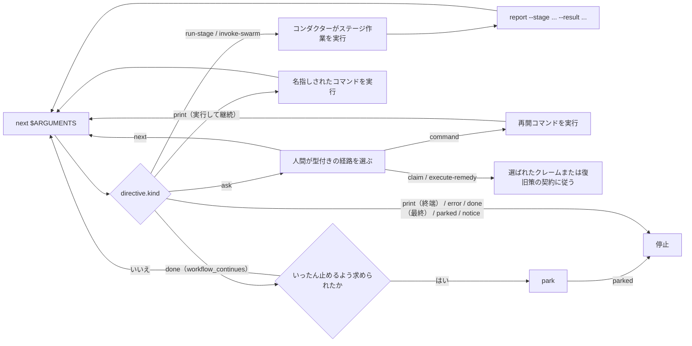

# オーケストレーションエンジンとスキルシステム

> 対象読者: 層 2/3（チーム導入者、フレームワークコントリビューター）。

> **パスの規約。** 以下の `<record>/` はアクティブなインテントのレコードディレクトリ、`aidlc/spaces/<space>/intents/<YYMMDD>-<label>/` を指します。インテントごとの状態とランタイムファイルがここにあります。

この章は、すべての `/aidlc` 実行を駆動するオーケストレーションアーキテクチャの正規リファレンスです。「次は何か」を答える決定的な**エンジン**（`aidlc-orchestrate.ts`）、その回答に従う薄い**コンダクター**（`skills/aidlc/SKILL.md`）、両者を結ぶ**型付きディレクティブ契約**、ランナージェネレーターが出力する**複数のスキル**、実行するステージを決める**スコープ形状**、並列の構築フェーズ作業を収束させる**スウォーム**のレフェリーを説明します。`SKILL.md` 本文がすべてのルーティングロジックを持っていた従来の散文オーケストレーター方式を置き換えます。[オーケストレーター](03-orchestrator.md)（コンダクター自身の章）、[ランタイムグラフ](13-runtime-graph.md)（エンジンとスウォームが読む実行真実のミラー）、[状態機械](12-state-machine.md)（`report` が確定する遷移）、[フックとツール](06-hooks-and-tools.md)（停止フックを含む決定的な基盤）も参照してください。

---

## 1. エンジンとコンダクター

この移行では 1 つの関心事を 2 つに分割します。**エンジン**は*ステージ間ルーティング*、すなわちスコープ解決、フラグ優先順位、ジャンプ方向の計算、再開・初期化ガード、ステージ順序、ゲート状態、ワークフロー完了を担います。**コンダクター**は*エンジンが指定した作業内の実行品質*、すなわちペルソナの設定、適切な質問、ステージ日誌の維持、ステージ内の維持／修正／やり直しループ、ゲートでの人間への判断の提示を担います。

エンジンは `core/tools/aidlc-orchestrate.ts` で作成され、各ハーネスには `<harness-dir>/tools/aidlc-orchestrate.ts`（例: `.claude/tools/`）として配布されます。サブコマンドがちょうど 6 つ（`next`、`continue`、`report`、`park`、`team-board`、`wait`）の Bun CLI です。`continue` は内部のステアリング転送用、`team-board` は Team Construction の読み取り専用クエリ、`wait` はディスパッチした作業を上限付きで読み取り専用で待つものです。

| サブコマンド | 役割 | 状態を変更するか |
|------------|------|----------------|
| `next` | ワークフロー状態（`aidlc/spaces/<space>/intents/<YYMMDD>-<label>/` 下のアクティブなインテントの `aidlc-state.md`）とコンパイル済みステージグラフ（`tools/data/stage-graph.json`）を読み、スコープと位置を解決し、**ちょうど 1 つの**型付きディレクティブ（JSON）を標準出力へ出力します。 | ワークフローのルーティングは、ワークフロー状態も承認の根拠も変更しません。`next` が Plan Approval の受領記録、チャレンジ、フィンガープリントを作成、更新、削除することはありません。また冪等でもあります。アクティブなディレクティブのマーカーに同じ状態に対する同じディレクティブがすでに記録されていれば、そのディレクティブをそのまま返して何も書かないため、再問い合わせで承認が動くことはありません。唯一の例外はルール配信です。ステージのルールが `load-steering` の分割で届いた後、2 番目以降の分割から、またはそれらの分割に続く run-stage の後で再問い合わせすると、最初の分割が再公開されます。呼び出し元が、それ以前の分割を持たない新しいチャットや圧縮後のチャットである可能性があるためです（`06-hooks-and-tools.md` を参照）。`next --single` は作業を出す前に合成の `STAGE_STARTED` 監査境界だけを記録します。通常のチームディスパッチャー読み取りは、gitignore 対象のローカルなクレーム観測キャッシュと世代スタンプを更新することがあります。停止フックと経路確認のプローブは、助言的なエンジンターンマーカー以外には何も書かず、どちらかから永続書き込みを試みると、続行せずに明示的に失敗します。依頼の質問が保持するのは質問のコピーであり、ワークフローの権限ではありません。選択済みのカーソルが無い場合、選択可能な既存インテントと保留中の作業があれば、どのハーネスでも `new-work-routing` を生成します。保留中の作業が無ければ `intent-pick` を生成し、インテントを重複して作ることはありません。明示的な `next config set`、`next config get`、`next config list` の依頼は終端の操作です。正規の設定コマンドが出力を返す前に実行されるため、`set` はインテントの設定を更新することがあります。停止と経路確認のプローブはそのコマンドを説明するだけで、実行することはありません。 |
| `report` | コンダクターがディレクティブに従った後の遷移を確定します。ステージ認識ディスパッチャーであり、`--stage <slug>` は処理済みディレクティブを固定するため、復元された `Current Stage` によって報告対象がずれることはありません。承認、却下、改訂、完了、スキップの各結果を所有し、内部の状態遷移を原子的にディスパッチし、明示的に報告したステージがまだ `[-]` の場合は承認前に不足しているゲートを開きます。 | はい。 |
| `team-board` | 端末のメインディスパッチャーと `/aidlc --status` が使う、純粋な Team Construction ボードを描画します。内部的なクエリ面であり、フェッチも状態／キャッシュの変更も行いません。 | いいえ。 |
| `wait` | ディスパッチした作業を上限付き・読み取り専用で待ちます。共同作業者の寄稿ファイル、ステージの必須成果物、レビュアーのレビューファイル（`--for collaborators|artifacts|review`）をポーリングし、上限内で `status: settled|waiting` を返します。これによりコンダクターは、シェルのループを書く代わりに、事前承認済みのコマンド 1 つを再実行します。 | いいえ |
| `park` | アクティブなワークフローを、きれいなステージ間境界で一時停止します。以後の `next` 呼び出しが、その人が再び話すまで終端の `parked` ディレクティブを出すようにする `Parked` マーカーを書き込みます（パーク後の素の `/aidlc` はそのまま続行します）。`/aidlc --resume` はルーティング再開の前にマーカーをクリアします。 | はい。 |

`report --result skipped` は主ワークフローのライフサイクル結果であり、単一実行の結果ではありません。明示的で空でない `--stage`、空でない `--reason`、名指ししたステージが `Current Stage` と一致すること、そしてステージがアクティブまたは改訂中であることを要求します。エンジンは `STAGE_SKIPPED` を 1 件記録し、`[S]` を保持し、`STAGE_COMPLETED` を出力せずに次のステージを開始します（またはワークフローを完了します）。unit-major の反復では、ウォークが `(stage, unit)` の拍を実行している間、スキップはその拍のステージと `--unit` を名指しし、その Unit だけを対象にします。どの Unit もそのステージを必要としなくなった時点で、ステージは `[S]` になります（[状態機械](12-state-machine.md) を参照）。`report --single --result skipped` は拒否されます。コンダクターが対応する `aidlc-state.ts` のライフサイクル動詞を直接呼び出すことは決してありません。

`next --stage <slug> --single` は、まず `single-stage:<slug>` の下に `STAGE_STARTED` を記録し、そのうえで `single: true`、`gate: false`、`next_stage: null` を持つ `run-stage` を出力します。この型付きマーカーは通常のゲート処理を上書きします。コンダクターは本文を、設定されたトポロジーとレビュアーとともに実行し、その後 `report --single --stage <slug> --result completed` をちょうど 1 回呼び出します。`report` は開いている開始境界を必要とし、それに対応する `STAGE_COMPLETED` を記録します。両方の行をでっち上げることはありません。この分離経路は日誌を持たず、ワークフロー学習の実行、承認ゲートの開放、主ワークフローの `next` 呼び出し、パークを行いません。返される `done` が分離実行を終了させます。

エンジンは設計上、決定的なコードです。ルーティングは決定性の関心事であるため、LLM 散文ではなくツール内にあります（ルート文字列の構築を LLM に委ねると、ツール／エージェント／人間という原則を逆転させます）。既存の決定的ライブラリを**合成**します。コンパイル済みグラフには `loadGraph()`、順序付けには `nextInScopeStage()` / `firstInScopeStageOfPhase()`、スコープ名セットには `validScopes()`、状態読み取りには `getField` / `parseCheckboxes` を使います。正常系以外の分岐（ジャンプ、インテント生成、スコープ／設定変更、環境スコープ検証）は兄弟 CLI ツールをシェル実行して標準エラー出力をそのまま中継するため、ユーザー向けエラー文言を再構築しません。明示的な再開は、park と状態なしのガードを通った後、通常の継続処理へ落ちます。エンジンが合成ではなく追加するのは、`(観測した状態 + グラフ) → ディレクティブ種別` の決定規則と、グラフノードの語彙名を正規のレコードディレクトリパス（`aidlc/spaces/<space>/intents/<YYMMDD>-<label>/<phase>/<stage>/...`）へ変換する成果物パスリゾルバーだけです。

すべてのディレクティブは出力前に `aidlc-directive.ts` の固定された契約に対して検証されます。不正なディレクティブは、コンダクターが実行してしまう虚偽を出力するのではなく、非ゼロで終了します。

---

## 2. 型付きディレクティブ契約

`aidlc-directive.ts` は `kind` フィールドをキーとする**11**種のディレクティブ種別の判別共用体を定義します。各ディレクティブは、その種別が必要とするフィールドだけを持ち、種別ごとの許可キー集合で強制されます（種別の集合外のフィールドは未知キーとして拒否）。エンジンは**現時点で 9 種を出力**します。残り 2 種は、後続の波で配線されるまでループの形を保つための文書化されたプレースホルダーです。

| `kind` | 現時点で出力するか | コンダクターの動作 |
|--------|----------------|--------------------------|
| `print` | はい | `directive.message` の指示どおりに実行します。それが権威です。形は 2 つあります。**終端**（status / help / doctor / version のような実行する読み取り専用ユーティリティを名指しするか、完了した型付き設定の出力を運びます。実際の出力をそのまま表示して停止）と、**実行して継続**（スコープ変更、ジャンプの `execute`、または新しいワークスペースや確認済みの `--new-intent` 作成での `intent-create` のような変更ツールを名指しします。実行してから手順 1 に戻るため、新しい作業は同じチャットで続行し、その語りの中で新しいチャットを 1 度だけ提案します）。ワークフローのディスパッチでは、変更は名指しされたツール側にあります。明示的な型付き設定の依頼は、正規の設定ツールを `next` の中で実行します。拒否された `report` からの `print` は、コンダクターの次の一手です（状態ツールはそうした拒否に `agent_guidance` を付けます）。`question-open` はその人がまだ決めていないことを意味するため、コンダクターは質問を開いたままにし、その人に代わって答えることは決してありません。`person-decided` はその人の選択が記録済みであることを意味するため、コンダクターはその選択を記録します。 |
| `error` | はい | 回復も再試行もせずに停止します。そのメッセージがユーザー向けエラーです。Claude Code と Codex では、rebuild-stage-graph の PostToolUse フックが `directive.message` をバイト単位でそのまま人に見せ、その旨の注記をコンダクターへ渡します（[エンジンのエラー中継](06-hooks-and-tools.md#posttooluse-rebuild-stage-graphts) を参照）。その注記があれば、コンダクターは自分のコピーを加えません。注記が無ければ、コンダクターはメッセージをそのまま表示します。それ以外のすべての場所では、コンダクターは `directive.message` をそのまま表示します。opencode では一時的なトーストとしても表示されます。 |
| `done` | はい | `workflow_continues: true` の場合、`report` が手順を記録し、ワークフローは続きます（承認、スキップ、または最後ではない完了した手順）。完了要約を出さずに直ちに素の `next` を実行します。その人が同じ返答の中で、ワークフローをいったんそこで止めるよう求めた場合は `park` を実行します。それ以外の場合、ワークフロー（または単一ステージ実行）は完了です。完了要約を示して停止します。 |
| `parked` | はい | ワークフローが後続セッションのため、きれいなステージ間境界（`directive.stage`）で途中停止されました。ユーザーに停止中であることと再開方法（`/aidlc --resume`）を伝え、停止します。`Parked` マーカーがある間の素の `next` で出力されます（`aidlc-orchestrate park` が書き込みます）。ステージは進みません。`report` は、承認を記録した際にその返答がワークフローをいったんそこで止めることも求めていた場合に `parked` を返します。停止フックは `parked` を終端許可として扱うため、コンダクターは `done` 到達までステージを機械的に進めず、パークします（#367）。 |
| `notice` | はい | `directive.message` をそのまま表示して停止します。これは終端の情報提供ハンドオフであり、チーム所有の Unit が別の場所でクレームされている間、スコープの付いていないメインで使われます。ワークフローを進めることも変更することもありません。 |
| `load-steering` | はい | まれですが、Copilot では例外です。ディレクティブの予算が小さいため、こちらが通常の形になります。ステージのルールが `run-stage` と並べて収まらなかったため、分割して届きます。`rules_content` を順に適用し、アクティブステージのルールバンドルとして保持します。最初の分割が `conductor_persona` を運んでいればそれを採用します（ワークフロー最初のステージで、その run-stage にペルソナが収まらない場合）。`stage_validity` と `change_notices` は分割からではなく run-stage から表示します。そして分割の先頭に表示される 8 文字の `receipt` を使って直ちに `aidlc-orchestrate continue <receipt>` を呼び出します（または用意された `next` コマンドを実行します）。エンジンが照合できない receipt には、現在の手順で応答します。チャンクの進捗を報告したり語ったりしません。 |
| `run-stage` | はい | アクティブスペースの実質的なルールはすべて内容として届きます。バンドルがこのディレクティブと並べて収まる場合（ほとんどのハーネスのほとんどのステージ）はこのディレクティブの `rules_content` で、収まらない場合（Copilot のほとんどのステージ）は先行する `load-steering` の分割で届きます。`rules_content` があれば最初に適用します。代わりに `rules_held` がある場合、チャットはすでにまさにそのバンドルを保持しています（06-hooks-and-tools.md の Rule delivery を参照）。ファイルを読み直さずに適用します。`inline_context_paths` は配信済みの内容ではなくブロッキングな読み込みリストとして扱います。必須エントリをすべて明示的に読み、その内容が届くのを待ってから、ステージファイル / `consumes` の読み込み、日誌の初期化、本文の実行、モブサポートのディスパッチ、成果物の書き込みへ進みます。モブは最初にリードのペルソナを読み込み、その後にすべてのナレッジパスを読み込みます。`context_warnings` があれば表示し、読み取り可能なペルソナ／ナレッジのロスターで続行します。ディスパッチトポロジーでは、`stage-protocol.md` の「For subagent stages」の手順 2 に従います。Kiro CLI は、登録済みエージェントのネイティブな `resources` によるアクティブスペースのメモリツリー全体の事前読み込みでルールを配信します。それ以外のすべてのハーネスは、蓄積されたルールバンドルをすべてのブリーフへそのまま貼り付けます。どのブリーフも引き続き `directive.ceremony`、`directive.protocol_modules`、日誌の規律をそのまま運びます。読み込めない必須ルールは、修復の案内とともにディスパッチを止めます。事前読み込みで賄われる不完全なブリーフは、何も言わずに続行します（[ルール配信フック](06-hooks-and-tools.md) を参照）。通常の `directive.gate` の前に、任意の `directive.single`、次いで任意の `directive.wave`、次いで任意の `directive.unit_gate` で分岐します。Unit ゲートは、本文とレビュアーが既に決着済みでゲートだけが残っている作業であり、その報告には `--unit` を付けます。ウェーブにはエンジンが解決した完全な Unit エントリが含まれ、それぞれが対になったレビュー証跡と `unit complete --wave` によって決着します。ディレクティブはさらに、グラフノードから解決済みルーティングフィールドをそのまま運びます。 |
| `ask` | はい | エンジンの質問はすべて `ask_type` と `response_route` を運びます。ハーネスの質問機能で表示し、その型付き契約に従います。`scope-confirm` は `proposed_scope`、`confirm_command`、`compose_command`、`scope_commands`、`choices`（人に見える提示の回答。それぞれ `label` とその `command` を持ち、「進める」の次に「compose」）を運び、コンダクターはそれらを意味・順序・コマンドを変えずに会話の言語で提示します。`compose-offer` は `compose_command` と `scope_commands` を運びます。どちらも依頼の本文ではなく `--request <8hex id>` を伴う完全でシェル安全な呼び出しを使って `next` を経由します。`scope_commands` は有効なスコープごとに完全なコマンドを 1 つ持つため、別の計画は名前で選ばれ、シェルの文字列を編集して選ぶことは決してありません。`intent-pick` は正確な `available_intents` のセレクターと `select_commands: Array<{selector: string; command: string}>` を運びます。作業が 1 つしか無くても質問を表示してその人の回答を待ち、そのうえでセレクターでエントリを選び、そのコマンドをそのまま実行します。セレクターを埋め込むことは決してしません。これによりそのレコードが選択され、その作業が続行されます。`unit-paused` は `stage`、`unit`、`resume_command` を `response_route: "command"` とともに運びます。人間が再開を選んだ場合だけ実行し、その後 `next` を再実行します。`project-type` は `existing_code_command` と `new_project_command` を `response_route: "command"` とともに運びます。スキャンで新規プロジェクトとして作業を設定したのに、フォルダーにコードがある状態です。その人の回答に対応するコマンドを実行し、その後 `next` を再実行します。どちらもその種別を本人の選択として記録します。`new-work-routing` は `response_route: "next"`、`new_work_description`、`proposed_scope`、`numbered_prose_question` と、経路として `new_intent_command`、`scope_commands`（修正したスコープ）、`compose_command`、そしてアクティブなワークフローについて尋ねる場合は `continue_command`、選べるレコードがある場合はレコードごとの `select_commands` と `reshape_commands` を運びます。`available_intents` がある場合はレコードごとの `select_commands` も運びます。その「継続／別作業／再構成」の回答はそれらのコマンドを実行し、`report` を経由することは決してありません。また人間向けの質問文にそれらのコマンドが含まれることもありません。`ask_type: "unit-claim"` は `response_route: "claim"` と、クレーム可能、クレーム済み、依存関係でブロック中の Unit 行を運びます。Unit を選ぶと `/aidlc --claim <unit>` を実行し、そのコマンドの結果で停止します。旧来の Plan Approval の回復は、明示的な素の `next` の選択肢を保ちます。`ask_type: "guard-recovery"` は `response_route: "execute-remedy"`、拒否したステージと Unit、`reason_codes`、`remedies` を運び、各復旧策は定義済みの `op` と `interaction` を持ちます。`agent_work` が true の場合、復旧策はコンダクター自身の作業であり、尋ねずに最初に当てはまるものを実行します。それ以外の場合、コンダクターは `executableNow` が true の復旧策を `label` と `description` で提示し（復旧策の `action` はコンダクターへの指示であり、表示しません）、人間の選択を待ってから、以下のインタラクション契約に従います。`remedies` が空のリストは終端であり、そのまま表示して人間が回答するまでエンジン操作をしません。繰り返しの上限を超えると、`state_signature` も運びます（[ガードの許可判定と復旧質問](12-state-machine.md#ガードの許可判定と復旧質問) を参照）。エンジンの質問への回答を汎用の `report` で送ってはなりません。明示的な復旧策のステージ報告は、引き続き復旧策の契約の一部です。再入時のやり直し、ジャンプ、最初からやり直す依頼は、唯一のステージ以外の報告の往復であり、`report --result resumed --choice <redo|jump|fresh>` を使います。エンジンは人間のターンをコンダクターへ委ねます。 |
| `invoke-swarm` | はい | エンジンが適格な構築フェーズのバッチをスウォームへ委譲しました。コンダクターは `directive.units` のユニットを展開し、収束ループを回してスウォームのレフェリーに相談します（§6 参照）。`autonomous` 付与下の適格な構築バッチでのみ出力されます。 |
| `dispatch-subagent` | いいえ（エンジン将来のプレースホルダー） | *本来は* 名指しステージをインラインではなく `Task` 呼び出しで実行します。現時点では出力しません。推測で実装しないでください。 |
| `present-gate` | いいえ（エンジン将来のプレースホルダー） | *本来は* ゲート儀式を独自ディレクティブとして実行します。現時点ではゲート判断は `run-stage` の `gate` フィールドに折り畳まれています。 |

**ガード復旧のインタラクション。** 人間が実行可能な復旧策を選んだ後:

- `command`: 返された正確なネイティブまたはソースの `command` を実行します。これは構造化された `operation` から描画されたものです。選択だけで試行するには十分ですが、所有するツールは引き続きライフサイクルと証跡を強制します。返されたオーケストレーターのディレクティブは、通常のループで処理します。
- `human-input`: アクションのフォローアップを表示して、ターンを終えます。Request Changes では、何を変えるべきかをすでに述べている返答がそのままフィードバックです。その人の直前の返答が変更を求め、その内容を述べていた場合、復旧策はすでに選ばれており、質問は提示されません。それ以外の場合は「What should change?」と尋ね、別の回答を待ちます。そのフィードバックは変更せずに、`--user-input "Request Changes"` とは別に報告の `--reason` として保持します。必要な場合は、人間から具体的な Scope を得ます。
- `external-work`: 既存のプロトコルとツールを通じて `action` に従います。選択には追加のフィードバックのターンは不要で、完了の証明にもなりません。

コマンド、欠けている引数、フィードバック、受領記録を発明してはなりません。型付きのガード復旧の質問で終わるツールの拒否も、同じ契約に従います。それ以外の場合は、実際のツールエラーを示してその復旧の試みを止めます。通常の失敗は、復旧のディレクティブでも成功でもありません。

**質問の転送。** スコープ／compose の質問は依頼を ID でしか名指ししません（貼り付けられた `<document>` ブロックはデータとして質問ストアに留まり、質問に入ることは決してありません）。その `question` には最大 240 文字のプレビュー（切り詰めた場合は `...` で終わる）と、貼り付けられた文書を依頼からどう切り分けたかを述べる 1 行だけが含まれます。`new-work-routing` の質問は、それらを `new_work_description` で 1 度だけ運び、経路のコマンドを専用のフィールドで運びます。エンジンは各質問の依頼のコピーを、`aidlc/.aidlc-sessions/questions/` 配下の gitignore 対象の専用ファイルに保持します。そのため 1 つのクローンの並行セッションが互いの質問を共有したり無効にしたりすることは決してありません。もう一度尋ねると新しい ID の新しい質問になり、以前の質問も引き続き回答できます。コマンドはそのストアから `--request <8hex id>` を解決します。依頼の全文と提案スコープは composer のディスパッチと作成時の出力を通じて運ばれます（`scope-confirm` の後の 2 段目を含め、`new-work-routing` の質問は独自の質問を保存します）。インテントの作成は完成したレコードを最後に列挙し、質問 ID を `intents.json` の行に記録してから、コピーを削除します。未回答のコピーは、`question-retention-days` が設定されていない限り保持されます。同じ回答を繰り返すと、それが始めた作業が続行されます。アーカイブ済みまたは完了済みの作業を再び始める前には確認します。別の作業がアクティブになった後に開始の回答をすると、新しい作業はそれと並んで開始されます。ルーティングの質問の `continue_command` と `compose_command` は、それが名指ししたワークフローにだけ作用し、別のワークフローが選択されている場合は改めて尋ねます。コピーはワークスペースの OS の権限に従います。コピーが失われた質問は、作業をもう一度説明するよう求めるメッセージでエラーになります。コンダクターは与えられたコマンドを、依頼の本文を付け足したりランタイムファイルを編集したりせずに実行します。

**ゲート番兵。** `run-stage` の `gate` は、決定的なすべての場合で真偽値です（自動進行するブートストラップ初期化ステージは `false`、それ以外の EXECUTE ステージは `true`）。決定的でない場合が 1 つあります。最初の構築ボルトのゲートは、チームの自由形式 `## Walking Skeleton` プラクティス散文に依存し、どのパーサーも導出できません。エンジンは文字列番兵 `GATE_UNRESOLVED`（`"unresolved"`）を出し、分類をコンダクターの知識作業に委ねます。コンダクターは `report --skeleton-stance <on|off|scope-dependent>` で姿勢を返し、次の `next` が同じステージを、今度は確定した真偽ゲート付きで再出力します。

**コンダクターペルソナの配送。** コンダクターの実行品質憲章は `aidlc-common/conductor.md` に一度だけあります。どのスキルもパスでは参照しません。代わりにエンジンがそれを読み、**ワークフロー最初の `run-stage` ディレクティブ**の `conductor_persona` フィールドへ内容を焼き込みます。その run-stage にペルソナを含めるとホストの上限に収まらない場合は、その前の最初の `load-steering` の分割へ焼き込みます。コンダクターがそのフィールドを受け取ると、実行全体でそのペルソナを採用します。これにより、フレームワークランナーも手書きも、スキルごとの注意なしに同一ペルソナへ揃います。

---

## 3. 転送ループと停止フック

ステージ作業の前に、名指しされた `directive.protocol_modules` を読みます。`reviewer` → `stage-protocol-reviewer.md`、`ensemble` → `stage-protocol-ensemble.md`、`construction` → `stage-protocol-construction.md`、`swarm` → `stage-protocol-swarm.md`、`learnings` → `stage-protocol-learnings.md` です。読み込み済みのモジュールを再読する必要はありませんが、適用されるのは現在のディレクティブに列挙されたモジュールだけです。`learnings` モジュールは日誌と §13 の儀式を所有します。それが無い場合は両方を飛ばし、完了から承認ゲートへ直接進みます。

`directive.ceremony` は、このインテントの `sensors`、`learnings`、`summary_confirmation` を解決します。それぞれの既定はスコープの設定（省略時は `on`）で、その上にインテントごとの上書きと環境変数の停止スイッチがあります。`/aidlc --sensors on|off`、`--learnings on|off`、`--summary-confirmation on|off` はインテントの上書きを設定します。`summary_confirmation: off` は、統合要約のチェックポイントや受領記録なしに回答から直接生成します。必須の質問、Assumption Confirmation、Plan Approval、承認ゲートは残ります。`sensors: off` は `sensors_applicable` を空にし、自動検査と、それに伴う修正／再実行の指示を省きます。17 個のフック登録はすべて残ります。

`skills/aidlc/SKILL.md` は**コンダクター**です。エンジンのディレクティブに従う薄い転送ループです。制御構造全体は次のとおりです。

```
Loop:
  1. directive = `aidlc engine orchestrate next $ARGUMENTS`
  2. act on directive.kind
  3. After stage work, `aidlc engine orchestrate report --stage <directive.stage> --result <outcome> [--user-input '<text>']`. Ask answers follow next/command/claim/execute-remedy instead; only a redo, jump, or start-fresh request on re-entry uses non-stage `report --result resumed`.
  4. Repeat only when the directive calls for continuation; otherwise stop or wait for the human as it directs.
```

端末でのワークスペースのナビゲーションは、ループの繰り返しより優先されます。たとえば `/aidlc space default` はスペースを切り替え、ユーティリティの出力を表示し、移動先に未完了のインテントがあってもターンを終えます。そのインテントが選択されても、再開の依頼にはなりません。コンダクターは、`next` や `report` を呼んだりステージを実行したりする前に、人間からの新しいワークフローの依頼を待ちます。セッション開始時の案内も同じ境界を補強します。



図のテキスト説明: `next`（`$ARGUMENTS` をそのまま渡す）はディレクティブを 1 つ返します。ステージ作業はその結果を報告し、再び `next` へ戻ります。エンジンの質問はどれも、代わりに人間の回答後、宣言された `next`、`command`、`claim`、`execute-remedy` の経路に従います。ガードの復旧策は、名指しされたステージ報告を含め、明示的なコマンド／アクションの意味を保ちます。質問から報告への汎用のフォールバックはありません。実行して継続の `print` は、そのコマンドを実行して直接 `next` へ戻ります。再入時のやり直し、ジャンプ、最初からやり直す依頼だけが、ステージ以外の `report --result resumed` を使います。終端の `print`、`error`、`parked`、`notice` はループを止めます。`workflow_continues` を持たない `done` も同様です。それを持つ `done` はまっすぐ `next` へ戻ります。その人が同じ返答の中でワークフローをいったんそこで止めるよう求めた場合は `park` へ進みます。

`$ARGUMENTS` は最初の `next` へそのまま通ります。エンジンがフラグ（`--status`、`--stage`、`--scope`、`--depth`、自由形式テキスト）を解析するため、コンダクターは事前解析も除去もしません。ワークフローのルーティングはステージ作業を実行しません。`report` が遷移を確定するため、次の `next` は新しい状態を読みます。明示的な型付き設定の依頼は、終端の応答を返す前に正規の設定操作を終え、ワークフローを進めません。依頼の質問は、ワークフロー状態や承認の権限を変えずに質問のコピーを保持することがあります。

対話経路ではコンダクターがループを保持します。人間に質問できるのはコンダクターだけだからです。ループを LLM の善意に委ねないため、**停止フック**（`hooks/aidlc-continue-workflow.ts`）が決定的に強制します。これは 6 つある流れ変更フックの 1 つで、deliver-stage-rules、plan-approval、state-transition、reviewer-scope、review-freeze が残る 5 つの PreToolUse 制御であり、そのほかの 10 個のフックは助言的です。コンダクターが手番を終えようとすると、停止フックは `aidlc-orchestrate next` を実行し、ディレクティブがまだ保留なら、人が読める平易な 1 行の `reason`「AI-DLC is carrying on with <stage>.」で停止を阻みます。これは**任務継続**であり、コンダクターの安全訓練が拒否する上書き型の指示には決してしません。その 1 行に対するコンダクターの手順（直前に尋ねた質問を記録する、その人が止めるよう求めた場合はパークする、保持しているルールの receipt で続行する、`run-stage` を保持しているステージを終えてそのディレクティブから組み立てた `report` を実行する、または `next` を実行する）は、スキルとセッション開始時のコンテキストにあります。プローブとしての `next` 呼び出しは何も書き込みません。ディレクティブの公開、クレーム観測の更新、Plan Approval の状態変更はいずれも行いません。`done`、`parked`、情報提供の `notice` の各ディレクティブは停止を許可します。`parked` は後続セッション向けの正規の途中停止であり、`notice` は書き込みを伴わないチームのファンアウト・ハンドオフです。保留でも*止めない*場合もあります。**人間待ちの例外**は、コンダクターが正しく人間待ち（または単なる会話）のとき停止を許します。現在ステージが明確に承認待ち `[?]`、改訂中 `[R]`、進行中 `[-]` で、未回答の `[Answer]:` タグが正規またはアクティブな Unit 専用の `<slug>-questions.md` にあるか、後続に `QUESTION_ANSWERED` のない現在ステージの `DECISION_RECORDED` がある場合、または終了手番が会話的だった場合です（人間の直前プロンプトにワークフローエンジンの関与なしで答えた場合。ハーネスのトランスクリプトから判定します。読み取り専用の照会と、端末でのワークスペース／設定のディスパッチは除外され、状態に依存する設定呼び出しには、[フックのリファレンス](06-hooks-and-tools.md) で説明するとおり、一意に一致する終端の結果が必要です）。記録済みの決定と会話的な手番は自律構築では抑制され、ファイルに基づく質問も同様に抑制されます。ただし unit-major のコード生成における必須の Plan Approval の質問だけは例外で、手番を解放します。会話のケースはトランスクリプトを渡さない Kiro では無効で、対話時の上限が解放経路になります。そこで止めると促しが連発するだけです（肯定確認のみ。人間待ちの検査は失敗時に開放、会話の検査は失敗時に閉鎖。状態なしのケースと本当のステージ途中の終了はなお阻止されます）。行き詰まったループがセッションを閉じ込めないよう、上限が 2 つあります。Claude Code の `stop_hook_active` 信号と、アクティブなインテントのレコードディレクトリ配下 `<record>/.aidlc-engine/stop-hook/` に永続化する無進捗カウンタです。連続した無進捗ブロックが上限（`CLAUDE_CODE_STOP_HOOK_BLOCK_CAP`。既定は実行モード依存: **対話実行では 2、自律構築では 8**）に達するとフックは手を放します。ワークフローが進むと位置署名が変わりカウンタが 0 に戻るため、健全なループが絞られることはありません。アクティブなワークフローが無い場合や予期しないエラーでは、フックは失敗時に開放します。AIDLC 以外のセッションを止めることは決してありません。

---

## 4. 複数スキル、ランナー、共有スパイン

オーケストレーターは多数あるスキルの 1 つです。各ハーネスは、インストールされたスキルディレクトリ（`<harness-dir>/skills/`、例: `.claude/skills/`）に複数のスキルを配布します。基幹の `aidlc` オーケストレーター、実行可能なステージごとの**ステージランナー**（コアステージは `aidlc-<slug>`、プラグイン所有のステージはプラグインプレフィックス付きスラッグをそのまま使う）、`runner: true` のスコープごとの**スコープランナー**（コアスコープは `aidlc-<scope>`、プラグイン所有のスコープは名前をそのまま使う）、読み取り専用セッションスキル（`aidlc-session-cost`、`aidlc-replay`、`aidlc-outcomes-pack`）、および `aidlc-init` です。ルーティングと実行の知識はすべて、`core/aidlc-common/` で著述される**共有スパイン**（配布先は `<harness-dir>/aidlc-common/`）に一度だけあります。`conductor.md` ペルソナ、`protocols/`、および `stages/{initialization,ideation,inception,construction,operation}/` 配下の 33 ステージファイルです。

ランナースキルは `tools/aidlc-runner-gen.ts` が生成し、手書きしません。

- **ステージランナー**は任意の糖衣です。コアの各 `/aidlc-<slug>`（プラグイン所有なら `/<plugin>-<slug>`）は（無くても動く）`/aidlc --stage <slug> --single` を、エンジンの `--single` モードで 1 ステージだけを分離実行し、主ワークフローの `Current Stage` は進めない入力可能コマンドへ包みます。`next --single` が合成の開始を所有し、出力される `single: true` ディレクティブはワークフロー学習と承認ゲートをバイパスし、`report --single` が対応する完了を所有します。ランナーはそのうえで `done` で停止します。スラッグ一覧は `loadGraph()` — 唯一のコンパイル済み真実源 — から来るため、グラフに足したステージはここを編集せずランナーへ流れます。ブートストラップ初期化ステージは除外されます（単独 `--single` の意味がなく、`--single` は拒否します）。初期化フェーズ全体は 1 本の `/aidlc-init` ランナーとして配布されます。`--scope` 付きではエンジンの `intent-create` の動きを包み、説明だけの場合はエンジンに新しい作業を依頼し（`next --new-intent`）、最初に計画の提案を表示します。
- **スコープランナー**は既に実行可能なコマンドを包みます。定義はスコープファイルが持ち、`runner: true` で既定の生成集合へオプトインします。各ランナーは短いシェルで、固定スコープ・検出なしで `aidlc-orchestrate next --scope <scope>` を `done` まで駆動します。スコープ集合全体は `/aidlc --scope <name>` で到達可能です。ランナーは高頻度のものと、オプトインしたプラグインスコープへの入力可能な糖衣です。

2 つのドリフトガードがディスク上のランナー集合を源へ固定します。ステージランナーは `aidlc-runner-gen.ts check`、スコープランナーは `scopes --check` で、いずれも CI で実行されます。ランナーは **`hooks:` ブロックを持ちません** — ワークフロースパインのフックはプロジェクト全体の `settings.json` にあるため、決定的スパインはコピーではなく継承です。どのランナーも `conductor.md` を手で読みません。エンジンが最初の `next` でペルソナを届けます。

---

## 5. スコープ形状

スコープはファイル著述のプリミティブで、センサーやエージェントを著述するのと同じ手癖です。**`scope-mapping.json` はありません** — 配布ツリーから削除済みです。スコープ識別とステージ所属は、コンパイル済みグリッドへ転置される 2 つのファイル著述面に分かれます。

1. **識別**はスコープごとに 1 ファイル、`core/scopes/aidlc-<name>.md` で著述され、`<harness-dir>/scopes/` へ投影されます。フロントマター（必須の `name` と `depth`、任意の `keywords`、`description`、`testStrategy`、`skeleton`、`review_cap`、`guard_policy`（廃止された綴りは `change_control`）、`sensors`、`learnings`、`summary_confirmation`、`plan_approval`、`collaborators`、`runner`、`freeform_default`、`existing_code`。全一覧は `docs/harness-engineering/04-scopes.md` のフィールド表）と、スコープを説明する本文です。配布セットは `bugfix`、`classic`、`enterprise`、`express`、`feature`、`infra`、`mvp`、`poc`、`refactor`、`security-patch`、`workshop` です。
2. **所属**は各ステージの `scopes:` フロントマターにあります。そのステージが EXECUTE となるスコープの一覧です。Classic は Initialization に加えて、Inception と、Build and Test までの Construction を含みます（33 ステージ中 18）。CI Pipeline と Operation は実行対象の所属に含まれません。Classic は助言的なレビュー、センサー、学習の儀式を実行し、要約確認と共同作業者を無効にします（各ステージはリードエージェントだけで実行されます）。明示的な自律では、マージ前の 1 回のレビューを保ちます。

`aidlc engine graph compile`（`stage-graph.json` を作るのと同じコンパイル経路）がこれらを `tools/data/scope-grid.json` のグリッドへ転置します — エンジンがスコープ水準のルーティングすべてに読む `scope → {stages: {slug: EXECUTE|SKIP}}` マップです。エンジンの `validScopes()` は、そのコンパイル済みグリッドから正規のスコープ名集合を導出します。

転置が対象とするのは、フロントマターで宣言された（標準の）スコープだけです。compose した計画から保存したスコープは、それを宣言するステージが無いため、コンパイルはその列を `aidlc/scopes/<name>.md` の永続的な記録から折り戻し、対応する識別ファイルを `<harness-dir>/scopes/` へ投影します（[保存したスコープの置き場所](../guide/05-scopes-and-depth.md#保存したスコープの置き場所) を参照）。

スコープ追加は純粋に加算です。`.claude/scopes/aidlc-<name>.md` を置き、所属ステージの `scopes:` リストにタグ付けし、再コンパイルし、`SKILL.md` の人間可読要約表を再生成します。ディスパッチロジックの編集は不要で、ドリフトガードがディスク上の集合の乖離を防ぎます。

---

## 6. スウォームのレフェリー、ドライバー継ぎ目、ボルト DAG

**スウォーム**は、人間が付与した自律の下で並列の構築作業が収束する仕組みです。稼働中の `/aidlc` セッション内でのみ発火するため、展開と再試行ループはコンダクター（そのセッション）が所有し、`tools/aidlc-swarm.ts` はコンダクターがループを持ち続けながら相談する決定的な**レフェリー**です。これは収束への 3 関心事分割です。コンダクターが展開と再試行判断（知識）を、ツールが収束判定 + マージ + 監査（決定性）を、人間が自律を付与し失敗封筒で指揮権を取り戻すこと（判断）を担います。

レフェリーは**状態なし** — 反復カウンタも永続進捗もなく — サブコマンドは 3 つです。

| サブコマンド | 役割 | 出力 |
|------------|------|-------|
| `prepare --batch <n> --units <a,b,c> [--base <branch>] [--degraded-from <subagent\|ultracode>] [--resume-existing]` | 保護されたコード生成では、旧来の自律でも新しいチェックポイントでも、各 Unit の現在の Plan Approval または許可された承認後の継続と、コミット済みで再現可能な承認済みの親アプリケーションのソースを要求します。同じインテント、対象、試行では、`testing-posture verify` が `execution_allowed: true`（exit 0）を返せば、`ok: false` が現在の内容は未承認だと報告していても、下げられたフェンスの下での継続が許可されます。読み取り専用の事前検査は、最初の子を作る前にすべての Unit を対象にします。未コミットのソースは孤児を残さずにコミットと再試行を返し、自動のコミットはありません。却下によって以前の承認が退役した場合は、`--resume-existing` の前にその改訂の新しい Plan Approval を得ます。以降の再試行はその実際の承認の証跡を保ち、許可された継続を使えます。残っている子のソースを保持してメタデータをアーカイブするか、ネイティブな着地の証跡が許す場合は、すでに着地した親のソースから取り除かれた子を再作成します。どの継続も、古い試行の承認を復活させることはありません。 | `SWARM_STARTED`（大きな降格が報告されると `SWARM_DEGRADED` も）。 |
| `check <unit> [--check-cmd <cmd>] [--test-file <path>]` | 単一ユニット判定: インテントの人間が許可した Construction Verification Command を実行し（与えられた `--check-cmd` はそれと一致しなければなりません。終了コード 0 = 緑が権威信号で、ワーカーの自己申告は決して信用しません）、保護ファイルを分岐 Git 基準と比較する改ざん防止も行います。`{converged, tampered, reason}` を表示し、真に収束した場合に限り終了コード 0 です。 | なし（助言。コンダクターの再試行判断に情報を渡す）。 |
| `finalize --batch <n> --units <a,b,c> --claimed <a,b> [--check-cmd <cmd>] [--test-file <path>] [--reasons <unit>=<reason>,…]` | 権威あるゲート: **主張された全ユニットでチェックを再実行**し、現在のステージがレビュアーを宣言している場合は、そのユニットの Bolt 開始後の一致する終端受領記録も要求します。モダンなソース保有ワークツリーでは、さらに最新のグローバル `Source Fingerprint`、最新の `Unit Source Fingerprint` とマニフェストバイト結合、アテスト済みの raw 対応 `Base Source Listing`、そしてベースからワークツリーへのすべてのソース変更がレビュー済みマニフェスト主張に包含されていることも要求します。`AIDLC_SKIP_SOURCE_FRESHNESS=1` はこれらのソース検査だけを明示的にバイパスします。収束行にはバイパスが記録され、ソースマージでも同じスイッチを繰り返す必要があります。主張されたユニットが赤・改ざん・未レビュー・陳腐化・レビュー済みフットプリント外のいずれかならマージ前に拒否されます（虚偽コンダクター防護）。Guard Policy が relaxed または off の場合、ユニットのコード、コード生成の文書やファイル一覧がレビュー後に変わった場合や、計画外のファイルが変わった場合でも、実際のレビューは有効なままです。finalize はユニットを現在の状態のまま着地させ、`CHANGE_ACCEPTED` の行（チェックポイント `review-receipt`）を 1 件記録して人向けの 1 行を返し、バッチのチェックポイントは同じことを繰り返さずにその行を読みます。strict ではユニットは新しいレビューのために拒否されます。その後、真の通過分は、直列の HOLD-MERGE ロックの下で AIDLC メタデータをマージする前に、宣言された正確なレコード成果物と結合済みソースマニフェストをスナップショットして着地させます。コンダクターは次に、相関付けられた `aidlc-worktree merge` を実行しなければなりません。これは不変の `Source Commit` を消費して `SWARM_SOURCE_MERGED` を発行し、その権威が着地した後はクリーンアップに関して冪等です。モダンなバッチルーティングと確定した承認には、完全な集約チェーンが必要です。終了コード 0（レコード／メタデータの収束）または 2（失敗封筒）です。 | `SWARM_UNIT_CONVERGED` / `SWARM_UNIT_FAILED` / `SWARM_BATON_RETURNED` / `SWARM_COMPLETED`。後続のソースマージは `SWARM_SOURCE_MERGED` を発行します。 |

したがって、インラインのスケルトンからスウォームへ切り替えるには、並列バッチを準備する前に、承認済みのスケルトンのソースを明示的・許可済みでコミットすることが含まれます。ネイティブなマージが成功すると、その子が取り除かれることがあります。`--resume-existing` が保持するのは却下の改訂であり、元の子ディレクトリが存在するという無条件の約束ではありません。[prepare と再開のコマンド](../guide/12-cli-commands.md#aidlc-engine-swarm-prepare-prepare-a-reproducible-batch) を参照してください。

これら 7 つの `SWARM_*` イベントは 115 イベント監査分類体系の一部です（[状態機械](12-state-machine.md) を参照）。終了コード 2 の封筒ではコンダクターが指揮権を取り戻します。失敗は自律モードにかかわらず常に停止し、人間を再関与させます。

**ドライバー継ぎ目。** `AIDLC_USE_SWARM=1` はインライン動的ワークフロードライバーを選びます（コンダクターが、ユニットごとのパイプラインと反復上限を JS が持つ `Workflow` を著述します）。未設定はサブエージェント床（1 メッセージ内の N 並列 `Task` 呼び出し、ユニットごと 1 つ）を選びます。`=1` だが Workflow ツールが無い場合、コンダクターは床へ**明示降格**し、`--degraded-from ultracode` を渡してレフェリーが `SWARM_DEGRADED` を出します。暴走の歯止めはツール内の上限ではなく、ハーネスの停止フック上限であり、この自律構築経路では 8 ブロックです（§3）。

すべてのコード生成ワーカーは、通常経路と同じ承認済みの契約、すなわち `AIDLC-UNIT`、`AIDLC-TESTING-CONTRACT`、完全なプラン、完全なユニットテスト指示を受け取ります。ワーカーが Testing Posture を独自に再解決することは決してありません。

**ボルト DAG。** スウォームが展開するバッチは `runtime-graph.json` の `bolt_dag` ノードから来ます（[ランタイムグラフ](13-runtime-graph.md) を参照）。ユニット生成ステージの `unit-of-work-dependency.md` エッジブロックから解析されます。ノードは `units`（各々に `depends_on` リスト）と `batches` — 各ユニットの依存が先行バッチで満たされる位相水準 — を持ち、バッチ内ユニットは並列展開できます。ノードは有効なエッジブロックがディスク上にあるときだけ存在します。欠落・不正・循環ブロックではノード全体が省略されます（ゲート時の必須節センサーが上流でそれを指摘します）。

---

## 次のステップ

- **コンダクター自身の章** — 転送ループ、ゲート儀式、学習儀式の全体。[オーケストレーター](03-orchestrator.md) を参照。
- **エンジンとスウォームが読む実行真実の成果物** — `runtime-graph.json` とその `bolt_dag` ノード。[ランタイムグラフ](13-runtime-graph.md) を参照。
- **`report` が確定する遷移** — ワークフロー／フェーズ／ステージ機械と 115 イベント監査分類体系。[状態機械](12-state-machine.md) を参照。
- **決定的スパイン** — 停止フックとその他のフレームワークフックとツール。[フックとツール](06-hooks-and-tools.md) を参照。
- **日常のランナー利用** — 入力可能な `/aidlc-<stage>` と `/aidlc-<scope>` コマンド。ユーザーガイドの [スキルとランナーコマンド](../guide/17-skills.md) を参照。
