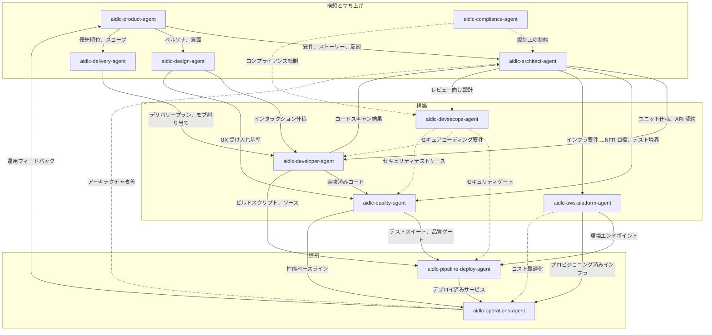

# エージェントリファレンス

AI-DLC の 14 エージェント編成（11 体のドメイン専門家、2 体のレビュー専用エージェント、
適応ワークフローのコンポーザー）についての技術リファレンスです。

設計思想とその理由については、
[ユーザーガイドのエージェント章](../../guide/06-agents.md)を参照してください。

---

## 14 エージェント一覧（11 体のドメイン専門家 + 2 体のレビュアー + コンポーザー）

| # | エージェント | 担当領域 |
|---|-------|--------|
| 1 | [aidlc-product-agent](product-agent.md) | 要件、スコープ、ユーザーストーリー、市場調査 |
| 2 | [aidlc-design-agent](design-agent.md) | UX/UI、ワイヤーフレーム、インタラクション設計、アクセシビリティ |
| 3 | [aidlc-delivery-agent](delivery-agent.md) | チーム編成、キャパシティ計画、デリバリー順序の設計 |
| 4 | [aidlc-architect-agent](architect-agent.md) | ドメイン設計、ドメインモデリング、NFR、分解 |
| 5 | [aidlc-aws-platform-agent](aws-platform-agent.md) | AWS インフラ、IaC、FinOps、環境プロビジョニング |
| 6 | [aidlc-compliance-agent](compliance-agent.md) | GRC、規制マッピング、データ分類、リスク |
| 7 | [aidlc-devsecops-agent](devsecops-agent.md) | 脅威モデリング、セキュリティパイプライン、セキュア設計レビュー |
| 8 | [aidlc-developer-agent](developer-agent.md) | コード生成、リバースエンジニアリング、実装ガイダンス |
| 9 | [aidlc-quality-agent](quality-agent.md) | テスト戦略、受け入れ基準、性能検証 |
| 10 | [aidlc-pipeline-deploy-agent](pipeline-deploy-agent.md) | CI/CD パイプライン、デプロイ戦略、リリース実行 |
| 11 | [aidlc-operations-agent](operations-agent.md) | オブザーバビリティ、インシデント対応、フィードバックループ |
| 12 | aidlc-product-lead-agent | レビュー専任: 要件 / ユーザーストーリー / UX の品質ゲート（balanced ティア） |
| 13 | aidlc-architecture-reviewer-agent | レビュー専任: 技術設計の健全性 / 実装可能性のゲート（balanced ティア） |
| 14 | aidlc-composer-agent | 適応的ワークフロー構成: 仕立てられたステージ計画と、保留ステージの再構成を提案 |

---

## 共通設定

著述された 14 体すべてのエージェントは、共通の先頭メタデータのベースラインを共有しています。Claude Code では、どのエージェントも `tools:` の許可リストを宣言していないため、すべてのエージェントが **セッションの完全なツールセット** と提供された MCP ツールを継承し、入れ子の委譲に対する拒否は `disallowedTools: Task` です。他のハーネスはこの意図をネイティブなポリシーへ射影します。Kiro のエージェント Markdown は未対応のキーを省略し、Kiro CLI の JSON と Kiro IDE の `tools:` 許可は委譲先から `subagent` を除外します。レビュー専用の 2 エージェントは加えて `maxTurns: 60` を持ちます。これはハーネスにレバーがある場所でネイティブに強制されるハードなターン数の歯止めです。Claude Code ではこの先頭メタデータのキーがそのまま拘束力を持ちます（サブエージェントはタスクの途中で停止され、最終メッセージはありません）。opencode ではパッケージャがこれをネイティブのエージェント単位 `steps: 60` へ射影します（ランナーはテキストのみの最終ターンを 1 回許可するため、要約は返せますが、ツール呼び出しでレビューを書き出すことはできません）。Codex の TOML ペルソナはこの数値を文章としてのみ持ちます（TOML ペルソナには先頭メタデータがないため、出力時に引用文が書き換えられます）。Cursor、Copilot、Kiro はエージェント単位の上限キーを公開していません（未知のキーを許容する .md サーフェスには不活性な `maxTurns:` キーがそのまま出荷されます。kiro のエージェント JSON には決して渡されません）。第 12a 節の未完了試行ガードは、上限で打ち切られたレビューを、1 回の再ディスパッチとその後の NOT-READY 判定へ変換し、判定が黙って欠落する事態を防ぎます。さらにコンダクターは毎回のディスパッチ前に既存の `## Review` 節を削除するため、古い判定が欠落した判定の代わりに立つことは決してありません。

### Claude Code のセッションツールセット

Claude Code のエージェントは、以下を含む組み込みツールを継承します。

| Claude Code ツール | 用途 |
|------------------|---------|
| Read | ファイルシステムからファイルを読み取る |
| Edit | ファイル内で厳密な文字列置換を行う |
| Write | ファイルをファイルシステムへ書き込む |
| Glob | 高速なファイルパターン照合 |
| Grep | `ripgrep` を使った内容検索 |
| AskUserQuestion | 対話的なユーザープロンプト（メインスレッドのステージのみ） |

### 共通で禁止される Claude Code ツール

| Claude Code ツール | 理由 |
|------------------|--------|
| Task | エージェントは委任されたワーカーとして動作します。`Task` 呼び出しを行うのはコンダクターです。Claude では `disallowedTools: Task` で強制し、他のハーネスではネイティブな拒否／許可リストの同等機構を使います。 |

### 各ペルソナで利用が想定されるツール

Claude Code では、すべてのエージェントが継承により Bash と WebSearch に *アクセス可能* ですが、この表が示しているのは各エージェントへの個別付与ではなく、方法論としてどのペルソナがそれらを使うことを **想定しているか** です。Claude のペルソナを本当に制限したい場合は、任意の `tools:` 許可リストを追加してください（その場合、`mcp__<server>__<tool>` 識別子も列挙しない限り継承された MCP は外れます）。

| Claude Code ツール | 利用が想定されるエージェント |
|------------------|---------------------|
| Bash | aidlc-aws-platform-agent, aidlc-devsecops-agent, aidlc-developer-agent, aidlc-quality-agent, aidlc-pipeline-deploy-agent, aidlc-operations-agent |
| WebSearch | aidlc-product-agent, aidlc-design-agent, aidlc-compliance-agent |

### エージェントティア

| ティア | エージェント |
|------|--------|
| judgment | aidlc-architect-agent, aidlc-product-agent, aidlc-design-agent, aidlc-developer-agent, aidlc-quality-agent, aidlc-devsecops-agent, aidlc-compliance-agent, aidlc-aws-platform-agent, aidlc-composer-agent |
| balanced | aidlc-architecture-reviewer-agent, aidlc-product-lead-agent |
| templated | aidlc-delivery-agent, aidlc-pipeline-deploy-agent, aidlc-operations-agent |

出荷される各エージェントは、著者が記述した先頭メタデータ内で `tier:` を宣言しています。パッケージャーはそれを各ハーネスのネイティブな model/effort キーへ投影します（Claude Code では、judgment -> `model: inherit` で effort の固定なし、balanced -> `model: sonnet` + `effort: medium`、templated -> `model: sonnet` + `effort: medium`）。したがって judgment エージェントが、セッション自身の model や effort より下へ格下げされることはありません。エージェントが templated になるのは、その出力が主としてパターン追従型であり、たとえばデリバリープラン、CI/CD YAML、オブザーバビリティやランブックのひな型成果物で、しかも方法論がすでにそのエージェントのナレッジファイルに埋め込まれている場合に限られます。

9 体の judgment エージェントには共通点があります。いずれも、判断が下流へ連鎖していく多制約推論を必要とする仕事を担うことです。アーキテクチャ境界、曖昧な意図の解釈、UX 上のトレードオフ、高密度な文脈下でのコード合成、リスクベースのテスト戦略、脅威の優先順位付け、規制上のエッジケース、クラウドアーキテクチャのトレードオフは、いずれもこのカテゴリに入ります。2 体の balanced レビュアーは、新規入力を明示的な基準に照らして評価します。チェックリスト自体に方法論がエンコードされているため、`medium` effort の中規模モデルで十分です。balanced と templated は現在 Claude Code、Codex、opencode では同一に投影されますが、どちらか一方を後から再調整できるよう別のティアのまま保たれています。Kiro、Cursor、Copilot では全ティアがセッションのモデルと effort を継承します。投影テーブルと `tier_cap` によるオーバーライドについては、[エージェントシステム](../05-agent-system.md) を参照してください。

---

## エージェント要約表

| エージェント | 主担当ステージ | 支援ステージ | ティア | 利用が想定されるツール |
|-------|-------------|----------------|-------|------------------------------|
| [aidlc-product-agent](product-agent.md) | intent-capture, market-research, scope-definition, requirements-analysis, user-stories | rough-mockups, approval-handoff, refined-mockups | judgment | WebSearch |
| [aidlc-design-agent](design-agent.md) | rough-mockups, refined-mockups | user-stories, domain-design | judgment | WebSearch |
| [aidlc-delivery-agent](delivery-agent.md) | team-formation, approval-handoff, delivery-planning | scope-definition, units-generation | templated | -- |
| [aidlc-architect-agent](architect-agent.md) | feasibility, domain-design, units-generation, functional-design, nfr-requirements, nfr-design | intent-capture, reverse-engineering（統合）, delivery-planning | judgment | -- |
| [aidlc-aws-platform-agent](aws-platform-agent.md) | infrastructure-design, environment-provisioning | feasibility, domain-design, nfr-design, feedback-optimization | judgment | Bash |
| [aidlc-compliance-agent](compliance-agent.md) | （なし） | feasibility, nfr-requirements, infrastructure-design, environment-provisioning | judgment | WebSearch |
| [aidlc-devsecops-agent](devsecops-agent.md) | （なし） | practices-discovery, nfr-requirements, infrastructure-design, build-and-test, environment-provisioning | judgment | Bash |
| [aidlc-developer-agent](developer-agent.md) | reverse-engineering（コードスキャン）, code-generation | practices-discovery, user-stories, functional-design, deployment-execution | judgment | Bash |
| [aidlc-quality-agent](quality-agent.md) | build-and-test, performance-validation | practices-discovery, user-stories, nfr-requirements | judgment | Bash |
| [aidlc-pipeline-deploy-agent](pipeline-deploy-agent.md) | practices-discovery, ci-pipeline, deployment-pipeline, deployment-execution | （なし） | templated | Bash |
| [aidlc-operations-agent](operations-agent.md) | observability-setup, incident-response, feedback-optimization | （なし） | templated | Bash |

---

## エージェント比較マトリクス

| エージェント | Bash | WebSearch | ティア | 主担当ステージ数 | 支援ステージ数 | 総ステージ関与数 |
|-------|------|-----------|------|-------------|----------------|-------------------------|
| aidlc-product-agent | なし | あり | judgment | 5 | 3 | 8 |
| aidlc-design-agent | なし | あり | judgment | 2 | 2 | 4 |
| aidlc-delivery-agent | なし | なし | templated | 3 | 2 | 5 |
| aidlc-architect-agent | なし | なし | judgment | 7 | 3 | 10 |
| aidlc-aws-platform-agent | あり | なし | judgment | 2 | 5 | 7 |
| aidlc-compliance-agent | なし | あり | judgment | 0 | 4 | 4 |
| aidlc-devsecops-agent | あり | なし | judgment | 0 | 5 | 5 |
| aidlc-developer-agent | あり | なし | judgment | 2 | 4 | 6 |
| aidlc-quality-agent | あり | なし | judgment | 2 | 3 | 5 |
| aidlc-pipeline-deploy-agent | あり | なし | templated | 4 | 0 | 4 |
| aidlc-operations-agent | あり | なし | templated | 3 | 0 | 3 |

**所見:**
- aidlc-architect-agent は最も広いステージ関与範囲を持ち（3 フェーズにまたがる 10 ステージ）、中央の設計権限としての役割を反映しています。
- 14 体のエージェント全体では、9 体が `judgment` ティアを持ち、5 体が Claude Code、Codex、opencode で一段下がります（2 体の `balanced` レビュアーと 3 体の `templated` プランナー。Kiro、Cursor、Copilot では全ティアがセッションのモデルと推論量を継承するため、段が下がるエージェントはありません）。一段下がるエージェントは、明示的なチェックリストに基づくレビュー、または強くテンプレート化された計画、CI/CD、ランブック作業を出力します。上のマトリクスは 11 体のドメイン専門家エージェントを対象にしています。
- aidlc-compliance-agent は純粋に助言役として動作します（アイデア創出、構築、運用にまたがる 4 つの支援ステージで、主担当ステージはありません）。
- 11 体のうち 6 体が Bash にアクセスでき、いずれも CLI 操作を必要とする役割（インフラ、セキュリティ、開発、テスト、デプロイ、運用）です。
- 3 体のエージェントが調査タスク向けに WebSearch へアクセスできます（プロダクト、デザイン、コンプライアンス）。

---

## フェーズ参加状況

この表は、どのエージェントがどのフェーズでアクティブか、そしてそのフェーズで主担当（L）として動くのか、支援役（S）として動くのかを示します。

| エージェント | 初期化（フェーズ 0） | アイデア創出（フェーズ 1） | インセプション（フェーズ 2） | 構築（フェーズ 3） | 運用（フェーズ 4） |
|-------|--------------------------|---------------------|---------------------|------------------------|---------------------|
| aidlc-product-agent | -- | L (intent-capture, market-research, scope-definition), S (rough-mockups, approval-handoff) | L (requirements-analysis, user-stories), S (refined-mockups) | -- | -- |
| aidlc-design-agent | -- | L (rough-mockups) | L (refined-mockups), S (user-stories, domain-design) | -- | -- |
| aidlc-delivery-agent | -- | L (team-formation, approval-handoff), S (scope-definition) | L (delivery-planning), S (units-generation) | -- | -- |
| aidlc-architect-agent | -- | L (feasibility), S (intent-capture) | L (domain-design, units-generation), S (reverse-engineering, delivery-planning) | L (functional-design, nfr-requirements, nfr-design) | -- |
| aidlc-aws-platform-agent | -- | S (feasibility) | S (domain-design) | L (infrastructure-design), S (nfr-design) | L (environment-provisioning), S (feedback-optimization) |
| aidlc-compliance-agent | -- | S (feasibility) | -- | S (nfr-requirements, infrastructure-design) | S (environment-provisioning) |
| aidlc-devsecops-agent | -- | -- | S (practices-discovery) | S (nfr-requirements, infrastructure-design, build-and-test) | S (environment-provisioning) |
| aidlc-developer-agent | -- | -- | L (reverse-engineering), S (practices-discovery, user-stories) | L (code-generation), S (functional-design) | S (deployment-execution) |
| aidlc-quality-agent | -- | -- | S (practices-discovery, user-stories) | L (build-and-test), S (nfr-requirements) | L (performance-validation) |
| aidlc-pipeline-deploy-agent | -- | -- | L (practices-discovery) | L (ci-pipeline) | L (deployment-pipeline, deployment-execution) |
| aidlc-operations-agent | -- | -- | -- | -- | L (observability-setup, incident-response, feedback-optimization) |

---

## エージェント連携マップ



### テキスト版フォールバック

```
aidlc-product-agent
  |-- requirements, stories --> aidlc-architect-agent
  |-- personas, intent -------> aidlc-design-agent
  |-- priorities, scope ------> aidlc-delivery-agent

aidlc-design-agent
  |-- interaction specs ------> aidlc-developer-agent
  |-- UX acceptance criteria -> aidlc-quality-agent

aidlc-architect-agent
  |-- unit specs, API contracts --> aidlc-developer-agent
  |-- NFR targets, test boundaries --> aidlc-quality-agent
  |-- infrastructure requirements --> aidlc-aws-platform-agent
  |-- design for review -----------> aidlc-devsecops-agent

aidlc-compliance-agent
  |-- regulatory constraints ....> aidlc-architect-agent
  |-- compliance controls .......> aidlc-devsecops-agent

aidlc-devsecops-agent
  |-- security gates ............> aidlc-pipeline-deploy-agent
  |-- secure coding requirements > aidlc-developer-agent
  |-- security test cases .......> aidlc-quality-agent

aidlc-delivery-agent
  |-- delivery plan, mob assignments --> aidlc-developer-agent

aidlc-developer-agent
  |-- code scan results --> aidlc-architect-agent
  |-- implemented code ---> aidlc-quality-agent
  |-- build scripts ------> aidlc-pipeline-deploy-agent

aidlc-quality-agent
  |-- test suites, quality gates --> aidlc-pipeline-deploy-agent
  |-- performance baselines ------> aidlc-operations-agent

aidlc-aws-platform-agent
  |-- environment endpoints --> aidlc-pipeline-deploy-agent
  |-- provisioned infra -----> aidlc-operations-agent

aidlc-pipeline-deploy-agent
  |-- deployed services --> aidlc-operations-agent

aidlc-operations-agent
  |-- operational feedback -------> aidlc-product-agent  (CLOSES THE LOOP)
  |-- architecture improvements .> aidlc-architect-agent
```

---

## 相互参照

- [アーキテクチャ概要](../01-architecture.md)
- [オーケストレーター](../03-orchestrator.md)
- [エージェントシステム](../05-agent-system.md)
- [ステージドキュメント](https://github.com/awslabs/aidlc-workflows/blob/HEAD/docs/reference/04-stages/)
- [ユーザーガイドのエージェント章（思想と設計理由）](../../guide/06-agents.md)
- [`SKILL.md`（コンダクター）](https://github.com/awslabs/aidlc-workflows/blob/HEAD/dist/claude/.claude/skills/aidlc/SKILL.md) -- エンジンのディレクティブに従って動作する転送ループであり、人間が読めるステージグラフのミラーも備えています
