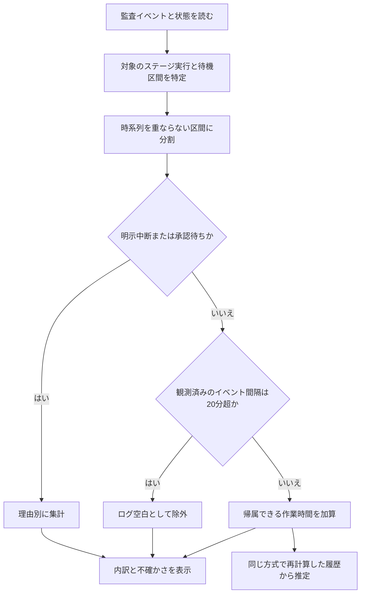

# ステージ時間の算出改善設計

日付: 2026-09-15
状態: 計算・API・内訳UI・説明ページを実装。20分方式を既定として使用する。
調査対象: 現チェックアウトのAIDLC Guide、同梱aidlc-workflows 2.8.2。
関連: [現行方式の初期設計](2026-07-27-stage-timing-design.md)、[利用者向け説明](../../guides/stage-timing.md)。

## 1. 決定と目的

既存監査ログから、承認待ち・明示中断を先に分離し、残る長いログ空白で作業区間を分ける。完了した実行も含め、算出値は「作業時間の推定」と呼ぶ。人の実作業時間、並列AIの総処理時間、完了予定時刻は算出しない。

初版は固定しきい値20分を既定とする。20分以下を作業候補、20分超を全区間除外する。設計後の「新しいロジックも実装して実際に動くように」という依頼に基づき、旧方式から切り替える。20分は休憩を正確に識別する値ではない。合成ログで算式を検証し、実ログで計算と表示の動作を確認する。しきい値の自動学習、勤務時間設定、手動タイマー、新しい監視・監査イベントは初版の範囲外。

### 既存処理の所有と変更範囲

| 既存の責務 | 現在の所有者 | 新設計での扱い |
| --- | --- | --- |
| ステージ開始・完了・放棄・スキップの対応付け | reader-core/timing/pairing.ts | 意味を維持。実行IDと監査位置を後段へ渡す |
| 1つの時間区間の作業を最大1つの実行へ割り当てる | reader-core/timing/attribution.ts | 不変条件を維持し、待機とログ空白の分類を追加 |
| 状態と今回の実行・履歴の照合 | reader-core/timing/stage-view.ts | 唯一の照合箇所を維持。新しい品質・内訳を付加 |
| 中央値とstage → phase → spaceのフォールバック | reader-core/timing/estimate.ts | 算式を維持し、実績採用条件・不明件数を追加 |
| 承認待ちの対象識別と対応付け | reader-core/effectiveness/derive.ts | 共通構文を使用し、旧集計を純関数へ抽出して維持。新計算は対象付き区間を使い、合計値を引き算しない |
| 読取APIと表示 | api-core / dashboard / vscode-extension | 同じTimingsPayloadを読む。画面ごとに再計算しない |

パスは `packages/` 配下を指す。エンジン、ハーネス、監査形式、状態ファイルは変更しない。

## 2. 要件と実現機構

| ID | 要件 | 実現機構 |
| --- | --- | --- |
| T-01 | 昼休憩・持ち越しを作業から分けられる | timing/policy.ts の gapThresholdMs、timing/classify.ts の観測間隔分類 |
| T-02 | 承認待ち・明示中断を理由別に扱う | audit/intervals.ts の対象付き区間導出、classify.ts の排他的分類 |
| T-03 | 他Unit・別attemptの待機を引かない | audit/intervals.ts のscope keyと世代境界 |
| T-04 | 実行中の無観測時間を確定作業にしない | TimingBreakdown.pendingObservationMs、NowStripと詳細の別表示 |
| T-05 | 二重計上・負数を防ぐ | 半開区間の分割、単一owner、区間の和集合 |
| T-06 | 履歴と現在を同一ルールで比較する | getStageTimingSamplesへ同じTimingPolicyを渡し、algorithmVersionで識別 |
| T-07 | 不明・参考値・除外を説明できる | TimingQuality、estimateCoverage、sampleExcludedCount |
| T-08 | 拡張内で算出方法を読める | docs/guides/stage-timing.md、既存guides一覧・検索・同梱 |
| T-09 | 既存の並列・再実行・時計ずれ処理を保つ | pairingの既存回帰・性質テストを新方式にも適用 |
| T-10 | 初回表示を遅らせない | 独立したgetTimingsと既存audit変更通知を維持。workflow読取へ全ログ走査を足さない |

## 3. 入力と監査の制約

読み取り元は `aidlc/spaces/<space>/intents/<record>/audit/*.md` と `aidlc-state.md`。現在選択したrecordが今回の経過、アクティブspace全体のrecordが推定用の実績になる。

### 現行コードで確認した制約

- `audit/events.ts` は Event / Timestamp / Stage / Workflow だけを保持する。Unit等を使うには読取を拡張する。
- `effectiveness/events.ts` はUnit / Attempt Generation / Gate Scope / Gate Stages / Recovered / Revalidated等を保持する別parserを持つ。
- セッション開始・再開にはSessionがあるが、`SESSION_ENDED` はReasonのみを出す。同一セッションの終了と再開を保証できない。
- 通常の `WORKFLOW_PARKED` はStage付き、`WORKFLOW_UNPARKED` はStageなし。どちらもrecordの中断状態に関するイベント。
- Team Unit checkoutのparkはローカル状態だけを更新する経路がある。すべての中断を監査から検出できるとは扱わない。
- `UNIT_PAUSED` / `UNIT_RESUMED` は子scopeに限定する。他Unitの作業停止を意味しない。
- `single-stage:` と明示されたイベントは主ワークフローから除外する。Workflowのない成果物イベントは単独実行との混在を完全に識別できない。
- 現行の10分定数は、時計ずれによる逆転pair救済にも使われる。作業区切りの20分に置き換えない。

### 正規化契約

新しい `audit/measurement-events.ts` に、本文を保持しない共通の構文読取を抽出する。timingとeffectivenessがそれぞれ必要な列へ投影し、消費側固有の除外ルールは分離する。effectivenessの現行出力は回帰テストで維持する。

共通イベントはevent、timestamp、time、shard、positionと、許可した計測フィールドを保持する。timingの追加対象はStage slug、Unit、Attempt Generation、Run floor、Gate Scope、Gate Stages、Recovered、Revalidated、Session、Target、Bolt slug、Bolt names。effectivenessが既に使用する許可フィールドも保持する。質問・回答・フィードバック本文は読取結果へ追加しない。

同一shard内の同時刻イベントは記載順を使用する。別shardの同時刻に再開始・待機・中断・解決の境界が混在し順序を確定できない場合、ファイル名から因果関係を推定しない。影響するrecordの新方式は不明とし、理由を表示する。未来のイベント・逆転救済・不正日時は品質情報に残す。

## 4. 実行と待機の対象

ステージ実行IDは `record + workflowEpoch + stage + attemptOrdinal`。ordinalはpairingが決める監査順で付け、読み取りのnowには依存させない。ジャンプや再実行後に古い実行を今回の実行として表示しない。

gate keyは `record + workflowEpoch + stageOrStageSet + unit + attemptGeneration + gateScope` を基本に、既存effectivenessの再実行epochを含める。Gate Stagesは重複除去・並べ替え済みの集合。Unitの識別があるものは子scopeに限定し、明示されていないUnit全体へ拡張しない。

フィールド欠落はワイルドカードとして扱わない。両端が同じlegacy形であり、候補が1つで世代境界をまたがない場合だけ対応付ける。片端だけに世代・Unitがある場合や複数候補がある場合は不明とする。

### 待機区間の生成

| 入力 | 処理 |
| --- | --- |
| STAGE_AWAITING_APPROVAL | 対応scopeの待機を開く。Recoveredは除外、Revalidatedは開始を動かさない |
| GATE_APPROVED / GATE_REJECTED | 同じscopeの待機を閉じる。却下後の修正は以後の作業候補 |
| WORKFLOW_PARKED / WORKFLOW_UNPARKED | record単位の中断を開閉する。UNPARKEDにStageがなくても同一recordで照合 |
| UNIT_PAUSED / UNIT_RESUMED / UNIT_COMPLETED | 同じUnit・generation・run floorの子scopeを開閉する |
| STAGE_STARTED / STAGE_JUMPED / WORKFLOW_STARTED / BOLT_STARTED | 既存effectivenessと同じ範囲の古い未解決gateを無効化する |
| SESSION_STARTED / RESUMED / ENDED | 詳細の補助情報のみ。待機開始・終了や作業の証拠にしない |

開始だけがあり、その後に矛盾する活動・世代変更がなければ「待機中」としてnowまで暫定表示する。完了実行に未解決の待機が残る、開始なく解決だけがある、明示中断中に同一scopeの活動がある場合は、復帰時刻を捏造せず品質を `incomplete` とし推定サンプルから除外する。

初版ではUnitの待機をステージ全体の停止へ昇格しない。1つでも別Unitが作業中なら、ステージは全面停止ではない。集合や帰属が不足する区間は `unattributedMs` とし、確認できた別Unitの作業を止めない。Unit別の工数推定は行わない。

`Attempt Generation` と `Run floor` は確認できる実行の対象と照合する。片側だけに値がある場合や値が異なる場合、その観測を作業・待機の端点にせず `incomplete` にする。2.8.2のUnitイベントが持つ `Run floor` は親の `STAGE_STARTED` にない場合がある。Unit-majorの境界を復元しない初版では、そのUnit観測を採用せず、確認できたステージの区間だけを参考表示する。この実行は所要時間の推定用サンプルへ入れない。

scopeの対応不足や中断中の矛盾では、分類できた区間の内訳を参考表示できる。時計ずれ・読み取り欠落・開始終了順序の不明とは区別し、後者では `activeMs` と `breakdown` をnullにする。どちらの `incomplete` も推定用実績には採用しない。

## 5. 区間の分類と作業への割り当て



図の読み方: 対象を特定し、待機・中断を分けてからログ空白を判定する。作業の推定と除外の内訳を作り、同じルールで履歴の所要時間を計算する。

### 5.1 時間の意味

内部計算はミリ秒。表示直前だけ丸める。各実行の観測窓は `[start, min(end ?? now, now))`、長さは `observedWallMs`。ログ上の開始から終了までの `wallMs` は別途維持し、時計ずれで負になる場合はnullにする。開始がnowより未来、または終了が開始より前ならbreakdownもnullとし、時計ずれを理由にサンプル不採用とする。正常な完了実行ではwallMsとobservedWallMsが等しい。

各実行の観測窓を、イベント、待機・中断境界、nowで半開区間に切る。まず既知待機・中断を除く観測済みの短い間隔を作業候補にし、5.3の規則で単一ownerへ配分する。その結果を使い、各実行の表示分類を次の優先順で一意に決める。

1. 対象が確認できた明示中断。
2. 対象が確認できた承認待ち。
3. 他実行へ実際に作業を配分した区間。unattributedへ入れる。
4. 開いた実行の、次の観測がまだない末尾。
5. しきい値を超える観測済みのログ空白。
6. その実行に割り当てた作業候補。
7. 残る帰属不明の時間。

中断とgateが重なる時間は中断へ一度だけ入れる。監査上のgate全区間は別の生区間として保持できるが、排他的内訳に重複加算しない。

正常に分類できた1実行について次を満たす。

```text
observedWallMs
  = workMs + approvalWaitMs + suspendedMs
  + excludedGapMs + pendingObservationMs + unattributedMs
```

同じrecordの作業区間は最大1つの実行だけが所有する。当該実行の既知待機・中断に属さず、作業を別実行に割り当てた区間は、当該実行ではunattributedになる。この関係は人・AIの並列処理量を測ったものではない。

ステージごとの観測窓や待機は互いに重なる。全体の待機は生区間の和集合で集計し、各ステージの待機値を単純加算しない。効果測定の既存gate合計は生の待機指標のまま維持する。

### 5.2 ログ空白の判定

既定ポリシー `session-gap-v2` の `gapThresholdMs = 20 * 60_000`。ちょうど20分は作業候補、20分超は間隔全体をexcludedGapへ入れる。ただし5.1の優先分類に従い、他実行へ配分済みの作業区間はunattributedに残す。旧方式の `min(gap, 10分)` や、休憩前に任意の数分を加える処理は併用しない。

作業候補の観測端点に使うイベントは、開始・完了、承認待ち開始、成果物作成・更新・再利用、レビュー依頼・完了、センサー発火・結果、対象Workflowが明示されたHUMAN_TURNとする。SUBAGENT_COMPLETED、PIPELINE_LINK_COMPLETED、QUESTION_ANSWERED、STAGE_REVISING、UNIT_STARTED / COMPLETEDも対象が一致する場合に使う。許可集合は `timing/policy.ts` に固定する。

既知の待機・中断の開始と終了は区間を切る制御端点であり、待機中のイベントで作業時計を再開しない。HEALTH_CHECKED、設定変更、セッションイベント、未認識イベントは作業の証拠として間隔を短くしない。これらで原時系列が分割されても、しきい値判定は前後の有効な観測端点間の間隔を用いる。

待機・中断は先に候補区間から外し、その前後を別の観測間隔とする。例えば12:00に作業記録、12:05に中断、13:00に再開、13:05に作業記録なら、5分 + 中断55分 + 5分に分ける。先に65分を丸ごとログ空白として除外しない。

### 5.3 並行ステージ

現在のsliceOwnerを基に、区間終端のイベントが示す作業先へ割り当てる。完了イベントは閉じる実行、明示Stage/Unitのあるイベントはそのscopeを優先し、存在しない実行へは割り当てない。開始・スキップ直前の時間を新しい実行へ付けない。

Stageのない作業イベントは、直近に開始した作業可能な実行へ割り当て、帰属が推定であることを品質に記録する。既知の全面待機・中断を持つ実行を候補から外す。Unitが指定され帰属不能の場合は、別Unitや直近実行へフォールバックしない。

他ステージの活動で、無ログの実行を作業中と判断しない。間隔の評価は帰属候補の実行ごとの有効観測端点で行い、配分する時間は全体の重ならない区間から取る。別実行のイベントや制御端点で細分化されても、長い空白の判定を短い作業間隔へ変えない。

同じStageの同時実行は現行pairingでは別Unitの工数として表現できない。既存の二重開始の放棄扱いを維持し、曖昧な実行を推定母集団へ入れない。

### 5.4 実行中の末尾

最後の有効な観測または制御境界からnowまでのうち、既知中断・承認待ち・他実行への作業配分を除いた区間をpendingObservationへ分類し、workへ加算しない。端点だけの実行には `workMs = 0` と「観測待ち」を併記する。

「最終記録からの経過」は有効な最終観測日時からnowまでの単純差であり、内訳のpendingObservationとは別の参考表示にする。StageViewへ `lastObservationAt` と `sinceLastObservationMs` を追加し、reader-coreで一度だけ算出する。並行実行では参考表示の時間を内訳の合計に加えない。

次のイベント到着時に観測間隔が閉じ、20分以下なら作業候補、20分超ならexcludedGapになる。候補実行が複数ある場合も、pendingを作業へ多重加算しない。閉じた実行のpendingは0。経過の表示が20分経過だけで増減しない。

### 5.5 時計ずれと欠損

`CLOCK_SKEW_RECOVERY_WINDOW_MS = 10 * 60_000` をpairing専用に分離し、現行の逆転救済窓を変えない。逆転救済された0分は品質を `recovered-boundary` とし推定母集団から除外する。

不正日時、読み取り欠落、境界順序の曖昧さがあるrecordでは新方式の合計を確定しない。取得できた詳細は警告付きで示せるが、作業の代表値はnullとし、他recordの正常な実績から所要時間だけを推定できる。部分ログに無理に整合式を適用しない。

## 6. データ契約とモジュール変更

以下の型を共有型とAPIへ追加した。旧fixtureとの互換性のため追加フィールドは型上任意とするが、新しいreader出力は必ず値を返す。

```ts
interface TimingPolicy {
  algorithmVersion: "session-gap-v2";
  gapThresholdMs: number;
}

interface TimingBreakdown {
  observedWallMs: number;
  workMs: number;
  approvalWaitMs: number;
  suspendedMs: number;
  excludedGapMs: number;
  pendingObservationMs: number;
  unattributedMs: number;
}

interface TimingQuality {
  status: "usable" | "limited" | "incomplete";
  reasons: string[];
  sampleEligible: boolean;
}
```

- StageTimingへ `runId`、`breakdown: TimingBreakdown | null`、`quality` を追加する。
- StageTiming.activeMsは `number | null` に広げ、breakdownが有効ならworkMsと一致させる。不明を0にしない。
- StageTiming.wallMsも `number | null` とし、逆転・未来開始で不明な時間を表現する。時計ずれ時の表示は数値0ではなく理由付きの不明にする。
- TimingsPayloadへ `policy`、`estimateCoverage: { known: number; unknown: number }` を追加する。件数は未完了・未スキップで残りの対象になるステージだけを数える。
- StageViewへbreakdown、quality、`sampleExcludedCount`、`sensitivity: { thresholdMs: number; workMs: number | null }[]` を渡す。
- `actualActiveMs` は終了した今回実行のworkMsを指す既存互換名として維持するが、画面文言は「作業時間の推定」にする。名前が実測を意味しないことを型コメントに残す。
- API、postMessage、ブラウザ、副経路のCLI、全UIとfixtureを同じ変更で更新する。nullを数値演算へ流さない。

感度比較は同じ境界・生区間へ10分・20分・30分の3ポリシーを適用する。解析・ソートを3回しない。数学的な上下限や信頼区間とは表示しない。

| モジュール | 変更 |
| --- | --- |
| audit/measurement-events.ts | 既存parserの共通構文抽出。必要列だけ保持 |
| audit/intervals.ts | 対象付きのgate・中断区間と診断を返す純関数 |
| timing/policy.ts | 作業端点の許可集合、アルゴリズム版、比較しきい値 |
| timing/classify.ts | 半開区間の分類、所有、内訳と品質の導出 |
| timing/pairing.ts | 実行ID、専用時計ずれ定数。既存対応付けは維持 |
| timing/derive.ts / read.ts | パイプライン合成。選択recordとspaceサンプルへ同じpolicy |
| timing/stage-view.ts / estimate.ts | 新しい内訳・null・実績採用条件・残りの部分集計 |
| shared-types | 上記契約と低信頼判定の共通化 |
| dashboard / vscode-extension | 表示・説明リンク・未確定末尾。計算は持たない |

## 7. 過去実績と残り時間

過去の生ログを新方式で再計算し、新旧の作業時間を混ぜない。永続的なタイムトラッキングDBや監査への書き戻しは追加しない。キャッシュを設ける場合のキーはrecord、監査revision、algorithmVersion、gapThresholdMsを含める。実行中のnow依存部分は読み取りごとに更新する。

実績採用条件は、完了済み、代表値がnullでない、境界・対象が対応付くこと。以下は除外する。

- 放棄・スキップ・単独実行・逆転救済で作られた実行。
- ログ欠損、曖昧なscopeや境界、完了後も未解決の待機がある実行。
- `workMs = 0` かつログ空白または帰属不能区間が正の実行。26分の無ログ処理を0分の高速実績にしない。

一部の長い空白を除外した実行は採用可能だが、品質はlimitedとする。短時間で境界が同秒になり、欠損も除外もない0分は採用できる。サンプル数は採用した実行数とし、除外件数も返す。

同じstage → 同じphase → 同じspaceの中央値を維持する。phase対応は表示中のワークフローのステージ表を使う。対象外slugの履歴はspace全体の実績だけに参加する。初版でモデル・タスク規模・scopeによる統計補正は追加しない。

同じstageの採用数が2未満、他stageへフォールバック、採用実績または今回の品質がlimitedの場合に「参考値」を付ける。参考値判定はshared-typesに一元化する。

残りは次の優先順位で決める。pendingは引かず、ゲートの所要時間を残り作業へ追加しない。

| 条件 | 残り |
| --- | --- |
| 完了・スキップ・対象外、または作業時間を算出でき、状態と一致する今回の終了済み実行 | 0 |
| 今回の実行がない。未開始やジャンプ後の再実行待ちも含む | 推定所要時間の全量。推定がなければnull |
| 今回の実行があり、workMsまたは推定所要時間が不明 | null |
| 今回の実行があり、両方が既知。待機中も含む | `max(0, estimate - workMs)` |

完了・スキップと、作業時間を算出できて状態が今回の終了済み実行に対応するものは残り0。別attemptの終端や時計・ログ欠損により終了を確認できず、状態も完了を示さない場合は残りnull。予測超過して残り0でも未完了なら「見積り超過」と表示し、完了と区別する。全体は既知の残りを合計し、不明が1件でもあれば「推定できた工程のみ」を付ける。対象があるのに全件不明ならnull、未完了の対象が0件なら0。

## 8. 表示と説明への導線

| 表示場所 | 実装した仕様 |
| --- | --- |
| StageRail | 終了した今回実行は `15m 作業推定`。未終了は `≈20m 所要推定`。参考値と未記録を区別 |
| NowStrip | 観測済みの作業推定と残り。末尾があれば「最終記録から7分」を別表示 |
| ステージ詳細 | 「時間の内訳」に観測窓・排他的内訳・品質理由・採用/除外サンプル件数を表示 |
| 感度比較 | 詳細に10/20/30分の結果。「設定による変動幅」と明記 |
| 全体の残り | 件数不足の部分合計を明示。予定時刻は出さない |
| VS Codeステータスバー | コンパクトな作業推定/残り。tooltipに末尾・不明理由。新しい再計算は持たない |
| 説明リンク | 詳細の「算出方法」から既存guide遷移でstage-timing.mdを開く |

既知のゼロは `0分`、正の1分未満は `1分未満`、不明は `—`。既存formatDurationを全用途へ無条件変更せず、時間内訳用の表示契約と既存消費箇所を確認する。色だけで品質を示さず、キーボード操作と狭い画面でも読めるようにする。

初版の公開設定UIは追加しない。20分は既定値で、詳細の感度比較は読取専用。説明ページは拡張機能ドキュメントの既存遷移から開く。

## 9. 受入ケース

下表は単独ステージ、時刻は同一タイムゾーン、明記のない境界・scopeは正常とする。T=20分。各「イベント」は有効な作業端点を表す。

| ID | 入力 | 新方式の期待値 |
| --- | --- | --- |
| A-01 | 11:50開始、12:00、13:00、13:10完了 | 観測80分、work20分、gap60分 |
| A-02 | 18:00開始、18:10、翌09:00、09:15完了 | 観測915分、work25分、gap890分 |
| A-03 | 10:00開始、10:05、10:10完了。途中5分は実際には休憩 | work10分。短い休憩を識別できないことを表示で説明 |
| A-04 | 10:00開始、10:26完了。実際にはAI処理 | work0分、gap26分、サンプル不採用 |
| A-05 | 10:00開始、10:10、10:15待機、10:45承認・完了 | work15分、gate30分、観測45分 |
| A-06 | 10:00開始、10:05待機、10:10中断、10:30再開、10:40承認・完了 | work5分、gate15分、suspended20分。合計40分 |
| A-07 | 10:00開始、10:10待機、10:20却下、10:25修正、10:30完了 | work20分、gate10分。却下後を同じ待機にしない |
| A-08 | 10:00開始、10:05、now10:12 | work5分、pending7分。次が10:15ならwork15分、10:30ならwork5分/gap25分 |
| A-09 | 開始から完了まで20分 / 20分1ms | 前者work20分。後者work0/gap全量/サンプル不採用 |
| A-10 | 23:58開始、翌00:03完了 | work5分。日付では区切らない |
| A-11 | Aはgate待機、Bは作業。並列Unitも含む | Bへ割り当てた作業をAから引かず、AのgateをBへ移さない |
| A-12 | 新attempt開始後に古いgateの承認 | 新attemptの待機を閉じず、診断とサンプル除外 |
| A-13 | 中断開始のないUNPARKED、またはSessionなしのENDED | 休憩を推測で生成しない。前者は不完全、後者は補助情報 |
| A-14 | 別shard同秒の開始・承認境界、逆転救済、未来日時 | 順序・時計品質を記録し、曖昧/救済実績を採用しない |
| A-15 | single-stage明示イベント、Workflowなしの混在 | 明示分は除外。識別できない混在の限界を説明 |
| A-16 | 3工程中1工程は残り不明、既知は5分と8分 | 合計13分、known2/unknown1、「推定できた工程のみ」 |
| A-17 | 原間隔60分の途中にHEALTH_CHECKEDが毎分 | work0/gap60分。背景記録で長い空白を埋めない |
| A-18 | Unit A中断中、同StageのUnit Bが作業 | Aの中断でStage全体を停止扱いしない。帰属不足はunattributed |
| A-19 | 同一ログをT=10/20/30で比較 | 出力はpolicy別。中央値・キャッシュに別policyを混ぜない |
| A-20 | ログ欠損、全履歴不採用、全ステージ完了 | 欠損の作業はnull、履歴なしの予測はnull、完了後の残りは0 |
| A-21 | Aは10:00開始、10:05にAの記録。Bは10:06開始、10:10完了。now10:12 | Aは観測12分/work5分/unattributed4分/pending3分。最終記録からの参考表示は7分。Bはwork4分 |
| A-22 | 推定15分で未開始、ジャンプ後の再開待ち、実行中だがログ欠損 | 前2つの残りは15分。最後だけ残りnull |

追加の不変条件は、全値非負、各実行の分類合計一致、record全体の作業の非重複、入力順を正規化した決定性、単独実行除外、異なるrecordの実行を今回として扱わないこと。

## 10. 実装順と検証

1. 共通の構文読取・対象付き区間を抽出し、effectivenessの既存結果が変わらないことを確認。
2. 時計ずれ定数を分離し、pairingの回帰結果を維持。
3. 新しい分類器・内訳・品質を実装。上表の例と既存timingの性質テストで確認。
4. 生ログの読取だけで現行値と新方式を並べ、昼休憩・持ち越し・無ログ処理の正解を確認できる実例で誤差を比較。正解が不明な記録から精度改善を主張しない。
5. 実績採用・再計算・部分合計・全UIを更新。説明ページの未実装表示と導入状態を同期。
6. `bun run check` を品質ゲートとして実行。初回表示3秒以内、変更反映2秒以内という既存目標に対する計測を継続。

4の比較では、長時間無ログ処理の過小計上、小休憩の残留、サンプル除外による予測不能件数、10/20/30分での値の変化を記録する。今回20分方式へ切り替え、10分・30分での感度も表示する。実作業の正解付きデータによるしきい値の調整は今後の検証事項とする。

## 11. 今回の文書変更の確認

利用者向けページは20分方式を現在の計算として説明し、10分上限方式は以前の計算として区別する。Mermaidには同内容の文章を添え、図が描画されない環境でも例を読めるようにする。現行方式・新方式の掲載値、相対リンク、拡張内一覧・検索・同梱、図の構文と描画を確認する。

旧設計は履歴として残し、本設計への案内を追加する。公式aidlc-workflows文書のミラーには書かない。文書のみのPRを作る場合はrelease:skipを使い、拡張のversionを手動変更しない。

### 設計・文書のみを追加した時点の検証記録

- 本書と説明ページのMermaid計5図を構文検証。説明ページの4図は実際のDashboardで描画し、フォールバック0件を確認した。
- 昼休憩・持ち越し・承認待ちの現行値30分・30分・25分を、合成ログに対する現行deriveStageTimingsの実行で確認した。新方式の数値は本書の受入期待値であり、未実装コードのテスト結果ではない。
- 新規文書の相対リンク、文字化け、拡張内一覧・本文・質問検索、同梱用コピーとのハッシュ一致を確認した。
- 文書関連の既存13テスト、Dashboardビルド、lint、整形、型チェック、文書索引、監査シャード確認、依存監査は通過した。
- `bun run check` 全体は2回実行し、既存テストのタイムアウト・ファイルロック・非同期結果待ちなどで未通過。最終実行は2,979件成功・19件失敗・6件スキップ。初回に失敗した3ファイルを個別再実行した54件はすべて通過した。全体実行での失敗原因は未特定で、今回の文書変更で解消したとは扱わない。

### 実装後の検証結果

- `VITEST_MAX_WORKERS=2` を指定した `bun run check` が通過。179ファイル、3,083テスト成功、6件スキップ。lint、整形、型検査、文書索引、カバレッジ条件、監査シャード確認、依存監査も通過した。テストの制限時間や合格条件は変更していない。
- 昼休憩20分、翌日持ち越し25分、承認待ちの分離、中断との重複、未観測末尾、しきい値境界、並行ステージ、背景イベント、旧attempt混入を実装のテストで確認した。API・履歴・残り時間・画面の契約も検証した。
- 独立レビューで見つかった、旧attemptの作業・承認待ちの混入、中断中のUnit記録による加算、別StageのUnit再開、異なるattemptの終了による残り0を修正し、再現テストを追加した。
- 既存の5記録・10,561イベントを読み取り専用で確認。130完了実行の品質はusable 26件、limited 79件、incomplete 25件。推定用に105件を採用し25件を除外した。全実行の内訳合計の不一致は0件。
- 同じ実ログの作業合計は旧方式2,759.63分、新20分方式1,603.55分。10分・30分の比較値は1,413.13分・1,648.25分。不完全な実行の参考値も含む比較であり、実作業の正解が不明なため精度改善の証拠にはしない。
- 最終コードのAPI相当の読取は初回451ms、同一processの2回目351ms。起動・描画は含まず、OSキャッシュは制御していない。実データの初回全体表示3秒・変更反映2秒の性能保証とは区別する。
- ビルドしたDashboardで時間内訳・品質理由・10/20/30分比較・説明リンクを確認。説明ページの4図はSVGとして描画され、フォールバック0件だった。図が読めない環境向けの文章も併記した。
- `bun run package:extension` でVSIXを作成。説明ページと同梱コピーのハッシュ一致を確認。拡張機能のversion、監査・状態・エンジンは変更していない。インストールと公開は実施していない。
